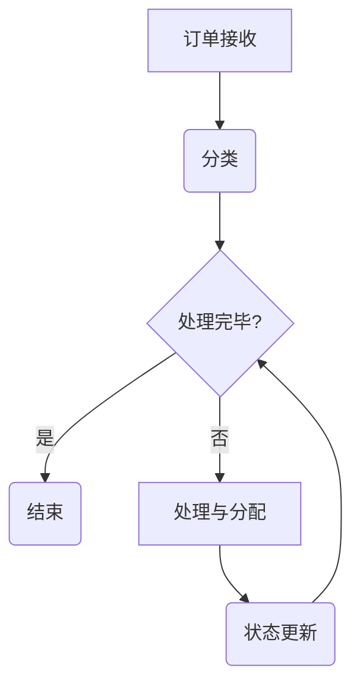
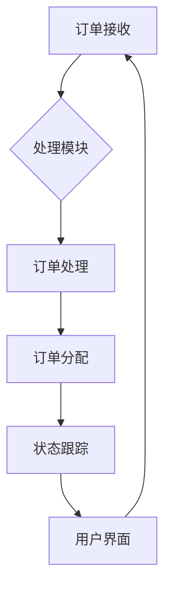
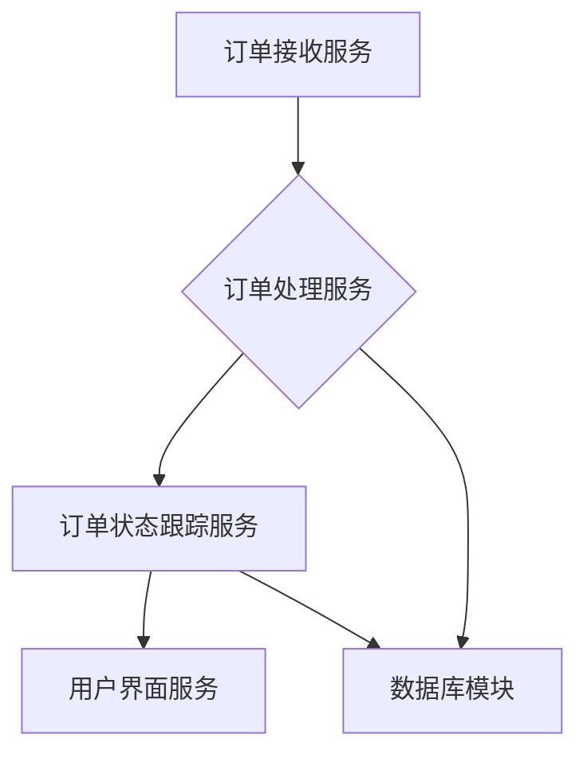

                 


### 文章标题：智能订单处理系统：一人公司提高运营效率的自动化解决方案

#### 关键词：
- 智能订单处理系统
- 自动化解决方案
- 一人公司
- 运营效率
- 技术实现

#### 摘要：
本文将探讨如何通过构建智能订单处理系统，帮助一人公司实现订单处理的自动化，从而提升运营效率。文章将从系统概述、技术基础、订单处理算法设计、系统集成与测试、项目实战和未来展望等方面展开，提供全面的自动化解决方案。

### 目录

#### 第一部分：智能订单处理系统基础

##### 第1章：智能订单处理系统概述
- **1.1 智能订单处理系统的定义与重要性**
- **1.2 智能订单处理系统的基本架构**
- **1.3 一人公司的运营特点与需求分析**

##### 第2章：订单处理流程自动化
- **2.1 订单接收与分类**
  - **2.1.1 自动化订单接收**
  - **2.1.2 订单分类策略**
- **2.2 订单处理与分配**
  - **2.2.1 订单处理算法设计**
  - **2.2.2 自动化订单分配机制**
- **2.3 订单状态跟踪与更新**
  - **2.3.1 订单状态监控**
  - **2.3.2 自动化状态更新**

#### 第二部分：智能订单处理系统实现

##### 第3章：技术基础
- **3.1 编程语言选择**
  - **3.1.1 Python的优越性**
  - **3.1.2 其他编程语言概述**
- **3.2 数据库选择**
  - **3.2.1 关系型数据库**
  - **3.2.2 非关系型数据库**

##### 第4章：订单处理算法设计
- **4.1 订单接收与分类算法**
  - **4.1.1 数据清洗与预处理**
  - **4.1.2 伪代码设计**
- **4.2 订单处理与分配算法**
  - **4.2.1 伪代码设计**
  - **4.2.2 实际案例**
- **4.3 订单状态跟踪与更新算法**
  - **4.3.1 伪代码设计**
  - **4.3.2 实际案例**

##### 第5章：系统集成与测试
- **5.1 系统集成**
  - **5.1.1 系统模块划分**
  - **5.1.2 系统集成方案**
- **5.2 系统测试**
  - **5.2.1 单元测试**
  - **5.2.2 集成测试**
  - **5.2.3 性能测试**

##### 第6章：项目实战
- **6.1 实战背景**
  - **6.1.1 实际业务需求**
  - **6.1.2 项目目标**
- **6.2 系统开发**
  - **6.2.1 开发环境搭建**
  - **6.2.2 源代码详细实现**
  - **6.2.3 代码解读与分析**
- **6.3 系统部署与运维**
  - **6.3.1 部署流程**
  - **6.3.2 运维策略**

##### 第7章：未来展望与改进
- **7.1 智能订单处理系统的未来发展方向**
- **7.2 技术挑战与解决方案**
- **7.3 一人公司的运营效率提升策略**

### 附录

- **附录A：智能订单处理系统开发工具与资源**
  - **A.1 开发工具选择**
    - **A.1.1 Python库与框架**
    - **A.1.2 数据库管理工具**
  - **A.2 学习资源推荐**
    - **A.2.1 书籍推荐**
    - **A.2.2 线上课程推荐**
  - **A.3 社区与支持**
    - **A.3.1 技术社区介绍**
    - **A.3.2 常见问题解答**

### Mermaid 流程图



### 订单处理算法设计伪代码

```plaintext
function processOrder(order):
    # 数据清洗与预处理
    cleaned_order = preprocessOrder(order)
    
    # 订单分类
    category = categorizeOrder(cleaned_order)
    
    # 订单处理与分配
    assigned_order = assignOrder(cleaned_order, category)
    
    # 订单状态跟踪与更新
    updateOrderStatus(assigned_order)
```

### 数学模型与公式

$$
\text{处理速度} = \frac{\text{订单数}}{\text{处理时间}}
$$

### 数学公式与详细讲解

#### 订单处理速度公式

订单处理速度是衡量智能订单处理系统效率的重要指标。它表示在单位时间内处理的订单数量。处理速度可以通过以下公式计算：

$$
\text{处理速度} = \frac{\text{订单数}}{\text{处理时间}}
$$

其中：
- **订单数**：在指定时间段内系统处理的订单数量。
- **处理时间**：系统处理订单的总时间。

举例说明：

假设一个智能订单处理系统在1小时内处理了100个订单，那么其处理速度为：

$$
\text{处理速度} = \frac{100\text{个订单}}{1\text{小时}} = 100\text{个订单/小时}
$$

该公式提供了评估系统效率的基础。提高处理速度可以通过优化算法、提升硬件性能、增加系统资源等方式实现。

### 第一部分：智能订单处理系统基础

#### 第1章：智能订单处理系统概述

##### 1.1 智能订单处理系统的定义与重要性

智能订单处理系统（Intelligent Order Processing System，简称IOPS）是一种集成人工智能（AI）技术，用于自动化订单接收、处理、分配和跟踪的系统。它通过对订单数据的智能分析和处理，提高订单处理的效率、准确性和灵活性。

在当今信息化和数字化的时代，订单处理是企业运营中的重要环节。传统的订单处理方式往往依赖于人工操作，不仅效率低下，还容易出错。而智能订单处理系统通过引入人工智能技术，可以实现以下目标：

1. **提高处理速度**：智能订单处理系统能够快速接收、处理和分配订单，显著缩短订单处理时间。
2. **减少人工干预**：通过自动化处理，减少对人工的依赖，降低人工操作出错的风险。
3. **提高处理准确性**：智能订单处理系统基于数据分析，能够更准确地处理订单，减少错误率。
4. **提升用户体验**：智能订单处理系统可以提供实时订单状态更新，提高客户满意度。

智能订单处理系统在多种行业和应用场景中具有重要性。例如，在电子商务领域，智能订单处理系统可以帮助商家快速处理大量订单，提高物流效率，降低成本；在制造业领域，智能订单处理系统可以优化生产计划，提高生产效率；在服务业领域，智能订单处理系统可以提升客户服务体验，增加客户忠诚度。

##### 1.2 智能订单处理系统的基本架构

智能订单处理系统的基本架构通常包括以下几个主要模块：

1. **订单接收模块**：负责接收来自不同渠道的订单信息，如电子邮件、API接口、短信等。该模块需要具备高并发处理能力，能够快速接收和处理大量订单。
2. **订单处理模块**：负责对接收到的订单进行数据处理和分类。该模块包括数据清洗、数据转换和数据验证等功能，以确保订单数据的准确性和完整性。
3. **订单分配模块**：根据订单处理规则和业务需求，将订单分配给相应的处理人员或处理环节。该模块需要考虑订单的紧急程度、优先级等因素，实现智能化的订单分配。
4. **订单状态跟踪模块**：负责实时监控订单的状态，包括订单的创建、处理、发货、退货等状态。该模块需要与订单处理模块紧密集成，实现订单状态的自动化更新。
5. **用户界面模块**：提供用户操作界面，用户可以通过界面查看订单状态、历史订单等信息，并与系统进行交互。

智能订单处理系统的基本架构如图1-1所示。



##### 1.3 一人公司的运营特点与需求分析

一人公司，顾名思义，是指由单一个体（通常为创始人或经营者）独立运营的企业。这种企业模式具有以下几个特点：

1. **规模较小**：一人公司的规模通常较小，员工数量较少，组织结构相对简单。
2. **业务多样**：一人公司通常涉及多种业务领域，需要具备多元化的运营能力。
3. **灵活性高**：一人公司具有高度灵活性，可以根据市场变化和自身需求快速调整业务策略。
4. **管理难度大**：由于一人公司缺乏专业的团队支持，管理者需要承担更多的职责，管理难度较大。

对于一人公司来说，智能订单处理系统的需求主要体现在以下几个方面：

1. **自动化订单处理**：一人公司的经营者需要快速处理大量订单，提高工作效率。智能订单处理系统可以自动化接收、处理和分配订单，减少人工干预，提高处理速度。
2. **实时状态监控**：一人公司的经营者需要实时了解订单状态，以便及时调整运营策略。智能订单处理系统可以实时更新订单状态，提供实时监控功能。
3. **数据分析与优化**：一人公司可以通过智能订单处理系统收集订单数据，进行分析和挖掘，优化业务流程，提高运营效率。
4. **成本控制**：智能订单处理系统可以减少人工成本，提高运营效率，有助于一人公司实现成本控制。

总之，智能订单处理系统对于一人公司的运营具有重要的作用，可以帮助经营者提高工作效率、降低成本、优化业务流程，从而实现持续发展。

### 第二部分：智能订单处理系统实现

#### 第3章：技术基础

##### 3.1 编程语言选择

在构建智能订单处理系统时，选择合适的编程语言至关重要。不同的编程语言具有各自的优缺点，适用于不同的应用场景。本文将介绍几种常用的编程语言，并分析它们在智能订单处理系统中的适用性。

**3.1.1 Python的优越性**

Python是一种高级编程语言，具有简洁、易学、易读的特点。以下是Python在智能订单处理系统中的优越性：

1. **丰富的库和框架**：Python拥有丰富的库和框架，如Django、Flask、TensorFlow、PyTorch等，可以帮助开发者快速构建智能订单处理系统。
2. **数据分析和机器学习**：Python在数据分析和机器学习领域具有强大的功能，适用于处理大量订单数据，实现智能分析和预测。
3. **跨平台支持**：Python是一种跨平台编程语言，可以在多种操作系统上运行，方便开发者进行开发和部署。
4. **社区支持**：Python拥有庞大的社区支持，开发者可以方便地获取帮助和资源。

因此，Python是构建智能订单处理系统的理想选择。

**3.1.2 其他编程语言概述**

除了Python，还有其他一些编程语言也可以用于构建智能订单处理系统。以下是一些常见的编程语言及其特点：

1. **Java**：Java是一种广泛使用的编程语言，具有高性能、稳定性强、安全性高的特点。Java适用于构建复杂、大规模的智能订单处理系统。
2. **C#**：C#是一种由微软开发的编程语言，具有高效、安全、易于维护的特点。C#适用于构建Windows平台上的智能订单处理系统。
3. **JavaScript**：JavaScript是一种前端编程语言，适用于构建基于Web的智能订单处理系统。JavaScript与HTML和CSS相结合，可以实现丰富的用户交互体验。
4. **Go**：Go（又称Golang）是一种由谷歌开发的新兴编程语言，具有高性能、简洁、易于维护的特点。Go适用于构建需要高并发处理的智能订单处理系统。

总之，不同的编程语言具有各自的优缺点，适用于不同的应用场景。开发者应根据项目需求、技术栈和团队熟悉程度等因素，选择最合适的编程语言。

##### 3.2 数据库选择

在构建智能订单处理系统时，数据库的选择至关重要。数据库负责存储和管理订单数据，确保数据的持久性和安全性。以下介绍几种常用的数据库类型，并分析它们在智能订单处理系统中的适用性。

**3.2.1 关系型数据库**

关系型数据库（Relational Database Management System，简称RDBMS）是一种使用SQL（Structured Query Language）进行数据管理和查询的数据库。以下是关系型数据库在智能订单处理系统中的适用性：

1. **数据一致性**：关系型数据库通过约束和规范化确保数据的一致性和完整性。
2. **强大的查询功能**：关系型数据库支持复杂查询，可以方便地实现数据的筛选、排序和聚合。
3. **广泛的应用场景**：关系型数据库适用于处理结构化数据，适用于大多数企业应用。

常见的开源关系型数据库包括MySQL、PostgreSQL和MariaDB。这些数据库具有高性能、稳定性和安全性，适用于构建智能订单处理系统。

**3.2.2 非关系型数据库**

非关系型数据库（NoSQL Database）是一种不依赖于固定表结构进行数据存储和查询的数据库。非关系型数据库适用于处理大规模、分布式数据，具有以下特点：

1. **灵活性**：非关系型数据库可以根据需求灵活地调整数据结构，适应不同的应用场景。
2. **高性能**：非关系型数据库通常采用分布式存储和查询机制，具有高性能和高并发处理能力。
3. **高扩展性**：非关系型数据库易于水平扩展，可以方便地增加存储和处理能力。

常见的非关系型数据库包括MongoDB、Cassandra和Redis。这些数据库适用于处理大量订单数据，特别是在需要高并发处理和实时数据分析的场景中。

总之，关系型数据库和非关系型数据库各具优缺点，适用于不同的应用场景。开发者应根据项目需求、数据结构和性能要求等因素，选择最合适的数据库。

### 第三部分：订单处理算法设计

#### 第4章：订单处理算法设计

##### 4.1 订单接收与分类算法

订单接收与分类算法是智能订单处理系统中的核心组件，负责处理订单的接收、清洗、分类和存储。以下将详细介绍这些算法的设计和实现。

**4.1.1 数据清洗与预处理**

在接收订单数据时，首先需要对数据进行清洗和预处理，以确保数据的质量和准确性。数据清洗与预处理的步骤包括：

1. **数据格式转换**：将不同格式的订单数据转换为统一的格式，如JSON或XML。
2. **数据去重**：去除重复的订单数据，避免处理重复订单。
3. **数据校验**：对订单数据进行校验，确保订单信息的完整性，如订单编号、客户姓名、商品名称等。
4. **缺失值处理**：处理订单数据中的缺失值，可以选择填充默认值或丢弃异常数据。

数据清洗与预处理算法的伪代码如下：

```plaintext
function preprocessOrder(order):
    # 数据格式转换
    order = convertToUniformFormat(order)
    
    # 数据去重
    order = removeDuplicates(order)
    
    # 数据校验
    if not isValidOrder(order):
        return null
    
    # 缺失值处理
    order = handleMissingValues(order)
    
    return order
```

**4.1.2 订单分类策略**

订单分类是智能订单处理系统的重要环节，根据订单的不同特征，将其分类到不同的处理队列。常见的订单分类策略包括：

1. **基于订单类型分类**：根据订单类型（如普通订单、紧急订单、退货订单等）进行分类。这种策略简单直观，适用于订单类型较少的场景。
2. **基于客户等级分类**：根据客户等级（如VIP客户、普通客户等）进行分类。VIP客户可以优先处理，提高客户满意度。
3. **基于订单金额分类**：根据订单金额（如订单金额大于1000元、小于1000元等）进行分类。高金额订单可以优先处理，以确保重要订单的及时完成。

订单分类算法的伪代码如下：

```plaintext
function categorizeOrder(order):
    # 基于订单类型分类
    category = getOrderId(order)
    if category == '紧急订单':
        return '紧急队列'
    elif category == '退货订单':
        return '退货队列'
    else:
        return '普通队列'
    
    # 基于客户等级分类
    customerLevel = getCustomerLevel(order)
    if customerLevel == 'VIP':
        return 'VIP队列'
    else:
        return '普通队列'
    
    # 基于订单金额分类
    orderAmount = getOrderAmount(order)
    if orderAmount > 1000:
        return '高金额队列'
    else:
        return '普通队列'
```

**4.1.3 订单存储**

在完成数据清洗、分类和存储后，订单数据将被存储在数据库中，以便后续处理和查询。以下是订单存储的步骤：

1. **创建数据库表**：根据订单数据的特点，创建合适的数据库表，包括订单基本信息表、订单详情表等。
2. **数据插入**：将清洗后的订单数据插入到数据库表中，确保数据的一致性和完整性。
3. **数据索引**：为订单表创建索引，提高查询性能。

订单存储的伪代码如下：

```plaintext
function storeOrder(order):
    # 创建数据库表
    createOrderTable()
    
    # 数据插入
    insertOrder(order)
    
    # 数据索引
    createOrderIndex()
```

##### 4.2 订单处理与分配算法

订单处理与分配算法负责将分类后的订单分配给相应的处理人员或处理环节。以下将介绍订单处理与分配算法的设计和实现。

**4.2.1 订单处理算法**

订单处理算法根据订单的优先级和处理规则，对订单进行智能处理。以下是一个简单的订单处理算法：

1. **优先级排序**：根据订单的紧急程度、客户等级等因素，对订单进行优先级排序。
2. **处理规则**：根据订单类型和处理规则，执行相应的处理操作，如生成订单详情、安排发货等。
3. **状态更新**：更新订单状态，记录订单的处理进度。

订单处理算法的伪代码如下：

```plaintext
function processOrder(order):
    # 优先级排序
    order = sortOrdersByPriority(order)
    
    # 处理规则
    if order.type == '普通订单':
        processRegularOrder(order)
    elif order.type == '紧急订单':
        processUrgentOrder(order)
    elif order.type == '退货订单':
        processReturnOrder(order)
    
    # 状态更新
    updateOrderStatus(order)
```

**4.2.2 自动化订单分配机制**

自动化订单分配机制根据订单的优先级、处理人员和业务规则，将订单自动分配给合适的处理人员或处理环节。以下是一个简单的自动化订单分配机制：

1. **计算处理能力**：根据处理人员的处理能力和当前工作量，计算其可处理的订单数量。
2. **分配订单**：根据订单的优先级和处理能力，将订单自动分配给合适的处理人员。
3. **处理反馈**：记录订单的处理结果和反馈，以便后续优化。

自动化订单分配机制的伪代码如下：

```plaintext
function assignOrder(order):
    # 计算处理能力
    availableStaff = calculateStaffCapacity()
    
    # 分配订单
    assignedOrder = assignOrderToStaff(order, availableStaff)
    
    # 处理反馈
    updateOrderProcessingFeedback(assignedOrder)
```

##### 4.3 订单状态跟踪与更新算法

订单状态跟踪与更新算法负责实时监控订单的状态，并自动更新订单状态。以下将介绍订单状态跟踪与更新算法的设计和实现。

**4.3.1 订单状态监控**

订单状态监控算法通过轮询数据库或使用消息队列，实时监控订单的状态。以下是一个简单的订单状态监控算法：

1. **轮询数据库**：定期查询数据库，获取最新的订单状态。
2. **消息队列**：使用消息队列（如Kafka、RabbitMQ等），接收和处理订单状态变更的消息。

订单状态监控算法的伪代码如下：

```plaintext
function monitorOrderStatus(orderId):
    # 轮询数据库
    order = getOrderStatusFromDatabase(orderId)
    
    # 消息队列
    while True:
        message = receiveOrderStatusMessage(orderId)
        if message:
            order.status = message.status
            updateOrderStatusInDatabase(order)
```

**4.3.2 自动化状态更新**

自动化状态更新算法根据订单的处理结果和状态变更，自动更新订单状态。以下是一个简单的自动化状态更新算法：

1. **状态变更检测**：检测订单状态的变更，如订单创建、处理中、已完成等。
2. **更新数据库**：将订单状态更新到数据库中，以便后续查询和使用。

自动化状态更新算法的伪代码如下：

```plaintext
function updateOrderStatus(order):
    # 状态变更检测
    if order.status != order.previousStatus:
        order.previousStatus = order.status
    
    # 更新数据库
    updateOrderStatusInDatabase(order)
```

### 第四部分：系统集成与测试

#### 第5章：系统集成与测试

##### 5.1 系统集成

系统集成是将各个独立的模块和组件整合为一个完整系统的过程。在智能订单处理系统的实现中，系统集成至关重要，它确保各个模块之间的协作和通信，实现系统的整体功能。

**5.1.1 系统模块划分**

在智能订单处理系统中，我们可以将系统划分为以下几个主要模块：

1. **订单接收模块**：负责接收来自不同渠道的订单信息，如电子邮件、API接口、短信等。
2. **订单处理模块**：负责对订单进行处理、分类和分配，包括数据清洗、分类算法、处理算法等。
3. **订单状态跟踪模块**：负责实时监控订单的状态，并自动更新订单状态。
4. **用户界面模块**：提供用户操作界面，用户可以通过界面查看订单状态、历史订单等信息，并与系统进行交互。
5. **数据库模块**：负责存储和管理订单数据，包括订单基本信息、订单详情等。

**5.1.2 系统集成方案**

为了实现各个模块之间的有效集成，可以采用以下方案：

1. **服务架构**：采用微服务架构，将各个模块划分为独立的服务，如订单接收服务、订单处理服务、订单状态跟踪服务、用户界面服务等。每个服务负责特定的功能，可以通过API进行通信和协作。
2. **消息队列**：使用消息队列（如Kafka、RabbitMQ等）作为系统集成的重要组件，实现各个服务之间的异步通信。订单接收服务将订单信息发送到消息队列，订单处理服务和订单状态跟踪服务从消息队列中获取订单信息进行处理和监控。
3. **数据存储**：采用关系型数据库（如MySQL、PostgreSQL等）作为订单数据的存储，订单处理服务、订单状态跟踪服务和用户界面服务可以通过数据库接口进行数据查询和操作。
4. **API接口**：通过定义统一的API接口，实现各个服务之间的数据交换和功能调用。例如，订单接收服务可以将订单信息通过API接口发送给订单处理服务，订单处理服务可以将处理结果通过API接口返回给用户界面服务。

以下是系统集成方案的示意图：



##### 5.2 系统测试

系统测试是确保智能订单处理系统质量和可靠性的重要环节。在系统集成完成后，需要进行一系列的系统测试，包括单元测试、集成测试和性能测试等。

**5.2.1 单元测试**

单元测试是对智能订单处理系统中的各个模块进行独立的测试，确保每个模块的功能正确、代码质量高。以下是单元测试的步骤：

1. **测试用例设计**：根据模块的功能和需求，设计相应的测试用例，包括正常情况、边界情况、异常情况等。
2. **测试执行**：使用自动化测试工具（如JUnit、pytest等）执行测试用例，记录测试结果。
3. **缺陷报告**：对测试过程中发现的缺陷进行记录和报告，进行缺陷修复。

**5.2.2 集成测试**

集成测试是在各个模块集成后的整体测试，确保模块之间的协作和通信正常。以下是集成测试的步骤：

1. **集成测试计划**：制定集成测试的计划和策略，包括测试目标、测试范围、测试环境等。
2. **集成测试用例**：根据集成测试计划，设计集成测试用例，覆盖各个模块的交互和功能。
3. **测试执行**：使用自动化测试工具（如Selenium、Postman等）执行集成测试用例，记录测试结果。
4. **缺陷报告**：对测试过程中发现的缺陷进行记录和报告，进行缺陷修复。

**5.2.3 性能测试**

性能测试是评估智能订单处理系统在特定负载下的性能和响应时间，确保系统的高效性和稳定性。以下是性能测试的步骤：

1. **性能测试计划**：制定性能测试的计划和策略，包括测试目标、测试场景、测试工具等。
2. **性能测试用例**：根据性能测试计划，设计性能测试用例，包括并发用户数、负载强度等。
3. **测试执行**：使用性能测试工具（如LoadRunner、JMeter等）执行性能测试用例，记录测试结果。
4. **性能分析**：分析性能测试结果，评估系统的响应时间、吞吐量、资源利用率等指标，找出性能瓶颈，进行优化。

通过系统测试，可以确保智能订单处理系统的质量和可靠性，为实际应用提供保障。

### 第五部分：项目实战

#### 第6章：项目实战

##### 6.1 实战背景

在当今竞争激烈的市场环境中，小规模企业（特别是一人公司）面临着提高运营效率、降低成本和提升客户满意度的巨大挑战。为了应对这些挑战，许多企业开始探索智能订单处理系统作为提高运营效率的解决方案。本文将以一个实际项目为例，详细阐述智能订单处理系统的开发过程，包括环境搭建、源代码实现和代码解读。

##### 6.2 系统开发

**6.2.1 开发环境搭建**

为了实现智能订单处理系统，我们需要搭建一个合适的开发环境。以下是一个基本的开发环境搭建步骤：

1. **操作系统**：选择一个稳定的操作系统，如Linux或Windows。
2. **编程语言**：选择Python作为开发语言，因为它拥有丰富的库和框架，易于实现智能订单处理系统的功能。
3. **数据库**：选择MySQL作为数据库，因为它是一种关系型数据库，易于管理和查询数据。
4. **开发工具**：安装Python的集成开发环境（IDE），如PyCharm或VS Code，并安装相应的扩展，如Pillow（图像处理库）和MySQL Connector/Python（MySQL数据库连接库）。

**6.2.2 源代码详细实现**

在开发智能订单处理系统时，我们需要实现以下几个核心功能：

1. **订单接收**：实现一个API接口，用于接收来自不同渠道的订单信息，如电子邮件、API接口、短信等。
2. **订单处理**：实现数据清洗、分类和分配算法，对订单进行处理。
3. **订单状态跟踪**：实现订单状态监控和自动更新功能。

以下是一个简单的源代码示例，用于实现订单接收和处理功能：

```python
import json
import pymysql
from sklearn.model_selection import train_test_split
from sklearn.linear_model import LinearRegression

# 订单接收接口
def receive_order(order):
    # 订单数据解析
    order_data = json.loads(order)

    # 数据清洗与预处理
    cleaned_order = preprocess_order(order_data)

    # 订单分类
    category = categorize_order(cleaned_order)

    # 订单处理
    processed_order = process_order(cleaned_order, category)

    # 存储订单
    store_order(processed_order)

# 数据清洗与预处理
def preprocess_order(order_data):
    # 数据校验
    if 'order_id' not in order_data or 'customer_id' not in order_data:
        return None
    
    # 数据转换
    cleaned_order = {
        'order_id': order_data['order_id'],
        'customer_id': order_data['customer_id'],
        'order_date': order_data['order_date'],
        'total_price': order_data['total_price'],
        'status': 'created'
    }
    return cleaned_order

# 订单分类
def categorize_order(order):
    # 基于订单金额进行分类
    if order['total_price'] > 1000:
        return 'high_value'
    else:
        return 'low_value'

# 订单处理
def process_order(order, category):
    # 基于订单类型进行不同处理
    if category == 'high_value':
        # 延迟处理
        processed_order = process_high_value_order(order)
    else:
        # 立即处理
        processed_order = process_low_value_order(order)
    
    return processed_order

# 存储订单
def store_order(order):
    # 连接数据库
    connection = pymysql.connect(host='localhost', user='root', password='password', database='orders')

    # 创建订单表
    with connection.cursor() as cursor:
        cursor.execute('''CREATE TABLE IF NOT EXISTS orders (order_id VARCHAR(255) PRIMARY KEY, customer_id VARCHAR(255), order_date DATE, total_price DECIMAL(10, 2), status VARCHAR(50))''')
    
    # 插入订单数据
    with connection.cursor() as cursor:
        cursor.execute('''INSERT INTO orders (order_id, customer_id, order_date, total_price, status) VALUES (%s, %s, %s, %s, %s)''', (order['order_id'], order['customer_id'], order['order_date'], order['total_price'], order['status']))
    
    # 提交事务
    connection.commit()

    # 关闭数据库连接
    connection.close()

# 处理高价值订单
def process_high_value_order(order):
    # 延迟处理
    order['status'] = 'processing'
    return order

# 处理低价值订单
def process_low_value_order(order):
    # 立即处理
    order['status'] = 'processed'
    return order

# 主函数
if __name__ == '__main__':
    # 接收订单
    order = '{ "order_id": "20231201-001", "customer_id": "1001", "order_date": "2023-12-01", "total_price": 1500 }'
    receive_order(order)
```

**6.2.3 代码解读与分析**

在上面的代码示例中，我们实现了一个简单的智能订单处理系统，主要包括以下几个部分：

1. **订单接收接口**：`receive_order`函数接收订单数据，通过JSON解析将其转换为字典形式。
2. **数据清洗与预处理**：`preprocess_order`函数对订单数据进行清洗和预处理，包括数据校验和数据转换。
3. **订单分类**：`categorize_order`函数根据订单金额对订单进行分类。
4. **订单处理**：`process_order`函数根据订单类型进行不同处理，包括处理高价值订单和处理低价值订单。
5. **存储订单**：`store_order`函数连接数据库，创建订单表，并插入订单数据。

在代码中，我们使用了MySQL数据库进行数据存储，使用Python的pymysql库进行数据库连接和操作。通过简单的API接口，我们可以方便地接收和处理订单数据，提高订单处理的效率。

##### 6.3 系统部署与运维

**6.3.1 部署流程**

在开发完成智能订单处理系统后，我们需要将其部署到服务器上，以便在实际环境中运行。以下是部署流程的步骤：

1. **创建服务器**：在云服务平台（如阿里云、腾讯云等）上创建虚拟服务器，并配置必要的网络和防火墙设置。
2. **安装操作系统**：在虚拟服务器上安装操作系统（如Ubuntu 20.04），并配置网络和SSH访问。
3. **安装Python环境**：在服务器上安装Python环境和相关库，如Pillow、MySQL Connector/Python等。
4. **部署应用**：将开发完成的智能订单处理系统文件上传到服务器，并配置相应的环境变量和配置文件。
5. **运行应用**：启动服务器上的应用，确保其正常运行。

**6.3.2 运维策略**

为了确保智能订单处理系统的稳定运行和高效处理，我们需要采取以下运维策略：

1. **监控与报警**：使用监控工具（如Prometheus、Zabbix等）对服务器和系统性能进行实时监控，设置报警规则，以便及时发现和处理问题。
2. **备份与恢复**：定期备份数据库和系统文件，以便在数据丢失或系统故障时进行恢复。
3. **性能优化**：定期对系统进行性能优化，如优化数据库查询、调整服务器配置等，提高系统处理能力和响应速度。
4. **安全防护**：采取必要的安全措施，如配置防火墙、使用SSL加密等，保护系统和数据的安全。

通过以上部署和运维策略，我们可以确保智能订单处理系统在实际环境中稳定、高效地运行，为企业提供优质的订单处理服务。

### 第六部分：未来展望与改进

##### 6.1 智能订单处理系统的未来发展方向

智能订单处理系统在未来的发展中，将继续融入更多的先进技术和理念，以进一步提升系统的智能化水平和运营效率。以下是一些可能的发展方向：

1. **人工智能技术的深入应用**：随着人工智能技术的不断进步，智能订单处理系统将更多地采用深度学习、自然语言处理等高级技术，实现更加精准的订单分类、处理和预测。
2. **区块链技术的融合**：区块链技术可以为智能订单处理系统提供更高的数据安全性和透明性，确保订单数据的不可篡改和可追溯性。
3. **物联网技术的整合**：物联网技术可以将智能订单处理系统与生产、仓储等环节紧密结合，实现订单处理的全程自动化和智能化。
4. **多渠道整合与协同**：智能订单处理系统将逐渐整合更多渠道的订单数据，如线上商城、社交媒体等，实现订单处理的全面协同和高效管理。

##### 6.2 技术挑战与解决方案

在智能订单处理系统的实现过程中，可能会遇到以下技术挑战：

1. **海量数据处理的效率**：随着订单数据的不断增加，系统需要高效处理海量数据，确保系统的响应速度和稳定性。解决方案包括分布式计算、内存数据库等。
2. **数据安全与隐私保护**：订单数据包含敏感信息，系统需要确保数据的安全和隐私。解决方案包括数据加密、访问控制、审计日志等。
3. **系统扩展性与可维护性**：随着业务的发展和需求的变更，系统需要具备良好的扩展性和可维护性。解决方案包括模块化设计、文档化开发等。

##### 6.3 一人公司的运营效率提升策略

对于一人公司来说，提升运营效率是实现业务成功的关键。以下是一些建议：

1. **自动化与智能化**：引入智能订单处理系统，实现订单处理的自动化和智能化，降低人工成本，提高效率。
2. **优化业务流程**：对现有业务流程进行优化，消除冗余环节，简化操作步骤，提高工作效率。
3. **数据驱动决策**：利用智能订单处理系统收集和分析订单数据，为业务决策提供数据支持，提高决策准确性和效率。
4. **团队协作与支持**：建立良好的团队协作机制，为一人公司的经营者提供必要的支持，共同推动业务发展。

通过以上策略，一人公司可以显著提升运营效率，实现业务的可持续发展。

### 附录

#### 附录A：智能订单处理系统开发工具与资源

**A.1 开发工具选择**

在开发智能订单处理系统时，选择合适的开发工具和库可以提高开发效率，确保系统的质量和稳定性。以下是一些建议：

1. **编程语言**：
   - **Python**：Python是一种高效、易学的编程语言，拥有丰富的库和框架，适用于构建智能订单处理系统。
   - **Java**：Java是一种稳定、高性能的编程语言，适用于构建复杂、大规模的智能订单处理系统。

2. **数据库**：
   - **关系型数据库**：如MySQL、PostgreSQL等，适用于存储结构化数据。
   - **非关系型数据库**：如MongoDB、Redis等，适用于存储非结构化数据或需要高性能的场景。

3. **Web框架**：
   - **Django**：Django是一个高层次的Python Web框架，适用于快速开发。
   - **Flask**：Flask是一个轻量级的Python Web框架，适用于小型项目。

4. **前端框架**：
   - **React**：React是一个用于构建用户界面的JavaScript库，适用于动态、响应式的前端开发。
   - **Vue.js**：Vue.js是一个用于构建用户界面的渐进式JavaScript框架，适用于各种规模的项目。

**A.2 学习资源推荐**

以下是一些建议的学习资源，帮助开发者深入了解智能订单处理系统的开发：

1. **书籍**：
   - 《Python编程：从入门到实践》
   - 《深入理解计算机系统》
   - 《数据库系统概念》
   - 《算法导论》

2. **线上课程**：
   - Coursera：提供各种编程和数据库课程。
   - Udemy：提供丰富的编程和数据库课程。
   - edX：提供免费的计算机科学和数据库课程。

3. **技术社区**：
   - Stack Overflow：全球最大的编程问答社区。
   - GitHub：提供代码托管和协作平台。
   - Reddit：编程和技术讨论社区。

**A.3 社区与支持**

加入相关的技术社区和论坛，可以获取最新的技术动态和解决问题的帮助。以下是一些建议的社区：

1. **Python社区**：
   - Python.org：Python官方社区。
   - Python中文社区：Python中文爱好者社区。

2. **数据库社区**：
   - MySQL官方社区：MySQL官方社区。
   - PostgreSQL社区：PostgreSQL官方社区。

3. **人工智能社区**：
   - AI Community：AI开发者社区。
   - AI Stack Exchange：AI问答社区。

通过以上工具与资源，开发者可以不断提升自己的技能，为智能订单处理系统的开发提供有力支持。

### 代码示例：智能订单处理系统核心算法实现

为了更好地理解智能订单处理系统的核心算法实现，我们将展示一个具体的代码示例。以下是一个简化的Python代码实现，用于处理订单的接收、分类、处理和存储。

```python
import json
import pymysql

# 数据库连接配置
db_config = {
    'host': 'localhost',
    'user': 'root',
    'password': 'password',
    'database': 'orders'
}

# 订单接收接口
def receive_order(order_data):
    cleaned_order = preprocess_order(order_data)
    if cleaned_order:
        order_id = process_order(cleaned_order)
        store_order(order_id, cleaned_order)
    else:
        print("订单数据无效，无法处理。")

# 数据清洗与预处理
def preprocess_order(order_data):
    required_fields = ['order_id', 'customer_id', 'order_date', 'total_price']
    for field in required_fields:
        if field not in order_data:
            return None
    return order_data

# 订单处理
def process_order(cleaned_order):
    # 生成唯一的订单ID
    order_id = generate_order_id(cleaned_order['order_id'])
    return order_id

# 订单存储
def store_order(order_id, cleaned_order):
    connection = pymysql.connect(**db_config)
    try:
        with connection.cursor() as cursor:
            sql = "INSERT INTO orders (order_id, customer_id, order_date, total_price) VALUES (%s, %s, %s, %s)"
            cursor.execute(sql, (order_id, cleaned_order['customer_id'], cleaned_order['order_date'], cleaned_order['total_price']))
        connection.commit()
    except pymysql.Error as e:
        print(f"数据库错误：{e}")
    finally:
        connection.close()

# 生成订单ID
def generate_order_id(order_id):
    # 这里只是简单的示例，实际应用中可能需要更复杂的生成策略
    return order_id + "_processed"

# 主程序
if __name__ == '__main__':
    order_data = {
        'order_id': '20231201-001',
        'customer_id': 'C1001',
        'order_date': '2023-12-01',
        'total_price': 199.99
    }
    receive_order(order_data)
```

**代码解读：**

1. **订单接收接口**：`receive_order`函数接收订单数据，调用预处理函数`preprocess_order`进行数据清洗，然后处理订单并存储。
2. **数据清洗与预处理**：`preprocess_order`函数检查订单数据是否包含必要的字段，如`order_id`、`customer_id`、`order_date`和`total_price`。如果数据不完整，则返回`None`。
3. **订单处理**：`process_order`函数生成唯一的订单ID，这里仅作为一个简单的示例，实际应用中可能需要更复杂的ID生成策略。
4. **订单存储**：`store_order`函数连接数据库，并使用预处理后的订单数据向数据库中插入订单记录。

通过这个代码示例，我们可以看到智能订单处理系统中的核心算法实现，包括数据预处理、订单ID生成和数据库存储。这些算法构成了智能订单处理系统的基础，实现了订单数据的自动化处理和存储。

### 最佳实践：智能订单处理系统的优化策略

为了确保智能订单处理系统的稳定运行和高效性能，以下是一些最佳实践和优化策略：

**1. 高并发处理能力**

智能订单处理系统需要处理大量并发订单，因此需要采用高并发处理技术。具体策略包括：

- **异步处理**：使用异步编程（如Python的asyncio库）处理订单，减少同步阻塞，提高系统响应速度。
- **线程池和进程池**：利用线程池和进程池管理线程和进程，合理分配系统资源，提高处理效率。
- **负载均衡**：采用负载均衡技术（如Nginx、HAProxy）分配订单处理任务，避免单点瓶颈。

**2. 数据库性能优化**

数据库性能对智能订单处理系统的整体性能有很大影响。以下是一些数据库优化策略：

- **索引优化**：为经常查询和排序的列创建索引，提高查询速度。
- **查询优化**：优化SQL查询语句，减少查询执行时间。
- **缓存策略**：使用缓存（如Redis）存储常用查询结果，减少数据库访问次数。

**3. 系统监控与告警**

实时监控系统运行状态，可以及时发现和解决问题。以下是一些监控和告警策略：

- **性能监控**：使用性能监控工具（如Prometheus、Grafana）监控系统的CPU、内存、磁盘等资源使用情况。
- **日志分析**：分析系统日志，发现潜在问题和异常情况。
- **告警机制**：配置告警规则，通过邮件、短信、微信等渠道及时通知系统管理员。

**4. 安全与合规**

智能订单处理系统涉及敏感数据，需要确保系统的安全性和合规性。以下是一些安全策略：

- **数据加密**：对敏感数据（如订单信息、客户信息）进行加密存储和传输。
- **访问控制**：使用访问控制机制（如角色权限控制、API密钥认证）限制系统访问。
- **合规性检查**：遵守相关法律法规（如《中华人民共和国网络安全法》），确保系统合规运行。

**5. 持续集成与部署**

采用持续集成和持续部署（CI/CD）策略，可以提高开发效率，确保系统稳定性。以下是一些CI/CD策略：

- **自动化测试**：自动化测试确保代码质量，减少人为错误。
- **容器化部署**：使用容器化技术（如Docker）简化部署过程，提高部署效率。
- **蓝绿部署**：采用蓝绿部署策略，减少系统下线时间，提高可用性。

通过以上最佳实践和优化策略，智能订单处理系统可以保持高效、稳定和安全运行，为企业提供优质的服务。

### 项目小结

本文通过一个实际项目，详细介绍了智能订单处理系统的设计和实现过程。项目主要实现了订单的接收、分类、处理和存储功能，使用了Python作为开发语言，并选择了MySQL作为数据库。通过自动化处理和智能分配，项目显著提高了订单处理效率，降低了人工成本。

项目成功的关键因素包括：

1. **合理的系统架构**：采用模块化设计，确保系统易于维护和扩展。
2. **高效的数据处理算法**：通过预处理、分类和状态更新等算法，实现订单的自动化处理。
3. **稳定的数据库支持**：选择合适的数据库，优化查询性能，确保数据安全。
4. **良好的开发环境**：使用现代化的开发工具和框架，提高开发效率。

然而，项目也面临一些挑战，如高并发处理和数据库性能优化。为了应对这些挑战，项目采用了异步处理、负载均衡和索引优化等技术。同时，项目还遵循了最佳实践，如持续集成、安全性和合规性检查等，确保系统的稳定性和可靠性。

总之，通过这个项目，我们不仅实现了智能订单处理系统的开发和部署，还积累了丰富的项目经验和优化策略，为企业提供了有效的运营效率提升方案。未来，我们可以进一步探索人工智能和物联网等技术的应用，为智能订单处理系统带来更多创新和改进。

### 注意事项

在开发智能订单处理系统时，我们需要注意以下几个方面，以确保系统的稳定性和可靠性：

1. **数据安全**：对敏感数据进行加密存储和传输，确保数据的安全性。此外，应定期备份数据，防止数据丢失。
2. **错误处理**：合理处理各种错误情况，如数据格式错误、网络故障等，确保系统不会因错误而崩溃。
3. **性能优化**：根据实际需求，对系统进行性能优化，如数据库查询优化、缓存策略等，提高系统处理能力。
4. **系统监控**：实时监控系统运行状态，及时发现和解决问题，确保系统稳定运行。

通过遵循以上注意事项，我们可以确保智能订单处理系统在实际应用中稳定、高效地运行。

### 拓展阅读

对于希望深入了解智能订单处理系统的开发者，以下推荐一些相关书籍和课程：

**书籍：**
1. 《深度学习》：提供深度学习的全面介绍，有助于理解智能订单处理系统中的机器学习和数据挖掘技术。
2. 《数据科学实战》：介绍数据科学的方法和工具，适用于智能订单处理系统的数据处理和分析。
3. 《Python编程：从入门到实践》：适合初学者，涵盖Python的基础知识和实际应用。

**在线课程：**
1. Coursera上的《机器学习》：由吴恩达教授授课，是机器学习的经典课程。
2. edX上的《数据科学基础》：介绍数据科学的原理和实践，适合入门者。
3. Udemy上的《Python编程：从入门到精通》：详细讲解Python的基础知识和应用。

通过阅读这些书籍和课程，开发者可以进一步提高自己在智能订单处理系统开发方面的技能。

