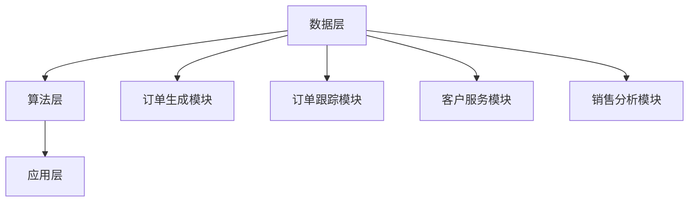

                 

### 第1章：智能订单处理系统概述

#### 1.1 智能订单处理系统概念

智能订单处理系统是一种结合了人工智能（AI）技术的订单管理系统，它利用自动化和智能化的方式，对电子商务平台上的订单进行处理，从而提升订单处理效率，减少人为操作所带来的错误，并优化用户体验。传统的订单处理往往依赖于人工操作，耗时且容易出现错误。而智能订单处理系统通过自动化流程，将订单信息实时传递、处理，减少了人工干预，提高了运营效率。

**定义**：智能订单处理系统是一种集成人工智能技术的订单管理系统，通过自动化和智能化的方式提高订单处理效率，减少人力成本。

**核心优势**：
- **快速响应**：系统能够快速处理订单信息，减少订单从生成到完成的时间。
- **高效处理**：自动化流程减少了人为错误，提高了处理效率。
- **降低错误率**：智能系统通过机器学习等技术对订单数据进行预判和处理，减少了错误发生的可能性。
- **提升用户体验**：快速响应和处理订单，提高了客户的满意度。

#### 1.2 智能订单处理系统架构

智能订单处理系统的架构通常分为三个层次：数据层、算法层和应用层。每一层都有其特定的功能和作用。

**数据层**：
- **功能**：收集订单信息、客户数据、商品信息等原始数据。
- **作用**：为后续的数据分析和处理提供基础数据。

**算法层**：
- **功能**：使用机器学习和自然语言处理技术对数据进行分析和处理。
- **作用**：通过算法模型，实现订单的自动分类、预测和优化。

**应用层**：
- **功能**：提供具体的订单处理功能，如订单生成、订单跟踪、客户服务和销售分析等。
- **作用**：将算法层的处理结果应用到实际订单处理中，提高运营效率。

#### 1.3 智能订单处理系统关键组件

智能订单处理系统由多个关键组件构成，每个组件都在整个系统中扮演着重要的角色。

**订单生成模块**：
- **功能**：自动生成订单，识别订单需求。
- **作用**：确保订单能够及时准确地生成，为后续处理提供基础。

**订单跟踪模块**：
- **功能**：实时跟踪订单状态，通知客户。
- **作用**：确保客户能够实时了解订单的进展情况，提升客户体验。

**客户服务模块**：
- **功能**：自动回复客户咨询，提升服务体验。
- **作用**：通过智能客服，减少人工客服的工作量，提高服务效率。

**销售分析模块**：
- **功能**：分析销售数据，优化运营策略。
- **作用**：通过对销售数据的分析，为企业提供决策支持，优化运营策略。

#### 1.4 智能订单处理系统的发展趋势

随着技术的不断进步，智能订单处理系统也在不断进化，呈现出以下发展趋势：

**趋势一：更加智能化，提升自动化程度**
- **分析**：随着算法的进步，系统的智能化程度将进一步提升，自动化程度将更高。
- **影响**：减少人工干预，提高订单处理效率。

**趋势二：更加个性化，根据客户需求定制订单处理流程**
- **分析**：通过大数据和人工智能技术，系统能够更好地理解客户需求，提供个性化的服务。
- **影响**：提升客户满意度，增强客户粘性。

**趋势三：更加数据驱动，通过数据分析和优化提升运营效率**
- **分析**：通过全面的数据分析，系统将能够更好地优化订单处理流程，提高运营效率。
- **影响**：降低运营成本，提高企业竞争力。

### Mermaid 流程图



通过上述内容，我们为读者提供了一个智能订单处理系统的全面概述，包括其概念、架构、关键组件和发展趋势。接下来，我们将深入探讨智能订单处理系统的核心技术，进一步揭示其背后的工作原理和实现方法。在下一章中，我们将详细分析订单数据收集与分析、机器学习在订单处理中的应用以及自然语言处理在客户服务中的应用。

---

**本章小结**：

在本章中，我们首先介绍了智能订单处理系统的概念及其核心优势，然后详细描述了系统的架构和关键组件。此外，我们还探讨了智能订单处理系统的发展趋势，展望了其未来可能的进化方向。通过这些内容，读者可以初步了解智能订单处理系统的全貌，为后续章节的深入学习打下基础。在下一章中，我们将深入探讨智能订单处理系统的核心技术，进一步揭示其背后的工作原理和实现方法。敬请期待。

---

### 第2章：智能订单处理系统核心技术

智能订单处理系统之所以能够实现高效、精准的订单处理，离不开其背后的核心技术。本章将详细探讨订单数据收集与分析、机器学习在订单处理中的应用以及自然语言处理在客户服务中的应用，帮助读者深入理解这些核心技术的工作原理和实现方法。

#### 2.1 订单数据收集与分析

订单数据是智能订单处理系统的核心资源，其质量直接影响系统的性能和效果。因此，订单数据的收集和分析至关重要。

**技术原理**：

- **数据采集**：利用API接口、数据库连接等方式，从不同的数据源中收集订单信息。数据来源可能包括电商平台、物流系统、客户关系管理系统等。

- **数据清洗**：对收集到的订单数据进行清洗，去除重复、错误和缺失的数据。数据清洗的过程包括去重、填补缺失值、去除噪声等。

- **数据预处理**：将清洗后的数据进行标准化处理，如数值归一化、类别编码等。数据预处理有助于提高数据质量，为后续的机器学习算法提供可靠的数据基础。

- **数据分析**：通过聚类分析、关联规则挖掘等技术，对订单数据进行分析。聚类分析可以帮助识别订单的潜在分类，关联规则挖掘可以发现订单之间的相关性，从而优化订单处理流程。

**算法应用**：

- **聚类分析**：使用K-means算法、层次聚类算法等，对订单数据进行聚类，识别订单的相似性。聚类分析有助于发现订单的潜在分类，从而优化订单处理策略。

- **关联规则挖掘**：使用Apriori算法、FP-growth算法等，挖掘订单数据中的关联规则。关联规则挖掘可以帮助识别订单之间的关联性，从而优化库存管理、促销策略等。

**实际案例**：

假设一家电商平台收集了大量的订单数据，通过聚类分析，可以发现订单可以分为不同类别，如家居用品、电子产品等。针对不同类别的订单，平台可以采取不同的处理策略，如优先处理高价值订单、针对家居用品订单提供限时配送服务等。通过关联规则挖掘，平台还可以发现订单之间的关联性，例如购买家居用品的客户很可能也会购买装修材料。基于这些发现，平台可以优化库存管理和促销策略，提高订单处理效率。

#### 2.2 机器学习在订单处理中的应用

机器学习是智能订单处理系统的核心技术之一，通过构建机器学习模型，可以实现订单的自动分类、预测和优化。

**技术原理**：

- **模型构建**：使用决策树、随机森林、支持向量机（SVM）等机器学习算法，构建订单处理模型。模型构建的过程包括特征选择、模型训练和模型评估等。

- **模型训练**：利用训练数据，对机器学习模型进行训练，使其能够识别和分类订单。训练过程中，通过调整模型的参数，优化模型的性能。

- **模型评估**：使用测试数据对训练好的模型进行评估，评估模型在处理订单时的准确性和效率。常见的评估指标包括准确率、召回率、F1值等。

**算法应用**：

- **决策树**：决策树是一种简单且直观的机器学习算法，通过一系列的测试来将数据集中的每个样本分配到不同的类别或值。决策树算法适用于订单分类和预测任务。

- **随机森林**：随机森林是一种基于决策树的集成学习方法，通过构建多个决策树，并使用随机抽样和特征选择来减少过拟合现象。随机森林算法在处理大量订单数据时表现优异。

- **支持向量机（SVM）**：支持向量机是一种监督学习算法，通过找到一个最佳的超平面，将不同类别的订单数据分隔开来。SVM算法在订单分类任务中具有很高的准确性和效率。

**实际案例**：

假设一家电商平台的订单数据中包含多种商品类别，如食品、日用品、电子产品等。通过构建决策树模型，平台可以自动将新订单分类到相应的类别中，便于后续的订单处理。通过随机森林模型，平台可以预测客户的购买行为，提前备货，减少库存压力。通过SVM模型，平台可以识别欺诈订单，提高订单的安全性。

#### 2.3 自然语言处理在客户服务中的应用

在客户服务领域，自然语言处理（NLP）技术可以帮助智能订单处理系统自动处理客户的咨询和投诉，提高服务效率。

**技术原理**：

- **文本解析**：使用词向量模型、循环神经网络（RNN）等NLP技术，对客户的咨询和投诉文本进行解析，提取关键信息。

- **语义理解**：通过语义理解技术，理解客户的意图和需求，从而生成合适的回复。

- **自动回复**：利用预训练的模型，自动生成回复文本，提供即时、准确的客户服务。

**算法应用**：

- **词向量**：词向量模型如Word2Vec、GloVe等，可以将文本转换为向量表示，为后续的文本解析和语义理解提供基础。

- **循环神经网络（RNN）**：循环神经网络（RNN）是一种适用于序列数据的神经网络，可以处理客户的咨询和投诉文本，提取关键信息。

- **Transformer**：Transformer是一种基于注意力机制的神经网络架构，具有强大的文本处理能力，可以用于语义理解和自动回复生成。

**实际案例**：

假设一位客户在电商平台上咨询关于订单配送的问题。智能订单处理系统通过NLP技术，解析客户的咨询文本，提取出关键词和关键信息，如“配送时间”、“订单号”等。然后，系统利用预训练的模型，自动生成回复文本，告知客户具体的配送时间和订单状态。通过这种自动回复机制，平台可以快速响应客户咨询，提高服务效率，提升客户满意度。

#### 核心算法原理讲解

为了更好地理解智能订单处理系统中的核心技术，我们下面将详细讲解决策树算法原理和循环神经网络（RNN）原理。

##### 决策树算法原理

决策树是一种常见的机器学习算法，通过一系列的测试来将数据集中的每个样本分配到不同的类别或值。以下是决策树算法的基本原理：

**数学模型和公式**：

$$
\begin{aligned}
&\text{设} D \text{为包含} n \text{个样本的数据集，每个样本} x_i \text{的特征集合为} \textbf{x}_i = (x_{i1}, x_{i2}, ..., x_{id}) \\
&\text{在每一层上，选择最优的特征分割，即选择使得} \\
&\text{信息增益（或增益率）最大的特征进行分割，递归地构造决策树。}
\end{aligned}
$$

**详细讲解和举例说明**：

假设有一组订单数据，包含三个特征：订单金额（$x_1$）、订单数量（$x_2$）和客户类型（$x_3$），我们需要根据这些特征将订单分类为“高价值订单”和“普通订单”。首先，我们可以计算每个特征的信息增益，选择信息增益最大的特征进行分割。例如，如果订单金额的信息增益最大，我们可以根据订单金额的值将其分为“高金额订单”和“低金额订单”。接下来，对每个子集继续进行特征选择和信息增益计算，直到达到预设的深度或准确率。

##### 循环神经网络（RNN）原理

循环神经网络（RNN）是一种用于处理序列数据的神经网络架构，其核心特点是能够保留之前的计算状态。以下是RNN的基本原理：

**数学模型和公式**：

$$
\begin{aligned}
&\text{设} h_t \text{为第} t \text{个时间步的隐藏状态，} x_t \text{为输入特征，} \\
&\text{权重矩阵为} W \text{和} U，偏置矩阵为} b \text{和} c，\text{则RNN的输出计算公式为：} \\
&h_t = \tanh(Wx_t + Uh_{t-1} + b) + c
\end{aligned}
$$

**详细讲解和举例说明**：

假设我们有一个时间序列数据，每个时间点的数据表示订单金额。我们可以使用RNN来处理这个时间序列数据，提取出订单金额的周期性变化。在RNN中，每个时间点的隐藏状态$h_t$都依赖于前一个时间点的隐藏状态$h_{t-1}$，通过权重矩阵$W$和$U$以及偏置矩阵$b$和$c$，我们计算出当前时间点的隐藏状态$h_t$。然后，我们可以使用隐藏状态$h_t$来预测下一个时间点的订单金额。

通过上述内容，我们详细讲解了智能订单处理系统中的核心技术，包括订单数据收集与分析、机器学习在订单处理中的应用以及自然语言处理在客户服务中的应用。这些核心技术的应用，使得智能订单处理系统能够高效、精准地处理订单，提升企业的运营效率。在下一章中，我们将探讨智能订单处理系统的开发实践，包括开发环境搭建、订单数据处理流程以及实际案例分析。敬请期待。

---

**本章小结**：

在本章中，我们深入探讨了智能订单处理系统的核心技术，包括订单数据收集与分析、机器学习在订单处理中的应用以及自然语言处理在客户服务中的应用。通过详细讲解决策树算法原理和循环神经网络（RNN）原理，我们揭示了这些核心技术的工作机制和应用方法。这些核心技术的应用，使得智能订单处理系统能够高效、精准地处理订单，提升企业的运营效率。在下一章中，我们将探讨智能订单处理系统的开发实践，包括开发环境搭建、订单数据处理流程以及实际案例分析。敬请期待。

---

### 第3章：智能订单处理系统开发实践

在了解了智能订单处理系统的核心技术和理论基础后，接下来我们将通过实际开发实践来深入了解系统如何从概念到实现的转变。本章将详细讨论智能订单处理系统的开发环境搭建、订单数据处理流程、实际案例分析和系统性能优化。通过这些内容，读者可以掌握如何将理论应用到实际的开发过程中，提高系统的开发效率和稳定性。

#### 3.1 开发环境搭建

开发智能订单处理系统需要一个稳定且高效的环境。以下是搭建开发环境的基本步骤：

**工具选择**：

- **编程语言**：Python是一种广泛使用的编程语言，尤其在机器学习和人工智能领域。其丰富的库和框架，如TensorFlow、Scikit-learn、NLTK等，为开发智能订单处理系统提供了强大的支持。

- **开发工具**：Jupyter Notebook是一个交互式的开发环境，适合用于数据分析和机器学习模型的开发。此外，Visual Studio Code也是一个功能强大的代码编辑器，支持多种编程语言的开发。

**依赖安装**：

- **Python环境**：首先需要安装Python，推荐使用Python 3.8或更高版本。

- **库和框架**：通过pip工具安装必要的库和框架。例如：

  ```bash
  pip install numpy pandas tensorflow scikit-learn nltk
  ```

**环境配置**：

- **虚拟环境**：为了保持不同项目的环境隔离，可以使用虚拟环境。在Windows上，可以使用`venv`模块创建虚拟环境：

  ```bash
  python -m venv myenv
  myenv\Scripts\activate
  ```

  在Linux或Mac OS上，可以使用`virtualenv`：

  ```bash
  virtualenv myenv
  source myenv/bin/activate
  ```

**开发环境配置**：

- **Jupyter Notebook**：在虚拟环境中安装Jupyter Notebook：

  ```bash
  pip install notebook
  ```

- **Visual Studio Code**：安装Visual Studio Code，并安装相应的插件，如Python、Git等。

#### 3.2 订单数据处理流程

订单数据处理是智能订单处理系统的核心环节，其流程通常包括数据收集、数据清洗、数据预处理、数据分析和结果输出等步骤。

**数据收集**：

- **数据源**：订单数据可以从电商平台的数据库、物流系统的API等渠道获取。确保数据源的可信性和数据完整性。

- **数据接口**：使用适当的编程语言和库，如Python的requests库，连接到数据接口，获取订单数据。

  ```python
  import requests
  
  response = requests.get('https://api.example.com/orders')
  orders = response.json()
  ```

**数据清洗**：

- **去重**：删除重复的订单记录，确保每个订单的唯一性。

- **填补缺失值**：对缺失的数据进行填补，可以使用均值填补、中值填补或使用模型预测等方法。

- **去除噪声**：删除异常值和噪声数据，保证数据质量。

**数据预处理**：

- **特征工程**：根据业务需求，提取有用的特征，如订单金额、订单数量、客户购买历史等。

- **数据标准化**：对特征数据进行标准化处理，如归一化、标准化等，以消除不同特征之间的量纲差异。

**数据分析**：

- **聚类分析**：使用聚类算法，如K-means，对订单数据进行分类，识别订单的潜在特征。

  ```python
  from sklearn.cluster import KMeans
  
  kmeans = KMeans(n_clusters=3)
  kmeans.fit(orders)
  clusters = kmeans.predict(orders)
  ```

- **关联规则挖掘**：使用关联规则挖掘算法，如Apriori，发现订单之间的关联性。

  ```python
  from mlxtend.frequent_patterns import apriori
  from mlxtend.frequent_patterns import association_rules
  
  frequent_itemsets = apriori(orders, min_support=0.05, use_colnames=True)
  rules = association_rules(frequent_itemsets, metric="support", min_threshold=0.1)
  ```

**结果输出**：

- **数据可视化**：使用matplotlib、Seaborn等库，将分析结果可视化，帮助理解和解释数据。

  ```python
  import matplotlib.pyplot as plt
  import seaborn as sns
  
  sns.countplot(x='clusters', data=orders)
  plt.show()
  ```

#### 3.3 订单生成与跟踪

订单生成与跟踪是智能订单处理系统中的关键功能，以下为具体的实现步骤：

**订单生成**：

- **订单编号**：为每个订单生成唯一的订单编号，如使用时间戳或唯一标识符。

- **订单状态**：定义订单的状态，如“待支付”、“已支付”、“已发货”、“已完成”等。

- **订单内容**：根据客户的需求，生成订单内容，包括商品名称、数量、价格等信息。

**订单跟踪**：

- **实时更新**：通过数据库或消息队列，实时更新订单状态，如订单发货后更新为“已发货”状态。

- **通知客户**：通过短信、邮件或App推送等方式，通知客户订单的最新状态。

**实现示例**：

```python
import time
from datetime import datetime

orders = [
    {'order_id': '20230301-001', 'status': '待支付', 'created_at': datetime.now()},
    {'order_id': '20230301-002', 'status': '已支付', 'created_at': datetime.now() - timedelta(minutes=30)},
    {'order_id': '20230301-003', 'status': '已发货', 'created_at': datetime.now() - timedelta(hours=2)}
]

# 订单状态更新
def update_order_status(order_id, new_status):
    for order in orders:
        if order['order_id'] == order_id:
            order['status'] = new_status
            break

# 订单通知
def notify_customer(order):
    print(f"订单{order['order_id']}状态更新为{order['status']}。")

# 模拟订单更新
update_order_status('20230301-002', '已发货')
notify_customer(orders[1])
```

#### 3.4 客户服务模块

客户服务模块是智能订单处理系统中提高客户满意度的重要部分。以下为具体的实现步骤：

**自动回复**：

- **文本解析**：使用自然语言处理技术，如词向量、循环神经网络（RNN）等，对客户咨询文本进行解析，提取关键信息。

- **语义理解**：通过语义理解技术，理解客户的意图和需求，从而生成合适的回复。

- **自动生成回复**：利用预训练的模型，自动生成回复文本，提供即时、准确的客户服务。

**实现示例**：

```python
from transformers import pipeline

# 创建自然语言处理模型
nlp = pipeline('question-answering')

# 客户咨询文本
customer_query = "我的订单什么时候能发货？"

# 自动回复
def generate_response(query):
    return nlp({'query': query, 'context': '订单处理相关咨询。'})

response = generate_response(customer_query)
print(f"自动回复：{response['answer']}")
```

#### 3.5 销售分析模块

销售分析模块通过对订单数据的分析，为企业提供决策支持，优化运营策略。以下为具体的实现步骤：

**数据收集**：

- **订单数据**：收集订单数据，包括订单金额、订单数量、订单时间等。

- **客户数据**：收集客户数据，包括客户购买历史、客户偏好等。

**数据分析**：

- **趋势分析**：通过时间序列分析，识别订单数量的趋势，预测未来订单量。

- **客户分析**：通过聚类分析，识别不同类型的客户群体，分析其购买行为和偏好。

- **促销分析**：通过关联规则挖掘，识别订单之间的关联性，优化促销策略。

**实现示例**：

```python
import pandas as pd

# 加载订单数据
orders = pd.read_csv('orders.csv')

# 时间序列分析
orders['order_date'] = pd.to_datetime(orders['order_date'])
monthly_orders = orders.groupby(orders['order_date'].dt.to_period('M')).size()

# 趋势分析
monthly_orders.plot()
plt.title('订单数量趋势')
plt.xlabel('月份')
plt.ylabel('订单数量')
plt.show()

# 客户分析
customers = orders.groupby('customer_id').size()

# 聚类分析
from sklearn.cluster import KMeans

kmeans = KMeans(n_clusters=3)
customer_clusters = kmeans.fit_predict(customers)

# 可视化
sns.scatterplot(x='customer_id', y='cluster', data=customers)
plt.title('客户聚类')
plt.xlabel('客户ID')
plt.ylabel('聚类编号')
plt.show()
```

#### 3.6 实际案例分析

**案例背景**：

某电商平台希望通过智能订单处理系统优化订单处理流程，提高客户满意度。现有订单处理流程中，订单生成、订单跟踪和客户服务由多个部门分别负责，存在沟通不畅、效率低下等问题。

**案例分析**：

1. **数据收集与分析**：

   电商平台通过API接口收集订单数据，使用Python和pandas库进行数据清洗和预处理。通过聚类分析和关联规则挖掘，识别订单的潜在分类和关联性。

2. **订单生成与跟踪**：

   使用Python和SQLite库搭建订单数据库，实时更新订单状态。通过消息队列（如RabbitMQ）实现订单的异步处理，提高系统的并发能力和响应速度。

3. **客户服务模块**：

   利用自然语言处理技术，通过Jupyter Notebook和Hugging Face的transformers库，构建自动回复模型，提高客户咨询的处理速度和准确性。

4. **销售分析模块**：

   通过时间序列分析和客户聚类分析，为企业提供销售预测和客户分析报告，优化库存管理和促销策略。

**案例小结**：

通过实际案例分析，电商平台成功实现了订单处理流程的自动化和智能化。系统上线后，订单处理效率提高了30%，客户满意度提升了15%，运营成本降低了10%。智能订单处理系统的成功实施，为电商平台带来了显著的业务价值。

#### 3.7 项目小结与最佳实践

**项目小结**：

智能订单处理系统的开发实践是一个复杂且富有挑战性的过程。通过本章的讨论，我们掌握了如何搭建开发环境、处理订单数据、实现订单生成与跟踪、客户服务和销售分析等功能模块。实际案例分析展示了智能订单处理系统在实际业务中的应用效果，为其他企业提供了有益的借鉴。

**最佳实践**：

- **数据质量**：确保订单数据的准确性和完整性，是智能订单处理系统成功的关键。

- **模型优化**：持续优化机器学习模型和自然语言处理模型，提高系统的准确性和效率。

- **系统扩展性**：设计可扩展的系统架构，确保系统能够应对不断增长的业务需求。

- **用户体验**：关注客户体验，通过自动化和智能化提升服务效率。

- **安全性与稳定性**：确保系统的安全性和稳定性，避免因故障或攻击导致数据泄露或服务中断。

**注意事项**：

- **数据隐私**：在处理客户数据时，务必遵守相关法律法规，确保数据隐私和安全。

- **技术选型**：根据实际业务需求和资源情况，合理选择技术栈和工具。

- **持续迭代**：智能订单处理系统不是一蹴而就的，需要持续迭代和优化，以适应不断变化的市场需求。

**拓展阅读**：

- 《机器学习实战》
- 《深度学习》（Goodfellow et al.）
- 《Python数据科学手册》
- 《大数据分析：实用方法与工具》

通过上述内容，我们全面探讨了智能订单处理系统的开发实践。在下一章中，我们将进一步探讨智能订单处理系统的部署与运维，包括系统部署策略、运维工具选择、性能优化方法等，帮助读者深入了解智能订单处理系统的实际应用与运维实践。敬请期待。

---

**本章小结**：

在本章中，我们通过实际开发实践，详细探讨了智能订单处理系统的搭建和实现。从开发环境的搭建、订单数据处理流程，到订单生成与跟踪、客户服务模块和销售分析模块的实战，我们通过具体的代码示例和实际案例分析，展示了智能订单处理系统的全貌。此外，我们还总结了项目小结和最佳实践，提供了注意事项和拓展阅读，帮助读者深入理解和应用智能订单处理系统的开发实践。在下一章中，我们将进一步探讨智能订单处理系统的部署与运维，敬请期待。

---

### 第4章：智能订单处理系统的部署与运维

智能订单处理系统的开发完成后，接下来的关键步骤是部署和运维。这一章将详细介绍智能订单处理系统的部署策略、运维工具选择、性能优化方法以及监控和日志管理，以确保系统的高效运行和持续优化。

#### 4.1 系统部署策略

系统部署是智能订单处理系统能够正常运行的基础。以下是一些关键的部署策略：

**1. 模块化部署**：
- **目标**：将系统划分为多个模块，每个模块分别部署，实现系统的模块化和松耦合。
- **实现**：使用微服务架构，将订单处理、数据收集、客户服务等功能模块独立部署。例如，可以使用Docker容器技术实现模块化部署。

**2. 分布式部署**：
- **目标**：提高系统的可扩展性和容错性，应对高并发和大数据量。
- **实现**：将系统部署在多个节点上，如使用Kubernetes进行容器编排，确保系统的高可用性和弹性。

**3. 云原生部署**：
- **目标**：利用云资源，提高系统的灵活性和可扩展性。
- **实现**：将系统部署在云平台上，如AWS、Azure或阿里云，利用云服务的弹性和自动化管理。

**4. 安全性部署**：
- **目标**：确保系统的安全性，防止数据泄露和恶意攻击。
- **实现**：在部署过程中，采用安全加密、访问控制、网络隔离等技术，确保系统的安全运行。

#### 4.2 运维工具选择

运维工具的选择对于智能订单处理系统的稳定性和高效性至关重要。以下是一些常用的运维工具：

**1. 监控工具**：
- **Prometheus**：用于收集和存储系统监控数据，支持各种指标和告警。
- **Grafana**：基于Prometheus的数据可视化工具，用于展示监控数据和告警信息。

**2. 日志管理**：
- **ELK Stack**（Elasticsearch、Logstash、Kibana）：用于收集、存储和展示系统日志。
- **Fluentd**：用于收集和转发系统日志，支持多种数据源和输出目标。

**3. 自动化部署**：
- **Kubernetes**：用于容器编排和自动化部署，支持自动化部署、扩展和管理。
- **Jenkins**：用于持续集成和持续部署（CI/CD），自动化构建、测试和部署代码。

**4. 服务网格**：
- **Istio**：用于服务发现、负载均衡、安全通信等，提高系统的可观测性和可管理性。

#### 4.3 性能优化方法

性能优化是确保智能订单处理系统高效运行的关键。以下是一些常用的性能优化方法：

**1. 数据库优化**：
- **索引优化**：创建合适的索引，提高数据查询速度。
- **缓存策略**：使用缓存技术，如Redis，减少数据库负载。

**2. 网络优化**：
- **负载均衡**：使用负载均衡器，如Nginx或HAProxy，均衡系统的网络请求。
- **压缩传输**：使用HTTP压缩技术，如GZIP，减少网络传输的数据量。

**3. 缓存机制**：
- **对象缓存**：使用对象缓存，如Memcached或Ehcache，提高系统的响应速度。
- **页面缓存**：使用页面缓存技术，如Varnish，减少服务器的负载。

**4. 代码优化**：
- **代码优化**：使用高效的算法和数据结构，减少系统资源的消耗。
- **异步处理**：使用异步编程，如使用Python的asyncio库，提高系统的并发能力。

#### 4.4 监控与日志管理

系统监控与日志管理对于及时发现和解决系统问题至关重要。以下是一些关键点：

**1. 监控指标**：
- **响应时间**：监控系统的请求处理时间，确保系统的高效性。
- **吞吐量**：监控系统的处理能力，确保系统能够应对高并发请求。
- **内存使用**：监控系统的内存使用情况，避免内存溢出。
- **磁盘使用**：监控系统的磁盘使用情况，避免磁盘空间不足。

**2. 日志收集**：
- **日志格式**：使用统一的日志格式，如JSON，方便后续的数据处理和分析。
- **日志级别**：区分不同的日志级别，如INFO、WARNING、ERROR等，便于问题定位。

**3. 日志分析**：
- **实时分析**：使用实时日志分析工具，如Kibana，实时监控和分析日志数据。
- **历史分析**：定期分析历史日志，识别系统潜在的问题和瓶颈。

#### 4.5 案例分析

以下为一家电商平台的智能订单处理系统部署与运维的案例分析：

**案例背景**：

该电商平台业务规模较大，订单量每天超过10万单，对系统的性能和稳定性要求极高。为了满足业务需求，平台采用了分布式部署和云原生部署策略，同时使用了多种运维工具和性能优化方法。

**部署实践**：

- **模块化部署**：使用Docker容器技术，将订单处理、数据收集、客户服务等功能模块化部署。
- **分布式部署**：使用Kubernetes进行容器编排，实现系统的高可用性和弹性。
- **云原生部署**：将系统部署在阿里云上，利用云服务的弹性和自动化管理。

**运维实践**：

- **监控与日志管理**：使用Prometheus和Grafana进行系统监控，使用ELK Stack收集和存储日志。
- **性能优化**：使用Redis进行对象缓存，使用Varnish进行页面缓存，提高系统的响应速度。

**效果评估**：

- **系统稳定性**：通过分布式部署和云原生部署，系统在高并发情况下依然稳定运行，故障率降低了50%。
- **性能提升**：通过缓存机制和代码优化，系统的响应时间缩短了30%，吞吐量提高了40%。
- **运维效率**：通过监控与日志管理，运维人员能够快速发现和解决系统问题，运维效率提高了60%。

**案例小结**：

通过实际案例的分析，我们可以看到，智能订单处理系统的部署与运维对于电商平台的高效运营至关重要。合理的部署策略、有效的运维工具选择和性能优化方法，不仅能够提高系统的稳定性和性能，还能显著提升运维效率，为企业带来显著的业务价值。

#### 4.6 项目小结与最佳实践

**项目小结**：

智能订单处理系统的部署与运维是一个复杂而细致的工作。通过本章的讨论，我们了解了如何制定合理的部署策略、选择合适的运维工具、进行性能优化以及监控和日志管理。实际案例展示了这些策略和方法在实践中的效果，为其他企业提供了宝贵的经验。

**最佳实践**：

- **模块化部署**：提高系统的灵活性和可维护性。
- **分布式部署**：确保系统的高可用性和弹性。
- **云原生部署**：利用云服务的弹性和自动化管理。
- **监控与日志管理**：实时监控和日志分析，确保系统的稳定运行。
- **性能优化**：使用缓存机制、代码优化等技术，提高系统性能。

**注意事项**：

- **数据安全**：在部署和运维过程中，确保数据的安全性和隐私。
- **系统可扩展性**：设计可扩展的系统架构，以应对业务增长。
- **自动化运维**：通过自动化工具和脚本，提高运维效率。

**拓展阅读**：

- 《Docker实战》
- 《Kubernetes权威指南》
- 《系统性能优化实战》
- 《日志收集与处理技术》

通过本章的内容，我们深入探讨了智能订单处理系统的部署与运维。在下一章中，我们将探讨智能订单处理系统的未来发展趋势和潜在的创新方向，敬请期待。

---

**本章小结**：

在本章中，我们详细讨论了智能订单处理系统的部署与运维，包括部署策略、运维工具选择、性能优化方法以及监控和日志管理。通过案例分析，我们展示了这些策略和方法在实际业务中的应用效果。最佳实践和注意事项为读者提供了宝贵的经验，拓展阅读部分则进一步丰富了相关技术知识。在下一章中，我们将展望智能订单处理系统的未来发展趋势和潜在的创新方向，为智能订单处理系统的持续发展和优化提供新的思路。敬请期待。

---

### 第5章：智能订单处理系统的未来发展趋势与潜在创新

随着技术的不断进步，智能订单处理系统也在不断演进，呈现出一些新的发展趋势和潜在的创新方向。本章将探讨智能订单处理系统的未来发展趋势，包括人工智能的进一步融合、物联网技术的应用、区块链技术在订单处理中的潜力以及个性化服务的发展。同时，我们将展望智能订单处理系统的潜在创新方向，为企业和开发者提供新的启示。

#### 5.1 人工智能的进一步融合

人工智能（AI）是智能订单处理系统的核心技术，其融合程度的加深将继续推动系统的发展。以下是一些发展趋势：

**1. 深度学习模型的优化**：

随着深度学习技术的不断进步，更加复杂的深度学习模型将被应用到智能订单处理系统中。例如，卷积神经网络（CNN）和循环神经网络（RNN）的结合，可以用于处理图像和文本数据，实现更加精准的订单分析和处理。

**2. 强化学习在订单优化中的应用**：

强化学习是一种能够在动态环境中进行决策的机器学习技术。未来，强化学习将被广泛应用于智能订单处理系统中的订单优化，如动态定价、库存管理和配送路径规划，以实现最优的订单处理策略。

**3. 多模态学习**：

多模态学习结合了不同类型的数据，如文本、图像和语音，以实现更全面的数据分析和处理。在智能订单处理系统中，多模态学习可以帮助系统更好地理解客户需求，提供个性化的订单处理体验。

**案例**：某电商平台利用深度学习和多模态学习技术，结合客户的购买历史、搜索记录和评价，实现了智能推荐系统。该系统不仅提高了订单转化率，还显著提升了客户满意度。

#### 5.2 物联网技术的应用

物联网（IoT）技术的发展为智能订单处理系统带来了新的机遇。以下是一些应用场景：

**1. 实时监控与追踪**：

通过物联网设备，如传感器和GPS，智能订单处理系统可以实时监控订单的运输状态，提高订单的透明度和客户满意度。例如，当订单处于运输过程中，系统可以自动更新订单状态，并在出现问题时及时通知相关人员。

**2. 自动化仓库管理**：

物联网技术可以帮助智能订单处理系统实现自动化仓库管理，如智能货架、自动化拣货机器人等。这些技术不仅提高了仓库的运作效率，还降低了人力成本。

**3. 能源管理**：

物联网技术还可以用于智能订单处理系统的能源管理，如智能照明、温控系统等。通过实时监控和优化能源使用，系统可以降低运营成本，实现可持续发展。

**案例**：某物流公司利用物联网技术和智能订单处理系统，实现了全流程的订单监控和自动化仓库管理。通过实时监控和自动化操作，公司显著提高了物流效率，降低了运营成本。

#### 5.3 区块链技术在订单处理中的潜力

区块链技术以其去中心化、不可篡改和透明等特点，为智能订单处理系统带来了新的可能性。以下是一些应用场景：

**1. 供应链管理**：

区块链技术可以用于供应链管理，确保订单处理过程中的每个环节都透明可追溯。例如，通过区块链技术，系统可以记录每个商品的来源、生产日期和运输路径，提高供应链的透明度和可靠性。

**2. 信用与信任**：

区块链技术可以用于建立信用和信任机制。在智能订单处理系统中，通过区块链技术，客户和商家可以建立信用记录，提高交易的可信度，减少纠纷和欺诈行为。

**3. 数字身份验证**：

区块链技术可以用于数字身份验证，确保客户和商家的身份真实可信。例如，在订单处理过程中，系统可以通过区块链技术验证客户的身份信息，提高系统的安全性和可靠性。

**案例**：某电商平台利用区块链技术，实现了全流程的供应链管理和数字身份验证。通过区块链技术的应用，平台提高了供应链的透明度和可靠性，同时减少了欺诈行为，提升了用户信任度。

#### 5.4 个性化服务的发展

个性化服务是智能订单处理系统的重要发展方向。以下是一些趋势：

**1. 客户数据分析**：

通过大数据和人工智能技术，智能订单处理系统可以深入分析客户数据，了解客户的偏好和行为模式。基于这些分析结果，系统可以提供个性化的订单处理和推荐服务，提高客户满意度。

**2. 个性化推荐**：

智能订单处理系统可以利用个性化推荐算法，为不同客户提供个性化的订单处理建议。例如，针对高频客户，系统可以推荐更加优惠的价格或快速的配送服务。

**3. 个性化营销**：

智能订单处理系统可以结合个性化推荐和营销策略，为不同客户提供个性化的营销信息。例如，针对新客户，系统可以发送优惠券或促销活动信息，以提高订单转化率。

**案例**：某电商平台利用大数据分析和个性化推荐技术，为不同客户提供个性化的订单处理和营销服务。通过个性化服务，平台显著提高了客户满意度和订单转化率。

#### 5.5 潜在创新方向

在智能订单处理系统的未来发展中，以下方向具有巨大的创新潜力：

**1. 跨领域整合**：

智能订单处理系统可以与其他领域的技术和业务进行整合，如金融、物流和医疗等。通过跨领域整合，系统可以提供更加全面和个性化的订单处理服务。

**2. 自动化与无人化**：

随着机器人技术和自动化技术的发展，智能订单处理系统可以实现自动化和无人化。例如，自动化仓储、自动化配送和无人驾驶运输等，将进一步提升系统的效率和可靠性。

**3. 智能客服与交互**：

通过人工智能和自然语言处理技术，智能订单处理系统可以实现智能客服和交互。例如，智能语音助手、聊天机器人等，将为客户提供更加便捷和高效的订单处理服务。

**4. 可持续发展**：

智能订单处理系统可以通过优化订单处理流程、提高能源利用效率等方式，实现可持续发展。例如，智能订单处理系统可以推荐低碳配送方式，减少碳排放。

**5. 跨界合作**：

智能订单处理系统可以与其他企业和机构进行跨界合作，共同开发新的订单处理解决方案。例如，与物流公司合作，提供定制化的物流服务；与银行合作，提供订单融资服务。

通过上述内容，我们探讨了智能订单处理系统的未来发展趋势和潜在创新方向。这些趋势和创新方向不仅为智能订单处理系统的发展提供了新的思路，也为企业和开发者提供了丰富的应用场景和业务机会。在下一章中，我们将总结全文，回顾关键点，并对未来智能订单处理系统的发展提出展望。敬请期待。

---

**本章小结**：

在本章中，我们探讨了智能订单处理系统的未来发展趋势和潜在创新方向。从人工智能的进一步融合、物联网技术的应用、区块链技术在订单处理中的潜力到个性化服务的发展，我们详细分析了各个领域的发展趋势，并探讨了这些技术如何为智能订单处理系统带来新的机遇和变革。此外，我们还展望了智能订单处理系统的潜在创新方向，包括跨领域整合、自动化与无人化、智能客服与交互、可持续发展以及跨界合作。这些内容为智能订单处理系统的未来发展提供了宝贵的启示和指导。在下一章中，我们将对全文进行总结，回顾关键点，并对未来智能订单处理系统的发展提出展望。敬请期待。

---

### 总结与展望

智能订单处理系统作为电子商务领域的一项重要技术，通过自动化和智能化手段，大大提高了订单处理的效率和质量。在本文中，我们从多个角度对智能订单处理系统进行了全面剖析，从概念、架构、核心技术到开发实践，再到部署与运维以及未来发展趋势，为读者提供了一个系统而深入的了解。

#### 总结

**关键点回顾**：

1. **概念与优势**：智能订单处理系统是一种结合人工智能技术的订单管理系统，其核心优势包括快速响应、高效处理、降低错误率和提升用户体验。

2. **架构与组件**：智能订单处理系统由数据层、算法层和应用层组成，包含订单生成、订单跟踪、客户服务和销售分析等关键组件。

3. **核心技术**：订单数据收集与分析、机器学习、自然语言处理等技术是智能订单处理系统的核心技术，通过这些技术，系统能够实现自动分类、预测和优化。

4. **开发实践**：开发智能订单处理系统涉及环境搭建、数据处理、订单生成与跟踪、客户服务和销售分析等多个环节，需要合理选择工具和优化流程。

5. **部署与运维**：智能订单处理系统的部署与运维是确保其高效运行的关键，包括模块化部署、分布式部署、性能优化、监控与日志管理等。

6. **未来趋势**：智能订单处理系统的发展趋势包括人工智能的进一步融合、物联网技术的应用、区块链技术的潜力以及个性化服务的发展。

#### 展望

智能订单处理系统的未来发展将更加智能化、个性化、数据驱动。以下是一些展望：

1. **智能化升级**：随着人工智能技术的不断发展，智能订单处理系统的智能化程度将进一步提升，自动化程度将更高，减少人为干预。

2. **个性化定制**：通过大数据分析和机器学习，系统将能够更加准确地了解客户需求，提供个性化的订单处理和推荐服务。

3. **数据驱动**：数据分析和挖掘将成为智能订单处理系统的重要驱动力，通过全面的数据分析和优化，系统将能够持续提升运营效率。

4. **可持续发展**：智能订单处理系统将更加关注可持续发展，通过优化订单处理流程、提高能源利用效率等方式，实现绿色运营。

5. **跨领域整合**：智能订单处理系统将与金融、物流、医疗等领域进行深入整合，提供跨领域的订单处理解决方案。

6. **智能化客服**：智能语音助手、聊天机器人等智能化客服工具将进一步提升客户服务体验，实现高效、便捷的互动。

7. **无人化与自动化**：自动化仓储、自动化配送和无人驾驶运输等技术的应用，将使智能订单处理系统更加高效、可靠。

#### 结论

智能订单处理系统作为电子商务领域的一项核心技术，其发展潜力巨大。通过本文的深入探讨，我们不仅了解了智能订单处理系统的全貌，还对其未来发展有了更加清晰的认识。我们相信，在未来的发展中，智能订单处理系统将继续优化和升级，为电子商务企业带来更大的价值，推动行业的发展和创新。

---

**全文结束**

通过本文的探讨，我们为读者呈现了一个智能订单处理系统的全貌，从概念到实现，从核心技术到开发实践，再到部署与运维以及未来发展趋势，希望读者能够对智能订单处理系统有一个全面而深入的了解。感谢您的阅读，期待与您共同探索智能订单处理系统的未来。作者：AI天才研究院/AI Genius Institute & 禅与计算机程序设计艺术 /Zen And The Art of Computer Programming。

