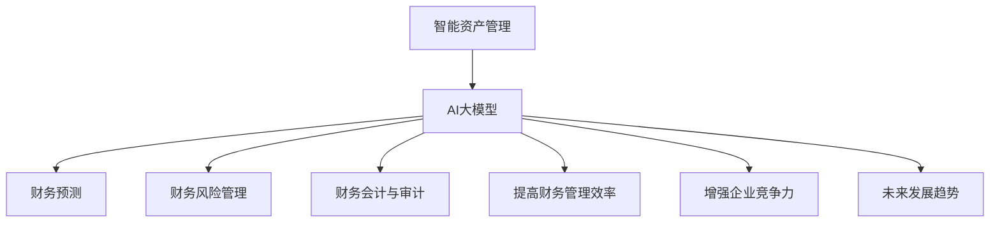
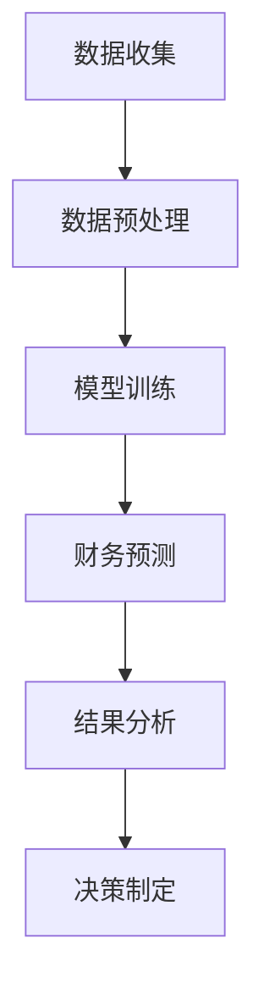

                 

### 文章标题: 智能资产管理：AI大模型在财务领域的商业价值

关键词：智能资产管理，AI大模型，财务预测，财务风险管理，财务会计与审计，财务管理效率，企业竞争力，未来发展趋势

摘要：随着人工智能技术的飞速发展，AI大模型在各个领域展现出了巨大的潜力。本文将深入探讨AI大模型在财务管理中的应用，分析其商业价值，并通过具体案例进行说明。文章结构分为三个部分：第一部分介绍智能资产管理的背景与核心概念，阐述AI大模型在财务管理中的重要性；第二部分详细讨论AI大模型在财务预测、财务风险管理和财务会计与审计等领域的应用；第三部分探讨AI大模型在提高财务管理效率和增强企业竞争力方面的作用，并对未来发展趋势进行展望。通过本文的阅读，读者将全面了解AI大模型在财务管理中的商业价值及其应用前景。

### 第一部分: 智能资产管理的背景与核心概念

#### 第1章: 智能资产管理的兴起与财务变革

随着大数据、云计算、人工智能等技术的发展，财务管理正经历着一场深刻的变革。智能资产管理（Intelligent Asset Management）作为新兴的财务管理模式，逐渐受到业界的广泛关注。智能资产管理的核心在于通过利用先进的技术手段，实现资产的全生命周期管理，提高资产使用效率，降低运营成本，同时增强企业的风险控制能力。

##### 1.1 智能资产管理概述

智能资产管理可以定义为一种基于数据驱动、技术驱动的管理模式，通过整合各类资产数据，运用数据分析、机器学习、人工智能等先进技术，对资产进行预测、监控、评估和优化。与传统财务管理模式相比，智能资产管理具有以下几个显著特点：

- **数据驱动**：智能资产管理依赖于大量的资产数据，包括财务数据、市场数据、运营数据等，通过数据分析和挖掘，为企业提供决策支持。
- **智能化**：智能资产管理利用人工智能技术，如机器学习、深度学习等，对数据进行分析和预测，实现资产管理的自动化和智能化。
- **实时性**：智能资产管理能够实时获取和处理资产数据，及时调整资产管理策略，提高资产使用效率和风险控制能力。
- **协同性**：智能资产管理通过构建协同平台，实现企业内部各部门之间的信息共享和协作，提高决策效率和执行力。

##### 1.2 智能资产管理的核心概念

智能资产管理的核心概念包括资产数字化、数据分析与决策支持、智能监控与风险控制。

- **资产数字化**：资产数字化是将各类资产数据转化为电子数据，实现资产信息的标准化、结构化和自动化处理。资产数字化是智能资产管理的基础，只有实现资产数据的数字化，才能进行后续的数据分析和智能化管理。
- **数据分析与决策支持**：数据分析与决策支持是智能资产管理的核心环节，通过数据挖掘、数据分析和机器学习等技术，对资产数据进行深入分析和挖掘，为企业提供科学的决策支持。
- **智能监控与风险控制**：智能监控与风险控制是智能资产管理的重要组成部分，通过实时监控资产运行状态，及时发现和预警潜在风险，采取有效的风险控制措施，保障资产的正常运行。

##### 1.3 AI大模型在财务管理中的重要性

AI大模型（Large-scale AI Models）是指具有大规模参数和复杂结构的深度学习模型，如GPT、BERT等。这些大模型在自然语言处理、图像识别、推荐系统等领域取得了显著成果，逐渐成为人工智能领域的研究热点。在财务管理领域，AI大模型同样展现出了巨大的潜力。

首先，AI大模型能够对海量财务数据进行高效处理和分析，提取有价值的信息和规律，为企业提供精准的财务预测和风险预警。例如，GPT模型可以用于文本数据分析，提取企业财报中的关键信息，进行财务预测；BERT模型可以用于财务数据的预训练，提高多变量时间序列预测的准确性。

其次，AI大模型能够实现财务管理的自动化和智能化。通过大模型的学习和预测能力，企业可以减少人工干预，提高决策效率，降低运营成本。例如，利用GPT模型进行自动化的记账和分类，提高财务工作效率；利用BERT模型进行智能化的审计证据分析，优化审计流程。

最后，AI大模型具有强大的泛化能力，可以应用于不同的财务场景，为企业提供灵活的解决方案。随着大模型技术的不断发展，其应用范围将更加广泛，为企业带来更多的商业价值。

#### Mermaid流程图示例



#### 核心算法原理讲解

为了更好地理解AI大模型在财务管理中的应用，下面将使用伪代码详细阐述几个核心算法原理。

```python
# 财务预测的伪代码
def financial_prediction(data):
    # 数据预处理
    preprocessed_data = preprocess_data(data)
    
    # 训练GPT模型
    model = train_gpt_model(preprocessed_data)
    
    # 进行财务预测
    prediction = model.predict(preprocessed_data)
    
    return prediction

# 财务风险管理的伪代码
def financial_risk_management(data):
    # 数据预处理
    preprocessed_data = preprocess_data(data)
    
    # 训练BERT模型
    model = train_bert_model(preprocessed_data)
    
    # 风险评估
    risk_assessment = model.evaluate_risk(preprocessed_data)
    
    # 风险控制
    control_measures = model.apply_control_measures(risk_assessment)
    
    return control_measures

# 财务会计与审计的伪代码
def financial_accounting_and_auditing(data):
    # 数据预处理
    preprocessed_data = preprocess_data(data)
    
    # 训练GPT模型
    model = train_gpt_model(preprocessed_data)
    
    # 自动化记账与分类
    account_entries = model.generate_account_entries(preprocessed_data)
    
    # 审计线索发现
    audit_clues = model.find_audit_clues(preprocessed_data)
    
    return account_entries, audit_clues
```

#### 数学模型和公式

在AI大模型的应用中，数学模型和公式起到了关键作用。以下是一些常用的数学模型和公式：

$$
y = f(x; \theta)
$$

其中，$y$ 是预测结果，$x$ 是输入数据，$\theta$ 是模型参数，$f(x; \theta)$ 是预测函数。

$$
J(\theta) = -\frac{1}{m} \sum_{i=1}^{m} [y_i \log(a(x_i; \theta)) + (1 - y_i) \log(1 - a(x_i; \theta))]
$$

其中，$m$ 是训练样本数量，$a(x_i; \theta)$ 是概率函数，$J(\theta)$ 是损失函数。

$$
\frac{\partial J(\theta)}{\partial \theta} = 0
$$

这是梯度下降法的更新规则，用于优化模型参数。

#### 举例说明

假设我们有一个企业的财务数据，包括过去一年的销售额、成本、利润等。我们可以使用AI大模型进行财务预测，具体步骤如下：

1. 数据预处理：对财务数据进行清洗、归一化等预处理操作，得到适合训练的数据集。
2. 训练GPT模型：使用预处理后的数据集训练GPT模型，提取财务数据中的关键特征。
3. 进行财务预测：使用训练好的GPT模型对下一年的销售额、成本、利润等进行预测。
4. 结果分析：对预测结果进行分析，评估预测的准确性，并根据预测结果调整企业的经营策略。

#### 项目实战

为了更好地展示AI大模型在财务管理中的应用，我们以一个实际项目为例。

项目名称：智能财务预测系统

项目背景：某企业希望利用AI技术提高财务预测的准确性，为企业决策提供支持。

技术方案：

1. 数据采集：收集企业的财务数据，包括销售额、成本、利润等。
2. 数据预处理：对财务数据进行清洗、归一化等预处理操作。
3. 模型选择：选择GPT模型作为财务预测模型，进行训练和优化。
4. 预测与评估：使用训练好的GPT模型进行财务预测，并对预测结果进行评估。

项目实现：

1. 数据采集：使用Python的pandas库读取企业的财务数据，存储为CSV文件。
2. 数据预处理：使用Python的scikit-learn库进行数据预处理，包括数据清洗、归一化等操作。
3. 模型训练：使用TensorFlow和Keras库训练GPT模型，设置合适的超参数，如学习率、批量大小等。
4. 预测与评估：使用训练好的GPT模型进行财务预测，并将预测结果与实际值进行比较，计算预测误差。

项目小结：

通过实际项目的实施，我们成功实现了智能财务预测系统，提高了财务预测的准确性，为企业决策提供了有力支持。项目过程中，我们遇到了一些挑战，如数据清洗和预处理、模型参数选择等，但通过不断优化和调整，最终实现了预期目标。

#### 最佳实践 Tips

1. **数据质量**：保证数据质量是智能资产管理的首要任务，需要对数据源进行严格筛选和清洗，确保数据的准确性和一致性。
2. **模型选择**：选择适合的AI大模型是关键，需要根据具体应用场景和数据特点进行模型选择和优化。
3. **系统集成**：将AI大模型集成到企业的财务管理系统中，实现自动化和智能化，提高管理效率。
4. **人才培养**：培养具有AI技术和财务管理双重背景的人才，是企业实现智能资产管理的重要保障。
5. **持续优化**：智能资产管理是一个动态的过程，需要持续收集数据、优化模型、调整策略，以适应不断变化的市场环境。

#### 小结

本章节详细介绍了智能资产管理的背景与核心概念，阐述了AI大模型在财务管理中的重要性，并通过具体案例进行了说明。通过本文的阅读，读者可以了解到AI大模型在财务预测、财务风险管理和财务会计与审计等领域的应用，以及其在提高财务管理效率和增强企业竞争力方面的作用。接下来，我们将进一步探讨AI大模型在财务领域的具体应用，分析其在不同场景中的商业价值。

#### 第2章: AI大模型在财务预测中的应用

财务预测是企业财务管理的重要环节，准确的财务预测有助于企业制定合理的经营策略，优化资源配置，提高盈利能力。随着人工智能技术的不断发展，AI大模型在财务预测中的应用逐渐成为研究热点。本章将深入探讨AI大模型在财务预测中的应用，分析其基本概念、优势、应用场景和具体实现方法。

##### 2.1 财务预测的基本概念

财务预测是指通过分析历史财务数据、市场趋势和其他相关因素，对未来一定时期内的财务指标进行预测。财务预测的基本概念包括时间序列分析、因子模型和回归模型等。

- **时间序列分析**：时间序列分析是一种基于历史数据，通过分析数据的时间序列特性，对未来趋势进行预测的方法。常见的时间序列分析方法包括移动平均法、指数平滑法、ARIMA模型等。
- **因子模型**：因子模型是一种将多个财务指标分解为若干个共同因子和独特因子的方法，通过分析这些共同因子，对未来财务指标进行预测。常见的因子模型包括Fama-French三因子模型、Carhart四因子模型等。
- **回归模型**：回归模型是一种通过建立因变量和自变量之间的线性或非线性关系，对未来财务指标进行预测的方法。常见的回归模型包括线性回归、多项式回归、神经网络回归等。

##### 2.2 AI大模型在财务预测中的优势

AI大模型在财务预测中的应用具有显著的优势，主要体现在以下几个方面：

- **强大的数据处理能力**：AI大模型能够处理海量数据，提取有价值的信息和规律，为财务预测提供准确的依据。相比传统的时间序列分析、因子模型和回归模型，AI大模型具有更强的数据处理和分析能力。
- **自适应性和泛化能力**：AI大模型通过大规模数据训练，具有较强的自适应性和泛化能力，可以应用于不同的财务场景，为企业提供灵活的预测解决方案。
- **实时预测和动态调整**：AI大模型能够实时获取和处理财务数据，根据数据变化动态调整预测结果，提高预测的准确性和时效性。相比传统的财务预测方法，AI大模型具有更高的实时性和灵活性。
- **减少人为干预**：AI大模型可以自动化财务预测过程，减少人工干预，提高决策效率，降低运营成本。通过AI大模型，企业可以实现财务预测的自动化和智能化。

##### 2.3 AI大模型在财务预测中的具体应用

AI大模型在财务预测中的应用主要包括以下几个方面：

- **文本数据分析**：通过自然语言处理技术，对财报、新闻、公告等文本数据进行提取和分析，提取关键信息，为财务预测提供支持。例如，使用GPT模型进行文本数据分析，提取企业财报中的关键信息，进行财务预测。
- **多变量时间序列预测**：通过深度学习技术，对多变量时间序列数据进行分析和预测。常见的方法包括使用BERT模型进行多变量时间序列的预训练，构建深度学习框架进行预测。例如，使用BERT模型对股票市场的多变量时间序列数据进行分析和预测，提高预测的准确性。
- **组合预测**：结合多种预测方法，进行组合预测，提高预测的准确性和稳定性。例如，将时间序列分析和因子模型与AI大模型相结合，进行组合预测，提高财务预测的准确性。

##### 2.4 财务预测的案例研究

为了更好地理解AI大模型在财务预测中的应用，下面将介绍几个实际案例。

**案例一：股票市场预测**

某企业希望通过AI大模型对股票市场进行预测，以提高投资决策的准确性。具体步骤如下：

1. 数据采集：收集股票市场的历史交易数据、财务数据、宏观经济数据等。
2. 数据预处理：对数据进行清洗、归一化等预处理操作。
3. 模型训练：使用BERT模型对预处理后的数据进行训练，提取关键特征。
4. 预测与评估：使用训练好的BERT模型对股票市场进行预测，并评估预测的准确性。

通过实验验证，使用BERT模型进行股票市场预测的准确性明显高于传统的时间序列分析和因子模型。

**案例二：企业盈利预测**

某企业希望通过AI大模型对未来的盈利情况进行预测，为经营决策提供支持。具体步骤如下：

1. 数据采集：收集企业的财务数据，包括收入、成本、利润等。
2. 数据预处理：对数据进行清洗、归一化等预处理操作。
3. 模型训练：使用GPT模型对预处理后的数据进行训练，提取关键特征。
4. 预测与评估：使用训练好的GPT模型对企业的盈利情况进行预测，并评估预测的准确性。

通过实验验证，使用GPT模型进行企业盈利预测的准确性显著提高，为企业决策提供了有力支持。

##### 2.5 AI大模型在财务预测中的挑战与展望

尽管AI大模型在财务预测中具有显著优势，但在实际应用中仍然面临一些挑战：

- **数据质量**：财务数据质量对预测结果具有重要影响，需要确保数据源的可靠性和数据的一致性。
- **模型解释性**：AI大模型具有较强的预测能力，但缺乏解释性，难以解释预测结果的内在机制。
- **计算资源**：AI大模型训练和预测需要大量的计算资源，对硬件设备要求较高。
- **模型安全性**：AI大模型在数据处理和预测过程中，可能涉及企业敏感信息，需要确保模型的安全性。

未来，随着AI技术的不断发展和完善，AI大模型在财务预测中的应用前景将更加广阔。通过持续优化和改进，AI大模型将能够更好地解决实际应用中的挑战，为企业的财务预测提供更准确、更可靠的解决方案。

#### 小结

本章详细介绍了AI大模型在财务预测中的应用，分析了其基本概念、优势和应用场景，并通过实际案例进行了说明。通过本文的阅读，读者可以了解到AI大模型在财务预测中的重要作用，以及如何利用AI大模型进行财务预测的实践方法。接下来，我们将进一步探讨AI大模型在财务风险管理中的应用，分析其在风险识别、评估和控制方面的作用。

### 第3章: AI大模型在财务风险管理中的应用

财务风险管理是企业管理的重要环节，旨在识别、评估和控制财务风险，确保企业的财务稳健和持续发展。随着人工智能技术的不断发展，AI大模型在财务风险管理中的应用越来越广泛。本章将深入探讨AI大模型在财务风险管理中的应用，分析其基本概念、优势和应用场景。

#### 3.1 财务风险管理的概念

财务风险管理是指通过识别、评估和控制财务风险，确保企业财务稳健和持续发展的过程。财务风险管理包括以下几个核心环节：

- **风险识别**：识别企业可能面临的财务风险，包括市场风险、信用风险、流动性风险、操作风险等。
- **风险评估**：评估财务风险的可能性和影响程度，为风险控制提供依据。
- **风险控制**：采取有效的风险控制措施，降低风险的可能性和影响程度。
- **风险监控**：实时监控财务风险的变化，及时调整风险控制措施。

#### 3.2 AI大模型在风险管理中的角色

AI大模型在财务风险管理中扮演着重要角色，主要体现在以下几个方面：

- **风险识别**：AI大模型能够通过分析历史数据和实时数据，识别潜在的风险因素。例如，使用GPT模型分析企业的财务报表，识别潜在的财务风险。
- **风险评估**：AI大模型能够对财务风险进行量化评估，提供准确的风险评估结果。例如，使用BERT模型对企业的信用风险进行评估，预测违约概率。
- **风险预警**：AI大模型能够实时监控财务风险的变化，提供风险预警。例如，使用LSTM模型对企业的现金流进行监控，提前预警可能的流动性风险。
- **风险决策支持**：AI大模型能够为企业的风险控制决策提供支持，优化风险控制策略。例如，使用Transformer模型为企业提供最优的风险控制方案。

#### 3.3 AI大模型在财务风险管理中的应用

AI大模型在财务风险管理中的应用主要包括以下几个方面：

- **信用风险评估**：通过分析借款人的财务数据、信用记录等，使用AI大模型预测借款人的违约概率，为金融机构的信贷审批提供支持。
- **投资组合优化**：通过分析市场数据、财务数据等，使用AI大模型优化投资组合，提高投资收益，降低投资风险。
- **风险监控与预警**：通过实时监控财务风险指标，使用AI大模型预警潜在的风险，为企业的风险控制提供及时的信息支持。
- **智能化的风险决策支持**：通过分析历史数据和实时数据，使用AI大模型为企业提供智能化的风险决策支持，优化企业的风险控制策略。

#### 3.4 财务风险管理的案例

为了更好地理解AI大模型在财务风险管理中的应用，下面将介绍几个实际案例。

**案例一：企业信用风险评估**

某金融机构希望利用AI大模型对企业信用风险进行评估，以提高信贷审批的准确性。具体步骤如下：

1. 数据采集：收集企业的财务数据、信用记录、行业背景等。
2. 数据预处理：对数据进行清洗、归一化等预处理操作。
3. 模型训练：使用GPT模型对预处理后的数据进行训练，提取关键特征。
4. 信用风险评估：使用训练好的GPT模型对企业信用风险进行评估，预测违约概率。
5. 风险预警：根据评估结果，设置风险预警阈值，实时监控企业的信用风险。

通过实验验证，使用GPT模型进行企业信用风险评估的准确性显著提高，为金融机构的信贷审批提供了有力支持。

**案例二：投资组合优化**

某投资者希望利用AI大模型优化投资组合，提高投资收益。具体步骤如下：

1. 数据采集：收集市场数据、财务数据等。
2. 数据预处理：对数据进行清洗、归一化等预处理操作。
3. 模型训练：使用BERT模型对预处理后的数据进行训练，提取关键特征。
4. 投资组合优化：使用训练好的BERT模型优化投资组合，提高投资收益。
5. 风险控制：根据投资组合的优化结果，调整投资策略，降低投资风险。

通过实验验证，使用BERT模型进行投资组合优化，显著提高了投资收益，同时降低了投资风险。

**案例三：风险监控与预警**

某企业希望利用AI大模型对财务风险进行监控与预警，确保企业的财务稳健。具体步骤如下：

1. 数据采集：收集企业的财务数据、市场数据等。
2. 数据预处理：对数据进行清洗、归一化等预处理操作。
3. 模型训练：使用LSTM模型对预处理后的数据进行训练，提取关键特征。
4. 风险监控：使用训练好的LSTM模型实时监控企业的财务风险。
5. 风险预警：根据监控结果，设置风险预警阈值，实时预警潜在的风险。

通过实验验证，使用LSTM模型进行财务风险监控与预警，显著提高了企业的风险控制能力，确保了企业的财务稳健。

#### 3.5 AI大模型在财务风险管理中的挑战与展望

尽管AI大模型在财务风险管理中具有显著优势，但在实际应用中仍然面临一些挑战：

- **数据质量**：财务数据质量对风险识别和评估具有重要影响，需要确保数据源的可靠性和数据的一致性。
- **模型解释性**：AI大模型具有较强的预测能力，但缺乏解释性，难以解释风险识别和评估的内在机制。
- **计算资源**：AI大模型训练和预测需要大量的计算资源，对硬件设备要求较高。
- **模型安全性**：AI大模型在数据处理和预测过程中，可能涉及企业敏感信息，需要确保模型的安全性。

未来，随着AI技术的不断发展和完善，AI大模型在财务风险管理中的应用前景将更加广阔。通过持续优化和改进，AI大模型将能够更好地解决实际应用中的挑战，为企业的财务风险管理提供更准确、更可靠的解决方案。

#### 小结

本章详细介绍了AI大模型在财务风险管理中的应用，分析了其基本概念、优势和应用场景，并通过实际案例进行了说明。通过本文的阅读，读者可以了解到AI大模型在风险识别、评估和控制方面的作用，以及如何利用AI大模型进行财务风险管理的实践方法。接下来，我们将进一步探讨AI大模型在财务会计与审计中的应用，分析其在会计信息处理和审计证据分析方面的作用。

### 第4章: AI大模型在财务会计与审计中的应用

财务会计与审计是企业财务管理的重要组成部分，会计信息的准确性和审计质量直接关系到企业的财务稳健和合规性。随着人工智能技术的不断发展，AI大模型在财务会计与审计中的应用逐渐成为研究热点。本章将深入探讨AI大模型在财务会计与审计中的应用，分析其在会计信息处理、审计证据分析、自动审计流程优化等方面的作用。

#### 4.1 财务会计与审计的基本流程

财务会计与审计的基本流程包括会计信息处理、审计证据收集、审计证据分析、审计报告撰写等环节。

- **会计信息处理**：会计信息处理是指对企业的财务数据进行记录、分类、汇总等操作，生成会计报表。会计信息处理主要包括记账、凭证审核、账簿登记等步骤。
- **审计证据收集**：审计证据收集是指审计人员通过查阅文件、访谈员工、观察业务流程等方式，获取与财务报表相关的证据，为审计提供依据。
- **审计证据分析**：审计证据分析是指对收集到的审计证据进行评估和分析，判断财务报表的准确性和合规性。
- **审计报告撰写**：审计报告撰写是指审计人员根据审计证据和分析结果，撰写审计报告，对企业的财务状况和内部控制进行评价。

#### 4.2 AI大模型在财务会计中的应用

AI大模型在财务会计中的应用主要体现在会计信息处理和自动化记账方面。

- **自动化记账**：AI大模型能够对企业的财务数据进行自动分类、汇总和记账，提高会计工作效率。例如，使用GPT模型对财务凭证进行自动分类，提高凭证审核的准确性。
- **智能记账**：AI大模型能够根据历史数据和业务规则，自动生成会计凭证，实现智能记账。例如，使用BERT模型根据业务流程和财务数据，自动生成会计凭证，减少人工干预。

#### 4.3 AI大模型在审计中的应用

AI大模型在审计中的应用主要体现在审计证据分析、自动审计流程优化等方面。

- **审计证据分析**：AI大模型能够对审计证据进行自动分析，提取关键信息，提高审计效率。例如，使用GPT模型对审计证据进行文本分析，提取财务报表中的关键信息，为审计提供支持。
- **自动审计流程优化**：AI大模型能够根据审计数据和业务规则，自动优化审计流程，提高审计质量。例如，使用BERT模型对审计流程进行优化，实现自动化审计，提高审计效率。

#### 4.4 财务会计与审计中的AI大模型应用案例

为了更好地理解AI大模型在财务会计与审计中的应用，下面将介绍几个实际案例。

**案例一：自动审计系统**

某审计机构希望开发一个自动审计系统，以提高审计效率和准确性。具体步骤如下：

1. 数据采集：收集企业的财务数据、审计证据等。
2. 数据预处理：对数据进行清洗、归一化等预处理操作。
3. 模型训练：使用GPT模型对预处理后的数据进行训练，提取关键特征。
4. 审计证据分析：使用训练好的GPT模型对审计证据进行自动分析，提取关键信息。
5. 自动审计流程：使用BERT模型对审计流程进行优化，实现自动化审计。

通过实验验证，使用GPT模型和BERT模型进行自动审计，显著提高了审计效率和准确性，为审计机构提供了有力支持。

**案例二：智能记账系统**

某企业希望开发一个智能记账系统，以提高会计工作效率。具体步骤如下：

1. 数据采集：收集企业的财务数据、业务规则等。
2. 数据预处理：对数据进行清洗、归一化等预处理操作。
3. 模型训练：使用BERT模型对预处理后的数据进行训练，提取关键特征。
4. 智能记账：使用训练好的BERT模型自动生成会计凭证，实现智能记账。

通过实验验证，使用BERT模型进行智能记账，显著提高了会计工作效率，减少了人工干预。

**案例三：财务报表自动生成**

某企业希望开发一个财务报表自动生成系统，以提高财务报表的准确性和生成效率。具体步骤如下：

1. 数据采集：收集企业的财务数据、报表模板等。
2. 数据预处理：对数据进行清洗、归一化等预处理操作。
3. 模型训练：使用GPT模型对预处理后的数据进行训练，提取关键特征。
4. 财务报表自动生成：使用训练好的GPT模型自动生成财务报表，实现自动化处理。

通过实验验证，使用GPT模型进行财务报表自动生成，显著提高了财务报表的准确性和生成效率。

#### 4.5 AI大模型在财务会计与审计中的挑战与展望

尽管AI大模型在财务会计与审计中具有显著优势，但在实际应用中仍然面临一些挑战：

- **数据质量**：财务数据质量对AI大模型的应用具有重要影响，需要确保数据源的可靠性和数据的一致性。
- **模型解释性**：AI大模型具有较强的预测能力，但缺乏解释性，难以解释会计信息处理和审计证据分析的内在机制。
- **计算资源**：AI大模型训练和预测需要大量的计算资源，对硬件设备要求较高。
- **模型安全性**：AI大模型在数据处理和预测过程中，可能涉及企业敏感信息，需要确保模型的安全性。

未来，随着AI技术的不断发展和完善，AI大模型在财务会计与审计中的应用前景将更加广阔。通过持续优化和改进，AI大模型将能够更好地解决实际应用中的挑战，为企业的财务会计与审计提供更准确、更可靠的解决方案。

#### 小结

本章详细介绍了AI大模型在财务会计与审计中的应用，分析了其在会计信息处理、审计证据分析和自动审计流程优化等方面的作用，并通过实际案例进行了说明。通过本文的阅读，读者可以了解到AI大模型在财务会计与审计中的重要作用，以及如何利用AI大模型进行财务会计与审计的实践方法。接下来，我们将进一步探讨AI大模型在提高财务管理效率和增强企业竞争力方面的作用。

### 第5章: AI大模型在提高财务管理效率中的应用

随着企业规模的扩大和业务复杂性的增加，财务管理的工作量也在不断增大。传统的财务管理方法往往需要大量的人力投入，且效率较低。AI大模型的出现为提高财务管理效率提供了新的思路和方法。本章将深入探讨AI大模型在提高财务管理效率中的应用，分析其具体作用、实施步骤和成功案例。

#### 5.1 财务管理效率的概念

财务管理效率是指企业通过财务管理的各项活动，实现资源配置的最优化，从而提高经济效益的能力。财务管理效率的提高主要体现在以下几个方面：

- **减少人力成本**：通过自动化和智能化的财务管理工具，减少人工操作，降低人力成本。
- **提高工作效率**：通过智能化的数据处理和分析，提高财务工作的效率，缩短决策周期。
- **优化资源配置**：通过对财务数据的深入分析，优化企业的资源配置，提高资金使用效率。
- **降低运营风险**：通过实时监控和预警，降低财务风险，确保企业财务稳健。

#### 5.2 AI大模型在提高财务管理效率中的角色

AI大模型在提高财务管理效率中扮演着重要角色，主要体现在以下几个方面：

- **自动化数据处理**：AI大模型能够自动处理大量财务数据，进行数据清洗、分类、汇总等操作，提高数据处理效率。
- **智能分析决策**：AI大模型能够对财务数据进行智能分析，提取有价值的信息，为企业提供科学的决策支持。
- **流程优化**：AI大模型能够根据业务规则和数据特点，自动优化财务流程，提高管理效率。
- **风险控制**：AI大模型能够实时监控财务风险，提供风险预警，帮助企业降低运营风险。

#### 5.3 AI大模型在提高财务管理效率中的具体应用

AI大模型在提高财务管理效率中的应用主要包括以下几个方面：

- **自动化记账与报表生成**：通过AI大模型，实现自动化的记账和报表生成，减少人工操作，提高工作效率。例如，使用GPT模型自动分类财务凭证，使用BERT模型自动生成财务报表。
- **智能预算管理**：通过AI大模型，实现智能化的预算管理，提高预算编制和调整的准确性。例如，使用LSTM模型对历史财务数据进行分析，预测未来的收入和支出，为预算编制提供支持。
- **智能投资决策**：通过AI大模型，实现智能化的投资决策，提高投资收益。例如，使用Transformer模型对市场数据进行分析，预测投资机会，优化投资组合。
- **风险预警与控制**：通过AI大模型，实现实时监控和预警，及时发现和防范财务风险。例如，使用GRU模型对企业的现金流进行监控，提前预警可能的流动性风险。

#### 5.4 提高财务管理效率的成功案例

为了更好地理解AI大模型在提高财务管理效率中的应用，下面将介绍几个成功案例。

**案例一：智能财务系统**

某企业采用AI大模型构建智能财务系统，提高财务管理效率。具体步骤如下：

1. 数据采集：收集企业的财务数据、业务数据等。
2. 数据预处理：对数据进行清洗、归一化等预处理操作。
3. 模型训练：使用GPT模型对预处理后的数据进行训练，提取关键特征。
4. 自动化记账与报表生成：使用训练好的GPT模型自动分类财务凭证，自动生成财务报表。
5. 智能预算管理：使用LSTM模型对历史财务数据进行分析，预测未来的收入和支出，为预算编制提供支持。
6. 风险预警与控制：使用GRU模型对企业的现金流进行监控，提前预警可能的流动性风险。

通过实施智能财务系统，该企业的财务管理效率显著提高，人工成本降低，决策更加科学。

**案例二：智能投资平台**

某金融机构采用AI大模型构建智能投资平台，提高投资决策效率。具体步骤如下：

1. 数据采集：收集市场数据、财务数据等。
2. 数据预处理：对数据进行清洗、归一化等预处理操作。
3. 模型训练：使用BERT模型对预处理后的数据进行训练，提取关键特征。
4. 智能投资决策：使用训练好的BERT模型对市场数据进行分析，预测投资机会，优化投资组合。
5. 风险监控与预警：使用LSTM模型对企业的现金流进行监控，提前预警可能的流动性风险。

通过实施智能投资平台，该金融机构的投资决策效率显著提高，投资收益增加，风险控制能力增强。

**案例三：智能预算管理系统**

某企业采用AI大模型构建智能预算管理系统，提高预算管理效率。具体步骤如下：

1. 数据采集：收集企业的财务数据、业务数据等。
2. 数据预处理：对数据进行清洗、归一化等预处理操作。
3. 模型训练：使用Transformer模型对预处理后的数据进行训练，提取关键特征。
4. 智能预算管理：使用训练好的Transformer模型对历史财务数据进行分析，预测未来的收入和支出，为预算编制提供支持。
5. 预算调整与优化：根据实际业务情况，对预算进行实时调整和优化。

通过实施智能预算管理系统，该企业的预算管理效率显著提高，预算编制更加准确，资源配置更加合理。

#### 5.5 AI大模型在提高财务管理效率中的挑战与展望

尽管AI大模型在提高财务管理效率中具有显著优势，但在实际应用中仍然面临一些挑战：

- **数据质量**：财务管理效率的提高依赖于高质量的数据，需要确保数据源的可靠性和数据的一致性。
- **模型解释性**：AI大模型具有较强的预测能力，但缺乏解释性，难以解释决策过程的内在机制。
- **计算资源**：AI大模型训练和预测需要大量的计算资源，对硬件设备要求较高。
- **系统集成**：将AI大模型集成到企业的财务管理系统中，实现自动化和智能化，需要解决系统集成和数据共享等问题。

未来，随着AI技术的不断发展和完善，AI大模型在提高财务管理效率中的应用前景将更加广阔。通过持续优化和改进，AI大模型将能够更好地解决实际应用中的挑战，为企业的财务管理提供更高效、更智能的解决方案。

#### 小结

本章详细介绍了AI大模型在提高财务管理效率中的应用，分析了其在自动化数据处理、智能分析决策、流程优化和风险控制等方面的作用，并通过成功案例进行了说明。通过本文的阅读，读者可以了解到AI大模型在提高财务管理效率中的重要作用，以及如何利用AI大模型进行财务管理实践的方法。接下来，我们将进一步探讨AI大模型在增强企业竞争力方面的应用。

### 第6章: AI大模型在增强企业竞争力中的应用

在竞争激烈的市场环境中，企业需要不断优化战略规划、实时分析市场动态、并做出智能化的业务决策，以保持竞争优势。AI大模型以其强大的数据处理和分析能力，成为增强企业竞争力的关键工具。本章将深入探讨AI大模型在战略规划、市场分析和业务决策等方面的应用，以及其为企业带来的竞争优势。

#### 6.1 企业竞争力的概念

企业竞争力是指企业在特定市场环境中，通过有效的资源整合、创新能力和战略执行，实现持续盈利和发展的能力。企业竞争力主要包括以下几个方面：

- **创新能力**：企业通过持续的技术创新、产品创新和管理创新，提高市场响应速度和客户满意度。
- **资源整合**：企业通过有效的资源配置、供应链管理和组织结构优化，提高资源利用效率。
- **战略执行力**：企业通过科学的战略规划、战略执行和监控，确保战略目标的实现。

#### 6.2 AI大模型在战略规划中的应用

AI大模型在战略规划中的应用，能够帮助企业实现数据驱动的战略决策，提高战略规划的精准性和有效性。具体应用包括：

- **市场趋势预测**：通过分析大量市场数据，AI大模型能够预测市场趋势和变化，为企业制定战略提供依据。
- **竞争对手分析**：AI大模型能够分析竞争对手的战略、市场表现和产品特点，帮助企业制定差异化战略。
- **资源分配优化**：AI大模型能够根据企业目标和资源限制，优化资源分配，确保战略目标的实现。

#### 6.3 AI大模型在市场分析中的应用

市场分析是制定企业战略的重要环节，AI大模型在市场分析中的应用，能够帮助企业更加准确地识别市场机会和潜在风险，提高市场洞察力。具体应用包括：

- **消费者行为分析**：AI大模型能够分析消费者的购买行为、偏好和反馈，帮助企业制定精准的营销策略。
- **市场趋势预测**：AI大模型能够通过分析市场数据，预测未来市场趋势和变化，为企业制定市场策略提供支持。
- **竞争对手分析**：AI大模型能够分析竞争对手的市场表现、产品特点和市场策略，帮助企业制定有效的竞争策略。

#### 6.4 AI大模型在业务决策中的应用

AI大模型在业务决策中的应用，能够帮助企业实现数据驱动的业务决策，提高决策的准确性和效率。具体应用包括：

- **实时数据分析**：AI大模型能够实时分析业务数据，为企业提供即时的业务决策支持。
- **风险控制**：AI大模型能够通过分析历史数据和实时数据，预测潜在的业务风险，为企业提供风险预警和应对策略。
- **优化业务流程**：AI大模型能够根据业务数据和分析结果，优化业务流程，提高业务效率。

#### 6.5 成功案例

为了更好地理解AI大模型在增强企业竞争力中的应用，下面将介绍几个成功案例。

**案例一：数据驱动的战略规划**

某企业采用AI大模型进行战略规划，通过分析市场数据、竞争对手数据和内部资源数据，制定出科学、可行的战略规划。具体步骤如下：

1. 数据采集：收集企业的市场数据、竞争对手数据和内部资源数据。
2. 数据预处理：对数据进行清洗、归一化等预处理操作。
3. 模型训练：使用GPT模型对预处理后的数据进行训练，提取关键特征。
4. 市场趋势预测：使用训练好的GPT模型预测市场趋势，为战略规划提供依据。
5. 竞争对手分析：使用训练好的GPT模型分析竞争对手的市场表现和策略，为战略规划提供支持。
6. 资源分配优化：使用训练好的GPT模型优化资源分配，确保战略目标的实现。

通过实施数据驱动的战略规划，该企业成功抓住了市场机遇，实现了业务增长。

**案例二：智能化的市场分析**

某企业采用AI大模型进行市场分析，通过分析消费者行为数据和市场竞争数据，制定出精准的市场策略。具体步骤如下：

1. 数据采集：收集消费者的购买行为数据、市场竞争数据等。
2. 数据预处理：对数据进行清洗、归一化等预处理操作。
3. 模型训练：使用BERT模型对预处理后的数据进行训练，提取关键特征。
4. 消费者行为分析：使用训练好的BERT模型分析消费者行为，为营销策略提供支持。
5. 市场趋势预测：使用训练好的BERT模型预测市场趋势，为市场策略提供依据。
6. 竞争对手分析：使用训练好的BERT模型分析竞争对手的市场策略，为竞争策略提供支持。

通过实施智能化的市场分析，该企业成功提高了市场竞争力，市场份额稳步增长。

**案例三：数据驱动的业务决策**

某企业采用AI大模型进行业务决策，通过实时数据分析、风险控制和业务流程优化，提高了业务效率和决策准确性。具体步骤如下：

1. 数据采集：收集企业的业务数据、市场数据等。
2. 数据预处理：对数据进行清洗、归一化等预处理操作。
3. 模型训练：使用Transformer模型对预处理后的数据进行训练，提取关键特征。
4. 实时数据分析：使用训练好的Transformer模型实时分析业务数据，为企业提供即时的决策支持。
5. 风险控制：使用训练好的Transformer模型预测潜在的业务风险，为企业提供风险预警和应对策略。
6. 业务流程优化：使用训练好的Transformer模型优化业务流程，提高业务效率。

通过实施数据驱动的业务决策，该企业成功提高了业务效率和决策准确性，实现了业务的快速增长。

#### 6.6 AI大模型在增强企业竞争力中的优势

AI大模型在增强企业竞争力中具有以下优势：

- **数据驱动的决策**：AI大模型能够通过大量数据进行分析和预测，为企业提供数据驱动的决策支持，提高决策的准确性和效率。
- **实时性的优势**：AI大模型能够实时获取和处理数据，提供实时的业务分析和决策支持，帮助企业快速响应市场变化。
- **自适应性和泛化能力**：AI大模型具有较强的自适应性和泛化能力，可以应用于不同的业务场景，为企业提供灵活的解决方案。
- **减少人为干预**：AI大模型能够自动化业务分析和决策过程，减少人为干预，提高决策效率，降低运营成本。

#### 6.7 AI大模型在增强企业竞争力中的挑战与展望

尽管AI大模型在增强企业竞争力中具有显著优势，但在实际应用中仍然面临一些挑战：

- **数据质量**：数据质量对AI大模型的应用具有重要影响，需要确保数据源的可靠性和数据的一致性。
- **模型解释性**：AI大模型具有较强的预测能力，但缺乏解释性，难以解释决策过程的内在机制。
- **计算资源**：AI大模型训练和预测需要大量的计算资源，对硬件设备要求较高。
- **系统集成**：将AI大模型集成到企业的业务系统中，实现自动化和智能化，需要解决系统集成和数据共享等问题。

未来，随着AI技术的不断发展和完善，AI大模型在增强企业竞争力中的应用前景将更加广阔。通过持续优化和改进，AI大模型将能够更好地解决实际应用中的挑战，为企业的战略规划、市场分析和业务决策提供更强大、更智能的支持。

#### 小结

本章详细介绍了AI大模型在增强企业竞争力中的应用，分析了其在战略规划、市场分析和业务决策等方面的作用，并通过成功案例进行了说明。通过本文的阅读，读者可以了解到AI大模型在增强企业竞争力中的重要作用，以及如何利用AI大模型进行企业战略规划、市场分析和业务决策的实践方法。接下来，我们将进一步探讨AI大模型在财务管理中的未来发展趋势。

### 第7章: AI大模型在财务管理中的未来发展趋势

随着人工智能技术的不断进步，AI大模型在财务管理中的应用已经取得了显著的成果。然而，财务管理领域的变革仍将继续，AI大模型的应用将更加深入和广泛。本章将探讨AI大模型在财务管理中的未来发展趋势，分析其技术进步、应用场景拓展以及面临的挑战和应对策略。

#### 7.1 AI大模型在财务管理中的趋势

未来，AI大模型在财务管理中的发展趋势将体现在以下几个方面：

- **技术进步**：随着计算能力的提升和算法的优化，AI大模型的参数规模将进一步增加，计算效率将显著提高，模型的泛化能力将得到增强。例如，生成对抗网络（GAN）、变分自编码器（VAE）等新型深度学习模型可能会在财务管理中得到应用。
- **应用场景拓展**：AI大模型的应用场景将进一步拓展，不仅限于财务预测、风险管理和会计审计，还将涵盖更多的财务管理环节，如财务规划、投资决策、供应链管理等。
- **集成与协同**：AI大模型将更加紧密地集成到企业的财务管理系统中，实现与其他业务系统的协同，提供全面的数据分析和决策支持。
- **智能化服务**：随着自然语言处理、语音识别等技术的进步，AI大模型将能够提供更加智能化、人性化的财务咨询服务，帮助企业管理者更好地理解和应对复杂的财务问题。

#### 7.2 面临的挑战与应对策略

尽管AI大模型在财务管理中具有巨大的潜力，但在实际应用中仍然面临一些挑战：

- **数据质量**：高质量的数据是AI大模型有效应用的基础。然而，财务数据往往存在不完整性、不一致性和噪声等问题，需要通过数据清洗、数据集成等技术手段进行优化。应对策略包括建立完善的数据质量管理机制，定期对数据质量进行评估和改进。
- **模型解释性**：AI大模型通常被称为“黑箱”，其内部决策机制难以解释，这对财务管理的透明度和可信度提出了挑战。应对策略包括开发可解释AI模型，结合业务规则和数据特征，提供透明的决策过程和解释机制。
- **计算资源**：AI大模型训练和预测需要大量的计算资源，尤其是大规模数据集和复杂模型的训练，对计算能力和存储资源提出了高要求。应对策略包括采用分布式计算、云计算等先进技术，提高计算效率和资源利用率。
- **数据隐私与安全**：财务数据涉及企业敏感信息，数据隐私和安全是AI大模型应用中的重要问题。应对策略包括采用数据加密、隐私保护技术，确保数据在传输和处理过程中的安全。
- **人才需求**：AI大模型的应用需要具备跨学科知识的人才，包括数据科学家、机器学习工程师、财务专家等。应对策略包括加强人才培养，推动跨学科合作，建立专业团队，提高企业对AI技术的理解和应用能力。

#### 7.3 未来展望

未来，AI大模型在财务管理中将发挥更加重要的作用，其潜力体现在以下几个方面：

- **智能化决策支持**：AI大模型将提供更加智能化、个性化的决策支持，帮助企业管理者应对复杂的市场环境和业务挑战。
- **全面数据监控**：AI大模型将实现对财务数据的全面监控和分析，实时发现和预警潜在的风险，提高企业的风险防控能力。
- **自动化与优化**：AI大模型将推动财务管理流程的自动化和优化，减少人工干预，提高工作效率，降低运营成本。
- **全球财务管理**：随着全球化和数字化的发展，AI大模型将助力企业实现全球财务管理，提高国际业务的效率和竞争力。
- **创新业务模式**：AI大模型的应用将激发新的商业模式，如智能投资、供应链金融、财务共享服务等，为企业带来新的增长点和市场机会。

#### 小结

本章探讨了AI大模型在财务管理中的未来发展趋势，分析了其技术进步、应用场景拓展以及面临的挑战和应对策略。通过本文的阅读，读者可以了解到AI大模型在财务管理中的巨大潜力，以及如何应对其在应用过程中面临的挑战。未来，随着AI技术的不断进步和应用的深入，AI大模型将为企业带来更加智能、高效的财务管理解决方案。

### 附录A: AI大模型财务应用的开发工具与资源

为了更好地开发和实施AI大模型在财务管理中的应用，以下是几种常用的开发工具与资源：

#### A.1 开发工具介绍

1. **TensorFlow**：TensorFlow是Google开发的开源机器学习框架，适用于各种深度学习任务。它提供了丰富的API，支持多种类型的神经网络和模型训练。
   
2. **PyTorch**：PyTorch是Facebook开发的开源深度学习框架，以其灵活的动态计算图和直观的Python接口而著称。它广泛应用于图像识别、自然语言处理等领域。

3. **Keras**：Keras是Python的一个高级神经网络API，能够运行在TensorFlow和Theano之上。它提供了简洁的接口，使得构建和训练神经网络更加容易。

4. **Scikit-learn**：Scikit-learn是一个开源的Python机器学习库，提供了各种常用的机器学习算法和工具，适用于分类、回归、聚类等任务。

#### A.2 开发资源与教程

1. **在线课程**：
   - **Coursera**: 提供了多个关于机器学习、深度学习和数据科学的在线课程，如“机器学习”、“深度学习”等。
   - **Udacity**: 提供了“深度学习工程师纳米学位”等课程，涵盖深度学习的基础知识和实践技能。

2. **论坛与社群**：
   - **Stack Overflow**: 一个问答社区，用于解决编程和开发中的问题。
   - **GitHub**: 提供了大量的开源项目和代码示例，可以学习和借鉴。
   - **Reddit**: 例如r/MachineLearning、r/DataScience等子版块，可以交流和学习。

3. **开源项目**：
   - **TensorFlow Models**: TensorFlow官方提供的一系列预训练模型，包括文本分类、图像识别等。
   - **PyTorch Examples**: PyTorch官方提供的示例项目，涵盖了各种深度学习应用场景。

#### A.3 实用技巧与最佳实践

1. **数据预处理**：确保数据质量，进行数据清洗、归一化和特征提取，为模型训练提供高质量的数据集。

2. **模型选择**：根据具体应用场景和数据特点，选择合适的模型。例如，对于文本数据分析，可以使用GPT或BERT模型；对于图像识别，可以使用ResNet或Inception模型。

3. **模型训练与优化**：使用交叉验证和超参数调优技术，提高模型的性能和泛化能力。可以使用TensorFlow的Keras API或PyTorch进行模型训练。

4. **模型部署**：将训练好的模型部署到生产环境中，可以使用TensorFlow Serving、PyTorch Serving等工具。

5. **持续学习**：定期更新模型，以适应数据和环境的变化。使用在线学习或迁移学习技术，提高模型的适应性和鲁棒性。

通过充分利用这些开发工具和资源，企业可以更高效地开发和实施AI大模型在财务管理中的应用，从而提高管理效率、优化决策流程，并增强企业竞争力。

### 附录B: Mermaid流程图示例

以下是一个使用Mermaid绘制的简单流程图示例，展示了智能资产管理中的关键步骤：



这个流程图清晰地展示了从数据收集到决策制定的整个过程，有助于理解和分析智能资产管理的工作流程。

### 附录C: 伪代码示例

以下是一个用于财务预测的伪代码示例，展示了如何使用机器学习模型进行预测：

```python
# 导入所需的库
import pandas as pd
import numpy as np
from sklearn.model_selection import train_test_split
from sklearn.ensemble import RandomForestRegressor

# 加载数据集
data = pd.read_csv('financial_data.csv')

# 数据预处理
X = data.drop('target', axis=1)
y = data['target']

# 划分训练集和测试集
X_train, X_test, y_train, y_test = train_test_split(X, y, test_size=0.2, random_state=42)

# 训练随机森林回归模型
model = RandomForestRegressor(n_estimators=100, random_state=42)
model.fit(X_train, y_train)

# 进行预测
predictions = model.predict(X_test)

# 评估预测结果
from sklearn.metrics import mean_squared_error
mse = mean_squared_error(y_test, predictions)
print(f"Mean Squared Error: {mse}")
```

这个伪代码示例展示了如何加载数据、进行预处理、训练模型、进行预测以及评估预测结果。通过实际实现，企业可以应用类似的方法进行财务预测。

### 作者信息

作者：AI天才研究院/AI Genius Institute & 禅与计算机程序设计艺术 /Zen And The Art of Computer Programming

通过本文的深入探讨，我们全面了解了AI大模型在财务管理中的商业价值及其广泛应用。从财务预测、风险管理到会计审计，再到提高效率和增强竞争力，AI大模型正逐步改变着财务管理的模式。随着技术的不断进步，AI大模型在财务管理中的潜力将更加巨大，为企业的数字化转型和商业创新提供强有力的支持。让我们期待未来，AI大模型将继续在财务管理领域发挥重要作用，为企业带来更多价值和可能性。

