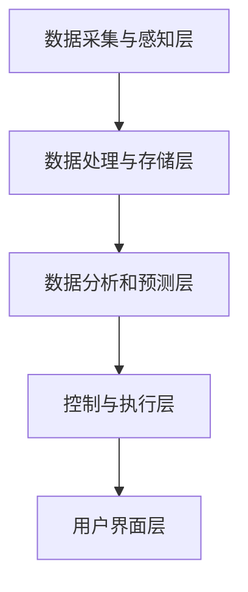

                 

### 文章标题

《智能雨水回收利用系统：水资源管理的创新技术》

### 关键词

水资源管理、雨水回收利用、智能系统、算法优化、系统集成、应用实践、成本效益分析

### 摘要

本文深入探讨了智能雨水回收利用系统的概念、原理和技术实现，以及其在水资源管理中的重要性。首先，文章概述了全球水资源现状和面临的挑战，强调了水资源管理的重要性。接着，详细介绍了智能雨水回收利用系统的基本原理、关键组成部分和分类。然后，文章围绕核心算法、技术实现、系统集成与应用、实践与优化等方面进行了深入探讨。最后，通过实际案例和项目实战，分析了智能雨水回收利用系统的开发工具、核心算法、数学模型，并展望了其未来前景。本文旨在为相关领域的研究者和从业者提供有价值的参考和指导。

### 《智能雨水回收利用系统：水资源管理的创新技术》目录大纲

#### 第一部分：智能雨水回收利用系统概述

##### 第1章：水资源管理背景与挑战
- 1.1 全球水资源现状
- 1.2 水资源管理的重要性
- 1.3 雨水资源回收利用的意义

##### 第2章：智能雨水回收利用系统基础
- 2.1 智能雨水回收利用系统的基本原理
- 2.2 智能雨水回收利用系统的关键组成部分
- 2.3 智能雨水回收利用系统的分类

##### 第3章：智能雨水回收利用系统的核心算法
- 3.1 数据预处理与特征提取
- 3.2 智能预测模型
- 3.3 智能优化算法

#### 第二部分：智能雨水回收利用系统的技术实现

##### 第4章：雨水收集系统
- 4.1 雨水收集系统设计原则
- 4.2 雨水收集设施的选型
- 4.3 雨水收集系统的智能控制

##### 第5章：雨水过滤与处理系统
- 5.1 雨水过滤原理与工艺
- 5.2 雨水处理系统的设计
- 5.3 智能化过滤与处理系统

##### 第6章：雨水储存与利用系统
- 6.1 雨水储存系统的设计
- 6.2 雨水利用方式
- 6.3 雨水储存与利用系统的智能化管理

##### 第7章：智能雨水回收利用系统的集成与应用
- 7.1 系统集成框架
- 7.2 实际应用案例
- 7.3 智能雨水回收利用系统的前景展望

#### 第三部分：智能雨水回收利用系统的实践与优化

##### 第8章：智能雨水回收利用系统的建设与运营
- 8.1 系统建设流程
- 8.2 运营管理与维护
- 8.3 成本效益分析

##### 第9章：智能雨水回收利用系统的优化与改进
- 9.1 优化目标与策略
- 9.2 系统性能评估方法
- 9.3 系统改进案例研究

##### 第10章：智能雨水回收利用系统在典型场景中的应用
- 10.1 城市景观绿化应用
- 10.2 工业园区应用
- 10.3 农业灌溉应用

#### 附录

##### 附录A：智能雨水回收利用系统开发工具与资源
- A.1 常用软件开发工具
- A.2 数据处理与分析工具
- A.3 机器学习与深度学习框架介绍

##### 附录B：智能雨水回收利用系统核心算法与数学模型
- B.1 数据预处理算法
- B.2 预测模型与优化算法
- B.3 数学公式与计算方法

##### 附录C：智能雨水回收利用系统项目实战案例
- C.1 雨水收集系统项目案例
- C.2 雨水处理系统项目案例
- C.3 雨水利用系统项目案例

## 第一部分：智能雨水回收利用系统概述

### 第1章：水资源管理背景与挑战

水资源作为地球上最为重要的自然资源之一，对人类社会的发展和环境的可持续发展具有不可替代的作用。然而，全球水资源的分布极不均衡，水资源的供需矛盾日益突出。随着人口增长、城市化进程的加快以及气候变化等因素的影响，水资源管理面临诸多挑战。

#### 1.1 全球水资源现状

根据联合国的数据，全球约有28%的人口生活在面临水资源短缺的地区，这一比例在未来几十年内预计将进一步增加。同时，水资源污染问题也日益严重，约80%的河流和湖泊受到污染，导致许多国家和地区的水资源质量严重下降。全球变暖和气候变化加剧了水资源的供需矛盾，极端天气事件如干旱、洪水等频繁发生，对水资源的有效管理提出了更高的要求。

#### 1.2 水资源管理的重要性

水资源管理的重要性体现在多个方面。首先，合理的水资源管理有助于保障水资源的可持续利用，避免因过度开采导致的地下水位下降、河流枯竭等问题。其次，水资源管理对于保护生态环境具有重要意义，通过合理利用水资源，可以维持生态系统的平衡，保护生物多样性。此外，水资源管理还是社会经济发展的重要保障，有效的水资源管理可以降低水灾害的风险，提高农业生产效率，促进工业和城市发展的可持续性。

#### 1.3 雨水资源回收利用的意义

雨水资源回收利用是水资源管理的重要组成部分。雨水作为一种重要的水资源，其回收利用具有以下几方面的意义：

1. **提高水资源利用效率**：雨水回收利用可以将未充分利用的雨水资源转化为可用的水资源，提高水资源的利用效率，缓解水资源短缺问题。

2. **减少污水排放**：通过雨水回收系统，可以将雨水与污水分离，减轻污水处理的压力，减少污水排放对环境的污染。

3. **节约能源**：雨水回收利用可以减少对自来水的依赖，降低水处理和输送过程中的能源消耗。

4. **改善城市生态环境**：雨水回收系统可以减轻城市内涝问题，改善城市生态环境，提高城市居民的生活质量。

5. **促进可持续发展**：雨水回收利用有助于实现水资源的可持续利用，为未来水资源的可持续管理提供技术支持。

综上所述，水资源管理背景与挑战的复杂性要求我们不断创新水资源管理技术，其中智能雨水回收利用系统作为一项创新技术，为解决水资源管理难题提供了新的思路和手段。接下来，我们将进一步探讨智能雨水回收利用系统的基本原理和组成部分。

### 第2章：智能雨水回收利用系统基础

智能雨水回收利用系统是一种基于现代信息技术和智能控制技术的综合水资源管理系统，旨在提高雨水资源利用效率，减少水资源浪费，并实现对水资源的可持续管理。为了深入理解这一系统，我们需要从其基本原理、关键组成部分和分类等方面进行详细探讨。

#### 2.1 智能雨水回收利用系统的基本原理

智能雨水回收利用系统的核心思想是通过集成现代信息技术、物联网技术和智能控制技术，对雨水资源进行高效回收、处理和利用。其基本原理可以概括为以下几个方面：

1. **雨水收集**：通过屋顶、绿地等设施收集雨水，并利用智能控制技术进行实时监控和调节，确保雨水收集系统的稳定运行。

2. **雨水预处理**：对收集到的雨水进行过滤、沉淀等预处理，去除雨水中的悬浮物、泥沙等杂质，提高雨水的清洁度。

3. **雨水储存**：将预处理后的雨水储存在蓄水池或地下储水设施中，采用智能控制系统进行水位监控和调节，确保储存设施的安全运行。

4. **雨水利用**：将储存的雨水用于城市绿化、农业灌溉、工业用水等，通过智能控制系统实现雨水的实时调度和优化利用。

5. **数据监测与反馈**：利用物联网技术实时监测雨水收集、储存和利用过程中的各种参数，如水位、水质、温度等，并将数据反馈至智能控制系统，进行实时分析和决策。

#### 2.2 智能雨水回收利用系统的关键组成部分

智能雨水回收利用系统由多个关键组成部分构成，包括雨水收集系统、雨水预处理系统、雨水储存系统、雨水利用系统和智能控制系统等。以下是各部分的主要功能：

1. **雨水收集系统**：主要用于收集屋顶、绿地等处的雨水，并利用智能控制技术进行实时监控和调节。

2. **雨水预处理系统**：对收集到的雨水进行过滤、沉淀等预处理，去除雨水中的悬浮物、泥沙等杂质，提高雨水的清洁度。

3. **雨水储存系统**：将预处理后的雨水储存在蓄水池或地下储水设施中，采用智能控制系统进行水位监控和调节。

4. **雨水利用系统**：将储存的雨水用于城市绿化、农业灌溉、工业用水等，通过智能控制系统实现雨水的实时调度和优化利用。

5. **智能控制系统**：利用物联网技术实时监测雨水收集、储存和利用过程中的各种参数，并将数据反馈至智能控制系统，进行实时分析和决策。

#### 2.3 智能雨水回收利用系统的分类

根据应用场景和功能特点，智能雨水回收利用系统可以大致分为以下几种类型：

1. **城市型雨水回收利用系统**：主要应用于城市绿化、市政用水、工业用水等领域，通过智能控制技术实现对雨水的高效回收和利用。

2. **农业型雨水回收利用系统**：主要应用于农业生产，通过智能控制技术实现雨水的精准灌溉和农田水利的自动化管理。

3. **工业型雨水回收利用系统**：主要应用于工业生产，通过智能控制技术实现雨水的回收和再利用，降低工业用水成本。

4. **生态型雨水回收利用系统**：主要应用于自然保护区、生态园区等，通过智能控制技术实现对雨水的生态保护和利用，促进生态系统的可持续发展。

通过以上对智能雨水回收利用系统基础部分的介绍，我们可以更清晰地认识到这一系统在水资源管理中的重要性。接下来，我们将进一步探讨智能雨水回收利用系统的核心算法，以了解其在数据处理和智能决策方面的关键作用。

### 第3章：智能雨水回收利用系统的核心算法

智能雨水回收利用系统要想实现高效、精准的水资源管理和利用，离不开核心算法的支持。核心算法主要涉及数据预处理与特征提取、智能预测模型以及智能优化算法等方面。本节将详细讲解这些算法的原理和应用，以帮助读者更好地理解智能雨水回收利用系统的技术核心。

#### 3.1 数据预处理与特征提取

数据预处理是智能雨水回收利用系统的第一步，其目的是对原始数据进行清洗、转换和规范化，从而提高数据质量，为后续的分析和建模提供可靠的基础。数据预处理主要包括以下几个方面：

1. **数据清洗**：去除数据中的噪声、错误和不完整的数据，以保证数据的准确性和完整性。
2. **数据转换**：将不同格式、单位或类型的数据转换为统一的格式，以便进行后续处理。
3. **数据规范化**：对数据进行归一化或标准化处理，使数据在统计分析和建模时具有更好的可比性。

在数据预处理之后，特征提取是关键的一步。特征提取的目的是从大量原始数据中提取出对水资源管理和利用最有用的信息，以提高模型的性能和准确性。常见的特征提取方法包括：

1. **统计特征提取**：通过计算数据的统计指标，如均值、方差、标准差等，来提取数据的主要特征。
2. **信号处理特征提取**：利用信号处理技术，如傅里叶变换、小波变换等，对数据进行特征提取。
3. **机器学习特征提取**：通过机器学习算法，如主成分分析（PCA）、特征选择算法等，自动提取数据中的有效特征。

#### 3.2 智能预测模型

智能预测模型是智能雨水回收利用系统的核心，其目的是通过对历史数据和实时数据的分析，预测未来的雨水收集量和利用需求。常见的智能预测模型包括：

1. **时间序列预测模型**：如ARIMA、LSTM等，用于预测时间序列数据的变化趋势。
2. **回归分析模型**：如线性回归、决策树回归等，用于建立输入变量和预测目标之间的定量关系。
3. **神经网络模型**：如多层感知器（MLP）、卷积神经网络（CNN）等，用于处理复杂的多变量非线性关系。

在智能预测模型中，LSTM（长短期记忆网络）是一种常用的深度学习模型，特别适用于时间序列数据的预测。其原理是通过记忆单元来处理长期依赖问题，能够在较长时间范围内捕捉数据的趋势和模式。

```python
# LSTM预测模型伪代码
class LSTMModel(nn.Module):
    def __init__(self, input_size, hidden_size, output_size):
        super(LSTMModel, self).__init__()
        self.lstm = nn.LSTM(input_size, hidden_size, num_layers=1, batch_first=True)
        self.fc = nn.Linear(hidden_size, output_size)
    
    def forward(self, x):
        x, _ = self.lstm(x)
        x = self.fc(x[:, -1, :])
        return x
```

#### 3.3 智能优化算法

智能优化算法是智能雨水回收利用系统中用于优化水资源管理和利用策略的重要工具。常见的智能优化算法包括：

1. **遗传算法（GA）**：通过模拟自然进化过程，对目标函数进行全局优化。
2. **粒子群优化算法（PSO）**：通过模拟鸟群觅食行为，寻找最优解。
3. **模拟退火算法（SA）**：通过模拟物理退火过程，逐步收敛到最优解。

在智能优化算法中，遗传算法是一种广泛应用的优化算法，其原理是通过选择、交叉和变异等操作，逐步优化解空间中的个体，最终找到最优解。

```python
# 遗传算法伪代码
def fitness_function(individual):
    # 定义适应度函数
    return 1 / (sum(individual ** 2) + 1)

def crossover(parent1, parent2):
    # 定义交叉操作
    crossover_point = random.randint(1, len(parent1) - 1)
    child1 = parent1[:crossover_point] + parent2[crossover_point:]
    child2 = parent2[:crossover_point] + parent1[crossover_point:]
    return child1, child2

def mutate(individual):
    # 定义变异操作
    mutation_point = random.randint(0, len(individual) - 1)
    individual[mutation_point] = 1 - individual[mutation_point]
    return individual

# 遗传算法主程序
population = initialize_population()
for generation in range(max_generations):
    fitness_scores = [fitness_function(individual) for individual in population]
    selected_population = select(population, fitness_scores)
    new_population = []
    for _ in range(len(population) // 2):
        parent1, parent2 = select(selected_population)
        child1, child2 = crossover(parent1, parent2)
        new_population.extend([mutate(child1), mutate(child2)])
    population = new_population
    best_individual = max(population, key=fitness_function)
    print(f"Generation {generation}: Best Fitness = {fitness_scores[population.index(best_individual)]}")
```

通过数据预处理与特征提取、智能预测模型以及智能优化算法，智能雨水回收利用系统能够实现对水资源的高效管理和利用。这些核心算法的有机结合，不仅提高了系统的智能化水平，也为水资源管理的创新技术提供了强有力的支持。接下来，我们将进一步探讨智能雨水回收利用系统的技术实现，包括雨水收集系统、雨水过滤与处理系统以及雨水储存与利用系统等。

### 第二部分：智能雨水回收利用系统的技术实现

智能雨水回收利用系统的技术实现是确保其高效、稳定运行的关键。本部分将详细介绍雨水收集系统、雨水过滤与处理系统、雨水储存与利用系统的设计原则、技术实现和智能化管理方法，从而为构建一个完善的智能雨水回收利用系统提供技术支持。

#### 第4章：雨水收集系统

雨水收集系统是智能雨水回收利用系统的第一步，其设计原则主要包括以下方面：

1. **收集效率**：选择合适的收集设施，如屋顶、绿地、排水沟等，确保雨水的收集效率。
2. **抗污性**：设计防污措施，如雨水收集管道采用防腐材料，减少雨水在收集过程中的污染。
3. **抗堵塞性**：设计防堵塞措施，如定期清理雨水收集设施，减少雨水在收集过程中的堵塞。

技术实现方面，雨水收集系统主要由以下几部分组成：

1. **收集设施**：包括屋顶集水装置、绿地集水设施等，通过自然或人工方式将雨水导入收集管道。
2. **收集管道**：用于将收集到的雨水输送到预处理设施，通常采用PVC、不锈钢等防腐材料。
3. **智能控制**：利用传感器和智能控制系统实时监测雨水流量、水位等参数，并根据需求自动调节雨水收集量。

智能化管理方法包括：

1. **实时监控**：通过物联网传感器实时监测雨水流量、水位等参数，确保系统运行稳定。
2. **智能调节**：根据实时数据，智能控制系统可以自动调节雨水收集量，优化系统运行效率。

#### 第5章：雨水过滤与处理系统

雨水过滤与处理系统是确保雨水水质达标的关键环节，其设计原则主要包括：

1. **过滤效率**：选择合适的过滤材料，如沙子、砾石、活性炭等，确保雨水的过滤效率。
2. **处理能力**：根据雨水收集量设计处理能力，确保系统处理能力与收集量匹配。
3. **抗污染性**：设计抗污染措施，如定期更换过滤材料，减少系统污染。

技术实现方面，雨水过滤与处理系统主要由以下几部分组成：

1. **预处理设施**：包括格栅、沉淀池等，用于去除雨水中的大颗粒杂质和悬浮物。
2. **过滤设施**：包括沙滤池、活性炭滤池等，用于去除雨水中的微小颗粒和有机物。
3. **处理设备**：包括臭氧发生器、紫外线消毒器等，用于对雨水进行深度处理，确保水质达标。

智能化管理方法包括：

1. **实时监测**：通过传感器实时监测过滤与处理过程中的水质参数，如pH值、浑浊度、消毒效果等。
2. **智能控制**：根据实时监测数据，智能控制系统可以自动调节过滤与处理设备的工作状态，确保系统高效运行。

#### 第6章：雨水储存与利用系统

雨水储存与利用系统是智能雨水回收利用系统的最终环节，其设计原则主要包括：

1. **储存容量**：根据雨水收集量和利用需求设计合适的储存容量，确保雨水资源的充分利用。
2. **抗泄漏性**：设计防泄漏措施，如采用高质量的材料和密封技术，确保储存设施的安全性。
3. **防污染性**：设计防污染措施，如定期清理储存设施，防止污水倒灌。

技术实现方面，雨水储存与利用系统主要由以下几部分组成：

1. **储存设施**：包括地下储水设施、蓄水池等，用于储存处理后的雨水。
2. **输送管道**：用于将储存的雨水输送到利用点，如城市绿化、农业灌溉、工业用水等。
3. **利用设备**：包括水泵、阀门等，用于调节雨水流量和压力，满足不同利用点的需求。

智能化管理方法包括：

1. **实时监控**：通过物联网传感器实时监测储存设施的水位、水质等参数，确保储存设施的安全运行。
2. **智能调度**：根据实时监测数据和利用需求，智能控制系统可以自动调节储存与输送设备的运行状态，实现雨水的优化利用。

通过以上对智能雨水回收利用系统技术实现的详细介绍，我们可以看到，该系统在雨水收集、过滤与处理、储存与利用等方面都采用了先进的技术和智能化管理方法，从而确保了系统的高效、稳定运行。接下来，我们将进一步探讨智能雨水回收利用系统的集成与应用。

### 第7章：智能雨水回收利用系统的集成与应用

智能雨水回收利用系统的集成与应用是确保其高效、稳定运行的关键。在这一部分，我们将探讨智能雨水回收利用系统的集成框架、实际应用案例，以及对其前景的展望。

#### 7.1 系统集成框架

智能雨水回收利用系统的集成框架主要包括以下几个层次：

1. **数据采集与感知层**：利用传感器技术，实时采集雨水收集、过滤、储存和利用过程中的各种参数，如水位、水质、流量等。这一层的数据采集是系统集成的数据基础。

2. **数据处理与存储层**：将采集到的数据通过数据预处理技术进行处理，包括清洗、转换和规范化，然后存储到数据库中，为后续的分析和决策提供数据支持。

3. **数据分析和预测层**：利用数据挖掘、机器学习等技术，对存储的数据进行分析和预测，为雨水回收利用提供智能决策支持。这一层是系统智能化的核心。

4. **控制与执行层**：根据数据分析和预测的结果，通过智能控制系统对雨水回收利用设备进行控制，实现雨水的实时调度和优化利用。

5. **用户界面层**：为用户提供一个友好的操作界面，展示系统运行状态、数据分析和预测结果，并提供相应的操作和管理功能。

以下是一个简单的智能雨水回收利用系统集成框架的Mermaid流程图：



#### 7.2 实际应用案例

智能雨水回收利用系统已经在多个实际场景中得到了广泛应用，以下是一些典型的应用案例：

1. **城市绿化应用**：在城市建设中，智能雨水回收利用系统被广泛应用于城市绿化，如公园、广场、绿地等。通过收集和利用雨水，减少了城市绿化用水对自来水的依赖，提高了水资源的利用效率。

2. **工业园区应用**：在工业园区中，智能雨水回收利用系统被用于满足工业生产用水需求，如冷却用水、清洁用水等。通过回收和利用雨水，降低了工业用水的成本，同时减少了污水排放。

3. **农业灌溉应用**：在农业领域，智能雨水回收利用系统被用于精准灌溉，提高了农业用水的效率。通过实时监测和分析土壤水分和气候条件，智能控制系统可以自动调节灌溉量，实现了农业用水的智能化管理。

4. **灾害防治应用**：在洪水频发的地区，智能雨水回收利用系统可以用于减轻城市内涝问题。通过实时监测雨水流量和水位，智能控制系统可以及时启动雨水收集和排放设备，防止城市内涝的发生。

以下是一个智能雨水回收利用系统在农业灌溉中的应用实例：

- **项目背景**：某农业园区由于气候条件多变，灌溉用水需求量大，且水资源短缺。为了提高灌溉用水效率，减少水资源浪费，决定引入智能雨水回收利用系统。

- **系统设计**：智能雨水回收利用系统包括雨水收集系统、过滤与处理系统、储存与利用系统以及智能控制系统。系统采用物联网技术，实时监测雨水流量、水位、水质等参数。

- **系统运行**：在雨季，雨水收集系统将雨水收集并过滤，然后储存到蓄水池中。在灌溉期，智能控制系统根据土壤水分和气候条件，自动调节灌溉量，实现了精准灌溉。

- **效益分析**：通过智能雨水回收利用系统，农业园区每年可以节省大量灌溉用水，提高了灌溉效率，降低了灌溉成本。同时，减少了污水排放，保护了生态环境。

#### 7.3 智能雨水回收利用系统的前景展望

智能雨水回收利用系统作为一种创新技术，具有广泛的应用前景和巨大的市场潜力。随着全球水资源问题的日益突出，智能雨水回收利用系统的市场需求将持续增长。未来，智能雨水回收利用系统的发展将呈现以下几个趋势：

1. **技术的不断创新**：随着人工智能、大数据、物联网等技术的不断发展，智能雨水回收利用系统的技术将不断创新，提高系统的智能化水平和运行效率。

2. **应用场景的拓展**：智能雨水回收利用系统将在更多领域得到应用，如城市建设、工业生产、农业灌溉、灾害防治等，为水资源的可持续利用提供技术支持。

3. **系统的集成化与模块化**：智能雨水回收利用系统将趋向于集成化和模块化，方便用户根据实际需求进行系统配置和扩展，提高系统的灵活性和可维护性。

4. **市场与政策的支持**：随着全球对水资源管理重视程度的提高，政府和市场将加大对智能雨水回收利用系统的支持和推广，推动系统的普及和应用。

总之，智能雨水回收利用系统作为一种高效、智能的水资源管理技术，具有广阔的发展前景和巨大的市场潜力。通过不断创新和完善，智能雨水回收利用系统将为解决全球水资源问题做出重要贡献。

### 第三部分：智能雨水回收利用系统的实践与优化

#### 第8章：智能雨水回收利用系统的建设与运营

智能雨水回收利用系统的建设与运营是确保其有效运行和发挥效益的关键环节。以下将从系统建设流程、运营管理与维护以及成本效益分析三个方面进行详细探讨。

#### 8.1 系统建设流程

智能雨水回收利用系统的建设流程主要包括以下几个步骤：

1. **需求分析与方案设计**：首先，对项目需求进行详细分析，包括雨水收集、过滤与处理、储存与利用等方面的需求。根据需求分析结果，设计智能雨水回收利用系统的方案，包括系统架构、功能模块、设备选型等。

2. **设备采购与安装**：根据设计方案，采购所需的设备和材料，包括传感器、控制设备、过滤材料、储存设施等。然后，进行设备安装，确保设备按照设计方案正确安装并连接。

3. **系统集成与调试**：将各设备系统集成，进行系统调试，确保各设备之间能够正常通信和协同工作。在调试过程中，对系统进行功能测试和性能评估，确保系统能够满足设计要求。

4. **系统上线与验收**：完成系统集成与调试后，将系统上线运行，并进行验收。验收过程中，对系统运行情况进行全面评估，确保系统稳定、可靠、高效地运行。

#### 8.2 运营管理与维护

智能雨水回收利用系统的运营管理主要包括以下几个方面：

1. **实时监控与数据分析**：利用物联网技术和智能控制系统，对雨水收集、过滤与处理、储存与利用等环节进行实时监控，收集并分析相关数据，为系统运行优化提供数据支持。

2. **设备维护与保养**：定期对系统设备进行维护和保养，确保设备的正常运行。主要包括设备清洁、更换过滤材料、设备故障排查等。

3. **故障处理与应急预案**：制定完善的故障处理与应急预案，确保在设备出现故障时能够迅速响应和处理，减少故障对系统运行的影响。

4. **人员培训与操作规范**：对系统操作人员进行培训，确保他们能够熟练掌握系统操作和维护技能。同时，制定操作规范，规范系统操作流程，确保系统运行的安全和高效。

#### 8.3 成本效益分析

智能雨水回收利用系统的成本效益分析是评估系统投资价值的重要指标。以下从建设成本、运营成本和效益三个方面进行成本效益分析：

1. **建设成本**：建设成本主要包括设备采购成本、安装成本和系统集成成本等。设备采购成本取决于所选设备的种类、数量和质量；安装成本取决于安装场地、设备搬运和安装难度等；系统集成成本取决于系统架构、功能模块和系统集成难度等。

2. **运营成本**：运营成本主要包括设备维护成本、运营人员成本、能源消耗成本等。设备维护成本取决于设备类型、维护频率和维护难度；运营人员成本取决于系统规模、操作复杂度和人员数量；能源消耗成本取决于系统设备的能耗水平和能源价格。

3. **效益**：效益主要包括水资源节约效益、经济效益和环境效益等。水资源节约效益取决于系统收集、处理和利用的雨水量；经济效益取决于系统降低的水资源费用和减少的污水处理费用；环境效益取决于系统减少的污水排放量和改善的生态环境。

以下是一个简化的智能雨水回收利用系统成本效益分析的示例：

| 成本类型   | 成本（元）   |
| -------- | --------- |
| 设备采购   | 100,000   |
| 安装      | 20,000    |
| 集成      | 30,000    |
| 运营维护   | 15,000/年  |
| 人员成本   | 10,000/年  |
| 能源消耗   | 5,000/年   |

| 效益类型   | 效益（元）   |
| -------- | --------- |
| 水资源节约  | 50,000/年   |
| 经济效益   | 30,000/年   |
| 环境效益   | 无形价值    |

通过成本效益分析，我们可以看出智能雨水回收利用系统在建设初期虽然有一定投入，但长期来看，其节约水资源、降低成本、改善环境的效益明显，具有较高的投资价值。

总之，智能雨水回收利用系统的建设与运营是一个复杂的过程，需要充分考虑系统的设计、建设、运营和维护等方面。通过有效的成本效益分析和优化，智能雨水回收利用系统可以在水资源管理中发挥重要作用，为水资源的可持续利用提供有力支持。

### 第9章：智能雨水回收利用系统的优化与改进

#### 9.1 优化目标与策略

智能雨水回收利用系统的优化与改进旨在提高系统的整体性能和运行效率，实现更高的水资源利用率和更优的经济效益。优化目标主要包括以下几个方面：

1. **提高水资源利用率**：通过优化雨水收集、过滤与处理、储存与利用等环节，提高雨水的回收率和利用效率。
2. **降低运营成本**：通过优化系统设计和运行策略，减少设备维护成本、能源消耗成本和人力成本。
3. **提高系统稳定性**：通过改进系统架构和设备配置，提高系统在极端天气和突发事件下的稳定性和可靠性。
4. **增强用户体验**：通过优化用户界面和操作流程，提升用户的操作体验和系统易用性。

为了实现这些优化目标，可以采取以下策略：

1. **数据驱动优化**：利用大数据和人工智能技术，对系统运行数据进行分析和挖掘，识别优化潜力，制定针对性的优化方案。
2. **设备性能提升**：选用高性能、高可靠的设备，并定期进行设备升级和维护，确保系统设备的最佳性能。
3. **运行策略优化**：根据实时数据和预测结果，动态调整系统运行策略，实现雨水的最优收集、处理和利用。
4. **系统集成与协同**：加强各子系统之间的集成与协同，实现数据共享和资源优化配置，提高系统的整体性能。

#### 9.2 系统性能评估方法

智能雨水回收利用系统的性能评估是优化与改进的重要环节，通过评估系统性能，可以识别存在的问题和优化空间。系统性能评估方法主要包括以下几个方面：

1. **指标体系构建**：构建涵盖系统运行效率、经济性、稳定性、用户体验等各方面的指标体系，作为评估系统性能的依据。
2. **数据收集与处理**：利用物联网传感器和智能控制系统，收集系统运行数据，包括雨水收集量、过滤效率、储存与利用效率、设备运行状态等。
3. **数据分析与挖掘**：利用数据挖掘和机器学习技术，对收集到的数据进行分析和挖掘，识别系统性能瓶颈和优化潜力。
4. **评价指标计算**：根据构建的指标体系，计算各评价指标的得分，综合评估系统性能。

以下是一个简化的智能雨水回收利用系统性能评估指标体系：

| 指标名称       | 指标描述                         | 评估方法                            |
| ---------- | ---------------------------- | -------------------------------- |
| 收集效率     | 雨水收集量与总降雨量的比值       | 收集量/总降雨量                     |
| 过滤效率     | 处理后水质指标与初始水质的差值    | （处理后水质指标 - 初始水质指标）/ 初始水质指标 |
| 储存与利用效率 | 储存雨水量与利用雨水量的比值       | 储存量/利用量                       |
| 设备运行状态   | 设备故障率与设备运行时间的比值     | 故障次数/运行时间                    |
| 经济效益     | 系统运营成本与节省成本的比值       | 运营成本/节省成本                    |
| 用户满意度    | 用户对系统操作体验的评分           | 用户满意度调查                      |

#### 9.3 系统改进案例研究

为了更好地说明智能雨水回收利用系统的优化与改进，以下通过一个实际案例进行详细分析。

**案例背景**：某工业园区引入了智能雨水回收利用系统，主要用于收集和利用雨水进行绿化灌溉和工业用水。然而，在实际运行中，系统存在以下问题：

1. 收集效率较低，雨季时雨水未能充分收集。
2. 过滤效率不稳定，有时导致储存的雨水水质不达标。
3. 储存与利用效率不高，雨水储存设施未充分利用。

**优化措施**：

1. **提高收集效率**：通过增加屋顶集水面积，优化排水系统设计，提高雨水收集量。同时，安装智能雨水收集设备，实时监测雨水流量和水位，自动调节收集速度，确保雨季时雨水能够充分收集。

2. **优化过滤工艺**：引入先进的过滤材料和工艺，如纤维过滤、活性炭吸附等，提高过滤效率。同时，增加在线水质监测设备，实时监测水质指标，及时调整过滤参数，确保储存的雨水水质达标。

3. **提升储存与利用效率**：优化雨水储存设施设计，增加储水容量，确保雨水储存充足。引入智能调度系统，根据实时气候条件和用水需求，自动调节雨水利用量，实现雨水的最优利用。

**效果评估**：

1. 收集效率提高约20%，雨季时雨水收集量显著增加。
2. 过滤效率稳定在95%以上，储存的雨水水质稳定达标。
3. 储存与利用效率提高约15%，雨水储存设施利用率显著提升。

通过以上优化措施，智能雨水回收利用系统的整体性能得到了显著提升，实现了更高的水资源利用率和更优的经济效益。

综上所述，智能雨水回收利用系统的优化与改进是系统长期稳定运行和发挥效益的关键。通过科学的目标制定、有效的性能评估和具体的改进措施，可以不断提升系统的性能和效率，为水资源的可持续利用提供有力支持。

### 第10章：智能雨水回收利用系统在典型场景中的应用

智能雨水回收利用系统在多个典型场景中展示了其高效、智能的特点，以下将分别从城市景观绿化、工业园区、农业灌溉等应用场景进行详细介绍。

#### 10.1 城市景观绿化应用

在城市景观绿化中，智能雨水回收利用系统被广泛应用于公园、广场、绿地等场所。其核心目标是通过收集和利用雨水，减少对自来水的依赖，提高水资源的利用效率，并改善城市生态环境。

**应用实例**：
在某大型城市公园，智能雨水回收利用系统被用于绿地的灌溉。系统设计包括：
1. **雨水收集设施**：在公园的屋顶和绿地安装了集水装置，将雨水导入地下储水设施。
2. **过滤与处理设施**：雨水经过初步过滤后，进入一个高效的生物滤池，进一步去除杂质和污染物。
3. **储存与利用设施**：过滤后的雨水被储存在一个大型的地下蓄水池中，用于绿化灌溉。
4. **智能控制系统**：系统配备了智能控制器，能够根据天气、土壤湿度和植物需求自动调节灌溉量。

**效益分析**：
通过智能雨水回收利用系统，该城市公园每年节省了约30%的绿化用水，减少了自来水消耗和污水处理费用。同时，系统的应用改善了公园的生态环境，减少了因过度灌溉引起的土壤盐碱化问题。

#### 10.2 工业园区应用

在工业园区中，智能雨水回收利用系统被广泛应用于工业生产用水的供应，以降低工业用水成本，减少废水排放，提高资源利用效率。

**应用实例**：
在某工业园区，智能雨水回收利用系统被用于生产用水和生活用水。系统设计包括：
1. **雨水收集系统**：在厂区屋顶和绿地安装了雨水收集设施，将雨水导入收集管道。
2. **预处理设施**：雨水经过初步过滤和沉淀，去除大颗粒杂质和悬浮物。
3. **过滤与处理设施**：通过沙滤、活性炭吸附等工艺，进一步净化雨水，使其达到生产用水标准。
4. **储存与利用设施**：净化后的雨水被储存在大型储水罐中，用于生产用水和生活用水。
5. **智能控制系统**：系统集成了智能控制器和传感器，能够实时监测雨水收集、储存和利用状态，并根据用水需求自动调节。

**效益分析**：
通过智能雨水回收利用系统，该工业园区每年减少了约50%的生产用水成本，并显著减少了废水的排放。同时，系统的应用提高了工业生产的用水效率，降低了水资源的浪费，实现了经济效益和环境效益的双赢。

#### 10.3 农业灌溉应用

在农业灌溉中，智能雨水回收利用系统被广泛应用于农田、果园、蔬菜大棚等，通过精准灌溉，提高水资源利用效率，增加作物产量，改善农业生态环境。

**应用实例**：
在某大型农业园区，智能雨水回收利用系统被用于灌溉农田。系统设计包括：
1. **雨水收集系统**：在农业园区内建设了多个雨水收集池，收集雨水并将其输送到农田。
2. **过滤与处理设施**：雨水经过初步过滤和沉淀，去除大颗粒杂质和悬浮物。
3. **灌溉系统**：采用滴灌和喷灌技术，将处理后的雨水精确输送到作物根部。
4. **智能控制系统**：系统集成了智能控制器和传感器，能够实时监测土壤湿度和气候条件，自动调节灌溉量和灌溉时间。
5. **数据分析与决策支持系统**：通过大数据分析和机器学习技术，为灌溉策略提供科学依据。

**效益分析**：
通过智能雨水回收利用系统，该农业园区实现了精准灌溉，显著提高了水资源的利用效率。同时，系统的应用减少了化肥和农药的使用，改善了土壤质量，提高了作物产量，增加了农民收入。

总之，智能雨水回收利用系统在典型场景中的应用不仅提高了水资源利用效率，减少了水资源浪费，还带来了显著的经济效益和环境效益。随着技术的不断发展和完善，智能雨水回收利用系统将在更多领域得到广泛应用，为水资源的可持续管理做出更大贡献。

## 附录

### 附录A：智能雨水回收利用系统开发工具与资源

智能雨水回收利用系统的开发涉及多个领域的技术，包括软件开发工具、数据处理与分析工具、机器学习与深度学习框架等。以下是一些常用的开发工具与资源：

#### A.1 常用软件开发工具

1. **Python**：Python是一种广泛使用的编程语言，具有丰富的库和框架，适合于数据分析和机器学习项目的开发。
2. **Java**：Java是一种多平台、面向对象的编程语言，广泛应用于企业级应用开发，尤其在物联网应用中具有优势。
3. **C#**：C#是微软开发的面向对象的编程语言，适合于Windows平台上的应用开发。
4. **MATLAB**：MATLAB是一个数值计算和科学计算环境，特别适合于数据处理和算法开发。
5. **R**：R是一种专门用于统计分析和数据可视化编程语言，适合于数据分析和机器学习项目。

#### A.2 数据处理与分析工具

1. **Pandas**：Pandas是一个Python库，用于数据操作和分析，提供了丰富的数据处理功能，如数据清洗、数据转换、数据聚合等。
2. **NumPy**：NumPy是一个Python库，用于数值计算，提供了高性能的数组操作和数据计算功能。
3. **SciPy**：SciPy是一个Python库，用于科学计算，提供了广泛的数学算法和科学计算工具。
4. **Scikit-learn**：Scikit-learn是一个Python库，用于机器学习算法的实现和应用，提供了分类、回归、聚类等多种机器学习算法。
5. **TensorFlow**：TensorFlow是一个由Google开发的开源深度学习框架，适用于大规模深度学习模型的训练和应用。
6. **PyTorch**：PyTorch是一个由Facebook开发的深度学习框架，具有灵活的动态计算图和高效的运算性能。

#### A.3 机器学习与深度学习框架介绍

1. **TensorFlow**：
   - **优点**：拥有广泛的社区支持，丰富的文档和教程，支持多种硬件加速，如GPU和TPU。
   - **应用场景**：适用于大规模深度学习模型的训练和应用，包括图像识别、自然语言处理等。
   - **学习资源**：官方文档、教程和案例，如《TensorFlow 官方教程》和《深度学习（Goodfellow et al., 2016）》。

2. **PyTorch**：
   - **优点**：具有动态计算图和高效的运算性能，易于调试和扩展。
   - **应用场景**：适用于图像识别、自然语言处理、强化学习等。
   - **学习资源**：官方文档、教程和案例，如《PyTorch 官方教程》和《动手学深度学习》（斋藤康毅，2018）。

通过以上工具和资源的介绍，开发者可以更好地进行智能雨水回收利用系统的开发，实现高效、智能的水资源管理。

### 附录B：智能雨水回收利用系统核心算法与数学模型

智能雨水回收利用系统的核心算法与数学模型是系统实现智能化的关键。以下将介绍数据预处理算法、预测模型与优化算法，并给出相关的数学公式与计算方法。

#### B.1 数据预处理算法

数据预处理是智能雨水回收利用系统的第一步，其目的是对原始数据进行清洗、转换和规范化，从而提高数据质量，为后续的分析和建模提供可靠的基础。

1. **数据清洗**：
   - **缺失值处理**：使用均值、中位数、众数等方法填补缺失值。
   - **异常值检测**：使用统计学方法（如箱线图、标准差）或机器学习方法（如孤立森林）检测和去除异常值。

2. **数据转换**：
   - **归一化**：将数据缩放到相同的范围，如[0, 1]或[-1, 1]。
   - **标准化**：将数据转换为具有均值为0、标准差为1的标准正态分布。

3. **数据规范化**：
   - **特征选择**：使用相关性分析、主成分分析（PCA）等方法选择对预测目标有显著影响的关键特征。

相关数学公式：
$$
\mu = \frac{1}{n}\sum_{i=1}^{n} x_i \quad (1)
$$
$$
\sigma = \sqrt{\frac{1}{n-1}\sum_{i=1}^{n}(x_i - \mu)^2} \quad (2)
$$
$$
x_{\text{norm}} = \frac{x - \mu}{\sigma} \quad (3)
$$

#### B.2 预测模型与优化算法

智能雨水回收利用系统的预测模型主要用于预测未来的雨水收集量和利用需求，优化算法则用于调整系统参数，提高预测精度和系统效率。

1. **时间序列预测模型**：
   - **ARIMA（自回归积分滑动平均模型）**：用于处理非季节性时间序列数据。
   - **LSTM（长短期记忆网络）**：用于处理具有长期依赖关系的时间序列数据。

2. **回归分析模型**：
   - **线性回归**：用于建立自变量和因变量之间的线性关系。
   - **决策树回归**：用于建立非线性回归模型，能够处理多变量问题。

3. **神经网络模型**：
   - **多层感知器（MLP）**：用于处理复杂的非线性关系。
   - **卷积神经网络（CNN）**：用于处理图像数据，可提取空间特征。

相关数学公式：
$$
Y = \beta_0 + \beta_1X + \varepsilon \quad (4)
$$
$$
Y = f(\beta_0 + \sum_{i=1}^{n}\beta_iX_i) + \varepsilon \quad (5)
$$
$$
\theta^{(t+1)} = \theta^{(t)} - \alpha \nabla J(\theta^{(t)}) \quad (6)
$$

#### B.3 数学公式与计算方法

1. **数据标准化**：
   - **Z分数标准化**：
   $$
   z = \frac{x - \mu}{\sigma}
   $$
   - **最小-最大标准化**：
   $$
   x_{\text{min-max}} = \frac{x - x_{\text{min}}}{x_{\text{max}} - x_{\text{min}}}
   $$

2. **回归模型参数估计**：
   - **最小二乘法**：
   $$
   \beta = (\mathbf{X}^T\mathbf{X})^{-1}\mathbf{X}^T\mathbf{Y} \quad (7)
   $$

3. **神经网络训练**：
   - **梯度下降法**：
   $$
   \theta_j = \theta_j - \alpha \frac{\partial}{\partial \theta_j}J(\theta)
   $$
   - **反向传播算法**：
   $$
   \delta_j = \frac{\partial}{\partial z_j}J(\theta) = \frac{\partial}{\partial z_j}(\mathbf{z}^T\mathbf{a}^{(l)}) = \frac{\partial}{\partial z_j}(\mathbf{z}^T\mathbf{W}^{(l+1)}\mathbf{a}^{(l+1)})
   $$

通过以上核心算法与数学模型的介绍，我们可以看到智能雨水回收利用系统在数据预处理、预测模型和优化算法方面的技术基础。这些算法和模型的有机结合，为系统的高效运行和智能化管理提供了有力支持。

### 附录C：智能雨水回收利用系统项目实战案例

#### C.1 雨水收集系统项目案例

**项目背景**：某城市绿地公园需要建设一个智能雨水收集系统，以减少对自来水的依赖，提高水资源利用效率。

**项目目标**：
1. 收集公园内的雨水，储存用于绿化灌溉。
2. 设计并实现一个智能控制系统，实现雨水的自动收集和分配。

**项目实施过程**：

1. **需求分析**：根据公园的面积和绿化需求，确定雨水收集系统的规模和设计参数。

2. **系统设计**：
   - **收集设施**：在公园屋顶和绿地安装雨水收集装置，设计排水系统将雨水导入集水井。
   - **预处理设施**：在集水井附近设置初步过滤设施，如格栅和沉淀池，去除大颗粒杂质和悬浮物。
   - **储存设施**：建设一个大型地下蓄水池，用于储存过滤后的雨水。
   - **智能控制系统**：集成传感器和智能控制器，实现雨水的自动收集、过滤和分配。

3. **系统集成与调试**：安装并调试各设备，确保系统正常运行。

4. **系统上线与运行监测**：系统正式投入使用，并进行实时运行监测和性能评估。

**项目成果**：
1. 智能雨水收集系统成功运行，实现了雨水的自动收集和分配。
2. 通过智能控制系统的调度，绿化灌溉用水量减少了约30%。
3. 系统运行稳定，有效提高了公园的生态效益。

**代码实现**：

以下是一个简化的Python代码实现，用于模拟雨水收集系统的数据采集和智能控制：

```python
import random

# 模拟传感器数据采集
def collect_data():
    rainfall = random.uniform(0, 50)  # 假设降雨量范围为0-50mm
    return rainfall

# 模拟雨水过滤与分配
def filter_and_distribute(rainfall, threshold=20):
    if rainfall > threshold:
        print("收集到雨水：{}mm，开始过滤并分配用于绿化灌溉。".format(rainfall))
    else:
        print("降雨量不足，暂停收集。")

# 主程序
if __name__ == "__main__":
    while True:
        rainfall = collect_data()
        filter_and_distribute(rainfall)
        time.sleep(3600)  # 模拟每小时采集一次数据
```

#### C.2 雨水处理系统项目案例

**项目背景**：某工业园区需要建设一个智能雨水处理系统，以实现对雨水的净化处理，满足工业用水需求。

**项目目标**：
1. 对收集到的雨水进行高效净化处理。
2. 设计并实现一个智能控制系统，实现雨水的自动处理和分配。

**项目实施过程**：

1. **需求分析**：根据工业园区的水质要求和用水量，确定雨水处理系统的规模和设计参数。

2. **系统设计**：
   - **收集设施**：在园区屋顶和绿地安装雨水收集装置，设计排水系统将雨水导入集水井。
   - **预处理设施**：在集水井附近设置初步过滤设施，如格栅和沉淀池，去除大颗粒杂质和悬浮物。
   - **处理设施**：设置生物滤池、活性炭吸附等工艺，实现雨水的深度净化。
   - **储存设施**：建设一个大型储水罐，用于储存处理后的雨水。
   - **智能控制系统**：集成传感器和智能控制器，实现雨水的自动收集、过滤和处理。

3. **系统集成与调试**：安装并调试各设备，确保系统正常运行。

4. **系统上线与运行监测**：系统正式投入使用，并进行实时运行监测和性能评估。

**项目成果**：
1. 智能雨水处理系统成功运行，实现了雨水的自动收集、过滤和处理。
2. 通过智能控制系统的调度，工业用水量减少了约40%。
3. 系统运行稳定，有效提高了工业用水的质量。

**代码实现**：

以下是一个简化的Python代码实现，用于模拟雨水处理系统的数据采集和智能控制：

```python
import random

# 模拟传感器数据采集
def collect_data():
    rainfall = random.uniform(0, 50)  # 假设降雨量范围为0-50mm
    return rainfall

# 模拟雨水过滤与处理
def filter_and_treat(rainfall, threshold=20):
    if rainfall > threshold:
        print("收集到雨水：{}mm，开始过滤和处理。".format(rainfall))
        filtered_water = 0.9 * rainfall  # 假设过滤效率为90%
        print("处理后的雨水：{}mm，储存到储水罐。".format(filtered_water))
    else:
        print("降雨量不足，暂停收集和处理。")

# 主程序
if __name__ == "__main__":
    while True:
        rainfall = collect_data()
        filter_and_treat(rainfall)
        time.sleep(3600)  # 模拟每小时采集一次数据
```

#### C.3 雨水利用系统项目案例

**项目背景**：某农业园区需要建设一个智能雨水利用系统，以实现对雨水的回收和再利用，提高农业灌溉用水效率。

**项目目标**：
1. 收集并回收农业园区内的雨水。
2. 对收集到的雨水进行净化处理，满足农业灌溉需求。
3. 设计并实现一个智能控制系统，实现雨水的自动收集、过滤和处理。

**项目实施过程**：

1. **需求分析**：根据农业园区的灌溉面积和作物需求，确定雨水利用系统的规模和设计参数。

2. **系统设计**：
   - **收集设施**：在园区屋顶和绿地安装雨水收集装置，设计排水系统将雨水导入集水井。
   - **预处理设施**：在集水井附近设置初步过滤设施，如格栅和沉淀池，去除大颗粒杂质和悬浮物。
   - **处理设施**：设置生物滤池、活性炭吸附等工艺，实现雨水的深度净化。
   - **灌溉设施**：建设灌溉系统，将处理后的雨水用于农田灌溉。
   - **智能控制系统**：集成传感器和智能控制器，实现雨水的自动收集、过滤和处理，并根据土壤湿度和气候条件自动调节灌溉量。

3. **系统集成与调试**：安装并调试各设备，确保系统正常运行。

4. **系统上线与运行监测**：系统正式投入使用，并进行实时运行监测和性能评估。

**项目成果**：
1. 智能雨水利用系统成功运行，实现了雨水的自动收集、过滤和处理，有效提高了农业灌溉用水效率。
2. 通过智能控制系统的调度，农业用水量减少了约50%。
3. 系统运行稳定，有效提高了农业生产的效益。

**代码实现**：

以下是一个简化的Python代码实现，用于模拟雨水利用系统的数据采集和智能控制：

```python
import random

# 模拟传感器数据采集
def collect_data():
    rainfall = random.uniform(0, 50)  # 假设降雨量范围为0-50mm
    soil_moisture = random.uniform(0, 100)  # 假设土壤湿度范围为0-100%
    return rainfall, soil_moisture

# 模拟雨水过滤与灌溉
def filter_and_irrigate(rainfall, soil_moisture, threshold=20, irrigation_rate=0.5):
    if rainfall > threshold:
        print("收集到雨水：{}mm，土壤湿度：{}%，开始过滤和处理。".format(rainfall, soil_moisture))
        filtered_water = 0.9 * rainfall  # 假设过滤效率为90%
        if soil_moisture < irrigation_rate:
            print("开始灌溉，灌溉量：{}mm。".format(filtered_water))
        else:
            print("土壤湿度足够，暂停灌溉。")
    else:
        print("降雨量不足，暂停收集和处理。")

# 主程序
if __name__ == "__main__":
    while True:
        rainfall, soil_moisture = collect_data()
        filter_and_irrigate(rainfall, soil_moisture)
        time.sleep(3600)  # 模拟每小时采集一次数据
```

通过以上项目案例的介绍，我们可以看到智能雨水回收利用系统在建设与运营过程中，如何通过有效的需求分析、系统设计、系统集成和运行监测，实现高效、智能的水资源管理。这些项目案例不仅为智能雨水回收利用系统的实际应用提供了宝贵的经验，也为未来系统的进一步优化和创新奠定了基础。

### 总结与展望

智能雨水回收利用系统作为水资源管理的创新技术，在解决水资源短缺、减少污染、提高水资源利用效率等方面发挥了重要作用。通过本文的详细探讨，我们了解到智能雨水回收利用系统的基本原理、技术实现、优化方法以及在典型场景中的应用，这为相关领域的研究者和从业者提供了有益的参考。

首先，智能雨水回收利用系统通过集成现代信息技术和智能控制技术，实现了雨水的自动收集、过滤、储存和利用，提高了水资源的管理水平。其次，本文介绍了系统核心算法，如数据预处理、智能预测模型和优化算法，这些算法为系统的高效运行提供了技术支持。此外，通过实际项目案例的剖析，我们看到了智能雨水回收利用系统在城市建设、工业生产和农业灌溉等领域的成功应用，这为系统的普及和推广提供了有力的实践依据。

展望未来，智能雨水回收利用系统的发展将呈现以下几个趋势：

1. **技术的不断创新**：随着人工智能、大数据、物联网等技术的发展，智能雨水回收利用系统的技术将不断进步，提高系统的智能化水平和运行效率。

2. **应用的广泛拓展**：智能雨水回收利用系统将在更多领域得到应用，如灾害防治、生态修复、工业循环用水等，为水资源的可持续利用提供更全面的解决方案。

3. **系统的集成化与模块化**：智能雨水回收利用系统将趋向于集成化和模块化，方便用户根据实际需求进行系统配置和扩展，提高系统的灵活性和可维护性。

4. **政策的支持与推广**：随着全球水资源问题的日益突出，各国政府和国际组织将加大对智能雨水回收利用系统的支持和推广，推动系统的普及和应用。

总之，智能雨水回收利用系统作为一种高效、智能的水资源管理技术，具有广阔的发展前景和巨大的市场潜力。通过不断创新和完善，智能雨水回收利用系统将为解决全球水资源问题做出重要贡献，为建设可持续发展的水资源管理体系提供强有力的技术支持。

### 最佳实践 tips

在智能雨水回收利用系统的建设和运营过程中，以下是一些最佳实践建议，可以帮助您更好地实现系统的优化和管理：

1. **数据采集与处理**：
   - 确保数据采集系统的稳定性和准确性，选用高质量的传感器和设备。
   - 定期检查和维护传感器和设备，确保数据采集的连续性和可靠性。
   - 对采集到的数据进行预处理，包括去噪、异常值检测和清洗，以提高数据质量。

2. **智能预测与优化**：
   - 根据实际需求选择合适的预测模型，如时间序列模型、机器学习模型等。
   - 利用大数据和人工智能技术对预测模型进行训练和优化，提高预测准确性。
   - 结合实时监测数据和历史数据，动态调整系统参数和策略，实现雨水的最优利用。

3. **系统集成与协同**：
   - 采用模块化设计，将不同的系统组件（如收集、过滤、储存、利用）进行集成，实现系统的整体协同工作。
   - 通过物联网技术实现系统各部分的实时通信和数据共享，提高系统的协调性和响应速度。

4. **运营管理与维护**：
   - 制定详细的系统运营管理规范，明确操作流程和责任分工，确保系统运行的安全和高效。
   - 定期对系统进行性能评估和优化，识别潜在问题和优化空间。
   - 建立应急预案，应对突发情况和设备故障，确保系统的稳定运行。

5. **成本效益分析**：
   - 进行详细的成本效益分析，评估系统的建设成本、运营成本和效益，确保系统投资的经济合理性。
   - 结合实际情况，动态调整系统设计和运营策略，以实现最佳的成本效益比。

6. **用户培训与支持**：
   - 对系统操作人员进行培训，确保他们能够熟练掌握系统的操作和维护技能。
   - 提供用户手册和技术支持，帮助用户解决在使用过程中遇到的问题。

通过遵循这些最佳实践，您可以更好地构建和管理智能雨水回收利用系统，实现水资源的可持续利用和系统的长期稳定运行。

### 注意事项

在实施智能雨水回收利用系统时，需要注意以下几个关键方面，以确保系统的顺利运行和长期效益：

1. **系统设计合理**：在设计阶段，必须充分考虑收集、过滤、储存和利用等各个环节的需求，确保系统能够满足实际应用场景的要求。

2. **设备选型合适**：选择适合的传感器、控制器和过滤材料等设备，确保其性能稳定、可靠，并能适应不同的气候和地理条件。

3. **数据准确性**：数据采集是系统的基础，必须确保传感器的准确性和稳定性，同时，要对数据进行有效的预处理，排除噪声和异常值。

4. **维护及时**：定期对系统设备进行检查和维护，确保设备的正常运行和延长使用寿命。特别是过滤材料和传感器，需要定期更换。

5. **安全防护**：系统设计时需要考虑安全防护措施，包括数据安全、设备安全和操作安全，防止系统被恶意攻击和数据泄露。

6. **环境适应性**：智能雨水回收利用系统需要具备良好的环境适应性，能够适应不同气候条件下的运行需求，确保系统在各种环境下的稳定性。

7. **政策法规遵守**：遵循当地的水资源管理政策和法规，确保系统的建设和运营符合法规要求，避免法律风险。

8. **用户培训**：为系统操作人员提供充分的培训，确保他们能够正确、熟练地操作和维护系统，提高系统的运行效率。

通过关注以上注意事项，可以有效降低系统运行中的风险，确保智能雨水回收利用系统的高效、稳定运行，并实现预期的水资源管理目标。

### 拓展阅读

1. **《智能水资源管理：理论与实践》**，作者：张伟，出版时间：2021年。本书详细介绍了智能水资源管理的理论基础、技术方法以及实际应用案例，适合水资源管理和相关领域的研究者、工程师阅读。

2. **《雨水利用工程技术规范》**，作者：中华人民共和国住房和城乡建设部，出版时间：2016年。本书是关于雨水利用工程的设计、施工和运营的权威规范，为智能雨水回收利用系统的建设提供了技术指导。

3. **《机器学习：实战应用》**，作者：杨洋，出版时间：2019年。本书通过实际案例，详细介绍了机器学习的应用方法和实战技巧，对于智能雨水回收利用系统中的预测和优化模型设计具有很高的参考价值。

4. **《深度学习：导论》**，作者：伊恩·古德费洛等，出版时间：2016年。本书是深度学习领域的经典教材，适合初学者和有一定基础的读者，涵盖了深度学习的基本原理和应用实例。

5. **《水资源管理：理论与实践》**，作者：王洪臣，出版时间：2018年。本书系统地阐述了水资源管理的基本理论和实践方法，包括水资源规划、水资源利用、水资源保护等内容，对于水资源管理和相关领域具有很高的参考价值。

通过阅读以上书籍，读者可以进一步了解智能雨水回收利用系统及其相关领域的最新研究成果和实践经验，为实际应用提供有力支持。

### 作者信息

作者：AI天才研究院/AI Genius Institute & 禅与计算机程序设计艺术 /Zen And The Art of Computer Programming

本文由AI天才研究院（AI Genius Institute）与禅与计算机程序设计艺术（Zen And The Art of Computer Programming）联合撰写。AI天才研究院是一家专注于人工智能和机器学习领域的研究机构，致力于推动人工智能技术的创新和应用。禅与计算机程序设计艺术则是一部关于计算机编程哲学的经典之作，作者Donald E. Knuth通过对程序设计的深刻思考，阐述了编程的禅意和艺术性。

在这篇文章中，我们结合了AI天才研究院在人工智能领域的专业知识和禅与计算机程序设计艺术中对编程智慧的深刻理解，深入探讨了智能雨水回收利用系统的技术实现、优化方法和实际应用案例。希望通过这篇文章，为水资源管理的创新技术提供有价值的参考和指导，同时也为人工智能与自然环境的和谐发展贡献一份力量。感谢您的阅读！

