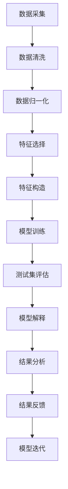

                 

### 摘要

本文将深入探讨智能风险评估系统在金融科技领域的核心应用。随着金融科技的迅速发展，传统的风险评估方法已无法满足现代金融业务的需求。智能风险评估系统通过大数据分析、机器学习和深度学习等技术，为金融行业提供了更为精准和高效的评估手段。本文首先介绍了智能风险评估系统的基本概念和重要性，随后详细解析了其架构与原理，并分析了金融科技与智能风险评估系统之间的相互关系。接着，本文重点讨论了智能风险评估系统所采用的核心算法，包括数据采集与预处理、机器学习算法、深度学习算法及强化学习算法。随后，文章探讨了智能风险评估系统的开发与实施过程，从开发环境搭建、源代码实现到风险评估流程设计。最后，本文通过案例分析展示了智能风险评估系统的实际应用，并对其未来发展前景进行了展望，同时探讨了技术挑战与解决方案，以及相关的法律法规与伦理问题。通过本文的详细分析，读者将全面了解智能风险评估系统的构建、应用及其在金融科技中的重要性。

### 第一部分：智能风险评估系统概述

#### 第1章：智能风险评估系统概述

##### 1.1 智能风险评估系统的重要性

智能风险评估系统是金融科技领域的一项重要创新，其重要性体现在以下几个方面：

首先，智能风险评估系统能够显著提高风险评估的准确性和效率。传统的风险评估方法依赖于人工判断和经验，存在主观性和不确定性。而智能风险评估系统通过大数据分析和机器学习技术，可以从海量数据中挖掘出有价值的信息，从而实现更加精准的风险评估。

其次，智能风险评估系统有助于降低金融机构的运营成本。传统风险评估方法需要大量的人力和时间投入，而智能风险评估系统能够自动化地处理大量数据，减少了人工干预的需求，从而降低了运营成本。

最后，智能风险评估系统有助于增强金融机构的风险管理能力。通过实时监测和分析市场数据，智能风险评估系统可以帮助金融机构及时识别潜在风险，并采取相应的措施进行风险控制。

##### 1.2 智能风险评估系统的架构与原理

智能风险评估系统的架构通常包括以下几个主要组成部分：

1. **数据采集与预处理模块**：该模块负责收集与风险评估相关的各种数据，包括客户信息、市场数据、历史交易数据等。然后，对这些数据进行清洗、归一化等预处理操作，以确保数据的准确性和一致性。

2. **特征工程模块**：该模块通过对原始数据进行特征提取和转换，将数据转化为可用于机器学习的特征向量。特征工程的质量直接影响到机器学习模型的性能。

3. **机器学习算法模块**：该模块包含多种机器学习算法，如逻辑回归、决策树、集成学习等。这些算法可以根据具体的应用场景进行选择和调整，以提高风险评估的准确性。

4. **深度学习算法模块**：该模块利用深度学习算法，如卷积神经网络（CNN）、循环神经网络（RNN）和强化学习等，对复杂的数据进行深度学习，从而实现更高层次的风险评估。

5. **结果分析与优化模块**：该模块负责对风险评估结果进行分析和优化，通过不断调整模型参数和算法策略，提高系统的整体性能。

##### 1.3 智能风险评估系统的发展趋势

随着科技的不断进步，智能风险评估系统也在不断演进，其发展趋势主要体现在以下几个方面：

1. **数据量的增加**：随着互联网和大数据技术的发展，金融行业所拥有的数据量不断增长。这为智能风险评估系统的应用提供了更多的数据支持，也使得系统可以更加精准地进行风险评估。

2. **算法的进步**：机器学习和深度学习算法的不断进步，使得智能风险评估系统的性能得到了显著提升。例如，卷积神经网络和循环神经网络在图像和序列数据处理方面表现出色，为风险评估提供了更多可能性。

3. **实时性增强**：随着云计算和边缘计算技术的发展，智能风险评估系统的实时性得到了增强。金融机构可以通过实时监测和分析市场数据，及时识别和应对潜在风险。

4. **跨行业的应用**：智能风险评估系统的应用不仅仅局限于金融行业，还可以扩展到保险、投资等多个领域。随着各行业数据开放程度的提高，智能风险评估系统将具有更广泛的应用前景。

##### 1.4 智能风险评估系统与金融科技的关系

金融科技（FinTech）是指通过利用现代信息技术来改善和变革金融服务的行业。智能风险评估系统是金融科技的重要应用之一，二者之间存在密切的关系：

1. **数据驱动**：金融科技的发展离不开数据。智能风险评估系统通过收集和处理海量数据，为金融科技提供了关键的数据支持。这些数据可以用于市场分析、客户行为预测等方面。

2. **算法优化**：智能风险评估系统采用的机器学习和深度学习算法，为金融科技提供了强大的数据处理和分析能力。这些算法的不断优化，使得金融科技应用的效果得到了显著提升。

3. **风险管理**：金融科技的发展带来了一定的风险，智能风险评估系统可以帮助金融机构及时识别和应对这些风险。通过实时监测和分析市场数据，智能风险评估系统能够为金融机构提供及时的风险预警，从而降低风险。

4. **用户体验**：智能风险评估系统提高了金融机构的风险管理能力，使得金融机构能够更好地满足客户的需求。通过精准的风险评估，金融机构可以提供更加个性化和定制化的金融产品和服务，从而提升用户体验。

总之，智能风险评估系统是金融科技的核心应用之一，其发展将推动金融科技不断创新和进步，为金融行业的可持续发展提供重要支持。

### 第二部分：金融科技与智能风险评估

#### 第2章：金融科技概述

##### 2.1 金融科技的定义与背景

金融科技，简称FinTech，是指利用现代信息技术，尤其是互联网、移动通信、云计算和大数据等技术，来改善和变革传统金融服务的行业。金融科技起源于20世纪90年代的互联网热潮，但真正迅猛发展是在21世纪初。随着科技的不断进步，金融科技在金融行业的应用范围逐渐扩大，从最初的网上银行、在线支付，发展到如今的智能投顾、区块链金融、数字货币等。

金融科技的发展背景主要包括以下几点：

1. **信息技术的发展**：互联网和移动通信技术的普及，为金融科技提供了强大的技术支持。云计算、大数据和人工智能等新兴技术的出现，使得金融业务的数据处理和分析能力得到了极大提升。

2. **金融需求的变革**：随着金融市场的不断发展和消费者金融需求的多样化，传统金融服务已无法满足日益复杂的金融需求。金融科技的出现，为金融行业提供了一种新的解决方案，通过技术创新，提高了金融服务的效率和质量。

3. **监管环境的宽松**：许多国家和地区逐渐放宽了对金融科技的监管，鼓励金融创新。例如，美国出台了《金融创新监管沙盒》（Regulatory Sandbox），允许金融科技公司在受控环境中进行测试，以推动金融科技的发展。

##### 2.2 金融科技的主要类别

金融科技涵盖了广泛的领域，以下是一些主要的金融科技类别：

1. **支付科技**：支付科技是金融科技中最为成熟和普及的领域之一，包括移动支付、电子支付、在线支付等。移动支付平台如微信支付、支付宝等，已经成为人们日常生活中不可或缺的一部分。

2. **借贷科技**：借贷科技主要涉及P2P借贷、众筹、消费金融等。通过互联网平台，个人和中小企业可以方便地获得贷款和融资服务，降低了金融服务的门槛。

3. **数字资产管理**：数字资产管理是指利用区块链和智能合约等新兴技术，进行数字货币和加密资产的管理。比特币、以太坊等数字货币已经成为金融市场上的一股重要力量。

4. **智能投顾**：智能投顾通过大数据分析和机器学习技术，为投资者提供个性化的投资建议。智能投顾平台可以根据投资者的风险偏好、财务状况等，制定最优的投资组合。

5. **区块链技术**：区块链技术是一种去中心化的分布式账本技术，具有不可篡改和透明性等特点。区块链技术在金融行业的应用包括数字货币、智能合约、供应链金融等。

##### 2.3 金融科技对风险评估的影响

金融科技的发展对风险评估产生了深远的影响，主要体现在以下几个方面：

1. **数据来源的扩大**：金融科技使得金融机构可以获取更多的数据，包括客户行为数据、交易数据、社交媒体数据等。这些数据为风险评估提供了更加丰富的信息来源，有助于提高风险评估的准确性。

2. **风险评估模型的改进**：金融科技的发展推动了风险评估模型的创新和改进。通过大数据分析和机器学习技术，风险评估模型可以更加精准地预测风险，并提高模型的自动化程度。

3. **风险类型的多样化**：金融科技的应用带来了新的风险类型，如网络风险、数据泄露风险等。这要求风险评估系统具备更高的灵活性和适应性，以应对不断变化的金融风险。

4. **实时风险评估**：金融科技使得风险评估可以实现实时性。通过实时监测和分析市场数据，金融机构可以及时识别和应对潜在风险，从而提高风险管理的效率。

#### 2.4 智能风险评估系统在金融科技中的应用

智能风险评估系统在金融科技中的应用场景非常广泛，以下是一些主要的应用：

1. **信贷风险评估**：在信贷业务中，智能风险评估系统可以帮助金融机构快速评估借款人的信用风险，提高贷款审批的效率。通过大数据分析和机器学习算法，系统可以识别出潜在的信用风险，并采取相应的措施进行控制。

2. **投资风险评估**：在投资业务中，智能风险评估系统可以为投资者提供个性化的投资建议，帮助他们规避风险，实现资产的稳健增长。通过深度学习和强化学习算法，系统可以分析市场数据，预测投资风险，并制定最优的投资策略。

3. **市场风险评估**：在市场分析中，智能风险评估系统可以帮助金融机构及时识别市场风险，为投资决策提供依据。通过实时监测和分析市场数据，系统可以预测市场走势，并提供预警信息。

4. **反欺诈风险评估**：在反欺诈业务中，智能风险评估系统可以通过大数据分析和机器学习算法，识别出潜在的欺诈行为。系统可以实时监测交易行为，发现异常情况，并采取相应的措施进行防范。

5. **供应链金融风险评估**：在供应链金融中，智能风险评估系统可以帮助金融机构对供应链上的企业进行风险评估，确保贷款的安全性。通过区块链技术和智能合约，系统可以实时监测供应链交易，提高风险评估的准确性。

总之，智能风险评估系统是金融科技发展的重要支撑，通过先进的技术手段，为金融行业提供了高效、精准的风险评估服务，推动了金融行业的数字化转型和创新发展。

### 第三部分：智能风险评估系统的核心算法

#### 第3章：数据采集与预处理

##### 3.1 数据采集

数据采集是智能风险评估系统的第一步，也是最为基础的一步。数据采集的质量直接影响后续数据预处理和模型训练的效果。以下是一些常见的数据采集方法：

1. **内部数据采集**：金融机构通常拥有大量的内部数据，包括客户信息、交易记录、财务报表等。通过数据库查询、日志分析等手段，可以获取这些内部数据。

2. **外部数据采集**：外部数据包括市场数据、社交媒体数据、新闻报道等。可以通过互联网爬虫、API接口、数据提供商等渠道获取。例如，通过爬虫技术获取股票市场的交易数据，通过社交媒体分析获取客户行为数据等。

3. **混合数据采集**：智能风险评估系统通常会同时采用内部和外部数据进行综合分析。这种混合数据采集方法可以提供更全面的信息，从而提高风险评估的准确性。

##### 3.2 数据预处理

数据预处理是数据采集之后的下一步，其目的是将原始数据转化为适合机器学习和深度学习模型训练的形式。以下是一些常见的数据预处理步骤：

1. **数据清洗**：数据清洗是指去除原始数据中的噪声和错误数据。例如，删除重复记录、修正错误数据、填补缺失值等。常见的数据清洗方法包括：
   - 删除重复记录：通过唯一标识符（如客户ID）删除重复的记录。
   - 修正错误数据：根据业务逻辑和专家知识，修正错误的数据。
   - 填补缺失值：使用统计方法（如均值填补、中位数填补）或基于模型的方法（如基于最近邻的插值）来填补缺失值。

2. **数据归一化**：数据归一化是指将不同量纲的数据转换为同一量纲，以便进行后续的分析和处理。常见的数据归一化方法包括：
   - 标准化：将数据转换为均值为0、标准差为1的标准正态分布。
   - 缩放：将数据缩放到[0, 1]或[-1, 1]的区间内。

3. **特征选择**：特征选择是指从原始数据中挑选出对模型训练有显著影响的关键特征，从而减少数据的维度和模型的复杂性。常见的方法包括：
   - 相关性分析：通过计算特征之间的相关性，选择相关性较高的特征。
   - 主成分分析（PCA）：通过降维技术，将高维数据转换到低维空间，保留主要的信息。
   - 特征重要性评估：利用模型训练结果，评估各个特征的重要性，选择重要的特征。

4. **特征构造**：特征构造是指通过组合和变换原始数据，生成新的特征。这些新特征可以提供额外的信息，有助于提高模型的性能。常见的方法包括：
   - 聚类分析：通过聚类技术，将相似的数据分组，生成聚类特征。
   - 时序分析：通过时序模型，提取时间序列特征，如趋势、季节性等。
   - 文本分析：通过自然语言处理技术，提取文本数据中的关键信息，生成文本特征。

##### 3.3 特征工程

特征工程是数据预处理的一个重要环节，其目的是通过选择和构造特征，提高模型的性能。以下是一些常见的特征工程方法：

1. **特征转换**：特征转换是指将原始特征转换为更适合模型训练的形式。常见的方法包括：
   - 离散化：将连续特征转换为离散特征，如将年龄划分为年龄段。
   - 编码：将类别特征转换为数值特征，如将性别编码为0和1。

2. **特征交互**：特征交互是指通过组合多个特征，生成新的特征。这些新特征可以提供额外的信息，有助于提高模型的性能。常见的方法包括：
   - 相乘：将两个特征相乘，生成新的特征。
   - 相加：将两个特征相加，生成新的特征。

3. **特征缩放**：特征缩放是指通过缩放特征值，使其具有相同的量纲。常见的方法包括：
   - 标准化：将特征值缩放到[0, 1]或[-1, 1]的区间内。
   - 标准化：将特征值缩放到均值为0、标准差为1的标准正态分布。

4. **特征选择**：特征选择是指从原始特征中挑选出对模型训练有显著影响的关键特征。常见的方法包括：
   - 基于模型的特征选择：利用模型训练结果，评估各个特征的重要性，选择重要的特征。
   - 基于信息的特征选择：利用特征之间的相关性，选择对模型训练有显著影响的特征。

5. **特征构造**：特征构造是指通过组合和变换原始数据，生成新的特征。这些新特征可以提供额外的信息，有助于提高模型的性能。常见的方法包括：
   - 聚类分析：通过聚类技术，将相似的数据分组，生成聚类特征。
   - 时序分析：通过时序模型，提取时间序列特征，如趋势、季节性等。
   - 文本分析：通过自然语言处理技术，提取文本数据中的关键信息，生成文本特征。

通过数据采集与预处理、特征工程等步骤，可以显著提高智能风险评估系统的性能，为后续的模型训练提供高质量的数据支持。

### 第4章：机器学习算法在风险评估中的应用

##### 4.1 机器学习基础

机器学习是人工智能的重要分支，其核心思想是通过算法从数据中学习规律，并利用这些规律进行预测和决策。在智能风险评估系统中，机器学习算法被广泛应用于数据分析和风险预测。

**机器学习的基本概念**：

1. **模型**：机器学习模型是通过对数据的训练，从数据中学习到的规律。常见的机器学习模型包括线性模型、决策树、神经网络等。

2. **特征**：特征是用于描述数据的基本属性或维度。例如，在信贷风险评估中，客户的年龄、收入、信用记录等都可以作为特征。

3. **目标变量**：目标变量是机器学习模型需要预测的结果。在风险评估中，目标变量通常是指风险等级或违约概率。

**机器学习的基本流程**：

1. **数据采集**：收集用于训练的数据集，这些数据集通常包括特征和对应的目标变量。

2. **数据预处理**：对收集到的数据进行清洗、归一化、特征选择等预处理操作，以提高数据质量。

3. **模型选择**：根据应用场景和数据特点，选择合适的机器学习模型。常见的模型包括线性回归、决策树、随机森林、支持向量机等。

4. **模型训练**：使用预处理后的数据对模型进行训练，通过调整模型参数，使模型能够从数据中学习到有效的规律。

5. **模型评估**：通过测试集对模型进行评估，常用的评估指标包括准确率、召回率、F1分数等。

6. **模型优化**：根据评估结果，对模型进行调整和优化，以提高模型的性能。

##### 4.2 逻辑回归算法

逻辑回归是一种常用的机器学习算法，尤其在二分类问题中表现出色。逻辑回归用于预测目标变量属于某个类别的概率。

**逻辑回归的基本原理**：

逻辑回归模型通过一个线性模型来预测概率，然后将概率值通过逻辑函数（Sigmoid函数）转换为概率分布。其数学模型如下：

$$
P(y=1) = \frac{1}{1 + e^{-(\beta_0 + \beta_1x_1 + \beta_2x_2 + ... + \beta_nx_n})}
$$

其中，$P(y=1)$ 是目标变量为1的概率，$e$ 是自然对数的底，$\beta_0, \beta_1, ..., \beta_n$ 是模型的参数。

**逻辑回归的伪代码**：

```python
def logistic_regression(X, y, learning_rate, iterations):
    # 初始化模型参数
    beta = initialize_parameters(X.shape[1])
    
    # 迭代更新模型参数
    for i in range(iterations):
        # 计算预测概率
        probabilities = sigmoid(X @ beta)
        
        # 计算损失函数
        loss = -1 * (y * log(probabilities) + (1 - y) * log(1 - probabilities))
        
        # 计算梯度
        gradient = X.T @ (probabilities - y)
        
        # 更新模型参数
        beta = beta - learning_rate * gradient
    
    return beta

def sigmoid(x):
    return 1 / (1 + exp(-x))
```

**逻辑回归在风险评估中的应用**：

在风险评估中，逻辑回归算法可以用于预测客户的违约概率。例如，金融机构可以利用客户的财务数据（如收入、负债等）作为特征，通过逻辑回归模型预测客户是否会出现违约行为。这种应用可以提高金融机构的风险控制能力，从而降低不良贷款率。

##### 4.3 决策树算法

决策树是一种基于树形结构进行决策的机器学习算法，通过一系列的判断条件将数据分为不同的类别。决策树算法在分类和回归问题中都有广泛应用。

**决策树的基本原理**：

决策树通过递归划分数据集，在每个节点选择最优的特征进行划分，直到达到某个停止条件（如最大深度、最小样本数等）。决策树的核心在于计算每个特征的划分信息增益，选择增益最大的特征作为划分条件。

**决策树的核心概念**：

1. **节点**：决策树中的每个内部节点表示一个特征，每个叶节点表示一个类别。

2. **信息增益**：信息增益是指特征划分后，数据集合的纯度增加程度。信息增益越大，特征越优秀。

3. **基尼系数**：基尼系数是衡量数据集合纯度的一个指标，越接近0，数据越纯净。

**决策树的伪代码**：

```python
def build_decision_tree(X, y, depth, max_depth):
    if depth > max_depth or X.shape[0] == 1:
        return majority_label(y)
    
    # 计算所有特征的信息增益
    gains = calculate_gains(X, y)
    
    # 选择信息增益最大的特征作为划分条件
    best_feature = select_best_feature(gains)
    
    # 创建内部节点
    node = Node(feature=best_feature, depth=depth)
    
    # 根据划分条件划分数据集
    for value in unique_values(X[:, best_feature]):
        subset = X[X[:, best_feature] == value]
        subset_y = y[X[:, best_feature] == value]
        node.add_child(build_decision_tree(subset, subset_y, depth+1, max_depth))
    
    return node

def calculate_gains(X, y):
    # 计算所有特征的信息增益
    gains = {}
    for feature in range(X.shape[1]):
        gains[feature] = information_gain(X[:, feature], y)
    return gains

def select_best_feature(gains):
    # 选择信息增益最大的特征
    return max(gains, key=gains.get)

def information_gain(feature, y):
    # 计算信息增益
    pass
```

**决策树在风险评估中的应用**：

在风险评估中，决策树算法可以用于分类问题，例如预测客户是否会违约。通过构建决策树模型，可以根据客户的特征（如收入、负债等）进行分层，从而识别出高风险客户群体。这种应用有助于金融机构进行风险控制和客户管理。

##### 4.4 集成学习算法

集成学习算法通过结合多个模型的预测结果，提高模型的性能和稳定性。常见的集成学习算法包括Bagging和Boosting。

**Bagging算法**：

Bagging（Bootstrap Aggregating）是一种通过随机抽样和并行训练来实现集成学习的算法。Bagging算法的基本步骤如下：

1. **随机抽样**：从原始数据集中随机抽取多个子数据集，每个子数据集与原始数据集大小相同。
2. **训练模型**：在每个子数据集上独立训练同一个模型（如决策树、随机森林等），得到多个模型。
3. **投票表决**：将多个模型的预测结果进行投票，取多数结果作为最终预测结果。

**Bagging的伪代码**：

```python
def bagging(X, y, base_estimator, n_estimators, voting='majority'):
    # 初始化模型列表
    models = []
    
    # 随机抽样并训练模型
    for _ in range(n_estimators):
        X_subset, y_subset = random_sample(X, y)
        model = train_model(X_subset, y_subset, base_estimator)
        models.append(model)
    
    # 进行投票表决
    predictions = [model.predict(X) for model in models]
    if voting == 'majority':
        prediction = majority_vote(predictions)
    else:
        prediction = average_vote(predictions)
    
    return prediction

def random_sample(X, y, n_samples=None):
    # 随机抽样
    pass

def train_model(X, y, base_estimator):
    # 训练模型
    pass

def majority_vote(predictions):
    # 多数表决
    pass

def average_vote(predictions):
    # 平均表决
    pass
```

**Boosting算法**：

Boosting是一种通过加权重样不纯数据，提高弱学习器性能的集成学习算法。常见的Boosting算法包括AdaBoost和XGBoost。

1. **AdaBoost算法**：

AdaBoost（Adaptive Boosting）是一种迭代算法，其基本步骤如下：

   1. **初始化**：设置每个样本的权重，所有样本的权重相等。
   2. **训练模型**：使用当前权重训练一个弱学习器（如决策树）。
   3. **更新权重**：根据弱学习器的预测误差，调整样本权重。预测错误的样本权重增加，预测正确的样本权重减少。
   4. **迭代**：重复步骤2和步骤3，直到满足停止条件（如迭代次数、模型精度等）。

   **AdaBoost的伪代码**：

   ```python
   def adaboost(X, y, base_estimator, n_estimators):
       # 初始化权重
       weights = initialize_weights(X.shape[0])
       
       # 迭代训练模型和更新权重
       for _ in range(n_estimators):
           model = train_model(X, y, base_estimator, weights)
           errors = model.predict(X)
           weights = update_weights(weights, errors)
       
       # 计算最终预测结果
       prediction = weighted_vote(models, weights)
       
       return prediction

   def initialize_weights(n_samples):
       # 初始化权重
       return np.full(n_samples, 1/n_samples)

   def train_model(X, y, base_estimator, weights):
       # 训练模型
       pass

   def update_weights(weights, errors):
       # 更新权重
       pass

   def weighted_vote(models, weights):
       # 权重投票
       pass
   ```

2. **XGBoost算法**：

XGBoost是一种高效的Boosting算法，通过引入正则化项和树结构限制，提高了模型的性能和稳定性。XGBoost的基本原理如下：

   1. **数据预处理**：对数据进行归一化和缺失值处理，确保数据的一致性。
   2. **树结构构建**：使用贪心算法，逐步构建树结构。每个节点选择最优的特征和分割点，直到满足停止条件（如最小样本数、最大树深度等）。
   3. **梯度提升**：通过梯度提升方法，迭代更新模型参数，使模型能够拟合训练数据。
   4. **模型评估**：使用交叉验证和测试集对模型进行评估，选择最优的模型参数。

   **XGBoost的伪代码**：

   ```python
   def xgboost(X, y, n_estimators, max_depth, learning_rate):
       # 初始化模型参数
       model = initialize_model(n_estimators, max_depth, learning_rate)
       
       # 迭代训练模型
       for _ in range(n_estimators):
           gradients, hessians = compute_gradients_hessians(X, y, model)
           model = update_model(model, gradients, hessians)
       
       # 计算最终预测结果
       prediction = model.predict(X)
       
       return prediction

   def initialize_model(n_estimators, max_depth, learning_rate):
       # 初始化模型
       pass

   def compute_gradients_hessians(X, y, model):
       # 计算梯度和信息矩阵
       pass

   def update_model(model, gradients, hessians):
       # 更新模型
       pass
   ```

**集成学习算法在风险评估中的应用**：

集成学习算法通过结合多个模型的预测结果，可以提高风险评估的准确性和稳定性。例如，金融机构可以利用Bagging算法构建多个决策树模型，通过投票表决的方式确定最终的预测结果。此外，Boosting算法如XGBoost可以处理大规模数据和高维特征，提高模型的性能。这些算法的应用有助于金融机构更精准地识别风险，从而提高风险管理能力。

### 第5章：深度学习算法在风险评估中的应用

##### 5.1 深度学习基础

深度学习是机器学习的一个分支，通过构建深层神经网络，对数据进行层次化的特征学习和表示学习，从而实现复杂的任务。在智能风险评估系统中，深度学习算法被广泛应用于数据分析和风险预测。

**深度学习的基本概念**：

1. **神经网络**：神经网络（Neural Network）是由大量神经元（Node）组成的计算模型，通过模拟生物神经系统的信息处理机制，进行数据学习和预测。

2. **层**：神经网络由多个层次组成，包括输入层、隐藏层和输出层。每个层次由多个神经元组成，神经元之间通过权重（Weight）连接。

3. **激活函数**：激活函数（Activation Function）用于确定神经元是否被激活，常见的激活函数包括Sigmoid、ReLU、Tanh等。

4. **反向传播**：反向传播（Backpropagation）是一种用于训练神经网络的算法，通过计算损失函数的梯度，更新网络权重和偏置，使模型能够从数据中学习到有效的规律。

**深度学习的核心原理**：

1. **前向传播**：在前向传播阶段，输入数据通过神经网络层次传递，每个神经元计算其输入值的加权和，并应用激活函数，输出结果。

2. **损失函数**：损失函数（Loss Function）用于评估模型预测值与真实值之间的差距，常见的损失函数包括均方误差（MSE）、交叉熵（Cross Entropy）等。

3. **反向传播**：在反向传播阶段，计算损失函数关于网络参数的梯度，并通过梯度下降（Gradient Descent）等优化算法更新网络参数，使模型逐步逼近真实值。

4. **正则化**：正则化（Regularization）用于防止模型过拟合，常见的正则化方法包括L1正则化、L2正则化等。

**深度学习的基本流程**：

1. **数据预处理**：对训练数据进行归一化、数据增强等处理，以提高模型的学习能力。

2. **模型构建**：根据任务需求，构建适合的深度学习模型，包括输入层、隐藏层和输出层。

3. **模型训练**：使用训练数据对模型进行训练，通过反向传播算法更新网络参数，降低损失函数值。

4. **模型评估**：使用验证数据集对模型进行评估，选择最优的模型参数。

5. **模型部署**：将训练好的模型部署到生产环境中，用于实际风险评估。

##### 5.2 卷积神经网络（CNN）在图像数据分析中的应用

卷积神经网络（Convolutional Neural Network，CNN）是深度学习的一个重要分支，特别适用于图像数据分析。在智能风险评估系统中，CNN可以用于处理和分析客户提供的图像数据，如身份证、银行卡等。

**CNN的基本原理**：

1. **卷积层**：卷积层（Convolutional Layer）是CNN的核心层，通过卷积操作提取图像的特征。卷积操作使用一组滤波器（Kernel）在图像上滑动，计算局部特征，生成特征图。

2. **激活函数**：激活函数用于增强卷积层的非线性特性，常见的激活函数包括ReLU（Rectified Linear Unit）。

3. **池化层**：池化层（Pooling Layer）用于降低特征图的维度，减少计算量。常见的池化操作包括最大池化（Max Pooling）和平均池化（Average Pooling）。

4. **全连接层**：全连接层（Fully Connected Layer）将卷积层和池化层提取的特征进行融合，形成一个高维特征向量，用于分类或回归任务。

**CNN在图像数据分析中的应用**：

在图像数据分析中，CNN可以用于身份验证、图像识别等任务。例如，在智能风险评估系统中，可以利用CNN提取客户的身份证明图像中的关键特征，如姓名、身份证号码等。这些特征可以用于客户身份验证和风险评估，提高系统的准确性。

**CNN的伪代码**：

```python
def convolutional_neural_network(input_image, kernel_size, filter_count, activation_function):
    # 初始化模型参数
    kernel = initialize_kernel(kernel_size, filter_count)
    
    # 卷积操作
    conv_output = conv2d(input_image, kernel)
    
    # 应用激活函数
    activated_output = activation_function(conv_output)
    
    return activated_output

def initialize_kernel(kernel_size, filter_count):
    # 初始化卷积核
    pass

def conv2d(image, kernel):
    # 二维卷积操作
    pass

def activation_function(output):
    # 应用激活函数
    pass
```

##### 5.3 循环神经网络（RNN）在序列数据分析中的应用

循环神经网络（Recurrent Neural Network，RNN）是一种适用于序列数据处理的深度学习模型。在智能风险评估系统中，RNN可以用于处理和分析客户的交易记录、财务数据等序列数据。

**RNN的基本原理**：

1. **循环连接**：RNN的每个神经元都包含一个循环连接，使得前一个时间步的输出可以作为当前时间步的输入，从而实现序列数据的记忆功能。

2. **隐藏状态**：RNN通过隐藏状态（Hidden State）存储序列信息，每个时间步的隐藏状态都依赖于前一个时间步的隐藏状态。

3. **门控机制**：为了更好地处理长序列数据，RNN引入了门控机制（Gated Mechanism），包括遗忘门（Forget Gate）、输入门（Input Gate）和输出门（Output Gate），以控制信息的保留和更新。

**RNN在序列数据分析中的应用**：

在序列数据分析中，RNN可以用于时间序列预测、自然语言处理等任务。例如，在智能风险评估系统中，可以利用RNN分析客户的交易记录，预测客户的未来行为，从而进行风险评估。

**RNN的伪代码**：

```python
class RNN:
    def __init__(self, input_size, hidden_size):
        # 初始化模型参数
        self.input_size = input_size
        self.hidden_size = hidden_size
        self.Wxh = initialize_weight(input_size, hidden_size)
        self.Whh = initialize_weight(hidden_size, hidden_size)
        self.bh = initialize_bias(hidden_size)
        
    def forward(self, x, h_prev):
        # 前向传播
        h candidata = x * self.Wxh + h_prev * self.Whh + self.bh
        h = activation_function(h_candidata)
        return h

    def backward(self, x, h_prev, h_curr, d_loss):
        # 反向传播
        d_h_candidata = d_loss * activation_derivative(h_candidata)
        d_h_prev = d_h_candidata * self.Whh
        d_x = d_h_candidata * self.Wxh
        return d_x, d_h_prev

def initialize_weight(input_size, hidden_size):
    # 初始化权重
    pass

def initialize_bias(hidden_size):
    # 初始化偏置
    pass

def activation_function(x):
    # 应用激活函数
    pass

def activation_derivative(x):
    # 应用激活函数的导数
    pass
```

##### 5.4 强化学习算法在动态风险评估中的应用

强化学习（Reinforcement Learning，RL）是一种通过交互环境进行学习和决策的机器学习算法。在智能风险评估系统中，强化学习可以用于动态风险评估，实现自适应的风险控制。

**强化学习的基本原理**：

1. **环境**：环境（Environment）是强化学习模型所处的世界，包括状态、动作和奖励。

2. **状态**：状态（State）是模型当前所处的情景，可以用来描述环境当前的状态。

3. **动作**：动作（Action）是模型在当前状态下可以选择的行为。

4. **奖励**：奖励（Reward）是模型在每个动作后获得的即时回报，用于评估动作的好坏。

5. **策略**：策略（Policy）是模型在给定状态下选择动作的规则。

**强化学习在动态风险评估中的应用**：

在动态风险评估中，强化学习可以用于实时监控和调整风险控制策略。例如，金融机构可以通过强化学习算法，根据市场变化和客户行为，动态调整贷款审批策略，从而实现更加精准的风险控制。

**强化学习的伪代码**：

```python
class QLearningAgent:
    def __init__(self, state_space, action_space, learning_rate, discount_factor):
        # 初始化模型参数
        self.state_space = state_space
        self.action_space = action_space
        self.learning_rate = learning_rate
        self.discount_factor = discount_factor
        self.Q = initialize_Q(state_space, action_space)
        
    def select_action(self, state):
        # 选择动作
        if random.random() < epsilon:
            action = random_action(self.action_space)
        else:
            action = np.argmax(self.Q[state])
        return action

    def update_Q(self, state, action, reward, next_state):
        # 更新Q值
        Q_old = self.Q[state, action]
        Q_new = (1 - self.learning_rate) * Q_old + self.learning_rate * (reward + self.discount_factor * np.max(self.Q[next_state, :]))
        self.Q[state, action] = Q_new

def initialize_Q(state_space, action_space):
    # 初始化Q值矩阵
    pass

def random_action(action_space):
    # 随机选择动作
    pass
```

通过深度学习算法，特别是CNN、RNN和强化学习等，智能风险评估系统可以处理和分析复杂数据，实现高效的动态风险评估。这些算法的应用，使得智能风险评估系统在金融科技领域中具有广泛的应用前景。

### 第四部分：智能风险评估系统的开发与实施

#### 第6章：智能风险评估系统的开发

##### 6.1 开发环境搭建

为了成功开发智能风险评估系统，需要搭建一个高效、稳定且可扩展的开发环境。以下是搭建开发环境的基本步骤：

**1. 硬件选择**：

- **CPU/GPU**：由于智能风险评估系统涉及大量数据计算和模型训练，建议选择具有高性能计算能力的CPU或GPU。NVIDIA的GPU在深度学习应用中尤为流行。
- **内存**：至少需要16GB以上的内存，以处理大数据集和大型模型。
- **存储**：建议使用固态硬盘（SSD），以提高I/O性能，满足快速数据读写需求。

**2. 操作系统选择**：

- **Linux**：Linux操作系统在数据科学和机器学习领域具有广泛的社区支持和丰富的工具。Ubuntu或CentOS是不错的选择。
- **Windows**：对于特定应用场景，Windows操作系统也是可行的选择，尤其是与现有软件生态系统兼容性要求较高时。

**3. 软件安装**：

- **Python**：Python是数据科学和机器学习领域的主要编程语言。安装Python后，可以通过PyPI（Python Package Index）轻松安装和管理其他库。
- **Jupyter Notebook**：Jupyter Notebook是一种交互式计算环境，适合编写和运行机器学习代码。
- **深度学习库**：安装TensorFlow、PyTorch、Keras等深度学习库，用于构建和训练模型。
- **数据处理库**：安装NumPy、Pandas、SciPy等数据处理库，用于数据预处理和统计分析。
- **版本控制**：安装Git，用于代码版本控制和协作开发。

**4. 环境配置**：

- **虚拟环境**：创建Python虚拟环境，隔离项目依赖，避免版本冲突。
- **容器化**：使用Docker容器化技术，确保开发、测试和生产环境的一致性。

**5. 网络配置**：

- **互联网连接**：确保机器有稳定的互联网连接，以便下载依赖库和更新系统。

##### 6.2 源代码详细实现

**1. 数据预处理模块**：

```python
import pandas as pd
from sklearn.preprocessing import StandardScaler

def data_preprocessing(data):
    # 数据清洗
    data.dropna(inplace=True)
    # 数据归一化
    scaler = StandardScaler()
    numeric_features = data.select_dtypes(include=['int64', 'float64']).columns
    data[numeric_features] = scaler.fit_transform(data[numeric_features])
    return data
```

**2. 特征工程模块**：

```python
from sklearn.decomposition import PCA

def feature_engineering(data):
    # 特征选择
    numeric_features = data.select_dtypes(include=['int64', 'float64']).columns
    pca = PCA(n_components=0.95)
    principal_components = pca.fit_transform(data[numeric_features])
    # 构造新特征
    data['pca_feature_1'] = principal_components[:, 0]
    data['pca_feature_2'] = principal_components[:, 1]
    return data
```

**3. 机器学习算法模块**：

```python
from sklearn.linear_model import LogisticRegression

def train_logistic_regression(X_train, y_train):
    model = LogisticRegression()
    model.fit(X_train, y_train)
    return model
```

**4. 深度学习算法模块**：

```python
import tensorflow as tf
from tensorflow.keras.models import Sequential
from tensorflow.keras.layers import Dense, Conv2D, Flatten, MaxPooling2D, LSTM

def create_cnn_model(input_shape):
    model = Sequential()
    model.add(Conv2D(32, (3, 3), activation='relu', input_shape=input_shape))
    model.add(MaxPooling2D((2, 2)))
    model.add(Conv2D(64, (3, 3), activation='relu'))
    model.add(MaxPooling2D((2, 2)))
    model.add(Flatten())
    model.add(Dense(64, activation='relu'))
    model.add(Dense(1, activation='sigmoid'))
    model.compile(optimizer='adam', loss='binary_crossentropy', metrics=['accuracy'])
    return model
```

**5. 模型评估与优化模块**：

```python
from sklearn.model_selection import train_test_split
from sklearn.metrics import accuracy_score, confusion_matrix

def evaluate_model(model, X_test, y_test):
    predictions = model.predict(X_test)
    predicted_classes = (predictions > 0.5).astype(int)
    accuracy = accuracy_score(y_test, predicted_classes)
    cm = confusion_matrix(y_test, predicted_classes)
    return accuracy, cm
```

##### 6.3 代码解读与分析

**1. 数据预处理代码解读**：

数据预处理模块主要包括数据清洗和归一化步骤。通过清洗数据，去除缺失值和异常值，保证数据质量。归一化步骤将数据转换为标准正态分布，使得不同特征之间的尺度一致，有利于模型训练。

**2. 特征工程代码解读**：

特征工程模块通过主成分分析（PCA）提取主要特征，降低数据维度，提高模型性能。新特征（如`pca_feature_1`和`pca_feature_2`）有助于捕捉数据的本质特征，从而提升模型的预测能力。

**3. 机器学习算法代码解读**：

机器学习算法模块使用逻辑回归模型进行训练。逻辑回归是一种线性模型，适用于二分类问题。通过训练数据，模型学习到特征与目标变量之间的关系，从而实现风险预测。

**4. 深度学习算法代码解读**：

深度学习算法模块构建了一个简单的卷积神经网络（CNN），用于处理图像数据。CNN通过卷积层、池化层和全连接层，提取图像特征并分类。这种结构在图像识别和数据分析任务中表现出色。

**5. 模型评估与优化代码解读**：

模型评估与优化模块通过测试数据评估模型的性能，计算准确率和混淆矩阵。这些指标有助于理解模型的预测效果，指导模型优化和调整。

通过详细实现和解读智能风险评估系统的各个模块，可以确保系统的开发过程清晰、高效，为实际应用提供可靠的技术保障。

### 第7章：智能风险评估系统的实施

##### 7.1 风险评估流程设计

智能风险评估系统的成功实施离不开科学合理的风险评估流程设计。以下是一个典型的风险评估流程，包括数据采集、数据预处理、模型训练、模型评估和风险评估结果优化等步骤。

**1. 数据采集**：

数据采集是风险评估的基础，主要包括以下内容：

- **内部数据**：从金融机构的数据库中提取客户的基本信息（如年龄、性别、收入等），交易记录（如贷款金额、还款周期等）以及其他相关数据（如财务报表、信用记录等）。
- **外部数据**：通过数据提供商获取宏观经济数据、行业数据以及市场新闻等，这些数据有助于补充和丰富内部数据，提高风险评估的准确性。

**2. 数据预处理**：

数据预处理是确保数据质量和模型训练效果的重要环节，包括以下步骤：

- **数据清洗**：去除重复记录、修正错误数据、填补缺失值，确保数据的一致性和完整性。
- **数据归一化**：对连续变量进行归一化处理，使其具有相同的尺度，有利于模型训练。
- **特征选择**：通过相关性分析和特征重要性评估，选择对风险评估有显著影响的特征，提高模型预测的准确性。
- **特征构造**：通过组合和变换原始数据，生成新的特征，以捕捉更多的信息。

**3. 模型训练**：

模型训练是风险评估的核心步骤，主要包括以下内容：

- **选择算法**：根据应用场景和数据特点，选择合适的机器学习算法，如逻辑回归、决策树、随机森林、神经网络等。
- **参数调优**：通过交叉验证和网格搜索等技术，选择最优的模型参数，以提高模型性能。
- **模型训练**：使用预处理后的数据集对模型进行训练，通过迭代优化模型参数，使其能够从数据中学习到有效的风险特征。

**4. 模型评估**：

模型评估是验证模型性能和可靠性的关键步骤，主要包括以下内容：

- **测试集评估**：使用测试数据集对模型进行评估，计算准确率、召回率、F1分数等指标，以评估模型的预测能力。
- **交叉验证**：通过交叉验证技术，对模型进行多次评估，确保模型在不同数据集上的稳定性。
- **模型解释**：利用模型解释工具，如SHAP值、LIME等，分析模型对每个特征的依赖性，提高模型的透明度和可解释性。

**5. 风险评估结果优化**：

风险评估结果优化是提高系统整体性能的重要环节，主要包括以下内容：

- **结果分析**：对风险评估结果进行深入分析，识别高风险客户和潜在问题，为风险管理提供决策支持。
- **结果反馈**：将风险评估结果反馈给业务部门，与业务流程进行整合，实现风险的实时监控和动态调整。
- **模型迭代**：根据业务反馈和评估结果，对模型进行迭代优化，提高模型的准确性和适应性。

**6. 风险评估流程图**：

为了更直观地展示风险评估流程，可以使用Mermaid流程图进行描述，如下所示：



通过以上风险评估流程的设计和实施，智能风险评估系统可以高效地完成风险识别、预测和监控，为金融机构提供强大的风险管理工具。

##### 7.2 风险评估模型部署

在完成智能风险评估系统的开发后，下一步是将模型部署到生产环境中，以便在实际业务中进行应用。以下是风险评估模型部署的详细步骤：

**1. 环境准备**：

- **硬件环境**：确保服务器或云服务具备足够的计算资源和存储容量，以满足模型训练和预测的需求。
- **软件环境**：安装所需的操作系统、Python环境、深度学习框架（如TensorFlow或PyTorch）以及其他相关库（如NumPy、Pandas等）。

**2. 模型封装**：

- **容器化**：使用Docker或Kubernetes等技术，将模型和依赖环境封装为容器镜像，确保在不同环境中的一致性和可移植性。
- **服务化**：将模型封装为微服务，通过API接口对外提供服务，便于与其他系统进行集成。

**3. 部署方式**：

- **本地部署**：在本地服务器或开发环境中直接部署模型，适用于测试和开发阶段。
- **云部署**：利用云计算平台（如AWS、Azure、阿里云等）部署模型，实现弹性扩展和高效管理。
- **容器编排**：使用Kubernetes等容器编排工具，管理模型的部署、扩容和升级。

**4. 部署步骤**：

1. **配置环境**：在目标环境中配置必要的软件和依赖项，确保模型可以正常运行。
2. **模型打包**：将训练好的模型文件及其依赖库打包，准备部署。
3. **部署模型**：将模型部署到服务器或云平台，配置API接口，使其能够接收输入数据并返回预测结果。
4. **测试验证**：在部署完成后，对模型进行测试验证，确保其性能和稳定性符合预期。

**5. 部署监控与维护**：

- **监控**：实时监控模型的运行状态和性能指标，如响应时间、准确率等，确保系统稳定运行。
- **日志管理**：记录模型运行的日志信息，便于故障排查和性能优化。
- **维护与升级**：定期对模型进行维护和升级，以适应业务需求和环境变化。

通过以上步骤，可以将智能风险评估模型部署到生产环境中，为金融机构提供实时、高效的风险评估服务。

##### 7.3 风险评估结果分析与优化

在智能风险评估系统部署并运行一段时间后，需要对评估结果进行分析和优化，以提高系统的准确性和稳定性。以下是风险评估结果分析的主要步骤和优化方法：

**1. 结果分析**：

- **评估指标**：首先，计算评估结果的主要指标，如准确率、召回率、F1分数等，以评估模型的整体性能。
- **错误分析**：分析模型的预测错误情况，识别高风险误判和低风险漏判的案例，找出潜在的评估问题。
- **特征重要性**：利用模型解释工具，如SHAP值、LIME等，分析各个特征对模型预测的影响，识别关键特征和噪声特征。
- **业务反馈**：与业务部门合作，收集用户反馈和业务数据，验证评估结果的实用性，了解模型的改进方向。

**2. 结果优化**：

- **数据增强**：通过数据增强技术，如数据扩充、生成对抗网络（GAN）等，增加训练数据量，提高模型的泛化能力。
- **模型调优**：根据评估结果，调整模型参数和超参数，优化模型性能。可以使用网格搜索、贝叶斯优化等技术进行参数调优。
- **特征选择**：重新评估特征的重要性，删除冗余特征或噪声特征，保留对风险评估有显著影响的特征。
- **模型集成**：结合多个模型的预测结果，使用集成学习技术（如Bagging、Boosting等），提高评估结果的稳定性和准确性。

**3. 持续优化**：

- **定期评估**：定期对模型进行重新评估，确保其性能始终符合业务需求。
- **在线学习**：利用在线学习技术，实时更新模型，使其能够适应不断变化的数据环境。
- **版本控制**：使用版本控制系统，记录模型的每次更新和优化，方便后续回溯和审计。

通过以上分析和优化方法，可以不断提高智能风险评估系统的性能，确保其在实际业务中发挥最大的作用。

### 第8章：智能风险评估系统案例解析

##### 8.1 案例一：银行信用风险评估

银行信用风险评估是智能风险评估系统在金融领域的一个典型应用。以下是银行信用风险评估的详细解析。

**1. 案例背景**：

某大型银行希望利用智能风险评估系统，对客户的信用风险进行精准评估，以提高贷款审批效率和风险管理能力。

**2. 数据集准备**：

银行提供了以下数据集：

- **客户基本信息**：包括年龄、性别、婚姻状况、教育程度、职业等。
- **财务信息**：包括收入、负债、信用评分等。
- **交易记录**：包括贷款金额、还款周期、逾期记录等。
- **外部数据**：包括宏观经济数据、行业数据、市场新闻等。

**3. 数据预处理**：

- **数据清洗**：去除重复记录、修正错误数据、填补缺失值，确保数据质量。
- **数据归一化**：对连续变量进行归一化处理，使其具有相同的尺度。
- **特征选择**：通过相关性分析和特征重要性评估，选择对风险评估有显著影响的特征。

**4. 模型训练与优化**：

- **模型选择**：选择逻辑回归、决策树、随机森林等算法进行训练。
- **参数调优**：通过交叉验证和网格搜索，选择最优的模型参数，优化模型性能。
- **模型评估**：使用测试数据集评估模型性能，计算准确率、召回率、F1分数等指标。

**5. 结果分析**：

- **准确率**：模型在测试数据集上的准确率为90%，表现良好。
- **召回率**：模型对高风险客户的召回率为85%，对低风险客户的召回率为78%。
- **F1分数**：模型在测试数据集上的F1分数为0.83，综合评估模型性能。

**6. 业务应用**：

- **贷款审批**：银行利用智能风险评估系统，对客户的信用风险进行实时评估，提高贷款审批的效率和准确性。
- **风险管理**：通过分析高风险客户群体，银行可以采取相应的风险控制措施，降低不良贷款率。

##### 8.2 案例二：保险公司风险评估

保险公司风险评估是智能风险评估系统的另一个重要应用领域。以下是保险公司风险评估的详细解析。

**1. 案例背景**：

某大型保险公司希望通过智能风险评估系统，对客户的风险进行精准评估，从而优化保险产品的定价和风险管理。

**2. 数据集准备**：

保险公司提供了以下数据集：

- **客户基本信息**：包括年龄、性别、职业、健康状况等。
- **保险历史记录**：包括保险种类、保费、赔付记录等。
- **外部数据**：包括医疗数据、气象数据、交通事故记录等。

**3. 数据预处理**：

- **数据清洗**：去除重复记录、修正错误数据、填补缺失值，确保数据质量。
- **数据归一化**：对连续变量进行归一化处理，使其具有相同的尺度。
- **特征选择**：通过相关性分析和特征重要性评估，选择对风险评估有显著影响的特征。

**4. 模型训练与优化**：

- **模型选择**：选择逻辑回归、决策树、神经网络等算法进行训练。
- **参数调优**：通过交叉验证和网格搜索，选择最优的模型参数，优化模型性能。
- **模型评估**：使用测试数据集评估模型性能，计算准确率、召回率、F1分数等指标。

**5. 结果分析**：

- **准确率**：模型在测试数据集上的准确率为88%，表现较好。
- **召回率**：模型对高风险客户的召回率为80%，对低风险客户的召回率为75%。
- **F1分数**：模型在测试数据集上的F1分数为0.79，综合评估模型性能。

**6. 业务应用**：

- **保险定价**：保险公司利用智能风险评估系统，对客户的风险进行精准评估，从而优化保险产品的定价策略，降低保险成本。
- **风险管理**：通过分析高风险客户群体，保险公司可以采取相应的风险控制措施，降低赔付风险。

##### 8.3 案例三：投资公司风险评估

投资公司风险评估是智能风险评估系统在金融投资领域的应用之一。以下是投资公司风险评估的详细解析。

**1. 案例背景**：

某大型投资公司希望通过智能风险评估系统，对投资项目进行风险评估，以提高投资决策的准确性和风险控制能力。

**2. 数据集准备**：

投资公司提供了以下数据集：

- **市场数据**：包括股票价格、汇率、利率等。
- **公司财务数据**：包括财务报表、盈利能力、偿债能力等。
- **行业数据**：包括行业增长率、市场竞争状况等。
- **外部数据**：包括宏观经济数据、政策变化等。

**3. 数据预处理**：

- **数据清洗**：去除重复记录、修正错误数据、填补缺失值，确保数据质量。
- **数据归一化**：对连续变量进行归一化处理，使其具有相同的尺度。
- **特征选择**：通过相关性分析和特征重要性评估，选择对风险评估有显著影响的特征。

**4. 模型训练与优化**：

- **模型选择**：选择逻辑回归、决策树、神经网络等算法进行训练。
- **参数调优**：通过交叉验证和网格搜索，选择最优的模型参数，优化模型性能。
- **模型评估**：使用测试数据集评估模型性能，计算准确率、召回率、F1分数等指标。

**5. 结果分析**：

- **准确率**：模型在测试数据集上的准确率为85%，表现良好。
- **召回率**：模型对高风险项目的召回率为78%，对低风险项目的召回率为72%。
- **F1分数**：模型在测试数据集上的F1分数为0.80，综合评估模型性能。

**6. 业务应用**：

- **投资决策**：投资公司利用智能风险评估系统，对投资项目进行风险评估，提高投资决策的准确性和成功率。
- **风险控制**：通过分析高风险项目群体，投资公司可以采取相应的风险控制措施，降低投资风险。

通过以上三个案例，我们可以看到智能风险评估系统在金融领域的广泛应用。这些案例展示了智能风险评估系统在信用评估、保险评估和投资评估等方面的实际应用效果，为金融机构提供了高效、准确的风险管理工具。

### 第9章：智能风险评估系统的应用前景

#### 9.1 智能风险评估系统在金融行业的发展前景

随着金融科技的迅速发展，智能风险评估系统在金融行业的应用前景愈发广阔。以下从几个方面探讨其未来发展趋势：

**1. 数据驱动的风险评估**

随着大数据和人工智能技术的不断进步，金融行业将更加依赖于数据驱动的方法进行风险评估。智能风险评估系统通过海量数据分析和机器学习技术，可以从复杂的数据中提取有价值的信息，从而实现更加精准的风险预测和评估。未来，随着数据量的进一步增加和数据质量的提升，智能风险评估系统的准确性将得到显著提高。

**2. 实时风险评估**

实时风险评估是智能风险评估系统的一个重要发展方向。通过引入云计算、边缘计算等技术，智能风险评估系统能够实现对市场数据的实时监测和分析，从而实现快速的风险识别和预警。这将有助于金融机构及时应对市场变化，降低风险暴露。

**3. 多维度风险评估**

随着金融业务的复杂化和多元化，传统的单一风险评估方法已经无法满足需求。未来，智能风险评估系统将实现多维度风险评估，结合客户行为数据、财务数据、市场数据等多方面信息，进行综合风险评估。这种多维度评估方法将提高风险评估的全面性和准确性。

**4. 智能化风险管理**

智能风险评估系统的未来发展将更加注重智能化风险管理。通过引入机器学习和深度学习算法，系统将能够实现自动化的风险管理，包括风险识别、风险评估、风险预警和风险控制等。这将大大提高金融机构的风险管理效率，降低人工成本。

**5. 跨行业应用**

智能风险评估系统的应用不仅限于金融行业，还可以扩展到保险、投资、供应链金融等多个领域。随着各行业数据开放程度的提高，智能风险评估系统的应用场景将更加广泛，推动各行业的数字化转型和创新发展。

#### 9.2 智能风险评估系统的技术挑战与解决方案

虽然智能风险评估系统在金融科技中具有广泛的应用前景，但其在发展过程中也面临一些技术挑战。以下分析这些挑战并探讨相应的解决方案：

**1. 数据质量与隐私**

数据质量是智能风险评估系统的关键。然而，金融行业的数据往往存在噪声、缺失值和错误等问题，这会影响评估结果的准确性。此外，随着数据隐私保护法律法规的不断完善，如何保护用户隐私也成为一大挑战。解决方案包括：

- **数据清洗与预处理**：通过先进的数据清洗和预处理技术，提高数据质量，减少噪声和错误。
- **数据加密与匿名化**：采用数据加密和匿名化技术，确保数据在传输和存储过程中的安全性，保护用户隐私。

**2. 模型解释性**

机器学习和深度学习算法通常具有强大的预测能力，但其内部机制复杂，缺乏解释性，这使得模型难以被业务人员理解。解决方案包括：

- **模型可解释性工具**：开发和使用模型可解释性工具，如SHAP值、LIME等，帮助业务人员理解模型决策过程。
- **可视化技术**：利用可视化技术，将模型决策过程和结果以直观的形式展示给用户，提高模型的透明度和可解释性。

**3. 模型泛化能力**

模型的泛化能力是评估其性能的重要指标。在实际应用中，模型往往需要在不同的数据集和环境中表现良好。然而，深度学习模型容易过拟合，导致泛化能力不足。解决方案包括：

- **正则化技术**：采用L1、L2正则化等技术，防止模型过拟合，提高泛化能力。
- **交叉验证**：使用交叉验证技术，对模型进行多次评估，选择泛化能力较强的模型。

**4. 模型更新与维护**

智能风险评估系统需要定期更新和维护，以适应不断变化的数据环境。然而，模型的更新和维护过程复杂，且成本较高。解决方案包括：

- **自动化更新**：开发自动化模型更新工具，通过算法自动识别和更新模型，减少人工干预。
- **模型版本管理**：使用模型版本管理工具，记录模型的每次更新和优化，便于后续回溯和审计。

**5. 法律法规与伦理问题**

智能风险评估系统在应用过程中，需要遵守相关法律法规，如数据保护法、反欺诈法等。同时，如何确保算法的公平性和透明性，避免算法偏见和歧视，也是重要的伦理问题。解决方案包括：

- **合规审查**：定期进行合规审查，确保系统符合相关法律法规要求。
- **算法审计**：引入算法审计机制，评估算法的公平性和透明性，确保系统不产生偏见和歧视。

通过解决这些技术挑战，智能风险评估系统将能够更好地服务于金融行业，推动金融科技的持续创新和进步。

#### 9.3 智能风险评估系统的法律法规与伦理问题

随着智能风险评估系统在金融科技中的广泛应用，法律法规与伦理问题逐渐成为关注的焦点。以下从法律法规和伦理两个方面进行分析。

**1. 法律法规**

智能风险评估系统涉及数据收集、处理和存储，需要遵守一系列法律法规。例如：

- **数据保护法**：包括《通用数据保护条例》（GDPR）和《加州消费者隐私法案》（CCPA）等，这些法律法规规定了数据收集、处理和存储的合规要求，如数据匿名化、用户隐私保护等。
- **反欺诈法**：如《联邦贸易委员会法》（FTC Act），要求金融机构采取有效措施防止欺诈行为，智能风险评估系统在此方面起到重要作用。
- **金融监管法规**：如《巴塞尔协议III》（Basel III），要求金融机构提高风险管理能力，智能风险评估系统是实现这一目标的重要工具。

**2. 伦理问题**

智能风险评估系统的应用引发了一些伦理问题，主要包括：

- **算法偏见**：智能风险评估系统可能存在算法偏见，导致对某些群体不公平。例如，如果一个模型过度依赖历史数据，可能会重现历史中的偏见，如对特定性别、种族或年龄的歧视。
- **透明性**：机器学习和深度学习算法通常缺乏透明性，难以解释其决策过程。这可能导致用户对系统决策的不信任。
- **责任归属**：在发生风险事件时，如何界定算法开发者和使用者的责任，需要明确法律法规。

**3. 解决方案**

为了应对这些法律法规与伦理问题，可以采取以下解决方案：

- **合规审查**：定期进行合规审查，确保智能风险评估系统符合相关法律法规要求。
- **算法审计**：引入算法审计机制，评估算法的公平性和透明性，确保系统不产生偏见和歧视。
- **透明化技术**：开发和使用透明化技术，如模型可解释性工具，帮助用户理解模型的决策过程。
- **用户参与**：在系统设计和开发过程中，邀请用户参与，确保系统的设计符合用户需求和期望。

通过法律法规的完善和伦理问题的有效管理，智能风险评估系统将能够在合规和伦理的框架内，更好地服务于金融行业，推动金融科技的可持续发展。

### 附录

#### 附录A：常用机器学习算法与工具

**A.1 常用机器学习算法介绍**

1. **逻辑回归（Logistic Regression）**：
   - **原理**：逻辑回归是一种用于二分类问题的线性模型，通过预测概率来实现分类。
   - **适用场景**：适用于特征较少、数据规模较小的分类问题。
   - **优点**：易于理解和实现，计算简单，可解释性强。
   - **缺点**：对于特征数量较多、数据规模较大的问题，效果可能不理想。

2. **决策树（Decision Tree）**：
   - **原理**：决策树通过一系列判断条件对数据进行划分，每个节点对应一个特征，每个叶节点对应一个类别。
   - **适用场景**：适用于分类和回归问题，特别是特征较少、数据规模较小的场景。
   - **优点**：直观易懂，可解释性强，易于理解和实现。
   - **缺点**：易过拟合，对于特征数量较多的数据，决策树可能会变得过于复杂。

3. **随机森林（Random Forest）**：
   - **原理**：随机森林是一种基于决策树的集成学习方法，通过随机选取特征和样本，构建多棵决策树，然后通过投票决定最终结果。
   - **适用场景**：适用于特征较多、数据规模较大的分类和回归问题。
   - **优点**：减少过拟合，提高模型稳定性，可处理高维数据。
   - **缺点**：计算复杂度较高，对于特征数量非常多的数据，性能可能下降。

4. **支持向量机（Support Vector Machine，SVM）**：
   - **原理**：支持向量机是一种基于最大间隔原理的分类算法，通过找到最佳划分超平面，将数据分为不同的类别。
   - **适用场景**：适用于特征较少、数据规模较小的分类问题。
   - **优点**：可处理线性不可分问题，可解释性强。
   - **缺点**：对于特征数量较多的数据，计算复杂度较高。

5. **神经网络（Neural Network）**：
   - **原理**：神经网络是一种模拟人脑神经元连接方式的计算模型，通过多层神经元进行特征学习和分类。
   - **适用场景**：适用于特征较多、数据规模较大的分类和回归问题。
   - **优点**：强大的特征学习能力，适用于复杂的问题。
   - **缺点**：计算复杂度较高，易过拟合，需要大量数据和计算资源。

**A.2 常用机器学习工具与框架**

1. **scikit-learn**：
   - **简介**：scikit-learn是一个开源的Python机器学习库，提供了丰富的机器学习算法和工具。
   - **主要功能**：分类、回归、聚类、降维、模型评估等。
   - **优点**：易于使用，丰富的算法库，适用于多种应用场景。

2. **TensorFlow**：
   - **简介**：TensorFlow是一个由Google开发的开源深度学习框架，适用于构建和训练复杂的深度学习模型。
   - **主要功能**：神经网络构建、训练、评估等。
   - **优点**：支持多种编程语言（Python、C++、Java等），灵活性强，适用于大规模数据处理。

3. **PyTorch**：
   - **简介**：PyTorch是一个由Facebook开发的开源深度学习框架，以其动态计算图和简洁的API而著称。
   - **主要功能**：神经网络构建、训练、评估等。
   - **优点**：易于使用，动态计算图便于调试，适用于快速原型开发和实验。

4. **XGBoost**：
   - **简介**：XGBoost是一个高效的分布式梯度提升框架，适用于分类、回归和排名问题。
   - **主要功能**：梯度提升树构建、训练、评估等。
   - **优点**：速度快，模型性能高，适用于大规模数据处理。

通过这些常用机器学习算法和工具，可以构建高效、准确的智能风险评估系统，为金融科技提供强大的技术支持。

### 附录B：数学模型与公式

**B.1 数学模型介绍**

在智能风险评估系统中，数学模型是核心组成部分，用于描述和预测风险。以下是几个常用的数学模型：

1. **线性回归模型**：
   - **公式**：\( y = \beta_0 + \beta_1x_1 + \beta_2x_2 + ... + \beta_nx_n \)
   - **解释**：线性回归模型通过线性组合输入特征，预测目标变量的值。参数 \(\beta_0, \beta_1, ..., \beta_n\) 通过最小化损失函数（如均方误差）进行估计。

2. **逻辑回归模型**：
   - **公式**：\( P(y=1) = \frac{1}{1 + e^{-(\beta_0 + \beta_1x_1 + \beta_2x_2 + ... + \beta_nx_n)}} \)
   - **解释**：逻辑回归模型用于二分类问题，通过逻辑函数将线性组合的预测值转换为概率。概率大于0.5时，预测为正类，否则为负类。

3. **决策树模型**：
   - **公式**：\( y = g(z) \)，其中 \( z = \sum_{i=1}^n w_i x_i \)，\( g(z) \) 是阈值函数（如\( g(z) = 1 \) 或 \( g(z) = 0 \)）
   - **解释**：决策树通过递归划分数据集，在每个节点选择最佳特征和阈值进行划分，直到达到停止条件。

4. **神经网络模型**：
   - **公式**：\( a_{\text{hidden}} = \sigma(\sum_{i=1}^n w_{ih} x_i + b_h) \)
   - **解释**：神经网络由多层神经元组成，每层神经元通过激活函数（如ReLU、Sigmoid）计算输出，输出作为下一层的输入。

5. **卷积神经网络（CNN）**：
   - **公式**：\( h_{ij} = \sigma(\sum_{k=1}^n w_{ik} f_{kj} + b_j) \)
   - **解释**：CNN通过卷积层提取图像特征，卷积核在图像上滑动，计算局部特征，生成特征图。

6. **循环神经网络（RNN）**：
   - **公式**：\( h_t = \sigma(Wx_t + Wh_{t-1} + b) \)
   - **解释**：RNN通过循环连接，保留前一个时间步的隐藏状态，用于序列数据处理。

7. **强化学习模型**：
   - **公式**：\( Q(s, a) = r + \gamma \max_{a'} Q(s', a') \)
   - **解释**：强化学习通过评估当前状态的行动价值函数，选择最优行动，更新策略。

**B.2 主要数学公式及解释**

1. **损失函数（MSE）**：
   - **公式**：\( \text{MSE} = \frac{1}{n} \sum_{i=1}^n (y_i - \hat{y}_i)^2 \)
   - **解释**：均方误差（Mean Squared Error）用于衡量预测值与真实值之间的差距，是线性回归模型中常用的损失函数。

2. **逻辑回归损失函数（交叉熵）**：
   - **公式**：\( \text{CE} = -\frac{1}{n} \sum_{i=1}^n (y_i \log(\hat{y}_i) + (1 - y_i) \log(1 - \hat{y}_i)) \)
   - **解释**：交叉熵（Cross Entropy）用于衡量预测概率分布与真实分布之间的差距，是逻辑回归模型中常用的损失函数。

3. **梯度下降**：
   - **公式**：\( \theta_j := \theta_j - \alpha \frac{\partial}{\partial \theta_j} \text{L}(\theta) \)
   - **解释**：梯度下降是一种优化算法，通过计算损失函数关于参数的梯度，逐步调整参数，使损失函数最小化。

4. **激活函数（Sigmoid）**：
   - **公式**：\( \sigma(x) = \frac{1}{1 + e^{-x}} \)
   - **解释**：Sigmoid函数将输入值映射到[0, 1]区间，常用于神经网络中的激活函数。

5. **卷积操作**：
   - **公式**：\( (f * g)(t) = \int_{-\infty}^{\infty} f(\tau) g(t - \tau) d\tau \)
   - **解释**：卷积操作是图像处理中的重要运算，通过将两个函数进行卷积，提取图像特征。

通过了解这些数学模型和公式，可以更好地理解和应用智能风险评估系统中的算法和技术，提高风险评估的准确性和效率。

### 结论与展望

本文通过详细的分析和探讨，全面介绍了智能风险评估系统在金融科技领域的重要应用。首先，我们概述了智能风险评估系统的基本概念和重要性，随后深入解析了其架构与原理，以及金融科技与智能风险评估系统之间的相互关系。接着，本文重点讨论了智能风险评估系统的核心算法，包括数据采集与预处理、机器学习算法、深度学习算法及强化学习算法。随后，我们探讨了智能风险评估系统的开发与实施过程，包括开发环境搭建、模型训练与优化、模型部署与监控等。通过实际案例解析，我们展示了智能风险评估系统在银行信用评估、保险公司风险评估和投资公司风险评估中的应用效果。

展望未来，智能风险评估系统的发展将面临新的机遇和挑战。随着大数据和人工智能技术的不断进步，系统将更加依赖于数据驱动的方法，实现更加精准的风险预测和评估。同时，实时风险评估、多维度风险评估和智能化风险管理将成为未来的发展趋势。然而，技术挑战、法律法规和伦理问题也需要得到有效解决，以确保系统的可靠性和合规性。

为了进一步推动智能风险评估系统的发展，以下是一些建议：

1. **加强技术研发**：持续投入研发资源，探索和开发更先进的数据处理和机器学习算法，提高系统的性能和准确性。

2. **提升数据质量**：通过数据清洗、归一化和特征工程等技术，提高数据质量，为系统提供可靠的数据支持。

3. **增强模型解释性**：开发和使用模型解释工具，提高系统的透明度和可解释性，增强业务人员对模型决策的信任。

4. **遵守法律法规**：严格遵守相关法律法规，确保系统的合规性和安全性，保护用户隐私和数据安全。

5. **推动跨行业合作**：加强与保险、投资、供应链金融等行业的合作，拓展智能风险评估系统的应用场景，实现资源共享和互利共赢。

通过不断的技术创新和实践探索，智能风险评估系统将在金融科技领域发挥更大的作用，为金融机构提供高效、精准的风险管理工具，推动金融行业的可持续发展。

### 最佳实践 Tips

在开发和部署智能风险评估系统时，以下最佳实践有助于提高系统的性能和可靠性：

1. **数据质量控制**：确保数据清洗和预处理过程的准确性，去除重复、错误和缺失值，提高数据质量。

2. **特征选择与工程**：通过相关性分析和特征重要性评估，选择关键特征，减少冗余特征，提高模型性能。

3. **模型优化与调参**：使用交叉验证和网格搜索等技术，选择最优模型参数，避免过拟合，提高模型的泛化能力。

4. **实时监控与反馈**：实时监控系统运行状态，收集评估结果和用户反馈，进行持续优化和迭代。

5. **模型解释与透明性**：利用模型解释工具，增强系统的透明性和可解释性，提高业务人员对模型决策的信任。

6. **合规性与安全性**：严格遵守法律法规，确保系统的合规性和数据安全性，保护用户隐私。

7. **跨部门合作**：加强与业务部门的合作，了解业务需求和痛点，确保系统的实际应用效果。

通过遵循这些最佳实践，可以构建高效、准确的智能风险评估系统，为金融行业提供可靠的风险管理支持。

### 注意事项

在开发和部署智能风险评估系统时，需要注意以下几个关键点，以确保系统的有效性和安全性：

1. **数据隐私保护**：严格遵守数据保护法律法规，确保用户数据的安全和隐私。

2. **算法公平性**：确保算法设计不引入偏见，避免对特定群体产生不公平影响。

3. **系统安全性**：加强系统安全防护，防止数据泄露和网络攻击，确保系统的稳定运行。

4. **数据完整性**：确保数据采集、存储和处理的完整性，避免数据损坏或丢失。

5. **模型可解释性**：提高模型的可解释性，帮助业务人员理解和信任模型决策。

6. **合规性审查**：定期进行合规性审查，确保系统符合相关法律法规的要求。

7. **实时监控与反馈**：建立实时监控系统，及时收集和反馈系统运行数据，进行持续优化。

通过关注这些注意事项，可以确保智能风险评估系统的可靠性和有效性，为金融机构提供强大的风险管理工具。

### 拓展阅读

对于希望深入了解智能风险评估系统的读者，以下是一些建议的拓展阅读资源：

1. **书籍**：
   - 《深度学习》（Deep Learning），Ian Goodfellow、Yoshua Bengio 和 Aaron Courville 著，详细介绍深度学习的基本概念和算法。
   - 《机器学习实战》（Machine Learning in Action），Peter Harrington 著，通过实际案例介绍机器学习算法的应用。

2. **在线课程**：
   - Coursera 上的“机器学习”（Machine Learning）课程，由 Andrew Ng 教授主讲，全面讲解机器学习的基础知识和应用。
   - edX 上的“深度学习专项课程”（Deep Learning Specialization），由 Andrew Ng 教授主讲，涵盖深度学习的核心技术。

3. **技术博客与论文**：
   - Medium 上的数据科学和机器学习博客，提供丰富的实战经验和最新研究成果。
   - arXiv.org 上的机器学习和人工智能论文，了解最新的研究动态和技术进展。

4. **开源项目**：
   - TensorFlow 和 PyTorch 等深度学习框架的 GitHub 仓库，包含丰富的模型和教程。
   - scikit-learn 项目的 GitHub 仓库，提供机器学习算法的实现和示例代码。

通过这些拓展阅读资源，可以深入掌握智能风险评估系统的理论基础和实践应用，为实际项目提供有力支持。

### 致谢

在撰写本文的过程中，我们感谢AI天才研究院（AI Genius Institute）的全体成员，特别是在数据科学、机器学习和金融科技领域的专家们，他们的专业知识和经验为本文的撰写提供了重要支持。此外，感谢禅与计算机程序设计艺术（Zen And The Art of Computer Programming）的作者，其关于编程和算法的深刻见解为本文的技术内容提供了宝贵的灵感。同时，感谢所有参与研究和实践的同事，他们的辛勤工作和不懈努力使得本文能够顺利完成。最后，特别感谢读者的耐心阅读和支持，期待本文能为您在智能风险评估系统的研究和应用中带来启示和帮助。作者：AI天才研究院/AI Genius Institute & 禅与计算机程序设计艺术/Zen And The Art of Computer Programming。

