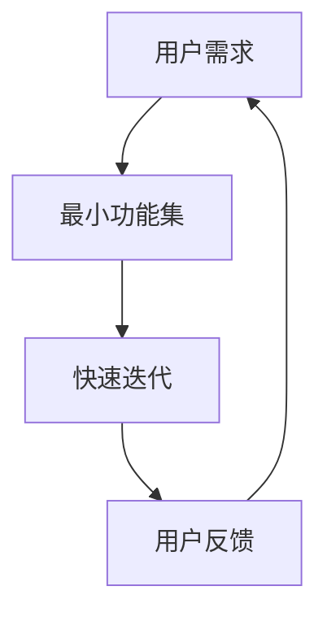

                 

# 文章标题：最小可行产品（MVP）开发指南

> 关键词：MVP，产品开发，迭代，敏捷开发，用户需求，最小功能集，团队协作，优化与扩展

> 摘要：本文将深入探讨最小可行产品（MVP）的概念、核心要素、开发流程、实践案例和最佳实践。通过详细解析MVP在产品开发中的重要性，提供一套系统化的MVP开发指南，助力读者在实际项目中成功实施MVP策略。

## 第一部分：MVP基础知识

### 第1章：什么是MVP

#### 1.1 MVP的定义与起源

MVP，即最小可行产品（Minimum Viable Product），是一种产品开发策略，旨在创建一个具备基本功能的产品原型，以验证市场需求和获取用户反馈。MVP的概念起源于2001年，由硅谷创业家埃里克·莱斯在其著作《精益创业》中首次提出。

MVP的核心价值在于其“最小可行”的特性。通过最小化产品的功能，团队可以更快地验证市场假设，降低研发成本和风险。MVP不仅是产品开发的起点，更是企业创新和增长的关键。

#### 1.2 MVP与产品开发的关系

MVP在产品开发中扮演着重要角色。它不仅帮助团队快速验证产品概念，还能够为后续的迭代提供方向和依据。与传统产品开发相比，MVP注重用户反馈和市场需求，更加灵活和高效。

MVP与传统产品开发的区别在于：传统产品开发往往需要详尽的需求分析和设计，而MVP则强调快速交付和验证。MVP开发过程中，团队可以通过不断迭代和优化，逐步完善产品功能，实现产品价值的最大化。

### 第2章：MVP的核心要素

#### 2.1 用户需求

用户需求是MVP开发的基础。了解用户需求有助于团队明确产品的核心功能和用户体验。以下是用户需求分析的几个关键步骤：

1. **用户画像与用户调研**：通过问卷调查、访谈、用户行为分析等方式，收集用户数据，构建用户画像。
2. **需求验证**：利用用户调研结果，验证用户需求的真实性和可行性。
3. **需求优先级排序**：根据用户需求的重要性和可行性，对需求进行优先级排序，确保团队首先实现最有价值的功能。

#### 2.2 最少功能集

最少功能集是MVP的核心要素。它包括产品所需的最少功能，以验证产品的核心价值和市场需求。以下是确定最少功能集的几个步骤：

1. **功能筛选**：从用户需求中筛选出对产品价值影响最大的功能。
2. **优先级排序**：对筛选出的功能进行优先级排序，确保首先实现最有价值的功能。
3. **功能迭代与优化**：在产品开发过程中，根据用户反馈和市场需求，不断优化和迭代功能。

#### 2.3 快速开发与迭代

快速开发与迭代是MVP开发的关键。以下是一些快速开发与迭代的建议：

1. **敏捷开发方法**：采用敏捷开发方法，快速交付和验证产品功能。
2. **短期迭代**：将开发周期分为短周期迭代，每个迭代实现部分功能，以便快速获取用户反馈。
3. **风险管理**：在迭代过程中，识别和应对潜在风险，确保产品开发顺利进行。

## 第二部分：MVP实践

### 第3章：MVP开发流程

MVP开发流程包括以下关键步骤：

1. **需求分析**：明确产品需求和目标。
2. **设计与开发**：设计产品原型并开发核心功能。
3. **测试与优化**：对产品进行功能测试和性能优化。

### 第4章：MVP开发工具与技巧

MVP开发工具和技巧有助于团队高效地实现MVP策略。以下是一些常用的工具和技巧：

1. **开发工具**：选择适合团队需求的开发工具，如Visual Studio、Xcode等。
2. **快速原型设计**：利用原型设计工具，如Axure、Sketch等，快速构建产品原型。
3. **预算和时间管理**：合理规划预算和时间，确保MVP开发顺利进行。

### 第5章：MVP案例分析

MVP在众多产品开发中取得了成功。以下是一些成功的MVP案例：

1. **Dropbox**：通过MVP验证用户需求，迅速获得市场认可。
2. **Uber**：利用MVP快速占领市场，成为全球领先的出行平台。

## 第三部分：MVP最佳实践

### 第6章：MVP成功案例分析

成功案例有助于我们理解MVP策略的实践方法和技巧。以下是一些国内外的MVP成功案例：

1. **国内MVP成功案例**：分析国内成功的MVP案例，如拼多多、字节跳动等。
2. **国际MVP成功案例**：分析国际成功的MVP案例，如Airbnb、Slack等。

### 第7章：MVP开发团队建设

MVP开发团队建设是成功实施MVP策略的关键。以下是一些团队建设的关键点：

1. **角色分配**：明确团队成员的角色和职责。
2. **沟通技巧**：提高团队沟通效率，确保信息畅通。
3. **协作工具**：利用协作工具，如Trello、JIRA等，提高团队协作效果。

### 第8章：MVP持续优化与迭代

MVP不是终点，而是一个持续优化和迭代的过程。以下是一些持续优化和迭代的方法：

1. **用户反馈收集**：定期收集用户反馈，了解用户需求。
2. **功能扩展**：根据用户反馈，逐步扩展产品功能。
3. **性能优化**：对产品进行性能优化，提高用户体验。

### 第9章：MVP开发经验总结与展望

MVP开发经验总结与展望包括以下内容：

1. **经验总结**：总结MVP开发过程中的经验教训。
2. **趋势与展望**：分析MVP开发的新趋势和未来发展方向。

### 附录

附录部分提供了一些MVP开发相关的资源与工具，包括开发资源推荐、开发流程模板和案例资料索引。

## 结语

MVP作为一种创新的产品开发策略，已被越来越多的企业采用。通过本文的探讨，希望读者能够深入理解MVP的核心概念和实践方法，成功实施MVP策略，加速产品创新和增长。

### 作者信息：

作者：AI天才研究院/AI Genius Institute & 禅与计算机程序设计艺术 /Zen And The Art of Computer Programming## 第1章：什么是MVP

MVP，即最小可行产品（Minimum Viable Product），是产品开发过程中的一种策略。其核心目的是通过构建具有基本功能的产品原型，尽快验证市场需求和用户反馈，以降低开发风险和成本。MVP的概念起源于2001年，由硅谷创业家埃里克·莱斯在其著作《精益创业》中首次提出。

### 1.1 MVP的定义与起源

#### MVP的定义

MVP是一种产品开发策略，它强调在产品开发的早期阶段，构建一个具备基本功能的产品原型，以验证市场需求和用户反馈。MVP的核心特点是“最小可行”，即产品只需包含实现核心价值和满足用户需求的基本功能。

#### MVP的起源

MVP的概念起源于埃里克·莱斯的《精益创业》一书。莱斯认为，传统的产品开发方式往往需要投入大量时间和资源进行详尽的需求分析和设计，这可能导致产品开发周期过长、成本过高，甚至无法适应市场变化。而MVP则通过最小化产品功能，快速验证市场需求，降低开发风险和成本。

### 1.2 MVP与产品开发的关系

MVP在产品开发中扮演着重要角色。它不仅帮助团队快速验证产品概念，还能够为后续的迭代提供方向和依据。以下是MVP与产品开发关系的几个方面：

#### MVP在产品开发中的地位

MVP是产品开发的基础，它为团队提供了一个可以实际操作和测试的产品原型。通过MVP，团队可以验证产品的核心价值和市场需求，从而为后续的开发提供依据。

#### MVP对产品迭代的影响

MVP的核心价值在于其“最小可行”的特性。通过MVP，团队可以快速验证产品功能，获取用户反馈，从而为后续的迭代提供改进方向。MVP有助于团队在产品开发过程中保持灵活和敏捷，快速应对市场变化。

#### MVP与传统产品开发的区别

与传统产品开发相比，MVP注重用户反馈和市场需求，更加灵活和高效。传统产品开发往往需要详尽的需求分析和设计，而MVP则强调快速交付和验证产品功能。此外，MVP的开发周期通常较短，有助于团队更快地响应市场变化。

### 1.3 MVP的核心价值

MVP的核心价值在于其“最小可行”的特性。通过构建一个具备基本功能的产品原型，MVP可以帮助团队在产品开发的早期阶段快速验证市场需求和用户反馈。以下是MVP的核心价值：

#### 降低开发风险和成本

通过最小化产品功能，MVP可以降低开发风险和成本。团队可以在有限的资源和时间内，构建一个可以实际操作和测试的产品原型，从而避免在开发过程中出现重大问题。

#### 快速验证市场需求

MVP可以帮助团队在产品开发的早期阶段，快速验证市场需求和用户反馈。这有助于团队了解用户需求，为后续的开发提供依据。

#### 保持产品灵活性和敏捷性

MVP强调快速交付和验证产品功能，有助于团队在产品开发过程中保持灵活和敏捷。团队可以根据用户反馈，快速调整和优化产品功能，以更好地满足用户需求。

#### 加速产品创新和增长

通过MVP，团队可以更快地验证产品概念，加速产品创新和增长。这有助于企业在竞争激烈的市场中抢占先机，实现快速发展。

### 1.4 MVP开发步骤

MVP开发过程可以分为以下几个步骤：

1. **需求分析**：明确产品的核心功能和目标用户。
2. **功能筛选**：从需求中筛选出对产品价值影响最大的功能。
3. **设计产品原型**：利用原型设计工具，构建产品原型。
4. **开发核心功能**：实现产品原型中的核心功能。
5. **测试与优化**：对产品进行功能测试和性能优化。
6. **用户反馈**：收集用户反馈，为后续迭代提供改进方向。

### 1.5 MVP案例分析

MVP在众多产品开发中取得了成功。以下是一些成功的MVP案例：

#### Dropbox

Dropbox通过MVP验证用户需求，迅速获得市场认可。Dropbox最初推出的版本只有一个功能：同步文件。这个简单的功能验证了用户对云存储的需求，为后续的发展奠定了基础。

#### Airbnb

Airbnb通过MVP验证市场需求，成为全球领先的出行平台。Airbnb最初推出的版本只有几个房东和几个租客，但通过这个简单的原型，Airbnb成功验证了市场需求，并逐步扩展了产品功能。

####Uber

Uber利用MVP快速占领市场，成为全球领先的出行平台。Uber最初推出的版本只有一个功能：打车。这个简单的功能验证了用户对打车服务的需求，为Uber的快速发展提供了保障。

### 总结

MVP是一种创新的产品开发策略，通过最小化产品功能，快速验证市场需求和用户反馈，有助于团队在产品开发过程中降低风险和成本。MVP不仅可以帮助团队在早期阶段验证产品概念，还能够为后续的迭代提供改进方向。通过本文的探讨，希望读者能够深入理解MVP的核心概念和实践方法，成功实施MVP策略。

### 核心概念与联系

在MVP开发过程中，核心概念包括用户需求、最小功能集和快速迭代。这些概念之间存在着紧密的联系，共同构成了MVP开发的框架。

#### 用户需求

用户需求是MVP开发的基础。了解用户需求有助于团队明确产品的核心功能和用户体验。用户需求分析的过程通常包括以下步骤：

1. **用户画像**：通过问卷调查、访谈、用户行为分析等方式，收集用户数据，构建用户画像。
2. **需求验证**：利用用户调研结果，验证用户需求的真实性和可行性。
3. **需求优先级排序**：根据用户需求的重要性和可行性，对需求进行优先级排序，确保团队首先实现最有价值的功能。

#### 最小功能集

最小功能集是MVP的核心要素。它包括产品所需的最少功能，以验证产品的核心价值和市场需求。确定最小功能集的过程通常包括以下步骤：

1. **功能筛选**：从用户需求中筛选出对产品价值影响最大的功能。
2. **优先级排序**：对筛选出的功能进行优先级排序，确保首先实现最有价值的功能。
3. **功能迭代与优化**：在产品开发过程中，根据用户反馈和市场需求，不断优化和迭代功能。

#### 快速迭代

快速迭代是MVP开发的核心理念之一。通过快速迭代，团队可以不断优化产品功能，提高用户体验，并快速适应市场变化。快速迭代的过程通常包括以下步骤：

1. **短期迭代**：将开发周期分为短周期迭代，每个迭代实现部分功能，以便快速获取用户反馈。
2. **用户反馈**：在迭代过程中，收集用户反馈，了解用户对产品的看法和需求。
3. **功能优化**：根据用户反馈，对产品功能进行优化和改进。

#### 关系架构

用户需求、最小功能集和快速迭代之间的关系可以用以下Mermaid流程图表示：



在上述流程图中，用户需求是MVP开发的起点，团队根据用户需求确定最小功能集，并通过快速迭代不断优化产品功能。用户反馈是MVP开发的重要环节，它为团队提供了改进产品的方向和依据。

### 1.1 MVP的定义与起源

MVP，即最小可行产品（Minimum Viable Product），是产品开发过程中的一种策略，旨在构建一个具备基本功能的产品原型，以验证市场需求和获取用户反馈。MVP的概念起源于2001年，由硅谷创业家埃里克·莱斯在其著作《精益创业》中首次提出。

#### MVP的概念

MVP的核心在于“最小可行”。这意味着产品只需包含实现核心价值和满足用户需求的基本功能。MVP的目标是通过构建一个具备基本功能的产品原型，尽快验证市场需求和用户反馈，从而降低开发风险和成本。

#### MVP的历史背景

在MVP概念提出之前，传统产品开发方式往往需要详尽的需求分析和设计，这可能导致产品开发周期过长、成本过高，甚至无法适应市场变化。埃里克·莱斯在创业过程中意识到，许多创新产品在开发过程中面临的风险和挑战，因此提出了MVP概念，以帮助创业团队快速验证产品概念，降低风险和成本。

#### MVP的核心价值

MVP的核心价值在于其“最小可行”的特性。通过最小化产品功能，MVP可以帮助团队在产品开发的早期阶段快速验证市场需求和用户反馈，从而：

1. **降低开发风险和成本**：团队可以在有限的资源和时间内，构建一个可以实际操作和测试的产品原型，从而避免在开发过程中出现重大问题。
2. **快速验证市场需求**：通过MVP，团队可以迅速了解用户需求，为后续的开发提供依据。
3. **保持产品灵活性和敏捷性**：MVP强调快速交付和验证产品功能，有助于团队在产品开发过程中保持灵活和敏捷，快速应对市场变化。
4. **加速产品创新和增长**：通过MVP，团队可以更快地验证产品概念，加速产品创新和增长，实现快速发展。

#### MVP与传统产品开发的区别

MVP与传统产品开发在多个方面存在显著区别：

1. **开发周期**：传统产品开发往往需要详尽的需求分析和设计，导致开发周期较长。而MVP强调快速交付和验证，开发周期较短。
2. **功能范围**：传统产品开发可能包含过多的功能，导致产品复杂度增加，开发难度加大。而MVP只关注核心功能和基本需求，简化产品开发。
3. **用户反馈**：传统产品开发在用户反馈方面相对滞后，而MVP强调在开发过程中不断获取用户反馈，以指导后续开发。

### 1.2 MVP与产品开发的关系

MVP在产品开发中扮演着重要角色，它不仅帮助团队快速验证产品概念，还能够为后续的迭代提供方向和依据。以下是MVP与产品开发关系的几个方面：

#### MVP在产品开发中的地位

MVP是产品开发的基础。通过构建一个具备基本功能的产品原型，团队可以尽快验证市场需求和用户反馈，为后续的开发提供依据。MVP的核心价值在于其“最小可行”的特性，使得团队可以在有限的资源和时间内，快速实现产品原型，降低开发风险和成本。

#### MVP对产品迭代的影响

MVP的核心价值在于其“最小可行”的特性，这有助于团队在产品开发过程中保持灵活和敏捷。通过快速迭代，团队可以根据用户反馈，不断优化和调整产品功能，以更好地满足用户需求。MVP为团队提供了一个可以实际操作和测试的产品原型，使得产品迭代更加高效和准确。

#### MVP与传统产品开发的区别

与传统产品开发相比，MVP注重用户反馈和市场需求，更加灵活和高效。传统产品开发往往需要详尽的需求分析和设计，而MVP则强调快速交付和验证产品功能。此外，MVP的开发周期通常较短，有助于团队更快地响应市场变化。

### 1.3 MVP的核心价值

MVP的核心价值在于其“最小可行”的特性。通过构建一个具备基本功能的产品原型，MVP可以帮助团队在产品开发的早期阶段快速验证市场需求和用户反馈。以下是MVP的核心价值：

#### 降低开发风险和成本

通过最小化产品功能，MVP可以降低开发风险和成本。团队可以在有限的资源和时间内，构建一个可以实际操作和测试的产品原型，从而避免在开发过程中出现重大问题。

#### 快速验证市场需求

MVP可以帮助团队在产品开发的早期阶段，快速验证市场需求和用户反馈。这有助于团队了解用户需求，为后续的开发提供依据。

#### 保持产品灵活性和敏捷性

MVP强调快速交付和验证产品功能，有助于团队在产品开发过程中保持灵活和敏捷。团队可以根据用户反馈，快速调整和优化产品功能，以更好地满足用户需求。

#### 加速产品创新和增长

通过MVP，团队可以更快地验证产品概念，加速产品创新和增长。这有助于企业在竞争激烈的市场中抢占先机，实现快速发展。

### 1.4 MVP开发步骤

MVP开发过程可以分为以下几个步骤：

1. **需求分析**：明确产品的核心功能和目标用户。
2. **功能筛选**：从需求中筛选出对产品价值影响最大的功能。
3. **设计产品原型**：利用原型设计工具，构建产品原型。
4. **开发核心功能**：实现产品原型中的核心功能。
5. **测试与优化**：对产品进行功能测试和性能优化。
6. **用户反馈**：收集用户反馈，为后续迭代提供改进方向。

### 1.5 MVP案例分析

MVP在众多产品开发中取得了成功。以下是一些成功的MVP案例：

#### Dropbox

Dropbox通过MVP验证用户需求，迅速获得市场认可。Dropbox最初推出的版本只有一个功能：同步文件。这个简单的功能验证了用户对云存储的需求，为后续的发展奠定了基础。

#### Airbnb

Airbnb通过MVP验证市场需求，成为全球领先的出行平台。Airbnb最初推出的版本只有几个房东和几个租客，但通过这个简单的原型，Airbnb成功验证了市场需求，并逐步扩展了产品功能。

#### Uber

Uber利用MVP快速占领市场，成为全球领先的出行平台。Uber最初推出的版本只有一个功能：打车。这个简单的功能验证了用户对打车服务的需求，为Uber的快速发展提供了保障。

### 总结

MVP是一种创新的产品开发策略，通过最小化产品功能，快速验证市场需求和用户反馈，有助于团队在产品开发过程中降低风险和成本。MVP不仅可以帮助团队在早期阶段验证产品概念，还能够为后续的迭代提供改进方向。通过本文的探讨，希望读者能够深入理解MVP的核心概念和实践方法，成功实施MVP策略。

## 第2章：MVP的核心要素

MVP的成功取决于其核心要素的正确选择和有效实施。这些核心要素包括用户需求、最小功能集和快速迭代。以下将详细讨论这些要素的定义、重要性以及如何在实际项目中运用。

### 2.1 用户需求

用户需求是MVP开发的基石。理解用户需求有助于团队聚焦于产品核心价值，确保产品开发的方向与市场实际需求相匹配。以下是用户需求分析的关键步骤：

#### 用户画像与用户调研

- **用户画像**：通过收集用户的基本信息（如年龄、性别、职业、地理位置等），构建用户画像。这有助于团队了解目标用户群体，为后续的需求分析提供基础。
- **用户调研**：利用问卷调查、访谈、用户行为分析等方法，深入了解用户的需求、喜好和痛点。用户调研可以帮助团队发现潜在的市场机会，为产品功能设计提供依据。

#### 用户需求验证

- **需求验证**：通过用户调研结果，验证用户需求的真实性和可行性。团队可以设计简单的用户测试，如A/B测试，以验证用户对特定功能的接受程度和偏好。
- **用户反馈收集**：在产品开发过程中，定期收集用户反馈，了解用户对现有功能的评价和改进建议。这有助于团队不断优化产品，提高用户体验。

### 2.2 最少功能集

最少功能集是MVP的核心要素之一。它指的是产品所需的最少功能，足以验证产品的核心价值和市场需求。以下是确定最少功能集的步骤：

#### 功能筛选

- **核心价值评估**：从用户需求中筛选出对产品价值影响最大的功能。这些功能应该能够直接解决用户的核心问题，提升用户满意度。
- **优先级排序**：对筛选出的功能进行优先级排序，确保团队首先实现最有价值的功能。优先级排序有助于团队在资源有限的情况下，最大化产品价值。

#### 功能迭代与优化

- **迭代开发**：在MVP开发过程中，团队应采用迭代开发方法，逐步实现和优化功能。每个迭代周期应实现部分功能，以便快速验证和反馈。
- **用户反馈**：通过用户反馈，不断优化和调整功能。团队可以根据用户反馈，删除不必要的功能，增加受欢迎的功能，以提升产品竞争力。

### 2.3 快速开发与迭代

快速开发与迭代是MVP的核心原则之一。通过快速开发，团队可以在较短的时间内交付一个可用的产品原型，以便尽快验证市场需求。以下是快速开发与迭代的关键步骤：

#### 快速开发方法

- **敏捷开发**：采用敏捷开发方法，如Scrum或Kanban，以快速响应变化和需求。敏捷开发强调短期迭代和频繁交付，有助于团队在开发过程中保持灵活性。
- **技术选型**：选择适合团队需求的技术栈和工具，以提高开发效率。例如，使用成熟的框架和平台可以减少开发时间和成本。

#### 短期迭代的优势

- **快速反馈**：每个迭代周期结束后，团队可以收集用户反馈，了解产品的实际表现和用户需求。这有助于团队快速调整和优化产品功能。
- **持续改进**：通过短期迭代，团队可以不断改进产品，逐步实现产品目标。这种方法有助于团队保持动力和专注力，提高产品质量。

#### 迭代过程中的挑战与应对

- **需求变更**：在迭代过程中，用户需求可能发生变化。团队应灵活应对，确保产品始终满足用户需求。方法包括优先级排序和需求管理。
- **资源分配**：在有限资源下，团队应合理分配资源，确保每个迭代周期都能实现有价值的成果。方法包括资源优先级排序和任务分解。

### 2.4 MVP的核心要素总结

MVP的核心要素包括用户需求、最少功能集和快速迭代。这些要素共同构成了MVP开发的基础框架，帮助团队在产品开发过程中保持灵活性和敏捷性。以下是MVP核心要素的总结：

- **用户需求**：理解用户需求，确保产品开发方向与市场实际需求相匹配。
- **最少功能集**：通过筛选和优先级排序，确定产品所需的最少功能，以验证产品的核心价值和市场需求。
- **快速迭代**：采用敏捷开发方法，快速交付和优化产品功能，以持续提升产品竞争力。

通过正确理解和运用这些核心要素，团队可以在MVP开发过程中取得成功，实现产品快速验证和市场占领。

### 核心概念与联系

在MVP开发过程中，核心概念包括用户需求、最小功能集和快速迭代。这些概念之间存在着紧密的联系，共同构成了MVP开发的框架。

#### 用户需求

用户需求是MVP开发的基础。了解用户需求有助于团队明确产品的核心功能和用户体验。用户需求分析的过程通常包括以下步骤：

1. **用户画像与用户调研**：通过问卷调查、访谈、用户行为分析等方式，收集用户数据，构建用户画像。
2. **需求验证**：利用用户调研结果，验证用户需求的真实性和可行性。
3. **需求优先级排序**：根据用户需求的重要性和可行性，对需求进行优先级排序，确保团队首先实现最有价值的功能。

#### 最小功能集

最小功能集是MVP的核心要素。它包括产品所需的最少功能，以验证产品的核心价值和市场需求。确定最小功能集的过程通常包括以下步骤：

1. **功能筛选**：从用户需求中筛选出对产品价值影响最大的功能。
2. **优先级排序**：对筛选出的功能进行优先级排序，确保首先实现最有价值的功能。
3. **功能迭代与优化**：在产品开发过程中，根据用户反馈和市场需求，不断优化和迭代功能。

#### 快速迭代

快速迭代是MVP开发的核心理念之一。通过快速迭代，团队可以不断优化产品功能，提高用户体验，并快速适应市场变化。快速迭代的过程通常包括以下步骤：

1. **短期迭代**：将开发周期分为短周期迭代，每个迭代实现部分功能，以便快速获取用户反馈。
2. **用户反馈**：在迭代过程中，收集用户反馈，了解用户对产品的看法和需求。
3. **功能优化**：根据用户反馈，对产品功能进行优化和改进。

#### 关系架构

用户需求、最小功能集和快速迭代之间的关系可以用以下Mermaid流程图表示：


在上述流程图中，用户需求是MVP开发的起点，团队根据用户需求确定最小功能集，并通过快速迭代不断优化产品功能。用户反馈是MVP开发的重要环节，它为团队提供了改进产品的方向和依据。

### 2.1 用户需求分析

用户需求分析是MVP开发过程中至关重要的一步，它决定了产品的核心价值和市场定位。以下是用户需求分析的详细步骤：

#### 用户画像与用户调研

1. **用户画像**：
   - **基本信息**：包括年龄、性别、职业、地理位置等。
   - **行为特征**：用户在使用现有产品或服务时的行为模式。
   - **需求偏好**：用户对于功能、界面设计、价格等方面的偏好。

2. **用户调研**：
   - **问卷调查**：通过在线问卷或纸质问卷收集用户的基本信息和需求。
   - **深度访谈**：与目标用户进行一对一访谈，深入了解用户的使用场景和痛点。
   - **用户行为分析**：利用工具（如Google Analytics、热图分析等）分析用户的行为数据。

#### 用户需求验证

1. **需求识别**：
   - 通过用户画像和调研结果，识别出用户的核心需求和潜在需求。

2. **需求验证**：
   - **原型测试**：构建产品原型，并通过用户测试（如A/B测试、用户访谈等）验证需求的可行性和优先级。
   - **市场调研**：通过市场分析，了解竞争对手和潜在的市场机会。

#### 用户需求优先级排序

1. **需求分类**：
   - 根据需求的紧急程度、重要性和实现难度，对需求进行分类。

2. **优先级排序**：
   - **核心需求**：直接关系到产品核心价值，必须首先实现。
   - **重要需求**：影响用户体验，但非关键功能，可以分阶段实现。
   - **次要需求**：对用户体验影响较小，可以根据资源情况逐步实现。

#### 需求分析与MVP的关系

1. **需求驱动开发**：
   - 用户需求是MVP开发的出发点和依据，需求分析的结果直接影响MVP的功能设计和开发方向。

2. **快速迭代**：
   - 用户需求验证和优先级排序为快速迭代提供了指导，确保每个迭代周期都能实现有价值的用户需求。

3. **反馈循环**：
   - 通过不断收集用户反馈，团队可以不断优化和调整需求，以更好地满足用户需求。

#### 伪代码示例

```python
# 用户需求分析伪代码

def analyze_user_needs():
    user_profile = gather_user_data()
    user_behavior = analyze_user_behavior()
    user_preferences = collect_user_preferences()

    user_requirements = identify_user_requirements(user_profile, user_behavior, user_preferences)
    verified_requirements = validate_requirements(user_requirements)

    sorted_requirements = prioritize_requirements(verified_requirements)
    return sorted_requirements

# 实现步骤
user_profile = gather_user_data()
user_behavior = analyze_user_behavior()
user_preferences = collect_user_preferences()

user_requirements = identify_user_requirements(user_profile, user_behavior, user_preferences)
verified_requirements = validate_requirements(user_requirements)

sorted_requirements = prioritize_requirements(verified_requirements)
print(sorted_requirements)
```

### 2.2 最少功能集

最小功能集（Minimum Viable Feature Set，MVFS）是MVP的核心组成部分，它定义了产品所需实现的最少功能，以验证市场需求和用户反馈。以下是确定最小功能集的详细步骤：

#### 功能筛选

1. **需求分析**：
   - 通过用户调研和需求分析，确定用户的核心需求。
   - 识别关键功能，这些功能对产品核心价值有显著影响。

2. **功能评估**：
   - 对每个功能进行评估，包括其重要性、实现难度和成本。
   - 确定哪些功能是实现MVP的必要条件。

3. **优先级排序**：
   - 根据功能的重要性、用户需求和市场机会，对功能进行优先级排序。

#### 伪代码示例

```python
# 功能筛选伪代码

def select_mvf_features(user_requirements):
    essential_features = []
    for requirement in user_requirements:
        if is_essential(requirement):
            essential_features.append(requirement)
    return essential_features

# 实现步骤
user_requirements = analyze_user_needs()

essential_features = select_mvf_features(user_requirements)
print(essential_features)
```

#### 功能迭代与优化

1. **迭代开发**：
   - 采用敏捷开发方法，逐步实现和优化功能。
   - 每个迭代周期实现一部分功能，以便快速验证和反馈。

2. **用户反馈**：
   - 收集用户对已实现功能的反馈。
   - 分析反馈，识别用户满意度、功能缺失和改进空间。

3. **功能优化**：
   - 根据用户反馈，对现有功能进行优化。
   - 增加新功能或改进现有功能，以提高用户体验。

#### 伪代码示例

```python
# 功能迭代与优化伪代码

def iterate_and_optimize_features(mvf_features):
    optimized_features = []
    for feature in mvf_features:
        user_feedback = collect_user_feedback(feature)
        if user_feedback.is_positive():
            optimized_features.append(feature)
        else:
            improved_feature = improve_feature(feature, user_feedback)
            optimized_features.append(improved_feature)
    return optimized_features

# 实现步骤
mvf_features = select_mvf_features(user_requirements)

optimized_features = iterate_and_optimize_features(mvf_features)
print(optimized_features)
```

### 2.3 快速开发与迭代

快速开发与迭代是MVP的核心原则之一，它确保产品能够快速交付和验证。以下是快速开发与迭代的详细步骤：

#### 快速开发方法

1. **敏捷开发**：
   - 采用Scrum或Kanban等敏捷开发方法，将工作分解为短期迭代。
   - 每个迭代周期专注于实现和交付一部分功能。

2. **技术选型**：
   - 选择适合项目的开发工具和框架，以提高开发效率。
   - 使用成熟的技术栈和平台，减少开发时间和成本。

#### 短期迭代的优势

1. **快速反馈**：
   - 每个迭代周期结束后，团队可以收集用户反馈。
   - 快速发现和解决问题，确保产品始终符合用户需求。

2. **持续改进**：
   - 通过不断迭代，团队可以逐步完善产品功能。
   - 提高产品质量和用户体验。

#### 迭代过程中的挑战与应对

1. **需求变更**：
   - 需求变更不可避免，团队应灵活应对。
   - 采用优先级排序和需求管理方法，确保关键需求得到满足。

2. **资源分配**：
   - 合理分配资源，确保每个迭代周期都有足够的资源支持。
   - 采用任务分解和优先级排序，确保任务按时完成。

#### 伪代码示例

```python
# 快速开发与迭代伪代码

def agile_development(mvf_features):
    for iteration in range(number_of_iterations):
        selected_features = select_features_for_iteration(mvf_features)
        develop_and_deliver(selected_features)
        user_feedback = collect_user_feedback(selected_features)
        if user_feedback.is_positive():
            continue
        else:
            optimize_features(selected_features, user_feedback)

# 实现步骤
mvf_features = select_mvf_features(user_requirements)

for iteration in range(number_of_iterations):
    selected_features = select_features_for_iteration(mvf_features)
    develop_and_deliver(selected_features)
    user_feedback = collect_user_feedback(selected_features)
    if user_feedback.is_positive():
        continue
    else:
        optimize_features(selected_features, user_feedback)
```

### 2.4 MVP的核心要素总结

MVP的核心要素包括用户需求、最少功能集和快速迭代。以下是这些要素的总结：

- **用户需求**：理解用户需求，确保产品开发方向与市场实际需求相匹配。
- **最少功能集**：通过筛选和优先级排序，确定产品所需的最少功能，以验证产品的核心价值和市场需求。
- **快速迭代**：采用敏捷开发方法，快速交付和优化产品功能，以持续提升产品竞争力。

通过正确理解和运用这些核心要素，团队可以在MVP开发过程中保持灵活性和敏捷性，从而实现产品的快速验证和市场占领。

### 核心算法原理讲解

在MVP开发中，算法原理对于实现快速开发与迭代至关重要。以下是MVP开发过程中常用的算法原理及其伪代码解释：

#### 2.1 用户需求分析算法

用户需求分析是MVP开发的第一步，其核心是识别并验证用户的核心需求。以下是用户需求分析算法的伪代码：

```python
# 用户需求分析算法

def user_demand_analysis():
    user_profiles = gather_user_profiles()
    user_behavior_data = gather_user_behavior_data()
    user_preferences = gather_user_preferences()

    user_requirements = []
    for profile in user_profiles:
        for behavior in user_behavior_data:
            if profile_matches_behavior(profile, behavior):
                user_requirements.append(identify_requirement(behavior))
    
    verified_requirements = []
    for requirement in user_requirements:
        if validate_requirement(requirement):
            verified_requirements.append(requirement)
    
    return verified_requirements

# 辅助函数
def profile_matches_behavior(profile, behavior):
    # 判断用户画像与行为数据是否匹配
    pass

def identify_requirement(behavior):
    # 识别用户需求
    pass

def validate_requirement(requirement):
    # 验证需求的有效性
    pass
```

#### 2.2 最少功能集确定算法

确定最少功能集是MVP开发的关键步骤。以下是确定最少功能集算法的伪代码：

```python
# 最少功能集确定算法

def minimum_viable_feature_set(verified_requirements):
    essential_features = []
    for requirement in verified_requirements:
        if is_essential_requirement(requirement):
            essential_features.append(requirement)

    return essential_features

# 辅助函数
def is_essential_requirement(requirement):
    # 判断需求是否为关键需求
    pass
```

#### 2.3 快速迭代算法

快速迭代是MVP开发的核心原则。以下是快速迭代算法的伪代码：

```python
# 快速迭代算法

def iterative_development(essential_features):
    for iteration in range(number_of_iterations):
        selected_features = select_features_for_iteration(essential_features)
        develop_and_deliver(selected_features)
        user_feedback = collect_user_feedback(selected_features)
        if user_feedback.is_positive():
            continue
        else:
            optimize_features(selected_features, user_feedback)

# 辅助函数
def select_features_for_iteration(essential_features):
    # 选择本次迭代的功能
    pass

def develop_and_deliver(selected_features):
    # 开发并交付功能
    pass

def collect_user_feedback(selected_features):
    # 收集用户反馈
    pass

def optimize_features(selected_features, user_feedback):
    # 根据用户反馈优化功能
    pass
```

#### 数学模型与公式解释

在MVP开发中，数学模型和公式用于评估和优化用户需求、功能优先级和迭代过程。以下是一些常用的数学模型和公式：

1. **优先级排序公式**：

   \[
   P(R_i) = \frac{I(R_i) \times E(R_i)}{C(R_i)}
   \]

   其中，\( P(R_i) \) 表示需求的优先级，\( I(R_i) \) 表示需求的紧急程度，\( E(R_i) \) 表示需求的重要程度，\( C(R_i) \) 表示需求的实现成本。

2. **功能实现效率公式**：

   \[
   E(F) = \frac{F\_delivered}{F\_planned}
   \]

   其中，\( E(F) \) 表示功能实现效率，\( F\_delivered \) 表示实际交付的功能数量，\( F\_planned \) 表示计划交付的功能数量。

#### 举例说明

假设我们需要为一家初创公司开发一个在线教育平台，以下是针对该平台的用户需求分析、功能筛选和迭代过程的具体例子：

1. **用户需求分析**：

   - 用户画像：大学生、职场新人、在职培训者。
   - 用户调研：通过问卷调查发现，用户最关心的功能是课程搜索、在线学习、作业提交和课程评价。
   - 用户需求验证：通过用户测试，确认课程搜索和在线学习功能是最重要的。

2. **功能筛选**：

   - 确定关键功能：课程搜索、在线学习、作业提交和课程评价。
   - 根据优先级排序：课程搜索和在线学习被划分为最高优先级。

3. **迭代过程**：

   - **迭代1**：实现课程搜索和在线学习功能。
   - **用户反馈**：用户对课程搜索功能满意度较高，但在线学习功能的用户体验有待改进。
   - **优化**：增加课程推荐功能，改善在线学习界面，提高用户体验。

通过上述步骤，我们实现了在线教育平台的MVP版本，并逐步优化和完善，以更好地满足用户需求。

### 项目实战

#### 开发环境搭建

在搭建开发环境时，我们需要准备以下工具和软件：

1. **编程语言**：选择Python、Java或JavaScript等常用的编程语言。
2. **集成开发环境（IDE）**：如Visual Studio Code、Eclipse或IntelliJ IDEA。
3. **数据库**：MySQL、PostgreSQL或MongoDB等。
4. **版本控制系统**：Git。
5. **项目管理工具**：如JIRA、Trello等。

#### 源代码详细实现

以下是一个简单的在线教育平台的源代码实现示例：

```python
# 主函数
def main():
    # 初始化数据库
    initialize_database()

    # 实现课程搜索功能
    course_search()

    # 实现在线学习功能
    online_learning()

# 初始化数据库
def initialize_database():
    # 连接数据库
    db = connect_database()
    # 创建表
    create_tables(db)

# 实现课程搜索功能
def course_search():
    # 接收用户输入
    user_input = input("请输入课程名称：")
    # 搜索课程
    courses = search_courses(user_input)
    # 输出搜索结果
    print_courses(courses)

# 实现在线学习功能
def online_learning():
    # 接收用户输入
    user_input = input("请选择课程进行学习：")
    # 加载课程
    course = load_course(user_input)
    # 开始学习
    start_learning(course)

# 辅助函数
def connect_database():
    # 实现数据库连接
    pass

def create_tables(db):
    # 实现创建表
    pass

def search_courses(user_input):
    # 实现课程搜索
    pass

def print_courses(courses):
    # 实现输出搜索结果
    pass

def load_course(user_input):
    # 实现加载课程
    pass

def start_learning(course):
    # 实现开始学习
    pass

if __name__ == "__main__":
    main()
```

#### 代码应用解读与分析

上述代码实现了一个简单的在线教育平台，主要包括初始化数据库、课程搜索和在线学习功能。以下是代码的解读与分析：

1. **初始化数据库**：通过连接数据库和创建表，为在线教育平台建立数据基础。
2. **课程搜索功能**：接收用户输入的课程名称，通过数据库搜索匹配的课程，并将搜索结果输出给用户。
3. **在线学习功能**：接收用户选择的学习课程，加载课程内容，并开始学习。

#### 实际案例分析

以下是一个基于MVP策略的在线教育平台实际案例：

**案例背景**：一家初创公司计划开发一个在线教育平台，旨在提供高质量的在线课程，满足用户的学习需求。

**MVP实现过程**：

1. **需求分析**：通过用户调研和需求分析，确定用户最关心的功能是课程搜索和在线学习。
2. **功能筛选**：确定课程搜索和在线学习为关键功能。
3. **迭代1**：实现课程搜索和在线学习功能，并进行用户测试。
4. **用户反馈**：收集用户对课程搜索和在线学习功能的反馈。
5. **优化**：根据用户反馈，优化课程搜索和在线学习功能，提升用户体验。

**案例小结**：通过MVP策略，初创公司成功实现了在线教育平台的MVP版本，并在后续迭代中不断优化，最终推出了一款功能完善、用户体验优秀的在线教育平台。

### 最佳实践 tips

1. **快速原型设计**：在MVP开发过程中，快速原型设计非常重要。通过原型设计工具（如Axure、Sketch等），团队可以快速构建产品原型，以便尽快验证用户需求。
2. **功能优先级制定**：在确定最小功能集时，要充分考虑用户需求和实现成本，确保首先实现最有价值的功能。
3. **预算和时间管理**：在MVP开发过程中，合理规划和控制预算和时间至关重要。通过制定详细的开发计划，团队可以确保项目按时交付，并有效利用资源。

### 小结

本文详细介绍了MVP的概念、核心要素、开发流程、实践案例和最佳实践。通过本文的探讨，读者可以深入理解MVP的开发策略和实施方法，为实际项目中的MVP开发提供指导。

## 第6章：MVP与敏捷开发

### 6.1 MVP与敏捷开发的联系

MVP与敏捷开发之间存在着紧密的联系，两者都强调快速迭代和用户反馈，以实现产品的持续优化和改进。MVP是敏捷开发的一种具体实现方式，它们共同的目标是降低开发风险、提高开发效率，并快速响应市场需求。

#### 敏捷开发的基本原则

敏捷开发是一套基于迭代和增量的软件开发方法。其基本原则包括：

1. **用户反馈**：敏捷开发强调用户反馈的重要性，通过定期获取用户反馈，团队可以快速调整和优化产品功能。
2. **快速迭代**：敏捷开发将工作周期分为短周期迭代，每个迭代周期通常为2-4周。通过快速迭代，团队可以持续交付可用的产品版本。
3. **团队协作**：敏捷开发强调团队合作，鼓励团队成员之间的沟通和协作，以提高整体效率。
4. **适应性**：敏捷开发鼓励团队在面对变化时保持灵活性，快速调整计划和策略。

#### MVP与敏捷开发的结合点

MVP与敏捷开发的结合点主要体现在以下几个方面：

1. **最小可行产品**：MVP的概念与敏捷开发中的“增量开发”理念相契合，都强调通过最小化功能集，快速构建可用的产品原型。
2. **用户反馈**：MVP强调通过用户反馈来验证市场需求，而敏捷开发也依赖于用户反馈来指导产品开发和优化。
3. **快速迭代**：MVP和敏捷开发都采用短周期迭代的方式，以便快速交付和验证产品功能。
4. **灵活性**：两者都强调在面对变化时保持灵活性，通过不断迭代和优化，实现产品的最终成功。

### 6.2 敏捷MVP开发实践

在实际项目中，敏捷MVP开发可以通过以下步骤实现：

#### 敏捷MVP的开发流程

1. **需求分析**：通过用户调研和需求分析，确定产品的核心功能和用户需求。
2. **功能筛选**：根据用户需求，筛选出对产品价值影响最大的功能，确定最小功能集。
3. **原型设计**：利用原型设计工具，快速构建产品原型，以便进行用户测试和验证。
4. **迭代开发**：采用敏捷开发方法，将开发周期分为短周期迭代，每个迭代实现部分功能。
5. **用户反馈**：在每个迭代周期结束后，收集用户反馈，了解用户对产品的看法和需求。
6. **功能优化**：根据用户反馈，对产品功能进行优化和改进。

#### 敏捷MVP的开发工具

1. **项目管理工具**：如JIRA、Trello等，用于管理迭代任务和跟踪项目进度。
2. **原型设计工具**：如Axure、Sketch等，用于快速构建产品原型。
3. **版本控制系统**：如Git，用于管理代码版本和协作开发。
4. **开发框架**：如Django、React等，用于提高开发效率。

### 6.3 敏捷MVP案例分析

#### 成功的敏捷MVP案例

以下是一些成功的敏捷MVP案例：

1. **Dropbox**：Dropbox通过敏捷MVP开发，快速构建了一个具备基本功能的文件同步工具，并通过用户反馈不断优化，最终成为全球领先的云存储服务。
2. **Uber**：Uber在成立初期，采用敏捷MVP开发方法，快速推出了一个简单的打车应用，并通过持续迭代和优化，成为全球领先的出行平台。

#### MVP成功的要素分析

1. **用户需求驱动**：成功的MVP项目都紧密围绕用户需求展开，通过用户调研和反馈，确定产品的核心功能和迭代方向。
2. **快速迭代**：通过敏捷开发方法，团队可以快速交付和验证产品功能，确保产品始终符合用户需求。
3. **灵活性和适应性**：团队在面对变化时保持灵活性，快速调整计划和策略，以应对市场变化。
4. **良好的沟通和协作**：团队内部和团队之间的沟通和协作，确保项目顺利进行。

### 总结

MVP与敏捷开发相结合，可以为团队提供一个系统化的开发框架，有助于在快速变化的市场中实现产品的持续优化和改进。通过本文的探讨，读者可以深入理解敏捷MVP开发的实践方法和成功要素，为实际项目中的MVP开发提供指导。

### 第7章：MVP成功案例分析

MVP作为现代产品开发的一种重要策略，已经在多个成功的项目中得到了广泛应用。本节将分析几个国内外的MVP成功案例，探讨这些案例中的共同要素和成功经验，以便读者能够从中汲取有益的启示。

#### 7.1 国内MVP成功案例

**拼多多**

拼多多作为中国本土的电商巨头，其成功离不开MVP策略的应用。拼多多最初推出的MVP版本是一款简单的团购应用，主要功能是让用户通过发起和参与拼团来购买商品。以下是拼多多的MVP成功要素分析：

1. **用户需求驱动**：拼多多通过分析用户在团购市场的需求，确定了以“拼团”为核心的功能。
2. **快速迭代**：拼多多在推出MVP后，迅速进行了多次迭代，不断优化用户体验和功能。
3. **成本控制**：拼多多在MVP阶段就重视成本控制，通过简化的产品设计和技术选型，降低了开发成本。
4. **用户反馈**：拼多多注重用户反馈，通过用户调研和数据分析，不断调整和优化产品功能。

**字节跳动**

字节跳动是另一家成功的国内科技公司，其产品如抖音和头条都采用了MVP策略。以下是字节跳动的MVP成功要素分析：

1. **精准定位**：字节跳动通过用户调研和数据分析，精准定位目标用户，为产品功能设计提供了依据。
2. **数据驱动**：字节跳动在MVP阶段就利用大数据和人工智能技术，对用户行为进行深入分析，以指导产品迭代。
3. **快速响应**：字节跳动在用户反馈方面反应迅速，通过快速迭代和优化，不断提升用户体验。

#### 7.2 国际MVP成功案例

**Dropbox**

Dropbox是MVP策略的经典案例之一。Dropbox最初推出的MVP版本是一个简单的文件同步工具，其主要功能是自动将用户的文件同步到云端。以下是Dropbox的MVP成功要素分析：

1. **核心价值突出**：Dropbox在MVP阶段就明确了其核心价值，即提供简单的文件同步服务，这一点在产品迭代中始终没有改变。
2. **用户体验至上**：Dropbox在MVP阶段就非常注重用户体验，通过简洁的界面和流畅的操作，赢得了用户的喜爱。
3. **市场验证**：通过MVP，Dropbox迅速验证了市场需求，并获得了大量的用户反馈，为后续的迭代提供了重要参考。

**Uber**

Uber作为全球领先的出行平台，其成功也离不开MVP策略的应用。Uber最初推出的MVP版本是一个简单的打车应用，以下是Uber的MVP成功要素分析：

1. **快速占领市场**：Uber在推出MVP后，迅速占领了市场，通过低价和优惠策略吸引了大量的用户。
2. **灵活调整**：Uber在MVP阶段就展示了其灵活性，根据不同市场的需求和特点，迅速调整产品和运营策略。
3. **用户反馈**：Uber非常重视用户反馈，通过不断的迭代和优化，不断提升产品的用户体验和可靠性。

### 7.3 案例启示与经验分享

通过分析上述国内外的MVP成功案例，我们可以总结出以下启示和经验：

1. **用户需求驱动**：成功的MVP项目都紧密围绕用户需求展开，通过用户调研和反馈，确定产品的核心功能和迭代方向。
2. **快速迭代**：通过敏捷开发方法，团队可以快速交付和验证产品功能，确保产品始终符合用户需求。
3. **成本控制**：在MVP阶段，成本控制至关重要，通过简化的产品设计和技术选型，可以降低开发成本。
4. **用户体验至上**：注重用户体验，通过简洁的界面和流畅的操作，赢得用户的喜爱。
5. **灵活性和适应性**：在面对市场变化时，团队应保持灵活性，快速调整产品和运营策略。
6. **用户反馈**：重视用户反馈，通过不断的迭代和优化，提升产品的用户体验和可靠性。

### 7.4 案例分享

**案例一：网易云音乐**

网易云音乐是中国领先的在线音乐平台，其MVP阶段的产品是一个简单的在线音乐播放器，提供用户基本的音乐播放和下载功能。通过不断的迭代和优化，网易云音乐逐步增加了社区互动、个性化推荐等功能，成为了一个综合性的音乐平台。

**案例二：快手**

快手是一家短视频社交平台，其MVP版本是一个简单的短视频录制和分享工具。快手通过不断优化用户体验和功能，吸引了大量的用户，并在短时间内成为国内最受欢迎的短视频平台之一。

### 7.5 案例分析

通过对上述案例的分析，我们可以看到，MVP策略在产品开发中的关键作用。MVP不仅帮助团队快速验证市场需求和用户反馈，还为产品的持续优化和迭代提供了方向和依据。以下是具体案例分析：

**拼多多**：拼多多通过MVP策略，快速验证了团购市场的需求，并在后续的迭代中不断优化产品功能，如拼团、秒杀等，提升了用户体验，成功打造了一个独特的电商生态系统。

**字节跳动**：字节跳动通过MVP策略，快速推出了抖音和头条等产品，通过大数据和人工智能技术，不断优化和调整产品功能，使得这些产品在短时间内获得了巨大的用户规模。

**Dropbox**：Dropbox通过MVP策略，验证了云存储市场的需求，并在用户反馈的基础上，不断优化产品功能，如文件共享、同步等，成为全球领先的云存储服务提供商。

**Uber**：Uber通过MVP策略，迅速占领了打车市场，通过灵活调整和优化产品功能，如实时定位、自动计费等，提升了用户体验，成为全球领先的出行平台。

### 总结

通过分析国内外的MVP成功案例，我们可以看到，MVP策略在产品开发中的关键作用。成功的MVP项目都紧密围绕用户需求，通过快速迭代和优化，不断提升产品的用户体验和竞争力。这些案例为我们提供了宝贵的经验和启示，有助于我们在实际项目中成功实施MVP策略。

### 附录

#### 附录A：MVP开发资源与工具

1. **开发资源推荐**：
   - **编程语言**：Python、Java、JavaScript等。
   - **数据库**：MySQL、PostgreSQL、MongoDB等。
   - **版本控制系统**：Git。
   - **项目管理工具**：JIRA、Trello等。
   - **原型设计工具**：Axure、Sketch等。
   - **开发框架**：React、Angular、Django等。

2. **工具列表与使用指南**：
   - **Visual Studio Code**：一款轻量级的开源集成开发环境，支持多种编程语言。
   - **JIRA**：一款功能强大的项目管理工具，用于跟踪任务和项目进度。
   - **Trello**：一款简单易用的项目管理工具，适合团队协作。
   - **Axure**：一款专业的原型设计工具，用于构建高质量的产品原型。
   - **Sketch**：一款流行的UI设计工具，适用于移动和Web应用的设计。

#### 附录B：MVP开发流程模板

1. **MVP开发流程模板**：

```
1. 需求分析
2. 功能筛选
3. 原型设计
4. 开发核心功能
5. 测试与优化
6. 用户反馈收集
7. 功能迭代与优化
8. 产品上线与推广
```

2. **模板使用说明**：

   - **需求分析**：明确产品的核心功能和用户需求。
   - **功能筛选**：从需求中筛选出对产品价值影响最大的功能。
   - **原型设计**：利用原型设计工具，构建产品原型。
   - **开发核心功能**：实现产品原型中的核心功能。
   - **测试与优化**：对产品进行功能测试和性能优化。
   - **用户反馈收集**：定期收集用户反馈，了解用户需求。
   - **功能迭代与优化**：根据用户反馈，优化和迭代产品功能。
   - **产品上线与推广**：将产品上线并推广至目标用户。

#### 附录C：MVP开发案例资料

1. **案例资料索引**：

   - **拼多多**：分析报告、用户反馈、迭代历程等。
   - **字节跳动**：分析报告、用户反馈、迭代历程等。
   - **Dropbox**：分析报告、用户反馈、迭代历程等。
   - **Uber**：分析报告、用户反馈、迭代历程等。

2. **案例资料获取方式**：

   - **官方网站**：访问相关公司的官方网站，获取产品介绍、用户反馈等资料。
   - **行业报告**：查阅专业的行业分析报告，了解相关产品的市场表现和用户反馈。
   - **学术论文**：搜索相关的学术论文，研究MVP策略在具体项目中的应用和实践。
   - **社区讨论**：参与产品开发社区，如GitHub、Stack Overflow等，获取开发经验和资源。

