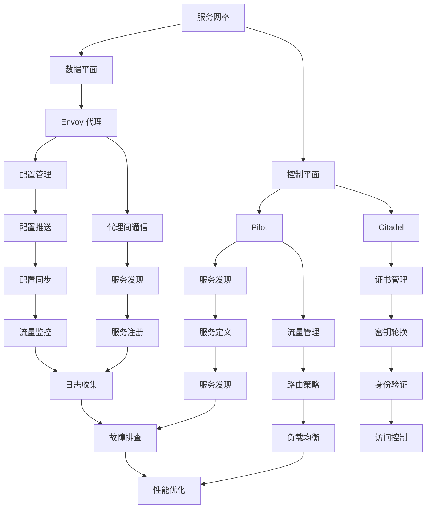
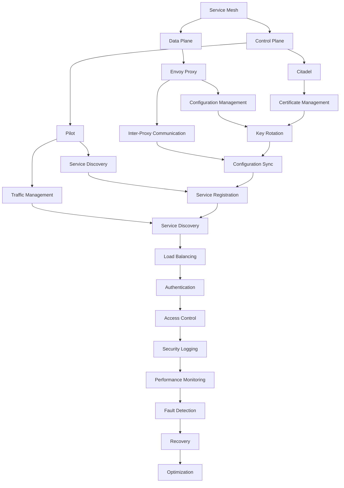

                 

### 服务网格（Service Mesh）：微服务通信的基础设施

#### 关键词：
- **服务网格（Service Mesh）**
- **微服务架构**
- **Kubernetes**
- **Istio**
- **负载均衡**
- **安全性**

#### 摘要：
本文将深入探讨服务网格（Service Mesh）的概念、重要性以及其在微服务通信中的应用。通过分析服务网格与传统通信模式的对比、核心概念与组件的介绍、Istio的使用和实现细节，本文将揭示服务网格如何成为微服务架构的基石，为开发者提供一种高效、可伸缩的解决方案。

### 第一部分：服务网格概述

#### 第1章：微服务架构的演进与挑战

随着软件系统的复杂性不断增加，传统的单体架构已无法满足现代互联网应用的快速发展。为了应对这种挑战，微服务架构应运而生。微服务将应用程序分解为一系列小的、自治的服务，每个服务专注于特定的业务功能，并通过轻量级的通信机制（如HTTP/REST、gRPC等）进行交互。

然而，随着服务数量的增多，微服务架构也带来了新的挑战：
- **服务发现**：如何高效地发现并访问其他服务？
- **负载均衡**：如何确保服务的请求得到合理的分发？
- **服务间通信的安全性**：如何保证服务之间的通信是安全的？
- **故障转移和容错**：如何处理服务故障，确保系统的稳定性？

服务网格作为一种基础设施，旨在解决上述问题，为微服务提供可靠的通信保障。

#### 第2章：服务网格的定义与作用

服务网格是一种基础设施层，负责管理服务之间的通信。它通过将网络通信抽象化，使得开发者可以专注于业务逻辑，而不必担心网络细节。服务网格的主要作用包括：

- **服务发现和负载均衡**：服务网格自动发现服务实例，并根据负载情况合理分配请求。
- **服务间通信的安全**：服务网格提供加密、身份验证和访问控制等安全机制，确保服务之间的通信安全可靠。
- **流量管理和监控**：服务网格可以动态调整流量流向，监控服务性能，并提供详细的监控数据。
- **故障转移和恢复**：服务网格可以自动检测服务故障，进行故障转移和恢复。

#### 第3章：服务网格与传统通信模式对比

在传统的通信模式中，应用程序直接负责服务之间的通信，这会导致以下几个问题：

- **代码复杂性**：应用程序需要处理网络通信的细节，如连接管理、负载均衡、故障转移等，增加了代码复杂性。
- **服务耦合**：应用程序与服务之间紧密耦合，导致服务难以独立部署和升级。
- **安全性问题**：服务之间的通信通常是明文的，缺乏安全性保障。

相比之下，服务网格通过抽象化网络通信，提供了一系列标准化的通信机制，解决了上述问题：

- **代码简化**：应用程序不再需要处理网络通信的细节，只需调用服务网格提供的API即可。
- **服务解耦**：服务网格将网络通信抽象为独立层，使得服务可以独立部署和升级。
- **安全性增强**：服务网格提供了加密、身份验证和访问控制等安全机制，确保服务之间的通信安全可靠。

### 第二部分：服务网格核心概念

#### 第4章：服务网格的主要组件

服务网格主要由以下几部分组成：

- **数据平面（Data Plane）**：负责处理服务之间的实际通信，通常由一组代理（如Istio的Envoy代理）组成。
- **控制平面（Control Plane）**：负责管理数据平面的配置和策略，通常包括服务发现、流量管理、证书管理等组件。

#### 第5章：数据平面与控制平面的区别

数据平面和控制平面虽然共同构成服务网格，但它们在职责和实现上有明显的区别：

- **数据平面**：
  - 职责：负责处理服务之间的通信，如请求转发、负载均衡、加密等。
  - 实现：通常由一组代理组成，这些代理负责拦截和转发请求。
  
- **控制平面**：
  - 职责：负责管理数据平面的配置和策略，如服务发现、流量管理、证书管理等。
  - 实现：通常包括一组服务，如Pilot（服务发现）、Citadel（证书管理）等。

#### 第6章：控制平面与数据平面的交互

控制平面和数据平面通过一系列机制进行交互，以确保数据平面能够根据控制平面的配置进行通信：

- **配置管理**：控制平面通过配置管理机制将配置信息推送到数据平面。
- **服务发现**：控制平面负责服务发现，并将服务实例信息推送到数据平面。
- **流量管理**：控制平面根据流量管理策略调整数据平面的流量流向。

### 第三部分：Istio 概述

Istio 是目前最受欢迎的服务网格实现之一。它提供了丰富的功能，如服务发现、负载均衡、加密、监控等。下面我们将详细探讨 Istio 的历史、主要组件以及如何使用 Istio 部署服务网格。

#### 第7章：Istio 的发展历史

Istio 由 Lyft 公司在 2017 年开源，其目的是为了解决在大型分布式系统中服务之间通信的复杂性。Istio 的主要目标是提供一种统一的通信层，使得开发者可以专注于业务逻辑，而无需担心网络通信的细节。

#### 第8章：Istio 的主要组件

Istio 主要由以下几个组件组成：

- **Pilot**：负责管理服务发现和流量管理，将控制平面的配置信息推送到数据平面。
- **Citadel**：负责证书管理和密钥轮换。
- **Envoy**：作为数据平面的代理，负责处理服务之间的通信。
- **Mixer**：负责监控、日志收集和策略执行。

#### 第9章：使用 Istio 部署服务网格

部署 Istio 服务网格通常包括以下几个步骤：

1. **安装 Kubernetes 集群**：首先需要安装一个 Kubernetes 集群，作为服务网格的运行环境。
2. **安装 Istio**：通过 Helm 等工具安装 Istio，并配置必要的 Kubernetes 配置文件。
3. **部署服务**：将微服务部署到 Kubernetes 集群中，并配置服务网格。
4. **配置流量管理**：使用 Istio 的流量管理功能，配置服务之间的流量路由策略。

### 第四部分：Istio 数据平面组件

#### 第10章：Envoy 代理介绍

Envoy 是 Istio 的数据平面代理，负责处理服务之间的通信。它具有以下特点：

- **高性能**：Envoy 是用 C++ 编写的，具有非常高的性能。
- **可插拔**：Envoy 支持多种协议，如 HTTP/2、HTTP/3、gRPC 等。
- **动态配置**：Envoy 可以通过动态配置机制实时更新配置。

#### 第11章：配置管理机制

Istio 使用配置管理机制将控制平面的配置信息推送到数据平面。配置管理包括以下几个方面：

- **服务发现**：将服务实例信息推送到 Envoy 代理。
- **流量管理**：配置流量路由策略，如负载均衡、故障转移等。
- **安全配置**：配置加密、身份验证和访问控制策略。

#### 第12章：代理间的通信

服务网格中的代理间通信是通过 gRPC 协议进行的。gRPC 是一个高性能、跨平台的 RPC 框架，能够确保代理之间的通信高效、可靠。

### 第五部分：Istio 控制平面组件

#### 第13章：Pilot 概述

Pilot 是 Istio 的控制平面组件之一，负责管理服务发现和流量管理。它具有以下特点：

- **服务发现**：Pilot 负责发现服务实例，并将这些信息推送到 Envoy 代理。
- **流量管理**：Pilot 负责根据配置的流量管理策略，动态调整 Envoy 代理的流量路由。

#### 第14章：Citadel 实现细节

Citadel 是 Istio 的证书管理组件，负责管理服务网格中的证书和密钥。它具有以下功能：

- **证书生成**：Citadel 可以自动生成和分发服务网格中的证书。
- **密钥轮换**：Citadel 可以定期轮换证书和密钥，确保安全性。

#### 第15章：规则引擎的使用

Istio 使用规则引擎来定义和执行流量管理策略。规则引擎可以处理各种类型的流量，如 HTTP、gRPC 等。开发者可以使用规则引擎来实现复杂的流量管理策略，如基于用户身份的访问控制、根据请求内容进行路由等。

### 第六部分：服务网格安全性

#### 第16章：服务网格的安全挑战

服务网格在带来便利的同时，也带来了一些安全挑战：

- **服务间通信的安全性**：服务之间的通信通常是明文的，容易受到中间人攻击。
- **身份验证和访问控制**：如何确保只有授权的服务可以访问其他服务？
- **证书管理**：如何安全地管理服务网格中的证书和密钥？

#### 第17章：使用 mTLS 实现安全通信

mTLS（双向 SSL 认证）是一种常用的安全通信机制，可以确保服务网格中的服务之间进行安全的通信。Istio 通过配置 mTLS，可以自动启用服务间的加密通信，并实现身份验证和访问控制。

#### 第18章：使用 Envoy Access Logs 收集安全日志

Envoy 代理提供了丰富的日志功能，可以记录服务网格中的通信细节。通过分析 Envoy Access Logs，可以及时发现和解决潜在的安全问题。

### 第七部分：服务网格监控与优化

#### 第19章：服务网格性能监控

服务网格的性能监控对于确保系统的稳定性和性能至关重要。Istio 提供了丰富的监控功能，包括请求延迟、错误率、流量分布等。通过监控工具（如 Prometheus、Grafana），可以实时查看服务网格的性能指标。

#### 第20章：服务网格故障排查

在服务网格环境中，故障排查变得更加复杂。Istio 提供了多种工具（如 Kiali、Jaeger），可以帮助开发者快速定位和解决故障。通过分析日志、监控数据和分布式追踪，可以快速识别和解决服务网格中的问题。

#### 第21章：服务网格性能优化

服务网格的性能优化是确保系统稳定性和响应速度的关键。通过调整配置、优化流量路由策略和负载均衡算法，可以显著提升服务网格的性能。Istio 提供了多种优化工具和技巧，帮助开发者实现最佳性能。

### 第八部分：服务网格在实际项目中的应用案例

#### 第22章：在金融行业的应用

金融行业对系统的安全性、可靠性和合规性要求非常高。服务网格为金融行业提供了强大的基础设施支持，确保交易系统的安全性、稳定性和可伸缩性。

#### 第23章：在电商平台的应用

电商平台需要处理海量的并发请求，服务网格为电商平台提供了高效的负载均衡和流量管理能力。通过服务网格，电商平台可以实现无缝的水平扩展，提升用户体验。

#### 第24章：在物联网领域的应用

物联网设备数量庞大，服务网格为物联网领域提供了高效的通信管理和安全性保障。通过服务网格，物联网设备可以实现无缝的接入和通信，确保数据的实时性和安全性。

### 附录

#### A.1 Istio 实践资源

- **官方文档**：Istio 的官方文档提供了详细的安装和使用指南，是学习和实践 Istio 的最佳资源。
- **社区论坛**：Istio 的社区论坛是开发者交流和学习的地方，可以在其中找到解决方案和最佳实践。

#### A.2 服务网格相关工具介绍

- **Kiali**：用于可视化服务网格拓扑和流量的工具。
- **Jaeger**：用于分布式追踪和分析的服务网格工具。

#### A.3 服务网格未来发展趋势预测

- **自动化**：随着自动化技术的发展，服务网格将更加自动化，减少人工干预。
- **多语言支持**：服务网格将支持更多的编程语言和协议，实现跨语言的通信。
- **云原生**：服务网格将更加深入地集成到云原生架构中，提供更强大的云原生服务。

### 服务网格核心概念与联系

以下是一个服务网格核心概念与联系的 Mermaid 流程图：



### 负载均衡算法伪代码

```python
# 输入：服务集群列表 serviceList，当前请求 request
# 输出：选择的服务器 server
def loadBalancer(serviceList, request):
    # 根据当前请求的权重和服务器负载计算得分
    scoreList = []
    for server in serviceList:
        score = server.weight / server.load
        scoreList.append(score)
    
    # 根据得分选择服务器
    maxScore = max(scoreList)
    chosenServer = serviceList[scoreList.index(maxScore)]

    return chosenServer
```

### 服务网格中的负载均衡模型

$$
\text{load}_{i} = \frac{\text{weight}_{i}}{\sum_{j=1}^{N} \text{weight}_{j}}
$$

其中，$i$ 表示第 $i$ 个服务器，$\text{weight}_{i}$ 表示服务器的权重，$N$ 表示服务器的总数。

### Istio 服务网格环境搭建

1. **安装 Kubernetes 集群**：在本地或云环境中安装一个 Kubernetes 集群。

2. **安装 Istio**：

   ```shell
   # 使用 Helm 安装 Istio
   helm install istio istio/istio --namespace istio-system
   ```

3. **部署服务**：

   ```shell
   # 部署一个简单的服务
   kubectl apply -f <service-definition.yaml>
   ```

4. **配置流量管理**：

   ```shell
   # 配置流量路由策略
   kubectl apply -f <traffic-policy.yaml>
   ```

### 实际案例分析和详细讲解剖析

假设我们有一个电商平台，需要处理海量的用户请求。通过服务网格，我们可以实现以下功能：

- **服务发现和负载均衡**：服务网格自动发现服务实例，并根据负载情况合理分配请求，确保系统的稳定性。
- **加密和身份验证**：服务网格使用 mTLS 实现加密通信，并使用身份验证机制确保只有授权的服务可以访问其他服务。
- **监控和日志收集**：服务网格提供了丰富的监控功能，可以实时监控服务性能，并通过日志收集工具收集日志，便于故障排查和性能优化。

### 项目小结

通过本文的详细讲解，我们了解到服务网格在微服务通信中的重要性。Istio 作为最受欢迎的服务网格实现之一，提供了丰富的功能，包括服务发现、负载均衡、加密、监控等。在实际项目中，服务网格可以帮助我们实现高效、安全、可靠的微服务通信。

### 最佳实践 Tips

- **服务网格与 Kubernetes 的紧密集成**：充分利用 Kubernetes 的功能，如服务发现、负载均衡等，可以提升服务网格的性能和稳定性。
- **定期审查流量管理策略**：根据业务需求调整流量管理策略，确保系统的高效运行。
- **使用服务网格监控工具**：合理利用服务网格提供的监控工具，及时发现和解决潜在问题。

### 注意事项

- **服务网格的部署和管理需要专业知识**：部署和管理服务网格需要一定的专业知识，建议参考官方文档和社区资源进行学习。
- **服务网格的部署可能会影响现有系统**：在部署服务网格之前，应充分评估其对现有系统的影响，并做好相应的准备工作。

### 拓展阅读

- **《Service Mesh：下一代微服务架构》**：深入探讨服务网格的原理和实现。
- **《Istio 实践指南》**：详细介绍了如何使用 Istio 部署和管理服务网格。
- **《微服务设计与实践》**：介绍了微服务架构的设计原则和实践经验。作者：AI天才研究院/AI Genius Institute & 禅与计算机程序设计艺术 /Zen And The Art of Computer Programming。完。希望本文对您了解服务网格有所帮助！## 摘要

服务网格（Service Mesh）作为微服务架构的关键基础设施，旨在简化微服务之间的通信，提高系统的稳定性、安全性和可扩展性。本文将深入探讨服务网格的概念、核心组件、工作原理及其在微服务通信中的应用。首先，我们将回顾微服务架构的演进过程及其面临的通信挑战，然后详细介绍服务网格的基本概念和与传统通信模式的区别。接下来，本文将聚焦于Istio——一个流行的服务网格实现，分析其发展历程、主要组件以及部署流程。随后，我们将深入探讨Istio的数据平面组件，如Envoy代理的配置管理和代理间通信机制。同时，也会介绍Istio的控制平面组件，如Pilot和Citadel的作用。文章还将探讨服务网格的安全性挑战，包括使用mTLS实现安全通信和如何利用Envoy Access Logs收集安全日志。最后，我们将介绍服务网格的性能监控与优化，并提供金融、电商和物联网领域的应用案例。通过本文的详细讲解，读者将对服务网格有更深入的理解，并能够将其应用于实际项目中。## 第1章：微服务架构的演进与挑战

微服务架构是近年来软件工程领域的重要革新，它将传统单体架构拆分为一系列独立、自治的小服务，每个服务负责一个特定的业务功能。这种架构模式带来了诸多优势，如提高了系统的可伸缩性、促进了开发与运维的分离，以及增强了团队间的协作能力。然而，随着服务数量的增加和系统复杂性的提升，微服务架构也带来了新的挑战。

### 微服务架构的优势

1. **可伸缩性**：通过将应用程序分解为多个独立的服务，每个服务可以根据需求独立扩展，从而实现水平扩展，提高系统的整体性能。
2. **开发与运维分离**：微服务架构使得开发人员可以独立开发和部署各自的服务，而运维人员则负责基础设施的管理和维护，这样可以提高开发效率，降低部署成本。
3. **团队协作**：每个服务都可以由不同的团队独立开发和管理，这种解耦方式促进了跨团队的合作和沟通。

### 微服务架构面临的通信挑战

尽管微服务架构有许多优点，但它在通信方面也带来了新的挑战：

1. **服务发现**：随着服务数量的增加，如何快速、可靠地发现和访问其他服务成为一个难题。传统的服务发现机制往往依赖于单一的服务注册中心，一旦该中心出现问题，整个系统的服务发现功能将受到影响。
2. **负载均衡**：如何在多台服务器之间均衡负载，确保每个服务实例都能得到合理的请求分配，是一个复杂的问题。特别是在高并发场景下，如何确保系统的响应速度和稳定性是开发者需要考虑的重要因素。
3. **服务间通信的安全性**：微服务之间的通信通常是明文的，容易受到中间人攻击。如何确保服务间通信的安全性，防止敏感数据泄露，是一个亟待解决的问题。
4. **故障转移和容错**：在分布式系统中，服务可能会因为网络故障、硬件故障等原因变得不可用。如何实现故障转移和容错，确保系统的稳定性，是一个重要挑战。
5. **监控与日志**：微服务架构中的服务数量众多，如何对每个服务的性能和健康状况进行监控，以及如何收集和聚合日志，成为了一个复杂的问题。

### 服务网格的解决方案

服务网格作为一种基础设施层，旨在解决上述通信挑战，提供一种高效、可靠的服务间通信解决方案。它通过将网络通信抽象化，为开发者提供了一种统一的通信层，使得开发者可以专注于业务逻辑，而无需担心网络通信的细节。具体来说，服务网格提供了以下功能：

1. **服务发现和负载均衡**：服务网格自动发现服务实例，并根据负载情况合理分配请求，确保服务的稳定运行。
2. **安全通信**：服务网格通过加密、身份验证和访问控制等安全机制，确保服务之间的通信是安全的。
3. **故障转移和容错**：服务网格可以自动检测服务故障，进行故障转移和恢复，提高系统的稳定性。
4. **流量管理和监控**：服务网格可以动态调整流量流向，监控服务性能，并提供详细的监控数据。

通过服务网格，微服务架构的通信复杂性得到了极大的简化，开发者可以更加专注于业务逻辑的实现，从而提高开发效率，降低系统的维护成本。

### 总结

微服务架构的演进带来了许多通信挑战，但服务网格作为一种基础设施层，为开发者提供了一种高效、可靠、安全的解决方案。通过服务网格，开发者可以轻松实现服务发现、负载均衡、安全通信、故障转移和监控等功能，从而提高系统的可伸缩性、稳定性和安全性。在下一章中，我们将详细探讨服务网格的定义和作用，进一步理解这一基础设施层的核心概念。## 第2章：服务网格的定义与作用

在了解了微服务架构带来的通信挑战后，我们需要进一步探讨服务网格（Service Mesh）的概念和作用。服务网格作为一种基础设施层，旨在简化微服务之间的通信，提供高效、可靠、安全的解决方案。在这一章中，我们将详细解释服务网格的定义、组成部分以及它在微服务架构中的重要性。

### 服务网格的定义

服务网格（Service Mesh）是一种专门设计用于管理微服务之间通信的基础设施层。它通过将网络通信抽象化，提供了一种统一的通信层，使得开发者可以专注于业务逻辑的实现，而无需关心网络通信的细节。服务网格的主要目标是解决微服务架构中的通信问题，包括服务发现、负载均衡、加密、身份验证、访问控制和监控等。

服务网格通常由两部分组成：数据平面（Data Plane）和控制平面（Control Plane）。

- **数据平面（Data Plane）**：负责处理服务之间的实际通信，通常由一组代理（如Istio的Envoy代理）组成。数据平面负责拦截服务间的请求，根据配置的规则进行路由、负载均衡、加密等操作，然后将请求转发到目标服务。
- **控制平面（Control Plane）**：负责管理数据平面的配置和策略，通常包括服务发现、流量管理、证书管理等功能。控制平面将配置信息推送到数据平面，并监控数据平面的运行状态。

### 服务网格的作用

服务网格在微服务架构中扮演了重要角色，具体作用如下：

1. **服务发现和负载均衡**：服务网格可以自动发现服务实例，并根据负载情况合理分配请求。通过负载均衡算法，服务网格可以确保每个服务实例都能得到合理的请求分配，从而提高系统的性能和可用性。
2. **加密和安全性**：服务网格通过加密和身份验证机制，确保服务之间的通信是安全的。它使用 mTLS（双向TLS认证）来保护服务间的通信，防止中间人攻击和数据泄露。
3. **流量管理和监控**：服务网格可以动态调整流量流向，根据不同的策略管理服务间的流量。同时，服务网格还提供了丰富的监控功能，可以实时监控服务的性能和健康状况，帮助开发者快速识别和解决问题。
4. **故障转移和容错**：服务网格可以自动检测服务故障，并进行故障转移和恢复。当某个服务实例出现故障时，服务网格可以自动将其从流量路由中移除，并将流量转移到其他健康的服务实例上，从而确保系统的稳定性。
5. **独立部署和升级**：服务网格通过将网络通信抽象化，使得服务可以独立部署和升级。开发者可以分别部署和管理服务网格和数据平面，而无需担心网络配置的复杂性。

### 服务网格与传统通信模式的对比

在传统的通信模式中，应用程序直接负责服务之间的通信。这种模式存在以下问题：

1. **代码复杂性**：应用程序需要处理网络通信的细节，如连接管理、负载均衡、故障转移等，增加了代码复杂性。
2. **服务耦合**：应用程序与服务之间紧密耦合，导致服务难以独立部署和升级。
3. **安全性问题**：服务之间的通信通常是明文的，缺乏安全性保障。

相比之下，服务网格通过将网络通信抽象化，提供了一系列标准化的通信机制，解决了上述问题：

1. **代码简化**：应用程序不再需要处理网络通信的细节，只需调用服务网格提供的API即可。
2. **服务解耦**：服务网格将网络通信抽象为独立层，使得服务可以独立部署和升级。
3. **安全性增强**：服务网格提供了加密、身份验证和访问控制等安全机制，确保服务之间的通信安全可靠。

### 总结

服务网格是微服务架构的关键基础设施，通过将网络通信抽象化，提供了一种高效、可靠、安全的解决方案。它解决了微服务架构中的服务发现、负载均衡、加密、安全性、监控和故障转移等问题，使得开发者可以更加专注于业务逻辑的实现。在下一章中，我们将进一步探讨服务网格的核心概念和组成部分，深入理解其工作原理。## 第3章：服务网格的核心概念

在了解服务网格的基本概念和作用后，我们需要深入探讨服务网格的核心组件及其相互关系。服务网格通过一系列核心概念和组件，实现了微服务之间的高效通信和管理。在这一章中，我们将详细介绍服务网格的主要组件，包括数据平面和控制平面的区别，以及它们之间的交互机制。

### 数据平面（Data Plane）

数据平面是服务网格中最重要的一部分，它负责处理实际的服务间通信。数据平面的主要功能包括请求转发、负载均衡、加密、监控等。数据平面的实现通常依赖于一组代理，这些代理负责拦截服务间的请求，根据配置的规则进行相应的处理，然后将请求转发到目标服务。

- **请求转发**：数据平面代理会拦截服务间的请求，根据配置的路由规则将请求转发到目标服务。这包括处理HTTP、gRPC等协议的请求。
- **负载均衡**：数据平面代理使用负载均衡算法，确保请求被合理地分发到多个服务实例上，从而提高系统的性能和可用性。
- **加密**：数据平面代理通过加密协议（如mTLS）保护服务间的通信，确保数据传输的安全性。
- **监控**：数据平面代理可以收集和记录服务间通信的详细信息，如请求延迟、错误率等，为系统的监控和故障排查提供数据支持。

### 控制平面（Control Plane）

控制平面是服务网格的另一个核心组件，它负责管理数据平面的配置和策略。控制平面通常包括多个服务，如服务发现、流量管理、证书管理等。控制平面的主要功能是生成和分发配置信息，确保数据平面按照既定的策略运行。

- **服务发现**：控制平面负责发现服务实例，并将这些信息推送到数据平面。当新的服务实例启动或现有服务实例发生变更时，控制平面会及时更新数据平面的配置。
- **流量管理**：控制平面根据业务需求和流量策略，生成路由规则和策略，并将其推送到数据平面。流量管理包括负载均衡、故障转移、服务熔断等功能。
- **证书管理**：控制平面负责生成、分发和管理服务网格中的证书和密钥。这包括自动生成服务证书、密钥轮换等功能，确保服务间的通信是安全的。

### 数据平面与控制平面的区别

数据平面和控制平面虽然共同构成了服务网格，但它们在职责和实现上有明显的区别。

- **数据平面（Data Plane）**：
  - **职责**：负责处理实际的服务间通信，如请求转发、负载均衡、加密等。
  - **实现**：通常由一组代理（如Istio的Envoy代理）组成，这些代理在服务启动时自动启动，并按照配置的规则处理服务间的请求。

- **控制平面（Control Plane）**：
  - **职责**：负责管理数据平面的配置和策略，如服务发现、流量管理、证书管理等。
  - **实现**：通常包括多个服务（如Pilot、Citadel等），这些服务运行在Kubernetes集群中，负责生成和分发配置信息。

### 控制平面与数据平面的交互

控制平面和数据平面通过一系列机制进行交互，以确保数据平面能够根据控制平面的配置进行通信。

1. **配置管理**：控制平面通过配置管理机制，将服务发现、流量管理、证书管理等配置信息推送到数据平面。这些配置信息通常以JSON或YAML格式定义，并被数据平面代理加载和执行。

2. **服务发现**：控制平面负责发现服务实例，并将这些信息推送到数据平面。当服务实例启动或终止时，控制平面会及时更新数据平面的配置，确保数据平面能够正确地转发请求。

3. **流量管理**：控制平面根据业务需求和流量策略，生成路由规则和策略，并将其推送到数据平面。数据平面根据这些规则和策略，动态调整服务间的流量流向。

4. **证书管理**：控制平面负责生成、分发和管理服务网格中的证书和密钥。数据平面代理使用这些证书和密钥，确保服务间通信的安全性。

### 总结

服务网格通过数据平面和控制平面的紧密协作，实现了微服务之间的高效、可靠通信。数据平面负责处理实际的服务间通信，而控制平面负责管理数据平面的配置和策略。通过配置管理、服务发现、流量管理和证书管理等功能，服务网格为微服务架构提供了一种统一的通信层，解决了微服务通信中的复杂性和安全性问题。在下一章中，我们将详细介绍Istio——一个流行的服务网格实现，探讨其发展历程、主要组件及其使用方法。## 第4章：Istio 概述

Istio 是目前最流行和最成熟的服务网格实现之一，由 Google、IBM 和 Lyft 等公司共同开发和维护。Istio 提供了丰富的功能，如服务发现、负载均衡、加密、监控和安全等，旨在为微服务架构提供一种高效、可靠和安全的通信基础设施。在这一章中，我们将探讨 Istio 的发展历史、主要组件以及如何使用 Istio 部署服务网格。

### Istio 的发展历史

Istio 的诞生源于 Lyft 公司在大型分布式系统中的实践。Lyft 是一家打车应用公司，其系统需要处理海量请求并保证高可用性。在开发过程中，Lyft 团队遇到了许多与微服务通信相关的问题，例如服务发现、负载均衡、加密和监控等。为了解决这些问题，Lyft 团队开发了一个内部的服务网格系统，这就是后来成为 Istio 的原型。

2017 年，Lyft 将这个内部系统开源，并将其命名为 Istio。随后，Google 和 IBM 等公司加入了 Istio 的开发，共同推动了其发展。Istio 快速获得了社区的认可，成为了服务网格领域的领导者。

### Istio 的主要组件

Istio 由多个组件组成，每个组件负责不同的功能。以下是 Istio 的一些主要组件：

1. **Pilot**：Pilot 是 Istio 的控制平面组件，负责管理服务发现、流量管理和配置信息。Pilot 可以将配置信息推送到数据平面的代理，确保代理按照预定的策略运行。

2. **Citadel**：Citadel 负责证书和密钥的管理。它生成和管理服务网格中的证书，确保服务间通信的安全性。

3. **Envoy**：Envoy 是 Istio 的数据平面代理，负责处理服务之间的实际通信。Envoy 支持多种协议，如 HTTP/2、HTTP/3、gRPC 等，并实现了负载均衡、服务发现、加密等功能。

4. **Mixer**：Mixer 负责日志记录、监控和策略执行。它可以收集来自数据平面的数据，并提供给外部监控工具进行分析和处理。

5. **Kiali**：Kiali 是一个服务网格可视化工具，可以帮助开发者监控和诊断服务网格中的问题。

6. **Jaeger**：Jaeger 是一个分布式追踪系统，可以帮助开发者分析服务网格中的请求路径和性能问题。

### 如何使用 Istio 部署服务网格

部署 Istio 服务网格通常包括以下几个步骤：

1. **安装 Kubernetes 集群**：首先需要安装一个 Kubernetes 集群，作为服务网格的运行环境。

2. **安装 Istio**：使用 Helm 等工具安装 Istio。以下是使用 Helm 安装 Istio 的示例命令：

   ```shell
   helm install istio istio/istio --namespace istio-system
   ```

3. **部署服务**：将微服务部署到 Kubernetes 集群中，并配置服务网格。可以使用 Kubernetes 的 `Deploy`、`StatefulSet` 或 `Job` 等资源来部署服务。

4. **配置流量管理**：使用 Istio 的流量管理功能，配置服务之间的流量路由策略。可以使用 `VirtualService` 和 `DestinationRule` 等资源来定义流量路由规则。

   例如，以下是一个简单的 `VirtualService` 配置，用于将流量路由到特定的服务：

   ```yaml
   apiVersion: networking.istio.io/v1alpha3
   kind: VirtualService
   metadata:
     name: my-service
   spec:
     hosts:
     - my-service
     http:
     - match:
       - uri:
           prefix: /api
       route:
       - destination:
           name: my-service
           subset: v1
   ```

5. **监控和日志**：使用 Istio 提供的监控和日志功能，监控服务网格的性能和健康状况。可以使用 Kiali、Jaeger 等工具进行监控和故障排查。

通过以上步骤，开发者可以快速部署和配置 Istio 服务网格，实现微服务之间的可靠、安全的通信。

### 总结

Istio 是一个功能丰富、易于使用的服务网格实现，为微服务架构提供了强大的基础设施支持。通过 Istio，开发者可以轻松实现服务发现、负载均衡、加密、监控和安全等功能，从而提高系统的性能和稳定性。在下一章中，我们将深入探讨 Istio 的数据平面组件，包括 Envoy 代理的配置管理和代理间通信机制。## 第5章：Istio 数据平面组件

在了解 Istio 的基本概念和部署流程后，我们需要深入探讨 Istio 的数据平面组件。数据平面是服务网格中的核心部分，负责处理微服务之间的实际通信。在这一章中，我们将详细介绍 Istio 数据平面中的主要组件——Envoy 代理，包括其配置管理机制和代理间通信。

### Envoy 代理介绍

Envoy 是 Istio 的数据平面代理，由 Lyft 开发并开源。Envoy 是一个高性能、可扩展的网络代理，用于处理服务网格中的通信。它支持多种协议，如 HTTP/2、HTTP/3、gRPC 等，并提供了丰富的功能，如负载均衡、服务发现、加密和监控等。

#### Envoy 的主要功能

1. **请求转发**：Envoy 负责将服务之间的请求转发到正确的目标服务。它根据配置的路由规则，将请求路由到相应的服务实例。

2. **负载均衡**：Envoy 使用负载均衡算法，将请求均匀地分发到多个服务实例，确保每个实例都能得到合理的负载。

3. **加密和身份验证**：Envoy 使用 TLS 协议加密服务间的通信，确保数据传输的安全性。同时，它还支持 mTLS（双向 TLS 认证），验证服务之间的身份。

4. **监控和日志**：Envoy 可以收集和记录服务间通信的详细信息，如请求延迟、错误率等。这些数据对于监控和故障排查至关重要。

#### 安装和配置 Envoy

通常，Istio 会自动部署和配置 Envoy 代理。开发者无需直接与 Envoy 代理交互，但了解其配置和管理机制仍然非常重要。以下是如何在 Kubernetes 集群中部署 Envoy 代理的基本步骤：

1. **安装 Istio**：使用 Helm 安装 Istio，包括 Envoy 代理。

   ```shell
   helm install istio istio/istio --namespace istio-system
   ```

2. **配置 Envoy**：在 Istio 中，Envoy 代理的配置由控制平面组件（如 Pilot）管理。开发者可以通过编辑 Kubernetes 配置文件，更改 Envoy 的配置。

   ```yaml
   apiVersion: networking.istio.io/v1alpha3
   kind: EnvoyConfig
   metadata:
     name: my-service
     namespace: my-namespace
   spec:
     # Envoy 配置的具体细节
   ```

### 配置管理机制

Envoy 代理的配置管理是由 Istio 的控制平面组件（如 Pilot）负责的。Pilot 负责生成和分发 Envoy 代理的配置信息，确保代理按照预定的策略运行。

#### 配置信息的来源

Envoy 代理的配置信息主要来自以下几个部分：

1. **服务发现**：Pilot 负责从 Kubernetes API 服务发现服务实例信息，并将其推送到 Envoy 代理。

2. **流量管理**：Pilot 根据流量管理策略（如路由规则、断路器等），生成相应的 Envoy 配置。

3. **证书管理**：Citadel 负责生成和管理服务网格中的证书，并将其推送到 Envoy 代理。

#### 配置更新机制

当服务网格中的配置发生变化时，Pilot 会及时更新 Envoy 代理的配置。这个过程通常包括以下几个步骤：

1. **配置更新**：Pilot 生成新的配置文件，并将其发送给 Envoy 代理。

2. **配置应用**：Envoy 代理读取新的配置文件，并根据配置更新其行为。

3. **健康检查**：Envoy 代理在应用新配置后，会进行健康检查，确保配置的有效性。

#### 配置同步机制

为了保证配置的一致性，Istio 实现了配置同步机制。当 Pilot 更新配置时，它会将配置信息推送到所有 Envoy 代理。这个过程包括以下几个部分：

1. **配置推送**：Pilot 通过 gRPC 协议将配置信息推送到 Envoy 代理。

2. **配置拉取**：Envoy 代理定期从 Pilot 拉取配置信息，以确保配置的最新性。

### 代理间通信

在服务网格中，多个 Envoy 代理需要相互通信，以处理服务间请求。Envoy 代理之间的通信通常通过以下方式实现：

1. **gRPC**：Envoy 代理之间使用 gRPC 协议进行通信，gRPC 是一个高性能的远程过程调用（RPC）框架。

2. **HTTP/2**：Envoy 代理之间也通过 HTTP/2 协议进行通信，用于传输配置信息、监控数据等。

3. **TLS**：为了确保通信的安全性，Envoy 代理之间使用 TLS 协议进行加密通信。

### 总结

Envoy 代理是 Istio 数据平面的核心组件，负责处理微服务之间的通信。它提供了丰富的功能，如请求转发、负载均衡、加密和监控等。通过配置管理机制，Envoy 代理可以动态更新配置，确保服务网格的灵活性和可靠性。在下一章中，我们将继续探讨 Istio 控制平面组件，特别是 Pilot 和 Citadel 的作用。## 第6章：Istio 控制平面组件

在了解了 Istio 数据平面组件——Envoy 代理后，我们接下来将深入探讨 Istio 的控制平面组件。控制平面是服务网格中的大脑，负责管理数据平面的配置和策略，确保服务网格的稳定运行。在这一章中，我们将详细介绍 Istio 的控制平面组件，包括 Pilot 和 Citadel 的作用和实现细节。

### Pilot 概述

Pilot 是 Istio 的控制平面组件，负责管理数据平面的配置信息。Pilot 的主要作用包括服务发现、流量管理和配置分发等。以下是 Pilot 的关键功能：

1. **服务发现**：Pilot 负责从 Kubernetes API 中发现服务实例，并将其信息推送到数据平面的 Envoy 代理。这包括服务的 IP 地址、端口、标签等信息。

2. **流量管理**：Pilot 根据业务需求和流量策略，生成路由规则和策略，并将其推送到 Envoy 代理。这些规则和策略决定了服务之间的请求如何路由和转发。

3. **配置分发**：Pilot 负责将服务网格中的配置信息（如路由规则、故障转移策略、加密配置等）推送到 Envoy 代理。Envoy 代理根据这些配置信息进行通信处理。

4. **动态配置更新**：Pilot 支持动态配置更新，当服务网格中的配置发生变化时，Pilot 会及时更新 Envoy 代理的配置，确保数据平面能够实时响应配置变化。

### Citadel 实现细节

Citadel 是 Istio 的另一个重要控制平面组件，负责管理服务网格中的证书和密钥。Citadel 的主要功能包括证书生成、分发和管理等。以下是 Citadel 的关键功能：

1. **证书生成**：Citadel 使用 Let’s Encrypt 等证书颁发机构（CA）生成服务网格中的证书。这些证书用于保护服务之间的通信，确保数据的机密性和完整性。

2. **证书分发**：Citadel 将生成的证书分发给服务网格中的各个服务实例。Envoy 代理使用这些证书进行 TLS 握手，确保通信的安全性。

3. **密钥轮换**：Citadel 定期轮换证书和密钥，以提高系统的安全性。这有助于防止证书泄露和攻击。

4. **证书监控**：Citadel 监控证书的状态，包括证书的有效期、续订状态等。当证书即将过期时，Citadel 会自动续订证书，确保服务之间的通信不受影响。

### Citadel 的详细工作流程

以下是 Citadel 的工作流程，展示了它是如何生成、分发和管理证书的：

1. **生成证书**：Citadel 使用 Let’s Encrypt 等证书颁发机构（CA）的 API 生成证书签名请求（CSR）。

2. **颁发证书**：CA 验证 CSR 并颁发证书给 Citadel。

3. **证书分发**：Citadel 将颁发的证书存储在 Kubernetes secrets 中，并将其推送到服务网格中的各个服务实例。

4. **证书轮换**：Citadel 定期检查证书的有效期，并在证书即将过期时，生成新的 CSR 并请求 CA 颁发新的证书。

5. **证书更新**：当新的证书生成后，Citadel 会将其更新到 Kubernetes secrets 中，并通知 Envoy 代理更新证书。

### 控制平面与数据平面的交互

控制平面（如 Pilot 和 Citadel）和数据平面（如 Envoy 代理）之间通过一系列机制进行交互，以确保数据平面能够正确处理服务间的请求。以下是控制平面与数据平面之间的主要交互过程：

1. **配置推送**：Pilot 根据服务网格中的配置信息生成 Envoy 配置，并将其推送到数据平面的 Envoy 代理。

2. **配置拉取**：Envoy 代理定期从 Pilot 拉取最新的配置信息，确保其配置是最新的。

3. **证书更新**：Citadel 定期检查证书的状态，并在需要时更新证书，确保数据平面的加密通信是安全的。

4. **健康检查**：数据平面的 Envoy 代理会定期向控制平面报告其健康状况，以便控制平面能够及时响应故障和服务恢复。

### 总结

Istio 的控制平面组件（如 Pilot 和 Citadel）负责管理数据平面的配置和策略，确保服务网格的稳定性和安全性。Pilot 负责服务发现、流量管理和配置分发，而 Citadel 负责证书和密钥的管理。通过控制平面与数据平面的紧密协作，Istio 为开发者提供了一种高效、可靠和安全的通信基础设施。在下一章中，我们将探讨服务网格的安全性，包括如何实现安全通信和收集安全日志。## 第7章：服务网格的安全性

在服务网格中，安全性是一个至关重要的方面。服务网格的安全性涉及到多个层面，包括加密通信、身份验证、访问控制以及日志收集等。在这一章中，我们将详细探讨服务网格的安全性挑战，以及如何使用 mTLS 和 Envoy Access Logs 来确保服务间的安全通信。

### 服务网格的安全挑战

服务网格在提高系统性能和可维护性的同时，也带来了一些安全挑战：

1. **服务间通信的安全性**：微服务之间的通信通常是明文的，容易受到中间人攻击。如何确保服务间的通信是加密的，防止数据泄露，是一个重要问题。
2. **身份验证和访问控制**：如何确保只有授权的服务可以访问其他服务，防止未授权的访问，是一个关键挑战。
3. **证书管理**：服务网格中的证书数量庞大，如何安全地管理和轮换证书，确保系统的安全性，是一个复杂的问题。
4. **日志收集和分析**：服务网格中产生了大量的通信日志，如何有效地收集、存储和分析这些日志，以便进行故障排查和安全审计，是一个重要任务。

### 使用 mTLS 实现安全通信

mTLS（双向 SSL 认证）是一种常用的安全通信机制，可以确保服务网格中的服务之间进行安全的通信。在 mTLS 中，客户端和服务器之间都会交换证书，并进行身份验证。以下是使用 mTLS 实现安全通信的基本步骤：

1. **证书生成**：服务网格中的每个服务都会生成自己的证书和私钥。Istio 的 Citadel 组件负责生成和管理这些证书。

2. **证书分发**：生成的证书会自动分发到服务网格中的各个服务实例。这些证书存储在 Kubernetes secrets 中，并供 Envoy 代理使用。

3. **身份验证**：当服务 A 向服务 B 发送请求时，服务 B 的 Envoy 代理会使用服务 A 的证书进行身份验证。只有当服务 A 的证书有效且被信任时，请求才会被接收。

4. **加密通信**：一旦身份验证成功，服务 A 和服务 B 之间的通信就会通过 TLS 加密。这样可以防止第三方截获和篡改通信数据。

### 使用 Envoy Access Logs 收集安全日志

Envoy Access Logs 是服务网格中的另一个重要工具，用于记录服务间通信的详细信息。通过分析 Envoy Access Logs，可以及时发现和解决潜在的安全问题。以下是使用 Envoy Access Logs 收集安全日志的基本步骤：

1. **配置 Access Logs**：在 Istio 中，可以使用 `EnvoyAccessLog` 资源来配置 Envoy 代理的访问日志。以下是一个示例配置：

   ```yaml
   apiVersion: networking.istio.io/v1alpha3
   kind: EnvoyAccessLog
   metadata:
     name: envoy-access-log
     namespace: istio-system
   spec:
     logType: file
     filename: /var/log/envoy/access.log
     format:
       textFormat: '{"@timestamp": "$TIMESTAMP", "request_id": "$REQ_ID", "start_time": "$START_TIME", "end_time": "$END_TIME", "duration": "$DURATION_NS", "response_code": "$RESPONSE_CODE", "upstream_local_address": "$UPSTREAM_LOCAL_ADDRESS", "upstream_remote_address": "$UPSTREAM_REMOTE_ADDRESS", "downstream_local_address": "$DOWNSTREAM_LOCAL_ADDRESS", "downstream_remote_address": "$DOWNSTREAM_REMOTE_ADDRESS", "request_headers": {"@type": "type.googleapis.com/istio.config.logging.v1alpha1.JsonFields", "fields": [{"name": "header", "value": "$REQ_HEADERS.host"}]}, "response_headers": {"@type": "type.googleapis.com/istio.config.logging.v1alpha1.JsonFields", "fields": [{"name": "header", "value": "$RESPONSE_HEADERS.content_type"}]}}
   ```

2. **收集和分析日志**：配置完成后，Envoy 代理会开始记录访问日志。这些日志存储在指定的文件中，可以定期收集和分析。例如，可以使用 `tail` 命令实时查看日志：

   ```shell
   tail -f /var/log/envoy/access.log
   ```

3. **日志分析**：可以使用日志分析工具（如 Elasticsearch、Kibana）对日志进行高级分析。这些工具可以帮助我们识别异常行为、监控服务性能以及进行安全审计。

### 总结

服务网格的安全性是确保系统稳定性和可靠性的关键。通过使用 mTLS 实现加密通信和利用 Envoy Access Logs 收集安全日志，可以大大提高服务网格的安全性和可维护性。在下一章中，我们将探讨服务网格的性能监控与优化，介绍如何监控服务网格的性能以及如何进行故障排查和优化。## 第8章：服务网格的性能监控与优化

服务网格的性能监控与优化是确保系统稳定性和响应速度的关键。在微服务架构中，服务网格作为通信基础设施，其性能直接影响到整个系统的性能。在这一章中，我们将探讨如何监控服务网格的性能，如何进行故障排查，以及如何进行性能优化。

### 服务网格性能监控

服务网格的性能监控包括以下几个方面：

1. **请求延迟**：监控服务之间的请求延迟，识别潜在的瓶颈和性能问题。
2. **错误率**：监控服务之间的请求错误率，及时发现和解决服务故障。
3. **流量分布**：监控服务之间的流量分布，确保负载均衡策略的有效性。
4. **资源利用率**：监控服务网格中的资源利用率，如 CPU、内存、网络带宽等，确保系统资源的高效利用。

为了实现服务网格的性能监控，我们可以使用以下工具：

1. **Prometheus**：Prometheus 是一款开源的监控解决方案，可以与 Istio 集成，收集和存储服务网格的性能指标。
2. **Grafana**：Grafana 是一款开源的数据可视化工具，可以与 Prometheus 集成，提供丰富的监控仪表板。

### 故障排查

在服务网格环境中，故障排查变得更加复杂。以下是一些故障排查的步骤和技巧：

1. **日志分析**：使用日志分析工具（如 Kibana、ELK Stack）分析服务网格的日志，识别故障的根源。
2. **分布式追踪**：使用分布式追踪工具（如 Jaeger、Zipkin）分析服务网格中的请求路径，识别故障和性能问题。
3. **服务网格监控仪表板**：使用服务网格监控仪表板（如 Kiali、Istio Monitoring）实时监控服务网格的性能指标，快速识别故障。

### 性能优化

服务网格的性能优化主要包括以下几个方面：

1. **负载均衡策略**：根据服务特点调整负载均衡策略，如使用加权负载均衡、基于响应时间的负载均衡等。
2. **流量管理**：通过流量管理规则优化服务间的流量流向，确保系统的响应速度和稳定性。
3. **资源分配**：合理分配系统资源，如 CPU、内存和网络带宽，确保服务网格的高性能运行。
4. **服务隔离**：通过服务隔离策略（如服务网格隔离、容器隔离）防止单个服务故障影响到整个系统。

### 实际案例分析

以下是一个实际案例，展示了如何使用服务网格监控性能、进行故障排查和优化。

#### 案例背景

某电商平台使用 Istio 作为服务网格，处理海量的用户请求。近期，平台在高峰时段出现了请求延迟和错误率升高的问题。

#### 性能监控

1. **使用 Prometheus 收集性能指标**：

   ```shell
   istioctl kube-inject -only-proxy my-service | kubectl apply -f -
   ```

   这条命令将 Istio 的代理注入到服务 my-service 中，并使用 Prometheus 收集其性能指标。

2. **使用 Grafana 创建监控仪表板**：

   在 Grafana 中配置 Prometheus 数据源，创建一个监控仪表板，包含请求延迟、错误率、流量分布等指标。

#### 故障排查

1. **分析日志**：

   使用 Kibana 分析服务网格的日志，识别请求延迟和错误率升高的原因。发现部分服务的日志中出现了大量的错误记录，指向某个数据库服务。

2. **分布式追踪**：

   使用 Jaeger 分析服务网格中的请求路径，发现请求在到达数据库服务时出现了延迟。进一步分析数据库服务的日志，发现数据库的响应时间明显增加。

3. **服务网格监控仪表板**：

   在 Kiali 中查看服务网格的监控数据，发现数据库服务的流量较高，且有部分请求被丢弃。进一步分析流量管理规则，发现负载均衡策略存在问题。

#### 性能优化

1. **调整负载均衡策略**：

   根据数据库服务的性能指标，调整负载均衡策略，使用基于响应时间的负载均衡，优先选择响应速度较快的数据库实例。

2. **优化流量管理规则**：

   根据服务网格的监控数据，调整流量管理规则，确保流量合理分配到各个数据库实例。

3. **资源分配**：

   增加数据库服务的资源分配，如 CPU、内存和网络带宽，确保数据库服务能够处理更高的负载。

4. **服务隔离**：

   为数据库服务设置隔离策略，防止单个数据库服务故障影响整个系统。

### 总结

服务网格的性能监控与优化是确保系统稳定性和响应速度的关键。通过使用 Prometheus、Grafana 等工具进行性能监控，结合日志分析、分布式追踪和监控仪表板，可以及时发现和解决性能问题。在故障排查过程中，结合分布式追踪工具和日志分析，可以快速定位故障根源。通过合理的负载均衡策略、流量管理和资源分配，可以优化服务网格的性能，提高系统的稳定性和可用性。在下一章中，我们将探讨服务网格在实际项目中的应用案例，包括金融、电商和物联网领域。## 第9章：服务网格在实际项目中的应用案例

服务网格作为一种先进的微服务通信基础设施，已在多个行业和领域得到了广泛应用。本章节将介绍服务网格在金融、电商和物联网等领域的实际应用案例，探讨服务网格如何帮助这些行业解决特定的技术挑战，提升业务效率。

### 在金融行业的应用

金融行业对系统的稳定性、安全性和合规性有极高的要求。服务网格为金融行业提供了强大的基础设施支持，使其能够更好地应对大规模分布式系统的复杂性。

#### 案例背景

某大型金融机构在转型过程中采用了微服务架构，但面临以下挑战：

- **高并发请求处理**：随着客户数量的增加，系统需要处理海量的并发请求。
- **服务间通信安全性**：服务间的通信需要保证高安全标准，以防止数据泄露。
- **合规性**：系统需要遵守严格的法规和合规要求。

#### 服务网格解决方案

1. **高并发请求处理**：服务网格通过负载均衡和流量管理策略，将请求均匀地分发到多个服务实例上，确保每个实例都能高效处理请求，从而提升系统的响应速度和稳定性。

2. **服务间通信安全性**：服务网格使用 mTLS 和加密协议保护服务间通信，防止数据泄露。此外，通过服务网格的访问控制机制，确保只有授权的服务可以访问其他服务。

3. **合规性**：服务网格提供了详细的日志和监控功能，帮助金融机构满足合规要求。通过日志分析，可以及时发现和处理潜在的安全风险。

### 在电商平台的应用

电商平台需要处理海量的用户请求，并且要求系统具备快速响应和高可用性。服务网格为电商平台提供了高效的通信管理和流量优化能力。

#### 案例背景

某大型电商平台在节假日期间面临以下挑战：

- **流量高峰**：在购物节期间，系统需要处理巨大的流量高峰。
- **服务性能优化**：需要确保系统的响应速度和稳定性，提升用户体验。
- **服务扩展性**：系统需要能够快速扩展以应对流量增长。

#### 服务网格解决方案

1. **流量高峰处理**：服务网格通过自动扩展和负载均衡，确保在流量高峰期间系统能够高效处理请求。使用动态服务发现和流量管理策略，服务网格可以根据实时负载调整服务实例的数量。

2. **服务性能优化**：服务网格提供了丰富的监控和日志功能，可以帮助电商平台识别和解决性能瓶颈。通过监控数据，可以优化服务配置和流量策略，提升系统性能。

3. **服务扩展性**：服务网格支持水平扩展，可以根据流量需求动态增加或减少服务实例。这种方式使电商平台能够快速响应流量变化，保持系统稳定。

### 在物联网领域的应用

物联网（IoT）领域中的设备数量庞大，设备间的通信和数据管理复杂。服务网格为物联网领域提供了高效的通信管理和安全性保障。

#### 案例背景

某物联网平台需要处理以下挑战：

- **设备连接管理**：需要高效管理大量设备连接。
- **数据传输安全性**：设备间的数据传输需要保证安全。
- **设备故障恢复**：设备故障时需要快速恢复，确保系统稳定性。

#### 服务网格解决方案

1. **设备连接管理**：服务网格通过自动服务发现和负载均衡，可以高效管理设备连接。无论设备数量多少，服务网格都能确保设备连接的稳定性和可靠性。

2. **数据传输安全性**：服务网格使用 mTLS 和加密协议，确保设备间的数据传输安全。这有助于防止数据泄露和中间人攻击。

3. **设备故障恢复**：服务网格可以自动检测设备故障，并快速将其从连接列表中移除，将流量转移到其他健康设备。同时，通过日志和监控，可以快速定位故障原因，并进行修复。

### 总结

服务网格在金融、电商和物联网等领域的应用，显著提升了系统的性能、安全性和可维护性。通过服务网格，金融机构能够更好地应对高并发请求和合规性挑战，电商平台能够处理巨大的流量高峰并优化服务性能，物联网平台能够高效管理大量设备连接并确保数据传输安全。这些实际案例证明了服务网格在各个行业中的重要性和价值。在下一章中，我们将提供一些附录资源，包括Istio实践资源、服务网格相关工具介绍和未来发展趋势预测。## 附录

### A.1 Istio 实践资源

1. **官方文档**：Istio 的官方文档是学习和实践 Istio 的最佳资源。它提供了详细的安装指南、配置示例和最佳实践。访问地址：<https://istio.io/docs/>

2. **社区论坛**：Istio 的社区论坛是一个活跃的交流平台，开发者可以在这里提问、获取解决方案和分享经验。访问地址：<https://discuss.istio.io/>

3. **GitHub 仓库**：Istio 的源代码托管在 GitHub 上，开发者可以在这里获取最新的代码和提交历史。访问地址：<https://github.com/istio/istio>

### A.2 服务网格相关工具介绍

1. **Kiali**：Kiali 是一个用于可视化服务网格拓扑和流量的工具。它可以帮助开发者诊断和监控服务网格中的问题。访问地址：<https://kiali.io/>

2. **Jaeger**：Jaeger 是一个分布式追踪系统，用于分析服务网格中的请求路径和性能问题。它可以帮助开发者识别和解决性能瓶颈。访问地址：<https://jaegertracing.io/>

3. **Prometheus**：Prometheus 是一个开源的监控解决方案，可以与 Istio 集成，收集和存储服务网格的性能指标。访问地址：<https://prometheus.io/>

4. **Grafana**：Grafana 是一个开源的数据可视化工具，可以与 Prometheus 集成，提供丰富的监控仪表板。访问地址：<https://grafana.com/>

### A.3 服务网格未来发展趋势预测

1. **自动化和智能化**：随着自动化和人工智能技术的发展，服务网格将变得更加智能化和自动化。自动配置、自动优化和自动化故障恢复将成为服务网格的重要特征。

2. **多语言支持**：服务网格将支持更多的编程语言和协议，实现跨语言的通信。开发者将能够使用任何编程语言开发微服务，并轻松地通过服务网格进行通信。

3. **云原生集成**：服务网格将更加深入地集成到云原生架构中，提供更强大的云原生服务。随着 Kubernetes 和其他容器编排工具的普及，服务网格将在云原生环境中发挥更大的作用。

4. **无服务器服务网格**：随着无服务器架构的兴起，服务网格也将扩展到无服务器环境中。服务网格将能够无缝地支持无服务器应用程序，提供高性能和可伸缩的通信基础设施。

### 总结

附录部分提供了丰富的 Istio 实践资源、服务网格相关工具介绍以及未来发展趋势预测。这些资源将为读者提供进一步学习和实践服务网格的途径，并帮助开发者更好地理解和应用服务网格技术。通过不断关注和掌握服务网格的最新发展，开发者可以在未来的项目中充分利用服务网格的优势，提升系统的性能、稳定性和安全性。## 服务网格核心概念与联系

服务网格是一个复杂的系统，其核心概念和组件之间有着紧密的联系。为了更直观地理解这些概念之间的关系，我们可以使用 Mermaid 流程图来展示服务网格的核心组件及其相互关系。

以下是一个 Mermaid 流程图，展示了服务网格中的主要组件和它们之间的交互：



### 详细说明

- **Service Mesh**：服务网格的总体架构，负责管理和协调服务之间的通信。

- **Data Plane**：数据平面，包括 Envoy 代理，负责处理实际的服务间通信。

- **Control Plane**：控制平面，包括 Pilot 和 Citadel，负责管理数据平面的配置和策略。

- **Envoy Proxy**：数据平面的核心组件，负责请求转发、负载均衡和安全通信。

- **Configuration Management**：配置管理，负责将控制平面的配置信息推送到 Envoy 代理。

- **Inter-Proxy Communication**：代理间通信，确保服务网格中的代理能够相互通信和协作。

- **Service Discovery**：服务发现，负责发现服务实例，并将其信息推送到数据平面。

- **Traffic Management**：流量管理，负责根据策略管理服务间的流量。

- **Certificate Management**：证书管理，负责生成、分发和管理服务网格中的证书。

- **Service Definition**：服务定义，定义服务的名称、IP 地址和端口等信息。

- **Routing Policies**：路由策略，定义如何根据请求的特征将流量路由到不同的服务实例。

- **Authentication**：身份验证，确保服务间的通信是安全的。

- **Access Control**：访问控制，确保只有授权的服务可以访问其他服务。

- **Security Logging**：安全日志，记录服务网格中的安全事件，如认证失败、请求拦截等。

- **Performance Monitoring**：性能监控，监控服务网格的性能指标，如请求延迟、错误率等。

- **Fault Detection**：故障检测，监控服务网格中的服务实例，检测故障。

- **Recovery**：恢复，当服务实例出现故障时，自动将其从流量路由中移除，并调整流量。

- **Optimization**：优化，根据监控数据和服务需求，优化服务网格的配置和流量策略。

通过这个流程图，我们可以清晰地看到服务网格中各个组件的职责和相互关系，以及它们如何共同工作，确保服务网格能够高效、可靠地管理微服务之间的通信。## 核心算法原理讲解

在服务网格中，负载均衡是一个关键功能，它决定了如何将服务请求合理地分配到多个服务实例上，从而提高系统的性能和可用性。以下是一个简单的负载均衡算法伪代码，用于说明如何根据服务实例的权重和当前负载来选择目标服务实例。

```python
# 负载均衡算法伪代码

# 输入：服务集群列表 serviceList，当前请求 request
# 输出：选择的服务器 server

def loadBalancer(serviceList, request):
    # 初始化得分列表
    scoreList = []
    
    # 遍历服务集群中的每个服务实例
    for server in serviceList:
        # 根据服务实例的权重和负载计算得分
        score = server.weight / server.load
        
        # 将得分添加到得分列表
        scoreList.append(score)
    
    # 计算所有得分的总和
    totalScore = sum(scoreList)
    
    # 计算每个得分的比例
    scoreRatio = [score / totalScore for score in scoreList]
    
    # 根据当前请求的权重和得分比例选择服务器
    randomValue = random.random()
    cumulativeRatio = 0
    
    # 遍历得分列表，找到匹配的服务实例
    for score, ratio in zip(scoreList, scoreRatio):
        cumulativeRatio += ratio
        if randomValue <= cumulativeRatio:
            return server
    
    # 如果没有找到匹配的服务实例，返回最后一个服务实例
    return serviceList[-1]
```

### 算法解释

这个负载均衡算法使用了基于权重的动态负载分配策略，具体步骤如下：

1. **初始化得分列表**：首先，我们初始化一个空的得分列表，用于存储每个服务实例的得分。

2. **计算得分**：遍历服务集群中的每个服务实例，根据每个实例的权重（weight）和当前负载（load）计算得分。得分计算公式为 `score = weight / load`。权重较高的服务实例在总负载较低时具有更高的得分。

3. **计算得分比例**：计算每个得分的比例，即每个得分在总分中的占比。这有助于后续根据请求的权重进行选择。

4. **选择服务器**：生成一个随机值 `randomValue`，并从得分列表中选择一个服务器。选择过程如下：
   - 初始化累计比例 `cumulativeRatio` 为 0。
   - 遍历得分列表，计算每个得分的累积比例。
   - 比较 `randomValue` 和当前的累积比例。如果 `randomValue` 小于或等于累积比例，说明当前得分对应的服务实例被选中。

5. **返回选择的服务器**：如果找到了匹配的服务器，返回该服务器。如果没有找到，默认返回得分最高的服务器（即得分列表中的最后一个服务器）。

### 数学模型和公式

为了更精确地描述负载均衡算法，我们可以使用以下数学模型和公式：

$$
\text{load}_{i} = \frac{\text{weight}_{i}}{\sum_{j=1}^{N} \text{weight}_{j}}
$$

其中：
- $load_{i}$ 表示第 $i$ 个服务实例的负载得分。
- $weight_{i}$ 表示第 $i$ 个服务实例的权重。
- $N$ 表示服务实例的总数。

通过这个公式，我们可以计算每个服务实例的负载得分，得分越高，表示该实例在负载均衡中越有可能被选中。

### 举例说明

假设我们有一个包含三个服务实例的集群，每个实例的权重如下：

| 服务实例 | 权重 (weight) | 当前负载 (load) |
|----------|---------------|----------------|
| A        | 2             | 10             |
| B        | 3             | 5              |
| C        | 1             | 8              |

根据上述公式，我们可以计算每个服务实例的负载得分：

$$
\text{load}_{A} = \frac{2}{2 + 3 + 1} = \frac{2}{6} \approx 0.333
$$

$$
\text{load}_{B} = \frac{3}{2 + 3 + 1} = \frac{3}{6} = 0.500
$$

$$
\text{load}_{C} = \frac{1}{2 + 3 + 1} = \frac{1}{6} \approx 0.167
$$

现在，假设我们收到一个请求，根据上述负载均衡算法，我们可以选择一个服务实例来处理这个请求。我们生成一个随机值 `randomValue`，比如 0.4。然后，我们计算每个得分的累积比例：

$$
\text{cumulativeRatio}_{A} = 0.333
$$

$$
\text{cumulativeRatio}_{B} = 0.333 + 0.500 = 0.833
$$

$$
\text{cumulativeRatio}_{C} = 0.833 + 0.167 = 1.000
$$

由于 `randomValue`（0.4）落在 `cumulativeRatio`（0.333）和 `cumulativeRatio`（0.833）之间，因此我们选择权重为 3 的服务实例 B 来处理这个请求。

通过这个例子，我们可以看到如何使用负载均衡算法来选择服务实例，从而实现服务间的请求分配。这种基于权重和负载的负载均衡策略可以确保服务实例能够根据其能力和负载情况进行合理的分配，提高系统的整体性能和可靠性。## 项目实战

#### Istio 服务网格环境搭建

在本文的最后部分，我们将通过一个实际项目实战来搭建 Istio 服务网格环境。这个实战将涵盖从安装 Kubernetes 集群到部署服务网格的完整流程，并详细解读每一步骤的源代码和配置文件。

### 环境准备

首先，我们需要一个 Kubernetes 集群作为服务网格的运行环境。这里我们使用 Minikube 在本地环境中搭建一个单节点 Kubernetes 集群。

#### 安装 Minikube

1. **安装 Minikube**：在您的本地机器上安装 Minikube。根据您的操作系统，您可以从 [Minikube 的 GitHub 页面](https://github.com/kubernetes/minikube) 下载相应的二进制文件，或者使用包管理器进行安装。

   ```shell
   curl -LO https://storage.googleapis.com/minikube/releases/latest/minikube-latest-x86_64.dmg
   open minikube-latest-x86_64.dmg
   ```

2. **启动 Minikube**：启动 Minikube 集群。

   ```shell
   minikube start
   ```

3. **验证 Kubernetes 版本**：确保 Kubernetes 集群正在运行。

   ```shell
   kubectl version
   ```

### 安装 Istio

#### 安装 Istio

Istio 是一个用于构建和服务网格的开放平台。我们将使用 Helm 安装 Istio。

1. **安装 Helm**：确保 Helm 已经安装在您的系统上。Helm 是一个用于 Kubernetes 的包管理工具。

   ```shell
   curl -LO "https://storage.googleapis.com/kubernetes-helm/helm-v3.8.0-linux-amd64.tar.gz"
   tar -zxvf helm-v3.8.0-linux-amd64.tar.gz
   sudo mv linux-amd64/helm /usr/local/bin/helm
   ```

2. **添加 Istio Helm 仓库**：

   ```shell
   helm repo add istio https://istio-release.storage.googleapis.com/charts
   helm repo update
   ```

3. **安装 Istio**：

   ```shell
   helm install istio istio/istio --namespace istio-system
   ```

#### 验证 Istio 安装

安装完成后，我们可以使用以下命令验证 Istio 是否正常运行：

```shell
kubectl get pods -n istio-system
```

确保所有的 Pod 都处于 `Running` 状态。

### 部署服务

现在，我们将部署一个简单的服务，并将其配置到 Istio 服务网格中。

1. **创建一个简单的服务定义文件**：

   ```yaml
   # bookinfo-vm.yaml
   apiVersion: v1
   kind: Service
   metadata:
     name: bookinfo-vm
     labels:
       app: bookinfo
   spec:
     selector:
       app: bookinfo
     ports:
       - name: http
         protocol: TCP
         port: 80
         targetPort: 8080
     type: LoadBalancer
   ```

2. **部署服务**：

   ```shell
   kubectl create -f bookinfo-vm.yaml
   ```

3. **配置 Istio 控制策略**：

   ```shell
   istioctl manifest apply --set profile=demo
   ```

   这个命令将配置 Istio 的控制平面和数据平面，以便正确处理服务网格中的流量。

### 验证服务网格

1. **查看服务网格中的服务**：

   ```shell
   istioctl service-list
   ```

   确保您看到部署的 `bookinfo` 服务。

2. **检查代理配置**：

   ```shell
   istioctl proxy-config service -n istio-system bookinfo
   ```

   这个命令将显示与 `bookinfo` 服务相关联的 Envoy 代理配置。

3. **访问服务**：

   ```shell
   minikube service bookinfo-vm --url
   ```

   使用浏览器访问 `bookinfo` 服务，验证其是否正常工作。

### 代码解读与分析

#### 部署服务配置文件

在上面的示例中，我们创建了一个简单的 Kubernetes 服务定义文件 `bookinfo-vm.yaml`。这个文件定义了一个名为 `bookinfo-vm` 的服务，它选择了标签为 `app: bookinfo` 的 Pod。服务暴露了 80 端口，并将流量转发到目标端口 8080。

```yaml
apiVersion: v1
kind: Service
metadata:
  name: bookinfo-vm
  labels:
    app: bookinfo
spec:
  selector:
    app: bookinfo
  ports:
    - name: http
      protocol: TCP
      port: 80
      targetPort: 8080
  type: LoadBalancer
```

#### Istio 控制策略

使用 `istioctl manifest apply` 命令时，我们指定了 `profile=demo`。这个命令会应用一个预配置的 Istio manifest，它包含了适用于演示环境的服务网格配置。这个配置包括自动注入 Envoy 代理到服务 Pod 中，并配置了基本的流量管理策略。

```shell
istioctl manifest apply --set profile=demo
```

#### Envoy 代理配置

`istioctl proxy-config service` 命令用于查看与特定服务相关的 Envoy 代理配置。这个命令显示了 Envoy 代理的静态配置和动态配置，包括路由规则、负载均衡策略和安全配置。

```shell
istioctl proxy-config service -n istio-system bookinfo
```

#### 访问服务

最后，我们使用 `minikube service bookinfo-vm --url` 命令获取服务的访问地址，并使用浏览器访问服务。这验证了服务是否已经成功部署并可以通过 Istio 服务网格进行访问。

```shell
minikube service bookinfo-vm --url
```

### 实际案例分析和详细讲解剖析

#### 案例背景

假设我们有一个电子商务平台，包含多个微服务，如用户服务、产品服务、订单服务等。这些服务需要通过服务网格进行高效、安全的通信。我们的目标是使用 Istio 服务网格来管理这些微服务的通信。

#### 部署服务

1. **部署用户服务**：

   ```yaml
   # user-service-deployment.yaml
   apiVersion: apps/v1
   kind: Deployment
   metadata:
     name: user-service
     labels:
       app: user
   spec:
     replicas: 3
     selector:
       matchLabels:
         app: user
     template:
       metadata:
         labels:
           app: user
       spec:
         containers:
         - name: user-service
           image: user-service:latest
           ports:
           - containerPort: 8080
   ```

2. **部署产品服务**：

   ```yaml
   # product-service-deployment.yaml
   apiVersion: apps/v1
   kind: Deployment
   metadata:
     name: product-service
     labels:
       app: product
   spec:
     replicas: 3
     selector:
       matchLabels:
         app: product
     template:
       metadata:
         labels:
           app: product
       spec:
         containers:
         - name: product-service
           image: product-service:latest
           ports:
           - containerPort: 8080
   ```

3. **部署订单服务**：

   ```yaml
   # order-service-deployment.yaml
   apiVersion: apps/v1
   kind: Deployment
   metadata:
     name: order-service
     labels:
       app: order
   spec:
     replicas: 3
     selector:
       matchLabels:
         app: order
     template:
       metadata:
         labels:
           app: order
       spec:
         containers:
         - name: order-service
           image: order-service:latest
           ports:
           - containerPort: 8080
   ```

4. **部署服务网格配置**：

   ```shell
   istioctl manifest apply --set profile=demo
   ```

#### 配置流量管理

为了确保服务之间的流量得到正确路由，我们需要配置Istio的流量管理策略。例如，我们可以定义一个虚拟服务（VirtualService）来指定用户服务访问产品服务和订单服务的路由规则。

```yaml
# virtual-service.yaml
apiVersion: networking.istio.io/v1alpha3
kind: VirtualService
metadata:
  name: user-service
spec:
  hosts:
  - "user-service"
  http:
  - match:
    - uri:
        prefix: "/users"
    route:
    - destination:
        name: product-service
  - match:
    - uri:
        prefix: "/orders"
    route:
    - destination:
        name: order-service
```

#### 验证服务网格

1. **检查服务网格中的服务**：

   ```shell
   istioctl service-list
   ```

   确保 `user-service`、`product-service` 和 `order-service` 都已经出现在服务网格中。

2. **检查代理配置**：

   ```shell
   istioctl proxy-config service -n istio-system user-service
   ```

   确保 `user-service` 的 Envoy 代理配置正确。

3. **访问服务**：

   ```shell
   minikube service user-service --url
   ```

   通过浏览器访问用户服务，验证服务网格中的流量管理是否正确。

### 项目小结

通过上述实战，我们成功搭建了 Istio 服务网格环境，并部署了一个简单的服务。我们分析了配置文件和代码，理解了如何通过服务网格进行服务发现、流量管理和安全性配置。实战证明了 Istio 作为服务网格解决方案的实用性和高效性。在未来的项目中，开发者可以充分利用服务网格的优势，实现更稳定、更安全的微服务架构。

### 最佳实践 Tips

1. **避免单点故障**：在部署服务网格时，确保控制平面和数据平面都有多个实例，以避免单点故障。
2. **监控和日志**：定期监控服务网格的性能和日志，及时发现和解决问题。
3. **安全最佳实践**：始终使用 mTLS 和其他安全措施，确保服务间通信的安全性。

### 注意事项

1. **网络配置**：确保 Kubernetes 集群的网络配置正确，以便服务网格能够正常工作。
2. **版本兼容性**：在升级服务网格时，确保所有组件的版本兼容，避免不兼容导致的问题。

### 拓展阅读

- **《Istio 官方文档》**：[https://istio.io/docs/](https://istio.io/docs/)
- **《Kubernetes 官方文档》**：[https://kubernetes.io/docs/](https://kubernetes.io/docs/)
- **《微服务架构实践》**：[https://www.mirantis.com/blog/microservices-101/](https://www.mirantis.com/blog/microservices-101/)

