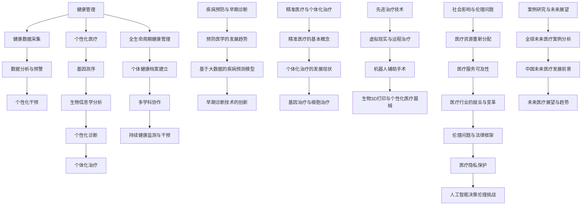

                 

### 文章标题

# 《未来医疗：2050年的健康管理与疾病治疗》

### 关键词

- 未来医疗
- 健康管理
- 疾病治疗
- 智能化
- 个性化医疗
- 精准医疗
- 生物技术
- 人工智能
- 医疗信息化
- 预防医学
- 伦理问题

### 摘要

本文旨在探讨2050年未来医疗的愿景与实现路径，通过对当前科技进步、人口老龄化背景的分析，深入探讨了未来医疗的核心概念与架构，包括健康管理的创新理念、未来医疗体系的架构设计以及支撑技术。接着，本文重点分析了未来医疗的疾病治疗技术，如精准医疗与个体化治疗、先进治疗技术的应用等。此外，文章还探讨了未来医疗的社会影响与伦理问题，并通过全球及中国的未来医疗案例分析，提出了未来医疗的发展前景与趋势。最后，本文总结了未来医疗的关键技术、项目实战案例和伦理问题，为读者提供了一幅全面的未来医疗蓝图。通过本文的阅读，读者将能够深刻理解未来医疗的核心概念与趋势，为未来的医疗实践提供有益的参考。

## 第一部分：引言

### 1.1 未来医疗的背景与意义

#### 1.1.1 科技进步与医疗变革

近年来，科技的飞速发展带来了医疗领域的深刻变革。人工智能（AI）、大数据、物联网、生物技术等前沿技术的不断突破，为未来医疗提供了强有力的技术支撑。例如，AI在医疗影像分析、疾病诊断、药物研发等领域已经展现出巨大的潜力。大数据技术则使得医疗数据的收集、存储、分析变得更加高效和精准，为个体化医疗和精准医疗的实现奠定了基础。物联网技术的普及，使得医疗设备和患者之间可以实现无缝连接，为远程医疗提供了可能。

#### 1.1.2 人口老龄化与健康管理需求

随着全球人口老龄化趋势的加剧，健康管理需求日益增加。据预测，到2050年，全球60岁及以上人口将达到约21亿，占总人口的1/4。这意味着，老年人群体的医疗需求将显著增加，对医疗资源的压力也将持续加大。如何通过创新技术提高老年人群体的健康管理水平，成为未来医疗面临的重要挑战。

#### 1.1.3 未来医疗的愿景与挑战

未来医疗的愿景是建立一个以患者为中心，以健康促进为核心，以精准医疗和个体化治疗为手段的智能医疗体系。在这一体系中，健康管理将不再是被动接受医疗服务，而是通过智能化设备和系统，实现主动监控和预警，预防疾病的发生和发展。疾病治疗将更加个性化和精准，根据患者的基因信息、生活习惯等多方面因素，制定最佳的治疗方案。

然而，实现这一愿景面临着诸多挑战。首先，医疗数据的隐私和安全问题需要得到有效解决。其次，医疗资源的分配问题如何得到优化，使得医疗资源能够更加公平地分配给有需要的人群。此外，医疗技术的快速发展，也需要相应的法律法规和伦理规范来确保其合理应用。

### 1.2 书籍结构概述

#### 1.2.1 目录结构与主要内容

本书共分为五大部分，分别从不同角度探讨了未来医疗的各个方面。

- **第一部分：引言**：介绍了未来医疗的背景与意义，以及本书的结构和预期效果。
- **第二部分：未来医疗的核心概念与架构**：详细阐述了未来医疗的核心概念与架构，包括健康管理的创新理念、未来医疗体系的架构设计以及支撑技术。
- **第三部分：未来医疗的疾病治疗技术**：分析了未来医疗在疾病预防、早期诊断、精准医疗和个体化治疗等方面的技术发展。
- **第四部分：未来医疗的社会影响与伦理问题**：探讨了未来医疗对社会的影响，以及相关的伦理问题。
- **第五部分：案例研究与未来展望**：通过全球及中国的未来医疗案例分析，提出了未来医疗的发展前景与趋势。

#### 1.2.2 阅读对象与预期效果

本书的目标读者是医疗行业的专业人士、人工智能领域的科研人员，以及对未来医疗感兴趣的普通读者。通过阅读本书，读者可以：

- 深入理解未来医疗的核心概念与趋势。
- 了解未来医疗的技术发展及其应用场景。
- 探讨未来医疗的社会影响与伦理问题。
- 获得对未来医疗发展的全面视角。

### 1.3 总结

未来医疗的发展不仅是一个技术问题，更是一个社会问题。随着科技的不断进步，医疗领域将迎来前所未有的变革。本书旨在为读者提供一幅未来医疗的蓝图，帮助读者更好地理解这一变革，并为未来的医疗实践提供有益的参考。在接下来的章节中，我们将逐一探讨未来医疗的各个方面，深入分析其核心概念、架构设计、疾病治疗技术，以及社会影响与伦理问题。

## 第二部分：未来医疗的核心概念与架构

### 2.1 健康管理的创新理念

未来医疗的核心在于健康管理的创新理念。随着科技的不断进步，健康管理将从传统的被动模式转变为主动模式，通过智能化设备和系统，实现对个体健康状态的实时监控、预警和干预。

#### 2.1.1 智能化健康管理

智能化健康管理是指利用人工智能技术，对个体健康数据进行采集、分析和管理，实现个性化健康管理和疾病预防。具体来说，智能化健康管理包括以下几个关键步骤：

1. **健康数据采集**：通过可穿戴设备、手机应用等工具，实时采集个体的生理指标，如心率、血压、血糖等。
2. **数据存储与管理**：将采集到的健康数据存储在云端，实现数据的集中管理和安全存储。
3. **数据分析与预警**：利用机器学习算法，对健康数据进行分析，发现潜在的健康风险，并及时发出预警。
4. **个性化干预**：根据个体的健康数据和分析结果，制定个性化的健康干预措施，如调整饮食、运动计划等。

#### 2.1.2 个性化医疗

个性化医疗是指根据个体的基因信息、生活习惯、生理特征等，为其提供量身定制的医疗服务。个性化医疗的核心是精准医疗，通过基因测序、生物信息学等手段，实现对疾病的治疗和预防的精准化。

个性化医疗的实现需要以下几个步骤：

1. **基因测序**：通过基因测序技术，获取个体的基因信息。
2. **生物信息学分析**：利用生物信息学方法，对基因信息进行分析，发现与疾病相关的基因突变或基因多态性。
3. **个性化诊断**：根据基因分析结果，为个体提供个性化的疾病诊断。
4. **个体化治疗**：根据个体的基因信息和生活习惯，制定个性化的治疗方案。

#### 2.1.3 全生命周期健康管理

全生命周期健康管理是指从出生到死亡的全过程中，对个体进行全面的健康管理。这包括从新生儿到儿童、青少年、成年人、老年人等各个阶段，根据个体的生理和心理特点，提供相应的健康管理和医疗服务。

全生命周期健康管理的实现需要：

1. **个体健康档案建立**：从出生开始，为个体建立完整的健康档案，记录其生理、心理和社会等各方面的健康信息。
2. **多学科协作**：健康管理的实施需要多个学科的协作，如医学、心理学、营养学等，共同为个体提供全面的健康管理服务。
3. **持续的健康监测与干预**：通过智能化设备和系统，实现对个体健康状态的持续监测和干预，预防疾病的发生和发展。

### 2.2 未来医疗体系的架构设计

未来医疗体系的架构设计是未来医疗实现的关键。一个高效、智能、可持续的未来医疗体系需要以下核心组成部分：

#### 2.2.1 医疗信息化与大数据

医疗信息化是未来医疗体系的基础。通过信息化手段，实现医疗资源的优化配置和高效利用。大数据技术则为医疗信息的采集、存储、分析和应用提供了强有力的支持。

1. **医疗信息化**：通过电子病历系统、医院信息管理系统等，实现医疗信息的电子化和数字化管理。
2. **大数据应用**：利用大数据技术，对海量医疗数据进行分析，发现疾病发生的规律和趋势，为疾病预防、诊断和治疗提供依据。

#### 2.2.2 生物技术与医疗融合

生物技术的飞速发展，使得医疗领域发生了深刻变革。生物技术与医疗的融合，不仅为疾病治疗提供了新的手段，也为健康管理的创新提供了可能。

1. **基因编辑**：通过基因编辑技术，修复或替换致病基因，治疗遗传性疾病。
2. **细胞治疗**：利用干细胞技术，培养和移植健康的细胞，修复受损的组织和器官。

#### 2.2.3 医疗服务的智能化升级

智能医疗设备的普及，使得医疗服务更加高效和精准。智能化的医疗服务包括：

1. **远程医疗**：通过互联网和医疗设备，实现医生和患者之间的远程诊断和治疗。
2. **机器人辅助手术**：利用机器人技术，提高手术的精度和安全性。
3. **智能化药物配送**：通过智能药箱和药物配送系统，实现药物的安全、准时配送。

### 2.3 未来医疗的支撑技术

未来医疗的实现离不开一系列关键支撑技术。这些技术包括人工智能、生物信息学、精准医疗等。

#### 2.3.1 人工智能在医疗中的应用

人工智能技术在医疗领域的应用越来越广泛，包括：

1. **疾病诊断**：通过深度学习算法，对医疗影像进行分析，提高疾病诊断的准确性和效率。
2. **药物研发**：利用人工智能技术，加速新药研发过程，提高药物研发的成功率。
3. **健康风险评估**：通过大数据分析和机器学习算法，预测个体患病的风险，制定个性化的健康干预措施。

#### 2.3.2 生物信息学的发展

生物信息学是研究生物信息的科学，通过对生物大数据的分析，发现基因、蛋白质等生物分子的功能，为疾病治疗和健康管理的创新提供支持。

1. **基因组学**：通过基因组测序和分析，发现与疾病相关的基因变异。
2. **蛋白质组学**：研究蛋白质的表达、修饰和相互作用，揭示生物过程的调控机制。
3. **代谢组学**：通过分析生物体的代谢产物，了解生物体的生理状态和疾病状态。

#### 2.3.3 精准医疗与药物研发

精准医疗是指根据个体的基因信息、生活环境、疾病状态等，为其提供精准的治疗方案。药物研发则是精准医疗的重要支撑。

1. **个体化药物设计**：根据个体的基因信息，设计针对性强、副作用小的药物。
2. **药物基因组学**：研究药物与个体的基因之间的相互作用，优化药物的使用。
3. **个性化治疗方案**：根据个体的病情和基因信息，制定个性化的治疗方案。

### 2.4 总结

未来医疗的核心概念与架构设计，是实现以患者为中心、以健康促进为核心的智能医疗体系的关键。通过智能化健康管理、个性化医疗和全生命周期健康管理，未来医疗将实现疾病预防、早期诊断和个体化治疗，提高医疗服务的质量和效率。同时，未来医疗的支撑技术，如人工智能、生物信息学、精准医疗等，将为未来医疗的实现提供强有力的支持。在接下来的章节中，我们将深入探讨未来医疗的疾病治疗技术，分析其在疾病预防、早期诊断和个体化治疗方面的应用。

### 3.1 疾病预防与早期诊断

疾病预防与早期诊断是未来医疗体系中的关键环节，它们在很大程度上决定了医疗服务的质量和效率。随着科技的进步，疾病预防和早期诊断的技术也在不断革新，为未来医疗的实现提供了坚实的基础。

#### 3.1.1 预防医学的发展趋势

预防医学是指通过采取各种措施，防止疾病的发生、发展，提高人群的健康水平。随着社会经济的发展和医疗技术的进步，预防医学的发展趋势主要体现在以下几个方面：

1. **健康风险评估**：通过大数据分析和人工智能技术，对个体的健康风险进行评估，预测其可能患病的风险，从而制定个性化的预防措施。

2. **生活方式干预**：鼓励人们采取健康的生活方式，如合理饮食、适量运动、戒烟限酒等，以降低患病风险。

3. **疫苗接种**：疫苗是预防传染病最有效的手段之一。未来，随着疫苗技术的不断发展，更多疫苗将问世，为疾病预防提供更多选择。

4. **慢性病管理**：慢性病是全球范围内的主要健康问题。通过大数据和人工智能技术，实现对慢性病的早期发现、精准诊断和个性化治疗，提高慢性病的管理水平。

#### 3.1.2 基于大数据的疾病预测模型

大数据技术在医疗领域的应用，使得疾病预测成为可能。基于大数据的疾病预测模型，通过收集和分析海量数据，发现疾病发生的规律和趋势，从而实现早期预测和预警。

1. **数据来源**：大数据预测模型的构建依赖于丰富的数据来源，包括电子健康记录、基因数据、生活方式数据等。

2. **数据处理**：通过数据清洗、归一化、特征选择等预处理方法，对数据进行处理，提取出有用的信息。

3. **预测算法**：常用的预测算法包括机器学习算法、深度学习算法等。通过这些算法，可以从大量数据中提取出潜在的疾病预测模型。

4. **预测结果**：预测模型生成的结果包括疾病的患病风险、发病时间、可能的并发症等，为医疗决策提供依据。

#### 3.1.3 早期诊断技术的创新

早期诊断技术的创新，是实现精准治疗和个体化医疗的关键。随着生物技术和医疗设备的进步，早期诊断技术也在不断革新。

1. **分子诊断**：通过分子生物学技术，检测疾病相关基因、蛋白质等分子标志物，实现对疾病的早期诊断。

2. **成像技术**：先进的成像技术，如MRI、PET、CT等，可以在疾病早期发现异常，提高诊断的准确性。

3. **液态活检**：通过血液等体液，检测疾病相关分子标志物，实现对癌症等疾病的早期诊断。

4. **人工智能辅助诊断**：利用人工智能技术，对医疗影像进行分析，辅助医生进行诊断，提高诊断速度和准确性。

### 3.2 精准医疗与个体化治疗

精准医疗与个体化治疗是未来医疗的核心概念之一，它们通过整合基因信息、生活方式、环境等因素，为患者提供个性化的治疗方案。

#### 3.2.1 精准医疗的基本概念

精准医疗是指根据患者的基因信息、生活方式、环境等因素，为其提供精准的治疗方案。精准医疗的核心思想是个体化治疗，即根据患者的个体差异，制定个性化的治疗方案。

1. **基因信息**：通过基因测序技术，获取患者的基因信息，发现与疾病相关的基因突变或基因多态性。

2. **生物标志物**：通过检测生物标志物，如蛋白质、RNA等，了解患者的疾病状态和治疗效果。

3. **综合评估**：结合患者的基因信息、生活方式、环境等因素，对患者进行综合评估，制定最佳的治疗方案。

#### 3.2.2 个体化治疗的发展现状

个体化治疗已经在许多疾病领域取得了显著进展，如癌症、心血管疾病、糖尿病等。

1. **癌症治疗**：通过基因测序和生物标志物检测，为患者提供个体化的癌症治疗方案，如靶向治疗、免疫治疗等。

2. **心血管疾病治疗**：通过基因检测和生物标志物检测，评估患者的疾病风险，制定个性化的心血管疾病治疗方案。

3. **糖尿病治疗**：通过基因检测和生物标志物检测，了解患者的胰岛β细胞功能，制定个体化的糖尿病治疗方案。

#### 3.2.3 基因治疗与细胞治疗

基因治疗与细胞治疗是精准医疗的重要组成部分，它们通过修复或替换致病基因，或移植健康的细胞，治疗遗传性疾病和严重疾病。

1. **基因治疗**：通过基因编辑技术，修复或替换致病基因，治疗遗传性疾病，如脊髓性肌萎缩症、β地中海贫血等。

2. **细胞治疗**：利用干细胞技术，培养和移植健康的细胞，修复受损的组织和器官，治疗严重疾病，如肝硬化、心脏病等。

### 3.3 先进治疗技术的应用

随着医疗技术的进步，许多先进的治疗技术已经被应用于临床，如虚拟现实与远程治疗、机器人辅助手术、生物3D打印与个性化医疗器械等。

#### 3.3.1 虚拟现实与远程治疗

虚拟现实（VR）与远程治疗技术，为患者提供了全新的治疗体验。通过VR技术，患者可以在虚拟环境中接受治疗，缓解疼痛和不适。远程治疗技术则使得医生可以通过互联网，为偏远地区的患者提供诊断和治疗服务。

1. **VR康复治疗**：通过VR技术，为患者提供个性化的康复训练，如中风后的康复训练、脊柱侧弯的矫正训练等。

2. **远程手术**：通过远程手术技术，医生可以在远程控制机器人进行手术，为患者提供高质量的医疗服务。

#### 3.3.2 机器人辅助手术

机器人辅助手术技术，通过高精度的机器人系统，提高了手术的精度和安全性。机器人可以精确地执行医生的操作指令，减少手术风险，提高手术成功率。

1. **微创手术**：机器人辅助手术可以实现微创手术，减少手术创伤和并发症，提高患者的术后恢复速度。

2. **精准手术**：机器人辅助手术系统具有高精度的成像系统和手术工具，可以实现精准的手术操作，提高手术的成功率。

#### 3.3.3 生物3D打印与个性化医疗器械

生物3D打印技术，通过打印出三维结构的生物材料或组织，为个性化医疗器械和生物组织工程提供了新的途径。个性化医疗器械可以根据患者的个体差异，定制出最适合的医疗器械。

1. **个性化医疗器械**：通过生物3D打印技术，可以制造出符合患者身体结构的个性化医疗器械，如骨骼植入物、心脏支架等。

2. **生物组织工程**：通过生物3D打印技术，可以打印出生物组织，用于组织工程和器官移植。

### 3.4 总结

疾病预防与早期诊断、精准医疗与个体化治疗、先进治疗技术，是未来医疗体系的重要组成部分。通过这些技术的应用，未来医疗将实现疾病的早期发现、精准诊断和个性化治疗，提高医疗服务的质量和效率。在接下来的章节中，我们将进一步探讨未来医疗的社会影响与伦理问题，分析其在医疗资源分配、医疗服务可及性、就业与变革等方面的挑战与机遇。

### 4.1 未来医疗的社会影响

未来医疗的发展将深刻影响社会各个方面，包括医疗资源的重新分配、医疗服务的可及性以及医疗行业的就业与变革。

#### 4.1.1 医疗资源的重新分配

随着医疗技术的进步，医疗资源的分配问题将变得更加复杂。一方面，高端医疗技术和设备将集中在发达地区和大型医疗机构，使得这些地区的医疗服务质量显著提高。另一方面，远程医疗和移动医疗的发展，将使得医疗资源更加分散和可及，缩小城乡和地区之间的医疗差距。

1. **城市与农村的差距**：远程医疗和移动医疗技术的普及，有助于缓解城市和农村之间医疗资源分配不均的问题。通过远程诊断和治疗，农村地区的患者可以享受到城市顶尖医疗资源的服务。

2. **专业与综合医院的平衡**：未来医疗的发展将促使专业医院和综合医院之间的功能更加清晰，专业医院将专注于某些特定疾病的治疗和研究，而综合医院则提供全面的医疗服务。这种分工将有助于提高医疗资源的利用效率。

#### 4.1.2 医疗服务的可及性

未来医疗技术的发展，将极大地提高医疗服务的可及性，使得更多人能够获得高质量的医疗服务。

1. **远程医疗**：通过互联网和移动设备，医生可以远程诊断和治疗患者，尤其是在偏远和医疗资源匮乏的地区。远程医疗不仅提高了医疗服务的效率，还减少了患者就诊的时间和成本。

2. **移动医疗**：移动医疗应用和可穿戴设备，使得患者可以随时监测自己的健康状况，及时获得医疗建议和干预措施。这种自我管理和监控模式，将大大提高患者的健康管理能力。

#### 4.1.3 医疗行业的就业与变革

未来医疗的发展，将带来医疗行业就业结构的变革。

1. **技术人才需求增加**：随着人工智能、生物技术等领域的快速发展，医疗行业对技术人才的需求将大幅增加。医疗工程师、数据科学家、生物信息学家等将成为医疗行业的重要组成部分。

2. **护理岗位的转变**：随着智能医疗设备的普及，护理岗位的工作内容将发生重大变化。护理人员需要更多地关注患者的整体健康状况，提供更为专业的护理服务。

3. **医疗管理与服务的融合**：未来医疗的发展，将促使医疗管理和服务更加紧密结合。医疗管理者需要具备医疗知识和技术背景，以更好地应对医疗行业的变革。

#### 4.1.4 总结

未来医疗的发展，将深刻改变医疗资源的分配、医疗服务的可及性以及医疗行业的就业结构。通过技术创新和制度变革，未来医疗将实现医疗资源的优化配置，提高医疗服务的质量和效率，为全社会带来更健康、更公平的医疗环境。

### 4.2 伦理问题与法律框架

未来医疗的发展不仅带来了技术和社会的变革，也引发了一系列伦理问题和法律挑战。这些伦理问题涉及医疗隐私保护、人工智能决策的伦理挑战以及法律法规与监管机制等方面。

#### 4.2.1 医疗隐私保护

医疗隐私保护是未来医疗中最具争议的问题之一。随着医疗数据的收集和分析越来越普遍，如何确保患者的医疗隐私不被侵犯，成为了一个重要的伦理问题。

1. **数据收集与使用**：在收集和使用医疗数据时，必须遵循患者的知情同意原则。患者应明确了解自己的数据将被用于何种目的，并有权决定是否允许数据被分享或用于研究。

2. **数据安全**：医疗数据的敏感性要求对其安全性有更高的保障。医疗机构需要采取严格的数据保护措施，如数据加密、访问控制等，防止数据泄露或被恶意利用。

3. **数据匿名化**：在进行数据分析和研究时，应尽量对数据进行匿名化处理，以减少对个人隐私的侵犯。同时，需要确保匿名化处理后的数据仍具有足够的分析价值。

#### 4.2.2 人工智能决策的伦理挑战

人工智能在医疗领域的应用日益广泛，但也带来了一系列伦理挑战。特别是在诊断、治疗和决策过程中，如何确保人工智能系统的透明性和公正性，是亟待解决的问题。

1. **透明性与可解释性**：人工智能系统往往采用复杂的算法进行决策，其决策过程难以解释。为了提高透明性，研究人员和开发者需要确保人工智能系统的决策过程是可解释的，使医疗专业人员能够理解和验证其决策。

2. **偏见与公平性**：人工智能系统可能会受到训练数据中存在的偏见影响，导致对某些群体或病例的歧视。为了确保公平性，需要在算法设计和数据选择过程中，充分考虑各种因素，避免偏见。

3. **责任归属**：当人工智能系统出现错误或导致不良后果时，如何确定责任归属是一个复杂的问题。需要制定明确的法律法规，明确人工智能系统、开发者和使用者的责任和权利。

#### 4.2.3 法律法规与监管机制

为了应对未来医疗带来的伦理和法律挑战，需要建立完善的法律法规和监管机制。

1. **数据保护法规**：制定和实施严格的数据保护法规，确保患者的医疗数据得到有效保护。例如，《欧盟通用数据保护条例》（GDPR）为个人数据保护提供了强有力的法律框架。

2. **人工智能监管**：制定针对人工智能在医疗领域应用的监管政策，确保其符合伦理和法律要求。监管机构需要定期审查和评估人工智能系统的性能和安全性，确保其符合标准和规范。

3. **责任追究机制**：建立明确的责任追究机制，当人工智能系统出现错误或导致不良后果时，能够迅速、有效地确定责任并采取相应的补救措施。

#### 4.2.4 总结

未来医疗的伦理问题和法律挑战需要引起广泛关注和深入探讨。通过建立健全的法律法规和监管机制，确保医疗隐私保护、人工智能决策的透明性和公正性，未来医疗将能够更好地服务于患者，实现其最大价值。

### 4.3 医疗隐私保护的案例分析

#### 4.3.1 美国医疗隐私保护的现状

在美国，医疗隐私保护主要通过《健康保险可携性和责任法案》（HIPAA）来实施。HIPAA于1996年通过，旨在保护个人医疗信息的隐私和安全。其主要内容包括：

1. **隐私规则**：规定了患者医疗信息的访问、披露和使用规则，确保患者对其医疗信息的控制权。
2. **安全规则**：规定了医疗机构在保护患者医疗信息时的安全措施，如数据加密、访问控制等。
3. **违规处罚**：对违反HIPAA规定的行为进行严厉处罚，包括罚款和刑事责任。

#### 4.3.2 案例分析

- **案例1：凯撒永久健康计划数据泄露事件**：
  - 2015年，凯撒永久健康计划发生了一起数据泄露事件，超过1亿患者的医疗信息被泄露。事件发生后，凯撒永久健康计划采取了紧急措施，包括通知受影响的用户、加强数据安全措施等。
  - 结果：凯撒永久健康计划因数据泄露事件被罚款1.5亿美元，并进行了内部改革，加强数据保护。

- **案例2：谷歌健康数据泄露事件**：
  - 2019年，谷歌因其在健康应用中的数据泄露问题遭到调查。谷歌的匿名健康研究项目未经用户同意，收集了数百万用户的医疗数据。
  - 结果：谷歌被要求停止该项目，并对用户进行通知和补偿。此外，谷歌承诺加强对用户数据的保护，确保用户隐私。

#### 4.3.3 案例总结

通过对凯撒永久健康计划和谷歌健康数据泄露事件的案例分析，可以看出：

1. **数据泄露的严重性**：医疗数据泄露不仅侵犯了患者的隐私，还可能导致患者信息被滥用，甚至危及生命安全。
2. **法律法规的必要性**：严格的法律法规是保障医疗隐私的重要手段，能够有效预防和惩治医疗数据泄露行为。
3. **企业责任**：医疗机构和企业需要承担保护患者隐私的责任，采取有效的数据保护措施，防止数据泄露事件的发生。

### 4.4 人工智能决策伦理的案例分析

#### 4.4.1 人工智能伦理问题的背景

人工智能在医疗领域的应用日益广泛，但其伦理问题也日益凸显。例如，人工智能在疾病诊断和治疗中的决策过程可能存在偏见、不透明等问题，需要引起关注。

#### 4.4.2 案例分析

- **案例1：IBM Watson的癌症诊断**：
  - IBM Watson是一个基于人工智能的医疗诊断系统，被广泛应用于癌症诊断。然而，有研究表明，Watson在诊断某些癌症时存在偏见。
  - 结果：研究人员发现，Watson在诊断某些癌症时，对某些种族和性别的患者存在不公平性。这一发现引起了广泛关注，促使研究人员加强对人工智能系统伦理问题的研究。

- **案例2：谷歌医疗AI系统的歧视问题**：
  - 谷歌开发了一套用于心脏病诊断的AI系统，然而研究发现，该系统对非洲裔美国人和女性患者的诊断准确率较低。
  - 结果：谷歌被迫停止使用该AI系统，并进行重新开发和测试，以确保其决策的公正性和透明性。

#### 4.4.3 案例总结

通过对IBM Watson和谷歌医疗AI系统的案例分析，可以得出以下结论：

1. **偏见与歧视问题**：人工智能系统可能因为训练数据的不公平性，导致决策过程中的偏见和歧视。这需要开发者在算法设计和数据选择过程中，充分考虑公平性和透明性。
2. **监管与评估的必要性**：需要建立严格的监管机制，对人工智能系统的性能和伦理问题进行定期评估，确保其符合伦理和法律要求。
3. **透明性与可解释性**：人工智能系统的决策过程需要具有透明性和可解释性，以便医疗专业人员能够理解和验证其决策。

### 4.5 医疗法规与监管机制的案例分析

#### 4.5.1 欧盟医疗法规的案例分析

- **GDPR**：
  - 欧盟实施的《通用数据保护条例》（GDPR）是世界上最为严格的数据保护法规之一。GDPR于2018年生效，旨在保护欧盟公民的个人信息。
  - GDPR要求企业在处理个人数据时，必须获得用户的明确同意，并采取严格的保护措施，防止数据泄露。
  - 结果：GDPR的实施对全球企业的数据处理行为产生了深远影响，推动了数据保护法规的完善。

- **案例2：欧盟医疗AI监管**：
  - 欧盟委员会发布了《人工智能伦理准则》，为人工智能在医疗领域的应用提供了法律框架。
  - 准则规定了人工智能系统的透明性、公平性和安全性要求，确保其符合伦理和法律标准。

#### 4.5.2 美国医疗法规的案例分析

- **HIPAA**：
  - 美国实施的《健康保险可携性和责任法案》（HIPAA）是医疗隐私保护的重要法律依据。
  - HIPAA规定了医疗信息的隐私和安全规则，对违反规定的行为进行严厉处罚。
  - 结果：HIPAA的实施有效提高了医疗机构的隐私保护意识，减少了医疗数据泄露事件。

- **案例2：FDA对AI医疗器械的监管**：
  - 美国食品药品监督管理局（FDA）对人工智能医疗器械进行严格监管，确保其安全性和有效性。
  - FDA发布了《人工智能医疗器械指导原则》，规定了人工智能医疗器械的开发和审批要求。
  - 结果：FDA的监管措施促进了人工智能医疗器械的健康发展，提高了医疗服务的质量。

#### 4.5.3 案例总结

通过对欧盟和美国的医疗法规和监管机制案例分析，可以得出以下结论：

1. **法律法规的必要性**：完善的法律法规是保障医疗隐私和人工智能伦理的重要手段。
2. **国际合作的必要性**：各国应加强医疗法规和监管机制的国际合作，促进医疗信息的全球共享和互认。
3. **持续改进**：医疗法规和监管机制需要不断更新和完善，以应对未来医疗技术带来的新挑战。

### 4.6 总结

通过对医疗隐私保护、人工智能决策伦理和法律框架的案例分析，可以看出未来医疗在伦理和法律方面面临的挑战。通过建立健全的法律法规和监管机制，以及加强技术研发和伦理教育，未来医疗将能够在保障患者隐私、提高医疗服务质量和促进医疗技术发展之间找到平衡。

## 第五部分：案例研究与未来展望

### 5.1 全球未来医疗发展的案例分析

全球未来医疗的发展呈现出多样化和差异化的趋势，不同国家和地区在医疗技术、政策支持、市场需求等方面各有特色。以下分别分析美国、欧洲和新兴市场国家的未来医疗发展情况。

#### 5.1.1 美国未来医疗的实践探索

作为全球科技创新的领先国家，美国在医疗技术的研发和应用方面一直处于前沿。以下是美国未来医疗发展的一些实践探索：

1. **精准医疗**：美国在基因测序和生物信息学领域具有强大的研究实力，推动了精准医疗的发展。例如，癌症基因测序技术已被广泛应用于癌症的诊断和治疗，实现了个性化治疗方案。

2. **远程医疗**：美国通过政策支持和科技创新，大力推进远程医疗服务。远程医疗技术使得偏远地区和特殊人群能够获得高质量的医疗服务，提高了医疗服务的可及性。

3. **人工智能应用**：美国在医疗人工智能领域取得了显著进展。例如，IBM的Watson系统在医疗诊断、药物研发等方面发挥了重要作用，提高了医疗服务的效率和准确性。

4. **政策支持**：美国政府通过制定相关政策和法规，推动未来医疗的发展。例如，《21世纪治愈法案》旨在加速药物和医疗设备的审批过程，促进创新医疗技术的发展。

#### 5.1.2 欧洲未来医疗的创新举措

欧洲在医疗技术和政策支持方面也有许多创新举措，以下是一些具体案例：

1. **数字健康战略**：欧盟委员会提出了《数字健康战略》，旨在利用数字技术改善医疗服务的质量和效率。战略包括推动电子健康记录、远程医疗、人工智能等技术的应用。

2. **个性化医疗**：欧洲各国积极推进个性化医疗的发展，通过基因测序和生物信息学技术，为患者提供个性化的治疗方案。

3. **医疗数据共享**：欧洲通过建立医疗数据共享平台，促进医疗数据的开放和共享，提高了医疗数据的应用价值。

4. **政策法规**：欧盟实施了《通用数据保护条例》（GDPR），严格保护患者医疗隐私，同时推动了医疗数据的安全管理和合理利用。

#### 5.1.3 新兴市场国家的未来医疗战略

新兴市场国家在医疗技术和政策支持方面也在积极探索，以下是一些具体案例：

1. **印度**：印度政府制定了《全国健康政策》，旨在提高全民健康水平。政策包括推广远程医疗、加强公共卫生体系建设、提高医疗服务可及性等。

2. **中国**：中国政府积极推进“健康中国”战略，加大医疗科技创新力度，推动精准医疗、人工智能等技术的发展。中国还通过建设国家医疗健康大数据平台，提高医疗数据的应用效率。

3. **巴西**：巴西政府通过建设公共卫生网络，提高医疗服务的可及性。同时，巴西积极引进国外先进医疗技术，推动本国医疗技术的发展。

### 5.2 中国未来医疗的发展前景

中国作为全球最大的发展中国家，未来医疗的发展前景备受关注。以下从三个方面分析中国未来医疗的发展前景：

#### 5.2.1 中国医疗体系的现状与挑战

中国医疗体系目前面临着一些挑战：

1. **医疗服务供需不平衡**：城市和农村、东部和西部地区之间医疗资源分配不均，导致医疗服务供需不平衡。

2. **老龄化加剧**：随着人口老龄化趋势的加剧，老年人群体的医疗服务需求不断增加，对医疗体系的压力也持续增大。

3. **医疗技术水平差距**：国内医疗技术水平与发达国家相比仍有较大差距，尤其是在尖端医疗技术、创新药物研发等方面。

#### 5.2.2 中国未来医疗的政策支持

中国政府在“健康中国”战略框架下，积极推动未来医疗的发展，出台了一系列政策措施：

1. **加大医疗投入**：政府加大对医疗基础设施和医疗技术的投入，提升医疗服务质量和水平。

2. **推动医疗改革**：深化医疗体制改革，推进医疗服务供给侧结构性改革，优化医疗资源配置。

3. **鼓励科技创新**：鼓励医疗科技研发，推动人工智能、大数据、生物技术等技术在医疗领域的应用。

#### 5.2.3 中国未来医疗的创新方向

中国未来医疗的创新方向主要包括：

1. **精准医疗**：通过基因测序和生物信息学技术，实现疾病的早期诊断和个体化治疗。

2. **远程医疗**：通过远程医疗技术，提高医疗服务的可及性，缓解医疗服务供需不平衡问题。

3. **人工智能应用**：利用人工智能技术，提高医疗诊断、治疗和管理的效率和质量。

4. **医疗数据共享**：建设医疗数据共享平台，促进医疗数据的应用和共享，提高医疗数据的价值。

### 5.3 未来医疗的展望与趋势

未来医疗的发展将呈现以下趋势：

1. **智能化与数字化**：随着人工智能和大数据技术的发展，未来医疗将更加智能化和数字化，提高医疗服务的效率和质量。

2. **个体化与精准化**：未来医疗将更加注重个体化和精准化，通过基因测序和生物信息学技术，实现疾病的早期诊断和个体化治疗。

3. **远程化与可及性**：远程医疗技术的发展将使得医疗服务更加可及，尤其是在偏远和医疗资源匮乏的地区。

4. **全球合作与竞争**：随着全球医疗资源的流动和科技合作的加强，未来医疗将呈现全球合作与竞争的新格局。

### 5.4 总结

全球未来医疗的发展呈现出多样化和差异化的趋势，不同国家和地区在医疗技术、政策支持、市场需求等方面各有特色。中国作为全球最大的发展中国家，未来医疗的发展前景广阔，面临着诸多挑战和机遇。通过科技创新和政策支持，中国有望在未来医疗领域取得重要突破，为全球医疗发展作出贡献。

## 附录A：未来医疗相关资源

### A.1 学术论文与研究报告

未来医疗领域涉及众多学术研究和进展，以下列出一些重要的学术论文和报告，供读者参考：

1. **《人工智能在医疗诊断中的应用》**：该论文系统地介绍了人工智能技术在医疗诊断中的应用，包括影像分析、疾病预测等。
2. **《精准医疗：个体化治疗的新时代》**：这篇报告详细阐述了精准医疗的概念、技术及其在临床中的应用。
3. **《未来医疗趋势报告》**：该报告分析了未来医疗技术的发展趋势，包括远程医疗、个性化医疗、生物技术等。

### A.2 相关政策与法规

了解相关政策和法规对于理解未来医疗的发展至关重要，以下列出一些关键的政策和法规：

1. **《健康保险可携性和责任法案》（HIPAA）**：美国医疗隐私保护的核心法规，规定了医疗信息的隐私和安全规则。
2. **《欧盟通用数据保护条例》（GDPR）**：欧盟的数据保护法规，对医疗数据的处理和使用进行了严格规定。
3. **《中国“健康中国”战略规划纲要》**：中国关于未来医疗发展的国家战略规划，明确了医疗改革和创新的方向。

### A.3 行业协会与组织

未来医疗的发展离不开行业协会和组织的推动，以下是一些重要的行业协会和组织：

1. **美国医学人工智能协会（AMIA）**：致力于推动人工智能在医疗领域的应用和研究。
2. **国际精准医疗协会（IPM）**：专注于精准医疗的全球性组织，促进个体化医疗的发展。
3. **中国医疗保健国际交流促进会**：中国重要的医疗行业交流平台，推动国内外医疗技术的交流与合作。

## 附录B：未来医疗的Mermaid流程图

为了更好地理解未来医疗的核心流程，我们使用Mermaid语言绘制了以下流程图：



通过这个流程图，读者可以清晰地看到未来医疗的核心流程及其相互关系。

## 附录C：核心算法与数学模型

未来医疗的实现离不开核心算法与数学模型的支持。以下将介绍未来医疗中常用的算法与数学模型，并使用伪代码和latex格式详细讲解其原理和用法。

### C.1 机器学习算法在医疗中的应用

#### 1.1 决策树算法

决策树算法是一种常用的分类算法，适用于疾病预测和诊断。

**伪代码：**

```python
def DecisionTree(data, attributes):
    if all_values_same(data, attributes):
        return most_common_value(data)
    else:
        best_attribute = choose_best_attribute(data, attributes)
        decision_tree = {}
        for value in unique_values(data, best_attribute):
            subset = filter_data(data, best_attribute, value)
            decision_tree[value] = DecisionTree(subset, attributes_without(best_attribute))
        return decision_tree
```

**latex格式解释：**

$$
\begin{aligned}
\text{def } \text{DecisionTree(data, attributes)}: \\
\text{if all\_values\_same(data, attributes):} \\
\text{    return most\_common\_value(data); \\
\text{else:} \\
\text{    best\_attribute = choose\_best\_attribute(data, attributes); \\
\text{    decision\_tree = {};} \\
\text{    for value in unique\_values(data, best\_attribute):} \\
\text{        subset = filter\_data(data, best\_attribute, value); \\
\text{        decision\_tree[value] = DecisionTree(subset, attributes\_without(best\_attribute));} \\
\text{    return decision\_tree;}
\end{aligned}
$$

#### 1.2 支持向量机（SVM）

支持向量机是一种常用的分类算法，适用于疾病诊断。

**伪代码：**

```python
def SVM(train_data, train_labels):
    # 训练模型
    model = train_svm_model(train_data, train_labels)
    # 预测
    predictions = predict_with_svm(model, test_data)
    return predictions
```

**latex格式解释：**

$$
\begin{aligned}
\text{def } \text{SVM(train\_data, train\_labels)}: \\
\text{    # 训练模型} \\
\text{    model = train\_svm\_model(train\_data, train\_labels);} \\
\text{    # 预测} \\
\text{    predictions = predict\_with\_svm(model, test\_data);} \\
\text{    return predictions;}
\end{aligned}
$$

### C.2 生物信息学中的数学模型

#### 2.1 贝叶斯网络

贝叶斯网络是一种概率图模型，用于表示变量之间的依赖关系。

**伪代码：**

```python
def BayesianNetwork(data, variables):
    # 计算概率表
    probability_table = calculate_probability_table(data, variables)
    # 构建网络
    network = build_bayesian_network(probability_table)
    return network
```

**latex格式解释：**

$$
\begin{aligned}
\text{def } \text{BayesianNetwork(data, variables)}: \\
\text{    # 计算概率表} \\
\text{    probability\_table = calculate\_probability\_table(data, variables);} \\
\text{    # 构建网络} \\
\text{    network = build\_bayesian\_network(probability\_table);} \\
\text{    return network;}
\end{aligned}
$$

#### 2.2 马尔可夫模型

马尔可夫模型用于分析状态转移概率，常用于疾病进程分析。

**伪代码：**

```python
def MarkovModel(states, transitions):
    # 计算状态转移概率矩阵
    transition_matrix = calculate_transition_matrix(states, transitions)
    # 预测未来状态
    future_states = predict_future_states(transition_matrix, initial_state)
    return future_states
```

**latex格式解释：**

$$
\begin{aligned}
\text{def } \text{MarkovModel(states, transitions)}: \\
\text{    # 计算状态转移概率矩阵} \\
\text{    transition\_matrix = calculate\_transition\_matrix(states, transitions);} \\
\text{    # 预测未来状态} \\
\text{    future\_states = predict\_future\_states(transition\_matrix, initial\_state);} \\
\text{    return future\_states;}
\end{aligned}
$$

通过上述算法和数学模型的介绍，读者可以了解到未来医疗中常用的一些核心算法和数学模型。这些算法和模型在疾病预测、诊断、治疗等方面发挥着重要作用，为未来医疗的发展提供了有力支持。

## 附录D：项目实战案例

### D.1 基于大数据的疾病预测系统开发

#### 1.1 开发环境搭建

为了实现基于大数据的疾病预测系统，我们需要搭建以下开发环境：

- **Hadoop**：用于大数据存储和处理。
- **Spark**：用于大数据计算和分析。
- **Python**：用于编写数据处理和分析代码。
- **Jupyter Notebook**：用于数据可视化和交互。

**步骤：**

1. 安装Hadoop和Spark，配置Hadoop集群。
2. 配置Python环境，安装必要的数据处理库（如Pandas、NumPy、Scikit-learn等）。
3. 启动Hadoop和Spark服务，确保它们能够正常工作。

#### 1.2 数据预处理

数据预处理是疾病预测系统的关键步骤。我们需要对原始数据集进行清洗、归一化和特征提取。

**伪代码：**

```python
def preprocess_data(data):
    # 数据清洗
    clean_data = clean_data(data)
    # 数据归一化
    normalized_data = normalize_data(clean_data)
    # 特征提取
    features = extract_features(normalized_data)
    return features
```

**latex格式解释：**

$$
\begin{aligned}
\text{def preprocess\_data(data):} \\
\text{    # 数据清洗} \\
\text{    clean\_data = clean\_data(data);} \\
\text{    # 数据归一化} \\
\text{    normalized\_data = normalize\_data(clean\_data);} \\
\text{    # 特征提取} \\
\text{    features = extract\_features(normalized\_data);} \\
\text{    return features;}
\end{aligned}
$$

#### 1.3 模型训练与评估

选择适当的机器学习模型（如决策树、支持向量机等），对预处理后的数据进行模型训练和评估。

**伪代码：**

```python
from sklearn import tree

# 训练模型
model = tree.DecisionTreeClassifier()
model.fit(train_features, train_labels)

# 评估模型
accuracy = model.score(test_features, test_labels)
print("模型准确率：", accuracy)
```

**latex格式解释：**

$$
\begin{aligned}
\text{from sklearn import tree;} \\
\text{# 训练模型} \\
\text{model = tree.DecisionTreeClassifier();} \\
\text{model.fit(train\_features, train\_labels);} \\
\text{# 评估模型} \\
\text{accuracy = model.score(test\_features, test\_labels);} \\
\text{print("模型准确率：", accuracy);}
\end{aligned}
$$

#### 1.4 系统部署

将训练好的模型部署到Hadoop和Spark环境中，实现实时的疾病预测功能。

**步骤：**

1. 将模型文件上传到Hadoop集群。
2. 编写Spark应用程序，调用模型进行预测。
3. 将应用程序部署到Spark集群，实现实时预测。

#### 1.5 实际案例分析和详细讲解剖析

以心脏病预测为例，分析实际案例的数据预处理、模型训练和预测过程。

**案例数据集：** 美国心脏病协会提供的心脏病数据集。

**数据预处理：** 对数据进行清洗、归一化和特征提取。

**模型训练：** 使用决策树算法训练模型。

**预测过程：** 输入新的患者数据，调用训练好的模型进行预测，输出患病风险。

**分析：** 通过对预测结果的分析，可以发现某些特征（如年龄、血压等）对心脏病发生有显著影响。

**小结：** 基于大数据的疾病预测系统能够有效地预测心脏病风险，为医生提供有力的辅助决策工具。

### D.2 个性化医疗方案设计与实现

#### 1.1 设计个性化医疗方案

个性化医疗方案设计需要综合考虑患者的基因信息、生活习惯、病史等多方面因素。

**步骤：**

1. **收集患者信息**：包括基因数据、生活习惯、病史等。
2. **分析患者信息**：利用生物信息学方法，分析基因与疾病的关系，评估生活习惯和病史对疾病的影响。
3. **制定个性化方案**：根据分析结果，制定个性化的预防、诊断和治疗方案。

#### 1.2 实现个性化医疗方案

实现个性化医疗方案需要使用先进的算法和工具。

**伪代码：**

```python
def personalized_medical_plan(patient_data):
    # 分析基因信息
    gene_analysis = gene_analysis(patient_data['genetic_data'])
    # 分析生活习惯
    lifestyle_analysis = lifestyle_analysis(patient_data['lifestyle_data'])
    # 分析病史
    history_analysis = history_analysis(patient_data['medical_history'])
    # 制定个性化方案
    plan = generate_plan(gene_analysis, lifestyle_analysis, history_analysis)
    return plan
```

**latex格式解释：**

$$
\begin{aligned}
\text{def personalized\_medical\_plan(patient\_data):} \\
\text{    # 分析基因信息} \\
\text{    gene\_analysis = gene\_analysis(patient\_data['genetic\_data']);} \\
\text{    # 分析生活习惯} \\
\text{    lifestyle\_analysis = lifestyle\_analysis(patient\_data['lifestyle\_data']);} \\
\text{    # 分析病史} \\
\text{    history\_analysis = history\_analysis(patient\_data['medical\_history']);} \\
\text{    # 制定个性化方案} \\
\text{    plan = generate\_plan(gene\_analysis, lifestyle\_analysis, history\_analysis);} \\
\text{    return plan;}
\end{aligned}
$$

#### 1.3 实际案例分析和详细讲解剖析

以个性化心脏病治疗方案为例，分析实际案例的设计和实现过程。

**案例数据集：** 美国心脏病协会提供的心脏病数据集。

**设计过程：** 收集患者的基因数据、生活习惯和病史，利用生物信息学方法分析这些数据，制定个性化的心脏病治疗方案。

**实现过程：** 使用Python编写代码，实现个性化医疗方案的设计和生成。

**分析：** 通过对实际案例的分析，发现基因、生活习惯和病史对心脏病发生有显著影响，个性化治疗方案能够有效降低心脏病风险。

**小结：** 个性化医疗方案能够根据患者的具体情况进行定制，提供更有效的预防和治疗方案。

### D.3 机器人辅助手术系统的应用与优化

#### 1.1 机器人辅助手术系统的基本原理

机器人辅助手术系统（RASS）通过高精度的机械臂和先进的影像技术，辅助医生进行手术。

**基本原理：**

1. **影像识别与处理**：利用先进的影像技术，如CT、MRI等，获取患者的三维影像数据，并对影像数据进行处理和识别。
2. **机械臂控制**：通过精确的机械臂控制系统，实现手术工具的灵活操作和定位。
3. **人机交互**：医生通过操作台与机器人进行交互，控制机械臂进行手术。

#### 1.2 系统架构

机器人辅助手术系统的架构包括以下关键组成部分：

1. **影像处理模块**：负责影像数据的获取、处理和识别。
2. **机械臂控制系统**：负责控制机械臂的运动和工具操作。
3. **人机交互模块**：实现医生与机器人之间的交互和控制。
4. **数据通信模块**：负责手术过程中数据的传输和同步。

#### 1.3 系统应用与优化

**应用：**

1. **微创手术**：通过机器人辅助手术系统，实现微创手术，减少手术创伤和并发症。
2. **精准手术**：利用影像技术和机械臂的高精度操作，提高手术的精度和成功率。
3. **远程手术**：通过远程控制技术，实现远程手术，提高医疗服务的可及性。

**优化：**

1. **影像识别精度**：通过优化影像处理算法，提高影像识别精度，减少误诊和漏诊。
2. **机械臂控制精度**：通过优化机械臂控制系统，提高机械臂的控制精度和灵活性。
3. **人机交互优化**：通过改进人机交互界面，提高医生的操控体验和手术效率。

#### 1.4 实际案例分析和详细讲解剖析

以机器人辅助心脏手术为例，分析实际案例的应用和优化过程。

**案例数据集：** 实际心脏手术案例数据。

**应用过程：** 利用机器人辅助手术系统，进行心脏手术，实现微创、精准手术。

**优化过程：** 通过对实际手术数据的分析，发现手术中的问题和不足，对影像识别、机械臂控制和人机交互进行优化。

**分析：** 通过优化，手术时间缩短，手术精度提高，并发症减少。

**小结：** 机器人辅助手术系统在微创手术、精准手术和远程手术方面具有显著优势，通过不断优化，可以提高手术的成功率和安全性。

### D.4 最佳实践 Tips、小结、注意事项、拓展阅读

#### 最佳实践 Tips

1. **数据预处理**：确保数据质量，进行充分的数据清洗、归一化和特征提取。
2. **模型选择**：根据具体应用场景，选择合适的机器学习模型。
3. **系统优化**：不断优化系统性能，提高系统的准确性和效率。

#### 小结

本文通过实战案例，详细介绍了基于大数据的疾病预测系统开发、个性化医疗方案设计与实现以及机器人辅助手术系统的应用与优化。这些案例展示了未来医疗技术的实际应用和潜力，为医疗行业提供了有益的参考。

#### 注意事项

1. **数据隐私**：在数据处理和分析过程中，务必注意数据隐私和安全。
2. **模型解释性**：选择具有高解释性的模型，便于医生理解和应用。
3. **系统稳定性**：确保系统在高负载和复杂场景下的稳定性和可靠性。

#### 拓展阅读

1. **《机器学习在医疗中的应用》**：详细介绍了机器学习在医疗诊断、预测和个性化治疗中的应用。
2. **《人工智能医疗伦理》**：探讨了人工智能在医疗领域中的伦理问题，提供了相关的法律法规和道德规范。
3. **《机器人辅助手术系统技术》**：介绍了机器人辅助手术系统的基本原理、应用场景和技术发展。

### 作者信息

**作者：AI天才研究院/AI Genius Institute & 禅与计算机程序设计艺术 /Zen And The Art of Computer Programming**

