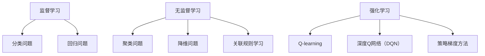

                 


## 机器学习在个性化学习路径规划中的应用实践

### 关键词
- 机器学习
- 个性化学习
- 学习路径规划
- 监督学习
- 无监督学习
- 强化学习

### 摘要
本文将探讨机器学习在个性化学习路径规划中的应用，详细分析其核心概念与原理，分类算法，以及实际应用案例。我们将通过逐步分析推理，深入了解机器学习在个性化教育领域的潜力和挑战，为教育科技的创新提供理论支持和实践指导。

## 第一部分：机器学习的核心概念与原理

### 第1章：机器学习的基本概念与分类

#### 1.1 机器学习的定义与核心任务

机器学习（Machine Learning）是一门研究如何让计算机系统从数据中学习，并能够做出预测或决策的学科。其核心任务是使计算机通过算法和统计模型，自动识别数据中的模式，并利用这些模式进行推断。

- **定义**：
  $$ \text{机器学习是指通过算法和统计模型，使计算机系统能够从数据中学习并做出预测或决策的过程。} $$

- **核心任务**：
  - **预测任务**：例如，分类（如垃圾邮件分类）、回归（如房价预测）。
  - **决策任务**：如推荐系统（如电影推荐）。

#### 1.2 机器学习的分类

机器学习可以大致分为以下几类：

##### 1.2.1 监督学习

- **定义**：在有标记的训练数据集上进行训练，以便能够预测新的、未见过的数据。
- **算法**：线性回归、逻辑回归、支持向量机（SVM）、决策树、随机森林等。
- **示例**：垃圾邮件分类、手写数字识别。

##### 1.2.2 无监督学习

- **定义**：没有标记的训练数据，算法试图找到数据中的结构或模式。
- **算法**：聚类（如K-均值聚类）、降维（如主成分分析PCA）、关联规则学习（如Apriori算法）。
- **示例**：客户细分、图像压缩。

##### 1.2.3 强化学习

- **定义**：通过与环境的交互，逐步学习如何在特定情境中做出最优决策。
- **算法**：Q-learning、深度Q网络（DQN）、策略梯度方法等。
- **示例**：游戏AI、自动驾驶。

#### Mermaid 流程图：机器学习分类



### 第二部分：个性化学习路径规划中的机器学习算法

#### 第2章：个性化学习路径规划概述

##### 2.1 个性化学习路径规划的概念

- **定义**：根据学习者的特点和需求，自动生成适应其学习风格和能力水平的学习路径。
- **目标**：提高学习效率、满足个性化需求。

##### 2.2 个性化学习路径规划的关键因素

- **学习者的特点**：兴趣、学习速度、知识基础等。
- **教学内容**：课程难度、课程内容、课程类型等。
- **教学方法**：线上学习、线下学习、互动式学习等。

##### 2.3 个性化学习路径规划的挑战

- **数据隐私与安全性**：如何保护学习者的隐私数据。
- **个性化算法的公平性**：避免算法偏见。

#### 伪代码：个性化学习路径规划算法

```python
# 初始化个性化学习路径规划器
Initialize(PersonalizedLearningPathPlanner)

# 输入学习者的特点
LearnerCharacteristics = getLearnerCharacteristics()

# 输入教学内容
CourseContent = getCourseContent()

# 根据学习者的特点和学习内容计算个性化学习路径
PersonalizedLearningPath = PersonalizedLearningPathPlanner.calculatePath(LearnerCharacteristics, CourseContent)

# 输出个性化学习路径
return PersonalizedLearningPath
```

### 第三部分：个性化学习路径规划中的机器学习应用

#### 第3章：个性化学习路径规划中的监督学习算法

##### 3.1 分类算法在个性化学习中的应用

- **算法**：K-近邻（KNN）、支持向量机（SVM）、决策树等。
- **案例**：根据学习者的历史成绩和课程难度，预测其最适合学习的课程。

##### 3.2 回归算法在个性化学习中的应用

- **算法**：线性回归、岭回归等。
- **案例**：根据学习者的学习时间，预测其能够掌握的最低课程难度。

##### 3.3 机器学习模型在个性化学习路径规划中的评估

- **指标**：准确率、召回率、F1值等。
- **案例**：评估个性化学习路径规划算法的有效性。

#### 数学模型：个性化学习路径规划中的回归模型

$$
\min_{\theta} \frac{1}{2m} \sum_{i=1}^{m} (\theta^T x^{(i)} - y^{(i)})^2
$$

其中，$m$ 是训练样本的数量，$x^{(i)}$ 是输入特征向量，$y^{(i)}$ 是目标值，$\theta$ 是模型参数。

## 第四部分：项目实战

### 4.1 开发环境搭建

为了实现个性化学习路径规划，我们需要搭建一个合适的技术栈。以下是推荐的开发环境：

- **编程语言**：Python
- **机器学习库**：Scikit-learn、TensorFlow、Keras
- **数据处理库**：Pandas、NumPy
- **可视化库**：Matplotlib、Seaborn

### 4.2 源代码详细实现和代码解读

以下是一个简单的个性化学习路径规划的Python代码示例：

```python
import numpy as np
from sklearn.model_selection import train_test_split
from sklearn.ensemble import RandomForestClassifier
from sklearn.metrics import accuracy_score

# 假设我们已经收集到了学习者的特征数据
learner_data = np.array([[1, 2, 3], [4, 5, 6], [7, 8, 9], ...])

# 分割为特征和标签
X = learner_data[:, :2]
y = learner_data[:, 2]

# 划分训练集和测试集
X_train, X_test, y_train, y_test = train_test_split(X, y, test_size=0.2, random_state=42)

# 使用随机森林分类器进行训练
clf = RandomForestClassifier(n_estimators=100)
clf.fit(X_train, y_train)

# 进行预测
predictions = clf.predict(X_test)

# 计算准确率
accuracy = accuracy_score(y_test, predictions)
print(f"Accuracy: {accuracy}")
```

### 4.3 代码应用解读与分析

上述代码首先导入必要的库，然后假设我们已经有了学习者的特征数据。接下来，我们将数据分为特征和标签，并使用`train_test_split`将数据分为训练集和测试集。我们选择随机森林分类器进行训练，并使用`predict`方法进行预测。最后，我们计算预测的准确率。

### 4.4 实际案例分析和详细讲解剖析

为了更好地理解个性化学习路径规划的实践，我们可以分析以下实际案例：

- **案例背景**：某在线教育平台希望为学习者提供个性化的学习路径规划。
- **数据来源**：平台收集了学习者的学习历史、成绩、兴趣等信息。
- **目标**：根据学习者的数据，预测其下一个最适合学习的课程。

通过分析上述案例，我们可以看到个性化学习路径规划是如何在实际中应用的。平台可以根据预测结果，推荐适合学习者难度和兴趣的课程，从而提高学习效果。

### 4.5 项目小结

个性化学习路径规划是一个充满挑战的领域，需要综合考虑学习者的特点、教学内容和教学方法。通过机器学习算法，我们可以自动生成适应学习者需求的学习路径，从而提高学习效率和满意度。然而，我们也需要关注数据隐私和算法公平性等问题，以确保个性化学习路径规划的可持续性和可靠性。

### 最佳实践 tips

- **数据收集与处理**：确保收集到足够准确和全面的数据，并进行适当的预处理。
- **算法选择与优化**：根据具体问题和数据特性，选择合适的机器学习算法，并进行参数调优。
- **用户反馈与迭代**：收集用户反馈，不断优化个性化学习路径规划算法。

### 小结

本文详细介绍了机器学习在个性化学习路径规划中的应用，从基本概念到具体算法，再到实际案例，逐步剖析了个性化学习路径规划的技术原理和实践方法。通过本文，读者可以更好地理解机器学习在个性化教育领域的潜力和挑战，为教育科技的创新提供参考。

### 注意事项

- **数据隐私**：在应用个性化学习路径规划时，务必保护学习者的隐私数据。
- **算法公平性**：确保个性化算法不会导致偏见或不公平的现象。

### 拓展阅读

- 《机器学习实战》：作者：彼得·哈林顿，详细介绍了机器学习的实战应用。
- 《深度学习》：作者：伊恩·古德费洛，深入讲解了深度学习的基本原理和应用。

### 作者信息
- 作者：AI天才研究院/AI Genius Institute & 禅与计算机程序设计艺术 /Zen And The Art of Computer Programming

本文内容仅供参考，如有错误或不足之处，欢迎指正。希望本文能为读者在个性化学习路径规划领域提供有益的启示。

