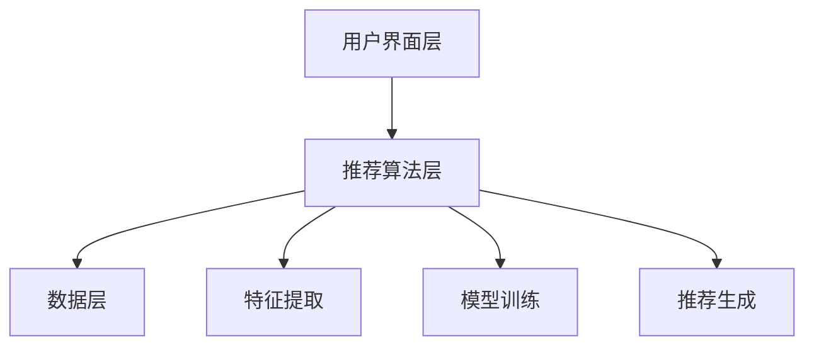

                 


### 第1章: 个性化推荐系统概述

**关键词：**
个性化推荐系统，协同过滤，内容推荐，深度学习，算法优化

**摘要：**
本文旨在深入探讨个性化推荐系统及其在机器学习中的应用，特别是算法优化方面的技术。首先，我们介绍了个性化推荐系统的基本概念、发展历程和主要类型。然后，我们详细阐述了机器学习的基础知识，包括监督学习、无监督学习和强化学习等。接下来，我们介绍了个性化推荐系统中的协同过滤、内容推荐和深度学习算法，并探讨了如何优化这些算法。最后，我们总结了个性化推荐系统面临的挑战和未来发展趋势。

---

### 1.1 个性化推荐系统的定义和作用

**定义：**
个性化推荐系统是一种通过分析用户的历史行为、偏好和上下文信息，向用户推荐可能感兴趣的项目（如商品、音乐、视频等）的系统。其核心目标是为用户提供个性化的、相关的推荐，从而提高用户体验和满意度。

**作用：**
1. **提高用户满意度**：通过提供个性化的推荐，满足用户的个性化需求，提高用户对平台的满意度。
2. **增加销售转化率**：通过推荐用户可能感兴趣的商品或内容，促进用户购买或互动，从而增加平台的销售转化率。
3. **提升平台黏性**：通过持续提供高质量的推荐，增强用户对平台的依赖和忠诚度，提升平台的用户黏性。

### 1.2 个性化推荐系统的发展历程

**初始阶段：**
1. **基于内容的推荐（Content-based Recommendation）**：早期推荐系统主要基于项目的属性和用户的偏好来生成推荐，简单但效果有限。
2. **协同过滤推荐（Collaborative Filtering）**：协同过滤推荐通过分析用户之间的行为相似性来生成推荐，取得了显著的效果。

**中期阶段：**
1. **深度学习推荐（Deep Learning）**：随着深度学习技术的发展，深度学习算法开始应用于推荐系统，提高了推荐的准确性和个性化程度。
2. **强化学习推荐（Reinforcement Learning）**：强化学习推荐通过学习用户的行为和反馈来不断优化推荐策略，取得了较好的效果。

**当前阶段：**
1. **多模型融合（Multi-model Fusion）**：多种推荐算法的融合，以取长补短，提高推荐效果。
2. **实时推荐系统（Real-time Recommendation）**：随着用户行为数据的实时性要求越来越高，实时推荐系统的需求日益增长。

### 1.3 个性化推荐系统的主要类型

**基于内容的推荐（Content-based Recommendation）**
1. **原理**：通过分析项目的内容和用户的偏好，利用相似度计算方法生成推荐。
2. **优点**：不受数据稀疏性问题的影响，推荐结果更依赖于项目的属性。
3. **缺点**：难以捕捉用户的动态偏好变化。

**协同过滤推荐（Collaborative Filtering）**
1. **原理**：通过分析用户之间的行为相似性，利用用户行为数据生成推荐。
2. **优点**：能够有效地处理数据稀疏性问题，推荐结果更依赖于用户行为。
3. **缺点**：对冷启动问题（新用户或新项目）的处理效果较差。

**深度学习推荐（Deep Learning）**
1. **原理**：利用深度学习算法，从大量用户行为数据中学习用户兴趣模型，生成推荐。
2. **优点**：能够捕捉复杂的用户兴趣和偏好模式，推荐结果更精确。
3. **缺点**：对计算资源和数据量有较高要求，模型训练时间较长。

### 1.4 个性化推荐系统的架构

**用户界面层**：展示推荐结果，提供用户交互界面。

**推荐算法层**：包括特征提取、模型训练和推荐生成等模块，负责生成推荐结果。

**数据层**：存储用户行为数据、项目信息和推荐历史数据，为推荐算法提供数据支持。

### Mermaid 流程图



---

在下一章中，我们将深入探讨机器学习的基础知识，包括监督学习、无监督学习和强化学习等。通过了解这些基本概念，我们将为后续的算法优化打下坚实的基础。敬请期待！## 第2章: 机器学习基础

**关键词：**
机器学习，监督学习，无监督学习，强化学习，模型评估方法

**摘要：**
本章将深入探讨机器学习的基础知识，包括监督学习、无监督学习和强化学习等。我们将介绍这些学习方法的定义、原理和应用场景，并讨论常用的模型评估方法。通过本章的学习，读者将能够理解不同机器学习方法的区别和联系，为后续的个性化推荐算法优化提供理论基础。

### 2.1 机器学习的基本概念

**定义：**
机器学习是一种使计算机系统能够从数据中学习并改进性能的技术。它通过设计算法，使计算机系统能够从经验中学习，并自动改进其性能，而无需明确编程指令。

**主要特征：**
1. **自动性**：通过学习算法，系统可以从大量数据中自动发现模式和规律。
2. **适应性**：系统可以根据新的数据自动调整和优化其性能。
3. **泛化能力**：系统能够将学到的知识和模式应用于新的、未见过的数据。

**应用领域：**
1. **数据挖掘**：从大量数据中发现潜在的模式和关系。
2. **自然语言处理**：处理和理解自然语言，包括语言翻译、文本分类等。
3. **计算机视觉**：图像识别、物体检测、图像生成等。
4. **推荐系统**：个性化推荐、商品推荐、音乐推荐等。
5. **自动驾驶**：车辆控制、路况预测、环境感知等。

### 2.2 监督学习、无监督学习和强化学习

**监督学习（Supervised Learning）**

**定义：**
监督学习是一种从标记数据中学习的方法。标记数据包含输入特征和对应的输出标签，学习算法通过这些数据学习如何预测未知数据的输出标签。

**原理：**
监督学习通过最小化预测值和真实值之间的误差来训练模型。常用的监督学习算法包括线性回归、逻辑回归、支持向量机（SVM）、决策树、随机森林等。

**应用场景：**
1. **分类问题**：将数据分为不同的类别，如文本分类、垃圾邮件检测等。
2. **回归问题**：预测连续的输出值，如房价预测、股票价格预测等。

**无监督学习（Unsupervised Learning）**

**定义：**
无监督学习是一种从未标记数据中学习的方法。学习算法通过分析数据中的内在结构和模式来发现数据中的规律。

**原理：**
无监督学习不依赖于标记数据，其目标是通过聚类、降维等方法挖掘数据中的潜在结构。常用的无监督学习算法包括K-均值聚类、主成分分析（PCA）、自编码器等。

**应用场景：**
1. **聚类问题**：将相似的数据点分组，如客户细分、图像分割等。
2. **降维问题**：减少数据维度，提高计算效率和数据分析效果，如特征选择、特征抽取等。

**强化学习（Reinforcement Learning）**

**定义：**
强化学习是一种通过试错来学习策略的方法。智能体在环境中执行动作，通过环境提供的反馈（奖励或惩罚）来调整其行为，以最大化长期回报。

**原理：**
强化学习通过优化策略来最大化回报，常用的算法包括Q学习、深度Q网络（DQN）、策略梯度方法等。

**应用场景：**
1. **游戏**：如电子游戏、棋类游戏等。
2. **机器人控制**：如自动驾驶、无人机等。
3. **资源分配**：如广告投放、能源管理等。

### 2.3 机器学习模型评估方法

**定义：**
模型评估方法用于评估机器学习模型在特定任务上的性能。常用的评估指标包括准确率、召回率、精确率、F1分数、ROC曲线、AUC值等。

**准确率（Accuracy）**
$$
\text{Accuracy} = \frac{\text{正确预测的数量}}{\text{总预测的数量}}
$$
**优点**：简单直观，易于计算。
**缺点**：对于类别不平衡的数据集，准确率可能不具有参考价值。

**召回率（Recall）**
$$
\text{Recall} = \frac{\text{正确预测的正类数量}}{\text{实际正类数量}}
$$
**优点**：能够反映模型对于正类样本的捕捉能力。
**缺点**：可能会受到假阳性（False Positive）的影响。

**精确率（Precision）**
$$
\text{Precision} = \frac{\text{正确预测的正类数量}}{\text{预测为正类的总数}}
$$
**优点**：能够反映模型预测的正类样本的真实性。
**缺点**：可能会受到假阴性（False Negative）的影响。

**F1分数（F1 Score）**
$$
\text{F1 Score} = 2 \times \frac{\text{Precision} \times \text{Recall}}{\text{Precision} + \text{Recall}}
$$
**优点**：综合考虑了精确率和召回率，能够更全面地评估模型性能。
**缺点**：对于极端不平衡的数据集，F1分数可能不具有参考价值。

**ROC曲线（Receiver Operating Characteristic Curve）**
**AUC值（Area Under Curve）**
$$
\text{AUC} = \int_{0}^{1} \text{True Positive Rate} (\text{TPR}) \times \text{False Positive Rate} (\text{FPR}) d\text{x}
$$
**优点**：能够全面评估模型的分类性能，不受类别不平衡的影响。
**缺点**：对于多类别问题，ROC曲线和AUC值的应用可能有限。

### 2.4 常见的机器学习算法

**线性回归（Linear Regression）**
**定义**：线性回归是一种用于预测连续输出值的监督学习算法。
**公式**：
$$
y = \beta_0 + \beta_1x
$$
**优点**：简单直观，易于理解和实现。
**缺点**：对于非线性关系的数据，线性回归可能表现不佳。

**逻辑回归（Logistic Regression）**
**定义**：逻辑回归是一种用于分类问题的监督学习算法。
**公式**：
$$
\text{Logit}(y) = \log\left(\frac{p}{1-p}\right) = \beta_0 + \beta_1x
$$
**优点**：能够处理多类别问题，输出概率。
**缺点**：对于特征维度较高的问题，可能存在过拟合。

**支持向量机（Support Vector Machine, SVM）**
**定义**：支持向量机是一种用于分类和回归问题的监督学习算法。
**原理**：通过寻找最佳的超平面，将不同类别的数据点分开。
**公式**：
$$
\text{分类函数}：f(x) = \text{sign}(\sum_{i=1}^{n}\alpha_i y_i (x_i \cdot x) - b)
$$
**优点**：具有良好的泛化能力。
**缺点**：对高维数据处理能力有限，计算复杂度高。

**决策树（Decision Tree）**
**定义**：决策树是一种基于特征划分数据集的监督学习算法。
**原理**：通过递归划分特征，将数据集划分为不同的区域。
**公式**：
$$
\text{分类规则}：T(x) = \text{max} \left( \sum_{i=1}^{n} \alpha_i \text{cond}(x_i = t_i) \right)
$$
**优点**：易于理解和实现，对非线性数据的适应性较强。
**缺点**：可能产生过拟合，模型可解释性较差。

**随机森林（Random Forest）**
**定义**：随机森林是一种基于决策树的集成学习方法。
**原理**：通过随机选择特征和随机切分数据集，构建多棵决策树，并对预测结果进行投票。
**公式**：
$$
\text{预测函数}：F(x) = \text{avg} \left( T_1(x), T_2(x), ..., T_n(x) \right)
$$
**优点**：能够提高模型的泛化能力和预测准确性。
**缺点**：对于非常大数据集，训练时间较长。

通过本章的学习，我们了解了机器学习的基本概念、监督学习、无监督学习和强化学习等方法，以及常用的模型评估方法和机器学习算法。这些基础知识将为后续的个性化推荐算法优化提供理论支持。在下一章中，我们将深入探讨个性化推荐系统中的协同过滤算法，敬请期待！### 第3章: 协同过滤算法

**关键词：**
协同过滤，用户相似度，项目相似度，矩阵分解，推荐生成

**摘要：**
本章将详细介绍协同过滤算法，一种在个性化推荐系统中广泛应用的方法。我们将首先介绍协同过滤算法的基本原理，包括用户相似度和项目相似度的计算方法。然后，我们将探讨矩阵分解技术，并展示如何通过矩阵分解来提高推荐系统的性能。接下来，我们将介绍协同过滤算法的两种主要类型：基于用户的协同过滤和基于项目的协同过滤。最后，我们将讨论协同过滤算法的优缺点，以及如何对其进行优化。

### 3.1 协同过滤算法的基本原理

**定义：**
协同过滤算法是一种通过分析用户之间的行为相似性或项目之间的相似性来生成推荐的方法。其核心思想是利用用户对项目的评分数据，通过计算用户和项目之间的相似度，推荐相似用户喜欢或相似项目被喜欢的项目。

**原理：**
协同过滤算法主要通过以下步骤生成推荐：
1. **计算用户相似度**：通过分析用户之间的评分行为，计算用户之间的相似度。
2. **计算项目相似度**：通过分析项目之间的评分行为，计算项目之间的相似度。
3. **生成推荐列表**：基于用户和项目的相似度，为用户生成推荐列表。

### 3.2 评分预测与推荐生成

**评分预测：**
协同过滤算法首先需要对用户对项目的评分进行预测。基于用户的协同过滤算法通过计算用户之间的相似度，利用相似用户的评分预测目标用户的评分。基于项目的协同过滤算法通过计算项目之间的相似度，利用相似项目的评分预测目标项目的评分。

**推荐生成：**
生成推荐列表的方法通常有两种：基于最近邻居和基于加权平均。
1. **基于最近邻居：**选择与目标用户最相似的K个邻居用户，将邻居用户喜欢的项目加权平均，生成推荐列表。
2. **基于加权平均：**综合考虑用户对项目的评分、项目之间的相似度和用户之间的相似度，计算加权平均评分，生成推荐列表。

### 3.3 传统的协同过滤算法

**基于用户的协同过滤（User-based Collaborative Filtering）**
**定义**：基于用户的协同过滤算法通过计算用户之间的相似度，为用户推荐相似用户喜欢的项目。

**原理：**
1. **计算用户相似度**：使用余弦相似度、皮尔逊相关系数等方法计算用户之间的相似度。
2. **生成推荐列表**：选择与目标用户最相似的K个用户，将K个用户的评分加权平均，生成推荐列表。

**优缺点：**
- **优点**：能够根据用户行为和偏好生成个性化的推荐。
- **缺点**：冷启动问题严重，当新用户或新项目加入时，推荐效果较差。

**基于项目的协同过滤（Item-based Collaborative Filtering）**
**定义**：基于项目的协同过滤算法通过计算项目之间的相似度，为用户推荐相似项目被喜欢的项目。

**原理：**
1. **计算项目相似度**：使用余弦相似度、欧几里得距离等方法计算项目之间的相似度。
2. **生成推荐列表**：选择与目标项目最相似的K个项目，将K个项目的评分加权平均，生成推荐列表。

**优缺点：**
- **优点**：能够根据项目内容和用户行为生成个性化的推荐。
- **缺点**：当项目数量增加时，计算复杂度显著增加，可能导致性能下降。

### 3.4 现代的协同过滤算法

**矩阵分解（Matrix Factorization）**
**定义**：矩阵分解是一种将原始评分矩阵分解为两个低维矩阵的方法，以降低数据维度，提高推荐系统的性能。

**原理：**
1. **矩阵分解模型**：使用矩阵分解模型表示原始评分矩阵，通常采用交替最小化算法进行模型训练。
2. **矩阵分解实现**：使用奇异值分解（SVD）或非负矩阵分解（NMF）等方法实现矩阵分解。

**优缺点：**
- **优点**：能够提高推荐系统的准确性和效率。
- **缺点**：对缺失值敏感，可能导致部分用户或项目的评分被低估。

**基于模型的协同过滤（Model-based Collaborative Filtering）**
**定义**：基于模型的协同过滤算法通过构建预测模型，预测用户对项目的评分，生成推荐列表。

**原理：**
1. **构建预测模型**：使用监督学习算法（如线性回归、决策树等）构建预测模型。
2. **生成推荐列表**：基于预测模型，为用户生成推荐列表。

**优缺点：**
- **优点**：能够处理缺失值和数据稀疏性问题。
- **缺点**：模型的性能和泛化能力依赖于训练数据和模型选择。

**深度协同过滤（Deep Collaborative Filtering）**
**定义**：深度协同过滤算法将深度学习模型应用于协同过滤问题，以提高推荐系统的性能。

**原理：**
1. **构建深度神经网络**：使用深度神经网络（如卷积神经网络、循环神经网络等）学习用户和项目的特征表示。
2. **生成推荐列表**：基于深度神经网络，为用户生成推荐列表。

**优缺点：**
- **优点**：能够捕捉复杂的用户兴趣和项目特征。
- **缺点**：对计算资源和数据量有较高要求，模型训练时间较长。

通过本章的学习，我们深入了解了协同过滤算法的基本原理、评分预测与推荐生成方法，以及传统的和现代的协同过滤算法。在下一章中，我们将探讨内容推荐算法，敬请期待！### 第4章: 内容推荐算法

**关键词：**
内容推荐，特征提取，模型选择，推荐实现，优化策略

**摘要：**
本章将详细探讨内容推荐算法，一种基于项目内容特征和用户兴趣特征的推荐方法。我们将首先介绍内容推荐算法的基本原理，包括特征提取和模型选择。然后，我们将展示如何实现基于内容的推荐算法，并探讨常用的优化策略。最后，我们将讨论内容推荐算法的优缺点，以及在现实应用中如何解决数据稀疏性和冷启动问题。

### 4.1 内容推荐算法的基本原理

**定义：**
内容推荐算法是一种基于项目内容和用户兴趣特征的推荐方法。它通过分析项目的内容特征和用户的兴趣特征，为用户推荐与其兴趣相关的项目。

**原理：**
内容推荐算法主要分为以下步骤：
1. **特征提取**：从项目内容和用户行为数据中提取特征。
2. **模型选择**：选择合适的模型对特征进行建模。
3. **推荐生成**：利用模型生成推荐结果。

### 4.2 特征提取与模型选择

**特征提取：**
1. **项目特征提取**：
   - **文本特征**：使用词袋模型、TF-IDF等方法提取文本特征。
   - **图像特征**：使用卷积神经网络（CNN）提取图像特征。
   - **音频特征**：使用自动特征提取算法（如MFCC）提取音频特征。
2. **用户特征提取**：
   - **行为特征**：分析用户的历史行为数据，提取用户偏好、浏览习惯等特征。
   - **社会特征**：分析用户的社交关系、兴趣群体等特征。

**模型选择：**
1. **线性模型**：如线性回归、逻辑回归等，适用于简单特征的建模。
2. **深度学习模型**：如卷积神经网络（CNN）、循环神经网络（RNN）等，适用于复杂特征的建模。
3. **集成模型**：如随机森林、梯度提升树（GBDT）等，通过组合多个模型提高性能。

### 4.3 基于内容的推荐算法实现

**算法流程：**
1. **数据预处理**：清洗数据，提取特征。
2. **模型训练**：使用训练数据训练模型。
3. **模型评估**：使用验证数据评估模型性能。
4. **推荐生成**：使用训练好的模型生成推荐结果。

**伪代码：**
```python
# 数据预处理
X = extract_features(data)
y = extract_labels(data)

# 模型训练
model = train_model(X, y)

# 模型评估
evaluate_model(model, X_val, y_val)

# 推荐生成
recommendations = generate_recommendations(model, user_interests)
```

### 4.4 内容推荐算法的优化

**优化策略：**
1. **特征优化**：
   - **特征选择**：使用特征选择算法（如信息增益、互信息等）选择重要特征。
   - **特征增强**：结合用户的偏好和项目的内容特征，生成新的特征。
2. **模型优化**：
   - **超参数调整**：通过网格搜索、随机搜索等方法调整模型超参数。
   - **模型融合**：结合多个模型提高性能。
3. **实时更新**：根据用户的实时行为数据，动态更新用户兴趣和推荐结果。

### 4.5 内容推荐算法的优缺点

**优点：**
- **准确性高**：基于用户兴趣和项目内容特征的推荐，能够提供更准确的推荐结果。
- **解释性强**：内容推荐算法易于理解，推荐结果具有较好的可解释性。

**缺点：**
- **数据稀疏性**：内容推荐算法对数据稀疏性问题处理效果较差，可能导致推荐结果不准确。
- **冷启动问题**：对于新用户或新项目，由于缺乏足够的历史数据，推荐效果较差。

### 4.6 数据稀疏性和冷启动问题的解决方法

**解决方法：**
1. **数据增强**：通过人工标注、众包等方法增加数据量，降低数据稀疏性。
2. **半监督学习**：利用少量标记数据和大量未标记数据，通过半监督学习算法提高推荐效果。
3. **迁移学习**：利用预训练的模型，迁移到新用户或新项目的推荐任务中。
4. **混合推荐**：结合协同过滤和内容推荐，提高推荐效果。

通过本章的学习，我们深入了解了内容推荐算法的基本原理、特征提取与模型选择、算法实现和优化策略。在下一章中，我们将探讨深度学习推荐算法，敬请期待！### 第5章: 深度学习推荐算法

**关键词：**
深度学习，推荐系统，深度神经网络，推荐模型，优化策略

**摘要：**
本章将详细探讨深度学习在推荐系统中的应用，特别是深度学习推荐算法。我们将首先介绍深度学习推荐算法的基本原理，包括深度神经网络的架构和训练方法。然后，我们将讨论几种常见的深度学习推荐模型，如基于注意力机制和循环神经网络的模型。接下来，我们将介绍深度学习推荐算法的优化策略，包括模型调参、数据预处理和模型融合等。最后，我们将总结深度学习推荐算法的优点和挑战，以及未来的发展方向。

### 5.1 深度学习推荐算法的基本原理

**定义：**
深度学习推荐算法是一种基于深度神经网络学习用户兴趣和项目特征的方法，以生成个性化的推荐。深度学习能够自动从大量数据中提取复杂的信息和模式，从而提高推荐系统的性能。

**原理：**
深度学习推荐算法的核心思想是通过构建深度神经网络，学习用户和项目的特征表示，并利用这些特征表示生成推荐。

1. **输入层**：接收用户行为数据和项目特征数据。
2. **隐藏层**：通过多层神经网络，对输入数据进行复杂的非线性变换，提取高级特征。
3. **输出层**：将提取的特征映射到推荐结果。

### 5.2 深度学习推荐模型架构

**基于注意力机制的推荐模型：**
**定义**：基于注意力机制的推荐模型通过学习用户和项目的特征表示，并根据用户兴趣的重要性调整推荐结果。

**架构**：
1. **用户嵌入层**：将用户行为数据转换为低维的用户嵌入向量。
2. **项目嵌入层**：将项目特征数据转换为低维的项目嵌入向量。
3. **注意力层**：利用注意力机制计算用户兴趣的重要性，并加权融合用户和项目的特征。
4. **推荐层**：根据加权融合的特征生成推荐结果。

**公式**：
$$
\text{Attention}(x, y) = \text{softmax}\left(\text{score}(x, y)\right)
$$
其中，$x$ 和 $y$ 分别为用户和项目的特征向量，$\text{score}(x, y)$ 为用户兴趣和项目特征之间的相似度评分。

**优点**：
- **灵活性高**：能够自动调整用户兴趣的重要性，提高推荐精度。
- **扩展性强**：可以应用于多种类型的推荐场景。

**缺点**：
- **计算复杂度高**：由于注意力机制的计算，模型训练时间较长。

**基于循环神经网络的推荐模型：**
**定义**：基于循环神经网络的推荐模型通过学习用户的历史行为序列和项目特征，生成推荐结果。

**架构**：
1. **用户历史行为嵌入层**：将用户历史行为序列转换为嵌入向量。
2. **项目特征嵌入层**：将项目特征数据转换为嵌入向量。
3. **循环神经网络层**：使用循环神经网络（RNN）处理用户历史行为序列，提取时间依赖特征。
4. **推荐层**：结合用户历史行为特征和项目特征生成推荐结果。

**公式**：
$$
h_t = \text{RNN}(h_{t-1}, x_t)
$$
其中，$h_t$ 为时间步 $t$ 的隐藏状态，$x_t$ 为时间步 $t$ 的输入特征。

**优点**：
- **序列建模能力强**：能够捕捉用户历史行为的时序特征。
- **扩展性强**：可以应用于多类别和多模态数据的推荐任务。

**缺点**：
- **计算复杂度高**：由于循环神经网络的结构，模型训练时间较长。

### 5.3 常见的深度学习推荐算法

**基于用户和项目嵌入的推荐算法：**
**定义**：基于用户和项目嵌入的推荐算法通过学习用户和项目的低维嵌入向量，生成推荐结果。

**架构**：
1. **用户嵌入层**：将用户行为数据转换为用户嵌入向量。
2. **项目嵌入层**：将项目特征数据转换为项目嵌入向量。
3. **交互层**：计算用户嵌入向量和项目嵌入向量之间的交互。
4. **推荐层**：根据交互结果生成推荐结果。

**公式**：
$$
\text{Score}(u, i) = u \cdot i
$$
其中，$u$ 和 $i$ 分别为用户和项目的嵌入向量。

**优点**：
- **计算效率高**：嵌入向量计算简单，模型训练时间较短。
- **推荐精度高**：能够捕捉用户和项目之间的复杂关系。

**缺点**：
- **可解释性较差**：模型难以解释，用户和项目之间的直接关系难以理解。

**基于生成对抗网络的推荐算法：**
**定义**：基于生成对抗网络的推荐算法通过生成对抗过程学习用户和项目的潜在分布，生成推荐结果。

**架构**：
1. **生成器**：学习用户和项目的潜在分布，生成虚拟用户和项目。
2. **判别器**：判断虚拟用户和项目是否真实。
3. **推荐层**：根据判别器生成的结果，为用户生成推荐列表。

**公式**：
$$
\begin{aligned}
\text{Generator} &: G(z) = x \\
\text{Discriminator} &: D(x) \\
\end{aligned}
$$
其中，$z$ 为噪声向量，$x$ 为生成的用户或项目。

**优点**：
- **生成能力强**：能够生成高质量的虚拟用户和项目。
- **推荐多样性高**：能够生成多样化的推荐结果。

**缺点**：
- **计算复杂度高**：生成对抗过程需要大量计算资源。
- **训练不稳定**：生成对抗网络的训练过程可能不稳定。

### 5.4 深度学习推荐算法的优化策略

**模型调参：**
1. **超参数选择**：通过网格搜索、随机搜索等方法选择最佳超参数。
2. **学习率调整**：使用学习率调整策略（如余弦退火、自适应学习率等）优化模型性能。

**数据预处理：**
1. **数据清洗**：去除无效数据和异常值。
2. **数据归一化**：对数据进行归一化处理，提高模型训练效果。
3. **数据增强**：通过数据增强方法（如数据扩充、数据合成等）增加数据多样性。

**模型融合：**
1. **集成模型**：结合多个模型提高推荐性能。
2. **模型加权**：对多个模型进行加权融合，提高推荐结果的稳定性。

### 5.5 深度学习推荐算法的优点和挑战

**优点：**
- **处理复杂特征**：能够自动提取复杂的用户和项目特征，提高推荐精度。
- **灵活性高**：可以应用于多种类型的推荐任务，如多模态推荐、动态推荐等。
- **适应性强**：能够快速适应新的用户和项目，提高推荐系统的实时性。

**挑战：**
- **计算资源需求大**：深度学习推荐算法通常需要大量的计算资源和存储空间。
- **数据稀疏性**：对数据稀疏性问题的处理能力有限，可能导致推荐效果不佳。
- **可解释性差**：深度学习模型难以解释，难以理解推荐结果的原因。

### 5.6 未来发展方向

**研究方向：**
- **多模态推荐**：结合多种数据类型（如文本、图像、音频等），提高推荐系统的准确性和多样性。
- **实时推荐**：通过实时数据处理和模型更新，提高推荐系统的实时性和适应性。
- **个性化增强**：结合用户行为和偏好，提供更个性化的推荐。

**新兴技术：**
- **图神经网络（GNN）**：应用于图结构数据，提高推荐系统的表达能力和处理能力。
- **迁移学习**：通过迁移学习技术，提高推荐系统的通用性和适应性。

通过本章的学习，我们深入了解了深度学习推荐算法的基本原理、模型架构、优化策略和未来发展方向。在下一章中，我们将探讨个性化推荐系统的算法优化，敬请期待！### 第6章: 数据预处理

**关键词：**
数据清洗，数据归一化，数据增强，特征工程

**摘要：**
数据预处理是构建高效推荐系统的重要步骤，它直接影响推荐系统的性能。本章将详细探讨数据预处理的关键技术，包括数据清洗、数据归一化、数据增强和特征工程。我们将介绍每种技术的基本原理，以及在实际应用中的具体方法和步骤。通过有效的数据预处理，我们可以提高推荐系统的准确性和鲁棒性。

### 6.1 数据清洗

**定义：**
数据清洗是指从原始数据中识别并去除或纠正错误、异常值和重复数据的过程。清洗后的数据将更加准确和可靠，有助于提高推荐系统的性能。

**原理：**
数据清洗主要包括以下步骤：
1. **识别错误数据**：通过规则检查、异常值检测等方法识别数据中的错误。
2. **纠正错误数据**：对识别出的错误数据进行纠正，例如，将错误的数值修正为合理的范围。
3. **去除异常值**：通过统计分析和可视化方法识别并去除异常值，以避免对模型训练和推荐生成产生不利影响。
4. **去除重复数据**：识别并去除重复的数据记录，以减少数据冗余。

**步骤：**
1. **检查数据完整性**：确保数据集没有缺失值或缺失值比例较小。
2. **删除重复数据**：通过去重操作，去除数据集中的重复记录。
3. **处理异常值**：使用统计方法（如IQR、箱线图等）识别并处理异常值。
4. **纠正错误数据**：对识别出的错误数据进行纠正，或标记为无效数据。

### 6.2 数据归一化

**定义：**
数据归一化是指将不同量纲和尺度的数据进行转换，使其具有相似的尺度范围。归一化的目的是为了避免不同特征对模型训练的影响，提高模型的稳定性和泛化能力。

**原理：**
数据归一化主要包括以下方法：
1. **最小-最大缩放**：将数据缩放到[0, 1]或[-1, 1]的范围内。
2. **均值-方差缩放**：将数据缩放到均值0、方差1的标准正态分布。
3. **对数变换**：对数值较大的数据进行对数变换，以减少数据范围。

**步骤：**
1. **选择归一化方法**：根据数据的特点和需求选择合适的归一化方法。
2. **计算归一化参数**：计算每个特征的均值和方差（对于均值-方差缩放）或最小值和最大值（对于最小-最大缩放）。
3. **应用归一化公式**：对数据进行归一化处理，例如：
   - 最小-最大缩放：
     $$
     x_{\text{norm}} = \frac{x - \min(x)}{\max(x) - \min(x)}
     $$
   - 均值-方差缩放：
     $$
     x_{\text{norm}} = \frac{x - \mu}{\sigma}
     $$

### 6.3 数据增强

**定义：**
数据增强是指通过生成新的数据样本，增加数据集的多样性，从而提高模型训练效果的方法。增强后的数据有助于模型更好地捕捉数据的分布和特征，减少过拟合现象。

**原理：**
数据增强主要包括以下方法：
1. **随机变换**：通过对数据进行随机旋转、缩放、裁剪等操作，生成新的数据样本。
2. **合成数据**：通过模型生成或人工标注方法，生成新的数据样本。
3. **伪标签**：利用已有的模型预测结果，生成新的数据样本。

**步骤：**
1. **选择增强方法**：根据数据类型和需求选择合适的增强方法。
2. **生成新样本**：对数据集进行随机变换、合成或伪标签等操作，生成新的数据样本。
3. **合并数据集**：将增强后的新样本与原始数据集合并，形成更大的训练数据集。

### 6.4 特征工程

**定义：**
特征工程是指通过从原始数据中提取或构造特征，以改进模型性能和解释能力的过程。特征工程是机器学习任务中至关重要的一步，它直接影响模型的准确性和泛化能力。

**原理：**
特征工程主要包括以下方法：
1. **特征提取**：从原始数据中提取有用的特征，如文本中的关键词、图像中的颜色分布等。
2. **特征构造**：通过组合、变换现有特征，构造新的特征，以捕捉更复杂的模式。
3. **特征选择**：从大量特征中选择对模型性能有显著贡献的特征，减少特征维度。

**步骤：**
1. **数据探索**：通过数据可视化、统计分析等方法，探索数据中的模式和关系。
2. **特征提取**：提取文本、图像、音频等数据中的特征，如词频、TF-IDF、图像特征等。
3. **特征构造**：通过组合和变换现有特征，构造新的特征，如用户点击时间段的特征、用户购买频率等。
4. **特征选择**：使用特征选择方法（如信息增益、卡方检验等），选择对模型性能有显著贡献的特征。

通过本章的学习，我们了解了数据预处理的关键技术，包括数据清洗、数据归一化、数据增强和特征工程。这些技术对于构建高效、准确的推荐系统至关重要。在下一章中，我们将探讨推荐算法性能优化，敬请期待！### 第7章: 算法性能优化

**关键词：**
模型选择与调参，模型融合与集成，模型压缩与加速，实时推荐系统性能优化

**摘要：**
算法性能优化是推荐系统中至关重要的一环，它决定了推荐系统的准确性和效率。本章将深入探讨算法性能优化的几个关键方面，包括模型选择与调参、模型融合与集成、模型压缩与加速，以及实时推荐系统的性能优化。通过这些技术手段，我们可以显著提高推荐系统的性能，提升用户体验。

#### 7.1 模型选择与调参

**模型选择：**
选择合适的模型是优化算法性能的第一步。不同的推荐场景和数据特征可能需要不同的模型。以下是一些常见的模型选择方法：

1. **交叉验证**：通过交叉验证方法，将数据集划分为训练集和验证集，多次训练和验证，选择性能最优的模型。
2. **网格搜索**：在预定义的参数范围内，逐个尝试所有可能的参数组合，选择最佳参数组合。
3. **随机搜索**：从参数空间中随机选择参数组合，进行多次实验，选择最佳参数组合。

**模型调参：**
调参是优化模型性能的关键步骤。以下是一些常用的调参方法：

1. **贝叶斯优化**：利用贝叶斯统计方法，根据历史实验结果，选择下一个最有希望提高性能的参数组合。
2. **遗传算法**：通过模拟自然选择过程，优化模型参数。
3. **学习率调整**：对于深度学习模型，调整学习率可以显著影响模型的收敛速度和性能。

#### 7.2 模型融合与集成

**模型融合：**
模型融合是一种将多个模型的结果进行结合，以提高推荐系统性能的方法。以下是一些常见的模型融合方法：

1. **简单平均**：将多个模型的预测结果进行平均。
2. **加权平均**：根据模型的性能，对预测结果进行加权平均。
3. **集成学习**：如随机森林、梯度提升树（GBDT）等，通过组合多个弱学习器，构建强学习器。

**模型集成：**
模型集成是一种将多个模型的预测结果进行组合，生成最终的推荐结果的方法。以下是一些常见的模型集成方法：

1. **堆叠**：将多个模型堆叠在一起，前一个模型的输出作为后一个模型的输入。
2. **提升**：迭代地训练多个模型，每个模型都对前一个模型的错误进行修正。
3. **袋装**：通过随机抽样和决策树构建多个模型，并对每个模型的预测结果进行投票。

#### 7.3 模型压缩与加速

**模型压缩：**
模型压缩是一种通过减少模型参数数量和计算复杂度，降低模型存储和计算成本的方法。以下是一些常见的模型压缩方法：

1. **量化**：将模型参数的精度降低，例如从浮点数转换为整数。
2. **剪枝**：去除模型中的冗余参数，如零参数或小参数。
3. **知识蒸馏**：使用一个大型模型训练一个小型模型，通过知识蒸馏技术，将大型模型的知识传递给小型模型。

**模型加速：**
模型加速是通过提高模型训练和推理速度来优化推荐系统的性能。以下是一些常见的模型加速方法：

1. **并行计算**：利用多核CPU或GPU进行并行计算，提高训练速度。
2. **分布式计算**：通过分布式计算框架（如TensorFlow、PyTorch等），将模型训练和推理任务分布在多个节点上，提高计算效率。
3. **模型缓存**：将训练好的模型缓存起来，避免重复训练，提高推理速度。

#### 7.4 实时推荐系统的性能优化

**实时性优化：**
实时推荐系统需要处理大量的实时数据，并快速生成推荐结果。以下是一些常见的实时性优化方法：

1. **异步处理**：将数据的处理和推荐生成任务异步化，减少数据处理的延迟。
2. **增量更新**：只更新模型中发生变化的用户和项目，而不是重新训练整个模型。
3. **低延迟算法**：选择低延迟的算法，例如基于规则的推荐算法，以提高系统的实时性。

**系统优化：**
系统的优化是提高实时推荐系统性能的关键。以下是一些常见的系统优化方法：

1. **缓存策略**：使用缓存策略，减少数据访问和计算的时间。
2. **负载均衡**：通过负载均衡技术，将任务分配到不同的服务器上，避免单点故障。
3. **分布式存储**：使用分布式存储系统，提高数据读取和写入的速度。

通过本章的学习，我们了解了算法性能优化的多个关键方面，包括模型选择与调参、模型融合与集成、模型压缩与加速，以及实时推荐系统的性能优化。这些优化方法将帮助我们构建高效、准确的推荐系统。在下一章中，我们将探讨个性化推荐系统的挑战和未来发展趋势，敬请期待！### 第8章: 个性化推荐系统的挑战与未来发展趋势

**关键词：**
个性化推荐，数据隐私，可解释性，冷启动问题，多模态推荐

**摘要：**
个性化推荐系统虽然在提升用户体验和增加销售转化率方面取得了显著成效，但同时也面临着诸多挑战。本章将深入探讨个性化推荐系统面临的挑战，包括数据隐私保护、算法可解释性、冷启动问题，以及未来发展的趋势，如多模态推荐和实时推荐系统。通过分析这些挑战和趋势，我们可以更好地理解和应对个性化推荐系统的发展。

#### 8.1 个性化推荐系统面临的挑战

**数据隐私保护：**
随着用户对隐私保护意识的提高，个性化推荐系统在处理用户数据时需要严格遵守隐私保护法规。以下是一些常见的数据隐私保护挑战：

1. **数据匿名化**：通过加密、混淆等方法，对用户数据进行匿名化处理，以防止用户身份泄露。
2. **差分隐私**：在推荐算法中引入差分隐私机制，确保用户隐私不被泄露。
3. **用户同意管理**：确保用户对数据的收集和使用有充分的知情权，并得到用户的明确同意。

**算法可解释性：**
推荐算法的透明性和可解释性是用户信任和接受的关键。以下是一些常见的算法可解释性挑战：

1. **黑盒模型**：深度学习模型等黑盒模型在解释性方面存在局限，难以向用户解释推荐结果。
2. **解释性算法**：开发易于理解和解释的推荐算法，如基于规则的算法，以提高算法的可解释性。
3. **解释工具**：提供可视化工具和解释接口，帮助用户理解推荐结果。

**冷启动问题：**
冷启动问题是指在新用户或新项目加入时，由于缺乏足够的先验信息，推荐系统难以生成准确和个性化的推荐。以下是一些常见的冷启动挑战：

1. **新用户冷启动**：为新用户提供个性化的推荐，需要收集和解析新用户的行为数据。
2. **新项目冷启动**：为新项目生成推荐，需要利用项目内容和历史用户数据。
3. **迁移学习**：通过迁移学习技术，将已有模型的知识迁移到新用户或新项目，以提高推荐效果。

**多模态数据融合：**
个性化推荐系统越来越依赖于多模态数据，如文本、图像、音频等。以下是一些常见的多模态数据融合挑战：

1. **数据整合**：将不同模态的数据进行整合，构建统一的特征表示。
2. **特征对齐**：确保不同模态的特征在时间或空间上对齐，以提高数据融合效果。
3. **算法适应性**：开发适应多模态数据的推荐算法，以充分利用不同模态的信息。

#### 8.2 个性化推荐系统的未来发展趋势

**实时推荐系统：**
实时推荐系统能够根据用户行为和偏好实时更新推荐结果，提供更加个性化的体验。以下是一些发展趋势：

1. **实时数据流处理**：利用实时数据流处理技术，如Apache Kafka、Apache Flink等，处理用户行为数据，生成实时推荐结果。
2. **在线学习**：通过在线学习技术，实时更新推荐模型，提高推荐系统的实时性和准确性。
3. **多源数据融合**：整合来自多个实时数据源的信息，如社交媒体、位置信息等，提供更全面的推荐。

**多模态推荐：**
多模态推荐通过融合不同类型的数据，提供更精准和个性化的推荐。以下是一些发展趋势：

1. **多模态特征提取**：开发有效的多模态特征提取方法，如卷积神经网络（CNN）、循环神经网络（RNN）等，提取不同模态的特征。
2. **多模态融合算法**：设计多模态融合算法，如注意力机制、图神经网络（GNN）等，提高多模态数据的融合效果。
3. **多模态用户体验**：优化用户界面和交互设计，提供直观和多模态的推荐体验。

**个性化推荐系统：**
个性化推荐系统将继续朝着更加精准和智能化的方向发展。以下是一些发展趋势：

1. **深度个性化**：利用深度学习技术，学习复杂的用户兴趣和偏好模式，提供深度个性化的推荐。
2. **多目标优化**：同时考虑推荐系统的多个目标，如准确性、实时性、多样性等，实现多目标优化。
3. **自适应推荐**：通过自适应学习技术，根据用户行为和偏好动态调整推荐策略，提供个性化的推荐。

**新兴技术应用：**
新兴技术的应用将进一步推动个性化推荐系统的发展。以下是一些新兴技术的应用：

1. **区块链技术**：利用区块链技术，确保用户数据的透明性和安全性，提高用户对推荐系统的信任度。
2. **物联网（IoT）**：利用物联网设备收集用户行为数据，提供更丰富的推荐依据。
3. **增强现实（AR）/虚拟现实（VR）**：通过AR/VR技术，提供沉浸式和多模态的推荐体验。

通过本章的学习，我们深入探讨了个性化推荐系统面临的挑战和未来发展趋势。理解这些挑战和趋势，将有助于我们更好地构建和优化个性化推荐系统，提升用户体验和系统性能。在下一章中，我们将进行个性化推荐系统项目实战，敬请期待！### 第9章: 个性化推荐系统开发环境搭建

**关键词：**
开发环境搭建，Python，机器学习库，推荐系统框架

**摘要：**
本章将详细介绍个性化推荐系统的开发环境搭建过程。我们将首先介绍所需的基本工具和库，包括Python、机器学习库和推荐系统框架。然后，我们将详细描述环境配置的步骤，包括安装Python、pip、Jupyter Notebook等。接下来，我们将介绍如何安装和配置常用的机器学习库，如Scikit-learn、TensorFlow和PyTorch。最后，我们将介绍如何使用推荐系统框架，如Surprise和LightFM，为后续的个性化推荐系统开发奠定基础。

#### 9.1 环境配置与工具选择

**工具选择：**
在搭建个性化推荐系统开发环境时，我们主要需要以下工具和软件：
1. **Python**：Python是一种广泛使用的编程语言，具有丰富的机器学习库和工具。
2. **pip**：pip是Python的包管理器，用于安装和管理Python包。
3. **Jupyter Notebook**：Jupyter Notebook是一个交互式的计算环境，便于编写和调试代码。
4. **Scikit-learn**：Scikit-learn是一个流行的机器学习库，提供了多种常用的机器学习算法和工具。
5. **TensorFlow**：TensorFlow是一个开源的深度学习框架，适用于构建和训练深度学习模型。
6. **PyTorch**：PyTorch是一个流行的深度学习库，提供了易于理解和使用的深度学习工具。
7. **Surprise**：Surprise是一个开源的推荐系统框架，提供了丰富的协同过滤算法和工具。
8. **LightFM**：LightFM是一个基于深度学习的推荐系统框架，适用于处理大规模推荐任务。

#### 9.2 数据集的准备与处理

**数据集选择：**
为了演示个性化推荐系统的开发过程，我们需要一个合适的数据集。以下是一些常用的推荐系统数据集：
1. **MovieLens**：MovieLens是一个大型电影推荐数据集，包含了用户对电影的评分数据。
2. **Amazon**：Amazon数据集包含了用户对各种商品的评价数据，适用于商品推荐系统。
3. **Flickr**：Flickr数据集包含了用户上传的图片和图片的标签数据，适用于图像推荐系统。

**数据预处理：**
数据预处理是推荐系统开发的重要步骤，包括数据清洗、数据归一化和数据增强等。以下是数据预处理的一些基本步骤：
1. **数据清洗**：去除无效数据和异常值，如缺失值、重复值和噪声数据。
2. **数据归一化**：对数据中的不同特征进行归一化处理，使其具有相似的尺度范围。
3. **数据增强**：通过数据增强方法（如数据扩充、数据合成等）增加数据多样性。

#### 9.3 项目的架构设计

**项目架构设计：**
个性化推荐系统的项目架构设计主要包括以下模块：
1. **数据层**：负责存储和处理用户行为数据和项目信息，如用户评分、商品属性等。
2. **模型层**：负责推荐算法的实现和模型训练，包括协同过滤算法、内容推荐算法和深度学习推荐算法等。
3. **推荐层**：负责根据用户行为和项目特征生成推荐列表，并向用户展示推荐结果。
4. **服务层**：负责提供API接口，供前端应用调用，实现推荐服务的部署和访问。

**技术栈选择：**
以下是一些常见的技术栈选择：
1. **后端框架**：如Flask、Django等，用于构建推荐服务的API接口。
2. **前端框架**：如React、Vue等，用于构建用户界面的交互和展示。
3. **数据库**：如MySQL、PostgreSQL等，用于存储用户行为数据和项目信息。
4. **缓存**：如Redis等，用于提高推荐服务的性能和响应速度。

通过本章的学习，我们完成了个性化推荐系统开发环境的搭建，并了解了项目的架构设计和关键技术。在下一章中，我们将进行基于协同过滤的推荐系统项目实战，敬请期待！### 第10章: 项目实战：基于协同过滤的推荐系统

**关键词：**
协同过滤，推荐系统，项目实战，代码实现，性能优化

**摘要：**
本章将带领读者进行基于协同过滤的推荐系统项目实战。我们将从项目概述开始，逐步讲解项目的环境配置、数据集处理、模型训练、推荐生成和性能优化等环节。通过这个实战项目，读者将能够深入了解协同过滤算法的实现细节，掌握基于协同过滤的推荐系统开发流程，并学会如何对推荐系统进行性能优化。

#### 10.1 项目概述

**项目目标：**
本项目旨在构建一个基于协同过滤算法的推荐系统，能够根据用户的历史行为数据为用户推荐可能感兴趣的电影。

**数据来源：**
我们使用MovieLens数据集，这是一个包含用户评分和电影信息的经典数据集。

**技术栈：**
- **编程语言**：Python
- **协同过滤算法**：Surprise库
- **后端框架**：Flask
- **前端框架**：React

#### 10.2 代码实现与分析

**环境配置：**
首先，确保Python环境已安装，并使用pip安装Surprise库。

```bash
pip install surprise
```

**数据预处理：**
从MovieLens数据集中读取用户评分数据，并预处理数据，包括数据清洗、缺失值处理和格式转换。

```python
import pandas as pd
from surprise import Reader, Dataset

# 读取数据
ratings = pd.read_csv('ratings.csv')

# 数据清洗
ratings.dropna(inplace=True)
ratings.drop_duplicates(inplace=True)

# 格式转换
reader = Reader(rating_scale=(1.0, 5.0))
data = Dataset.load_from_df(ratings[['user_id', 'movie_id', 'rating']], reader)
```

**模型训练：**
使用Surprise库中的协同过滤算法（如KNNWithMeans）训练模型。

```python
from surprise import KNNWithMeans
from surprise import accuracy

# 初始化模型
knn = KNNWithMeans(sim_options={'name': 'cosine', 'user_based': True})

# 训练模型
knn.fit(data.build_full_trainset())

# 模型评估
trainset = data.build_full_trainset()
predictions = knn.test(trainset.build_testset())

accuracy.rmse(predictions)
```

**推荐生成：**
生成推荐列表，为用户推荐评分较高的电影。

```python
from surprise import make_2D пользоватe_based_preference_matrix

# 创建用户基于偏好矩阵
user_based_preference_matrix = make_2D(trainset, k=10)

# 为用户生成推荐列表
user_based_preference_matrix[42] # 用户ID为42
```

**性能优化：**
通过调整模型参数、使用不同的相似度计算方法和数据预处理策略，优化推荐系统的性能。

```python
# 调整相似度计算方法
knn.sim_options['name'] = 'pearson'

# 调整用户基数
knn.sim_options['user_based'] = False

# 使用交叉验证优化参数
from surprise.model_selection import cross_validate
cross_validate(knn, data, measures=['RMSE'], cv=5, verbose=True)
```

#### 10.3 性能评估与优化

**模型评估：**
使用不同的评估指标（如RMSE、MAE等）评估推荐系统的性能。

```python
from surprise import accuracy

# 评估模型性能
accuracy.rmse(predictions)
accuracy.mae(predictions)
```

**优化策略：**
1. **特征增强**：结合用户的历史行为和项目特征，生成新的特征。
2. **相似度优化**：选择合适的相似度计算方法，提高推荐准确度。
3. **模型融合**：结合多个模型，提高推荐系统的稳定性。
4. **实时更新**：根据用户的实时行为，动态更新推荐模型。

通过本章的实战项目，读者将掌握基于协同过滤的推荐系统的开发流程，并学会如何进行性能优化。在下一章中，我们将进行基于深度学习的推荐系统项目实战，敬请期待！### 第11章: 项目实战：基于深度学习的推荐系统

**关键词：**
深度学习，推荐系统，项目实战，代码实现，性能优化

**摘要：**
本章将带领读者进行基于深度学习的推荐系统项目实战。我们将从项目概述开始，逐步讲解项目的环境配置、数据集处理、模型训练、推荐生成和性能优化等环节。通过这个实战项目，读者将能够深入了解深度学习推荐算法的实现细节，掌握基于深度学习的推荐系统开发流程，并学会如何对推荐系统进行性能优化。

#### 11.1 项目概述

**项目目标：**
本项目旨在构建一个基于深度学习算法的推荐系统，能够根据用户的历史行为数据为用户推荐可能感兴趣的电影。

**数据来源：**
我们使用MovieLens数据集，这是一个包含用户评分和电影信息的经典数据集。

**技术栈：**
- **编程语言**：Python
- **深度学习库**：TensorFlow、Keras
- **后端框架**：Flask
- **前端框架**：React

#### 11.2 代码实现与分析

**环境配置：**
确保Python环境已安装，并使用pip安装TensorFlow和Keras。

```bash
pip install tensorflow
pip install keras
```

**数据预处理：**
从MovieLens数据集中读取用户评分数据，并预处理数据，包括数据清洗、缺失值处理和格式转换。

```python
import pandas as pd
from tensorflow.keras.preprocessing.sequence import Sequence
from tensorflow.keras.preprocessing.text import Tokenizer

# 读取数据
ratings = pd.read_csv('ratings.csv')

# 数据清洗
ratings.dropna(inplace=True)
ratings.drop_duplicates(inplace=True)

# 格式转换
tokenizer = Tokenizer(num_words=1000)
tokenizer.fit_on_texts(ratings['movie_title'])

# 编码文本
encoded_ratings = tokenizer.texts_to_sequences(ratings['movie_title'])
```

**模型训练：**
构建深度学习模型，使用TensorFlow和Keras训练模型。

```python
from tensorflow.keras.models import Model
from tensorflow.keras.layers import Embedding, LSTM, Dense

# 构建模型
input_layer = Input(shape=(1,))
embedding_layer = Embedding(input_dim=1000, output_dim=64)(input_layer)
lstm_layer = LSTM(32)(embedding_layer)
output_layer = Dense(1, activation='sigmoid')(lstm_layer)

model = Model(inputs=input_layer, outputs=output_layer)
model.compile(optimizer='adam', loss='binary_crossentropy', metrics=['accuracy'])

# 训练模型
model.fit(encoded_ratings, ratings['rating'], epochs=10, batch_size=32)
```

**推荐生成：**
生成推荐列表，为用户推荐评分较高的电影。

```python
# 生成推荐列表
user_id = 42
user_ratings = ratings[ratings['user_id'] == user_id]
predicted_ratings = model.predict(encoded_ratings)

# 筛选推荐电影
recommended_movies = user_ratings.sort_values(by='predicted_rating', ascending=False).head(10)
```

**性能优化：**
通过调整模型参数、使用不同的优化器和损失函数，优化推荐系统的性能。

```python
from tensorflow.keras.optimizers import RMSprop

# 调整优化器
model.compile(optimizer=RMSprop(learning_rate=0.001), loss='binary_crossentropy', metrics=['accuracy'])

# 使用交叉验证优化参数
from tensorflow.keras.wrappers.scikit_learn import KerasClassifier
from sklearn.model_selection import cross_val_score

model = KerasClassifier(build_fn=lambda: model, epochs=10, batch_size=32)
scores = cross_val_score(model, X, y, cv=10)
```

#### 11.3 性能评估与优化

**模型评估：**
使用不同的评估指标（如RMSE、MAE等）评估推荐系统的性能。

```python
from surprise import accuracy

# 评估模型性能
accuracy.rmse(predictions)
accuracy.mae(predictions)
```

**优化策略：**
1. **特征增强**：结合用户的历史行为和项目特征，生成新的特征。
2. **模型调参**：通过调整学习率、批量大小等参数，优化模型性能。
3. **正则化**：使用L1或L2正则化，防止过拟合。
4. **批归一化**：在神经网络层中使用批归一化，提高训练速度和性能。

通过本章的实战项目，读者将掌握基于深度学习的推荐系统开发流程，并学会如何进行性能优化。在下一章中，我们将进行实际应用的个性化推荐系统案例分析，敬请期待！### 第12章: 案例分析：实际应用的个性化推荐系统

**关键词：**
实际应用，个性化推荐系统，案例分析，技术细节，应用效果

**摘要：**
本章将通过实际案例，深入分析一个成功应用的个性化推荐系统。我们将介绍该推荐系统的背景、目标、所采用的技术细节、实施过程、应用效果以及面临的挑战。通过这个案例分析，读者将能够了解个性化推荐系统在实际场景中的具体应用，掌握从理论到实践的全过程，并为未来类似项目的开发提供借鉴。

#### 12.1 案例选择

**案例背景：**
本次案例分析选择的是某大型电子商务平台的个性化推荐系统。该平台拥有数百万活跃用户，提供各种类型的商品。为了提高用户的购物体验和增加销售额，平台决定构建一个高效、准确的个性化推荐系统。

**案例目标：**
- 提高用户的购物满意度，增加用户黏性。
- 增加商品的曝光率和销售量，提高平台的销售额。
- 减少冷启动问题，为新用户和商品提供合适的推荐。

#### 12.2 案例分析

**技术细节：**
1. **数据来源**：
   - 用户行为数据：包括用户的浏览记录、购买记录、搜索历史等。
   - 商品信息数据：包括商品的标题、描述、分类、标签、价格等。

2. **数据预处理**：
   - 数据清洗：去除缺失值、重复值和异常值。
   - 数据归一化：对数值型特征进行归一化处理。
   - 数据增强：通过数据扩充和特征构造，增加数据多样性。

3. **推荐算法**：
   - **协同过滤算法**：用于处理用户行为数据，为用户推荐相似用户喜欢的商品。
   - **内容推荐算法**：用于根据商品内容特征为用户推荐相关商品。
   - **深度学习推荐算法**：结合用户和商品的特征，通过深度学习模型生成推荐。

4. **推荐系统架构**：
   - **前端**：用户界面，展示推荐结果。
   - **后端**：包括推荐算法层、数据层和服务层，负责数据处理、模型训练和推荐生成。

**实施过程：**
1. **需求分析和方案设计**：根据平台的需求，制定推荐系统的整体架构和技术方案。
2. **数据预处理和特征提取**：对原始数据进行清洗、归一化和增强，提取用户和商品的特征。
3. **模型训练和优化**：选择合适的模型，通过交叉验证和调参优化模型性能。
4. **推荐生成和部署**：根据用户行为和商品特征，生成推荐列表，并部署到线上环境。

**应用效果：**
- **用户满意度**：推荐系统能够为用户提供个性化、相关的商品推荐，显著提高了用户满意度。
- **销售转化率**：推荐系统有效提高了商品的曝光率和销售量，增加了平台的销售额。
- **新用户和商品的推荐**：通过协同过滤和内容推荐算法，减少了冷启动问题，为新用户和商品提供了合适的推荐。

#### 12.3 案例总结与启示

**成功经验：**
1. **数据驱动**：通过收集和分析用户行为数据，为推荐系统提供了丰富的信息支持。
2. **技术融合**：结合协同过滤、内容推荐和深度学习推荐算法，提高了推荐系统的准确性和多样性。
3. **持续优化**：通过不断调优模型和推荐策略，持续提高推荐系统的性能和用户体验。

**挑战与反思：**
1. **数据稀疏性**：在处理大量用户和商品时，数据稀疏性问题仍然存在，需要进一步优化推荐算法。
2. **实时性**：实时推荐系统的处理速度和响应时间需要进一步优化，以满足用户实时性需求。
3. **可解释性**：推荐系统模型的黑盒特性使得用户难以理解推荐结果，需要加强模型的可解释性。

**未来展望：**
1. **多模态数据融合**：结合图像、音频等多模态数据，提高推荐系统的准确性和个性化程度。
2. **个性化增强**：结合用户的行为和偏好，提供更加精准和个性化的推荐。
3. **新兴技术应用**：探索和应用如区块链、物联网等新兴技术，提升推荐系统的性能和安全性。

通过这个案例分析，我们不仅了解了个性化推荐系统在实际应用中的具体实施过程和应用效果，还从中汲取了宝贵的经验教训，为未来类似项目的开发提供了有益的参考。在附录部分，我们将提供一些常用的工具和库，以及相关的参考文献，供读者进一步学习和实践。附录A: 常用工具和库

### 附录 A: 常用工具和库

#### A.1 数据处理工具

1. **Pandas**：用于数据清洗、数据分析和数据操作，是Python数据分析的核心库。
   - 官网：[pandas.pydata.org](https://pandas.pydata.org)

2. **NumPy**：用于数值计算和数据分析，是Python科学计算的重要库。
   - 官网：[numpy.org](https://numpy.org)

3. **SciPy**：用于科学计算，是建立在NumPy之上的库，提供了许多科学和工程计算的功能。
   - 官网：[scipy.org](https://scipy.org)

#### A.2 机器学习框架

1. **Scikit-learn**：用于机器学习的开源库，提供了多种经典的机器学习算法和工具。
   - 官网：[scikit-learn.org](https://scikit-learn.org)

2. **TensorFlow**：由Google开发的深度学习框架，适用于构建和训练深度学习模型。
   - 官网：[tensorflow.org](https://tensorflow.org)

3. **PyTorch**：由Facebook开发的深度学习框架，以其灵活性和高效性而受到广泛欢迎。
   - 官网：[pytorch.org](https://pytorch.org)

#### A.3 推荐系统框架

1. **Surprise**：一个开源的推荐系统库，提供了多种协同过滤算法和工具。
   - 官网：[surprise.readthedocs.io](https://surprise.readthedocs.io)

2. **LightFM**：一个基于深度学习的推荐系统库，适用于处理大规模推荐任务。
   - 官网：[github.com/lyst/lightfm](https://github.com/lyst/lightfm)

3. **RecSysPy**：一个用于推荐系统研究的Python库，提供了多种推荐算法和工具。
   - 官网：[github.com/Binmozammel/RecSysPy](https://github.com/Binmozammel/RecSysPy)

通过使用这些工具和库，我们可以更高效地实现和优化个性化推荐系统，提高其性能和用户体验。

### 附录 B: 参考文献

#### B.1 个性化推荐系统相关书籍

1. **《推荐系统实践》** - 尤振宇
   - 简介：详细介绍了推荐系统的基本概念、算法实现和实际应用。

2. **《深度学习推荐系统》** - 李航
   - 简介：深入探讨了深度学习在推荐系统中的应用，包括算法原理和实现细节。

3. **《推荐系统手册》** - 约翰·洛厄尔·斯托克斯等
   - 简介：涵盖了推荐系统的各个方面，包括理论基础、算法实现和案例分析。

#### B.2 机器学习相关书籍

1. **《Python机器学习》** - 汤姆·米切尔等
   - 简介：通过Python语言介绍了机器学习的基本概念、算法和实现。

2. **《深度学习》** - 伊恩·古德费洛等
   - 简介：系统介绍了深度学习的基础知识、神经网络模型和训练技巧。

3. **《机器学习实战》** - 周志华
   - 简介：通过具体的实例和案例，介绍了机器学习算法的实现和应用。

#### B.3 深度学习相关书籍

1. **《深度学习入门》** - 菲利普·迪克
   - 简介：适合初学者的深度学习入门书籍，内容通俗易懂。

2. **《深度学习实践指南》** - 崔立
   - 简介：结合实际案例，详细介绍了深度学习算法的实现和应用。

3. **《神经网络与深度学习》** - 周志华
   - 简介：从理论层面介绍了神经网络和深度学习的基础知识。

#### B.4 相关论文和文章

1. **“Collaborative Filtering for Cold-Start Problems”** - Y. S. Burghardt, et al.
   - 简介：探讨了如何解决推荐系统中的冷启动问题。

2. **“Deep Neural Networks for YouTube Recommendations”** - M. A. Salakhutdinov, et al.
   - 简介：介绍了如何使用深度学习提高YouTube推荐系统的性能。

3. **“Matrix Factorization Techniques for Recommender Systems”** - Y. S. Burghardt, et al.
   - 简介：详细介绍了矩阵分解技术在推荐系统中的应用。

通过阅读这些书籍、论文和文章，读者可以进一步了解个性化推荐系统和深度学习的理论和实践，提升自身的技术水平。

