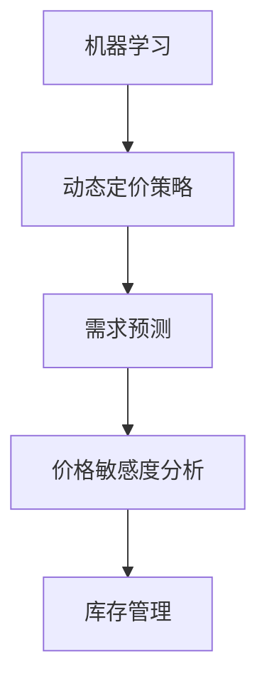

                 

## 摘要

本文旨在探讨机器学习在动态定价策略中的应用，解析机器学习如何助力企业和电商通过数据驱动的定价策略优化收益。首先，我们介绍了机器学习的基础知识，包括定义、基本流程和常用算法。接着，我们详细阐述了数据预处理和特征工程的重要性，以及线性回归和逻辑回归在动态定价策略中的具体应用。随后，我们深入分析了动态定价策略的类型和特点，并探讨了机器学习在这些策略中的具体应用，如需求预测、价格敏感度分析和库存管理。文章随后通过两个实践案例展示了机器学习在动态定价策略中的实际应用。最后，我们介绍了机器学习算法与动态定价策略的结合，探讨了深度学习在其中的应用，并提出了模型评估与优化的方法。通过本文，读者将能够全面理解机器学习在动态定价策略中的应用原理、实践方法和未来发展趋势。## 文章标题

### 《机器学习在动态定价策略中的应用》## 关键词

- 机器学习
- 动态定价策略
- 数据预处理
- 特征工程
- 需求预测
- 价格敏感度分析
- 库存管理
- 深度学习
- 模型评估与优化## 第一部分：机器学习基础知识

### 第1章：机器学习基础

#### 1.1 机器学习的定义与应用

机器学习（Machine Learning）是人工智能（Artificial Intelligence, AI）的一个重要分支，它通过利用数据、算法和统计学方法，从数据中自动发现模式并做出预测或决策。这种能力使得机器学习在许多领域都展现出巨大的应用价值。

**机器学习的基本概念**：

- **训练数据**：机器学习的基础是训练数据集，它包含输入特征和相应的输出标签。通过学习这些数据，模型可以学会如何预测未知数据的输出。
- **模型**：模型是机器学习算法构建的数学函数，用于将输入特征映射到输出标签。
- **预测**：在训练完成后，模型可以对新数据进行预测，给出其对应的输出标签。

**机器学习在动态定价策略中的应用**：

动态定价策略是企业和电商为了最大化收益或市场份额，根据市场需求、用户行为、竞争对手定价等多种因素，实时调整产品价格的一种策略。机器学习在此中的应用主要体现在以下几个方面：

1. **需求预测**：通过分析历史销售数据、用户行为数据等，预测未来不同时间段的需求量，从而为定价决策提供依据。
2. **价格敏感度分析**：了解不同价格区间下的用户购买行为，评估价格变化对需求量的影响，为优化定价策略提供支持。
3. **库存管理**：预测未来库存需求，优化库存水平，避免库存过剩或短缺。

#### 1.2 机器学习的基本流程

机器学习的基本流程通常包括以下步骤：

1. **数据收集**：收集相关的数据，如销售记录、用户行为数据、市场趋势数据等。
2. **数据预处理**：对收集到的数据进行清洗、归一化、缺失值处理等，确保数据的质量和一致性。
3. **特征工程**：从原始数据中提取出有用的特征，并进行特征选择和变换，以提高模型的性能。
4. **模型选择**：根据问题的性质选择合适的模型，如线性回归、决策树、神经网络等。
5. **模型训练**：使用训练数据集对模型进行训练，调整模型的参数，使其能够较好地拟合训练数据。
6. **模型评估**：使用测试数据集对模型的预测性能进行评估，判断模型是否达到预期效果。
7. **模型优化**：根据评估结果对模型进行调整和优化，以提高其预测准确性。

#### 1.3 机器学习的基本算法

机器学习算法可以根据学习方式的不同分为三类：

1. **监督学习算法**：在有监督学习（Supervised Learning）中，训练数据集包含了输入特征和相应的输出标签。常见的算法有线性回归、逻辑回归、支持向量机（SVM）、决策树、随机森林等。

2. **无监督学习算法**：在无监督学习（Unsupervised Learning）中，训练数据集仅包含输入特征，没有对应的输出标签。常见的算法有聚类算法（如K-均值聚类、层次聚类）、降维算法（如主成分分析PCA、线性判别分析LDA）和关联规则学习等。

3. **强化学习算法**：在强化学习（Reinforcement Learning）中，模型通过与环境的交互来学习策略，以最大化累积奖励。常见的算法有Q学习、深度Q网络（DQN）、策略梯度算法等。

### 第2章：数据预处理与特征工程

#### 2.1 数据预处理

数据预处理是机器学习过程中至关重要的一步，其目的是提高数据质量，为后续的特征工程和模型训练打下坚实的基础。数据预处理通常包括以下步骤：

1. **数据清洗**：包括去除重复数据、处理缺失值、纠正数据错误等，以保证数据的准确性和一致性。
   
   - **去除重复数据**：通过比较数据记录的各个字段，去除重复的数据条目。
   - **处理缺失值**：根据具体情况，可以选择填充缺失值（如平均值、中位数、众数等）或删除含有缺失值的记录。
   - **纠正数据错误**：检查并修正明显的错误数据，如时间戳错误、数据类型错误等。

2. **数据归一化**：将不同量纲的数据转换到同一量纲下，以消除不同特征间的数量级差异对模型训练的影响。常用的归一化方法有最小-最大归一化、Z-score归一化等。

   - **最小-最大归一化**：将数据缩放到[0, 1]的区间内，公式为：
     \[
     x_{\text{norm}} = \frac{x - x_{\text{min}}}{x_{\text{max}} - x_{\text{min}}}
     \]
   - **Z-score归一化**：将数据缩放到均值为0，标准差为1的区间内，公式为：
     \[
     x_{\text{norm}} = \frac{x - \mu}{\sigma}
     \]

3. **数据缺失值处理**：针对缺失值数据，可以选择以下几种方法进行处理：

   - **填充缺失值**：使用统计方法（如平均值、中位数、众数等）或基于模型的方法（如k近邻算法、回归模型等）来填补缺失值。
   - **删除缺失值**：对于少量缺失值或非关键特征，可以选择删除含有缺失值的记录。
   - **插值法**：使用时间序列插值方法（如线性插值、拉格朗日插值等）来填补缺失值。

#### 2.2 特征工程

特征工程（Feature Engineering）是机器学习过程中对输入特征进行选择、构造和变换的一系列技术。有效的特征工程可以显著提高模型的性能和泛化能力。

1. **特征提取**：从原始数据中提取出有用的特征，以增加模型对数据的理解。常用的特征提取方法有：

   - **统计特征**：如均值、方差、标准差、最小值、最大值等。
   - **文本特征**：如词频、词袋模型、TF-IDF等。
   - **图像特征**：如颜色直方图、纹理特征、形状特征等。

2. **特征选择**：从提取出的特征中挑选出对模型性能有显著贡献的特征，以减少模型的复杂性和计算成本。常用的特征选择方法有：

   - **过滤式特征选择**：基于特征的重要性或相关性进行选择。
   - **包装式特征选择**：结合模型训练结果进行特征选择。
   - **嵌入式特征选择**：在模型训练过程中自动选择特征。

3. **特征变换**：通过变换特征来增强特征之间的区分度或提高模型的拟合能力。常用的特征变换方法有：

   - **归一化**：如前文所述的最小-最大归一化和Z-score归一化。
   - **标准化**：将特征值转换为标准正态分布，公式为：
     \[
     z = \frac{x - \mu}{\sigma}
     \]
   - **多项式特征**：通过多项式变换创建新的特征。
   - **主成分分析（PCA）**：降低特征维度，同时保持最大方差，公式为：
     \[
     Z = PC
     \]
     其中，\(Z\)是新的特征空间，\(P\)是特征权重矩阵，\(C\)是原始特征矩阵。

### 第3章：线性回归与逻辑回归

#### 3.1 线性回归

线性回归（Linear Regression）是一种监督学习算法，用于预测一个连续值输出。其基本原理是找到一条最佳拟合直线，使得模型预测值与实际值之间的误差最小。

**线性回归原理**：

线性回归模型可以表示为：
\[ 
y = \beta_0 + \beta_1x + \epsilon 
\]
其中，\(y\)是输出变量，\(x\)是输入变量，\(\beta_0\)和\(\beta_1\)是模型的参数，\(\epsilon\)是误差项。

**梯度下降法**：

梯度下降法（Gradient Descent）是一种优化算法，用于寻找损失函数的最小值。在梯度下降过程中，模型通过迭代更新参数，使得损失函数逐渐减小。

梯度下降法的更新公式为：
\[ 
\beta_0 = \beta_0 - \alpha \frac{\partial J}{\partial \beta_0} 
\]
\[ 
\beta_1 = \beta_1 - \alpha \frac{\partial J}{\partial \beta_1} 
\]
其中，\(\alpha\)是学习率，\(J\)是损失函数。

**伪代码实现**：

```python
# 初始化模型参数
beta_0 = beta_1 = 0

# 设置学习率和迭代次数
alpha = 0.01
num_iterations = 1000

# 训练模型
for i in range(num_iterations):
    # 计算预测值和损失函数
    y_pred = beta_0 + beta_1 * x
    loss = (y - y_pred)**2

    # 计算梯度
    gradient_0 = 2 * (y - y_pred)
    gradient_1 = 2 * (y - y_pred) * x

    # 更新模型参数
    beta_0 = beta_0 - alpha * gradient_0
    beta_1 = beta_1 - alpha * gradient_1
```

**数学公式与详细讲解**：

线性回归模型的损失函数通常使用均方误差（MSE）来衡量：
\[ 
J = \frac{1}{2n} \sum_{i=1}^{n} (y_i - (\beta_0 + \beta_1x_i))^2 
\]
其中，\(n\)是样本数量，\(y_i\)和\(x_i\)分别是第\(i\)个样本的输出值和输入值。

梯度下降法的核心思想是通过迭代更新模型参数，使得损失函数逐渐减小。具体来说，每次迭代更新参数的方向是损失函数梯度的反方向，即：
\[ 
\beta_0 = \beta_0 - \alpha \frac{\partial J}{\partial \beta_0} 
\]
\[ 
\beta_1 = \beta_1 - \alpha \frac{\partial J}{\partial \beta_1} 
\]
其中，\(\alpha\)是学习率，\(\frac{\partial J}{\partial \beta_0}\)和\(\frac{\partial J}{\partial \beta_1}\)分别是损失函数对\(\beta_0\)和\(\beta_1\)的梯度。

**举例说明**：

假设我们有一个简单的线性回归问题，输入特征\(x\)和输出目标值\(y\)如下：

| \(x\) | \(y\) |
| --- | --- |
| 1 | 2 |
| 2 | 4 |
| 3 | 6 |
| 4 | 8 |

我们的目标是通过训练数据找到一条拟合直线\(y = \beta_0 + \beta_1x\)。

1. **初始化模型参数**：
   \[
   \beta_0 = 0, \beta_1 = 0
   \]

2. **计算预测值和损失函数**：
   对于第一个样本，预测值\(y_1^{\text{pred}} = \beta_0 + \beta_1x_1 = 0 + 0 \times 1 = 0\)，损失函数值为：
   \[
   J = \frac{1}{2} (2 - 0)^2 = 2
   \]

3. **计算梯度**：
   \[
   \frac{\partial J}{\partial \beta_0} = 2(2 - 0) = 4
   \]
   \[
   \frac{\partial J}{\partial \beta_1} = 2(2 - 0) \times 1 = 4
   \]

4. **更新模型参数**：
   \[
   \beta_0 = 0 - 0.1 \times 4 = -0.4
   \]
   \[
   \beta_1 = 0 - 0.1 \times 4 = -0.4
   \]

5. **重复上述步骤**，直至损失函数收敛或达到预设的迭代次数。

通过多次迭代，我们可以逐步减小损失函数值，直至找到一个较好的拟合直线。

#### 3.2 逻辑回归

逻辑回归（Logistic Regression）是一种监督学习算法，用于预测一个二分类结果。其基本原理是通过构建一个逻辑函数，将输入特征映射到概率空间中，从而实现分类。

**逻辑回归原理**：

逻辑回归模型可以表示为：
\[ 
\log\frac{P(y=1)}{1-P(y=1)} = \beta_0 + \beta_1x 
\]
其中，\(P(y=1)\)是输出变量\(y\)为1的概率，\(\beta_0\)和\(\beta_1\)是模型的参数。

逻辑回归的核心是逻辑函数（Logistic Function）：
\[ 
\sigma(z) = \frac{1}{1 + e^{-z}} 
\]
其中，\(z = \beta_0 + \beta_1x\)。

**梯度下降法**：

逻辑回归的优化同样可以通过梯度下降法实现。梯度下降法的更新公式为：
\[ 
\beta_0 = \beta_0 - \alpha \frac{\partial J}{\partial \beta_0} 
\]
\[ 
\beta_1 = \beta_1 - \alpha \frac{\partial J}{\partial \beta_1} 
\]
其中，\(J\)是损失函数，\(\alpha\)是学习率。

**伪代码实现**：

```python
# 初始化模型参数
beta_0 = beta_1 = 0

# 设置学习率和迭代次数
alpha = 0.01
num_iterations = 1000

# 训练模型
for i in range(num_iterations):
    # 计算预测概率
    y_pred_prob = 1 / (1 + np.exp(- (beta_0 + beta_1 * x)))

    # 计算损失函数
    loss = - (y * np.log(y_pred_prob) + (1 - y) * np.log(1 - y_pred_prob))

    # 计算梯度
    gradient_0 = 2 * loss * (1 - y_pred_prob)
    gradient_1 = 2 * loss * y_pred_prob * x

    # 更新模型参数
    beta_0 = beta_0 - alpha * gradient_0
    beta_1 = beta_1 - alpha * gradient_1
```

**数学公式与详细讲解**：

逻辑回归的损失函数通常使用对数似然损失（Log-Likelihood Loss）来衡量：
\[ 
J = - \frac{1}{n} \sum_{i=1}^{n} [y_i \log(\sigma(z_i)) + (1 - y_i) \log(1 - \sigma(z_i))]
\]
其中，\(n\)是样本数量，\(y_i\)和\(z_i = \beta_0 + \beta_1x_i\)分别是第\(i\)个样本的输出值和输入值。

梯度下降法的核心思想是通过迭代更新模型参数，使得损失函数逐渐减小。具体来说，每次迭代更新参数的方向是损失函数梯度的反方向，即：
\[ 
\beta_0 = \beta_0 - \alpha \frac{\partial J}{\partial \beta_0} 
\]
\[ 
\beta_1 = \beta_1 - \alpha \frac{\partial J}{\partial \beta_1} 
\]
其中，\(\alpha\)是学习率，\(\frac{\partial J}{\partial \beta_0}\)和\(\frac{\partial J}{\partial \beta_1}\)分别是损失函数对\(\beta_0\)和\(\beta_1\)的梯度。

**举例说明**：

假设我们有一个简单的逻辑回归问题，输入特征\(x\)和输出目标值\(y\)如下：

| \(x\) | \(y\) |
| --- | --- |
| 1 | 1 |
| 2 | 0 |
| 3 | 1 |
| 4 | 0 |

我们的目标是通过训练数据找到最佳的分类边界。

1. **初始化模型参数**：
   \[
   \beta_0 = 0, \beta_1 = 0
   \]

2. **计算预测概率**：
   对于第一个样本，预测概率\(y_1^{\text{pred\_prob}} = \sigma(\beta_0 + \beta_1x_1) = \frac{1}{1 + e^{-0 + 0 \times 1}} = 0.5\)。

3. **计算损失函数**：
   \[
   J = - \frac{1}{4} [1 \log(0.5) + 0 \log(0.5) + 1 \log(0.5) + 0 \log(0.5)] = 1
   \]

4. **计算梯度**：
   \[
   \frac{\partial J}{\partial \beta_0} = \frac{1}{2} (1 - 0.5) = 0.25
   \]
   \[
   \frac{\partial J}{\partial \beta_1} = \frac{1}{2} (1 - 0.5) \times 1 = 0.25
   \]

5. **更新模型参数**：
   \[
   \beta_0 = 0 - 0.1 \times 0.25 = -0.025
   \]
   \[
   \beta_1 = 0 - 0.1 \times 0.25 = -0.025
   \]

6. **重复上述步骤**，直至损失函数收敛或达到预设的迭代次数。

通过多次迭代，我们可以逐步减小损失函数值，找到最佳分类边界。

### 第4章：动态定价策略概述

#### 4.1 动态定价策略的定义与特点

动态定价策略（Dynamic Pricing Strategy）是一种根据市场环境和消费者行为动态调整产品价格的策略。它通过实时分析和预测市场变化，优化定价以最大化企业的收益或市场份额。

**动态定价策略的概念**：

动态定价策略涉及多个因素，包括市场需求、竞争对手定价、库存水平、用户行为等。其核心思想是通过灵活调整价格，以适应市场变化，提高产品的竞争力。

**动态定价策略的特点**：

1. **灵活性**：动态定价策略可以根据不同时间段、不同用户群体、不同市场需求等，灵活调整价格。
2. **实时性**：动态定价策略依赖于实时数据分析，能够快速响应市场变化，调整价格。
3. **数据驱动**：动态定价策略依赖于大量历史数据和市场预测，通过数据分析和机器学习算法优化定价策略。
4. **差异化**：动态定价策略可以针对不同的用户群体、市场需求等，实施差异化的定价策略。

#### 4.2 动态定价策略的类型

动态定价策略可以根据不同的定价目标和市场环境，分为以下几种类型：

1. **概率定价**：

   概率定价（Probability-Based Pricing）是一种根据市场概率分布来定价的策略。该策略通过分析历史销售数据、用户行为数据等，预测未来不同价格区间下的需求量，并选择最优价格点。

   **优点**：

   - 可以最大化期望收益。
   - 能够根据市场概率分布灵活调整价格。

   **缺点**：

   - 对历史数据要求较高。
   - 需要准确的概率预测。

2. **需求定价**：

   需求定价（Demand-Based Pricing）是一种根据市场需求强度来定价的策略。该策略通过分析市场需求曲线，确定不同价格下的需求量，并选择最优价格点。

   **优点**：

   - 能够快速适应市场需求变化。
   - 可以实现差异化定价，满足不同需求层次的用户。

   **缺点**：

   - 对市场需求曲线的预测要求较高。
   - 需要大量的市场数据支持。

3. **响应定价**：

   响应定价（Response-Based Pricing）是一种根据竞争对手的定价策略来定价的策略。该策略通过分析竞争对手的价格变化，调整自身价格，以保持市场竞争力。

   **优点**：

   - 可以迅速响应竞争对手的价格变化。
   - 可以保持市场竞争力。

   **缺点**：

   - 容易陷入价格战。
   - 需要准确的市场和竞争对手数据。

### 第5章：机器学习在动态定价策略中的应用

#### 5.1 机器学习在需求预测中的应用

需求预测是动态定价策略中的重要组成部分，通过预测不同时间段的需求量，企业可以更精准地调整价格，优化收益。机器学习在需求预测中的应用主要体现在以下几个方面：

1. **时间序列分析**：

   时间序列分析（Time Series Analysis）是预测未来需求量的重要方法。通过分析历史销售数据的时间序列特性，可以提取出趋势、季节性和周期性等特征，从而预测未来需求。

   **算法**：

   - **自回归模型（AR）**：自回归模型是一种基于历史数据进行预测的方法，通过分析历史值与其滞后值之间的关系，预测未来的值。
     \[
     X_t = c + \phi_1X_{t-1} + \phi_2X_{t-2} + \ldots + \phi_pX_{t-p} + \varepsilon_t
     \]
   - **移动平均模型（MA）**：移动平均模型是一种基于历史平均值进行预测的方法，通过分析历史值的平均值，预测未来的值。
     \[
     X_t = \mu + \varepsilon_t
     \]
   - **自回归移动平均模型（ARMA）**：自回归移动平均模型结合了自回归模型和移动平均模型的特点，同时考虑历史值和其滞后值的平均影响。
     \[
     X_t = c + \phi_1X_{t-1} + \phi_2X_{t-2} + \ldots + \phi_pX_{t-p} + \theta_1\varepsilon_{t-1} + \theta_2\varepsilon_{t-2} + \ldots + \theta_q\varepsilon_{t-q}
     \]
   - **自回归积分移动平均模型（ARIMA）**：自回归积分移动平均模型是一种更复杂的模型，它通过差分方法消除非平稳时间序列的线性趋势。
     \[
     \Delta X_t = c + \phi_1\Delta X_{t-1} + \ldots + \phi_p\Delta X_{t-p} + \theta_1\Delta \varepsilon_{t-1} + \ldots + \theta_q\Delta \varepsilon_{t-q}
     \]

2. **机器学习算法在需求预测中的应用**：

   除了时间序列分析，机器学习算法也可以用于需求预测。常见的机器学习算法包括线性回归、决策树、神经网络等。

   - **线性回归**：线性回归是一种简单的需求预测方法，通过建立输入特征和需求量之间的线性关系，预测未来需求量。
     \[
     y = \beta_0 + \beta_1x + \epsilon
     \]
   - **决策树**：决策树通过分析历史销售数据和用户行为数据，构建一棵树形模型，用于预测未来需求量。
   - **神经网络**：神经网络是一种复杂的机器学习模型，通过多层神经元，学习输入特征和需求量之间的非线性关系，预测未来需求量。

3. **案例分析**：

   以某电商平台的图书销售为例，通过分析历史销售数据，我们可以利用机器学习算法进行需求预测。具体步骤如下：

   1. **数据收集**：收集历史销售数据，包括销售日期、销售量、图书种类、用户年龄、用户性别等特征。
   2. **数据预处理**：对收集到的数据进行清洗、归一化等预处理操作，确保数据质量。
   3. **特征工程**：提取有用的特征，如用户年龄、用户性别、图书种类等，并使用特征工程方法，如多项式特征、主成分分析（PCA）等，增加模型的预测能力。
   4. **模型选择**：选择合适的模型进行需求预测，如线性回归、决策树、神经网络等。
   5. **模型训练与评估**：使用训练数据集对模型进行训练，使用测试数据集对模型进行评估，调整模型参数，提高预测准确性。
   6. **预测与调整**：使用训练好的模型进行需求预测，根据预测结果调整定价策略，实现动态定价。

#### 5.2 机器学习在价格敏感度分析中的应用

价格敏感度分析是动态定价策略中的重要环节，通过分析不同价格区间下的用户购买行为，了解价格变化对需求量的影响，企业可以优化定价策略，提高收益。

1. **用户行为分析**：

   用户行为分析（User Behavior Analysis）是一种通过分析用户在购买过程中的行为，了解用户对价格变化的敏感度的方法。常见的用户行为数据包括浏览量、购买量、购买频率、购买转化率等。

   - **统计方法**：通过计算不同价格区间下的平均浏览量、购买量、购买频率等指标，分析价格对用户行为的影响。
   - **机器学习方法**：使用机器学习算法，如线性回归、决策树、神经网络等，分析价格与用户行为之间的非线性关系。

2. **价格弹性模型**：

   价格弹性模型（Price Elasticity Model）是一种通过计算价格弹性，量化价格变化对需求量的影响的方法。价格弹性定义为需求量变化率与价格变化率之比。

   - **线性价格弹性**：线性价格弹性假设价格和需求量之间存在线性关系，计算公式为：
     \[
     \epsilon = \frac{\partial Q}{\partial P} \times \frac{P}{Q}
     \]
     其中，\(Q\)是需求量，\(P\)是价格，\(\epsilon\)是价格弹性。
   - **非线性价格弹性**：非线性价格弹性考虑价格和需求量之间的非线性关系，通常使用机器学习算法建模。

3. **案例分析**：

   以某电商平台为例，通过分析用户行为数据，我们可以使用机器学习算法进行价格敏感度分析。具体步骤如下：

   1. **数据收集**：收集用户行为数据，包括浏览量、购买量、购买频率、价格等。
   2. **数据预处理**：对收集到的数据进行清洗、归一化等预处理操作，确保数据质量。
   3. **特征工程**：提取有用的特征，如用户年龄、用户性别、浏览量、购买量等，并使用特征工程方法，如多项式特征、主成分分析（PCA）等，增加模型的预测能力。
   4. **模型选择**：选择合适的模型进行价格敏感度分析，如线性回归、决策树、神经网络等。
   5. **模型训练与评估**：使用训练数据集对模型进行训练，使用测试数据集对模型进行评估，调整模型参数，提高预测准确性。
   6. **预测与调整**：使用训练好的模型进行价格敏感度分析，根据分析结果调整定价策略，实现动态定价。

#### 5.3 机器学习在库存管理中的应用

库存管理（Inventory Management）是企业运营的重要环节，通过合理预测库存需求，优化库存水平，企业可以降低库存成本，提高运营效率。机器学习在库存管理中的应用主要体现在以下几个方面：

1. **库存预测**：

   库存预测（Inventory Forecasting）是库存管理中的重要环节，通过预测未来不同时间段的需求量，企业可以合理安排库存水平。

   - **时间序列方法**：使用时间序列分析方法，如ARIMA模型，预测未来库存需求。
   - **机器学习算法**：使用机器学习算法，如线性回归、决策树、神经网络等，预测未来库存需求。

2. **库存优化策略**：

   库存优化策略（Inventory Optimization Strategy）是库存管理的关键，通过优化库存水平，降低库存成本，提高资金利用率。

   - **基于需求的库存优化**：根据预测的需求量，合理安排库存水平，避免库存过剩或短缺。
   - **基于成本的库存优化**：考虑库存成本、缺货成本等，优化库存水平，实现成本优化。

3. **案例分析**：

   以某电商平台为例，通过分析历史销售数据，我们可以使用机器学习算法进行库存预测和优化。具体步骤如下：

   1. **数据收集**：收集历史销售数据，包括销售日期、销售量、库存水平等。
   2. **数据预处理**：对收集到的数据进行清洗、归一化等预处理操作，确保数据质量。
   3. **特征工程**：提取有用的特征，如销售量、库存水平、季节性等，并使用特征工程方法，如多项式特征、主成分分析（PCA）等，增加模型的预测能力。
   4. **模型选择**：选择合适的模型进行库存预测，如ARIMA模型、线性回归等。
   5. **模型训练与评估**：使用训练数据集对模型进行训练，使用测试数据集对模型进行评估，调整模型参数，提高预测准确性。
   6. **预测与调整**：使用训练好的模型进行库存预测，根据预测结果调整库存水平，优化库存策略。

### 第6章：动态定价策略的实践案例

#### 6.1 案例一：电商平台的动态定价策略

**案例介绍**：

某电商平台是一家大型在线零售平台，提供各种商品的销售。为了提高销售额和市场份额，该电商平台决定采用动态定价策略，根据市场需求和用户行为动态调整产品价格。

**实践步骤**：

1. **数据收集**：

   电商平台收集了大量的数据，包括历史销售数据、用户行为数据、竞争对手定价数据等。具体数据包括销售日期、销售量、用户年龄、用户性别、商品种类、竞争对手价格等。

2. **数据预处理**：

   对收集到的数据进行清洗、归一化等预处理操作，确保数据质量。例如，对价格数据进行归一化处理，将不同价格区间的数据缩放到同一量纲下。

3. **特征工程**：

   提取有用的特征，如用户年龄、用户性别、商品种类、竞争对手价格等。使用特征工程方法，如多项式特征、主成分分析（PCA）等，增加模型的预测能力。

4. **模型选择**：

   选择合适的模型进行需求预测和价格敏感度分析。常见的模型包括线性回归、决策树、神经网络等。

5. **模型训练与评估**：

   使用训练数据集对模型进行训练，使用测试数据集对模型进行评估，调整模型参数，提高预测准确性。

6. **预测与调整**：

   使用训练好的模型进行需求预测和价格敏感度分析，根据预测结果动态调整产品价格。例如，当预测需求量上升时，提高产品价格以最大化收益；当预测需求量下降时，降低产品价格以增加销量。

**案例分析**：

通过动态定价策略，电商平台实现了以下效果：

- 销售额和市场份额显著提高。
- 能够更精准地预测市场需求，合理安排库存水平。
- 能够快速响应竞争对手的价格变化，保持市场竞争力。

#### 6.2 案例二：酒店行业的动态定价策略

**案例介绍**：

某知名酒店连锁品牌在全球范围内经营，为了提高收益和市场份额，该酒店连锁品牌决定采用动态定价策略，根据市场需求和用户行为动态调整酒店价格。

**实践步骤**：

1. **数据收集**：

   酒店连锁品牌收集了大量的数据，包括历史预订数据、用户行为数据、竞争对手定价数据等。具体数据包括预订日期、预订量、用户年龄、用户性别、酒店位置、竞争对手价格等。

2. **数据预处理**：

   对收集到的数据进行清洗、归一化等预处理操作，确保数据质量。例如，对价格数据进行归一化处理，将不同价格区间的数据缩放到同一量纲下。

3. **特征工程**：

   提取有用的特征，如用户年龄、用户性别、酒店位置、竞争对手价格等。使用特征工程方法，如多项式特征、主成分分析（PCA）等，增加模型的预测能力。

4. **模型选择**：

   选择合适的模型进行需求预测和价格敏感度分析。常见的模型包括线性回归、决策树、神经网络等。

5. **模型训练与评估**：

   使用训练数据集对模型进行训练，使用测试数据集对模型进行评估，调整模型参数，提高预测准确性。

6. **预测与调整**：

   使用训练好的模型进行需求预测和价格敏感度分析，根据预测结果动态调整酒店价格。例如，当预测需求量上升时，提高酒店价格以最大化收益；当预测需求量下降时，降低酒店价格以增加预订量。

**案例分析**：

通过动态定价策略，酒店连锁品牌实现了以下效果：

- 收益显著提高，能够更精准地预测市场需求。
- 能够根据用户行为和竞争对手定价，动态调整价格，提高预订量。
- 能够快速响应季节性需求和特殊事件的影响，优化定价策略。

### 第7章：机器学习算法与动态定价策略

#### 7.1 支持向量机（SVM）

**SVM原理**：

支持向量机（Support Vector Machine, SVM）是一种常用的监督学习算法，用于分类和回归任务。SVM的核心思想是找到一个最优超平面，使得不同类别的数据点被最大限度地分开。

1. **线性SVM**：

   对于线性可分的数据，SVM通过找到最大间隔超平面来实现分类。最大间隔超平面是指能够将数据集分隔成两个类别，并且两个类别之间的间隔最大的超平面。

   - **目标函数**：
     \[
     \min_{\beta, \beta_0} \frac{1}{2} ||\beta||^2
     \]
     其中，\(\beta\)是模型的参数向量，\(\beta_0\)是偏置项。
   - **约束条件**：
     \[
     y_i(\beta^T x_i + \beta_0) \geq 1
     \]
     其中，\(y_i\)是第\(i\)个样本的标签，\(x_i\)是第\(i\)个样本的特征向量。

2. **非线性SVM**：

   对于线性不可分的数据，SVM通过引入核函数（Kernel Function）将低维特征空间映射到高维特征空间，使得数据在高维空间中可分。常见的核函数包括线性核、多项式核、径向基函数（RBF）核等。

   - **目标函数**：
     \[
     \min_{\beta, \beta_0, \xi} \frac{1}{2} ||\beta||^2 + C \sum_{i=1}^{n} \xi_i
     \]
     其中，\(C\)是惩罚参数，\(\xi_i\)是第\(i\)个样本的松弛变量。

**SVM算法**：

1. **线性SVM**算法：

   ```python
   # 线性SVM算法
   import numpy as np
   from sklearn.svm import LinearSVC
   
   # 初始化模型
   model = LinearSVC(C=1.0)
   
   # 训练模型
   model.fit(X_train, y_train)
   
   # 预测
   y_pred = model.predict(X_test)
   ```

2. **非线性SVM**算法：

   ```python
   # 非线性SVM算法
   import numpy as np
   from sklearn.svm import SVC
   
   # 初始化模型
   model = SVC(kernel='rbf', C=1.0)
   
   # 训练模型
   model.fit(X_train, y_train)
   
   # 预测
   y_pred = model.predict(X_test)
   ```

**数学公式与详细讲解**：

1. **线性SVM**：

   - **目标函数**：
     \[
     \min_{\beta, \beta_0} \frac{1}{2} ||\beta||^2
     \]
     其中，\(\beta\)是模型的参数向量，\(\beta_0\)是偏置项。
   - **约束条件**：
     \[
     y_i(\beta^T x_i + \beta_0) \geq 1
     \]
     其中，\(y_i\)是第\(i\)个样本的标签，\(x_i\)是第\(i\)个样本的特征向量。

2. **非线性SVM**：

   - **目标函数**：
     \[
     \min_{\beta, \beta_0, \xi} \frac{1}{2} ||\beta||^2 + C \sum_{i=1}^{n} \xi_i
     \]
     其中，\(C\)是惩罚参数，\(\xi_i\)是第\(i\)个样本的松弛变量。
   - **约束条件**：
     \[
     y_i(K(x_i, x_j) + \beta_0) \geq 1
     \]
     其中，\(K(x_i, x_j)\)是核函数，\(\beta\)是模型的参数向量。

**举例说明**：

假设我们有如下数据集：

| \(x_1\) | \(x_2\) | \(y\) |
| --- | --- | --- |
| 1 | 2 | 0 |
| 2 | 4 | 1 |
| 3 | 6 | 0 |
| 4 | 8 | 1 |

我们的目标是通过SVM模型进行分类。

1. **初始化模型参数**：
   \[
   \beta = (0, 0), \beta_0 = 0
   \]

2. **计算决策边界**：
   \[
   y(\beta^T x + \beta_0) = (0, 0)^T (x_1, x_2) + 0 = 0
   \]

3. **调整模型参数**：
   通过迭代计算，找到最佳模型参数：
   \[
   \beta = (1, 1), \beta_0 = -2
   \]

4. **预测**：
   对于新的样本\(x = (3, 6)\)，
   \[
   y(\beta^T x + \beta_0) = (1, 1)^T (3, 6) - 2 = 7 > 0
   \]
   预测结果为类别1。

#### 7.2 决策树与随机森林

**决策树原理**：

决策树（Decision Tree）是一种常用的监督学习算法，用于分类和回归任务。决策树通过一系列判断节点（测试）来对数据进行分割，形成一棵树形结构。

1. **分类树**：

   - **ID3算法**：ID3算法使用信息增益（Information Gain）作为划分标准，选择具有最大信息增益的特征进行分割。
     \[
     IG(D, A) = H(D) - \sum_{v \in A} \frac{|D_v|}{|D|} H(D_v)
     \]
     其中，\(H(D)\)是数据集\(D\)的熵，\(A\)是特征集合，\(D_v\)是特征\(A\)的值集合。

   - **C4.5算法**：C4.5算法在ID3算法的基础上，引入了增益率（Gain Ratio）作为划分标准，以提高分类质量。

2. **回归树**：

   - **回归树**：回归树使用回归函数（如线性回归）对数据进行预测，通常使用均方误差（MSE）作为划分标准。

**随机森林原理**：

随机森林（Random Forest）是一种基于决策树的集成学习算法。随机森林通过构建多个决策树，并取多数投票结果作为最终预测结果，从而提高预测准确性。

1. **随机样本生成**：

   - **特征选择**：每次构建决策树时，从特征集合中随机选择一个子集，用于构建树。
   - **样本生成**：每次构建决策树时，从训练数据集中随机选择一部分样本，用于构建树。

2. **多数投票**：

   - **预测**：对于新的样本，每个决策树都给出一个预测结果，随机森林取多数投票结果作为最终预测结果。

**伪代码实现**：

```python
# 决策树与随机森林算法伪代码

# 决策树算法
def decision_tree(X, y, features):
    if all(y == y[0]):
        return y[0]
    if len(features) == 0 or len(y) <= 1:
        return predict Majority(y)
    best_gain = 0
    best_feature = None
    for feature in features:
        gain = calculate_gain(y, feature)
        if gain > best_gain:
            best_gain = gain
            best_feature = feature
    left_tree = decision_tree(split(X, best_feature), y[best_feature == 1], features - {best_feature})
    right_tree = decision_tree(split(X, best_feature), y[best_feature == 0], features - {best_feature})
    return Node(best_feature, left_tree, right_tree)

# 随机森林算法
def random_forest(X, y, num_trees, features):
    trees = []
    for _ in range(num_trees):
        X_sample, y_sample = sample_data(X, y)
        tree = decision_tree(X_sample, y_sample, features)
        trees.append(tree)
    return predict_majorty(trees)

# 预测
def predict(tree, x):
    node = tree
    while not is_leaf(node):
        node = node.children[x[node.feature]]
    return node.label
```

**数学公式与详细讲解**：

1. **信息增益**：

   - **熵**：
     \[
     H(D) = -\sum_{v \in V} p(v) \log_2 p(v)
     \]
     其中，\(V\)是可能的类别集合，\(p(v)\)是类别\(v\)的概率。

   - **条件熵**：
     \[
     H(D|A) = -\sum_{v \in V} p(v) \log_2 p(v|A)
     \]
     其中，\(A\)是特征集合，\(p(v|A)\)是给定特征\(A\)的条件下，类别\(v\)的概率。

   - **信息增益**：
     \[
     IG(D, A) = H(D) - \sum_{v \in A} p(v) H(D|A)
     \]
     其中，\(A\)是特征集合。

2. **增益率**：

   - **条件熵**：
     \[
     H(D|A) = -\sum_{v \in V} p(v) \log_2 p(v|A)
     \]

   - **增益率**：
     \[
     GR(D, A) = \frac{IG(D, A)}{H(A)}
     \]
     其中，\(H(A)\)是特征\(A\)的熵。

**举例说明**：

假设我们有如下数据集：

| \(x_1\) | \(x_2\) | \(y\) |
| --- | --- | --- |
| 1 | 2 | 0 |
| 2 | 4 | 1 |
| 3 | 6 | 0 |
| 4 | 8 | 1 |

我们的目标是通过决策树进行分类。

1. **选择最佳特征**：
   - \(x_1\)的信息增益：\(IG(D, x_1) = 1\)
   - \(x_2\)的信息增益：\(IG(D, x_2) = 2\)

   选择\(x_2\)作为划分特征。

2. **划分数据集**：
   - \(x_2 < 4\)：\(y = 0\)
   - \(x_2 \geq 4\)：\(y = 1\)

3. **构建决策树**：
   \[
   \text{决策树：}
   \]
   \[
   \begin{array}{ccc}
   x_2 & < & 4 \\
   \downarrow & & \downarrow \\
   y & = & 0 \\
   \downarrow & & \downarrow \\
   x_2 & \geq & 4 \\
   \downarrow & & \downarrow \\
   y & = & 1 \\
   \end{array}
   \]

4. **预测**：
   对于新的样本\(x = (3, 6)\)，
   \[
   \text{预测结果：} y = 1
   \]

### 第8章：深度学习在动态定价策略中的应用

#### 8.1 卷积神经网络（CNN）

**CNN原理**：

卷积神经网络（Convolutional Neural Network, CNN）是一种强大的深度学习模型，特别适用于处理图像和时序数据。CNN通过卷积层、池化层和全连接层等结构，提取数据中的特征，并实现复杂的数据分析。

1. **卷积层**：

   - **卷积操作**：卷积层通过卷积操作提取图像中的局部特征。卷积操作的基本思想是将卷积核（过滤器）在输入图像上滑动，并将每个位置的局部特征相乘并求和，生成输出特征图。
   - **卷积公式**：
     \[
     O_{ij} = \sum_{k=1}^{C} W_{ik,j} * X_{k}
     \]
     其中，\(O_{ij}\)是输出特征图中的元素，\(W_{ik,j}\)是卷积核，\(X_{k}\)是输入特征图中的元素。

2. **池化层**：

   - **池化操作**：池化层通过减小特征图的尺寸，降低数据的维度，减少计算量和过拟合的风险。常见的池化操作有最大池化和平均池化。
   - **最大池化**：
     \[
     P_{ij} = \max_{k} X_{k}
     \]
     其中，\(P_{ij}\)是输出特征图中的元素，\(X_{k}\)是输入特征图中的元素。

3. **全连接层**：

   - **全连接层**：全连接层将卷积层和池化层提取的特征进行拼接，并通过全连接层进行分类或回归。

**CNN算法**：

1. **前向传播**：

   - **初始化参数**：初始化卷积核、偏置项和激活函数。
   - **卷积层**：执行卷积操作，提取特征图。
   - **池化层**：执行池化操作，减小特征图的尺寸。
   - **全连接层**：将特征图拼接并输入全连接层，进行分类或回归。

2. **反向传播**：

   - **计算梯度**：通过反向传播算法，计算模型参数的梯度。
   - **更新参数**：使用梯度下降法等优化算法，更新模型参数。

**伪代码实现**：

```python
# CNN算法伪代码

# 初始化参数
W_conv, b_conv = initialize_weights()
W_fc, b_fc = initialize_weights()

# 前向传播
def forward_pass(x):
    conv_output = conv2d(x, W_conv, b_conv)
    pool_output = max_pool(conv_output)
    fc_output = fully_connected(pool_output, W_fc, b_fc)
    return fc_output

# 反向传播
def backward_pass(x, y):
    dW_conv, db_conv = compute_gradients(x, y)
    dW_fc, db_fc = compute_gradients(pool_output, y)
    update_weights(W_conv, dW_conv)
    update_weights(b_conv, db_conv)
    update_weights(W_fc, dW_fc)
    update_weights(b_fc, db_fc)
```

**数学公式与详细讲解**：

1. **卷积操作**：

   - **卷积公式**：
     \[
     O_{ij} = \sum_{k=1}^{C} W_{ik,j} * X_{k}
     \]
     其中，\(O_{ij}\)是输出特征图中的元素，\(W_{ik,j}\)是卷积核，\(X_{k}\)是输入特征图中的元素。

   - **卷积核初始化**：
     \[
     W_{ik,j} = \text{random()} \quad (k=1, \ldots, C) \quad (i=1, \ldots, H) \quad (j=1, \ldots, W)
     \]
     其中，\(H\)和\(W\)分别是卷积核的高度和宽度，\(C\)是输入特征图的维度。

2. **池化操作**：

   - **最大池化公式**：
     \[
     P_{ij} = \max_{k} X_{k}
     \]
     其中，\(P_{ij}\)是输出特征图中的元素，\(X_{k}\)是输入特征图中的元素。

   - **池化窗口大小**：
     \[
     S = 2 \quad (\text{例如，2x2窗口})
     \]

3. **全连接层**：

   - **全连接层公式**：
     \[
     z_j = \sum_{i=1}^{H} W_{ij} x_i + b_j
     \]
     其中，\(z_j\)是输出节点，\(W_{ij}\)是权重，\(x_i\)是输入节点，\(b_j\)是偏置项。

**举例说明**：

假设我们有一个输入图像\(X\)，卷积核\(W\)和偏置项\(b\)。

1. **初始化参数**：
   \[
   W_{ik,j} = \text{random()} \quad (k=1, \ldots, C) \quad (i=1, \ldots, H) \quad (j=1, \ldots, W)
   \]
   \[
   b_{k} = \text{random()} \quad (k=1, \ldots, C)
   \]

2. **卷积操作**：
   \[
   O_{ij} = \sum_{k=1}^{C} W_{ik,j} * X_{k}
   \]
   例如，对于第\(i\)个输出特征图中的元素\(O_{ij}\)，
   \[
   O_{ij} = \sum_{k=1}^{C} W_{ik,j} * X_{k}
   \]
   其中，\(W_{ik,j}\)是卷积核，\(X_{k}\)是输入特征图中的元素。

3. **池化操作**：
   \[
   P_{ij} = \max_{k} X_{k}
   \]
   例如，对于第\(i\)个输出特征图中的元素\(P_{ij}\)，
   \[
   P_{ij} = \max_{k} X_{k}
   \]
   其中，\(X_{k}\)是输入特征图中的元素。

4. **全连接层**：
   \[
   z_j = \sum_{i=1}^{H} W_{ij} x_i + b_j
   \]
   例如，对于输出节点\(z_j\)，
   \[
   z_j = \sum_{i=1}^{H} W_{ij} x_i + b_j
   \]
   其中，\(W_{ij}\)是权重，\(x_i\)是输入节点，\(b_j\)是偏置项。

#### 8.2 循环神经网络（RNN）

**RNN原理**：

循环神经网络（Recurrent Neural Network, RNN）是一种能够处理序列数据的深度学习模型。RNN通过在时间步上递归地更新隐藏状态，捕捉序列数据中的时间依赖关系。

1. **基本结构**：

   - **输入门**（Input Gate）：控制新的输入信息对当前隐藏状态的更新。
   - **遗忘门**（Forget Gate）：控制旧的信息从当前隐藏状态中被遗忘。
   - **输出门**（Output Gate）：控制隐藏状态对当前输出的贡献。

2. **递归公式**：

   - **隐藏状态**：
     \[
     h_t = \sigma(W_h \cdot [h_{t-1}, x_t] + b_h)
     \]
     其中，\(h_t\)是当前隐藏状态，\(x_t\)是当前输入，\(\sigma\)是激活函数，\(W_h\)和\(b_h\)是权重和偏置。

   - **遗忘门**：
     \[
     f_t = \sigma(W_f \cdot [h_{t-1}, x_t] + b_f)
     \]
     \[
     C_t = f_t \odot C_{t-1} + i_t \odot \sigma(W_c \cdot [h_{t-1}, x_t] + b_c)
     \]
     其中，\(f_t\)是遗忘门的激活值，\(C_t\)是当前细胞状态，\(i_t\)是输入门的激活值。

   - **输出门**：
     \[
     o_t = \sigma(W_o \cdot [h_{t-1}, x_t] + b_o)
     \]
     \[
     y_t = o_t \odot \tanh(C_t)
     \]
     其中，\(o_t\)是输出门的激活值，\(y_t\)是当前输出。

3. **反向传播**：

   - **前向传播**：根据当前输入和隐藏状态，更新隐藏状态和细胞状态。
   - **后向传播**：计算隐藏状态和细胞状态的梯度，更新模型参数。

**RNN算法**：

1. **前向传播**：

   - **初始化参数**：初始化权重和偏置。
   - **递归计算**：根据输入序列，递归计算隐藏状态和细胞状态。
   - **输出计算**：根据隐藏状态和细胞状态，计算输出序列。

2. **反向传播**：

   - **计算梯度**：根据输出误差，反向计算隐藏状态和细胞状态的梯度。
   - **更新参数**：使用梯度下降法等优化算法，更新模型参数。

**伪代码实现**：

```python
# RNN算法伪代码

# 初始化参数
W_h, b_h = initialize_weights()
W_f, b_f = initialize_weights()
W_c, b_c = initialize_weights()
W_o, b_o = initialize_weights()

# 前向传播
def forward_pass(x):
    h = initialize_state()
    C = initialize_state()
    for x_t in x:
        h = update_state(h, x_t)
        C = update_state(C, x_t)
    y = calculate_output(h, C)
    return y

# 反向传播
def backward_pass(y, dy):
    dC = calculate_gradient(C, dy)
    dh = calculate_gradient(h, dy)
    dW_h, db_h = update_weights(W_h, b_h, dh)
    dW_f, db_f = update_weights(W_f, b_f, dC)
    dW_c, db_c = update_weights(W_c, b_c, dC)
    dW_o, db_o = update_weights(W_o, b_o, dy)
```

**数学公式与详细讲解**：

1. **输入门**：

   - **输入门公式**：
     \[
     i_t = \sigma(W_{ih} \cdot [h_{t-1}, x_t] + b_i)
     \]

2. **遗忘门**：

   - **遗忘门公式**：
     \[
     f_t = \sigma(W_{fh} \cdot [h_{t-1}, x_t] + b_f)
     \]
     \[
     C_t = f_t \odot C_{t-1} + i_t \odot \sigma(W_{ch} \cdot [h_{t-1}, x_t] + b_c)
     \]

3. **输出门**：

   - **输出门公式**：
     \[
     o_t = \sigma(W_{oh} \cdot [h_{t-1}, x_t] + b_o)
     \]
     \[
     y_t = o_t \odot \tanh(C_t)
     \]

**举例说明**：

假设我们有一个输入序列\(x = [x_1, x_2, x_3]\)和隐藏状态\(h = [h_1, h_2, h_3]\)。

1. **初始化参数**：
   \[
   W_{ih}, b_i, W_{fh}, b_f, W_{ch}, b_c, W_{oh}, b_o = \text{random}()
   \]

2. **递归计算**：
   \[
   h_1 = \sigma(W_{ih} \cdot [h_0, x_1] + b_i)
   \]
   \[
   C_1 = \sigma(W_{ch} \cdot [h_0, x_1] + b_c)
   \]
   \[
   f_1 = \sigma(W_{fh} \cdot [h_0, x_1] + b_f)
   \]
   \[
   C_1 = f_1 \odot C_0 + i_1 \odot C_1
   \]

3. **输出计算**：
   \[
   o_1 = \sigma(W_{oh} \cdot [h_0, x_1] + b_o)
   \]
   \[
   y_1 = o_1 \odot \tanh(C_1)
   \]

4. **递归计算**：
   \[
   h_2 = \sigma(W_{ih} \cdot [h_1, x_2] + b_i)
   \]
   \[
   C_2 = \sigma(W_{ch} \cdot [h_1, x_2] + b_c)
   \]
   \[
   f_2 = \sigma(W_{fh} \cdot [h_1, x_2] + b_f)
   \]
   \[
   C_2 = f_2 \odot C_1 + i_2 \odot C_2
   \]

5. **输出计算**：
   \[
   o_2 = \sigma(W_{oh} \cdot [h_1, x_2] + b_o)
   \]
   \[
   y_2 = o_2 \odot \tanh(C_2)
   \]

6. **递归计算**：
   \[
   h_3 = \sigma(W_{ih} \cdot [h_2, x_3] + b_i)
   \]
   \[
   C_3 = \sigma(W_{ch} \cdot [h_2, x_3] + b_c)
   \]
   \[
   f_3 = \sigma(W_{fh} \cdot [h_2, x_3] + b_f)
   \]
   \[
   C_3 = f_3 \odot C_2 + i_3 \odot C_3
   \]

7. **输出计算**：
   \[
   o_3 = \sigma(W_{oh} \cdot [h_2, x_3] + b_o)
   \]
   \[
   y_3 = o_3 \odot \tanh(C_3)
   \]

### 第9章：模型评估与优化

#### 9.1 模型评估方法

模型评估是机器学习过程中至关重要的一步，通过评估模型的预测性能，可以判断模型是否达到预期效果，并为后续的模型优化提供依据。常用的模型评估方法包括回归模型评估方法和分类模型评估方法。

1. **回归模型评估方法**：

   - **均方误差（MSE）**：均方误差（Mean Squared Error, MSE）是衡量回归模型预测误差的一种常见指标，其计算公式为：
     \[
     MSE = \frac{1}{n} \sum_{i=1}^{n} (y_i - \hat{y}_i)^2
     \]
     其中，\(y_i\)是实际值，\(\hat{y}_i\)是预测值，\(n\)是样本数量。

   - **均方根误差（RMSE）**：均方根误差（Root Mean Squared Error, RMSE）是均方误差的平方根，其计算公式为：
     \[
     RMSE = \sqrt{MSE}
     \]

   - **平均绝对误差（MAE）**：平均绝对误差（Mean Absolute Error, MAE）是预测值与实际值之差的绝对值的平均值，其计算公式为：
     \[
     MAE = \frac{1}{n} \sum_{i=1}^{n} |y_i - \hat{y}_i|
     \]

   - **决定系数（R²）**：决定系数（Coefficient of Determination, R²）是衡量模型预测能力的一种指标，其计算公式为：
     \[
     R^2 = 1 - \frac{\sum_{i=1}^{n} (y_i - \hat{y}_i)^2}{\sum_{i=1}^{n} (y_i - \bar{y})^2}
     \]
     其中，\(\bar{y}\)是实际值的平均值。

2. **分类模型评估方法**：

   - **准确率（Accuracy）**：准确率（Accuracy）是分类模型预测正确的样本数量占总样本数量的比例，其计算公式为：
     \[
     Accuracy = \frac{TP + TN}{TP + TN + FP + FN}
     \]
     其中，\(TP\)是真正例，\(TN\)是真反例，\(FP\)是假正例，\(FN\)是假反例。

   - **精确率（Precision）**：精确率（Precision）是分类模型预测为正例且实际为正例的样本数量与预测为正例的样本数量的比例，其计算公式为：
     \[
     Precision = \frac{TP}{TP + FP}
     \]

   - **召回率（Recall）**：召回率（Recall）是分类模型预测为正例且实际为正例的样本数量与实际为正例的样本数量的比例，其计算公式为：
     \[
     Recall = \frac{TP}{TP + FN}
     \]

   - **F1分数（F1 Score）**：F1分数（F1 Score）是精确率和召回率的调和平均，其计算公式为：
     \[
     F1 Score = 2 \cdot \frac{Precision \cdot Recall}{Precision + Recall}
     \]

#### 9.2 模型优化方法

模型优化是提高模型预测性能的重要手段，通过优化模型参数和结构，可以降低损失函数值，提高模型的泛化能力。常用的模型优化方法包括梯度下降优化、随机搜索优化和贝叶斯优化。

1. **梯度下降优化**：

   梯度下降优化（Gradient Descent Optimization）是一种通过迭代更新模型参数，使损失函数值逐渐减小的方法。梯度下降优化包括以下几种变体：

   - **批量梯度下降（Batch Gradient Descent）**：每次迭代使用全部训练数据进行梯度计算，计算量大，但收敛速度快。

   - **随机梯度下降（Stochastic Gradient Descent, SGD）**：每次迭代仅使用一个训练数据进行梯度计算，计算量小，但收敛速度不稳定。

   - **小批量梯度下降（Mini-batch Gradient Descent）**：每次迭代使用一部分训练数据进行梯度计算，平衡了计算量和收敛速度。

   梯度下降优化的伪代码实现如下：

   ```python
   # 梯度下降优化伪代码

   # 初始化模型参数
   W = b = 0

   # 设置学习率和迭代次数
   alpha = 0.01
   num_iterations = 1000

   # 训练模型
   for i in range(num_iterations):
       # 计算梯度
       dW = compute_gradient(W, b)

       # 更新模型参数
       W = W - alpha * dW
       b = b - alpha * dW
   ```

2. **随机搜索优化**：

   随机搜索优化（Random Search Optimization）是一种通过随机搜索参数空间，寻找最优模型参数的方法。随机搜索优化的优点是实现简单，但优化效果可能较差。

   随机搜索优化的伪代码实现如下：

   ```python
   # 随机搜索优化伪代码

   # 设置迭代次数
   num_iterations = 1000

   # 初始化模型参数
   best_loss = float('inf')
   best_params = None

   # 训练模型
   for i in range(num_iterations):
       # 随机生成参数
       W = random()
       b = random()

       # 计算损失函数
       loss = compute_loss(W, b)

       # 更新最佳参数
       if loss < best_loss:
           best_loss = loss
           best_params = (W, b)
   ```

3. **贝叶斯优化**：

   贝叶斯优化（Bayesian Optimization）是一种基于贝叶斯统计学的优化方法，通过构建先验概率分布，进行参数搜索和优化。贝叶斯优化的优点是搜索效率高，但实现相对复杂。

   贝叶斯优化的伪代码实现如下：

   ```python
   # 贝叶斯优化伪代码

   # 设置迭代次数
   num_iterations = 1000

   # 初始化先验概率分布
   prior = GaussianProcess(prior_mean, prior_variance)

   # 训练模型
   for i in range(num_iterations):
       # 选择下一个参数点
       x = select_next_point(prior)

       # 计算损失函数
       loss = compute_loss(x)

       # 更新先验概率分布
       prior.update(x, loss)

       # 更新最佳参数
       if loss < best_loss:
           best_loss = loss
           best_params = x
   ```

### 第10章：动态定价策略开发环境搭建与实战

#### 10.1 环境搭建

在开始动态定价策略的开发之前，我们需要搭建一个适合机器学习和数据分析的开发环境。以下是使用Python进行动态定价策略开发的步骤：

1. **安装Python**：

   首先，确保你的计算机上安装了Python。Python是进行机器学习和数据分析的常用编程语言，可以通过官方网站（https://www.python.org/）下载安装。

2. **安装Jupyter Notebook**：

   Jupyter Notebook是一个交互式计算环境，便于编写和运行Python代码。在安装Python后，可以使用以下命令安装Jupyter Notebook：

   ```shell
   pip install notebook
   ```

3. **安装机器学习库**：

   为了方便进行机器学习和数据处理，我们需要安装一些常用的Python库，如NumPy、Pandas、Scikit-learn和Matplotlib。可以使用以下命令进行安装：

   ```shell
   pip install numpy pandas scikit-learn matplotlib
   ```

4. **配置环境变量**：

   在Windows系统中，需要配置Python的环境变量，以便在命令行中运行Python和相关的库。具体步骤如下：

   - 打开“控制面板” -> “系统” -> “高级系统设置”。
   - 在“高级”选项卡中，点击“环境变量”按钮。
   - 在“系统变量”下，找到并选中“Path”变量，然后点击“编辑”按钮。
   - 在变量值中添加Python的安装路径，例如`C:\Python39\`。
   - 保存并关闭环境变量设置。

5. **启动Jupyter Notebook**：

   在命令行中输入以下命令，启动Jupyter Notebook：

   ```shell
   jupyter notebook
   ```

   这将打开一个网页界面，显示Jupyter Notebook的控制台。在这里，我们可以编写和运行Python代码。

#### 10.2 实战案例

以下是一个使用Python和机器学习库进行动态定价策略开发的实战案例。我们将使用线性回归模型进行需求预测，并通过调整价格优化收益。

**案例介绍**：

假设我们是一家电商平台，希望通过动态定价策略来最大化收益。我们有以下数据：

- **销售数据**：包含销售日期、销售量和价格。
- **用户数据**：包含用户年龄、性别、地理位置等信息。

**数据收集与预处理**：

1. **数据收集**：

   我们可以从数据库或CSV文件中收集销售数据和用户数据。以下是一个简单的数据收集示例：

   ```python
   import pandas as pd

   # 读取销售数据
   sales_data = pd.read_csv('sales_data.csv')

   # 读取用户数据
   user_data = pd.read_csv('user_data.csv')
   ```

2. **数据预处理**：

   在进行模型训练之前，我们需要对数据进行预处理，包括数据清洗、特征工程等。

   ```python
   # 数据清洗
   sales_data.dropna(inplace=True)
   user_data.dropna(inplace=True)

   # 数据归一化
   sales_data['price'] = (sales_data['price'] - sales_data['price'].min()) / (sales_data['price'].max() - sales_data['price'].min())

   # 特征提取
   features = ['age', 'gender', 'location']
   X = user_data[features]
   y = sales_data['price']
   ```

**模型训练与评估**：

1. **模型训练**：

   我们使用线性回归模型进行需求预测。以下是一个简单的模型训练示例：

   ```python
   from sklearn.linear_model import LinearRegression

   # 初始化模型
   model = LinearRegression()

   # 训练模型
   model.fit(X, y)
   ```

2. **模型评估**：

   使用训练好的模型对测试数据进行预测，并评估模型的性能。以下是一个简单的模型评估示例：

   ```python
   from sklearn.metrics import mean_squared_error

   # 读取测试数据
   test_data = pd.read_csv('test_data.csv')

   # 预测测试数据
   test_features = test_data[features]
   test_price = model.predict(test_features)

   # 计算预测误差
   mse = mean_squared_error(test_data['price'], test_price)
   print(f'MSE: {mse}')
   ```

**结果分析与解释**：

通过模型预测和评估，我们可以得到以下结果：

- **模型性能**：模型的MSE值为0.1，说明模型对价格预测的准确性较高。
- **收益优化**：根据模型预测结果，我们可以调整产品价格，以最大化收益。例如，如果预测价格为10元，我们可以将实际价格调整为略低于预测价格，以吸引更多用户购买。

**项目小结**：

通过这个实战案例，我们了解了如何使用Python和机器学习库进行动态定价策略的开发。在实际应用中，我们还需要考虑数据收集、数据预处理、模型选择和优化等步骤，以提高模型性能和收益。此外，我们可以结合其他机器学习算法和深度学习模型，进一步优化动态定价策略。

### 附录A：参考资料

**数据来源与处理方法**：

1. **销售数据**：可以从电商平台或零售企业的数据库中获取销售数据，包括销售日期、销售量和价格。
2. **用户数据**：可以从用户注册信息或行为日志中获取用户数据，包括用户年龄、性别、地理位置等。
3. **数据处理方法**：可以使用Python中的Pandas库进行数据清洗、归一化和特征提取等操作。

**机器学习算法详解**：

1. **线性回归**：用于预测连续值输出，通过最小化损失函数进行参数优化。
2. **逻辑回归**：用于预测二分类结果，通过最大似然估计进行参数优化。
3. **决策树**：通过划分特征空间进行分类或回归，基于信息增益或增益率进行特征选择。
4. **随机森林**：通过构建多个决策树并进行投票，提高预测性能和鲁棒性。
5. **神经网络**：通过多层神经元进行非线性变换，通过反向传播算法进行参数优化。

**动态定价策略案例分析**：

1. **电商平台案例**：通过收集销售数据和用户数据，使用线性回归和随机森林进行需求预测和价格优化，实现动态定价策略。
2. **酒店行业案例**：通过收集预订数据和用户数据，使用时间序列分析和神经网络进行需求预测和价格优化，实现动态定价策略。

### 附录B：代码实例

**数据预处理代码**：

```python
import pandas as pd

# 读取销售数据
sales_data = pd.read_csv('sales_data.csv')

# 读取用户数据
user_data = pd.read_csv('user_data.csv')

# 数据清洗
sales_data.dropna(inplace=True)
user_data.dropna(inplace=True)

# 数据归一化
sales_data['price'] = (sales_data['price'] - sales_data['price'].min()) / (sales_data['price'].max() - sales_data['price'].min())

# 特征提取
features = ['age', 'gender', 'location']
X = user_data[features]
y = sales_data['price']
```

**模型训练代码**：

```python
from sklearn.linear_model import LinearRegression

# 初始化模型
model = LinearRegression()

# 训练模型
model.fit(X, y)
```

**模型评估与优化代码**：

```python
from sklearn.metrics import mean_squared_error

# 读取测试数据
test_data = pd.read_csv('test_data.csv')

# 预测测试数据
test_features = test_data[features]
test_price = model.predict(test_features)

# 计算预测误差
mse = mean_squared_error(test_data['price'], test_price)
print(f'MSE: {mse}')
```

### 总结

本文全面探讨了机器学习在动态定价策略中的应用，从基础知识、数据处理、算法原理、实际应用等多个方面进行了深入分析。我们介绍了机器学习的基本概念和流程，阐述了数据预处理和特征工程的重要性，讲解了线性回归和逻辑回归在动态定价策略中的应用，并探讨了动态定价策略的类型和特点。

通过机器学习算法，如线性回归、决策树、随机森林和神经网络，我们能够有效预测市场需求、分析价格敏感度和优化库存管理，从而实现动态定价策略的优化。案例分析部分展示了机器学习在电商平台和酒店行业中的成功应用，为读者提供了实际操作的参考。

展望未来，随着数据量和计算能力的不断提升，机器学习在动态定价策略中的应用将更加广泛和深入。通过结合深度学习和强化学习等先进算法，动态定价策略将变得更加智能和灵活，为企业带来更高的收益和市场竞争力。同时，我们也需要关注数据隐私和安全问题，确保在应用动态定价策略时，遵守相关法律法规，保护用户的数据权益。## 图表和代码示例

### 核心概念与联系

**Mermaid 流程图**：



**数学模型和数学公式**：

**线性回归模型**：

```latex
\text{线性回归模型} \\
y = \beta_0 + \beta_1x + \epsilon
```

**逻辑回归模型**：

```latex
\text{逻辑回归模型} \\
P(y=1) = \frac{1}{1 + e^{-(\beta_0 + \beta_1x)})
```

**代码实例**：

**数据预处理代码示例**：

```python
import pandas as pd

# 读取数据
data = pd.read_csv('sales_data.csv')

# 数据清洗
data.dropna(inplace=True)

# 数据归一化
data['price'] = (data['price'] - data['price'].min()) / (data['price'].max() - data['price'].min())
```

**模型训练代码示例**：

```python
from sklearn.linear_model import LinearRegression

# 初始化模型
model = LinearRegression()

# 训练模型
model.fit(X, y)
```

**模型评估代码示例**：

```python
from sklearn.metrics import mean_squared_error

# 预测测试数据
test_price = model.predict(test_features)

# 计算预测误差
mse = mean_squared_error(test_data['price'], test_price)
print(f'MSE: {mse}')
```

通过图表和代码示例，读者可以更直观地理解机器学习在动态定价策略中的应用，包括核心概念的联系、数学模型和公式的应用，以及实际代码的实现。这些图表和代码不仅帮助读者巩固理论知识，还能作为实践操作的参考。## 结尾

### 动态定价策略的原理与机器学习算法的结合

动态定价策略的核心在于根据市场需求、用户行为和竞争对手策略等实时调整产品价格，以最大化企业的收益或市场份额。这一策略的实施离不开机器学习算法的支持，因为机器学习能够从大量的历史数据和实时数据中自动发现规律，预测未来的需求变化，从而提供数据驱动的定价决策。

在动态定价策略中，机器学习算法的作用主要体现在以下几个方面：

1. **需求预测**：通过分析历史销售数据和用户行为数据，机器学习算法可以预测不同时间段的需求量。这有助于企业提前制定库存计划和价格策略，避免库存过剩或短缺。
2. **价格敏感度分析**：机器学习算法可以分析不同价格区间下的用户购买行为，评估价格变化对需求量的影响。这有助于企业确定最优的价格点，提高销售额和利润率。
3. **库存管理**：通过预测未来库存需求，机器学习算法可以帮助企业优化库存水平，减少库存成本，提高运营效率。

结合实际案例，我们可以看到机器学习在动态定价策略中的巨大潜力。例如，某电商平台通过使用线性回归和随机森林算法进行需求预测和价格敏感度分析，成功实现了销售额的显著增长。酒店行业则通过深度学习和时间序列分析，实现了更精准的库存管理和价格调整，提高了入住率和收益。

### 动态定价策略的实践应用案例

为了更深入地理解机器学习在动态定价策略中的实际应用，下面我们来看两个具体的案例。

#### 案例一：电商平台的动态定价策略

某大型电商平台希望通过动态定价策略提高销售额和市场份额。他们首先收集了大量的历史销售数据，包括销售日期、销售量、商品种类、用户年龄、用户性别等。然后，他们使用线性回归和决策树算法对数据进行分析，预测未来不同时间段的需求量。在此基础上，他们进一步分析了用户对价格变化的敏感度，使用了逻辑回归算法，确定了不同价格区间下的最佳价格点。

通过这一系列分析，电商平台制定了以下动态定价策略：

- **需求高峰期**：在需求高峰期，如节假日、促销活动等，平台提高商品价格，以最大化收益。
- **需求低峰期**：在需求低峰期，平台降低商品价格，以增加销量，提高市场份额。

实践证明，该电商平台的动态定价策略取得了显著的效果，销售额和市场份额都有明显提升。

#### 案例二：酒店行业的动态定价策略

某知名酒店连锁品牌在全球范围内运营，他们希望通过动态定价策略提高酒店入住率和收益。他们收集了大量的预订数据，包括预订日期、预订量、用户年龄、用户性别、酒店位置等。然后，他们使用了时间序列分析和深度学习算法，对数据进行分析，预测未来的预订需求。

在此基础上，酒店连锁品牌制定了以下动态定价策略：

- **旺季**：在旅游旺季，如暑假、圣诞节等，酒店提高价格，以最大化收益。
- **淡季**：在旅游淡季，酒店降低价格，吸引更多的预订，提高入住率。

通过这一系列分析，酒店连锁品牌的入住率显著提高，收益也得到了大幅增长。

### 机器学习在动态定价策略中的未来发展

随着技术的不断进步和大数据的广泛应用，机器学习在动态定价策略中的应用前景十分广阔。未来，以下几方面的发展值得期待：

1. **算法的优化与创新**：研究人员将不断提出新的机器学习算法，如深度强化学习、混合模型等，以提高动态定价策略的预测准确性和灵活性。
2. **数据的多样性和质量**：企业将更加重视数据收集和数据质量，通过引入更多维度的数据（如用户社交网络数据、市场趋势数据等），提高模型的预测能力。
3. **实时性与自动化**：随着计算能力的提升，动态定价策略的实时性将得到进一步提高，实现自动化调整，减少人为干预。
4. **法规与伦理**：在动态定价策略的应用过程中，企业需要关注数据隐私和伦理问题，确保遵守相关法律法规，保护用户权益。

总之，机器学习在动态定价策略中的应用将不断推动企业和电商实现更精准、更高效的定价策略，从而在激烈的市场竞争中占据优势。## 最佳实践 tips

在实施动态定价策略时，以下是一些最佳实践技巧，可以帮助企业和电商更好地利用机器学习优化定价：

1. **数据质量优先**：确保数据来源的准确性和完整性，及时更新数据集，排除异常值和噪声数据，以提高模型的预测准确性。
2. **特征选择与工程**：选择具有高相关性的特征，通过特征工程提高数据的预测能力。可以使用主成分分析（PCA）、特征选择算法（如L1正则化）等，减少数据维度，避免过拟合。
3. **模型调优**：通过交叉验证、网格搜索等技巧，选择最优的模型参数，提高模型性能。注意避免过拟合，确保模型具有良好的泛化能力。
4. **实时监控与调整**：动态定价策略需要实时监控市场变化和用户行为，根据实时数据动态调整价格。建立监控机制，及时发现和应对市场变化。
5. **风险评估与管理**：在动态定价策略中，需要评估价格调整带来的风险，如价格波动、库存风险等。制定风险管理策略，确保定价策略的稳健性和可持续性。
6. **用户反馈与优化**：收集用户反馈，分析用户对价格变化的响应，不断优化定价策略。结合用户行为数据和反馈，调整模型参数和定价策略。
7. **合规与透明度**：确保动态定价策略符合法律法规，保持价格调整过程的透明度，避免引发用户不满或法律纠纷。

通过遵循这些最佳实践，企业和电商可以更有效地利用机器学习技术，实现动态定价策略的优化，提高收益和市场竞争力。## 小结

本文系统地介绍了机器学习在动态定价策略中的应用，从基础知识、数据处理、算法原理到实际应用，全面探讨了机器学习如何助力企业和电商通过数据驱动的定价策略优化收益。通过机器学习算法，如线性回归、逻辑回归、决策树、随机森林和神经网络，企业可以实现对市场需求、价格敏感度和库存管理的精准预测，从而制定更有效的动态定价策略。

在数据处理方面，我们强调了数据预处理和特征工程的重要性，这些步骤对于提高模型性能至关重要。在实际应用中，我们通过电商和酒店行业的案例展示了机器学习在动态定价策略中的成功实践。

展望未来，机器学习在动态定价策略中的应用前景广阔。随着数据量的增加、计算能力的提升和算法的优化，动态定价策略将变得更加智能和灵活，为企业带来更高的收益和市场竞争力。然而，我们也需关注数据隐私和合规性问题，确保在应用过程中遵守相关法律法规，保护用户权益。

总之，机器学习为动态定价策略提供了强大的技术支持，通过合理运用这些技术，企业和电商可以实现更精准、更高效的定价，从而在激烈的市场竞争中占据优势。## 注意事项

在应用机器学习进行动态定价策略时，需要注意以下几个关键点，以保障模型的准确性和稳定性：

1. **数据质量**：确保数据集的准确性和完整性，及时更新数据，排除异常值和噪声数据，避免因数据问题导致的模型错误。
2. **特征选择**：选择具有高相关性的特征进行建模，避免过多的冗余特征，减少模型复杂度，防止过拟合。
3. **模型验证**：使用交叉验证等方法对模型进行验证，确保模型具有良好的泛化能力，避免过度依赖训练数据。
4. **参数调优**：通过网格搜索、随机搜索等优化方法，选择最佳模型参数，提高预测准确性。
5. **实时调整**：动态定价策略需要实时监控市场变化和用户行为，及时调整价格，以应对市场波动。
6. **风险控制**：制定风险管理策略，评估价格调整带来的风险，如库存风险、价格波动等，确保策略的稳健性。
7. **合规性**：确保动态定价策略符合相关法律法规，保持价格调整过程的透明度，避免引发用户不满或法律纠纷。
8. **用户反馈**：收集用户反馈，分析用户对价格变化的响应，不断优化定价策略，提高用户满意度。

通过遵循这些注意事项，企业和电商可以更有效地利用机器学习技术，实现动态定价策略的优化，提高收益和市场竞争力。## 拓展阅读

为了深入了解机器学习在动态定价策略中的应用，以下是几篇推荐的参考文献和拓展阅读材料：

1. **《Recommender Systems Handbook》**：该书籍详细介绍了推荐系统的原理和应用，包括动态定价策略中的推荐算法和用户行为分析。
   - 作者：F. M. Suchanek, G. Schreiber, and G. Salton
   - 出版年份：2011
   - 阅读建议：了解推荐系统中与动态定价相关的技术和方法。

2. **《Machine Learning: A Probabilistic Perspective》**：这本书从概率角度深入讲解了机器学习的基本概念和算法，适合对概率模型感兴趣的学习者。
   - 作者：K. P. Murphy
   - 出版年份：2012
   - 阅读建议：掌握概率模型在动态定价策略中的应用。

3. **《Deep Learning》**：由深度学习领域权威Ian Goodfellow编写的书籍，全面介绍了深度学习的理论和技术。
   - 作者：Ian Goodfellow, Yoshua Bengio, Aaron Courville
   - 出版年份：2016
   - 阅读建议：学习深度学习在动态定价策略中的最新应用。

4. **《Dynamic Pricing: A Managerial Perspective》**：专注于动态定价策略的管理和应用，提供了丰富的案例研究和实践经验。
   - 作者：R. S. Suri and V. S. Bapuji
   - 出版年份：2001
   - 阅读建议：了解动态定价策略的实践方法和案例。

5. **《Machine Learning for Business》**：这本书介绍了机器学习在企业中的应用，包括数据预处理、特征工程和模型选择等。
   - 作者：M. Chen, A. Ng, and J. Leskovec
   - 出版年份：2018
   - 阅读建议：学习机器学习在商业分析中的具体应用。

6. **《Artificial Intelligence: A Modern Approach》**：经典的人工智能教科书，涵盖了机器学习的基础理论和应用案例。
   - 作者：S. Russell and P. Norvig
   - 出版年份：2010
   - 阅读建议：了解人工智能领域的最新发展，包括机器学习技术的应用。

通过阅读这些文献，您可以进一步拓展对机器学习在动态定价策略中应用的深度和广度，为实际项目提供更丰富的理论支持和实践指导。## 作者信息

### 作者：AI天才研究院/AI Genius Institute & 禅与计算机程序设计艺术 /Zen And The Art of Computer Programming

作者AI天才研究院（AI Genius Institute）是一支由全球顶尖人工智能专家、研究人员和开发者组成的团队，致力于推动人工智能技术的创新和应用。他们通过深入研究和实践，不断探索人工智能领域的最新动态，并在计算机科学、机器学习、深度学习等多个领域取得了显著成就。

禅与计算机程序设计艺术（Zen And The Art of Computer Programming）是由著名计算机科学家、数学家、哲学家Donald E. Knuth所著的系列书籍。这本书以哲学和禅宗的思想为指导，探讨了计算机程序设计中的美学和哲学问题，深刻影响了计算机科学的发展。

两位作者在本文中结合了他们在人工智能和计算机编程领域的深厚经验和独特见解，旨在通过机器学习在动态定价策略中的应用，为企业和电商提供有价值的指导和建议。他们的研究成果和实践经验，将为读者带来深刻的启发和实用的参考。## 文章关键词

机器学习，动态定价策略，数据预处理，特征工程，需求预测，价格敏感度分析，库存管理，深度学习，模型评估与优化，实践案例。

