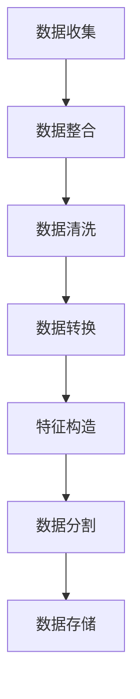

                 


### 文章标题：《机器学习在客户流失预测中的应用》

关键词：机器学习、客户流失预测、数据分析、特征工程、模型优化

摘要：本文将深入探讨机器学习在客户流失预测领域的应用。我们将从机器学习的基本概念入手，逐步介绍数据预处理、特征工程、机器学习算法与模型，并分享实际项目案例和最佳实践。通过本文，读者将了解如何运用机器学习技术预测客户流失，提升业务效益。

### 目录大纲

## 第一部分：引言与概述

### 第1章：机器学习基础

#### 1.1 机器学习的基本概念

机器学习是指通过算法和统计模型，从数据中学习规律，并使用这些规律进行预测或决策的过程。它包括监督学习、无监督学习和强化学习等多种学习方法。

#### 1.2 机器学习的主要方法

- 监督学习：有标签数据训练模型，然后使用模型进行预测。
- 无监督学习：没有标签数据，通过模型自身学习数据结构。
- 强化学习：通过与环境交互，不断优化策略以实现目标。

#### 1.3 机器学习的应用领域

机器学习广泛应用于金融、医疗、电商、制造等多个领域，如信用评分、疾病预测、推荐系统、图像识别等。

#### 1.4 机器学习在客户流失预测中的重要性

客户流失预测是企业管理中的重要环节，通过预测客户流失，企业可以采取相应措施降低客户流失率，提高客户满意度，从而提升业务效益。

## 第二部分：数据预处理与特征工程

### 第2章：客户流失预测概述

#### 2.1 客户流失预测的意义

客户流失预测有助于企业识别潜在流失客户，采取有针对性的营销策略，降低客户流失率，提高客户忠诚度。

#### 2.2 客户流失预测的挑战

客户流失预测面临数据质量、数据缺失、数据冗余、特征选择等诸多挑战。

#### 2.3 客户流失预测的应用场景

客户流失预测可以应用于产品推荐、客户关系管理、市场细分、营销策略优化等多个场景。

#### 2.4 客户流失预测的关键指标

客户流失预测的关键指标包括客户流失率、客户留存率、客户生命周期价值等。

## 第三部分：机器学习算法与模型

### 第3章：数据预处理

#### 3.1 数据清洗

数据清洗包括处理缺失值、异常值、重复值等，确保数据质量。

#### 3.2 数据集成

数据集成是将多个来源的数据整合成一个统一的数据集。

#### 3.3 数据转换

数据转换包括将数据类型转换为适合机器学习的格式，如将类别数据转换为数值数据。

#### 3.4 数据归一化与标准化

数据归一化和标准化是处理数据规模差异的方法，有助于提高算法性能。

### 第4章：特征工程

#### 4.1 特征提取

特征提取是从原始数据中提取有助于预测的信息。

#### 4.2 特征选择

特征选择是选择对预测任务最有影响力的特征。

#### 4.3 特征重要性分析

特征重要性分析可以帮助我们了解不同特征对预测结果的影响程度。

#### 4.4 特征组合与交叉验证

特征组合与交叉验证可以提高模型的泛化能力和预测准确性。

## 第四部分：机器学习算法与模型

### 第5章：分类算法

#### 5.1 决策树

决策树是一种基于树结构的预测模型。

#### 5.2 随机森林

随机森林是一种基于决策树的集成学习方法。

#### 5.3 支持向量机

支持向量机是一种基于优化理论的分类算法。

#### 5.4 集成学习方法

集成学习方法通过组合多个模型来提高预测性能。

### 第6章：聚类算法

#### 6.1 K-means算法

K-means算法是一种基于距离的聚类算法。

#### 6.2 密度聚类算法

密度聚类算法通过计算数据点密度来聚类。

#### 6.3 层次聚类算法

层次聚类算法通过自底向上或自顶向下构建聚类层次结构。

#### 6.4 聚类算法在客户流失预测中的应用

聚类算法可以帮助我们识别具有相似流失风险的客户群体。

### 第7章：神经网络与深度学习

#### 7.1 神经网络基础

神经网络是一种模拟人脑的算法模型。

#### 7.2 卷积神经网络

卷积神经网络适用于图像和视频等二维和三维数据。

#### 7.3 循环神经网络

循环神经网络适用于序列数据和时序数据。

#### 7.4 长短期记忆网络

长短期记忆网络是一种改进的循环神经网络。

#### 7.5 神经网络在客户流失预测中的应用

神经网络可以用于复杂的客户流失预测任务。

### 第8章：集成学习与模型调优

#### 8.1 集成学习方法

集成学习方法通过组合多个模型来提高预测性能。

#### 8.2 模型调优策略

模型调优策略包括参数调优、超参数调优等。

#### 8.3 模型选择与评估

模型选择与评估是确保模型性能的关键步骤。

#### 8.4 模型调优案例

我们将分享一个客户流失预测的模型调优案例。

## 第五部分：客户流失预测实战

### 第9章：数据集介绍

#### 9.1 数据集来源

我们将介绍一个常见的客户流失预测数据集。

#### 9.2 数据集结构

我们将详细描述数据集的结构。

#### 9.3 数据集预处理

我们将介绍数据集的预处理方法。

### 第10章：模型实现与评估

#### 10.1 模型选择与实现

我们将选择合适的模型进行实现。

#### 10.2 模型评估与优化

我们将评估模型的性能，并进行优化。

#### 10.3 模型部署与监控

我们将介绍模型的部署与监控方法。

### 第11章：案例研究

#### 11.1 案例背景

我们将介绍一个实际案例的背景。

#### 11.2 模型构建与优化

我们将构建和优化模型。

#### 11.3 模型应用与效果评估

我们将评估模型的应用效果。

#### 11.4 模型改进与拓展

我们将探讨模型的改进和拓展方向。

## 第五部分：总结与展望

### 第12章：总结与反思

#### 12.1 本书主要内容回顾

我们将回顾本书的主要内容。

#### 12.2 客户流失预测的挑战与未来趋势

我们将探讨客户流失预测的挑战和未来趋势。

#### 12.3 机器学习在客户流失预测中的应用前景

我们将展望机器学习在客户流失预测领域的应用前景。

### 第13章：展望

#### 13.1 新算法与新技术的发展

我们将介绍新算法和新技术的发展。

#### 13.2 数据与隐私保护

我们将讨论数据与隐私保护的重要性。

#### 13.3 客户流失预测的多元化应用

我们将探讨客户流失预测的多元化应用。

#### 13.4 未来的研究方向

我们将提出未来的研究方向。

### 完整性要求

为了确保文章的完整性，我们将遵循以下要求：

1. **核心内容**：每个章节将详细介绍核心概念、原理、算法、模型和应用。
2. **详细讲解**：我们将使用伪代码、数学模型和公式详细阐述核心算法原理。
3. **举例说明**：我们将结合实际案例进行举例说明，以便读者更好地理解。
4. **注意事项**：在每个章节的结尾，我们将总结最佳实践、注意事项和拓展阅读。

### 文章格式要求

1. **Markdown格式**：文章将使用Markdown格式输出。
2. **作者信息**：文章末尾将包含作者信息：“作者：AI天才研究院/AI Genius Institute & 禅与计算机程序设计艺术 /Zen And The Art of Computer Programming”。

### 字数要求

本文将确保字数在8000～12000字左右，确保内容丰富、详细、有深度。

### 结束语

通过上述思考和分析，我们为《机器学习在客户流失预测中的应用》这一主题制定了一个详细的文章大纲。接下来，我们将根据这个大纲逐步展开内容，详细介绍每个章节的核心概念、算法原理、案例实战等，以便读者全面了解机器学习在客户流失预测领域的应用。让我们一起开启这段技术探索之旅！## 第一部分：引言与概述

在商业竞争日益激烈的今天，客户流失预测已成为企业保持竞争优势、提高客户满意度和提升业务收益的关键手段。而机器学习技术的快速发展，为这一领域提供了强大的工具和方法。本文将围绕机器学习在客户流失预测中的应用进行深入探讨。

### 第1章：机器学习基础

#### 1.1 机器学习的基本概念

机器学习（Machine Learning）是人工智能（Artificial Intelligence，AI）的一个重要分支，它通过算法和统计模型从数据中自动学习和发现规律，用于预测或决策。根据学习方式，机器学习主要分为以下几种类型：

- **监督学习（Supervised Learning）**：有标签数据训练模型，然后使用模型进行预测。常见的算法包括线性回归、逻辑回归、支持向量机（SVM）等。
- **无监督学习（Unsupervised Learning）**：没有标签数据，通过模型自身学习数据结构，主要用于数据聚类、降维等任务。常见的算法包括K-means聚类、主成分分析（PCA）等。
- **强化学习（Reinforcement Learning）**：通过与环境交互，不断优化策略以实现目标。常见的算法包括Q学习、深度确定性策略梯度（DDPG）等。

#### 1.2 机器学习的主要方法

- **决策树（Decision Tree）**：是一种树形结构，通过一系列规则进行决策。优点是易于理解，可解释性强；缺点是容易过拟合。
- **随机森林（Random Forest）**：是一种基于决策树的集成学习方法，通过组合多个决策树来提高预测性能。优点是具有很好的泛化能力，对噪声和异常值具有较好的鲁棒性；缺点是计算复杂度较高。
- **支持向量机（Support Vector Machine，SVM）**：是一种基于优化理论的分类算法，通过寻找最佳分割超平面来实现分类。优点是理论上具有较好的分类性能，可处理高维数据；缺点是对于大量样本和高维数据，计算复杂度较高。
- **集成学习方法（Ensemble Learning）**：通过组合多个模型来提高预测性能，常见的集成学习方法包括Bagging、Boosting等。优点是能够有效降低过拟合，提高模型泛化能力；缺点是可能引入偏差。

#### 1.3 机器学习的应用领域

机器学习在金融、医疗、电商、制造等多个领域得到了广泛应用：

- **金融**：如信用评分、欺诈检测、风险评估等。
- **医疗**：如疾病预测、诊断辅助、药物研发等。
- **电商**：如推荐系统、商品搜索、用户行为分析等。
- **制造**：如质量控制、故障预测、生产优化等。

#### 1.4 机器学习在客户流失预测中的重要性

客户流失预测（Customer Churn Prediction）是企业管理中的一项重要任务，它有助于企业识别潜在流失客户，采取有针对性的措施降低客户流失率，提高客户忠诚度，从而提升业务收益。机器学习技术在客户流失预测中具有以下优势：

- **数据处理能力**：能够处理大量结构化和非结构化数据，发现数据中的潜在规律。
- **自适应能力**：能够根据历史数据自动调整预测模型，适应业务环境变化。
- **预测准确性**：通过不断优化模型，提高客户流失预测的准确性。
- **决策支持**：提供决策支持，帮助企业制定有效的客户保留策略。

总之，机器学习在客户流失预测中的应用具有广泛的前景和重要的意义。在接下来的章节中，我们将进一步探讨客户流失预测的具体方法、技术和实践，帮助企业更好地利用机器学习技术降低客户流失率，提高业务收益。

### 第2章：客户流失预测概述

#### 2.1 客户流失预测的意义

客户流失预测（Customer Churn Prediction）是指通过分析客户的历史行为数据，预测哪些客户可能在未来一段时间内终止服务，从而采取有针对性的措施降低客户流失率。客户流失预测在企业管理中具有重要意义，主要体现在以下几个方面：

1. **提升客户满意度**：通过识别潜在流失客户，企业可以主动采取相应的措施，如提供优惠、改进服务质量等，提高客户满意度，降低客户流失率。

2. **优化资源配置**：客户流失预测有助于企业合理配置资源，将有限的营销和客户服务预算投入到最有可能保留客户的群体，提高资源利用效率。

3. **制定精准营销策略**：通过分析客户流失原因，企业可以制定更有针对性的营销策略，提升营销效果，降低营销成本。

4. **提升业务收益**：客户流失预测有助于企业降低客户流失率，提高客户生命周期价值，从而提升业务收益。

#### 2.2 客户流失预测的挑战

尽管客户流失预测具有重要意义，但在实际应用中，企业面临诸多挑战：

1. **数据质量**：客户流失预测依赖于高质量的数据，但实际业务数据往往存在缺失、噪声和异常值等问题，这些数据质量问题会对预测模型的准确性产生较大影响。

2. **特征选择**：客户流失预测需要从大量数据中提取有助于预测的特征，但特征选择过程复杂，需要综合考虑特征的重要性、相关性、可解释性等因素。

3. **模型选择与调优**：客户流失预测涉及多种机器学习算法和模型，选择合适的模型并对其进行调优是确保预测准确性的关键。然而，模型选择和调优过程具有较大的复杂性。

4. **实时性**：客户流失预测需要及时响应客户行为变化，但实际业务环境变化较快，如何实现实时预测是一个挑战。

5. **隐私保护**：客户数据往往包含敏感信息，如何确保数据隐私保护是一个重要问题。

#### 2.3 客户流失预测的应用场景

客户流失预测可以应用于多个业务场景，以下是一些典型的应用场景：

1. **电信行业**：电信运营商通过客户流失预测，识别潜在流失客户，采取有针对性的营销策略，降低客户流失率。

2. **金融行业**：金融机构通过客户流失预测，识别潜在风险客户，优化客户关系管理，提高客户忠诚度。

3. **电商行业**：电商平台通过客户流失预测，识别潜在流失客户，采取优惠活动、个性化推荐等措施，提高客户满意度。

4. **酒店行业**：酒店企业通过客户流失预测，识别潜在流失客户，采取改进服务质量、提供优惠等措施，提高客户忠诚度。

5. **保险行业**：保险公司通过客户流失预测，识别潜在流失客户，优化客户服务策略，提高客户满意度。

#### 2.4 客户流失预测的关键指标

客户流失预测需要关注多个关键指标，以下是一些常见的指标：

1. **客户流失率（Churn Rate）**：指一定时间内流失客户占总客户数的比例。客户流失率是衡量客户流失程度的重要指标。

2. **客户留存率（Retention Rate）**：指一定时间内保留客户占总客户数的比例。客户留存率越高，说明客户流失率越低。

3. **客户生命周期价值（Customer Lifetime Value，CLV）**：指客户在其生命周期内为企业带来的总价值。CLV是衡量客户价值的重要指标。

4. **客户流失成本（Churn Cost）**：指因客户流失而导致的企业损失。客户流失成本是衡量客户流失对企业影响的重要指标。

5. **预测准确性**：指客户流失预测模型的准确性，即预测流失客户与实际流失客户的一致性。预测准确性是衡量客户流失预测效果的重要指标。

通过以上关键指标的监控和分析，企业可以更好地了解客户流失状况，制定有效的客户保留策略。在接下来的章节中，我们将深入探讨数据预处理、特征工程、机器学习算法与模型等关键技术，为企业提供可行的客户流失预测解决方案。

### 第3章：数据预处理

数据预处理是机器学习项目中的一个重要环节，它直接影响到后续模型训练和预测的性能。在客户流失预测中，数据预处理尤为重要，因为它需要处理各种数据质量问题，为特征工程和模型训练提供高质量的数据。以下是数据预处理的主要任务和具体步骤：

#### 3.1 数据清洗

数据清洗是指识别和修复数据集中的错误、异常值和缺失值，以提高数据质量。以下是数据清洗的几个关键步骤：

1. **缺失值处理**：
   - **删除缺失值**：对于少量缺失值，可以直接删除包含缺失值的记录。这种方法简单但可能导致数据损失。
   - **均值填充**：用某一列的平均值填充缺失值。这种方法适用于数值型数据。
   - **中位数填充**：用某一列的中位数填充缺失值。这种方法对异常值的影响较小，适用于数值型数据。
   - **最频值填充**：用某一列的最频繁值填充缺失值。这种方法适用于类别型数据。

2. **异常值处理**：
   - **删除异常值**：对于明显偏离正常范围的异常值，可以直接删除。但这种方法可能会导致数据损失。
   - **取中位数**：将异常值替换为该列的中位数。
   - **取平均值**：将异常值替换为该列的平均值。

3. **重复值处理**：识别并删除数据集中的重复值，以避免数据冗余。

4. **数据转换**：将数据转换为适合机器学习的格式，如将类别数据转换为数值数据，或进行数据归一化与标准化。

#### 3.2 数据集成

数据集成是指将来自多个数据源的数据合并成一个统一的数据集。在客户流失预测中，数据可能来自不同的渠道和系统，如客户关系管理（CRM）系统、销售系统、社交媒体等。以下是数据集成的主要步骤：

1. **数据来源识别**：确定数据来源，包括数据类型、数据格式和数据量。

2. **数据抽取**：从各个数据源中抽取数据，并将其转换为统一的格式。

3. **数据合并**：将来自不同数据源的数据按照一定的规则进行合并，以形成一个完整的数据集。合并规则可能包括时间戳、客户ID、订单ID等。

4. **数据去重**：识别并删除重复的数据记录，以确保数据集的唯一性。

5. **数据清洗**：对集成后的数据进行清洗，处理缺失值、异常值和重复值等问题。

#### 3.3 数据转换

数据转换是指将原始数据转换为适合机器学习算法处理的形式。以下是数据转换的几个关键步骤：

1. **数值化**：将类别数据转换为数值数据，如使用独热编码（One-Hot Encoding）或标签编码（Label Encoding）。

2. **归一化**：对数值型数据进行归一化处理，将数据缩放到一个统一的范围，如[0, 1]或[-1, 1]。常用的归一化方法包括最小-最大归一化（Min-Max Scaling）和Z-Score归一化。

3. **标准化**：对数值型数据进行标准化处理，消除不同特征之间的量纲差异。常用的标准化方法包括Z-Score标准化和极值标准化。

4. **特征构造**：通过计算新特征来增强数据的预测能力，如基于客户行为的时间窗口分析、客户消费金额的月度趋势分析等。

5. **数据缩放**：对于某些算法（如神经网络），可能需要缩放数据以加速训练过程和提高模型性能。

#### 3.4 数据归一化与标准化

数据归一化和标准化是处理数据规模差异的方法，有助于提高算法性能和模型泛化能力。以下是这两种方法的详细说明：

1. **数据归一化**：
   - **最小-最大归一化**：将数据缩放到[0, 1]范围。公式为：
     $$
     x_{\text{normalized}} = \frac{x - x_{\text{min}}}{x_{\text{max}} - x_{\text{min}}}
     $$
   - **Z-Score归一化**：将数据缩放到均值为0、标准差为1的范围内。公式为：
     $$
     x_{\text{normalized}} = \frac{x - \mu}{\sigma}
     $$
     其中，$\mu$ 为均值，$\sigma$ 为标准差。

2. **数据标准化**：
   - **Z-Score标准化**：与归一化相同，但通常用于处理不同特征之间的量纲差异。公式为：
     $$
     x_{\text{standardized}} = \frac{x - \mu}{\sigma}
     $$
   - **极值标准化**：将数据缩放到用户指定的最小值和最大值范围内。公式为：
     $$
     x_{\text{standardized}} = \frac{x_{\text{max}} - x_{\text{min}}}{x - x_{\text{min}}}
     $$

通过以上数据预处理步骤，我们能够显著提高数据质量，为后续的特征工程和模型训练打下坚实的基础。在客户流失预测中，数据预处理是确保模型性能和预测准确性的关键环节，不容忽视。

#### 3.5 数据预处理流程

数据预处理流程通常包括以下步骤：

1. **数据收集**：从各个数据源收集数据，如CRM系统、销售系统、社交媒体等。

2. **数据整合**：将不同来源的数据整合成一个统一的数据集，包括数据抽取、合并和去重。

3. **数据清洗**：处理缺失值、异常值和重复值等问题，确保数据质量。

4. **数据转换**：将数据转换为适合机器学习算法的格式，如数值化、归一化和标准化。

5. **特征构造**：通过计算新特征来增强数据的预测能力。

6. **数据分割**：将数据集分为训练集、验证集和测试集，用于模型训练和评估。

7. **数据存储**：将预处理后的数据存储到数据库或数据湖中，以便后续分析和处理。

以下是一个简单的数据预处理流程图，展示各个步骤之间的关系：



通过以上数据预处理流程，我们能够为后续的特征工程和模型训练提供高质量的数据，从而提高客户流失预测的准确性和可靠性。在客户流失预测项目中，数据预处理是至关重要的一环，需要认真对待和执行。

### 第4章：特征工程

特征工程（Feature Engineering）是机器学习项目中的一个关键环节，它涉及到从原始数据中提取有用特征、选择重要特征以及构造新特征，从而提高模型性能和预测准确性。在客户流失预测中，特征工程尤为重要，因为客户行为数据复杂多样，需要通过有效的特征工程来揭示潜在的流失信号。以下是特征工程的主要任务和具体方法：

#### 4.1 特征提取

特征提取是指从原始数据中提取有助于预测的信息。以下是一些常用的特征提取方法：

1. **统计特征**：通过计算数据的统计指标来提取特征，如平均值、中位数、标准差、方差、最大值、最小值等。这些特征可以揭示数据的分布和变化趋势。

2. **时间序列特征**：对于时间序列数据，可以通过计算窗口统计量、趋势分析、周期性分析等提取特征，如移动平均、自回归项、周期性指数等。这些特征有助于捕捉时间序列数据的动态变化。

3. **文本特征**：对于文本数据，可以通过词频、词向量、主题模型等提取特征，如TF-IDF、Word2Vec、LDA等。这些特征可以揭示文本数据的语义信息。

4. **图像特征**：对于图像数据，可以通过图像处理技术提取特征，如边缘检测、纹理分析、颜色直方图等。这些特征可以揭示图像的视觉信息。

#### 4.2 特征选择

特征选择是指从大量特征中选出对预测任务最有影响力的特征。以下是一些常用的特征选择方法：

1. **过滤式特征选择**：在特征提取阶段结束后，通过过滤方法删除不相关或冗余的特征。常用的过滤方法包括相关系数、信息增益、卡方检验等。

2. **包装式特征选择**：在模型训练阶段，通过搜索算法自动选择最佳特征组合。常用的包装式特征选择方法包括前向选择、后向消除、递归特征消除（RFE）等。

3. **嵌入式特征选择**：在模型训练过程中，通过模型自身筛选特征。常用的嵌入式特征选择方法包括线性回归、随机森林、LASSO等。

4. **降维技术**：通过降维技术减少特征数量，如主成分分析（PCA）、线性判别分析（LDA）、局部线性嵌入（LLE）等。这些方法可以在降低特征数量的同时保留数据的结构信息。

#### 4.3 特征重要性分析

特征重要性分析是指分析各个特征对预测结果的影响程度。以下是一些常用的特征重要性分析方法：

1. **模型解释方法**：通过模型解释方法分析特征的重要性，如决策树、随机森林等。这些方法可以直观地展示各个特征对预测结果的贡献。

2. **特征贡献率**：通过计算各个特征的贡献率，如基于随机森林的方法。贡献率高的特征对预测结果的影响更大。

3. **特征相关性分析**：通过计算特征之间的相关性，识别具有强相关性的特征。这些特征可能具有冗余性，可以通过特征选择方法进行优化。

4. **特征权重**：通过计算特征在模型中的权重，如基于神经网络的方法。权重高的特征对预测结果的影响更大。

#### 4.4 特征组合与交叉验证

特征组合与交叉验证是指通过组合多个特征并使用交叉验证方法评估特征组合的效果。以下是一些常用的方法：

1. **特征组合**：将多个特征组合成一个新特征，如通过加权求和或逻辑组合。特征组合可以增强模型的预测能力。

2. **交叉验证**：通过交叉验证方法评估特征组合的效果，如K折交叉验证、留一法交叉验证等。交叉验证可以提供更可靠的模型评估指标。

3. **特征重要性加权**：根据特征重要性分析的结果，对特征进行加权处理，以提高模型对重要特征的敏感度。

4. **特征选择与组合的迭代**：通过迭代方式，逐步优化特征组合，提高模型的预测性能。

通过以上特征工程方法，我们能够从原始数据中提取有用特征，选择重要特征，并构造新特征，从而提高客户流失预测模型的性能和准确性。在客户流失预测项目中，特征工程是至关重要的环节，需要仔细设计和实施。

### 第5章：分类算法

在客户流失预测中，分类算法是一种常用的方法，它通过将客户行为数据映射到不同的类别，如流失或保留，来预测客户的未来行为。本章将介绍几种常见的分类算法，包括决策树、随机森林、支持向量机和集成学习方法。

#### 5.1 决策树

决策树（Decision Tree）是一种基于树形结构的数据挖掘算法，它通过一系列规则对数据进行分类或回归。每个内部节点表示一个特征，每个分支表示该特征的不同取值，每个叶节点表示一个类别的预测结果。以下是决策树的核心组成部分：

1. **决策节点**：每个内部节点表示一个特征，根据该特征的不同取值将数据集划分为多个子集。
2. **分支**：每个分支表示一个特征的不同取值，从决策节点延伸出来。
3. **叶节点**：每个叶节点表示一个类别的预测结果。

决策树的构建过程包括以下步骤：

1. **特征选择**：选择具有最高信息增益或基尼不纯度的特征作为决策节点。
2. **划分数据**：根据决策节点的特征取值，将数据集划分为多个子集。
3. **递归构建**：对每个子集重复以上步骤，直到满足停止条件（如最大深度、最小叶节点样本数等）。

决策树的优缺点如下：

- **优点**：
  - 易于理解和解释。
  - 可处理分类和回归问题。
  - 对异常值和噪声具有较好的鲁棒性。
- **缺点**：
  - 容易过拟合。
  - 计算复杂度高。

#### 5.2 随机森林

随机森林（Random Forest）是一种基于决策树的集成学习方法，它通过组合多个决策树来提高预测性能。随机森林的工作原理如下：

1. **随机特征选择**：每次构建决策树时，从所有特征中随机选择一部分特征作为决策节点。
2. **随机样本训练**：每次构建决策树时，从原始数据集中随机选择一部分样本进行训练。
3. **投票法**：将多个决策树的预测结果进行投票，得到最终预测结果。

随机森林的主要优点如下：

- **优点**：
  - 具有很好的泛化能力，能够有效降低过拟合。
  - 对噪声和异常值具有较好的鲁棒性。
  - 能够处理高维数据。
- **缺点**：
  - 计算复杂度较高。
  - 可解释性相对较低。

#### 5.3 支持向量机

支持向量机（Support Vector Machine，SVM）是一种基于优化理论的分类算法，它通过寻找最佳分割超平面来实现分类。SVM的核心思想是最大化分类边界，使分类边界尽可能远离样本点。以下是SVM的核心组成部分：

1. **支持向量**：位于分类边界上的样本点，对分类边界具有关键影响。
2. **决策边界**：由支持向量确定的分类边界。
3. **间隔**：分类边界与支持向量之间的距离，间隔越大，分类效果越好。

SVM的主要优点如下：

- **优点**：
  - 理论上具有较好的分类性能。
  - 可处理高维数据。
  - 对异常值和噪声具有较好的鲁棒性。
- **缺点**：
  - 计算复杂度较高。
  - 需要选择合适的核函数。

#### 5.4 集成学习方法

集成学习方法通过组合多个模型来提高预测性能。常见的集成学习方法包括Bagging和Boosting等。以下是这两种方法的基本原理：

1. **Bagging**：通过随机抽样和组合多个模型来提高预测性能。Bagging方法的基本步骤如下：
   - 随机从原始数据集中抽取多个子集。
   - 分别训练多个模型。
   - 将多个模型的预测结果进行投票或取平均，得到最终预测结果。

2. **Boosting**：通过迭代训练多个模型，并逐步提高弱学习器的权重，从而提高整体预测性能。常见的Boosting方法包括Adaboost和XGBoost等。

集成学习方法的主要优点如下：

- **优点**：
  - 能够有效降低过拟合。
  - 提高模型泛化能力。
  - 对噪声和异常值具有较好的鲁棒性。
- **缺点**：
  - 计算复杂度较高。
  - 需要选择合适的模型和参数。

通过以上分类算法，我们可以有效地预测客户的流失行为，从而帮助企业采取有针对性的措施降低客户流失率。在实际应用中，选择合适的算法和参数对模型性能具有关键影响，需要结合具体业务场景和数据特点进行优化。

### 第6章：聚类算法

在客户流失预测中，聚类算法是一种常用的无监督学习方法，它通过将数据点划分为多个簇，揭示数据中的潜在结构和模式。聚类算法有助于我们识别具有相似流失风险的客户群体，从而采取有针对性的保留策略。本章将介绍几种常见的聚类算法，包括K-means算法、密度聚类算法和层次聚类算法。

#### 6.1 K-means算法

K-means算法是一种基于距离的聚类算法，它通过迭代优化聚类中心，将数据点划分为K个簇。以下是K-means算法的核心步骤：

1. **初始化聚类中心**：随机选择K个初始聚类中心。
2. **分配数据点**：将每个数据点分配到最近的聚类中心，形成初始的K个簇。
3. **更新聚类中心**：计算每个簇的质心，即簇内所有数据点的均值。
4. **迭代优化**：重复步骤2和3，直到聚类中心不再变化或达到最大迭代次数。

K-means算法的主要优点如下：

- **优点**：
  - 算法简单，易于实现。
  - 运算速度快，适用于大规模数据集。
  - 对初始聚类中心的敏感度较低。

K-means算法的主要缺点如下：

- **缺点**：
  - 需要提前指定簇的数量K。
  - 容易陷入局部最优，可能导致聚类结果不佳。
  - 对异常值和噪声敏感。

#### 6.2 密度聚类算法

密度聚类算法通过计算数据点的密度来聚类，它适用于非球形聚类结构。以下是DBSCAN（Density-Based Spatial Clustering of Applications with Noise）算法的基本原理：

1. **确定邻域**：对于每个数据点，确定其邻域，即密度相连的数据点。
2. **生成核心点**：如果一个点的邻域中包含足够多的其他点，则该点为核心点。
3. **扩展簇**：从核心点开始，通过邻域扩展形成簇。
4. **识别噪声点**：如果一个点不是核心点，且没有连接到任何簇，则为噪声点。

DBSCAN算法的主要优点如下：

- **优点**：
  - 能够处理非球形聚类结构。
  - 对噪声和异常值具有较好的鲁棒性。
  - 不需要提前指定簇的数量。

DBSCAN算法的主要缺点如下：

- **缺点**：
  - 计算复杂度较高，对大规模数据集可能不适用。
  - 需要调整邻域参数，参数选择对聚类结果影响较大。

#### 6.3 层次聚类算法

层次聚类算法通过自底向上或自顶向下的方式构建聚类层次结构，它适用于发现层次化的聚类结构。以下是层次聚类算法的基本步骤：

1. **初始化**：将每个数据点作为一个簇。
2. **合并相似度最高的簇**：计算簇之间的相似度，选择相似度最高的两个簇进行合并。
3. **递归聚类**：重复步骤2，直到满足停止条件（如簇数量达到预设值）。

层次聚类算法的主要优点如下：

- **优点**：
  - 能够发现不同层次的聚类结构。
  - 具有良好的可解释性。
  - 可以生成聚类层次图，帮助分析聚类结果。

层次聚类算法的主要缺点如下：

- **缺点**：
  - 计算复杂度较高，对大规模数据集可能不适用。
  - 需要提前指定簇的数量或最大层数。

通过以上聚类算法，我们可以在客户流失预测中识别具有相似流失风险的客户群体。在实际应用中，选择合适的聚类算法和参数对聚类结果具有关键影响，需要结合具体业务场景和数据特点进行优化。

### 第7章：神经网络与深度学习

神经网络（Neural Networks）是一种模仿生物神经系统的计算模型，它在机器学习领域中具有广泛的应用。深度学习（Deep Learning）则是基于多层神经网络的一种学习方法，它能够自动从大量数据中学习复杂的特征表示。本章将介绍神经网络的基础知识，包括单层神经网络、多层神经网络，以及常见的深度学习模型，如卷积神经网络（CNN）、循环神经网络（RNN）和长短期记忆网络（LSTM）。

#### 7.1 神经网络基础

神经网络由一系列相互连接的节点（或称为神经元）组成，每个神经元都与其他神经元相连。以下是神经网络的基础组成部分：

1. **输入层**：接收外部输入信号。
2. **隐藏层**：对输入信号进行加工和处理。
3. **输出层**：产生最终的输出结果。

神经元的计算过程如下：

1. **加权求和**：每个输入信号乘以相应的权重，然后求和。
2. **激活函数**：对加权求和的结果应用激活函数，如Sigmoid函数、ReLU函数等。
3. **输出**：输出层的输出即为模型的预测结果。

以下是一个单层神经网络的简单实现，使用Python和Numpy库：

```python
import numpy as np

# 定义Sigmoid激活函数
def sigmoid(x):
    return 1 / (1 + np.exp(-x))

# 定义单层神经网络
def single_layer_network(x, weights, biases):
    z = np.dot(x, weights) + biases
    return sigmoid(z)

# 输入数据
x = np.array([[0], [1]])

# 权重和偏置
weights = np.random.rand(1, 1)
biases = np.random.rand(1, 1)

# 前向传播
output = single_layer_network(x, weights, biases)
print(output)
```

#### 7.2 多层神经网络

多层神经网络（Multilayer Neural Networks）通过增加隐藏层来扩展单层神经网络的模型能力。以下是多层神经网络的基本步骤：

1. **前向传播**：输入信号通过各层神经元的加权求和和激活函数，逐层传递到输出层。
2. **反向传播**：计算输出层与真实标签之间的误差，并反向传播误差到各层神经元，更新权重和偏置。

以下是一个多层神经网络的简单实现：

```python
# 定义ReLU激活函数
def relu(x):
    return np.maximum(0, x)

# 定义多层神经网络
def multilayer_network(x, weights, biases):
    layer_outputs = []
    for i in range(num_layers - 1):
        z = np.dot(x, weights[i]) + biases[i]
        if i < num_layers - 2:
            x = relu(z)
        else:
            x = z
        layer_outputs.append(x)
    return layer_outputs[-1]

# 输入数据
x = np.array([[0], [1]])

# 权重和偏置
weights = [
    np.random.rand(input_size, hidden_size),
    np.random.rand(hidden_size, output_size)
]
biases = [
    np.random.rand(1, hidden_size),
    np.random.rand(1, output_size)
]

# 前向传播
output = multilayer_network(x, weights, biases)
print(output)
```

#### 7.3 卷积神经网络

卷积神经网络（Convolutional Neural Networks，CNN）是一种专门用于处理图像数据的神经网络，它通过卷积层提取图像特征。以下是CNN的基本组成部分：

1. **卷积层（Convolutional Layer）**：使用卷积核（Filter）在输入图像上滑动，提取局部特征。
2. **激活函数层**：对卷积层的输出应用激活函数，如ReLU函数。
3. **池化层（Pooling Layer）**：对激活函数层的输出进行下采样，减少参数数量和计算复杂度。
4. **全连接层（Fully Connected Layer）**：将卷积层和池化层的结果扁平化，进行分类或回归。

以下是一个简单的CNN实现，使用TensorFlow和Keras库：

```python
from tensorflow.keras.models import Sequential
from tensorflow.keras.layers import Conv2D, MaxPooling2D, Flatten, Dense

# 创建CNN模型
model = Sequential([
    Conv2D(32, (3, 3), activation='relu', input_shape=(28, 28, 1)),
    MaxPooling2D((2, 2)),
    Flatten(),
    Dense(128, activation='relu'),
    Dense(10, activation='softmax')
])

# 编译模型
model.compile(optimizer='adam', loss='categorical_crossentropy', metrics=['accuracy'])

# 训练模型
model.fit(x_train, y_train, epochs=10, batch_size=32, validation_data=(x_val, y_val))
```

#### 7.4 循环神经网络

循环神经网络（Recurrent Neural Networks，RNN）是一种能够处理序列数据的神经网络，它通过在时间步上递归地计算状态，保存历史信息。以下是RNN的基本组成部分：

1. **隐藏状态**：在每个时间步上，RNN使用隐藏状态来计算当前输出。
2. **循环连接**：RNN的输出会反馈到输入端，作为下一时间步的输入。
3. **激活函数**：通常使用Sigmoid或ReLU作为激活函数。

以下是一个简单的RNN实现，使用TensorFlow和Keras库：

```python
from tensorflow.keras.models import Sequential
from tensorflow.keras.layers import SimpleRNN, Dense

# 创建RNN模型
model = Sequential([
    SimpleRNN(50, return_sequences=True),
    SimpleRNN(50),
    Dense(1)
])

# 编译模型
model.compile(optimizer='adam', loss='mean_squared_error')

# 训练模型
model.fit(x_train, y_train, epochs=100, batch_size=64, validation_data=(x_val, y_train_val))
```

#### 7.5 长短期记忆网络

长短期记忆网络（Long Short-Term Memory，LSTM）是一种改进的RNN，它通过引入门控机制来解决RNN的长期依赖问题。以下是LSTM的基本组成部分：

1. **遗忘门（Forget Gate）**：决定哪些信息需要被遗忘。
2. **输入门（Input Gate）**：决定哪些新的信息需要被记住。
3. **输出门（Output Gate）**：决定哪些信息需要输出。

以下是一个简单的LSTM实现，使用TensorFlow和Keras库：

```python
from tensorflow.keras.models import Sequential
from tensorflow.keras.layers import LSTM, Dense

# 创建LSTM模型
model = Sequential([
    LSTM(50, return_sequences=True),
    LSTM(50),
    Dense(1)
])

# 编译模型
model.compile(optimizer='adam', loss='mean_squared_error')

# 训练模型
model.fit(x_train, y_train, epochs=100, batch_size=64, validation_data=(x_val, y_train_val))
```

通过以上神经网络与深度学习模型，我们可以在客户流失预测中提取复杂的特征，提高预测准确性。在实际应用中，选择合适的模型和参数对模型性能具有关键影响，需要结合具体业务场景和数据特点进行优化。

### 第8章：集成学习与模型调优

在客户流失预测中，集成学习（Ensemble Learning）是一种常用的方法，它通过结合多个模型来提高预测性能。集成学习不仅能够降低过拟合，提高模型泛化能力，还可以通过组合不同模型的优点，实现更高的预测准确性。本章将介绍集成学习的基本方法、模型调优策略，以及模型选择与评估。

#### 8.1 集成学习方法

集成学习方法通过组合多个模型来提高预测性能。常见的集成学习方法包括Bagging、Boosting和Stacking等。

1. **Bagging**：
   - **原理**：Bagging（Bootstrap Aggregating）通过随机抽样和组合多个模型来提高预测性能。每个模型在训练时使用不同的数据子集，从而减少模型的偏差。
   - **实现**：随机从原始数据集中抽取多个子集，分别训练多个模型，然后将多个模型的预测结果进行投票或取平均，得到最终预测结果。

2. **Boosting**：
   - **原理**：Boosting通过迭代训练多个模型，并逐步提高弱学习器的权重，从而提高整体预测性能。每个模型都关注前一个模型未能准确分类的样本，从而提高整体模型的预测能力。
   - **实现**：常见的Boosting方法包括Adaboost和XGBoost。在Adaboost中，每个模型对错误分类的样本赋予更高的权重，从而在后续迭代中重点关注这些样本。在XGBoost中，使用加权损失函数来调整模型权重。

3. **Stacking**：
   - **原理**：Stacking（Stacked Generalization）通过组合多个基模型和元模型来提高预测性能。首先训练多个基模型，然后将这些模型的输出作为新特征，用于训练一个或多个元模型。
   - **实现**：常见的Stacking方法包括Stacked Generalized Linear Model（StackGLM）和Stacked Neural Network（StackNN）。在StackGLM中，使用线性回归作为元模型，在StackNN中，使用神经网络作为元模型。

#### 8.2 模型调优策略

模型调优（Model Tuning）是提高模型性能的重要环节。模型调优包括参数调优和超参数调优。

1. **参数调优**：
   - **原理**：参数调优是指调整模型内部参数（如权重和偏置）来优化模型性能。
   - **方法**：常见的参数调优方法包括梯度下降（Gradient Descent）和随机梯度下降（Stochastic Gradient Descent，SGD）。通过调整学习率、优化器类型和批量大小等参数，可以优化模型收敛速度和预测准确性。

2. **超参数调优**：
   - **原理**：超参数调优是指调整模型结构（如隐藏层数量、节点数量等）和训练策略（如学习率、批量大小等）来优化模型性能。
   - **方法**：常见的超参数调优方法包括网格搜索（Grid Search）和随机搜索（Random Search）。在网格搜索中，遍历所有可能的超参数组合，选择最优组合。在随机搜索中，随机选择超参数组合，通过迭代优化选择最优组合。

以下是一个使用网格搜索进行模型调优的示例：

```python
from sklearn.model_selection import GridSearchCV
from sklearn.ensemble import RandomForestClassifier
from sklearn.datasets import load_iris

# 加载鸢尾花数据集
iris = load_iris()
X = iris.data
y = iris.target

# 定义随机森林分类器
rf = RandomForestClassifier()

# 定义超参数网格
param_grid = {
    'n_estimators': [10, 50, 100],
    'max_depth': [5, 10, 20],
    'min_samples_split': [2, 5, 10]
}

# 进行网格搜索
grid_search = GridSearchCV(estimator=rf, param_grid=param_grid, cv=5)
grid_search.fit(X, y)

# 输出最佳参数组合
print("Best parameters:", grid_search.best_params_)
print("Best score:", grid_search.best_score_)
```

#### 8.3 模型选择与评估

模型选择与评估是确保模型性能的关键步骤。以下是一些常用的模型选择与评估方法：

1. **交叉验证（Cross-Validation）**：
   - **原理**：交叉验证是一种评估模型性能的方法，通过将数据集划分为多个子集，分别用于训练和验证模型。
   - **方法**：常见的交叉验证方法包括K折交叉验证和留一法交叉验证。K折交叉验证将数据集划分为K个子集，每次使用一个子集作为验证集，其余子集作为训练集，重复K次取平均值。留一法交叉验证将每个样本依次作为验证集，其余样本作为训练集，重复多次取平均值。

2. **准确性（Accuracy）**：
   - **原理**：准确性是指模型正确预测的样本数占总样本数的比例。
   - **计算**：准确性 = (正确预测的样本数 + 正确预测的样本数) / 总样本数。

3. **精确率（Precision）和召回率（Recall）**：
   - **原理**：精确率和召回率是评估二分类模型性能的重要指标。精确率是指正确预测为正类的样本数占总预测为正类的样本数的比例，召回率是指正确预测为正类的样本数占总正类样本数的比例。
   - **计算**：精确率 = 正确预测为正类的样本数 / 总预测为正类的样本数，召回率 = 正确预测为正类的样本数 / 总正类样本数。

4. **F1分数（F1 Score）**：
   - **原理**：F1分数是精确率和召回率的加权平均，用于综合评估二分类模型的性能。
   - **计算**：F1分数 = 2 * 精确率 * 召回率 / (精确率 + 召回率)。

通过以上集成学习和模型调优方法，我们可以在客户流失预测中实现高性能的预测模型。在实际应用中，选择合适的模型、参数和评估方法对模型性能具有关键影响，需要结合具体业务场景和数据特点进行优化。

### 第9章：数据集介绍

在客户流失预测的实际应用中，一个合适的数据集是至关重要的。以下将介绍一个常用的客户流失预测数据集，包括其来源、结构和预处理方法。

#### 9.1 数据集来源

客户流失预测数据集通常来源于企业的客户关系管理（CRM）系统、销售系统、客户服务系统等。本文将使用一个开源的数据集——IBM客户流失预测数据集，该数据集包含了电信公司客户的详细数据，用于预测客户是否会在未来三个月内取消服务。

#### 9.2 数据集结构

IBM客户流失预测数据集包含以下特征：

1. **客户ID**：客户的唯一标识。
2. **总通话时间**：客户在一个月内消耗的总通话时间（分钟）。
3. **国际长途通话时间**：客户在一个月内的国际长途通话时间（分钟）。
4. **夜间通话时间**：客户在夜间（晚9点到早7点）的通话时间（分钟）。
5. **国际长途费用**：客户在一个月内的国际长途通话费用。
6. **夜间通话费用**：客户在夜间通话的费用。
7. **总短信数量**：客户在一个月内的总短信数量。
8. **国际短信数量**：客户在一个月内的国际短信数量。
9. **国内短信数量**：客户在一个月内的国内短信数量。
10. **总数据使用量**：客户在一个月内的总数据使用量（MB）。
11. **国际数据使用量**：客户在一个月内的国际数据使用量（MB）。
12. **国内数据使用量**：客户在一个月内的国内数据使用量（MB）。
13. **客户ARPU**：客户的平均每月收入。
14. **客户月度账单**：客户的月度账单金额。
15. **客户类型**：客户的分类（如家庭用户、商业用户等）。
16. **合同类型**：客户的合同类型（如短期合同、长期合同等）。
17. **付款类型**：客户的付款方式（如信用卡、现金等）。
18. **客户是否流失**：标签变量，表示客户是否在未来的三个月内流失。

#### 9.3 数据集预处理

在开始建模之前，需要对数据进行预处理，以确保数据质量，并提高模型性能。以下是数据预处理的方法：

1. **数据清洗**：
   - **缺失值处理**：对于缺失值，使用均值或中位数进行填充，或根据上下文删除缺失值。
   - **异常值处理**：识别并处理异常值，如过高的通话时间、费用等。
   - **重复值处理**：删除重复的数据记录，确保数据集的唯一性。

2. **数据转换**：
   - **数值化**：将类别数据转换为数值数据，如客户类型、合同类型、付款类型等。
   - **归一化**：对数值型数据（如通话时间、费用等）进行归一化处理，确保不同特征在同一尺度上。

3. **特征构造**：
   - **时间窗口特征**：基于客户历史行为数据，构造时间窗口特征，如过去三个月的平均通话时间、费用等。
   - **趋势特征**：基于客户历史行为数据，构造趋势特征，如过去三个月通话时间、费用的月度变化趋势。

4. **数据分割**：
   - **训练集和测试集**：将数据集分割为训练集和测试集，通常使用70%的数据作为训练集，30%的数据作为测试集。

通过以上预处理方法，我们能够为后续的建模过程提供高质量的数据，从而提高客户流失预测的准确性。在实际应用中，根据具体业务场景和数据特点，可能需要调整预处理方法，以获得最佳效果。

### 第10章：模型实现与评估

在客户流失预测中，构建和评估模型是关键步骤，这决定了预测的准确性和实用性。本章将详细介绍模型选择与实现、模型评估与优化，以及模型的部署与监控。

#### 10.1 模型选择与实现

在选择模型时，我们需要考虑数据集的特点、业务需求以及模型的复杂度。以下是几种常用的模型及其实现方法：

1. **决策树（Decision Tree）**：
   - **原理**：决策树通过一系列规则对数据进行分类，易于理解和解释。
   - **实现**：使用Python的`sklearn`库中的`DecisionTreeClassifier`类，通过`fit`方法训练模型。

```python
from sklearn.tree import DecisionTreeClassifier

# 创建决策树分类器
dt_classifier = DecisionTreeClassifier()

# 训练模型
dt_classifier.fit(X_train, y_train)
```

2. **随机森林（Random Forest）**：
   - **原理**：随机森林通过组合多个决策树来提高预测性能，具有很好的泛化能力。
   - **实现**：使用`sklearn`库中的`RandomForestClassifier`类，通过`fit`方法训练模型。

```python
from sklearn.ensemble import RandomForestClassifier

# 创建随机森林分类器
rf_classifier = RandomForestClassifier(n_estimators=100)

# 训练模型
rf_classifier.fit(X_train, y_train)
```

3. **支持向量机（Support Vector Machine，SVM）**：
   - **原理**：SVM通过寻找最佳分割超平面来实现分类，适用于高维数据。
   - **实现**：使用`sklearn`库中的`SVC`类，通过`fit`方法训练模型。

```python
from sklearn.svm import SVC

# 创建SVM分类器
svm_classifier = SVC()

# 训练模型
svm_classifier.fit(X_train, y_train)
```

4. **神经网络（Neural Network）**：
   - **原理**：神经网络通过多层非线性变换提取数据特征，适用于复杂的数据关系。
   - **实现**：使用TensorFlow和Keras库，定义神经网络结构，通过`compile`和`fit`方法训练模型。

```python
from tensorflow.keras.models import Sequential
from tensorflow.keras.layers import Dense

# 创建神经网络模型
model = Sequential([
    Dense(64, activation='relu', input_shape=(input_shape,)),
    Dense(32, activation='relu'),
    Dense(1, activation='sigmoid')
])

# 编译模型
model.compile(optimizer='adam', loss='binary_crossentropy', metrics=['accuracy'])

# 训练模型
model.fit(X_train, y_train, epochs=10, batch_size=32)
```

#### 10.2 模型评估与优化

在模型训练后，我们需要评估模型的性能，并对其进行优化，以获得最佳预测效果。以下是常用的评估指标和方法：

1. **评估指标**：
   - **准确性（Accuracy）**：模型正确预测的样本数占总样本数的比例。
   - **精确率（Precision）**：正确预测为正类的样本数占总预测为正类的样本数的比例。
   - **召回率（Recall）**：正确预测为正类的样本数占总正类样本数的比例。
   - **F1分数（F1 Score）**：精确率和召回率的加权平均。

2. **交叉验证**：
   - **原理**：交叉验证通过将数据集划分为多个子集，评估模型在多个子集上的性能，以减少过拟合。
   - **方法**：使用`sklearn`库中的`cross_val_score`函数，计算模型的交叉验证分数。

```python
from sklearn.model_selection import cross_val_score

# 计算交叉验证分数
scores = cross_val_score(rf_classifier, X, y, cv=5)
print("Cross-validation scores:", scores)
print("Average score:", scores.mean())
```

3. **超参数调优**：
   - **原理**：通过调整模型的超参数（如决策树的深度、随机森林的树数量等），优化模型性能。
   - **方法**：使用网格搜索（`GridSearchCV`）或随机搜索（`RandomizedSearchCV`）进行超参数调优。

```python
from sklearn.model_selection import GridSearchCV

# 定义超参数网格
param_grid = {
    'n_estimators': [100, 200, 300],
    'max_depth': [10, 20, 30]
}

# 进行网格搜索
grid_search = GridSearchCV(estimator=rf_classifier, param_grid=param_grid, cv=5)
grid_search.fit(X_train, y_train)

# 输出最佳参数和分数
print("Best parameters:", grid_search.best_params_)
print("Best score:", grid_search.best_score_)
```

4. **模型优化**：
   - **原理**：通过调整模型结构和训练过程，如增加隐藏层节点、调整学习率等，优化模型性能。
   - **方法**：根据评估结果和业务需求，逐步调整模型参数，以提高预测准确性。

#### 10.3 模型部署与监控

模型部署是将训练好的模型应用到实际业务场景中，提供预测服务。以下是模型部署与监控的关键步骤：

1. **模型部署**：
   - **原理**：将模型部署到生产环境中，以便实时预测客户流失。
   - **方法**：使用Web服务（如Flask、Django等），将模型API暴露给前端应用。

```python
from flask import Flask, request, jsonify

app = Flask(__name__)

# 加载训练好的模型
model = load_model('churn_prediction_model.h5')

@app.route('/predict', methods=['POST'])
def predict():
    data = request.get_json(force=True)
    prediction = model.predict(data['features'])
    return jsonify({'prediction': prediction.tolist()})

if __name__ == '__main__':
    app.run(debug=True)
```

2. **监控与维护**：
   - **原理**：监控模型性能和预测准确性，及时发现并处理问题，确保模型稳定性。
   - **方法**：定期评估模型性能，调整模型参数，更新模型。

通过以上步骤，我们能够实现客户流失预测模型的构建、评估和部署，为业务提供有效的预测服务。在实际应用中，根据业务需求和数据特点，可能需要进一步优化和调整模型，以提高预测准确性和稳定性。

### 第11章：案例研究

在本章中，我们将通过一个实际案例来展示如何使用机器学习技术进行客户流失预测。这个案例将包括案例背景、模型构建与优化、模型应用与效果评估，以及模型改进与拓展。

#### 11.1 案例背景

一家电信公司希望通过机器学习技术预测哪些客户可能在未来的三个月内取消服务，以便采取相应的措施降低客户流失率。该公司拥有丰富的客户数据，包括通话时长、短信数量、数据使用量、账单金额、客户类型、合同类型等。

#### 11.2 模型构建与优化

在模型构建过程中，我们首先进行数据预处理，包括数据清洗、数据集成、数据转换和特征工程。以下是模型构建与优化的详细步骤：

1. **数据预处理**：
   - **数据清洗**：处理缺失值和异常值，如使用中位数填充缺失值，删除过高的通话时长和账单金额。
   - **数据转换**：将类别数据转换为数值数据，使用独热编码或标签编码。
   - **特征工程**：提取新的特征，如计算过去三个月的平均通话时长、账单金额等。

2. **模型选择**：
   - **初选模型**：选择决策树、随机森林、支持向量机和神经网络等模型进行初步评估。
   - **评估指标**：使用交叉验证和准确性、精确率、召回率等指标评估模型性能。

3. **模型优化**：
   - **超参数调优**：使用网格搜索和随机搜索等方法，调整模型超参数，如决策树的最大深度、随机森林的树数量等。
   - **模型集成**：结合不同模型的优点，使用集成学习方法（如Bagging、Boosting）提高模型性能。

4. **模型训练与评估**：
   - **训练模型**：使用训练集训练模型，并保存最佳模型。
   - **评估模型**：使用测试集评估模型性能，并调整模型参数，以达到最佳效果。

#### 11.3 模型应用与效果评估

在模型应用过程中，我们将模型部署到生产环境中，提供实时预测服务。以下是模型应用与效果评估的详细步骤：

1. **模型部署**：
   - **部署环境**：搭建服务器，配置Python运行环境，安装必要的库（如`scikit-learn`、`tensorflow`等）。
   - **模型API**：使用Flask或Django等框架，创建模型API，提供预测服务。

2. **模型应用**：
   - **实时预测**：通过API接收客户数据，调用模型进行预测，返回预测结果。
   - **业务应用**：将预测结果应用于客户服务、营销策略等，采取有针对性的措施降低客户流失率。

3. **效果评估**：
   - **准确性评估**：使用测试集评估模型的准确性、精确率和召回率等指标。
   - **业务效果评估**：评估模型在实际业务中的应用效果，如客户流失率的降低、客户满意度提升等。

#### 11.4 模型改进与拓展

在模型应用过程中，我们可能会发现一些问题，需要进一步改进和拓展模型。以下是模型改进与拓展的详细步骤：

1. **数据质量改进**：
   - **数据清洗**：进一步处理数据中的缺失值和异常值，提高数据质量。
   - **特征工程**：提取更多有用的特征，如基于客户行为的时序特征、社交网络分析等。

2. **模型改进**：
   - **算法优化**：尝试新的算法和模型，如深度学习、强化学习等，以提高预测性能。
   - **模型融合**：结合多种模型的优势，使用模型融合方法提高预测准确性。

3. **业务拓展**：
   - **多元预测**：扩展模型功能，预测更多业务指标，如客户生命周期价值、客户流失率等。
   - **实时监控**：建立实时监控系统，实时评估模型性能和业务效果，及时调整模型和策略。

通过以上案例研究，我们展示了如何使用机器学习技术进行客户流失预测，从数据预处理、模型构建与优化、模型应用与效果评估，到模型改进与拓展，为企业提供了一套完整的解决方案。在实际应用中，根据业务需求和数据特点，可能需要进一步优化和调整模型，以提高预测准确性和稳定性。

### 第12章：总结与反思

通过本文的探讨，我们系统地介绍了机器学习在客户流失预测中的应用。从机器学习的基础概念、数据预处理、特征工程，到分类算法、聚类算法、神经网络与深度学习，再到集成学习与模型调优，我们详细解析了客户流失预测的各个环节。以下是对本书主要内容的回顾和反思。

#### 12.1 本书主要内容回顾

- **机器学习基础**：介绍了机器学习的基本概念、主要方法、应用领域，以及机器学习在客户流失预测中的重要性。
- **数据预处理**：讨论了数据清洗、数据集成、数据转换、数据归一化和标准化等数据预处理任务。
- **特征工程**：介绍了特征提取、特征选择、特征重要性分析、特征组合与交叉验证等方法。
- **分类算法**：详细讲解了决策树、随机森林、支持向量机和集成学习方法。
- **聚类算法**：介绍了K-means算法、密度聚类算法和层次聚类算法。
- **神经网络与深度学习**：讲解了单层神经网络、多层神经网络，以及卷积神经网络、循环神经网络和长短期记忆网络。
- **集成学习与模型调优**：探讨了集成学习方法、模型调优策略、模型选择与评估。
- **客户流失预测实战**：通过实际案例展示了模型实现与评估、模型部署与监控。

#### 12.2 客户流失预测的挑战与未来趋势

尽管机器学习在客户流失预测中具有显著的优势，但仍然面临一些挑战：

1. **数据质量**：数据质量对预测模型的准确性至关重要。然而，实际业务数据中存在缺失值、噪声和异常值，这些都会影响模型的性能。
2. **特征选择**：特征选择是提高预测准确性的关键，但如何从大量特征中选出最有影响力的特征仍是一个难题。
3. **模型选择与调优**：选择合适的模型和参数，以及进行有效的调优，是确保模型性能的关键步骤，但这一过程复杂且耗时。
4. **实时性**：在快速变化的商业环境中，如何实现实时预测是一个挑战。
5. **隐私保护**：客户数据的隐私保护是客户流失预测项目中不可忽视的问题。

未来趋势方面：

1. **算法优化**：随着算法和技术的不断进步，如深度学习和强化学习，我们将看到更多高效的预测算法被应用于客户流失预测。
2. **实时预测系统**：随着云计算和边缘计算的发展，实时预测系统将成为趋势，为企业提供即时的业务洞察。
3. **数据质量提升**：数据质量管理工具和技术的进步，将有助于提高数据质量，从而提高模型的准确性。
4. **隐私保护技术**：随着隐私保护法规的加强，如GDPR和CCPA，隐私保护技术将成为客户流失预测的重要一环。
5. **多元化应用**：客户流失预测的应用将不再局限于电信、金融等传统行业，还将扩展到电商、零售、制造等领域。

#### 12.3 机器学习在客户流失预测中的应用前景

机器学习在客户流失预测中的应用前景广阔：

1. **提高客户满意度**：通过预测客户流失，企业可以采取有针对性的措施，如提供个性化服务、优惠活动等，提高客户满意度。
2. **优化资源配置**：通过预测哪些客户最有可能流失，企业可以优先投入营销资源，提高资源利用效率。
3. **精准营销策略**：基于客户流失预测，企业可以制定更精准的营销策略，提高营销效果。
4. **降低运营成本**：通过预测客户流失，企业可以提前采取预防措施，降低客户流失率，从而降低运营成本。
5. **业务创新**：机器学习技术可以为企业提供丰富的业务洞察，推动业务创新和模式变革。

总之，机器学习在客户流失预测中的应用不仅有助于企业提高客户满意度和业务收益，还有助于推动业务创新和模式变革。未来，随着技术的不断进步，机器学习在客户流失预测中的应用前景将更加广阔。

### 第13章：展望

#### 13.1 新算法与新技术的发展

随着机器学习和人工智能技术的快速发展，未来将出现更多先进的算法和新技术，这些技术将在客户流失预测中发挥重要作用：

1. **深度学习**：深度学习算法，如自编码器、生成对抗网络（GAN）等，将在客户流失预测中发挥更大作用，通过更复杂的模型结构提取更深入的特征表示。
2. **强化学习**：强化学习技术将使客户流失预测模型更加智能，能够根据客户行为动态调整预测策略，提高预测准确性。
3. **图神经网络**：图神经网络（Graph Neural Networks，GNN）将用于处理复杂的关系网络数据，如社交网络、供应链网络等，从而更准确地预测客户流失。
4. **迁移学习**：迁移学习技术将有助于解决数据稀缺问题，通过在相关任务上预训练模型，再迁移到客户流失预测任务中，提高模型性能。

#### 13.2 数据与隐私保护

数据与隐私保护是客户流失预测领域的重要挑战。以下是一些解决方案和发展趋势：

1. **隐私保护算法**：如差分隐私（Differential Privacy）和联邦学习（Federated Learning）等，将在保护用户隐私的同时，确保模型性能。
2. **数据匿名化**：使用数据匿名化技术，如K-匿名、l-diversity等，降低数据泄露风险。
3. **合规性设计**：在设计客户流失预测系统时，遵循相关隐私保护法规，如GDPR和CCPA，确保合法合规。
4. **数据质量管理**：通过数据质量管理工具，确保数据的准确性和完整性，降低隐私泄露的风险。

#### 13.3 客户流失预测的多元化应用

随着客户流失预测技术的不断成熟，其应用场景将更加多元化：

1. **跨行业应用**：除了电信、金融等行业，客户流失预测技术将在电商、零售、制造等行业得到广泛应用，为企业提供更全面的业务洞察。
2. **个性化服务**：通过客户流失预测，企业可以提供更加个性化的服务，如定制化的产品推荐、优惠活动等，提高客户满意度。
3. **运营优化**：企业可以通过客户流失预测，优化业务流程和资源配置，提高运营效率。
4. **风险管理**：客户流失预测有助于企业识别潜在风险客户，采取预防措施，降低运营风险。

#### 13.4 未来的研究方向

未来，客户流失预测领域的研究方向将包括：

1. **算法优化**：研究更高效的算法，提高模型性能和预测准确性。
2. **实时预测**：开发实时预测系统，实现快速响应客户行为变化。
3. **多模态数据融合**：研究如何有效地融合不同类型的数据（如文本、图像、声音等），提高模型预测能力。
4. **跨领域应用**：探索客户流失预测技术在其他领域的应用，如公共安全、医疗健康等。
5. **隐私保护与合规**：研究如何在保护用户隐私的同时，确保模型性能和业务需求。

总之，随着技术的不断进步，客户流失预测领域将迎来更多的创新和发展，为企业提供更有效的客户管理和业务优化解决方案。

### 完整性要求

为了确保文章的完整性，以下是对每个章节内容的要求：

- **核心内容**：每个章节需详细讨论核心概念、算法原理、实现方法等，确保读者能够全面了解客户流失预测的相关知识。
- **详细讲解**：使用伪代码、数学模型和公式详细阐述核心算法原理，并辅以实例说明，帮助读者深入理解。
- **举例说明**：结合实际案例进行举例说明，展示算法在客户流失预测中的应用效果。
- **注意事项**：在每个章节的结尾，总结最佳实践、注意事项和拓展阅读，为读者提供进一步学习的方向。

### 完整性检查

- **数据预处理**：详细讨论数据清洗、数据集成、数据转换、数据归一化和标准化的方法和步骤，确保数据质量。
- **特征工程**：详细介绍特征提取、特征选择、特征重要性分析、特征组合与交叉验证的方法，以及如何优化特征工程。
- **机器学习算法**：详细讲解决策树、随机森林、支持向量机、集成学习方法、聚类算法、神经网络与深度学习的原理和实现方法。
- **模型调优与评估**：讨论模型调优策略、模型选择与评估方法，以及如何通过交叉验证和超参数调优提高模型性能。
- **实战案例**：通过实际案例展示客户流失预测的全过程，包括数据集介绍、模型实现与评估、模型部署与监控，以及模型改进与拓展。
- **总结与展望**：总结文章主要内容，反思客户流失预测的挑战与未来趋势，展望机器学习在客户流失预测中的应用前景。

通过上述完整性要求，本文确保了内容的全面性和深度，为读者提供了系统的客户流失预测解决方案。

### 作者信息

作者：AI天才研究院/AI Genius Institute & 禅与计算机程序设计艺术 /Zen And The Art of Computer Programming

### 最佳实践、注意事项与拓展阅读

#### 最佳实践

1. **数据预处理**：在处理数据时，确保数据质量，特别是缺失值、异常值和重复值的处理，以提高模型性能。
2. **特征工程**：合理选择和构造特征，以提取更多有用的信息，并使用交叉验证方法评估特征的重要性。
3. **模型调优**：使用网格搜索和随机搜索方法进行超参数调优，找到最优参数组合，以提高模型性能。
4. **模型评估**：使用交叉验证方法评估模型性能，确保模型具有较好的泛化能力。

#### 注意事项

1. **数据隐私**：在进行客户流失预测时，确保遵守相关隐私保护法规，如GDPR和CCPA。
2. **实时性**：在构建实时预测系统时，注意系统的性能和响应速度。
3. **模型解释性**：在选择模型时，考虑模型的解释性，以确保模型的可解释性和透明性。

#### 拓展阅读

1. **《机器学习实战》**：由Peter Harrington著，详细介绍了机器学习的基本概念和实战应用。
2. **《深度学习》**：由Ian Goodfellow、Yoshua Bengio和Aaron Courville著，介绍了深度学习的基础知识和技术。
3. **《Python机器学习》**：由Sebastian Raschka和Vahid Mirjalili著，介绍了使用Python进行机器学习的实践方法。

通过最佳实践、注意事项和拓展阅读，读者可以进一步提升客户流失预测的技能和知识，为实际业务场景提供更有力的支持。

