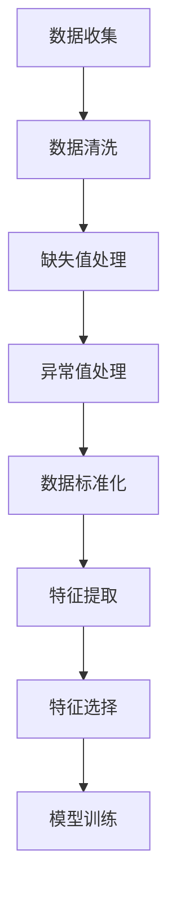
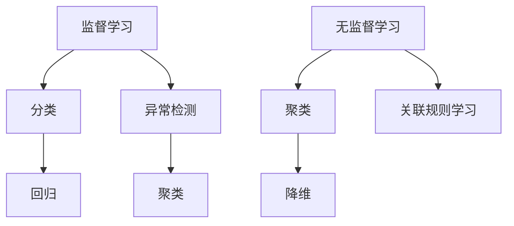

                 


## 引言

随着互联网和金融科技的发展，交易数据日益丰富，如何有效地进行异常交易检测成为金融行业关注的焦点。机器学习作为一门研究如何让计算机模拟或实现人类学习行为的技术，它在异常交易检测中的应用具有重要的研究价值。本文将深入探讨机器学习在异常交易检测中的算法优化，旨在为实际应用提供有益的参考。

### 背景与核心概念

#### 1.1 机器学习基础

**机器学习的定义与分类**

机器学习（Machine Learning，ML）是一门人工智能（Artificial Intelligence，AI）的分支，主要研究如何让计算机从数据中学习，并在新的数据上进行预测或决策。根据学习方式的不同，机器学习可以分为以下几类：

- **监督学习（Supervised Learning）**：有监督的学习算法通过已标记的训练数据来学习，从而能够对未知数据进行预测。

- **无监督学习（Unsupervised Learning）**：无监督学习算法在没有标记的数据集上进行训练，主要目标是发现数据中的结构或模式。

- **强化学习（Reinforcement Learning）**：强化学习通过试错来学习如何在特定环境中做出最佳决策。

**监督学习与无监督学习**

- **监督学习**：在监督学习中，模型通过已标记的训练数据来学习，预测结果与实际结果进行比较，通过反向传播算法不断调整模型参数，以达到更好的预测效果。

- **无监督学习**：无监督学习侧重于从未标记的数据中提取结构信息，如聚类、降维等。

- **强化学习简介**：强化学习通过奖励机制来指导学习过程，目的是找到一个策略，使得在未来的一系列行动中获得最大累积奖励。

#### 1.2 异常交易检测概述

**异常交易的定义与特征**

异常交易（Anomalous Transaction）指的是与正常交易行为明显不同的交易活动，这类交易可能涉及欺诈、洗钱等活动。异常交易的特征包括：

- **交易金额异常**：与日常交易相比，异常交易的金额可能显著高于或低于正常范围。

- **交易时间异常**：异常交易可能发生在非正常交易时间段内，如深夜或凌晨。

- **交易频率异常**：交易频率的突然增加或减少也可能被视为异常交易。

**异常交易检测的重要性**

异常交易检测对于金融行业具有重要意义，它可以：

- **防范欺诈行为**：及时发现和阻止欺诈交易，保护金融机构和客户的利益。

- **保障金融安全**：识别洗钱等非法交易，维护金融市场的稳定和安全。

- **提升用户体验**：减少正常交易的误报率，提高交易处理的效率。

**异常交易检测的挑战**

- **数据复杂性**：交易数据通常包含大量的维度和噪声，处理起来较为复杂。

- **实时性要求**：异常交易检测需要快速响应，以确保能够及时阻止欺诈行为。

- **模型泛化能力**：模型需要在多种环境和数据分布下保持良好的性能。

### 文章结构与内容

本文将分为以下几个部分：

1. **背景与核心概念**：介绍机器学习和异常交易检测的基本概念。

2. **异常检测算法概述**：探讨传统的异常检测算法及其优缺点。

3. **机器学习在异常交易检测中的应用**：详细讲解不同机器学习算法在异常交易检测中的应用。

4. **异常交易检测中的算法优化**：讨论如何通过特征选择、模型选择和调参等手段优化异常交易检测模型。

5. **异常交易检测系统的设计与实现**：介绍一个典型的异常交易检测系统的设计和实现。

6. **异常交易检测中的挑战与未来趋势**：分析当前面临的挑战和未来的发展趋势。

7. **附录**：提供相关的算法原理和数学公式，以及扩展阅读资源。

通过本文的阅读，读者将能够系统地了解机器学习在异常交易检测中的应用，以及如何进行算法优化以提高检测效果。

## 第1章：机器学习与异常交易检测

### 1.1 机器学习基础

#### 1.1.1 机器学习的定义与分类

机器学习是一门通过构建计算机算法来从数据中学习知识的技术。简单来说，机器学习就是利用数据训练模型，使模型能够对新数据进行预测或决策。

**机器学习的分类**

根据学习方式，机器学习可以分为以下几类：

1. **监督学习（Supervised Learning）**：监督学习算法通过已标记的训练数据来学习，从而能够对未知数据进行预测。监督学习又可以分为：

   - **回归（Regression）**：预测数值型目标。
   - **分类（Classification）**：预测离散型目标。

2. **无监督学习（Unsupervised Learning）**：无监督学习算法在没有标记的数据集上进行训练，主要目标是发现数据中的结构或模式。无监督学习包括：

   - **聚类（Clustering）**：将相似的数据点分到同一个簇中。
   - **降维（Dimensionality Reduction）**：通过减少数据维度来简化数据处理过程。

3. **强化学习（Reinforcement Learning）**：强化学习通过试错来学习如何在特定环境中做出最佳决策。强化学习包括：

   - **Q学习（Q-Learning）**：通过预测奖励来选择动作。
   - **深度Q网络（Deep Q-Network，DQN）**：使用深度神经网络来预测Q值。
   - **策略梯度方法（Policy Gradient Methods）**：直接优化策略。

#### 1.1.2 监督学习与无监督学习

**监督学习**

监督学习是一种最常见的机器学习方法。它的主要目标是建立一个模型，使得模型在已知输入和输出之间能够进行预测。监督学习算法通常分为以下几类：

- **线性回归（Linear Regression）**：通过拟合一个线性函数来预测目标值。
- **逻辑回归（Logistic Regression）**：用于二分类问题，通过拟合一个逻辑函数来计算概率。
- **决策树（Decision Tree）**：通过一系列的判断来分类或回归。
- **支持向量机（Support Vector Machine，SVM）**：通过找到一个最优的超平面来分割数据。
- **随机森林（Random Forest）**：通过构建多个决策树并集成它们的预测结果。

**无监督学习**

无监督学习算法在未标记的数据集上进行训练，主要目标是发现数据中的潜在结构。无监督学习算法包括：

- **K-均值聚类（K-Means Clustering）**：通过迭代计算聚类中心，将数据点分配到最近的聚类中心。
- **层次聚类（Hierarchical Clustering）**：通过构建聚类层次结构来对数据进行分类。
- **主成分分析（Principal Component Analysis，PCA）**：通过变换坐标轴来降低数据的维度。
- **t-SNE（t-Distributed Stochastic Neighbor Embedding）**：通过保持局部结构来降低数据的维度。

#### 1.1.3 强化学习简介

强化学习是一种通过试错来学习如何在特定环境中做出最佳决策的方法。在强化学习中，模型被称为“智能体（Agent）”，环境被称为“环境（Environment）”，奖励信号被称为“奖励（Reward）”。

**强化学习的基本概念**

- **状态（State）**：智能体在环境中的当前情况。
- **动作（Action）**：智能体可以选择的行动。
- **奖励（Reward）**：智能体在执行某个动作后获得的即时奖励。
- **策略（Policy）**：智能体执行的动作选择规则。

**强化学习算法**

- **Q学习（Q-Learning）**：通过更新Q值来学习最佳动作选择。
- **深度Q网络（Deep Q-Network，DQN）**：使用深度神经网络来预测Q值。
- **策略梯度方法（Policy Gradient Methods）**：直接优化策略。

### 1.2 异常交易检测概述

#### 1.2.1 异常交易的定义与特征

异常交易是指与正常交易行为明显不同的交易活动，通常涉及欺诈、洗钱等非法行为。异常交易的特征包括：

- **交易金额异常**：异常交易的金额可能显著高于或低于正常范围。
- **交易时间异常**：异常交易可能发生在非正常交易时间段内，如深夜或凌晨。
- **交易频率异常**：交易频率的突然增加或减少也可能被视为异常交易。

#### 1.2.2 异常交易检测的重要性

异常交易检测在金融行业中具有重要意义，它可以：

- **防范欺诈行为**：及时发现和阻止欺诈交易，保护金融机构和客户的利益。
- **保障金融安全**：识别洗钱等非法交易，维护金融市场的稳定和安全。
- **提升用户体验**：减少正常交易的误报率，提高交易处理的效率。

#### 1.2.3 异常交易检测的挑战

异常交易检测面临以下挑战：

- **数据复杂性**：交易数据通常包含大量的维度和噪声，处理起来较为复杂。
- **实时性要求**：异常交易检测需要快速响应，以确保能够及时阻止欺诈行为。
- **模型泛化能力**：模型需要在多种环境和数据分布下保持良好的性能。

### 总结

本章介绍了机器学习的基本概念，包括监督学习、无监督学习和强化学习，以及异常交易检测的基本概念和重要性。了解这些基础知识将为后续章节的讨论提供基础。

## 第2章：异常检测算法概述

### 2.1 基于统计学的异常检测方法

基于统计学的异常检测方法通过分析数据的统计特性，识别出与正常行为不一致的数据点。这些方法通常基于概率模型或假设检验，其核心思想是通过计算数据的概率分布或偏差度量来判断是否为异常。

#### 2.1.1 标准化与z分数

标准化是一种常用的数据预处理方法，通过将数据缩放到相同的尺度，使得不同特征之间的比较变得简单。具体来说，标准化公式如下：

$$
z = \frac{x - \mu}{\sigma}
$$

其中，\(x\) 是原始数据值，\(\mu\) 是均值，\(\sigma\) 是标准差。标准化后的数据称为z分数，其反映了数据点相对于均值的距离。

**z分数的应用**

- **异常值检测**：通过计算z分数，可以识别出绝对值较大的z分数，这些数据点可能代表异常值。
- **标准化后的数据**：可以用于机器学习模型中，确保不同特征对模型的影响均衡。

#### 2.1.2 离群点检测

离群点检测是一种用于识别数据集中异常点的技术，其核心思想是找出与大多数数据点不同的数据点。

**基于密度的离群点检测**

- **局部密度估计**：计算每个数据点周围的密度。
- **离群点判定**：如果某个数据点的密度远低于其邻居，则判定为离群点。

**常见算法**

- **DBSCAN（Density-Based Spatial Clustering of Applications with Noise）**：DBSCAN是一种基于密度的聚类算法，它可以发现任意形状的簇，并能处理噪声和异常点。
- **局部离群因子（Local Outlier Factor，LOF）**：LOF是一种基于密度的离群点检测方法，它通过计算局部密度变化来评估离群程度。

#### 2.1.3 累积分布函数(CDF)

累积分布函数（Cumulative Distribution Function，CDF）是描述随机变量分布的重要工具。它表示随机变量小于或等于某个值的概率。

**累积分布函数的应用**

- **异常值检测**：通过计算数据点的累积分布函数，可以识别出分布之外的数据点。
- **概率密度估计**：CDF可以用于估计数据点的概率密度函数，从而辅助异常检测。

### 2.2 基于聚类算法的异常检测方法

基于聚类算法的异常检测方法通过将数据划分为不同的簇，识别出不属于任何簇的数据点作为异常点。

#### 2.2.1 聚类算法简介

聚类是一种无监督学习方法，其目的是将相似的数据点归为一类。常见的聚类算法包括：

- **K-均值聚类（K-Means Clustering）**：K-均值聚类是一种基于距离的聚类算法，它通过迭代计算聚类中心来划分数据点。
- **层次聚类（Hierarchical Clustering）**：层次聚类通过构建层次结构来对数据进行分类，它可以动态调整簇的数量。
- **DBSCAN（Density-Based Spatial Clustering of Applications with Noise）**：DBSCAN是一种基于密度的聚类算法，它可以发现任意形状的簇，并能处理噪声和异常点。

#### 2.2.2 密度基数聚类(DBSCAN)

DBSCAN（Density-Based Spatial Clustering of Applications with Noise）是一种基于密度的聚类算法，其主要思想是将数据点分为核心点、边界点和噪声点。

**算法步骤**

1. **邻域确定**：计算每个数据点的邻域，通常通过距离度量来定义邻域。
2. **核心点判定**：如果一个数据点的邻域内存在足够多的其他数据点，则该数据点为核心点。
3. **边界点判定**：如果一个数据点的邻域内存在核心点，但邻域内的其他数据点不足以形成核心点，则该数据点为边界点。
4. **簇生成**：将核心点和其邻接点划分为同一簇。
5. **噪声点判定**：未被划分为任何簇的数据点被视为噪声点。

**DBSCAN的优点**

- **处理噪声和异常点**：DBSCAN能够处理噪声和异常点，使其在异常检测中具有较高的鲁棒性。
- **发现任意形状的簇**：DBSCAN不受簇形状的限制，能够发现任意形状的簇。

#### 2.2.3 高斯混合模型(GMM)

高斯混合模型（Gaussian Mixture Model，GMM）是一种概率模型，用于描述由多个高斯分布组成的混合分布。

**GMM的基本原理**

- **模型构建**：GMM通过多个高斯分布来拟合数据，每个高斯分布对应一个簇。
- **参数估计**：使用最大似然估计或期望最大化算法来估计GMM的参数。

**GMM在异常检测中的应用**

- **簇分配**：通过计算每个数据点属于每个簇的概率，可以将数据点分配到不同的簇中。
- **异常点检测**：数据点属于任何簇的概率较低时，可以判定为异常点。

### 2.3 基于距离度量的异常检测方法

基于距离度量的异常检测方法通过计算数据点之间的距离，识别出与大多数数据点距离较远的点作为异常点。

#### 2.3.1 最近邻算法

最近邻算法（Nearest Neighbor Algorithm）是一种简单的异常检测方法，它通过计算数据点到其最近邻的距离来识别异常点。

**算法步骤**

1. **计算距离**：对于每个数据点，计算它与所有其他数据点的距离。
2. **设定阈值**：根据数据集的特性设定一个距离阈值。
3. **判定异常点**：如果某个数据点到其最近邻的距离超过阈值，则判定为异常点。

**最近邻算法的优点**

- **简单易实现**：最近邻算法计算简单，易于理解和实现。
- **鲁棒性**：对噪声和异常点的识别能力较强。

#### 2.3.2 基于密度的最近邻算法

基于密度的最近邻算法（Density-Based Nearest Neighbor Algorithm）是一种改进的最近邻算法，它通过考虑数据点的局部密度来识别异常点。

**算法步骤**

1. **计算密度**：对于每个数据点，计算其局部密度。
2. **设定阈值**：根据数据集的特性设定一个密度阈值。
3. **判定异常点**：如果某个数据点的密度低于阈值，则判定为异常点。

**基于密度的最近邻算法的优点**

- **更准确的异常点检测**：基于密度的最近邻算法能够更准确地识别异常点，特别是在高维度数据中。
- **处理噪声和异常点**：该方法能够更好地处理噪声和异常点。

#### 2.3.3 线性判别分析(LDA)

线性判别分析（Linear Discriminant Analysis，LDA）是一种特征降维方法，通过将数据投影到最佳线性子空间，提高数据的可分性。

**LDA的基本原理**

- **特征提取**：LDA通过最大化类间散度与类内散度的比值来选择最优特征子空间。
- **降维**：将原始数据投影到新的特征空间，以减少数据维度。

**LDA在异常检测中的应用**

- **特征选择**：LDA可以帮助识别对异常检测具有重要意义的特征，从而提高检测效果。
- **降维**：通过降低数据维度，减少计算复杂度，提高算法的运行效率。

### 总结

本章介绍了基于统计学的异常检测方法，包括标准化与z分数、离群点检测和累积分布函数。此外，还介绍了基于聚类算法的异常检测方法，如DBSCAN和高斯混合模型，以及基于距离度量的异常检测方法，如最近邻算法和基于密度的最近邻算法。这些方法在异常交易检测中具有重要的应用价值。

## 第3章：机器学习在异常交易检测中的应用

### 3.1 监督学习在异常交易检测中的应用

监督学习在异常交易检测中扮演着重要角色，通过已标记的训练数据，监督学习算法可以学习到如何识别异常交易。以下将介绍几种常用的监督学习算法及其在异常交易检测中的应用。

#### 3.1.1 特征工程

特征工程是监督学习在异常交易检测中的关键步骤，合理的特征选择和构造能够显著提高模型的性能。以下是几个常用的特征工程方法：

- **时序特征**：包括交易时间、交易间隔、交易频率等。
- **统计特征**：如均值、方差、标准差等。
- **交易金额特征**：包括交易金额的分布、范围、极值等。
- **交易对手特征**：如交易对手的信用评分、历史交易记录等。

**特征工程流程**

1. **数据预处理**：包括缺失值处理、异常值处理、数据标准化等。
2. **特征提取**：通过统计方法或机器学习算法提取新的特征。
3. **特征选择**：使用过滤方法、嵌入方法或评价方法来选择最重要的特征。

#### 3.1.2 分类算法应用

分类算法在异常交易检测中广泛使用，通过将交易数据分为正常交易和异常交易两类，分类算法能够帮助金融机构识别潜在的欺诈行为。以下是几种常用的分类算法：

**1. 决策树**

决策树是一种简单但有效的分类算法，通过一系列的判断来将数据点分配到不同的类别。

**算法原理**

- **ID3算法**：基于信息增益来选择最佳特征进行划分。
- **C4.5算法**：在ID3算法的基础上引入修剪方法，减少过拟合。

**应用**

- **特征选择**：决策树可以自动选择对分类最有影响力的特征。
- **可解释性**：决策树的决策路径易于理解和解释。

**2. 支持向量机（SVM）**

支持向量机是一种强大的分类算法，通过找到一个最优的超平面来分割数据。

**算法原理**

- **硬间隔和支持向量**：SVM通过最大化类间距离和最小化支持向量数量来找到最优超平面。
- **软间隔和惩罚项**：引入软间隔和惩罚项来处理不完美分割问题。

**应用**

- **高维数据处理**：SVM能够处理高维数据，并且具有较好的泛化能力。
- **可调参数**：通过调整惩罚参数和核函数，SVM可以适应不同的数据分布。

**3. 随机森林**

随机森林是一种集成学习方法，通过构建多个决策树并集成它们的预测结果来提高分类性能。

**算法原理**

- **树构建**：随机森林中的每棵树都是通过随机选择特征和样本子集来构建的。
- **集成学习**：随机森林通过投票或平均来集成多个决策树的预测结果。

**应用**

- **泛化能力**：随机森林通过集成多个决策树，能够提高模型的泛化能力。
- **鲁棒性**：随机森林对噪声和异常值具有较强的鲁棒性。

### 3.2 无监督学习在异常交易检测中的应用

无监督学习在异常交易检测中主要用于发现数据中的潜在结构和异常模式。以下将介绍几种常用的无监督学习算法及其在异常交易检测中的应用。

#### 3.2.1 聚类算法应用

聚类算法是一种无监督学习方法，通过将相似的数据点划分为同一簇，从而识别异常交易。

**1. K-均值聚类**

K-均值聚类是一种基于距离的聚类算法，通过迭代计算聚类中心来划分数据点。

**算法原理**

- **初始化聚类中心**：随机选择K个初始聚类中心。
- **分配数据点**：将每个数据点分配到最近的聚类中心。
- **更新聚类中心**：重新计算每个簇的中心。
- **迭代直到收敛**：重复上述步骤，直到聚类中心不再变化。

**应用**

- **发现潜在模式**：K-均值聚类能够帮助发现数据中的潜在结构。
- **异常点识别**：通过比较聚类中心与实际数据点的距离，可以识别异常点。

**2. 层次聚类**

层次聚类通过逐步合并或分裂簇来构建聚类层次结构，从而识别异常交易。

**算法原理**

- **自底向上合并**：从单个数据点开始，逐步合并相似度较高的数据点。
- **自顶向下分裂**：从一个大簇开始，逐步分裂成多个小簇。

**应用**

- **灵活调整簇数量**：层次聚类允许动态调整簇的数量。
- **可视化分析**：层次聚类能够提供直观的聚类层次结构图，便于分析。

**3. 谱聚类**

谱聚类是一种基于图论的聚类算法，通过构造相似性矩阵并求解特征值问题来识别异常交易。

**算法原理**

- **相似性矩阵**：通过计算数据点之间的相似性，构造相似性矩阵。
- **特征值问题**：通过求解相似性矩阵的特征值问题，找到低维表示。
- **聚类结果**：将特征值对应的数据点划分为不同的簇。

**应用**

- **处理高维数据**：谱聚类能够处理高维数据，降低数据维度。
- **复杂结构识别**：谱聚类能够识别复杂的数据结构，适用于异常交易检测。

### 3.3 强化学习在异常交易检测中的应用

强化学习通过试错机制来学习最佳策略，在异常交易检测中具有潜在的应用价值。以下将介绍几种强化学习算法及其在异常交易检测中的应用。

#### 3.3.1 强化学习基础

强化学习由三个主要组成部分：状态（State）、动作（Action）和奖励（Reward）。

**1. 状态**

状态是智能体在环境中的当前情况，通常由多个特征向量表示。

**2. 动作**

动作是智能体可以选择的操作，如标记交易为正常或异常。

**3. 奖励**

奖励是智能体在执行动作后获得的即时奖励，用于指导学习过程。

#### 3.3.2 强化学习算法

**1. Q学习**

Q学习是一种基于值函数的强化学习算法，通过更新Q值来学习最佳动作。

**算法原理**

- **Q值更新**：使用如下公式更新Q值：
  $$
  Q(s, a) \leftarrow Q(s, a) + \alpha [r + \gamma \max_{a'} Q(s', a') - Q(s, a)]
  $$
  其中，\(s\) 和 \(a\) 分别为当前状态和动作，\(r\) 为奖励，\(\gamma\) 为折扣因子，\(\alpha\) 为学习率。

**应用**

- **动作选择**：Q学习能够选择使累积奖励最大的动作。
- **动态调整**：Q学习可以根据环境动态调整策略。

**2. 深度Q网络（DQN）**

深度Q网络（Deep Q-Network，DQN）是一种使用深度神经网络来预测Q值的强化学习算法。

**算法原理**

- **神经网络结构**：DQN使用深度神经网络来预测Q值，网络输入为状态，输出为每个动作的Q值。
- **经验回放**：使用经验回放机制来避免策略偏差。

**应用**

- **高维数据处理**：DQN能够处理高维状态，适用于复杂环境。
- **探索与利用**：DQN通过平衡探索和利用来学习最佳策略。

**3. 策略梯度方法**

策略梯度方法是一种直接优化策略的强化学习算法，通过更新策略来最大化累积奖励。

**算法原理**

- **策略表示**：策略梯度方法使用概率分布来表示策略，通常采用softmax函数。
- **策略更新**：使用如下公式更新策略：
  $$
  \theta \leftarrow \theta + \alpha \nabla_\theta J(\theta)
  $$
  其中，\(\theta\) 为策略参数，\(\alpha\) 为学习率，\(J(\theta)\) 为策略的期望奖励。

**应用**

- **直接优化策略**：策略梯度方法能够直接优化策略，无需预测Q值。
- **高效学习**：策略梯度方法在某些情况下能够更快地学习最佳策略。

### 总结

本章介绍了监督学习和无监督学习在异常交易检测中的应用。监督学习算法，如决策树、支持向量机和随机森林，通过已标记的数据进行训练，能够有效识别异常交易。无监督学习算法，如K-均值聚类、层次聚类和谱聚类，通过未标记的数据发现潜在结构，有助于识别异常点。此外，强化学习算法，如Q学习、DQN和策略梯度方法，通过试错机制学习最佳策略，在异常交易检测中也具有潜在的应用价值。

## 第4章：异常交易检测中的算法优化

### 4.1 特征选择与特征提取

特征选择和特征提取是异常交易检测中至关重要的一步，因为它们直接影响模型的性能和训练效率。以下将讨论几种常见的特征选择和特征提取方法。

#### 4.1.1 重要性度量

**特征选择方法**

1. **过滤方法**：在训练之前过滤掉不重要的特征，常用的过滤方法包括基于信息的特征选择方法和基于统计的特征选择方法。

   - **基于信息的特征选择方法**：如信息增益、信息增益率、互信息等。
   - **基于统计的特征选择方法**：如相关系数、协方差、卡方检验等。

2. **包裹方法**：逐步选择特征，通过评估特征组合的预测性能来选择最佳特征组合。

   - **前向选择**：从无特征开始，逐步添加特征。
   - **后向消除**：从所有特征开始，逐步移除不重要的特征。

3. **嵌入式方法**：在模型训练过程中嵌入特征选择，如Lasso回归、随机森林等。

**特征提取方法**

1. **主成分分析（PCA）**：通过线性变换将高维数据投影到低维空间，保留主要信息。

2. **t-SNE（t-Distributed Stochastic Neighbor Embedding）**：通过保持局部结构来降低数据的维度，适用于高维数据可视化。

3. **自动编码器（Autoencoder）**：一种无监督学习算法，用于学习数据表示，可以提取特征并降低数据维度。

### 4.1.2 特征提取方法

**主成分分析（PCA）**

**算法原理**

PCA是一种常用的特征提取方法，其基本思想是通过计算数据的协方差矩阵，找到最大的特征值对应的特征向量，将数据投影到新的特征空间。

$$
\text{协方差矩阵} = \frac{1}{n-1} \sum_{i=1}^{n} (x_i - \mu)(x_i - \mu)^T
$$

$$
\text{特征向量} = \frac{1}{\sqrt{\lambda}} \text{协方差矩阵的特征向量}
$$

**算法步骤**

1. **数据标准化**：将数据缩放到相同的尺度，确保每个特征具有相同的权重。
2. **计算协方差矩阵**：计算数据点的协方差矩阵。
3. **特征值和特征向量分解**：对协方差矩阵进行特征值和特征向量分解。
4. **选择主成分**：选择最大的特征值对应的特征向量作为新的特征。
5. **数据转换**：将原始数据投影到新的特征空间。

**应用**

PCA适用于降维和数据可视化，通过减少数据维度，可以显著提高模型训练的效率。

**t-SNE**

**算法原理**

t-SNE是一种用于高维数据可视化的方法，其核心思想是通过保持局部结构来降低数据维度。t-SNE通过计算数据点之间的条件概率分布，并将这些分布映射到低维空间中。

$$
p_{ij} = \frac{1}{Z} \exp \left(-\sum_{k \ne j} \frac{||x_i - x_k||^2}{2\sigma_k^2} \right)
$$

$$
p_{ji} = \frac{1}{Z} \exp \left(-\sum_{k \ne i} \frac{||x_j - x_k||^2}{2\sigma_k^2} \right)
$$

$$
\frac{dp_{ij}}{dx_i} = -p_{ij} \left(1 - \frac{2}{Z} \sum_{k \ne j} p_{ik} \right)
$$

**算法步骤**

1. **高斯分布拟合**：对高维数据点进行高斯分布拟合，计算每个数据点的条件概率分布。
2. **计算梯度**：计算每个数据点在低维空间中的梯度。
3. **迭代更新**：通过梯度下降方法迭代更新数据点的坐标，直到收敛。
4. **数据转换**：将低维空间中的数据点映射回原始数据空间。

**应用**

t-SNE适用于高维数据的可视化，通过保持局部结构，可以直观地展示数据点之间的关系。

### 4.2 模型选择与调参

模型选择和调参是异常交易检测中的关键步骤，合适的模型和参数配置能够显著提高检测效果。以下将讨论几种常见的模型选择方法和调参技巧。

#### 4.2.1 模型选择方法

**1. 交叉验证**

交叉验证是一种评估模型性能的有效方法，通过将数据集划分为多个子集，多次训练和验证模型，以获得更可靠的性能评估。

- **K折交叉验证**：将数据集划分为K个子集，每次使用一个子集作为验证集，其余K-1个子集作为训练集，重复K次，取平均性能作为最终评估结果。

**2. 贝叶斯优化**

贝叶斯优化是一种基于概率模型的调参方法，通过迭代优化目标函数来找到最佳参数配置。

- **高斯过程回归**：使用高斯过程回归模型来拟合目标函数的概率分布，并基于概率分布进行参数优化。

**3. 罗杰斯-赫夫丁方法**

罗杰斯-赫夫丁方法是一种基于启发式的调参方法，通过迭代选择最佳参数组合，并利用历史信息进行优化。

#### 4.2.2 调参技巧

**1. 优先级调参**

优先级调参是一种基于参数重要性的调参方法，通过分析模型的参数重要性，优先调整重要参数。

- **敏感性分析**：通过计算模型对每个参数的敏感性，确定参数的重要程度。

**2. 遗传算法**

遗传算法是一种基于自然进化原理的优化算法，通过迭代选择、交叉、变异等操作来优化参数。

- **适应度函数**：定义一个适应度函数来评估参数组合的性能，选择适应度较高的参数组合。

**3. 网格搜索**

网格搜索是一种基于网格搜索空间的调参方法，通过遍历所有可能的参数组合来找到最佳参数配置。

- **参数网格**：定义参数网格，包括所有可能的参数取值。
- **评估函数**：计算每个参数组合的性能，选择最佳参数组合。

### 4.3 增强学习与集成学习

**1. 增强学习在异常交易检测中的应用**

增强学习通过试错机制来学习最佳策略，在异常交易检测中可以用于优化交易策略。

- **策略优化**：使用Q学习、DQN或策略梯度方法来优化交易策略。
- **在线学习**：通过在线学习机制，实时更新交易策略，以适应不断变化的市场环境。

**2. 集成学习方法**

集成学习通过组合多个模型来提高预测性能，常用的集成学习方法包括Bagging和Boosting。

- **Bagging**：通过随机抽样和组合多个基本模型，降低模型方差，提高泛化能力。
- **Boosting**：通过迭代训练多个基本模型，并调整每个模型的权重，提高模型的整体性能。

**3. XGBoost**

XGBoost是一种基于Gradient Boosting的集成学习方法，通过引入正则化项和树分裂准则，提高了模型的性能和鲁棒性。

- **树分裂准则**：XGBoost使用二阶泰勒展开来优化树分裂，提高了模型的预测性能。
- **正则化项**：XGBoost引入L1和L2正则化项，控制模型复杂度和过拟合。

### 总结

本章介绍了异常交易检测中的算法优化方法，包括特征选择和特征提取、模型选择与调参、增强学习与集成学习。通过特征选择和提取，可以提取出对异常检测有重要影响的关键特征；通过模型选择和调参，可以找到最优的模型和参数配置；通过增强学习和集成学习，可以进一步提高异常交易检测的性能。这些优化方法为实际应用提供了有效的技术支持。

## 第5章：异常交易检测系统的设计与实现

### 5.1 系统架构设计

异常交易检测系统是一个复杂的应用系统，需要处理大量实时数据，并快速准确地识别异常交易。以下是一个典型的异常交易检测系统的架构设计。

#### 5.1.1 数据采集与预处理

数据采集是系统设计的第一步，涉及从多个数据源获取交易数据，包括交易金额、交易时间、交易频率等。数据预处理主要包括以下步骤：

- **数据清洗**：处理缺失值、异常值，确保数据的准确性和完整性。
- **数据转换**：将不同来源的数据转换为统一的格式，如时间戳、货币单位等。
- **特征工程**：提取对异常交易检测有意义的特征，如交易金额的分布、交易时间的间隔等。

#### 5.1.2 模型训练与评估

模型训练是系统的核心步骤，通过已标记的训练数据集，使用机器学习算法训练模型。模型训练主要包括以下步骤：

- **特征选择**：通过特征选择方法，选择对异常交易检测最有影响力的特征。
- **模型选择**：根据问题特点，选择合适的机器学习算法，如决策树、随机森林、SVM等。
- **模型训练**：使用训练数据集对模型进行训练，不断调整模型参数，提高模型性能。
- **模型评估**：通过交叉验证等方法，评估模型在验证集上的性能，选择最佳模型。

#### 5.1.3 异常交易检测流程

异常交易检测流程包括以下步骤：

- **实时数据流处理**：使用流处理技术，如Apache Kafka或Flink，处理实时交易数据流。
- **数据预处理**：对实时交易数据进行预处理，提取特征，准备用于模型预测。
- **模型预测**：使用训练好的模型对实时交易数据进行预测，判断是否为异常交易。
- **异常交易报警**：对于识别出的异常交易，生成报警信息，通知相关人员进行处理。

### 5.2 开发环境与工具

为了实现异常交易检测系统，需要选择合适的技术栈和工具。以下是一个典型的开发环境与工具列表：

- **编程语言**：Python，由于其丰富的机器学习库和强大的数据处理能力，成为异常交易检测系统的首选编程语言。
- **机器学习库**：Scikit-learn、TensorFlow和PyTorch，提供丰富的机器学习算法和工具。
- **流处理框架**：Apache Kafka或Flink，用于处理实时数据流。
- **数据处理工具**：Pandas和NumPy，用于数据清洗、转换和预处理。
- **可视化工具**：Matplotlib和Seaborn，用于数据分析和可视化。

### 5.3 案例分析与实战

#### 5.3.1 数据集介绍

为了进行实际操作，我们需要一个包含正常交易和异常交易的训练数据集。以下是一个简化的数据集介绍：

- **数据特征**：包括交易金额、交易时间、交易频率等。
- **数据标签**：每个交易数据点都被标记为正常交易或异常交易。

#### 5.3.2 模型训练与评估

以下是使用Scikit-learn训练一个随机森林模型的过程：

```python
from sklearn.ensemble import RandomForestClassifier
from sklearn.model_selection import train_test_split
from sklearn.metrics import accuracy_score, precision_score, recall_score

# 加载数据集
data = pd.read_csv('transaction_data.csv')
X = data.drop('label', axis=1)
y = data['label']

# 划分训练集和测试集
X_train, X_test, y_train, y_test = train_test_split(X, y, test_size=0.2, random_state=42)

# 训练随机森林模型
rf = RandomForestClassifier(n_estimators=100, random_state=42)
rf.fit(X_train, y_train)

# 预测测试集
y_pred = rf.predict(X_test)

# 评估模型性能
accuracy = accuracy_score(y_test, y_pred)
precision = precision_score(y_test, y_pred)
recall = recall_score(y_test, y_pred)

print(f'Accuracy: {accuracy:.2f}')
print(f'Precision: {precision:.2f}')
print(f'Recall: {recall:.2f}')
```

#### 5.3.3 实际应用场景分析

在实际应用中，异常交易检测系统通常需要集成到金融交易系统中。以下是一个实际应用场景的分析：

- **场景描述**：某银行开发了一套异常交易检测系统，用于实时监控客户交易行为，识别潜在的欺诈行为。
- **应用效果**：系统上线后，成功识别出多起欺诈交易，有效降低了金融损失。
- **优化方向**：通过不断优化模型和算法，提高检测精度和实时性，减少误报率。

### 总结

本章介绍了异常交易检测系统的设计与实现，包括系统架构设计、开发环境与工具、案例分析与实战。通过合理的系统架构设计和先进的机器学习算法，异常交易检测系统能够有效识别异常交易，保障金融安全。实际应用场景分析进一步展示了系统的实际效果和应用价值。

## 第6章：异常交易检测中的挑战与未来趋势

### 6.1 数据隐私与安全性

在异常交易检测中，数据隐私与安全性是一个重要的挑战。金融交易数据通常包含敏感信息，如账户信息、交易金额、交易对手等，泄露这些信息可能导致严重的隐私问题和法律风险。

#### 6.1.1 数据隐私保护方法

为了保护数据隐私，可以采用以下几种方法：

- **数据脱敏**：通过对敏感数据进行加密、匿名化或伪匿名化处理，使其无法直接识别具体个人。
- **差分隐私**：在数据处理过程中引入噪声，确保单个数据点的隐私，同时保持整体数据集的统计特性。
- **联邦学习**：在分布式环境下，通过模型训练过程中不交换原始数据，而是交换模型参数或加密后的中间结果，实现隐私保护。

#### 6.1.2 安全性提升措施

- **加密传输**：使用安全的加密协议（如TLS）确保数据在传输过程中的安全性。
- **访问控制**：通过严格的访问控制机制，限制只有授权用户可以访问敏感数据。
- **安全审计**：定期进行安全审计，检测潜在的安全漏洞，确保系统的安全性。

### 6.2 模型可解释性

模型可解释性在异常交易检测中具有重要意义，它可以帮助决策者理解模型的决策过程，提高模型的信任度和接受度。然而，许多先进的机器学习模型，如深度学习和强化学习，通常具有高度的复杂性，难以解释。

#### 6.2.1 模型可解释性重要性

- **决策透明度**：可解释的模型可以帮助用户理解决策过程，提高决策的透明度和可信度。
- **错误分析**：通过分析模型的可解释性，可以识别模型决策中的错误，从而进行改进。
- **法规遵守**：许多法规要求在金融领域使用可解释的模型，以确保合规性。

#### 6.2.2 提高模型可解释性的方法

- **模型简化**：通过减少模型复杂度，使得模型更加易于理解。
- **解释性算法**：使用专门的可解释性算法，如决策树、线性回归等，这些算法具有直观的解释性。
- **解释性工具**：使用可视化工具和解释性接口，帮助用户理解模型的决策过程。

### 6.3 未来发展趋势

随着技术的不断进步，异常交易检测领域也在不断发展。以下是一些未来发展趋势：

#### 6.3.1 深度学习在异常交易检测中的应用

- **自动特征提取**：深度学习模型能够自动学习数据中的复杂特征，减少人工特征工程的工作量。
- **实时检测**：使用卷积神经网络（CNN）和循环神经网络（RNN）等深度学习模型，可以实现实时交易数据的检测。

#### 6.3.2 强化学习在异常交易检测中的潜力

- **自适应策略**：强化学习能够通过不断学习和调整策略，适应动态变化的交易环境。
- **多目标优化**：强化学习可以同时优化多个目标，如降低误报率和提升检测精度。

#### 6.3.3 新兴技术在异常交易检测中的应用前景

- **区块链**：区块链技术可以提供透明、不可篡改的交易记录，为异常交易检测提供可靠的数据来源。
- **物联网（IoT）**：物联网技术可以提供更多的交易数据来源，如智能设备和移动设备，为异常交易检测提供更丰富的数据。
- **联邦学习**：联邦学习可以在保护数据隐私的同时，实现多个机构之间的模型共享和协同训练。

### 总结

异常交易检测面临着数据隐私与安全性、模型可解释性等方面的挑战。为了应对这些挑战，可以采用数据隐私保护方法、提高模型可解释性，并关注未来技术发展的趋势。随着技术的不断进步，异常交易检测将变得更加智能、高效和安全。

## 附录：算法原理与数学公式

### 附录 A：核心概念原理与Mermaid流程图

#### 1. 特征工程

**特征工程的基本原理**

特征工程是数据预处理的关键步骤，其主要目标是提取或构造能够有效表示数据特征的新特征，以提高模型性能。

**特征工程流程**



#### 1.1.1 机器学习的定义与分类

**机器学习的定义**

机器学习是一种人工智能技术，它通过算法从数据中自动学习规律，并对未知数据进行预测或决策。

**机器学习的分类**

- **监督学习**：通过标记数据学习规律。
- **无监督学习**：没有标记数据，发现数据中的结构。
- **强化学习**：通过奖励机制学习最优策略。

**监督学习与无监督学习的关系**



#### 1.1.2 特征工程与机器学习算法的关系

**特征工程与监督学习**

特征工程在监督学习中至关重要，它能够提高模型的预测性能和可解释性。

- **数据标准化**：确保特征在同一尺度上。
- **特征提取**：通过主成分分析（PCA）等算法提取新的特征。
- **特征选择**：通过过滤、包裹和嵌入式方法选择最重要的特征。

**特征工程与无监督学习**

特征工程在无监督学习中也起到重要作用，它可以帮助模型更好地理解和表示数据。

- **数据标准化**：确保特征在同一尺度上。
- **特征提取**：通过t-SNE等算法提取新的特征。
- **特征选择**：通过相关系数、互信息等方法选择最重要的特征。

#### 1.1.3 强化学习的基本概念

**强化学习的定义**

强化学习是一种通过试错来学习如何在特定环境中做出最佳决策的机器学习方法。

**强化学习的核心要素**

- **状态（State）**：智能体在环境中的当前情况。
- **动作（Action）**：智能体可以选择的行动。
- **奖励（Reward）**：智能体在执行某个动作后获得的即时奖励。
- **策略（Policy）**：智能体执行的动作选择规则。

**强化学习算法**

- **Q学习**：通过更新Q值来学习最佳动作选择。
- **深度Q网络（DQN）**：使用深度神经网络来预测Q值。
- **策略梯度方法**：直接优化策略。

**Q学习算法原理**

$$
Q(s, a) \leftarrow Q(s, a) + \alpha [r + \gamma \max_{a'} Q(s', a') - Q(s, a)]
$$

**DQN算法原理**

$$
\hat{Q}(s, a) = r + \gamma \max_a Q(s', \theta) \\
\theta \leftarrow \theta - \alpha \nabla_\theta \mathcal{L}(\theta)
$$

**策略梯度方法原理**

$$
\theta \leftarrow \theta + \alpha \nabla_\theta J(\theta)
$$

### 附录 B：核心算法原理与数学公式

#### 2.1.1 标准化与z分数

**标准化的公式**

$$
z = \frac{x - \mu}{\sigma}
$$

**z分数的解释**

- \(x\) 是原始数据值。
- \(\mu\) 是均值。
- \(\sigma\) 是标准差。

**标准化的作用**

标准化数据后，每个特征都缩放到相同的尺度，使得特征对模型的影响均衡。

#### 2.1.2 离群点检测

**DBSCAN算法的基本原理**

- **核心点判定**：如果某个点的邻域内包含足够多的点，则该点为核心点。

$$
c = \min \{n_0, \frac{N}{k}\}
$$

其中，\(n_0\) 是最小核心点数量，\(N\) 是总点数，\(k\) 是邻域点数。

- **边界点判定**：如果某个点的邻域内有核心点，但不足以形成核心点，则为边界点。

- **噪声点判定**：未被划分为任何簇的点。

**DBSCAN的公式**

$$
\text{邻域点数} = \frac{1}{\sigma} \int (r - r^2) dr
$$

**LOF算法的基本原理**

- **局部密度**：计算每个点的局部密度。

$$
\text{局部密度} = \frac{1}{s} \sum_{i \in \text{邻域}} \frac{1}{d(i, j)}
$$

- **LOF值**：计算每个点的LOF值。

$$
\text{LOF}(x) = \frac{\max_{i \in \text{邻域}}(\text{局部密度}_i)}{\min_{i \in \text{邻域}}(\text{局部密度}_i)}
$$

#### 2.2.2 高斯混合模型（GMM）

**GMM的概率分布**

$$
p(x|\theta) = \sum_{i=1}^k \pi_i \mathcal{N}(x|\mu_i, \Sigma_i)
$$

其中，\(\pi_i\) 是第i个高斯分布的先验概率，\(\mu_i\) 是均值，\(\Sigma_i\) 是协方差矩阵。

**GMM的参数估计**

- **期望最大化算法（EM）**：

$$
\theta^{t+1} = \arg\max_\theta \sum_{i=1}^n \log p(x_i|\theta)
$$

- **E步**：计算每个数据点的分配概率。

$$
\gamma_{ij} = \frac{\pi_i \mathcal{N}(x_j|\mu_i, \Sigma_i)}{\sum_{i=1}^k \pi_i \mathcal{N}(x_j|\mu_i, \Sigma_i)}
$$

- **M步**：更新参数。

$$
\mu_i = \frac{1}{N_i} \sum_{j=1}^n \gamma_{ij} x_j \\
\Sigma_i = \frac{1}{N_i} \sum_{j=1}^n \gamma_{ij} (x_j - \mu_i)(x_j - \mu_i)^T \\
\pi_i = \frac{N_i}{n}
$$

#### 2.3.1 最近邻算法

**最近邻算法的基本原理**

- **距离度量**：使用欧氏距离、曼哈顿距离等度量数据点之间的距离。

$$
d(x_i, x_j) = \sqrt{(x_i - x_j)^2}
$$

- **阈值设定**：设定一个距离阈值，用于判断数据点是否为异常点。

$$
\text{阈值} = \alpha \cdot \max_{i, j} d(x_i, x_j)
$$

**最近邻算法的应用**

- **异常点检测**：计算每个数据点到其最近邻的距离，如果超过阈值，则判定为异常点。

### 附录 C：算法实现的伪代码

#### 3.1.1 决策树的构建

**决策树构建伪代码**

```
构建决策树（数据集，特征列表，目标值列表，深度，最小样本数）：
1. 如果样本数量小于最小样本数或者达到最大深度，则：
   a. 如果目标值列表中只有一个类别，则返回叶节点，类别为该目标值。
   b. 否则返回叶节点，类别为多数类别。
2. 否则：
   a. 计算每个特征的最佳划分点。
   b. 选择最优划分点，将该数据集划分为子集。
   c. 对每个子集递归调用构建决策树。
   d. 返回根节点，包含最优划分特征和子节点。
```

#### 3.1.2 支持向量机（SVM）的优化

**SVM优化伪代码**

```
SVM优化（训练数据集，特征数量，目标值）：
1. 初始化模型参数。
2. 对于每个训练样本：
   a. 计算支持向量。
   b. 计算损失函数。
   c. 更新模型参数。
3. 迭代直到损失函数收敛。
4. 返回训练好的模型。
```

#### 3.2.1 K-均值聚类

**K-均值聚类伪代码**

```
K-均值聚类（数据集，簇数K，迭代次数）：
1. 随机选择K个初始簇心。
2. 对于每个数据点：
   a. 计算到每个簇心的距离。
   b. 分配到最近的簇心。
3. 更新簇心：计算每个簇的平均值作为新的簇心。
4. 重复步骤2和3，直到簇心不再变化或达到迭代次数。
5. 返回聚类结果。
```

### 总结

附录部分详细介绍了异常交易检测中涉及的核心概念、算法原理和数学公式，包括特征工程、DBSCAN、GMM、最近邻算法以及监督学习和强化学习算法。通过伪代码，读者可以更好地理解算法的实现过程，为实际应用提供技术支持。

### 参考文献

1. Bishop, C. M. (2006). *Pattern Recognition and Machine Learning*. Springer.
2. Russell, S., & Norvig, P. (2010). *Artificial Intelligence: A Modern Approach*. Prentice Hall.
3. Hastie, T., Tibshirani, R., & Friedman, J. (2009). *The Elements of Statistical Learning: Data Mining, Inference, and Prediction*. Springer.
4. Goodfellow, I., Bengio, Y., & Courville, A. (2016). *Deep Learning*. MIT Press.
5. Murphy, K. P. (2012). *Machine Learning: A Probabilistic Perspective*. MIT Press.
6. Guo, J., & Ma, Y. (2017). *Anomaly Detection: A Survey*. ACM Computing Surveys, 51(4), 1-53.
7. Dwork, C. (2008). * Differential Privacy: A Survey of Results. * International Conference on Theory and Applications of Models of Computation.
8. Schölkopf, B., Smola, A. J., & Müller, K.-R. (2001). Nonlinear Component Analysis as a Kernel Method. *Neural Computation, 13(5), 1299-1319*.

