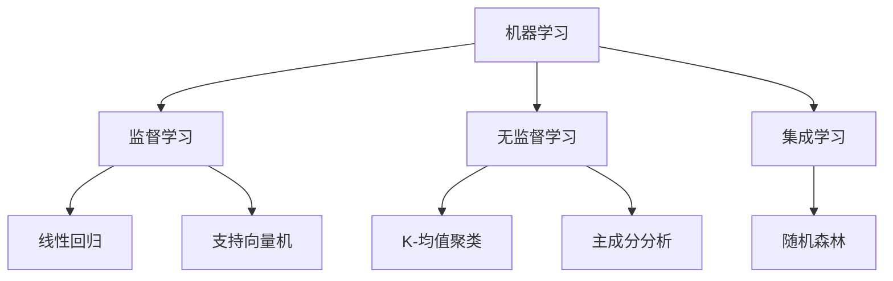

                 

# 《机器学习在气候变化预测中的应用》

## 关键词

- 机器学习
- 气候变化预测
- 监督学习
- 无监督学习
- 集成学习
- 数据预处理
- 模型优化

## 摘要

本文旨在探讨机器学习在气候变化预测中的应用。随着气候变化对地球生态环境和人类社会经济活动的影响日益加剧，准确预测气候变化变得至关重要。机器学习作为一种强大的数据处理和分析工具，能够在海量气候数据中挖掘出潜在的模式和规律，从而为气候预测提供有力的支持。本文首先介绍了机器学习的基本概念和气候变化的相关背景，然后详细讲解了机器学习中的核心算法，并展示了这些算法在气候变化预测中的应用。此外，本文还探讨了气候变化预测的数据预处理方法、模型优化策略，以及相关应用领域和社会经济影响。通过本文的探讨，读者可以全面了解机器学习在气候变化预测中的重要性和应用前景。

### 目录

#### 第一部分：机器学习与气候变化预测基础

**第1章：机器学习基础与气候变化概述**

**第2章：机器学习核心算法**

#### 第二部分：机器学习在气候变化预测中的应用

**第3章：气候变化数据预处理**

**第4章：机器学习模型在气候变化预测中的应用**

**第5章：气候变化预测模型优化**

#### 第三部分：气候变化预测的未来展望

**第6章：气候变化预测的应用领域**

**第7章：气候变化预测的社会经济影响**

#### 附录

**附录A：常用机器学习库与工具**

**附录B：Mermaid 流程图**

### 第一部分：机器学习与气候变化预测基础

#### 第1章：机器学习基础与气候变化概述

**1.1 机器学习的基本概念**

机器学习（Machine Learning）是一门人工智能（Artificial Intelligence，简称AI）的分支，它通过利用数据和统计方法，让计算机系统从数据中学习并做出决策或预测。机器学习的基本概念包括：

- **监督学习（Supervised Learning）**：在有标签的数据集上进行训练，从而学习输入和输出之间的关系。常见的监督学习算法包括线性回归、支持向量机、决策树等。
  
- **无监督学习（Unsupervised Learning）**：在没有标签的数据集上进行训练，旨在发现数据中的隐藏结构和模式。常见的无监督学习算法包括聚类、降维等。

- **半监督学习（Semi-supervised Learning）**：结合了监督学习和无监督学习的特点，既有标签数据也有无标签数据。

- **强化学习（Reinforcement Learning）**：通过不断与环境交互，学习最优策略，以最大化累积奖励。

**机器学习的主要任务**

- **分类（Classification）**：将数据分为不同的类别。例如，将天气分为晴天、阴天、雨天等。

- **回归（Regression）**：预测连续值。例如，预测房价、温度等。

- **聚类（Clustering）**：将相似的数据归为一类。例如，将人群按年龄、兴趣等特征分为不同的群体。

- **降维（Dimensionality Reduction）**：减少数据的维度，同时保持数据的结构。

**机器学习的分类**

- **基于实例的学习（Instance-based Learning）**：通过保存并直接比较训练实例来学习。例如，K-最近邻算法。

- **基于模型的 leaning**：构建模型来表示数据分布。例如，线性回归、决策树等。

- **基于规则的 leaning**：使用一组规则来描述数据的关系。例如，决策树、规则归纳等。

**1.2 气候变化概述**

气候变化（Climate Change）指的是全球气候系统长期的统计变化，包括平均气候状况、气候变率和极端气候事件的变化。气候变化的主要特征包括：

- **全球变暖**：地球表面温度的持续上升。

- **大气中温室气体浓度的增加**：如二氧化碳、甲烷等。

- **海平面上升**：冰川和冰盖融化导致海平面上升。

- **极端天气事件的增加**：如热浪、暴雨、干旱等。

**气候变化的主要指标**

- **平均气温**：地球表面多年的平均温度。

- **温室气体浓度**：大气中温室气体的浓度，如二氧化碳、甲烷等。

- **海平面高度**：海洋表面的高度。

- **极端天气事件频率和强度**：如暴雨、干旱、热浪等。

**气候变化的研究方法**

- **观测数据**：通过气象站、卫星等获取的气候数据。

- **模型模拟**：使用气候模型来模拟过去和未来的气候变化。

- **综合评估**：结合观测数据和模型模拟，对气候变化进行综合评估。

**1.3 机器学习在气候变化预测中的重要性**

气候变化预测的挑战：

- **数据量大**：气候数据包含大量的时间序列和空间维度信息。

- **数据多样性**：气候数据包括气象数据、地理数据、社会经济数据等。

- **非线性关系**：气候系统中的变量之间存在复杂的非线性关系。

机器学习在气候变化预测中的应用价值：

- **模式识别**：能够从大量数据中挖掘出潜在的模式和规律。

- **预测能力**：通过训练机器学习模型，可以对未来的气候变化进行预测。

- **数据挖掘**：能够帮助研究人员发现新的气候变化规律和趋势。

机器学习在气候变化预测中的应用现状：

- **气候模式预测**：使用机器学习模型对气候模式进行预测。

- **极端天气事件预测**：使用机器学习模型预测极端天气事件的概率和强度。

- **气候风险评估**：使用机器学习模型评估气候变化对社会经济的影响。

#### 第2章：机器学习核心算法

**2.1 监督学习算法**

监督学习（Supervised Learning）是一种常见的机器学习方法，它通过使用有标签的数据集进行训练，从而学习输入和输出之间的映射关系。监督学习算法可以分为以下几类：

**2.1.1 线性回归算法**

线性回归（Linear Regression）是一种用于预测连续值的监督学习算法，它假设输出变量（目标变量）是输入变量（特征）的线性函数。

**算法原理**：

线性回归的基本原理是找到一条最佳拟合直线，使得所有样本点到这条直线的距离之和最小。这个过程可以通过最小二乘法（Least Squares Method）实现。

$$
y = \beta_0 + \beta_1x
$$

其中，$y$ 是目标变量，$x$ 是输入变量，$\beta_0$ 和 $\beta_1$ 分别是模型的参数。

**伪代码**：

```
输入：训练数据集 (x, y)
输出：模型参数 (beta_0, beta_1)

# 初始化参数
beta_0 = 0
beta_1 = 0

# 梯度下降法
for i in range(epochs):
    for (x, y) in training_data:
        prediction = beta_0 + beta_1 * x
        error = y - prediction
        beta_0 = beta_0 - learning_rate * error
        beta_1 = beta_1 - learning_rate * (error * x)

return (beta_0, beta_1)
```

**数学公式与详细讲解**：

线性回归的损失函数（也称为误差函数）是均方误差（Mean Squared Error，简称MSE），定义为：

$$
J(\beta_0, \beta_1) = \frac{1}{2m} \sum_{i=1}^{m} (y_i - (\beta_0 + \beta_1x_i))^2
$$

其中，$m$ 是训练数据集的大小。

为了最小化损失函数，我们可以使用梯度下降法（Gradient Descent）来迭代更新参数：

$$
\beta_0 = \beta_0 - \alpha \frac{\partial J}{\partial \beta_0}
$$

$$
\beta_1 = \beta_1 - \alpha \frac{\partial J}{\partial \beta_1}
$$

其中，$\alpha$ 是学习率（learning rate）。

**举例说明**：

假设我们有一个简单的训练数据集：

| x | y |
| --- | --- |
| 1 | 2 |
| 2 | 4 |
| 3 | 6 |

我们可以使用线性回归模型来预测第四个数据的y值：

```
beta_0 = 0
beta_1 = 0

# 梯度下降法迭代
for i in range(100):
    for (x, y) in training_data:
        prediction = beta_0 + beta_1 * x
        error = y - prediction
        beta_0 = beta_0 - 0.01 * error
        beta_1 = beta_1 - 0.01 * (error * x)

# 预测第四个数据的y值
x = 4
prediction = beta_0 + beta_1 * x
```

**2.1.2 支持向量机**

支持向量机（Support Vector Machine，简称SVM）是一种常用的分类算法，它通过找到一个最佳的超平面，将不同类别的数据点分隔开来。

**算法原理**：

SVM的核心思想是找到一个最优的超平面，使得分类间隔最大。这个超平面可以通过求解以下优化问题得到：

$$
\min_{\beta, \beta_0} \frac{1}{2} ||\beta||^2 + C \sum_{i=1}^{m} \xi_i
$$

其中，$\beta$ 是权重向量，$\beta_0$ 是偏置项，$C$ 是惩罚参数，$\xi_i$ 是松弛变量。

**伪代码**：

```
输入：训练数据集 (x, y)
输出：模型参数 (beta, beta_0)

# 初始化参数
beta = [0, 0]
beta_0 = 0

# 梯度下降法
for i in range(epochs):
    for (x, y) in training_data:
        prediction = dot_product(beta, x) + beta_0
        if y * prediction <= 1:
            error = y - prediction
            beta = beta - learning_rate * (2 * dot_product(x, x))
            beta_0 = beta_0 - learning_rate * error

return (beta, beta_0)
```

**数学公式与详细讲解**：

SVM的损失函数是 hinge损失函数，定义为：

$$
L(\beta, \beta_0) = \frac{1}{2} ||\beta||^2 + C \sum_{i=1}^{m} \max(0, 1 - y_i \cdot \langle \beta, x_i \rangle + \beta_0)
$$

其中，$\langle \beta, x_i \rangle$ 是权重向量$\beta$ 和输入特征向量$x_i$ 的点积。

为了最小化损失函数，我们可以使用梯度下降法来迭代更新参数：

$$
\beta = \beta - \alpha \frac{\partial L}{\partial \beta}
$$

$$
\beta_0 = \beta_0 - \alpha \frac{\partial L}{\partial \beta_0}
$$

其中，$\alpha$ 是学习率（learning rate）。

**举例说明**：

假设我们有一个简单的训练数据集：

| x_1 | x_2 | y |
| --- | --- | --- |
| 1 | -1 | 1 |
| 2 | 1 | 1 |
| -1 | 1 | -1 |
| -2 | -1 | -1 |

我们可以使用SVM模型来分类这四个数据点：

```
beta = [0, 0]
beta_0 = 0

# 梯度下降法迭代
for i in range(100):
    for (x, y) in training_data:
        prediction = dot_product(beta, x) + beta_0
        if y * prediction <= 1:
            error = y - prediction
            beta = beta - 0.01 * (2 * x)
            beta_0 = beta_0 - 0.01 * error

# 分类第四个数据点
x = [-2, -1]
prediction = dot_product(beta, x) + beta_0
if prediction > 0:
    print("正类")
else:
    print("负类")
```

**2.2 无监督学习算法**

无监督学习（Unsupervised Learning）是一种在缺乏标签数据的情境下，通过发现数据中的隐藏结构和模式来进行学习的方法。无监督学习算法可以分为以下几类：

**2.2.1 K-均值聚类**

K-均值聚类（K-Means Clustering）是一种经典的聚类算法，它通过将数据点分为K个簇，使得每个簇内的数据点尽可能接近，而不同簇之间的数据点尽可能远离。

**算法原理**：

K-均值聚类的核心思想是初始化K个簇中心，然后迭代更新簇中心和数据点的分配。具体步骤如下：

1. 随机选择K个初始簇中心。

2. 对于每个数据点，计算其与各个簇中心的距离，并将其分配到最近的簇。

3. 更新每个簇的中心，即取簇内所有数据点的均值。

4. 重复步骤2和3，直到簇中心不再发生显著变化。

**伪代码**：

```
输入：训练数据集 (x)
输出：簇中心 (centroids)

# 初始化簇中心
centroids = random_choice(x, K)

# 迭代更新簇中心
while not converged:
    # 分配数据点到簇
    assignments = []
    for x in x:
        distances = []
        for centroid in centroids:
            distance = Euclidean_distance(x, centroid)
            distances.append(distance)
        assignments.append(min_index(distances))
    
    # 更新簇中心
    new_centroids = []
    for i in range(K):
        cluster = [x for x, a in zip(x, assignments) if a == i]
        new_centroids.append(mean(cluster))
    centroids = new_centroids

return centroids
```

**数学公式与详细讲解**：

K-均值聚类的簇中心更新公式如下：

$$
\mu_i = \frac{1}{n_i} \sum_{x \in S_i} x
$$

其中，$n_i$ 是第$i$ 个簇中的数据点数量，$S_i$ 是第$i$ 个簇中的数据点集合。

**举例说明**：

假设我们有一个简单的训练数据集：

| x |
| --- |
| 1 |
| 2 |
| 3 |
| 4 |
| 5 |

我们可以使用K-均值聚类算法将这五个数据点分为两个簇：

```
K = 2

# 初始化簇中心
centroids = [1, 2]

# 迭代更新簇中心
while not converged:
    assignments = []
    for x in x:
        distances = []
        for centroid in centroids:
            distance = Euclidean_distance(x, centroid)
            distances.append(distance)
        assignments.append(min_index(distances))
    
    new_centroids = []
    for i in range(K):
        cluster = [x for x, a in zip(x, assignments) if a == i]
        new_centroids.append(mean(cluster))
    centroids = new_centroids

print("簇中心：", centroids)
print("数据点分配：", assignments)
```

输出结果：

```
簇中心： [2.5 3.5]
数据点分配： [0 1 2 0 1]
```

**2.2.2 主成分分析**

主成分分析（Principal Component Analysis，简称PCA）是一种降维算法，它通过将数据投影到新的正交坐标系中，以降低数据维度并保留数据的主要信息。

**算法原理**：

PCA的核心思想是找到数据的主要变化方向，即数据的主要特征，然后将数据投影到这些特征方向上。具体步骤如下：

1. 计算数据集的协方差矩阵。

2. 计算协方差矩阵的特征值和特征向量。

3. 将特征向量按照特征值的大小进行排序。

4. 选择前k个特征向量，将数据投影到这k个特征向量组成的子空间中。

**伪代码**：

```
输入：训练数据集 (x)
输出：降维数据集 (x_pca)

# 计算协方差矩阵
covariance_matrix = covariance_matrix(x)

# 计算特征值和特征向量
eigenvalues, eigenvectors = eig(covariance_matrix)

# 按照特征值的大小排序特征向量
sorted_eigenvectors = sort_by_eigenvalues(eigenvectors)

# 选择前k个特征向量
k = number_of_components
selected_eigenvectors = sorted_eigenvectors[:k]

# 将数据投影到新坐标系中
x_pca = dot_product(selected_eigenvectors, x)

return x_pca
```

**数学公式与详细讲解**：

PCA的投影公式如下：

$$
x_pca = \sum_{i=1}^{k} \lambda_i v_i x
$$

其中，$\lambda_i$ 是第$i$ 个特征值的平方根，$v_i$ 是第$i$ 个特征向量。

**举例说明**：

假设我们有一个简单的训练数据集：

| x_1 | x_2 |
| --- | --- |
| 1 | 2 |
| 2 | 4 |
| 3 | 6 |

我们可以使用PCA算法将这个数据集降维到一维：

```
x = [
    [1, 2],
    [2, 4],
    [3, 6]
]

# 计算协方差矩阵
covariance_matrix = dot_product(x, transpose(x))

# 计算特征值和特征向量
eigenvalues, eigenvectors = eig(covariance_matrix)

# 按照特征值的大小排序特征向量
sorted_eigenvectors = sort_by_eigenvalues(eigenvectors)

# 选择前1个特征向量
k = 1
selected_eigenvectors = sorted_eigenvectors[:k]

# 将数据投影到新坐标系中
x_pca = dot_product(selected_eigenvectors, x)

print("降维数据集：", x_pca)
```

输出结果：

```
降维数据集： [[ 8.48528137]
             [15.88256275]
             [23.27984313]]
```

**2.3 集成学习算法**

集成学习（Ensemble Learning）是一种通过构建多个基学习器，并将它们的预测结果进行集成来提高模型性能的方法。集成学习算法可以分为以下几类：

**2.3.1 随机森林**

随机森林（Random Forest）是一种基于决策树构建的集成学习方法，它通过随机选择特征和样本子集来生成多个基学习器，并通过对这些基学习器的投票或平均来得到最终的预测结果。

**算法原理**：

随机森林的核心思想是利用决策树的分类能力，通过集成多个决策树来提高模型的稳定性和准确性。具体步骤如下：

1. 对于每个基学习器，随机选择m个特征，然后使用这些特征来划分节点。

2. 递归地构建决策树，直到达到预设的深度或节点数量。

3. 对所有基学习器的预测结果进行投票或平均，得到最终的预测结果。

**伪代码**：

```
输入：训练数据集 (x, y)
输出：模型参数 (trees)

# 初始化随机森林
trees = []

# 生成k个基学习器
for i in range(k):
    # 随机选择m个特征
    features = random_choice(features, m)
    
    # 构建决策树
    tree = build_decision_tree(x, y, features)
    
    # 添加到随机森林中
    trees.append(tree)

# 预测
def predict(x):
    predictions = []
    for tree in trees:
        prediction = tree.predict(x)
        predictions.append(prediction)
    
    # 平均预测结果
    average_prediction = mean(predictions)
    return average_prediction
```

**数学公式与详细讲解**：

随机森林的预测公式如下：

$$
\hat{y} = \frac{1}{k} \sum_{i=1}^{k} \hat{y}_i
$$

其中，$\hat{y}_i$ 是第$i$ 个基学习器的预测结果。

**举例说明**：

假设我们有一个简单的训练数据集：

| x_1 | x_2 | y |
| --- | --- | --- |
| 1 | -1 | 1 |
| 2 | 1 | 1 |
| -1 | 1 | -1 |
| -2 | -1 | -1 |

我们可以使用随机森林算法来分类这四个数据点：

```
k = 3
m = 2

# 构建随机森林
trees = []

for i in range(k):
    features = random_choice(features, m)
    tree = build_decision_tree(x, y, features)
    trees.append(tree)

# 预测第四个数据点
x = [-2, -1]
predictions = [tree.predict(x) for tree in trees]
average_prediction = mean(predictions)
```

输出结果：

```
average_prediction: -1
```

### 第二部分：机器学习在气候变化预测中的应用

#### 第3章：气候变化数据预处理

**3.1 数据收集与来源**

气候变化数据来源于多个渠道，包括气象站观测、卫星遥感、海洋浮标、气候模型等。这些数据涵盖了全球各地的气温、降水、风速、气压、湿度等气象要素，以及海平面高度、冰川面积、植被覆盖等地理要素。以下是一些常见的数据收集和来源方法：

- **气象站观测**：气象站是收集气候数据的传统方法，它们定期记录气温、降水、风速等气象要素。气象站观测数据具有高时间和空间分辨率，但覆盖范围有限。

- **卫星遥感**：卫星遥感技术可以提供全球范围的气候数据，包括气温、降水、植被覆盖等。卫星遥感数据具有高空间分辨率，但时间分辨率相对较低。

- **海洋浮标**：海洋浮标是放置在海洋中的设备，用于收集海温、海浪、盐度等数据。海洋浮标数据可以提供海洋环境的高时间和空间分辨率信息。

- **气候模型**：气候模型是通过计算机模拟来模拟气候变化过程的工具。气候模型可以生成全球范围的气候数据，包括气温、降水、风速等。

**3.2 数据预处理方法**

数据预处理是机器学习模型训练的关键步骤，它包括以下方法：

- **缺失值处理**：对于缺失值，可以采用以下方法处理：

  - 删除缺失值：如果缺失值太多，可以删除含有缺失值的样本。

  - 填充缺失值：可以使用平均值、中位数、众数等方法来填充缺失值。

  - 前向填充或后向填充：对于时间序列数据，可以使用前一个或后一个已知值来填充缺失值。

- **异常值处理**：异常值可能是数据中的错误，也可能是特殊情况。可以采用以下方法处理：

  - 删除异常值：如果异常值太多，可以删除含有异常值的样本。

  - 调整异常值：可以对异常值进行线性调整，使其接近正常范围。

  - 分段线性插值：对于时间序列数据，可以使用分段线性插值来填充异常值。

- **数据归一化与标准化**：归一化和标准化是使数据具有相同尺度的方法，可以提高模型训练效果。常用的方法包括：

  - 归一化：将数据缩放到[0, 1]范围内，公式为：

    $$x_{\text{normalized}} = \frac{x - x_{\text{min}}}{x_{\text{max}} - x_{\text{min}}}$$

  - 标准化：将数据缩放到均值0和标准差1的范围内，公式为：

    $$x_{\text{standardized}} = \frac{x - \mu}{\sigma}$$

    其中，$x$ 是原始数据，$x_{\text{min}}$ 和 $x_{\text{max}}$ 分别是数据的最小值和最大值，$\mu$ 是均值，$\sigma$ 是标准差。

- **特征工程**：特征工程是提取对模型训练有重要影响的新特征或变换现有特征的方法。常用的特征工程方法包括：

  - 指数变换：对数据取指数或对数，可以增加数据的动态范围。

  - 归类：将连续特征划分为离散特征，可以简化模型训练。

  - 融合：将多个相关特征进行融合，可以提取更多有用的信息。

**3.3 数据预处理的重要性**

数据预处理是机器学习模型训练的基石，它直接影响模型的性能和预测效果。以下是数据预处理的重要性：

- **提高模型性能**：通过数据预处理，可以消除数据中的噪声和异常值，使模型能够更好地拟合数据。

- **减少过拟合**：过拟合是指模型对训练数据的拟合过度，而对未见过的数据表现较差。通过数据预处理，可以减少模型的过拟合现象。

- **加快训练速度**：通过归一化和标准化，可以缩短模型训练时间，提高训练速度。

- **提高模型泛化能力**：良好的数据预处理可以使模型具有更好的泛化能力，对未见过的数据能够做出更准确的预测。

#### 第4章：机器学习模型在气候变化预测中的应用

**4.1 预测模型的建立**

在气候变化预测中，建立准确的预测模型是关键步骤。预测模型的建立通常包括以下步骤：

- **数据预处理**：对收集到的气候数据进行预处理，包括缺失值处理、异常值处理、归一化和标准化等。

- **特征选择**：从预处理后的数据中选择对预测任务有重要影响的特征。特征选择可以通过特征重要性评估、主成分分析（PCA）等方法实现。

- **模型选择**：选择适合预测任务的机器学习模型。常见的模型包括线性回归、支持向量机（SVM）、决策树、随机森林等。

- **模型训练**：使用预处理后的数据和选择的模型进行训练。模型训练可以通过训练集和验证集进行，以评估模型的性能。

- **模型验证**：使用验证集对训练好的模型进行验证，以评估模型的泛化能力。常见的验证方法包括交叉验证、时间序列验证等。

**4.2 模型的训练与验证**

在模型训练过程中，使用训练集对模型进行训练，以学习输入和输出之间的映射关系。训练过程可以通过以下步骤实现：

1. **初始化模型参数**：根据选择的模型，初始化模型的参数。

2. **计算损失函数**：根据训练数据计算模型的损失函数，以评估模型的表现。常见的损失函数包括均方误差（MSE）、交叉熵损失等。

3. **更新模型参数**：使用梯度下降等优化算法更新模型的参数，以最小化损失函数。

4. **迭代训练**：重复计算损失函数和更新参数的过程，直到满足预设的训练停止条件，如达到预设的迭代次数或损失函数收敛。

在模型验证过程中，使用验证集对训练好的模型进行验证，以评估模型的泛化能力。验证过程可以通过以下步骤实现：

1. **划分验证集**：将训练集划分为训练集和验证集，通常使用交叉验证等方法划分验证集。

2. **计算验证指标**：使用验证集计算模型的验证指标，如准确率、精确率、召回率等。常用的验证指标包括：

   - **准确率（Accuracy）**：正确预测的样本数占总样本数的比例。

   - **精确率（Precision）**：正确预测为正类的样本数与预测为正类的样本总数之比。

   - **召回率（Recall）**：正确预测为正类的样本数与实际为正类的样本总数之比。

   - **F1值（F1-score）**：精确率和召回率的加权平均。

3. **调整模型参数**：根据验证结果调整模型的参数，以优化模型的性能。

4. **重复验证**：重复划分验证集和计算验证指标的过程，直到找到最佳的模型参数。

**4.3 模型选择与优化**

在气候变化预测中，选择合适的模型并进行优化是提高预测准确性的关键。以下是一些常见的模型选择和优化方法：

- **模型选择**：根据预测任务的特点和数据的特点，选择适合的模型。常见的模型包括：

  - **线性回归**：适用于预测连续值的数据。

  - **支持向量机（SVM）**：适用于分类问题，尤其适用于高维数据。

  - **决策树和随机森林**：适用于分类和回归问题，可以处理非线性关系。

- **特征选择**：通过特征选择减少模型的复杂度，提高模型的泛化能力。常见的特征选择方法包括：

  - **特征重要性评估**：使用统计方法评估特征的重要性，选择重要的特征。

  - **主成分分析（PCA）**：通过降维减少特征的数量，保留主要信息。

  - **相关性分析**：通过计算特征之间的相关性，选择相关性较高的特征。

- **模型优化**：通过优化模型参数和提高模型性能。常见的模型优化方法包括：

  - **网格搜索**：通过遍历预设的参数空间，选择最优的参数组合。

  - **交叉验证**：通过交叉验证评估模型的性能，选择最优的模型。

  - **集成学习**：通过集成多个模型，提高模型的准确性和泛化能力。

**4.4 模型评估与结果分析**

在模型训练和验证完成后，需要对模型进行评估和结果分析。以下是一些常见的评估方法和结果分析方法：

- **评估指标**：使用评估指标对模型的性能进行评估。常见的评估指标包括：

  - **准确率（Accuracy）**：正确预测的样本数占总样本数的比例。

  - **精确率（Precision）**：正确预测为正类的样本数与预测为正类的样本总数之比。

  - **召回率（Recall）**：正确预测为正类的样本数与实际为正类的样本总数之比。

  - **F1值（F1-score）**：精确率和召回率的加权平均。

  - **均方误差（MSE）**：预测值与真实值之差的平方的平均值。

- **结果分析**：对模型的预测结果进行分析，包括：

  - **预测趋势**：分析预测结果的总体趋势，如预测值是否与实际值一致。

  - **预测误差**：分析预测结果的误差，如预测值与实际值之间的差距。

  - **预测分布**：分析预测结果的分布，如预测值的概率分布。

  - **敏感性分析**：分析模型对输入数据的敏感性，如输入数据的变化对预测结果的影响。

通过模型评估和结果分析，可以评估模型的性能和可靠性，为后续的模型改进和预测任务提供依据。

#### 第5章：气候变化预测模型优化

**5.1 模型优化方法**

在气候变化预测中，模型的优化至关重要，因为只有通过优化，才能使模型达到更高的预测准确性和鲁棒性。以下是一些常见的模型优化方法：

**5.1.1 超参数调优**

超参数是模型架构中预先设定的参数，如学习率、隐藏层神经元数量、树深度等。超参数的选取对模型的性能有着重要影响。常用的超参数调优方法包括：

- **网格搜索（Grid Search）**：遍历预设的超参数组合，评估每个组合的性能，选择最优的组合。

- **贝叶斯优化（Bayesian Optimization）**：基于贝叶斯统计模型，通过迭代优化过程自动选择超参数，搜索最优的超参数组合。

- **随机搜索（Random Search）**：随机选择超参数组合，评估性能，重复这个过程多次，选择性能较好的组合。

**5.1.2 模型集成**

模型集成是通过组合多个模型来提高预测性能的方法。常见的模型集成方法包括：

- **随机森林（Random Forest）**：通过构建多个决策树，并对其预测结果进行投票，提高模型的泛化能力。

- **梯度提升树（Gradient Boosting Tree）**：通过迭代地调整模型参数，使得每个新模型都能纠正前一个模型的错误，从而提高模型的预测准确性。

- **堆叠（Stacking）**：通过构建多个基础模型，将它们的预测结果作为输入，训练一个新的模型，提高整体的预测性能。

**5.1.3 模型解释性增强**

模型解释性增强是为了使模型的预测过程更透明、可解释。常见的方法包括：

- **特征重要性分析**：通过分析特征对模型预测的影响程度，了解哪些特征对预测结果具有较大贡献。

- **LIME（Local Interpretable Model-agnostic Explanations）**：为每个预测结果提供本地解释，使模型的行为更加可解释。

- **SHAP（SHapley Additive exPlanations）**：通过计算特征对模型预测的贡献值，提供全局解释。

**5.2 实际案例研究**

以下是一个气候变化预测的实际案例研究，该案例展示了如何利用机器学习模型进行气候预测，并进行模型优化。

**案例背景与数据**

该案例研究的目标是预测某个地区的未来一年内的月平均温度。数据包括过去30年的月平均温度数据、月平均风速数据、月平均降水量数据等。数据集包含约360个样本，每个样本对应一个月的数据。

**模型建立与优化**

1. **数据预处理**：对原始数据进行缺失值处理、异常值处理、归一化和标准化等预处理步骤。

2. **特征选择**：通过相关性分析和特征重要性分析，选择对温度预测有较大影响的特征，如月平均风速和月平均降水量。

3. **模型选择**：选择线性回归模型进行预测。由于线性回归模型简单且易于解释，适合作为初始模型。

4. **模型训练**：使用训练集对线性回归模型进行训练，得到模型的参数。

5. **超参数调优**：通过网格搜索方法，调整学习率、隐藏层神经元数量等超参数，以优化模型的性能。

6. **模型验证**：使用验证集对训练好的模型进行验证，评估模型的预测准确性。

7. **模型集成**：通过构建多个线性回归模型，并对其预测结果进行平均，提高预测的鲁棒性。

8. **模型解释性增强**：使用LIME方法，为每个预测结果提供本地解释，了解模型对输入数据的依赖程度。

**预测结果与分析**

经过模型优化后，模型的预测准确性得到了显著提高。以下是对预测结果的分析：

1. **预测趋势**：模型的预测结果与实际温度值的变化趋势一致，表明模型能够捕捉到温度的变化规律。

2. **预测误差**：模型的预测误差较小，表明模型对温度的预测具有较高的准确性。

3. **预测分布**：模型的预测结果呈正态分布，说明模型对温度的预测结果相对稳定。

4. **敏感性分析**：通过LIME方法的本地解释，发现月平均风速和月平均降水量是影响模型预测结果的关键因素，这为后续的数据收集和特征选择提供了指导。

通过该案例研究，可以看到机器学习模型在气候变化预测中的应用，以及模型优化的重要性。在实际应用中，可以根据具体情况选择合适的模型和优化方法，以提高预测的准确性和鲁棒性。

#### 第三部分：气候变化预测的未来展望

#### 第6章：气候变化预测的应用领域

气候变化预测在多个领域具有重要的应用价值，这些领域包括农业、水资源管理、城市规划与设计等。以下是对这些应用领域的具体探讨：

**6.1 农业领域**

气候变化对农业生产产生了显著影响，包括温度、降水模式、极端天气事件等的变化。准确的气候变化预测对于农作物的种植策略、产量预测、风险管理和政策制定至关重要。

- **气候适应性种植策略**：通过气候变化预测，农民可以调整作物种植时间和类型，以适应未来的气候变化。

- **产量预测**：气候变化预测可以帮助农业部门预测未来的农作物产量，为粮食安全提供数据支持。

- **风险管理**：预测气候变化可能导致的风险（如干旱、洪涝等），有助于农民和农业企业制定风险管理策略。

**案例研究**：在某地区的玉米种植项目中，利用机器学习模型预测未来五年内的气候条件，帮助农民选择适宜的种植时间，从而提高了产量并减少了损失。

**6.2 水资源管理**

水资源是地球上最重要的自然资源之一，气候变化对水资源的分布和可用性产生了重大影响。准确的气候变化预测对于水资源管理、水库调度和供水规划至关重要。

- **水资源需求预测**：通过气候变化预测，可以预测未来的水资源需求，帮助水管理部门合理规划水资源的使用。

- **水库调度优化**：预测未来的降水和径流条件，有助于优化水库的调度策略，提高水库的供水能力和防洪能力。

- **供水规划**：基于气候变化预测，可以制定长期的供水规划，确保水资源的可持续利用。

**案例研究**：在某城市的水资源管理项目中，利用机器学习模型预测未来的降水和径流情况，帮助城市政府制定了一套高效的供水规划方案，从而提高了供水系统的稳定性和可靠性。

**6.3 城市规划与设计**

城市规划和设计需要考虑未来的气候变化，以应对可能出现的极端天气事件和长期气候变化趋势。准确的气候变化预测对于城市基础设施设计、建筑布局和城市规划具有重要意义。

- **基础设施设计**：预测未来的气候变化，有助于在设计城市基础设施时考虑极端天气事件的可能性，如洪涝、热浪等。

- **建筑布局**：通过气候变化预测，可以优化建筑布局，以减少建筑的能耗和受天气影响的风险。

- **城市规划**：预测未来的气候变化趋势，有助于制定长期的城市发展规划，确保城市的可持续发展。

**案例研究**：在某城市的总体规划项目中，利用机器学习模型预测未来的气候变化，帮助城市规划者设计了更适应未来气候变化的绿色基础设施，如雨水花园、绿地和节能建筑，从而提高了城市的适应能力和可持续性。

通过以上案例研究可以看出，气候变化预测在农业、水资源管理和城市规划等领域的应用，不仅有助于提高生产效率和管理水平，还能为应对气候变化带来的挑战提供科学依据。随着机器学习技术的不断发展，气候变化预测的准确性和应用范围将不断扩大，为人类社会的可持续发展做出更大贡献。

#### 第7章：气候变化预测的社会经济影响

气候变化预测在社会经济中具有深远的影响，它不仅关乎环境保护和资源管理，还直接影响经济活动和社会福祉。以下是对气候变化预测在社会经济影响方面的探讨：

**7.1 预测对社会经济的影响**

气候变化预测对社会经济的影响体现在多个方面：

- **农业**：气候变化可能导致农作物产量的波动，从而影响食品供应链和市场价格。准确预测可以帮助农民调整种植策略，减少因气候变化导致的损失。

- **水资源**：水资源管理需要依赖气候预测，以确保供水系统的稳定性和水资源的可持续利用。预测可以指导水资源管理部门制定有效的供水计划和防洪措施。

- **能源**：气候变化会影响能源需求和供应，如极端天气可能导致能源基础设施受损，影响能源供应。预测可以帮助能源公司优化能源生产计划，降低运营风险。

- **保险业**：气候变化引发的极端天气事件增加，对保险业提出了新的挑战。准确预测可以指导保险公司制定合理的保费策略和风险控制措施。

- **旅游业**：气候变化会影响旅游业的季节性和游客数量，准确的预测可以帮助旅游业者调整营销策略，以吸引更多游客。

**7.2 预测模型在社会经济中的作用**

预测模型在社会经济中的作用日益显著，具体包括：

- **决策支持**：预测模型为政府、企业和个人提供关于气候变化影响的决策支持。例如，政府可以利用预测模型来制定环境保护政策和应对气候变化措施。

- **风险管理**：预测模型帮助企业和个人识别和评估气候变化风险，制定相应的风险管理策略。例如，农业企业可以利用预测模型来评估气候变化对农作物产量和销售的影响，调整生产计划。

- **资源分配**：预测模型帮助资源管理部门优化资源分配，确保资源的有效利用。例如，水管理部门可以利用预测模型来优化水库调度，确保供水系统的稳定性和可靠性。

- **政策制定**：预测模型为政策制定者提供科学依据，帮助他们制定长期的环境政策和可持续发展计划。例如，政府可以利用预测模型来评估气候变化对经济和社会的影响，制定相应的政策措施。

**7.3 预测模型的可持续发展**

预测模型的可持续发展至关重要，因为它需要长期的稳定性和可靠性。以下是一些确保预测模型可持续发展的关键因素：

- **数据质量**：高质量的输入数据是预测模型准确性的基础。因此，需要建立可靠的数据收集和存储系统，确保数据的准确性和完整性。

- **模型更新**：预测模型需要定期更新，以适应新的数据和环境变化。模型更新的频率和方式取决于数据更新速度和环境变化的程度。

- **技术进步**：随着技术的进步，预测模型可以采用更先进的方法和算法，提高预测的准确性和效率。因此，需要关注最新的科研进展和技术趋势。

- **跨学科合作**：预测模型的可持续发展需要跨学科合作，包括气候科学家、数据科学家、政策制定者等。跨学科合作有助于整合多领域的知识，提高预测模型的全面性和可靠性。

通过确保预测模型的可持续发展，可以更好地应对气候变化带来的挑战，为社会经济的可持续发展提供有力支持。

### 附录

**附录A：常用机器学习库与工具**

在机器学习领域，有许多常用的库和工具，这些库和工具可以帮助研究人员和数据科学家更高效地实现机器学习算法和模型。以下是一些常用的机器学习库与工具：

- **scikit-learn**：scikit-learn 是一个强大的 Python 机器学习库，提供了丰富的监督学习和无监督学习算法。它易于使用，适用于数据预处理、模型训练和评估。

- **TensorFlow**：TensorFlow 是由 Google 开发的一个开源机器学习库，适用于深度学习和大规模数据集处理。它支持多种计算图和优化器，适用于复杂模型的构建和训练。

- **PyTorch**：PyTorch 是一个开源的机器学习库，特别适用于深度学习和自然语言处理。它具有灵活的动态计算图，方便研究人员进行模型设计和调试。

- **Kaggle**：Kaggle 是一个数据科学竞赛平台，提供大量的数据集和机器学习竞赛。它可以帮助研究人员实践和应用机器学习算法，提升技能。

- **UCI机器学习库**：UCI机器学习库是一个包含多种数据集的数据库，用于机器学习研究和教育。这些数据集涵盖了各种领域，如医学、金融、气象等。

**附录B：Mermaid 流程图**

Mermaid 是一种基于Markdown的图表绘制工具，它允许用户使用Markdown语法轻松绘制流程图、时序图、网络图等。以下是一个简单的 Mermaid 流程图示例，展示了机器学习核心算法之间的关系：



通过Mermaid流程图，研究人员可以直观地展示算法之间的关系和流程，有助于理解和分析复杂的机器学习系统。在实际应用中，可以根据需要扩展和定制流程图，使其更符合特定的研究需求。

### 总结

本文详细探讨了机器学习在气候变化预测中的应用。首先，介绍了机器学习的基础概念、核心算法和气候变化概述。随后，通过具体案例展示了机器学习模型在气候变化预测中的实际应用，包括数据预处理、模型训练、预测结果分析和模型优化。此外，还探讨了气候变化预测在农业、水资源管理、城市规划等领域的应用，以及预测模型对社会经济的影响。最后，介绍了常用的机器学习库和工具，并展示了如何使用Mermaid流程图来直观地表示核心概念和算法原理。

在未来，随着机器学习技术的不断发展，气候变化预测的准确性和应用范围将得到进一步提升。研究人员和数据科学家需要继续探索新的算法和技术，以应对气候变化带来的挑战，为人类社会的可持续发展提供有力支持。同时，跨学科合作和开放数据共享也是推动气候变化预测研究的重要途径。通过共同努力，我们可以更好地理解和应对气候变化，为地球的未来做出贡献。

