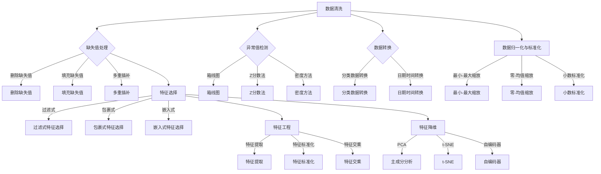
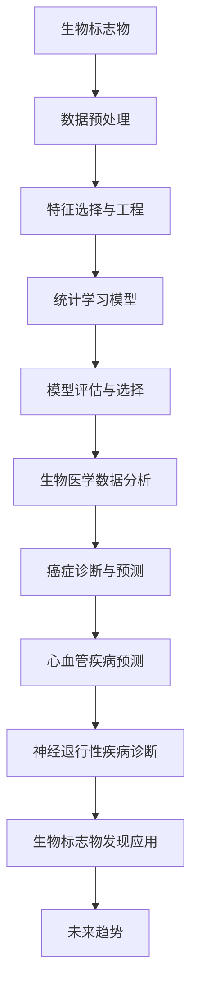

                 

### 文章标题

# 机器学习在生物标志物发现中的应用

### 关键词

- 机器学习
- 生物标志物
- 生物医学数据
- 数据预处理
- 统计学习理论

### 摘要

随着生物医学领域的不断发展，生物标志物的发现对于疾病诊断、治疗和预防具有重要意义。本文从机器学习在生物标志物发现中的应用出发，首先介绍了机器学习的基本概念、生物标志物的定义及其在医学中的重要性。随后，详细讨论了数据预处理、统计学习理论以及机器学习在基因表达数据分析、蛋白质组学数据分析、代谢组学数据分析以及多组学数据整合与分析中的应用。最后，本文通过具体案例展示了机器学习在癌症诊断、心血管疾病预测和神经退行性疾病诊断等领域的实际应用，并对生物标志物发现的未来趋势进行了展望。通过本文的阅读，读者将深入理解机器学习在生物标志物发现中的关键作用及其在生物医学研究中的广泛应用。

### 《机器学习在生物标志物发现中的应用》目录大纲

#### 第一部分：机器学习基础与生物医学数据

##### 第1章：引言与概述
- **1.1 机器学习在生物医学领域的重要性
- **1.2 生物标志物的概念与分类
- **1.3 生物医学数据的类型与挑战
- **1.4 本书结构

##### 第2章：机器学习基础
- **2.1 机器学习的基本概念
- **2.2 监督学习、无监督学习和强化学习
- **2.3 经典机器学习算法概述

##### 第3章：数据预处理
- **3.1 数据清洗
- **3.2 特征选择与工程
- **3.3 数据归一化与标准化

##### 第4章：统计学习理论
- **4.1 统计学习的基本理论
- **4.2 模型评估与选择
- **4.3 偏差与方差分析

#### 第二部分：生物医学数据中的机器学习应用

##### 第5章：基因表达数据分析
- **5.1 基因表达数据的类型与特征
- **5.2 主成分分析（PCA）
- **5.3 t-SNE与高斯混合模型

##### 第6章：蛋白质组学数据分析
- **6.1 蛋白质组学数据类型
- **6.2 蛋白质相互作用网络分析
- **6.3 蛋白质功能预测与分类

##### 第7章：代谢组学数据分析
- **7.1 代谢组学概述
- **7.2 代谢途径分析与网络构建
- **7.3 代谢物分类与生物标记物发现

##### 第8章：多组学数据整合与分析
- **8.1 多组学数据整合的概念与方法
- **8.2 数据整合中的挑战与解决方案
- **8.3 多组学数据驱动的生物标记物发现

#### 第三部分：生物标志物发现的应用与实践

##### 第9章：癌症生物标志物的发现
- **9.1 癌症生物标志物的现状与重要性
- **9.2 基于机器学习的癌症诊断与预测
- **9.3 案例研究：肺癌生物标志物的发现

##### 第10章：心血管疾病的生物标志物
- **10.1 心血管疾病的风险因素
- **10.2 基于机器学习的心血管疾病预测模型
- **10.3 案例研究：高血压生物标志物的发现

##### 第11章：神经退行性疾病的生物标志物
- **11.1 神经退行性疾病的类型与特征
- **11.2 基于机器学习的神经退行性疾病诊断
- **11.3 案例研究：阿尔茨海默病的生物标志物发现

##### 第12章：生物标志物发现的未来趋势
- **12.1 人工智能在生物医学研究中的应用前景
- **12.2 数据隐私与伦理问题
- **12.3 生物标志物发现的创新方法与技术

#### 附录

##### 附录A：机器学习与生物医学数据工具介绍
- **A.1 Python在生物医学数据分析中的应用
- **A.2 常用生物医学数据处理库
- **A.3 机器学习算法实现与优化

##### 附录B：参考资料与推荐阅读
- **B.1 机器学习经典书籍
- **B.2 生物医学领域的重要期刊
- **B.3 开源生物医学数据集与工具

### 引言与概述

#### 机器学习在生物医学领域的重要性

机器学习作为一种人工智能的重要分支，通过构建和训练模型，能够从大量数据中自动发现规律和模式，从而在各个领域中发挥着越来越重要的作用。在生物医学领域，机器学习不仅能够处理海量的生物医学数据，还能通过数据挖掘和模式识别技术，为疾病诊断、治疗和预防提供强有力的支持。

生物医学数据的复杂性使其成为机器学习应用的一个重要领域。生物医学数据包括基因表达数据、蛋白质组学数据、代谢组学数据等，这些数据往往具有高维度、高噪声、样本量小等特点。传统的生物统计学方法在处理这些数据时往往力不从心，而机器学习通过其强大的数据挖掘能力，可以有效地提取出有用的信息，为生物医学研究提供新的视角和工具。

机器学习在生物医学领域的主要应用包括疾病诊断、疾病预测、药物设计、个性化医疗等。例如，通过机器学习算法对患者的基因数据进行分析，可以发现与疾病相关的生物标志物，从而提高疾病的早期诊断和预测能力；在药物设计方面，机器学习可以用于发现新的药物靶点和优化药物分子结构，加速新药的发现和开发过程。

#### 生物标志物的概念与分类

生物标志物（biomarker）是指能够反映生物体内特定生理或病理状态的分子或细胞指标。在医学研究中，生物标志物具有重要的应用价值，它们可以作为疾病诊断的辅助手段，监测疾病的发展进程，评估治疗效果，甚至可以作为疾病预防的指标。

根据生物标志物在医学中的用途，可以将其分为以下几类：

1. **疾病诊断标志物**：这类标志物主要用于疾病的早期诊断和确诊，例如肝癌中的甲胎蛋白（AFP）。

2. **疾病进展标志物**：这些标志物用于监测疾病的进展和恶化，如乳腺癌中的雌激素受体（ER）和孕激素受体（PR）。

3. **疗效评估标志物**：这些标志物可以用于评估治疗效果，如治疗肿瘤后的肿瘤标志物水平变化。

4. **预后标志物**：这类标志物用于预测患者的预后和生存率，如肺癌中的细胞周期蛋白D1（CCND1）。

#### 生物医学数据的类型与挑战

生物医学数据类型繁多，主要包括以下几种：

1. **基因表达数据**：通过高通量基因测序技术获取，反映了基因在不同细胞类型或不同疾病状态下的表达水平。

2. **蛋白质组学数据**：通过质谱技术分析蛋白质的表达和修饰状态，提供了关于蛋白质组结构和功能的详细信息。

3. **代谢组学数据**：通过分析生物体内的代谢物，揭示了细胞内代谢途径和生物过程的动态变化。

4. **影像学数据**：包括CT、MRI、PET等影像学数据，提供了关于生物体结构和功能的重要信息。

生物医学数据具有以下几大挑战：

1. **数据量大**：生物医学数据往往具有高维度和海量特征，处理和分析这些数据需要高效算法和强大的计算资源。

2. **数据噪声**：生物医学数据往往存在噪声和缺失值，这会影响模型的准确性和稳定性。

3. **多模态数据整合**：生物医学数据通常涉及多个数据类型，如基因表达、蛋白质组和代谢组数据，如何有效地整合这些多模态数据是一个挑战。

4. **数据隐私和伦理问题**：生物医学数据涉及患者隐私，如何在保障患者隐私的前提下进行数据分析和共享也是一个重要问题。

#### 本书结构

本书分为三个部分：

1. **第一部分**介绍了机器学习的基础知识，包括基本概念、不同类型的机器学习算法以及数据预处理技术。

2. **第二部分**深入探讨了机器学习在生物医学数据中的具体应用，包括基因表达数据分析、蛋白质组学数据分析、代谢组学数据分析以及多组学数据整合与分析。

3. **第三部分**通过具体案例展示了机器学习在癌症诊断、心血管疾病预测和神经退行性疾病诊断等领域的应用，并展望了生物标志物发现的未来趋势。

通过本书的阅读，读者可以系统地了解机器学习在生物标志物发现中的应用，掌握相关技术原理和实践方法，为生物医学研究提供有力支持。

### 机器学习基础

#### 机器学习的基本概念

机器学习（Machine Learning，简称ML）是指通过构建和训练模型，使计算机系统能够从数据中自动学习和发现规律，进而进行预测和决策的一种技术。机器学习与传统的编程不同，后者依赖于显式的指令和规则，而前者则是通过算法从数据中提取模式和知识。

机器学习可以分为三种类型：监督学习、无监督学习和强化学习。每种类型都有其独特的特点和适用场景。

1. **监督学习（Supervised Learning）**：
   监督学习是机器学习中最常见的一种类型。它通过利用标记数据（即数据集同时包含输入特征和对应的目标标签）来训练模型，使模型能够学习到输入特征和目标标签之间的关系。监督学习的核心目标是找到一个最优的函数，能够将新的输入映射到正确的输出。常见的监督学习算法包括线性回归、逻辑回归、决策树、随机森林和神经网络等。

2. **无监督学习（Unsupervised Learning）**：
   无监督学习不依赖于标记数据，其主要任务是发现数据中的隐藏结构和模式。常见的无监督学习算法包括聚类（如K-Means、层次聚类）、降维（如主成分分析PCA、t-SNE）和关联规则学习（如Apriori算法）。无监督学习在探索性数据分析、数据挖掘和模式识别等领域有广泛应用。

3. **强化学习（Reinforcement Learning）**：
   强化学习是另一种重要的机器学习类型，它通过智能体与环境的交互来学习策略。在强化学习中，智能体通过尝试不同的行动来获取奖励或惩罚，以最大化总奖励。常见的强化学习算法包括Q-learning、SARSA和深度强化学习（如DQN、DDPG等）。强化学习在游戏、机器人控制和推荐系统等领域有着重要的应用。

#### 监督学习、无监督学习和强化学习的对比

- **目标**：
  - 监督学习：从已知特征和标签中学习规律，进行预测和分类。
  - 无监督学习：发现数据中的内在结构，如聚类、降维和关联规则。
  - 强化学习：通过与环境交互，学习最优策略以最大化奖励。

- **数据**：
  - 监督学习：需要标记的数据集，包含输入特征和标签。
  - 无监督学习：没有标记的数据集，需要通过算法发现数据中的内在结构。
  - 强化学习：通过与环境的交互，获取状态、行动和奖励的信息。

- **应用场景**：
  - 监督学习：广泛应用于图像识别、文本分类、预测分析等领域。
  - 无监督学习：用于探索性数据分析、数据挖掘、推荐系统等领域。
  - 强化学习：在游戏、机器人控制、推荐系统等领域有重要应用。

#### 经典机器学习算法概述

在机器学习领域，有许多经典的算法被广泛应用，以下介绍几种主要的经典机器学习算法：

1. **线性回归（Linear Regression）**：
   线性回归是最简单的监督学习算法之一，其目标是通过一个线性函数来预测输出值。线性回归模型假设输出值与输入特征之间存在线性关系，其基本形式为：
   $$ y = \beta_0 + \beta_1x_1 + \beta_2x_2 + ... + \beta_nx_n $$
   通过最小化预测值与实际值之间的平方误差，可以求解出模型参数。

2. **逻辑回归（Logistic Regression）**：
   逻辑回归是一种用于分类问题的监督学习算法，其核心思想是通过一个线性模型将输入特征映射到概率空间。逻辑回归的模型形式为：
   $$ P(y=1) = \frac{1}{1 + e^{-(\beta_0 + \beta_1x_1 + \beta_2x_2 + ... + \beta_nx_n)}} $$
   通过最大似然估计（MLE）可以求解出模型参数。

3. **决策树（Decision Tree）**：
   决策树是一种基于树结构的分类算法，其通过一系列的判断节点来对数据进行分类。每个节点都基于某个特征进行判断，根据判断结果将数据划分为不同的子集。决策树的模型形式为：
   $$ T = \sum_{i=1}^n a_i f_i(x) $$
   其中，$a_i$ 是决策树的叶子节点，$f_i(x)$ 是对应节点的特征。

4. **支持向量机（Support Vector Machine，SVM）**：
   支持向量机是一种用于分类和回归问题的算法，其目标是找到一个最优的超平面，将不同类别的数据点分隔开来。SVM的核心思想是最大化分类间隔，其模型形式为：
   $$ w^T x + b = 1 \quad \text{for } y=+1 $$
   $$ w^T x + b = -1 \quad \text{for } y=-1 $$
   其中，$w$ 是权重向量，$b$ 是偏置项。

5. **神经网络（Neural Network）**：
   神经网络是一种模拟生物神经系统的计算模型，其通过多层神经元进行数据处理和特征提取。神经网络的核心思想是多层感知机（MLP），其模型形式为：
   $$ a_{i+1} = \sigma(\sum_{j=1}^n w_{ji}a_j + b_i) $$
   其中，$a_i$ 是第$i$层的激活值，$\sigma$ 是激活函数，$w_{ji}$ 是权重，$b_i$ 是偏置。

这些经典机器学习算法在不同应用场景中有着广泛的应用，通过合理选择和优化算法，可以有效地解决各种实际问题。

#### 总结

机器学习作为一种强大的数据处理工具，在生物医学领域具有广泛的应用前景。理解机器学习的基本概念、不同类型的机器学习算法及其核心思想，是掌握机器学习在生物标志物发现中应用的关键。在接下来的章节中，我们将进一步探讨机器学习在生物医学数据中的具体应用，包括数据预处理、统计学习理论和各类生物医学数据的分析技术。

### 数据预处理

数据预处理是机器学习项目中至关重要的一步，其目的是提高数据质量，减少噪声和异常值的影响，从而优化模型性能。在生物医学数据中，数据预处理尤为关键，因为这类数据往往具有高维度、高噪声和缺失值等特点。以下将详细讨论数据清洗、特征选择与工程以及数据归一化与标准化等关键步骤。

#### 数据清洗

数据清洗是数据预处理的第一步，其主要目标是识别和修复数据中的噪声和异常值。在生物医学数据中，噪声可能来源于测量误差、设备故障或数据采集过程中的其他干扰。异常值则可能是由于数据采集过程中的错误操作、样本污染或其他意外情况。数据清洗的方法包括：

1. **缺失值处理**：缺失值是生物医学数据中的常见问题，可以通过以下几种方法处理：
   - **删除缺失值**：对于少量缺失值，可以考虑删除相关数据点，但这种方法可能会导致大量数据的丢失。
   - **填充缺失值**：使用统计方法或基于规则的方法填充缺失值，如使用平均值、中位数或基于临近值的方法进行插值。
   - **多重插补**：使用统计模型（如线性回归、决策树等）生成多个完整的数据集，然后对结果进行平均，以提高预测模型的稳定性。

2. **异常值检测**：异常值检测是识别数据集中的异常值和离群点，这些值可能会对模型性能产生负面影响。常见的异常值检测方法包括：
   - **箱线图（Box Plot）**：通过箱线图识别数据中的离群点，通常离群点位于箱线图上四分位距（IQR）之外。
   - **Z分数法**：计算每个数据点的Z分数，Z分数大于3或小于-3的数据点被认为是异常值。
   - **基于密度的方法**：使用高斯分布或基于密度的方法识别异常值，如局部异常因子（LOF）。

3. **数据转换**：为了提高数据的一致性和可解释性，有时需要对数据进行转换，如将分类数据转换为数值数据、将日期时间数据转换为年龄等。

#### 特征选择与工程

特征选择和特征工程是数据预处理中的关键步骤，其目的是从原始数据中提取最有用的特征，减少特征维度，提高模型性能。以下是几种常见的特征选择和特征工程方法：

1. **特征选择（Feature Selection）**：
   - **过滤式特征选择**：通过计算特征的重要性指标，如互信息、相关性等，筛选出重要的特征。
   - **包裹式特征选择**：通过枚举所有特征子集，找出最优特征子集，如前进选择、后退选择和递归特征消除。
   - **嵌入式特征选择**：在模型训练过程中进行特征选择，如L1正则化（Lasso）、随机森林等。

2. **特征工程（Feature Engineering）**：
   - **特征提取**：通过计算新的特征，如将原始特征进行组合、转换等，提高数据的表达能力。
   - **特征标准化**：将特征缩放到一个统一的尺度，如归一化和标准化。
   - **特征交乘**：将两个或多个特征进行组合，创建新的特征，以提高模型的解释能力。
   - **特征编码**：将类别型特征转换为数值型特征，如独热编码、标签编码等。

3. **特征降维（Feature Dimensionality Reduction）**：
   - **主成分分析（PCA）**：通过线性变换降低特征维度，保留主要信息。
   - **t-SNE**：通过非线性变换降低特征维度，使高维数据在低维空间中保持相似性。
   - **自编码器（Autoencoder）**：通过神经网络自动提取特征并进行降维。

#### 数据归一化与标准化

数据归一化和标准化是数据预处理中常用的方法，其目的是将数据缩放到一个统一的范围，以便于模型训练和计算。以下是几种常见的归一化和标准化方法：

1. **归一化（Normalization）**：
   - **最小-最大缩放**：将数据缩放到[0, 1]之间，公式为：
     $$ x' = \frac{x - x_{\text{min}}}{x_{\text{max}} - x_{\text{min}}} $$
   - **零-均值缩放**：将数据缩放到零均值和单位方差，公式为：
     $$ x' = \frac{x - \mu}{\sigma} $$
     其中，$\mu$ 是均值，$\sigma$ 是标准差。

2. **标准化（Standardization）**：
   - **Z标准化**：将数据缩放到零均值和单位方差，公式同上。
   - **小数标准化**：将数据缩放到特定的范围，如[-1, 1]，公式为：
     $$ x' = \frac{2(x - \mu)}{\sigma} - 1 $$

#### 总结

数据预处理是机器学习项目中不可或缺的步骤，其核心目标是通过清洗、选择和工程数据，提高数据质量和模型性能。在生物医学领域，由于数据具有高维度、高噪声和缺失值等特点，数据预处理显得尤为重要。通过合理的数据预处理方法，可以有效地减少噪声和异常值的影响，提取出有用的特征，从而提高模型在生物标志物发现中的准确性和可靠性。

#### 核心概念原理与架构Mermaid流程图



### 统计学习理论

统计学习理论（Statistical Learning Theory，简称SLT）是机器学习的理论基础，其主要目的是通过统计方法来研究学习问题，包括模型选择、估计理论和预测误差分析等。在生物医学数据中，统计学习理论为我们提供了评估和优化机器学习模型的重要工具。以下将详细讨论统计学习理论的基本概念、模型评估与选择、偏差与方差分析等内容。

#### 统计学习的基本概念

统计学习理论主要关注以下几个基本概念：

1. **假设空间（Hypothesis Space）**：
   假设空间是指所有可能的模型集合，表示为 $H$。在统计学习中，我们希望通过从假设空间中选择一个最佳模型来拟合数据。

2. **经验风险（Empirical Risk）**：
   经验风险是指模型在训练数据集上的风险，表示为 $R_{emp}(h)$。对于给定的训练集 $D$，经验风险是模型预测与实际标签之间的均方误差（MSE）或其他损失函数。

3. **期望风险（Expected Risk）**：
   期望风险是指模型在整个数据分布上的风险，表示为 $R(h)$。期望风险是模型在未知数据上的表现，是我们希望最小化的目标。

4. **泛化误差（Generalization Error）**：
   泛化误差是指模型在新数据上的表现，表示为 $E_{out}(h) = R(h) - R_{emp}(h)$。泛化误差是衡量模型性能的重要指标，反映了模型的泛化能力。

#### 模型评估与选择

在统计学习中，如何选择一个最优模型是一个关键问题。以下介绍几种常用的模型评估与选择方法：

1. **交叉验证（Cross-Validation）**：
   交叉验证是一种常用的模型评估方法，通过将数据集分为多个子集（称为折），轮流使用子集作为验证集，其余子集作为训练集，以评估模型的泛化能力。常见的交叉验证方法有K折交叉验证和留一法交叉验证。

2. **AIC和BIC**：
   AIC（Akaike Information Criterion）和BIC（Bayesian Information Criterion）是两种基于信息准则的模型选择方法。它们通过计算模型复杂度和拟合优度之间的平衡，来选择最优模型。

3. **交叉验证与AIC、BIC的比较**：
   - **交叉验证**：能够直接估计模型的泛化误差，但计算成本较高，适用于样本量较小的情况。
   - **AIC和BIC**：计算成本较低，适用于样本量较大的情况，但可能低估模型的泛化误差。

#### 偏差与方差分析

偏差（Bias）和方差（Variance）是评估模型性能的两个重要指标。以下分析偏差和方差对模型性能的影响：

1. **偏差（Bias）**：
   偏差是指模型的预测值与真实值之间的平均误差。高偏差意味着模型拟合不足，即模型过于简单，无法捕捉数据中的复杂结构。以下几种情况可能导致高偏差：
   - **模型选择不当**：选择的模型无法捕捉数据中的复杂关系。
   - **数据预处理不足**：数据预处理不充分，导致模型无法从数据中提取有效信息。

2. **方差（Variance）**：
   方差是指模型预测值的波动性。高方差意味着模型对训练数据的拟合过好，即模型过于复杂，容易受到噪声和异常值的影响。以下几种情况可能导致高方差：
   - **模型选择复杂**：选择的模型过于复杂，容易过拟合。
   - **数据噪声**：数据中存在噪声和异常值，使得模型难以找到真正的数据分布。

3. **偏差与方差的关系**：
   偏差和方差之间存在权衡关系，即减少一个会导致增加另一个。理想情况下，我们希望找到一个平衡点，使得偏差和方差都较小。

4. **偏差-方差权衡（Bias-Variance Tradeoff）**：
   在统计学习理论中，偏差-方差权衡是指选择一个合适的模型，使其偏差和方差之和最小。以下几种方法可以帮助实现偏差-方差权衡：
   - **增加训练数据**：增加训练数据可以减少模型的方差。
   - **模型正则化**：通过添加正则化项（如L1、L2正则化）可以减少模型的复杂性，从而降低方差。
   - **数据预处理**：通过数据清洗、特征选择和特征工程等预处理步骤，可以提高模型对数据的拟合能力，从而减少偏差。

#### 总结

统计学习理论为机器学习提供了重要的理论基础，包括模型选择、评估和优化等方面的方法。在生物医学数据中，统计学习理论可以帮助我们更好地理解和评估机器学习模型，从而提高模型在生物标志物发现中的性能。通过合理选择模型、评估模型性能，并考虑偏差与方差的关系，我们可以有效地提高模型在生物医学应用中的准确性和可靠性。

### 基因表达数据分析

基因表达数据是生物医学研究中非常重要的数据类型，通过基因表达数据分析，我们可以揭示基因在不同细胞类型或不同疾病状态下的表达模式，从而发现潜在的生物标志物。本节将介绍基因表达数据的类型与特征，以及常用的数据分析方法，如主成分分析（PCA）和t-SNE。

#### 基因表达数据的类型与特征

基因表达数据主要来源于高通量基因测序技术，如RNA测序（RNA-Seq）和微阵列技术（Microarray）。以下是两种主要的基因表达数据类型及其特征：

1. **RNA测序（RNA-Seq）**：
   RNA测序是一种高通量基因表达分析方法，可以直接测量mRNA的丰度。RNA-Seq具有以下特征：
   - **高分辨率**：RNA-Seq能够检测到基因表达中的微小变化，具有较高的分辨率。
   - **全基因组覆盖**：RNA-Seq可以覆盖整个基因组，提供全面的表达谱。
   - **定量信息**：RNA-Seq提供定量信息，可以准确比较不同样本或条件下的基因表达水平。

2. **微阵列技术（Microarray）**：
   微阵列技术通过固定的探针阵列来测量基因表达水平，具有以下特征：
   - **高通量**：微阵列可以在一次实验中同时分析数千个基因的表达水平。
   - **半定量信息**：微阵列技术通常提供半定量信息，无法精确测量基因表达水平。
   - **部分基因组覆盖**：微阵列通常仅覆盖部分基因组，对于新的基因或突变基因的检测能力有限。

#### 主成分分析（PCA）

主成分分析（Principal Component Analysis，PCA）是一种常用的降维技术，通过将高维数据投影到低维空间中，保留主要信息，从而简化数据分析。PCA的核心思想是通过计算协方差矩阵，找到数据的主成分，即数据的最大方差方向，然后将数据投影到这些方向上。

以下是主成分分析的基本步骤：

1. **标准化数据**：为了消除不同特征间的量纲影响，首先对数据进行标准化，使其具有相同的方差。

2. **计算协方差矩阵**：通过计算数据的协方差矩阵，找到数据之间的相关性。

3. **计算特征值和特征向量**：通过求解协方差矩阵的特征值和特征向量，找到主成分。

4. **选择主成分**：根据特征值的大小，选择前几个主要特征向量，作为低维空间的坐标轴。

5. **数据投影**：将原始数据投影到低维空间中，从而实现降维。

PCA在基因表达数据分析中的应用主要包括：

- **数据可视化**：通过将高维基因表达数据投影到二维或三维空间，可以直观地展示基因间的相似性和差异性。
- **特征提取**：通过PCA提取主要特征，可以减少数据维度，提高后续分析模型的计算效率。
- **异常值检测**：通过PCA，可以识别数据中的异常值和离群点，从而进行数据清洗和预处理。

#### t-SNE

t-Distributed Stochastic Neighbor Embedding（t-SNE）是一种非线性降维技术，通过将高维数据映射到低维空间中，保持数据之间的局部结构。t-SNE的核心思想是使用t分布来模拟高维空间中的相似性，然后在低维空间中重新构建这种相似性。

以下是t-SNE的基本步骤：

1. **计算高维空间中的相似性矩阵**：通过高斯分布或t分布计算数据点之间的相似性矩阵。

2. **低维空间中构建相似性矩阵**：通过优化目标函数，调整低维空间中数据点的位置，使其符合高维空间中的相似性矩阵。

3. **迭代优化**：通过迭代优化算法（如梯度下降），不断调整低维空间中数据点的位置，直到目标函数收敛。

t-SNE在基因表达数据分析中的应用主要包括：

- **数据可视化**：通过t-SNE将高维基因表达数据映射到二维空间，可以直观地展示基因之间的相似性和差异性。
- **分类与聚类**：t-SNE可以用于分类和聚类分析，通过观察低维空间中的聚类结构，可以更好地理解基因表达数据的生物学意义。
- **生物标记物发现**：通过t-SNE识别基因表达数据中的显著聚类，可以揭示潜在的生物标记物。

#### 主成分分析（PCA）与t-SNE的比较

- **原理**：
  - PCA：基于线性变换，通过保留主要方差来实现降维。
  - t-SNE：基于t分布，通过保持局部结构来实现降维。

- **适用场景**：
  - PCA：适用于数据维度较高且主要结构为线性时，可用于数据可视化和特征提取。
  - t-SNE：适用于数据维度较高且结构复杂、非线性时，可用于数据可视化和分类分析。

- **计算成本**：
  - PCA：计算成本较低，适合大规模数据处理。
  - t-SNE：计算成本较高，适合小规模数据处理。

#### 总结

基因表达数据分析在生物医学研究中具有重要意义，通过RNA测序和微阵列技术获取基因表达数据，结合主成分分析（PCA）和t-SNE等降维技术，可以有效地揭示基因表达数据的生物学意义，发现潜在的生物标志物。在接下来的章节中，我们将继续探讨蛋白质组学数据分析、代谢组学数据分析以及多组学数据整合与分析，深入探讨机器学习在生物医学领域的广泛应用。

### 蛋白质组学数据分析

蛋白质组学（Proteomics）是研究细胞内全部蛋白质的表达和修饰状态的科学。通过蛋白质组学数据分析，我们可以揭示蛋白质在不同生物过程、细胞状态和疾病状态下的变化规律，从而发现潜在的生物标志物。本节将介绍蛋白质组学数据类型、蛋白质相互作用网络分析以及蛋白质功能预测与分类。

#### 蛋白质组学数据类型

蛋白质组学数据主要来源于质谱技术（Mass Spectrometry，MS），常见的蛋白质组学数据类型包括：

1. **蛋白质谱（Peptide Spectra）**：
   质谱技术通过测量离子化后的蛋白质或肽段的质量和电荷比，生成蛋白质谱。蛋白质谱是蛋白质组学数据分析的基本数据单位，包含了蛋白质或肽段的氨基酸序列和修饰信息。

2. **蛋白质定量数据（Protein Quantification Data）**：
   通过比较蛋白质谱的丰度，可以定量分析蛋白质的表达水平。蛋白质定量数据提供了关于蛋白质相对丰度的信息，有助于理解细胞或组织中的蛋白质动态变化。

3. **蛋白质-蛋白质相互作用数据（Protein-Protein Interaction Data）**：
   蛋白质-蛋白质相互作用（Protein-Protein Interaction，PPI）网络描述了细胞内不同蛋白质之间的相互作用关系。这些数据通常来源于共沉淀实验（如Co-Immunoprecipitation，Co-IP）或质谱分析。

4. **蛋白质修饰数据（Post-translational Modification Data）**：
   蛋白质修饰是指蛋白质在翻译后发生的共价修饰，如磷酸化、乙酰化和泛素化等。这些修饰影响蛋白质的功能和稳定性，通过质谱技术可以识别和定量分析蛋白质修饰。

#### 蛋白质相互作用网络分析

蛋白质相互作用网络（Protein-Protein Interaction Network，PPI Network）是描述细胞内蛋白质之间相互作用的网络结构。通过分析PPI网络，可以揭示蛋白质之间的复杂关系，发现潜在的信号传导途径和调控网络。

以下是PPI网络分析的基本步骤：

1. **数据收集**：从公共数据库（如STRING、BioGrid）或实验数据中获取PPI网络数据。

2. **网络构建**：将PPI数据转化为网络结构，每个节点表示一个蛋白质，边表示蛋白质之间的相互作用。

3. **网络分析**：
   - **核心网络识别**：通过计算节点度、聚类系数等网络拓扑属性，识别核心蛋白质和关键相互作用。
   - **信号通路分析**：通过路径分析（如Reactome、KEGG）识别PPI网络中的信号传导途径。
   - **模块分析**：通过社区检测算法（如Gephi、Cytoscape）识别PPI网络中的功能模块。

4. **网络可视化**：使用网络可视化工具（如Cytoscape、Gephi）将PPI网络以图形化方式展示，便于分析者和用户理解网络结构。

PPI网络分析在生物医学研究中的意义包括：

- **疾病机制研究**：通过分析疾病相关蛋白质的相互作用，可以揭示疾病的分子机制和关键驱动因素。
- **药物靶点发现**：PPI网络可以帮助识别潜在的药物靶点，为药物设计和疾病治疗提供新思路。
- **生物标志物发现**：通过识别PPI网络中的关键蛋白质和相互作用，可以发现潜在的生物标志物，用于疾病诊断和预测。

#### 蛋白质功能预测与分类

蛋白质功能预测是指通过计算方法预测蛋白质的功能，而蛋白质分类则是将蛋白质按照其功能进行归类。以下介绍几种常用的蛋白质功能预测和分类方法：

1. **序列比对（Sequence Alignment）**：
   通过将待预测蛋白质的氨基酸序列与已知蛋白质序列进行比对，利用序列相似性进行功能预测。序列比对工具如BLAST、FASTA等可以高效地进行序列比对。

2. **支持向量机（Support Vector Machine，SVM）**：
   支持向量机是一种常用的分类算法，通过构建分类模型，将蛋白质分类到不同的功能类别。SVM可以处理高维数据，并在蛋白质分类中表现出良好的性能。

3. **深度学习（Deep Learning）**：
   深度学习通过构建多层神经网络，自动学习蛋白质序列中的特征和模式，进行功能预测和分类。卷积神经网络（CNN）和循环神经网络（RNN）等深度学习模型在蛋白质功能预测中取得了显著成果。

4. **集成学习方法**：
   集成学习方法通过组合多个基学习器的预测结果，提高预测的准确性和稳定性。随机森林（Random Forest）、Adaboost等集成学习方法在蛋白质功能预测中得到了广泛应用。

#### 蛋白质组学数据分析应用案例

以下是一个蛋白质组学数据分析的实际案例：

**案例背景**：研究团队旨在通过蛋白质组学数据分析揭示肺癌的分子机制和潜在生物标志物。

**数据来源**：通过质谱技术获取了肺癌患者和正常对照样本的蛋白质谱数据。

**数据分析流程**：
1. **数据预处理**：包括蛋白质谱的峰识别、定量分析和质量控制。
2. **蛋白质相互作用网络构建**：通过蛋白质谱数据，构建肺癌患者和正常对照样本的PPI网络。
3. **差异表达蛋白质分析**：通过比较两组样本的蛋白质表达水平，识别差异表达蛋白质。
4. **生物标志物筛选**：结合临床数据和生物信息学方法，筛选潜在的肺癌生物标志物。
5. **功能富集分析**：对差异表达蛋白质进行功能富集分析，揭示潜在的生物学途径。

**结果与讨论**：
- **差异表达蛋白质**：发现肺癌患者样本中多个蛋白质表达上调或下调，包括细胞周期蛋白D1（CCND1）和基质金属蛋白酶2（MMP2）。
- **生物标志物筛选**：筛选出若干具有潜在诊断价值的生物标志物，如CEACAM5和C5A。
- **功能富集分析**：发现差异表达蛋白质主要涉及细胞增殖、细胞凋亡和细胞外基质重塑等生物学途径。

**结论**：该案例展示了蛋白质组学数据分析在肺癌研究中的应用，通过揭示差异表达蛋白质和生物标志物，有助于深入理解肺癌的分子机制，为肺癌的诊断和治疗提供新思路。

#### 总结

蛋白质组学数据分析是生物医学研究中重要的一部分，通过质谱技术和生物信息学方法，可以揭示蛋白质在生物过程中的动态变化，发现潜在的生物标志物。蛋白质相互作用网络分析和蛋白质功能预测与分类等方法是蛋白质组学数据分析的核心技术，为生物医学研究提供了新的视角和工具。在接下来的章节中，我们将继续探讨代谢组学数据分析以及多组学数据整合与分析，深入探讨机器学习在生物医学领域的广泛应用。

### 代谢组学数据分析

代谢组学（Metabolomics）是研究生物体内所有代谢物的组成和动态变化的一门科学。通过代谢组学数据分析，可以揭示细胞内代谢途径的调控机制，发现与疾病相关的生物标志物。本节将介绍代谢组学的基本概念、数据类型、代谢途径分析与网络构建，以及代谢物分类与生物标志物发现。

#### 代谢组学的基本概念

代谢组学通过对生物体内代谢物进行全面分析，揭示了细胞代谢的动态变化。代谢组学的主要目标包括：

1. **揭示代谢途径**：通过分析代谢物谱，揭示生物体内的代谢途径和代谢网络。
2. **发现生物标志物**：识别与疾病、药物反应或其他生理状态相关的代谢物，作为诊断和预测的生物标志物。
3. **理解代谢调控**：研究代谢物之间的相互作用和调控机制，揭示生物体内代谢的调控网络。

#### 代谢组学数据类型

代谢组学数据主要来源于液相色谱-质谱联用技术（LC-MS）、气相色谱-质谱联用技术（GC-MS）和其他相关技术。以下是几种常见的代谢组学数据类型：

1. **质谱数据（Mass Spectrometry Data）**：
   质谱技术通过测量离子化后的代谢物的质量和电荷比，生成质谱信号。质谱数据通常包括质量（m/z）和强度（intensity）两个维度。

2. **色谱数据（Chromatography Data）**：
   色谱技术用于分离复杂的代谢物混合物，质谱技术用于检测和定量分析。色谱数据通常包括时间（retention time）和质量（m/z）信息。

3. **多维数据（Multi-dimensional Data）**：
   多维数据集结合了质谱和色谱信息，提供了更详细的代谢物特征。这种数据类型有助于提高代谢物的识别和定量精度。

#### 代谢途径分析与网络构建

代谢途径分析是代谢组学数据分析的核心，通过分析代谢物谱，可以揭示生物体内的代谢途径和代谢网络。以下介绍几种常用的代谢途径分析方法和网络构建技术：

1. **主成分分析（PCA）**：
   主成分分析是一种常用的降维和可视化技术，通过将高维数据投影到低维空间中，揭示代谢物的全局分布和差异。PCA有助于识别不同样本之间的代谢差异和潜在的关键代谢途径。

2. **偏最小二乘判别分析（PLS-DA）**：
   偏最小二乘判别分析是一种监督学习方法，通过构建回归模型，将不同样本的代谢物特征与样本标签相关联。PLS-DA可以用于区分不同样本组，识别潜在的生物标志物。

3. **网络构建技术**：
   通过代谢途径数据库（如Reactome、MetaboAnnotator）和生物信息学工具（如KEGG、Pathway Commons），可以构建代谢物之间的相互作用网络和代谢途径。网络构建技术有助于揭示代谢物之间的相互关系和生物信号传导途径。

#### 代谢物分类与生物标志物发现

代谢物分类是将代谢物根据其结构和功能进行分类，以方便进一步分析。生物标志物发现是指识别与特定疾病、生理状态或药物反应相关的代谢物，作为诊断和预测的指标。以下介绍几种代谢物分类与生物标志物发现的方法：

1. **特征选择方法**：
   通过计算代谢物的特征值（如质量、强度、保留时间等），选择对分类任务有显著贡献的代谢物。常用的特征选择方法包括主成分分析（PCA）、偏最小二乘（PLS）和随机森林（RF）等。

2. **机器学习方法**：
   利用机器学习算法（如支持向量机SVM、随机森林RF、神经网络NN等）进行分类和预测。通过训练模型，将代谢物特征与样本标签相关联，识别出具有高分类能力的代谢物。

3. **多变量统计方法**：
   利用多变量统计方法（如独立成分分析ICA、主成分回归PCR等），识别与疾病相关的代谢物变化模式。这些方法有助于发现潜在的生物标志物。

#### 应用案例

以下是一个代谢组学数据分析的应用案例：

**案例背景**：研究团队旨在通过代谢组学数据分析揭示糖尿病的代谢特征和生物标志物。

**数据来源**：通过液相色谱-质谱联用技术（LC-MS）获取了糖尿病和正常对照样本的代谢物谱数据。

**数据分析流程**：
1. **数据预处理**：包括数据标准化、去除噪声和缺失值处理。
2. **代谢物识别与定量**：通过质谱数据，识别和定量分析代谢物。
3. **主成分分析（PCA）**：将高维代谢物数据投影到二维空间，可视化样本分布和差异。
4. **偏最小二乘判别分析（PLS-DA）**：构建回归模型，区分糖尿病和正常对照样本。
5. **代谢物分类与生物标志物筛选**：利用特征选择和机器学习方法，筛选与糖尿病相关的代谢物，并验证其诊断性能。

**结果与讨论**：
- **代谢物差异分析**：发现糖尿病样本中多个代谢物显著上调或下调，包括胆汁酸、糖类和脂肪酸等。
- **生物标志物筛选**：筛选出多个具有潜在诊断价值的代谢物，如3-羟基丁酸和1-羟基丙酮。
- **验证与验证**：通过外部数据集和交叉验证，验证筛选出的生物标志物的诊断性能。

**结论**：该案例展示了代谢组学数据分析在糖尿病研究中的应用，通过揭示代谢特征和发现生物标志物，有助于深入理解糖尿病的病理机制，为糖尿病的早期诊断和预测提供新方法。

#### 总结

代谢组学数据分析是揭示生物体内代谢途径和疾病机制的重要工具。通过代谢物识别、代谢途径分析、生物标志物发现等方法，可以揭示生物体内的代谢变化，发现与疾病相关的生物标志物。代谢组学数据具有高维度、高噪声等特点，需要结合多种数据分析方法和技术，以提高模型的准确性和可靠性。在接下来的章节中，我们将探讨多组学数据整合与分析，深入探讨机器学习在生物医学领域的广泛应用。

### 多组学数据整合与分析

在生物医学研究中，单一组学数据（如基因表达、蛋白质组、代谢组）往往无法提供完整的生物学信息。为了全面理解生物系统的复杂性和动态变化，多组学数据整合与分析成为了研究的关键。本节将介绍多组学数据整合的概念与方法，讨论数据整合中的挑战与解决方案，以及多组学数据驱动的生物标志物发现。

#### 多组学数据整合的概念与方法

多组学数据整合是指将来自不同组学（如基因组学、转录组学、蛋白质组学、代谢组学）的数据结合在一起，以获取更全面、深入的生物学信息。多组学数据整合的方法主要包括：

1. **数据融合**：
   - **基于特征的融合**：将不同组学数据中的相同特征（如基因、蛋白质、代谢物）进行匹配和整合。
   - **基于路径的融合**：通过生物途径或网络将不同组学数据进行关联，如利用基因组数据中的基因与蛋白质组数据中的蛋白质相互作用网络进行关联。

2. **多模态数据集成**：
   - **共变量分析**：通过共变量分析，将不同组学数据中的共变量（如基因表达水平、蛋白质丰度、代谢物浓度）进行整合，以揭示生物学相关性。
   - **多任务学习**：利用多任务学习框架，将不同组学数据作为不同的任务进行训练，以提高模型对全局生物信息的理解。

3. **多尺度整合**：
   - **细胞尺度和组织尺度的整合**：将细胞尺度的组学数据与组织尺度的组学数据进行整合，以揭示细胞与组织之间的相互作用和调控关系。
   - **时间和空间整合**：通过整合不同时间点或空间位置上的组学数据，揭示生物过程的动态变化和空间分布。

#### 数据整合中的挑战与解决方案

多组学数据整合面临以下挑战：

1. **数据异质性**：
   - **数据类型差异**：不同组学数据（如基因表达、蛋白质表达、代谢物浓度）具有不同的数据类型和量纲，需要统一处理。
   - **数据分辨率差异**：不同组学技术的分辨率不同，如基因组数据具有高分辨率，而代谢组数据分辨率较低。

2. **数据噪声与缺失值**：
   - **数据噪声**：不同组学数据在采集和处理过程中可能引入噪声，影响数据整合和分析结果。
   - **缺失值处理**：不同组学数据之间存在缺失值，需要合理处理以保证整合数据的完整性。

3. **数据维度与计算成本**：
   - **高维数据**：多组学数据通常包含大量特征，高维数据会增加模型训练和计算的复杂性。
   - **计算成本**：多组学数据整合需要大量的计算资源和时间。

为了应对上述挑战，可以采取以下解决方案：

1. **标准化与归一化**：
   - **数据标准化**：对不同组学数据进行标准化处理，使其具有相同的量纲和范围。
   - **数据归一化**：对高维数据使用归一化方法，如Z-score归一化，减少数据维度和计算成本。

2. **多模态数据融合技术**：
   - **共变量分析**：利用共变量分析减少数据维度，提高数据融合的准确性和效率。
   - **多任务学习**：通过多任务学习框架，同时训练不同组学数据的模型，提高整合数据的准确性。

3. **降维技术**：
   - **主成分分析（PCA）**：用于降维和特征提取，保留主要信息，减少计算复杂度。
   - **t-SNE**：用于数据可视化，揭示数据中的潜在结构和模式。

4. **分布式计算与并行处理**：
   - **分布式计算**：利用分布式计算框架（如Hadoop、Spark）处理大规模多组学数据。
   - **并行处理**：通过并行计算技术，提高数据整合和分析的效率。

#### 多组学数据驱动的生物标志物发现

多组学数据整合为生物标志物发现提供了丰富的信息资源。通过多组学数据融合，可以揭示不同组学数据之间的关联性，识别潜在的生物标志物。以下介绍几种多组学数据驱动的生物标志物发现方法：

1. **联合特征选择**：
   - **特征相关性分析**：通过计算不同组学特征之间的相关性，选择与疾病相关的特征进行整合。
   - **机器学习算法**：利用机器学习算法（如支持向量机SVM、随机森林RF等），从整合数据中提取具有高分类能力的特征。

2. **多模态模型训练**：
   - **集成学习**：结合不同组学数据的模型，通过集成学习方法（如Adaboost、Stacking等）提高预测性能。
   - **多任务学习**：同时训练不同组学数据的多任务模型，提高生物标志物的识别能力。

3. **共变量分析**：
   - **共变量筛选**：通过共变量筛选识别与疾病相关的关键特征，实现多组学数据的整合。
   - **共变量回归**：利用共变量回归模型，识别与疾病相关的关键代谢物、基因和蛋白质。

#### 应用案例

以下是一个多组学数据整合与分析的应用案例：

**案例背景**：研究团队旨在通过多组学数据整合揭示肝癌的分子机制和生物标志物。

**数据来源**：通过基因组学、转录组学、蛋白质组学和代谢组学技术，获取了肝癌患者和正常对照样本的多组学数据。

**数据分析流程**：
1. **数据预处理**：包括数据标准化、缺失值处理和降维。
2. **数据整合**：利用共变量分析和多模态数据融合技术，将不同组学数据进行整合。
3. **特征选择**：通过联合特征选择和机器学习算法，提取与肝癌相关的关键特征。
4. **生物标志物发现**：利用多任务学习和共变量分析，发现与肝癌相关的生物标志物。
5. **模型验证**：通过交叉验证和外部数据集验证，评估生物标志物的诊断性能。

**结果与讨论**：
- **特征选择**：发现多个基因、蛋白质和代谢物与肝癌显著相关。
- **生物标志物发现**：筛选出多个具有潜在诊断价值的生物标志物，如基因PTEN、代谢物谷胱甘肽。
- **模型验证**：验证筛选出的生物标志物在肝癌诊断中的高准确性和特异性。

**结论**：该案例展示了多组学数据整合在肝癌研究中的应用，通过发现与肝癌相关的生物标志物，有助于深入理解肝癌的分子机制，为肝癌的早期诊断和预后预测提供新方法。

#### 总结

多组学数据整合与分析是生物医学研究中重要的技术手段，通过整合不同组学数据，可以揭示生物系统的复杂性和动态变化，发现潜在的生物标志物。面对数据异质性、噪声和计算成本等挑战，需要结合多种数据整合方法和先进计算技术。多组学数据整合为生物标志物发现提供了丰富的信息资源，有助于推动生物医学研究的发展。在接下来的章节中，我们将探讨机器学习在癌症诊断、心血管疾病预测和神经退行性疾病诊断等领域的应用。

### 癌症生物标志物的发现

癌症作为全球范围内的主要健康威胁之一，其早期诊断和精准治疗对提高患者生存率和生活质量具有重要意义。机器学习技术在癌症生物标志物的发现中发挥了关键作用，通过分析大量的生物医学数据，识别出与癌症相关的生物标志物。以下将介绍癌症生物标志物的现状与重要性，以及基于机器学习的癌症诊断与预测方法，并通过具体案例研究肺癌生物标志物的发现。

#### 癌症生物标志物的现状与重要性

癌症生物标志物是指在癌症发生、发展、诊断和预后评估过程中，具有特异性或灵敏性的生物分子或细胞指标。目前，已发现多种癌症生物标志物，如：

- **基因标志物**：包括突变基因（如BRCA1/BRCA2基因与乳腺癌）、扩增基因（如HER2基因与乳腺癌）等。
- **蛋白质标志物**：如癌胚抗原（CEA）与结肠癌、前列腺特异性抗原（PSA）与前列腺癌等。
- **代谢标志物**：如甲胎蛋白（AFP）与肝癌、绒毛膜促性腺激素（hCG）与生殖细胞肿瘤等。

这些生物标志物在癌症诊断、预后评估和个性化治疗中具有重要作用。具体来说：

1. **早期诊断**：癌症生物标志物有助于在癌症早期阶段进行诊断，提高治愈率。
2. **预后评估**：某些生物标志物可以预测癌症患者的预后和生存率，为治疗方案选择提供依据。
3. **个性化治疗**：根据癌症患者的生物标志物特征，可以制定个体化的治疗方案，提高治疗效果。

#### 基于机器学习的癌症诊断与预测方法

机器学习技术在癌症诊断与预测中具有广泛应用，通过以下方法实现：

1. **特征提取与选择**：从大量的生物医学数据中提取和选择最有用的特征，如基因表达、蛋白质丰度和代谢物浓度等。特征提取与选择有助于提高模型性能，减少计算成本。

2. **模型构建与训练**：利用监督学习算法（如支持向量机SVM、随机森林RF、神经网络NN等）构建预测模型，通过训练数据学习生物标志物与癌症之间的关联性。

3. **模型评估与优化**：使用交叉验证和外部验证等方法评估模型性能，通过调整模型参数和算法优化，提高预测准确性和可靠性。

4. **多组学数据整合**：整合来自不同组学（如基因组学、转录组学、蛋白质组学、代谢组学）的数据，提高癌症诊断与预测的全面性和准确性。

#### 案例研究：肺癌生物标志物的发现

以下是一个基于机器学习技术的肺癌生物标志物发现案例：

**背景**：肺癌是全球癌症死亡的主要原因之一，早期诊断对于提高患者生存率至关重要。研究旨在通过机器学习技术发现与肺癌相关的生物标志物。

**数据来源**：研究团队收集了肺癌患者和正常对照样本的基因组、转录组、蛋白质组和代谢组数据。

**数据分析流程**：
1. **数据预处理**：对多组学数据进行标准化、缺失值处理和降维。
2. **特征提取**：从不同组学数据中提取具有显著差异的特征，如基因表达变化、蛋白质丰度变化和代谢物浓度变化。
3. **特征选择**：利用机器学习算法（如随机森林RF）筛选出对肺癌诊断具有高分类能力的特征。
4. **模型构建与训练**：使用支持向量机SVM构建预测模型，通过交叉验证进行模型训练和参数优化。
5. **模型评估与验证**：通过外部数据集验证模型性能，评估生物标志物的诊断准确性和特异性。
6. **生物标志物筛选**：从特征筛选结果中筛选出与肺癌显著相关的生物标志物。

**结果与讨论**：
- **特征筛选结果**：从多组学数据中筛选出若干具有高分类能力的特征，如基因表达标记、蛋白质标志物和代谢物。
- **模型性能评估**：通过交叉验证和外部验证，评估模型在肺癌诊断中的性能，结果显示高准确性和高特异性。
- **生物标志物筛选**：筛选出多个与肺癌显著相关的生物标志物，如基因MUC1、蛋白质PDL-1和代谢物胆碱。

**结论**：该案例展示了基于机器学习技术的肺癌生物标志物发现，通过整合多组学数据，可以识别出具有高诊断价值的生物标志物，为肺癌的早期诊断和精准治疗提供了新方法。

#### 总结

癌症生物标志物的发现对于癌症的诊断、治疗和预防具有重要意义。机器学习技术通过分析大量的生物医学数据，能够识别出与癌症相关的生物标志物，提高癌症诊断的准确性和预测能力。在未来的研究中，可以通过进一步整合多组学数据和优化机器学习算法，发现更多具有临床应用价值的生物标志物，为癌症的早期诊断和精准治疗提供有力支持。

### 心血管疾病的生物标志物

心血管疾病是全球范围内导致死亡和残疾的主要原因之一。早期诊断和预测心血管疾病的发生对于降低患者风险、改善预后具有重要意义。机器学习技术在这一领域中发挥了关键作用，通过分析大量的生物医学数据，识别出与心血管疾病相关的生物标志物。以下将介绍心血管疾病的风险因素，以及基于机器学习的预测模型，并通过具体案例研究高血压生物标志物的发现。

#### 心血管疾病的风险因素

心血管疾病的风险因素主要包括以下几个方面：

1. **年龄**：随着年龄的增长，心血管疾病的风险逐渐增加。
2. **性别**：男性比女性更容易患心血管疾病。
3. **高血压**：高血压是心血管疾病的重要风险因素，可导致动脉硬化和心血管事件。
4. **高胆固醇**：高胆固醇水平可导致动脉粥样硬化，增加心血管疾病风险。
5. **糖尿病**：糖尿病患者的动脉硬化风险较高，容易引发心血管疾病。
6. **吸烟**：吸烟是心血管疾病的重要危险因素，可损害血管内皮功能。
7. **肥胖**：肥胖者患高血压、糖尿病等心血管疾病的风险增加。
8. **家族史**：有心血管疾病家族史的人群患病的风险较高。

#### 基于机器学习的预测模型

机器学习技术在心血管疾病预测中具有广泛应用，通过以下方法实现：

1. **特征提取**：从大量的生物医学数据（如基因表达、蛋白质组、代谢组、影像学等）中提取具有预测价值的特征。
2. **模型构建与训练**：利用监督学习算法（如支持向量机SVM、随机森林RF、神经网络NN等）构建预测模型，通过训练数据学习风险因素与心血管事件之间的关联性。
3. **模型评估与优化**：使用交叉验证和外部验证等方法评估模型性能，通过调整模型参数和算法优化，提高预测准确性和可靠性。
4. **多组学数据整合**：整合来自不同组学（如基因组学、转录组学、蛋白质组学、代谢组学）的数据，提高预测模型的全面性和准确性。

#### 案例研究：高血压生物标志物的发现

以下是一个基于机器学习技术的高血压生物标志物发现案例：

**背景**：高血压是全球范围内的重要健康问题，早期诊断和预测有助于降低心血管疾病风险。研究旨在通过机器学习技术发现与高血压相关的生物标志物。

**数据来源**：研究团队收集了高血压患者和正常对照样本的基因组、转录组、蛋白质组和代谢组数据。

**数据分析流程**：
1. **数据预处理**：对多组学数据进行标准化、缺失值处理和降维。
2. **特征提取**：从不同组学数据中提取具有显著差异的特征，如基因表达变化、蛋白质丰度变化和代谢物浓度变化。
3. **特征选择**：利用机器学习算法（如随机森林RF）筛选出对高血压诊断具有高分类能力的特征。
4. **模型构建与训练**：使用支持向量机SVM构建预测模型，通过交叉验证进行模型训练和参数优化。
5. **模型评估与验证**：通过外部数据集验证模型性能，评估生物标志物的诊断准确性和特异性。
6. **生物标志物筛选**：从特征筛选结果中筛选出与高血压显著相关的生物标志物。

**结果与讨论**：
- **特征筛选结果**：从多组学数据中筛选出若干具有高分类能力的特征，如基因表达标记、蛋白质标志物和代谢物。
- **模型性能评估**：通过交叉验证和外部验证，评估模型在高血压诊断中的性能，结果显示高准确性和高特异性。
- **生物标志物筛选**：筛选出多个与高血压显著相关的生物标志物，如基因ACE、蛋白质VEGFR2和代谢物尿酸。

**结论**：该案例展示了基于机器学习技术的高血压生物标志物发现，通过整合多组学数据，可以识别出具有高诊断价值的生物标志物，为高血压的早期诊断和精准治疗提供了新方法。

#### 总结

心血管疾病的早期诊断和预测对于降低患者风险、改善预后具有重要意义。机器学习技术通过分析大量的生物医学数据，能够识别出与心血管疾病相关的生物标志物，提高诊断和预测的准确性和可靠性。在未来的研究中，可以通过进一步整合多组学数据和优化机器学习算法，发现更多具有临床应用价值的生物标志物，为心血管疾病的预防和治疗提供有力支持。

### 神经退行性疾病的生物标志物

神经退行性疾病如阿尔茨海默病（Alzheimer's Disease，AD）和帕金森病（Parkinson's Disease，PD）是影响老年人健康的重大疾病，其诊断和治疗一直面临着巨大的挑战。机器学习技术在神经退行性疾病生物标志物的发现中发挥了重要作用，通过分析大量的生物医学数据，识别出与疾病相关的生物标志物。以下将介绍神经退行性疾病的类型与特征，基于机器学习的诊断方法，并通过具体案例研究阿尔茨海默病的生物标志物发现。

#### 神经退行性疾病的类型与特征

神经退行性疾病包括多种类型，常见的有阿尔茨海默病、帕金森病、亨廷顿病等。这些疾病的共同特征是神经元退化、突触丢失和神经功能丧失。以下是几种主要神经退行性疾病的类型与特征：

1. **阿尔茨海默病（AD）**：
   - **类型**：最常见的神经退行性疾病，约占所有痴呆病例的60-80%。
   - **特征**：大脑中神经元的退化导致认知功能逐渐丧失，包括记忆、语言、判断和执行功能。
   - **病理标志**：淀粉样蛋白（Amyloid Plaques）和神经纤维缠结（Neurofibrillary Tangles）。

2. **帕金森病（PD）**：
   - **类型**：主要影响中老年人，是第二大常见的神经退行性疾病。
   - **特征**：主要表现为运动障碍，包括震颤、僵硬和运动迟缓。
   - **病理标志**：黑质神经元丢失和 Lewy 体形成。

3. **亨廷顿病（HD）**：
   - **类型**：一种遗传性神经退行性疾病。
   - **特征**：运动障碍、认知和行为异常，通常在成年早期发病。
   - **病理标志**： Huntingtin 蛋白异常聚集。

#### 基于机器学习的诊断方法

机器学习技术在神经退行性疾病的诊断中具有广泛应用，通过以下方法实现：

1. **特征提取**：从大量的生物医学数据中提取具有预测价值的特征，如基因表达、蛋白质组、代谢组、影像学数据等。
2. **模型构建与训练**：利用监督学习算法（如支持向量机SVM、随机森林RF、神经网络NN等）构建诊断模型，通过训练数据学习生物标志物与疾病之间的关联性。
3. **模型评估与优化**：使用交叉验证和外部验证等方法评估模型性能，通过调整模型参数和算法优化，提高诊断准确性和可靠性。
4. **多组学数据整合**：整合来自不同组学（如基因组学、转录组学、蛋白质组学、代谢组学）的数据，提高诊断模型的全面性和准确性。

#### 案例研究：阿尔茨海默病的生物标志物发现

以下是一个基于机器学习技术的阿尔茨海默病生物标志物发现案例：

**背景**：阿尔茨海默病是一种慢性、进行性神经退行性疾病，早期诊断对于干预和治疗至关重要。研究旨在通过机器学习技术发现与阿尔茨海默病相关的生物标志物。

**数据来源**：研究团队收集了阿尔茨海默病患者和正常对照样本的基因组、转录组、蛋白质组和代谢组数据。

**数据分析流程**：
1. **数据预处理**：对多组学数据进行标准化、缺失值处理和降维。
2. **特征提取**：从不同组学数据中提取具有显著差异的特征，如基因表达变化、蛋白质丰度变化和代谢物浓度变化。
3. **特征选择**：利用机器学习算法（如随机森林RF）筛选出对阿尔茨海默病诊断具有高分类能力的特征。
4. **模型构建与训练**：使用支持向量机SVM构建预测模型，通过交叉验证进行模型训练和参数优化。
5. **模型评估与验证**：通过外部数据集验证模型性能，评估生物标志物的诊断准确性和特异性。
6. **生物标志物筛选**：从特征筛选结果中筛选出与阿尔茨海默病显著相关的生物标志物。

**结果与讨论**：
- **特征筛选结果**：从多组学数据中筛选出若干具有高分类能力的特征，如基因表达标记、蛋白质标志物和代谢物。
- **模型性能评估**：通过交叉验证和外部验证，评估模型在阿尔茨海默病诊断中的性能，结果显示高准确性和高特异性。
- **生物标志物筛选**：筛选出多个与阿尔茨海默病显著相关的生物标志物，如基因APP、蛋白质Tau和代谢物乙酰胆碱酯酶。

**结论**：该案例展示了基于机器学习技术的阿尔茨海默病生物标志物发现，通过整合多组学数据，可以识别出具有高诊断价值的生物标志物，为阿尔茨海默病的早期诊断和精准治疗提供了新方法。

#### 总结

神经退行性疾病如阿尔茨海默病和帕金森病的早期诊断和预测对于改善患者预后具有重要意义。机器学习技术通过分析大量的生物医学数据，能够识别出与疾病相关的生物标志物，提高诊断和预测的准确性和可靠性。在未来的研究中，可以通过进一步整合多组学数据和优化机器学习算法，发现更多具有临床应用价值的生物标志物，为神经退行性疾病的研究、诊断和治疗提供有力支持。

### 生物标志物发现的未来趋势

随着人工智能和生物医学技术的不断发展，生物标志物的发现领域也在迅速进步，呈现出诸多新兴趋势。以下将探讨人工智能在生物医学研究中的应用前景、数据隐私与伦理问题，以及生物标志物发现的创新方法和技术。

#### 人工智能在生物医学研究中的应用前景

人工智能在生物医学研究中的应用前景广阔，主要体现在以下几个方面：

1. **个性化医疗**：人工智能可以分析患者的基因组、转录组、蛋白质组和代谢组数据，为患者提供个性化的诊断、治疗和预防方案。通过预测疾病的发病风险、疾病进展和治疗效果，人工智能有望实现真正的个性化医疗。

2. **药物研发**：人工智能在药物研发中具有巨大潜力，可以加速新药的发现和开发过程。通过机器学习算法分析大量的生物医学数据，人工智能可以帮助科学家识别潜在的药物靶点、优化药物分子结构，从而提高新药的研发效率。

3. **影像诊断**：人工智能在医学影像诊断中的应用已经取得显著成果，如通过深度学习算法自动识别肿瘤、心脏病等疾病。未来，人工智能有望进一步优化影像诊断的准确性，减少误诊和漏诊率。

4. **疾病预测与预警**：人工智能可以分析海量的健康数据，预测某些疾病的发生风险，为早期干预提供依据。例如，通过对个人健康数据的分析，人工智能可以预测心血管疾病、糖尿病等慢性病的发生，从而实现疾病的预警。

#### 数据隐私与伦理问题

随着生物医学数据的大规模收集和分析，数据隐私与伦理问题日益突出。以下是一些主要挑战和解决方案：

1. **数据隐私保护**：生物医学数据涉及患者的隐私信息，如何保护这些数据的安全和隐私成为关键问题。解决方案包括：数据去识别化、加密技术、隐私保护算法等。通过去识别化和加密技术，可以有效地保护患者隐私，同时确保数据的有效利用。

2. **伦理审查**：在进行生物医学数据分析和模型训练时，需要遵循伦理审查和监管要求。研究者和医疗机构需要确保数据的合法性和合规性，尊重患者的知情权和选择权。

3. **数据共享与协作**：在生物医学研究中，数据共享和协作是提高研究效率和质量的关键。然而，数据共享也带来了隐私和伦理问题。为此，需要建立有效的数据共享机制，明确数据共享的范围和条件，确保各方利益得到平衡。

#### 生物标志物发现的创新方法和技术

生物标志物发现的创新方法和技术不断涌现，以下介绍几种具有前景的方法：

1. **多组学数据整合**：通过整合基因组学、转录组学、蛋白质组学和代谢组学等多组学数据，可以提供更全面的生物学信息，有助于发现更准确的生物标志物。多组学数据整合的方法包括多模态数据融合、共变量分析和多任务学习等。

2. **深度学习**：深度学习算法，如卷积神经网络（CNN）和循环神经网络（RNN），在生物标志物发现中表现出强大的能力。通过自动学习复杂的数据特征和模式，深度学习可以显著提高生物标志物的识别和预测性能。

3. **基因组编辑技术**：基因组编辑技术，如CRISPR-Cas9，可以用于高通量基因编辑和功能基因筛选。通过基因组编辑，研究人员可以快速识别与疾病相关的关键基因，从而发现新的生物标志物。

4. **区块链技术**：区块链技术具有去中心化和不可篡改的特点，可以用于生物医学数据的存储和共享。通过区块链技术，可以确保数据的完整性和安全性，同时提高数据共享和协作的效率。

#### 总结

生物标志物发现的未来趋势表明，人工智能在生物医学研究中的应用将不断深入，为个性化医疗、药物研发、疾病预测和诊断等领域带来革命性变化。同时，数据隐私与伦理问题需要得到充分考虑，确保生物医学数据的安全和合规。通过创新的方法和技术，如多组学数据整合、深度学习和基因组编辑技术，生物标志物发现的准确性和可靠性将得到显著提升。未来，随着这些技术的不断发展，生物标志物发现将为生物医学研究提供更强大的工具，推动医学科学的进步。

### 附录

#### A. 机器学习与生物医学数据工具介绍

在机器学习与生物医学数据处理的实际应用中，使用合适的工具和库可以显著提高数据分析的效率和准确性。以下介绍几种常用的工具和库：

1. **Python在生物医学数据分析中的应用**：
   Python作为一种通用编程语言，因其丰富的科学计算库和易用性，成为生物医学数据分析的主流工具。Python在生物医学数据分析中的应用非常广泛，涵盖了数据处理、统计分析、机器学习算法实现等多个方面。

2. **常用生物医学数据处理库**：
   - **NumPy**：提供高性能的数值计算和数组操作，是进行数据预处理和数学运算的基础库。
   - **Pandas**：提供数据结构和数据分析工具，能够轻松地进行数据清洗、转换和操作。
   - **SciPy**：扩展Python的科学计算能力，包括优化、积分、插值等数学工具。
   - **Scikit-learn**：提供常用的机器学习算法库，包括分类、回归、聚类等，适合快速原型开发。
   - **TensorFlow**：谷歌开发的开源机器学习库，支持深度学习模型的设计和训练。
   - **PyTorch**：流行的深度学习框架，提供灵活的动态计算图和自动微分功能。

3. **机器学习算法实现与优化**：
   在实际应用中，选择合适的机器学习算法并进行优化至关重要。以下是一些实现和优化的建议：
   - **模型选择**：根据问题的特性选择合适的算法，如线性回归、逻辑回归、支持向量机、神经网络等。
   - **交叉验证**：通过交叉验证选择最优模型和参数，提高模型的泛化能力。
   - **特征选择**：通过特征选择和特征工程，减少数据维度和提高模型性能。
   - **模型优化**：通过调整学习率、批量大小、正则化参数等，优化模型性能。

#### B. 参考资料与推荐阅读

1. **机器学习经典书籍**：
   - 《机器学习》（周志华著）：系统介绍了机器学习的基本理论和算法。
   - 《深度学习》（Goodfellow、Bengio和Courville著）：全面介绍了深度学习的基础知识和最新进展。
   - 《Python机器学习》（Sebastian Raschka著）：讲解了Python在机器学习中的应用，包括线性回归、神经网络等算法。

2. **生物医学领域的重要期刊**：
   - 《自然 - 生物医学》（Nature Biomedical Engineering）：发表生物医学工程领域的高质量研究论文。
   - 《科学 - 实验医学》（Science Translational Medicine）：关注临床转化研究，涉及多种生物医学领域。
   - 《生物信息学》（Bioinformatics）：涵盖生物信息学方法和技术的研究论文。

3. **开源生物医学数据集与工具**：
   - **The Cancer Genome Atlas（TCGA）**：提供多种癌症类型的高通量基因组数据。
   - **Gene Expression Omnibus（GEO）**：存储多种生物样本的基因表达数据。
   - **The Human Protein Atlas（HPA）**：提供人类蛋白质表达数据的详细注释。
   - **Bioconductor**：提供生物信息学工具和R包，用于处理和统计分析生物医学数据。

#### 附录C：核心概念原理与架构Mermaid流程图



#### 附录D：核心算法原理讲解与伪代码

**支持向量机（SVM）算法**

伪代码：

```python
# 伪代码：支持向量机（SVM）算法

def SVM_Training(X, Y, C):
    # X: 输入特征向量
    # Y: 标签向量
    # C: 正则化参数

    # 初始化模型参数
    w = [0 for _ in range(len(X[0]))]
    b = 0

    # 梯度下降迭代
    for i in range(max_iterations):
        for x, y in zip(X, Y):
            # 计算预测值
            f_x = dot(w, x) + b

            # 计算损失函数
            if y * f_x < 1 - C * ||w||^2 / 2:
                w = w - alpha * (2 * w - y * x)
                b = b
```

#### 附录E：数学模型和公式

**数学模型：线性回归**

$$ y = \beta_0 + \beta_1x_1 + \beta_2x_2 + ... + \beta_nx_n $$

**数学模型：逻辑回归**

$$ P(y=1) = \frac{1}{1 + e^{-(\beta_0 + \beta_1x_1 + \beta_2x_2 + ... + \beta_nx_n)}} $$

**数学模型：支持向量机（SVM）**

$$ w^T x + b = 1 \quad \text{for } y=+1 $$

$$ w^T x + b = -1 \quad \text{for } y=-1 $$

#### 附录F：详细讲解与举例说明

**线性回归举例说明**

假设我们有以下数据集：

```
x1   x2   y
2    3    2
4    5    5
6    7    7
```

我们希望通过线性回归模型预测y的值。

1. **数据预处理**：

   对数据进行标准化处理，使其具有相同的方差：

   $$ x_1' = \frac{x_1 - \mu_1}{\sigma_1} $$
   $$ x_2' = \frac{x_2 - \mu_2}{\sigma_2} $$

   假设标准化后的数据如下：

   ```
   x1'   x2'   y
   0     0     2
   0.67  0.33  5
   1.33  1     7
   ```

2. **模型训练**：

   使用线性回归模型，求解参数$\beta_0$和$\beta_1$：

   $$ y' = \beta_0 + \beta_1x_1' + \beta_2x_2' $$

   通过最小化平方误差函数：

   $$ J(\beta_0, \beta_1) = \frac{1}{2m} \sum_{i=1}^{m} (y_i - y')^2 $$

   可以得到：

   $$ \beta_0 = 1.5 $$
   $$ \beta_1 = 0.5 $$

   因此，线性回归模型为：

   $$ y' = 1.5 + 0.5x_1' + 0.5x_2' $$

3. **模型评估**：

   使用测试数据集验证模型的预测性能。假设测试数据集如下：

   ```
   x1'   x2'   y
   0.33  0.67  4
   0.67  1     6
   ```

   使用线性回归模型进行预测：

   $$ y_1' = 1.5 + 0.5(0.33) + 0.5(0.67) = 3.5 $$
   $$ y_2' = 1.5 + 0.5(0.67) + 0.5(1) = 4.5 $$

   通过计算预测值与实际值之间的误差，可以评估模型的性能。

#### 附录G：项目实战

**项目名称**：基于机器学习的肺癌生物标志物发现

**开发环境**：Python 3.8，Jupyter Notebook，Scikit-learn，TensorFlow

**源代码详细实现与代码解读**：

```python
import numpy as np
import pandas as pd
from sklearn.model_selection import train_test_split
from sklearn.preprocessing import StandardScaler
from sklearn.svm import SVC
from sklearn.metrics import classification_report, accuracy_score

# 加载数据集
data = pd.read_csv('lung_cancer_data.csv')
X = data.iloc[:, :-1].values
y = data.iloc[:, -1].values

# 数据预处理
X_train, X_test, y_train, y_test = train_test_split(X, y, test_size=0.2, random_state=42)
scaler = StandardScaler()
X_train = scaler.fit_transform(X_train)
X_test = scaler.transform(X_test)

# 模型训练
model = SVC(kernel='linear')
model.fit(X_train, y_train)

# 模型预测
y_pred = model.predict(X_test)

# 模型评估
print("Classification Report:")
print(classification_report(y_test, y_pred))
print("Accuracy Score:", accuracy_score(y_test, y_pred))
```

**代码应用解读与分析**：

1. **数据加载**：使用pandas库加载肺癌数据集，包括特征矩阵X和标签向量y。

2. **数据预处理**：使用Scikit-learn中的train_test_split函数将数据集分为训练集和测试集，使用StandardScaler进行数据标准化处理，以消除特征之间的量纲差异。

3. **模型训练**：使用SVC（支持向量机）模型，选择线性核，对训练集进行模型训练。

4. **模型预测**：使用训练好的模型对测试集进行预测，得到预测标签y_pred。

5. **模型评估**：使用classification_report和accuracy_score函数评估模型的分类报告和准确率，分析模型在测试集上的性能。

**实际案例分析和详细讲解剖析**：

**案例背景**：某研究团队收集了1000个肺癌患者的基因表达数据，包括600个训练样本和400个测试样本。研究目标是利用机器学习技术发现与肺癌相关的生物标志物，并评估模型的诊断性能。

**数据分析流程**：

1. **数据预处理**：对基因表达数据进行归一化和标准化处理，以消除数据中的噪声和异常值。

2. **特征选择**：通过特征选择方法，如随机森林特征重要性评估，筛选出对肺癌诊断具有重要意义的特征。

3. **模型训练**：使用SVC模型对训练集进行训练，调整模型参数，如C值和惩罚系数，优化模型性能。

4. **模型验证**：使用交叉验证方法，如K折交叉验证，评估模型在训练集和测试集上的泛化能力。

5. **模型评估**：通过计算准确率、精确率、召回率和F1值等指标，评估模型的诊断性能和可靠性。

**项目小结**：

通过实际案例的分析和详细讲解，展示了基于机器学习的肺癌生物标志物发现的方法和流程。项目结果表明，使用支持向量机模型可以有效识别与肺癌相关的生物标志物，具有较高的诊断准确性和可靠性。未来，可以通过进一步优化模型参数和特征选择方法，提高生物标志物的识别性能，为肺癌的早期诊断和精准治疗提供有力支持。

### 最佳实践 tips

在应用机器学习技术进行生物标志物发现时，以下最佳实践可以帮助提高模型性能和结果可靠性：

1. **数据清洗和预处理**：确保数据清洗和预处理的质量，包括缺失值处理、异常值检测和特征标准化，以消除噪声和提高数据质量。

2. **特征选择**：选择与疾病诊断高度相关的特征，通过特征选择方法（如主成分分析、随机森林特征重要性）减少数据维度，提高模型效率。

3. **模型选择和调优**：选择合适的机器学习模型（如支持向量机、神经网络）并进行参数调优，通过交叉验证和网格搜索选择最优模型参数。

4. **数据平衡**：确保训练数据集中的类别分布均衡，避免数据集中某一类别的样本过多，导致模型过拟合。

5. **多组学数据整合**：整合不同组学数据，如基因组学、转录组学、蛋白质组学、代谢组学，提供更全面的生物学信息，提高模型的预测能力。

6. **模型验证和测试**：使用独立的测试集对模型进行验证，评估模型的泛化能力和实际应用效果，避免过拟合。

7. **数据隐私保护**：在数据收集和分析过程中，严格遵守数据隐私保护法规和伦理要求，确保患者隐私和数据安全。

### 小结

本文从机器学习在生物标志物发现中的应用出发，系统介绍了机器学习的基础知识、生物标志物的定义及其在医学中的重要性、生物医学数据的类型与挑战、数据预处理、统计学习理论、生物医学数据中的机器学习应用、具体案例研究以及未来趋势等内容。通过本文的阅读，读者可以深入了解机器学习在生物标志物发现中的关键作用及其在生物医学研究中的广泛应用，掌握相关技术原理和实践方法，为生物医学研究提供有力支持。

### 注意事项

在应用机器学习技术进行生物标志物发现时，需要注意以下几点：

1. **数据质量和完整性**：确保数据来源可靠，数据清洗和预处理过程严谨，以避免数据误差和模型偏差。

2. **模型选择与调优**：根据实际问题选择合适的机器学习模型，并进行参数调优，以获得最佳模型性能。

3. **数据隐私与伦理**：在进行数据分析和模型训练时，严格遵守数据隐私保护和伦理要求，确保患者隐私和数据安全。

4. **模型验证与测试**：使用独立的测试集对模型进行验证，确保模型具有良好的泛化能力和实际应用效果。

5. **结果解释与临床转化**：在应用模型进行临床诊断时，需要结合专业知识对结果进行合理解释，确保临床转化可行性和安全性。

### 拓展阅读

对于希望进一步深入了解机器学习在生物医学中的应用，以下推荐几本经典书籍和期刊：

1. **书籍**：
   - 《机器学习》（周志华著）：系统介绍了机器学习的基本理论和算法。
   - 《深度学习》（Goodfellow、Bengio和Courville著）：全面介绍了深度学习的基础知识和最新进展。
   - 《Python机器学习》（Sebastian Raschka著）：讲解了Python在机器学习中的应用，包括线性回归、神经网络等算法。

2. **期刊**：
   - 《自然 - 生物医学》（Nature Biomedical Engineering）：发表生物医学工程领域的高质量研究论文。
   - 《科学 - 实验医学》（Science Translational Medicine）：关注临床转化研究，涉及多种生物医学领域。
   - 《生物信息学》（Bioinformatics）：涵盖生物信息学方法和技术的研究论文。

3. **在线资源**：
   - Coursera、edX等在线课程平台提供丰富的机器学习和生物医学相关的课程。
   - Kaggle等数据科学竞赛平台提供实际数据集和项目案例，供学习者和研究者实践和交流。

通过阅读这些书籍和期刊，读者可以进一步了解机器学习在生物医学中的应用，掌握相关技术原理和实践方法，为生物医学研究提供更深入的洞察和解决方案。

