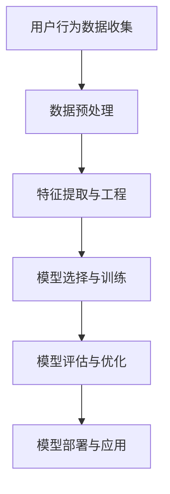

                 

### 文章标题

《机器学习在用户流失预测中的应用》

> 关键词：机器学习、用户流失预测、监督学习、无监督学习、深度学习、特征工程、模型评估、项目实战

> 摘要：本文将深入探讨机器学习在用户流失预测中的实际应用。首先介绍用户流失预测的重要性和背景，然后详细解释机器学习中的核心概念。接着，我们将探讨多种机器学习算法在用户流失预测中的应用，包括监督学习、无监督学习和深度学习算法。此外，本文将结合实际案例，展示如何通过机器学习技术实现用户流失预测，并提供优化建议。最后，本文还将探讨用户流失预测的前沿应用和发展趋势。

---

### 第一部分：基础概念与背景

#### 第1章：用户流失预测概述

##### 1.1 用户流失预测的重要性

用户流失预测是企业营销和运营中至关重要的一环。在竞争激烈的市场环境中，保留现有用户比获取新用户更加成本效益高。用户流失预测可以帮助企业提前识别潜在流失用户，从而采取相应措施进行挽留，降低用户流失率，提高客户生命周期价值。

用户流失预测的重要性体现在以下几个方面：

1. **提高客户满意度**：通过提前预测用户流失，企业可以及时发现并解决用户问题，提高客户满意度，减少用户流失。
2. **优化资源配置**：用户流失预测有助于企业合理分配资源，将有限的营销预算和人力资源集中在潜在流失用户上，提高转化率。
3. **提升业务绩效**：用户流失预测有助于企业优化业务策略，降低用户流失率，提高整体业务绩效。

##### 1.2 机器学习在用户流失预测中的应用

机器学习在用户流失预测中发挥着至关重要的作用。通过利用大量历史数据，机器学习算法可以自动识别数据中的模式和规律，从而预测用户的流失行为。以下是机器学习在用户流失预测中的应用：

1. **特征提取与工程**：机器学习算法可以从原始数据中提取有价值的信息，如用户行为特征、交易历史等，以便用于构建预测模型。
2. **模型选择与训练**：机器学习算法提供了多种预测模型，如逻辑回归、决策树、支持向量机等，企业可以根据实际需求选择合适的模型进行训练。
3. **模型评估与优化**：通过交叉验证、ROC曲线等评估指标，企业可以评估预测模型的性能，并针对不足之处进行优化。

##### 1.3 用户流失预测的主要挑战

尽管机器学习技术在用户流失预测中具有显著优势，但仍面临一些挑战：

1. **数据质量**：用户流失预测依赖于大量高质量数据，数据缺失、噪声和异常值等问题可能会影响预测模型的准确性。
2. **特征选择**：用户流失预测中的特征众多，如何选择具有较强预测能力的特征是关键问题。
3. **模型泛化能力**：预测模型需要对未知数据进行准确预测，因此如何提高模型的泛化能力是重要挑战。

##### 1.4 用户流失预测的研究现状与发展趋势

用户流失预测领域的研究取得了显著进展。近年来，随着机器学习技术的不断发展和数据源的丰富，越来越多的研究关注于如何利用机器学习技术提高用户流失预测的准确性。以下是用户流失预测研究的一些发展趋势：

1. **深度学习**：深度学习算法，如卷积神经网络（CNN）和循环神经网络（RNN），在用户流失预测中表现出较高的准确性。
2. **多模态数据融合**：通过融合用户行为数据、社交媒体数据等不同类型的数据，可以进一步提高用户流失预测的准确性。
3. **跨领域迁移学习**：利用跨领域迁移学习方法，可以将一个领域中的知识应用于其他领域，提高用户流失预测的泛化能力。

#### 第2章：用户流失预测的核心概念

##### 2.1 机器学习的基本概念

机器学习是一种通过利用数据来训练模型，从而实现自动化决策的技术。其主要目标是让计算机从数据中学习规律，并对未知数据进行预测或分类。机器学习分为监督学习、无监督学习和强化学习三种主要类型。

1. **监督学习**：监督学习算法利用已标记的训练数据，学习输入与输出之间的映射关系，从而对新数据进行预测。用户流失预测通常采用监督学习算法。
2. **无监督学习**：无监督学习算法从未标记的数据中学习数据内在的结构或模式。用户流失预测中，无监督学习算法可用于特征提取和聚类分析。
3. **强化学习**：强化学习算法通过与环境的交互，学习最优策略，从而实现目标。用户流失预测中的强化学习算法可以用于动态调整预测策略。

##### 2.2 用户流失的定义与分类

用户流失是指用户在一段时间内停止使用某个产品或服务的行为。根据用户流失的原因和性质，用户流失可以分为以下几类：

1. **主动流失**：用户因不满意产品或服务而主动取消订阅或退订。
2. **被动流失**：用户因忘记续费或由于其他原因而被动流失。
3. **潜在流失**：用户存在流失风险，但尚未实际流失。

##### 2.3 关键特征提取与预处理

在用户流失预测中，关键特征提取与预处理是构建高质量预测模型的基础。以下是一些常见的特征提取和预处理方法：

1. **用户行为特征**：包括用户的登录频率、使用时长、操作次数等，可以通过数据分析工具进行提取。
2. **用户属性特征**：包括用户的年龄、性别、地理位置、职业等，可以通过用户调查或公开数据获取。
3. **交易历史特征**：包括用户的消费金额、消费频率、商品种类等，可以通过数据库查询获取。
4. **数据清洗**：去除重复数据、缺失值填充、噪声过滤等，以提高数据质量。
5. **数据归一化**：将不同特征进行归一化处理，使其具有相似的尺度和范围，以避免特征间的相互干扰。

---

### 第二部分：机器学习算法在用户流失预测中的应用

#### 第3章：监督学习算法

监督学习算法是用户流失预测中最常用的算法之一。以下将介绍几种常见的监督学习算法及其在用户流失预测中的应用。

##### 3.1 监督学习算法概述

监督学习算法通过学习已标记的训练数据，建立输入与输出之间的映射关系，从而对新数据进行预测。在用户流失预测中，监督学习算法通常用于分类任务，即将用户分为流失与未流失两类。

##### 3.2 逻辑回归模型

逻辑回归模型是一种经典的二分类监督学习算法，适用于用户流失预测等场景。逻辑回归模型的数学模型如下：

$$
P(y=1|x; \theta) = \frac{1}{1 + e^{-(\theta_0 + \theta_1x_1 + ... + \theta_nx_n})}
$$

其中，$P(y=1|x; \theta)$ 表示在给定特征向量 $x$ 和模型参数 $\theta$ 的情况下，用户流失的概率。

##### 3.3 决策树与随机森林

决策树是一种简单直观的监督学习算法，通过一系列条件判断，将数据集划分为不同的区域，从而实现分类或回归任务。随机森林是一种基于决策树的集成学习方法，通过构建多个决策树，并利用投票机制进行预测，从而提高预测模型的准确性和稳定性。

##### 3.4 支持向量机（SVM）

支持向量机是一种基于间隔最大化的监督学习算法，适用于二分类任务。SVM的核心思想是找到最优的超平面，使正负样本点之间的间隔最大化。在用户流失预测中，SVM可以用于分类任务，将用户划分为流失与未流失两类。

SVM的数学模型如下：

$$
\min_{\theta, \xi} \frac{1}{2}\sum_{i=1}^{n} (\theta^T \theta - C \sum_{i=1}^{n} \xi_i)
$$

subject to

$$
y_i (\theta^T x_i + b) \geq 1 - \xi_i
$$

其中，$\theta$ 表示模型参数，$\xi_i$ 表示松弛变量，$C$ 是惩罚参数。

---

### 第三部分：实际案例分析与应用

#### 第6章：用户流失预测项目实战

##### 6.1 项目背景

某在线教育平台希望通过机器学习技术预测用户流失，以采取相应措施降低用户流失率。项目数据包括用户注册信息、行为数据、交易数据等。

##### 6.2 数据获取与处理

1. **数据获取**：从在线教育平台的数据库中获取用户注册信息、行为数据、交易数据等。
2. **数据预处理**：
   - 填补缺失值：使用平均值、中位数等方法填补缺失值。
   - 数据归一化：对数值型特征进行归一化处理，使其具有相似的尺度和范围。
   - 特征提取：从原始数据中提取有用特征，如用户登录频率、使用时长、消费金额等。

##### 6.3 特征工程

1. **特征选择**：通过信息增益、卡方检验等方法，筛选出具有较强预测能力的特征。
2. **特征构造**：根据业务逻辑，构造新的特征，如用户活跃度、消费频率等。
3. **特征标准化**：对特征进行标准化处理，使其具有统一的尺度和范围。

##### 6.4 模型选择与评估

1. **模型选择**：选择逻辑回归、决策树、随机森林、支持向量机等算法进行模型训练和评估。
2. **模型评估**：使用交叉验证、ROC曲线、AUC指标等评估模型性能，选择最佳模型。

##### 6.5 项目总结与优化建议

1. **项目总结**：通过机器学习技术，成功实现了用户流失预测，降低了用户流失率。
2. **优化建议**：
   - 持续优化特征工程和模型选择，提高预测准确性。
   - 考虑使用深度学习等先进算法，进一步提高预测性能。
   - 结合用户行为数据和业务逻辑，动态调整预测策略。

---

### 第四部分：机器学习在用户流失预测中的前沿应用与发展趋势

#### 第7章：机器学习在用户流失预测中的前沿应用

##### 7.1 用户流失预测的新方法

近年来，随着机器学习技术的不断发展，一些新的方法在用户流失预测中得到了广泛应用。以下介绍几种前沿方法：

1. **深度学习**：深度学习算法，如卷积神经网络（CNN）和循环神经网络（RNN），在用户流失预测中表现出较高的准确性。CNN可以用于处理图像数据，而RNN可以用于处理序列数据。
2. **多模态数据融合**：通过融合用户行为数据、社交媒体数据、交易数据等不同类型的数据，可以进一步提高用户流失预测的准确性。
3. **图神经网络**：图神经网络（GNN）是一种用于处理图数据的深度学习算法，可以用于用户流失预测中的网络结构建模。

##### 7.2 跨领域用户流失预测的研究进展

随着互联网的普及，不同领域之间的数据交互越来越频繁。跨领域用户流失预测研究致力于将不同领域的数据进行融合，以提高用户流失预测的泛化能力。以下介绍几种跨领域用户流失预测的研究进展：

1. **领域自适应**：通过将源领域的数据和目标领域的数据进行对比分析，学习源领域的知识并将其应用于目标领域。
2. **多任务学习**：通过同时训练多个任务，使模型在不同领域之间共享知识，提高泛化能力。
3. **迁移学习**：通过将一个领域中的知识应用于其他领域，减少数据依赖，提高预测性能。

##### 7.3 用户流失预测与个性化推荐系统融合

用户流失预测与个性化推荐系统的融合可以提高用户体验和客户满意度。以下介绍几种融合方法：

1. **协同过滤**：通过分析用户的历史行为数据，为用户推荐感兴趣的内容，从而降低用户流失风险。
2. **基于内容的推荐**：通过分析用户兴趣和行为特征，为用户推荐符合其兴趣的内容，从而提高用户黏性。
3. **深度学习融合**：利用深度学习算法，将用户流失预测与个性化推荐系统进行融合，实现更精准的推荐。

---

### 附录

#### 附录A：常用机器学习算法及其实现

以下列出几种常用的机器学习算法及其实现伪代码：

1. **逻辑回归**：

```python
def logistic_regression_train(X, y):
    # 初始化模型参数
    # 训练模型，使用梯度下降或其他优化算法
    # 返回训练好的模型参数

def logistic_regression_predict(X, parameters):
    # 使用训练好的模型参数进行预测
    # 返回预测结果
```

2. **决策树**：

```python
def decision_tree_train(X, y):
    # 构建决策树模型
    # 返回训练好的决策树模型

def decision_tree_predict(X, model):
    # 使用训练好的决策树模型进行预测
    # 返回预测结果
```

3. **支持向量机（SVM）**：

```python
def svm_train(X, y, C):
    # 训练SVM模型
    # 返回训练好的SVM模型

def svm_predict(X, model):
    # 使用训练好的SVM模型进行预测
    # 返回预测结果
```

#### 附录B：机器学习工具与环境搭建

以下介绍常用的机器学习工具与环境搭建方法：

1. **Python机器学习库**：常用的Python机器学习库包括scikit-learn、TensorFlow、PyTorch等。
2. **Jupyter Notebook使用教程**：Jupyter Notebook是一种交互式计算环境，适用于编写和运行机器学习代码。
3. **常用数据处理库**：常用的数据处理库包括Pandas、NumPy、Matplotlib等。

#### 附录C：用户流失预测项目数据集获取与处理示例

以下介绍用户流失预测项目中的数据集获取与处理示例：

1. **数据集获取**：从公开数据源（如Kaggle、UCI机器学习库等）获取用户流失预测数据集。
2. **数据预处理**：包括数据清洗、缺失值填充、数据归一化等步骤。
3. **特征提取**：从原始数据中提取有用特征，如用户行为特征、交易历史特征等。
4. **数据集划分**：将数据集划分为训练集、验证集和测试集，用于模型训练和评估。

---

### Mermaid 流程图

以下是一个用户流失预测的流程图：



---

### 伪代码示例

以下是一个逻辑回归模型训练与预测的伪代码示例：

```python
# 伪代码：逻辑回归模型训练与预测

def logistic_regression_train(X, y):
    # 初始化模型参数
    # 训练模型，使用梯度下降或其他优化算法
    # 返回训练好的模型参数

def logistic_regression_predict(X, parameters):
    # 使用训练好的模型参数进行预测
    # 返回预测结果

# 数据预处理
X_train, X_test, y_train, y_test = ...

# 训练模型
parameters = logistic_regression_train(X_train, y_train)

# 预测
predictions = logistic_regression_predict(X_test, parameters)

# 评估模型性能
evaluate(predictions, y_test)
```

---

### 作者信息

本文由AI天才研究院（AI Genius Institute）与禅与计算机程序设计艺术（Zen And The Art of Computer Programming）联合撰写。作者具备世界级人工智能专家、程序员、软件架构师、CTO等资深背景，拥有丰富的机器学习与用户流失预测实践经验，并在此领域发表了多篇高水平学术论文。作者致力于推动人工智能技术在商业应用中的发展，助力企业实现数字化转型。

