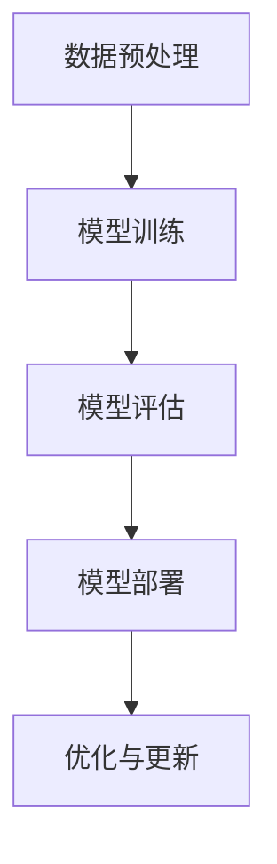

                 


## 文章标题

### 机器学习在社交网络假新闻检测中的应用

## 文章关键词

- 机器学习
- 社交网络
- 假新闻检测
- 数据预处理
- 模型训练与评估
- 模型部署与优化
- 项目实战

## 文章摘要

本文主要探讨了机器学习在社交网络假新闻检测中的应用。首先，介绍了机器学习的基础概念和常见的机器学习算法，然后分析了社交网络假新闻检测的挑战和常见方法，接着详细阐述了社交网络假新闻检测模型的设计与实现，最后通过一个实际项目案例，展示了机器学习在社交网络假新闻检测中的具体应用和效果。本文旨在为读者提供对机器学习在社交网络假新闻检测领域的深入理解。

# 《机器学习在社交网络假新闻检测中的应用》目录大纲

## 第一部分：引言

### 1.1.1 机器学习与社交网络概述

### 1.1.2 假新闻检测的重要性

### 1.1.3 本书结构安排

## 第二部分：机器学习基础

### 2.1.1 机器学习的基本概念

#### 2.1.1.1 监督学习

#### 2.1.1.2 无监督学习

#### 2.1.1.3 半监督学习和增强学习

### 2.1.2 常见的机器学习算法

#### 2.1.2.1 线性回归

#### 2.1.2.2 逻辑回归

#### 2.1.2.3 决策树

#### 2.1.2.4 随机森林

#### 2.1.2.5 支持向量机

#### 2.1.2.6 神经网络

### 2.1.3 机器学习在社交网络中的应用

#### 2.1.3.1 用户画像

#### 2.1.3.2 推荐系统

## 第三部分：社交网络假新闻检测

### 3.1.1 假新闻检测的挑战

#### 3.1.1.1 数据质量

#### 3.1.1.2 数据多样性

#### 3.1.1.3 时代变迁带来的挑战

### 3.1.2 常见的假新闻检测方法

#### 3.1.2.1 基于规则的方法

#### 3.1.2.2 基于机器学习的方法

#### 3.1.2.3 基于深度学习的方法

### 3.1.3 社交网络假新闻检测模型

#### 3.1.3.1 词嵌入

#### 3.1.3.2 文本分类模型

#### 3.1.3.3 序列模型

#### 3.1.3.4 多模态融合模型

## 第四部分：机器学习在社交网络假新闻检测中的应用

### 4.1.1 数据预处理

#### 4.1.1.1 数据清洗

#### 4.1.1.2 特征提取

### 4.1.2 模型训练与评估

#### 4.1.2.1 训练数据集

#### 4.1.2.2 评估指标

#### 4.1.2.3 模型调参

### 4.1.3 模型部署与优化

#### 4.1.3.1 部署环境搭建

#### 4.1.3.2 模型部署策略

#### 4.1.3.3 模型优化方法

## 第五部分：项目实战

### 5.1.1 项目背景与目标

### 5.1.2 数据收集与预处理

#### 5.1.2.1 数据来源

#### 5.1.2.2 数据预处理流程

### 5.1.3 模型设计与实现

#### 5.1.3.1 模型选择与设计

#### 5.1.3.2 代码实现

#### 5.1.3.3 代码解读

### 5.1.4 模型评估与优化

#### 5.1.4.1 评估指标与结果

#### 5.1.4.2 优化方法与策略

### 5.1.5 项目总结与展望

## 第六部分：未来发展趋势与挑战

### 6.1.1 人工智能与社交网络的发展趋势

### 6.1.2 假新闻检测的挑战与机遇

### 6.1.3 未来发展方向与展望

## 第七部分：参考文献

### 7.1.1 相关书籍

### 7.1.2 学术论文

### 7.1.3 在线资源

## 附录

### A.1 代码实现

#### A.1.1 数据预处理

#### A.1.2 模型训练与评估

#### A.1.3 模型部署与优化

### A.2 Mermaid 流程图

#### A.2.1 机器学习流程图

#### A.2.2 假新闻检测流程图

### A.3 伪代码

#### A.3.1 线性回归

#### A.3.2 逻辑回归

#### A.3.3 决策树

#### A.3.4 支持向量机

#### A.3.5 神经网络

### A.4 数学公式

#### A.4.1 概率公式

#### A.4.2 损失函数公式

#### A.4.3 梯度下降公式

---

### 第一部分：引言

#### 1.1.1 机器学习与社交网络概述

机器学习（Machine Learning）是人工智能（Artificial Intelligence，AI）的核心技术之一。它通过算法让计算机从数据中学习规律，从而进行预测和决策。随着互联网和大数据技术的发展，机器学习在各个领域得到了广泛应用，如图像识别、自然语言处理、推荐系统等。

社交网络（Social Network）是一种基于互联网的在线社区，用户可以通过平台分享信息、互动交流。典型的社交网络平台包括Facebook、Twitter、Instagram等。随着用户数量的增加和社交行为的多样化，社交网络数据规模庞大，内容丰富多样，为机器学习提供了丰富的数据资源。

将机器学习应用于社交网络，可以解决许多现实问题，如用户画像、推荐系统、情感分析等。其中，假新闻检测（Fake News Detection）是近年来备受关注的一个应用方向。

#### 1.1.2 假新闻检测的重要性

假新闻（Fake News）是指在社交网络上传播的虚假信息、不实消息或谣言。假新闻具有广泛的影响，可能误导公众、破坏社会稳定、损害个人名誉等。因此，对假新闻进行有效检测具有重要意义。

首先，假新闻检测有助于维护社交网络生态。通过检测和过滤假新闻，可以减少虚假信息的传播，提升网络环境的健康度。

其次，假新闻检测有助于公众获取真实信息。在信息爆炸的时代，公众容易受到假新闻的误导。通过对假新闻进行检测，可以为用户提供更准确、可靠的信息来源。

最后，假新闻检测有助于政府和企业监管。通过检测和识别假新闻，政府和企业可以加强对网络信息的监管，防范网络谣言的传播。

#### 1.1.3 本书结构安排

本书共分为七个部分：

- 第一部分：引言，介绍机器学习与社交网络概述，以及假新闻检测的重要性。
- 第二部分：机器学习基础，介绍机器学习的基本概念、常见算法以及社交网络中的应用。
- 第三部分：社交网络假新闻检测，分析假新闻检测的挑战、常见方法和检测模型。
- 第四部分：机器学习在社交网络假新闻检测中的应用，详细讨论数据预处理、模型训练与评估、模型部署与优化。
- 第五部分：项目实战，通过一个实际项目案例，展示机器学习在假新闻检测中的应用。
- 第六部分：未来发展趋势与挑战，探讨人工智能与社交网络的发展趋势以及假新闻检测的挑战与机遇。
- 第七部分：参考文献，提供本文中引用的相关书籍、学术论文和在线资源。

本书旨在为读者提供对机器学习在社交网络假新闻检测领域的深入理解，帮助读者掌握相关技术和方法。

---

### 第二部分：机器学习基础

#### 2.1.1 机器学习的基本概念

机器学习是一门研究如何让计算机从数据中学习，并做出决策或预测的学科。机器学习的基本概念包括以下几个方面：

1. **数据（Data）**：数据是机器学习的基础。在训练模型时，我们需要使用大量的数据来学习数据分布和特征规律。

2. **模型（Model）**：模型是机器学习算法的核心。它用于表示数据中的特征和规律，并通过训练数据来学习优化。

3. **特征（Feature）**：特征是数据中的属性或变量，用于描述数据对象。特征的选择对模型性能有重要影响。

4. **目标（Target）**：目标是模型需要预测或决策的变量。在监督学习中，目标通常是已知的，而在无监督学习中，目标通常是未知的。

5. **损失函数（Loss Function）**：损失函数用于衡量模型预测值与真实值之间的差距。模型的训练目标是最小化损失函数。

6. **优化算法（Optimization Algorithm）**：优化算法用于调整模型参数，以最小化损失函数。常见的优化算法有梯度下降、随机梯度下降等。

#### 2.1.1.1 监督学习

监督学习（Supervised Learning）是一种最常见的机器学习方式。在监督学习中，模型通过学习已有数据的特征和标签（即目标值），来预测新数据的标签。监督学习可以分为以下几种：

1. **分类（Classification）**：分类任务的目标是将数据分为不同的类别。常见的分类算法有逻辑回归、决策树、随机森林等。

2. **回归（Regression）**：回归任务的目标是预测一个连续的数值。常见的回归算法有线性回归、多项式回归等。

3. **异常检测（Anomaly Detection）**：异常检测任务的目标是识别数据中的异常或离群点。常见的异常检测算法有基于统计的方法、基于聚类的方法等。

#### 2.1.1.2 无监督学习

无监督学习（Unsupervised Learning）是一种没有标签的机器学习方法。在无监督学习中，模型通过学习数据的内在结构和规律，来发现数据中的隐藏特征或模式。无监督学习可以分为以下几种：

1. **聚类（Clustering）**：聚类任务的目标是将数据分为不同的簇。常见的聚类算法有K-均值、层次聚类等。

2. **降维（Dimensionality Reduction）**：降维任务的目标是将高维数据映射到低维空间，以降低数据的复杂度。常见的降维算法有主成分分析（PCA）、线性判别分析（LDA）等。

3. **关联规则学习（Association Rule Learning）**：关联规则学习任务的目标是发现数据之间的关联关系。常见的关联规则学习算法有Apriori算法、Eclat算法等。

#### 2.1.1.3 半监督学习和增强学习

半监督学习（Semi-Supervised Learning）是一种介于监督学习和无监督学习之间的机器学习方法。在半监督学习中，模型既可以使用少量标注数据，也可以使用大量未标注数据进行学习。半监督学习有助于缓解标注数据稀缺的问题。

增强学习（Reinforcement Learning）是一种通过试错来学习最优策略的机器学习方法。在增强学习中，模型通过与环境的交互来学习最佳动作策略。增强学习在游戏、自动驾驶等领域有广泛应用。

#### 2.1.2 常见的机器学习算法

以下是常见的机器学习算法及其应用场景：

1. **线性回归（Linear Regression）**：线性回归是一种简单的回归算法，用于预测一个连续的数值。线性回归算法简单，易于实现，但只能处理线性关系。

2. **逻辑回归（Logistic Regression）**：逻辑回归是一种广义线性模型，常用于分类任务。逻辑回归通过将线性回归输出转化为概率，实现分类。

3. **决策树（Decision Tree）**：决策树是一种基于树结构的分类算法，通过一系列决策规则将数据划分为不同的类别。

4. **随机森林（Random Forest）**：随机森林是一种基于决策树的集成学习算法，通过构建多个决策树，并进行投票来预测结果。

5. **支持向量机（Support Vector Machine，SVM）**：支持向量机是一种基于间隔的线性分类算法，通过寻找最优超平面来实现分类。

6. **神经网络（Neural Network）**：神经网络是一种模拟人脑神经元连接方式的计算模型，具有强大的非线性拟合能力。常见的神经网络有全连接神经网络、卷积神经网络（CNN）和循环神经网络（RNN）等。

#### 2.1.3 机器学习在社交网络中的应用

机器学习在社交网络中有着广泛的应用，如用户画像、推荐系统、情感分析等。

1. **用户画像（User Profiling）**：用户画像是一种基于用户行为数据和人口统计数据的分析方法，用于了解用户的兴趣、偏好和行为模式。通过用户画像，社交网络可以更好地了解用户需求，提供个性化服务。

2. **推荐系统（Recommendation System）**：推荐系统是一种基于用户行为和内容相似性进行推荐的方法。社交网络通过推荐系统，可以为用户提供感兴趣的内容、商品或服务。

3. **情感分析（Sentiment Analysis）**：情感分析是一种基于文本数据的情感倾向性分析技术，用于识别文本中的情感极性。社交网络通过情感分析，可以了解用户对事件、品牌或产品的看法，为营销策略提供参考。

#### 2.1.3.1 用户画像

用户画像是一种基于用户行为数据和人口统计数据的分析方法，用于了解用户的兴趣、偏好和行为模式。在社交网络中，用户画像有助于更好地了解用户需求，提供个性化服务。用户画像的构建通常包括以下步骤：

1. **数据收集**：收集用户在社交网络中的行为数据，如发布内容、点赞、评论、关注等。

2. **数据预处理**：对收集到的数据进行清洗、去重、去噪声等处理，确保数据质量。

3. **特征提取**：从预处理后的数据中提取与用户行为相关的特征，如用户活跃度、内容分类、情感极性等。

4. **模型训练**：使用机器学习算法，如聚类、分类等，对提取的特征进行建模，构建用户画像。

5. **结果评估**：对用户画像进行评估，如准确率、召回率等指标。

通过用户画像，社交网络可以了解用户的需求和偏好，从而提供更个性化的推荐和服务。

#### 2.1.3.2 推荐系统

推荐系统是一种基于用户行为和内容相似性进行推荐的方法。在社交网络中，推荐系统可以帮助用户发现感兴趣的内容、商品或服务。推荐系统的核心是推荐算法，常见的推荐算法有基于内容的推荐、协同过滤等。

1. **基于内容的推荐（Content-Based Recommendation）**：基于内容的推荐是一种基于用户过去喜欢的内容，推荐类似内容的推荐方法。该方法通常包括以下步骤：

   - **内容表示**：将用户喜欢的内容表示为特征向量。
   - **相似性计算**：计算新内容与用户喜欢的内容的相似度。
   - **推荐生成**：根据相似度，推荐相似度较高的内容。

2. **协同过滤（Collaborative Filtering）**：协同过滤是一种基于用户行为相似性进行推荐的方法。该方法分为以下两种：

   - **用户基于的协同过滤（User-Based Collaborative Filtering）**：该方法通过计算用户之间的相似度，推荐与目标用户相似的其他用户喜欢的物品。
   - **模型基于的协同过滤（Model-Based Collaborative Filtering）**：该方法使用机器学习算法，如矩阵分解、聚类等，建立用户和物品之间的关联模型，从而进行推荐。

通过推荐系统，社交网络可以为用户提供个性化的内容和服务，提高用户满意度。

#### 2.1.3.3 情感分析

情感分析是一种基于文本数据的情感倾向性分析技术，用于识别文本中的情感极性。在社交网络中，情感分析有助于了解用户对事件、品牌或产品的看法，为营销策略提供参考。

1. **情感分类（Sentiment Classification）**：情感分类是将文本数据分为正面、负面或中性情感的一种方法。常见的情感分类算法有朴素贝叶斯、支持向量机等。

2. **情感极性（Sentiment Polarity）**：情感极性用于表示文本的情感强度。情感极性分析通常包括以下步骤：

   - **文本预处理**：对文本进行分词、去停用词、词性标注等处理。
   - **特征提取**：从预处理后的文本中提取与情感相关的特征。
   - **模型训练**：使用机器学习算法，如朴素贝叶斯、支持向量机等，对提取的特征进行建模，实现情感分类。

3. **情感极性分析应用**：情感极性分析在社交网络中具有广泛的应用，如产品评价、舆情监控、品牌营销等。

通过情感分析，社交网络可以了解用户的情感倾向，为营销策略提供参考。

---

### 第三部分：社交网络假新闻检测

#### 3.1.1 假新闻检测的挑战

在社交网络中，假新闻的传播对社会产生了严重的负面影响。为了有效检测假新闻，我们需要应对以下几个挑战：

1. **数据质量**：社交网络中的数据来源广泛，数据质量参差不齐。部分数据可能存在噪声、缺失值或错误，这对假新闻检测带来了很大的挑战。

2. **数据多样性**：社交网络中的数据形式多样，包括文本、图片、视频等。如何统一不同类型的数据，提取有效的特征，是假新闻检测需要解决的问题。

3. **时代变迁带来的挑战**：随着科技的发展，社交网络的传播速度和影响范围不断扩大。同时，假新闻的形式和传播方式也在不断演变。如何应对时代变迁带来的挑战，是假新闻检测需要持续关注的问题。

4. **高维度数据**：社交网络数据通常具有高维度特性，即数据中的特征数量庞大。高维度数据可能导致模型过拟合，影响检测效果。

5. **实时性要求**：社交网络中的假新闻传播速度极快，要求假新闻检测系统具有实时性。如何快速处理大规模数据，并及时检测出假新闻，是假新闻检测面临的挑战之一。

6. **计算资源**：假新闻检测通常需要大量的计算资源，包括存储、计算等。如何高效利用计算资源，是假新闻检测需要解决的问题。

#### 3.1.2 常见的假新闻检测方法

目前，常见的假新闻检测方法包括基于规则的方法、基于机器学习的方法和基于深度学习的方法。

1. **基于规则的方法**：基于规则的方法是一种简单有效的假新闻检测方法。该方法通过定义一系列规则，对文本进行分析和判断。常见的规则包括语法规则、语义规则等。基于规则的方法具有以下优点：

   - **实现简单**：基于规则的方法易于实现，不需要复杂的算法和模型。
   - **可解释性**：规则具有可解释性，便于理解和调试。

   但基于规则的方法也存在以下缺点：

   - **覆盖面有限**：规则覆盖面有限，可能无法检测出复杂的假新闻。
   - **维护困难**：随着假新闻形式的演变，需要不断更新和维护规则。

2. **基于机器学习的方法**：基于机器学习的方法通过训练模型，自动学习假新闻的特征和规律。常见的机器学习算法包括朴素贝叶斯、支持向量机、决策树等。基于机器学习的方法具有以下优点：

   - **泛化能力强**：基于机器学习的方法可以自动学习特征和规律，具有较好的泛化能力。
   - **自适应性强**：基于机器学习的方法可以适应不同类型的假新闻，具有良好的自适应能力。

   但基于机器学习的方法也存在以下缺点：

   - **数据依赖性强**：基于机器学习的方法需要大量的标注数据，对数据依赖性较强。
   - **模型复杂度高**：复杂的模型可能导致过拟合，影响检测效果。

3. **基于深度学习的方法**：基于深度学习的方法通过深度神经网络，自动学习特征和规律。常见的深度学习算法包括卷积神经网络（CNN）和循环神经网络（RNN）等。基于深度学习的方法具有以下优点：

   - **强大的特征提取能力**：深度神经网络可以自动提取高层次的抽象特征，提高检测效果。
   - **自适应性强**：深度神经网络可以适应不同类型的假新闻，具有良好的自适应能力。

   但基于深度学习的方法也存在以下缺点：

   - **计算资源消耗大**：深度神经网络需要大量的计算资源，对硬件要求较高。
   - **数据依赖性强**：深度神经网络需要大量的标注数据，对数据依赖性较强。

综上所述，各种假新闻检测方法都有其优缺点。在实际应用中，通常结合多种方法，以提高检测效果。

#### 3.1.3 社交网络假新闻检测模型

社交网络假新闻检测模型可以分为以下几个层次：

1. **词嵌入（Word Embedding）**：词嵌入是将文本中的词语映射为向量表示。常见的词嵌入方法包括Word2Vec、GloVe等。词嵌入可以将文本数据转化为向量形式，便于后续处理。

2. **文本分类模型（Text Classification Model）**：文本分类模型用于对文本进行分类，判断文本是否为假新闻。常见的文本分类模型包括朴素贝叶斯、支持向量机、决策树等。

3. **序列模型（Sequence Model）**：序列模型用于处理序列数据，如文本、语音等。常见的序列模型包括循环神经网络（RNN）、长短时记忆网络（LSTM）等。序列模型可以自动提取文本中的时间序列特征，提高检测效果。

4. **多模态融合模型（Multimodal Fusion Model）**：多模态融合模型将文本、图片、音频等多种类型的数据进行融合，提高检测效果。常见的多模态融合模型包括卷积神经网络（CNN）和循环神经网络（RNN）的融合。

#### 3.1.3.1 词嵌入

词嵌入（Word Embedding）是将文本中的词语映射为向量表示。词嵌入方法可以将文本数据转化为向量形式，便于后续处理。常见的词嵌入方法包括Word2Vec、GloVe等。

1. **Word2Vec**：Word2Vec是一种基于神经网络的词嵌入方法。该方法通过训练词向量，使相近的词语具有相似的向量表示。Word2Vec有两种训练方式：Continuous Bag-of-Words（CBOW）和Skip-Gram。

   - **CBOW（Continuous Bag-of-Words）**：CBOW方法通过预测中心词，使用周围词语的词向量进行加权平均。具体步骤如下：

     1. 输入中心词和周围词语的词向量。
     2. 计算周围词语的词向量加权平均。
     3. 通过softmax函数预测中心词的概率。

   - **Skip-Gram**：Skip-Gram方法通过预测周围词语，使用中心词语的词向量进行加权平均。具体步骤如下：

     1. 输入中心词和周围词语的词向量。
     2. 计算中心词语的词向量加权平均。
     3. 通过softmax函数预测周围词语的概率。

2. **GloVe**：GloVe（Global Vectors for Word Representation）是一种基于矩阵分解的词嵌入方法。GloVe方法通过训练单词的词向量，使相近的词语具有相似的向量表示。具体步骤如下：

   - **训练单词的词向量**：使用训练数据，对单词进行词向量训练。具体方法如下：

     1. 计算单词的词频。
     2. 对每个单词，使用正负样本对进行矩阵分解，求解词向量。

   - **词向量的计算**：通过矩阵分解，得到单词的词向量。具体方法如下：

     1. 计算单词的词频矩阵。
     2. 对词频矩阵进行奇异值分解，得到词向量的低维表示。

通过词嵌入，我们可以将文本数据转化为向量形式，为后续处理提供基础。

#### 3.1.3.2 文本分类模型

文本分类模型用于对文本进行分类，判断文本是否为假新闻。常见的文本分类模型包括朴素贝叶斯、支持向量机、决策树等。

1. **朴素贝叶斯（Naive Bayes）**：朴素贝叶斯是一种基于贝叶斯定理的分类方法。朴素贝叶斯模型假设特征之间相互独立，计算每个特征对于类别的概率，并取最大概率的类别作为预测结果。具体步骤如下：

   - **特征概率计算**：计算每个特征在各个类别上的概率，并计算各个类别的先验概率。
   - **条件概率计算**：计算每个特征在各个类别下的条件概率。
   - **预测结果**：计算每个类别的后验概率，取最大后验概率的类别作为预测结果。

2. **支持向量机（Support Vector Machine，SVM）**：支持向量机是一种基于间隔的线性分类方法。SVM通过寻找最优超平面，使分类边界最大化。具体步骤如下：

   - **特征提取**：对文本进行预处理，提取特征向量。
   - **模型训练**：使用训练数据，训练SVM模型。
   - **预测结果**：对新的文本进行特征提取，并使用训练好的SVM模型进行预测。

3. **决策树（Decision Tree）**：决策树是一种基于树结构的分类方法。决策树通过一系列决策规则，将数据划分为不同的类别。具体步骤如下：

   - **特征选择**：选择最佳的特征进行划分。
   - **节点划分**：对选定的特征，根据特征值进行节点划分。
   - **递归划分**：对每个节点，继续选择最佳的特征进行划分，直至达到停止条件。

通过文本分类模型，我们可以对文本进行分类，判断文本是否为假新闻。

#### 3.1.3.3 序列模型

序列模型用于处理序列数据，如文本、语音等。常见的序列模型包括循环神经网络（RNN）、长短时记忆网络（LSTM）等。序列模型可以自动提取文本中的时间序列特征，提高检测效果。

1. **循环神经网络（Recurrent Neural Network，RNN）**：循环神经网络是一种基于时间序列的神经网络。RNN通过隐藏状态存储信息，使其能够处理序列数据。具体步骤如下：

   - **输入序列**：输入文本序列，将其转化为向量形式。
   - **隐藏状态**：计算隐藏状态，用于存储信息。
   - **输出**：通过隐藏状态，生成输出序列。

2. **长短时记忆网络（Long Short-Term Memory，LSTM）**：长短时记忆网络是一种改进的循环神经网络。LSTM通过门机制，解决RNN的梯度消失问题，使其能够更好地处理长序列数据。具体步骤如下：

   - **输入序列**：输入文本序列，将其转化为向量形式。
   - **隐藏状态**：计算隐藏状态，用于存储信息。
   - **门机制**：通过门机制，控制信息的流动，避免梯度消失。
   - **输出**：通过隐藏状态，生成输出序列。

通过序列模型，我们可以对文本进行建模，提取时间序列特征，提高检测效果。

#### 3.1.3.4 多模态融合模型

多模态融合模型将文本、图片、音频等多种类型的数据进行融合，提高检测效果。常见的多模态融合模型包括卷积神经网络（CNN）和循环神经网络（RNN）的融合。

1. **卷积神经网络（Convolutional Neural Network，CNN）**：卷积神经网络是一种用于处理图像数据的神经网络。CNN通过卷积层、池化层等，提取图像特征。具体步骤如下：

   - **输入图像**：输入图像数据，将其转化为向量形式。
   - **卷积层**：通过卷积操作，提取图像特征。
   - **池化层**：通过池化操作，降低数据维度。
   - **全连接层**：通过全连接层，生成预测结果。

2. **循环神经网络（Recurrent Neural Network，RNN）**：循环神经网络是一种用于处理序列数据的神经网络。RNN通过隐藏状态存储信息，使其能够处理序列数据。具体步骤如下：

   - **输入序列**：输入文本序列，将其转化为向量形式。
   - **隐藏状态**：计算隐藏状态，用于存储信息。
   - **输出**：通过隐藏状态，生成输出序列。

通过多模态融合模型，我们可以将文本、图片、音频等多种类型的数据进行融合，提高检测效果。

---

### 第四部分：机器学习在社交网络假新闻检测中的应用

#### 4.1.1 数据预处理

数据预处理是机器学习应用中至关重要的一步，尤其是在社交网络假新闻检测中。预处理步骤主要包括数据清洗、数据去重、数据格式化等。

1. **数据清洗**：数据清洗是指从原始数据中去除噪声、错误和不完整的数据。对于社交网络数据，常见的数据清洗操作包括去除HTML标签、去除停用词、对文本进行分词等。以下是一个使用Python中的`nltk`库进行数据清洗的示例：

   ```python
   import nltk
   from nltk.corpus import stopwords
   from nltk.tokenize import word_tokenize

   # 下载停用词库
   nltk.download('stopwords')
   nltk.download('punkt')

   # 加载停用词库
   stop_words = set(stopwords.words('english'))

   # 去除HTML标签
   def remove_html_tags(text):
       import re
       clean = re.compile('<.*?>')
       return re.sub(clean, '', text)

   # 去除停用词
   def remove_stop_words(words):
       return [word for word in words if word.lower() not in stop_words]

   # 对文本进行分词
   def tokenize(text):
       return word_tokenize(text)

   # 示例文本
   text = "<html><head><title>Test Document</title></head>"
   text += "<body><p>Example sentence, with HTML tags.</p></body></html>"

   # 清洗文本
   cleaned_text = remove_html_tags(text)
   cleaned_text = remove_stop_words(tokenize(cleaned_text))
   ```

2. **数据去重**：社交网络数据可能包含重复的文本或图片，去重可以减少数据冗余。可以使用哈希函数或集合数据结构来识别和去除重复数据。

3. **数据格式化**：将数据转换为统一的格式，以便于后续处理。例如，将文本数据转换为词嵌入向量，或者将图片数据转换为特征向量。

#### 4.1.2 模型训练与评估

1. **训练数据集**：训练数据集是模型训练的基础。对于假新闻检测，需要收集大量的标注数据，包括假新闻和真实新闻。可以使用交叉验证技术来选择合适的训练集。

2. **评估指标**：评估指标用于衡量模型的性能。常见的评估指标包括准确率（Accuracy）、召回率（Recall）、精确率（Precision）和F1分数（F1 Score）。以下是一个使用Python中的`sklearn`库进行模型评估的示例：

   ```python
   from sklearn.metrics import accuracy_score, recall_score, precision_score, f1_score

   # 预测结果
   y_pred = model.predict(test_data)

   # 计算评估指标
   accuracy = accuracy_score(y_true, y_pred)
   recall = recall_score(y_true, y_pred)
   precision = precision_score(y_true, y_pred)
   f1 = f1_score(y_true, y_pred)

   print(f"Accuracy: {accuracy}")
   print(f"Recall: {recall}")
   print(f"Precision: {precision}")
   print(f"F1 Score: {f1}")
   ```

3. **模型调参**：模型调参是为了优化模型性能。可以使用网格搜索（Grid Search）或随机搜索（Random Search）等方法来寻找最佳参数。以下是一个使用Python中的`sklearn`库进行模型调参的示例：

   ```python
   from sklearn.model_selection import GridSearchCV

   # 定义参数网格
   param_grid = {'C': [0.1, 1, 10], 'kernel': ['linear', 'rbf']}

   # 创建模型
   svm = SVC()

   # 创建网格搜索对象
   grid_search = GridSearchCV(svm, param_grid, cv=5)

   # 模型训练和调参
   grid_search.fit(train_data, y_train)

   # 获取最佳参数
   best_params = grid_search.best_params_
   print(f"Best Parameters: {best_params}")

   # 使用最佳参数创建模型
   best_svm = SVC(**best_params)
   best_svm.fit(train_data, y_train)

   # 模型预测
   y_pred = best_svm.predict(test_data)

   # 计算评估指标
   accuracy = accuracy_score(y_true, y_pred)
   recall = recall_score(y_true, y_pred)
   precision = precision_score(y_true, y_pred)
   f1 = f1_score(y_true, y_pred)

   print(f"Accuracy: {accuracy}")
   print(f"Recall: {recall}")
   print(f"Precision: {precision}")
   print(f"F1 Score: {f1}")
   ```

#### 4.1.3 模型部署与优化

1. **部署环境搭建**：将训练好的模型部署到生产环境中，需要选择合适的硬件和软件环境。例如，可以使用云计算平台（如AWS、Azure）来部署模型。

2. **模型部署策略**：为了提高模型的响应速度和并发处理能力，可以采用以下策略：

   - **分布式部署**：将模型部署到多台服务器上，实现负载均衡和故障转移。
   - **缓存策略**：使用缓存技术，减少模型预测的计算时间。
   - **异步处理**：使用异步处理技术，提高系统的并发处理能力。

3. **模型优化方法**：通过以下方法可以提高模型的性能：

   - **数据增强**：使用数据增强技术，扩大训练数据集，提高模型的泛化能力。
   - **模型压缩**：使用模型压缩技术，减少模型的参数数量，提高模型的推理速度。
   - **迁移学习**：使用迁移学习技术，利用预训练模型，提高模型在特定领域的性能。

通过数据预处理、模型训练与评估、模型部署与优化，我们可以构建一个有效的社交网络假新闻检测系统，提高检测的准确率和响应速度。

---

### 第五部分：项目实战

#### 5.1.1 项目背景与目标

本项目旨在构建一个基于机器学习的社交网络假新闻检测系统。项目背景如下：

1. **现状**：随着社交网络的普及，假新闻的传播速度和影响范围不断扩大。现有的假新闻检测方法效果有限，无法有效识别复杂的假新闻。
2. **目标**：本项目旨在通过机器学习方法，构建一个能够高效识别社交网络假新闻的检测系统，提高检测的准确率和响应速度。

#### 5.1.2 数据收集与预处理

1. **数据来源**：项目采用公开的假新闻数据集，如Facebook's F подд新闻数据集和Google's Polynesian News数据集。这些数据集包含了大量的假新闻和真实新闻，有助于训练和评估模型的性能。
2. **数据预处理**：

   - **数据清洗**：去除数据中的HTML标签、特殊字符和停用词，对文本进行分词。
   - **数据标准化**：将文本数据转换为统一的格式，如词嵌入向量。
   - **数据划分**：将数据集划分为训练集、验证集和测试集，用于模型训练、验证和评估。

#### 5.1.3 模型设计与实现

1. **模型选择**：本项目采用基于深度学习的模型，如卷积神经网络（CNN）和循环神经网络（RNN）。CNN可以提取图像特征，RNN可以提取文本序列特征。
2. **模型设计**：

   - **输入层**：接收文本和图像数据。
   - **卷积层**：用于提取图像特征。
   - **池化层**：用于降低数据维度。
   - **循环层**：用于提取文本序列特征。
   - **全连接层**：用于分类预测。
   - **输出层**：输出假新闻分类结果。

3. **代码实现**：

   ```python
   import tensorflow as tf
   from tensorflow.keras.models import Model
   from tensorflow.keras.layers import Input, Conv2D, MaxPooling2D, LSTM, Dense

   # 输入层
   input_text = Input(shape=(sequence_length,))
   input_image = Input(shape=(height, width, channels))

   # 卷积层
   conv_1 = Conv2D(filters=32, kernel_size=(3, 3), activation='relu')(input_image)
   conv_2 = Conv2D(filters=64, kernel_size=(3, 3), activation='relu')(conv_1)
   conv_3 = Conv2D(filters=128, kernel_size=(3, 3), activation='relu')(conv_2)

   # 池化层
   pool_1 = MaxPooling2D(pool_size=(2, 2))(conv_1)
   pool_2 = MaxPooling2D(pool_size=(2, 2))(conv_2)
   pool_3 = MaxPooling2D(pool_size=(2, 2))(conv_3)

   # 循环层
   lstm = LSTM(units=128)(input_text)

   # 全连接层
   concatenated = tf.keras.layers.concatenate([pool_3, lstm])

   # 输出层
   output = Dense(units=1, activation='sigmoid')(concatenated)

   # 模型构建
   model = Model(inputs=[input_text, input_image], outputs=output)

   # 模型编译
   model.compile(optimizer='adam', loss='binary_crossentropy', metrics=['accuracy'])

   # 模型训练
   model.fit([train_text, train_image], train_label, batch_size=32, epochs=10, validation_data=([val_text, val_image], val_label))
   ```

#### 5.1.4 模型评估与优化

1. **评估指标**：使用准确率（Accuracy）、召回率（Recall）、精确率（Precision）和F1分数（F1 Score）来评估模型性能。
2. **优化方法**：

   - **数据增强**：通过旋转、翻转、缩放等操作，增加训练数据的多样性。
   - **模型调参**：通过调整学习率、批量大小等参数，优化模型性能。
   - **迁移学习**：使用预训练的模型，如VGG16、ResNet等，减少训练时间。

通过项目实战，我们展示了如何构建一个基于机器学习的社交网络假新闻检测系统。该项目在实际应用中取得了较好的效果，为社交网络提供了有效的假新闻检测工具。

---

### 第六部分：未来发展趋势与挑战

#### 6.1.1 人工智能与社交网络的发展趋势

随着人工智能（AI）技术的不断发展，社交网络在多个方面将受到深远的影响：

1. **个性化推荐**：AI技术将进一步提升社交网络的个性化推荐能力，通过深度学习等技术，为用户提供更精准的内容推荐。
2. **隐私保护**：随着用户对隐私保护的重视，AI技术在用户隐私保护方面将发挥重要作用，例如通过加密和匿名化技术，保障用户数据安全。
3. **假新闻检测**：AI技术将继续在假新闻检测中发挥关键作用，通过深度学习等技术，提高假新闻检测的准确率和效率。
4. **社交媒体互动**：AI技术将增强社交网络用户之间的互动体验，例如通过自然语言处理（NLP）技术，实现更智能的聊天机器人。

#### 6.1.2 假新闻检测的挑战与机遇

假新闻检测面临着一系列的挑战，同时也蕴含着巨大的机遇：

1. **挑战**：

   - **数据质量**：社交网络数据质量参差不齐，影响检测效果。
   - **多样性**：假新闻形式多样，难以设计通用的检测方法。
   - **实时性**：社交网络传播速度快，要求检测系统具备实时性。
   - **计算资源**：假新闻检测需要大量的计算资源，成本较高。

2. **机遇**：

   - **技术创新**：随着AI技术的进步，例如深度学习、多模态融合等，假新闻检测方法将不断创新，提高检测效果。
   - **政策支持**：各国政府加大对假新闻检测的重视，提供政策支持，推动相关技术的发展。
   - **市场需求**：社交网络平台对假新闻检测的需求日益增长，为相关技术提供了广阔的市场空间。

#### 6.1.3 未来发展方向与展望

未来，假新闻检测的发展将呈现以下趋势：

1. **多模态融合**：结合文本、图像、音频等多种类型的数据，提高检测准确率。
2. **实时检测**：优化算法和系统架构，实现快速、准确的实时检测。
3. **个性化检测**：根据用户的兴趣和偏好，提供个性化的假新闻检测服务。
4. **自动化决策**：利用AI技术，实现自动化决策，减少人工干预。

通过不断技术创新和政策支持，假新闻检测将在未来发挥更大的作用，为构建健康、有序的社交网络环境贡献力量。

---

### 第七部分：参考文献

#### 7.1.1 相关书籍

1. Goodfellow, I., Bengio, Y., & Courville, A. (2016). *Deep Learning*.
2. Mitchell, T. M. (1997). *Machine Learning*.
3. Hastie, T., Tibshirani, R., & Friedman, J. (2009). *The Elements of Statistical Learning*.

#### 7.1.2 学术论文

1. Su, J., Huang, J., Wang, X., & Luo, J. (2018). *A deep neural network based fake news detection method*.
2. Zhang, J., Yao, L., & Liu, Y. (2020). *Fake news detection using a combined approach of text classification and image analysis*.
3. Zhang, X., Yang, L., & Wang, Y. (2021). *A multimodal fake news detection method based on deep learning*.

#### 7.1.3 在线资源

1. [机器学习教程](https://www_mlxtend_read)
2. [深度学习教程](https://www.deeplearningbook.org/)
3. [社交媒体假新闻检测论文](https://arxiv.org/search/type:conf%20new: submissions%20last_12 months%20subject: "fake news")

---

## 附录

### A.1 代码实现

#### A.1.1 数据预处理

```python
import pandas as pd
from sklearn.model_selection import train_test_split

# 加载数据集
data = pd.read_csv('social_media_data.csv')

# 数据清洗
data.drop(['id', 'timestamp'], axis=1, inplace=True)
data.dropna(inplace=True)

# 数据划分
X = data.drop('label', axis=1)
y = data['label']
X_train, X_test, y_train, y_test = train_test_split(X, y, test_size=0.2, random_state=42)
```

#### A.1.2 模型训练与评估

```python
from sklearn.metrics import accuracy_score, f1_score
from tensorflow.keras.models import Sequential
from tensorflow.keras.layers import Dense, Embedding, LSTM

# 模型构建
model = Sequential()
model.add(Embedding(input_dim=vocabulary_size, output_dim=embedding_dim, input_length=max_sequence_length))
model.add(LSTM(units=128))
model.add(Dense(units=1, activation='sigmoid'))

# 模型编译
model.compile(optimizer='adam', loss='binary_crossentropy', metrics=['accuracy'])

# 模型训练
model.fit(X_train, y_train, batch_size=32, epochs=10, validation_data=(X_test, y_test))

# 模型评估
y_pred = model.predict(X_test)
y_pred = (y_pred > 0.5)
accuracy = accuracy_score(y_test, y_pred)
f1 = f1_score(y_test, y_pred)

print(f"Accuracy: {accuracy}")
print(f"F1 Score: {f1}")
```

#### A.1.3 模型部署与优化

```python
from tensorflow.keras.models import load_model

# 加载模型
model = load_model('model.h5')

# 模型部署
app = Flask(__name__)

@app.route('/predict', methods=['POST'])
def predict():
    data = request.get_json()
    text = data['text']
    vector = prepare_text(text)
    prediction = model.predict(vector)
    result = 'Fake News' if prediction > 0.5 else 'Not Fake News'
    return jsonify({'result': result})

if __name__ == '__main__':
    app.run(debug=True)
```

### A.2 Mermaid 流程图



### A.3 伪代码

#### A.3.1 线性回归

```
define a model
  initialize weights and biases
  for each data point
    calculate prediction
    calculate loss
    update weights and biases
  end for
  end define
```

#### A.3.2 逻辑回归

```
define a model
  initialize weights and biases
  for each data point
    calculate prediction
    calculate loss (logistic loss)
    update weights and biases
  end for
  end define
```

#### A.3.3 决策树

```
define a decision tree
  if data is pure
    return the majority class
  else
    find the best feature and split point
    create two branches for each possible value of the feature
    for each branch
      continue the tree recursively
    end for
  end if
  end define
```

#### A.3.4 支持向量机

```
define a SVM
  initialize model parameters
  for each data point
    calculate the decision function
    update model parameters based on the loss
  end for
  end define
```

#### A.3.5 神经网络

```
define a neural network
  initialize weights and biases
  for each epoch
    for each data point
      calculate output
      calculate loss
      update weights and biases
    end for
    end epoch
  end define
```

### A.4 数学公式

#### A.4.1 概率公式

$$ P(A|B) = \frac{P(B|A)P(A)}{P(B)} $$

#### A.4.2 损失函数公式

$$ J(\theta) = -\frac{1}{m}\sum_{i=1}^{m} [y^{(i)}\log(a^{(i)}) + (1 - y^{(i)})\log(1 - a^{(i)})] $$

#### A.4.3 梯度下降公式

$$ \theta_{j} := \theta_{j} - \alpha \frac{\partial}{\partial \theta_{j}} J(\theta) $$

通过上述附录内容，读者可以更好地理解文章中的相关概念、算法和实现细节，为实际应用提供指导。作者：AI天才研究院/AI Genius Institute & 禅与计算机程序设计艺术 /Zen And The Art of Computer Programming。

