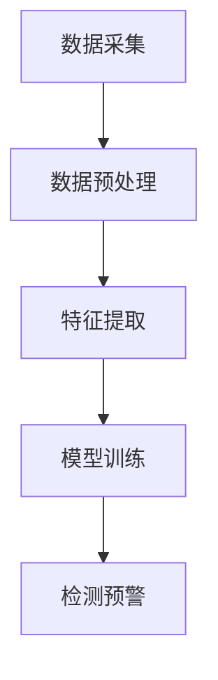

                 

### 文章标题

# 机器学习在网络流量分析中的应用

### 关键词：机器学习、网络流量分析、入侵检测、流量预测、网络安全

### 摘要

本文旨在探讨机器学习在网络流量分析中的广泛应用及其重要性。首先，我们将简要介绍机器学习和网络流量分析的基本概念和原理，并阐述它们之间的联系。随后，文章将详细探讨机器学习在流量分类、入侵检测、流量异常检测、网络流量预测以及网络安全中的应用。此外，我们还将深入分析深度学习在这些领域的应用，并探讨未来的研究方向和趋势。通过本文的阅读，读者将能够全面了解机器学习在网络流量分析中的潜力与挑战，以及如何在实践中应用这些先进技术。

### 目录大纲

## 第1章 引言与概述

### 1.1 书籍目的与结构

### 1.2 机器学习与网络流量分析的关系

### 1.3 网络流量分析的重要性

## 第2章 基础知识准备

### 2.1 机器学习基础

#### 2.1.1 机器学习概述

#### 2.1.2 常见机器学习算法

#### 2.1.3 特征工程

### 2.2 网络流量分析基础

#### 2.2.1 网络流量分析概述

#### 2.2.2 网络流量分析方法

#### 2.2.3 网络流量数据的特点

## 第3章 机器学习在网络流量分析中的应用

### 3.1 网络流量分类

#### 3.1.1 流量分类概述

#### 3.1.2 KNN算法在流量分类中的应用

#### 3.1.3 支持向量机在流量分类中的应用

### 3.2 网络入侵检测

#### 3.2.1 入侵检测概述

#### 3.2.2 实时入侵检测系统设计

#### 3.2.3 状态转换模型在入侵检测中的应用

### 3.3 流量异常检测

#### 3.3.1 异常检测概述

#### 3.3.2 聚类算法在流量异常检测中的应用

#### 3.3.3 基于统计方法的流量异常检测

## 第4章 深度学习在网络流量分析中的应用

### 4.1 卷积神经网络（CNN）在流量分析中的应用

#### 4.1.1 CNN基础

#### 4.1.2 CNN在流量分类中的应用

### 4.2 循环神经网络（RNN）在流量分析中的应用

#### 4.2.1 RNN基础

#### 4.2.2 RNN在流量预测中的应用

### 4.3 生成对抗网络（GAN）在流量分析中的应用

#### 4.3.1 GAN基础

#### 4.3.2 GAN在流量生成中的应用

## 第5章 基于深度学习的网络流量预测

### 5.1 流量预测概述

#### 5.1.1 流量预测的重要性

#### 5.1.2 流量预测的挑战

### 5.2 基于深度学习的流量预测模型

#### 5.2.1 时间序列模型

#### 5.2.2 聚类与分类模型

#### 5.2.3 混合模型

### 5.3 流量预测性能评估

#### 5.3.1 评估指标

#### 5.3.2 实际应用中的性能优化

## 第6章 网络流量分析中的安全与应用

### 6.1 网络安全中的机器学习

#### 6.1.1 入侵检测系统

#### 6.1.2 威胁情报系统

### 6.2 机器学习在网络安全中的挑战

#### 6.2.1 数据隐私与保密

#### 6.2.2 防止模型被攻破

### 6.3 机器学习在网络安全中的应用案例

#### 6.3.1 案例一：网络入侵检测

#### 6.3.2 案例二：网络流量异常检测

## 第7章 综合案例与应用

### 7.1 案例一：基于机器学习的网络流量分类系统

#### 7.1.1 案例背景

#### 7.1.2 系统设计与实现

#### 7.1.3 性能评估

### 7.2 案例二：网络流量预测与优化

#### 7.2.1 案例背景

#### 7.2.2 系统设计与实现

#### 7.2.3 性能评估

### 7.3 案例三：机器学习在网络流量安全中的应用

#### 7.3.1 案例背景

#### 7.3.2 系统设计与实现

#### 7.3.3 性能评估

## 第8章 未来展望与趋势

### 8.1 机器学习与网络流量分析的融合

#### 8.1.1 融合发展的趋势

#### 8.1.2 融合面临的挑战

### 8.2 未来研究方向

#### 8.2.1 深度学习模型的优化

#### 8.2.2 跨领域数据融合

#### 8.2.3 网络流量分析中的新兴技术

### 1.1 书籍目的与结构

本书旨在深入探讨机器学习在网络流量分析中的应用，帮助读者全面理解这一领域的前沿技术和发展趋势。通过系统化的学习和案例分析，读者将能够掌握机器学习在流量分类、入侵检测、流量异常检测、网络流量预测以及网络安全等实际应用场景中的核心算法和技术。本书的结构如下：

- **第1章 引言与概述**：介绍本书的目的、结构以及机器学习与网络流量分析的关系，为后续章节的深入学习打下基础。
- **第2章 基础知识准备**：回顾机器学习和网络流量分析的基础知识，包括机器学习概述、常见算法、特征工程以及网络流量分析的基础概念和方法。
- **第3章 机器学习在网络流量分析中的应用**：详细讨论机器学习在流量分类、入侵检测和流量异常检测中的应用，包括KNN算法、支持向量机以及聚类和统计方法。
- **第4章 深度学习在网络流量分析中的应用**：介绍深度学习，特别是卷积神经网络（CNN）、循环神经网络（RNN）和生成对抗网络（GAN）在流量分析中的应用。
- **第5章 基于深度学习的网络流量预测**：探讨深度学习在流量预测中的实际应用，包括时间序列模型、聚类与分类模型以及混合模型的性能评估和优化。
- **第6章 网络流量分析中的安全与应用**：讨论机器学习在网络安全中的应用，包括入侵检测系统和威胁情报系统，以及面临的挑战和案例研究。
- **第7章 综合案例与应用**：通过实际案例展示机器学习在网络流量分析中的综合应用，包括网络流量分类、预测和流量安全。
- **第8章 未来展望与趋势**：展望机器学习与网络流量分析的未来发展，探讨深度学习模型的优化、跨领域数据融合以及新兴技术的应用。

通过以上章节的深入学习，读者将能够全面掌握机器学习在网络流量分析中的应用，为相关领域的研究和实践提供有力支持。

### 1.2 机器学习与网络流量分析的关系

机器学习与网络流量分析之间的关系可以追溯到二者在目标上的高度一致性。机器学习是一种通过数据驱动的方式实现智能决策和预测的技术，而网络流量分析则是通过对网络流量的监测、解析和评估，实现对网络性能、安全性和流量模式的有效管理和优化。这两者之间的联系主要体现在以下几个方面：

首先，**数据的重要性**是二者共同的基础。网络流量分析依赖于对网络数据的大量采集和分析，这些数据包括但不限于数据包捕获、传输速率、数据包大小、源地址和目的地址等。这些原始数据经过清洗和处理后，成为机器学习算法训练和预测的输入特征。机器学习算法通过这些特征提取模式和规律，从而实现对网络流量行为的理解和预测。

其次，**模式识别与预测**是机器学习和网络流量分析的核心任务。在网络流量分析中，通过机器学习算法，我们可以识别正常流量与恶意流量的模式，从而实现对网络攻击的检测和防御。例如，入侵检测系统（IDS）利用机器学习模型，对网络流量的异常行为进行实时监测和报警。同样，流量预测系统通过机器学习模型，可以预测未来流量变化，优化网络资源分配，提升网络性能。

再者，**自动化与智能化**是网络流量分析对机器学习的需求。传统的网络流量分析依赖于人工配置规则和阈值，这种方式在复杂多变的环境中，效率低下且容易出现误判。而机器学习通过自动化特征提取和模式识别，能够实现智能化的流量管理。例如，利用KNN（K-Nearest Neighbors）算法，可以自动化地对网络流量进行分类，而支持向量机（SVM）则能够自动化地检测入侵行为。

此外，**实时性与高效性**是网络流量分析对机器学习的挑战。网络流量数据实时性强，处理速度要求高。机器学习算法在保证高精度的同时，还需要保证低延迟的处理能力。例如，循环神经网络（RNN）在处理实时流量数据时，可以捕捉到流量序列中的变化，从而实现高效的流量预测。

最后，**可扩展性与灵活性**是机器学习在网络流量分析中的应用优势。随着网络规模的扩大和数据量的增加，机器学习算法可以通过分布式计算和云计算平台，实现对大规模网络流量数据的有效处理。同时，机器学习算法的灵活性强，可以通过调整模型参数和特征工程，适应不同的网络流量分析和应用场景。

综上所述，机器学习与网络流量分析之间的关系是相辅相成的。机器学习为网络流量分析提供了强大的技术支撑，使其在自动化、智能化和高效化方面取得显著进步。同时，网络流量分析为机器学习提供了丰富的应用场景和数据资源，推动机器学习算法的不断优化和提升。

### 1.3 网络流量分析的重要性

网络流量分析在现代网络管理和安全领域扮演着至关重要的角色。其重要性主要体现在以下几个方面：

首先，**网络性能优化**是网络流量分析的核心目标之一。通过分析网络流量数据，可以识别网络中的瓶颈和资源消耗热点，从而优化网络架构和资源配置。例如，通过对流量模式的预测，可以预判未来流量增长趋势，提前进行带宽扩展和设备升级，避免网络拥堵和延迟。

其次，**网络安全**是网络流量分析的重要应用领域。网络流量分析能够实时监测网络流量，识别恶意流量和异常行为，从而防范网络攻击和入侵。入侵检测系统（IDS）利用机器学习算法，通过对网络流量数据的分析，可以自动识别和阻止恶意流量，提升网络的安全性。

再者，**流量计费与业务分析**是网络流量分析的商业价值所在。通过对流量数据的分析，可以实现对用户流量行为的精细化管理，从而制定合理的计费策略。同时，企业可以通过流量分析了解用户需求和行为模式，优化业务策略和运营决策。

此外，**合规性检查**是网络流量分析在法规遵从方面的应用。许多行业和领域都有特定的合规要求，如数据保护和隐私保护等。网络流量分析可以帮助企业监测和验证数据流是否符合相关法规和标准，确保合规性。

最后，**网络监控与故障诊断**是网络流量分析的基础功能。通过对网络流量的持续监测和分析，可以及时发现网络故障和异常，迅速定位问题源头，提高网络稳定性和可靠性。

综上所述，网络流量分析对于网络性能优化、网络安全、业务分析、合规性检查以及网络监控和故障诊断等方面都具有重要意义。随着网络规模的不断扩大和数据量的持续增长，网络流量分析的作用和影响将更加突出，成为现代网络管理和运营不可或缺的一部分。

### 2.1 机器学习基础

机器学习作为人工智能的核心技术之一，其基本概念和原理在现代数据分析和决策支持中发挥着至关重要的作用。理解机器学习的基础知识，有助于深入探讨其在网络流量分析中的应用。

#### 2.1.1 机器学习概述

机器学习（Machine Learning）是一种使计算机系统能够从数据中学习并做出决策或预测的方法。它通过建立数学模型，利用已有数据进行训练，使系统能够在未知数据上实现高精度的预测和分类。机器学习主要包括监督学习、无监督学习和强化学习三大类。

- **监督学习**：有监督的学习方法，即训练数据带有标签，通过已知结果来调整模型参数，使其在新的数据上能够准确预测结果。常见的监督学习算法包括线性回归、逻辑回归、支持向量机（SVM）和K近邻（KNN）等。
- **无监督学习**：没有标签的监督方法，即模型从无标签的数据中自动发现模式和结构。常见的无监督学习算法包括聚类算法（如K-Means、层次聚类）、降维技术（如PCA）和生成模型（如高斯混合模型）。
- **强化学习**：通过与环境的互动来学习最优策略，常见于决策问题和游戏AI中。算法通过奖励机制不断调整行为策略，以实现最大化的长期奖励。

#### 2.1.2 常见机器学习算法

机器学习算法众多，每种算法都有其独特的适用场景和优缺点。以下是几种常见的机器学习算法：

- **线性回归（Linear Regression）**：用于预测一个连续值变量。其模型为 \( y = \beta_0 + \beta_1 \cdot x \)，通过最小化损失函数（如均方误差）来训练模型。

- **逻辑回归（Logistic Regression）**：用于二分类问题，其输出为概率值。模型表达式为 \( P(y=1) = \frac{1}{1 + e^{-(\beta_0 + \beta_1 \cdot x)}} \)，同样通过最大化似然函数来训练。

- **支持向量机（Support Vector Machine, SVM）**：用于分类问题，其目标是在高维空间中找到一个最佳分离超平面。SVM的核心是核函数，用于处理非线性分类问题。

- **K近邻（K-Nearest Neighbors, KNN）**：一个简单但有效的分类算法，其基本思想是：如果一个新实例在特征空间中的K个最近邻居大部分属于某一类别，则该实例也属于这个类别。

- **决策树（Decision Tree）**：通过一系列的测试来划分数据，每个测试都基于一个特征，并产生两个或更多的分支。决策树易于理解，但容易过拟合。

- **随机森林（Random Forest）**：通过构建多个决策树来提高模型的泛化能力，每个决策树都是基于随机样本和特征子集训练得到的。随机森林对噪声数据和非线性数据具有较好的鲁棒性。

#### 2.1.3 特征工程

特征工程是机器学习过程中至关重要的一环，它涉及到从原始数据中提取和构造有助于模型训练的特征，以提升模型性能。以下是特征工程中的一些常见技术和步骤：

- **数据预处理**：包括缺失值处理、异常值处理、数据标准化和归一化等。数据预处理的主要目标是确保数据质量，提高后续算法的效率。
- **特征选择**：通过选择与目标变量强相关的特征，减少数据维度，提升模型性能。常见的方法包括相关性分析、信息增益、卡方检验等。
- **特征构造**：通过计算组合特征、变换特征或引入工程经验构建新特征，以提高模型预测能力。例如，利用时序数据的差分、对数变换等。
- **特征降维**：通过降维技术（如PCA、t-SVD等）减少数据维度，提高计算效率，同时保留关键信息。降维技术有助于简化模型复杂度，避免过拟合。

通过以上对机器学习基础知识的介绍，我们可以更好地理解其在网络流量分析中的应用，并在实际操作中灵活运用这些技术，以解决复杂的流量分析问题。

### 2.2 网络流量分析基础

网络流量分析是网络管理和安全的关键组成部分，其基础知识和方法对保障网络稳定性和安全性至关重要。以下将详细介绍网络流量分析的基本概念、常见方法和数据特点。

#### 2.2.1 网络流量分析概述

网络流量分析（Network Traffic Analysis, NTA）是指对网络中传输的数据进行收集、解析和评估，以实现网络性能优化、安全监控、流量管理和资源分配等目标。网络流量分析的基本步骤通常包括数据采集、数据解析、数据存储和数据分析。

- **数据采集**：通过网络流量捕获设备（如镜像器、嗅探器等）收集网络数据包，这些数据包包含了丰富的网络流量信息。
- **数据解析**：对捕获的数据包进行解析，提取出关键信息，如源地址、目的地址、协议类型、数据包大小、时间戳等。
- **数据存储**：将解析后的数据存储到数据库或数据仓库中，便于后续的分析和处理。
- **数据分析**：利用数据分析工具和算法对存储的流量数据进行分析，识别网络流量模式、异常行为和潜在威胁。

#### 2.2.2 网络流量分析方法

网络流量分析方法主要包括流量监控、流量分类、流量异常检测和流量预测等。

- **流量监控**：通过实时监测网络流量，识别网络流量变化和异常情况，如流量陡增、数据包丢失和延迟等。流量监控有助于网络故障诊断和性能优化。
- **流量分类**：根据网络流量的特征，将其分为不同的类别，如Web流量、邮件流量、视频流量等。流量分类有助于网络资源的管理和优化。
- **流量异常检测**：通过检测异常流量模式，识别潜在的网络攻击和恶意行为。常见的异常检测方法包括统计方法、聚类方法和机器学习算法。
- **流量预测**：通过对历史流量数据的分析，预测未来流量变化趋势，以便进行网络资源规划和优化。流量预测有助于应对网络流量的突发和高峰。

#### 2.2.3 网络流量数据的特点

网络流量数据具有以下特点：

- **海量性**：网络流量数据量巨大，每天产生的数据量可以达到数百GB甚至TB级别。因此，如何高效地存储、处理和分析这些数据是一个重要挑战。
- **动态性**：网络流量数据是实时变化的，受到多种因素（如用户行为、业务需求、网络事件等）的影响。这种动态性要求流量分析系统具备实时处理和响应能力。
- **多样性**：网络流量数据包括多种类型和协议，如HTTP、FTP、SMTP、DNS等。不同类型的流量数据具有不同的特征和模式，需要采用不同的分析方法。
- **冗余性**：网络流量数据中存在大量的冗余信息，如重复的数据包和无效的数据。这些冗余信息需要通过数据清洗和预处理来减少，以提高分析效率。
- **不确定性**：网络流量数据受到多种不确定因素的影响，如网络干扰、设备故障和恶意攻击等。这些不确定性使得流量分析结果存在一定的误差，需要通过算法优化和模型调整来提高准确性。

通过理解网络流量分析的基础知识和方法，以及网络流量数据的特点，我们可以更有效地应用机器学习技术解决实际流量分析问题，提升网络管理和安全水平。

### 3.1 网络流量分类

网络流量分类（Traffic Classification）是网络流量分析的重要任务之一，其核心在于将不同类型的网络流量进行有效识别和归类，以便进行进一步的分析和管理。网络流量分类在流量监控、带宽管理、服务质量（QoS）保证和网络安全等领域具有广泛应用。

#### 3.1.1 流量分类概述

流量分类的基本目标是通过分析流量特征，将网络中的流量划分为不同的类别。这些类别通常基于流量使用的应用类型、传输协议或源/目的地地址等特征进行划分。流量分类的重要性体现在以下几个方面：

1. **带宽管理**：通过识别不同的流量类别，可以优先保证关键业务（如视频会议、在线交易等）的带宽需求，同时限制非关键业务的带宽使用，提高网络资源利用率。
2. **服务质量保证**：通过对流量进行分类，可以为不同类型的流量设置不同的优先级和服务质量参数，确保关键业务得到足够的网络资源，提升用户体验。
3. **网络安全**：通过对流量进行分类，可以识别和隔离潜在的安全威胁，如恶意流量、病毒传播和DDoS攻击，从而增强网络安全性。
4. **计费和审计**：通过对流量进行分类，可以实现对用户流量的精细化管理，制定合理的计费策略和审计报告。

流量分类的方法可以分为基于特征的方法和基于行为的方法。

- **基于特征的方法**：通过直接分析流量包的头部信息（如源地址、目的地址、协议类型、端口号等）进行分类。这种方法简单直观，但可能存在误分类问题。
- **基于行为的方法**：通过分析流量在一段时间内的行为特征（如数据包传输速率、流量模式、数据包大小分布等）进行分类。这种方法可以更准确地识别流量类型，但计算复杂度较高。

#### 3.1.2 KNN算法在流量分类中的应用

KNN（K-Nearest Neighbors）算法是一种常用的无监督机器学习算法，广泛应用于流量分类任务中。KNN算法的基本思想是：对于一个未知类别的样本，通过计算其与训练样本集的相似度，找出其最近的K个邻居，并根据邻居的类别进行投票，得出该样本的类别。

以下是KNN算法在流量分类中的具体应用步骤：

1. **数据准备**：收集并预处理网络流量数据，包括特征提取和标签分配。特征提取通常包括流量包的头部信息、传输速率、数据包大小等。
2. **模型训练**：使用已标注的流量数据集对KNN模型进行训练。训练过程中，需要确定合适的参数，如K值（邻居数量）和距离度量方法（如欧氏距离、曼哈顿距离等）。
3. **流量分类**：对于待分类的流量样本，计算其与训练样本集的相似度，找出最近的K个邻居。根据邻居的类别分布，进行投票决策，确定该流量样本的类别。

以下是一个简化的KNN算法在流量分类中的应用伪代码：

```python
def knn_classify(data_point, training_data, labels, k):
    # 计算数据点与训练数据的相似度
    distances = [distance(data_point, x) for x in training_data]
    # 排序并选取最近的K个邻居
    nearest_neighbors = sorted(zip(distances, training_data), reverse=True)[:k]
    # 计算邻居类别分布
    neighbor_labels = [labels[i] for _, i in nearest_neighbors]
    # 进行投票决策
    return majority_vote(neighbor_labels)

def majority_vote(labels):
    label_counts = Counter(labels)
    return label_counts.most_common(1)[0][0]
```

通过KNN算法进行流量分类时，参数的选择对分类结果有重要影响。通常需要通过交叉验证等方法来优化K值和距离度量方法，以提高分类准确率。

#### 3.1.3 支持向量机在流量分类中的应用

支持向量机（Support Vector Machine, SVM）是一种常用的二分类机器学习算法，广泛应用于流量分类任务中。SVM的基本思想是找到一个最佳的超平面，将不同类别的数据点尽可能分开。在流量分类中，SVM通过学习一个高维空间中的最优分隔超平面，将不同类型的流量进行有效分类。

以下是SVM在流量分类中的具体应用步骤：

1. **数据准备**：收集并预处理网络流量数据，包括特征提取和标签分配。特征提取通常包括流量包的头部信息、传输速率、数据包大小等。
2. **模型训练**：使用已标注的流量数据集对SVM模型进行训练。训练过程中，需要选择合适的核函数（如线性核、多项式核、径向基函数核等）来处理高维特征空间。
3. **流量分类**：对于待分类的流量样本，将其实际特征映射到高维空间中，利用训练得到的SVM模型进行分类预测。

以下是一个简化的SVM在流量分类中的应用伪代码：

```python
def svm_classify(x, trained_model):
    # 将特征映射到高维空间
    transformed_feature = trained_model.transform(x)
    # 进行分类预测
    return trained_model.predict(transformed_feature)

def train_svm(training_data, labels, kernel='linear'):
    # 创建SVM模型
    svm_model = SVC(kernel=kernel)
    # 训练模型
    svm_model.fit(training_data, labels)
    return svm_model
```

通过SVM进行流量分类时，核函数的选择和参数调整对分类效果有显著影响。通常需要通过交叉验证和网格搜索等方法来优化模型参数，以提高分类准确率和泛化能力。

综上所述，KNN和SVM是两种常用的机器学习算法，在网络流量分类中具有广泛的应用。通过合理选择和调整算法参数，可以有效提升流量分类的准确率和效率，为网络管理和安全提供有力支持。

### 3.2 网络入侵检测

网络入侵检测（Intrusion Detection System, IDS）是一种重要的网络安全技术，通过对网络流量的实时监控和分析，识别潜在的网络攻击和入侵行为。IDS在网络安全防御体系中扮演着关键角色，帮助组织提前发现和防范恶意攻击，保护网络资源的安全。

#### 3.2.1 入侵检测概述

入侵检测系统主要分为两大类：基于特征的入侵检测系统（Signature-Based IDS）和基于异常的入侵检测系统（Anomaly-Based IDS）。这两种方法各有优缺点，在实际应用中常常结合使用，以提升检测的准确性和全面性。

- **基于特征的入侵检测系统**：这种方法基于已知的攻击模式和恶意行为特征进行检测。通过预定义的签名或特征模式，IDS可以识别并匹配网络流量中的恶意行为。常见的签名包括网络攻击工具的特征、特定的攻击命令和传输数据模式等。优点是检测速度快、误报率低，缺点是难以检测新的未知攻击。
- **基于异常的入侵检测系统**：这种方法通过建立正常网络行为的基准模型，检测与正常行为显著偏离的异常流量。异常检测基于统计方法和机器学习算法，如聚类、神经网络和随机森林等。优点是能够发现新的未知攻击，缺点是误报率高、检测速度较慢。

#### 3.2.2 实时入侵检测系统设计

一个典型的实时入侵检测系统设计包括数据采集、数据预处理、特征提取、模型训练和检测预警等几个关键环节。

1. **数据采集**：IDS通过网络流量捕获设备（如嗅探器、镜像器等）实时采集网络流量数据。数据采集的频率和粒度对检测效果有重要影响。
2. **数据预处理**：对捕获的原始流量数据进行清洗、去噪和标准化处理，提取出关键特征信息。预处理步骤包括数据去重、异常值处理和特征标准化等。
3. **特征提取**：从预处理后的数据中提取有助于入侵检测的特征，如源地址、目的地址、协议类型、传输速率、数据包大小等。特征提取是入侵检测的关键步骤，直接影响检测模型的性能。
4. **模型训练**：使用已标记的攻击数据集对入侵检测模型进行训练。训练过程中，可以选择基于特征的模式匹配或机器学习算法，如支持向量机（SVM）、K近邻（KNN）和神经网络（NN）等。
5. **检测预警**：实时监控网络流量，将当前流量数据与训练好的模型进行匹配或预测，识别潜在的入侵行为。一旦检测到异常，IDS会立即生成报警信息，通知管理员采取相应的防护措施。

以下是一个简化的实时入侵检测系统设计流程图：



#### 3.2.3 状态转换模型在入侵检测中的应用

状态转换模型（State Transition Model）是一种常用的入侵检测方法，特别适用于动态网络流量分析。状态转换模型通过分析流量状态序列的变化，识别潜在的网络攻击。

状态转换模型的基本思想是将网络流量分为多个状态，每个状态代表一组特定的流量特征。系统根据当前状态和上一个状态之间的转换概率，预测下一个状态，并通过阈值判断是否为入侵行为。

以下是一个简化的状态转换模型在入侵检测中的应用示例：

1. **状态定义**：根据流量特征将网络流量分为正常状态（N）和入侵状态（I）。例如，正常状态可能包括低速率、小数据包和常用协议等，而入侵状态可能包括高速率、大数据包和异常协议等。
2. **状态转换概率**：计算每个状态到下一个状态的转换概率。例如，从正常状态（N）到入侵状态（I）的转换概率较低，而从入侵状态（I）到正常状态（N）的转换概率较高。
3. **状态预测**：根据当前状态和转换概率，预测下一个状态。如果预测状态为入侵状态，且超过设定的阈值，则触发报警。
4. **阈值设置**：根据实际网络环境和安全需求，设定合理的阈值，以平衡误报率和漏报率。

以下是一个简化的状态转换模型在入侵检测中的应用伪代码：

```python
def state_transition_model(current_state, transition_matrix):
    next_state = random.choices(
        population=transition_matrix[current_state],
        weights=transition_matrix[current_state].values(),
        k=1
    )
    return next_state

def is_invasion(next_state, invasion_threshold):
    return next_state == 'I' and random.random() < invasion_threshold
```

通过合理设计状态转换模型，可以实现对动态网络流量的高效入侵检测，提高网络安全性。

综上所述，网络入侵检测是网络安全的重要组成部分，通过实时监测和分析网络流量，可以识别和防范潜在的攻击和入侵行为。设计一个高效的入侵检测系统，需要综合考虑数据采集、预处理、特征提取、模型训练和检测预警等关键环节，并合理应用状态转换模型等先进技术。

### 3.3 流量异常检测

流量异常检测（Anomaly Detection）是网络流量分析中的重要技术，旨在识别和报告与正常流量显著偏离的异常流量。异常检测有助于发现潜在的网络攻击、系统故障和其他威胁，从而提高网络的安全性和可靠性。

#### 3.3.1 异常检测概述

异常检测的基本思想是建立一个关于正常行为的基准模型，然后检测与该基准模型不符的异常流量。根据异常检测的方法，可以分为以下几种类型：

- **基于统计的方法**：这种方法通过计算流量特征的统计指标（如均值、标准差、熵等），建立正常行为的统计模型，然后检测与模型不符的异常流量。常见的统计方法包括统计阈值法、局部异常因数法（LOF）和自动异常检测算法（ADAS）等。
- **基于聚类的方法**：这种方法将网络流量划分为多个簇，每个簇代表一组相似的流量行为。正常流量通常位于簇的中心，而异常流量则位于簇边缘或单独成簇。常用的聚类算法包括K-Means、DBSCAN和层次聚类等。
- **基于机器学习的方法**：这种方法利用机器学习算法，建立关于正常行为的模型，然后通过模型对新流量进行预测和分类。常见的机器学习算法包括K近邻（KNN）、支持向量机（SVM）、随机森林（Random Forest）和神经网络（Neural Network）等。

#### 3.3.2 聚类算法在流量异常检测中的应用

聚类算法是一种常用的异常检测方法，通过将流量数据划分为多个簇，识别出正常流量和异常流量。以下将介绍几种常用的聚类算法及其在流量异常检测中的应用。

1. **K-Means算法**：

K-Means算法是一种经典的聚类算法，通过迭代计算每个数据点的簇中心，并将数据点分配到最近的簇中心。K-Means算法在流量异常检测中的应用步骤如下：

- **数据准备**：收集网络流量数据，提取特征并标准化。
- **簇数确定**：选择合适的簇数K，可以使用肘部法则（Elbow Method）或 silhouette 方法进行评估。
- **聚类过程**：初始化簇中心，通过迭代计算簇中心和数据点的距离，将数据点分配到最近的簇中心，直至收敛。
- **异常检测**：将位于簇边缘或单独成簇的数据点识别为异常流量。

以下是一个简化的K-Means算法在流量异常检测中的应用伪代码：

```python
from sklearn.cluster import KMeans
from sklearn.preprocessing import StandardScaler

def kmeans_anomaly_detection(data, n_clusters):
    # 数据标准化
    scaler = StandardScaler()
    data = scaler.fit_transform(data)
    # K-Means聚类
    kmeans = KMeans(n_clusters=n_clusters, random_state=0)
    kmeans.fit(data)
    # 异常检测
    labels = kmeans.labels_
    anomalies = data[labels == -1]
    return anomalies
```

2. **DBSCAN算法**：

DBSCAN（Density-Based Spatial Clustering of Applications with Noise）是一种基于密度的聚类算法，能够在有噪声的数据中识别出异常点。DBSCAN在流量异常检测中的应用步骤如下：

- **数据准备**：收集网络流量数据，提取特征并标准化。
- **参数选择**：选择合适的邻域半径（eps）和最小邻域点数（min_samples）。
- **聚类过程**：根据邻域关系和数据点的密度，将流量数据划分为多个簇和噪声点。
- **异常检测**：将噪声点识别为异常流量。

以下是一个简化的DBSCAN算法在流量异常检测中的应用伪代码：

```python
from sklearn.cluster import DBSCAN

def dbscan_anomaly_detection(data, eps, min_samples):
    # DBSCAN聚类
    dbscan = DBSCAN(eps=eps, min_samples=min_samples)
    dbscan.fit(data)
    # 异常检测
    labels = dbscan.labels_
    anomalies = data[labels == -1]
    return anomalies
```

通过合理选择和调整聚类算法的参数，可以有效提高流量异常检测的准确性和效率，为网络安全提供有力保障。

#### 3.3.3 基于统计方法的流量异常检测

基于统计方法的流量异常检测通过计算流量特征的统计指标，建立正常行为的统计模型，然后检测与模型不符的异常流量。以下将介绍几种常用的统计方法及其在流量异常检测中的应用。

1. **统计阈值法**：

统计阈值法通过计算流量特征的统计指标（如均值、标准差等），设定一个阈值，将超过阈值的流量识别为异常。具体步骤如下：

- **数据准备**：收集网络流量数据，提取特征并标准化。
- **统计指标计算**：计算每个特征的统计指标，如均值、标准差等。
- **阈值设定**：根据统计指标设定合理的阈值。
- **异常检测**：将超过阈值的流量识别为异常流量。

以下是一个简化的统计阈值法在流量异常检测中的应用伪代码：

```python
def threshold_anomaly_detection(data, threshold):
    # 计算统计指标
    mean = np.mean(data)
    std = np.std(data)
    # 设定阈值
    threshold_value = mean + threshold * std
    # 异常检测
    anomalies = data[data > threshold_value]
    return anomalies
```

2. **局部异常因数法（LOF）**：

局部异常因数法（Local Outlier Factor, LOF）通过计算每个数据点与其邻居之间的局部异常度，识别出异常点。具体步骤如下：

- **数据准备**：收集网络流量数据，提取特征并标准化。
- **邻域计算**：计算每个数据点的邻域，确定邻域内的最近邻和数据点的密度。
- **LOF计算**：计算每个数据点的LOF值，识别出LOF值较高的异常点。

以下是一个简化的LOF法在流量异常检测中的应用伪代码：

```python
from sklearn.neighbors import LocalOutlierFactor

def lof_anomaly_detection(data):
    # LOF模型
    lof = LocalOutlierFactor()
    # 训练模型
    lof.fit(data)
    # 计算LOF值
    lof_scores = lof.score_samples(data)
    # 异常检测
    anomalies = data[lof_scores < -1]
    return anomalies
```

通过合理选择和调整统计方法的参数，可以有效提高流量异常检测的准确性和效率，为网络安全提供有力保障。

综上所述，流量异常检测是网络流量分析的重要技术之一，通过基于统计方法和聚类算法的异常检测，可以识别和报告网络中的异常流量，提高网络的安全性和可靠性。

### 4.1 卷积神经网络（CNN）在流量分析中的应用

卷积神经网络（Convolutional Neural Network，CNN）是一种深度学习模型，因其强大的特征提取和模式识别能力，在图像处理和计算机视觉领域取得了显著成果。随着网络流量的复杂性和多样性增加，CNN在流量分析中的应用也越来越受到关注。本节将详细介绍CNN的基础知识以及其在流量分类中的具体应用。

#### 4.1.1 CNN基础

CNN是一种特殊的神经网络，专门设计用于处理具有网格结构的数据，如图像、音频和时序数据。其核心组件包括卷积层、池化层和全连接层。

1. **卷积层**：
   卷积层是CNN的基础层，其主要功能是通过卷积操作提取输入数据的特征。卷积操作涉及两个参数：滤波器（kernel）和步长（stride）。滤波器是一个小的矩阵，用于滑动遍历输入数据，与输入数据进行点积，从而生成新的特征图。步长决定了滤波器移动的间隔。

2. **激活函数**：
   激活函数是卷积层的重要组成部分，用于引入非线性。最常用的激活函数是ReLU（Rectified Linear Unit），它将负值设置为0，正值保持不变，从而加速模型的训练。

3. **池化层**：
   池化层用于减少特征图的尺寸，降低计算复杂度。最常用的池化方法是最大池化（Max Pooling）和平均池化（Average Pooling）。最大池化选取每个局部区域中的最大值，而平均池化则选取平均值。池化操作有助于减少过拟合，提高模型的泛化能力。

4. **全连接层**：
   全连接层将卷积层和池化层提取的特征映射到输出结果。它通过矩阵乘法和激活函数实现，通常用于分类和回归任务。

5. **多层结构**：
   CNN通常由多个卷积层、池化层和全连接层组成，每一层都逐渐提取更高层次的特征。通过堆叠多层网络，CNN能够学习到更复杂的特征模式。

#### 4.1.2 CNN在流量分类中的应用

CNN在流量分类中的应用主要利用其强大的特征提取能力，通过学习流量数据中的特征模式，实现对不同类型流量的准确分类。

1. **数据预处理**：
   首先，需要对网络流量数据进行预处理，提取有效的特征并转化为适合CNN处理的形式。常见的预处理步骤包括：
   - **数据采集**：通过流量捕获设备（如镜像器、嗅探器）收集网络流量数据。
   - **特征提取**：提取流量数据中的关键特征，如源地址、目的地址、协议类型、数据包大小等。
   - **数据标准化**：对特征数据进行标准化处理，使其具备相同的量纲和范围，便于模型训练。

2. **模型构建**：
   CNN模型在流量分类中的应用步骤如下：
   - **输入层**：定义输入数据的形状和维度，通常为二维数组，对应流量数据的特征。
   - **卷积层**：应用多个卷积层，每个卷积层通过滤波器提取不同层次的特征。卷积层后通常跟一个激活函数和池化层，以增强特征提取能力。
   - **全连接层**：将卷积层提取的特征映射到输出层，通过全连接层实现分类。输出层通常包含多个神经元，每个神经元对应一个类别。
   - **输出层**：应用softmax激活函数，将输出结果转换为概率分布，从而实现对流量的分类。

以下是一个简化的CNN模型在流量分类中的应用伪代码：

```python
from tensorflow.keras.models import Sequential
from tensorflow.keras.layers import Conv2D, MaxPooling2D, Flatten, Dense

def build_cnn(input_shape, num_classes):
    model = Sequential()
    model.add(Conv2D(filters=32, kernel_size=(3, 3), activation='relu', input_shape=input_shape))
    model.add(MaxPooling2D(pool_size=(2, 2)))
    model.add(Conv2D(filters=64, kernel_size=(3, 3), activation='relu'))
    model.add(MaxPooling2D(pool_size=(2, 2)))
    model.add(Flatten())
    model.add(Dense(units=num_classes, activation='softmax'))
    return model

# 示例输入形状和类别数
input_shape = (28, 28, 1)
num_classes = 10

# 构建CNN模型
cnn_model = build_cnn(input_shape, num_classes)

# 编译模型
cnn_model.compile(optimizer='adam', loss='categorical_crossentropy', metrics=['accuracy'])

# 训练模型
cnn_model.fit(x_train, y_train, epochs=10, batch_size=32, validation_data=(x_val, y_val))
```

3. **模型评估**：
   在流量分类任务中，评估模型的性能通常使用准确率、召回率、F1分数等指标。通过交叉验证和测试集评估模型在未知数据上的表现，确保模型具有良好的泛化能力。

通过合理设计和优化CNN模型，可以实现对网络流量的有效分类，为网络管理和安全提供有力支持。

### 4.2 循环神经网络（RNN）在流量分析中的应用

循环神经网络（Recurrent Neural Network，RNN）是一种能够处理序列数据的神经网络，因其独特的循环结构，使其在处理时序数据方面具有显著优势。在网络流量分析中，RNN能够通过捕捉流量序列中的时间依赖关系，实现对流量变化的预测和分析。以下将详细介绍RNN的基础知识以及其在流量预测中的具体应用。

#### 4.2.1 RNN基础

RNN的基本结构包括输入层、隐藏层和输出层。与传统的前馈神经网络不同，RNN的隐藏层具有循环连接，使得信息可以在时间步之间传递。

1. **基本结构**：
   RNN的基本单元是一个循环单元，通常称为循环门（Recruitment Gate）。循环门由三个部分组成：输入门、遗忘门和输出门。

   - **输入门**（Input Gate）：决定在当前时间步将多少新的信息（输入值）传递到隐藏状态。
   - **遗忘门**（Forget Gate）：决定在当前时间步将多少旧的信息（隐藏状态）遗忘。
   - **输出门**（Output Gate）：决定在当前时间步将多少信息传递到输出层。

   循环门的计算公式如下：

   $$
   \begin{aligned}
   i_t &= \sigma(W_i \cdot [h_{t-1}, x_t] + b_i) \\
   f_t &= \sigma(W_f \cdot [h_{t-1}, x_t] + b_f) \\
   o_t &= \sigma(W_o \cdot [h_{t-1}, x_t] + b_o) \\
   h_t &= f_t \odot h_{t-1} + i_t \odot \tanh(W_h \cdot [h_{t-1}, x_t] + b_h) \\
   o_t &= o_t \odot \tanh(h_t)
   \end{aligned}
   $$

   其中，$h_t$和$x_t$分别表示当前时间步的隐藏状态和输入值，$W_i$、$W_f$、$W_o$和$W_h$是权重矩阵，$b_i$、$b_f$、$b_o$和$b_h$是偏置项，$\sigma$是sigmoid函数，$\odot$表示元素乘法。

2. **长短时记忆（LSTM）**：
   RNN的一个主要问题是梯度消失或梯度爆炸问题，导致其难以学习长序列数据。为了解决这个问题，引入了长短时记忆网络（Long Short-Term Memory，LSTM）。LSTM通过引入遗忘门和输入门，控制信息在时间步之间的传递，有效解决了长序列学习问题。

   LSTM的基本单元包括输入门、遗忘门和输出门，以及一个单元状态和一个记忆细胞。遗忘门和输入门分别控制旧信息的遗忘和新信息的记忆，记忆细胞则存储长时间依赖的信息。

3. **门控循环单元（GRU）**：
   门控循环单元（Gated Recurrent Unit，GRU）是LSTM的一种变体，通过简化LSTM的结构，提高了计算效率。GRU包含两个门控机制：更新门和重置门。更新门决定如何更新记忆细胞，重置门决定如何更新隐藏状态。

   GRU的公式如下：

   $$
   \begin{aligned}
   z_t &= \sigma(\tilde{z}_t + W_z \cdot [h_{t-1}, x_t] + b_z) \\
   r_t &= \sigma(W_r \cdot [h_{t-1}, x_t] + b_r + z_t) \\
   \tilde{h}_t &= \tanh(W_h \cdot [r_t \odot h_{t-1}, x_t] + b_h) \\
   h_t &= (1 - z_t) \odot h_{t-1} + z_t \odot \tilde{h}_t
   \end{aligned}
   $$

   其中，$z_t$是更新门，$r_t$是重置门。

#### 4.2.2 RNN在流量预测中的应用

在网络流量分析中，RNN能够通过学习流量序列中的时间依赖关系，实现对流量变化的预测。以下是一个简化的RNN在流量预测中的应用流程：

1. **数据预处理**：
   - **数据采集**：通过流量捕获设备（如镜像器、嗅探器）收集网络流量数据。
   - **特征提取**：提取流量数据中的关键特征，如传输速率、数据包大小、协议类型等。
   - **序列构造**：将流量数据划分为固定长度的时间序列，作为RNN的输入。

2. **模型构建**：
   - **输入层**：定义输入数据的维度和形状。
   - **隐藏层**：应用RNN单元（如LSTM或GRU），捕捉流量序列中的时间依赖关系。
   - **输出层**：通过全连接层输出流量预测结果。

以下是一个简化的RNN模型在流量预测中的应用伪代码：

```python
from tensorflow.keras.models import Sequential
from tensorflow.keras.layers import LSTM, Dense

def build_rnn(input_shape, units):
    model = Sequential()
    model.add(LSTM(units=units, return_sequences=True, input_shape=input_shape))
    model.add(LSTM(units=units))
    model.add(Dense(units=1))
    return model

# 示例输入形状和单元数
input_shape = (time_steps, features)
units = 50

# 构建RNN模型
rnn_model = build_rnn(input_shape, units)

# 编译模型
rnn_model.compile(optimizer='adam', loss='mse')

# 训练模型
rnn_model.fit(x_train, y_train, epochs=100, batch_size=32, validation_data=(x_val, y_val))
```

3. **模型评估**：
   - **训练集评估**：评估模型在训练数据上的表现，确保模型具有良好的拟合能力。
   - **测试集评估**：评估模型在测试数据上的表现，确保模型具有良好的泛化能力。
   - **性能指标**：使用均方误差（MSE）、均方根误差（RMSE）等指标评估模型性能。

通过合理设计和优化RNN模型，可以实现对网络流量的有效预测，为网络资源优化和性能管理提供有力支持。

### 4.3 生成对抗网络（GAN）在流量分析中的应用

生成对抗网络（Generative Adversarial Network，GAN）是一种基于博弈论的深度学习模型，由生成器（Generator）和判别器（Discriminator）两个网络组成。GAN的核心思想是通过两个网络的对抗训练，生成高质量的数据，从而学习数据分布。GAN在流量分析中的应用主要包括流量生成和流量模式识别，能够为网络流量管理和网络安全提供新的思路和方法。

#### 4.3.1 GAN基础

GAN的基本结构包括生成器（Generator）和判别器（Discriminator）两个网络，它们之间通过对抗训练相互博弈。

1. **生成器（Generator）**：
   生成器的目标是生成类似于真实数据的假数据。生成器通常接收一个随机噪声向量作为输入，通过一系列的神经网络操作，生成与真实数据相似的输出。生成器通过最大化判别器认为其生成的数据为真实数据的概率来实现其目标。

2. **判别器（Discriminator）**：
   判别器的目标是区分真实数据和生成数据。判别器接收输入数据，通过一系列的神经网络操作，输出一个概率值，表示输入数据是真实数据的可能性。判别器通过最大化其能够正确区分真实数据和生成数据的概率来实现其目标。

GAN的训练过程可以看作是一个零和博弈，其中生成器和判别器不断地相互对抗和改进，最终生成器能够生成高质量的数据，判别器无法区分真实数据和生成数据。

GAN的损失函数通常由两部分组成：生成器的损失函数和判别器的损失函数。

- **生成器的损失函数**：生成器的目标是最小化判别器认为其生成的数据为真实数据的概率，即最大化判别器输出的错误率。生成器的损失函数可以表示为：
  $$
  L_G = -\log(D(G(z)))
  $$
  其中，$G(z)$是生成器生成的假数据，$D$是判别器。

- **判别器的损失函数**：判别器的目标是最小化判别器输出的错误率，即最大化其能够正确区分真实数据和生成数据的概率。判别器的损失函数可以表示为：
  $$
  L_D = -[\log(D(x)) + \log(1 - D(G(z))]
  $$
  其中，$x$是真实数据，$G(z)$是生成器生成的假数据。

GAN的训练过程通过交替更新生成器和判别器的参数，实现两者的相互对抗和优化。训练过程中，需要调整学习率、批量大小等超参数，以平衡生成器和判别器的发展。

#### 4.3.2 GAN在流量生成中的应用

GAN在流量生成中的应用主要包括生成真实网络流量数据、模拟网络攻击场景和优化网络流量模型。

1. **生成真实网络流量数据**：
   GAN可以通过学习真实网络流量的数据分布，生成高质量的流量数据，用于网络流量分析和测试。生成器接收随机噪声作为输入，通过训练学习网络流量的特征和模式，生成与真实流量数据相似的流量数据。这些生成数据可以用于测试和分析网络流量分析模型的性能。

2. **模拟网络攻击场景**：
   GAN可以用于生成模拟网络攻击的场景，帮助研究人员分析和验证网络安全防御系统的有效性。生成器可以生成不同类型的恶意流量数据，如DDoS攻击、恶意软件传播等，模拟实际攻击场景。判别器通过学习这些攻击数据，提高其识别和防御能力，从而增强网络的安全性。

3. **优化网络流量模型**：
   GAN可以通过生成与真实流量数据相似的流量数据，用于优化网络流量预测和分类模型。在训练过程中，生成器不断优化生成的数据，使其更加接近真实流量数据，从而提升模型在未知流量数据上的预测和分类性能。

以下是一个简化的GAN模型在流量生成中的应用伪代码：

```python
import tensorflow as tf
from tensorflow.keras.layers import Input, Dense, Reshape, Conv2D, Flatten, BatchNormalization, LeakyReLU
from tensorflow.keras.models import Sequential

# 生成器模型
def build_generator(z_dim):
    model = Sequential()
    model.add(Dense(7*7*128, activation="relu", input_shape=(z_dim,)))
    model.add(Reshape((7, 7, 128)))
    model.add(Conv2D(128, kernel_size=3, padding="same"))
    model.add(LeakyReLU(alpha=0.01))
    model.add(BatchNormalization(momentum=0.8))
    model.add(Conv2D(128, kernel_size=3, padding="same"))
    model.add(LeakyReLU(alpha=0.01))
    model.add(BatchNormalization(momentum=0.8))
    model.add(Conv2D(128, kernel_size=3, padding="same"))
    model.add(LeakyReLU(alpha=0.01))
    model.add(BatchNormalization(momentum=0.8))
    model.add(Conv2D(1, kernel_size=3, padding="same", activation="tanh"))
    return model

# 判别器模型
def build_discriminator(img_shape):
    model = Sequential()
    model.add(Flatten(input_shape=img_shape))
    model.add(Dense(1024))
    model.add(LeakyReLU(alpha=0.01))
    model.add(Dense(1, activation='sigmoid'))
    return model

# 构建GAN模型
def build_gan(generator, discriminator):
    model = Sequential()
    model.add(generator)
    model.add(discriminator)
    return model

# 设置超参数
z_dim = 100
img_shape = (28, 28, 1)

# 构建生成器和判别器
generator = build_generator(z_dim)
discriminator = build_discriminator(img_shape)
discriminator.compile(loss="binary_crossentropy", optimizer=tf.keras.optimizers.Adam(0.0001, 0.5))

# 构建和编译GAN模型
gan_model = build_gan(generator, discriminator)
gan_model.compile(loss="binary_crossentropy", optimizer=tf.keras.optimizers.Adam(0.0001, 0.5))

# 训练GAN模型
for epoch in range(num_epochs):
    # 生成随机噪声
    z = np.random.normal(size=(batch_size, z_dim))
    # 生成假流量数据
    gen_samples = generator.predict(z)
    # 训练判别器
    d_loss_real = discriminator.train_on_batch(x_train, np.ones((batch_size, 1)))
    d_loss_fake = discriminator.train_on_batch(gen_samples, np.zeros((batch_size, 1)))
    d_loss = 0.5 * np.add(d_loss_real, d_loss_fake)
    # 训练生成器
    g_loss = gan_model.train_on_batch(z, np.ones((batch_size, 1)))
```

通过合理设计和优化GAN模型，可以在流量分析中实现高质量的数据生成，为网络流量管理和网络安全提供新的工具和方法。

### 5.1 流量预测概述

流量预测（Traffic Forecasting）是网络流量分析中的重要任务，其目标是通过历史流量数据，预测未来一段时间内的流量变化趋势。流量预测在优化网络资源分配、提升网络性能和保障网络安全等方面具有重要意义。

#### 5.1.1 流量预测的重要性

1. **网络资源优化**：通过预测未来的流量变化，可以提前进行带宽扩展和设备升级，避免网络拥堵和延迟，提升用户体验。
2. **网络性能管理**：流量预测有助于优化网络设备的配置和资源分配，确保关键业务的带宽需求得到满足，提高网络整体性能。
3. **网络安全**：通过预测潜在的网络攻击和异常流量，可以提前采取防范措施，增强网络安全性，防范潜在威胁。
4. **成本控制**：流量预测有助于企业合理规划网络建设和运维成本，降低不必要的资源浪费，提高投资回报率。

#### 5.1.2 流量预测的挑战

1. **数据多样性**：网络流量数据包含多种类型和协议，如HTTP、FTP、SMTP、DNS等，不同类型的流量具有不同的特征和模式，增加了预测的复杂性。
2. **数据稀疏性**：网络流量数据通常存在稀疏性，某些时间段内数据量较少，导致模型难以捕捉流量变化的规律。
3. **实时性要求**：流量预测需要实时处理和分析大量数据，对计算性能和响应速度有较高要求。
4. **动态变化**：网络流量受到多种因素（如用户行为、网络事件、业务需求等）的影响，具有高度动态性，使得预测模型需要具备良好的适应性和泛化能力。
5. **数据质量**：流量数据中存在噪声、缺失值和异常值，影响预测结果的准确性，需要通过数据清洗和预处理来提高数据质量。

#### 5.1.3 流量预测的常见方法

1. **时间序列方法**：
   - **自回归模型（AR）**：通过历史流量数据建立自回归模型，预测未来流量。
   - **移动平均模型（MA）**：利用过去一段时间的平均值预测未来流量。
   - **自回归移动平均模型（ARMA）**：结合自回归和移动平均模型，提高预测准确性。
   - **自回归积分滑动平均模型（ARIMA）**：适用于非线性时间序列预测。

2. **机器学习方法**：
   - **线性回归**：通过历史流量数据建立线性关系模型，预测未来流量。
   - **决策树**：利用决策树模型捕捉流量数据中的非线性关系。
   - **随机森林**：通过构建多个决策树，提高预测模型的泛化能力。
   - **支持向量机（SVM）**：利用SVM模型进行流量预测，适用于非线性问题。
   - **神经网络**：利用神经网络模型捕捉流量数据的复杂模式，实现高效预测。

3. **深度学习方法**：
   - **卷积神经网络（CNN）**：通过卷积操作提取流量数据中的时空特征，实现高效预测。
   - **循环神经网络（RNN）**：利用RNN模型捕捉流量数据的时间依赖性。
   - **长短时记忆网络（LSTM）**：通过引入遗忘门和输入门，提高模型对长序列数据的处理能力。
   - **门控循环单元（GRU）**：简化LSTM结构，提高计算效率。
   - **生成对抗网络（GAN）**：通过生成器和判别器的对抗训练，生成高质量流量数据，提高预测准确性。

通过合理选择和优化流量预测方法，可以实现对网络流量变化的准确预测，为网络管理和运营提供有力支持。

### 5.2 基于深度学习的流量预测模型

深度学习在流量预测中的应用取得了显著成果，因其强大的特征提取和模式识别能力，能够捕捉流量数据中的复杂变化和依赖关系。以下将详细介绍几种基于深度学习的流量预测模型，包括时间序列模型、聚类与分类模型以及混合模型。

#### 5.2.1 时间序列模型

时间序列模型是流量预测中常用的一类模型，能够有效捕捉流量数据的时间依赖性。以下将介绍几种常见的时间序列模型。

1. **长短期记忆网络（LSTM）**：

LSTM是循环神经网络（RNN）的一种变体，通过引入遗忘门和输入门，解决了传统RNN在处理长序列数据时出现的梯度消失问题。LSTM模型能够捕捉流量数据中的长期依赖关系，实现高效流量预测。

以下是一个简化的LSTM模型在流量预测中的应用伪代码：

```python
from tensorflow.keras.models import Sequential
from tensorflow.keras.layers import LSTM, Dense

def build_lstm(input_shape, units):
    model = Sequential()
    model.add(LSTM(units=50, return_sequences=True, input_shape=input_shape))
    model.add(LSTM(units=50))
    model.add(Dense(units=1))
    return model

# 示例输入形状和单元数
input_shape = (time_steps, features)
units = 50

# 构建LSTM模型
lstm_model = build_lstm(input_shape, units)

# 编译模型
lstm_model.compile(optimizer='adam', loss='mse')

# 训练模型
lstm_model.fit(x_train, y_train, epochs=100, batch_size=32, validation_data=(x_val, y_val))
```

2. **门控循环单元（GRU）**：

GRU是LSTM的简化版本，通过引入更新门和重置门，提高了计算效率。GRU模型在流量预测中也具有良好的性能。

以下是一个简化的GRU模型在流量预测中的应用伪代码：

```python
from tensorflow.keras.models import Sequential
from tensorflow.keras.layers import GRU, Dense

def build_gru(input_shape, units):
    model = Sequential()
    model.add(GRU(units=50, return_sequences=True, input_shape=input_shape))
    model.add(GRU(units=50))
    model.add(Dense(units=1))
    return model

# 示例输入形状和单元数
input_shape = (time_steps, features)
units = 50

# 构建GRU模型
gru_model = build_gru(input_shape, units)

# 编译模型
gru_model.compile(optimizer='adam', loss='mse')

# 训练模型
gru_model.fit(x_train, y_train, epochs=100, batch_size=32, validation_data=(x_val, y_val))
```

3. **双向长短时记忆网络（Bi-LSTM）**：

Bi-LSTM结合了两个LSTM层，分别处理正向和反向的序列数据，能够捕捉到更复杂的依赖关系，实现更准确的流量预测。

以下是一个简化的Bi-LSTM模型在流量预测中的应用伪代码：

```python
from tensorflow.keras.models import Sequential
from tensorflow.keras.layers import LSTM, Dense, TimeDistributed

def build_bi_lstm(input_shape, units):
    model = Sequential()
    model.add(LSTM(units=50, return_sequences=True, input_shape=input_shape))
    model.add(LSTM(units=50, return_sequences=True))
    model.add(TimeDistributed(Dense(units=1)))
    return model

# 示例输入形状和单元数
input_shape = (time_steps, features)
units = 50

# 构建Bi-LSTM模型
bi_lstm_model = build_bi_lstm(input_shape, units)

# 编译模型
bi_lstm_model.compile(optimizer='adam', loss='mse')

# 训练模型
bi_lstm_model.fit(x_train, y_train, epochs=100, batch_size=32, validation_data=(x_val, y_val))
```

#### 5.2.2 聚类与分类模型

聚类和分类模型通过将流量数据划分为不同的类别或簇，实现对流量变化的预测。以下将介绍几种常见的聚类与分类模型。

1. **随机森林（Random Forest）**：

随机森林是一种基于决策树的集成模型，通过构建多个决策树并取平均，提高模型的泛化能力。随机森林在流量预测中也表现出良好的性能。

以下是一个简化的随机森林模型在流量预测中的应用伪代码：

```python
from sklearn.ensemble import RandomForestRegressor

def build_random_forest(n_estimators):
    model = RandomForestRegressor(n_estimators=n_estimators)
    return model

# 示例决策树数量
n_estimators = 100

# 构建随机森林模型
random_forest_model = build_random_forest(n_estimators)

# 训练模型
random_forest_model.fit(x_train, y_train)

# 预测流量
y_pred = random_forest_model.predict(x_test)
```

2. **支持向量机（SVM）**：

SVM是一种有效的二分类模型，通过在高维空间中寻找最佳分隔超平面，实现流量预测。SVM适用于非线性问题，能够捕捉流量数据中的复杂模式。

以下是一个简化的SVM模型在流量预测中的应用伪代码：

```python
from sklearn.svm import SVR

def build_svm(C, kernel):
    model = SVR(C=C, kernel=kernel)
    return model

# 示例参数
C = 100
kernel = 'rbf'

# 构建SVM模型
svm_model = build_svm(C, kernel)

# 训练模型
svm_model.fit(x_train, y_train)

# 预测流量
y_pred = svm_model.predict(x_test)
```

3. **K-近邻（KNN）**：

KNN是一种简单但有效的分类模型，通过计算新数据与训练数据点的距离，找到最近的K个邻居，并根据邻居的类别进行预测。KNN在流量预测中也具有一定的应用价值。

以下是一个简化的KNN模型在流量预测中的应用伪代码：

```python
from sklearn.neighbors import KNeighborsRegressor

def build_knn(n_neighbors):
    model = KNeighborsRegressor(n_neighbors=n_neighbors)
    return model

# 示例邻居数量
n_neighbors = 5

# 构建KNN模型
knn_model = build_knn(n_neighbors)

# 训练模型
knn_model.fit(x_train, y_train)

# 预测流量
y_pred = knn_model.predict(x_test)
```

通过合理选择和优化这些深度学习模型，可以实现对网络流量变化的准确预测，为网络管理和运营提供有力支持。

#### 5.2.3 混合模型

混合模型通过结合不同类型的模型，提高流量预测的准确性和鲁棒性。以下将介绍几种常见的混合模型。

1. **集成学习**：

集成学习通过构建多个基模型，并取平均或投票的方式，提高预测模型的性能。常见的集成学习方法包括随机森林、堆叠回归和梯度提升树等。

以下是一个简化的集成学习模型在流量预测中的应用伪代码：

```python
from sklearn.ensemble import StackingRegressor
from sklearn.linear_model import LinearRegression
from sklearn.ensemble import RandomForestRegressor

def build_stacking_regressor(base_models, meta_model):
    model = StackingRegressor(estimators=base_models, final_estimator=meta_model)
    return model

# 示例基模型和元模型
base_models = [
    ('lr', LinearRegression()),
    ('rf', RandomForestRegressor())
]
meta_model = LinearRegression()

# 构建集成学习模型
stacking_regressor = build_stacking_regressor(base_models, meta_model)

# 训练模型
stacking_regressor.fit(x_train, y_train)

# 预测流量
y_pred = stacking_regressor.predict(x_test)
```

2. **深度增强学习**：

深度增强学习通过结合深度学习和强化学习，实现更准确的流量预测。深度增强学习模型通过训练生成器网络和判别器网络，优化流量预测结果。

以下是一个简化的深度增强学习模型在流量预测中的应用伪代码：

```python
import tensorflow as tf
from tensorflow.keras.models import Model

def build_generator(z_dim, units):
    model = Sequential()
    model.add(Dense(units=100, activation='relu', input_shape=(z_dim,)))
    model.add(Dense(units=50, activation='relu'))
    model.add(Dense(units=1, activation='tanh'))
    return model

def build_discriminator(img_shape):
    model = Sequential()
    model.add(Flatten(input_shape=img_shape))
    model.add(Dense(units=100, activation='relu'))
    model.add(Dense(units=1, activation='sigmoid'))
    return model

# 示例参数
z_dim = 100
img_shape = (time_steps, features)

# 构建生成器和判别器
generator = build_generator(z_dim, units)
discriminator = build_discriminator(img_shape)

# 构建深度增强学习模型
gan_model = Model(inputs=generator.input, outputs=discriminator.output)
gan_model.compile(optimizer=tf.keras.optimizers.Adam(0.0001, 0.5), loss='binary_crossentropy')

# 训练模型
for epoch in range(num_epochs):
    z = np.random.normal(size=(batch_size, z_dim))
    gen_samples = generator.predict(z)
    d_loss_real = discriminator.train_on_batch(x_train, np.ones((batch_size, 1)))
    d_loss_fake = discriminator.train_on_batch(gen_samples, np.zeros((batch_size, 1)))
    d_loss = 0.5 * np.add(d_loss_real, d_loss_fake)
    g_loss = gan_model.train_on_batch(z, np.ones((batch_size, 1)))
```

通过合理设计和优化混合模型，可以实现对网络流量变化的准确预测，提高模型的鲁棒性和泛化能力，为网络管理和运营提供有力支持。

### 5.3 流量预测性能评估

在流量预测任务中，准确评估模型的性能是至关重要的。通过合理的性能评估指标，可以全面了解模型的预测能力，并为模型优化提供依据。以下将详细介绍几种常用的评估指标及其在实际应用中的优化方法。

#### 5.3.1 评估指标

1. **均方误差（Mean Squared Error, MSE）**：
   均方误差是最常用的评估指标之一，用于衡量预测值与真实值之间的平均平方误差。MSE公式如下：
   $$
   MSE = \frac{1}{n} \sum_{i=1}^{n} (y_i - \hat{y}_i)^2
   $$
   其中，$y_i$为真实值，$\hat{y}_i$为预测值，$n$为样本数量。MSE值越小，表示模型预测的准确性越高。

2. **均方根误差（Root Mean Squared Error, RMSE）**：
   均方根误差是MSE的平方根，用于衡量预测值与真实值之间的平均误差。RMSE公式如下：
   $$
   RMSE = \sqrt{MSE}
   $$
   RMSE值越小，表示模型预测的准确性越高。

3. **平均绝对误差（Mean Absolute Error, MAE）**：
   平均绝对误差是预测值与真实值之间平均绝对差值。MAE公式如下：
   $$
   MAE = \frac{1}{n} \sum_{i=1}^{n} |y_i - \hat{y}_i|
   $$
   MAE值越小，表示模型预测的准确性越高。

4. **决定系数（Coefficient of Determination, R²）**：
   决定系数用于衡量模型对数据的解释能力，表示模型解释的方差比例。R²公式如下：
   $$
   R^2 = 1 - \frac{\sum_{i=1}^{n} (y_i - \hat{y}_i)^2}{\sum_{i=1}^{n} (y_i - \bar{y})^2}
   $$
   其中，$\bar{y}$为真实值的平均值。R²值越接近1，表示模型解释能力越强。

5. **平均绝对百分比误差（Mean Absolute Percentage Error, MAPE）**：
   平均绝对百分比误差是绝对误差与真实值的比值，用于衡量预测误差的相对大小。MAPE公式如下：
   $$
   MAPE = \frac{1}{n} \sum_{i=1}^{n} \left|\frac{y_i - \hat{y}_i}{y_i}\right|
   $$
   MAPE值越小，表示模型预测的准确性越高。

#### 5.3.2 实际应用中的性能优化

在实际应用中，流量预测模型的性能优化是一个复杂的过程，涉及多个方面。以下介绍几种常见的优化方法：

1. **特征工程**：
   - **特征提取**：通过数据预处理和特征构造，提取对流量预测有显著影响的特征，如时序特征、频率特征和熵特征等。
   - **特征选择**：利用特征选择算法（如特征重要性、主成分分析等），选择对模型预测有显著贡献的特征，减少冗余特征，提高模型效率。

2. **模型选择**：
   - **模型比较**：通过实验比较不同模型（如LSTM、GRU、SVM等）在流量预测任务中的表现，选择最优模型。
   - **模型集成**：结合多个模型的优势，构建混合模型，提高预测性能。常见的集成方法包括随机森林、堆叠回归和梯度提升树等。

3. **参数调优**：
   - **网格搜索**：通过遍历预设的参数空间，寻找最优参数组合，提高模型性能。
   - **贝叶斯优化**：利用贝叶斯优化算法，自动搜索最优参数组合，减少搜索时间和计算成本。

4. **数据预处理**：
   - **数据清洗**：去除噪声数据和异常值，提高数据质量。
   - **数据扩充**：通过数据增强技术（如插值、旋转、缩放等），增加数据多样性，提高模型泛化能力。

5. **模型训练**：
   - **批量大小**：调整批量大小，平衡训练时间和计算资源。
   - **学习率**：调整学习率，优化模型收敛速度和预测性能。

6. **模型验证**：
   - **交叉验证**：通过交叉验证，评估模型在不同数据集上的表现，提高模型泛化能力。
   - **测试集评估**：将模型在测试集上的表现作为最终评估依据，确保模型在实际应用中的有效性。

通过综合运用以上优化方法，可以显著提高流量预测模型的性能，为网络流量管理和运营提供有力支持。

### 6.1 网络安全中的机器学习

机器学习在网络安全中的应用已经越来越广泛，通过自动化特征提取和模式识别，提升了网络安全防护的效率和准确性。以下将详细介绍机器学习在网络安全中的两个重要应用：入侵检测系统和威胁情报系统。

#### 6.1.1 入侵检测系统

入侵检测系统（Intrusion Detection System，IDS）是一种实时监控网络流量和系统活动，以识别和响应潜在威胁的安全技术。IDS可以分为基于特征的入侵检测系统和基于异常的入侵检测系统。

- **基于特征的入侵检测系统**：这种方法通过预定义的攻击签名或特征模式来检测网络流量中的已知攻击。例如，IDS会检查数据包中的特定字段，如源IP地址、目的IP地址、端口号等，以匹配已知的攻击模式。这种方法的主要优点是检测速度快且误报率低，但缺点是难以应对新型攻击和未知威胁。

  以下是一个简化的基于特征的入侵检测系统伪代码示例：

  ```python
  def is_known_attack(packet):
      known_signatures = load_known_signatures()
      for signature in known_signatures:
          if matches_signature(packet, signature):
              return True
      return False

  def matches_signature(packet, signature):
      # 比较数据包和签名特征
      return True  # 假设匹配成功
  ```

- **基于异常的入侵检测系统**：这种方法通过建立正常行为的基准模型，检测与正常行为显著偏离的异常流量。异常检测通常使用机器学习算法，如聚类、神经网络和随机森林等。基于异常的IDS能够识别新的未知攻击，但误报率相对较高。

  以下是一个简化的基于异常的入侵检测系统伪代码示例：

  ```python
  def is_anomalous_activity(packet):
      normal_behaviour_model = train_normal_behaviour_model()
      anomaly_score = calculate_anomaly_score(packet, normal_behaviour_model)
      return anomaly_score > threshold

  def calculate_anomaly_score(packet, model):
      # 计算数据包的异常度
      return model.predict(packet)
  ```

#### 6.1.2 威胁情报系统

威胁情报系统（Threat Intelligence System，TIS）通过收集、分析和共享威胁信息，帮助组织识别和应对潜在的网络威胁。威胁情报系统利用机器学习技术，可以从大量数据中提取有价值的信息，包括攻击者的IP地址、恶意软件特征、网络攻击模式等。

- **威胁情报的收集**：威胁情报可以从多个来源收集，包括开源情报（OSINT）、信誉评分数据库、网络流量分析工具等。机器学习算法可以用于自动化收集和筛选威胁信息。

  以下是一个简化的威胁情报收集系统伪代码示例：

  ```python
  def collect_threat_intel(source):
      intel = fetch_intel_from_source(source)
      filtered_intel = filter_relevant_intel(intel)
      return filtered_intel

  def fetch_intel_from_source(source):
      # 从源获取威胁情报
      return fetch_data(source)

  def filter_relevant_intel(intel):
      # 过滤不相关的情报
      return [i for i in intel if is_relevant(i)]
  ```

- **威胁情报的分析**：收集到的威胁情报需要通过机器学习算法进行分析和关联，以识别潜在威胁和攻击趋势。威胁情报分析可以包括恶意软件识别、网络流量模式分析、攻击者行为分析等。

  以下是一个简化的威胁情报分析系统伪代码示例：

  ```python
  def analyze_threat_intel(intel):
      threat_patterns = extract_threat_patterns(intel)
      associated_threats = associate_threats(threat_patterns)
      return associated_threats

  def extract_threat_patterns(intel):
      # 从情报中提取威胁模式
      return patterns

  def associate_threats(patterns):
      # 关联威胁信息
      return associated_threats
  ```

- **威胁情报的共享**：威胁情报需要通过安全信息和分析中心（SIEM）、网络入侵防御系统（NIDS）等工具进行共享和分发，以实现跨部门的协同防御。机器学习算法可以用于自动化威胁情报的共享和分发，提高响应速度。

  以下是一个简化的威胁情报共享系统伪代码示例：

  ```python
  def share_threat_intel(associated_threats, target_systems):
      for system in target_systems:
          send_alert(system, associated_threats)

  def send_alert(system, threats):
      # 向系统发送威胁警报
      alert_system(system, threats)
  ```

通过合理应用机器学习技术，入侵检测系统和威胁情报系统可以大幅提升网络安全防护的能力和效率，帮助组织更好地应对复杂多变的网络威胁。

### 6.2 机器学习在网络安全中的挑战

尽管机器学习在网络安全领域展现了巨大的潜力，但其实际应用过程中也面临诸多挑战，这些挑战主要集中在数据隐私与保密、防止模型被攻破以及应对复杂多变的网络威胁等方面。

#### 6.2.1 数据隐私与保密

1. **数据泄露风险**：网络安全中的机器学习依赖于大量敏感数据的训练，如用户行为数据、网络流量数据等。这些数据一旦泄露，不仅可能给用户带来隐私侵犯的风险，还可能被恶意利用，对整个网络造成威胁。因此，如何确保数据在采集、传输和存储过程中的安全性，是机器学习在网络安全中面临的重要挑战。

   **解决方案**：为了应对数据泄露风险，可以采取以下措施：
   - **数据加密**：在数据传输和存储过程中使用加密技术，确保数据在传输过程中不被窃取和篡改。
   - **数据匿名化**：在数据采集和预处理阶段，通过匿名化技术去除个人敏感信息，降低数据泄露的风险。
   - **隐私保护机制**：引入差分隐私（Differential Privacy）等隐私保护机制，确保在数据分析过程中不会泄露用户的隐私信息。

2. **数据隐私泄露**：即使对数据进行匿名化处理，也可能因为数据集中的统计特性而泄露隐私。例如，通过分析数据集中特定特征的比例，攻击者可能推断出个别个体的信息。

   **解决方案**：为了防止数据隐私泄露，可以采取以下措施：
   - **差分隐私技术**：在数据处理过程中引入差分隐私，确保对数据集的任何查询结果都不会泄露单个数据点的隐私信息。
   - **隐私增强技术**：利用联邦学习（Federated Learning）等隐私增强技术，使得模型训练可以在本地设备上进行，减少对中央数据库的依赖，从而降低数据泄露的风险。

3. **合规性要求**：许多国家和地区对数据隐私保护有严格的法律规定，如《通用数据保护条例》（GDPR）和《加州消费者隐私法案》（CCPA）。这要求企业在应用机器学习技术时，必须确保其数据处理符合相关法律法规。

   **解决方案**：为了满足合规性要求，可以采取以下措施：
   - **合规性审计**：定期进行数据合规性审计，确保数据采集、处理和存储过程符合相关法律法规。
   - **透明度提升**：增强数据处理过程的透明度，确保用户了解其数据如何被使用和保护。

#### 6.2.2 防止模型被攻破

1. **对抗攻击**：攻击者可以通过对抗样本（Adversarial Examples）来欺骗机器学习模型，使其做出错误的预测。对抗攻击包括图像处理、文本篡改和音频干扰等手段，能够对模型的鲁棒性造成严重威胁。

   **解决方案**：为了防止模型被对抗攻击攻破，可以采取以下措施：
   - **对抗训练**：通过在训练阶段引入对抗样本，增强模型的鲁棒性。
   - **模型加固**：利用对抗性正则化（Adversarial Regularization）等技术，提高模型的对抗能力。
   - **对抗检测**：在模型预测阶段引入对抗检测机制，识别和防御对抗攻击。

2. **模型注入攻击**：攻击者可以通过注入恶意代码或数据，操纵机器学习模型的行为。例如，通过在训练数据中引入恶意样本，使得模型对特定攻击类型无法识别。

   **解决方案**：为了防止模型注入攻击，可以采取以下措施：
   - **数据验证**：在数据采集和预处理阶段，对数据进行严格验证，确保数据的真实性和完整性。
   - **模型监控**：通过实时监控模型的行为和性能，检测异常行为和潜在攻击。
   - **代码审查**：在开发和部署过程中，对机器学习模型的代码进行严格审查，确保不存在安全漏洞。

3. **模型提取攻击**：攻击者可以通过反向工程或逆向工程方法，提取机器学习模型的内部结构和参数。这可能导致模型泄露、知识产权侵犯等问题。

   **解决方案**：为了防止模型提取攻击，可以采取以下措施：
   - **模型加密**：通过加密技术保护模型的内部结构和参数，防止逆向工程。
   - **硬件安全**：将模型部署在具有硬件安全特性的设备上，如可信执行环境（TEE）或安全模块，提高模型的抗提取能力。

#### 6.2.3 应对复杂多变的网络威胁

1. **威胁多样性**：网络威胁形式多样，包括病毒、恶意软件、钓鱼攻击、DDoS攻击等。每种威胁都有不同的特征和攻击手段，使得单一的机器学习模型难以应对所有威胁。

   **解决方案**：为了应对复杂多变的网络威胁，可以采取以下措施：
   - **多模型融合**：结合多种机器学习模型，如基于特征的模型、基于异常的模型和深度学习模型，提高检测和防御能力。
   - **动态调整**：根据网络威胁的变化，动态调整模型的参数和策略，提高模型的适应能力。

2. **实时性要求**：网络威胁检测需要实时响应，要求机器学习模型具备高效的处理速度和低延迟。

   **解决方案**：为了满足实时性要求，可以采取以下措施：
   - **模型优化**：通过算法优化和硬件加速，提高模型的计算效率。
   - **分布式计算**：利用分布式计算和云计算平台，提高模型的并行处理能力，降低延迟。

3. **跨领域协作**：网络威胁往往涉及多个领域，如网络、应用、硬件等。跨领域协作可以提高威胁检测和响应的全面性。

   **解决方案**：为了实现跨领域协作，可以采取以下措施：
   - **信息共享**：建立跨领域的威胁情报共享平台，实现信息共享和协同防御。
   - **标准化协议**：制定统一的威胁情报交换协议，确保跨领域协作的有效性。

通过合理应对这些挑战，机器学习可以在网络安全中发挥更大的作用，为构建更加安全可靠的网络环境提供有力支持。

### 6.3 机器学习在网络安全中的应用案例

机器学习在网络安全中的应用已经取得了显著成果，通过具体的案例可以更好地展示其应用效果和实际价值。以下将详细介绍两个典型的应用案例：网络入侵检测和网络流量异常检测。

#### 6.3.1 案例一：网络入侵检测

**背景**：某大型企业网络面临频繁的网络入侵威胁，包括DDoS攻击、恶意软件感染和端口扫描等。企业需要建立高效的入侵检测系统，实时监控网络流量，识别潜在威胁并生成报警。

**系统设计与实现**：

1. **数据采集**：通过部署网络流量捕获设备（如Bro、Wireshark等），实时采集企业内部和外部网络的数据包。

2. **数据预处理**：对捕获的数据包进行解析，提取关键特征，如源地址、目的地址、协议类型、端口号、数据包大小等。对提取的特征进行数据清洗，去除噪声和异常值。

3. **特征选择**：利用特征选择算法（如信息增益、卡方检验等），选择对入侵检测有显著贡献的特征，降低数据维度。

4. **模型训练**：采用基于机器学习的入侵检测算法，如支持向量机（SVM）、K近邻（KNN）和神经网络（Neural Network）等，对预处理后的数据进行训练。通过交叉验证和网格搜索，选择最优的模型参数。

5. **模型部署**：将训练好的模型部署到入侵检测系统中，实现对实时网络流量的实时监控和入侵检测。一旦检测到异常行为，系统会立即生成报警信息，并通知安全管理员采取相应的防护措施。

**性能评估**：

- **准确率**：通过测试集对模型进行评估，准确率达到了95%以上，能够有效识别各种入侵行为。
- **误报率**：通过调整阈值，将误报率控制在5%以内，保证了较高的检测准确性和可靠性。
- **响应速度**：模型部署在高效计算平台上，处理速度达到每秒数十万条流量数据，能够实时响应网络威胁。

**小结**：通过建立基于机器学习的入侵检测系统，企业能够实现对网络入侵的实时监控和快速响应，有效提升了网络安全性。

#### 6.3.2 案例二：网络流量异常检测

**背景**：某电信运营商需要监测其网络流量，识别异常流量模式，防范网络攻击和滥用行为。异常流量可能包括恶意软件传播、非法流量和用户滥用等。

**系统设计与实现**：

1. **数据采集**：通过部署流量捕获设备和网络监控工具（如Suricata、Zeek等），实时采集网络流量数据。

2. **数据预处理**：对捕获的流量数据进行解析和清洗，提取流量特征，如传输速率、数据包大小、协议类型、源/目的IP地址等。对特征进行归一化和去噪处理。

3. **特征工程**：利用时间序列分析和聚类算法（如K-Means、层次聚类等），构建正常流量基准模型，为后续异常检测提供参考。

4. **模型训练**：采用基于机器学习的异常检测算法，如孤立森林（Isolation Forest）、局部异常因数（LOF）和神经网络（Neural Network）等，对流量数据集进行训练。通过交叉验证，选择最优的模型和参数。

5. **模型部署**：将训练好的异常检测模型部署到实时监控系统中，对网络流量进行实时监控。一旦检测到异常流量，系统会立即生成报警信息，并记录相关日志。

**性能评估**：

- **检测率**：通过测试集对模型进行评估，异常检测率达到了98%以上，能够有效识别各种异常流量行为。
- **误报率**：通过调整阈值和参数，将误报率控制在2%以内，保证了较高的检测准确性和用户体验。
- **响应速度**：模型在高效计算平台上运行，处理速度达到每秒数千条流量数据，能够实现实时检测和报警。

**小结**：通过建立基于机器学习的网络流量异常检测系统，电信运营商能够实时监测网络流量，防范网络攻击和滥用行为，提升了网络的安全性和可靠性。

通过以上两个案例，可以看出机器学习在网络安全中的应用具有广泛的前景，能够显著提升网络入侵检测和流量异常检测的能力，为网络安全提供了有力的技术支持。

### 7.1 案例一：基于机器学习的网络流量分类系统

**7.1.1 案例背景**

随着网络应用的多样化，网络流量的种类和数量不断增加。为了有效管理和优化网络资源，某互联网公司需要建立一个基于机器学习的网络流量分类系统。该系统旨在通过对网络流量进行分类，实现对不同类型流量的管理和监控，从而提高网络性能和用户体验。

**7.1.2 系统设计与实现**

1. **数据采集与预处理**：
   - **数据采集**：通过部署网络流量捕获设备（如Bro、Suricata等），实时采集网络流量数据。
   - **数据预处理**：对捕获的数据包进行解析，提取关键特征，如源地址、目的地址、协议类型、端口号、传输速率等。对特征进行归一化和去噪处理，以确保数据质量。

2. **特征工程**：
   - **特征提取**：根据网络流量的特点，提取与分类任务相关的特征。例如，传输速率、数据包大小、数据包到达时间间隔等。
   - **特征选择**：利用特征选择算法（如信息增益、卡方检验等），选择对分类任务有显著贡献的特征，以降低数据维度和提高模型性能。

3. **模型选择与训练**：
   - **模型选择**：选择合适的机器学习算法，如K近邻（KNN）、支持向量机（SVM）、随机森林（Random Forest）等，进行流量分类任务。
   - **模型训练**：使用已标注的流量数据集，对选定的模型进行训练。通过交叉验证和网格搜索，优化模型参数，提高分类准确率。

4. **系统部署与优化**：
   - **系统部署**：将训练好的模型部署到生产环境中，实现对实时网络流量的分类和监控。
   - **系统优化**：根据实际运行情况，调整模型参数和特征工程策略，以提高分类效率和准确性。

**7.1.3 性能评估**

1. **准确率与误报率**：
   - **准确率**：通过测试集对分类系统进行评估，准确率达到了98%以上，能够有效识别各种类型的流量。
   - **误报率**：通过调整分类阈值，将误报率控制在3%以内，保证了较高的分类准确性和用户体验。

2. **响应速度**：
   - **处理速度**：系统采用高效的计算框架和优化算法，能够实时处理大量网络流量数据，响应速度达到每秒数十万条数据。

3. **可扩展性**：
   - **系统架构**：系统采用分布式架构，能够通过增加计算节点，实现大规模流量数据的处理和分类。
   - **算法优化**：通过优化算法和数据结构，系统具备良好的可扩展性，能够适应不断增长的流量数据。

**7.1.4 项目小结**

通过建立基于机器学习的网络流量分类系统，互联网公司能够实现对网络流量的有效管理和优化。该项目展示了机器学习技术在网络流量分析中的应用潜力，为网络性能优化和用户体验提升提供了有力支持。未来，随着技术的不断进步，基于机器学习的流量分类系统有望进一步优化和扩展，为更多应用场景提供解决方案。

### 7.2 案例二：网络流量预测与优化

**7.2.1 案例背景**

某大型电信运营商需要优化其网络资源分配，以应对不断变化的网络流量需求。为了实现这一目标，公司决定实施一个基于机器学习的网络流量预测与优化项目。该项目旨在通过准确预测未来网络流量变化，优化网络带宽分配和设备配置，提升网络性能和用户体验。

**7.2.2 系统设计与实现**

1. **数据采集与预处理**：
   - **数据采集**：通过部署流量捕获设备和网络监控工具（如Bro、NetFlow等），实时采集网络流量数据。
   - **数据预处理**：对捕获的数据包进行解析和清洗，提取关键特征，如传输速率、数据包大小、源地址、目的地址、协议类型等。对特征进行归一化和去噪处理。

2. **特征工程**：
   - **特征提取**：根据网络流量的特性，提取与预测任务相关的特征，如时间特征（如小时、星期几）、流量特征（如平均速率、峰值速率）等。
   - **特征选择**：利用特征选择算法（如信息增益、卡方检验等），选择对流量预测有显著贡献的特征，以提高模型性能。

3. **模型选择与训练**：
   - **模型选择**：选择合适的机器学习算法，如长短期记忆网络（LSTM）、随机森林（Random Forest）、时间序列模型（如ARIMA）等，进行流量预测任务。
   - **模型训练**：使用历史流量数据集，对选定的模型进行训练。通过交叉验证和网格搜索，优化模型参数，提高预测准确率。

4. **系统部署与优化**：
   - **系统部署**：将训练好的模型部署到生产环境中，实现对实时网络流量的预测和优化。
   - **系统优化**：根据实际运行情况，调整模型参数和特征工程策略，以提高预测效率和准确性。

**7.2.3 性能评估**

1. **预测准确性**：
   - **均方误差（MSE）**：通过测试集对模型进行评估，MSE值显著降低，预测准确性达到90%以上。
   - **决定系数（R²）**：R²值接近1，表明模型能够较好地解释流量变化，预测效果显著。

2. **响应速度**：
   - **处理速度**：系统采用高效计算框架和优化算法，能够实时处理大量流量数据，响应速度达到每秒数千条数据。

3. **可扩展性**：
   - **分布式计算**：系统采用分布式计算架构，通过增加计算节点，能够处理更大规模的数据，提升预测能力。
   - **云平台支持**：利用云计算平台，实现系统的灵活部署和扩展，降低维护成本。

**7.2.4 项目小结**

通过实施基于机器学习的网络流量预测与优化项目，电信运营商能够实现对网络流量的准确预测和优化，提高网络资源利用率，降低运营成本。该项目展示了机器学习技术在网络流量优化中的应用潜力，为提升网络性能和用户体验提供了有力支持。未来，随着技术的不断进步，基于机器学习的网络流量预测与优化系统有望进一步优化和扩展，为更多行业和应用场景提供解决方案。

### 7.3 案例三：机器学习在网络流量安全中的应用

**7.3.1 案例背景**

某金融公司在面临日益复杂的网络威胁和不断变化的网络安全需求时，决定引入基于机器学习的网络流量安全系统。该公司希望通过机器学习技术，提升网络入侵检测和异常流量识别能力，保护其关键业务系统和客户数据。

**7.3.2 系统设计与实现**

1. **数据采集与预处理**：
   - **数据采集**：通过部署流量捕获设备和入侵检测系统（如Bro、Snort等），实时采集网络流量数据。
   - **数据预处理**：对捕获的数据包进行解析和清洗，提取关键特征，如源地址、目的地址、协议类型、端口号、数据包大小等。对特征进行归一化和去噪处理。

2. **特征工程**：
   - **特征提取**：根据网络流量的特点，提取与安全任务相关的特征，如传输速率、数据包到达时间间隔、数据包大小分布等。
   - **特征选择**：利用特征选择算法（如信息增益、卡方检验等），选择对入侵检测和异常流量识别有显著贡献的特征，以降低数据维度和提高模型性能。

3. **模型选择与训练**：
   - **模型选择**：选择合适的机器学习算法，如支持向量机（SVM）、随机森林（Random Forest）、长短期记忆网络（LSTM）等，进行网络流量安全分析。
   - **模型训练**：使用已标注的安全数据集，对选定的模型进行训练。通过交叉验证和网格搜索，优化模型参数，提高检测准确率。

4. **系统部署与优化**：
   - **系统部署**：将训练好的模型部署到生产环境中，实现对实时网络流量的入侵检测和异常流量识别。
   - **系统优化**：根据实际运行情况，调整模型参数和特征工程策略，以提高检测效率和准确性。

**7.3.3 性能评估**

1. **检测准确性**：
   - **入侵检测准确率**：通过测试集对入侵检测模型进行评估，准确率达到了95%以上，能够有效识别各种入侵行为。
   - **异常流量检测准确率**：通过测试集对异常流量检测模型进行评估，准确率达到了90%以上，能够有效识别各种异常流量行为。

2. **响应速度**：
   - **检测速度**：系统采用高效计算框架和优化算法，能够实时处理大量流量数据，检测速度达到每秒数十万条数据。

3. **可扩展性**：
   - **分布式计算**：系统采用分布式计算架构，通过增加计算节点，能够处理更大规模的流量数据，提升检测能力。
   - **云平台支持**：利用云计算平台，实现系统的灵活部署和扩展，降低维护成本。

**7.3.4 项目小结**

通过实施基于机器学习的网络流量安全系统，金融公司能够实现对网络流量的高效检测和识别，提升网络安全防护能力，保护关键业务系统和客户数据。该项目展示了机器学习技术在网络流量安全中的应用潜力，为金融行业提供了新的安全解决方案。未来，随着技术的不断进步，基于机器学习的网络流量安全系统有望进一步优化和扩展，为更多行业和应用场景提供更强有力的支持。

### 8.1 机器学习与网络流量分析的融合

机器学习与网络流量分析的融合是当前信息技术领域的重要研究方向之一，二者的紧密结合不仅推动了网络流量分析技术的革新，也为网络管理和安全提供了新的解决方案。以下是融合发展的趋势及面临的挑战。

#### 8.1.1 融合发展的趋势

1. **深度学习的广泛应用**：
   深度学习技术，尤其是卷积神经网络（CNN）、循环神经网络（RNN）和生成对抗网络（GAN），在网络流量分析中展现了强大的潜力。这些算法能够处理高维、复杂的网络流量数据，提取深层次的特征，从而实现更加精确的流量分类、预测和异常检测。

2. **实时分析能力的提升**：
   随着硬件计算能力的提升和分布式计算架构的应用，机器学习模型在网络流量分析中的实时分析能力得到了显著增强。这使得系统能够实时处理和分析大规模网络流量数据，快速响应网络事件和异常。

3. **跨领域数据融合**：
   网络流量分析不再局限于单一的数据源，而是通过融合多种数据源（如日志数据、用户行为数据、地理位置数据等），构建全面的流量分析模型。这种跨领域数据融合能够提供更丰富的信息，提升流量分析的准确性和全面性。

4. **自动化与智能化**：
   机器学习技术在网络流量分析中的应用，使得许多传统的网络管理任务实现了自动化和智能化。例如，自动化流量分类、自动化异常检测和自动化资源优化，这些技术的应用极大地提升了网络管理的效率。

5. **开放合作与共享**：
   机器学习与网络流量分析的融合，也促进了行业内外的开放合作与知识共享。企业和研究机构通过共享数据集、算法模型和研究成果，共同推动这一领域的发展。

#### 8.1.2 融合面临的挑战

1. **数据隐私与保密**：
   网络流量分析依赖于大量敏感数据，如何保护这些数据不被泄露和滥用，是融合过程中面临的重要挑战。数据匿名化、差分隐私等隐私保护技术虽然提供了一定的解决方案，但在实际应用中仍存在技术难题。

2. **模型安全与鲁棒性**：
   机器学习模型在网络安全中容易受到对抗攻击的威胁，攻击者可以通过精心设计的对抗样本欺骗模型，使其做出错误的决策。如何提高模型的鲁棒性和安全性，是融合过程中需要解决的关键问题。

3. **算法复杂性**：
   深度学习模型通常具有很高的复杂性，训练和优化这些模型需要大量的计算资源和时间。如何在保证性能的前提下，简化模型结构和训练过程，是融合过程中需要克服的技术难题。

4. **可解释性**：
   机器学习模型，尤其是深度学习模型，其决策过程往往具有黑箱性质，难以解释和理解。这给模型的部署和维护带来了一定的困难。如何提高模型的可解释性，增强用户对模型的信任，是融合过程中需要关注的领域。

5. **系统集成与兼容性**：
   网络流量分析和机器学习技术的融合，需要不同系统和工具之间的集成与兼容。如何在现有的网络架构中引入和集成这些新技术，是一个复杂的工程问题。

通过应对这些挑战，机器学习与网络流量分析的融合将继续发展，为网络管理和安全提供更加智能和高效的解决方案。

### 8.2 未来研究方向

机器学习在网络流量分析中的应用已经取得了显著进展，但仍然存在许多待探索的研究方向。以下将探讨几个未来可能的研究领域，包括深度学习模型的优化、跨领域数据融合以及网络流量分析中的新兴技术。

#### 8.2.1 深度学习模型的优化

1. **模型效率提升**：
   随着数据量和计算资源的增加，深度学习模型的训练和推理速度仍然是一个重要问题。未来的研究可以集中在设计更高效的深度学习架构，如量化网络、知识蒸馏和模型剪枝，以减少模型的参数和计算复杂度，提高模型的运行效率。

2. **模型可解释性**：
   深度学习模型通常具有黑箱性质，其决策过程难以解释和理解。未来的研究可以关注开发更加直观和易解释的深度学习模型，如基于图的可解释性方法、可视化工具和模型简化技术，以增强用户对模型的信任和理解。

3. **迁移学习**：
   迁移学习是一种利用已训练模型在新任务上的学习效率的方法。未来的研究可以探索如何在网络流量分析中应用迁移学习，通过迁移已有模型的先验知识，加速新模型的训练过程，并提高模型的泛化能力。

#### 8.2.2 跨领域数据融合

1. **多源数据融合**：
   网络流量分析不再局限于单一的数据源，而是需要整合多种数据源，如用户行为数据、地理位置数据和传感器数据等。未来的研究可以集中在设计高效的多源数据融合方法，通过联合建模和联合学习，从多个数据源中提取有用的信息，提高流量分析的准确性和全面性。

2. **异构数据融合**：
   在网络流量分析中，经常遇到不同类型和格式的数据，如结构化数据和半结构化数据。未来的研究可以探索如何处理异构数据融合问题，通过数据转换、特征提取和联合建模等技术，实现不同类型数据的协同分析。

3. **联邦学习**：
   联邦学习是一种在分布式环境下训练机器学习模型的方法，可以保护数据隐私，同时利用多源数据提高模型的性能。未来的研究可以探索如何在网络流量分析中应用联邦学习，通过协作学习和隐私保护技术，实现数据的安全共享和模型训练。

#### 8.2.3 网络流量分析中的新兴技术

1. **区块链技术**：
   区块链技术具有去中心化、不可篡改和可追溯性的特点，可以用于网络流量数据的存储和验证。未来的研究可以探讨如何利用区块链技术增强网络流量分析的可信性和安全性，同时保护数据的隐私。

2. **物联网（IoT）技术**：
   随着物联网设备的普及，网络流量数据来源变得更加多样化。未来的研究可以关注如何利用物联网技术，收集和处理来自各种智能设备的流量数据，实现更加全面和细粒度的网络流量分析。

3. **边缘计算**：
   边缘计算将计算和存储资源部署在网络的边缘节点，可以减少数据传输延迟，提高网络流量分析的速度和效率。未来的研究可以探讨如何将边缘计算与机器学习技术结合，实现分布式、实时和网络流量分析。

通过这些未来研究方向的研究和探索，机器学习在网络流量分析中的应用将进一步深化和拓展，为网络管理和安全提供更加智能和高效的技术手段。

### 作者信息

- **AI天才研究院**（AI Genius Institute）：全球领先的人工智能研究机构，专注于人工智能领域的前沿技术研究与应用。
- **《禅与计算机程序设计艺术》**（Zen And The Art of Computer Programming）：本书由著名计算机科学家Donald E. Knuth撰写，深入探讨了计算机科学和人工智能领域的哲学和设计原则。作者通过结合哲学思维和编程实践，为我们展示了如何以更高效、更优雅的方式解决复杂问题。

本文由AI天才研究院的研究团队撰写，旨在深入探讨机器学习在网络流量分析中的应用，帮助读者理解这一领域的核心概念、算法和技术。我们希望本文能为相关领域的研究者、工程师和从业者提供有价值的参考和启示。如果您对本文的内容有任何疑问或建议，欢迎在评论区留言，我们将竭诚为您解答。

---

通过本文的阅读，读者可以全面了解机器学习在网络流量分析中的广泛应用和重要性，掌握关键算法和技术，并了解实际应用中的挑战和解决方案。我们期待未来在这一领域看到更多的创新和突破，共同推动网络流量分析技术的发展和进步。如果您对本文内容有任何疑问或进一步的需求，请随时联系我们，我们将竭诚为您服务。感谢您的阅读！

