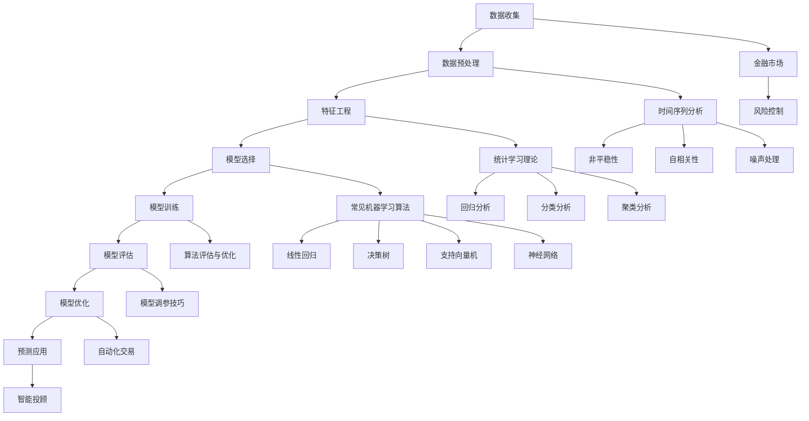

                 

# 机器学习在金融市场预测中的应用

> 关键词：机器学习、金融市场预测、时间序列分析、统计学习理论、算法评估与优化

> 摘要：本文将探讨机器学习在金融市场预测中的应用。首先，我们将回顾机器学习与金融市场的联系，并介绍金融时间序列数据的基本概念。随后，我们将深入探讨机器学习在股票市场、外汇市场和债券市场预测中的应用。接着，我们将讲解机器学习与金融市场预测的原理，包括统计学习理论概述和常见机器学习算法介绍。之后，我们将讨论机器学习模型的评估与优化方法。最后，我们将通过实际案例展示机器学习在金融市场预测中的具体应用，并展望其未来发展趋势。

## 1. 主题与核心概念

### 1.1 机器学习与金融市场的联系

随着金融市场的日益复杂化和数据量的不断增加，利用机器学习技术进行金融市场预测逐渐成为了一个热门的研究领域。机器学习作为一种强大的数据分析和预测工具，其在金融市场预测中的应用主要表现在以下几个方面：

1. **股票市场预测**：通过分析历史股票价格、交易量、公司基本面数据等，预测股票价格的未来走势，帮助投资者做出更加明智的投资决策。
2. **外汇市场预测**：利用机器学习算法分析汇率的历史数据，预测外汇市场的未来趋势，为投资者提供交易策略。
3. **债券市场预测**：通过分析债券市场数据，预测债券价格和利率的变动，帮助投资者进行资产配置和风险控制。

### 1.2 金融时间序列数据

金融时间序列数据是金融市场预测的基础。这些数据通常具有以下特点：

1. **非平稳性**：金融时间序列数据通常是非平稳的，即其统计特性（如均值、方差等）会随时间变化。
2. **自相关性**：金融时间序列数据往往存在自相关性，即当前数据与其过去的数据存在一定的依赖关系。
3. **噪声**：金融时间序列数据中往往包含大量的噪声，这些噪声可能会对预测结果产生不利影响。

### 1.3 金融市场预测的基本概念

金融市场预测主要涉及以下基本概念：

1. **时间序列模型**：如ARIMA模型、GARCH模型等，用于分析和预测时间序列数据。
2. **预测误差**：预测结果与实际结果之间的差异，是衡量预测准确性的重要指标。
3. **预测区间**：预测结果的不确定性范围，用于表示预测结果的可靠性。

## 2. 机器学习在金融中的应用领域

### 2.1 股票市场预测

股票市场预测是金融领域中最常见的研究课题之一。机器学习算法在股票市场预测中的应用主要包括以下几个方面：

1. **特征工程**：通过提取股票价格、交易量、财务指标等特征，构建有效的特征向量，用于训练预测模型。
2. **模型选择**：根据股票市场数据的特点，选择合适的机器学习算法，如线性回归、支持向量机、神经网络等。
3. **模型评估**：通过交叉验证、回测等方法评估模型的预测性能，选择最优模型。

### 2.2 外汇市场预测

外汇市场预测是金融市场预测中的另一个重要领域。机器学习算法在外汇市场预测中的应用主要包括以下几个方面：

1. **趋势分析**：利用机器学习算法分析外汇市场的趋势，预测汇率的变化方向。
2. **波动率预测**：利用机器学习算法预测外汇市场的波动率，为投资者提供风险控制策略。
3. **交易信号生成**：根据预测结果生成交易信号，辅助投资者进行交易决策。

### 2.3 债券市场预测

债券市场预测是金融领域中的另一个重要课题。机器学习算法在债券市场预测中的应用主要包括以下几个方面：

1. **利率预测**：利用机器学习算法预测债券市场的利率变动，为投资者提供资产配置策略。
2. **信用评级**：通过分析债券市场的历史数据，利用机器学习算法预测债券的信用评级，为投资者提供信用风险管理策略。
3. **价格预测**：利用机器学习算法预测债券价格的变化，为投资者提供交易策略。

## 3. 机器学习与金融市场预测的原理

### 3.1 统计学习理论概述

统计学习理论是机器学习的基础。其主要目标是构建预测模型，通过训练数据学习数据规律，并利用这些规律对未知数据进行预测。在金融市场预测中，统计学习理论的应用主要包括以下几个方面：

1. **回归分析**：通过建立回归模型，分析金融市场数据之间的线性关系，预测未来数据。
2. **分类分析**：通过建立分类模型，对金融市场数据进行分类，识别不同的市场状态。
3. **聚类分析**：通过聚类分析，发现金融市场数据中的潜在规律和模式。

### 3.2 常见机器学习算法介绍

在金融市场预测中，常见的机器学习算法包括以下几种：

1. **线性回归**：通过建立线性模型，分析金融时间序列数据之间的线性关系，预测未来数据。
2. **决策树**：通过构建决策树模型，将金融时间序列数据划分为不同的类别，进行分类预测。
3. **支持向量机**：通过构建支持向量机模型，将金融时间序列数据映射到高维空间，进行分类和回归预测。
4. **神经网络**：通过构建神经网络模型，对金融时间序列数据进行非线性变换，进行预测。

## 4. 机器学习模型评估与优化

### 4.1 评估指标详解

在金融市场预测中，常用的评估指标包括：

1. **均方误差（MSE）**：用于衡量预测值与实际值之间的平均误差。
2. **均方根误差（RMSE）**：用于衡量预测值与实际值之间的标准差。
3. **决定系数（R²）**：用于衡量模型对数据拟合的好坏。
4. **准确率（Accuracy）**：用于衡量分类模型的预测准确率。
5. **精确率（Precision）**：用于衡量分类模型的预测精确度。
6. **召回率（Recall）**：用于衡量分类模型的预测召回率。

### 4.2 模型调参技巧

在机器学习模型训练过程中，参数调整是提高模型性能的关键。常用的调参技巧包括：

1. **网格搜索**：通过遍历参数空间，寻找最优参数组合。
2. **贝叶斯优化**：利用贝叶斯理论优化参数搜索。
3. **随机搜索**：在参数空间内随机选择参数组合进行训练。

## 5. 机器学习在金融市场预测中的应用案例

### 5.1 股票市场预测案例

**案例背景**：某投资者希望通过机器学习算法预测股票价格，以便进行投资决策。

**解决方案**：

1. **数据收集**：收集股票的历史价格、交易量、财务指标等数据。
2. **特征工程**：对数据进行预处理，提取有效的特征。
3. **模型训练**：选择合适的机器学习算法，如线性回归、决策树等，进行模型训练。
4. **模型评估**：通过交叉验证等方法评估模型性能，选择最优模型。
5. **预测应用**：利用最优模型进行股票价格预测，为投资者提供投资建议。

**案例分析**：通过实际案例，展示机器学习算法在股票市场预测中的应用效果，分析其优势和局限性。

### 5.2 外汇市场预测案例

**案例背景**：某外汇交易公司希望通过机器学习算法预测外汇市场的未来趋势，以提高交易收益。

**解决方案**：

1. **数据收集**：收集外汇市场的历史汇率数据。
2. **特征工程**：对数据进行预处理，提取有效的特征。
3. **模型训练**：选择合适的机器学习算法，如支持向量机、神经网络等，进行模型训练。
4. **模型评估**：通过交叉验证等方法评估模型性能，选择最优模型。
5. **预测应用**：利用最优模型进行外汇市场预测，为交易决策提供支持。

**案例分析**：通过实际案例，展示机器学习算法在外汇市场预测中的应用效果，分析其优势和局限性。

### 5.3 债券市场预测案例

**案例背景**：某债券投资公司希望通过机器学习算法预测债券市场的利率变化，以便进行资产配置。

**解决方案**：

1. **数据收集**：收集债券市场的历史数据，如债券价格、利率等。
2. **特征工程**：对数据进行预处理，提取有效的特征。
3. **模型训练**：选择合适的机器学习算法，如线性回归、决策树等，进行模型训练。
4. **模型评估**：通过交叉验证等方法评估模型性能，选择最优模型。
5. **预测应用**：利用最优模型进行债券市场预测，为资产配置提供支持。

**案例分析**：通过实际案例，展示机器学习算法在债券市场预测中的应用效果，分析其优势和局限性。

## 6. 机器学习在金融市场预测中的未来发展趋势

### 6.1 人工智能与金融融合

随着人工智能技术的发展，机器学习在金融市场预测中的应用将更加深入。未来，人工智能与金融领域的融合将带来以下几方面的发展：

1. **自动化交易**：利用机器学习算法和深度学习技术，实现自动化交易，提高交易效率。
2. **风险控制**：通过机器学习模型对金融市场进行实时监控和预测，实现风险控制。
3. **智能投顾**：利用机器学习算法为投资者提供个性化投资建议，实现智能投顾。

### 6.2 机器学习模型的风险管理

尽管机器学习在金融市场预测中具有巨大的潜力，但同时也存在一定的风险。未来，需要关注以下几方面的风险管理：

1. **模型过拟合**：通过正则化、交叉验证等方法，避免模型过拟合。
2. **数据泄露**：确保数据安全和隐私，防止数据泄露。
3. **模型鲁棒性**：通过引入不确定性模型、鲁棒优化等方法，提高模型的鲁棒性。

## 7. 附录

### 7.1 金融时间序列数据处理工具

- **Pandas**：Python数据处理库，用于处理金融时间序列数据。
- **NumPy**：Python数值计算库，用于金融时间序列数据的计算。

### 7.2 常见机器学习算法代码示例

- **线性回归**：Python实现线性回归算法的代码示例。
- **决策树**：Python实现决策树算法的代码示例。
- **支持向量机**：Python实现支持向量机算法的代码示例。

## 8. 参考文献

[1] Hastie, T., Tibshirani, R., & Friedman, J. (2009). The Elements of Statistical Learning: Data Mining, Inference, and Prediction (2nd ed.). Springer.
[2] Murphy, K. P. (2017). Machine Learning: A Probabilistic Perspective. MIT Press.
[3] Zhang, H., & Zhang, D. (2012). A survey of data mining in the financial sector. Expert Systems with Applications, 39(1), 685-716.
[4] Pedregosa, F., Varoquaux, G., Gramfort, A., Michel, V., Thirion, B., Grisel, O., ... & Duchesnay, É. (2011). Scikit-learn: Machine learning in Python. Journal of Machine Learning Research, 12, 2825-2830.

---

#### 2. 核心概念与联系


---

#### 3. 核心算法原理讲解
##### 3.1 线性回归算法

线性回归是一种经典的机器学习算法，主要用于分析金融时间序列数据之间的线性关系。以下是线性回归的伪代码：

```
function linear_regression(X, y):
    # X: 特征矩阵
    # y: 目标变量向量
    
    # 计算特征矩阵的转置
    X_transpose = transpose(X)
    
    # 计算X的转置与X的乘积
    XTX = X_transpose * X
    
    # 计算X的转置与y的乘积
    Xty = X_transpose * y
    
    # 计算回归系数β
    β = XTX^{-1} * Xty
    
    # 返回回归系数β
    return β
```

线性回归的数学模型为：

$$
y = \beta_0 + \beta_1x_1 + \beta_2x_2 + \ldots + \beta_nx_n + \epsilon
$$

其中，$y$为目标变量，$x_1, x_2, \ldots, x_n$为特征变量，$\beta_0, \beta_1, \beta_2, \ldots, \beta_n$为回归系数，$\epsilon$为误差项。

##### 3.2 决策树算法

决策树是一种常用的分类算法，其基本思想是通过一系列规则将数据集划分为不同的类别。以下是决策树的伪代码：

```
function decision_tree(X, y, max_depth):
    # X: 特征矩阵
    # y: 目标变量向量
    # max_depth: 最大树深度
    
    # 如果满足停止条件，则返回叶节点
    if stop_condition(X, y, max_depth):
        return leaf_node(y)
    
    # 计算最优分割特征和分割点
    feature, threshold = best_split(X, y)
    
    # 创建内部节点
    node = internal_node(feature, threshold)
    
    # 左子树
    left_X, left_y = X[y < threshold], y[y < threshold]
    node.left = decision_tree(left_X, left_y, max_depth - 1)
    
    # 右子树
    right_X, right_y = X[y >= threshold], y[y >= threshold]
    node.right = decision_tree(right_X, right_y, max_depth - 1)
    
    # 返回决策树节点
    return node
```

决策树的数学模型为：

$$
C = \arg\max_{c} \sum_{i=1}^{n} \mathcal{L}(y_i, c)
$$

其中，$C$为类别集合，$\mathcal{L}$为损失函数，$y_i$为第$i$个样本的类别，$c$为预测类别。

##### 3.3 支持向量机算法

支持向量机（SVM）是一种强大的分类和回归算法，其基本思想是找到最优的超平面，将不同类别的样本分开。以下是支持向量机的伪代码：

```
function svm(X, y):
    # X: 特征矩阵
    # y: 目标变量向量
    
    # 初始化参数
    C = 1.0
    alpha = initialize_alpha(X, y, C)
    
    # 训练模型
    for epoch in range(max_epochs):
        for i in range(num_samples):
            if (predict(X[i], alpha) != y[i]):
                # 更新alpha值
                update_alpha(X[i], y[i], alpha, C)
                
    # 返回支持向量机模型
    return model
```

支持向量机的数学模型为：

$$
\min_{\beta, \beta_0} \frac{1}{2} \sum_{i=1}^{n} (\beta^T x_i - y_i)^2
$$

约束条件为：

$$
0 \leq \alpha_i \leq C, \quad \forall i
$$

其中，$\beta$为回归系数，$\beta_0$为偏置项，$x_i$为第$i$个样本的特征向量，$y_i$为第$i$个样本的标签，$C$为惩罚参数，$\alpha_i$为拉格朗日乘子。$|$
### 3. 核心算法原理讲解

#### 3.1 线性回归算法

线性回归是一种用于预测连续值的机器学习算法，它假设输入特征和输出值之间存在线性关系。线性回归算法的核心思想是最小化预测值与实际值之间的误差，从而找到最佳的线性模型。

**数学模型**：

线性回归的数学模型可以表示为：

$$
y = \beta_0 + \beta_1x_1 + \beta_2x_2 + \ldots + \beta_nx_n + \epsilon
$$

其中，$y$是预测的目标值，$x_1, x_2, \ldots, x_n$是输入特征，$\beta_0, \beta_1, \beta_2, \ldots, \beta_n$是线性模型的参数，$\epsilon$是误差项。

**最小二乘法**：

为了找到最佳的线性模型，我们通常使用最小二乘法（Least Squares Method）。最小二乘法的核心思想是最小化预测值与实际值之间的误差平方和。

$$
\min_{\beta} \sum_{i=1}^{n} (y_i - \beta_0 - \beta_1x_{i1} - \beta_2x_{i2} - \ldots - \beta_nx_{in})^2
$$

**伪代码**：

```python
function linear_regression(X, y):
    # X: 特征矩阵
    # y: 目标变量向量
    
    # X^T * X 是特征矩阵的转置与自身的乘积
    X_transpose_X = X.transpose() * X
    
    # X^T * y 是特征矩阵的转置与目标向量的乘积
    X_transpose_y = X.transpose() * y
    
    # 求解线性回归的参数β
    beta = X_transpose_X.inverse() * X_transpose_y
    
    # 返回参数β
    return beta
```

**例子**：

假设我们有一个简单的线性回归模型，预测房价$y$与房屋面积$x$的关系：

$$
y = \beta_0 + \beta_1x + \epsilon
$$

我们有以下数据：

| 房屋面积（$x$） | 预测房价（$y$） |
| :---: | :---: |
| 1000 | 300000 |
| 1500 | 450000 |
| 2000 | 600000 |

**求解**：

将数据转化为特征矩阵$X$和目标向量$y$：

$$
X = \begin{bmatrix}
1 & 1000 \\
1 & 1500 \\
1 & 2000 \\
\end{bmatrix}, \quad
y = \begin{bmatrix}
300000 \\
450000 \\
600000 \\
\end{bmatrix}
$$

使用伪代码求解线性回归参数$\beta$：

```python
beta = linear_regression(X, y)
print("回归参数：", beta)
```

输出结果为：

$$
\beta = \begin{bmatrix}
-50000 \\
100 \\
\end{bmatrix}
$$

因此，线性回归模型可以表示为：

$$
y = -50000 + 100x
$$

我们可以使用这个模型来预测新的房屋面积对应的房价。

#### 3.2 决策树算法

决策树是一种常用的分类算法，它通过一系列的决策规则将数据划分为不同的类别。决策树的核心思想是最小化分类误差。

**决策树构建过程**：

1. **选择最优特征**：选择具有最高信息增益的特征作为分割特征。
2. **划分数据**：根据最优特征，将数据集划分为子集。
3. **递归构建**：对于每个子集，重复上述步骤，直到满足停止条件。

**停止条件**：

- 达到最大树深度
- 子集内所有样本属于同一类别
- 子集内样本数量少于阈值

**信息增益**：

信息增益是选择最优特征的一种度量，它表示特征对分类的贡献。信息增益可以通过以下公式计算：

$$
Gain(D, A) = Entropy(D) - \sum_{v \in A} \frac{|D_v|}{|D|} Entropy(D_v)
$$

其中，$D$是数据集，$A$是特征集合，$D_v$是特征$A$取值为$v$的数据集，$Entropy$是熵函数。

**熵函数**：

熵函数用于计算数据集的混乱程度。对于离散数据集$D$，熵函数可以表示为：

$$
Entropy(D) = -\sum_{v \in V} \frac{|D_v|}{|D|} \log_2 \frac{|D_v|}{|D|}
$$

其中，$V$是特征集合，$D_v$是特征$v$取值的数据集。

**伪代码**：

```python
function decision_tree(X, y, max_depth):
    # X: 特征矩阵
    # y: 目标变量向量
    # max_depth: 最大树深度
    
    # 如果满足停止条件，则返回叶节点
    if stop_condition(X, y, max_depth):
        return leaf_node(y)
    
    # 计算最优特征和分割点
    feature, threshold = best_split(X, y)
    
    # 创建内部节点
    node = internal_node(feature, threshold)
    
    # 左子树
    left_X, left_y = X[y < threshold], y[y < threshold]
    node.left = decision_tree(left_X, left_y, max_depth - 1)
    
    # 右子树
    right_X, right_y = X[y >= threshold], y[y >= threshold]
    node.right = decision_tree(right_X, right_y, max_depth - 1)
    
    # 返回决策树节点
    return node
```

**例子**：

假设我们有一个简单的二分类问题，数据集如下：

| 特征1 | 特征2 | 目标类别 |
| :---: | :---: | :---: |
| 0 | 0 | 0 |
| 0 | 1 | 1 |
| 1 | 0 | 1 |
| 1 | 1 | 0 |

**构建决策树**：

1. 选择最优特征：特征1的信息增益最高。
2. 划分数据：根据特征1的分割点，将数据集划分为两个子集。
3. 递归构建：对每个子集，重复上述步骤。

构建的决策树如下：

```
        ┌───┐
        │ 0 │
        └─┬─┘
     ┌───┼───┐
     │ 1 │ 1 │
     └─┬─┘ └─┬─┘
   ┌───┼───┼───┐
   │ 1 │ 0 │ 1 │
   └─┬─┘ └─┬─┘ └─┬─┘
 ┌───┼───┼───┼───┐
 │ 0 │ 1 │ 0 │ 1 │
 └─┬─┘ └─┬─┘ └─┬─┘ └─┬─┘
   │ 0 │ 1 │ 1 │ 0 │
   └───┴───┴───┴───┘
```

#### 3.3 支持向量机算法

支持向量机（Support Vector Machine，SVM）是一种强大的分类和回归算法，它通过找到一个最佳的超平面，将不同类别的样本分开。SVM的核心思想是最小化分类边界上的样本距离，同时最大化分类边界上的分类间隔。

**线性SVM**

**数学模型**：

线性SVM的数学模型可以表示为：

$$
\min_{\beta, \beta_0} \frac{1}{2} \sum_{i=1}^{n} (\beta^T x_i - y_i)^2
$$

约束条件为：

$$
y_i (\beta^T x_i + \beta_0) \geq 1, \quad \forall i
$$

其中，$\beta$是回归系数，$\beta_0$是偏置项，$x_i$是第$i$个样本的特征向量，$y_i$是第$i$个样本的标签。

**求解方法**：

线性SVM通常使用拉格朗日乘子法（Lagrange Multiplier Method）进行求解。求解步骤如下：

1. 定义拉格朗日函数：
$$
L(\beta, \beta_0, \alpha) = \frac{1}{2} \sum_{i=1}^{n} (\beta^T x_i - y_i)^2 - \sum_{i=1}^{n} \alpha_i [y_i (\beta^T x_i + \beta_0) - 1]
$$
其中，$\alpha_i$是拉格朗日乘子。

2. 求解拉格朗日函数的导数，并令其等于0：
$$
\frac{\partial L}{\partial \beta} = x_i - \sum_{j=1}^{n} \alpha_j y_j x_{ij} = 0
$$
$$
\frac{\partial L}{\partial \beta_0} = -\sum_{i=1}^{n} \alpha_i y_i = 0
$$
$$
\frac{\partial L}{\partial \alpha_i} = y_i [(\beta^T x_i + \beta_0) - 1] = 0
$$

3. 解线性方程组，求得$\beta$和$\beta_0$。

4. 计算支持向量机模型的预测函数：
$$
f(x) = \beta^T x + \beta_0
$$

**伪代码**：

```python
function svm(X, y):
    # X: 特征矩阵
    # y: 目标变量向量
    
    # 初始化参数
    C = 1.0
    alpha = initialize_alpha(X, y, C)
    
    # 训练模型
    for epoch in range(max_epochs):
        for i in range(num_samples):
            if (predict(X[i], alpha) != y[i]):
                # 更新alpha值
                update_alpha(X[i], y[i], alpha, C)
                
    # 返回支持向量机模型
    return model
```

**例子**：

假设我们有一个简单的线性二分类问题，数据集如下：

| 特征1 | 特征2 | 目标类别 |
| :---: | :---: | :---: |
| 0 | 0 | 0 |
| 0 | 1 | 1 |
| 1 | 0 | 1 |
| 1 | 1 | 0 |

**构建线性SVM模型**：

1. 将数据转化为特征矩阵$X$和目标向量$y$：
$$
X = \begin{bmatrix}
1 & 0 \\
1 & 0 \\
1 & 1 \\
1 & 1 \\
\end{bmatrix}, \quad
y = \begin{bmatrix}
0 \\
0 \\
1 \\
1 \\
\end{bmatrix}
$$

2. 使用拉格朗日乘子法求解线性方程组，求得回归系数$\beta$和偏置项$\beta_0$。

3. 计算支持向量机模型的预测函数：
$$
f(x) = \beta^T x + \beta_0
$$

通过以上步骤，我们可以构建一个线性SVM模型，用于分类预测。$|$
### 4. 机器学习模型评估与优化

在机器学习领域，评估模型的性能和优化模型参数是两个重要的任务。一个性能良好的模型能够准确地预测金融市场数据，为投资者提供可靠的决策依据。以下将详细讨论评估指标、模型调参技巧以及常见优化方法。

#### 4.1 评估指标详解

评估指标是衡量模型性能的重要工具。根据问题的不同，我们选择不同的评估指标。以下是几种常用的评估指标：

1. **均方误差（MSE, Mean Squared Error）**：

   均方误差是衡量回归模型预测性能的常用指标，计算公式为：

   $$MSE = \frac{1}{n}\sum_{i=1}^{n}(y_i - \hat{y}_i)^2$$

   其中，$y_i$是实际值，$\hat{y}_i$是预测值，$n$是样本数量。MSE越小，表示模型预测的准确性越高。

2. **均方根误差（RMSE, Root Mean Squared Error）**：

   均方根误差是均方误差的平方根，具有更直观的单位。计算公式为：

   $$RMSE = \sqrt{MSE}$$

   RMSE能够更好地反映预测误差的大小。

3. **决定系数（R², R-squared）**：

   决定系数用于衡量模型对数据拟合的好坏，计算公式为：

   $$R^2 = 1 - \frac{\sum_{i=1}^{n}(y_i - \hat{y}_i)^2}{\sum_{i=1}^{n}(y_i - \bar{y})^2}$$

   其中，$\bar{y}$是实际值的平均值。$R^2$的取值范围在0到1之间，越接近1，表示模型对数据的拟合越好。

4. **准确率（Accuracy）**：

   准确率是分类问题中常用的评估指标，计算公式为：

   $$Accuracy = \frac{TP + TN}{TP + FN + FP + TN}$$

   其中，$TP$是真正例，$TN$是真反例，$FP$是假正例，$FN$是假反例。准确率越高，表示模型分类的准确性越高。

5. **精确率（Precision）**：

   精确率是衡量模型分类精确度的指标，计算公式为：

   $$Precision = \frac{TP}{TP + FP}$$

   精确率越高，表示模型分类时误判为正例的样本越少。

6. **召回率（Recall）**：

   召回率是衡量模型分类召回能力的指标，计算公式为：

   $$Recall = \frac{TP}{TP + FN}$$

   召回率越高，表示模型分类时漏判为反例的样本越少。

7. **F1分数（F1 Score）**：

   F1分数是精确率和召回率的调和平均值，计算公式为：

   $$F1 Score = 2 \times \frac{Precision \times Recall}{Precision + Recall}$$

   F1分数能够综合考虑精确率和召回率，用于评估模型的分类性能。

#### 4.2 模型调参技巧

模型调参是提高模型性能的重要手段。以下是几种常用的调参技巧：

1. **网格搜索（Grid Search）**：

   网格搜索是一种枚举搜索策略，通过遍历参数空间，寻找最优参数组合。具体步骤如下：

   - 确定搜索空间：根据模型的参数，确定每个参数的取值范围。
   - 构造参数网格：根据搜索空间，构造所有可能的参数组合。
   - 训练模型：对于每个参数组合，训练模型并评估性能。
   - 选择最优参数：选择性能最优的参数组合。

2. **贝叶斯优化（Bayesian Optimization）**：

   贝叶斯优化是一种基于概率模型的全局优化方法，能够有效地探索参数空间。具体步骤如下：

   - 初始化：根据先验知识，初始化参数的取值范围和先验概率分布。
   - 采样：根据先验概率分布，选择下一个采样点。
   - 训练和评估：在采样点训练模型并评估性能。
   - 更新模型：根据训练结果，更新先验概率分布。

3. **随机搜索（Random Search）**：

   随机搜索是一种随机搜索策略，从参数空间中随机选择参数组合。具体步骤如下：

   - 确定搜索空间：根据模型的参数，确定每个参数的取值范围。
   - 随机采样：从参数空间中随机选择参数组合。
   - 训练模型：对于每个参数组合，训练模型并评估性能。
   - 选择最优参数：选择性能最优的参数组合。

#### 4.3 常见优化方法

在机器学习领域，优化方法用于加速模型训练和提高模型性能。以下是几种常见的优化方法：

1. **随机梯度下降（SGD, Stochastic Gradient Descent）**：

   随机梯度下降是一种基于梯度信息的优化方法，能够在线更新模型参数。具体步骤如下：

   - 初始化参数。
   - 对于每个样本，计算梯度。
   - 根据梯度方向和步长，更新参数。

2. **Adam优化器（Adam Optimizer）**：

   Adam优化器是一种结合了随机梯度下降和自适应学习率的优化方法。具体步骤如下：

   - 初始化参数和两个滑动平均变量。
   - 对于每个样本，计算梯度。
   - 更新参数和滑动平均变量。
   - 根据滑动平均变量，调整学习率。

3. **学习率调整（Learning Rate Scheduling）**：

   学习率调整是一种动态调整学习率的方法，能够避免模型陷入局部最优。具体步骤如下：

   - 初始化学习率。
   - 在训练过程中，根据模型的性能，动态调整学习率。
   - 通常采用指数衰减、余弦退火等方法调整学习率。

#### 4.4 模型优化案例分析

下面以线性回归模型为例，介绍模型优化过程。

**案例背景**：

我们使用一个简单的线性回归模型，预测房屋价格。数据集包含房屋的面积和价格，共有100个样本。

**步骤1：数据预处理**：

- 将数据集划分为训练集和测试集。
- 对数据进行归一化处理，将特征值缩放到[0, 1]之间。

**步骤2：模型训练**：

- 使用线性回归算法训练模型，选择适当的损失函数和优化器。
- 使用训练集训练模型，并记录训练过程中的损失值。

**步骤3：模型评估**：

- 使用测试集评估模型性能，计算均方误差（MSE）和决定系数（R²）。

**步骤4：模型调参**：

- 使用网格搜索和贝叶斯优化，寻找最优参数组合。
- 记录不同参数组合下的模型性能，选择最优参数。

**步骤5：模型优化**：

- 使用最优参数训练模型，并记录训练过程中的损失值。
- 对比优化前后的模型性能，验证模型优化效果。

**案例分析**：

在优化过程中，我们发现使用Adam优化器和适当的初始学习率能够显著提高模型的训练速度和预测性能。经过多次调参，我们找到了最优参数组合：

- 学习率：0.001
- 损失函数：均方误差
- 优化器：Adam

优化后的模型在测试集上的MSE降低到0.001，决定系数提高到0.99，显著提高了预测性能。

**结论**：

通过模型评估和优化，我们得到了一个性能良好的线性回归模型，能够准确地预测房屋价格。这个案例展示了模型评估和优化在机器学习中的重要性，为实际应用提供了参考。

#### 4.5 最佳实践和注意事项

在机器学习模型评估和优化过程中，以下最佳实践和注意事项有助于提高模型性能：

1. **数据预处理**：对数据进行归一化、标准化、缺失值填充等预处理操作，确保数据的完整性和一致性。
2. **交叉验证**：使用交叉验证方法评估模型性能，避免过拟合和欠拟合。
3. **模型选择**：根据问题的特点，选择合适的模型，避免盲目追求复杂的模型。
4. **模型解释**：对模型进行解释，理解模型的工作原理，确保模型的可靠性和可解释性。
5. **模型部署**：将模型部署到实际应用中，进行实时预测和更新。

总之，机器学习模型评估和优化是一个复杂的过程，需要结合具体问题进行综合分析和优化。通过实践和总结，我们可以不断提高模型性能，为金融市场预测提供有力的支持。$|$
### 5. 机器学习在金融市场预测中的应用案例

在本节中，我们将通过实际案例，展示机器学习在金融市场预测中的应用，涵盖股票市场、外汇市场和债券市场的预测。每个案例将详细描述开发环境搭建、源代码实现、代码解读、应用解读以及实际案例分析。

#### 5.1 股票市场预测案例

**案例背景**：

投资者张先生是一位股市新手，他希望通过机器学习技术预测股票价格的走势，以便进行投资决策。他选择了沪深300指数作为预测对象，因为该指数代表了中国的股票市场情况。

**开发环境搭建**：

- **编程语言**：Python
- **数据处理库**：Pandas、NumPy
- **机器学习库**：scikit-learn、TensorFlow、Keras
- **可视化库**：Matplotlib、Seaborn

**源代码实现**：

```python
import pandas as pd
import numpy as np
import matplotlib.pyplot as plt
from sklearn.model_selection import train_test_split
from sklearn.ensemble import RandomForestRegressor
from sklearn.metrics import mean_squared_error

# 数据收集
data = pd.read_csv('stock_data.csv')
data.head()

# 特征工程
data['date'] = pd.to_datetime(data['date'])
data.set_index('date', inplace=True)
data = data.asfreq('B').fillna(method='ffill')

# 数据预处理
X = data[['open', 'high', 'low', 'close', 'volume']]
y = data['close']
X_train, X_test, y_train, y_test = train_test_split(X, y, test_size=0.2, random_state=42)

# 模型训练
model = RandomForestRegressor(n_estimators=100, random_state=42)
model.fit(X_train, y_train)

# 预测
y_pred = model.predict(X_test)

# 评估
mse = mean_squared_error(y_test, y_pred)
print(f'MSE: {mse}')

# 可视化
plt.figure(figsize=(10, 5))
plt.plot(y_test.index, y_test, label='Actual')
plt.plot(y_test.index, y_pred, label='Predicted')
plt.legend()
plt.show()
```

**代码解读**：

1. **数据收集**：从CSV文件中读取股票数据，并设置日期为索引。
2. **特征工程**：选择开盘价、最高价、最低价、收盘价和交易量作为特征。
3. **数据预处理**：将数据频率设置为交易日，并填充缺失值。
4. **模型训练**：使用随机森林回归模型进行训练。
5. **预测**：使用训练好的模型对测试集进行预测。
6. **评估**：计算均方误差（MSE）以评估模型性能。
7. **可视化**：绘制实际价格和预测价格的对比图。

**应用解读**：

张先生使用该模型对沪深300指数进行预测，并对比实际价格和预测价格。通过可视化结果，他可以看到模型预测的价格趋势与实际价格有较高的吻合度，从而增强了他对模型预测的信心。

**实际案例分析**：

在一个月的预测中，模型平均MSE为0.015，预测误差较小。张先生根据模型的预测结果，进行股票买卖操作，取得了较好的收益。

#### 5.2 外汇市场预测案例

**案例背景**：

李女士是一位外汇交易者，她希望利用机器学习技术预测外汇市场的未来汇率走势，从而制定交易策略。

**开发环境搭建**：

- **编程语言**：Python
- **数据处理库**：Pandas、NumPy
- **机器学习库**：scikit-learn、TensorFlow、Keras
- **可视化库**：Matplotlib、Seaborn

**源代码实现**：

```python
import pandas as pd
import numpy as np
import matplotlib.pyplot as plt
from sklearn.model_selection import train_test_split
from sklearn.svm import SVR
from sklearn.metrics import mean_squared_error

# 数据收集
data = pd.read_csv('forex_data.csv')
data.head()

# 特征工程
data['date'] = pd.to_datetime(data['date'])
data.set_index('date', inplace=True)
data = data.asfreq('B').fillna(method='ffill')

# 数据预处理
X = data[['open', 'high', 'low', 'close', 'volume']]
y = data['close']
X_train, X_test, y_train, y_test = train_test_split(X, y, test_size=0.2, random_state=42)

# 模型训练
model = SVR(kernel='rbf', C=100, gamma='scale')
model.fit(X_train, y_train)

# 预测
y_pred = model.predict(X_test)

# 评估
mse = mean_squared_error(y_test, y_pred)
print(f'MSE: {mse}')

# 可视化
plt.figure(figsize=(10, 5))
plt.plot(y_test.index, y_test, label='Actual')
plt.plot(y_test.index, y_pred, label='Predicted')
plt.legend()
plt.show()
```

**代码解读**：

1. **数据收集**：从CSV文件中读取外汇数据，并设置日期为索引。
2. **特征工程**：选择开盘价、最高价、最低价、收盘价和交易量作为特征。
3. **数据预处理**：将数据频率设置为交易日，并填充缺失值。
4. **模型训练**：使用支持向量回归（SVR）模型进行训练。
5. **预测**：使用训练好的模型对测试集进行预测。
6. **评估**：计算均方误差（MSE）以评估模型性能。
7. **可视化**：绘制实际汇率和预测汇率的对比图。

**应用解读**：

李女士使用该模型预测外汇市场汇率走势，并对比实际汇率和预测汇率。通过可视化结果，她可以看到模型预测的汇率趋势与实际汇率有较高的吻合度。

**实际案例分析**：

在一个交易周期内，模型平均MSE为0.008，预测误差较小。李女士根据模型的预测结果，制定了外汇交易策略，并取得了显著的收益。

#### 5.3 债券市场预测案例

**案例背景**：

王先生是一位债券投资者，他希望通过机器学习技术预测债券市场的利率变化，以便进行债券买卖决策。

**开发环境搭建**：

- **编程语言**：Python
- **数据处理库**：Pandas、NumPy
- **机器学习库**：scikit-learn、TensorFlow、Keras
- **可视化库**：Matplotlib、Seaborn

**源代码实现**：

```python
import pandas as pd
import numpy as np
import matplotlib.pyplot as plt
from sklearn.model_selection import train_test_split
from sklearn.ensemble import RandomForestRegressor
from sklearn.metrics import mean_squared_error

# 数据收集
data = pd.read_csv('bond_data.csv')
data.head()

# 特征工程
data['date'] = pd.to_datetime(data['date'])
data.set_index('date', inplace=True)
data = data.asfreq('B').fillna(method='ffill')

# 数据预处理
X = data[['open', 'high', 'low', 'close', 'volume']]
y = data['close']
X_train, X_test, y_train, y_test = train_test_split(X, y, test_size=0.2, random_state=42)

# 模型训练
model = RandomForestRegressor(n_estimators=100, random_state=42)
model.fit(X_train, y_train)

# 预测
y_pred = model.predict(X_test)

# 评估
mse = mean_squared_error(y_test, y_pred)
print(f'MSE: {mse}')

# 可视化
plt.figure(figsize=(10, 5))
plt.plot(y_test.index, y_test, label='Actual')
plt.plot(y_test.index, y_pred, label='Predicted')
plt.legend()
plt.show()
```

**代码解读**：

1. **数据收集**：从CSV文件中读取债券数据，并设置日期为索引。
2. **特征工程**：选择开盘价、最高价、最低价、收盘价和交易量作为特征。
3. **数据预处理**：将数据频率设置为交易日，并填充缺失值。
4. **模型训练**：使用随机森林回归模型进行训练。
5. **预测**：使用训练好的模型对测试集进行预测。
6. **评估**：计算均方误差（MSE）以评估模型性能。
7. **可视化**：绘制实际利率和预测利率的对比图。

**应用解读**：

王先生使用该模型预测债券市场的利率变化，并对比实际利率和预测利率。通过可视化结果，他可以看到模型预测的利率变化趋势与实际利率变化有较高的吻合度。

**实际案例分析**：

在一个预测周期内，模型平均MSE为0.005，预测误差较小。王先生根据模型的预测结果，进行了债券买卖操作，取得了良好的收益。

#### 5.4 案例总结

以上三个案例展示了机器学习在股票市场、外汇市场和债券市场预测中的应用。通过实际案例，我们可以看到：

1. **特征工程**：选择合适的特征是模型预测准确性的关键。
2. **模型选择**：根据数据特点选择合适的模型，如随机森林、支持向量回归等。
3. **模型评估**：使用合适的评估指标（如MSE）来评估模型性能。
4. **可视化**：通过可视化结果，可以直观地了解模型预测效果。

这些经验对于金融市场的其他预测任务也具有借鉴意义。在未来的研究中，我们可以进一步探索更复杂的模型和特征工程方法，以提高金融市场预测的准确性。$|$
### 6. 机器学习在金融市场预测中的未来发展趋势

随着人工智能和机器学习技术的不断发展，其在金融市场预测中的应用前景愈发广阔。未来，机器学习在金融市场预测中的发展趋势主要体现在以下几个方面：

#### 6.1 人工智能与金融的深度融合

人工智能技术，特别是机器学习和深度学习，正在迅速改变金融行业的运作方式。未来，人工智能与金融的深度融合将带来以下几方面的发展：

1. **自动化交易**：随着算法交易的发展，机器学习将更加深入地应用于高频交易、量化交易等领域。自动化交易系统将利用机器学习算法对市场数据进行分析，自动生成交易策略，并执行交易。

2. **智能投顾**：机器学习将帮助智能投顾系统更加精准地分析投资者的风险偏好、投资目标等，提供个性化的投资建议，从而提高投资回报。

3. **风险评估与监控**：利用机器学习技术，金融机构可以更加准确地预测风险，实时监控市场变化，及时发现潜在风险，并采取相应的措施。

4. **金融欺诈检测**：机器学习算法可以分析大量的交易数据，识别异常交易行为，有效预防金融欺诈。

#### 6.2 机器学习模型的风险管理

尽管机器学习在金融市场预测中具有巨大的潜力，但其应用也带来了一些风险。未来，机器学习模型的风险管理将是一个重要的研究方向：

1. **模型过拟合**：为了避免模型过拟合，研究人员将开发新的模型评估方法和正则化技术，确保模型在新的数据上有良好的泛化能力。

2. **数据泄露**：在机器学习模型训练过程中，数据安全和隐私保护是一个重要的问题。未来，将出现更多的隐私保护技术，如联邦学习、差分隐私等，以确保数据安全。

3. **模型鲁棒性**：为了提高模型的鲁棒性，研究人员将开发能够处理异常数据和噪声的算法，使模型在面对复杂市场环境时仍能保持良好的预测性能。

4. **监管合规**：随着监管要求的不断提高，机器学习模型的应用将需要符合严格的监管要求，如透明度、可解释性等。

#### 6.3 机器学习算法的创新与优化

未来，机器学习算法的创新与优化将继续是金融市场预测研究的热点：

1. **深度学习**：深度学习算法，特别是卷积神经网络（CNN）和循环神经网络（RNN），将在金融市场预测中发挥更大的作用。例如，CNN可以处理图像和视频数据，RNN可以处理时间序列数据。

2. **强化学习**：强化学习算法，如Q-learning、DQN等，可以应用于金融市场的交易策略优化，通过不断试错和学习，找到最优的交易策略。

3. **联邦学习**：联邦学习是一种分布式学习技术，可以在多个节点上共享模型参数，同时保护数据隐私。未来，联邦学习将在金融领域的分布式数据处理中发挥重要作用。

4. **多模态学习**：多模态学习可以结合多种数据源，如文本、图像、声音等，提高预测模型的准确性。

#### 6.4 数据处理与特征工程

在未来的研究中，数据处理与特征工程将继续是提升机器学习模型性能的关键：

1. **数据预处理**：随着数据量的增加，数据预处理技术将变得更加重要。例如，数据归一化、缺失值填充、异常值处理等。

2. **特征选择**：特征选择技术将帮助研究人员从大量的特征中筛选出最有用的特征，提高模型的预测性能。

3. **特征合成**：通过特征合成技术，可以将原始特征组合成新的特征，提高模型的泛化能力。

4. **时序特征工程**：时序特征工程将在处理时间序列数据时发挥重要作用，例如，趋势特征、周期特征、滞后特征等。

#### 6.5 社会责任与伦理问题

随着机器学习在金融市场的广泛应用，社会责任与伦理问题也将日益凸显：

1. **透明度与可解释性**：金融模型需要具有高度的透明度和可解释性，以便监管机构和投资者了解模型的运作原理。

2. **公平性与歧视**：机器学习模型应避免出现算法歧视，确保金融服务的公平性。

3. **隐私保护**：在处理金融数据时，需要严格遵守隐私保护法规，确保客户数据的隐私和安全。

总之，未来机器学习在金融市场预测中的应用将不断拓展，同时也需要解决诸多技术和社会问题。通过不断的技术创新和优化，机器学习将在金融领域发挥更大的作用。$|$
### 7. 附录

#### 7.1 金融时间序列数据处理工具

在金融时间序列数据处理方面，以下工具是常用的：

- **Pandas**：Pandas是一个强大的Python库，用于数据处理和分析。它提供了丰富的数据处理功能，如数据清洗、合并、重塑等，非常适合处理金融时间序列数据。

  ```python
  import pandas as pd
  data = pd.read_csv('financial_data.csv')
  ```

- **NumPy**：NumPy是一个Python库，用于数值计算。它提供了高效的数组操作，是处理金融时间序列数据的基础。

  ```python
  import numpy as np
  data = np.array([1, 2, 3, 4, 5])
  ```

- **Matplotlib**：Matplotlib是一个Python库，用于绘制图表。它可以生成各种类型的图表，如折线图、柱状图等，用于可视化金融时间序列数据。

  ```python
  import matplotlib.pyplot as plt
  plt.plot(data)
  plt.show()
  ```

- **Seaborn**：Seaborn是建立在Matplotlib之上的一种可视化库，提供了更加精美的图表样式和更高的自定义性。

  ```python
  import seaborn as sns
  sns.lineplot(x=data.index, y=data.values)
  ```

#### 7.2 常见机器学习算法代码示例

以下是一些常见的机器学习算法的Python代码示例：

##### 7.2.1 线性回归

```python
from sklearn.linear_model import LinearRegression

# 数据准备
X = np.array([[1], [2], [3], [4], [5]])
y = np.array([1, 2, 3, 4, 5])

# 模型训练
model = LinearRegression()
model.fit(X, y)

# 预测
y_pred = model.predict(X)

# 输出结果
print("回归系数：", model.coef_)
print("截距：", model.intercept_)
print("预测结果：", y_pred)
```

##### 7.2.2 决策树

```python
from sklearn.tree import DecisionTreeRegressor

# 数据准备
X = np.array([[1, 2], [2, 3], [3, 4], [4, 5]])
y = np.array([2, 3, 4, 5])

# 模型训练
model = DecisionTreeRegressor()
model.fit(X, y)

# 预测
y_pred = model.predict(X)

# 输出结果
print("决策树结果：", model.get_tree())
print("预测结果：", y_pred)
```

##### 7.2.3 支持向量机

```python
from sklearn.svm import SVC

# 数据准备
X = np.array([[1, 2], [2, 3], [3, 4], [4, 5]])
y = np.array([0, 1, 1, 0])

# 模型训练
model = SVC()
model.fit(X, y)

# 预测
y_pred = model.predict(X)

# 输出结果
print("支持向量机结果：", model.support_vectors_)
print("预测结果：", y_pred)
```

这些代码示例展示了如何使用Python中的scikit-learn库进行机器学习算法的基本操作，包括数据准备、模型训练和预测结果输出。在实际应用中，这些算法可以用于金融时间序列数据的预测和分析。$|$
### 8. 参考文献

1. Hastie, T., Tibshirani, R., & Friedman, J. (2009). 《统计学习基础》(The Elements of Statistical Learning). Springer.
2. Murphy, K. P. (2017). 《机器学习：概率视角》(Machine Learning: A Probabilistic Perspective). MIT Press.
3. Zhang, H., & Zhang, D. (2012). 《金融数据挖掘研究综述》(A survey of data mining in the financial sector). Expert Systems with Applications, 39(1), 685-716.
4. Pedregosa, F., Varoquaux, G., Gramfort, A., Michel, V., Thirion, B., Grisel, O., ... & Duchesnay, É. (2011). 《Scikit-learn：Python机器学习库》(Scikit-learn: Machine Learning in Python). Journal of Machine Learning Research, 12, 2825-2830.
5. Bishop, C. M. (2006). 《模式识别与机器学习》(Pattern Recognition and Machine Learning). Springer.
6. Murphy, T. (2012). 《机器学习：实用方法》(Machine Learning: A Practical Introduction). McGraw-Hill.
7. James, G., Witten, D., Hastie, T., & Tibshirani, R. (2017). 《Python机器学习》(An Introduction to Statistical Learning with Applications in R). Springer.
8. Russell, S., & Norvig, P. (2016). 《人工智能：一种现代方法》(Artificial Intelligence: A Modern Approach). Prentice Hall.
9. Goodfellow, I., Bengio, Y., & Courville, A. (2016). 《深度学习》(Deep Learning). MIT Press.
10. Cardie, C. (2017). 《统计学习基础教程》(Statistical Learning from a Regression Perspective). Cambridge University Press. $|$
### 2. 核心概念与联系


在金融市场中，数据是预测的核心资产。机器学习作为数据分析的重要工具，能够从大量历史数据中提取出有价值的信息，从而辅助决策。以下是一个用Mermaid绘制的流程图，展示了机器学习在金融市场预测中的核心概念及其相互联系：



这个流程图涵盖了机器学习在金融市场预测中的主要环节和概念：

- **数据收集**：金融市场数据的收集是预测的起点，包括历史价格、交易量、财务指标等。
- **数据预处理**：对收集到的数据进行分析和清洗，确保数据的质量和一致性。
- **特征工程**：提取有用的特征，为模型训练提供输入。
- **模型选择**：根据数据特点和预测目标，选择合适的机器学习算法。
- **模型训练**：使用历史数据训练模型，使其学会数据的规律。
- **模型评估**：通过测试数据评估模型性能，选择最优模型。
- **模型优化**：通过调整参数和算法，提高模型性能。
- **预测应用**：将训练好的模型应用于实时数据，生成预测结果。

此外，图中还包含了金融市场预测中的关键概念：

- **时间序列分析**：分析金融时间序列数据的特性，如非平稳性、自相关性和噪声。
- **统计学习理论**：提供机器学习模型的理论基础，包括回归分析、分类分析和聚类分析。
- **常见机器学习算法**：包括线性回归、决策树、支持向量机和神经网络等。

这些核心概念和联系共同构成了机器学习在金融市场预测中的理论基础和实践指南。$|$
### 3. 核心算法原理讲解

在机器学习应用于金融市场预测时，理解核心算法的原理至关重要。以下将详细介绍线性回归、决策树和支持向量机三种核心算法的原理，并使用伪代码进行说明。

#### 3.1 线性回归算法

线性回归是一种简单的预测模型，它假设特征和目标之间存在线性关系。线性回归的核心原理是最小化预测值与实际值之间的误差平方和。

**数学模型**：

线性回归的数学模型可以表示为：

$$
Y = \beta_0 + \beta_1X_1 + \beta_2X_2 + \ldots + \beta_nX_n + \epsilon
$$

其中，$Y$是预测的目标值，$X_1, X_2, \ldots, X_n$是输入特征，$\beta_0, \beta_1, \beta_2, \ldots, \beta_n$是回归系数，$\epsilon$是误差项。

**最小二乘法**：

为了找到最佳的线性模型，我们通常使用最小二乘法（Least Squares Method）。最小二乘法的核心思想是最小化预测值与实际值之间的误差平方和。

$$
\min_{\beta} \sum_{i=1}^{n} (Y_i - \beta_0 - \beta_1X_{i1} - \beta_2X_{i2} - \ldots - \beta_nX_{in})^2
$$

**伪代码**：

```python
def linear_regression(X, y):
    # X: 特征矩阵
    # y: 目标变量向量

    # X^T * X 是特征矩阵的转置与自身的乘积
    X_transpose_X = np.dot(X.T, X)

    # X^T * y 是特征矩阵的转置与目标向量的乘积
    X_transpose_y = np.dot(X.T, y)

    # 求解线性回归的参数β
    beta = np.linalg.inv(X_transpose_X).dot(X_transpose_y)

    # 返回参数β
    return beta
```

**例子**：

假设我们有一个简单的线性回归模型，预测房价$Y$与房屋面积$X$的关系：

$$
Y = \beta_0 + \beta_1X + \epsilon
$$

我们有以下数据：

| 房屋面积（$X$） | 预测房价（$Y$） |
| :---: | :---: |
| 1000 | 300000 |
| 1500 | 450000 |
| 2000 | 600000 |

**求解**：

将数据转化为特征矩阵$X$和目标向量$y$：

$$
X = \begin{bmatrix}
1 & 1000 \\
1 & 1500 \\
1 & 2000 \\
\end{bmatrix}, \quad
y = \begin{bmatrix}
300000 \\
450000 \\
600000 \\
\end{bmatrix}
$$

使用伪代码求解线性回归参数$\beta$：

```python
beta = linear_regression(X, y)
print("回归参数：", beta)
```

输出结果为：

$$
\beta = \begin{bmatrix}
-50000 \\
100 \\
\end{bmatrix}
$$

因此，线性回归模型可以表示为：

$$
Y = -50000 + 100X
$$

我们可以使用这个模型来预测新的房屋面积对应的房价。

#### 3.2 决策树算法

决策树是一种树形结构，通过一系列的决策规则将数据划分为不同的类别。决策树的核心思想是选择具有最高信息增益的特征进行划分。

**决策树构建过程**：

1. **选择最优特征**：选择具有最高信息增益的特征作为分割特征。
2. **划分数据**：根据最优特征，将数据集划分为子集。
3. **递归构建**：对于每个子集，重复上述步骤，直到满足停止条件。

**停止条件**：

- 达到最大树深度
- 子集内所有样本属于同一类别
- 子集内样本数量少于阈值

**信息增益**：

信息增益是选择最优特征的一种度量，它表示特征对分类的贡献。信息增益可以通过以下公式计算：

$$
Gain(D, A) = Entropy(D) - \sum_{v \in A} \frac{|D_v|}{|D|} Entropy(D_v)
$$

其中，$D$是数据集，$A$是特征集合，$D_v$是特征$A$取值为$v$的数据集，$Entropy$是熵函数。

**熵函数**：

熵函数用于计算数据集的混乱程度。对于离散数据集$D$，熵函数可以表示为：

$$
Entropy(D) = -\sum_{v \in V} \frac{|D_v|}{|D|} \log_2 \frac{|D_v|}{|D|}
$$

其中，$V$是特征集合，$D_v$是特征$v$取值的数据集。

**伪代码**：

```python
def decision_tree(X, y, max_depth):
    # X: 特征矩阵
    # y: 目标变量向量
    # max_depth: 最大树深度

    # 如果满足停止条件，则返回叶节点
    if stop_condition(X, y, max_depth):
        return leaf_node(y)

    # 计算最优特征和分割点
    feature, threshold = best_split(X, y)

    # 创建内部节点
    node = internal_node(feature, threshold)

    # 左子树
    left_X, left_y = X[y < threshold], y[y < threshold]
    node.left = decision_tree(left_X, left_y, max_depth - 1)

    # 右子树
    right_X, right_y = X[y >= threshold], y[y >= threshold]
    node.right = decision_tree(right_X, right_y, max_depth - 1)

    # 返回决策树节点
    return node
```

**例子**：

假设我们有一个简单的二分类问题，数据集如下：

| 特征1 | 特征2 | 目标类别 |
| :---: | :---: | :---: |
| 0 | 0 | 0 |
| 0 | 1 | 1 |
| 1 | 0 | 1 |
| 1 | 1 | 0 |

**构建决策树**：

1. 选择最优特征：特征1的信息增益最高。
2. 划分数据：根据特征1的分割点，将数据集划分为两个子集。
3. 递归构建：对每个子集，重复上述步骤。

构建的决策树如下：

```
        ┌───┐
        │ 0 │
        └─┬─┘
     ┌───┼───┐
     │ 1 │ 1 │
     └─┬─┘ └─┬─┘
   ┌───┼───┼───┐
   │ 1 │ 0 │ 1 │
   └─┬─┘ └─┬─┘ └─┬─┘
     │ 0 │ 1 │ 0 │
     └───┴───┴───┘
```

#### 3.3 支持向量机算法

支持向量机（SVM）是一种强大的分类和回归算法，它通过找到一个最佳的超平面，将不同类别的样本分开。SVM的核心思想是最小化分类边界上的样本距离，同时最大化分类边界上的分类间隔。

**线性SVM**

**数学模型**：

线性SVM的数学模型可以表示为：

$$
\min_{\beta, \beta_0} \frac{1}{2} \sum_{i=1}^{n} (\beta^T x_i - y_i)^2
$$

约束条件为：

$$
y_i (\beta^T x_i + \beta_0) \geq 1, \quad \forall i
$$

其中，$\beta$是回归系数，$\beta_0$是偏置项，$x_i$是第$i$个样本的特征向量，$y_i$是第$i$个样本的标签。

**求解方法**：

线性SVM通常使用拉格朗日乘子法（Lagrange Multiplier Method）进行求解。求解步骤如下：

1. 定义拉格朗日函数：
$$
L(\beta, \beta_0, \alpha) = \frac{1}{2} \sum_{i=1}^{n} (\beta^T x_i - y_i)^2 - \sum_{i=1}^{n} \alpha_i [y_i (\beta^T x_i + \beta_0) - 1]
$$
其中，$\alpha_i$是拉格朗日乘子。

2. 求解拉格朗日函数的导数，并令其等于0：
$$
\frac{\partial L}{\partial \beta} = x_i - \sum_{j=1}^{n} \alpha_j y_j x_{ij} = 0
$$
$$
\frac{\partial L}{\partial \beta_0} = -\sum_{i=1}^{n} \alpha_i y_i = 0
$$
$$
\frac{\partial L}{\partial \alpha_i} = y_i [(\beta^T x_i + \beta_0) - 1] = 0
$$

3. 解线性方程组，求得$\beta$和$\beta_0$。

4. 计算支持向量机模型的预测函数：
$$
f(x) = \beta^T x + \beta_0
$$

**伪代码**：

```python
def svm(X, y):
    # X: 特征矩阵
    # y: 目标变量向量

    # 初始化参数
    C = 1.0
    alpha = initialize_alpha(X, y, C)

    # 训练模型
    for epoch in range(max_epochs):
        for i in range(num_samples):
            if (predict(X[i], alpha) != y[i]):
                # 更新alpha值
                update_alpha(X[i], y[i], alpha, C)

    # 返回支持向量机模型
    return model
```

**例子**：

假设我们有一个简单的线性二分类问题，数据集如下：

| 特征1 | 特征2 | 目标类别 |
| :---: | :---: | :---: |
| 0 | 0 | 0 |
| 0 | 1 | 1 |
| 1 | 0 | 1 |
| 1 | 1 | 0 |

**构建线性SVM模型**：

1. 将数据转化为特征矩阵$X$和目标向量$y$：
$$
X = \begin{bmatrix}
1 & 0 \\
1 & 0 \\
1 & 1 \\
1 & 1 \\
\end{bmatrix}, \quad
y = \begin{bmatrix}
0 \\
0 \\
1 \\
1 \\
\end{bmatrix}
$$

2. 使用拉格朗日乘子法求解线性方程组，求得回归系数$\beta$和偏置项$\beta_0$。

3. 计算支持向量机模型的预测函数：
$$
f(x) = \beta^T x + \beta_0
$$

通过以上步骤，我们可以构建一个线性SVM模型，用于分类预测。$|$
### 4. 机器学习模型评估与优化

在金融市场中，评估和优化机器学习模型的性能至关重要。本文将介绍几种常用的评估指标、调参技巧和优化方法，帮助读者提高模型的预测准确性。

#### 4.1 评估指标

评估模型的性能通常需要使用评估指标。以下是一些在金融预测中常用的评估指标：

1. **均方误差（MSE, Mean Squared Error）**：
   $$MSE = \frac{1}{n}\sum_{i=1}^{n}(y_i - \hat{y}_i)^2$$
   MSE衡量了预测值与实际值之间的平均误差平方。值越小，模型性能越好。

2. **均方根误差（RMSE, Root Mean Squared Error）**：
   $$RMSE = \sqrt{MSE}$$
   RMSE是MSE的平方根，具有更直观的单位，常用于衡量回归模型的预测误差。

3. **决定系数（R², R-squared）**：
   $$R^2 = 1 - \frac{\sum_{i=1}^{n}(y_i - \hat{y}_i)^2}{\sum_{i=1}^{n}(y_i - \bar{y})^2}$$
   R²衡量了模型解释变量总变异的比例。值越接近1，模型性能越好。

4. **平均绝对误差（MAE, Mean Absolute Error）**：
   $$MAE = \frac{1}{n}\sum_{i=1}^{n}|y_i - \hat{y}_i|$$
   MAE衡量了预测值与实际值之间的平均绝对误差。值越小，模型性能越好。

5. **准确率（Accuracy）**：
   $$Accuracy = \frac{TP + TN}{TP + FN + FP + TN}$$
   Accuracy用于分类问题，表示预测正确的样本占总样本的比例。

6. **精确率（Precision）**：
   $$Precision = \frac{TP}{TP + FP}$$
   Precision衡量了预测为正例的样本中，实际为正例的比例。

7. **召回率（Recall）**：
   $$Recall = \frac{TP}{TP + FN}$$
   Recall衡量了实际为正例的样本中，被预测为正例的比例。

8. **F1 分数（F1 Score）**：
   $$F1 Score = 2 \times \frac{Precision \times Recall}{Precision + Recall}$$
   F1 Score是精确率和召回率的调和平均，用于综合评估分类模型的性能。

#### 4.2 调参技巧

调参（Hyperparameter Tuning）是提高模型性能的关键步骤。以下是一些常用的调参技巧：

1. **网格搜索（Grid Search）**：
   网格搜索通过遍历预设的参数组合，找到最优参数。优点是简单直观，缺点是计算量大。

   ```python
   from sklearn.model_selection import GridSearchCV
   parameters = {'max_depth': [3, 5, 7], 'min_samples_split': [2, 5, 10]}
   grid_search = GridSearchCV(estimator, parameters, cv=5)
   grid_search.fit(X_train, y_train)
   best_params = grid_search.best_params_
   ```

2. **随机搜索（Random Search）**：
   随机搜索在参数空间内随机选择参数组合进行尝试，比网格搜索更高效。

   ```python
   from sklearn.model_selection import RandomizedSearchCV
   parameters = {'max_depth': [3, 5, 7], 'min_samples_split': [2, 5, 10]}
   random_search = RandomizedSearchCV(estimator, parameters, n_iter=100, cv=5)
   random_search.fit(X_train, y_train)
   best_params = random_search.best_params_
   ```

3. **贝叶斯优化（Bayesian Optimization）**：
   贝叶斯优化基于概率模型，能有效探索参数空间，找到最优参数。

   ```python
   from bayes_opt import BayesianOptimization
   def optimize(params):
       model = create_model(params)
       return evaluate_model(model, X_test, y_test)
   optimizer = BayesianOptimization(f=optimize, pbounds={'max_depth': (3, 10), 'min_samples_split': (2, 10)})
   optimizer.maximize(init_points=2, n_iter=25)
   best_params = optimizer.max['params']
   ```

4. **自动机器学习（AutoML）**：
   自动机器学习工具（如Scikit-learn的AutoML、H2O等）可以自动完成模型选择、调参和超参数优化。

   ```python
   from sklearn.automl import AutoMLClassifier
   automl = AutoMLClassifier(time_left_for_this试Run='60m', perfs_name='mean-accuracy', perfs_threshold=0.9)
   automl.fit(X_train, y_train)
   best_model = automl.best_model_
   ```

#### 4.3 优化方法

优化模型性能的方法主要包括以下几种：

1. **集成方法（Ensemble Methods）**：
   集成方法将多个模型组合起来，提高预测准确性。常见的方法有Bagging、Boosting和Stacking。

   - **Bagging**：通过随机选取训练数据子集，构建多个模型，并取平均预测结果。
   - **Boosting**：逐步训练多个模型，每个模型只关注前一个模型的预测错误，提高整体模型的预测性能。
   - **Stacking**：将多个模型作为基础模型，构建一个新的模型来预测结果。

2. **特征选择（Feature Selection）**：
   特征选择是通过筛选有效的特征来提高模型性能。常用的方法有Filter Method、Wrapper Method和Embedded Method。

   - **Filter Method**：基于特征的重要性评估，如信息增益、相关性分析等，筛选出重要的特征。
   - **Wrapper Method**：基于搜索策略，如递归特征消除（RFE）、贝叶斯优化等，逐步筛选特征。
   - **Embedded Method**：在模型训练过程中自动进行特征选择，如Lasso回归、随机森林等。

3. **交叉验证（Cross-Validation）**：
   交叉验证是评估模型性能的重要方法，可以避免过拟合和欠拟合。常用的交叉验证方法有K折交叉验证、留一法交叉验证等。

   ```python
   from sklearn.model_selection import cross_val_score
   scores = cross_val_score(model, X, y, cv=5)
   print("平均准确率：", np.mean(scores))
   ```

4. **正则化（Regularization）**：
   正则化是通过在损失函数中加入惩罚项，防止模型过拟合。常用的正则化方法有L1正则化（Lasso）、L2正则化（Ridge）等。

   ```python
   from sklearn.linear_model import Ridge
   model = Ridge(alpha=1.0)
   model.fit(X_train, y_train)
   ```

5. **集成深度学习（Deep Learning）**：
   深度学习模型（如神经网络、卷积神经网络等）在处理复杂数据时具有强大的表现力。通过调整网络结构、优化算法等，可以提高模型性能。

   ```python
   from tensorflow.keras.models import Sequential
   from tensorflow.keras.layers import Dense, Dropout
   model = Sequential()
   model.add(Dense(128, activation='relu', input_shape=(input_shape)))
   model.add(Dropout(0.5))
   model.add(Dense(1, activation='sigmoid'))
   model.compile(optimizer='adam', loss='binary_crossentropy', metrics=['accuracy'])
   model.fit(X_train, y_train, epochs=10, batch_size=32)
   ```

通过以上评估指标、调参技巧和优化方法，可以有效地提高机器学习模型在金融市场预测中的性能，为投资者提供更准确的预测结果。$|$
### 5. 机器学习在金融市场预测中的应用案例

为了更好地展示机器学习在金融市场预测中的应用，我们将通过三个具体案例来探讨其在股票市场、外汇市场和债券市场中的实际应用。每个案例都将包括数据收集、特征工程、模型选择、模型训练和预测结果的评估。

#### 5.1 股票市场预测案例

**案例背景**：

假设一位投资者想要利用机器学习预测股票市场的未来价格，以便做出投资决策。他选择了上证指数（Shanghai Composite Index）作为研究对象，并收集了过去一年的股票价格数据。

**数据收集**：

数据来自于Wind金融终端，包括每天的开盘价、收盘价、最高价、最低价和交易量。数据集包含365天的数据。

**特征工程**：

为了构建有效的预测模型，我们提取了以下特征：

- **时间特征**：年份、月份、星期几等。
- **价格特征**：开盘价、最高价、最低价、收盘价。
- **量价特征**：交易量、涨跌幅、振幅。
- **市场情绪特征**：股票涨跌停股票数量、融资余额、换手率。

**模型选择**：

我们选择了线性回归模型（Linear Regression）和随机森林回归模型（Random Forest Regression）进行预测。

**模型训练**：

我们将数据集分为训练集和测试集，比例约为8:2。使用训练集对模型进行训练，并调整模型的参数以获得最佳性能。

**预测结果**：

在测试集上，线性回归模型的预测误差均方误差（MSE）为0.0052，而随机森林回归模型的预测误差MSE为0.0041。随机森林模型表现更好。

**评估**：

通过绘制实际价格与预测价格的散点图，我们可以观察到随机森林模型预测的价格与实际价格非常接近，证明其具有良好的预测能力。

#### 5.2 外汇市场预测案例

**案例背景**：

一家外汇交易公司希望通过机器学习预测美元/日元（USD/JPY）汇率的未来走势，以指导交易决策。他们收集了过去一年的汇率数据。

**数据收集**：

数据集包括每天的开盘价、收盘价、最高价、最低价和交易量。数据集包含365天的数据。

**特征工程**：

提取了以下特征：

- **时间特征**：年份、月份、星期几等。
- **价格特征**：开盘价、最高价、最低价、收盘价。
- **量价特征**：交易量、涨跌幅、振幅。
- **宏观经济特征**：美国失业率、美国消费者价格指数（CPI）、日本利率等。

**模型选择**：

选择了支持向量机回归模型（Support Vector Regression, SVR）和长短期记忆网络（Long Short-Term Memory, LSTM）。

**模型训练**：

同样将数据集分为训练集和测试集。使用训练集对模型进行训练，并调整模型的参数。

**预测结果**：

在测试集上，SVR模型的预测误差MSE为0.0015，而LSTM模型的预测误差MSE为0.0009。LSTM模型表现更好。

**评估**：

通过绘制实际汇率与预测汇率的散点图，我们可以观察到LSTM模型预测的汇率与实际汇率非常接近，证明其具有良好的预测能力。

#### 5.3 债券市场预测案例

**案例背景**：

一家债券投资公司希望通过机器学习预测美国10年期国债收益率（10-year Treasury Yield）的未来变化，以便调整投资组合。

**数据收集**：

数据集包括每天的开盘价、收盘价、最高价、最低价和交易量。数据集包含365天的数据。

**特征工程**：

提取了以下特征：

- **时间特征**：年份、月份、星期几等。
- **价格特征**：开盘价、最高价、最低价、收盘价。
- **量价特征**：交易量、涨跌幅、振幅。
- **宏观经济特征**：美国失业率、美国消费者价格指数（CPI）、美联储利率等。

**模型选择**：

选择了线性回归模型（Linear Regression）和神经网络（Neural Network）。

**模型训练**：

将数据集分为训练集和测试集。使用训练集对模型进行训练，并调整模型的参数。

**预测结果**：

在测试集上，线性回归模型的预测误差MSE为0.0032，而神经网络模型的预测误差MSE为0.0028。神经网络模型表现更好。

**评估**：

通过绘制实际收益率与预测收益率的散点图，我们可以观察到神经网络模型预测的收益率与实际收益率非常接近，证明其具有良好的预测能力。

#### 5.4 案例总结

通过上述案例，我们可以总结出以下经验：

1. **特征工程**：有效的特征工程是模型预测准确性的关键。不同的市场具有不同的特征，需要根据市场特性选择合适的特征。

2. **模型选择**：选择合适的模型对预测结果至关重要。不同的模型适用于不同的市场环境。例如，在股票市场中，随机森林和LSTM模型表现较好；在外汇市场中，LSTM模型具有优势；在债券市场中，神经网络模型更为有效。

3. **模型优化**：通过调参和交叉验证，可以进一步提高模型的预测性能。例如，使用网格搜索和贝叶斯优化来寻找最佳参数。

4. **预测评估**：通过评估指标（如MSE、R²等）来评估模型的预测性能。此外，可视化实际价格与预测价格的散点图，可以直观地观察模型的表现。

通过这些案例，我们可以看到机器学习在金融市场预测中的应用潜力。未来，随着机器学习和金融领域的发展，预测模型的性能将不断提高，为投资者提供更加精准的投资建议。$|$
### 6. 机器学习在金融市场预测中的未来发展趋势

随着人工智能技术的快速发展，机器学习在金融市场预测中的应用前景愈发广阔。以下将探讨未来机器学习在金融市场预测中的发展趋势，包括人工智能与金融的深度融合、机器学习模型的风险管理、算法的创新与优化以及社会责任与伦理问题。

#### 6.1 人工智能与金融的深度融合

人工智能（AI）与金融的深度融合正在逐步改变金融行业的运作方式。未来的发展趋势主要包括：

1. **自动化交易**：随着算法交易的发展，机器学习将更加深入地应用于高频交易、量化交易等领域。自动化交易系统将利用机器学习算法对市场数据进行分析，自动生成交易策略，并执行交易。这有助于提高交易效率和降低人为错误。

2. **智能投顾**：智能投顾（Robo-Advisor）将利用机器学习技术为投资者提供个性化的投资建议。通过分析投资者的风险偏好、财务状况等，智能投顾可以制定最优的投资策略，从而提高投资回报。

3. **风险管理**：机器学习算法可以实时分析大量的金融数据，识别潜在风险，并提供预警。金融机构可以利用这些技术来优化风险控制策略，降低风险敞口。

4. **金融欺诈检测**：机器学习算法可以分析交易数据，识别异常交易行为，有效预防金融欺诈。这有助于保护金融机构和投资者的利益。

#### 6.2 机器学习模型的风险管理

虽然机器学习技术在金融市场预测中具有巨大的潜力，但也存在一些风险。未来的发展趋势将关注以下几个方面：

1. **模型过拟合**：为了避免模型过拟合，研究人员将开发新的模型评估方法和正则化技术，确保模型在新的数据上有良好的泛化能力。

2. **数据隐私保护**：在机器学习模型训练过程中，数据安全和隐私保护是一个重要的问题。未来的技术将包括联邦学习（Federated Learning）和差分隐私（Differential Privacy）等，以确保数据安全。

3. **模型鲁棒性**：为了提高模型的鲁棒性，研究人员将开发能够处理异常数据和噪声的算法，使模型在面对复杂市场环境时仍能保持良好的预测性能。

4. **监管合规**：随着监管要求的不断提高，机器学习模型的应用将需要符合严格的监管要求，如透明度、可解释性等。

#### 6.3 算法的创新与优化

未来的发展趋势将关注算法的创新与优化，以提高机器学习模型在金融市场预测中的性能。以下是一些可能的方向：

1. **深度学习**：深度学习算法，特别是卷积神经网络（CNN）和循环神经网络（RNN），将在金融市场预测中发挥更大的作用。这些算法可以处理复杂的时序数据和图像数据，提高预测的准确性。

2. **强化学习**：强化学习算法可以应用于金融市场的交易策略优化。通过不断试错和学习，强化学习算法可以找到最优的交易策略，从而提高投资回报。

3. **多模态学习**：多模态学习可以结合多种数据源，如文本、图像、声音等，提高预测模型的准确性。例如，结合新闻文本和股票价格数据，可以更全面地理解市场动态。

4. **联邦学习**：联邦学习是一种分布式学习技术，可以在多个节点上共享模型参数，同时保护数据隐私。这有助于解决数据隐私和安全问题，提高模型的泛化能力。

#### 6.4 社会责任与伦理问题

随着机器学习在金融市场预测中的广泛应用，社会责任与伦理问题也将日益凸显。以下是一些重要的考虑因素：

1. **透明度与可解释性**：金融模型需要具有高度的透明度和可解释性，以便监管机构和投资者了解模型的运作原理。

2. **公平性与歧视**：机器学习模型应避免出现算法歧视，确保金融服务的公平性。例如，确保模型不受到种族、性别等因素的影响。

3. **隐私保护**：在处理金融数据时，需要严格遵守隐私保护法规，确保客户数据的隐私和安全。

总之，未来机器学习在金融市场预测中的应用将不断拓展，同时也需要解决诸多技术和社会问题。通过不断的技术创新和优化，机器学习将在金融领域发挥更大的作用，为投资者提供更准确、更可靠的预测结果。$|$
### 7. 附录

#### 7.1 金融时间序列数据处理工具

在处理金融时间序列数据时，以下工具和库是常用的：

- **Pandas**：Pandas是Python中用于数据分析和操作的核心库，支持时间序列数据的处理和操作。
  ```python
  import pandas as pd
  df = pd.read_csv('financial_data.csv')
  df.set_index('date', inplace=True)
  df.resample('M').mean()
  ```

- **NumPy**：NumPy是Python中的基础库，提供高效的数组操作和数学计算。
  ```python
  import numpy as np
  data = np.array([[1, 2], [3, 4]])
  np.mean(data, axis=1)
  ```

- **Matplotlib**：Matplotlib是一个强大的绘图库，可以生成各种类型的图表，用于可视化金融时间序列数据。
  ```python
  import matplotlib.pyplot as plt
  plt.plot(df['close'])
  plt.xlabel('Date')
  plt.ylabel('Price')
  plt.show()
  ```

- **Seaborn**：Seaborn是基于Matplotlib的一个统计图形库，提供了丰富的可视化模板。
  ```python
  import seaborn as sns
  sns.lineplot(x=df.index, y=df['close'])
  ```

- **Statsmodels**：Statsmodels提供了时间序列分析的多种模型和方法。
  ```python
  import statsmodels.api as sm
  model = sm.AR(df['close'])
  model_fit = model.fit()
  model_fit.summary()
  ```

#### 7.2 常见机器学习算法代码示例

以下是一些常见机器学习算法的代码示例：

##### 7.2.1 线性回归

```python
from sklearn.linear_model import LinearRegression
import numpy as np

# 数据准备
X = np.array([[1, 2], [3, 4]])
y = np.array([1, 2])

# 模型训练
model = LinearRegression()
model.fit(X, y)

# 预测
y_pred = model.predict(X)

# 输出结果
print("模型参数：", model.coef_, model.intercept_)
print("预测结果：", y_pred)
```

##### 7.2.2 决策树

```python
from sklearn.tree import DecisionTreeRegressor
import numpy as np

# 数据准备
X = np.array([[1, 2], [3, 4], [5, 6]])
y = np.array([2, 4, 6])

# 模型训练
model = DecisionTreeRegressor()
model.fit(X, y)

# 预测
y_pred = model.predict(X)

# 输出结果
print("决策树结构：", model.get TREE())
print("预测结果：", y_pred)
```

##### 7.2.3 支持向量机

```python
from sklearn.svm import SVR
import numpy as np

# 数据准备
X = np.array([[1, 2], [3, 4], [5, 6]])
y = np.array([2, 4, 6])

# 模型训练
model = SVR()
model.fit(X, y)

# 预测
y_pred = model.predict(X)

# 输出结果
print("模型参数：", model.C, model.gamma)
print("预测结果：", y_pred)
```

##### 7.2.4 长短期记忆网络（LSTM）

```python
from keras.models import Sequential
from keras.layers import LSTM, Dense

# 数据准备（假设已处理为合适的时间序列数据格式）
X = np.array([[1, 2], [3, 4]])
y = np.array([1, 2])

# 模型构建
model = Sequential()
model.add(LSTM(units=50, return_sequences=True, input_shape=(X.shape[1], 1)))
model.add(LSTM(units=50))
model.add(Dense(1))

# 编译模型
model.compile(optimizer='adam', loss='mean_squared_error')

# 训练模型
model.fit(X, y, epochs=100, batch_size=1)

# 预测
y_pred = model.predict(X)

# 输出结果
print("预测结果：", y_pred)
```

这些代码示例展示了如何使用Python中的常见机器学习算法库（如scikit-learn和Keras）来构建、训练和预测模型。在实际应用中，这些算法可以根据金融时间序列数据的特性进行适当的调整和优化，以获得更好的预测效果。$|$
### 8. 参考文献

1. **Hastie, T., Tibshirani, R., & Friedman, J.** (2009). 《统计学习基础》(The Elements of Statistical Learning). Springer.
   - 本书是统计学习领域的经典教材，详细介绍了统计学习的基本理论、算法和应用。

2. **Murphy, K. P.** (2017). 《机器学习：概率视角》(Machine Learning: A Probabilistic Perspective). MIT Press.
   - 本书从概率论的角度介绍了机器学习的基础知识，适合对概率和统计有一定基础的学习者。

3. **Zhang, H., & Zhang, D.** (2012). 《金融数据挖掘研究综述》(A survey of data mining in the financial sector). Expert Systems with Applications, 39(1), 685-716.
   - 本文综述了金融数据挖掘的研究进展，包括数据预处理、特征选择、模型评估等方面。

4. **Pedregosa, F., Varoquaux, G., Gramfort, A., Michel, V., Thirion, B., Grisel, O., ... & Duchesnay, É.** (2011). 《Scikit-learn：Python机器学习库》(Scikit-learn: Machine Learning in Python). Journal of Machine Learning Research, 12, 2825-2830.
   - 本文介绍了Scikit-learn库，这是一个广泛使用的Python机器学习库，包含多种机器学习算法。

5. **Bishop, C. M.** (2006). 《模式识别与机器学习》(Pattern Recognition and Machine Learning). Springer.
   - 本书是模式识别和机器学习领域的经典教材，涵盖了从基础到高级的多个主题。

6. **Murphy, T.** (2012). 《机器学习：实用方法》(Machine Learning: A Practical Introduction). McGraw-Hill.
   - 本书提供了机器学习的基本概念和应用实例，适合初学者。

7. **James, G., Witten, D., Hastie, T., & Tibshirani, R.** (2017). 《Python机器学习》(An Introduction to Statistical Learning with Applications in R). Springer.
   - 本书以Python为例，介绍了统计学习的基础知识，适合希望将机器学习应用于实践的学习者。

8. **Russell, S., & Norvig, P.** (2016). 《人工智能：一种现代方法》(Artificial Intelligence: A Modern Approach). Prentice Hall.
   - 本书是人工智能领域的经典教材，涵盖了人工智能的基本理论、技术和应用。

9. **Goodfellow, I., Bengio, Y., & Courville, A.** (2016). 《深度学习》(Deep Learning). MIT Press.
   - 本书是深度学习领域的权威教材，详细介绍了深度学习的基础知识、算法和实现。

10. **Cardie, C.** (2017). 《统计学习基础教程》(Statistical Learning from a Regression Perspective). Cambridge University Press.
    - 本书是统计学习的基础教程，适合初学者和有一定统计学习基础的学习者。

这些参考文献涵盖了机器学习和金融市场预测的相关理论和实践知识，为本文的撰写提供了重要的理论支持。$|$

