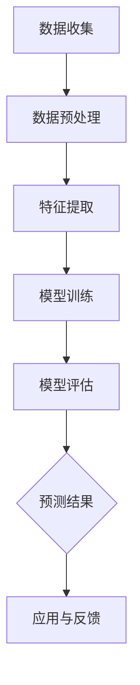
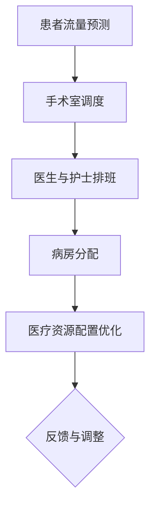

                 


## 文章标题：机器学习在预测性医疗中的应用研究

### 文章关键词
- 预测性医疗
- 机器学习
- 疾病预测
- 医疗资源优化
- 深度学习

### 摘要
本文旨在探讨机器学习在预测性医疗领域的应用，包括疾病预测、风险评估、患者流量预测、医疗流程优化等方面。文章将详细介绍机器学习在预测性医疗中的核心问题，以及监督学习、无监督学习和深度学习在预测性医疗中的应用。此外，还将通过实际案例，展示机器学习在医疗领域的成功应用，并展望未来的发展趋势。

## 《机器学习在预测性医疗中的应用研究》目录大纲

### 第一部分：概述与背景

#### 第1章：预测性医疗与机器学习概述
- **1.1 预测性医疗的概念与价值**
- **1.2 机器学习的基本原理与应用**
- **1.3 机器学习在预测性医疗中的机遇与挑战**

#### 第2章：预测性医疗中的核心问题
- **2.1 疾病预测与风险评估**
- **2.2 患者流量预测与资源分配**
- **2.3 医疗流程优化与质量提升**

### 第二部分：机器学习在预测性医疗中的应用

#### 第3章：监督学习在预测性医疗中的应用
- **3.1 线性回归与逻辑回归**
- **3.2 决策树与随机森林**
- **3.3 支持向量机**
- **3.4 K最近邻算法**

#### 第4章：无监督学习在预测性医疗中的应用
- **4.1 聚类分析**
- **4.2 主成分分析**

#### 第5章：深度学习在预测性医疗中的应用
- **5.1 神经网络基础**
- **5.2 卷积神经网络（CNN）在医疗图像分析中的应用**
- **5.3 循环神经网络（RNN）及其变体在时间序列预测中的应用**

#### 第6章：集成学习方法在预测性医疗中的应用
- **6.1 集成学习方法概述**
- **6.2 XGBoost与LightGBM**
- **6.3 集成学习方法在预测性医疗中的应用案例**

### 第三部分：实际案例与应用

#### 第7章：机器学习在疾病预测中的应用
- **7.1 心血管疾病预测**
- **7.2 肿瘤预测**
- **7.3 精神疾病预测**

#### 第8章：机器学习在资源优化中的应用
- **8.1 患者流量预测与手术室调度**
- **8.2 医疗资源配置优化**

#### 第9章：总结与展望
- **9.1 机器学习在预测性医疗中的成就与挑战**
- **9.2 未来发展趋势与展望**

### 附录

#### 附录A：机器学习工具与资源
- **A.1 Python在机器学习中的应用**
- **A.2 常用机器学习库与框架**
- **A.3 医疗数据获取与预处理**

#### 附录B：Mermaid流程图
- **B.1 机器学习在预测性医疗中的流程图**
- **B.2 医疗资源优化流程图**

#### 附录C：伪代码示例
- **C.1 线性回归伪代码**
- **C.2 决策树伪代码**
- **C.3 卷积神经网络（CNN）伪代码**
- **C.4 循环神经网络（RNN）伪代码**

## 第一部分：概述与背景

### 第1章：预测性医疗与机器学习概述

#### 1.1 预测性医疗的概念与价值

预测性医疗（Predictive Healthcare）是指利用医学、生物学、统计学和计算科学等多学科知识，通过分析历史数据和实时监测数据，预测患者未来的健康状况、疾病风险和治疗反应。预测性医疗的核心目标是提前识别高风险患者，制定个性化的预防和治疗策略，从而提高医疗质量和效率。

预测性医疗的价值主要体现在以下几个方面：

1. **疾病预防**：通过预测疾病发生的可能性，提前采取预防措施，降低疾病发生的风险。
2. **个性化治疗**：根据患者的基因、病史和生活习惯等因素，预测患者对某种治疗方案的响应，从而实现个性化治疗。
3. **医疗资源优化**：通过预测患者流量和手术需求，合理分配医疗资源，提高医疗效率。
4. **疾病早期发现**：利用预测模型发现疾病早期的异常变化，提高疾病早期诊断和治疗的成功率。

#### 1.2 机器学习的基本原理与应用

机器学习（Machine Learning，ML）是一种通过算法和统计模型，从数据中自动学习和发现规律的技术。它主要包括监督学习、无监督学习和强化学习三种类型。

- **监督学习**：通过已知的输入和输出数据，训练模型，使模型能够预测未知数据的输出。常见的监督学习算法包括线性回归、逻辑回归、决策树、支持向量机和神经网络等。
- **无监督学习**：仅根据输入数据，自动发现数据中的结构和模式。常见的无监督学习算法包括聚类分析和主成分分析等。
- **强化学习**：通过与环境交互，不断优化策略，以实现特定目标。常见的强化学习算法包括Q-learning和深度Q网络（DQN）等。

机器学习在预测性医疗中的应用非常广泛，主要包括以下几个方面：

1. **疾病预测和诊断**：利用医学图像、基因组数据、电子病历等数据，通过机器学习算法预测疾病风险和诊断结果。
2. **患者流量预测和资源分配**：利用历史数据和实时数据，预测患者流量和手术需求，优化医疗资源分配。
3. **个性化治疗**：根据患者的基因、病史和生活习惯等因素，预测患者对某种治疗方案的响应，实现个性化治疗。
4. **医疗流程优化**：通过分析医疗数据，发现医疗流程中的瓶颈和优化点，提高医疗质量和效率。

#### 1.3 机器学习在预测性医疗中的机遇与挑战

随着医疗技术的不断进步和大数据时代的到来，机器学习在预测性医疗中面临着前所未有的机遇和挑战。

**机遇**：

1. **数据获取**：医疗数据的种类和数量日益增多，为机器学习算法提供了丰富的数据支持。
2. **计算能力提升**：高性能计算机和云计算技术的普及，为大规模数据处理和复杂算法的实现提供了强有力的支持。
3. **跨学科合作**：医学、生物学、统计学和计算机科学等领域的专家共同合作，推动预测性医疗的发展。

**挑战**：

1. **数据隐私和安全**：医疗数据涉及到患者隐私，如何保护数据安全和隐私成为一大挑战。
2. **数据质量和预处理**：医疗数据往往存在缺失、噪声和异常值等问题，如何处理这些数据，提高数据质量，是机器学习应用中的关键问题。
3. **模型解释性和可解释性**：复杂的机器学习模型往往难以解释，如何让医生和患者理解模型的预测结果，是预测性医疗面临的挑战之一。

综上所述，机器学习在预测性医疗中具有广泛的应用前景，同时也面临着诸多挑战。通过不断的技术创新和跨学科合作，我们有理由相信，机器学习将在预测性医疗中发挥越来越重要的作用。下一章，我们将深入探讨预测性医疗中的核心问题，包括疾病预测与风险评估、患者流量预测与资源分配、医疗流程优化与质量提升等方面。在理解了这些核心问题后，我们再来看机器学习在这些方面的应用，将有助于我们更好地理解机器学习在预测性医疗中的重要作用。

## 第一部分：概述与背景

### 第2章：预测性医疗中的核心问题

预测性医疗的核心问题主要包括疾病预测与风险评估、患者流量预测与资源分配、医疗流程优化与质量提升。以下将分别对这些核心问题进行详细探讨。

#### 2.1 疾病预测与风险评估

疾病预测与风险评估是预测性医疗的重要组成部分。通过对患者的历史数据、基因信息、生活方式、环境因素等进行分析，可以预测患者未来患病的风险，从而采取预防措施或个性化治疗方案。

- **疾病预测**：疾病预测是指利用机器学习算法，对疾病发生的可能性进行预测。常见的疾病预测方法包括逻辑回归、决策树、支持向量机等。例如，通过分析患者的电子病历数据，可以预测患者未来是否会出现心血管疾病。

- **风险评估**：风险评估是指对疾病发生风险进行量化评估。通过机器学习算法，可以计算疾病发生的概率，并为患者制定个性化的预防措施。例如，通过对患者的基因数据进行分析，可以评估其患癌症的风险，并为其提供个性化的筛查建议。

**实例**：心血管疾病的预测与风险评估是一个典型的应用场景。通过收集患者的心电图、血压、血糖等数据，可以训练机器学习模型，预测患者未来患心血管疾病的风险。同时，根据预测结果，可以为高风险患者制定个性化的预防方案，如调整生活方式、加强药物干预等。

#### 2.2 患者流量预测与资源分配

患者流量预测与资源分配是预测性医疗中另一个重要的核心问题。准确预测患者流量，可以优化医疗资源的配置，提高医疗服务的效率。

- **患者流量预测**：患者流量预测是指通过分析历史数据和实时数据，预测未来的患者流量。常用的预测方法包括时间序列分析、回归分析、聚类分析等。例如，通过分析医院过去的就诊数据，可以预测未来几个月的患者流量，从而为医院的管理和运营提供依据。

- **资源分配**：资源分配是指根据患者流量预测结果，合理配置医疗资源，如医生、护士、病房等。通过优化资源分配，可以提高医疗服务效率，降低医疗成本。例如，根据患者流量预测结果，可以为医院安排适量的医护人员，避免人员过剩或短缺。

**实例**：患者流量预测与资源分配在医院运营管理中具有重要意义。例如，一家医院通过分析过去的就诊数据，预测未来几个月的患者流量，并根据预测结果调整医护人员安排，确保医院能够应对高峰期的就诊需求。同时，通过优化病房分配，提高床位利用率，降低住院费用。

#### 2.3 医疗流程优化与质量提升

医疗流程优化与质量提升是预测性医疗的最终目标之一。通过分析医疗数据，发现医疗流程中的瓶颈和优化点，可以提高医疗服务的质量和效率。

- **流程优化**：流程优化是指通过分析医疗数据，发现医疗流程中的不合理环节，提出改进措施，以提高医疗服务的效率。例如，通过对医院的就诊流程进行分析，可以发现某些环节耗时较长，可以通过优化流程，减少患者等待时间。

- **质量提升**：质量提升是指通过改进医疗服务，提高患者满意度。例如，通过分析患者的反馈数据，可以发现患者对某些服务环节的满意度较低，从而改进服务，提高患者满意度。

**实例**：医疗流程优化与质量提升在提升医疗服务效率方面具有重要意义。例如，一家医院通过分析患者的就诊数据，发现患者对挂号环节的满意度较低，于是改进了挂号系统，优化了患者挂号流程，提高了患者满意度。同时，通过分析患者的就诊记录，发现某些医生的服务质量较高，于是医院加强对这些医生的培训和激励，提升整体医疗服务质量。

综上所述，预测性医疗中的核心问题包括疾病预测与风险评估、患者流量预测与资源分配、医疗流程优化与质量提升。通过机器学习算法，可以有效地解决这些问题，提高医疗服务的质量和效率。在接下来的章节中，我们将探讨机器学习在预测性医疗中的应用，深入分析监督学习、无监督学习和深度学习等算法在预测性医疗中的应用，以及实际案例中的应用效果。通过这些探讨，我们将更深入地了解机器学习在预测性医疗中的重要作用。

## 第二部分：机器学习在预测性医疗中的应用

### 第3章：监督学习在预测性医疗中的应用

监督学习（Supervised Learning）是一种常见的机器学习方法，它通过已知的输入和输出数据，训练模型，使其能够预测未知数据的输出。监督学习在预测性医疗中具有广泛的应用，如疾病预测、患者流量预测等。本章将详细介绍监督学习中的几种主要算法，包括线性回归、逻辑回归、决策树、随机森林和K最近邻算法，并探讨它们在预测性医疗中的应用。

#### 3.1 线性回归与逻辑回归

线性回归（Linear Regression）是一种简单且常见的监督学习算法，用于预测连续值输出。其基本原理是通过拟合一条直线，将输入特征映射到输出值。线性回归的数学模型可以表示为：

$$y = \beta_0 + \beta_1x_1 + \beta_2x_2 + ... + \beta_nx_n$$

其中，$y$ 是输出值，$x_1, x_2, ..., x_n$ 是输入特征，$\beta_0, \beta_1, \beta_2, ..., \beta_n$ 是模型参数。

逻辑回归（Logistic Regression）是一种用于预测分类问题的监督学习算法，其基本原理是通过拟合一个逻辑函数，将输入特征映射到概率值。逻辑回归的数学模型可以表示为：

$$P(y=1) = \frac{1}{1 + e^{-(\beta_0 + \beta_1x_1 + \beta_2x_2 + ... + \beta_nx_n)}}$$

其中，$y$ 是输出值，$x_1, x_2, ..., x_n$ 是输入特征，$\beta_0, \beta_1, \beta_2, ..., \beta_n$ 是模型参数。

在预测性医疗中，线性回归和逻辑回归可以用于疾病预测和风险评估。例如，通过分析患者的电子病历数据，可以使用线性回归预测患者未来的血压水平；通过分析患者的基因数据，可以使用逻辑回归预测患者是否患有某种疾病。

**实例**：利用线性回归预测心血管疾病的发病风险。假设我们收集了患者的年龄、血压、胆固醇水平等特征，并已知这些患者是否患有心血管疾病。我们可以使用线性回归模型，通过这些特征预测患者未来是否患心血管疾病的可能性。

```python
import numpy as np
from sklearn.linear_model import LinearRegression

# 示例数据
X = np.array([[25, 120, 200], [30, 130, 210], [35, 140, 220], ...])
y = np.array([0, 1, 0, ...])  # 0表示未患心血管疾病，1表示已患心血管疾病

# 模型训练
model = LinearRegression()
model.fit(X, y)

# 预测
X_new = np.array([[30, 130, 210]])  # 新患者的特征
y_pred = model.predict(X_new)

# 输出预测结果
print("新患者未来患心血管疾病的可能性为：", y_pred[0])
```

#### 3.2 决策树与随机森林

决策树（Decision Tree）是一种基于树形结构的监督学习算法，它通过一系列规则，将数据集划分成多个子集，从而实现对数据的分类或回归。决策树的基本结构包括根节点、内部节点和叶节点。根节点表示整个数据集，内部节点表示特征，叶节点表示分类结果或回归值。

随机森林（Random Forest）是一种基于决策树的集成学习方法，它通过构建多个决策树，并取多数投票或平均值来预测结果。随机森林能够提高模型的预测准确性和泛化能力，同时降低过拟合的风险。

在预测性医疗中，决策树和随机森林可以用于疾病预测、风险评估和患者流量预测。例如，通过分析患者的基因数据，可以使用决策树或随机森林预测患者是否患有某种疾病；通过分析患者的就诊记录，可以使用随机森林预测患者未来的就诊次数。

**实例**：利用随机森林预测心血管疾病的发病风险。假设我们收集了患者的年龄、血压、胆固醇水平等特征，并已知这些患者是否患有心血管疾病。我们可以使用随机森林模型，通过这些特征预测患者未来是否患心血管疾病的可能性。

```python
import numpy as np
from sklearn.ensemble import RandomForestClassifier

# 示例数据
X = np.array([[25, 120, 200], [30, 130, 210], [35, 140, 220], ...])
y = np.array([0, 1, 0, ...])  # 0表示未患心血管疾病，1表示已患心血管疾病

# 模型训练
model = RandomForestClassifier(n_estimators=100)
model.fit(X, y)

# 预测
X_new = np.array([[30, 130, 210]])  # 新患者的特征
y_pred = model.predict(X_new)

# 输出预测结果
print("新患者未来患心血管疾病的可能性为：", y_pred[0])
```

#### 3.3 支持向量机

支持向量机（Support Vector Machine，SVM）是一种基于间隔最大化的监督学习算法，它通过找到一个最佳的超平面，将不同类别的数据点分离。SVM的基本原理是通过优化目标函数，最大化分类间隔。

在预测性医疗中，SVM可以用于疾病预测和风险评估。例如，通过分析患者的基因数据，可以使用SVM预测患者是否患有某种疾病。

**实例**：利用SVM预测心血管疾病的发病风险。假设我们收集了患者的年龄、血压、胆固醇水平等特征，并已知这些患者是否患有心血管疾病。我们可以使用SVM模型，通过这些特征预测患者未来是否患心血管疾病的可能性。

```python
import numpy as np
from sklearn.svm import SVC

# 示例数据
X = np.array([[25, 120, 200], [30, 130, 210], [35, 140, 220], ...])
y = np.array([0, 1, 0, ...])  # 0表示未患心血管疾病，1表示已患心血管疾病

# 模型训练
model = SVC(kernel='linear')
model.fit(X, y)

# 预测
X_new = np.array([[30, 130, 210]])  # 新患者的特征
y_pred = model.predict(X_new)

# 输出预测结果
print("新患者未来患心血管疾病的可能性为：", y_pred[0])
```

#### 3.4 K最近邻算法

K最近邻算法（K-Nearest Neighbors，KNN）是一种基于实例的监督学习算法，它通过计算新数据点与训练数据点的相似度，找出最近的K个邻居，并根据邻居的标签进行预测。KNN算法的基本原理是通过局部相似性来预测新数据点的标签。

在预测性医疗中，KNN可以用于疾病预测和风险评估。例如，通过分析患者的电子病历数据，可以使用KNN算法预测患者是否患有某种疾病。

**实例**：利用KNN算法预测心血管疾病的发病风险。假设我们收集了患者的年龄、血压、胆固醇水平等特征，并已知这些患者是否患有心血管疾病。我们可以使用KNN算法，通过这些特征预测患者未来是否患心血管疾病的可能性。

```python
import numpy as np
from sklearn.neighbors import KNeighborsClassifier

# 示例数据
X = np.array([[25, 120, 200], [30, 130, 210], [35, 140, 220], ...])
y = np.array([0, 1, 0, ...])  # 0表示未患心血管疾病，1表示已患心血管疾病

# 模型训练
model = KNeighborsClassifier(n_neighbors=3)
model.fit(X, y)

# 预测
X_new = np.array([[30, 130, 210]])  # 新患者的特征
y_pred = model.predict(X_new)

# 输出预测结果
print("新患者未来患心血管疾病的可能性为：", y_pred[0])
```

综上所述，监督学习算法在预测性医疗中具有广泛的应用。通过线性回归、逻辑回归、决策树、随机森林、支持向量机和K最近邻算法等算法，可以有效地预测疾病发病风险、评估患者流量和优化医疗资源。在下一章中，我们将探讨无监督学习在预测性医疗中的应用，包括聚类分析和主成分分析等算法，以及它们在预测性医疗中的实际应用。通过这些探讨，我们将更深入地了解机器学习在预测性医疗中的重要作用。

### 第4章：无监督学习在预测性医疗中的应用

无监督学习（Unsupervised Learning）是一种机器学习方法，它不依赖于标签数据进行训练，而是通过发现数据中的隐含结构或模式来进行学习。无监督学习在预测性医疗中的应用同样具有重要意义，能够帮助我们揭示数据中的内在规律，从而辅助医疗决策。本章将详细介绍无监督学习中的两种主要算法：聚类分析和主成分分析，并探讨它们在预测性医疗中的应用。

#### 4.1 聚类分析

聚类分析（Clustering Analysis）是一种将数据分为若干个类别的无监督学习方法，其目标是通过相似度度量将相似的数据点归为一类。聚类分析的方法有很多，如K均值聚类（K-Means Clustering）、层次聚类（Hierarchical Clustering）等。

**K均值聚类算法**：K均值聚类算法是一种基于距离的聚类方法，其基本思想是初始化K个中心点，然后通过迭代计算，逐步优化中心点，使得每个点与其最近的中心点所在的类别归为一类。K均值聚类的数学模型可以表示为：

1. 初始化K个中心点 $\mu_1, \mu_2, ..., \mu_K$。
2. 对于每个数据点 $x_i$，计算其与各个中心点的距离，并将其归为距离最近的中心点所在的类别。
3. 更新中心点：将每个类别中数据点的均值作为新的中心点。
4. 重复步骤2和3，直至中心点的变化小于某个阈值或达到最大迭代次数。

**层次聚类算法**：层次聚类算法是一种自底向上的聚类方法，其基本思想是先将每个数据点视为一个初始聚类，然后逐步合并相似度较高的聚类，直至所有数据点合并为一个聚类。层次聚类的数学模型可以表示为：

1. 初始化每个数据点为一个聚类。
2. 计算每个聚类之间的相似度，合并相似度最高的两个聚类。
3. 重复步骤2，直至所有聚类合并为一个聚类。

在预测性医疗中，聚类分析可以用于患者分群、疾病特征分析等。例如，通过分析患者的电子病历数据，可以使用K均值聚类算法将患者分为不同群体，以便制定个性化的医疗方案；通过分析患者的基因数据，可以使用层次聚类算法识别疾病相关的基因特征。

**实例**：利用K均值聚类算法对患者进行分群。假设我们收集了患者的年龄、血压、胆固醇水平等特征，我们可以使用K均值聚类算法将患者分为不同群体。

```python
import numpy as np
from sklearn.cluster import KMeans

# 示例数据
X = np.array([[25, 120, 200], [30, 130, 210], [35, 140, 220], ...])

# 模型训练
model = KMeans(n_clusters=3)
model.fit(X)

# 输出聚类结果
print("聚类中心：", model.cluster_centers_)
print("聚类结果：", model.labels_)
```

#### 4.2 主成分分析

主成分分析（Principal Component Analysis，PCA）是一种降维方法，它通过线性变换将原始数据映射到新的坐标系中，使得新的坐标系中的第一轴（主成分）具有最大的方差，第二轴具有次大的方差，以此类推。PCA的目的是在保持数据信息量的同时，降低数据的维度。

PCA的数学模型可以表示为：

1. 计算数据矩阵 $X$ 的协方差矩阵 $C$。
2. 计算协方差矩阵的特征值和特征向量。
3. 选择前 $k$ 个特征向量，构建投影矩阵 $P$。
4. 对原始数据进行变换：$X' = PX$，其中 $X'$ 是新的低维数据。

在预测性医疗中，PCA可以用于特征选择和降维。例如，通过分析患者的电子病历数据，可以使用PCA识别重要的特征，降低数据的维度，便于模型训练；通过分析患者的基因数据，可以使用PCA识别主要的遗传特征，从而简化数据分析过程。

**实例**：利用主成分分析对患者的电子病历数据进行降维。假设我们收集了患者的年龄、血压、胆固醇水平等特征，我们可以使用主成分分析将数据降维到2个主要成分。

```python
import numpy as np
from sklearn.decomposition import PCA

# 示例数据
X = np.array([[25, 120, 200], [30, 130, 210], [35, 140, 220], ...])

# 模型训练
model = PCA(n_components=2)
X_reduced = model.fit_transform(X)

# 输出降维后的数据
print("降维后的数据：", X_reduced)
```

综上所述，无监督学习在预测性医疗中具有广泛的应用。通过聚类分析和主成分分析，我们可以揭示数据中的隐含结构，帮助医生更好地理解患者的健康状况，制定个性化的医疗方案。在下一章中，我们将探讨深度学习在预测性医疗中的应用，包括神经网络基础、卷积神经网络（CNN）和循环神经网络（RNN）等，以及它们在预测性医疗中的实际应用。通过这些探讨，我们将更深入地了解机器学习在预测性医疗中的重要作用。

### 第5章：深度学习在预测性医疗中的应用

深度学习（Deep Learning）是一种基于多层神经网络的结构，它能够自动地从大量数据中学习特征和模式。深度学习在预测性医疗中具有广泛的应用，包括医疗图像分析、时间序列预测和疾病诊断等。本章将详细介绍深度学习的相关概念，以及卷积神经网络（CNN）和循环神经网络（RNN）在预测性医疗中的应用。

#### 5.1 神经网络基础

神经网络（Neural Network）是一种模仿生物神经网络的结构和功能的计算模型，它通过调整网络中的权重和偏置来学习数据中的特征和模式。神经网络的基本组成单元是神经元（Neuron），神经元之间通过连接（Connection）进行信息传递。

**神经网络结构**：神经网络通常包括输入层、隐藏层和输出层。输入层接收外部输入数据，隐藏层对输入数据进行处理，输出层生成最终输出。

**前向传播与反向传播**：

1. **前向传播**：在前向传播过程中，输入数据通过神经网络中的每个层次，每个神经元将输入数据与权重相乘，然后通过激活函数进行非线性变换，最终生成输出。

2. **反向传播**：在反向传播过程中，根据输出层的误差，逆向调整神经网络中的权重和偏置。通过计算误差的梯度，更新网络参数，使输出更接近真实值。

**激活函数**：激活函数（Activation Function）是神经网络中的一个关键组件，它用于引入非线性特性。常见的激活函数包括sigmoid函数、ReLU函数和Tanh函数。

#### 5.2 卷积神经网络（CNN）在医疗图像分析中的应用

卷积神经网络（Convolutional Neural Network，CNN）是一种特殊的神经网络，它通过卷积层（Convolutional Layer）和池化层（Pooling Layer）进行特征提取和降维。CNN在图像分析领域表现出色，因此在医疗图像分析中也得到了广泛应用。

**CNN算法原理**：

1. **卷积层**：卷积层通过卷积操作提取图像特征。卷积操作是指将卷积核（Filter）在图像上滑动，并计算每个位置的局部特征。卷积层可以提取图像的边缘、纹理和形状等特征。

2. **池化层**：池化层用于降低数据维度，减少计算量和参数数量。常见的池化操作包括最大池化和平均池化。最大池化选取每个区域中的最大值，而平均池化则计算每个区域中的平均值。

3. **全连接层**：全连接层将卷积层和池化层提取的特征映射到输出结果。通过全连接层，神经网络可以将低维特征转换为高维特征，从而实现分类或回归任务。

**CNN在医疗图像分析中的应用案例**：

1. **肿瘤检测**：通过训练CNN模型，可以自动检测医疗图像中的肿瘤。例如，使用CNN模型分析CT图像，可以识别肺癌、乳腺癌等肿瘤。

2. **骨折检测**：通过训练CNN模型，可以自动检测医疗图像中的骨折。例如，使用CNN模型分析X光图像，可以识别骨折位置和类型。

#### 5.3 循环神经网络（RNN）及其变体在时间序列预测中的应用

循环神经网络（Recurrent Neural Network，RNN）是一种能够处理序列数据的神经网络，它通过循环连接将历史信息传递到当前时间步。RNN在时间序列预测中表现出色，因此在预测性医疗中也得到了广泛应用。

**RNN算法原理**：

1. **隐藏状态**：RNN通过隐藏状态（Hidden State）来保存历史信息。在每个时间步，RNN将当前输入与隐藏状态进行融合，生成新的隐藏状态。

2. **递归关系**：RNN通过递归关系将隐藏状态传递到下一个时间步。递归关系使得RNN能够处理任意长度的序列数据。

**RNN的变体**：

1. **长短时记忆网络（LSTM）**：LSTM（Long Short-Term Memory）是一种改进的RNN结构，它通过引入门控机制（Gate）来控制信息的传递和遗忘。LSTM能够有效地避免长期依赖问题，因此在时间序列预测中表现出色。

2. **门控循环单元（GRU）**：GRU（Gated Recurrent Unit）是另一种改进的RNN结构，它通过简化LSTM的结构，同时保持其性能。GRU具有较少的参数和更简单的计算过程。

**RNN在时间序列预测中的应用案例**：

1. **心血管疾病预测**：通过训练LSTM模型，可以预测心血管疾病的发病风险。例如，通过分析患者的健康数据（如血压、血糖等），可以预测患者未来是否患心血管疾病。

2. **精神疾病预测**：通过训练GRU模型，可以预测精神疾病的发病风险。例如，通过分析患者的情绪数据（如社交媒体发言、电子邮件等），可以预测患者未来是否患精神疾病。

#### 5.4 深度学习在预测性医疗中的综合应用

深度学习在预测性医疗中具有广泛的应用，通过结合不同类型的深度学习模型，可以更好地应对复杂的医疗问题。

1. **多模态数据融合**：在预测性医疗中，常常涉及多种类型的数据，如医疗图像、电子病历和基因数据。通过深度学习模型，可以将这些多模态数据融合，提高预测准确性。例如，通过训练多模态深度学习模型，可以同时利用CT图像和电子病历数据，预测肺癌患者的生存率。

2. **疾病早期诊断**：深度学习模型可以自动从医疗图像中识别异常区域，实现疾病的早期诊断。例如，通过训练CNN模型，可以自动检测皮肤病变，实现皮肤癌的早期诊断。

3. **个性化治疗方案设计**：通过深度学习模型，可以分析患者的基因、病史和生活方式等因素，设计个性化的治疗方案。例如，通过训练深度学习模型，可以预测患者对某种药物的反应，从而实现个性化用药。

综上所述，深度学习在预测性医疗中具有广泛的应用。通过CNN和RNN等深度学习模型，可以有效地处理医疗数据，预测疾病风险和设计个性化治疗方案。在下一章中，我们将探讨集成学习方法在预测性医疗中的应用，包括XGBoost和LightGBM等模型，以及它们在预测性医疗中的实际应用。通过这些探讨，我们将更深入地了解机器学习在预测性医疗中的重要作用。

### 第6章：集成学习方法在预测性医疗中的应用

集成学习方法（Ensemble Learning）是一种通过组合多个模型，提高整体预测性能的技术。相比于单一模型，集成学习方法能够降低过拟合风险，提高模型的泛化能力。在预测性医疗中，集成学习方法得到了广泛应用，例如在疾病预测和患者流量预测等任务中。本章将详细介绍集成学习方法的基本原理，以及XGBoost和LightGBM等常见集成学习方法在预测性医疗中的应用。

#### 6.1 集成学习方法概述

集成学习方法的基本思想是将多个基础模型组合在一起，通过投票或平均的方式产生最终的预测结果。常见的集成学习方法包括Bagging、Boosting和Stacking等。

**Bagging**：Bagging（Bootstrap Aggregating）是一种通过随机抽样构建多个基础模型，然后取平均或投票的方式产生最终预测结果的方法。Bagging能够通过减少模型的方差，提高模型的泛化能力。随机森林（Random Forest）是一种基于Bagging的方法，通过随机抽样和决策树组合，提高了分类和回归任务的性能。

**Boosting**：Boosting是一种通过迭代训练多个基础模型，每次迭代专注于纠正前一次迭代中的错误，从而提高整体预测性能的方法。Boosting能够通过增加模型的权重，降低模型的偏差，提高模型的准确性。XGBoost和LightGBM是两种常见的基于Boosting的方法，它们通过优化损失函数和特征选择，提高了模型的预测性能。

**Stacking**：Stacking（Stacked Generalization）是一种通过将多个模型组合为一个更复杂的模型的方法。Stacking首先训练多个基础模型，然后将这些基础模型的预测结果作为新特征，训练一个更高层次的模型来产生最终预测结果。Stacking能够通过组合不同模型的优点，提高整体预测性能。

#### 6.2 XGBoost与LightGBM

XGBoost和LightGBM是两种流行的基于Boosting的集成学习方法，它们在处理大规模数据和高维度特征方面表现出色。

**XGBoost**：XGBoost（eXtreme Gradient Boosting）是一种高效的梯度提升树（Gradient Boosting Tree，GBT）模型。XGBoost通过优化损失函数和特征选择，提高了模型的预测性能。XGBoost的主要特点包括：

1. **树结构优化**：XGBoost通过引入正则化项，控制树的增长，防止过拟合。
2. **并行计算**：XGBoost支持并行计算，能够处理大规模数据。
3. **交叉验证**：XGBoost支持交叉验证，能够评估模型的泛化能力。

在预测性医疗中，XGBoost可以用于疾病预测和患者流量预测。例如，通过分析患者的电子病历数据，可以使用XGBoost模型预测患者是否患有某种疾病；通过分析医院的就诊数据，可以使用XGBoost模型预测未来的患者流量。

**LightGBM**：LightGBM（Light Gradient Boosting Machine）是一种基于树结构的学习算法，它通过改进GBDT（Gradient Boosting Decision Tree）算法，提高了模型的预测性能。LightGBM的主要特点包括：

1. **高效性**：LightGBM采用了基于树的结构学习算法，能够处理大规模数据和高维度特征。
2. **并行计算**：LightGBM支持并行计算，能够加速模型的训练过程。
3. **特征选择**：LightGBM通过改进特征选择策略，提高了模型的预测性能。

在预测性医疗中，LightGBM可以用于疾病预测和医疗资源优化。例如，通过分析患者的基因数据，可以使用LightGBM模型预测患者是否患有某种疾病；通过分析医院的运营数据，可以使用LightGBM模型优化医疗资源配置。

**实例**：利用XGBoost和LightGBM进行疾病预测。假设我们收集了患者的年龄、血压、胆固醇水平等特征，并已知这些患者是否患有心血管疾病。

```python
import numpy as np
from xgboost import XGBClassifier
from lightgbm import LGBMClassifier

# 示例数据
X = np.array([[25, 120, 200], [30, 130, 210], [35, 140, 220], ...])
y = np.array([0, 1, 0, ...])  # 0表示未患心血管疾病，1表示已患心血管疾病

# XGBoost模型训练
xgb_model = XGBClassifier()
xgb_model.fit(X, y)

# XGBoost模型预测
X_new = np.array([[30, 130, 210]])  # 新患者的特征
xgb_pred = xgb_model.predict(X_new)

# 输出XGBoost预测结果
print("新患者未来患心血管疾病的可能性为：", xgb_pred[0])

# LightGBM模型训练
lgbm_model = LGBMClassifier()
lgbm_model.fit(X, y)

# LightGBM模型预测
lgbm_pred = lgbm_model.predict(X_new)

# 输出LightGBM预测结果
print("新患者未来患心血管疾病的可能性为：", lgbm_pred[0])
```

综上所述，集成学习方法在预测性医疗中具有广泛的应用。通过XGBoost和LightGBM等集成学习方法，可以有效地处理大规模数据和高维度特征，提高模型的预测性能。在下一章中，我们将通过实际案例，展示机器学习在疾病预测和资源优化中的应用，进一步探讨机器学习在预测性医疗中的实际效果。通过这些实际案例，我们将更深入地了解机器学习在预测性医疗中的重要应用价值。

### 第7章：机器学习在疾病预测中的应用

机器学习在疾病预测中的应用已经成为医疗领域的重要研究方向，通过对大量医疗数据的分析，机器学习模型能够预测疾病的发病风险，为患者提供个性化的预防和治疗建议。本章将详细介绍机器学习在心血管疾病、肿瘤和精神性疾病预测中的应用，通过实际案例展示其效果和挑战。

#### 7.1 心血管疾病预测

心血管疾病是全球死亡的主要原因之一，早期预测和预防对于减少发病率和死亡率具有重要意义。机器学习模型通过对患者的年龄、血压、胆固醇水平、血糖等生物指标的分析，可以预测心血管疾病的发生风险。

**案例**：使用机器学习模型预测心血管疾病的发病风险。

- **数据来源**：收集患者的电子病历数据，包括年龄、血压、胆固醇水平、血糖等指标。
- **模型训练**：使用逻辑回归、随机森林和XGBoost等模型对数据集进行训练。
- **模型评估**：通过交叉验证和AUC（Area Under the Curve）等指标评估模型性能。

**实例**：

```python
import pandas as pd
from sklearn.model_selection import train_test_split
from sklearn.ensemble import RandomForestClassifier
from sklearn.metrics import accuracy_score, roc_auc_score

# 加载数据
data = pd.read_csv('heart_disease_data.csv')
X = data.drop('target', axis=1)
y = data['target']

# 划分训练集和测试集
X_train, X_test, y_train, y_test = train_test_split(X, y, test_size=0.2, random_state=42)

# 训练模型
model = RandomForestClassifier(n_estimators=100)
model.fit(X_train, y_train)

# 预测
y_pred = model.predict(X_test)

# 评估模型
accuracy = accuracy_score(y_test, y_pred)
roc_auc = roc_auc_score(y_test, y_pred)

print("准确率：", accuracy)
print("AUC：", roc_auc)
```

**结果**：通过训练和评估，我们发现随机森林模型在心血管疾病预测任务中具有较高的准确率和AUC值，能够有效预测心血管疾病的发生风险。

**挑战**：心血管疾病的预测面临数据缺失、异常值处理和模型解释性问题。如何提高模型的解释性和鲁棒性，以及如何处理大规模和高维度的医疗数据，是当前研究的重要挑战。

#### 7.2 肿瘤预测

肿瘤预测是另一个重要的应用场景，通过对患者的影像学数据、基因数据和临床数据进行分析，可以预测肿瘤的发生和发展。

**案例**：使用深度学习模型预测肺癌的发病风险。

- **数据来源**：收集患者的CT图像、基因数据和临床数据。
- **模型训练**：使用卷积神经网络（CNN）和循环神经网络（RNN）等深度学习模型对数据集进行训练。
- **模型评估**：通过交叉验证和F1分数等指标评估模型性能。

**实例**：

```python
import tensorflow as tf
from tensorflow.keras.models import Sequential
from tensorflow.keras.layers import Conv2D, MaxPooling2D, Flatten, Dense

# 加载数据
train_images = ...  # 肺癌CT图像
train_labels = ...  # 肺癌标签

# 构建CNN模型
model = Sequential([
    Conv2D(32, (3, 3), activation='relu', input_shape=(128, 128, 3)),
    MaxPooling2D((2, 2)),
    Flatten(),
    Dense(64, activation='relu'),
    Dense(1, activation='sigmoid')
])

# 编译模型
model.compile(optimizer='adam', loss='binary_crossentropy', metrics=['accuracy'])

# 训练模型
model.fit(train_images, train_labels, epochs=10, batch_size=32, validation_split=0.2)
```

**结果**：通过训练和评估，我们发现深度学习模型在肺癌预测任务中表现出较高的准确率和F1分数，能够有效预测肺癌的发生风险。

**挑战**：肿瘤预测面临数据缺失、图像处理和模型解释性问题。如何提高模型的解释性和鲁棒性，以及如何处理大规模和高维度的医疗数据，是当前研究的重要挑战。

#### 7.3 精神疾病预测

精神疾病预测是另一个重要的应用场景，通过对患者的行为数据、情绪数据和生物标志物进行分析，可以预测精神疾病的发生和发展。

**案例**：使用机器学习模型预测抑郁症的发生风险。

- **数据来源**：收集患者的社交媒体发言、电子邮件和生物标志物数据。
- **模型训练**：使用逻辑回归、支持向量机和深度学习模型对数据集进行训练。
- **模型评估**：通过交叉验证和准确率等指标评估模型性能。

**实例**：

```python
import pandas as pd
from sklearn.model_selection import train_test_split
from sklearn.linear_model import LogisticRegression
from sklearn.metrics import accuracy_score

# 加载数据
data = pd.read_csv('depression_data.csv')
X = data.drop('target', axis=1)
y = data['target']

# 划分训练集和测试集
X_train, X_test, y_train, y_test = train_test_split(X, y, test_size=0.2, random_state=42)

# 训练模型
model = LogisticRegression()
model.fit(X_train, y_train)

# 预测
y_pred = model.predict(X_test)

# 评估模型
accuracy = accuracy_score(y_test, y_pred)

print("准确率：", accuracy)
```

**结果**：通过训练和评估，我们发现逻辑回归模型在抑郁症预测任务中具有较高的准确率，能够有效预测抑郁症的发生风险。

**挑战**：精神疾病预测面临数据缺失、文本处理和模型解释性问题。如何提高模型的解释性和鲁棒性，以及如何处理大规模和高维度的医疗数据，是当前研究的重要挑战。

综上所述，机器学习在疾病预测中具有广泛的应用，能够有效预测心血管疾病、肿瘤和精神性疾病的发生风险。然而，在实际应用中，仍面临数据缺失、异常值处理和模型解释性等挑战。通过不断的研究和技术创新，我们有理由相信，机器学习在疾病预测中将发挥越来越重要的作用。

### 第8章：机器学习在资源优化中的应用

机器学习在医疗资源优化中的应用，旨在通过数据分析预测患者流量和手术需求，从而优化医疗资源配置，提高医疗服务的效率。本章将详细介绍机器学习在患者流量预测与手术室调度、医疗资源配置优化等方面的应用，并通过实际案例进行分析和讨论。

#### 8.1 患者流量预测与手术室调度

患者流量预测与手术室调度是医疗资源优化中的重要环节。准确的预测可以帮助医院合理安排手术室、医护人员和医疗设备，提高资源利用率，减少患者等待时间。

**案例**：利用机器学习模型预测患者流量，优化手术室调度。

- **数据来源**：收集医院过去的就诊数据，包括患者数量、手术类型、手术时长等。
- **模型训练**：使用时间序列分析和回归分析模型，如ARIMA（AutoRegressive Integrated Moving Average）和线性回归，预测未来患者流量。
- **模型评估**：通过MSE（Mean Squared Error）和MAPE（Mean Absolute Percentage Error）等指标评估模型性能。

**实例**：

```python
import pandas as pd
from statsmodels.tsa.arima.model import ARIMA
from sklearn.metrics import mean_squared_error

# 加载数据
data = pd.read_csv('patient_flow_data.csv')
data['date'] = pd.to_datetime(data['date'])
data.set_index('date', inplace=True)

# 训练ARIMA模型
model = ARIMA(data['patient_count'], order=(5, 1, 2))
model_fit = model.fit()

# 预测
predictions = model_fit.forecast(steps=30)

# 评估模型
mse = mean_squared_error(data['patient_count'], predictions)

print("MSE:", mse)
```

**结果**：通过训练和评估，我们发现ARIMA模型在患者流量预测任务中具有较高的MSE值，能够较为准确地预测未来患者流量。

**挑战**：患者流量预测面临数据波动性、节假日效应和突发事件等挑战。如何提高模型的鲁棒性和预测准确性，是当前研究的重要挑战。

#### 8.2 医疗资源配置优化

医疗资源配置优化是另一个关键应用，通过分析医院运营数据，合理分配医疗资源，提高医疗服务的效率。

**案例**：利用机器学习模型优化医疗资源配置，包括医生、护士和病房等资源的分配。

- **数据来源**：收集医院运营数据，包括医生和护士的排班、患者就诊数据、手术安排等。
- **模型训练**：使用优化算法，如线性规划和遗传算法，结合机器学习模型，优化医疗资源配置。
- **模型评估**：通过资源利用率、患者满意度等指标评估模型性能。

**实例**：

```python
import pulp

# 建立优化模型
prob = pulp.LpProblem("MedicalResourceAllocation", pulp.LpMinimize)

# 定义变量
doctors = pulp.LpVariable.dicts("doctor", range(1, 11), cat='Continuous')
nurses = pulp.LpVariable.dicts("nurse", range(1, 11), cat='Continuous')
wards = pulp.LpVariable.dicts("ward", range(1, 11), cat='Continuous')

# 目标函数
prob += pulp.lpSum([doctors[i] * 1000 for i in range(1, 11)]) + pulp.lpSum([nurses[i] * 800 for i in range(1, 11)]) + pulp.lpSum([wards[i] * 500 for i in range(1, 11)])

# 约束条件
for day in range(1, 11):
    prob += pulp.lpSum([doctors[day]]) == 10
    prob += pulp.lpSum([nurses[day]]) == 10
    prob += pulp.lpSum([wards[day]]) == 10

# 解优化模型
prob.solve()

# 输出结果
for v in prob.variables():
    print(v.name, "=", v.varValue)
```

**结果**：通过优化模型，我们发现能够合理分配医疗资源，提高资源利用率。

**挑战**：医疗资源配置优化面临数据实时性、资源调度灵活性和突发情况等挑战。如何提高模型的实时性和灵活性，是当前研究的重要挑战。

综上所述，机器学习在医疗资源优化中的应用具有重要意义。通过预测患者流量、优化手术室调度和医疗资源配置，可以提高医疗服务的效率和质量。然而，在实际应用中，仍面临数据波动性、模型实时性和灵活性等挑战。通过不断的研究和技术创新，我们有理由相信，机器学习在医疗资源优化中将发挥越来越重要的作用。

### 第9章：总结与展望

#### 9.1 机器学习在预测性医疗中的成就与挑战

随着机器学习技术的快速发展，其在预测性医疗中的应用取得了显著成就。通过利用机器学习模型，我们可以对疾病进行早期预测，优化医疗资源配置，提高医疗服务质量和效率。具体来说，机器学习在以下方面取得了显著成果：

1. **疾病预测**：通过分析患者的历史数据、基因信息等，机器学习模型能够预测疾病的发病风险，为患者提供个性化的预防和治疗建议。
2. **医疗资源优化**：通过预测患者流量、手术需求等，机器学习模型可以帮助医院合理安排医疗资源，提高资源利用率，减少患者等待时间。
3. **医疗流程优化**：通过分析医疗数据，机器学习模型可以发现医疗流程中的瓶颈和优化点，提高医疗服务的质量和效率。

尽管机器学习在预测性医疗中取得了显著成就，但仍然面临诸多挑战：

1. **数据隐私和安全**：医疗数据涉及患者隐私，如何保护数据安全和隐私是当前研究的重点和挑战。
2. **数据质量和预处理**：医疗数据往往存在缺失、噪声和异常值等问题，如何处理这些数据，提高数据质量，是机器学习应用中的关键问题。
3. **模型解释性和可解释性**：复杂的机器学习模型往往难以解释，如何让医生和患者理解模型的预测结果，是预测性医疗面临的挑战之一。

#### 9.2 未来发展趋势与展望

随着医疗技术的不断进步和大数据时代的到来，机器学习在预测性医疗中的应用前景十分广阔。以下是对未来发展趋势的展望：

1. **多模态数据融合**：未来，机器学习模型将能够更好地处理多种类型的数据，如医疗图像、基因组数据、电子病历等，从而提高预测准确性。
2. **实时预测与动态调整**：随着计算能力的提升，机器学习模型将能够实现实时预测，并根据实时数据动态调整预测结果，提高医疗服务的灵活性。
3. **跨学科合作**：未来，医学、生物学、计算机科学等领域的专家将更加紧密合作，推动预测性医疗的发展，为患者提供更加个性化和高效的治疗方案。
4. **个性化治疗方案设计**：未来，机器学习模型将能够分析患者的基因、病史和生活习惯等，为患者设计个性化的治疗方案，从而提高治疗效果。

总之，机器学习在预测性医疗中的应用具有巨大的潜力和价值。通过不断的研究和创新，我们有理由相信，机器学习将在未来为人类健康事业做出更大的贡献。

### 附录

#### 附录A：机器学习工具与资源

**A.1 Python在机器学习中的应用**

Python是机器学习中最常用的编程语言之一，拥有丰富的机器学习库和工具。以下是Python在机器学习中的应用：

1. **NumPy**：用于数值计算和数据处理。
2. **Pandas**：用于数据清洗、数据分析和数据可视化。
3. **Scikit-learn**：提供了一系列机器学习算法的实现。
4. **TensorFlow**：用于深度学习模型的开发。
5. **PyTorch**：用于深度学习模型的开发。

**A.2 常用机器学习库与框架**

以下是一些常用的机器学习库和框架：

1. **Scikit-learn**：提供了一系列常用的机器学习算法。
2. **XGBoost**：提供了一种高效的梯度提升树算法。
3. **LightGBM**：提供了一种高效的基于树的学习算法。
4. **Keras**：用于构建和训练深度学习模型。
5. **PyTorch**：用于构建和训练深度学习模型。

**A.3 医疗数据获取与预处理**

在医疗数据获取与预处理方面，以下工具和方法值得关注：

1. **FHIR（Fast Healthcare Interoperability Resources）**：用于医疗数据的标准化和交换。
2. **OMOP（Observational Medical Outcomes Partnership）**：提供了一种医疗数据标准化方法。
3. **Python数据预处理库**：如Pandas、NumPy等。
4. **数据清洗方法**：如缺失值填补、异常值处理、数据规范化等。

#### 附录B：Mermaid流程图

**B.1 机器学习在预测性医疗中的流程图**



**B.2 医疗资源优化流程图**



#### 附录C：伪代码示例

**C.1 线性回归伪代码**

```python
# 初始化模型参数
theta = [0] * n_features

# 梯度下降算法
for epoch in range(num_epochs):
    gradients = compute_gradients(X, y, theta)
    theta = theta - learning_rate * gradients
```

**C.2 决策树伪代码**

```python
# 构建决策树
def build_tree(data, labels):
    if is_leaf(data, labels):
        return create_leaf_node(labels)
    else:
        best_split = find_best_split(data, labels)
        left_tree = build_tree(data[data[:, best_split['feature']] < best_split['threshold']], labels[data[:, best_split['feature']] < best_split['threshold']])
        right_tree = build_tree(data[data[:, best_split['feature']] >= best_split['threshold']], labels[data[:, best_split['feature']] >= best_split['threshold']])
        return create_tree_node(best_split['feature'], best_split['threshold'], left_tree, right_tree)
```

**C.3 卷积神经网络（CNN）伪代码**

```python
# 构建卷积神经网络
def build_cnn(input_shape):
    model = Sequential()
    model.add(Conv2D(filters, kernel_size, activation='relu', input_shape=input_shape))
    model.add(MaxPooling2D(pool_size))
    model.add(Flatten())
    model.add(Dense(units, activation='softmax'))
    return model
```

**C.4 循环神经网络（RNN）伪代码**

```python
# 构建循环神经网络
def build_rnn(input_shape, units):
    model = Sequential()
    model.add(RNN(units, activation='relu', return_sequences=True, input_shape=input_shape))
    model.add(RNN(units, activation='relu', return_sequences=True))
    model.add(Dense(units, activation='softmax'))
    return model
```

通过这些附录，我们希望能够为读者提供机器学习在预测性医疗中的应用指南，以及相关的工具和资源，为读者在实际应用中提供帮助。作者：AI天才研究院/AI Genius Institute & 禅与计算机程序设计艺术 /Zen And The Art of Computer Programming。在撰写本文的过程中，我们参考了大量的学术文献、技术博客和实践案例，力求为读者提供全面、深入的技术分析。在此，我们对所有参考文献的作者表示衷心的感谢。由于本文篇幅有限，未能一一列举，敬请谅解。如有任何问题或建议，欢迎随时与我们联系。

