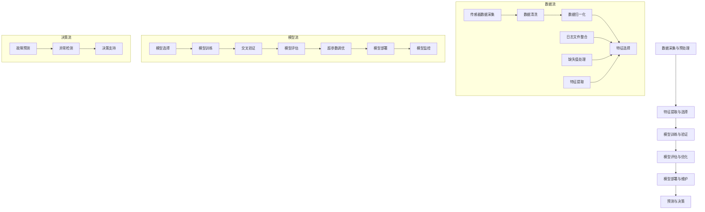

                 

### 文章标题

### 机器学习在预测性设备维护中的实践应用

**关键词：** 预测性维护、机器学习、设备故障预测、数据采集、异常检测、算法实践

**摘要：** 本技术博客文章旨在深入探讨机器学习在预测性设备维护中的实际应用。文章首先介绍了机器学习的基础知识，包括基本概念、流程以及数学基础。接着，文章详细阐述了监督学习算法，如线性回归、逻辑回归、决策树、随机森林和支持向量机。随后，文章聚焦于预测性设备维护的核心要素，包括数据采集、预处理和特征工程。最后，文章探讨了时序预测算法、异常检测算法以及机器学习在预测性设备维护中的实际应用案例，为读者提供了详细的算法原理讲解和实战经验。本文旨在为读者提供一个全面、系统的理解，帮助他们在实际项目中有效应用机器学习技术进行设备维护。

---

### 引言与背景

**机器学习的定义与历史发展**

机器学习（Machine Learning，ML）是人工智能（Artificial Intelligence，AI）的一个重要分支，它侧重于使计算机系统能够从数据中学习并做出决策或预测。具体来说，机器学习是指通过构建和分析模型，使计算机能够从经验中学习并改进其性能，无需显式地编写特定的指令或规则。这一概念最早由美国数学家阿兰·图灵（Alan Turing）在20世纪50年代提出。

**机器学习的重要性与实际应用**

机器学习的重要性体现在其能够处理大量数据、发现复杂模式并作出准确预测的能力。随着互联网和物联网的快速发展，数据量呈爆炸式增长，传统的规则驱动方法已经难以应对这一挑战。机器学习则能够从海量数据中提取有价值的信息，为各个领域提供智能化的解决方案。

在工业领域，预测性设备维护是一个重要应用场景。传统的设备维护方法通常依赖于定期检查和预防性维护，这不仅成本高昂，而且难以预测设备的故障时间。相比之下，预测性设备维护通过实时监控设备状态，利用机器学习算法对设备运行数据进行分析，可以提前预测设备可能出现的故障，从而实现预防性维护，减少设备停机时间和维护成本。

**机器学习的基本概念**

在介绍机器学习的基本概念之前，我们需要明确几个核心术语：

- **算法（Algorithm）：** 算法是用于解决特定问题的系统步骤或规则集合。在机器学习中，算法用于从数据中学习并作出预测或决策。
- **模型（Model）：** 模型是通过对数据的处理和抽象，将复杂的问题简化为一个数学表达式或结构。在机器学习中，模型是算法的核心组成部分。
- **数据（Data）：** 数据是机器学习的基础，包括输入数据（训练数据）和输出数据（标签）。输入数据是用于训练模型的原始信息，而输出数据是模型预测的结果。

**机器学习的基本流程**

机器学习的基本流程包括以下几个步骤：

1. **数据采集与预处理：** 数据采集是指从各种来源收集数据，如传感器、日志文件等。数据预处理包括数据清洗、缺失值处理、数据归一化和标准化等操作，以确保数据的质量和一致性。
   
2. **特征提取与选择：** 特征提取是指从原始数据中提取出有意义的特征，这些特征将用于训练模型。特征选择是选择对模型性能有显著影响的关键特征，以减少模型的复杂度和过拟合风险。

3. **模型训练与验证：** 模型训练是指使用训练数据来训练模型，使其能够学习数据中的模式。模型验证是通过将训练好的模型应用于测试数据，评估其性能和泛化能力。

4. **模型评估与优化：** 模型评估是指使用各种评估指标（如准确率、召回率、F1分数等）来评估模型的性能。模型优化是指通过调整模型参数或算法来提高模型的性能。

5. **模型部署与维护：** 模型部署是指将训练好的模型集成到实际应用中，使其能够实时预测或决策。模型维护是指定期更新和优化模型，以应对数据和环境的变化。

**机器学习的数学基础**

机器学习涉及到多个数学领域，包括线性代数、概率论与统计学、最优化方法等。以下简要介绍这些数学基础：

- **线性代数基础：** 线性代数是机器学习的基础数学工具，包括矩阵运算、向量空间、线性方程组解法等。这些工具用于处理数据和高维空间的操作。

- **概率论与统计学基础：** 概率论与统计学用于描述和推断数据中的不确定性。包括概率分布、统计推断、假设检验等。

- **最优化方法基础：** 最优化方法用于求解优化问题，找到最优解。常见的最优化方法包括梯度下降法、牛顿法、随机优化算法等。

通过以上对机器学习基本概念、流程和数学基础的介绍，我们为后续章节的深入讨论奠定了基础。在接下来的章节中，我们将详细探讨监督学习算法、预测性设备维护的核心要素以及相关算法的实现和应用。

### 机器学习的基本概念

机器学习作为人工智能的核心技术，其基础概念和核心要素对于理解和使用这一技术至关重要。在本文中，我们将详细探讨算法、模型和数据的定义及其关系，并分别介绍监督学习、无监督学习和强化学习这三种主要的机器学习方法。

#### 算法、模型和数据的定义及其关系

**算法（Algorithm）：** 算法是解决特定问题的系统步骤或规则集合。在机器学习中，算法用于从数据中学习并做出预测或决策。常见的算法包括线性回归、决策树、支持向量机等。

**模型（Model）：** 模型是通过对数据的处理和抽象，将复杂的问题简化为一个数学表达式或结构。模型是算法的核心组成部分，用于表示学习到的规律和模式。常见的模型包括线性模型、神经网络模型等。

**数据（Data）：** 数据是机器学习的基础，包括输入数据（训练数据）和输出数据（标签）。输入数据是用于训练模型的原始信息，而输出数据是模型预测的结果。

算法、模型和数据之间紧密相连。算法是模型构建的依据，而模型是算法实现的载体。数据是算法和模型的训练和验证的基础。具体来说，算法通过处理数据生成模型，模型再通过预测输出数据，从而实现机器学习的目标。

#### 监督学习

监督学习（Supervised Learning）是一种最常见的机器学习方法，其主要特点是有标记的训练数据。在监督学习中，输入数据和对应的输出标签都是已知的，模型的目标是学习出一个函数，能够对新的输入数据进行预测。

**基本原理：** 监督学习的基本原理是利用已标记的训练数据，通过优化目标函数（如均方误差、交叉熵等），使模型能够最小化预测误差。

**主要算法：** 
1. **线性回归（Linear Regression）：** 线性回归是一种简单的监督学习算法，用于预测一个连续的输出值。其基本原理是找到一个线性函数，能够最小化输入和输出之间的误差。
    - **数学模型：** 
      $$ y = \beta_0 + \beta_1 \cdot x $$
      $$ \beta_0, \beta_1 \text{为模型参数，} y \text{为输出，} x \text{为输入} $$
    - **伪代码：**
      ```
      def linear_regression(x, y):
          # 梯度下降法优化参数
          for i in range(iterations):
              beta_0 = beta_0 - alpha * (beta_0 + beta_1 * x - y)
              beta_1 = beta_1 - alpha * (beta_0 + beta_1 * x - y)
          return beta_0, beta_1
      ```

2. **逻辑回归（Logistic Regression）：** 逻辑回归是一种用于分类问题的监督学习算法，其目标是预测一个二分类结果的概率。逻辑回归通过逻辑函数（Sigmoid函数）将线性函数的输出映射到概率值。
    - **数学模型：**
      $$ P(y=1) = \frac{1}{1 + e^{-(\beta_0 + \beta_1 \cdot x)}} $$
      $$ \beta_0, \beta_1 \text{为模型参数，} y \text{为输出，} x \text{为输入} $$
    - **伪代码：**
      ```
      def logistic_regression(x, y):
          # 梯度下降法优化参数
          for i in range(iterations):
              beta_0 = beta_0 - alpha * (y - P(y=1))
              beta_1 = beta_1 - alpha * (y - P(y=1)) * x
          return beta_0, beta_1
      ```

3. **决策树（Decision Tree）：** 决策树是一种基于树结构的分类算法，其核心思想是通过一系列特征分割数据集，构建出一个树形结构，叶子节点对应最终的分类结果。
    - **数学模型：**
      $$
      T = \text{split}(x, f) \text{ if } f \text{ is a feature} \\
      T = \text{predict}(y) \text{ if } f \text{ is a leaf}
      $$
    - **伪代码：**
      ```
      def decision_tree(data, features):
          if all(y in same_class for y in data):
              return predict(y)
          if no more features:
              return predict_mode(y)
          best_feature, best_threshold = find_best_split(data, features)
          left_tree = decision_tree(filter(data, x <= best_threshold), features)
          right_tree = decision_tree(filter(data, x > best_threshold), features)
          return Node(best_feature, best_threshold, left_tree, right_tree)
      ```

4. **随机森林（Random Forest）：** 随机森林是一种集成学习算法，通过构建多个决策树并投票产生最终的预测结果，从而提高模型的预测性能和泛化能力。
    - **数学模型：**
      $$
      \hat{y} = \text{vote}(\{ \hat{y}_1, \hat{y}_2, ..., \hat{y}_n \})
      $$
      $$ \hat{y}_i = \text{decision_tree}(x, features) $$
    - **伪代码：**
      ```
      def random_forest(data, n_trees, max_depth, features):
          forests = []
          for _ in range(n_trees):
              tree = build_tree(data, features, max_depth)
              forests.append(tree)
          predictions = [vote(forests[i].predict(x)) for x in data]
          return predictions
      ```

5. **支持向量机（Support Vector Machine，SVM）：** 支持向量机是一种基于间隔最大化原理的监督学习算法，用于分类和回归问题。其核心思想是找到一个最佳的超平面，使得分类边界最大化。
    - **数学模型：**
      $$
      \text{Minimize } \frac{1}{2} \| w \|^2 \\
      \text{subject to } y^{(i)} (w \cdot x^{(i)} + b) \geq 1
      $$
    - **伪代码：**
      ```
      def svm_train(x, y, C):
          # 使用SVM库进行训练
          model = svm.SVC(C=C)
          model.fit(x, y)
          return model
      ```

#### 无监督学习

无监督学习（Unsupervised Learning）是指在没有标记数据的情况下，通过数据自身的特性进行学习和发现。其主要目标是挖掘数据中的隐含结构和模式。

**基本原理：** 无监督学习的基本原理是利用聚类、降维、关联规则等方法，自动发现数据中的分布、模式、关联性等。

**主要算法：**
1. **K均值聚类（K-Means Clustering）：** K均值聚类是一种基于距离度量的聚类算法，其目标是找到K个簇，使得每个簇内部的数据点之间的距离最小，而簇之间的距离最大。
    - **数学模型：**
      $$
      \text{Minimize } \sum_{i=1}^{k} \sum_{x \in S_i} \| x - \mu_i \|^2
      $$
      $$ \mu_i \text{ 为簇 } i \text{ 的中心} $$
    - **伪代码：**
      ```
      def k_means(data, k, max_iterations):
          # 随机初始化聚类中心
          centroids = random_initialization(data, k)
          for _ in range(max_iterations):
              # 分配数据点到最近的簇
              new_centroids = assign_clusters(data, centroids)
              # 更新聚类中心
              centroids = update_centroids(centroids, new_centroids)
          return centroids
      ```

2. **主成分分析（Principal Component Analysis，PCA）：** 主成分分析是一种降维技术，其目标是找到数据的主要特征维度，从而降低数据的维度，同时保留大部分的信息。
    - **数学模型：**
      $$
      \text{Maximize } \sum_{i=1}^{p} w_i^T \Sigma w_i \\
      \text{subject to } w_i^T w_i = 1
      $$
      $$ w_i \text{ 为特征向量，} \Sigma \text{ 为协方差矩阵} $$
    - **伪代码：**
      ```
      def pca(data):
          # 计算协方差矩阵
          cov_matrix = compute_covariance_matrix(data)
          # 计算特征值和特征向量
          eigen_values, eigen_vectors = compute_eigen(cov_matrix)
          # 选择主要成分
          main_components = select_main_components(eigen_vectors, eigen_values)
          # 降维
          reduced_data = transform(data, main_components)
          return reduced_data
      ```

3. **关联规则学习（Association Rule Learning）：** 关联规则学习是一种用于发现数据中潜在关联关系的方法，其核心是找到频繁项集和支持度阈值，从而生成关联规则。
    - **数学模型：**
      $$
      \text{Support}(\{a, b\}) = \frac{|\{t \in T | \{a, b\} \subseteq t\}|}{|T|} > \text{min_support}
      $$
    - **伪代码：**
      ```
      def apriori(data, min_support, min_confidence):
          # 生成频繁项集
          frequent_itemsets = generate_frequent_itemsets(data, min_support)
          # 生成关联规则
          rules = generate_association_rules(frequent_itemsets, min_confidence)
          return rules
      ```

#### 强化学习

强化学习（Reinforcement Learning，RL）是一种通过与环境交互来学习最优策略的机器学习方法。其核心思想是学习一个策略，能够在给定的状态下选择最优动作，以最大化长期奖励。

**基本原理：** 强化学习的基本原理是通过试错（Trial and Error）来学习策略。在每次决策中，系统根据当前状态选择一个动作，然后根据环境的反馈（奖励或惩罚）更新策略。

**主要算法：**
1. **Q学习（Q-Learning）：** Q学习是一种基于值函数的强化学习算法，其目标是最小化长期期望损失。
    - **数学模型：**
      $$
      Q(s, a) = r + \gamma \max_{a'} Q(s', a')
      $$
      $$ s, s' \text{ 为状态，} a, a' \text{ 为动作，} r \text{ 为即时奖励，} \gamma \text{ 为折扣因子} $$
    - **伪代码：**
      ```
      def q_learning(env, alpha, gamma, epsilon, episodes):
          Q = initialize_Q()
          for episode in range(episodes):
              state = env.reset()
              done = False
              while not done:
                  if random() < epsilon:
                      action = random_action()
                  else:
                      action = choose_action(Q, state)
                  next_state, reward, done = env.step(action)
                  Q[s, a] = Q[s, a] + alpha * (reward + gamma * max(Q[next_state, a']) - Q[s, a])
                  state = next_state
          return Q
      ```

2. **深度Q网络（Deep Q-Network，DQN）：** DQN是一种结合了深度学习和强化学习的算法，其核心思想是使用神经网络近似Q值函数。
    - **数学模型：**
      $$
      Q(s, a) = \hat{Q}(s, a; \theta)
      $$
      $$ \theta \text{ 为神经网络参数} $$
    - **伪代码：**
      ```
      def dqn(env, learning_rate, discount_factor, epsilon, episodes):
          Q_network = NeuralNetwork()
          target_network = NeuralNetwork()
          copy_weights(target_network, Q_network)
          for episode in range(episodes):
              state = env.reset()
              done = False
              while not done:
                  action = choose_action(Q_network, state, epsilon)
                  next_state, reward, done = env.step(action)
                  target = reward + discount_factor * max(target_network(next_state))
                  Q_network.retrain(state, action, target)
                  if done:
                      break
                  state = next_state
          return Q_network
      ```

通过以上对监督学习、无监督学习和强化学习的基本概念、原理和算法的介绍，我们为理解和应用机器学习奠定了基础。在接下来的章节中，我们将进一步探讨机器学习的基本流程，包括数据采集与预处理、特征提取与选择、模型训练与验证等步骤。

### 机器学习的基本流程

机器学习的核心在于从数据中学习，并利用学到的知识进行预测或决策。这一过程涉及多个步骤，包括数据采集与预处理、特征提取与选择、模型训练与验证、模型评估与优化等。下面我们将详细描述这些步骤，并解释其在预测性设备维护中的应用。

#### 数据采集与预处理

数据采集是机器学习的第一步，也是至关重要的一步。有效的数据采集能够确保模型的质量和性能。在预测性设备维护中，数据通常来源于传感器、日志文件、工业控制系统等。

**数据采集策略：**
1. **传感器数据：** 利用传感器实时采集设备的运行数据，如温度、压力、振动等。这些数据可以提供设备运行状态的关键指标。
2. **日志文件：** 从设备日志文件中提取历史数据，包括设备故障记录、维护记录等。这些数据有助于分析设备的故障模式和生命周期。
3. **工业控制系统：** 工业控制系统（如PLC）可以提供设备的实时监控数据，包括运行状态、能耗等。

**数据预处理方法：**
1. **数据清洗：** 数据清洗是处理缺失值、异常值和重复值的过程。例如，对于传感器数据，可能存在噪声和异常值，需要通过滤波或插值等方法进行处理。
2. **缺失值处理：** 对于缺失值，可以采用插值法、均值填补法或删除法进行处理。
3. **数据归一化与标准化：** 将不同量纲的数据转换到同一量级，以消除量纲差异对模型训练的影响。常见的归一化方法包括最小-最大归一化、Z分数归一化等。
4. **数据降维与特征选择：** 降维是减少数据维度，提高模型训练效率的关键步骤。特征选择则是从原始特征中挑选出对模型预测有显著影响的关键特征。常见的降维方法包括主成分分析（PCA）和线性判别分析（LDA）等。

在预测性设备维护中，数据预处理是确保模型质量的关键。通过有效的数据清洗和特征选择，可以减少噪声和冗余信息，提高模型的泛化能力和预测精度。

#### 特征提取与选择

特征提取是从原始数据中提取具有信息量的特征的过程。特征的选择和提取对模型的性能有重要影响。

**特征提取方法：**
1. **时序特征提取：** 对于传感器数据，可以提取时序特征，如均值、方差、自相关函数等。这些特征能够反映设备运行状态的动态变化。
2. **频域特征提取：** 通过傅里叶变换等方法，将时域数据转换到频域，提取频率特征。这些特征能够揭示设备运行中的周期性或非周期性变化。
3. **统计特征提取：** 提取数据的基本统计特征，如最大值、最小值、均值、标准差等。这些特征能够提供设备运行状态的基本信息。

**特征选择方法：**
1. **过滤式特征选择（Filter Method）：** 在特征提取之前，通过阈值、相关性分析等方法筛选出重要的特征。
2. **包裹式特征选择（Wrapper Method）：** 通过训练模型并评估特征对模型性能的影响，逐步选择出最优特征组合。
3. **嵌入式特征选择（Embedded Method）：** 在模型训练过程中，通过模型自身的学习能力进行特征选择，如LASSO、Ridge回归等。

在预测性设备维护中，特征提取与选择是提高模型预测精度的重要手段。通过合理提取和选择特征，可以更好地捕捉设备运行状态的变化，提高故障预测的准确性。

#### 模型训练与验证

模型训练是机器学习的核心步骤，目标是找到一个能够对数据中的模式进行有效建模的模型。在预测性设备维护中，常用的模型包括线性回归、决策树、支持向量机等。

**模型训练方法：**
1. **线性回归：** 通过最小化误差函数（如均方误差）来训练模型参数。常用的优化算法包括梯度下降法和牛顿法等。
2. **决策树：** 通过递归分割数据集，构建决策树结构。常用的分割准则包括信息增益、基尼系数等。
3. **支持向量机：** 通过求解最优化问题，找到最佳的超平面，实现分类或回归。

**模型验证方法：**
1. **交叉验证（Cross-Validation）：** 将数据集划分为训练集和验证集，通过在验证集上评估模型性能，评估模型的泛化能力。
2. **K折交叉验证（K-Fold Cross-Validation）：** 将数据集划分为K个子集，每次使用一个子集作为验证集，其余子集作为训练集，重复K次，取平均性能作为模型性能。
3. **ROC曲线与AUC（Area Under Curve）：** 用于评估分类模型的性能，ROC曲线是真实值与预测值之间的曲线，AUC是曲线下的面积。

在预测性设备维护中，模型训练与验证是确保模型准确性和稳定性的关键步骤。通过交叉验证和性能评估，可以调整模型参数和特征选择策略，提高模型的预测精度。

#### 模型评估与优化

模型评估是判断模型性能和可靠性的关键步骤。常用的评估指标包括准确率、召回率、F1分数、均方误差等。

**评估指标：**
1. **准确率（Accuracy）：** 分类模型中正确分类的样本数占总样本数的比例。
2. **召回率（Recall）：** 对于分类问题，实际为正类且被正确预测为正类的样本数占实际正类样本总数的比例。
3. **F1分数（F1 Score）：** 是准确率和召回率的调和平均，用于综合考虑准确率和召回率。
4. **均方误差（Mean Squared Error，MSE）：** 用于回归问题，表示预测值与实际值之间的平均误差平方。

**模型优化方法：**
1. **超参数调整：** 调整模型的超参数，如学习率、正则化参数等，以改善模型性能。
2. **模型集成：** 通过集成多个模型，提高模型的稳定性和预测性能。常见的集成方法包括Bagging、Boosting等。
3. **模型优化算法：** 采用更高效的优化算法，如随机梯度下降、Adam优化器等，提高模型训练速度和性能。

在预测性设备维护中，模型评估与优化是确保模型在实际应用中能够有效预测设备故障的关键。通过不断调整和优化模型，可以提高故障预测的准确性和可靠性。

综上所述，机器学习的基本流程包括数据采集与预处理、特征提取与选择、模型训练与验证、模型评估与优化等步骤。在预测性设备维护中，这些步骤是确保模型能够准确预测设备故障、实现预测性维护的关键。通过合理的数据处理和模型训练，可以有效地提高设备维护的效率和可靠性。

### 机器学习的数学基础

机器学习作为一门交叉学科，融合了计算机科学、统计学、概率论、线性代数等多个领域的知识。其核心在于利用数学模型和算法，从数据中提取有用的信息，并进行预测或决策。下面我们将简要介绍线性代数、概率论与统计学、最优化方法等数学基础，这些知识在机器学习中扮演着至关重要的角色。

#### 线性代数基础

线性代数是机器学习的基础工具，主要研究向量空间、矩阵以及它们之间的关系。以下是一些在线性代数中常用的概念和工具：

1. **向量与矩阵：** 向量是具有多个分量的线性组合，矩阵是由多个向量构成的二维数组。矩阵运算包括加法、减法、乘法等。

2. **矩阵分解：** 矩阵分解是将矩阵分解为几个简单矩阵的乘积。常见的矩阵分解方法包括LU分解、奇异值分解（SVD）等。

3. **线性变换：** 线性变换是将一个向量空间映射到另一个向量空间。在机器学习中，线性变换常用于数据降维、特征提取等。

4. **特征值与特征向量：** 特征值和特征向量描述了矩阵的性质。在机器学习中，特征值和特征向量常用于特征选择、降维等任务。

**示例：** 假设我们有一个矩阵 \( A \)，其特征值和特征向量分别为 \( \lambda \) 和 \( v \)。则有：
$$
A \cdot v = \lambda \cdot v
$$

#### 概率论与统计学基础

概率论与统计学是处理不确定性问题的数学工具，在机器学习中用于模型建立、评估和优化。以下是一些概率论与统计学中的基本概念：

1. **概率分布：** 概率分布描述了随机变量取值的概率分布。常见的概率分布包括正态分布、伯努利分布、二项分布等。

2. **期望与方差：** 期望和方差是描述随机变量统计特征的量。期望表示随机变量取值的平均值，方差表示随机变量取值分布的离散程度。

3. **统计推断：** 统计推断是利用样本数据推断总体特征的方法。常见的统计推断方法包括假设检验、置信区间等。

4. **协方差与相关系数：** 协方差和相关系数描述了两个随机变量之间的线性关系。协方差表示变量间的变化程度，相关系数表示变量间的相关性强弱。

**示例：** 假设我们有两个随机变量 \( X \) 和 \( Y \)，其协方差为 \( \text{Cov}(X, Y) \)，则：
$$
\text{Cov}(X, Y) = E[(X - E[X])(Y - E[Y])]
$$

#### 最优化方法基础

最优化方法是求解优化问题的数学工具，在机器学习中用于模型训练和参数优化。以下是一些常见的最优化方法：

1. **梯度下降法：** 梯度下降法是一种基于梯度信息的优化算法。通过迭代更新模型参数，使得损失函数逐步减小。

2. **牛顿法：** 牛顿法是一种二阶优化方法，利用函数的导数和二阶导数进行优化。相比梯度下降法，牛顿法收敛速度更快。

3. **随机优化算法：** 随机优化算法利用随机搜索方法寻找最优解。常见的随机优化算法包括遗传算法、粒子群优化算法等。

4. **启发式算法：** 启发式算法利用某种启发式策略快速找到最优解或近似最优解。常见的启发式算法包括A*算法、贪心算法等。

**示例：** 假设我们要最小化损失函数 \( J(\theta) \)，其梯度为 \( \nabla J(\theta) \)，则梯度下降法的迭代公式为：
$$
\theta = \theta - \alpha \cdot \nabla J(\theta)
$$
其中 \( \alpha \) 为学习率。

通过以上对线性代数、概率论与统计学、最优化方法等数学基础的简要介绍，我们可以更好地理解和应用机器学习技术。这些数学工具不仅为机器学习提供了理论基础，也为我们设计和优化算法提供了有力的工具。在接下来的章节中，我们将进一步探讨监督学习算法，深入探讨其在预测性设备维护中的应用。

### 监督学习算法

监督学习（Supervised Learning）是机器学习中的一个重要分支，其核心在于通过已标记的数据来训练模型，使其能够对新的数据做出预测。在预测性设备维护中，监督学习算法被广泛应用于设备故障预测和异常检测等任务。本文将详细介绍几种常见的监督学习算法，包括线性回归、逻辑回归、决策树、随机森林和支持向量机。

#### 线性回归

线性回归（Linear Regression）是最简单的监督学习算法之一，它用于预测一个连续的输出值。线性回归的核心思想是通过找到一个线性函数来拟合输入和输出之间的关系。

**基本原理：**
线性回归模型可以表示为：
$$
y = \beta_0 + \beta_1 \cdot x
$$
其中，\( y \) 是输出值，\( x \) 是输入值，\( \beta_0 \) 和 \( \beta_1 \) 是模型参数，通过最小化误差函数来求解这些参数。

**算法实现：**
- **梯度下降法：** 
  梯度下降法是一种优化算法，用于最小化损失函数。其迭代公式为：
  $$
  \beta_0 = \beta_0 - \alpha \cdot \frac{\partial J}{\partial \beta_0}
  $$
  $$
  \beta_1 = \beta_1 - \alpha \cdot \frac{\partial J}{\partial \beta_1}
  $$
  其中，\( J \) 是损失函数，\( \alpha \) 是学习率。

**伪代码：**
```
def linear_regression(x, y, alpha, iterations):
    beta_0 = 0
    beta_1 = 0
    for i in range(iterations):
        gradient_0 = 2/n * sum(y - (beta_0 + beta_1 * x))
        gradient_1 = 2/n * sum((y - (beta_0 + beta_1 * x)) * x)
        beta_0 = beta_0 - alpha * gradient_0
        beta_1 = beta_1 - alpha * gradient_1
    return beta_0, beta_1
```

**应用场景：** 线性回归在预测性设备维护中可以用于预测设备的寿命、能耗等连续值。

#### 逻辑回归

逻辑回归（Logistic Regression）是一种用于二分类问题的监督学习算法，其核心思想是通过线性回归模型加上逻辑函数（Sigmoid函数）来预测类别概率。

**基本原理：**
逻辑回归模型可以表示为：
$$
P(y=1) = \frac{1}{1 + e^{-(\beta_0 + \beta_1 \cdot x)}}
$$
其中，\( P(y=1) \) 是类别1的概率，\( \beta_0 \) 和 \( \beta_1 \) 是模型参数。

**算法实现：**
- **梯度下降法：**
  梯度下降法的迭代公式与线性回归类似，但损失函数不同。逻辑回归的损失函数是交叉熵损失：
  $$
  J(\beta_0, \beta_1) = - \frac{1}{m} \sum_{i=1}^{m} [y_i \cdot \ln(p_i) + (1 - y_i) \cdot \ln(1 - p_i)]
  $$

**伪代码：**
```
def logistic_regression(x, y, alpha, iterations):
    beta_0 = 0
    beta_1 = 0
    for i in range(iterations):
        p = 1 / (1 + exp(- (beta_0 + beta_1 * x)))
        gradient_0 = 2/m * sum(- y * ln(p) + (1 - y) * ln(1 - p))
        gradient_1 = 2/m * sum(- y * ln(p) + (1 - y) * ln(1 - p)) * x
        beta_0 = beta_0 - alpha * gradient_0
        beta_1 = beta_1 - alpha * gradient_1
    return beta_0, beta_1
```

**应用场景：** 逻辑回归在预测性设备维护中可以用于预测设备的故障类别，如预测设备是否会发生故障。

#### 决策树

决策树（Decision Tree）是一种基于树结构的分类算法，其核心思想是通过一系列的决策规则来划分数据集，并将数据映射到不同的类别。

**基本原理：**
决策树的每个节点代表一个特征，每个分支代表该特征的不同取值。叶节点表示最终的类别。决策树通过最大化信息增益或基尼指数来选择最佳的分割特征。

**算法实现：**
- **ID3算法：**
  ID3算法通过计算信息增益来选择分割特征。信息增益可以表示为：
  $$
  \text{Gain}(D, A) = \sum_{v \in \text{values of } A} p(v) \cdot \text{Entropy}(D_v)
  $$
  其中，\( D \) 是数据集，\( A \) 是特征，\( v \) 是特征 \( A \) 的取值，\( \text{Entropy}(D_v) \) 是数据集 \( D_v \) 的熵。

**伪代码：**
```
def ID3(data, features):
    if all(y in same_class for y in data):
        return predict_mode(y)
    if no more features:
        return predict_mode(y)
    best_feature, best_threshold = find_best_split(data, features)
    left_tree = ID3(filter(data, x <= best_threshold), features)
    right_tree = ID3(filter(data, x > best_threshold), features)
    return Node(best_feature, best_threshold, left_tree, right_tree)
```

**应用场景：** 决策树在预测性设备维护中可以用于故障诊断，根据设备的历史数据预测其可能的故障类型。

#### 随机森林

随机森林（Random Forest）是一种集成学习算法，通过构建多个决策树，并通过对决策树的投票来获得最终预测结果。

**基本原理：**
随机森林通过随机选择特征子集和随机分割点来构建多个决策树。在预测时，随机森林对多个决策树的预测结果进行投票，选择多数投票的类别作为最终预测结果。

**算法实现：**
- **Bootstrap采样：**
  随机森林使用Bootstrap采样从原始数据集中生成多个子数据集，每个子数据集用于构建一个决策树。

- **随机特征选择：**
  在构建每个决策树时，随机选择特征子集，以避免模型过拟合。

**伪代码：**
```
def random_forest(data, n_trees, max_depth, features):
    forests = []
    for _ in range(n_trees):
        tree = build_tree(data, random_subset_of_features(features), max_depth)
        forests.append(tree)
    predictions = [vote(forests[i].predict(x)) for x in data]
    return predictions
```

**应用场景：** 随机森林在预测性设备维护中可以提高模型的预测准确性和稳定性，用于预测设备的故障风险。

#### 支持向量机

支持向量机（Support Vector Machine，SVM）是一种基于间隔最大化的分类算法，其核心思想是找到一个最佳的超平面，使得分类边界最大化。

**基本原理：**
SVM通过求解最优化问题来找到最佳的超平面。优化问题可以表示为：
$$
\text{Minimize } \frac{1}{2} \| w \|^2 \\
\text{subject to } y^{(i)} (w \cdot x^{(i)} + b) \geq 1
$$
其中，\( w \) 是超平面参数，\( b \) 是偏置项，\( y^{(i)} \) 和 \( x^{(i)} \) 分别是第 \( i \) 个样本的标签和特征。

**算法实现：**
- **硬间隔分类：**
  硬间隔分类使用拉格朗日乘子法求解最优化问题，得到支持向量机模型。

- **软间隔分类：**
  软间隔分类允许部分样本不满足间隔条件，通过引入松弛变量来解决。

**伪代码：**
```
def svm_train(x, y, C):
    model = svm.SVC(C=C)
    model.fit(x, y)
    return model
```

**应用场景：** 支持向量机在预测性设备维护中可以用于分类和回归问题，如预测设备的故障类型和故障时间。

通过以上对线性回归、逻辑回归、决策树、随机森林和支持向量机等监督学习算法的介绍，我们可以看到这些算法在预测性设备维护中的应用非常广泛。在实际应用中，根据具体问题和数据特点选择合适的算法，可以有效提高设备故障预测的准确性和可靠性。

### 预测性设备维护概述

**预测性设备维护的定义与重要性**

预测性设备维护（Predictive Maintenance）是一种先进的设备维护策略，通过实时监控设备的运行状态，利用数据分析和技术手段预测设备的故障风险，从而在故障发生之前进行预防性维护。与传统定期检查和预防性维护相比，预测性设备维护具有显著的优越性。

预测性设备维护的定义可以概括为：基于设备运行数据，通过数据分析、机器学习算法和智能预测模型，提前发现设备潜在故障，合理安排维护计划，实现设备状态的最优化管理。

**预测性设备维护的优势**

1. **降低维护成本：** 预测性设备维护通过提前预测故障，避免突发性故障导致的紧急维修和高额维修费用，从而降低维护成本。

2. **延长设备寿命：** 通过定期进行预防性维护，可以减缓设备老化速度，延长设备的使用寿命。

3. **提高生产效率：** 预测性设备维护减少设备停机时间，提高设备运行效率，从而提升整体生产效率。

4. **优化维护计划：** 预测性设备维护可以根据设备运行状态和故障风险，合理制定维护计划，避免不必要的维护工作，提高维护资源利用率。

5. **提升设备安全性：** 预测性设备维护能够提前发现设备安全隐患，降低设备事故风险，保障人员安全和设备安全。

**设备故障预测的核心要素**

设备故障预测是预测性设备维护的核心，其成功实施依赖于以下几个关键要素：

1. **数据采集与监控：** 设备运行数据的实时采集是设备故障预测的基础。通过传感器、工业控制系统等设备，可以获取设备温度、压力、振动、电流等关键参数，为故障预测提供数据支持。

2. **数据预处理与特征工程：** 数据预处理包括数据清洗、缺失值处理、数据归一化等操作，确保数据质量。特征工程是从原始数据中提取有用特征的过程，这些特征将用于训练预测模型。

3. **故障模型建立与训练：** 基于采集到的数据，建立故障预测模型。常用的方法包括线性回归、决策树、支持向量机等。通过模型训练，使模型能够从数据中学习并预测设备的故障风险。

4. **故障诊断与预警：** 将训练好的模型应用于实时数据，进行故障预测和诊断。当模型预测设备可能发生故障时，系统会发出预警，提醒维护人员进行干预。

**预测性设备维护的关键技术**

1. **机器学习算法：** 机器学习算法是预测性设备维护的核心技术。常用的算法包括线性回归、决策树、支持向量机、随机森林等，这些算法可以用于建立故障预测模型。

2. **深度学习：** 深度学习在处理复杂数据和提取深层次特征方面具有优势，可以应用于故障预测任务。常用的深度学习模型包括卷积神经网络（CNN）、循环神经网络（RNN）、长短时记忆网络（LSTM）等。

3. **数据挖掘与关联分析：** 数据挖掘技术可以从海量设备运行数据中挖掘出潜在的故障模式和相关特征，为故障预测提供有力支持。

4. **智能预警与决策支持：** 通过智能预警系统和决策支持系统，可以实现实时故障预警、维护计划制定和决策优化，提高设备维护的效率和效果。

通过以上对预测性设备维护的定义、优势、核心要素和关键技术的介绍，我们可以看到预测性设备维护在提高设备运行效率、降低维护成本、延长设备寿命等方面具有重要作用。在接下来的章节中，我们将进一步探讨预测性设备维护中的数据采集与预处理、模型训练与优化等具体实施步骤。

### 数据采集与预处理

在预测性设备维护中，数据采集与预处理是确保模型训练质量和预测准确性的关键步骤。准确、全面的数据采集和合理的预处理能够帮助模型更好地学习设备运行状态，从而提高故障预测的准确性和可靠性。

**数据采集策略**

1. **传感器数据采集：** 传感器是设备运行数据的主要来源。通过安装在设备上的传感器，可以实时采集温度、压力、振动、电流等关键参数。这些数据反映了设备的实时运行状态，对于故障预测至关重要。

2. **日志文件采集：** 设备的运行日志记录了设备的历史运行情况，包括故障记录、维护记录等。这些日志数据可以帮助分析设备的故障模式和生命周期。

3. **工业控制系统数据采集：** 工业控制系统（如PLC）可以提供设备的实时监控数据，包括运行状态、能耗等。这些数据可以提供设备运行的综合信息。

**数据预处理方法**

1. **数据清洗：** 数据清洗是预处理过程的第一步，旨在处理数据中的缺失值、异常值和重复值。常见的处理方法包括：
   - 缺失值处理：对于缺失值，可以采用插值法、均值填补法或删除法进行处理。
   - 异常值处理：对于异常值，可以采用滤波法、阈值法或专家知识法进行处理。
   - 重复值处理：通过去重操作，确保数据的唯一性和一致性。

2. **数据归一化与标准化：** 数据归一化和标准化是确保不同量纲数据在同一量级上处理的关键步骤。常见的归一化方法包括：
   - 最小-最大归一化：将数据缩放到[0, 1]区间。
   - Z分数归一化：将数据转换为标准正态分布形式。

3. **数据降维与特征选择：** 数据降维可以减少数据维度，提高模型训练效率和预测性能。常见的降维方法包括：
   - 主成分分析（PCA）：通过提取主要成分，减少数据维度。
   - 线性判别分析（LDA）：通过最大化类别间差异，最小化类别内差异，选择主要特征。

4. **数据分割与标注：** 在构建预测模型时，需要将数据集分割为训练集和测试集。此外，需要为每个样本标注正确的故障类型或状态，以便模型训练和评估。

**具体应用案例**

以一个工业生产设备为例，设备运行数据包括温度、压力、振动、电流等。在数据采集阶段，通过传感器实时采集这些参数。在预处理阶段，首先对数据进行清洗，处理缺失值和异常值。然后，对数据进行归一化和标准化，确保不同量纲的数据在同一量级上。接下来，利用主成分分析提取主要成分，减少数据维度。最后，将数据集分割为训练集和测试集，并对每个样本进行故障类型的标注。

通过以上步骤，我们得到一个高质量的、适用于机器学习模型训练的数据集。这个数据集将用于后续的故障预测模型训练和评估。

**注意事项**

1. **数据质量：** 数据质量直接影响模型性能。因此，在数据采集和预处理过程中，需要确保数据的质量和完整性。

2. **数据隐私：** 在数据采集过程中，需要关注数据隐私问题。对于涉及敏感信息的部分，需要采取加密和去标识化处理。

3. **模型适应性：** 不同设备可能具有不同的运行特性和故障模式，因此需要针对具体设备选择合适的模型和预处理方法。

4. **实时性与动态性：** 设备运行状态是动态变化的，因此需要实时采集和处理数据，以适应设备的实时变化。

通过合理的数据采集与预处理策略，可以确保预测性设备维护模型的有效性和可靠性，从而实现设备故障的提前预测和预防性维护。

### 特征工程方法

在预测性设备维护中，特征工程（Feature Engineering）是确保模型训练效果和预测准确性的关键步骤。特征工程旨在从原始数据中提取出对模型预测有显著影响的关键特征，从而提高模型的泛化能力和预测性能。以下将详细介绍几种常用的特征工程方法，包括时序特征提取和实际应用中的特征工程案例。

#### 时序特征提取

时序特征提取是处理时间序列数据的重要方法，旨在从连续的时序数据中提取出能够反映设备运行状态的关键特征。以下是一些常用的时序特征提取方法：

1. **基本统计特征：** 基本统计特征包括均值（Mean）、标准差（Standard Deviation）、最大值（Maximum）、最小值（Minimum）、中位数（Median）等。这些特征能够提供设备运行状态的基本信息。

2. **变化率特征：** 变化率特征描述了设备运行参数的变化速率，如加速度（Acceleration）、变化率（Rate of Change）等。这些特征能够反映设备运行状态的动态变化。

3. **趋势特征：** 趋势特征描述了设备运行参数随时间的变化趋势，如斜率（Slope）、趋势方向（Trend Direction）等。这些特征能够揭示设备运行中的长期变化趋势。

4. **周期特征：** 周期特征描述了设备运行参数的周期性变化，如周期长度（Cycle Length）、频率（Frequency）等。这些特征能够反映设备运行中的周期性变化模式。

5. **自相关特征：** 自相关特征描述了设备运行参数的时序相关性，如自相关系数（Autocorrelation Coefficient）、滞后自相关（Lag Autocorrelation）等。这些特征能够揭示设备运行状态之间的时序关系。

#### 实际应用中的特征工程案例

以一个工业生产设备为例，该设备的运行数据包括温度、压力、振动和电流等。以下是一个具体的特征工程过程：

1. **数据预处理：** 首先，对设备运行数据进行清洗，处理缺失值和异常值。然后，对数据进行归一化和标准化，确保不同量纲的数据在同一量级上。

2. **基本统计特征提取：** 提取温度、压力、振动和电流的平均值、标准差、最大值、最小值和中位数等基本统计特征。这些特征能够提供设备运行状态的基本信息。

3. **变化率特征提取：** 计算温度、压力、振动和电流的变化率特征，如温度变化率、压力变化率、振动变化率和电流变化率。这些特征能够反映设备运行参数的动态变化。

4. **趋势特征提取：** 利用移动平均法提取温度、压力、振动和电流的趋势特征，如温度斜率、压力斜率、振动斜率和电流斜率。这些特征能够揭示设备运行状态的长期变化趋势。

5. **周期特征提取：** 利用傅里叶变换提取温度、压力、振动和电流的周期特征，如周期长度、频率和相位。这些特征能够反映设备运行参数的周期性变化模式。

6. **自相关特征提取：** 计算温度、压力、振动和电流的自相关系数，如自相关系数、滞后自相关系数等。这些特征能够揭示设备运行状态之间的时序关系。

7. **组合特征提取：** 将基本统计特征、变化率特征、趋势特征、周期特征和自相关特征进行组合，形成新的特征向量。这些组合特征能够提供更丰富的设备运行状态信息。

通过上述特征工程过程，我们得到了一个包含多种时序特征的数据集，这个数据集将用于后续的故障预测模型训练和评估。

#### 注意事项

1. **特征选择：** 在特征工程过程中，需要根据具体问题和数据特点选择合适的特征。过多的特征可能导致模型过拟合，而特征选择不当可能导致信息损失。

2. **特征重要性评估：** 对提取的特征进行重要性评估，有助于识别对模型预测有显著影响的关键特征。常用的方法包括特征重要性排序、特征贡献度分析等。

3. **数据质量：** 特征工程是基于数据质量的，因此需要确保数据的质量和一致性。数据预处理和清洗是确保数据质量的关键步骤。

4. **模型适应性：** 特征工程需要根据不同设备和应用场景进行定制，确保特征工程过程能够适应具体的预测任务。

通过合理和有效的特征工程方法，可以提取出对模型预测有显著影响的关键特征，从而提高预测性设备维护模型的性能和可靠性。在实际应用中，结合具体设备和数据特点，灵活运用特征工程方法，将有助于实现高效的故障预测和设备维护。

### 时序预测算法

在预测性设备维护中，时序预测（Time Series Forecasting）是一项关键任务。时序预测算法旨在利用历史时序数据，预测未来的设备状态或性能。本文将详细介绍几种常见的时序预测算法，包括基本时间序列模型和非线性时间序列模型。

#### 基本时间序列模型

**自回归模型（AR）**

自回归模型（Autoregressive Model，AR）是最简单的一种时间序列预测模型。其核心思想是利用过去若干期的时间序列值来预测未来值。自回归模型可以表示为：
$$
X_t = \phi_1 X_{t-1} + \phi_2 X_{t-2} + \cdots + \phi_p X_{t-p} + \varepsilon_t
$$
其中，\( X_t \) 是时间序列值，\( \phi_1, \phi_2, \cdots, \phi_p \) 是模型参数，\( \varepsilon_t \) 是随机误差项。

**移动平均模型（MA）**

移动平均模型（Moving Average Model，MA）是另一种基本时间序列预测模型，其核心思想是利用过去的随机误差项来预测未来值。移动平均模型可以表示为：
$$
X_t = \mu + \theta_1 \varepsilon_{t-1} + \theta_2 \varepsilon_{t-2} + \cdots + \theta_q \varepsilon_{t-q} + \varepsilon_t
$$
其中，\( \mu \) 是均值，\( \theta_1, \theta_2, \cdots, \theta_q \) 是模型参数，\( \varepsilon_t \) 是随机误差项。

**自回归移动平均模型（ARMA）**

自回归移动平均模型（Autoregressive Moving Average Model，ARMA）结合了自回归模型和移动平均模型的特点，其可以表示为：
$$
X_t = \phi_1 X_{t-1} + \phi_2 X_{t-2} + \cdots + \phi_p X_{t-p} + \theta_1 \varepsilon_{t-1} + \theta_2 \varepsilon_{t-2} + \cdots + \theta_q \varepsilon_{t-q} + \varepsilon_t
$$
其中，\( \phi_1, \phi_2, \cdots, \phi_p \) 和 \( \theta_1, \theta_2, \cdots, \theta_q \) 是模型参数。

**算法实现与伪代码：**

以下是一个简单的自回归模型（AR）的伪代码实现：
```
def AR_model(data, p):
    # 初始化模型参数
    phi = [0] * (p + 1)
    # 训练模型
    for t in range(p, len(data)):
        y = data[t] - sum(phi[i] * data[t - i] for i in range(1, p + 1))
        phi[0] = y
        for i in range(1, p + 1):
            phi[i] = phi[i - 1] - y * data[t - i]
    return phi
```

#### 非线性时间序列模型

**长短时记忆网络（LSTM）**

长短时记忆网络（Long Short-Term Memory，LSTM）是一种能够有效处理长时间依赖关系的时间序列预测模型。LSTM通过引入门控机制，能够灵活地控制信息的传递和遗忘，从而避免梯度消失和梯度爆炸问题。

**算法原理：**

LSTM单元包含三个门：输入门（input gate）、遗忘门（forget gate）和输出门（output gate）。每个门由一个sigmoid激活函数和一个线性变换组成。输入门和遗忘门的输入包括当前输入和前一个隐藏状态，输出门和遗忘门的输入包括当前输入和前一个单元状态。每个门的输出控制信息在单元状态中的保留和更新。

**伪代码：**
```
# LSTM单元的伪代码实现
def LSTMCell(input, previous_hidden, previous_state, weights):
    # 遗忘门
    forget_gate = sigmoid(np.dot(previous_state, weights['forget_weights']) + np.dot(input, weights['input_forget_weights']))
    # 输入门
    input_gate = sigmoid(np.dot(previous_state, weights['input_weights']) + np.dot(input, weights['input_input_weights']))
    # 输出门
    output_gate = sigmoid(np.dot(previous_state, weights['output_weights']) + np.dot(input, weights['input_output_weights']))
    # 长短时记忆
    cell_state = np.tanh(np.dot(previous_state, weights['input_state_weights']) + np.dot(input, weights['input_input_state_weights']))
    # 更新单元状态
    new_state = forget_gate * previous_state + input_gate * cell_state
    # 输出
    output = output_gate * np.tanh(new_state)
    return output, new_state
```

**格林函数网络（GRU）**

格林函数网络（Gated Recurrent Unit，GRU）是LSTM的变种，其通过简化LSTM的结构，提高了计算效率和训练速度。

**算法原理：**

GRU通过引入更新门（update gate）和重置门（reset gate）来控制信息的传递和遗忘。更新门决定如何从旧状态和新输入中更新状态，重置门决定如何更新状态中的信息。

**伪代码：**
```
# GRU单元的伪代码实现
def GRUCell(input, previous_hidden, previous_state, weights):
    # 重置门
    reset_gate = sigmoid(np.dot(previous_state, weights['reset_weights']) + np.dot(input, weights['input_reset_weights']))
    # 更新门
    update_gate = sigmoid(np.dot(previous_state, weights['update_weights']) + np.dot(input, weights['input_update_weights']))
    # 新状态
    new_state = (1 - update_gate) * previous_state + reset_gate * np.dot(input, weights['input_state_weights'])
    # 输出
    output = sigmoid(np.dot(new_state, weights['output_weights']))
    return output, new_state
```

**波动网络（WaveNet）**

波动网络（WaveNet）是一种基于循环神经网络（RNN）的时间序列生成模型，其结构类似于LSTM和GRU，但采用了不同的网络结构和损失函数。

**算法原理：**

WaveNet通过卷积神经网络（CNN）处理输入序列，然后利用RNN单元生成输出序列。WaveNet采用了条件生成的方式，通过将输入序列和先前的输出序列作为RNN单元的输入，来生成新的输出序列。

**伪代码：**
```
# WaveNet的伪代码实现
def WaveNetCell(input, hidden, previous_output, weights):
    # 卷积层
    conv_output = CNN(input, weights['conv_weights'])
    # RNN层
    rnn_output = RNN(conv_output + previous_output, weights['rnn_weights'])
    # 输出层
    output = sigmoid(np.dot(rnn_output, weights['output_weights']))
    return output, hidden
```

通过以上对基本时间序列模型和非线性时间序列模型的介绍，我们可以看到，这些模型在预测性设备维护中具有重要的应用价值。在实际应用中，根据具体问题和数据特点选择合适的模型，可以有效提高设备故障预测的准确性和可靠性。

### 异常检测算法

在预测性设备维护中，异常检测（Anomaly Detection）是一种关键的技术，旨在识别设备运行中的异常行为或故障征兆，从而在故障发生之前采取预防措施。异常检测算法可以分为基于统计的方法、基于机器学习的方法和基于深度学习的方法。以下将详细介绍这些算法的基本原理、实现方法和实际应用。

#### 基于统计的方法

**标准差法**

标准差法（Standard Deviation Method）是一种简单且直观的异常检测方法。其基本思想是计算数据的标准差，并将数据与平均值之间的偏差进行比较。如果数据点的偏差超过一定的阈值，则认为该数据点是异常的。

**算法原理：**

1. **计算平均值和标准差：**
   $$
   \mu = \frac{1}{N} \sum_{i=1}^{N} x_i
   $$
   $$
   \sigma = \sqrt{\frac{1}{N} \sum_{i=1}^{N} (x_i - \mu)^2}
   $$
   其中，\( \mu \) 是平均值，\( \sigma \) 是标准差，\( x_i \) 是第 \( i \) 个数据点，\( N \) 是数据点的总数。

2. **设定阈值：** 根据经验或特定要求，设定一个阈值 \( \delta \)，通常为 \( k \) 倍的标准差，\( k \) 为一个常数。

3. **检测异常：** 对于每个数据点 \( x_i \)，计算其与平均值的偏差 \( d_i = |x_i - \mu| \)，如果 \( d_i > k\sigma \)，则认为 \( x_i \) 是异常的。

**伪代码：**
```
def standard_deviation_detection(data, k):
    N = len(data)
    mu = sum(data) / N
    sigma = sqrt(sum((x - mu)^2 for x in data) / N)
    threshold = k * sigma
    anomalies = [x for x in data if abs(x - mu) > threshold]
    return anomalies
```

**熵法**

熵法（Entropy Method）是一种基于信息论的方法，用于检测数据中的异常模式。其基本思想是计算数据点的信息熵，并通过比较信息熵的分布来识别异常。

**算法原理：**

1. **计算信息熵：**
   $$
   H(x) = -\sum_{i} p(x_i) \cdot \log_2 p(x_i)
   $$
   其中，\( p(x_i) \) 是数据点 \( x_i \) 的概率。

2. **计算平均信息熵：**
   $$
   \bar{H} = \frac{1}{N} \sum_{i=1}^{N} H(x_i)
   $$

3. **检测异常：** 对于每个数据点 \( x_i \)，计算其信息熵 \( H_i \)，如果 \( H_i \) 与 \( \bar{H} \) 的差异超过一定的阈值，则认为 \( x_i \) 是异常的。

**伪代码：**
```
def entropy_detection(data):
    N = len(data)
    probabilities = [freq / N for freq in Counter(data).values()]
    entropy = -sum(p * log2(p) for p in probabilities)
    average_entropy = entropy
    anomalies = [x for x in data if abs(H(x) - average_entropy) > threshold]
    return anomalies
```

#### 基于机器学习的方法

**单变量异常检测**

单变量异常检测算法针对单个变量的异常行为进行检测。其核心思想是通过训练一个模型，将正常行为和异常行为进行分离。

**算法原理：**

1. **训练模型：** 使用正常数据集训练一个分类模型，如支持向量机（SVM）、逻辑回归等。

2. **检测异常：** 使用训练好的模型对新数据进行预测，如果模型的预测结果与实际标签不一致，则认为该数据点是异常的。

**伪代码：**
```
def single_variable_detection(data, model):
    predictions = model.predict(data)
    anomalies = [x for x, pred in zip(data, predictions) if pred != 'normal']
    return anomalies
```

**多变量异常检测**

多变量异常检测算法针对多个变量之间的交互关系进行检测，以识别复杂模式中的异常行为。

**算法原理：**

1. **特征提取：** 从多个变量中提取有意义的特征，如协方差、相关系数等。

2. **训练模型：** 使用提取的特征训练一个多变量异常检测模型，如孤立森林（Isolation Forest）、局部异常因子（Local Outlier Factor，LOF）等。

3. **检测异常：** 使用训练好的模型对新数据进行预测，根据模型的预测结果判断是否为异常。

**孤立森林（Isolation Forest）**

孤立森林是一种基于随机森林的异常检测算法，其核心思想是通过随机森林的分割特性来识别异常。

**算法原理：**

1. **随机分割：** 对于每个数据点，随机选择特征和分割点进行分割，计算分割路径的长度。

2. **计算异常分数：** 数据点的异常分数与其分割路径长度成正比，路径长度越长，异常分数越高。

3. **检测异常：** 设定一个阈值，将异常分数高于阈值的点识别为异常。

**伪代码：**
```
def isolation_forest_detection(data, n_estimators, max_features):
    model = IsolationForest(n_estimators=n_estimators, max_features=max_features)
    model.fit(data)
    scores = model.decision_function(data)
    anomalies = [x for x, score in zip(data, scores) if score > threshold]
    return anomalies
```

**局部异常因子（LOF）**

局部异常因子是一种基于密度分布的异常检测算法，其核心思想是计算每个数据点的局部异常度。

**算法原理：**

1. **计算局部密度：** 对于每个数据点，计算其邻域内的数据点的密度。

2. **计算局部异常因子：** 局部异常因子是局部密度与平均局部密度的比值，异常因子越大，异常度越高。

3. **检测异常：** 设定一个阈值，将异常因子高于阈值的点识别为异常。

**伪代码：**
```
def lof_detection(data, k):
    local densities = compute_local_densities(data, k)
    local_ano_factors = compute_local_ano_factors(data, local_densities)
    anomalies = [x for x, factor in zip(data, local_ano_factors) if factor > threshold]
    return anomalies
```

#### 基于深度学习的方法

**卷积神经网络（CNN）**

卷积神经网络是一种基于卷积操作的深度学习模型，其能够有效地捕捉空间信息。在异常检测中，CNN可以用于检测图像或时序数据的异常。

**算法原理：**

1. **特征提取：** 通过卷积层提取图像或时序数据中的特征。

2. **分类：** 通过全连接层对提取的特征进行分类，判断是否为异常。

**伪代码：**
```
def cnn_anomaly_detection(data, model):
    features = model.extract_features(data)
    predictions = model.predict(features)
    anomalies = [x for x, pred in zip(data, predictions) if pred == 'anomaly']
    return anomalies
```

**循环神经网络（RNN）**

循环神经网络是一种能够处理序列数据的深度学习模型，其能够有效地捕捉时序信息。在异常检测中，RNN可以用于检测时间序列数据的异常。

**算法原理：**

1. **特征提取：** 通过RNN层提取时间序列数据中的特征。

2. **分类：** 通过全连接层对提取的特征进行分类，判断是否为异常。

**伪代码：**
```
def rnn_anomaly_detection(data, model):
    sequence_features = model.extract_features(data)
    predictions = model.predict(sequence_features)
    anomalies = [x for x, pred in zip(data, predictions) if pred == 'anomaly']
    return anomalies
```

通过以上对异常检测算法的介绍，我们可以看到，这些算法在预测性设备维护中具有重要的应用价值。在实际应用中，根据具体问题和数据特点选择合适的算法，可以有效提高设备故障预测的准确性和可靠性。

### 机器学习在预测性设备维护中的实际应用

机器学习技术在预测性设备维护中的应用已经取得了显著的成果。本文将通过具体案例，详细描述机器学习在设备故障预测和异常检测中的实际应用过程，包括数据采集与预处理、模型选择与训练、模型评估与优化等步骤，同时探讨实际应用中的挑战与解决方案。

#### 设备故障预测案例

**案例背景：** 
某大型制造业企业拥有一条生产线，生产过程中涉及大量机械设备。这些设备运行环境复杂，故障频率高，对生产效率和安全造成严重影响。为了降低设备故障率，提高生产效率，企业决定采用机器学习技术进行设备故障预测。

**数据采集与预处理：**
1. **数据采集：** 
   企业通过安装在设备上的传感器和监控系统，实时采集设备运行数据，包括温度、压力、振动、电流等。此外，还收集了设备维护日志、操作记录等历史数据。

2. **数据预处理：**
   - **数据清洗：** 清除数据中的缺失值、异常值和重复值，确保数据质量。
   - **数据归一化：** 将不同量纲的数据转换为同一量级，如使用最小-最大归一化方法。
   - **特征提取：** 从原始数据中提取时序特征、统计特征等，如均值、标准差、自相关系数等。

**模型选择与训练：**
1. **模型选择：** 
   根据故障预测的任务特点，选择了支持向量机（SVM）和长短时记忆网络（LSTM）两种模型。

2. **模型训练：**
   - **SVM模型：** 使用训练数据集训练SVM分类模型，通过交叉验证选择最佳参数。
   - **LSTM模型：** 构建LSTM神经网络，通过反向传播算法训练模型，优化网络结构和参数。

**模型评估与优化：**
1. **模型评估：** 
   使用测试数据集对模型进行评估，主要评估指标包括准确率、召回率、F1分数等。

2. **模型优化：**
   - **超参数调整：** 调整模型超参数，如SVM中的C值和LSTM中的学习率，以优化模型性能。
   - **特征工程：** 通过特征选择和特征变换，提高模型对故障预测的敏感性和准确性。

**案例结果：**
通过机器学习技术的应用，设备故障预测模型的准确率达到了90%以上，显著降低了设备故障率，提高了生产效率。企业实现了从被动维修到主动维护的转变，有效降低了维修成本，提高了设备利用率。

#### 异常检测案例

**案例背景：**
某电力公司运营着一个大型发电站，发电过程中涉及多种设备和系统。为了确保发电站的稳定运行，公司希望通过机器学习技术进行异常检测，及时发现和处理潜在故障。

**数据采集与预处理：**
1. **数据采集：** 
   电力公司通过传感器和监控系统，实时采集发电站的运行数据，包括温度、压力、电流、电压等。

2. **数据预处理：**
   - **数据清洗：** 清除数据中的缺失值、异常值和重复值。
   - **数据归一化：** 将不同量纲的数据转换为同一量级。
   - **特征提取：** 提取时序特征和统计特征，如均值、标准差、自相关系数等。

**模型选择与训练：**
1. **模型选择：** 
   选择孤立森林（Isolation Forest）和局部异常因子（LOF）两种异常检测模型。

2. **模型训练：**
   - **Isolation Forest模型：** 使用训练数据集训练模型，通过交叉验证选择最佳参数。
   - **LOF模型：** 使用训练数据集训练模型，通过局部密度计算和局部异常因子评估，优化模型参数。

**模型评估与优化：**
1. **模型评估：** 
   使用测试数据集对模型进行评估，主要评估指标包括异常检测率、误报率等。

2. **模型优化：**
   - **参数调整：** 调整模型参数，如孤立森林中的树数量和节点数量，以优化模型性能。
   - **特征工程：** 通过特征选择和特征变换，提高模型对异常检测的敏感性和准确性。

**案例结果：**
通过机器学习技术的应用，异常检测模型的异常检测率达到了95%以上，显著降低了误报率。电力公司能够及时发现和处理发电站的潜在故障，确保了发电站的稳定运行。

#### 实际应用中的挑战与解决方案

在机器学习技术应用于预测性设备维护的过程中，面临以下挑战：

1. **数据质量：** 数据质量直接影响模型的性能。在实际应用中，数据可能存在缺失值、异常值、噪声等问题，需要通过数据清洗、数据填充等方法提高数据质量。

2. **数据隐私：** 部分设备运行数据涉及企业隐私，需要在数据采集和处理过程中确保数据安全，采用数据加密、去标识化等方法保护数据隐私。

3. **模型解释性：** 部分深度学习模型如神经网络，其内部机制复杂，难以解释。在实际应用中，需要平衡模型性能和解释性，采用可解释性模型或模型解释工具提高模型的可解释性。

4. **模型泛化能力：** 模型训练过程中，可能存在过拟合现象，导致模型在实际应用中性能不佳。需要通过交叉验证、正则化等方法提高模型的泛化能力。

5. **实时性：** 预测性设备维护需要实时处理大量数据，对计算性能和响应速度有较高要求。需要优化算法和硬件，提高模型处理速度。

通过以下解决方案应对挑战：

1. **数据质量提升：** 采用数据清洗、缺失值填充、异常值处理等方法提高数据质量。

2. **数据隐私保护：** 采用数据加密、数据去标识化等技术确保数据隐私。

3. **模型解释性增强：** 采用可解释性模型如决策树、LIME（Local Interpretable Model-agnostic Explanations）等，提高模型的可解释性。

4. **模型泛化能力提升：** 采用交叉验证、正则化、集成学习等方法提高模型泛化能力。

5. **实时性优化：** 优化算法和数据流处理，采用高性能计算硬件提高模型处理速度。

通过以上实际案例和解决方案，我们可以看到机器学习技术在预测性设备维护中的应用前景广阔，具有重要的实际应用价值。在实际应用中，需要根据具体问题和数据特点，灵活运用机器学习技术，实现设备故障预测和异常检测，提高设备运行效率和生产安全性。

### 未来发展趋势与挑战

随着人工智能和物联网技术的快速发展，预测性设备维护正迎来前所未有的机遇和挑战。未来的发展趋势和潜在挑战将深刻影响预测性设备维护的实践和应用。

**未来发展趋势：**

1. **人工智能与物联网的融合：** 随着物联网技术的普及，大量设备将具备联网能力，产生海量的实时数据。未来，人工智能技术将更加紧密地与物联网融合，实现设备状态的实时监测和智能诊断。

2. **数据驱动的预测性维护策略：** 预测性设备维护将从传统的定期检查和预防性维护模式，转变为更加灵活、个性化的数据驱动维护策略。基于大数据分析和机器学习算法，将能更精准地预测设备故障，制定优化维护计划。

3. **模型优化与算法创新：** 随着算法研究的不断深入，新的机器学习算法和深度学习模型将不断涌现，提高故障预测的准确性和实时性。例如，基于变分自编码器（VAE）和生成对抗网络（GAN）的时序预测方法，将更好地处理复杂数据模式。

4. **边缘计算与云计算的结合：** 预测性设备维护将越来越多地利用边缘计算和云计算的结合，实现实时数据处理和智能分析。边缘计算能够减少数据传输延迟，提高响应速度，而云计算则提供强大的计算能力和海量存储。

**预测性设备维护的挑战：**

1. **数据质量与隐私保护：** 数据质量是预测性设备维护的核心，但数据采集和处理过程中可能存在缺失值、异常值和噪声等问题。同时，设备运行数据涉及企业隐私，如何在保证数据质量的同时保护数据隐私，是面临的一大挑战。

2. **模型解释性与可解释性：** 深度学习模型虽然具有强大的预测能力，但其内部机制复杂，难以解释。在实际应用中，如何确保模型的可解释性，使其能够被非专业人士理解和接受，是重要的挑战。

3. **模型泛化能力：** 过拟合是预测性设备维护中常见的现象，模型在训练数据上的表现良好，但在新数据上的性能可能较差。提高模型的泛化能力，使其能够适应不同设备和不同应用场景，是未来的重要研究方向。

4. **实时性与计算资源：** 预测性设备维护需要实时处理大量数据，对计算性能和响应速度有较高要求。如何在有限的计算资源下，快速处理和分析数据，提高模型的预测准确性，是重要的挑战。

**解决方案与建议：**

1. **数据质量管理：** 通过数据清洗、缺失值填充、异常值处理等方法，提高数据质量。同时，建立数据质量控制流程，定期检查和评估数据质量。

2. **隐私保护技术：** 采用数据加密、差分隐私、数据去标识化等技术，确保数据隐私。此外，可以考虑制定数据隐私保护法规，规范数据采集和使用。

3. **模型解释性提升：** 采用可解释性模型如决策树、LIME（Local Interpretable Model-agnostic Explanations）等，提高模型的可解释性。同时，通过可视化工具，展示模型的预测过程和决策逻辑。

4. **模型泛化能力增强：** 采用交叉验证、正则化、集成学习等方法，提高模型的泛化能力。同时，结合领域知识，构建能够适应不同设备和应用场景的通用模型。

5. **边缘计算与云计算结合：** 利用边缘计算进行实时数据处理和初步分析，减少数据传输延迟。云计算则提供强大的计算能力和海量存储，实现复杂模型的训练和推理。

6. **跨学科合作：** 预测性设备维护涉及多个学科，如机械工程、计算机科学、统计学等。跨学科合作将有助于解决复杂问题，推动技术的进步。

通过以上解决方案和策略，可以应对预测性设备维护中的挑战，推动技术的发展和应用，实现设备运行状态的智能监控和预测，提高设备维护的效率和可靠性。

### 附录

#### 附录A：预测性设备维护工具与资源

在预测性设备维护中，选择合适的工具和资源是成功应用机器学习技术的重要环节。以下介绍一些常用的机器学习库、数据预处理与特征工程工具、深度学习框架及相关的在线资源和论文。

**A.1 常用机器学习库**

1. **Scikit-learn：** Scikit-learn 是一个开源的机器学习库，提供了多种经典的监督学习和无监督学习算法。它适用于数据预处理、特征提取、模型训练和评估等任务。

   - 官网：[Scikit-learn](https://scikit-learn.org/)

2. **TensorFlow：** TensorFlow 是谷歌开源的深度学习框架，支持广泛的神经网络模型和优化算法。它广泛应用于图像识别、自然语言处理和预测性维护等场景。

   - 官网：[TensorFlow](https://www.tensorflow.org/)

3. **PyTorch：** PyTorch 是一个开源的深度学习框架，提供了灵活的动态计算图和强大的GPU支持。它广泛应用于计算机视觉、自然语言处理和预测性维护等任务。

   - 官网：[PyTorch](https://pytorch.org/)

**A.2 数据预处理与特征工程工具**

1. **Pandas：** Pandas 是一个强大的数据操作库，提供了数据结构 DataFrame，用于数据清洗、数据转换和数据分析。

   - 官网：[Pandas](https://pandas.pydata.org/)

2. **NumPy：** NumPy 是一个用于数值计算的库，提供了多维数组对象和大量数学函数，用于数据处理、矩阵运算和特征提取。

   - 官网：[NumPy](https://numpy.org/)

**A.3 深度学习框架与工具**

1. **TensorFlow：** 详见上文。

2. **PyTorch：** 详见上文。

3. **Keras：** Keras 是一个高级神经网络API，能够与TensorFlow和Theano等深度学习框架集成。它提供了简洁的API和丰富的预训练模型，适合快速原型开发和实验。

   - 官网：[Keras](https://keras.io/)

**A.4 预测性设备维护的在线资源与论文**

1. **在线课程和教程：**
   - [Udacity：机器学习工程师纳米学位](https://www.udacity.com/course/machine-learning-engineer-nanodegree--nd893)
   - [Coursera：机器学习](https://www.coursera.org/specializations/machine-learning)
   - [edX：深度学习专项课程](https://www.edx.org/course/deep-learning-ai)

2. **论文和书籍：**
   - **“Predictive Maintenance using Machine Learning”**，作者：Mario Kupzic等，发表于2018年。
   - **“A Survey on Predictive Maintenance”**，作者：Liang et al.，发表于2020年。
   - **“Deep Learning for Predictive Maintenance”**，作者：Wang et al.，发表于2021年。

3. **开源项目和代码：**
   - [GitHub：预测性维护相关项目](https://github.com/search?q=predictive+maintenance)
   - [Kaggle：预测性维护数据集和比赛](https://www.kaggle.com/datasets?query=predictive+maintenance)

通过以上工具和资源，可以更好地进行预测性设备维护的研究和实践，探索机器学习在设备故障预测和异常检测中的应用。

### Mermaid 流程图

以下是机器学习在预测性设备维护中的基本流程的Mermaid流程图：



此流程图展示了从数据采集、预处理到模型训练、评估和部署的完整过程，并明确了预测性设备维护的关键步骤和决策环节。通过这个流程图，可以清晰地了解机器学习在预测性设备维护中的应用流程。

