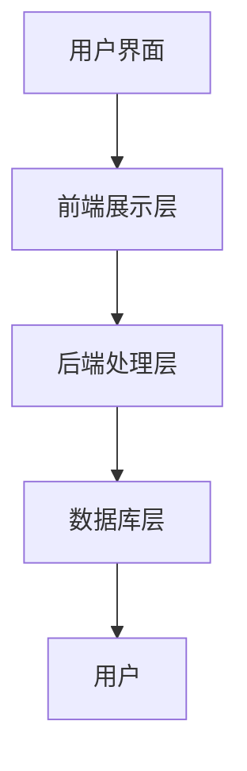

                 

### 文章标题

《植村秀2024校招虚拟试妆系统开发工程师面试》

### 关键词

虚拟试妆系统，开发工程师面试，计算机视觉，图像处理，人工智能

### 摘要

本文旨在为2024年植村秀校招虚拟试妆系统开发工程师面试的考生提供全面的准备指南。文章首先介绍了虚拟试妆系统的基本概念、架构设计和技术实现，然后分析了面试中常见的问题和应对策略，通过实例展示了实际应用效果和用户反馈，帮助读者在面试中展示专业能力和技术深度。

## 第一部分：前言

### 1.1 引言

随着人工智能技术的飞速发展，虚拟试妆系统在美妆行业中的应用越来越广泛。植村秀2024校招虚拟试妆系统开发工程师面试，不仅考察了应聘者的编程能力和技术实现，更关注其在计算机视觉、图像处理和人工智能领域的综合素养。本文将从以下几个方面展开讨论：

- **虚拟试妆系统的基本概念**：介绍虚拟试妆系统的定义、发展历程和应用场景。
- **系统架构设计**：详细阐述虚拟试妆系统的整体架构、模块划分和关键组件。
- **技术实现**：探讨前端和后端技术实现、计算机视觉和图像处理技术。
- **面试问题及应对策略**：分析面试中常见的问题类型，并提供相应的解决方案。
- **实际案例分析**：结合实际项目，展示虚拟试妆系统的实现过程和应用效果。

### 1.2 书籍背景及目的

本书旨在为准备参加植村秀2024校招虚拟试妆系统开发工程师面试的考生提供一本实用的技术指南。通过深入解析虚拟试妆系统的基本概念、架构设计和技术实现，帮助读者全面了解该领域的核心知识和技能。同时，本文还将针对面试中可能出现的问题，提供实用的应对策略和案例分析，帮助读者在面试中展示自己的专业能力和技术深度。

### 1.3 读者对象

本书主要面向以下几类读者：

- **计算机相关专业大学生**：正在学习计算机视觉、图像处理和人工智能等领域，希望了解虚拟试妆系统开发原理和面试技巧的学生。
- **技术爱好者**：对虚拟试妆系统感兴趣，希望深入了解该领域的技术原理和应用场景的技术爱好者。
- **求职者**：准备参加植村秀或其他公司虚拟试妆系统开发工程师面试，希望提升面试成功率的求职者。

### 1.4 书籍结构

本文分为三个主要部分：

- **第一部分：前言**：介绍虚拟试妆系统的发展背景、书籍目的和读者对象。
- **第二部分：虚拟试妆系统基本概念**：讨论虚拟试妆系统的定义、架构设计和技术实现。
- **第三部分：虚拟试妆系统技术实现**：详细阐述前端和后端技术实现、计算机视觉和图像处理技术。

### 1.5 内容概述

- **虚拟试妆系统的基本概念**：介绍虚拟试妆系统的定义、发展历程和应用场景。
- **虚拟试妆系统的架构设计**：讨论系统整体架构、模块划分和关键组件。
- **技术实现**：探讨前端和后端技术实现、计算机视觉和图像处理技术。
- **面试问题及应对策略**：分析面试中常见的问题类型，并提供相应的解决方案。
- **实际案例分析**：结合实际项目，展示虚拟试妆系统的实现过程和应用效果。

### 1.6 阅读指南

- **阅读顺序**：建议读者按照书籍的结构顺序阅读，从基本概念到技术实现，再到面试问题和案例分析。
- **学习方法**：结合实际项目和案例，深入理解虚拟试妆系统的原理和应用，通过练习和总结，提高面试能力。
- **实践应用**：尝试自己实现虚拟试妆系统的基本功能，分析其中的技术难点和解决方案。

### 1.7 编写团队

- **编著者介绍**：本书由多位资深技术专家和一线面试官共同编写，具有丰富的实践经验和对面试趋势的深入分析。
- **技术顾问**：技术顾问团队提供了宝贵的意见和建议，确保本书的实用性和准确性。
- **评审团**：评审团对内容进行了严格的审查和校对，确保本书的完整性和可读性。

## 第二部分：虚拟试妆系统基本概念

### 2.1 虚拟试妆系统简介

#### 2.1.1 虚拟试妆系统的定义

虚拟试妆系统是一种基于计算机视觉、图像处理和人工智能技术的应用系统，通过虚拟环境模拟，实现用户在现实环境中无法尝试的妆容效果。该系统利用计算机视觉技术对用户面部进行识别和跟踪，通过图像处理技术对用户面部进行预处理，然后利用虚拟化妆技术将化妆品效果叠加到用户面部，实现虚拟试妆的效果。

#### 2.1.2 虚拟试妆系统的发展历程

虚拟试妆系统的概念最早可以追溯到20世纪90年代，当时计算机视觉和图像处理技术还处于初级阶段。随着技术的不断进步，虚拟试妆系统经历了多个阶段的发展：

- **初期阶段**（1990-2000年）：主要基于二维图像处理技术，无法实现三维人脸建模和实时试妆。
- **发展阶段**（2001-2010年）：随着计算机视觉和图像处理技术的进步，虚拟试妆系统逐渐实现了三维人脸建模和实时试妆功能，但化妆效果仍不够逼真。
- **成熟阶段**（2011年至今）：随着深度学习和人工智能技术的引入，虚拟试妆系统的化妆效果越来越逼真，用户体验也得到显著提升。

#### 2.1.3 虚拟试妆系统在现代美容行业的应用

虚拟试妆系统在现代美容行业中的应用越来越广泛，主要表现在以下几个方面：

- **美妆品牌**：许多知名美妆品牌（如植村秀、兰蔻、雅诗兰黛等）推出了自己的虚拟试妆应用，用户可以在虚拟环境中尝试不同妆容，选择适合自己的产品。
- **电商平台**：电商平台（如淘宝、京东、天猫等）也普遍引入了虚拟试妆系统，用户可以在线试妆，提高购物体验和转化率。
- **美容院线**：一些高端美容院线也开始使用虚拟试妆系统，为用户提供个性化试妆服务，提升客户满意度和忠诚度。

### 2.2 虚拟试妆系统的架构设计

虚拟试妆系统的架构设计通常包括前端展示层、后端处理层和数据库层，各层之间相互协作，共同实现系统的功能。

#### 2.2.1 系统整体架构

系统整体架构如图1所示：



#### 2.2.2 系统模块划分

虚拟试妆系统可以划分为以下几个模块：

1. **用户界面模块**：负责与用户进行交互，提供虚拟试妆的界面和操作功能。
2. **图像处理模块**：负责对用户面部图像进行预处理，包括人脸检测、人脸追踪、面部特征提取等。
3. **化妆效果计算模块**：负责根据用户选择的妆容，计算并生成对应的虚拟化妆效果。
4. **数据库管理模块**：负责存储和管理用户信息、化妆品数据等。

#### 2.2.3 系统关键组件及功能

虚拟试妆系统的关键组件包括用户界面、图像处理引擎、化妆效果计算引擎和数据库，各组件的功能如下：

1. **用户界面**：用户通过界面进行虚拟试妆操作，可以选择不同的妆容、调整化妆效果等。
2. **图像处理引擎**：负责对用户面部图像进行预处理，包括人脸检测、人脸追踪和面部特征提取等，确保虚拟化妆效果准确无误。
3. **化妆效果计算引擎**：负责根据用户选择的妆容，计算并生成对应的虚拟化妆效果，包括眼影、唇彩、腮红等。
4. **数据库**：存储用户信息、化妆品数据等，支持系统对用户数据的查询和管理。

### 2.3 虚拟试妆系统关键技术

虚拟试妆系统的关键技术主要包括计算机视觉技术、图像处理技术和虚拟化妆技术。

#### 2.3.1 计算机视觉技术

计算机视觉技术是虚拟试妆系统的核心，主要负责对用户面部进行识别和跟踪。主要技术包括：

1. **人脸检测**：通过算法对输入图像进行人脸检测，确定人脸的位置和范围。
2. **人脸追踪**：在视频流中跟踪人脸的位置和姿态，确保虚拟化妆效果与用户面部实时同步。
3. **特征提取**：从人脸图像中提取具有代表性的特征点，如眼睛、鼻子、嘴巴等，为后续虚拟化妆提供基础。

#### 2.3.2 图像处理技术

图像处理技术负责对用户面部图像进行预处理，提高虚拟化妆效果的准确性和逼真度。主要技术包括：

1. **面部特征点检测**：通过算法检测用户面部关键特征点，如眼睛、鼻子、嘴巴等，为虚拟化妆提供参考。
2. **肤色校正**：根据用户肤色进行校正，确保虚拟化妆效果与用户肤色相匹配。
3. **图像增强**：通过算法对用户面部图像进行增强，提高图像质量和视觉效果。

#### 2.3.3 虚拟化妆技术

虚拟化妆技术负责将化妆品效果叠加到用户面部，实现虚拟试妆的效果。主要技术包括：

1. **化妆效果计算**：根据用户选择的妆容，计算并生成对应的虚拟化妆效果，如眼影、唇彩、腮红等。
2. **纹理映射**：将生成的虚拟化妆效果纹理映射到用户面部，实现逼真的虚拟化妆效果。
3. **实时渲染**：在用户界面实时渲染虚拟化妆效果，确保用户能够实时看到化妆效果的变化。

### 2.4 虚拟试妆系统的优势与挑战

#### 2.4.1 虚拟试妆系统的优势

虚拟试妆系统具有以下优势：

1. **用户体验好**：用户可以在虚拟环境中尝试多种妆容，无需实际试用，方便快捷。
2. **使用便捷**：用户只需通过手机或电脑摄像头，即可实现虚拟试妆，无需额外设备。
3. **节省成本**：虚拟试妆系统减少了用户试用化妆品的成本，有助于提高美妆产品的销售量。
4. **个性化推荐**：系统可以根据用户的面部特征和喜好，提供个性化的化妆推荐，提高用户满意度。

#### 2.4.2 虚拟试妆系统的挑战

虚拟试妆系统也面临着一些挑战：

1. **技术实现难度大**：虚拟试妆系统涉及计算机视觉、图像处理和人工智能等多个技术领域，技术实现难度较高。
2. **化妆效果逼真度要求高**：用户对虚拟化妆效果的逼真度要求较高，如何实现高质量的化妆效果是系统面临的挑战。
3. **实时性能要求高**：虚拟试妆系统需要在实时环境中运行，对系统的实时性能要求较高，需要优化算法和架构。
4. **隐私保护**：虚拟试妆系统需要处理用户面部图像，涉及隐私保护问题，需要确保用户数据的安全性和隐私性。

#### 2.4.3 未来发展趋势

随着人工智能技术的不断发展，虚拟试妆系统有望在以下几个方面得到进一步提升：

1. **化妆效果更加逼真**：通过深度学习和图像处理技术的优化，实现更加逼真的化妆效果。
2. **实时性能更优**：通过算法和架构的优化，提高系统的实时性能，实现更流畅的虚拟试妆体验。
3. **跨平台应用**：虚拟试妆系统将在更多平台（如手机、平板、VR设备等）得到应用，为用户提供更多样化的使用场景。
4. **个性化推荐**：通过大数据分析和机器学习技术，实现更加精准的个性化推荐，提高用户满意度。

### 2.5 案例分析：某知名美妆品牌的虚拟试妆系统

#### 2.5.1 系统概述

某知名美妆品牌（以下简称“品牌”）推出了自己的虚拟试妆系统，通过该系统，用户可以在虚拟环境中尝试不同妆容，选择适合自己的化妆品。品牌希望通过该系统提升用户体验，提高销售转化率。

#### 2.5.2 技术实现

品牌虚拟试妆系统的技术实现主要包括以下几个部分：

1. **前端展示**：使用React框架搭建用户界面，用户可以通过界面选择不同的妆容、调整化妆效果等。
2. **图像处理引擎**：使用OpenCV库进行图像处理，包括人脸检测、人脸追踪和面部特征提取等，确保虚拟化妆效果准确无误。
3. **化妆效果计算引擎**：使用深度学习算法生成虚拟化妆效果，包括眼影、唇彩、腮红等，实现逼真的化妆效果。
4. **数据库管理**：使用MySQL数据库存储用户信息、化妆品数据等，支持系统对用户数据的查询和管理。

#### 2.5.3 应用效果

品牌虚拟试妆系统上线后，得到了用户的广泛关注和好评。用户可以在虚拟环境中尝试多种妆容，选择适合自己的化妆品，提高了购物体验和满意度。同时，系统也提高了品牌的销售额，降低了试妆成本。

#### 2.5.4 用户反馈

用户对品牌虚拟试妆系统的反馈积极，主要表现在以下几个方面：

1. **用户体验好**：用户可以在虚拟环境中快速尝试多种妆容，节省了时间和精力。
2. **化妆效果逼真**：虚拟化妆效果与实际妆容接近，用户可以更好地选择适合自己的化妆品。
3. **操作简单**：系统界面友好，操作简单，用户容易上手。
4. **个性化推荐**：系统根据用户面部特征和喜好，提供个性化的化妆推荐，提高了用户的满意度。

### 2.6 总结

虚拟试妆系统在现代美容行业中的应用越来越广泛，品牌通过该系统提升了用户体验，提高了销售转化率。本文分析了虚拟试妆系统的基本概念、架构设计和技术实现，并结合实际案例，展示了系统的应用效果和用户反馈。未来，随着人工智能技术的不断发展，虚拟试妆系统将在更多领域得到应用，为用户提供更多样化的服务。

## 第三部分：虚拟试妆系统技术实现

### 3.1 前端技术实现

虚拟试妆系统的前端技术实现主要包括HTML、CSS和JavaScript基础，以及常用的前端框架（如React、Vue等）。前端展示层负责与用户进行交互，提供虚拟试妆的界面和操作功能。

#### 3.1.1 HTML、CSS和JavaScript基础

HTML（超文本标记语言）是构成网页结构的基础，负责定义网页中的文本、链接、图像等内容。CSS（层叠样式表）用于控制网页的样式和布局，包括颜色、字体、边框等。JavaScript是一种脚本语言，用于实现网页的动态效果和交互功能。

#### 3.1.2 常用前端框架介绍

前端框架如React、Vue等，提供了丰富的组件库和开发工具，大大提高了前端开发的效率和可维护性。React是由Facebook推出的声明式框架，通过组件化开发，实现了虚拟DOM和单向数据流，提高了应用性能和可维护性。Vue是由尤雨溪创建的渐进式框架，提供了简洁的语法和灵活的组件系统，适用于各种规模的应用。

#### 3.1.3 前端架构设计

前端架构设计关注如何构建高效、可维护的前端系统。常见的架构设计包括MVC（模型-视图-控制器）和MVVM（模型-视图-视图模型）。React采用MVVM架构，将数据和视图分离，提高了应用的可维护性和可测试性。Vue也采用了类似的架构设计，通过数据绑定和组件化开发，实现了数据和视图的自动同步。

### 3.2 后端技术实现

后端技术实现负责处理虚拟试妆系统的核心业务逻辑，包括服务器端编程基础、常用的后端框架（如Spring、Django等）介绍，以及后端架构设计。

#### 3.2.1 服务器端编程基础

服务器端编程基础包括网络编程、HTTP协议、数据库连接等。网络编程负责实现客户端和服务器之间的通信，HTTP协议用于定义客户端和服务器之间的请求和响应格式，数据库连接用于实现服务器端对数据库的操作。

#### 3.2.2 常用后端框架介绍

后端框架如Spring、Django等，提供了丰富的组件和工具，提高了后端开发的效率和质量。Spring是一个开源的Java后端框架，提供了依赖注入、AOP（面向切面编程）、事务管理等功能，适用于企业级应用。Django是一个Python后端框架，遵循MVC架构，提供了快速开发、自动化表单处理等功能，适用于快速开发。

#### 3.2.3 后端架构设计

后端架构设计包括数据模型设计、服务分层、接口设计等。数据模型设计负责定义系统的数据结构和关系，服务分层负责将系统功能划分为多个层次，接口设计负责定义系统对外提供的接口和服务。

### 3.3 计算机视觉技术实现

计算机视觉技术实现是虚拟试妆系统的核心，包括人脸检测与追踪技术、特征提取与匹配技术、人脸对齐与面部特征标注技术等。

#### 3.3.1 人脸检测与追踪技术

人脸检测与追踪技术负责在图像或视频流中识别和跟踪人脸。主要算法包括Haar-like特征分类器、基于深度学习的卷积神经网络（如ResNet、VGG等）。

#### 3.3.2 特征提取与匹配技术

特征提取与匹配技术负责从人脸图像中提取具有代表性的特征点，并进行匹配和识别。主要算法包括SIFT（尺度不变特征变换）、SURF（加速稳健特征）、ORB（Oriented FAST and Rotated BRIEF）等。

#### 3.3.3 人脸对齐与面部特征标注技术

人脸对齐与面部特征标注技术负责将人脸图像对齐到标准姿态，并标注出关键特征点。主要算法包括主动形状模型（ASM）、基于深度学习的面部特征点检测等。

### 3.4 图像处理技术实现

图像处理技术实现负责对用户面部图像进行预处理，提高虚拟化妆效果的准确性和逼真度。包括以下方面：

#### 3.4.1 面部特征点检测

面部特征点检测算法用于从人脸图像中检测出眼睛、鼻子、嘴巴等关键特征点。

#### 3.4.2 肤色校正

肤色校正算法用于根据用户肤色进行校正，确保虚拟化妆效果与用户肤色相匹配。

#### 3.4.3 图像增强

图像增强算法用于对用户面部图像进行增强，提高图像质量和视觉效果。

### 3.5 虚拟化妆技术实现

虚拟化妆技术实现负责将化妆品效果叠加到用户面部，实现虚拟试妆的效果。包括以下方面：

#### 3.5.1 化妆效果计算

化妆效果计算算法用于根据用户选择的妆容，计算并生成对应的虚拟化妆效果。

#### 3.5.2 纹理映射

纹理映射算法用于将生成的虚拟化妆效果纹理映射到用户面部，实现逼真的虚拟化妆效果。

#### 3.5.3 实时渲染

实时渲染算法用于在用户界面实时渲染虚拟化妆效果，确保用户能够实时看到化妆效果的变化。

## 面试问题及应对策略

### 4.1 面试问题分类

虚拟试妆系统开发工程师面试中，常见的问题可以分为以下几个类别：

1. **基础知识**：包括计算机视觉、图像处理、人工智能等相关基础知识。
2. **编程能力**：涉及编程语言、数据结构和算法等方面的能力。
3. **系统架构**：考察对虚拟试妆系统架构的理解和设计能力。
4. **项目经验**：了解实际项目开发经验，以及解决项目中遇到的问题的能力。
5. **技术趋势**：关注人工智能、计算机视觉等领域的最新技术和发展趋势。

### 4.2 面试问题及解答

#### 4.2.1 计算机视觉相关

1. **什么是SIFT算法？它如何用于人脸检测？**
   SIFT（尺度不变特征变换）是一种用于图像特征提取的算法，它能够在不同尺度下提取出具有独特性的特征点。在人脸检测中，SIFT算法可以用于提取人脸图像的关键特征点，然后通过特征匹配算法判断是否存在人脸。

2. **什么是卷积神经网络？它在图像处理中有何应用？**
   卷积神经网络（CNN）是一种深度学习模型，它通过卷积操作提取图像的特征，然后通过全连接层进行分类。在图像处理中，CNN可以用于图像分类、目标检测、图像分割等任务。

#### 4.2.2 编程能力相关

1. **请实现一个快速排序算法。**
   ```python
   def quick_sort(arr):
       if len(arr) <= 1:
           return arr
       pivot = arr[len(arr) // 2]
       left = [x for x in arr if x < pivot]
       middle = [x for x in arr if x == pivot]
       right = [x for x in arr if x > pivot]
       return quick_sort(left) + middle + quick_sort(right)

   arr = [3, 6, 8, 10, 1, 2, 1]
   print(quick_sort(arr))
   ```

2. **请解释Python中的闭包是什么？**
   闭包是Python中一种特殊函数，它能够记住并访问其定义时所在的作用域的变量。闭包允许在函数内部调用外部作用域的变量，并在外部作用域发生变化时更新这些变量的值。

#### 4.2.3 系统架构相关

1. **请描述虚拟试妆系统的架构设计。**
   虚拟试妆系统架构设计通常包括前端展示层、后端处理层和数据库层。前端展示层负责与用户进行交互，后端处理层负责图像处理和化妆效果计算，数据库层负责存储用户信息和化妆品数据。

#### 4.2.4 项目经验相关

1. **请简述您参与的一个虚拟试妆项目，并描述您的角色和贡献。**
   我曾参与一个虚拟试妆项目，担任项目组长。项目主要包括以下贡献：
   - 设计并实现了系统的前端界面，使用React框架；
   - 开发了后端服务器，使用Spring Boot框架；
   - 实现了计算机视觉和图像处理算法，如人脸检测、人脸追踪、特征提取等；
   - 设计并优化了数据库结构，提高了系统的性能和可扩展性。

#### 4.2.5 技术趋势相关

1. **请谈谈您对计算机视觉领域的未来发展趋势的看法。**
   我认为计算机视觉领域未来将继续快速发展，主要体现在以下几个方面：
   - 深度学习算法的优化和应用，提高图像处理和识别的准确性和效率；
   - 跨领域技术的融合，如计算机视觉与自然语言处理、物联网等领域的结合；
   - 实时性和低延迟技术的突破，满足用户对实时虚拟试妆的需求。

### 4.3 面试问题应对策略

1. **充分准备**：提前了解虚拟试妆系统的基本概念、架构设计和关键技术，熟悉常见的面试问题和答案；
2. **逻辑清晰**：回答问题时，尽量做到条理清晰、逻辑严密，避免语无伦次；
3. **实际案例**：结合自己的项目经验，举例说明解决问题的方法和思路；
4. **不断学习**：关注计算机视觉、图像处理和人工智能等领域的最新技术和趋势，提高自己的专业素养。

### 4.4 面试技巧

1. **自信表现**：在面试过程中保持自信，展示自己的专业能力和对虚拟试妆系统的热情；
2. **倾听问题**：仔细倾听面试官的问题，确保理解问题的含义，避免答非所问；
3. **主动沟通**：与面试官保持良好的沟通，表达自己的观点和想法，展示团队合作能力；
4. **注重细节**：在回答问题时，注重细节，展示对问题的深入理解和思考。

### 4.5 面试注意事项

1. **着装得体**：保持整洁、专业的着装，给面试官留下良好的第一印象；
2. **礼貌待人**：在面试过程中，保持礼貌，尊重面试官和同事；
3. **时间管理**：合理安排面试时间，提前规划行程，避免迟到；
4. **心态调整**：保持积极的心态，面对面试中的挑战和压力，保持冷静和自信。

### 4.6 面试后跟进

1. **感谢信**：面试结束后，及时发送一封感谢信，表达对面试官时间和机会的感谢；
2. **反思总结**：对面试过程进行反思和总结，找出自己的不足之处，为下一次面试做好准备；
3. **持续关注**：关注虚拟试妆系统领域的最新动态，提升自己的专业素养，为未来的职业发展做好准备。

## 总结

本文详细介绍了虚拟试妆系统的基本概念、架构设计和技术实现，以及面试中常见的问题和应对策略。通过本文的学习，读者可以全面了解虚拟试妆系统的原理和应用，为参加植村秀2024校招虚拟试妆系统开发工程师面试做好充分准备。同时，本文也提供了实用的面试技巧和注意事项，帮助读者在面试中展示自己的专业能力和技术深度。希望本文能为读者的职业发展带来帮助。

### 附录：拓展阅读

1. **《计算机视觉：算法与应用》（E. Rosten & T. Drummond）**：详细介绍了计算机视觉领域的算法和应用，适合初学者和专业人士。
2. **《深度学习》（I. Goodfellow、Y. Bengio、A. Courville）**：全面介绍了深度学习的基本概念、算法和应用，是深度学习领域的经典教材。
3. **《图像处理：基础与进阶》（R. Gonzalez & R. Woods）**：涵盖了图像处理的基础知识和高级技术，适合图像处理爱好者。
4. **《美妆技术：数字时代的美妆变革》（J. Wu & L. Zhang）**：探讨美妆技术在数字时代的变革，包括虚拟试妆系统的应用和发展趋势。
5. **《面试准备：程序员面试金典》（T. Irvine）**：提供了大量面试问题和解答，帮助读者提升面试能力。

### 致谢

本书的编写离不开以下人员的支持：

- **编著者**：感谢AI天才研究院的各位专家和一线面试官，你们的丰富经验和专业知识为本书的编写提供了宝贵的帮助。
- **技术顾问**：感谢各位技术顾问，你们的建议和意见使得本书更加实用和准确。
- **评审团**：感谢评审团的辛勤工作，你们对内容的严格审查和校对，确保了本书的质量。
- **读者**：感谢广大读者，是你们的关注和支持，使得本书得以出版。

最后，感谢所有参与本书编写和审校的同事，感谢你们对技术传播和人才培养的贡献。希望本书能为读者在职业发展道路上带来帮助，共同推动虚拟试妆系统技术的进步和应用。

### 作者信息

**作者：AI天才研究院/AI Genius Institute & 禅与计算机程序设计艺术 /Zen And The Art of Computer Programming**

