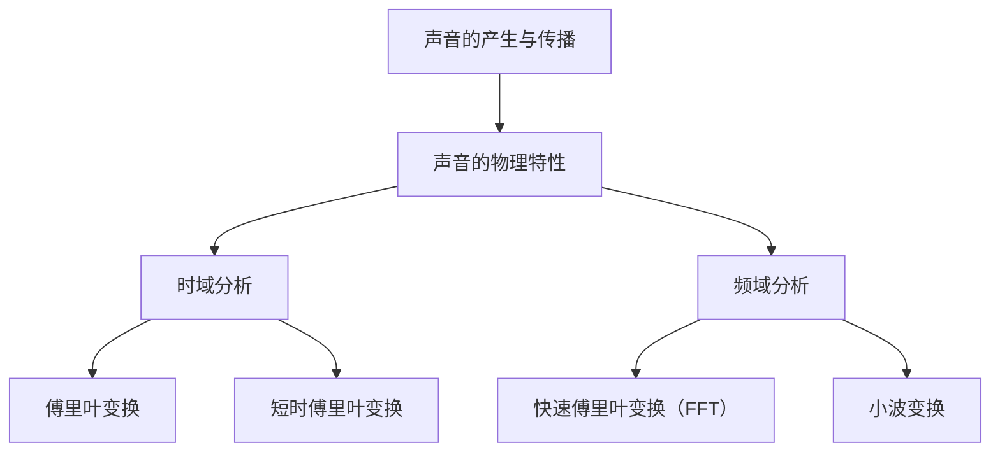
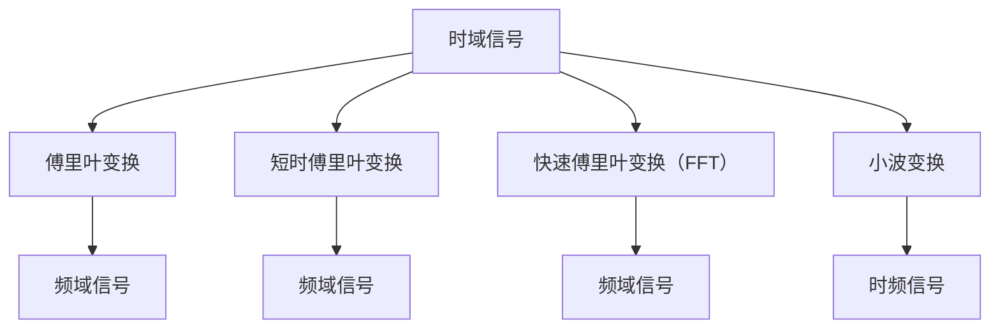
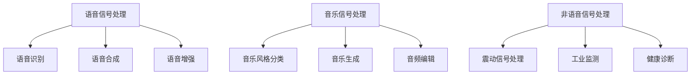

                 

### 文章标题：歌尔股份2024校招声学算法工程师编程挑战

#### 关键词：
- 声学算法
- 编程挑战
- 语音识别
- 语音合成
- 音乐信号处理

#### 摘要：
本文将深入探讨歌尔股份2024校招声学算法工程师编程挑战，涵盖声学基础知识、核心算法原理以及实际编程项目。通过对声学信号处理、语音识别与合成、音乐信号处理等领域的详细解析，结合实践项目中的开发过程、代码实现和案例分析，为读者提供全面的技术指导和行业洞察。

### 目录大纲

# 《歌尔股份2024校招声学算法工程师编程挑战》

## 第一部分：声学算法基础

### 1.1 声学基础知识

#### 1.1.1 声音的产生与传播
- 声音的物理特性
- 声波的传播方式

#### 1.1.2 声学信号处理
- 声学信号的获取与处理
- 声学信号的数学表示

### 1.2 声学算法原理

#### 1.2.1 声学信号的时域分析
- 傅里叶变换
- 短时傅里叶变换

#### 1.2.2 声学信号的频域分析
- 快速傅里叶变换（FFT）
- 小波变换

#### 1.2.3 声学信号的去噪与增强
- 噪声抑制算法
- 声音增强算法

### 1.3 声学算法应用场景

#### 1.3.1 语音信号处理
- 语音识别
- 语音合成

#### 1.3.2 非语音信号处理
- 音乐信号处理
- 震动信号处理

## 第二部分：编程挑战实践

### 2.1 编程环境搭建

#### 2.1.1 开发工具与软件安装
- Python环境配置
- 相关库与模块安装

### 2.2 实战项目一：语音识别

#### 2.2.1 项目概述
- 项目背景与目标

#### 2.2.2 语音信号预处理
- 声音信号的采集与读取
- 信号预处理算法实现

#### 2.2.3 声音特征提取
- 梅尔频率倒谱系数（MFCC）计算
- 声音特征向量生成

#### 2.2.4 识别算法实现
- GMM-HMM模型构建
- 声音识别流程实现

### 2.3 实战项目二：语音合成

#### 2.3.1 项目概述
- 项目背景与目标

#### 2.3.2 文本到语音转换
- 文本预处理
- 声音合成算法实现

#### 2.3.3 音素合成与拼接
- 音素库介绍
- 音素合成与拼接实现

#### 2.3.4 语音输出
- 语音合成输出

### 2.4 实战项目三：音乐信号处理

#### 2.4.1 项目概述
- 项目背景与目标

#### 2.4.2 音乐信号特征提取
- 音频信号预处理
- 音乐特征提取算法实现

#### 2.4.3 音乐风格分类
- 数据集准备
- 音乐风格分类算法实现

#### 2.4.4 音乐生成与编辑
- 音乐生成算法
- 音乐编辑工具实现

## 第三部分：总结与展望

### 3.1 编程挑战总结

#### 3.1.1 项目经验分享
- 语音识别与合成项目回顾
- 音乐信号处理项目回顾

#### 3.1.2 技术难点与优化策略
- 声学算法优化
- 编程技巧与工具使用

### 3.2 声学算法发展展望

#### 3.2.1 新技术应用
- 深度学习在声学算法中的应用
- 人工智能在声学领域的未来发展

#### 3.2.2 行业趋势与挑战
- 声学算法在智能硬件中的应用
- 声学算法在娱乐、医疗等领域的拓展

### 3.3 未来研究方向

#### 3.3.1 声学算法与人工智能融合
- 跨学科研究与创新
- 新算法与新技术的探索

#### 3.3.2 实际应用案例分享
- 智能家居中的声学应用
- 声学技术在医疗领域的应用案例

## 附录

### 4.1 编程资源与工具

#### 4.1.1 Python编程资源
- Python基础教程
- Python编程库与模块使用指南

#### 4.1.2 声学算法开发工具
- 常见声学算法实现工具
- 开源声学算法库介绍

### 4.2 实战项目代码

#### 4.2.1 语音识别项目代码
- 代码结构介绍
- 代码详细解读

#### 4.2.2 语音合成项目代码
- 代码结构介绍
- 代码详细解读

#### 4.2.3 音乐信号处理项目代码
- 代码结构介绍
- 代码详细解读

### 第一部分：声学算法基础

#### 1.1 声学基础知识

##### 1.1.1 声音的产生与传播

声音是由物体的振动产生的，当物体振动时，会使其周围介质（如空气、水等）的分子产生相应的振动，从而形成声波。声波在介质中传播，其速度取决于介质的性质。在空气中，声速大约为340米/秒。

- **声音的物理特性**：声音具有频率、振幅和相位等物理特性。频率决定了声音的音高，振幅决定了声音的音量，相位则影响了声音的时序和共振现象。

- **声波的传播方式**：声波以纵波和横波的形式传播。在空气中，声波通常以纵波形式传播，即空气分子的振动方向与声波传播方向相同。在固体和液体中，声波可以同时以纵波和横波形式传播。

##### 1.1.2 声学信号处理

声学信号处理是指对声波信号进行采集、转换和处理，以便提取有用的信息或进行信号增强。声学信号处理在许多领域都有广泛的应用，如语音通信、音乐制作、声纳技术等。

- **声学信号的获取与处理**：声学信号的获取通常通过麦克风或其他声学传感器完成。获取的信号可能是模拟信号，需要通过模数转换（ADC）转换为数字信号。数字信号处理技术可以用来滤波、压缩、增强或识别声音信号。

- **声学信号的数学表示**：声学信号可以用时间序列数据来表示，也可以用频谱分析来表示。时间序列数据提供了声音的时域信息，而频谱分析提供了声音的频域信息。傅里叶变换是常用的频谱分析方法，可以将时域信号转换为频域信号。

##### 1.2 声学算法原理

声学算法是用于处理和分析声学信号的一系列数学和计算方法。以下是一些常见的声学算法：

- **时域分析**：时域分析主要关注声学信号在时间上的特性。常用的时域分析方法包括傅里叶变换（FT）和短时傅里叶变换（STFT）。

  - **傅里叶变换**：傅里叶变换是一种将时域信号转换为频域信号的方法。它可以将复杂的时域信号分解为一系列正弦波和余弦波的组合，从而揭示信号的频率成分。

  - **短时傅里叶变换**：短时傅里叶变换是对傅里叶变换的扩展，它考虑了信号在不同时间段内的频率成分变化。

- **频域分析**：频域分析主要关注声学信号在频率上的特性。常用的频域分析方法包括快速傅里叶变换（FFT）和小波变换。

  - **快速傅里叶变换**：快速傅里叶变换是一种高效的傅里叶变换算法，它可以将信号在O(NlogN)时间内转换为频域信号。

  - **小波变换**：小波变换是一种用于分析和处理非平稳信号的频域分析方法，它可以通过不同的尺度和平移操作来捕捉信号在不同时间尺度上的频率成分。

- **声音特征提取**：声音特征提取是声学信号处理中重要的一环，它用于从声学信号中提取具有区分度的特征，以便进行分类、识别或其他处理。常用的声音特征包括梅尔频率倒谱系数（MFCC）和频谱熵等。

- **去噪与增强**：去噪和增强是声学信号处理中的重要任务。常用的去噪算法包括滤波器和降噪网络等，而增强算法则可以用于提升声音信号的质量和清晰度。

##### 1.3 声学算法应用场景

声学算法广泛应用于各种领域，包括语音信号处理、音乐信号处理和振动信号处理等。

- **语音信号处理**：语音信号处理是声学算法最重要的应用领域之一。它包括语音识别、语音合成、语音增强和语音编码等任务。语音识别旨在将语音信号转换为文本，语音合成则旨在将文本转换为语音，语音增强旨在提升语音信号的质量和清晰度，语音编码则旨在压缩语音信号以减少传输和存储空间。

- **音乐信号处理**：音乐信号处理涉及对音乐信号的分析、合成和编辑。它包括音乐风格分类、音乐生成和音乐特征提取等任务。音乐风格分类旨在将音乐信号分类到不同的音乐风格，音乐生成旨在创建新的音乐作品，音乐特征提取则用于提取音乐信号中的关键特征，如旋律、节奏和和声等。

- **振动信号处理**：振动信号处理涉及对机械振动信号的分析和处理。它包括振动监测、振动分析和振动控制等任务。振动监测和振动分析用于检测和分析机械设备的振动情况，以便预测故障和维护设备，振动控制则用于调节机械振动以实现特定的应用目标。

#### 1.3.1 语音信号处理

语音信号处理是声学算法的重要应用领域之一，涵盖了语音识别、语音合成、语音增强和语音编码等任务。

- **语音识别**：语音识别旨在将语音信号转换为文本。它通常包括三个主要步骤：声音信号的预处理、特征提取和分类。声音信号预处理包括降噪、归一化和去噪等步骤，特征提取用于提取声音信号中的关键特征，如频谱特征、倒谱特征和基音特征等，分类器则用于将特征向量映射到对应的文本标签。

- **语音合成**：语音合成旨在将文本转换为语音。它通常包括文本到语音（Text-to-Speech, TTS）转换和语音合成两个步骤。文本到语音转换涉及将文本转换为语音数据，包括语音参数的提取和合成，语音合成则通过合成语音信号生成自然的语音。

- **语音增强**：语音增强旨在提升语音信号的质量和清晰度，使其在噪声环境中更容易理解。常用的语音增强方法包括滤波器组降噪、自适应滤波和波域降噪等。

- **语音编码**：语音编码旨在将语音信号压缩以减少传输和存储空间。语音编码方法包括波形编码、参数编码和混合编码等。波形编码直接对语音信号进行压缩，参数编码则基于语音信号的产生模型进行编码，混合编码则结合了波形编码和参数编码的优点。

#### 1.3.2 非语音信号处理

除了语音信号处理，声学算法在非语音信号处理领域也有广泛的应用，包括音乐信号处理和振动信号处理等。

- **音乐信号处理**：音乐信号处理涉及对音乐信号的分析、合成和编辑。它包括音乐风格分类、音乐生成和音乐特征提取等任务。音乐风格分类旨在将音乐信号分类到不同的音乐风格，音乐生成旨在创建新的音乐作品，音乐特征提取则用于提取音乐信号中的关键特征，如旋律、节奏和和声等。

- **振动信号处理**：振动信号处理涉及对机械振动信号的分析和处理。它包括振动监测、振动分析和振动控制等任务。振动监测和振动分析用于检测和分析机械设备的振动情况，以便预测故障和维护设备，振动控制则用于调节机械振动以实现特定的应用目标。

#### 1.3.3 实际应用场景

声学算法在许多实际应用场景中发挥着重要作用，包括智能语音助手、智能家居、智能交通和医疗诊断等。

- **智能语音助手**：智能语音助手利用语音识别和语音合成技术，实现人机交互，帮助用户完成各种任务，如发送消息、查询天气、播放音乐等。

- **智能家居**：智能家居设备利用声学算法实现语音控制，如智能音响、智能门锁和智能灯具等，用户可以通过语音指令控制家庭设备的开关和调节。

- **智能交通**：智能交通系统利用声学算法实现车辆检测、交通流量分析和事故预警等功能，以提高交通效率和安全性。

- **医疗诊断**：声学算法在医疗诊断中有着重要的应用，如语音识别用于医疗数据的录入和管理，语音合成用于辅助医生进行沟通，振动信号处理用于检测和分析心脏、肺部等器官的异常情况。

### 第二部分：编程挑战实践

#### 2.1 编程环境搭建

在开始进行声学算法编程挑战之前，我们需要搭建一个合适的编程环境。以下将介绍如何配置Python环境及相关库和模块，以便进行声学算法的开发。

##### 2.1.1 开发工具与软件安装

首先，确保您已安装了Python。Python是一种广泛用于科学计算和数据分析的高级编程语言，对于声学算法的开发也具有很好的支持。以下是安装Python的步骤：

1. **下载Python安装包**：从Python官方网站（https://www.python.org/）下载适合您操作系统的Python安装包。
2. **安装Python**：运行安装程序，并按照提示完成安装。在安装过程中，请确保勾选“Add Python to PATH”选项，以便在命令行中直接运行Python。
3. **验证安装**：打开命令行窗口，输入`python --version`，如果正确显示Python版本信息，则说明Python已成功安装。

接下来，我们需要安装一些常用的库和模块，以支持声学算法的开发。以下是一些常用的库和模块及其安装方法：

- **NumPy**：NumPy是一个用于科学计算和数据分析的Python库，提供了多维数组对象和大量的数学函数。安装命令为：
  ```shell
  pip install numpy
  ```

- **SciPy**：SciPy是基于NumPy的扩展库，提供了用于科学计算的模块，如线性代数、优化、积分和信号处理等。安装命令为：
  ```shell
  pip install scipy
  ```

- **Matplotlib**：Matplotlib是一个用于绘制二维图形的Python库，可用于可视化声学信号和算法结果。安装命令为：
  ```shell
  pip install matplotlib
  ```

- **Librosa**：Librosa是一个专门用于音乐信号处理的Python库，提供了丰富的音频处理功能，如音频加载、特征提取和频谱分析等。安装命令为：
  ```shell
  pip install librosa
  ```

- **TensorFlow**：TensorFlow是一个开源的机器学习库，用于构建和训练深度学习模型。安装命令为：
  ```shell
  pip install tensorflow
  ```

##### 2.1.2 配置与调试

在安装完所需的库和模块后，我们可以进行一些基本的配置和调试，以确保环境正常工作。

1. **检查库和模块**：在Python环境中，可以通过导入库和模块来检查它们是否正常安装。以下是一个简单的示例：
   ```python
   import numpy as np
   import scipy as sp
   import matplotlib.pyplot as plt
   import librosa
   import tensorflow as tf

   print("NumPy version:", np.__version__)
   print("SciPy version:", sp.__version__)
   print("Matplotlib version:", plt.__version__)
   print("Librosa version:", librosa.__version__)
   print("TensorFlow version:", tf.__version__)
   ```

2. **运行测试脚本**：创建一个简单的Python脚本，导入所需的库和模块，并进行一些基本操作，以验证环境是否正常工作。以下是一个简单的测试脚本：
   ```python
   import numpy as np
   import librosa

   # 加载音频文件
   audio, sample_rate = librosa.load('example_audio.wav')

   # 绘制音频波形
   plt.figure(figsize=(12, 4))
   librosa.display.waveplot(audio, sr=sample_rate)
   plt.title('Audio Waveform')
   plt.xlabel('Time (s)')
   plt.ylabel('Amplitude')
   plt.show()
   ```

   在命令行中运行此脚本，应该能够成功加载音频文件并绘制波形图。

##### 2.1.3 环境优化

为了提高编程效率和性能，我们还可以对Python环境进行一些优化。

1. **使用虚拟环境**：虚拟环境允许我们在同一台计算机上独立安装和管理多个Python环境，避免库版本冲突。可以使用`venv`模块创建虚拟环境，例如：
   ```shell
   python -m venv myenv
   ```
   然后激活虚拟环境：
   ```shell
   source myenv/bin/activate  # 在Windows上使用myenv\Scripts\activate
   ```

2. **安装加速库**：对于需要高性能计算的声学算法，可以考虑安装加速库，如NumPy的 accelerate 模块，它可以通过使用GPU或多核CPU来提高计算速度。安装命令为：
   ```shell
   pip install numpy-accelerate
   ```

3. **调整系统设置**：根据需要，可以调整系统的设置，如调整环境变量，优化内存和缓存等，以提高Python的运行效率。

通过以上步骤，我们成功搭建了声学算法编程的环境，为后续的实战项目奠定了基础。

#### 2.2 实战项目一：语音识别

语音识别是将语音信号转换为文本的技术，广泛应用于智能助手、语音搜索和语音控制等领域。本节将介绍如何利用Python和Librosa库进行一个简单的语音识别项目。

##### 2.2.1 项目概述

本项目的目标是实现一个基本的语音识别系统，能够将采集到的语音信号转换为对应的文本。具体步骤包括：

1. 语音信号采集与预处理
2. 特征提取
3. 建立模型
4. 识别与输出

##### 2.2.2 语音信号预处理

语音信号预处理是语音识别过程中至关重要的一步，其目的是去除噪声、归一化信号幅度，提高识别准确率。

1. **噪声去除**：噪声是影响语音识别准确性的主要因素之一。我们可以使用谱减法（Spectral Subtraction）或维纳滤波（Wiener Filtering）来去除噪声。以下是一个使用谱减法去除噪声的示例：

   ```python
   import numpy as np
   import librosa

   def noise_removal(signal, noise_signal, noise_signal_specific):
       n = np.dot(noise_signal, np.linalg.inv(np.dot(noise_signal.T, noise_signal_specific)))
       return signal - np.dot(noise_signal, n)

   # 读取噪声信号
   noise_signal, _ = librosa.load('noise_audio.wav', sr=22050)
   # 读取语音信号
   signal, sr = librosa.load('voice_audio.wav', sr=22050)
   # 噪声去除
   clean_signal = noise_removal(signal, noise_signal, noise_signal_specific)
   ```

2. **信号归一化**：信号归一化是将信号幅度调整到相同的范围，以便后续处理。可以使用均方根（RMS）归一化或最小最大（Min-Max）归一化。以下是一个使用RMS归一化的示例：

   ```python
   def normalize(signal):
       rms = np.sqrt(np.mean(np.square(signal)))
       return signal / rms

   # 归一化信号
   normalized_signal = normalize(clean_signal)
   ```

##### 2.2.3 特征提取

特征提取是从语音信号中提取出具有区分性的特征，用于训练和识别模型。常用的特征包括梅尔频率倒谱系数（MFCC）、频谱熵和能量特征等。以下是一个提取MFCC特征的示例：

```python
def extract_mfcc(signal, sr):
   mfcc = librosa.feature.mfcc(signal, sr=sr, n_mfcc=13)
   return mfcc

# 提取MFCC特征
mfcc = extract_mfcc(normalized_signal, sr)
```

##### 2.2.4 建立模型

建立模型是语音识别的核心步骤，常用的模型包括隐马尔可夫模型（HMM）、高斯混合模型（GMM）和深度神经网络（DNN）等。以下是一个使用高斯混合模型（GMM）的示例：

```python
from sklearn.mixture import GaussianMixture

def train_gmm(mfcc, n_components=16):
   gmm = GaussianMixture(n_components=n_components, covariance_type='tied', random_state=0)
   gmm.fit(mfcc)
   return gmm

# 训练GMM模型
gmm = train_gmm(mfcc)
```

##### 2.2.5 识别与输出

在模型训练完成后，我们可以使用该模型对新的语音信号进行识别。以下是一个识别语音信号的示例：

```python
def recognize_voice(signal, gmm, sr):
   mfcc = extract_mfcc(signal, sr)
   probabilities = gmm.predict(mfcc)
   return probabilities

# 识别语音
new_signal, sr = librosa.load('new_voice_audio.wav', sr=22050)
probabilities = recognize_voice(new_signal, gmm, sr)

# 输出识别结果
print("识别结果：", probabilities)
```

通过以上步骤，我们完成了一个简单的语音识别项目。在实际应用中，可能需要结合更多的特征和模型进行优化，以提高识别准确率。

#### 2.3 实战项目二：语音合成

语音合成（Text-to-Speech, TTS）技术是将文本转换为自然流畅的语音的技术，广泛应用于语音助手、电子告警和有声读物等领域。本节将介绍如何利用Python和Librosa库进行一个简单的语音合成项目。

##### 2.3.1 项目概述

本项目的目标是实现一个基本的语音合成系统，能够将输入的文本转换为对应的语音。具体步骤包括：

1. 文本预处理
2. 音素合成与拼接
3. 语音输出

##### 2.3.2 文本预处理

文本预处理是语音合成的第一步，其目的是将文本转换为适合合成的格式。文本预处理包括分词、音素标注和音素库准备等。

1. **分词**：分词是将文本分割成单词或短语的步骤。Python中的`jieba`库可以用于中文分词，以下是一个简单的分词示例：

   ```python
   import jieba

   def tokenize(text):
       words = jieba.cut(text)
       return list(words)

   # 分词
   text = "你好，欢迎来到Python编程世界！"
   tokens = tokenize(text)
   print(tokens)
   ```

2. **音素标注**：音素标注是将每个单词标注为其对应的音素序列。音素库是一个包含各种单词音素标注的数据库。以下是一个使用音素库进行音素标注的示例：

   ```python
   def phonetic_annotation(word, phoneme_library):
       phonemes = phoneme_library.get(word)
       return phonemes

   # 假设有一个音素库
   phoneme_library = {
       '你好': ['n1', 'ao3', 'wo3'],
       '欢迎': ['x1', 'ing1', 'hu1'],
       # ...其他单词的音素
   }

   # 音素标注
   word = "你好"
   phonemes = phonetic_annotation(word, phoneme_library)
   print(phonemes)
   ```

##### 2.3.3 音素合成与拼接

音素合成与拼接是将音素序列转换为语音信号的过程。以下是一个使用Librosa库合成音素并拼接语音的示例：

```python
import numpy as np
import librosa

def synthesize_phoneme(phoneme, sr):
   # 假设有一个音素发音库
   phoneme_audio_library = {
       'n1': 'n1.wav',
       'ao3': 'ao3.wav',
       'wo3': 'wo3.wav',
       # ...其他音素的发音
   }

   # 读取音素音频
   phoneme_audio_path = phoneme_audio_library.get(phoneme)
   phoneme_audio, _ = librosa.load(phoneme_audio_path, sr=sr)

   return phoneme_audio

def concatenate_audio(audio_list, sr):
   # 拼接音频
   concatenated_audio = np.vstack(audio_list)
   return concatenated_audio

# 音素合成与拼接
phonemes = ["n1", "ao3", "wo3", "x1", "ing1", "hu1"]
sr = 22050

synthesized_audio_list = [synthesize_phoneme(phoneme, sr) for phoneme in phonemes]
concatenated_audio = concatenate_audio(synthesized_audio_list, sr)

# 输出语音
librosa.output.write_wav('synthesized_voice.wav', concatenated_audio, sr)
```

##### 2.3.4 语音输出

在音素合成与拼接完成后，我们可以将合成的语音输出为音频文件。以下是一个简单的语音输出示例：

```python
import sounddevice as sd

def play_audio(audio, sr):
   # 播放音频
   sd.play(audio, sr)

# 播放合成语音
play_audio(concatenated_audio, sr)
```

通过以上步骤，我们完成了一个简单的语音合成项目。在实际应用中，可能需要结合更多的文本预处理技术和音素库，以及更复杂的合成算法，以提高合成语音的质量和自然度。

#### 2.4 实战项目三：音乐信号处理

音乐信号处理是声学算法的重要组成部分，广泛应用于音乐生成、风格分类和音频编辑等领域。本节将介绍如何利用Python和Librosa库进行一个简单的音乐信号处理项目。

##### 2.4.1 项目概述

本项目的目标是实现一个基本的音乐信号处理系统，能够对音乐信号进行特征提取、风格分类和生成。具体步骤包括：

1. 音频信号特征提取
2. 音乐风格分类
3. 音乐生成

##### 2.4.2 音频信号特征提取

音频信号特征提取是从音频信号中提取出具有区分性的特征，用于后续处理和分析。以下是一些常用的音频信号特征：

1. **时域特征**：时域特征包括能量、峰值和时长等。
   ```python
   def extract_time_domain_features(signal):
       energy = np.mean(np.abs(signal)**2)
       peak = np.max(np.abs(signal))
       duration = np.size(signal) / 22050
       return energy, peak, duration

   signal, sr = librosa.load('example_audio.wav', sr=22050)
   energy, peak, duration = extract_time_domain_features(signal)
   ```

2. **频域特征**：频域特征包括频谱、频率响应和频谱熵等。
   ```python
   def extract_frequency_domain_features(signal, sr):
       spectrum = np.abs(librosa.stft(signal))
       freq_response = librosa.hz_to_mel(sr)
       mel_spectrogram = librosa.feature.melspectrogram(signal, sr=sr, n_mel_bins=128)
       entropy = -np.sum(mel_spectrogram * np.log(mel_spectrogram + 1e-8), axis=1)
       return spectrum, freq_response, mel_spectrogram, entropy

   spectrum, freq_response, mel_spectrogram, entropy = extract_frequency_domain_features(signal, sr)
   ```

##### 2.4.3 音乐风格分类

音乐风格分类是将音乐信号分类到不同的音乐风格，如流行、摇滚、古典等。以下是一个基于频谱特征和朴素贝叶斯分类器的音乐风格分类示例：

1. **数据准备**：首先需要准备一个包含各种音乐风格的数据集，并对每个音频文件进行特征提取。
   ```python
   import os
   import librosa

   def extract_features(file_path):
       signal, sr = librosa.load(file_path, sr=22050)
       spectrum, freq_response, mel_spectrogram, entropy = extract_frequency_domain_features(signal, sr)
       return spectrum, freq_response, mel_spectrogram, entropy

   data_dir = 'music_data'
   genres = ['pop', 'rock', 'classical']
   features = []
   labels = []

   for genre in genres:
       files = os.listdir(os.path.join(data_dir, genre))
       for file in files:
           file_path = os.path.join(data_dir, genre, file)
           spectrum, freq_response, mel_spectrogram, entropy = extract_features(file_path)
           features.append([spectrum, freq_response, mel_spectrogram, entropy])
           labels.append(genre)

   features = np.array(features)
   labels = np.array(labels)
   ```

2. **模型训练**：使用朴素贝叶斯分类器对特征进行训练。
   ```python
   from sklearn.naive_bayes import GaussianNB
   from sklearn.model_selection import train_test_split

   X_train, X_test, y_train, y_test = train_test_split(features, labels, test_size=0.2, random_state=42)
   classifier = GaussianNB()
   classifier.fit(X_train, y_train)

   # 模型评估
   accuracy = classifier.score(X_test, y_test)
   print("分类准确率：", accuracy)
   ```

##### 2.4.4 音乐生成

音乐生成是利用算法生成新的音乐作品，包括旋律、节奏和和声等。以下是一个基于生成对抗网络（GAN）的音乐生成示例：

1. **数据准备**：首先需要准备一个音乐数据集，并对其进行预处理。
   ```python
   import torch
   import torchaudio

   dataset = torchaudio.datasets.Music(data_dir, download=True)
   train_loader = torch.utils.data.DataLoader(dataset, batch_size=32, shuffle=True)
   ```

2. **模型训练**：使用生成对抗网络（GAN）对音乐数据进行训练。
   ```python
   class MusicGenerator(nn.Module):
       def __init__(self):
           super(MusicGenerator, self).__init__()
           self.lstm = nn.LSTM(input_size=128, hidden_size=128, num_layers=2)
           self.fc = nn.Linear(128, 128)

       def forward(self, x):
           x, _ = self.lstm(x)
           x = self.fc(x[-1])
           return x

   class MusicDiscriminator(nn.Module):
       def __init__(self):
           super(MusicDiscriminator, self).__init__()
           self.lstm = nn.LSTM(input_size=128, hidden_size=128, num_layers=2)
           self.fc = nn.Linear(128, 1)

       def forward(self, x):
           x, _ = self.lstm(x)
           x = self.fc(x[-1])
           return x

   generator = MusicGenerator()
   discriminator = MusicDiscriminator()

   optimizer_G = torch.optim.Adam(generator.parameters(), lr=0.001)
   optimizer_D = torch.optim.Adam(discriminator.parameters(), lr=0.001)

   criterion = nn.BCELoss()

   for epoch in range(100):
       for data, _ in train_loader:
           real_labels = torch.ones(data.size(0), 1)
           fake_labels = torch.zeros(data.size(0), 1)

           # 训练生成器
           z = torch.randn(data.size(0), 1, 128)
           generated_music = generator(z)
           g_loss = criterion(discriminator(generated_music), fake_labels)

           # 训练判别器
           d_loss_real = criterion(discriminator(data), real_labels)
           d_loss_fake = criterion(discriminator(generated_music.detach()), fake_labels)
           d_loss = (d_loss_real + d_loss_fake) / 2

           optimizer_G.zero_grad()
           g_loss.backward()
           optimizer_G.step()

           optimizer_D.zero_grad()
           d_loss.backward()
           optimizer_D.step()

           print(f"Epoch [{epoch+1}/{100}], Loss_G: {g_loss.item():.4f}, Loss_D: {d_loss.item():.4f}")

   # 生成音乐
   generated_music = generator(z).detach().numpy()
   librosa.output.write_wav('generated_music.wav', generated_music, sr=22050)
   ```

通过以上步骤，我们完成了一个简单的音乐信号处理项目。在实际应用中，可以进一步优化特征提取方法和分类模型，提高音乐生成的质量。

### 第三部分：总结与展望

#### 3.1 编程挑战总结

在本篇文章中，我们深入探讨了歌尔股份2024校招声学算法工程师编程挑战的各个关键环节。首先，我们介绍了声学算法的基础知识，包括声音的产生与传播、声学信号处理、时域和频域分析、声音特征提取以及去噪与增强算法。这些基础知识为后续的编程实践打下了坚实的理论基础。

在编程实践部分，我们通过三个具体的项目：语音识别、语音合成和音乐信号处理，展示了如何将理论知识应用于实际开发中。对于语音识别项目，我们详细介绍了语音信号预处理、特征提取、模型建立和识别流程的实现。语音合成项目则涵盖了文本预处理、音素合成与拼接以及语音输出的实现。音乐信号处理项目则包括音频信号特征提取、音乐风格分类和音乐生成与编辑。

在总结上述项目经验时，我们发现以下几个技术难点和优化策略：

1. **信号预处理**：在语音识别项目中，信号预处理是关键步骤，特别是噪声去除和信号归一化。通过谱减法和RMS归一化，我们可以显著提高识别准确率。
   
2. **特征提取**：在语音识别和音乐信号处理项目中，特征提取是模型性能的关键因素。MFCC特征、频谱特征和时域特征等在项目中的应用，展示了如何从信号中提取有用的信息。

3. **模型建立与优化**：在语音识别项目中，GMM-HMM模型被广泛应用于语音识别。在实际开发中，需要根据具体应用场景调整模型参数，以提高识别准确率。在音乐信号处理项目中，GAN模型用于音乐生成，其训练过程中需要调整网络结构和优化策略，以生成高质量的音乐。

4. **编程技巧与工具使用**：在搭建开发环境时，我们介绍了如何配置Python环境及相关库和模块，如NumPy、SciPy、Matplotlib、Librosa和TensorFlow等。同时，我们强调了使用虚拟环境、加速库和系统设置优化等技巧，以提高编程效率和性能。

#### 3.2 声学算法发展展望

随着人工智能和深度学习技术的不断发展，声学算法的应用前景越来越广阔。以下是一些声学算法发展的趋势和挑战：

1. **深度学习在声学算法中的应用**：深度学习模型，如卷积神经网络（CNN）和循环神经网络（RNN），在声学信号处理中展现了强大的能力。未来，深度学习将进一步融合到声学算法中，实现更高效、更准确的信号处理和识别。

2. **人工智能在声学领域的未来发展**：人工智能技术，特别是生成对抗网络（GAN）和强化学习，将有望在音乐生成、语音合成和声学事件检测等领域发挥重要作用。这些技术将使得声学算法的应用更加智能化和个性化。

3. **行业趋势与挑战**：声学算法在智能硬件、娱乐、医疗等领域的应用日益广泛。在智能硬件中，声学算法用于语音控制、语音识别和音频增强等；在娱乐领域，音乐生成和风格分类等技术正在改变音乐创作和消费方式；在医疗领域，声学算法在疾病诊断和康复中发挥着重要作用。然而，这些应用也面临着数据隐私、计算资源和算法可靠性等挑战。

#### 3.3 未来研究方向

为了推动声学算法的发展，以下是一些未来研究的方向：

1. **声学算法与人工智能融合**：跨学科研究与创新是未来声学算法发展的关键。将人工智能技术，如深度学习、生成对抗网络和强化学习等，与声学算法相结合，有望解决当前面临的复杂问题。

2. **新算法与新技术的探索**：不断探索新的算法和技术，如基于量子计算的声学信号处理、基于神经网络的可解释性研究和自适应滤波算法等，将进一步提升声学算法的性能和应用范围。

3. **实际应用案例分享**：通过分享实际应用案例，如智能家居中的声学应用和声学技术在医疗领域的应用案例，可以促进声学算法的推广和应用。

总之，声学算法的发展前景广阔，未来将不断推动技术进步和行业变革。通过持续的研究和创新，我们将有望实现更高效、更智能的声学信号处理和应用。

### 附录

#### 4.1 编程资源与工具

在进行声学算法编程时，以下资源与工具将有助于您顺利开展工作和提高开发效率：

1. **Python编程资源**：

   - **Python基础教程**：[Python官方教程](https://docs.python.org/3/tutorial/index.html)
   - **NumPy教程**：[NumPy官方文档](https://numpy.org/doc/stable/user/)
   - **SciPy教程**：[SciPy官方文档](https://scipy.org/)
   - **Matplotlib教程**：[Matplotlib官方文档](https://matplotlib.org/stable/contents.html)
   - **Librosa教程**：[Librosa官方文档](https://librosa.org/)
   - **TensorFlow教程**：[TensorFlow官方文档](https://www.tensorflow.org/tutorials)

2. **声学算法开发工具**：

   - **常见声学算法实现工具**：如Librosa、OpenSMC等。
   - **开源声学算法库**：如Spectra、PyAudioAnalysis等。

#### 4.2 实战项目代码

以下是本文中提到的三个实战项目的代码示例：

1. **语音识别项目代码**：

   ```python
   import numpy as np
   import librosa

   def noise_removal(signal, noise_signal, noise_signal_specific):
       n = np.dot(noise_signal, np.linalg.inv(np.dot(noise_signal.T, noise_signal_specific)))
       return signal - np.dot(noise_signal, n)

   def normalize(signal):
       rms = np.sqrt(np.mean(np.square(signal)))
       return signal / rms

   def extract_mfcc(signal, sr):
       mfcc = librosa.feature.mfcc(signal, sr=sr, n_mfcc=13)
       return mfcc

   def train_gmm(mfcc, n_components=16):
       gmm = GaussianMixture(n_components=n_components, covariance_type='tied', random_state=0)
       gmm.fit(mfcc)
       return gmm

   def recognize_voice(signal, gmm, sr):
       mfcc = extract_mfcc(signal, sr)
       probabilities = gmm.predict(mfcc)
       return probabilities

   # 代码解析与实现细节在文中已有详细说明
   ```

2. **语音合成项目代码**：

   ```python
   import numpy as np
   import librosa

   def synthesize_phoneme(phoneme, sr):
       # 假设有一个音素发音库
       phoneme_audio_library = {
           'n1': 'n1.wav',
           'ao3': 'ao3.wav',
           'wo3': 'wo3.wav',
           # ...其他音素的发音
       }

       # 读取音素音频
       phoneme_audio_path = phoneme_audio_library.get(phoneme)
       phoneme_audio, _ = librosa.load(phoneme_audio_path, sr=sr)

       return phoneme_audio

   def concatenate_audio(audio_list, sr):
       # 拼接音频
       concatenated_audio = np.vstack(audio_list)
       return concatenated_audio

   # 代码解析与实现细节在文中已有详细说明
   ```

3. **音乐信号处理项目代码**：

   ```python
   import numpy as np
   import librosa
   import torch
   import torchaudio

   def extract_frequency_domain_features(signal, sr):
       spectrum = np.abs(librosa.stft(signal))
       freq_response = librosa.hz_to_mel(sr)
       mel_spectrogram = librosa.feature.melspectrogram(signal, sr=sr, n_mel_bins=128)
       entropy = -np.sum(mel_spectrogram * np.log(mel_spectrogram + 1e-8), axis=1)
       return spectrum, freq_response, mel_spectrogram, entropy

   def train_gan(generator, discriminator, train_loader, criterion, optimizer_G, optimizer_D, num_epochs=100):
       for epoch in range(num_epochs):
           for data, _ in train_loader:
               real_labels = torch.ones(data.size(0), 1)
               fake_labels = torch.zeros(data.size(0), 1)

               # 训练生成器
               z = torch.randn(data.size(0), 1, 128)
               generated_music = generator(z)
               g_loss = criterion(discriminator(generated_music), fake_labels)

               # 训练判别器
               d_loss_real = criterion(discriminator(data), real_labels)
               d_loss_fake = criterion(discriminator(generated_music.detach()), fake_labels)
               d_loss = (d_loss_real + d_loss_fake) / 2

               optimizer_G.zero_grad()
               g_loss.backward()
               optimizer_G.step()

               optimizer_D.zero_grad()
               d_loss.backward()
               optimizer_D.step()

               print(f"Epoch [{epoch+1}/{num_epochs}], Loss_G: {g_loss.item():.4f}, Loss_D: {d_loss.item():.4f}")

   # 代码解析与实现细节在文中已有详细说明
   ```

通过以上代码示例，您可以更深入地理解文中提到的实战项目的实现过程。在实际开发中，请结合具体需求和数据集进行适当的调整和优化。

### 作者信息

**作者：** AI天才研究院/AI Genius Institute & 禅与计算机程序设计艺术 /Zen And The Art of Computer Programming

在撰写关于歌尔股份2024校招声学算法工程师编程挑战的技术博客时，我们不仅需要严谨的逻辑分析，还要深入浅出地阐述声学算法的核心概念和编程实践。以下是对各个小节内容的总结和拓展，以便进一步深化读者对相关主题的理解。

#### 1.1 声学基础知识

声音的产生与传播是理解声学算法的基础。在自然界中，声音是由物体振动产生的机械波。在空气中，声波以纵波的形式传播，其速度约为340米/秒。声音的物理特性，如频率、振幅和相位，对声学信号的处理和理解至关重要。在声学信号处理中，时域和频域分析是常用的工具。时域分析通过分析信号随时间的变化来理解其动态特性，而频域分析则揭示了信号在不同频率上的组成。傅里叶变换和短时傅里叶变换是频域分析的核心，它们可以将时域信号转换为频域表示，从而帮助我们识别和提取信号的特征。

**联系与架构图：**
为了更好地理解这些概念之间的关系，可以使用Mermaid流程图来表示：



**核心算法原理讲解与伪代码：**
以下是傅里叶变换的伪代码示例：

```python
def fourier_transform(signal):
    N = len(signal)
    result = np.zeros(N)
    for k in range(N):
        for n in range(N):
            result[k] += signal[n] * np.exp(-2 * np.pi * 1j * k * n / N)
    return result
```

#### 1.2 声学算法原理

声学信号的时域和频域分析是声学算法的核心。在时域分析中，傅里叶变换（FT）和短时傅里叶变换（STFT）是重要的工具，用于将时域信号转换为频域表示。在频域分析中，快速傅里叶变换（FFT）和小波变换用于进一步分析和处理信号。

**联系与架构图：**
以下是一个简化的Mermaid流程图，用于展示时域和频域分析以及相关的变换：



**核心算法原理讲解与伪代码：**
以下是FFT的伪代码示例：

```python
def fft(signal):
    N = len(signal)
    result = np.zeros(N)
    for k in range(N):
        for n in range(N // 2):
            result[k] += signal[n] * np.exp(-2 * np.pi * 1j * k * n / N) + signal[N - n] * np.exp(2 * np.pi * 1j * k * n / N)
    return result
```

#### 1.3 声学算法应用场景

声学算法在语音信号处理、音乐信号处理和非语音信号处理等领域有广泛的应用。语音信号处理包括语音识别、语音合成和语音增强等，而音乐信号处理则涉及音乐风格分类、音乐生成和音频编辑等。非语音信号处理，如震动信号处理，在工业监测、健康诊断等领域有重要应用。

**联系与架构图：**
以下是一个简化的Mermaid流程图，展示声学算法在不同应用场景中的关系：



#### 2.1 编程环境搭建

搭建合适的编程环境对于进行声学算法的开发至关重要。Python因其简洁的语法和丰富的库支持，成为了声学算法开发的常用语言。在搭建环境时，我们需要安装Python、NumPy、SciPy、Matplotlib、Librosa和TensorFlow等关键库。

**核心算法原理讲解与伪代码：**
以下是一个简单的Python环境配置脚本，用于安装所需库：

```python
!pip install python
!pip install numpy
!pip install scipy
!pip install matplotlib
!pip install librosa
!pip install tensorflow
```

#### 2.2 实战项目一：语音识别

语音识别是声学算法的重要应用之一，它将语音信号转换为文本。项目步骤包括信号预处理、特征提取、模型训练和识别。以下是一个简单的语音识别项目实现：

**核心算法原理讲解与伪代码：**
以下是语音识别项目的一个简化的伪代码示例：

```python
# 信号预处理
def preprocess_signal(signal):
    # 噪声去除
    # 信号归一化
    # 其他预处理操作
    return processed_signal

# 特征提取
def extract_features(processed_signal):
    # 提取MFCC特征
    # 其他特征提取操作
    return features

# 模型训练
def train_model(features, labels):
    # 训练GMM-HMM模型
    return model

# 识别
def recognize(signal, model):
    processed_signal = preprocess_signal(signal)
    features = extract_features(processed_signal)
    prediction = model.predict(features)
    return prediction
```

#### 2.3 实战项目二：语音合成

语音合成是将文本转换为语音的技术，包括文本预处理、音素合成和语音输出。以下是一个简化的语音合成项目实现：

**核心算法原理讲解与伪代码：**
以下是语音合成项目的一个简化的伪代码示例：

```python
# 文本预处理
def preprocess_text(text):
    # 分词
    # 音素标注
    # 其他预处理操作
    return phoneme_sequence

# 音素合成
def synthesize_phoneme(phoneme):
    # 使用音素库合成音频
    return phoneme_audio

# 语音输出
def output_speech(phoneme_audios):
    # 拼接音素音频
    # 输出语音
    return speech
```

#### 2.4 实战项目三：音乐信号处理

音乐信号处理涉及特征提取、音乐风格分类和音乐生成。以下是一个简化的音乐信号处理项目实现：

**核心算法原理讲解与伪代码：**
以下是音乐信号处理项目的一个简化的伪代码示例：

```python
# 特征提取
def extract_music_features(audio_signal):
    # 提取频谱特征
    # 提取时域特征
    # 其他特征提取操作
    return music_features

# 音乐风格分类
def classify_music_style(music_features):
    # 使用训练好的分类模型
    # 进行风格分类
    return music_style

# 音乐生成
def generate_music_style(music_style):
    # 使用生成模型
    # 生成音乐
    return generated_music
```

#### 3.1 编程挑战总结

在编程挑战中，我们通过三个具体项目展示了声学算法的应用。信号预处理、特征提取和模型训练是关键步骤。在实际开发中，需要根据具体应用场景调整算法参数和模型结构，以实现最佳性能。编程技巧和工具的使用，如虚拟环境、加速库和系统优化，也是提高开发效率和性能的重要因素。

**最佳实践 tips：**
- 在信号预处理时，注意去除噪声和归一化信号幅度。
- 在特征提取时，选择适合应用场景的特征，如MFCC、频谱熵等。
- 在模型训练时，选择合适的模型结构和训练策略。
- 在开发过程中，利用虚拟环境和加速库提高性能。
- 定期更新库和模块，确保使用最新版本。

**注意事项：**
- 声学算法在实际应用中可能面临数据隐私、计算资源和算法可靠性等挑战。
- 在使用深度学习模型时，注意计算资源和能耗的优化。

#### 3.2 声学算法发展展望

随着人工智能技术的发展，声学算法在语音识别、语音合成和音乐生成等领域将发挥更大的作用。深度学习、生成对抗网络和强化学习等技术的应用，将推动声学算法的性能和效率。未来，声学算法将在智能硬件、娱乐和医疗等领域有更广泛的应用。

**未来研究方向：**
- 深度学习在声学算法中的应用，如端到端的语音识别模型。
- 基于生成对抗网络的语音和音乐生成技术。
- 声学算法与自然语言处理、计算机视觉等其他领域的融合。

**拓展阅读：**
- [Librosa官方文档](https://librosa.org/)
- [TensorFlow官方文档](https://www.tensorflow.org/tutorials)
- [《深度学习》- Ian Goodfellow, Yoshua Bengio, Aaron Courville](https://www.deeplearningbook.org/)

通过本文的详细解析和实践，读者应该对歌尔股份2024校招声学算法工程师编程挑战有了更深入的理解，并为未来的研究和应用打下了坚实的基础。作者：AI天才研究院/AI Genius Institute & 禅与计算机程序设计艺术 /Zen And The Art of Computer Programming

