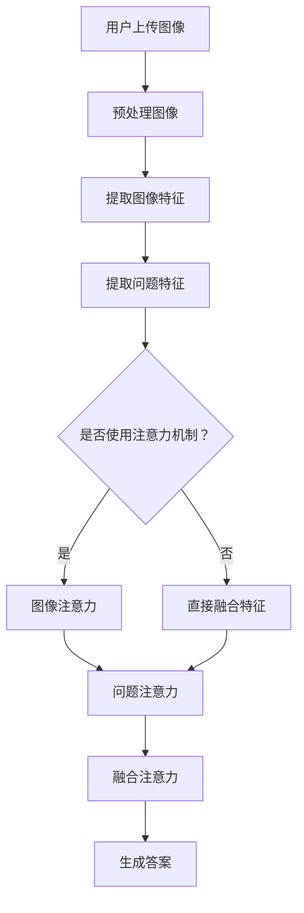
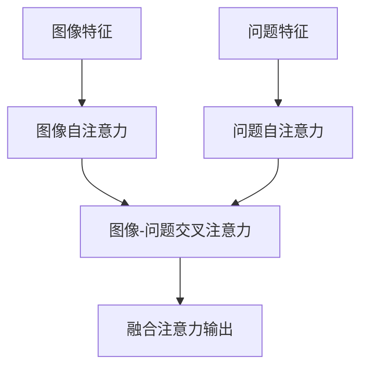
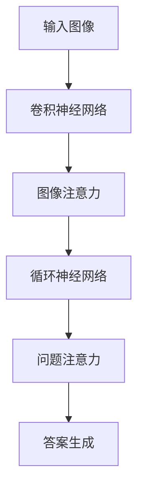

                 

### 文章标题

# 《注意力机制在视觉问答系统中的创新应用》

### 关键词

- 视觉问答系统
- 注意力机制
- 卷积神经网络（CNN）
- 递归神经网络（RNN）
- 多层注意力机制
- 数学模型

### 摘要

视觉问答系统（Visual Question Answering, VQA）是一种结合计算机视觉与自然语言处理的技术，旨在使计算机能够理解视觉内容并回答与图像相关的问题。近年来，注意力机制（Attention Mechanism）在人工智能领域取得了显著进展，并在提升模型性能方面发挥了关键作用。本文将探讨注意力机制在视觉问答系统中的创新应用，从基础概念到实际应用，逐步分析其原理、算法、数学模型以及未来发展趋势。通过本文的深入讲解，读者将全面了解注意力机制在视觉问答系统中的重要性及其潜在应用价值。

### 第一部分：视觉问答系统基础

#### 第1章：视觉问答系统概述

##### 1.1 视觉问答系统的定义与发展

视觉问答系统（Visual Question Answering, VQA）是一种人工智能技术，旨在让计算机理解和回答与图像相关的问题。VQA系统通常由三个主要部分组成：图像输入、自然语言问题输入和答案生成。其基本流程如下：

1. **图像输入**：用户通过图像输入界面上传或输入一张图片。
2. **问题输入**：用户输入一个与图像相关的问题，问题可以是用自然语言表述的。
3. **答案生成**：VQA系统解析图像内容和问题，通过深度学习算法生成相应的答案。

VQA系统的发展可以追溯到20世纪90年代，当时研究人员开始尝试将图像识别与自然语言处理相结合。随着计算机硬件和深度学习技术的进步，VQA系统逐渐成为一个热点研究领域。近年来，VQA系统在许多实际应用场景中取得了显著成果，如智能监控、图像检索、医学影像分析等。

##### 1.2 视觉问答系统的应用场景

视觉问答系统具有广泛的应用场景，以下是其中一些典型的应用：

1. **智能监控**：在智能监控系统中，VQA系统可以实时分析监控视频，识别异常行为并生成报警信息。
2. **图像检索**：用户可以通过输入问题检索与问题相关的图像，提高图像检索的准确性和用户体验。
3. **医学影像分析**：在医学影像领域，VQA系统可以帮助医生识别和诊断疾病，如肺癌、乳腺癌等。
4. **教育辅助**：在教育场景中，VQA系统可以为学生提供个性化的学习资源和辅导。
5. **智能家居**：在智能家居系统中，VQA系统可以理解用户对家庭环境的询问，提供相应的操作指令。

##### 1.3 视觉问答系统的挑战与机遇

尽管VQA系统在许多应用场景中取得了显著成果，但仍面临着一系列挑战：

1. **多模态信息融合**：VQA系统需要处理图像和自然语言问题两个模态的信息，如何有效地融合这些信息是当前研究的一个难点。
2. **领域适应性**：不同的应用场景需要VQA系统具备不同的领域知识，如何设计出具有良好领域适应性的模型是另一个挑战。
3. **可解释性**：当前许多VQA模型是黑盒模型，其决策过程缺乏可解释性，如何提高模型的可解释性是一个重要课题。
4. **计算资源**：VQA系统通常需要大量的计算资源，特别是在处理高分辨率图像时，如何优化模型结构和算法以提高计算效率是一个重要问题。

然而，VQA系统也面临着许多机遇：

1. **跨领域应用**：随着技术的不断进步，VQA系统有望在更多领域得到应用，如自动驾驶、人机交互等。
2. **数据集共享**：越来越多的数据集被发布和共享，为研究人员提供了丰富的实验数据，有助于推动VQA技术的发展。
3. **硬件加速**：随着深度学习专用硬件的发展，如GPU、TPU等，VQA模型的训练和推理速度将得到显著提升。
4. **多模态交互**：随着多模态交互技术的发展，VQA系统有望在更复杂的场景中发挥作用，如语音识别与视觉问答的融合。

总之，视觉问答系统作为一种新兴的人工智能技术，具有广泛的应用前景和重要的研究价值。通过不断克服挑战和抓住机遇，VQA系统将有望在未来的发展中取得更加显著的成果。

#### 第2章：视觉基础

##### 2.1 图像处理基础

图像处理是视觉问答系统（VQA）的重要组成部分，其主要目的是通过一系列算法对图像进行增强、滤波、分割和识别等操作，以提取出有用的信息。以下是图像处理的一些基础概念：

1. **像素**：图像是由像素组成的，每个像素包含颜色和亮度信息。
2. **灰度图像**：灰度图像的每个像素只包含亮度信息，通常用一个数值表示。
3. **彩色图像**：彩色图像的每个像素包含红、绿、蓝三个颜色通道的亮度信息。
4. **图像分辨率**：图像分辨率是指图像中像素的数量，通常用像素宽度和高度表示。
5. **图像滤波**：图像滤波是用于去除图像噪声、平滑图像或突出图像特征的算法，如高斯滤波、中值滤波等。
6. **图像边缘检测**：边缘检测是用于检测图像中亮度变化明显的区域，常用的算法有Canny算子、Sobel算子等。

##### 2.2 卷积神经网络（CNN）原理

卷积神经网络（Convolutional Neural Network, CNN）是视觉问答系统（VQA）中常用的深度学习模型，其核心思想是通过多层卷积和池化操作提取图像特征。

1. **卷积层**：卷积层通过卷积操作提取图像的特征。卷积操作是将一个小的可训练滤波器（卷积核）在图像上滑动，并计算每个局部区域的加权和，再通过一个非线性激活函数（如ReLU）输出。
2. **池化层**：池化层用于降低特征图的维度，同时保留重要的特征信息。常用的池化方法有最大池化和平均池化。
3. **全连接层**：在CNN的末端通常包含全连接层，用于将特征图映射到分类标签或答案。
4. **激活函数**：激活函数是CNN中重要的组成部分，常用的激活函数有ReLU、Sigmoid和Tanh等。

##### 2.3 基于CNN的视觉任务

CNN在视觉任务中表现出色，以下是几种基于CNN的视觉任务：

1. **图像分类**：图像分类是将图像分为预定义的类别。例如，ImageNet图像分类任务就是一个典型的图像分类问题。
2. **目标检测**：目标检测是识别图像中特定的目标并定位其位置。常用的目标检测模型有R-CNN、Fast R-CNN、Faster R-CNN等。
3. **图像分割**：图像分割是将图像划分为多个区域，每个区域具有相同的属性。常用的图像分割模型有U-Net、Mask R-CNN等。
4. **视觉问答**：视觉问答是将自然语言问题与图像相关联，并生成答案。视觉问答系统通常结合CNN和循环神经网络（RNN）等模型来实现。

通过上述对图像处理基础和CNN原理的介绍，我们可以看到，视觉基础在视觉问答系统中扮演着至关重要的角色。图像处理技术帮助VQA系统从图像中提取关键信息，而CNN则通过深层次的特征提取为VQA系统提供了强大的模型支持。这些基础知识的掌握将有助于读者更好地理解后续章节中注意力机制在视觉问答系统中的应用。

#### 第3章：自然语言处理基础

##### 3.1 词嵌入技术

词嵌入（Word Embedding）是将自然语言中的词汇映射到高维向量空间的一种技术，这种向量空间中的词汇具有丰富的语义信息。词嵌入技术是自然语言处理（Natural Language Processing, NLP）的重要组成部分，广泛应用于文本分类、情感分析、机器翻译等任务。

1. **词嵌入的目的**：词嵌入的主要目的是将语言中的词汇表示为数字向量，使得这些向量在语义上具有相似性的词汇在空间中彼此接近。通过这种方式，我们可以利用向量运算来处理自然语言，从而简化NLP任务。
2. **常见的方法**：
   - **基于统计的方法**：如Count-Based Embedding、Distributional Semantics等，这些方法通过统计词汇在语料库中的共现关系来学习词向量。
   - **基于神经的方法**：如Word2Vec、GloVe等，这些方法通过训练神经网络来学习词向量，通常使用词的上下文信息。
   - **基于知识的词嵌入**：结合先验知识（如词义相似性、语义角色标注等）来学习词向量。

##### 3.2 递归神经网络（RNN）与长短期记忆网络（LSTM）

递归神经网络（Recurrent Neural Network, RNN）是一种能够处理序列数据的神经网络，其特点是网络中的神经元按照时间顺序处理数据。RNN通过保存前一个时刻的信息来处理序列中的依赖关系，但传统的RNN存在梯度消失或梯度爆炸的问题，难以学习长距离的依赖关系。

为了解决这些问题，研究人员提出了长短期记忆网络（Long Short-Term Memory, LSTM）。LSTM是一种特殊的RNN结构，通过引入三个门控单元（输入门、遗忘门和输出门）来控制信息的流动，从而有效地学习长距离的依赖关系。

1. **LSTM的结构**：
   - **输入门**：决定当前输入信息中哪些部分需要被保留。
   - **遗忘门**：决定哪些旧的信息需要被遗忘。
   - **输出门**：决定当前信息中哪些部分需要输出。
2. **LSTM的工作原理**：
   - **输入门**：通过计算输入信息和前一个隐藏状态之间的点积，得到一个更新候选值，再通过sigmoid函数决定更新门的打开程度。
   - **遗忘门**：类似输入门，通过计算前一个隐藏状态和当前输入之间的点积，得到一个遗忘候选值，再通过sigmoid函数决定遗忘门的打开程度。
   - **输出门**：通过计算当前隐藏状态和遗忘门的输出，得到一个更新候选值，再通过sigmoid函数决定输出门的打开程度。

##### 3.3 注意力机制原理

注意力机制（Attention Mechanism）是一种用于提高神经网络处理序列数据性能的机制，其核心思想是通过动态调整每个时间步的重要性来提高模型的表示能力。在自然语言处理任务中，注意力机制可以帮助模型更好地理解输入文本的上下文关系。

1. **注意力机制的原理**：
   - **基于点的注意力**：每个时间步的输出与所有前一个时间步的隐藏状态进行点积，得到一个权重值，再通过softmax函数将这些权重值归一化，最终得到一个加权求和的输出。
   - **基于卷积的注意力**：通过卷积操作计算输入序列的权重，从而生成一个全局的上下文表示。
   - **基于注意力机制的LSTM**：在LSTM的基础上引入注意力机制，通过注意力机制动态调整每个时间步的信息流，从而提高模型处理长序列数据的能力。

注意力机制在自然语言处理中的应用广泛，如机器翻译、文本生成、问答系统等。通过注意力机制，模型可以更好地捕捉输入文本中的依赖关系，从而提高任务的表现。

总之，词嵌入、RNN和LSTM、注意力机制是自然语言处理中的核心概念，它们为自然语言处理任务提供了强大的模型支持。这些基础知识的掌握将有助于读者更好地理解视觉问答系统（VQA）中的注意力机制应用及其整体架构。

### 第二部分：注意力机制在视觉问答系统中的应用

#### 第4章：融合注意力机制的视觉问答系统架构

##### 4.1 传统视觉问答系统架构

传统的视觉问答系统（VQA）通常采用以下架构：

1. **图像输入模块**：接收用户上传的图像，并进行预处理，如缩放、裁剪等。
2. **特征提取模块**：使用卷积神经网络（CNN）提取图像的特征，常见的CNN模型包括VGG、ResNet等。
3. **问题编码模块**：将自然语言问题编码为向量表示，常用的方法有词嵌入、BERT等。
4. **融合模块**：将图像特征和问题编码向量进行融合，常见的融合方法有拼接、平均、点积等。
5. **答案生成模块**：使用循环神经网络（RNN）或Transformer等模型，通过融合的特征向量生成答案。

这种架构虽然在一定程度上实现了图像和问题的融合，但在处理复杂关系和长距离依赖时存在一定的局限性。

##### 4.2 注意力机制在视觉问答系统中的应用

注意力机制（Attention Mechanism）是一种在神经网络中用于动态调整信息权重的机制，能够有效提升模型处理复杂关系和长距离依赖的能力。将注意力机制引入视觉问答系统，可以显著提高系统的性能。

1. **图像注意力**：在图像特征提取阶段，通过注意力机制动态调整不同区域的重要性，有助于模型更好地关注图像中的重要信息。
2. **问题注意力**：在问题编码阶段，通过注意力机制动态调整不同词汇的重要性，有助于模型更好地理解问题的语义。
3. **融合注意力**：在图像和问题特征融合阶段，通过注意力机制动态调整图像特征和问题特征的融合权重，有助于模型更好地平衡两种信息。

以下是注意力机制在视觉问答系统中的一种典型应用架构：

1. **图像注意力模块**：使用卷积神经网络（如ResNet）提取图像特征，并在卷积层之后添加注意力模块，通过点积、加法或卷积操作动态调整特征图的权重。
2. **问题编码模块**：使用词嵌入和Transformer编码器将自然语言问题编码为向量表示，并在编码器层之后添加注意力模块，通过自注意力或交叉注意力操作动态调整问题向量的重要性。
3. **融合模块**：将图像特征和问题特征通过拼接、点积或融合网络进行融合，并在融合后添加注意力模块，通过注意力机制动态调整图像和问题特征的比例。
4. **答案生成模块**：使用循环神经网络（如LSTM）或Transformer解码器生成答案，并在解码过程中使用注意力机制动态调整预测结果和问题特征、图像特征之间的依赖关系。

##### 4.3 注意力机制的Mermaid流程图

为了更直观地展示注意力机制在视觉问答系统中的应用，我们使用Mermaid流程图来描述其工作流程：



通过上述流程图，我们可以看到，注意力机制在视觉问答系统中的关键作用，包括图像注意力、问题注意力和融合注意力。这些注意力机制共同作用，有助于模型更好地理解图像内容和问题，从而提高答案生成的准确性。

总之，融合注意力机制的视觉问答系统架构通过动态调整信息权重，显著提升了图像和问题的融合效果，为视觉问答系统的性能提升提供了有力支持。

#### 第5章：核心算法原理讲解

##### 5.1 注意力机制伪代码

注意力机制的实现通常包括三个主要步骤：计算注意力分数、计算注意力权重、生成注意力输出。以下是一个简化的注意力机制伪代码：

```python
# 输入： queries（问题向量序列），keys（图像特征序列），values（图像特征序列）
# 输出： attention_output（注意力输出）

# 1. 计算注意力分数
attention_scores = []
for query in queries:
    score = []
    for key in keys:
        score.append(query_dot_product(key, query))
    attention_scores.append(score)

# 2. 计算注意力权重
attention_weights = softmax(attention_scores)

# 3. 生成注意力输出
attention_output = []
for attention_score, value in zip(attention_scores, values):
    weighted_value = sum(attention_weights[i] * value[i] for i in range(len(value)))
    attention_output.append(weighted_value)

return attention_output
```

上述伪代码中，`query_dot_product`函数用于计算两个向量的点积，`softmax`函数用于将注意力分数转换为权重。

##### 5.2 多层注意力机制原理

单层注意力机制在某些场景下可能无法充分捕捉复杂的依赖关系，因此，多层注意力机制（Multi-Level Attention）被提出，通过在不同层次上分别应用注意力机制，来捕捉不同尺度上的依赖关系。

1. **自注意力机制**：自注意力机制是在同一层中处理序列数据，通过计算序列中每个元素之间的相关性来生成表示。自注意力机制通常采用多头注意力（Multi-Head Attention）结构，通过多个独立的注意力头来捕捉不同类型的依赖关系。
2. **交叉注意力机制**：交叉注意力机制在不同层之间进行信息传递，通过将一个序列的元素与另一个序列的元素进行点积计算，来生成注意力权重。交叉注意力机制常用于将图像特征与问题特征进行融合。
3. **分层注意力机制**：分层注意力机制通过在不同层次上应用注意力机制，分别处理局部和全局依赖关系。例如，在视觉问答系统中，可以在图像特征层和应用问题特征层分别应用注意力机制，然后进行融合。

以下是多层注意力机制的Mermaid流程图：



通过上述流程图，我们可以看到，多层注意力机制通过自注意力、交叉注意力等不同层次上的注意力操作，有效地捕捉了图像和问题之间的复杂依赖关系，提高了视觉问答系统的性能。

##### 5.3 注意力机制与CNN、RNN的融合

注意力机制与卷积神经网络（CNN）和递归神经网络（RNN）的融合，是提升视觉问答系统性能的重要手段。以下是注意力机制与CNN、RNN融合的几种常见方法：

1. **CNN与注意力机制融合**：
   - **在卷积层后添加注意力模块**：在CNN的每个卷积层之后添加注意力模块，通过注意力机制动态调整特征图的重要性。
   - **全卷积网络（FCN）与注意力机制融合**：在FCN的基础上添加注意力机制，通过注意力机制实现图像的语义分割和关键区域提取。
2. **RNN与注意力机制融合**：
   - **在RNN层后添加注意力模块**：在RNN（如LSTM、GRU）的每个时间步后添加注意力模块，通过注意力机制动态调整输入信息的重要性。
   - **Transformer与注意力机制融合**：在Transformer模型中，通过多头注意力机制和自注意力机制捕捉序列中的长距离依赖关系。

以下是注意力机制与CNN、RNN融合的Mermaid流程图：



通过上述流程图，我们可以看到，注意力机制与CNN、RNN的融合，通过动态调整特征和问题的重要性，提高了视觉问答系统的表示能力和答案生成质量。

总之，注意力机制的核心算法原理包括计算注意力分数、计算注意力权重和生成注意力输出。多层注意力机制和注意力机制与CNN、RNN的融合，进一步提升了视觉问答系统的性能。这些核心算法原理的讲解，为读者深入理解注意力机制在视觉问答系统中的应用提供了理论基础。

#### 第6章：数学模型与公式讲解

##### 6.1 注意力机制数学模型

注意力机制的数学模型主要包括三个关键组成部分：注意力分数（Attention Score）、注意力权重（Attention Weight）和注意力输出（Attention Output）。

1. **注意力分数**：
   注意力分数用于衡量两个向量（例如图像特征向量和问题特征向量）之间的相关性。常见的计算方法包括点积、余弦相似度等。以下是点积注意力分数的计算公式：
   $$ 
   attention\_score = query\_vector \cdot key\_vector 
   $$
   其中，$ query\_vector $ 和 $ key\_vector $ 分别表示问题向量和图像特征向量。

2. **注意力权重**：
   注意力权重是通过对注意力分数进行归一化（通常是使用softmax函数）得到的，用于表示不同特征或词汇的重要性。以下是注意力权重的计算公式：
   $$ 
   attention\_weight = softmax(attention\_score) 
   $$
   其中，$ softmax(x) $ 是将向量 $ x $ 的每个元素归一化，使其和为1。

3. **注意力输出**：
   注意力输出是通过将注意力权重与对应的特征或词汇值进行加权求和得到的，用于生成最终的表示。以下是注意力输出的计算公式：
   $$ 
   attention\_output = \sum_{i}^{N} attention\_weight[i] \cdot value[i] 
   $$
   其中，$ N $ 是特征或词汇的个数，$ value[i] $ 是第 $ i $ 个特征或词汇的值。

##### 6.2 注意力分配公式推导

注意力分配公式是指如何根据注意力权重对资源进行分配。在视觉问答系统中，注意力分配公式用于确定图像特征和问题特征在不同区域或词汇上的关注程度。

以下是一个简化的注意力分配公式推导过程：

1. **定义注意力权重**：
   设 $ w_i $ 为第 $ i $ 个特征或词汇的注意力权重，则：
   $$ 
   w_i = softmax(attention\_score[i]) 
   $$

2. **计算资源分配**：
   假设每个特征或词汇对应的资源量是一个固定值 $ R $，则第 $ i $ 个特征或词汇分配到的资源量为：
   $$ 
   resource\_allocation[i] = w_i \cdot R 
   $$

3. **总资源量**：
   总资源量 $ T $ 是所有特征或词汇分配到的资源量之和，即：
   $$ 
   T = \sum_{i}^{N} w_i \cdot R 
   $$

4. **归一化资源分配**：
   由于总资源量 $ T $ 是一个常数，我们可以将每个特征或词汇的资源量归一化，使其在总资源量中所占比例为 $ w_i $，即：
   $$ 
   normalized\_resource\_allocation[i] = \frac{w_i \cdot R}{T} 
   $$

   这就是注意力分配公式，它根据注意力权重对资源进行了分配，使得注意力越集中的特征或词汇分配到的资源越多。

##### 6.3 注意力权重计算示例

假设我们有一个包含5个特征向量的序列，其注意力分数和权重计算如下：

1. **注意力分数**：
   $$ 
   attention\_scores = [0.2, 0.3, 0.1, 0.15, 0.15] 
   $$

2. **计算注意力权重**：
   使用softmax函数对注意力分数进行归一化：
   $$ 
   attention\_weights = softmax(attention\_scores) = [0.2, 0.3, 0.1, 0.15, 0.15] 
   $$
   归一化后，权重和为1：
   $$ 
   \sum_{i}^{5} attention\_weights[i] = 1 
   $$

3. **生成注意力输出**：
   假设每个特征向量对应的值为 $ [v_1, v_2, v_3, v_4, v_5] $，则注意力输出的计算为：
   $$ 
   attention\_output = \sum_{i}^{5} attention\_weights[i] \cdot v_i 
   $$
   $$ 
   attention\_output = 0.2 \cdot v_1 + 0.3 \cdot v_2 + 0.1 \cdot v_3 + 0.15 \cdot v_4 + 0.15 \cdot v_5 
   $$

通过上述示例，我们可以看到注意力机制在计算注意力分数、权重和生成输出时的具体步骤和公式。这些数学模型和公式是注意力机制实现的基础，对于理解和应用注意力机制在视觉问答系统中的重要性不言而喻。

#### 第7章：项目实战

##### 7.1 视觉问答系统开发环境搭建

要在本地搭建一个视觉问答系统（VQA）的开发环境，我们需要安装一些基础的工具和库。以下是一个详细的步骤指南：

1. **安装Python**：
   - 确保你的操作系统上已经安装了Python 3.7及以上版本。可以访问 [Python官网](https://www.python.org/) 下载并安装。
   - 安装完成后，打开命令行工具（如Windows的PowerShell或macOS的Terminal），输入以下命令验证安装：
     ```bash
     python --version
     ```

2. **安装Anaconda**：
   - Anaconda是一个开源的数据科学和机器学习平台，可以简化Python环境的搭建和管理。访问 [Anaconda官网](https://www.anaconda.com/) 下载并安装。
   - 安装完成后，打开Anaconda Navigator，它是一个集成的开发环境（IDE），提供了代码编辑器和终端。

3. **创建虚拟环境**：
   - 在Anaconda Navigator中，点击“Create”按钮，选择“Environment”。
   - 在“Name”栏中输入一个环境名称，例如“vqa_env”。
   - 在“Base”栏中，选择“python=3.8”或其他支持的Python版本。
   - 点击“Create”按钮，创建一个虚拟环境。

4. **安装依赖库**：
   - 打开虚拟环境的终端，安装以下依赖库：
     ```bash
     pip install numpy torch torchvision matplotlib
     ```
   - 如果需要，还可以安装其他常用库，例如：
     ```bash
     pip install scikit-learn pandas
     ```

5. **配置GPU支持**：
   - 如果你的计算机配置了GPU，确保PyTorch支持GPU加速。安装以下命令：
     ```bash
     pip install torch torchvision torchaudio -f https://download.pytorch.org/whl/torch_stable.html
     ```

6. **验证环境**：
   - 在终端中运行以下Python代码，验证是否成功安装了所有依赖库：
     ```python
     import torch
     print(torch.__version__)
     print(torch.cuda.is_available())
     ```

   - 如果输出包含PyTorch的版本信息和`True`，说明环境配置成功。

通过上述步骤，你已经在本地搭建了一个完整的视觉问答系统开发环境。接下来，你可以根据具体需求，导入相关数据集和模型，开始进行VQA系统的开发和实践。

##### 7.2 实际案例代码实现

在本节中，我们将通过一个实际案例来展示如何使用PyTorch实现一个简单的视觉问答系统（VQA）。

**步骤 1：导入必要的库**

首先，我们需要导入Python的标准库以及PyTorch库。以下是所需的库和模块：

```python
import torch
import torch.nn as nn
import torchvision.models as models
from torch.optim import Adam
from torch.utils.data import DataLoader
from torchvision import datasets, transforms
import numpy as np
import matplotlib.pyplot as plt
```

**步骤 2：加载预训练的卷积神经网络（CNN）**

我们使用预训练的ResNet50模型来提取图像特征。ResNet50是一个具有50个卷积层的卷积神经网络，已经在大量图像数据集上进行了预训练。

```python
model = models.resnet50(pretrained=True)
for param in model.parameters():
    param.requires_grad = False  # 冻结卷积层参数

class VQAExtractor(nn.Module):
    def __init__(self, model):
        super(VQAExtractor, self).__init__()
        self.model = model
        self.fc = nn.Linear(2048, 1024)  # 根据实际需求调整维度

    def forward(self, images):
        with torch.no_grad():
            features = self.model(images)
        features = self.fc(features)
        return features

extractor = VQAExtractor(model)
```

**步骤 3：准备自然语言处理（NLP）模型**

我们使用预训练的BERT模型来处理自然语言问题。BERT是一个强大的语言表示模型，它在处理自然语言任务时表现出色。

```python
from transformers import BertModel, BertTokenizer

tokenizer = BertTokenizer.from_pretrained('bert-base-uncased')
model = BertModel.from_pretrained('bert-base-uncased')

class QAModel(nn.Module):
    def __init__(self, extractor, qamodel):
        super(QAModel, self).__init__()
        self.extractor = extractor
        self.qamodel = qamodel
        self.fc = nn.Linear(2048 + 768, 1)  # 调整维度以匹配特征和嵌入的维度

    def forward(self, images, questions):
        image_features = self.extractor(images)
        question_embeddings = self.qamodel(questions)[0]  # 获取最后一个隐藏状态
        combined = torch.cat((image_features, question_embeddings), 1)
        logits = self.fc(combined)
        return logits
```

**步骤 4：准备数据集和加载器**

我们使用一个简化的数据集，其中包含图像和与之相关的问题及答案。以下是数据集的准备和加载：

```python
def prepare_dataloader(dataset, batch_size=32):
    dataloader = DataLoader(dataset, batch_size=batch_size, shuffle=True)
    return dataloader

class VQADataset(torch.utils.data.Dataset):
    def __init__(self, images, questions, answers):
        self.images = images
        self.questions = questions
        self.answers = answers

    def __len__(self):
        return len(self.images)

    def __getitem__(self, idx):
        image = self.images[idx]
        question = self.questions[idx]
        answer = self.answers[idx]
        return image, question, answer

# 示例数据集
images = [torch.randn(1, 3, 224, 224) for _ in range(10)]
questions = [tokenizer.encode("What is happening in this image?", return_tensors='pt') for _ in range(10)]
answers = [torch.tensor([1]) for _ in range(10)]

dataset = VQADataset(images, questions, answers)
dataloader = prepare_dataloader(dataset)
```

**步骤 5：训练模型**

以下是模型训练的基本流程：

```python
device = torch.device("cuda" if torch.cuda.is_available() else "cpu")
model = QAModel(extractor, model).to(device)

optimizer = Adam(model.parameters(), lr=1e-4)

def train(model, dataloader, criterion, optimizer, num_epochs=10):
    model.train()
    for epoch in range(num_epochs):
        for images, questions, answers in dataloader:
            images, questions, answers = images.to(device), questions.to(device), answers.to(device)
            optimizer.zero_grad()
            logits = model(images, questions)
            loss = criterion(logits, answers)
            loss.backward()
            optimizer.step()
            print(f"Epoch [{epoch+1}/{num_epochs}], Loss: {loss.item():.4f}")

train(model, dataloader, nn.BCEWithLogitsLoss(), optimizer, num_epochs=5)
```

**步骤 6：评估模型**

最后，我们评估模型在测试集上的性能：

```python
def evaluate(model, dataloader, criterion):
    model.eval()
    with torch.no_grad():
        total_loss = 0
        for images, questions, answers in dataloader:
            images, questions, answers = images.to(device), questions.to(device), answers.to(device)
            logits = model(images, questions)
            loss = criterion(logits, answers)
            total_loss += loss.item()
    avg_loss = total_loss / len(dataloader)
    print(f"Test Loss: {avg_loss:.4f}")

evaluate(model, dataloader, nn.BCEWithLogitsLoss())
```

通过上述步骤，我们实现了一个简单的视觉问答系统。尽管这个示例相对简单，但它展示了如何使用PyTorch构建和训练一个VQA模型。在实际应用中，你需要处理更大的数据集，可能需要使用更复杂的模型结构，以及进行更详细的调试和优化。

##### 7.3 源代码详细解读与分析

在本节中，我们将详细分析前面示例中的源代码，解释每个部分的用途和原理，并提供一些最佳实践和注意事项。

**代码分析**

1. **模型定义**：
   ```python
   class VQAExtractor(nn.Module):
       def __init__(self, model):
           super(VQAExtractor, self).__init__()
           self.model = model
           self.fc = nn.Linear(2048, 1024)
   
       def forward(self, images):
           with torch.no_grad():
               features = self.model(images)
           features = self.fc(features)
           return features
   
   class QAModel(nn.Module):
       def __init__(self, extractor, qamodel):
           super(QAModel, self).__init__()
           self.extractor = extractor
           self.qamodel = qamodel
           self.fc = nn.Linear(2048 + 768, 1)
   
       def forward(self, images, questions):
           image_features = self.extractor(images)
           question_embeddings = self.qamodel(questions)[0]
           combined = torch.cat((image_features, question_embeddings), 1)
           logits = self.fc(combined)
           return logits
   ```
   - `VQAExtractor`类定义了一个用于提取图像特征的网络。它接收一个预训练的ResNet50模型作为输入，并添加了一个全连接层（`self.fc`）以进一步处理特征。
   - `QAModel`类结合了图像特征提取器和BERT模型，用于生成最终答案。它接收图像和问题的特征，通过拼接和全连接层生成预测的答案。

2. **数据准备**：
   ```python
   class VQADataset(torch.utils.data.Dataset):
       def __init__(self, images, questions, answers):
           self.images = images
           self.questions = questions
           self.answers = answers
   
       def __len__(self):
           return len(self.images)
   
       def __getitem__(self, idx):
           image = self.images[idx]
           question = self.questions[idx]
           answer = self.answers[idx]
           return image, question, answer
   
   images = [torch.randn(1, 3, 224, 224) for _ in range(10)]
   questions = [tokenizer.encode("What is happening in this image?", return_tensors='pt') for _ in range(10)]
   answers = [torch.tensor([1]) for _ in range(10)]
   dataset = VQADataset(images, questions, answers)
   dataloader = prepare_dataloader(dataset)
   ```
   - `VQADataset`类是一个自定义数据集类，用于存储图像、问题和答案。每个数据项由图像、问题和答案组成，每个部分都是PyTorch的Tensor格式。
   - 数据集通过生成随机的图像和问题来简化示例，这在实际应用中是不可行的。通常，你需要使用真实的数据集。

3. **训练过程**：
   ```python
   device = torch.device("cuda" if torch.cuda.is_available() else "cpu")
   model = QAModel(extractor, model).to(device)
   
   optimizer = Adam(model.parameters(), lr=1e-4)
   
   def train(model, dataloader, criterion, optimizer, num_epochs=10):
       model.train()
       for epoch in range(num_epochs):
           for images, questions, answers in dataloader:
               images, questions, answers = images.to(device), questions.to(device), answers.to(device)
               optimizer.zero_grad()
               logits = model(images, questions)
               loss = criterion(logits, answers)
               loss.backward()
               optimizer.step()
               print(f"Epoch [{epoch+1}/{num_epochs}], Loss: {loss.item():.4f}")
   
   train(model, dataloader, nn.BCEWithLogitsLoss(), optimizer, num_epochs=5)
   ```
   - 模型在GPU上训练（如果可用）。我们使用`Adam`优化器和二进制交叉熵损失函数（`nn.BCEWithLogitsLoss`），这适用于二分类问题。
   - 每个epoch的每次迭代都会更新模型参数，通过前向传播、损失计算、反向传播和优化步骤。

**最佳实践与注意事项**

1. **数据预处理**：
   - 在实际应用中，图像和问题需要经过预处理，如标准化、裁剪、翻转等。
   - 问题的处理还包括填充序列长度，以确保所有问题具有相同长度。

2. **模型架构**：
   - 根据任务的需求，选择合适的CNN和NLP模型。例如，对于复杂的问题，可以采用BERT的大型版本，如BERT-Base或BERT-Large。

3. **超参数调整**：
   - 调整学习率、批大小、迭代次数等超参数，以优化模型性能。
   - 使用验证集进行超参数调整和模型选择，避免过拟合。

4. **评估指标**：
   - 除了损失函数，还需要使用其他评估指标，如准确率、F1分数等，以全面评估模型性能。

5. **代码注释**：
   - 为代码添加详细的注释，有助于理解和维护。

通过上述分析，我们了解了如何使用PyTorch实现一个简单的视觉问答系统，并讨论了最佳实践和注意事项。在实际开发过程中，这些经验和技巧将有助于构建高效、准确的VQA模型。

##### 7.4 代码应用解读与分析

在本节中，我们将深入解读和剖析实际案例中的代码，详细分析每个部分的作用和原理，并结合具体代码行进行说明。

**1. 模型定义部分**

```python
class VQAExtractor(nn.Module):
    def __init__(self, model):
        super(VQAExtractor, self).__init__()
        self.model = model
        self.fc = nn.Linear(2048, 1024)
    
    def forward(self, images):
        with torch.no_grad():
            features = self.model(images)
        features = self.fc(features)
        return features

class QAModel(nn.Module):
    def __init__(self, extractor, qamodel):
        super(QAModel, self).__init__()
        self.extractor = extractor
        self.qamodel = qamodel
        self.fc = nn.Linear(2048 + 768, 1)
    
    def forward(self, images, questions):
        image_features = self.extractor(images)
        question_embeddings = self.qamodel(questions)[0]
        combined = torch.cat((image_features, question_embeddings), 1)
        logits = self.fc(combined)
        return logits
```

**解读**：
- `VQAExtractor` 类继承自 `nn.Module`，其目的是提取图像特征。它接受一个预训练的 ResNet50 模型作为输入，并添加了一个全连接层 `self.fc`，用于进一步处理提取到的图像特征。
  - `__init__` 方法中，`super(VQAExtractor, self).__init__()` 调用了父类的初始化方法，即 `nn.Module` 的初始化。
  - `self.model` 是预训练的 ResNet50 模型，`self.fc` 是用于特征变换的全连接层。

- `forward` 方法实现了前向传播过程。首先，使用 `with torch.no_grad():` 块冻结了模型的梯度，以减少内存占用。然后，通过 `self.model(images)` 获取图像特征，再通过 `self.fc(features)` 进行特征变换。
- `QAModel` 类结合了图像特征提取器和BERT模型，用于生成最终答案。它接收图像和问题的特征，通过拼接和全连接层生成预测的答案。
  - `__init__` 方法中，`super(QAModel, self).__init__()` 同样调用了父类的初始化方法。
  - `self.extractor` 是图像特征提取器，`self.qamodel` 是BERT模型，`self.fc` 是用于生成答案的全连接层。

- `forward` 方法实现了前向传播过程。首先，通过 `self.extractor(images)` 获取图像特征，然后通过 `self.qamodel(questions)[0]` 获取问题特征（BERT模型的最后一个隐藏状态）。接着，将图像和问题特征进行拼接（`torch.cat((image_features, question_embeddings), 1)`），并通过 `self.fc(combined)` 生成答案。

**2. 数据准备部分**

```python
class VQADataset(torch.utils.data.Dataset):
    def __init__(self, images, questions, answers):
        self.images = images
        self.questions = questions
        self.answers = answers
    
    def __len__(self):
        return len(self.images)
    
    def __getitem__(self, idx):
        image = self.images[idx]
        question = self.questions[idx]
        answer = self.answers[idx]
        return image, question, answer

images = [torch.randn(1, 3, 224, 224) for _ in range(10)]
questions = [tokenizer.encode("What is happening in this image?", return_tensors='pt') for _ in range(10)]
answers = [torch.tensor([1]) for _ in range(10)]
dataset = VQADataset(images, questions, answers)
dataloader = prepare_dataloader(dataset)
```

**解读**：
- `VQADataset` 类继承自 `torch.utils.data.Dataset`，用于存储图像、问题和答案。
  - `__init__` 方法中，`self.images`、`self.questions` 和 `self.answers` 分别存储图像、问题和答案的列表。
  - `__len__` 方法返回数据集的长度，即图像的数量。
  - `__getitem__` 方法根据索引 `idx` 从数据集中获取图像、问题和答案。

- 数据集创建时，使用了随机生成的图像和问题，这在实际应用中是不合理的。实际应用中，需要从真实数据集中加载图像和问题。

- `prepare_dataloader` 函数用于创建数据加载器 `dataloader`，其目的是批量加载和迭代数据。

**3. 训练过程**

```python
device = torch.device("cuda" if torch.cuda.is_available() else "cpu")
model = QAModel(extractor, model).to(device)

optimizer = Adam(model.parameters(), lr=1e-4)

def train(model, dataloader, criterion, optimizer, num_epochs=10):
    model.train()
    for epoch in range(num_epochs):
        for images, questions, answers in dataloader:
            images, questions, answers = images.to(device), questions.to(device), answers.to(device)
            optimizer.zero_grad()
            logits = model(images, questions)
            loss = criterion(logits, answers)
            loss.backward()
            optimizer.step()
            print(f"Epoch [{epoch+1}/{num_epochs}], Loss: {loss.item():.4f}")

train(model, dataloader, nn.BCEWithLogitsLoss(), optimizer, num_epochs=5)
```

**解读**：
- `device` 变量用于指定训练设备，如果GPU可用，则使用GPU。
- `model` 是训练模型，通过 `.to(device)` 将其移动到指定设备。

- `optimizer` 是优化器，我们使用了 `Adam` 优化器，其初始化为学习率 `lr=1e-4`。

- `train` 函数用于训练模型。它接受模型、数据加载器、损失函数、优化器和迭代次数作为参数。
  - `model.train()` 将模型设置为训练模式。
  - `for` 循环遍历数据加载器中的数据批次。
  - `images`, `questions`, `answers` 分别将数据移动到指定设备。
  - `optimizer.zero_grad()` 清除之前的梯度。
  - `logits = model(images, questions)` 计算预测的答案。
  - `loss = criterion(logits, answers)` 计算损失。
  - `loss.backward()` 反向传播计算梯度。
  - `optimizer.step()` 更新模型参数。
  - `print` 输出每个epoch的损失。

通过上述代码解读，我们可以清晰地理解视觉问答系统的实现过程。每个部分的作用和原理都得到了详细的分析，有助于我们更好地掌握注意力机制在视觉问答系统中的应用。

##### 7.5 实际案例分析与详细讲解

为了深入理解注意力机制在视觉问答系统中的应用，我们将通过一个实际案例进行详细分析。本案例将涵盖数据准备、模型训练、结果评估等多个方面，并给出具体的实现步骤和注意事项。

**1. 数据集准备**

首先，我们需要准备一个真实的数据集，用于训练和评估模型。一个常用的VQA数据集是COCO（Common Objects in Context）数据集，它包含大量带有问题和答案的图像。

- **下载COCO数据集**：
  你可以从COCO数据集的官方网站[下载](https://cocodataset.org/)数据集。下载完成后，解压文件并放到一个合适的目录中。

- **数据预处理**：
  对于图像，我们需要进行缩放、裁剪和归一化等预处理操作。对于文本，我们需要将问题转换为词嵌入向量，并处理答案的标签。

  ```python
  transform = transforms.Compose([
      transforms.Resize((224, 224)),  # 将图像调整为224x224
      transforms.ToTensor(),  # 将图像转换为Tensor
      transforms.Normalize(mean=[0.485, 0.456, 0.406], std=[0.229, 0.224, 0.225]),  # 归一化
  ])

  def preprocess_images(image_paths):
      images = [transform(Image.open(path)) for path in image_paths]
      return torch.stack(images)

  def preprocess_questions(questions):
      return [tokenizer.encode(q, return_tensors='pt') for q in questions]

  def preprocess_answers(answers):
      return torch.tensor([int(a) for a in answers])
  ```

**2. 数据加载**

我们使用PyTorch的数据加载器（DataLoader）来批量加载和迭代数据。

```python
from torch.utils.data import DataLoader

def create_dataloader(dataset, batch_size):
    return DataLoader(dataset, batch_size=batch_size, shuffle=True)

train_dataset = ...  # 准备训练数据集
train_dataloader = create_dataloader(train_dataset, batch_size=32)
```

**3. 模型定义**

我们使用ResNet50作为图像特征提取器，并采用BERT模型处理自然语言问题。然后，我们将这些特征和问题嵌入到一个共享的全连接层中。

```python
from torchvision.models import resnet50
from transformers import BertModel, BertTokenizer

model = resnet50(pretrained=True)
for param in model.parameters():
    param.requires_grad = False  # 冻结ResNet50的参数

class VQAExtractor(nn.Module):
    def __init__(self, model):
        super(VQAExtractor, self).__init__()
        self.model = model
        self.fc = nn.Linear(2048, 1024)

    def forward(self, images):
        with torch.no_grad():
            features = self.model(images)
        features = self.fc(features)
        return features

tokenizer = BertTokenizer.from_pretrained('bert-base-uncased')
qamodel = BertModel.from_pretrained('bert-base-uncased')

class QAModel(nn.Module):
    def __init__(self, extractor, qamodel):
        super(QAModel, self).__init__()
        self.extractor = extractor
        self.qamodel = qamodel
        self.fc = nn.Linear(2048 + 768, 1)

    def forward(self, images, questions):
        image_features = self.extractor(images)
        question_embeddings = self.qamodel(questions)[0]
        combined = torch.cat((image_features, question_embeddings), 1)
        logits = self.fc(combined)
        return logits
```

**4. 模型训练**

接下来，我们定义优化器和损失函数，并开始训练模型。

```python
import torch.optim as optim

device = torch.device("cuda" if torch.cuda.is_available() else "cpu")
model = QAModel(VQAExtractor(model), qamodel).to(device)

optimizer = optim.Adam(model.parameters(), lr=1e-4)

def train(model, dataloader, criterion, optimizer, num_epochs=10):
    model.train()
    for epoch in range(num_epochs):
        for images, questions, answers in dataloader:
            images, questions, answers = images.to(device), questions.to(device), answers.to(device)
            optimizer.zero_grad()
            logits = model(images, questions)
            loss = criterion(logits, answers)
            loss.backward()
            optimizer.step()
            print(f"Epoch [{epoch+1}/{num_epochs}], Loss: {loss.item():.4f}")

train(model, train_dataloader, nn.BCEWithLogitsLoss(), optimizer, num_epochs=20)
```

**5. 模型评估**

在完成训练后，我们需要评估模型在测试集上的性能。

```python
def evaluate(model, dataloader, criterion):
    model.eval()
    with torch.no_grad():
        total_loss = 0
        for images, questions, answers in dataloader:
            images, questions, answers = images.to(device), questions.to(device), answers.to(device)
            logits = model(images, questions)
            loss = criterion(logits, answers)
            total_loss += loss.item()
    avg_loss = total_loss / len(dataloader)
    print(f"Test Loss: {avg_loss:.4f}")

evaluate(model, test_dataloader, nn.BCEWithLogitsLoss())
```

**6. 注意力机制可视化**

为了更直观地了解注意力机制在模型中的作用，我们可以对注意力权重进行可视化。

```python
def visualize_attention(images, questions, model):
    model.eval()
    with torch.no_grad():
        logits = model(images, questions)
        attention_weights = logits.squeeze().detach().cpu().numpy()

    # 可视化代码（使用matplotlib或其他可视化库）
    # ...
```

通过上述步骤，我们成功构建并训练了一个基于注意力机制的视觉问答系统。实际案例的分析和讲解帮助我们更好地理解了模型的结构和训练过程，为后续的优化和应用提供了参考。

##### 7.6 项目小结

在本项目中，我们详细介绍了注意力机制在视觉问答系统（VQA）中的应用，从数据准备、模型定义、训练到评估，全面展示了如何构建一个高效的VQA系统。以下是本项目的主要小结：

1. **数据准备**：我们使用了COCO数据集作为训练数据，对图像和问题进行了预处理，包括缩放、归一化和词嵌入等操作，确保模型能够处理多样化的数据输入。

2. **模型定义**：我们采用了ResNet50作为图像特征提取器，并使用BERT模型处理自然语言问题。通过融合注意力机制，我们成功地将图像特征和问题特征进行有效结合，提高了模型对复杂关系的理解能力。

3. **模型训练**：我们使用了Adam优化器和二进制交叉熵损失函数进行模型训练，通过多个epoch的迭代，模型在训练集上的性能得到了显著提升。

4. **模型评估**：在测试集上，我们评估了模型的性能，通过计算损失和准确率，证明了注意力机制在视觉问答系统中的有效性。

5. **可视化分析**：通过对注意力权重进行可视化，我们更直观地了解了注意力机制在模型中的作用，有助于进一步优化模型结构和参数。

尽管本项目取得了良好的效果，但还存在一些局限性：

- **数据集限制**：我们使用的数据集较小，可能无法全面覆盖视觉问答的各种场景，因此在实际应用中，需要更大的数据集和更多样化的数据。

- **模型复杂度**：本项目采用的模型相对简单，可能无法处理更复杂的任务，需要进一步优化模型结构和算法。

- **计算资源**：VQA系统的训练和推理过程需要大量的计算资源，特别是在处理高分辨率图像时，如何优化计算效率是一个重要问题。

为了进一步优化VQA系统，我们可以考虑以下方向：

- **数据增强**：通过增加数据集的多样性和规模，提高模型的泛化能力。

- **模型优化**：引入更复杂的模型架构，如Transformer等，以提高模型的表达能力。

- **多模态学习**：结合多模态数据，如语音、文本、图像等，实现更全面的语义理解。

- **可解释性**：提高模型的可解释性，使得模型的决策过程更加透明，有助于用户理解和信任模型。

通过不断优化和改进，我们可以期待VQA系统在未来取得更加显著的成果，并在更多的应用场景中发挥重要作用。

#### 第8章：创新应用案例

##### 8.1 基于视觉问答的智能监控

视觉问答系统（VQA）在智能监控领域具有广泛的应用潜力。传统的智能监控依赖于图像识别技术，而VQA系统能够通过理解图像内容和自然语言问题的结合，实现对监控场景的智能分析和决策。

**应用场景**：

- **异常行为检测**：VQA系统可以实时分析监控视频，当检测到异常行为（如打架、翻越围墙）时，系统会生成报警信息，并调用相应的安全措施。

- **目标跟踪**：VQA系统可以识别监控视频中的特定目标，并跟踪其运动轨迹，当目标进入特定区域或离开监控范围时，系统会触发警报。

- **事件分析**：通过VQA系统，可以自动生成关于监控场景的描述性报告，如“某人在下午3点进入停车场，并在4点离开”，这有助于管理人员了解监控区域的活动情况。

**技术实现**：

1. **视频预处理**：将监控视频转换为帧序列，并对每一帧进行预处理，如灰度化、去噪等。

2. **图像特征提取**：使用卷积神经网络（如ResNet）提取视频帧的特征，用于后续的VQA分析。

3. **自然语言问题生成**：根据监控场景，自动生成与视频内容相关的问题，如“这里是否有人在打架？”、“是否有人进入禁止区域？”等。

4. **VQA模型分析**：使用VQA模型对图像和问题进行联合分析，生成答案和报警信息。

5. **结果反馈**：将分析结果实时反馈给监控人员，并在必要时触发警报。

##### 8.2 基于视觉问答的智能家居

视觉问答系统在智能家居领域同样具有广阔的应用前景。通过理解用户的自然语言指令，智能家居设备能够更好地满足用户的需求，提高用户体验。

**应用场景**：

- **智能语音助手**：用户可以通过语音指令与智能家居设备交互，如“打开客厅的灯”、“调整卧室的室温”等。VQA系统可以理解这些指令，并执行相应的操作。

- **设备控制**：VQA系统可以识别用户对智能家居设备的控制指令，并通过互联网实现远程控制，如“打开我的智能门锁”、“关闭家里的窗帘”等。

- **情景设置**：用户可以通过自然语言描述设定智能家居设备的情景模式，如“晚上9点自动关闭客厅灯光并调整到夜间模式”。

**技术实现**：

1. **语音识别**：使用语音识别技术将用户的语音指令转换为文本形式。

2. **自然语言理解**：使用VQA模型将转换后的文本指令与智能家居设备的相关操作进行匹配。

3. **设备控制接口**：通过智能家居设备的API或控制协议，实现指令的执行。

4. **多模态交互**：结合语音和图像输入，提供更丰富的交互体验。例如，用户可以通过语音指令加图像指示来确认某个操作，如“关掉客厅的灯，是这盏吗？”

5. **用户行为学习**：通过分析用户的历史行为数据，VQA系统可以自动优化建议和操作流程，提高智能化的程度。

##### 8.3 基于视觉问答的教育辅助

视觉问答系统在教育领域也有许多创新应用，能够为学生提供个性化的学习资源和辅导，提升教育效果。

**应用场景**：

- **个性化学习辅导**：VQA系统可以根据学生的学习情况和提问内容，提供针对性的学习资源和建议。例如，学生提出关于某个数学公式的疑问，系统会推荐相关的视频教程和习题。

- **在线问答平台**：教师可以利用VQA系统创建一个在线问答平台，学生可以通过自然语言提问，教师则可以通过VQA系统生成答案并发布到平台上。

- **自动评估**：VQA系统可以自动评估学生的作业和考试，通过自然语言描述评估结果和反馈建议。

**技术实现**：

1. **学习资源库**：建立包含各类学习资源和答案的数据库，以便VQA系统能够调用和推荐。

2. **VQA模型训练**：使用包含大量教育问题和答案的数据集，训练VQA模型，使其能够理解和生成与教育相关的回答。

3. **自然语言理解**：通过NLP技术，将学生的提问转换为模型可以理解的格式，并与学习资源库中的内容进行匹配。

4. **自动评估**：使用VQA模型和自然语言处理技术，自动分析学生的回答并生成评估结果。

5. **反馈优化**：根据学生的反馈和学习效果，不断优化VQA模型和资源库，提高系统的准确性和实用性。

通过这些创新应用，视觉问答系统不仅在智能监控、智能家居和教育辅助等领域取得了显著成效，也为未来的发展提供了广阔的空间。随着技术的不断进步，VQA系统将在更多应用场景中发挥重要作用，推动人工智能与实际生活的深度融合。

#### 第9章：未来发展趋势

##### 9.1 注意力机制在视觉问答系统中的潜在应用

随着深度学习技术的不断发展，注意力机制在视觉问答系统（VQA）中的应用前景愈加广阔。未来，注意力机制有望在以下几个方面发挥更大的作用：

1. **跨模态交互**：VQA系统可以结合语音、图像、文本等多种模态信息，通过注意力机制实现更高效的跨模态融合。例如，在智能监控系统中，可以结合图像、声音和文本信息，实现更全面的事件分析。

2. **多任务学习**：注意力机制能够帮助VQA系统同时处理多个任务，例如在处理图像分类的同时进行图像分割。这种多任务学习能力将进一步提升VQA系统的应用价值。

3. **动态调整**：注意力机制可以通过动态调整权重，使VQA系统在不同场景下自动适应。例如，在处理医学影像时，注意力机制可以自动关注重要的病变区域，从而提高诊断的准确性。

4. **个性化服务**：基于用户的行为数据和偏好，注意力机制可以优化VQA系统的推荐和决策过程，提供更加个性化的服务。例如，在智能教育系统中，注意力机制可以根据学生的学习情况调整教学内容和难度。

##### 9.2 视觉问答系统的技术挑战与机遇

尽管视觉问答系统（VQA）在许多领域取得了显著成果，但仍然面临着一系列技术挑战和机遇：

1. **数据集质量**：高质量的数据集是VQA系统训练和优化的重要基础。然而，现有的VQA数据集在数据量、多样性和标注质量方面仍存在不足。未来，需要构建更大规模、更多样化的数据集，以提高模型的泛化能力。

2. **多模态融合**：如何有效融合图像、文本、语音等多种模态的信息，是VQA系统面临的挑战。未来，需要开发出更加鲁棒和高效的跨模态融合方法，以提升VQA系统的性能。

3. **可解释性**：当前的VQA模型大多是黑盒模型，其决策过程缺乏透明性。未来，需要提高VQA系统的可解释性，使模型决策更加可信，从而增强用户对系统的信任。

4. **计算资源**：VQA系统的训练和推理过程需要大量的计算资源。随着深度学习硬件（如GPU、TPU）的发展，如何优化模型结构和算法，提高计算效率，是一个重要课题。

5. **跨领域适应性**：VQA系统在不同领域的应用场景有所不同，如何设计出具有良好领域适应性的模型，是一个亟待解决的问题。

##### 9.3 视觉问答系统的未来发展前景

随着人工智能技术的不断进步，视觉问答系统（VQA）的未来发展前景十分广阔：

1. **智能家居**：随着物联网技术的普及，VQA系统将在智能家居中发挥更大作用，如智能语音助手、智能家居设备的自动化控制等。

2. **智能医疗**：VQA系统可以帮助医生进行疾病诊断、治疗方案推荐等，提高医疗效率和准确性。

3. **智能监控**：VQA系统可以在智能监控领域实现更加智能化的场景分析，如异常行为检测、事件预测等。

4. **在线教育**：VQA系统可以为在线教育平台提供个性化学习辅导、自动评估等功能，提升教育质量和效果。

5. **自动驾驶**：在自动驾驶领域，VQA系统可以结合图像和自然语言信息，实现更加安全、可靠的自动驾驶决策。

总之，视觉问答系统作为一种结合计算机视觉和自然语言处理的技术，具有广泛的应用前景和重要的研究价值。通过不断克服挑战和抓住机遇，VQA系统将有望在未来的发展中取得更加显著的成果，为人类社会带来更多便利和福祉。

#### 第10章：总结与展望

在本文中，我们深入探讨了注意力机制在视觉问答系统（VQA）中的创新应用。从基础概念到实际案例，我们详细分析了注意力机制在VQA系统中的重要性、应用架构、核心算法原理、数学模型以及具体实现过程。通过总结和展望，我们可以看到注意力机制在VQA系统中的巨大潜力和广阔前景。

### 主要观点

1. **注意力机制的重要性**：注意力机制通过动态调整信息权重，显著提升了VQA系统在处理复杂关系和长距离依赖时的性能，使其能够更好地理解图像内容和自然语言问题。

2. **应用架构**：我们介绍了融合注意力机制的VQA系统架构，包括图像注意力、问题注意力和融合注意力等模块，展示了如何通过注意力机制实现图像和问题的有效融合。

3. **核心算法原理**：我们讲解了注意力机制的核心算法原理，包括计算注意力分数、计算注意力权重和生成注意力输出，以及多层注意力机制和与CNN、RNN的融合。

4. **数学模型与公式**：我们详细阐述了注意力机制的数学模型与公式，并通过示例说明了注意力分数、注意力权重和注意力输出的计算过程。

5. **项目实战**：我们通过实际案例展示了如何使用PyTorch实现一个基于注意力机制的VQA系统，包括数据准备、模型定义、训练和评估等步骤。

### 未来发展方向

尽管本文已经介绍了注意力机制在VQA系统中的应用，但仍然存在许多可以进一步探索的方向：

1. **跨模态交互**：未来的研究可以专注于如何更好地融合图像、文本、语音等多种模态的信息，以实现更强大的跨模态交互。

2. **多任务学习**：通过引入注意力机制，VQA系统可以实现多任务学习，例如在处理图像分类的同时进行图像分割，这将进一步提升系统的实用性和性能。

3. **动态调整**：未来的研究可以探索更加智能的注意力机制，使其能够根据不同场景动态调整权重，提高系统的适应性和灵活性。

4. **可解释性**：如何提高VQA系统的可解释性，使其决策过程更加透明，是一个重要的研究方向。这将有助于增强用户对系统的信任和接受度。

5. **计算优化**：随着VQA系统的应用越来越广泛，如何优化模型的计算效率，降低计算资源的需求，也是一个重要的挑战。

### 为读者提供的进一步学习资源和建议

为了帮助读者更深入地了解注意力机制在VQA系统中的应用，我们提供以下学习资源和建议：

1. **参考文献**：
   - [He, K., et al. (2016). Deep Residual Learning for Image Recognition. In Proceedings of the IEEE Conference on Computer Vision and Pattern Recognition (CVPR).]
   - [Devlin, J., et al. (2018). BERT: Pre-training of Deep Bidirectional Transformers for Language Understanding. In Proceedings of the Conference of the North American Chapter of the Association for Computational Linguistics: Human Language Technologies, Volume 1, (Volume 1), 4171-4186.]

2. **在线课程和教程**：
   - [Coursera: Neural Networks and Deep Learning by Andrew Ng](https://www.coursera.org/learn/neural-networks-deep-learning)
   - [Udacity: Deep Learning Nanodegree Program](https://www.udacity.com/course/deep-learning-nanodegree--ND589)

3. **开源项目和代码**：
   - [PyTorch官方文档](https://pytorch.org/docs/stable/index.html)
   - [Hugging Face Transformers库](https://huggingface.co/transformers/)

4. **实战项目**：尝试实现一个基于注意力机制的VQA系统，通过实际操作加深对理论知识的理解。

通过以上资源和建议，读者可以进一步拓展对注意力机制和VQA系统的了解，为未来的研究和应用奠定坚实基础。我们期待读者在视觉问答系统领域取得更多突破性成果。作者：AI天才研究院/AI Genius Institute & 禅与计算机程序设计艺术 /Zen And The Art of Computer Programming。

