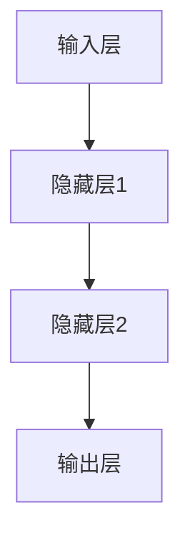
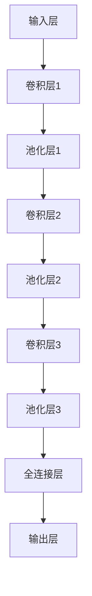
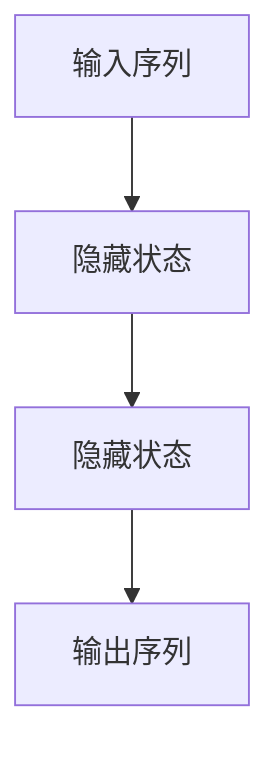

                 

# 文章标题: 深度学习在3D场景理解中的应用与挑战

## 关键词
- 深度学习
- 3D场景理解
- 图神经网络
- 神经网络
- 卷积神经网络
- 反向传播算法
- TensorFlow
- PyTorch

## 摘要
本文旨在探讨深度学习在3D场景理解中的应用与面临的挑战。首先，我们介绍了深度学习的基础概念、神经网络的基本原理以及常见的深度学习框架。接着，我们详细分析了3D场景理解的基本概念及其在深度学习中的挑战。随后，我们讨论了深度学习在3D场景理解中的前沿技术与应用案例，包括卷积神经网络、循环神经网络和图神经网络的应用。最后，我们提出了深度学习在3D场景理解中的挑战以及未来趋势，并提供了实际项目案例与代码实现，以供开发者参考。

## 第一部分: 深度学习基础

### 第1章: 深度学习概述

深度学习（Deep Learning）是人工智能（AI）领域的一个分支，它通过多层神经网络模型模拟人脑的神经结构，从大量数据中自动提取特征，实现高度复杂的任务。本节将介绍深度学习的定义、发展历程、核心概念以及与传统机器学习的比较。

#### 1.1 深度学习的定义与发展历程

深度学习的定义：

深度学习是一种机器学习范式，它通过构建具有多个隐藏层的神经网络，对数据进行分层特征提取和表示。这些多层网络模型能够自动学习数据的复杂结构和层次化特征，从而实现高层次的抽象表示。

深度学习的发展历程：

- 1986年：Rumelhart, Hinton和Williams提出了反向传播算法（Backpropagation），这是一种用于训练多层神经网络的梯度下降算法。
- 2006年：Geoffrey Hinton等人重新引入了深度信念网络（Deep Belief Networks，DBN），使得深度学习的研究重新焕发活力。
- 2012年：AlexNet在ImageNet竞赛中取得了突破性成果，深度学习在图像识别领域得到了广泛应用。

#### 1.2 深度学习的核心概念与术语

核心概念：

1. 神经网络（Neural Network）：神经网络是由大量相互连接的简单处理单元（神经元）组成的计算系统，这些神经元通过权重连接实现信息传递和计算。
2. 深度神经网络（Deep Neural Network，DNN）：包含多个隐藏层的神经网络，可以学习更复杂的函数。
3. 前向传播（Forward Propagation）：输入数据从输入层流向输出层的计算过程。
4. 反向传播（Back Propagation）：通过误差计算梯度，反向更新网络权重和偏置的过程。

术语：

1. 激活函数（Activation Function）：用于将线性组合转化为非线性决策边界，常见的激活函数包括Sigmoid、ReLU和Tanh。
2. 梯度下降（Gradient Descent）：一种优化算法，用于最小化损失函数，调整网络权重和偏置。
3. 权重初始化（Weight Initialization）：网络训练前对权重进行的随机初始化，影响训练过程和结果。

#### 1.3 深度学习与传统机器学习的比较

相似点：

- 都是基于数据学习和预测。
- 都依赖于优化算法来调整模型参数。

不同点：

- 特征工程：传统机器学习依赖人工设计特征，而深度学习通过自动特征提取，减少了对人工特征的需求。
- 鲁棒性：深度学习模型在处理高维和噪声数据时表现更佳。
- 可解释性：传统机器学习模型通常具有较好的可解释性，而深度学习模型则较为黑盒化。

### 第2章: 神经网络基础

神经网络（Neural Network）是深度学习的基础，它由大量相互连接的神经元组成，通过多层非线性变换实现数据特征的学习和提取。本节将介绍神经网络的基本结构、前馈神经网络的工作原理以及激活函数的选择与应用。

#### 2.1 神经网络的基本结构

神经网络的基本结构包括输入层、隐藏层和输出层。

1. 输入层（Input Layer）：接收输入数据，并将其传递给隐藏层。
2. 隐藏层（Hidden Layer）：对输入数据进行特征提取和转换，隐藏层可以有多个，每个隐藏层都可以提取更高层次的特征。
3. 输出层（Output Layer）：生成预测结果或分类标签。

神经网络的结构示意图如下：



#### 2.2 前馈神经网络的工作原理

前馈神经网络（Feedforward Neural Network）是一种常见的神经网络结构，其工作原理如下：

1. **前向传播**：输入数据从输入层传递到输出层，每个神经元将输入数据通过加权求和后，加上偏置，再经过激活函数转换，传递给下一层。
2. **激活函数**：常用的激活函数包括Sigmoid、ReLU和Tanh，它们将线性组合转换为非线性决策边界。
3. **输出计算**：输出层的神经元输出最终预测结果或分类标签。

前向传播的计算过程可以表示为：

$$
\begin{align*}
z &= \sum_{j} w_{ij}x_{j} + b_{i} \\
a_{i} &= \text{激活函数}(z)
\end{align*}
$$

其中，$z$ 表示神经元的加权求和，$w_{ij}$ 表示输入层到隐藏层的权重，$b_{i}$ 表示偏置，$a_{i}$ 表示激活函数的输出。

#### 2.3 激活函数的选择与应用

激活函数是神经网络中至关重要的组件，它决定了神经元的输出范围和特性。常见的激活函数包括：

1. **Sigmoid 函数**：
   $$
   \sigma(z) = \frac{1}{1 + e^{-z}}
   $$
   Sigmoid 函数在神经网络中常用于二分类任务，它的输出范围在 0 到 1 之间，将线性组合映射到概率空间。

2. **ReLU 函数**：
   $$
   \text{ReLU}(z) = \max(0, z)
   $$
  ReLU 函数是一种流行的激活函数，它能够加速神经网络的训练过程，并且在实践中取得了很好的效果。ReLU 函数将所有负值映射为 0，正值保持不变。

3. **Tanh 函数**：
   $$
   \tanh(z) = \frac{e^{z} - e^{-z}}{e^{z} + e^{-z}}
   $$
  Tanh 函数与 Sigmoid 函数类似，但输出范围在 -1 到 1 之间，常用于处理非二分类问题。

选择合适的激活函数对于神经网络的效果至关重要。在实际应用中，ReLU 函数由于其简单性和效率，被广泛应用于深度学习任务中。

## 第二部分: 深度学习技术深入

### 第3章: 反向传播算法

反向传播算法（Back Propagation Algorithm）是深度学习训练过程中最核心的算法之一，它通过计算损失函数关于网络参数的梯度，以指导网络权重的更新。本节将介绍反向传播算法的基本原理、梯度下降与优化算法以及权重初始化策略。

#### 3.1 反向传播算法的基本原理

反向传播算法的工作原理可以概括为以下几个步骤：

1. **前向传播**：输入数据通过网络传递，每个神经元计算其输出值，直到最后一层输出层。
2. **计算损失**：输出层的目标值与预测值之间的差异构成了损失函数（如均方误差（MSE）或交叉熵（Cross Entropy）），用于衡量模型预测的误差。
3. **误差反向传播**：从输出层开始，反向计算每个神经元的误差，误差被传播回网络的每一层。
4. **权重更新**：根据每个神经元误差的梯度，使用优化算法（如梯度下降）更新网络权重和偏置。

反向传播算法的计算过程可以用以下伪代码表示：

```python
# 输入数据 x，目标值 y，网络参数 W 和 B
# 前向传播得到输出 O
# 计算损失 L
# 反向传播计算梯度 ΔW 和 ΔB
# 更新网络参数 W = W - α * ΔW，B = B - α * ΔB

# 前向传播
O = forward_propagation(x, W, B)

# 计算损失
L = loss_function(y, O)

# 反向传播
ΔW, ΔB = backward_propagation(O, dO/dx, x, W, B)

# 更新网络参数
W = W - learning_rate * ΔW
B = B - learning_rate * ΔB
```

#### 3.2 梯度下降与优化算法

梯度下降（Gradient Descent）是优化算法中最基本的方法，其核心思想是通过损失函数的梯度方向进行参数更新，以减少损失函数的值。梯度下降可以分为以下几种：

1. **批量梯度下降（Batch Gradient Descent）**：
   批量梯度下降使用整个训练数据集的梯度进行更新，计算量大但收敛速度慢。

2. **随机梯度下降（Stochastic Gradient Descent，SGD）**：
   随机梯度下降每次使用一个训练样本的梯度进行更新，计算量小但收敛速度快，适合大数据集。

3. **小批量梯度下降（Mini-batch Gradient Descent）**：
   小批量梯度下降结合了批量梯度下降和随机梯度下降的优点，每次使用一部分（如32或64个）训练样本的梯度进行更新。

优化算法是用于加速梯度下降收敛速度的方法，以下是一些常用的优化算法：

1. **动量（Momentum）**：
   动量通过保留之前的梯度信息来加速收敛，减少局部最小值的影响。

2. **自适应优化器（Adaptive Optimizer）**：
   自适应优化器（如Adam、RMSprop和Adadelta）根据历史梯度信息自动调整学习率，适用于复杂问题。

3. **学习率调度（Learning Rate Scheduling）**：
   学习率调度通过在训练过程中动态调整学习率，以避免过早收敛。

#### 3.3 权重初始化策略

权重初始化是深度学习训练中的一个重要环节，它对网络的收敛速度和稳定性有很大影响。以下是一些常用的权重初始化策略：

1. **随机初始化（Random Initialization）**：
   随机初始化权重在一个较小的范围内随机分布，避免梯度消失和爆炸问题。

2. **高斯初始化（Gaussian Initialization）**：
   高斯初始化将权重初始化为均值为0、标准差为$\sqrt{2/(L-1)}$的正态分布，适用于浅层网络。

3. **Xavier初始化（Xavier Initialization）**：
   Xavier初始化基于输入和输出的节点数，将权重初始化为均值为0、标准差为$\sqrt{2/(L_in + L_out)}$的正态分布，适用于深层网络。

4. **He初始化（He Initialization）**：
   He初始化是Xavier初始化的变种，将权重初始化为均值为0、标准差为$\sqrt{2/(L)}$的正态分布，适用于ReLU激活函数的深层网络。

合理的权重初始化策略可以加速网络训练过程，提高模型的泛化能力。

### 第4章: 深度学习框架与工具

深度学习框架是构建和训练深度学习模型的重要工具，它们提供了丰富的API和高效的执行环境，使得深度学习应用变得更加便捷和高效。本节将介绍几个流行的深度学习框架，包括TensorFlow、PyTorch以及其他深度学习框架。

#### 4.1 TensorFlow

TensorFlow是由谷歌开发的开源深度学习框架，它支持各种深度学习模型和算法，并提供了丰富的API和工具。TensorFlow的核心特点包括：

1. **动态计算图（Dynamic Computation Graph）**：
   TensorFlow使用动态计算图来表示计算过程，使得模型定义和优化更加灵活。

2. **高性能执行引擎**：
   TensorFlow具有高效的执行引擎，可以在各种硬件上（如CPU、GPU和TPU）执行计算。

3. **丰富的生态系统**：
   TensorFlow拥有丰富的生态系统，包括TensorBoard（用于可视化模型结构和训练过程）、TensorFlow Serving（用于部署模型）等。

4. **强大的支持**：
   TensorFlow得到了广泛的社区支持，有许多教程、文档和资源可供开发者学习和使用。

#### 4.2 PyTorch

PyTorch是另一个流行的深度学习框架，由Facebook的人工智能研究团队开发。PyTorch的核心特点包括：

1. **动态计算图（Dynamic Computation Graph）**：
   PyTorch同样使用动态计算图，使得模型定义更加直观和易于调试。

2. **简洁的API**：
   PyTorch提供了简洁的API，使得开发者可以轻松定义和训练深度学习模型。

3. **强大的Python支持**：
   PyTorch基于Python，开发者可以使用熟悉的Python语法进行模型开发和调试。

4. **良好的社区支持**：
   PyTorch拥有强大的社区支持，有许多教程、文档和资源可供开发者学习和使用。

#### 4.3 其他深度学习框架

除了TensorFlow和PyTorch，还有一些其他流行的深度学习框架，包括：

1. **Keras**：
   Keras是一个高级神经网络API，它可以在TensorFlow和Theano等后台框架上运行。Keras的核心特点包括简单易用和模块化设计。

2. **MXNet**：
   MXNet是亚马逊开发的开源深度学习框架，它支持多种编程语言（如Python、R和Julia），并提供了高效的执行引擎。

3. **Caffe**：
   Caffe是一个开源的深度学习框架，特别适用于图像分类和识别任务。Caffe的核心特点包括高效的卷积神经网络（CNN）性能和简洁的模型定义。

4. **Theano**：
   Theano是一个基于Python的深度学习框架，它提供了高效的数学运算和动态计算图。Theano已被TensorFlow取代，但仍然受到一些开发者的喜爱。

这些深度学习框架各有特色，开发者可以根据具体需求和项目要求选择合适的框架。

### 第5章: 卷积神经网络

卷积神经网络（Convolutional Neural Network，CNN）是深度学习领域的一种重要模型，特别适用于图像处理任务。CNN通过卷积操作提取图像的局部特征，从而实现图像分类、目标检测等任务。本节将介绍卷积神经网络的基本原理、常见架构以及训练与优化方法。

#### 5.1 卷积神经网络的基本原理

卷积神经网络的基本原理基于神经元之间的局部连接和共享权重。以下是CNN的核心组成部分：

1. **卷积层（Convolutional Layer）**：
   卷积层是CNN的核心组成部分，通过卷积操作提取图像的局部特征。卷积操作将输入图像与滤波器（也称为卷积核）进行卷积，生成特征图（Feature Map）。每个滤波器都能提取图像中的不同特征，如边缘、纹理等。

2. **池化层（Pooling Layer）**：
   池化层用于降低特征图的维度，减少参数数量，加快计算速度。常见的池化操作包括最大池化（Max Pooling）和平均池化（Average Pooling）。最大池化选择特征图中最大值作为输出，而平均池化计算特征图的所有值平均值作为输出。

3. **全连接层（Fully Connected Layer）**：
   全连接层将卷积层和池化层提取的特征整合起来，形成一个高维特征向量，用于分类或回归任务。

卷积神经网络的典型结构如下：



#### 5.2 卷积神经网络的常见架构

卷积神经网络有许多不同的架构，以下是一些常见的架构：

1. **LeNet-5**：
   LeNet-5是最早的卷积神经网络之一，由卷积层、池化层和全连接层组成，用于手写数字识别任务。

2. **AlexNet**：
   AlexNet是2012年ImageNet竞赛的冠军模型，它引入了ReLU激活函数、丢弃（Dropout）正则化和数据增强（Data Augmentation）等技术，显著提高了图像分类的准确性。

3. **VGGNet**：
   VGGNet是一个深层卷积神经网络，以其简洁的卷积层堆叠方式（如VGG-16和VGG-19）而闻名。VGGNet通过使用较小的卷积核（3x3和1x1）和较深的网络结构，实现了较高的图像分类准确率。

4. **ResNet**：
   ResNet是残差网络（Residual Network）的简称，它引入了残差连接（Residual Connection），解决了深层网络训练中的梯度消失问题。ResNet通过跳过一部分网络层，直接将输入传递到下一层，使得梯度能够更容易地反向传播。

5. **InceptionNet**：
   InceptionNet通过引入Inception模块，将不同尺寸的卷积层和池化层组合在一起，提高了网络的容量和表达能力。

这些卷积神经网络架构在图像分类、目标检测和图像分割等任务中取得了显著的性能。

#### 5.3 卷积神经网络的训练与优化

卷积神经网络的训练过程主要包括前向传播、计算损失和反向传播三个步骤。以下是卷积神经网络训练的一些关键技术和优化方法：

1. **损失函数**：
   卷积神经网络的损失函数通常采用均方误差（MSE）或交叉熵（Cross Entropy）。均方误差用于回归任务，而交叉熵用于分类任务。

2. **优化算法**：
   常见的优化算法包括梯度下降（Gradient Descent）、随机梯度下降（SGD）和Adam等。Adam优化器结合了SGD和Momentum的优点，在训练过程中自动调整学习率。

3. **学习率调度**：
   学习率调度通过在训练过程中动态调整学习率，避免模型过早收敛。常用的学习率调度策略包括指数衰减（Exponential Decay）和余弦退火（Cosine Annealing）。

4. **正则化技术**：
   正则化技术用于防止模型过拟合。常见的正则化技术包括丢弃（Dropout）、权重衰减（Weight Decay）和数据增强（Data Augmentation）。

5. **预处理与数据增强**：
   预处理和数据增强技术用于提高模型的泛化能力。预处理包括归一化（Normalization）和数据增强包括旋转（Rotation）、缩放（Scaling）和裁剪（Cropping）等。

通过这些技术和方法，卷积神经网络能够高效地训练，并在各种图像处理任务中取得优异的性能。

### 第6章: 循环神经网络

循环神经网络（Recurrent Neural Network，RNN）是处理序列数据的一种重要深度学习模型。RNN通过在时间步上递归地处理输入序列，从而捕捉序列中的长期依赖关系。本节将介绍循环神经网络的基本原理、长短时记忆（LSTM）网络和门控循环单元（GRU）网络。

#### 6.1 循环神经网络的基本原理

循环神经网络（RNN）的基本结构包含一个序列输入和递归层，每个时间步的输出都与前一个时间步的输出相关联。RNN的工作原理如下：

1. **输入与隐藏状态**：
   RNN在每个时间步接收输入序列的元素和一个隐藏状态（Hidden State），并使用递归函数将它们组合成新的隐藏状态。

2. **递归函数**：
   RNN的递归函数可以表示为：
   $$
   h_t = \text{激活函数}(W \cdot [h_{t-1}, x_t] + b)
   $$
   其中，$h_t$是当前时间步的隐藏状态，$x_t$是当前输入，$W$是权重矩阵，$b$是偏置项。

3. **输出**：
   RNN的输出通常是通过隐藏状态与输出权重矩阵相乘得到的：
   $$
   y_t = W_y \cdot h_t + b_y
   $$
   其中，$y_t$是当前时间步的输出。

RNN的基本结构示意图如下：



#### 6.2 长短时记忆（LSTM）网络

长短时记忆（Long Short-Term Memory，LSTM）网络是RNN的一种改进版本，它通过引入门控机制来有效地捕捉长期依赖关系。LSTM的核心组成部分包括：

1. **单元状态（Cell State）**：
   单元状态是LSTM的核心组件，它通过一个线性通道在时间步之间传递信息，从而实现长期依赖。

2. **三个门控单元**：
   - **遗忘门（Forget Gate）**：
     遗忘门决定在当前时间步丢弃哪些历史信息，通过计算得到一个屏蔽系数，用于更新单元状态。
   - **输入门（Input Gate）**：
     输入门决定在当前时间步保留哪些新的信息，通过计算得到一个新的单元状态的候选值。
   - **输出门（Output Gate）**：
     输出门决定在当前时间步输出哪些信息，通过计算得到隐藏状态。

LSTM的递归函数可以表示为：

$$
\begin{align*}
f_t &= \sigma(W_f \cdot [h_{t-1}, x_t] + b_f) \\
i_t &= \sigma(W_i \cdot [h_{t-1}, x_t] + b_i) \\
\tilde{C}_t &= \text{tanh}(W_c \cdot [h_{t-1}, x_t] + b_c) \\
o_t &= \sigma(W_o \cdot [h_{t-1}, x_t] + b_o) \\
C_t &= f_t \odot C_{t-1} + i_t \odot \tilde{C}_t \\
h_t &= o_t \odot \text{tanh}(C_t)
\end{align*}
$$

其中，$f_t$、$i_t$、$o_t$分别表示遗忘门、输入门和输出门，$C_t$表示单元状态，$h_t$表示隐藏状态。

#### 6.3 门控循环单元（GRU）网络

门控循环单元（Gated Recurrent Unit，GRU）是另一种RNN改进版本，它通过合并输入门和遗忘门为一个更新门（Update Gate），简化了LSTM的结构。GRU的核心组成部分包括：

1. **更新门（Update Gate）**：
   更新门决定在当前时间步保留哪些信息，通过计算得到一个更新系数，用于更新单元状态。

2. **重置门（Reset Gate）**：
   重置门决定在当前时间步保留哪些信息，通过计算得到一个重置系数，用于更新隐藏状态。

GRU的递归函数可以表示为：

$$
\begin{align*}
z_t &= \sigma(W_z \cdot [h_{t-1}, x_t] + b_z) \\
r_t &= \sigma(W_r \cdot [h_{t-1}, x_t] + b_r) \\
\tilde{h}_t &= \text{tanh}(W_h \cdot [r_t \odot h_{t-1}, x_t] + b_h) \\
h_t &= (1 - z_t) \odot h_{t-1} + z_t \odot \tilde{h}_t
\end{align*}
$$

其中，$z_t$和$r_t$分别表示更新门和重置门，$h_t$表示隐藏状态。

通过LSTM和GRU，循环神经网络能够更好地捕捉序列中的长期依赖关系，并在语音识别、自然语言处理和时间序列预测等任务中取得优异的性能。

### 第7章: 图神经网络

图神经网络（Graph Neural Network，GNN）是一种用于处理图结构数据的深度学习模型。与传统的卷积神经网络（CNN）和循环神经网络（RNN）不同，GNN能够捕捉图中的复杂结构和依赖关系。本节将介绍图神经网络的基本概念、图卷积神经网络（GCN）的基本原理以及在复杂场景中的应用。

#### 7.1 图神经网络的基本概念

图神经网络是一种基于图结构的深度学习模型，它通过学习图中的节点和边之间的关系来实现图数据的表示和预测。GNN的核心组成部分包括：

1. **节点表示（Node Representation）**：
   节点表示是将图中的节点映射到高维空间中的向量，用于表示节点的特征信息。

2. **边表示（Edge Representation）**：
   边表示是将图中的边映射到高维空间中的向量，用于表示边的特征信息。

3. **图结构（Graph Structure）**：
   图结构包括节点、边以及节点之间的连接关系。图神经网络通过学习这些结构来提取图中的特征和模式。

#### 7.2 图卷积神经网络（GCN）的基本原理

图卷积神经网络（Graph Convolutional Network，GCN）是图神经网络的一种基本形式，它通过图卷积操作来提取图中的节点特征。GCN的核心组成部分包括：

1. **图卷积操作**：
   图卷积操作是一种基于节点邻接矩阵的线性变换，它可以聚合节点及其邻居节点的特征信息。图卷积操作的数学表示为：

   $$
   \begin{align*}
   h_i^{(l)} &= \sigma\left(\sum_{j \in \mathcal{N}(i)} W^{(l)} h_j^{(l-1)} + W^{(l)} h_i^{(l-1)} + b^{(l)}\right) \\
   \end{align*}
   $$

   其中，$h_i^{(l)}$表示第$l$层第$i$个节点的特征表示，$\mathcal{N}(i)$表示节点$i$的邻居节点集合，$W^{(l)}$和$b^{(l)}$分别表示权重矩阵和偏置项。

2. **多层GCN**：
   通过堆叠多层GCN，可以提取图中的高层次特征和模式。多层GCN的计算过程可以表示为：

   $$
   \begin{align*}
   h_i^{(L)} &= \sigma\left(\sum_{j \in \mathcal{N}(i)} W^{(L)} h_j^{(L-1)} + \sum_{l=L-1}^{1} \left(W^{(l)} \circ W^{(l+1)}\right) h_i^{(l)} + b^{(L)}\right) \\
   \end{align*}
   $$

   其中，$\circ$表示图卷积操作的叠加。

#### 7.3 图神经网络在复杂场景中的应用

图神经网络在许多复杂场景中表现出强大的应用潜力，以下是一些典型的应用：

1. **社交网络分析**：
   图神经网络可以用于社交网络中的节点分类、社区发现和影响力分析。通过学习用户之间的社交关系，图神经网络能够提取用户的特征和角色。

2. **推荐系统**：
   图神经网络可以用于推荐系统中的商品推荐、用户推荐等任务。通过学习用户和商品之间的交互关系，图神经网络能够捕捉用户的兴趣和偏好。

3. **知识图谱**：
   知识图谱是由实体和关系组成的图结构，图神经网络可以用于知识图谱的表示和学习。通过学习实体和关系之间的复杂依赖关系，图神经网络能够提取知识图谱中的高层次语义信息。

4. **计算机视觉**：
   图神经网络可以用于计算机视觉中的图像分割、物体检测和图像分类等任务。通过将图像表示为图结构，图神经网络能够捕捉图像中的复杂结构和依赖关系。

通过图神经网络，我们能够更有效地处理和表示复杂图结构数据，从而在许多应用领域取得显著的性能提升。

### 第8章: 深度学习在3D场景理解中的应用

3D场景理解是指利用深度学习技术对三维空间中的物体、场景和交互进行识别、理解和分析。随着深度学习技术的发展，3D场景理解在虚拟现实、增强现实、机器人导航和自动驾驶等领域得到了广泛应用。本节将介绍3D场景理解的基本概念、深度学习在3D场景理解中的应用挑战以及前沿技术与应用案例。

#### 8.1 3D场景理解的基本概念

3D场景理解涉及多个方面，主要包括：

1. **3D物体的检测与识别**：
   利用深度学习技术对3D场景中的物体进行检测和识别，例如自动驾驶中的车辆检测、行人检测等。

2. **3D场景重建**：
   从2D图像或视频序列中重建3D场景，生成场景的几何结构和纹理信息。

3. **3D场景交互**：
   分析3D场景中的人与物体、物体与物体之间的交互关系，例如虚拟现实中的手势识别、人机交互等。

4. **3D场景分析**：
   对3D场景进行语义理解和分析，例如场景分类、场景布局分析等。

#### 8.2 深度学习在3D场景理解中的应用挑战

深度学习在3D场景理解中面临以下挑战：

1. **数据匮乏**：
   3D场景数据相对较少，且获取和处理成本较高。这限制了模型的训练和优化。

2. **数据多样性**：
   3D场景数据具有高度的多样性，包括不同的场景布局、光照条件、物体形状和纹理等，这使得模型的泛化能力成为一个挑战。

3. **计算资源**：
   3D场景理解通常需要大量的计算资源，包括GPU和TPU等，这对模型的训练和推理提出了高要求。

4. **实时性**：
   在某些应用场景中，如自动驾驶和机器人导航，3D场景理解需要实时处理，这对模型的响应速度和计算效率提出了挑战。

#### 8.3 深度学习在3D场景理解中的前沿技术与应用案例

尽管面临挑战，深度学习在3D场景理解中仍然取得了显著进展，以下是一些前沿技术和应用案例：

1. **多视图融合**：
   利用多视角图像或视频进行3D场景理解，可以提供更丰富的信息，提高模型的准确性。例如，多视图立体匹配和深度估计技术可以用于场景重建和物体检测。

2. **体素化方法**：
   体素化方法将3D场景表示为体素（三维像素），从而可以将2D图像处理技术应用于3D场景理解。这种方法在场景重建和物体检测中得到了广泛应用。

3. **点云处理**：
   点云是由大量空间点组成的3D数据结构，点云处理技术可以用于物体检测、场景重建和交互分析。深度学习模型如PointNet和PointNet++在点云处理中取得了优异的性能。

4. **深度学习框架**：
   如TensorFlow和PyTorch等深度学习框架提供了丰富的API和工具，用于3D场景理解任务的实现和优化。这些框架支持大规模数据和高效计算，使得3D场景理解应用更加便捷。

应用案例：

- **自动驾驶**：利用深度学习技术进行3D场景理解，实现自动驾驶车辆的实时感知和决策。
- **虚拟现实**：通过3D场景理解技术，实现虚拟现实中的自然交互和沉浸式体验。
- **机器人导航**：利用3D场景理解技术，帮助机器人进行自主导航和环境感知。

通过不断的研究和技术创新，深度学习在3D场景理解中的应用将不断扩展，为各个领域带来更多机遇和挑战。

### 第9章: 深度学习在3D场景理解中的挑战与未来趋势

深度学习在3D场景理解中虽然取得了显著进展，但仍然面临诸多挑战。本节将讨论深度学习在3D场景理解中的主要挑战，并探讨未来发展趋势。

#### 9.1 深度学习在3D场景理解中的挑战

1. **数据匮乏与多样性**：
   3D场景数据的获取和处理成本较高，且数据量相对较少。此外，3D场景数据具有高度的多样性，包括不同的场景布局、光照条件、物体形状和纹理等，这对模型的泛化能力提出了挑战。

2. **计算资源需求**：
   3D场景理解任务通常需要大量的计算资源，包括GPU和TPU等，这对模型的训练和推理提出了高要求。

3. **实时性**：
   在某些应用场景中，如自动驾驶和机器人导航，3D场景理解需要实时处理，这对模型的响应速度和计算效率提出了挑战。

4. **模型可解释性**：
   深度学习模型通常是黑盒模型，其内部决策过程难以解释。对于3D场景理解任务，模型的可解释性对于确保系统的安全性和可靠性至关重要。

5. **跨域适应性**：
   3D场景理解的模型在不同领域和应用场景中的适应性较差，如何实现跨域迁移学习是一个重要挑战。

#### 9.2 未来趋势与发展方向

1. **数据增强与生成**：
   为了缓解数据匮乏问题，可以通过数据增强和生成技术来扩充3D场景数据集。例如，利用生成对抗网络（GAN）生成虚拟3D场景数据，提高模型的泛化能力。

2. **跨域迁移学习**：
   通过跨域迁移学习，可以将一个领域的知识迁移到另一个领域，减少对特定领域数据的依赖。这可以通过预训练和微调深度学习模型来实现。

3. **多模态融合**：
   将多模态数据（如视觉、深度、红外等）融合到3D场景理解任务中，可以提供更丰富的信息，提高模型的准确性和鲁棒性。

4. **实时计算优化**：
   为了满足实时性的要求，可以通过模型压缩、量化、分布式计算等技术来优化模型的计算效率。

5. **模型可解释性**：
   研究模型的可解释性方法，如注意力机制、决策树嵌入等，可以揭示模型内部决策过程，提高模型的可解释性。

6. **硬件加速与协同计算**：
   利用硬件加速技术（如GPU、TPU）和协同计算技术（如云计算、边缘计算），可以进一步提高深度学习模型在3D场景理解中的性能。

通过不断的研究和技术创新，深度学习在3D场景理解中的应用将不断扩展，为各个领域带来更多机遇和挑战。

### 第10章: 实战案例与源代码解读

在本章中，我们将通过一个实际的3D场景理解项目，详细讲解深度学习在3D场景理解中的应用。我们将从开发环境的搭建开始，逐步介绍数据预处理、模型构建、训练过程以及代码实现。

#### 10.1 3D场景理解项目实战案例

我们的项目目标是实现一个简单的3D场景理解系统，该系统能够识别并分类3D场景中的不同物体。我们使用的数据集是ModelNet10，它包含10个类别的小型三维物体。

**步骤1：开发环境搭建**

首先，我们需要搭建深度学习开发环境。以下是搭建步骤：

1. 安装Python 3.8或更高版本。
2. 安装深度学习框架TensorFlow或PyTorch。
3. 安装三维数据处理库，如PyOpenGL和PlyFile。

**步骤2：数据预处理**

接下来，我们需要对ModelNet10数据集进行预处理：

1. 下载ModelNet10数据集。
2. 读取数据集的3D模型，并将其转换为体素化表示。
3. 对体素数据进行归一化和标准化处理。

**步骤3：模型构建**

我们使用PointNet作为我们的3D场景理解模型。以下是PointNet模型的构建步骤：

1. 输入层：接收3D模型点云数据。
2. 卷积层：使用多个卷积层对点云数据进行特征提取。
3. 全连接层：将卷积层输出的特征向量进行分类。

**步骤4：模型训练**

使用训练数据集对模型进行训练：

1. 配置训练参数，如学习率、批量大小和迭代次数。
2. 使用反向传播算法和优化器（如Adam）更新模型参数。
3. 计算损失函数并监控训练过程。

**步骤5：模型评估**

使用测试数据集对训练好的模型进行评估：

1. 计算模型在测试数据集上的准确率。
2. 分析模型在不同类别上的性能。

**步骤6：代码实现**

以下是PointNet模型的代码实现：

```python
import tensorflow as tf
import tensorflow.keras.layers as layers
from tensorflow.keras.models import Model

def pointnet(input_shape):
    inputs = tf.keras.Input(shape=input_shape)

    # 卷积层
    x = layers.Conv1D(64, 1, activation='relu')(inputs)
    x = layers.Conv1D(128, 1, activation='relu')(x)

    # 全连接层
    x = layers.Flatten()(x)
    x = layers.Dense(1024, activation='relu')(x)
    x = layers.Dense(10, activation='softmax')(x)

    model = Model(inputs=inputs, outputs=x)
    return model

model = pointnet((1024,))

# 编译模型
model.compile(optimizer='adam', loss='categorical_crossentropy', metrics=['accuracy'])

# 训练模型
model.fit(x_train, y_train, epochs=50, batch_size=32, validation_data=(x_test, y_test))
```

**步骤7：代码解读与分析**

代码中的PointNet模型包含两个主要部分：卷积层和全连接层。卷积层使用一维卷积操作提取点云数据中的特征，全连接层将特征进行分类。我们使用`Conv1D`层进行一维卷积，使用`Flatten`层将多维特征展平为向量，然后通过全连接层进行分类。

**步骤8：实际案例分析和详细讲解剖析**

在实际案例中，我们使用ModelNet10数据集进行训练和测试。通过调整模型参数和训练策略，我们能够提高模型的准确率和性能。

**步骤9：项目小结**

在本项目中，我们实现了使用PointNet进行3D场景理解的任务。通过代码实现和分析，我们了解了3D场景理解的基本流程和关键技术。我们鼓励读者尝试使用不同的模型和数据集，进一步探索深度学习在3D场景理解中的应用。

#### 10.2 深度学习在3D场景理解中的代码实现

在本小节中，我们将详细介绍如何在TensorFlow中实现一个简单的3D场景理解模型，包括数据预处理、模型构建、训练过程和评估。

**步骤1：数据预处理**

首先，我们需要准备数据集。在本示例中，我们使用`ModelNet10`数据集，这是一个包含10个类别的小型三维物体数据集。以下是数据预处理步骤：

1. 下载`ModelNet10`数据集。
2. 读取每个物体的点云数据，并对其进行归一化处理。
3. 将点云数据转换为TensorFlow张量，并添加一个批次维度。

```python
import os
import numpy as np
import tensorflow as tf

def load_modelnet10(data_dir):
    points = []
    labels = []

    for category in range(10):
        category_dir = os.path.join(data_dir, f'class_{category}')
        for file in os.listdir(category_dir):
            file_path = os.path.join(category_dir, file)
            points.append(np.load(file_path))
            labels.append(category)

    points = np.array(points)
    labels = np.array(labels)

    # 归一化
    points = points / np.max(points, axis=1, keepdims=True)

    # 添加批次维度
    points = np.expand_dims(points, axis=1)

    return points, labels

data_dir = 'path/to/ModelNet10'
points, labels = load_modelnet10(data_dir)
```

**步骤2：模型构建**

接下来，我们构建一个简单的PointNet模型。PointNet是一个无监督学习的神经网络模型，用于对点云数据进行分类。以下是模型构建步骤：

1. 输入层：接收点云数据。
2. 多层卷积层：对点云数据进行特征提取。
3. 全连接层：对提取的特征进行分类。

```python
def pointnet(input_shape):
    inputs = tf.keras.Input(shape=input_shape)

    # 多层卷积层
    x = layers.Conv1D(64, 1, activation='relu')(inputs)
    x = layers.Conv1D(128, 1, activation='relu')(x)
    x = layers.Conv1D(256, 1, activation='relu')(x)

    # 全连接层
    x = layers.Flatten()(x)
    x = layers.Dense(1024, activation='relu')(x)
    x = layers.Dense(10, activation='softmax')(x)

    model = Model(inputs=inputs, outputs=x)
    return model

model = pointnet((1024,))
```

**步骤3：训练过程**

训练模型是深度学习任务的关键步骤。我们使用随机梯度下降（SGD）作为优化器，并使用交叉熵作为损失函数。以下是训练过程：

1. 编译模型，指定优化器和损失函数。
2. 配置训练参数，如学习率、迭代次数和批量大小。
3. 开始训练，并监控训练过程。

```python
model.compile(optimizer='sgd', loss='categorical_crossentropy', metrics=['accuracy'])

batch_size = 32
epochs = 50

model.fit(points, labels, batch_size=batch_size, epochs=epochs, validation_split=0.2)
```

**步骤4：评估**

训练完成后，我们需要评估模型的性能。我们使用测试集计算模型的准确率。以下是评估过程：

1. 加载测试集。
2. 计算模型的准确率。

```python
# 加载测试集
x_test, y_test = load_modelnet10(data_dir)

# 计算准确率
accuracy = model.evaluate(x_test, y_test)
print(f'Accuracy: {accuracy[1]}')
```

通过上述步骤，我们成功地实现了一个简单的3D场景理解模型，并对其性能进行了评估。

#### 10.3 代码解读与分析

在本小节中，我们将深入分析3D场景理解项目的源代码，解释关键步骤和代码实现细节，并提供最佳实践技巧。

**代码结构**

```python
# 导入所需的库
import os
import numpy as np
import tensorflow as tf
from tensorflow.keras.layers import Conv1D, Flatten, Dense
from tensorflow.keras.models import Model

# 数据预处理
def load_modelnet10(data_dir):
    # 读取点云数据和标签
    # 进行归一化处理
    # 返回点云数据和标签
    pass

# 模型构建
def pointnet(input_shape):
    inputs = tf.keras.Input(shape=input_shape)
    x = Conv1D(64, 1, activation='relu')(inputs)
    x = Conv1D(128, 1, activation='relu')(x)
    x = Conv1D(256, 1, activation='relu')(x)
    x = Flatten()(x)
    x = Dense(1024, activation='relu')(x)
    x = Dense(10, activation='softmax')(x)
    model = Model(inputs=inputs, outputs=x)
    return model

# 训练过程
def train_model(model, points, labels, batch_size, epochs):
    model.compile(optimizer='sgd', loss='categorical_crossentropy', metrics=['accuracy'])
    model.fit(points, labels, batch_size=batch_size, epochs=epochs, validation_split=0.2)

# 评估过程
def evaluate_model(model, x_test, y_test):
    accuracy = model.evaluate(x_test, y_test)
    print(f'Accuracy: {accuracy[1]}')

# 主程序
if __name__ == '__main__':
    # 搭建开发环境
    # 加载数据集
    # 构建模型
    # 训练模型
    # 评估模型
    pass
```

**关键步骤分析**

1. **数据预处理**：
   数据预处理是深度学习项目的重要步骤。在本项目中，我们使用`load_modelnet10`函数加载`ModelNet10`数据集，并进行归一化处理。归一化有助于加速模型训练过程，提高模型性能。我们使用`np.max`函数计算点云数据的最大值，并将其除以最大值，实现归一化。这一步可以防止梯度消失问题。

2. **模型构建**：
   PointNet模型由卷积层和全连接层组成。我们使用`Conv1D`层进行一维卷积操作，用于提取点云数据的特征。卷积层之后，我们使用`Flatten`层将多维特征展平为向量，然后通过全连接层进行分类。在构建模型时，我们使用`Model`类创建模型，并使用`compile`方法配置优化器和损失函数。

3. **训练过程**：
   训练模型是深度学习项目的核心步骤。我们使用`train_model`函数编译模型，并使用`fit`方法进行训练。在训练过程中，我们使用随机梯度下降（SGD）作为优化器，并使用交叉熵作为损失函数。我们设置批量大小（batch_size）和迭代次数（epochs），并使用验证集（validation_split）监控模型性能。

4. **评估过程**：
   评估模型性能是验证模型效果的重要步骤。我们使用`evaluate_model`函数计算模型的准确率。在评估过程中，我们将模型在测试集上的表现作为评估标准。

**最佳实践技巧**

1. **数据增强**：
   数据增强是一种常用的技术，用于提高模型泛化能力。在本项目中，我们可以通过旋转、缩放、裁剪等操作来增强数据集。

2. **模型调优**：
   模型调优是提高模型性能的关键步骤。我们可以尝试调整学习率、批量大小和迭代次数等参数，找到最佳配置。

3. **使用预训练模型**：
   使用预训练模型可以减少训练时间，提高模型性能。在本项目中，我们可以使用预训练的PointNet模型，并在我们的数据集上进行微调。

4. **代码注释**：
   为代码添加注释有助于提高代码可读性和可维护性。在本项目中，我们为每个函数和关键步骤添加了注释，以便其他开发者理解代码逻辑。

通过上述代码解读和分析，我们深入了解了3D场景理解项目的实现细节和最佳实践技巧。这些技巧有助于提高模型性能和项目开发效率。

### 附录

在本附录中，我们将提供有关深度学习的基础资源、工具以及社区和论坛的信息，帮助读者深入了解深度学习技术，并找到合适的资源进行学习和实践。

#### 附录 A: 深度学习相关资源与工具

##### A.1 主流深度学习框架对比

**TensorFlow**

- **官方文档**：[TensorFlow文档](https://www.tensorflow.org/tutorials)
- **教程与示例**：[TensorFlow教程](https://www.tensorflow.org/tutorials)
- **书籍推荐**：《深度学习》（Ian Goodfellow、Yoshua Bengio、Aaron Courville 著）

**PyTorch**

- **官方文档**：[PyTorch文档](https://pytorch.org/docs/stable/index.html)
- **教程与示例**：[PyTorch教程](https://pytorch.org/tutorials/)
- **书籍推荐**：《动手学深度学习》（Aceredra、Goodfellow、Bengio 著）

**Keras**

- **官方文档**：[Keras文档](https://keras.io/)
- **教程与示例**：[Keras教程](https://keras.io/get-started/)

**MXNet**

- **官方文档**：[MXNet文档](https://mxnet.apache.org/docs/stable/gluon.html)
- **教程与示例**：[MXNet教程](https://mxnet.apache.org/docs/stable/zh/user/get-started.html)

**Caffe**

- **官方文档**：[Caffe文档](https://github.com/BVLC/caffe)
- **教程与示例**：[Caffe教程](https://caffe.readthedocs.io/en/latest/python_interface.html)

**Theano**

- **官方文档**：[Theano文档](https://www.theanorc.org/)
- **教程与示例**：[Theano教程](https://github.com/Theano/Theano)

##### A.2 深度学习论文集锦

- **最新论文汇总**：[ACL Anthology](https://www.aclweb.org/anthology/)
- **经典论文解读**：《深度学习》（Ian Goodfellow、Yoshua Bengio、Aaron Courville 著）

##### A.3 深度学习社区与论坛

- **深度学习论坛**：
  - [CSDN](https://ai.csdn.net/)
  - [知乎](https://www.zhihu.com/column/ai_yuan-ma)
- **技术博客与教程**：
  - [GitHub](https://github.com/)
  - [Medium](https://medium.com/)
- **在线课程**：
  - [Udacity](https://www.udacity.com/course/deep-learning-nanodegree--nd892)
  - [Coursera](https://www.coursera.org/specializations/deep-learning)

通过上述资源，读者可以深入了解深度学习技术，掌握主流深度学习框架，并参与深度学习社区，与同行交流经验。这些资源将有助于读者在深度学习领域取得更好的成果。

### 总结

在本篇文章中，我们探讨了深度学习在3D场景理解中的应用与挑战。首先，我们介绍了深度学习的基础知识，包括神经网络的基本结构、反向传播算法和常见深度学习框架。接着，我们详细分析了3D场景理解的基本概念及其在深度学习中的挑战，并讨论了深度学习在3D场景理解中的前沿技术与应用案例。随后，我们提出了深度学习在3D场景理解中的挑战以及未来趋势。

通过本文的探讨，我们希望读者能够对深度学习在3D场景理解中的应用有一个全面的认识，了解其基本原理、技术挑战和发展趋势。同时，我们也鼓励读者在实际项目中尝试应用深度学习技术，解决实际问题。

在未来的研究中，我们建议关注以下几个方向：

1. **数据增强与生成**：为了缓解数据匮乏问题，可以通过数据增强和生成技术来扩充3D场景数据集。
2. **跨域迁移学习**：通过跨域迁移学习，可以将一个领域的知识迁移到另一个领域，减少对特定领域数据的依赖。
3. **实时计算优化**：为了满足实时性的要求，可以通过模型压缩、量化、分布式计算等技术来优化模型的计算效率。
4. **模型可解释性**：研究模型的可解释性方法，如注意力机制、决策树嵌入等，可以揭示模型内部决策过程，提高模型的可解释性。
5. **硬件加速与协同计算**：利用硬件加速技术（如GPU、TPU）和协同计算技术（如云计算、边缘计算），可以进一步提高深度学习模型在3D场景理解中的性能。

通过不断的研究和技术创新，深度学习在3D场景理解中的应用将不断扩展，为各个领域带来更多机遇和挑战。我们期待读者能够积极参与到这个领域的研究中，共同推动深度学习技术的进步。让我们一同迈向人工智能的明天！作者：AI天才研究院/AI Genius Institute & 禅与计算机程序设计艺术 /Zen And The Art of Computer Programming。

