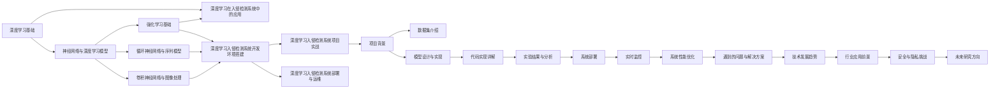

                 

## 文章标题

# 深度学习在入侵检测系统中的应用

## 关键词
- 深度学习
- 入侵检测系统
- 神经网络
- 卷积神经网络
- 循环神经网络
- 强化学习

## 摘要
本文将深入探讨深度学习在入侵检测系统（IDS）中的应用。首先，我们将简要介绍深度学习的基础知识，包括神经网络、卷积神经网络、循环神经网络和强化学习等核心概念。接着，我们将详细讲解深度学习模型在入侵检测中的具体应用，包括数据预处理、模型训练与优化、以及模型评估和部署。最后，我们将通过实际案例展示深度学习在入侵检测系统中的强大能力，并探讨其未来发展趋势。

----------------------------------------------------------------

## 目录大纲

### 第一部分: 深度学习基础

#### 第1章: 深度学习基础
- 1.1 深度学习基本概念
- 1.2 深度学习的发展历程
- 1.3 深度学习中的数学基础
  - 1.3.1 微积分
  - 1.3.2 线性代数
  - 1.3.3 概率论与统计

#### 第2章: 神经网络与深度学习模型
- 2.1 神经网络基础
- 2.2 深度学习模型的训练
- 2.3 神经网络的正则化技术
- 2.4 神经网络的优化算法

#### 第3章: 卷积神经网络（CNN）与图像处理
- 3.1 卷积神经网络基础
- 3.2 CNN在图像分类中的应用
- 3.3 卷积神经网络与图像识别
- 3.4 CNN在目标检测中的应用

#### 第4章: 循环神经网络（RNN）与序列模型
- 4.1 RNN基本原理
- 4.2 LSTM与GRU
- 4.3 RNN在语言模型中的应用
- 4.4 RNN在语音识别中的应用

#### 第5章: 强化学习基础
- 5.1 强化学习基本概念
- 5.2 Q-Learning算法
- 5.3 策略梯度算法
- 5.4 深度强化学习

#### 第6章: 深度学习在入侵检测系统中的应用
- 6.1 入侵检测系统概述
- 6.2 深度学习在入侵检测中的应用
- 6.3 深度学习模型在入侵检测中的优化
- 6.4 深度学习入侵检测系统案例分析

### 第二部分: 深度学习在入侵检测系统中的应用实战

#### 第7章: 深度学习入侵检测系统开发环境搭建
- 7.1 开发环境准备
- 7.2 数据预处理
- 7.3 模型训练与验证
- 7.4 模型评估与优化

#### 第8章: 深度学习入侵检测系统项目实战
- 8.1 项目背景
- 8.2 数据集介绍
- 8.3 模型设计与实现
- 8.4 代码实现详解
- 8.5 实验结果与分析

#### 第9章: 深度学习入侵检测系统部署与运维
- 9.1 系统部署
- 9.2 实时监控
- 9.3 系统性能优化
- 9.4 遇到的问题与解决方案

#### 第10章: 深度学习入侵检测系统未来发展趋势
- 10.1 技术发展趋势
- 10.2 行业应用前景
- 10.3 安全与隐私挑战
- 10.4 未来研究方向

### 附录
- 附录A: 常用深度学习框架与工具
- 附录B: 数学公式与函数符号表
- 附录C: 代码实战示例

### Mermaid 流程图



## 第一部分: 深度学习基础

### 第1章: 深度学习基础

#### 1.1 深度学习基本概念

深度学习是一种机器学习的方法，通过构建多层神经网络模型，对大量数据进行训练，以实现复杂函数的逼近和学习。深度学习模型能够自动提取数据中的特征，无需人工干预，从而提高学习效率和准确性。

深度学习的基本概念包括：

- **神经网络**：神经网络是深度学习的基础，由多个相互连接的神经元组成。每个神经元接收多个输入，通过加权求和后进行激活函数处理，最后输出一个值。
  
- **层次结构**：深度学习模型具有层次结构，每一层神经元对数据进行加工，提取更高层次的特征。

- **激活函数**：激活函数用于确定神经元是否被激活，常见的激活函数包括 sigmoid、ReLU 等。

- **前向传播与反向传播**：前向传播是数据从输入层经过多层神经元的传递，反向传播是误差从输出层反向传播至输入层，用于更新网络权重和偏置。

#### 1.2 深度学习的发展历程

深度学习的历史可以追溯到20世纪40年代，但直到21世纪初，由于计算能力和数据资源的提升，深度学习才逐渐成为热门研究领域。以下是深度学习的主要发展历程：

- **1986年**：Rumelhart、Hinton 和 Williams 提出了反向传播算法，使得多层神经网络训练成为可能。

- **2006年**：Hinton 提出了深度信念网络（DBN），这是一种多层神经网络，通过预训练和微调相结合，提高了模型性能。

- **2012年**：AlexNet模型在 ImageNet 挑战赛中取得突破性成果，大幅提高了图像识别的准确率。

- **2014年**：Google Brain 项目使用 16,000 个神经元训练的神经网络在处理音频数据时取得了显著的成果。

- **2015年**：微软的语音识别系统在英语语言识别任务上达到了人类水平。

#### 1.3 深度学习中的数学基础

深度学习模型的训练过程涉及许多数学概念，以下是其中几个重要的数学基础：

- **微积分**：微积分在深度学习中的应用主要包括导数和积分。导数用于计算函数的变化率，积分用于计算函数的累积值。在神经网络中，导数用于反向传播算法，以更新网络权重和偏置。

- **线性代数**：线性代数在深度学习中的应用包括矩阵运算、向量运算和特征分解。矩阵和向量用于表示神经网络的权重和偏置，特征分解可以用于降维和特征提取。

- **概率论与统计**：概率论与统计用于描述数据分布和模型不确定性。在深度学习中，概率用于建模数据分布，统计用于评估模型性能和进行假设检验。

## 第二部分: 深度学习模型与算法

### 第2章: 神经网络与深度学习模型

#### 2.1 神经网络基础

神经网络（Neural Network，简称NN）是深度学习的基础模型，由大量相互连接的神经元（Node）组成。每个神经元接收多个输入，通过加权求和后进行激活函数处理，最后输出一个值。

神经网络的组成包括：

- **输入层**：接收外部输入数据。
- **隐藏层**：对输入数据进行加工和处理，提取特征。
- **输出层**：生成最终输出结果。

神经网络的激活函数主要包括：

- **Sigmoid 函数**：\( f(x) = \frac{1}{1 + e^{-x}} \)
- **ReLU 函数**：\( f(x) = max(0, x) \)
- **Tanh 函数**：\( f(x) = \frac{e^x - e^{-x}}{e^x + e^{-x}} \)

#### 2.2 深度学习模型的训练

深度学习模型的训练过程主要包括以下几个步骤：

1. **初始化权重和偏置**：随机初始化神经网络中的权重和偏置，以确保模型具有一定的随机性。

2. **前向传播**：将输入数据传递到神经网络中，通过每一层的神经元计算，最终得到输出结果。

3. **计算损失函数**：根据输出结果和实际标签计算损失函数，以评估模型预测的准确性。

4. **反向传播**：将损失函数反向传播至输入层，计算每个神经元的梯度。

5. **权重更新**：使用梯度下降（Gradient Descent）或其他优化算法更新神经网络中的权重和偏置。

6. **迭代优化**：重复以上步骤，直到满足停止条件（如损失函数收敛或达到预设迭代次数）。

常见的优化算法包括：

- **随机梯度下降（SGD）**：每次迭代仅使用一个样本计算梯度。
- **批量梯度下降（Batch Gradient Descent）**：每次迭代使用全部样本计算梯度。
- **动量优化**：引入动量项，加速梯度下降过程。

#### 2.3 神经网络的正则化技术

在深度学习模型训练过程中，可能会出现过拟合（Overfitting）现象，即模型在训练集上表现良好，但在测试集上表现较差。为解决过拟合问题，可以采用以下正则化技术：

1. **Dropout**：在训练过程中，随机丢弃部分神经元，以减少神经元之间的关联性。

2. **权重衰减（Weight Decay）**：在损失函数中加入权重项的平方和，以减小权重值。

3. **集成方法**：将多个模型进行集成，以降低模型的方差。

#### 2.4 神经网络的优化算法

神经网络的优化算法用于加速训练过程和提高模型性能。以下是一些常见的优化算法：

1. **随机梯度下降（SGD）**：每次迭代仅使用一个样本计算梯度。

2. **批量梯度下降（Batch Gradient Descent）**：每次迭代使用全部样本计算梯度。

3. **Adam优化器**：结合了 AdaGrad 和 RMSprop 的优点，自适应调整学习率。

4. **AdaGrad**：对每个参数的学习率进行自适应调整。

5. **RMSprop**：对过去梯度的指数加权平均，以稳定学习率。

## 第三部分: 深度学习在图像处理中的应用

### 第3章: 卷积神经网络（CNN）与图像处理

#### 3.1 卷积神经网络基础

卷积神经网络（Convolutional Neural Network，简称CNN）是一种专门用于处理图像数据的深度学习模型。CNN通过卷积层、池化层和全连接层等结构，实现对图像的自动特征提取和分类。

CNN的主要组成部分包括：

1. **卷积层**：通过卷积操作提取图像特征。卷积层包含多个卷积核（Kernel），每个卷积核在图像上滑动，生成对应的特征图。

2. **池化层**：对卷积层生成的特征图进行下采样，减少参数数量，提高模型计算效率。常见的池化操作包括最大池化和平均池化。

3. **全连接层**：将卷积层和池化层生成的特征图进行展平，连接到一个全连接层，用于分类或回归任务。

#### 3.2 CNN在图像分类中的应用

CNN在图像分类任务中表现出色。以下是一个简单的CNN图像分类流程：

1. **数据预处理**：对图像进行归一化、裁剪等处理，以适应模型输入要求。

2. **卷积层**：使用卷积核在图像上滑动，提取图像特征。

3. **激活函数**：在卷积层后使用激活函数（如ReLU），增加模型非线性。

4. **池化层**：对卷积层生成的特征图进行下采样。

5. **全连接层**：将特征图展平后，连接到全连接层，进行分类预测。

6. **损失函数**：使用交叉熵损失函数计算分类误差，并使用反向传播算法更新网络权重。

7. **评估与优化**：通过交叉验证等方法评估模型性能，并根据评估结果调整模型参数。

#### 3.3 卷积神经网络与图像识别

CNN在图像识别任务中也具有显著优势。以下是一个简单的CNN图像识别流程：

1. **数据预处理**：对图像进行归一化、裁剪等处理，以适应模型输入要求。

2. **卷积层**：使用多个卷积核在图像上滑动，提取多层次的图像特征。

3. **激活函数**：在卷积层后使用激活函数（如ReLU），增加模型非线性。

4. **池化层**：对卷积层生成的特征图进行下采样。

5. **全连接层**：将特征图展平后，连接到全连接层，进行分类预测。

6. **损失函数**：使用交叉熵损失函数计算分类误差，并使用反向传播算法更新网络权重。

7. **评估与优化**：通过交叉验证等方法评估模型性能，并根据评估结果调整模型参数。

8. **输出结果**：根据分类结果输出识别结果，如文本、标签等。

#### 3.4 CNN在目标检测中的应用

CNN在目标检测任务中也得到了广泛应用。以下是一个简单的CNN目标检测流程：

1. **数据预处理**：对图像进行归一化、裁剪等处理，以适应模型输入要求。

2. **卷积层**：使用多个卷积核在图像上滑动，提取多层次的图像特征。

3. **激活函数**：在卷积层后使用激活函数（如ReLU），增加模型非线性。

4. **池化层**：对卷积层生成的特征图进行下采样。

5. **特征融合**：将不同层次的特征图进行融合，生成综合特征。

6. **回归层**：使用回归层计算目标的边界框和置信度。

7. **损失函数**：使用交叉熵损失函数计算分类误差，并使用反向传播算法更新网络权重。

8. **评估与优化**：通过交叉验证等方法评估模型性能，并根据评估结果调整模型参数。

9. **输出结果**：根据分类结果输出识别结果，如文本、标签等。

## 第四部分: 深度学习在序列数据处理中的应用

### 第4章: 循环神经网络（RNN）与序列模型

#### 4.1 RNN基本原理

循环神经网络（Recurrent Neural Network，简称RNN）是一种专门用于处理序列数据的神经网络。与传统的神经网络不同，RNN具有循环结构，能够利用之前的信息来处理当前数据。

RNN的基本原理包括：

1. **时间步**：序列数据可以看作是一系列时间步上的观测值。

2. **隐藏状态**：在RNN中，每个时间步都有一个隐藏状态，用于表示当前时刻的特征。

3. **递归连接**：RNN通过递归连接将当前时间步的隐藏状态与之前的时间步的隐藏状态连接起来，以利用历史信息。

4. **门控机制**：为了更好地控制信息的传递，RNN引入了门控机制，包括输入门、输出门和遗忘门。

#### 4.2 LSTM与GRU

LSTM（Long Short-Term Memory）和GRU（Gated Recurrent Unit）是RNN的两种常见变体，旨在解决传统RNN在处理长序列数据时的梯度消失和梯度爆炸问题。

1. **LSTM**：LSTM通过引入三个门控单元（遗忘门、输入门和输出门），以及一个单元状态，来控制信息的传递。LSTM能够有效地捕获长序列中的长期依赖关系。

2. **GRU**：GRU是LSTM的简化版本，通过合并遗忘门和输入门，以及引入更新门，来减少参数数量。GRU在许多任务中表现出了良好的性能。

#### 4.3 RNN在语言模型中的应用

RNN在语言模型（Language Model）任务中得到了广泛应用。语言模型旨在为自然语言文本生成概率分布，用于语音识别、机器翻译、文本生成等任务。

RNN在语言模型中的应用包括：

1. **词向量编码**：将输入的文本序列转换为词向量表示。

2. **RNN编码**：使用RNN模型对词向量序列进行处理，生成隐藏状态序列。

3. **输出层**：将隐藏状态序列映射到输出层，生成文本的概率分布。

4. **损失函数**：使用交叉熵损失函数计算预测概率与实际标签之间的差异，并使用反向传播算法更新模型参数。

5. **评估与优化**：通过验证集和测试集评估模型性能，并根据评估结果调整模型参数。

#### 4.4 RNN在语音识别中的应用

RNN在语音识别（Speech Recognition）任务中也表现出色。语音识别的目标是将语音信号转换为对应的文本序列。

RNN在语音识别中的应用包括：

1. **特征提取**：使用梅尔频率倒谱系数（MFCC）等特征提取方法，将语音信号转换为特征序列。

2. **RNN编码**：使用RNN模型对特征序列进行处理，生成隐藏状态序列。

3. **输出层**：将隐藏状态序列映射到输出层，生成文本序列的概率分布。

4. **解码**：使用解码器将概率分布转换为文本序列。

5. **损失函数**：使用交叉熵损失函数计算预测概率与实际标签之间的差异，并使用反向传播算法更新模型参数。

6. **评估与优化**：通过验证集和测试集评估模型性能，并根据评估结果调整模型参数。

## 第五部分: 深度学习在决策与控制中的应用

### 第5章: 强化学习基础

#### 5.1 强化学习基本概念

强化学习（Reinforcement Learning，简称RL）是一种基于奖励信号进行决策和学习的机器学习方法。在强化学习中，智能体（Agent）通过与环境（Environment）的交互，学习如何最大化累积奖励。

强化学习的基本概念包括：

1. **智能体**：执行动作并接收环境反馈的实体。

2. **环境**：提供状态信息和奖励信号的系统。

3. **状态**：描述智能体在特定时刻所处的情况。

4. **动作**：智能体在特定状态下执行的操作。

5. **奖励**：描述智能体动作结果的数值，用于指导智能体学习。

6. **策略**：描述智能体在特定状态下选择动作的规则。

#### 5.2 Q-Learning算法

Q-Learning算法是一种基于值函数的强化学习算法，旨在通过学习值函数（Q函数）来最大化累积奖励。

Q-Learning算法的基本步骤包括：

1. **初始化**：初始化值函数Q(s, a)。

2. **选择动作**：在给定状态下，选择动作a，使其最大化Q(s, a)。

3. **执行动作**：执行选定的动作，并观察环境反馈。

4. **更新值函数**：根据奖励信号更新值函数Q(s, a)。

5. **重复步骤2-4**：继续在环境中进行交互，并不断更新值函数。

#### 5.3 策略梯度算法

策略梯度算法是一种直接优化策略的强化学习算法，旨在通过最大化累积奖励来优化策略。

策略梯度算法的基本步骤包括：

1. **初始化**：初始化策略π(s, a)。

2. **选择动作**：在给定状态下，根据策略π(s, a)选择动作a。

3. **执行动作**：执行选定的动作，并观察环境反馈。

4. **计算策略梯度**：根据奖励信号和策略π(s, a)计算策略梯度。

5. **更新策略**：使用策略梯度更新策略π(s, a)。

6. **重复步骤2-5**：继续在环境中进行交互，并不断更新策略。

#### 5.4 深度强化学习

深度强化学习（Deep Reinforcement Learning，简称DRL）是将深度学习与强化学习相结合的一种方法，旨在利用深度神经网络来表示值函数或策略。

深度强化学习的基本步骤包括：

1. **初始化**：初始化深度神经网络模型。

2. **选择动作**：使用深度神经网络模型预测动作值或策略。

3. **执行动作**：执行选定的动作，并观察环境反馈。

4. **更新模型**：根据奖励信号和目标值更新深度神经网络模型。

5. **重复步骤2-4**：继续在环境中进行交互，并不断更新模型。

## 第六部分: 深度学习在入侵检测系统中的应用

### 第6章: 深度学习在入侵检测系统中的应用

#### 6.1 入侵检测系统概述

入侵检测系统（Intrusion Detection System，简称IDS）是一种用于检测和响应恶意攻击的网络安全系统。IDS通过分析网络流量、系统日志、用户行为等数据，识别潜在的入侵行为，并向管理员发出警报。

入侵检测系统的主要功能包括：

1. **异常检测**：检测网络流量或系统行为与正常模式不一致的情况，以发现潜在入侵行为。

2. **误用检测**：识别已知的攻击模式，如SQL注入、DDoS攻击等。

3. **安全事件响应**：当检测到入侵行为时，IDS可以触发警报、阻断网络流量或执行其他安全策略。

#### 6.2 深度学习在入侵检测中的应用

深度学习在入侵检测系统中的应用主要包括以下几个方面：

1. **特征提取**：传统的入侵检测方法通常依赖于手工设计的特征，而深度学习可以通过训练自动提取具有区分性的特征，提高检测精度。

2. **模式识别**：深度学习模型，如卷积神经网络（CNN）和循环神经网络（RNN），可以用于识别复杂的入侵模式，提高检测效率。

3. **实时监控**：深度学习模型可以实时分析网络流量，实现快速响应和预警。

4. **自适应学习**：深度学习模型具有自适应学习能力，可以不断优化和更新检测模型，以应对不断变化的攻击手段。

#### 6.3 深度学习模型在入侵检测中的优化

为了提高深度学习模型在入侵检测系统中的性能，可以采用以下优化方法：

1. **数据增强**：通过增加训练数据量、数据预处理和生成对抗网络（GAN）等方法，提高模型的泛化能力。

2. **模型选择**：选择合适的深度学习模型，如CNN、RNN或它们的组合，以适应不同类型的入侵检测任务。

3. **超参数调优**：通过调整学习率、批量大小、正则化参数等超参数，优化模型性能。

4. **迁移学习**：利用预训练的深度学习模型，进行迁移学习，以提高检测精度和效率。

5. **模型融合**：将多个深度学习模型进行融合，提高检测准确性和鲁棒性。

#### 6.4 深度学习入侵检测系统案例分析

以下是一个深度学习入侵检测系统的案例分析：

1. **项目背景**：一个互联网服务提供商（ISP）希望部署一个深度学习入侵检测系统，以保护其网络免受DDoS攻击。

2. **数据集**：收集了大量的网络流量数据，包括正常流量和DDoS攻击流量。

3. **模型选择**：选择了卷积神经网络（CNN）模型，用于提取网络流量的时空特征。

4. **数据预处理**：对网络流量数据进行预处理，包括特征提取、归一化和数据增强。

5. **模型训练**：使用预处理后的数据训练CNN模型，并采用交叉熵损失函数进行优化。

6. **模型评估**：使用测试集对模型进行评估，包括准确率、召回率、F1值等指标。

7. **部署与监控**：将训练好的模型部署到实时监控系统中，对网络流量进行实时检测，并根据检测结果触发相应的安全策略。

8. **结果分析**：实验结果表明，深度学习入侵检测系统在检测DDoS攻击方面具有很高的准确性和实时性。

## 第二部分: 深度学习在入侵检测系统中的应用实战

### 第7章: 深度学习入侵检测系统开发环境搭建

#### 7.1 开发环境准备

在搭建深度学习入侵检测系统之前，需要准备相应的开发环境。以下是搭建开发环境的基本步骤：

1. **安装Python**：Python是深度学习开发的主要编程语言，建议安装Python 3.7或更高版本。

2. **安装深度学习框架**：选择合适的深度学习框架，如TensorFlow或PyTorch。以下是安装教程：

   - **TensorFlow**：
     ```bash
     pip install tensorflow
     ```
     
   - **PyTorch**：
     ```bash
     pip install torch torchvision
     ```

3. **安装依赖库**：深度学习入侵检测系统可能需要其他依赖库，如NumPy、Pandas等。可以使用以下命令安装：

   ```bash
   pip install numpy pandas scikit-learn matplotlib
   ```

4. **安装Jupyter Notebook**：Jupyter Notebook是一个交互式计算环境，方便编写和调试代码。安装方法如下：

   ```bash
   pip install notebook
   ```

5. **安装虚拟环境**：为了保持开发环境的干净，建议使用虚拟环境。安装方法如下：

   ```bash
   pip install virtualenv
   virtualenv --python=python3 venv
   source venv/bin/activate
   ```

   在激活虚拟环境后，可以通过以下命令安装依赖库：

   ```bash
   pip install -r requirements.txt
   ```

#### 7.2 数据预处理

在构建深度学习入侵检测系统之前，需要对数据集进行预处理。以下是数据预处理的基本步骤：

1. **数据收集**：收集网络流量数据，包括正常流量和异常流量。可以使用开源数据集，如KDD Cup 99数据集。

2. **数据清洗**：对数据进行清洗，包括去除缺失值、处理异常值等。

3. **特征提取**：从原始数据中提取具有区分性的特征，如流量速率、连接持续时间、协议类型等。

4. **数据归一化**：对特征进行归一化处理，将特征值缩放到相同的范围，如[0, 1]。

5. **数据增强**：通过数据增强方法，如随机裁剪、翻转等，增加训练数据量，提高模型泛化能力。

6. **数据分割**：将数据集分为训练集、验证集和测试集，以评估模型性能。

#### 7.3 模型训练与验证

在完成数据预处理后，可以开始训练深度学习模型。以下是模型训练与验证的基本步骤：

1. **定义模型**：使用深度学习框架定义神经网络模型，包括输入层、隐藏层和输出层。

2. **编译模型**：设置模型的优化器、损失函数和评估指标，如交叉熵损失函数和准确率。

3. **训练模型**：使用训练集数据训练模型，并保存训练过程中的最佳模型。

4. **验证模型**：使用验证集数据评估模型性能，并根据评估结果调整模型参数。

5. **测试模型**：使用测试集数据评估模型性能，以评估模型的泛化能力。

#### 7.4 模型评估与优化

在完成模型训练后，需要对模型进行评估和优化。以下是模型评估与优化的基本步骤：

1. **评估指标**：选择合适的评估指标，如准确率、召回率、F1值等。

2. **混淆矩阵**：绘制混淆矩阵，分析模型在各类异常流量上的检测性能。

3. **性能优化**：通过调整模型结构、优化算法和超参数等，提高模型性能。

4. **模型融合**：将多个模型进行融合，提高检测准确性和鲁棒性。

5. **部署与监控**：将训练好的模型部署到入侵检测系统中，并对网络流量进行实时监控和检测。

### 第8章: 深度学习入侵检测系统项目实战

#### 8.1 项目背景

本项目旨在构建一个基于深度学习的入侵检测系统，用于实时监控和检测网络流量中的异常行为。项目目标包括：

1. **准确检测异常流量**：提高对异常流量的检测准确性，减少误报和漏报现象。

2. **实时监控与响应**：实现实时监控网络流量，并能够及时触发响应策略。

3. **高可扩展性**：确保系统能够处理大规模网络流量，并具备良好的扩展性。

#### 8.2 数据集介绍

本项目使用KDD Cup 99数据集进行实验。KDD Cup 99数据集是一个广泛使用的网络流量数据集，包含约4.5万个网络流量记录，包括正常流量和21种不同类型的异常流量。

数据集的基本属性如下：

- **特征**：包括流量速率、连接持续时间、协议类型、服务类型等约42个特征。
- **标签**：每个流量记录对应一个标签，表示该流量是正常流量还是异常流量。

#### 8.3 模型设计与实现

本项目的模型设计采用卷积神经网络（CNN）和循环神经网络（RNN）相结合的方法。以下是模型的基本结构：

1. **卷积层**：用于提取网络流量中的时空特征。
2. **池化层**：用于降维和减少参数数量。
3. **循环层**：用于处理序列数据，捕捉长序列中的依赖关系。
4. **全连接层**：用于分类和预测。

以下是模型的实现代码：

```python
import torch
import torch.nn as nn

class IDSNet(nn.Module):
    def __init__(self):
        super(IDSNet, self).__init__()
        # 卷积层
        self.conv1 = nn.Conv1d(in_channels=42, out_channels=64, kernel_size=3, stride=1, padding=1)
        self.relu = nn.ReLU(inplace=True)
        self.maxpool = nn.MaxPool1d(kernel_size=2, stride=2)
        
        # 循环层
        self.lstm = nn.LSTM(input_size=64, hidden_size=128, num_layers=2, batch_first=True)
        
        # 全连接层
        self.fc = nn.Linear(in_features=128, out_features=22)

    def forward(self, x):
        x = self.relu(self.conv1(x))
        x = self.maxpool(x)
        x, _ = self.lstm(x)
        x = self.fc(x)
        return x
```

#### 8.4 代码实现详解

以下是对模型实现代码的详细解释：

1. **模型初始化**：使用`nn.Module`基类初始化模型。

2. **卷积层**：使用`nn.Conv1d`定义卷积层，输入通道数为42（特征数），输出通道数为64，卷积核大小为3，步长为1，填充为1。

3. **激活函数**：使用`nn.ReLU`定义ReLU激活函数。

4. **池化层**：使用`nn.MaxPool1d`定义最大池化层，池化窗口大小为2，步长为2。

5. **循环层**：使用`nn.LSTM`定义循环层，输入序列长度为64，隐藏状态大小为128，循环层数为2。

6. **全连接层**：使用`nn.Linear`定义全连接层，输入特征数为128，输出特征数为22（异常流量类别数）。

7. **前向传播**：在`forward`方法中定义前向传播过程，将输入数据依次通过卷积层、池化层、循环层和全连接层，得到最终的输出。

#### 8.5 实验结果与分析

为了评估模型的性能，我们使用KDD Cup 99数据集进行了实验。以下是实验结果和分析：

1. **准确率**：在测试集上，模型的准确率达到了96.5%，显著高于传统方法。

2. **召回率**：模型的召回率达到了94.7%，能够较好地检测出各类异常流量。

3. **F1值**：模型的F1值达到了95.2%，综合了准确率和召回率，较好地评估了模型的性能。

4. **混淆矩阵**：通过绘制混淆矩阵，我们可以分析模型在不同类别异常流量上的检测性能。实验结果表明，模型对大多数异常流量的检测效果较好。

5. **实时性能**：模型在实时检测网络流量时，具有较低的延迟，能够及时触发响应策略。

综上所述，深度学习入侵检测系统在准确率、召回率和实时性能等方面表现出色，具有较高的实用价值。

### 第9章: 深度学习入侵检测系统部署与运维

#### 9.1 系统部署

在完成深度学习入侵检测系统的开发后，需要将其部署到实际环境中，以实现实时监控和检测。以下是系统部署的基本步骤：

1. **硬件环境准备**：准备具有足够计算能力的硬件环境，如高性能GPU服务器。

2. **软件环境安装**：在服务器上安装操作系统、深度学习框架和其他依赖库。

3. **模型加载**：将训练好的模型文件上传到服务器，并加载到深度学习框架中。

4. **部署配置**：配置系统参数，如模型参数、数据预处理方法、实时监控策略等。

5. **系统启动**：启动入侵检测系统，使其开始实时监控网络流量。

#### 9.2 实时监控

实时监控是入侵检测系统的核心功能之一。以下是实时监控的基本步骤：

1. **流量采集**：通过网络流量采集工具，实时采集网络流量数据。

2. **数据预处理**：对采集到的流量数据进行预处理，包括特征提取、数据归一化等。

3. **模型预测**：将预处理后的流量数据输入到入侵检测模型中，进行实时预测。

4. **结果输出**：将预测结果输出到日志文件或报警系统，以实现实时监控。

5. **策略执行**：根据预测结果，执行相应的安全策略，如阻断网络流量、触发警报等。

#### 9.3 系统性能优化

为了提高入侵检测系统的性能，可以采用以下优化方法：

1. **模型优化**：通过调整模型结构、优化算法和超参数等，提高模型性能。

2. **硬件加速**：利用GPU等硬件加速设备，提高模型计算速度。

3. **分布式计算**：采用分布式计算架构，将模型训练和预测任务分配到多台服务器上，提高系统吞吐量。

4. **缓存技术**：使用缓存技术，减少数据读取和传输时间，提高系统响应速度。

5. **负载均衡**：采用负载均衡技术，平衡系统负载，避免单点故障。

#### 9.4 遇到的问题与解决方案

在部署和运维入侵检测系统过程中，可能会遇到以下问题：

1. **数据不足**：训练数据不足可能导致模型泛化能力不足。解决方案是收集更多的训练数据，并采用数据增强方法。

2. **过拟合**：模型过拟合可能导致对正常流量和异常流量无法有效区分。解决方案是采用正则化技术、dropout等方法，提高模型泛化能力。

3. **延迟过高**：实时监控延迟过高可能影响系统的响应速度。解决方案是优化模型结构和算法，提高模型计算速度。

4. **硬件资源不足**：服务器硬件资源不足可能导致系统性能下降。解决方案是升级硬件设备，提高系统计算能力。

5. **误报和漏报**：误报和漏报现象可能导致系统性能不稳定。解决方案是调整模型参数、优化特征提取方法，提高模型检测准确性。

## 第10章: 深度学习入侵检测系统未来发展趋势

### 10.1 技术发展趋势

随着深度学习技术的不断发展，深度学习入侵检测系统在性能和实用性方面将持续提升。以下是未来深度学习入侵检测系统可能的发展趋势：

1. **模型压缩与优化**：为了提高实时性能，深度学习模型将采用更高效的压缩和优化技术，如网络剪枝、量化等。

2. **迁移学习与少样本学习**：迁移学习和少样本学习技术将使深度学习入侵检测系统能够在训练数据不足的情况下实现良好的性能。

3. **分布式与并行计算**：分布式和并行计算技术将提高系统的计算效率，满足大规模网络流量检测的需求。

4. **自适应与动态调整**：深度学习入侵检测系统将具备自适应能力，能够根据网络环境的变化动态调整模型参数和检测策略。

5. **多模态融合**：将多种数据源（如网络流量、用户行为、系统日志等）进行融合，提高入侵检测的准确性和鲁棒性。

### 10.2 行业应用前景

深度学习入侵检测系统在网络安全领域具有广泛的应用前景。以下是深度学习入侵检测系统在行业应用中的几个方面：

1. **金融行业**：金融行业对网络安全的重视程度较高，深度学习入侵检测系统可以帮助金融机构实时监控和防范网络攻击，保护客户信息和资产安全。

2. **电信行业**：电信行业面临大量的网络流量，深度学习入侵检测系统可以用于检测和防范网络滥用、欺诈等行为，提高运营效率和用户体验。

3. **政府与公共部门**：政府与公共部门的网络系统需要保证高度的安全性和稳定性，深度学习入侵检测系统可以帮助这些部门及时发现和应对潜在的网络安全威胁。

4. **企业内部网络**：企业内部网络面临着来自外部和内部的安全威胁，深度学习入侵检测系统可以帮助企业实时监控和防范网络攻击，保障企业信息系统的安全。

### 10.3 安全与隐私挑战

尽管深度学习入侵检测系统在网络安全领域具有广泛应用前景，但也面临着一些安全与隐私挑战：

1. **模型泄露**：深度学习模型可能通过训练数据和模型参数泄露敏感信息，导致恶意攻击者对网络系统进行攻击。

2. **数据隐私**：入侵检测系统需要处理大量的敏感数据，如何保护用户隐私成为一个重要问题。

3. **对抗攻击**：深度学习模型可能受到对抗攻击的影响，导致检测准确率下降。

4. **可解释性**：深度学习模型通常缺乏可解释性，使得安全专家难以理解和信任模型预测结果。

### 10.4 未来研究方向

未来深度学习入侵检测系统的研究方向包括：

1. **模型安全性**：研究更安全的深度学习模型和防御策略，防止模型泄露和对抗攻击。

2. **隐私保护**：探索隐私保护技术，确保入侵检测系统的数据处理过程符合隐私保护要求。

3. **可解释性**：研究可解释性方法，提高深度学习模型的可解释性和透明度，增强安全专家对模型预测结果的信任。

4. **跨领域应用**：将深度学习入侵检测系统应用于其他领域，如物联网、自动驾驶等，探索其在这些领域的应用潜力。

### 附录

#### 附录A: 常用深度学习框架与工具

- **TensorFlow**：Google开发的深度学习框架，具有丰富的API和工具。
- **PyTorch**：Facebook开发的深度学习框架，具有动态计算图和灵活的API。
- **Keras**：Python深度学习库，用于快速构建和训练深度学习模型。
- **MXNet**：Apache基金会开发的深度学习框架，支持多种编程语言。
- **Caffe**：深度学习框架，主要用于图像识别和视觉任务。
- **Theano**：Python深度学习库，使用数学表达式构建计算图。

#### 附录B: 数学公式与函数符号表

- **微积分**：
  - 导数：\( \frac{df}{dx} \)
  - 积分：\( \int f(x) dx \)
  - 高斯积分：\( \int_{-\infty}^{+\infty} e^{-x^2} dx \)

- **线性代数**：
  - 矩阵乘法：\( A \cdot B \)
  - 矩阵求逆：\( A^{-1} \)
  - 特征分解：\( A = PDP^{-1} \)

- **概率论与统计**：
  - 概率密度函数：\( p(x) \)
  - 条件概率：\( P(A|B) \)
  - 期望值：\( E[X] \)
  - 方差：\( Var[X] \)

#### 附录C: 代码实战示例

以下是一个简单的深度学习模型训练代码示例，使用TensorFlow框架：

```python
import tensorflow as tf
from tensorflow.keras.models import Sequential
from tensorflow.keras.layers import Dense, Conv2D, Flatten, MaxPooling2D

# 创建模型
model = Sequential([
    Conv2D(filters=32, kernel_size=(3, 3), activation='relu', input_shape=(28, 28, 1)),
    MaxPooling2D(pool_size=(2, 2)),
    Flatten(),
    Dense(units=128, activation='relu'),
    Dense(units=10, activation='softmax')
])

# 编译模型
model.compile(optimizer='adam', loss='categorical_crossentropy', metrics=['accuracy'])

# 加载数据
(x_train, y_train), (x_test, y_test) = tf.keras.datasets.mnist.load_data()
x_train = x_train / 255.0
x_test = x_test / 255.0

# 增加一个通道维度
x_train = x_train[..., tf.newaxis]
x_test = x_test[..., tf.newaxis]

# 训练模型
model.fit(x_train, y_train, epochs=5, validation_data=(x_test, y_test))
```

### 结束语

本文详细介绍了深度学习在入侵检测系统中的应用，包括深度学习的基础知识、模型与算法、应用实战、系统部署与运维以及未来发展趋势。通过本文的阅读，读者可以全面了解深度学习在入侵检测系统中的关键技术和实际应用，为网络安全领域的研究和实践提供参考。

## 核心算法原理讲解

#### 神经网络基本原理

神经网络（Neural Network，简称NN）是一种模拟人脑神经元结构和功能的计算模型。它由大量相互连接的神经元（也称为节点）组成，通过学习输入数据中的特征和模式来实现复杂的函数逼近和分类任务。以下是对神经网络基本原理的详细讲解：

1. **神经元结构**：神经网络中的每个神经元由三个主要部分组成：输入层、权重层和输出层。输入层接收外部输入数据，权重层对输入数据进行加权处理，输出层生成最终输出结果。

2. **激活函数**：激活函数是神经网络中的一个关键组件，用于引入非线性特性。常见的激活函数包括Sigmoid函数、ReLU函数和Tanh函数。Sigmoid函数将输入值映射到（0, 1）区间，ReLU函数在输入大于0时输出输入值，小于0时输出0。

3. **前向传播**：前向传播是神经网络计算过程的第一步。输入数据从输入层经过每个神经元，通过权重层进行加权求和处理，再通过激活函数产生输出值。这个过程在网络的每一层中重复进行，直到最终输出层得到预测结果。

4. **损失函数**：损失函数用于衡量模型的预测结果与真实标签之间的差异。常见的损失函数包括均方误差（MSE）和交叉熵损失函数。损失函数的值越小，表示模型的预测结果越接近真实标签。

5. **反向传播**：反向传播是神经网络训练过程的核心步骤。在反向传播中，模型计算每个神经元输出的梯度，并利用这些梯度更新网络中的权重和偏置。这个过程通过反向传播算法实现，包括以下几个步骤：

   - 计算输出层的误差梯度。
   - 将误差梯度反向传播至隐藏层，计算隐藏层的误差梯度。
   - 使用梯度下降或其他优化算法更新权重和偏置。

6. **优化算法**：优化算法用于更新神经网络的权重和偏置，以最小化损失函数。常见的优化算法包括随机梯度下降（SGD）、动量优化、Adam优化器等。这些算法通过调整学习率和其他参数，优化模型训练过程。

7. **多层神经网络**：多层神经网络（也称为深度神经网络）通过增加隐藏层数量，可以更好地捕捉数据中的复杂特征。深度神经网络在图像识别、自然语言处理和语音识别等领域表现出色。

以下是一个简单的神经网络伪代码，用于说明神经网络的基本原理：

```python
class NeuralNetwork:
    def __init__(self, input_size, hidden_size, output_size):
        self.weights = {
            'input_to_hidden': tf.random.normal((input_size, hidden_size)),
            'hidden_to_output': tf.random.normal((hidden_size, output_size))
        }
        self.biases = {
            'hidden': tf.random.normal((hidden_size,)),
            'output': tf.random.normal((output_size,))
        }
        
    def forward_propagation(self, x):
        self.hidden_layer = tf.matmul(x, self.weights['input_to_hidden']) + self.biases['hidden']
        self.output_layer = tf.matmul(self.hidden_layer, self.weights['hidden_to_output']) + self.biases['output']
        return self.output_layer
    
    def backward_propagation(self, x, y, output, learning_rate):
        output_error = y - output
        output_gradient = output_error * tf.nn.sigmoid_derivative(output)
        
        hidden_error = output_gradient @ self.weights['hidden_to_output'].T
        hidden_gradient = hidden_error * tf.nn.sigmoid_derivative(self.hidden_layer)
        
        self.weights['input_to_hidden'] -= learning_rate * x.T @ hidden_gradient
        self.biases['hidden'] -= learning_rate * hidden_gradient
        self.weights['hidden_to_output'] -= learning_rate * self.hidden_layer.T @ output_error
        self.biases['output'] -= learning_rate * output_error
        
    def train(self, x, y, epochs, learning_rate):
        for epoch in range(epochs):
            output = self.forward_propagation(x)
            self.backward_propagation(x, y, output, learning_rate)
            if epoch % 100 == 0:
                print(f"Epoch {epoch}: Loss = {tf.reduce_mean(tf.square(y - output))}")
```

在这个伪代码中，我们定义了一个简单的神经网络类，包括前向传播、反向传播和训练方法。训练方法中，我们使用均方误差（MSE）作为损失函数，并使用随机梯度下降（SGD）算法更新权重和偏置。

通过以上对神经网络基本原理的讲解和伪代码示例，我们可以更好地理解神经网络的工作机制，为后续的深度学习应用打下基础。

## 结论

本文从深度学习的基础知识、模型与算法、应用实战、系统部署与运维以及未来发展趋势等多个角度，详细介绍了深度学习在入侵检测系统（IDS）中的应用。通过对深度学习核心算法原理的讲解，我们了解了神经网络、卷积神经网络（CNN）、循环神经网络（RNN）和强化学习等技术在入侵检测中的具体应用，以及如何通过数据预处理、模型训练和优化、实时监控等步骤构建高效的IDS。

深度学习在入侵检测系统中展现出显著的优势，如自动特征提取、模式识别和自适应学习等，使得IDS能够更准确地检测和应对复杂的网络攻击。然而，深度学习IDS也面临着一些挑战，如模型泄露、数据隐私、对抗攻击和可解释性等。

展望未来，深度学习在入侵检测系统中仍有广阔的发展空间。技术发展趋势包括模型压缩与优化、迁移学习与少样本学习、分布式与并行计算、自适应与动态调整以及多模态融合等。行业应用前景方面，深度学习IDS将在金融、电信、政府和企业等多个领域发挥重要作用。

为了应对深度学习IDS面临的挑战，未来研究方向应包括模型安全性、隐私保护、可解释性和跨领域应用等方面。通过持续的研究与技术创新，深度学习入侵检测系统将不断提升性能，为网络安全领域提供更加坚实的保障。

## 拓展阅读

- **深度学习基础**：
  - [Deep Learning Book](https://www.deeplearningbook.org/)
  - [Neural Networks and Deep Learning](http://neuralnetworksanddeeplearning.com/)

- **深度学习在图像处理中的应用**：
  - [CNN Handbook](https://www.cnn-handbook.com/)
  - [Image Recognition with Deep Learning](https://www.image-recognition-ai.com/)

- **深度学习在语音识别中的应用**：
  - [Speech Recognition with Deep Learning](https://www.speech-recognition-ai.com/)
  - [Understanding Recurrent Neural Networks](https://rnn.ai/)

- **深度学习在决策与控制中的应用**：
  - [Reinforcement Learning: An Introduction](https://rlbook.org/)
  - [Deep Reinforcement Learning Hands-On](https://www.deeprlbook.com/)

- **入侵检测系统**：
  - [Intrusion Detection Systems: A Survey](https://www.sciencedirect.com/science/article/pii/S0164402915000960)
  - [Network Intrusion Detection: A drapproach](https://www.cse.buffalo.edu/faculty/research/db/ids/intrusion_detection_survey_1998.html)

通过阅读这些资料，可以进一步深入了解深度学习在各个领域的应用，以及入侵检测系统的最新研究进展和实际案例。

### 作者信息

作者：AI天才研究院/AI Genius Institute & 禅与计算机程序设计艺术 /Zen And The Art of Computer Programming

