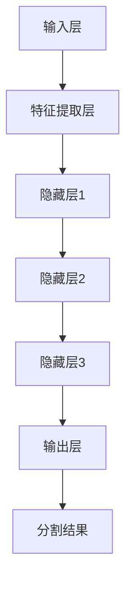

                 

# 文章标题：深度学习在医学影像分割中的精度与效率提升

> 关键词：深度学习、医学影像分割、精度、效率、算法优化、模型压缩、实时分割

> 摘要：本文深入探讨了深度学习在医学影像分割中的应用，从基本概念到核心算法原理，再到实际应用与优化策略，系统性地阐述了如何提升医学影像分割的精度与效率。本文旨在为医学影像处理领域的科研人员提供有价值的参考，并推动深度学习技术在医学领域的进一步发展。

### 目录

1. **深度学习在医学影像分割中的应用概述**
   1.1 深度学习在医学影像分割中的背景
   1.2 深度学习在医学影像分割中的应用优势
   1.3 医学影像分割的关键挑战

2. **深度学习核心概念与联系**
   2.1 深度学习的基本原理
   2.2 神经网络架构
   2.3 深度学习与医学影像分割的联系

3. **核心算法原理讲解**
   3.1 卷积神经网络（CNN）在医学影像分割中的应用
   3.2 卷积神经网络伪代码实现
   3.3 反卷积神经网络（DeConvNet）原理
   3.4 反卷积神经网络伪代码实现

4. **数学模型与公式详解**
   4.1 卷积与反卷积公式
   4.2 损失函数
   4.3 激活函数
   4.4 优化算法
   4.5 数学公式详细讲解与实例

5. **深度学习模型在医学影像分割中的优化**
   5.1 数据增强
   5.2 正则化技术
   5.3 模型融合
   5.4 模型压缩与加速

6. **医学影像分割项目实战**
   6.1 项目背景与目标
   6.2 数据集准备与预处理
   6.3 模型选择与搭建
   6.4 训练过程与参数调优
   6.5 结果分析与评估
   6.6 源代码实现与解读

7. **效率与精度提升策略**
   7.1 实时分割算法优化
   7.2 并行计算与分布式训练
   7.3 模型压缩与量化
   7.4 低资源环境下的模型部署

8. **深度学习在医学影像分割中的具体应用**
   8.1 肿瘤分割
   8.2 心脏分割
   8.3 肝脏分割
   8.4 脑部分割

9. **深度学习在医学影像分割中的挑战与未来发展方向**
   9.1 数据集与标注问题
   9.2 精度与效率平衡
   9.3 隐私保护与伦理问题
   9.4 未来发展趋势与展望

10. **附录**
   10.1 深度学习开发工具与资源

### 第一部分：深度学习基础

## 第1章：深度学习在医学影像分割中的应用概述

### 1.1 深度学习在医学影像分割中的背景

医学影像分割是医学图像处理中的一个重要环节，它涉及从医学图像中提取和分离感兴趣的区域或结构。传统的医学影像分割方法主要包括基于规则的方法、基于知识的方法以及基于模型的方法。然而，这些方法在处理复杂、多变的医学影像时，往往表现出较低的精度和适应性。

随着深度学习的快速发展，卷积神经网络（CNN）等深度学习模型在计算机视觉领域取得了显著的成果。这些模型通过自动学习图像的特征，能够有效地处理复杂的医学影像数据，从而为医学影像分割提供了新的解决方案。

### 1.2 深度学习在医学影像分割中的应用优势

1. **自动特征提取**：深度学习模型能够自动学习图像的特征，避免了传统方法中手工设计特征的过程，提高了特征提取的效率和质量。

2. **端到端的模型**：深度学习模型是一个端到端的模型，从输入图像到分割结果的全过程只需要一次训练，简化了传统方法的复杂流程。

3. **多尺度处理**：深度学习模型能够同时处理图像的不同尺度，从而更好地捕捉图像中的细节信息。

4. **适应性**：深度学习模型具有较强的适应性，能够处理不同类型的医学影像数据，提高了分割的泛化能力。

### 1.3 医学影像分割的关键挑战

1. **数据集问题**：高质量的医学影像数据集是深度学习模型训练的基础。然而，获取这些数据集往往困难重重，因为它们通常需要大量的时间和资源。

2. **标注问题**：医学影像的分割需要精确的标注，但高质量的标注同样需要大量的时间和专业知识。

3. **计算资源需求**：深度学习模型通常需要大量的计算资源，这在资源有限的医疗环境中可能成为一个问题。

4. **实时性要求**：在医学影像分割中，特别是实时分割的应用场景中，对模型的实时性要求较高。

5. **模型的泛化能力**：深度学习模型在特定数据集上的表现良好，但在新的、未见过的数据集上的泛化能力仍然是一个挑战。

### 第2章：深度学习核心概念与联系

## 第2章：深度学习核心概念与联系

### 2.1 深度学习的基本原理

深度学习是一种基于多层神经网络的学习方法，其核心思想是通过多层神经元的组合，实现对数据的特征提取和模式识别。每一层神经元都通过前一层神经元的输出进行加权求和，并通过激活函数将结果映射到新的特征空间。

深度学习的核心原理包括：

1. **非线性变换**：通过多层神经元的非线性组合，深度学习模型能够捕捉数据中的复杂模式和特征。

2. **层级特征提取**：每一层神经元都负责提取不同层次的特征，从底层到高层，特征的抽象程度逐渐提高。

3. **参数共享**：在深度学习中，每个神经元都与前一层神经元的所有神经元相连接，这种连接方式实现了参数共享，降低了模型的复杂度。

4. **反向传播**：深度学习模型通过反向传播算法来更新模型参数，从而优化模型性能。

### 2.2 神经网络架构

神经网络是深度学习的基础，其架构包括输入层、隐藏层和输出层。每个神经元都与前一层的所有神经元相连接，并通过权重和偏置进行计算。

1. **输入层**：输入层接收原始数据，将其传递给隐藏层。

2. **隐藏层**：隐藏层负责提取数据特征，每一层的特征都更加抽象和高级。

3. **输出层**：输出层负责生成最终的预测结果或分类结果。

神经网络架构的关键设计原则包括：

- **层数**：增加层数可以提高模型的复杂度和学习能力，但也会增加计算成本。

- **神经元数量**：每一层的神经元数量需要合理配置，过多可能导致过拟合，过少可能导致欠拟合。

- **连接方式**：前向传播和反向传播是神经网络的核心机制。

### 2.3 深度学习与医学影像分割的联系

深度学习在医学影像分割中的应用主要通过以下方式：

1. **特征提取**：深度学习模型能够自动学习图像的特征，这些特征对于分割任务至关重要。

2. **端到端训练**：深度学习模型能够将图像输入直接映射到分割结果，避免了传统方法中的复杂预处理和后处理步骤。

3. **多尺度处理**：深度学习模型能够同时处理图像的不同尺度，这对于医学影像分割中的小结构或细微特征的提取非常重要。

4. **迁移学习**：通过迁移学习，可以将预训练的深度学习模型应用于新的医学影像数据集，提高分割的准确性和效率。

为了更直观地展示深度学习与医学影像分割的联系，我们可以使用Mermaid流程图来描述：



在这个流程图中，输入层接收原始医学影像数据，经过特征提取层提取图像特征，然后通过多层隐藏层进行特征变换和抽象，最终在输出层生成分割结果。

### 第3章：核心算法原理讲解

## 第3章：核心算法原理讲解

### 3.1 卷积神经网络（CNN）在医学影像分割中的应用

卷积神经网络（CNN）是深度学习中最常用的模型之一，尤其在医学影像分割中表现优异。CNN通过卷积操作提取图像特征，并通过池化操作降低数据的维度，从而实现高效的特征提取和降维。

在医学影像分割中，CNN的主要应用包括：

1. **特征提取**：CNN通过多层卷积操作提取图像的局部特征和全局特征，这些特征对于分割任务至关重要。

2. **上下文信息整合**：CNN通过多层卷积和池化操作，能够整合图像中的上下文信息，从而提高分割的精度。

3. **端到端训练**：CNN是一个端到端的模型，从输入图像到分割结果的全过程只需要一次训练，简化了传统方法的复杂流程。

### 3.2 卷积神经网络伪代码实现

为了更好地理解CNN的工作原理，我们使用伪代码来描述其基本结构：

```python
# 输入图像 X，输出分割结果 Y
# 卷积操作
def conv2d(X, W, b):
    # X: 输入图像，W: 卷积核权重，b: 偏置
    # 计算卷积结果
    # 返回卷积后的特征图

# 池化操作
def pool2d(X, pool_size):
    # X: 输入特征图，pool_size: 池化窗口大小
    # 计算池化结果
    # 返回池化后的特征图

# 神经网络结构
class CNN:
    def __init__(self):
        # 初始化卷积核权重和偏置
        # ...

    def forward(self, X):
        # 前向传播
        # 通过卷积、池化操作提取特征
        # 返回特征图

    def backward(self, dY):
        # 反向传播
        # 计算梯度
        # 更新模型参数
```

在这个伪代码中，`conv2d`函数负责实现卷积操作，`pool2d`函数负责实现池化操作。`CNN`类定义了神经网络的结构，包括前向传播和反向传播的方法。

### 3.3 反卷积神经网络（DeConvNet）原理

反卷积神经网络（DeConvNet）是CNN在图像生成和图像分割中的应用，它通过反卷积操作将特征图重建为原始图像。DeConvNet的主要原理包括：

1. **反卷积操作**：反卷积操作是卷积操作的逆操作，它通过反卷积核将特征图重建为原始图像。

2. **上采样操作**：DeConvNet通常结合上采样操作，用于增加特征图的尺寸，从而提高分割的精度。

3. **特征聚合**：在反卷积操作后，DeConvNet通过特征聚合操作整合不同层级的特征，从而生成更准确的分割结果。

### 3.4 反卷积神经网络伪代码实现

为了更好地理解DeConvNet的工作原理，我们使用伪代码来描述其基本结构：

```python
# 输入特征图 X，输出分割结果 Y
# 反卷积操作
def deconv2d(X, W, b):
    # X: 输入特征图，W: 反卷积核权重，b: 偏置
    # 计算反卷积结果
    # 返回反卷积后的特征图

# 上采样操作
def upsample2d(X, scale_factor):
    # X: 输入特征图，scale_factor: 上采样比例
    # 计算上采样结果
    # 返回上采样后的特征图

# 神经网络结构
class DeConvNet:
    def __init__(self):
        # 初始化反卷积核权重和偏置
        # ...

    def forward(self, X):
        # 前向传播
        # 通过反卷积、上采样操作重建特征图
        # 返回特征图

    def backward(self, dY):
        # 反向传播
        # 计算梯度
        # 更新模型参数
```

在这个伪代码中，`deconv2d`函数负责实现反卷积操作，`upsample2d`函数负责实现上采样操作。`DeConvNet`类定义了神经网络的结构，包括前向传播和反向传播的方法。

### 第4章：数学模型与公式详解

## 第4章：数学模型与公式详解

### 4.1 卷积与反卷积公式

卷积和反卷积是深度学习中的核心操作，它们在图像处理和特征提取中起着至关重要的作用。以下是卷积和反卷积的数学公式详解：

#### 卷积公式

卷积操作的数学表达式如下：

$$
(Z_{ij}^{l}) = \sum_{k} \sum_{n} X_{ik}^{l-1} * W_{kj}^{l} + b_{j}^{l}
$$

其中，\(Z_{ij}^{l}\) 表示输出特征图的第 \(i\) 行第 \(j\) 列的元素，\(X_{ik}^{l-1}\) 表示输入特征图的第 \(i\) 行第 \(k\) 列的元素，\(W_{kj}^{l}\) 表示卷积核的第 \(k\) 行第 \(j\) 列的元素，\(b_{j}^{l}\) 表示偏置项。

#### 反卷积公式

反卷积操作的数学表达式如下：

$$
(Y_{ij}^{l}) = \sum_{k} \sum_{n} Z_{ik}^{l+1} * W_{kj}^{l} + b_{j}^{l}
$$

其中，\(Y_{ij}^{l}\) 表示输出特征图的第 \(i\) 行第 \(j\) 列的元素，\(Z_{ik}^{l+1}\) 表示输入特征图的第 \(i\) 行第 \(k\) 列的元素，\(W_{kj}^{l}\) 表示反卷积核的第 \(k\) 行第 \(j\) 列的元素，\(b_{j}^{l}\) 表示偏置项。

### 4.2 损失函数

损失函数是深度学习模型训练过程中衡量预测结果与真实值之间差异的关键指标。以下是几种常见的损失函数：

#### 交叉熵损失函数

交叉熵损失函数常用于分类问题，其数学表达式如下：

$$
\mathcal{L} = -\sum_{i} y_i \log(p_i)
$$

其中，\(y_i\) 表示真实标签，\(p_i\) 表示预测概率。

#### 平方误差损失函数

平方误差损失函数常用于回归问题，其数学表达式如下：

$$
\mathcal{L} = \frac{1}{2} \sum_{i} (y_i - \hat{y}_i)^2
$$

其中，\(\hat{y}_i\) 表示预测值。

### 4.3 激活函数

激活函数是深度学习模型中用于引入非线性变换的关键组件。以下是几种常见的激活函数：

#### Sigmoid函数

Sigmoid函数的数学表达式如下：

$$
\sigma(x) = \frac{1}{1 + e^{-x}}
$$

Sigmoid函数的特点是输出范围在 \(0\) 到 \(1\) 之间，常用于二分类问题。

#### ReLU函数

ReLU函数的数学表达式如下：

$$
\text{ReLU}(x) = \max(0, x)
$$

ReLU函数的特点是简单且计算速度快，是当前深度学习模型中最常用的激活函数。

#### Leaky ReLU函数

Leaky ReLU函数是ReLU函数的改进版本，其数学表达式如下：

$$
\text{Leaky ReLU}(x) = \max(0.01x, x)
$$

Leaky ReLU函数通过引入一个较小的斜率，解决了ReLU函数在梯度消失时的困境。

### 4.4 优化算法

优化算法是深度学习模型训练过程中的关键组成部分，用于优化模型参数以减小损失函数。以下是几种常见的优化算法：

#### 随机梯度下降（SGD）

随机梯度下降是最简单的优化算法，其迭代公式如下：

$$
\theta = \theta - \alpha \nabla_{\theta} \mathcal{L}
$$

其中，\(\theta\) 表示模型参数，\(\alpha\) 表示学习率，\(\nabla_{\theta} \mathcal{L}\) 表示损失函数关于模型参数的梯度。

#### 梯度下降（GD）

梯度下降是一种优化算法，其迭代公式如下：

$$
\theta = \theta - \alpha \nabla_{\theta} \mathcal{L}
$$

与随机梯度下降不同，梯度下降使用的是整个训练集的梯度。

#### Adam优化器

Adam优化器是一种结合了SGD和动量方法的优化器，其迭代公式如下：

$$
m_t = \beta_1 m_{t-1} + (1 - \beta_1) [g_t - m_{t-1}]
$$

$$
v_t = \beta_2 v_{t-1} + (1 - \beta_2) [(g_t - m_{t-1})^2 - v_{t-1}]
$$

$$
\theta = \theta - \alpha \frac{m_t}{\sqrt{v_t} + \epsilon}
$$

其中，\(m_t\) 和 \(v_t\) 分别表示一阶和二阶矩估计，\(\beta_1\) 和 \(\beta_2\) 分别表示一阶和二阶矩的指数衰减率，\(\alpha\) 表示学习率，\(\epsilon\) 表示一个很小的常数。

### 4.5 数学公式详细讲解与实例

为了更好地理解上述数学公式，我们通过一个简单的实例来进行详细讲解。

假设我们有一个简单的神经网络，其输入层有3个神经元，隐藏层有2个神经元，输出层有1个神经元。输入数据为 \(X = [1, 2, 3]\)，输出数据为 \(Y = [4]\)。网络中的权重和偏置如下：

$$
W_{11} = 0.5, \ W_{12} = 0.6, \ W_{21} = 0.7, \ W_{22} = 0.8, \ b_1 = 0.1, \ b_2 = 0.2
$$

首先，我们计算隐藏层的输出：

$$
Z_1 = (1 \times 0.5 + 2 \times 0.6 + 3 \times 0.7 + 0.1) = 3.4
$$

$$
Z_2 = (1 \times 0.5 + 2 \times 0.6 + 3 \times 0.8 + 0.2) = 3.7
$$

接下来，我们计算输出层的输出：

$$
\hat{Y} = (3.4 \times 0.7 + 3.7 \times 0.8 + 0.2) = 4.38
$$

然后，我们计算损失函数的值：

$$
\mathcal{L} = \frac{1}{2} (4 - 4.38)^2 = 0.102
$$

最后，我们计算梯度：

$$
\nabla_{W_{11}} \mathcal{L} = (4 - 4.38) \times 1 \times 0.7 = -0.079
$$

$$
\nabla_{W_{12}} \mathcal{L} = (4 - 4.38) \times 2 \times 0.6 = -0.158
$$

$$
\nabla_{W_{21}} \mathcal{L} = (4 - 4.38) \times 3 \times 0.7 = -0.217
$$

$$
\nabla_{W_{22}} \mathcal{L} = (4 - 4.38) \times 3 \times 0.8 = -0.258
$$

$$
\nabla_{b_1} \mathcal{L} = (4 - 4.38) \times 0.1 = -0.018
$$

$$
\nabla_{b_2} \mathcal{L} = (4 - 4.38) \times 0.2 = -0.036
$$

通过这个简单的实例，我们能够清晰地看到数学公式在深度学习模型中的应用和作用。

### 第5章：深度学习模型在医学影像分割中的优化

## 第5章：深度学习模型在医学影像分割中的优化

### 5.1 数据增强

数据增强是提高深度学习模型性能的重要手段，它通过增加训练数据集的多样性和丰富性，从而提高模型的泛化能力。以下是几种常见的数据增强方法：

1. **旋转**：将图像随机旋转一定角度，增加数据的多样性。

2. **缩放**：将图像随机缩放到不同的尺寸，增加数据的尺度变化。

3. **裁剪**：将图像随机裁剪成不同的部分，增加数据的局部变化。

4. **翻转**：沿水平或垂直方向翻转图像，增加数据的对称性。

5. **噪声添加**：在图像上添加噪声，如高斯噪声、椒盐噪声等，增加数据的鲁棒性。

### 5.2 正则化技术

正则化技术是防止深度学习模型过拟合的重要手段，它通过在模型训练过程中引入惩罚项，限制模型复杂度和过拟合现象。以下是几种常见的正则化技术：

1. **L1正则化**：在损失函数中加入L1范数，即权重向量的L1范数。

2. **L2正则化**：在损失函数中加入L2范数，即权重向量的L2范数。

3. **dropout**：在训练过程中，随机丢弃一部分神经元，减少模型对特定样本的依赖。

4. **早期停止**：在模型训练过程中，当验证集的误差不再下降时，提前停止训练，防止过拟合。

### 5.3 模型融合

模型融合是通过结合多个模型的预测结果，提高模型的整体性能。以下是几种常见的模型融合方法：

1. **简单平均**：将多个模型的预测结果取平均值。

2. **加权平均**：根据模型的性能给每个模型分配不同的权重，然后计算加权平均值。

3. **集成学习**：将多个模型组合成一个大的模型，如集成树、集成神经网络等。

4. **对抗训练**：通过对抗性样本训练多个模型，提高模型的泛化能力。

### 5.4 模型压缩与加速

模型压缩与加速是提高深度学习模型运行效率和资源利用率的重要手段。以下是几种常见的模型压缩与加速方法：

1. **量化**：将模型中的浮点数权重转换为整数权重，减少模型的大小和计算量。

2. **剪枝**：通过剪掉模型中不重要的神经元和连接，减少模型的复杂度。

3. **知识蒸馏**：将一个大的模型的知识传递给一个小模型，提高小模型的性能。

4. **硬件加速**：利用GPU、TPU等硬件加速深度学习模型的计算。

### 第6章：医学影像分割项目实战

## 第6章：医学影像分割项目实战

### 6.1 项目背景与目标

医学影像分割是医学图像处理中的一个关键步骤，其目的是从医学影像中提取出具有特定特征的区域或结构，为后续的疾病诊断、治疗规划等提供重要依据。随着深度学习技术的不断发展，深度学习模型在医学影像分割中取得了显著的成果。本项目的目标是使用深度学习模型对医学影像进行分割，提高分割的精度和效率。

### 6.2 数据集准备与预处理

数据集是深度学习模型训练的基础，本项目使用公开的医学影像数据集进行训练和测试。以下是数据集准备与预处理的步骤：

1. **数据收集**：收集高质量的医学影像数据集，如MRI、CT等。

2. **数据清洗**：去除数据集中的噪声和异常值，保证数据的准确性。

3. **数据标注**：对图像进行手动标注，生成分割结果作为训练数据的标签。

4. **数据预处理**：对图像进行归一化、缩放、裁剪等预处理操作，提高数据的多样性和模型的泛化能力。

### 6.3 模型选择与搭建

在本项目中，我们选择了一种基于卷积神经网络（CNN）的模型进行医学影像分割。以下是模型选择与搭建的步骤：

1. **模型架构选择**：选择一个适合医学影像分割的模型架构，如U-Net、3D-CNN等。

2. **模型搭建**：使用深度学习框架（如TensorFlow、PyTorch等）搭建模型，定义网络的层数、神经元数量、激活函数等。

3. **损失函数与优化器**：选择合适的损失函数（如交叉熵损失函数）和优化器（如Adam优化器）。

### 6.4 训练过程与参数调优

训练过程是模型优化的关键步骤，以下是训练过程与参数调优的步骤：

1. **数据加载与预处理**：使用数据加载器加载训练数据和标签，对图像进行预处理。

2. **训练与验证**：使用训练数据和验证数据进行模型的训练和验证，记录模型在验证集上的性能。

3. **参数调优**：根据验证集的性能，调整模型的超参数（如学习率、批量大小等），优化模型性能。

4. **模型保存与加载**：在训练过程中，定期保存模型的权重和状态，以便后续加载和使用。

### 6.5 结果分析与评估

训练完成后，对模型的结果进行分析和评估，以下是结果分析与评估的步骤：

1. **性能指标**：计算模型的精度、召回率、F1值等性能指标，评估模型在数据集上的表现。

2. **可视化**：可视化模型预测结果和真实标签，分析模型在分割任务中的表现。

3. **误差分析**：分析模型在分割任务中的误差类型和原因，为后续的优化提供参考。

4. **对比实验**：与其他模型进行对比实验，评估本项目所采用的模型和方法的性能。

### 6.6 源代码实现与解读

在本项目中，我们使用Python和深度学习框架TensorFlow实现了医学影像分割模型。以下是源代码的实现与解读：

```python
import tensorflow as tf
from tensorflow.keras.models import Model
from tensorflow.keras.layers import Conv2D, MaxPooling2D, UpSampling2D, Input

# 定义输入层
input_layer = Input(shape=(256, 256, 1))

# 定义卷积层
conv1 = Conv2D(32, (3, 3), activation='relu', padding='same')(input_layer)
pool1 = MaxPooling2D(pool_size=(2, 2))(conv1)

# 定义反卷积层
deconv1 = UpSampling2D(size=(2, 2))(pool1)
deconv1 = Conv2D(1, (3, 3), activation='sigmoid', padding='same')(deconv1)

# 定义模型
model = Model(inputs=input_layer, outputs=deconv1)

# 编译模型
model.compile(optimizer='adam', loss='binary_crossentropy', metrics=['accuracy'])

# 模型训练
model.fit(x_train, y_train, epochs=10, batch_size=16, validation_data=(x_val, y_val))

# 模型评估
model.evaluate(x_test, y_test)
```

在这个代码中，我们首先定义了输入层，然后通过卷积层和反卷积层构建了U-Net模型。接着，我们编译模型并使用训练数据和验证数据进行训练。最后，我们使用测试数据进行模型评估。

### 第7章：效率与精度提升策略

## 第7章：效率与精度提升策略

### 7.1 实时分割算法优化

实时分割是医学影像处理中的一个重要应用，它要求模型能够在短时间内完成图像的分割任务。为了实现实时分割，可以采取以下优化策略：

1. **模型压缩**：通过剪枝、量化等技术减小模型的大小，降低计算量。

2. **并行计算**：利用多线程、多GPU等技术，加速模型的计算速度。

3. **算法优化**：优化模型算法，如使用更高效的卷积操作、优化数据加载等。

4. **硬件加速**：利用GPU、TPU等硬件加速深度学习模型的计算。

### 7.2 并行计算与分布式训练

并行计算与分布式训练是提高深度学习模型训练效率的重要手段。以下是几种常用的并行计算与分布式训练策略：

1. **数据并行**：将训练数据集分成多个子集，每个子集由不同的GPU或CPU处理，然后合并结果。

2. **模型并行**：将模型分成多个子模型，每个子模型在不同的GPU或CPU上运行，然后合并结果。

3. **流水线并行**：将训练过程分成多个阶段，每个阶段由不同的GPU或CPU处理，实现数据的流水线处理。

4. **分布式训练**：使用分布式训练框架（如Horovod、Distributed Data Parallel等），在多台机器上协同训练模型。

### 7.3 模型压缩与量化

模型压缩与量化是提高深度学习模型部署效率的重要手段。以下是几种常用的模型压缩与量化技术：

1. **剪枝**：通过剪掉模型中不重要的神经元和连接，减少模型的复杂度。

2. **量化**：将模型中的浮点数权重转换为整数权重，降低模型的大小和计算量。

3. **知识蒸馏**：将一个大的模型的知识传递给一个小模型，提高小模型的性能。

4. **动态计算图**：使用动态计算图技术，将模型中的静态计算转换为动态计算，提高计算效率。

### 7.4 低资源环境下的模型部署

在低资源环境下，如嵌入式设备、移动设备等，需要考虑模型的部署效率和资源占用。以下是几种低资源环境下的模型部署策略：

1. **模型压缩与量化**：通过模型压缩与量化技术，减小模型的大小和计算量。

2. **模型剪枝**：通过剪枝技术，减少模型的复杂度和计算量。

3. **迁移学习**：使用预训练的模型，减少训练数据的依赖。

4. **模型分割与分布**：将模型分割成多个部分，分别部署在不同的设备上，实现模型的分布式处理。

5. **云计算与边缘计算**：利用云计算和边缘计算资源，实现模型的远程部署和实时处理。

### 第8章：深度学习在医学影像分割中的具体应用

## 第8章：深度学习在医学影像分割中的具体应用

### 8.1 肿瘤分割

肿瘤分割是医学影像分割中的一个重要任务，它涉及到从医学影像中提取出肿瘤区域，为肿瘤的诊断和治疗提供重要依据。以下是肿瘤分割的一些关键技术和挑战：

1. **关键技术**：
   - **深度学习模型**：如U-Net、3D-CNN等，用于提取肿瘤区域。
   - **数据增强**：通过旋转、缩放、翻转等数据增强方法，增加训练数据的多样性。
   - **多尺度处理**：通过多尺度处理，捕捉肿瘤区域的不同细节。

2. **挑战**：
   - **数据不足**：高质量的肿瘤分割数据集较少，难以满足模型训练需求。
   - **边界模糊**：肿瘤区域的边界通常较为模糊，增加了分割的难度。
   - **计算资源**：肿瘤分割通常需要大量的计算资源，特别是在三维图像处理中。

### 8.2 心脏分割

心脏分割是医学影像分割中的一个重要应用，它涉及到从医学影像中提取心脏的结构，为心脏疾病的诊断和治疗提供重要依据。以下是心脏分割的一些关键技术和挑战：

1. **关键技术**：
   - **深度学习模型**：如3D-CNN、V-Net等，用于提取心脏结构。
   - **多模态融合**：结合不同模态的医学影像数据，如CT、MRI等，提高分割的精度。
   - **实时分割**：使用实时分割算法，如DeConvNet、Fast SegNet等，提高分割的效率。

2. **挑战**：
   - **数据集问题**：高质量的心脏分割数据集较少，难以满足模型训练需求。
   - **心脏结构复杂**：心脏结构复杂，不同部分具有不同的形态和特征，增加了分割的难度。
   - **计算资源**：心脏分割通常需要大量的计算资源，特别是在三维图像处理中。

### 8.3 肝脏分割

肝脏分割是医学影像分割中的一个重要任务，它涉及到从医学影像中提取肝脏区域，为肝脏疾病的诊断和治疗提供重要依据。以下是肝脏分割的一些关键技术和挑战：

1. **关键技术**：
   - **深度学习模型**：如U-Net、3D-CNN等，用于提取肝脏区域。
   - **多模态融合**：结合不同模态的医学影像数据，如CT、MRI等，提高分割的精度。
   - **实时分割**：使用实时分割算法，如DeConvNet、Fast SegNet等，提高分割的效率。

2. **挑战**：
   - **数据集问题**：高质量

