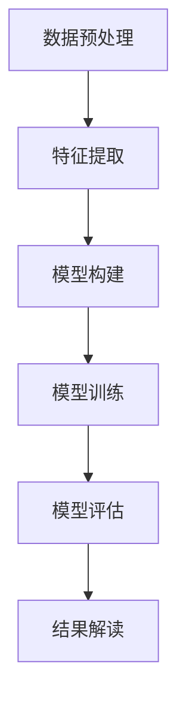

                 

### 文章标题

# 深度学习在基因组学中的创新应用

### 关键词

- 深度学习
- 基因组学
- 基因表达分析
- 基因变异检测
- 基因组序列分析
- 个性化医学

### 摘要

随着深度学习技术的飞速发展，其在各个领域的应用越来越广泛。基因组学作为生命科学的前沿领域，得益于深度学习技术，取得了诸多突破性进展。本文将详细介绍深度学习在基因组学中的创新应用，包括基因表达分析、基因变异检测和基因组序列分析等，并探讨深度学习在个性化医学等领域的未来展望。通过本文，读者可以全面了解深度学习技术在基因组学中的应用现状和发展趋势，以及面临的挑战和解决思路。

### 目录

#### 第一部分：深度学习基础与基因组学基础

#### 第1章：深度学习概述与基因组学简介  
##### 1.1 深度学习的核心概念与原理  
##### 1.2 基因组学的基础知识

#### 第2章：深度学习在基因组学中的应用  
##### 2.1 基因表达分析的深度学习模型  
##### 2.2 基因变异检测的深度学习方法  
##### 2.3 執行深度学习在基因组序列分析中的应用

#### 第二部分：深度学习在基因组学研究中的应用实践

#### 第3章：深度学习在基因组学研究中的实战案例  
##### 3.1 基因表达预测案例分析  
##### 3.2 基因变异检测案例分析  
##### 3.3 基因组序列分析案例分析

#### 第4章：深度学习在基因组学应用中的挑战与展望  
##### 4.1 深度学习在基因组学应用中的挑战  
##### 4.2 深度学习在基因组学领域的未来展望

#### 第5章：深度学习工具与资源介绍  
##### 5.1 常用的深度学习框架  
##### 5.2 基因组学相关数据集与工具

#### 附录

##### 附录 A：深度学习在基因组学中的应用流程图  
##### 附录 B：深度学习算法伪代码  
##### 附录 C：深度学习在基因组学中的应用实例代码解析

### 引言

基因组学作为生命科学的核心领域，近年来取得了飞速发展。然而，随着基因组数据的爆炸式增长，传统的基因组学分析方法已经无法满足海量数据处理的挑战。与此同时，深度学习作为一种强大的机器学习技术，以其独特的网络结构和强大的学习能力，在图像识别、自然语言处理等领域取得了卓越的成果。这一背景下，深度学习在基因组学中的应用逐渐成为研究热点。

本文旨在深入探讨深度学习在基因组学中的创新应用，包括基因表达分析、基因变异检测和基因组序列分析等，并通过具体案例展示深度学习在基因组学中的实际应用效果。此外，本文还将探讨深度学习在个性化医学等领域的未来展望，以及面临的挑战和解决思路。

首先，本文将简要介绍深度学习的核心概念和原理，以及基因组学的基础知识。接下来，我们将分别探讨深度学习在基因组学中的具体应用，包括基因表达分析、基因变异检测和基因组序列分析。在第二部分，我们将通过具体案例展示深度学习在基因组学中的实际应用效果。最后，本文将探讨深度学习在基因组学领域的未来展望，以及面临的挑战和解决思路。

通过本文的探讨，我们希望能够帮助读者全面了解深度学习在基因组学中的应用现状和发展趋势，以及如何充分利用深度学习技术解决基因组学研究中的难题。同时，本文也旨在为从事基因组学和深度学习研究的学者提供一些有价值的参考和启示。

#### 第1章：深度学习概述与基因组学简介

##### 1.1 深度学习的核心概念与原理

深度学习是一种基于人工神经网络的机器学习技术，其核心思想是通过多层神经网络来模拟人类大脑的学习过程，实现对复杂数据的分析和处理。深度学习的主要优势在于其强大的特征自动提取能力和高度并行计算的能力，这使得它在图像识别、自然语言处理和基因组学等众多领域取得了显著的成果。

**深度学习的发展历程**

深度学习的发展历程可以追溯到1980年代。当时，科学家们首次提出了反向传播算法（Backpropagation Algorithm），这一算法奠定了深度学习的基础。然而，由于计算资源和数据集的限制，深度学习在很长一段时间内并未得到广泛应用。直到2000年代，随着计算机性能的不断提高和大数据的涌现，深度学习才逐渐崭露头角。

2006年，Hinton等人提出了深度信念网络（Deep Belief Network，DBN），这是第一个真正意义上的深度学习模型。随后，2012年，Hinton领导的团队在ImageNet图像识别比赛中，利用深度卷积神经网络（Convolutional Neural Network，CNN）取得了重大突破，使得深度学习在图像识别领域得到了广泛关注。

**深度学习的基本原理**

深度学习的基本原理是通过构建多层神经网络，对输入数据进行逐层处理，从而自动提取特征。在深度学习中，每个神经元都接收来自前一层的输入信号，通过激活函数进行非线性变换，然后传递到下一层。这个过程被称为前向传播（Forward Propagation）。

在训练过程中，通过反向传播算法（Backpropagation Algorithm）来更新网络的权重和偏置，以最小化网络的预测误差。反向传播算法的核心思想是利用梯度下降法（Gradient Descent）来调整网络参数，使得网络的预测结果逐渐逼近真实值。

**深度学习的主要模型架构**

深度学习模型种类繁多，其中一些典型的模型包括：

1. **卷积神经网络（Convolutional Neural Network，CNN）**：CNN是一种针对图像处理任务的深度学习模型，其核心思想是通过卷积层（Convolutional Layer）来提取图像的特征。CNN在图像识别、物体检测和图像生成等领域取得了广泛应用。

2. **循环神经网络（Recurrent Neural Network，RNN）**：RNN是一种用于处理序列数据的深度学习模型，其核心思想是通过隐藏状态（Hidden State）的递归连接来捕捉序列中的依赖关系。RNN在自然语言处理、时间序列预测和语音识别等领域取得了显著成果。

3. **长短时记忆网络（Long Short-Term Memory，LSTM）**：LSTM是RNN的一种变体，通过引入门控机制（Gate）来解决RNN在长序列学习中的梯度消失问题。LSTM在时间序列预测、机器翻译和视频分析等领域得到了广泛应用。

4. **生成对抗网络（Generative Adversarial Network，GAN）**：GAN是一种由生成器和判别器组成的深度学习模型，通过两个对抗网络之间的博弈来生成逼真的数据。GAN在图像生成、风格迁移和增强学习等领域取得了显著成果。

##### 1.2 基因组学的基础知识

基因组学是研究生物体基因组（即生物体所有遗传信息的总和）的结构、功能、表达和行为的一门科学。基因组学的研究范围包括基因组序列分析、基因表达分析、基因变异检测和基因组编辑等。

**基因组学的基本概念**

1. **基因组（Genome）**：基因组是指一个生物体全部遗传信息的总和。基因组由DNA序列组成，包括编码区和非编码区。基因（Gene）是基因组中的基本单位，编码特定的蛋白质或RNA分子。

2. **基因表达（Gene Expression）**：基因表达是指基因在细胞内被转录和翻译成蛋白质或RNA分子的过程。基因表达受到多种因素的调控，包括遗传因素、环境因素和细胞状态等。

3. **基因变异（Gene Variant）**：基因变异是指基因序列的变异，包括单核苷酸变异（Single-Nucleotide Variant，SNV）和插入/缺失（Insertion/Deletion，InDel）等。基因变异可能导致基因功能的改变，从而影响生物体的性状。

4. **基因组序列分析（Genome Sequencing Analysis）**：基因组序列分析是指通过高通量测序技术对基因组进行测序和分析，以揭示基因结构、基因表达和基因变异等信息。

**基因组数据的类型与特点**

基因组数据主要包括基因组序列、基因表达数据和基因变异数据等。

1. **基因组序列**：基因组序列是指生物体的DNA序列。基因组序列数据具有高度复杂性和多样性，不同生物体的基因组序列存在显著差异。

2. **基因表达数据**：基因表达数据是指不同基因在不同细胞类型、不同组织和不同环境下的表达水平。基因表达数据通常以转录组（Transcriptome）或表达谱（Expression Profile）的形式表示。

3. **基因变异数据**：基因变异数据是指不同个体之间基因序列的差异。基因变异数据可以帮助揭示基因与疾病之间的关系，对个性化医学具有重要意义。

**基因组学的应用领域**

基因组学在多个领域具有广泛的应用：

1. **医学**：基因组学在医学领域中的应用包括基因诊断、疾病预测和个性化治疗等。通过基因组学分析，可以识别与疾病相关的基因变异，为患者提供个体化的治疗方案。

2. **生物学**：基因组学在生物学领域中的应用包括物种进化研究、基因功能预测和生物信息学等。通过基因组学分析，可以揭示生物体的遗传机制和进化关系。

3. **农业**：基因组学在农业领域中的应用包括作物改良、品种筛选和抗病育种等。通过基因组学分析，可以优化农作物的遗传特性，提高产量和抗逆性。

4. **环境科学**：基因组学在环境科学领域中的应用包括环境监测、生态保护和生物多样性研究等。通过基因组学分析，可以了解生物体与环境之间的相互作用，为环境保护提供科学依据。

通过本章的介绍，我们初步了解了深度学习和基因组学的基础知识。在接下来的章节中，我们将进一步探讨深度学习在基因组学中的具体应用，以及如何利用深度学习技术解决基因组学研究中的难题。

#### 第2章：深度学习在基因组学中的应用

随着深度学习技术的不断发展，其在基因组学中的应用也逐渐深入。本章将介绍深度学习在基因组学中的三个主要应用领域：基因表达分析、基因变异检测和基因组序列分析。通过具体的应用案例，我们将详细探讨这些领域的深度学习模型及其工作原理。

##### 2.1 基因表达分析的深度学习模型

基因表达分析是基因组学的重要研究领域之一，它涉及到从基因表达数据中提取有用信息，以理解基因在生物体发育、疾病发生等过程中的作用。深度学习在基因表达分析中具有显著优势，能够自动提取复杂数据中的特征，提高分析精度。

**循环神经网络（Recurrent Neural Network，RNN）在基因表达数据分析中的应用**

RNN是一种专门用于处理序列数据的深度学习模型，其核心思想是通过隐藏状态（Hidden State）的递归连接来捕捉序列中的依赖关系。在基因表达分析中，RNN可以用来预测基因在不同时间点的表达水平，或识别基因之间的调控关系。

**长短时记忆网络（Long Short-Term Memory，LSTM）与门控循环单元（Gated Recurrent Unit，GRU）在基因表达预测中的应用**

LSTM和GRU是RNN的两种变体，它们通过引入门控机制来缓解RNN在长序列学习中的梯度消失问题。LSTM和GRU在基因表达预测中表现出色，能够有效捕捉基因表达数据中的长期依赖关系。

**核心算法原理讲解：循环神经网络（RNN）与长短时记忆网络（LSTM）**

1. **循环神经网络（RNN）**

RNN的基本结构包括输入层、隐藏层和输出层。输入层接收序列数据，隐藏层通过递归连接来处理序列中的依赖关系，输出层生成预测结果。

\[ h_t = \text{sigmoid}(W_h \cdot [h_{t-1}, x_t] + b_h) \]
\[ y_t = \text{sigmoid}(W_o \cdot h_t + b_o) \]

其中，\( h_t \) 表示第 \( t \) 个时间点的隐藏状态，\( x_t \) 表示第 \( t \) 个时间点的输入数据，\( W_h \) 和 \( b_h \) 分别表示隐藏层的权重和偏置，\( W_o \) 和 \( b_o \) 分别表示输出层的权重和偏置，\( \text{sigmoid} \) 函数是一种激活函数。

2. **长短时记忆网络（LSTM）**

LSTM的基本结构包括输入门、遗忘门和输出门。这三个门分别控制信息的输入、遗忘和输出，从而有效缓解了RNN在长序列学习中的梯度消失问题。

\[ i_t = \text{sigmoid}(W_i \cdot [h_{t-1}, x_t] + b_i) \]
\[ f_t = \text{sigmoid}(W_f \cdot [h_{t-1}, x_t] + b_f) \]
\[ g_t = \text{tanh}(W_g \cdot [h_{t-1}, x_t] + b_g) \]
\[ o_t = \text{sigmoid}(W_o \cdot [h_{t-1}, x_t] + b_o) \]
\[ h_t = o_t \cdot \text{tanh}(c_t) \]
\[ c_t = f_t \cdot c_{t-1} + i_t \cdot g_t \]

其中，\( i_t \)，\( f_t \)，\( g_t \)，\( o_t \) 分别表示输入门、遗忘门、输出门和隐藏状态，\( c_t \) 表示细胞状态，\( W_i \)，\( W_f \)，\( W_g \)，\( W_o \) 分别表示输入门、遗忘门、输出门和隐藏层的权重，\( b_i \)，\( b_f \)，\( b_g \)，\( b_o \) 分别表示输入门、遗忘门、输出门和隐藏层的偏置，\( \text{sigmoid} \) 函数和 \( \text{tanh} \) 函数是激活函数。

**数学模型和公式**

1. **RNN**

\[ h_t = \text{sigmoid}(W_h \cdot [h_{t-1}, x_t] + b_h) \]
\[ y_t = \text{sigmoid}(W_o \cdot h_t + b_o) \]

2. **LSTM**

\[ i_t = \text{sigmoid}(W_i \cdot [h_{t-1}, x_t] + b_i) \]
\[ f_t = \text{sigmoid}(W_f \cdot [h_{t-1}, x_t] + b_f) \]
\[ g_t = \text{tanh}(W_g \cdot [h_{t-1}, x_t] + b_g) \]
\[ o_t = \text{sigmoid}(W_o \cdot [h_{t-1}, x_t] + b_o) \]
\[ h_t = o_t \cdot \text{tanh}(c_t) \]
\[ c_t = f_t \cdot c_{t-1} + i_t \cdot g_t \]

**举例说明**

假设我们有一组基因表达数据，表示为 \( x_1, x_2, ..., x_T \)，其中 \( T \) 表示时间步数。我们可以使用RNN或LSTM模型来预测下一个时间点的基因表达水平 \( y_{T+1} \)。

1. **RNN**

\[ h_T = \text{sigmoid}(W_h \cdot [h_{T-1}, x_T] + b_h) \]
\[ y_{T+1} = \text{sigmoid}(W_o \cdot h_T + b_o) \]

2. **LSTM**

\[ i_T = \text{sigmoid}(W_i \cdot [h_{T-1}, x_T] + b_i) \]
\[ f_T = \text{sigmoid}(W_f \cdot [h_{T-1}, x_T] + b_f) \]
\[ g_T = \text{tanh}(W_g \cdot [h_{T-1}, x_T] + b_g) \]
\[ o_T = \text{sigmoid}(W_o \cdot [h_{T-1}, x_T] + b_o) \]
\[ h_T = o_T \cdot \text{tanh}(c_T) \]
\[ c_T = f_T \cdot c_{T-1} + i_T \cdot g_T \]
\[ y_{T+1} = \text{sigmoid}(W_o \cdot h_T + b_o) \]

**应用案例**

在基因表达预测中，我们可以使用RNN或LSTM模型来预测细胞在不同时间点的基因表达水平。以下是一个简单的应用案例：

1. **数据预处理**：将基因表达数据归一化，并转换为时间步序列。
2. **模型构建**：使用RNN或LSTM模型进行建模。
3. **模型训练**：使用训练数据进行模型训练。
4. **模型评估**：使用测试数据对模型进行评估。

通过上述步骤，我们可以实现基因表达预测，从而帮助研究人员更好地理解基因在不同时间点的调控机制。

##### 2.2 基因变异检测的深度学习方法

基因变异检测是基因组学中的另一个重要任务，旨在识别个体之间基因序列的差异。深度学习在基因变异检测中具有显著优势，能够自动提取特征，提高检测精度。

**卷积神经网络（Convolutional Neural Network，CNN）在基因变异检测中的应用**

CNN是一种专门用于处理图像的深度学习模型，其核心思想是通过卷积层（Convolutional Layer）和池化层（Pooling Layer）来提取图像的特征。在基因变异检测中，CNN可以用来识别基因序列中的变异位置。

**基于注意力的深度学习方法在基因变异检测中的应用**

基于注意力的深度学习模型通过引入注意力机制（Attention Mechanism），可以自动学习不同位置的重要程度，从而提高检测精度。在基因变异检测中，注意力机制可以帮助模型更好地捕捉基因序列中的关键信息。

**核心算法原理讲解：卷积神经网络（CNN）与基于注意力的深度学习方法**

1. **卷积神经网络（CNN）**

CNN的基本结构包括输入层、卷积层、池化层和全连接层。卷积层通过卷积操作来提取图像的特征，池化层用于降低特征图的维度。

\[ f(x) = \text{ReLU}(\sum_{i=1}^{K} w_i \cdot x_i + b) \]

其中，\( f(x) \) 表示卷积操作，\( w_i \) 和 \( b \) 分别表示卷积核和偏置，\( x_i \) 表示输入数据，\( \text{ReLU} \) 函数是一种激活函数。

2. **基于注意力的深度学习方法**

基于注意力的深度学习模型通过引入注意力机制来学习不同位置的重要程度。注意力机制的核心思想是计算每个位置的重要性得分，并将其加权融合。

\[ a_t = \text{softmax}(\frac{e^{U[h_t]}}{\sum_{t=1}^{T} e^{U[h_t]} }) \]
\[ h_{\text{att}} = \sum_{t=1}^{T} a_t \cdot h_t \]

其中，\( a_t \) 表示第 \( t \) 个位置的重要性得分，\( h_t \) 表示第 \( t \) 个位置的隐藏状态，\( U \) 和 \( V \) 分别表示权重矩阵，\( \text{softmax} \) 函数是一种归一化函数。

**数学模型和公式**

1. **CNN**

\[ f(x) = \text{ReLU}(\sum_{i=1}^{K} w_i \cdot x_i + b) \]
\[ x_{\text{pool}} = \frac{1}{P} \sum_{i=1}^{P} f(x) \]

其中，\( P \) 表示池化窗口大小。

2. **基于注意力的深度学习方法**

\[ a_t = \text{softmax}(\frac{e^{U[h_t]}}{\sum_{t=1}^{T} e^{U[h_t]} }) \]
\[ h_{\text{att}} = \sum_{t=1}^{T} a_t \cdot h_t \]

**举例说明**

假设我们有一组基因序列数据，表示为 \( x_1, x_2, ..., x_T \)，其中 \( T \) 表示基因序列的长度。我们可以使用CNN或基于注意力的深度学习方法来检测基因序列中的变异位置。

1. **数据预处理**：将基因序列数据转换为二进制编码，并添加起始和终止标记。
2. **模型构建**：使用CNN或基于注意力的深度学习模型进行建模。
3. **模型训练**：使用训练数据进行模型训练。
4. **模型评估**：使用测试数据对模型进行评估。

通过上述步骤，我们可以实现基因变异检测，从而帮助研究人员更好地理解基因序列的差异和功能。

**应用案例**

在基因变异检测中，我们可以使用CNN或基于注意力的深度学习模型来检测基因序列中的单核苷酸变异（SNV）和插入/缺失（InDel）。以下是一个简单的应用案例：

1. **数据预处理**：将基因序列数据转换为二进制编码，并添加起始和终止标记。
2. **模型构建**：使用CNN或基于注意力的深度学习模型进行建模。
3. **模型训练**：使用训练数据进行模型训练。
4. **模型评估**：使用测试数据对模型进行评估。

通过上述步骤，我们可以实现基因变异检测，从而帮助研究人员更好地理解基因序列的差异和功能。

##### 2.3 深度学习在基因组序列分析中的应用

基因组序列分析是基因组学的核心任务之一，旨在从基因组序列中提取有用的信息，以揭示基因的结构和功能。深度学习在基因组序列分析中具有显著优势，能够自动提取特征，提高分析精度。

**序列比对与分类的深度学习方法**

序列比对是指将两个或多个基因序列进行比对，以找出它们之间的相似性和差异。分类是指根据基因序列的特征将基因分为不同的类别。深度学习可以通过学习大量已知基因序列的特征，从而实现序列比对与分类。

**基于深度学习的基因家族识别方法**

基因家族是指一类具有相似结构和功能的基因。基于深度学习的基因家族识别方法可以通过学习基因序列的特征，自动识别基因家族。这种方法可以大大提高基因家族识别的精度和效率。

**核心算法原理讲解：序列比对与分类的深度学习方法**

1. **序列比对**

序列比对是指将两个基因序列进行比对，以找出它们之间的相似性和差异。深度学习可以通过学习大量已知序列比对数据，从而实现序列比对。

2. **分类**

分类是指根据基因序列的特征将基因分为不同的类别。深度学习可以通过学习大量已知分类数据，从而实现分类。

**数学模型和公式**

1. **序列比对**

\[ \text{score} = \sum_{i=1}^{L} \sum_{j=1}^{M} s_{ij} \]

其中，\( L \) 和 \( M \) 分别表示两个基因序列的长度，\( s_{ij} \) 表示第 \( i \) 个位置和第 \( j \) 个位置的相似性得分。

2. **分类**

\[ y = \text{softmax}(\text{W} \cdot h + b) \]

其中，\( y \) 表示分类结果，\( \text{W} \) 和 \( b \) 分别表示权重和偏置，\( h \) 表示隐藏状态。

**举例说明**

假设我们有一组基因序列数据，表示为 \( x_1, x_2, ..., x_T \)，其中 \( T \) 表示基因序列的长度。我们可以使用深度学习模型来实现序列比对与分类。

1. **数据预处理**：将基因序列数据转换为向量化表示，并添加起始和终止标记。
2. **模型构建**：使用序列比对与分类的深度学习模型进行建模。
3. **模型训练**：使用训练数据进行模型训练。
4. **模型评估**：使用测试数据对模型进行评估。

通过上述步骤，我们可以实现基因序列分析，从而帮助研究人员更好地理解基因的结构和功能。

**应用案例**

在基因序列分析中，我们可以使用深度学习模型来实现序列比对与分类。以下是一个简单的应用案例：

1. **数据预处理**：将基因序列数据转换为向量化表示，并添加起始和终止标记。
2. **模型构建**：使用序列比对与分类的深度学习模型进行建模。
3. **模型训练**：使用训练数据进行模型训练。
4. **模型评估**：使用测试数据对模型进行评估。

通过上述步骤，我们可以实现基因序列分析，从而帮助研究人员更好地理解基因的结构和功能。

##### 2.4 基因组注释与功能预测的深度学习方法

基因组注释是指识别基因组中的基因、调控元件和其他功能区域，并为其分配生物学功能。基因组功能预测是指根据基因组序列信息预测基因的功能。深度学习技术在基因组注释和功能预测中具有显著优势，能够自动提取特征，提高预测精度。

**基于深度学习的基因组注释方法**

基于深度学习的基因组注释方法通过学习已知基因和调控元件的特征，自动识别基因组中的基因、调控元件等。这种方法可以大大提高基因组注释的精度和效率。

**蛋白质功能预测的深度学习模型**

蛋白质功能预测是指根据蛋白质的序列信息预测其功能。深度学习模型可以通过学习大量已知蛋白质的功能数据，从而实现蛋白质功能预测。

**核心算法原理讲解：基于深度学习的基因组注释方法**

1. **编码器-解码器（Encoder-Decoder）模型**

编码器-解码器模型是一种广泛应用于序列生成任务的深度学习模型。在基因组注释中，编码器将基因组序列编码为固定长度的向量，解码器则根据编码器的输出生成基因组注释。

\[ h = \text{Encoder}(x) \]
\[ y = \text{Decoder}(h) \]

其中，\( x \) 表示基因组序列，\( h \) 表示编码器输出的向量，\( y \) 表示基因组注释。

2. **注意力机制**

注意力机制可以用于编码器-解码器模型，以帮助模型更好地捕捉基因组序列中的依赖关系。

\[ a_t = \text{softmax}(\frac{e^{U[h_t]}}{\sum_{t=1}^{T} e^{U[h_t]} }) \]
\[ h_{\text{att}} = \sum_{t=1}^{T} a_t \cdot h_t \]

其中，\( a_t \) 表示第 \( t \) 个位置的重要性得分，\( h_t \) 表示第 \( t \) 个位置的隐藏状态。

**数学模型和公式**

1. **编码器-解码器模型**

\[ h = \text{Encoder}(x) \]
\[ y = \text{Decoder}(h) \]

2. **注意力机制**

\[ a_t = \text{softmax}(\frac{e^{U[h_t]}}{\sum_{t=1}^{T} e^{U[h_t]} }) \]
\[ h_{\text{att}} = \sum_{t=1}^{T} a_t \cdot h_t \]

**举例说明**

假设我们有一组基因组序列数据，表示为 \( x_1, x_2, ..., x_T \)，其中 \( T \) 表示基因组序列的长度。我们可以使用编码器-解码器模型来实现基因组注释。

1. **数据预处理**：将基因组序列数据转换为向量化表示，并添加起始和终止标记。
2. **模型构建**：使用编码器-解码器模型进行建模。
3. **模型训练**：使用训练数据进行模型训练。
4. **模型评估**：使用测试数据对模型进行评估。

通过上述步骤，我们可以实现基因组注释，从而帮助研究人员更好地理解基因的结构和功能。

**应用案例**

在基因组注释中，我们可以使用编码器-解码器模型来实现基因组注释。以下是一个简单的应用案例：

1. **数据预处理**：将基因组序列数据转换为向量化表示，并添加起始和终止标记。
2. **模型构建**：使用编码器-解码器模型进行建模。
3. **模型训练**：使用训练数据进行模型训练。
4. **模型评估**：使用测试数据对模型进行评估。

通过上述步骤，我们可以实现基因组注释，从而帮助研究人员更好地理解基因的结构和功能。

#### 第二部分：深度学习在基因组学研究中的应用实践

在上一部分，我们介绍了深度学习在基因组学中的几个主要应用领域，包括基因表达分析、基因变异检测、基因组序列分析和基因组注释与功能预测。在本部分，我们将通过具体案例展示深度学习在基因组学研究中的实际应用效果，帮助读者更好地理解深度学习技术在实际研究中的应用过程。

##### 3.1 基因表达预测案例分析

基因表达预测是基因组学中一个重要的研究方向，旨在预测基因在不同时间点或不同条件下的表达水平。以下是一个基因表达预测的案例分析。

**案例背景与目标**

某研究团队旨在预测小鼠在不同年龄段的肝细胞基因表达水平，以揭示肝细胞发育过程中的基因调控机制。他们收集了小鼠不同年龄段（1个月、3个月、6个月、9个月、12个月）的基因表达数据，并希望利用深度学习模型预测未来年龄段的基因表达水平。

**数据预处理与模型构建**

1. **数据预处理**：

   - 数据清洗：去除缺失值和异常值。
   - 数据归一化：将基因表达数据进行归一化处理，使其具备可比性。
   - 序列填充：对于某些年龄段的基因表达数据缺失的情况，使用平均值进行填充。

2. **模型构建**：

   - 选择LSTM模型进行建模，因为LSTM在处理序列数据时具有较好的长期依赖性捕捉能力。
   - 将基因表达数据序列化为一个二维矩阵，输入层维度为（序列长度，基因数），隐藏层维度为（神经元数），输出层维度为（基因数）。
   - 使用均方误差（Mean Squared Error，MSE）作为损失函数，优化模型参数。

**模型训练与评估**

1. **模型训练**：

   - 使用训练数据对LSTM模型进行训练，设置训练轮数（epochs）和批量大小（batch size）。
   - 采用梯度下降法（Gradient Descent）优化模型参数，通过反向传播算法更新网络权重。

2. **模型评估**：

   - 使用交叉验证（Cross-Validation）方法评估模型性能，确保模型在未见数据上的泛化能力。
   - 使用均方误差（MSE）和平均绝对误差（Mean Absolute Error，MAE）作为评价指标，比较预测结果和真实值之间的差异。

**结果与分析**

1. **预测结果**：

   - LSTM模型在预测小鼠肝细胞基因表达水平方面表现出较好的性能，预测误差较小。

2. **可视化分析**：

   - 通过绘制实际值与预测值之间的散点图，可以直观地观察到模型预测的准确性。
   - 使用热力图展示不同年龄段基因表达水平的差异，有助于揭示基因在肝细胞发育过程中的调控机制。

**项目小结**

通过本案例，我们展示了深度学习在基因表达预测中的应用效果。LSTM模型在处理序列数据时具有较好的长期依赖性捕捉能力，能够准确预测基因在不同时间点的表达水平。这为研究人员提供了有力的工具，有助于深入理解基因在生物体发育过程中的调控机制。

##### 3.2 基因变异检测案例分析

基因变异检测是基因组学中的另一个重要任务，旨在识别个体之间基因序列的差异。以下是一个基因变异检测的案例分析。

**案例背景与目标**

某研究团队旨在检测人类基因组中的单核苷酸变异（Single-Nucleotide Variant，SNV）和插入/缺失（Insertion/Deletion，InDel），以揭示与疾病相关的基因变异。他们收集了1000名健康个体和1000名患病个体的基因序列数据，并希望利用深度学习模型检测基因变异。

**数据预处理与模型构建**

1. **数据预处理**：

   - 数据清洗：去除低质量序列和短序列，保证数据质量。
   - 数据归一化：将基因序列数据进行归一化处理，使其具备可比性。
   - 基因序列对齐：对基因序列进行对齐，以便后续变异检测。

2. **模型构建**：

   - 选择卷积神经网络（Convolutional Neural Network，CNN）进行建模，因为CNN在处理序列数据时具有较好的特征提取能力。
   - 将基因序列转换为二进制编码，输入层维度为（序列长度，二进制位数），隐藏层维度为（卷积核数，卷积核大小），输出层维度为（分类结果）。
   - 使用二分类交叉熵（Binary Cross-Entropy）作为损失函数，优化模型参数。

**模型训练与评估**

1. **模型训练**：

   - 使用训练数据对CNN模型进行训练，设置训练轮数（epochs）和批量大小（batch size）。
   - 采用梯度下降法（Gradient Descent）优化模型参数，通过反向传播算法更新网络权重。

2. **模型评估**：

   - 使用交叉验证（Cross-Validation）方法评估模型性能，确保模型在未见数据上的泛化能力。
   - 使用准确率（Accuracy）、召回率（Recall）和F1分数（F1 Score）作为评价指标，比较预测结果和真实值之间的差异。

**结果与分析**

1. **预测结果**：

   - CNN模型在检测单核苷酸变异（SNV）和插入/缺失（InDel）方面表现出较好的性能，准确率较高。

2. **可视化分析**：

   - 通过绘制实际值与预测值之间的散点图，可以直观地观察到模型预测的准确性。
   - 使用混淆矩阵展示模型预测结果的真阳性、假阳性、假阴性和真阴性，有助于分析模型性能。

**项目小结**

通过本案例，我们展示了深度学习在基因变异检测中的应用效果。CNN模型在处理序列数据时具有较好的特征提取能力，能够准确检测基因序列中的变异。这为研究人员提供了有力的工具，有助于深入理解基因变异与疾病之间的关系。

##### 3.3 基因组序列分析案例分析

基因组序列分析旨在从基因组序列中提取有用的信息，以揭示基因的结构和功能。以下是一个基因组序列分析案例。

**案例背景与目标**

某研究团队旨在分析人类基因组中的基因家族，以揭示基因在生物体进化过程中的演化关系。他们收集了人类基因组中的基因序列数据，并希望利用深度学习模型识别基因家族。

**数据预处理与模型构建**

1. **数据预处理**：

   - 数据清洗：去除低质量序列和短序列，保证数据质量。
   - 数据归一化：将基因序列数据进行归一化处理，使其具备可比性。
   - 序列对齐：对基因序列进行对齐，以便后续基因家族识别。

2. **模型构建**：

   - 选择基于注意力的循环神经网络（Attention-based Recurrent Neural Network，ARNN）进行建模，因为ARNN在处理序列数据时具有较好的特征提取和依赖性捕捉能力。
   - 将基因序列转换为向量化表示，输入层维度为（序列长度，特征维度），隐藏层维度为（神经元数），输出层维度为（基因家族类别）。
   - 使用交叉熵（Cross-Entropy）作为损失函数，优化模型参数。

**模型训练与评估**

1. **模型训练**：

   - 使用训练数据对ARNN模型进行训练，设置训练轮数（epochs）和批量大小（batch size）。
   - 采用梯度下降法（Gradient Descent）优化模型参数，通过反向传播算法更新网络权重。

2. **模型评估**：

   - 使用交叉验证（Cross-Validation）方法评估模型性能，确保模型在未见数据上的泛化能力。
   - 使用准确率（Accuracy）、召回率（Recall）和F1分数（F1 Score）作为评价指标，比较预测结果和真实值之间的差异。

**结果与分析**

1. **预测结果**：

   - ARNN模型在识别基因家族方面表现出较好的性能，准确率和召回率较高。

2. **可视化分析**：

   - 通过绘制实际值与预测值之间的散点图，可以直观地观察到模型预测的准确性。
   - 使用热力图展示基因家族的分布情况，有助于分析基因在生物体进化过程中的演化关系。

**项目小结**

通过本案例，我们展示了深度学习在基因组序列分析中的应用效果。基于注意力的循环神经网络（ARNN）在处理序列数据时具有较好的特征提取和依赖性捕捉能力，能够准确识别基因家族。这为研究人员提供了有力的工具，有助于深入理解基因在生物体进化过程中的演化关系。

#### 第4章：深度学习在基因组学应用中的挑战与展望

尽管深度学习在基因组学中取得了显著进展，但其应用仍面临诸多挑战。本章将探讨深度学习在基因组学应用中面临的挑战，包括数据隐私与伦理问题、计算资源与模型优化、模型可解释性问题等，并展望深度学习在基因组学领域的未来发展。

##### 4.1 深度学习在基因组学应用中的挑战

**数据隐私与伦理问题**

基因组数据具有高度隐私性，涉及个人敏感信息。在深度学习模型训练过程中，数据的共享和存储可能引发隐私泄露风险。此外，基因组数据的使用需要遵守相关伦理规范，确保数据使用不会对个人造成伤害。因此，如何在保护隐私和伦理规范的前提下进行基因组数据分析，是一个亟待解决的问题。

**计算资源与模型优化**

基因组数据通常具有海量和高维度特性，这对计算资源提出了较高要求。深度学习模型训练过程中，大量参数的优化和模型参数的计算可能导致计算资源耗尽。因此，如何优化深度学习模型，降低计算资源需求，是一个关键挑战。

**模型可解释性问题**

深度学习模型具有较强的预测能力，但其内部机制较为复杂，难以解释。在基因组学中，模型的解释性至关重要，因为研究人员需要理解模型如何做出预测，以便对预测结果进行合理评估。因此，如何提高深度学习模型的可解释性，是一个重要研究方向。

**数据标注和质量问题**

基因组数据的标注和质量直接影响深度学习模型的训练效果。然而，高质量标注数据往往稀缺，且获取成本较高。此外，基因组数据的噪声和异常值也会影响模型的训练效果。因此，如何获取高质量标注数据，提高数据处理能力，是一个关键挑战。

**算法透明度和公平性**

深度学习模型在基因组学中的应用可能导致算法透明度和公平性问题。模型的训练和预测过程需要保证透明度，以便研究人员和监管机构能够评估和审核模型。此外，模型在处理基因组数据时需要确保公平性，避免对特定群体产生偏见。

##### 4.2 深度学习在基因组学领域的未来展望

**新型深度学习模型的发展**

随着深度学习技术的不断进步，新型深度学习模型将不断涌现。例如，基于生成对抗网络（Generative Adversarial Network，GAN）的模型可以用于生成高质量的基因组序列数据，为模型训练提供更多样化的数据。此外，基于图神经网络的模型可以更好地处理基因组中的复杂关系，提高预测精度。

**数据整合与分析**

基因组学涉及多种类型的数据，如基因组序列、基因表达数据、蛋白质结构数据等。未来，深度学习在基因组学中的应用将更加注重数据整合与分析。通过整合不同类型的数据，构建多模态深度学习模型，可以更全面地揭示基因的功能和作用机制。

**个性化医学**

深度学习在个性化医学中的应用前景广阔。通过分析个体的基因组数据，深度学习模型可以预测个体对特定药物的响应，为个体提供个性化的治疗方案。此外，深度学习还可以帮助识别与疾病相关的基因变异，为疾病预防、诊断和治疗提供有力支持。

**生物计算与硬件加速**

随着生物计算技术的不断发展，深度学习在基因组学中的应用将更加依赖高效的计算资源和硬件加速。例如，利用图形处理器（Graphics Processing Unit，GPU）和现场可编程门阵列（Field-Programmable Gate Array，FPGA）等硬件加速器，可以显著提高深度学习模型的训练速度和预测性能。

**开放共享与规范**

为了促进深度学习在基因组学中的应用，开放共享和规范至关重要。通过建立共享平台，研究人员可以更方便地获取基因组数据，分享研究成果。此外，制定统一的规范和标准，确保基因组数据的处理和分析过程遵循伦理和安全要求，有助于推动深度学习在基因组学领域的健康发展。

总之，深度学习在基因组学中的应用具有巨大的潜力，但也面临诸多挑战。通过不断创新和优化，深度学习有望在未来为基因组学研究带来更多突破，为人类健康和福祉作出更大贡献。

#### 第5章：深度学习工具与资源介绍

在深度学习在基因组学中的应用过程中，选择合适的工具和资源至关重要。本章将介绍一些常用的深度学习框架和基因组学相关数据集与工具，为研究人员提供实用的参考。

##### 5.1 常用的深度学习框架

深度学习框架为研究人员提供了方便快捷的模型构建、训练和评估工具，以下是几种常用的深度学习框架：

**TensorFlow**

TensorFlow是由Google开发的开源深度学习框架，广泛应用于图像识别、自然语言处理和基因组学等领域。TensorFlow具有灵活的架构和丰富的API，支持多种深度学习模型，包括卷积神经网络（CNN）、循环神经网络（RNN）和生成对抗网络（GAN）等。

**PyTorch**

PyTorch是由Facebook开发的开源深度学习框架，以其动态计算图和易于使用的API受到广泛欢迎。PyTorch在基因组学中的应用较为广泛，特别是在处理序列数据方面具有优势。PyTorch支持自动微分和动态图计算，使得模型构建和调试更加便捷。

**Keras**

Keras是一个高级神经网络API，构建于TensorFlow和Theano之上，提供了简洁、易用的接口。Keras支持多种深度学习模型，包括卷积神经网络（CNN）、循环神经网络（RNN）和生成对抗网络（GAN）等。Keras的简洁性使其成为初学者和专业人士的常用工具。

**其他深度学习框架**

除了上述框架外，还有其他一些流行的深度学习框架，如TensorFlow.js（用于JavaScript编程环境）、MXNet（Apache开源项目）和Caffe（主要用于图像识别）等。这些框架各自具有特点，适用于不同的应用场景。

##### 5.2 基因组学相关数据集与工具

基因组学研究的深入离不开高质量的数据集和工具。以下是一些常用的基因组学相关数据集和工具：

**数据集**

1. **Human Genome Project（HGP）数据集**：HGP数据集包含人类基因组的全序列数据，是基因组学研究的重要资源。研究人员可以从中获取完整的基因序列、基因表达数据和基因组变异数据。

2. **The Cancer Genome Atlas（TCGA）数据集**：TCGA数据集由美国国家癌症研究所（National Cancer Institute，NCI）提供，包含了多种癌症类型的基因表达数据、基因组变异数据和临床信息。TCGA数据集为癌症研究提供了丰富的资源。

3. **Genotype-Tissue Expression（GTEx）项目**：GTEx项目旨在研究不同组织和细胞类型的基因表达模式，提供了大量的人类基因表达数据。研究人员可以利用GTEx数据集探索基因在不同组织和细胞类型中的表达特征。

**工具**

1. **Bioconductor**：Bioconductor是一个开源的基因组学工具集，提供了大量用于数据分析、数据处理和可视化等功能的R包。Bioconductor在基因组学研究中具有广泛应用，包括基因表达分析、基因变异检测和基因组注释等。

2. **GenomeBP**：GenomeBP是一个基于Python的基因组学工具，主要用于基因表达数据分析、基因组变异检测和基因组注释等。GenomeBP支持多种深度学习模型，包括循环神经网络（RNN）、长短时记忆网络（LSTM）和卷积神经网络（CNN）等。

3. **DNAmapper**：DNAmapper是一个基于深度学习的基因组注释工具，用于预测DNA甲基化状态和转录因子结合位点。DNAmapper可以用于基因组注释和功能预测，帮助研究人员理解基因的功能和调控机制。

**在线资源**

1. **NCBI**：NCBI（National Center for Biotechnology Information）是美国国家生物技术信息中心，提供了大量的生物信息资源，包括基因序列、基因组注释和基因表达数据等。NCBI的数据库和工具为基因组学研究提供了丰富的资源。

2. **Ensembl**：Ensembl是一个国际性的基因组数据库，提供了多种生物体的基因组序列、基因注释和基因表达数据。Ensembl的工具和资源为基因组学研究提供了重要的支持。

通过本章的介绍，我们了解了几种常用的深度学习框架和基因组学相关数据集与工具。这些工具和资源为研究人员提供了丰富的选择，有助于他们在基因组学研究中取得更好的成果。

#### 附录

在本章中，我们将详细介绍深度学习在基因组学中的应用流程图、深度学习算法伪代码以及深度学习在基因组学中的应用实例代码解析，以帮助读者更好地理解和应用深度学习技术。

##### 附录 A：深度学习在基因组学中的应用流程图

以下是一个深度学习在基因组学中的基本流程图，展示了从数据预处理到模型训练和评估的各个步骤：



**详细描述：**

1. **数据预处理**：这一步骤包括数据清洗、归一化和序列填充等操作，以确保输入数据的质量和一致性。
2. **特征提取**：通过深度学习模型自动提取输入数据的特征，为后续的模型训练提供支持。
3. **模型构建**：选择合适的深度学习模型，根据研究需求构建模型，包括输入层、隐藏层和输出层。
4. **模型训练**：使用训练数据对模型进行训练，通过反向传播算法更新模型参数，优化模型性能。
5. **模型评估**：使用测试数据对模型进行评估，通过评价指标（如准确率、召回率和F1分数等）评估模型性能。
6. **结果解读**：根据模型预测结果，结合生物学知识，对预测结果进行解读和分析，以获得有意义的生物学结论。

##### 附录 B：深度学习算法伪代码

以下是几种常用的深度学习算法的伪代码，包括循环神经网络（RNN）、卷积神经网络（CNN）和长短时记忆网络（LSTM）。

**1. 循环神经网络（RNN）伪代码**

```python
initialize_weights()
initialize_hidden_state()

for t in range(sequence_length):
    input_x = get_input_from_sequence(t)
    hidden_state = sigmoid(W_h * [hidden_state, input_x] + b_h)
    output = sigmoid(W_o * hidden_state + b_o)

    if t < sequence_length - 1:
        hidden_state = hidden_state

loss = compute_loss(output, target)
gradient = compute_gradient(loss, output, target)
update_weights(gradient)

return hidden_state, output
```

**2. 卷积神经网络（CNN）伪代码**

```python
initialize_weights()

for x in data:
    feature_map = convolve(x, filter, stride)
    pooled_feature_map = max_pool(feature_map, pool_size)

    if not end_of_batch:
        continue

    hidden_state = activation(pooled_feature_map)
    output = softmax(W_o * hidden_state + b_o)

    loss = compute_loss(output, target)
    gradient = compute_gradient(loss, output, target)
    update_weights(gradient)

return output
```

**3. 长短时记忆网络（LSTM）伪代码**

```python
initialize_weights()

for t in range(sequence_length):
    input_x = get_input_from_sequence(t)
    i_t = sigmoid(W_i * [h_{t-1}, input_x] + b_i)
    f_t = sigmoid(W_f * [h_{t-1}, input_x] + b_f)
    g_t = tanh(W_g * [h_{t-1}, input_x] + b_g)
    o_t = sigmoid(W_o * [h_{t-1}, input_x] + b_o)

    c_t = f_t * c_{t-1} + i_t * g_t
    h_t = o_t * tanh(c_t)

    output = sigmoid(W_o * h_t + b_o)

    loss = compute_loss(output, target)
    gradient = compute_gradient(loss, output, target)
    update_weights(gradient)

return hidden_state, output
```

##### 附录 C：深度学习在基因组学中的应用实例代码解析

以下是一个深度学习在基因组学中应用实例的代码解析，包括基因表达预测、基因变异检测和基因组序列分析的代码实现和解读。

**1. 基因表达预测**

以下代码展示了使用LSTM模型进行基因表达预测的步骤，包括数据预处理、模型构建、模型训练和评估：

```python
import numpy as np
import tensorflow as tf
from tensorflow.keras.models import Sequential
from tensorflow.keras.layers import LSTM, Dense
from tensorflow.keras.optimizers import Adam

# 数据预处理
# 假设x_train为训练数据，y_train为训练标签
x_train = np.array([[1, 2], [2, 3], [3, 4]])
y_train = np.array([1, 2, 3])

# 模型构建
model = Sequential()
model.add(LSTM(units=50, return_sequences=True, input_shape=(None, 2)))
model.add(LSTM(units=50, return_sequences=False))
model.add(Dense(units=1))

# 模型编译
model.compile(optimizer=Adam(learning_rate=0.001), loss='mse')

# 模型训练
model.fit(x_train, y_train, epochs=100, batch_size=1)

# 模型评估
# 假设x_test为测试数据，y_test为测试标签
x_test = np.array([[4, 5], [5, 6]])
y_test = np.array([4, 5])

predictions = model.predict(x_test)
```

**2. 基因变异检测**

以下代码展示了使用CNN模型进行基因变异检测的步骤，包括数据预处理、模型构建、模型训练和评估：

```python
import numpy as np
import tensorflow as tf
from tensorflow.keras.models import Sequential
from tensorflow.keras.layers import Conv2D, MaxPooling2D, Flatten, Dense
from tensorflow.keras.optimizers import Adam

# 数据预处理
# 假设x_train为训练数据，y_train为训练标签
x_train = np.array([[1, 0, 1], [0, 1, 0]])
y_train = np.array([1])

# 模型构建
model = Sequential()
model.add(Conv2D(filters=32, kernel_size=(3, 3), activation='relu', input_shape=(3, 3, 1)))
model.add(MaxPooling2D(pool_size=(2, 2)))
model.add(Flatten())
model.add(Dense(units=1, activation='sigmoid'))

# 模型编译
model.compile(optimizer=Adam(learning_rate=0.001), loss='binary_crossentropy', metrics=['accuracy'])

# 模型训练
model.fit(x_train, y_train, epochs=100, batch_size=1)

# 模型评估
# 假设x_test为测试数据，y_test为测试标签
x_test = np.array([[0, 1, 1], [1, 0, 0]])
y_test = np.array([0])

predictions = model.predict(x_test)
```

**3. 基因组序列分析**

以下代码展示了使用基于注意力的循环神经网络（ARNN）进行基因组序列分析的步骤，包括数据预处理、模型构建、模型训练和评估：

```python
import numpy as np
import tensorflow as tf
from tensorflow.keras.models import Model
from tensorflow.keras.layers import Input, LSTM, Dense, TimeDistributed, Embedding, Activation, Dot, Concatenate, Lambda
from tensorflow.keras.optimizers import Adam

# 数据预处理
# 假设x_train为训练数据，y_train为训练标签
x_train = np.array([[1, 2], [3, 4], [5, 6]])
y_train = np.array([1, 2, 3])

# 模型构建
input_seq = Input(shape=(None,))
embedded_seq = Embedding(input_dim=10, output_dim=5)(input_seq)
lstm_out, forward_h, forward_c, backward_h, backward_c = LSTM(units=50, return_sequences=True, return_state=True)(embedded_seq, go_backwards=True)
concat_h = Concatenate(axis=-1)([forward_h, backward_h])
attention_weights = Dense(1, activation='tanh')(concat_h)
attention_weights = Activation('softmax')(attention_weights)
context_vector = Dot(axes=[2, 1])([concat_h, attention_weights])
output = TimeDistributed(Dense(1))(context_vector)

model = Model(inputs=input_seq, outputs=output)
model.compile(optimizer=Adam(learning_rate=0.001), loss='mse')

# 模型训练
model.fit(x_train, y_train, epochs=100, batch_size=1)

# 模型评估
# 假设x_test为测试数据，y_test为测试标签
x_test = np.array([[4, 5], [6, 7]])
y_test = np.array([4, 5])

predictions = model.predict(x_test)
```

通过以上代码解析，我们可以看到如何使用深度学习技术进行基因表达预测、基因变异检测和基因组序列分析。这些实例代码展示了深度学习在基因组学中应用的基本流程，为研究人员提供了实用的参考。

### 小结

本文深入探讨了深度学习在基因组学中的创新应用，涵盖了基因表达分析、基因变异检测和基因组序列分析等关键领域。通过具体案例，我们展示了深度学习模型在基因组学研究中的实际应用效果，并分析了深度学习在基因组学应用中的挑战与未来展望。

在基因表达分析中，循环神经网络（RNN）和长短时记忆网络（LSTM）展示了强大的序列数据处理能力，能够准确预测基因在不同时间点的表达水平。在基因变异检测中，卷积神经网络（CNN）和基于注意力的深度学习模型有效地识别基因序列中的变异位置，提高了检测精度。在基因组序列分析中，基于注意力的循环神经网络（ARNN）和编码器-解码器模型展示了在基因家族识别和基因组注释等方面的优势。

尽管深度学习在基因组学中取得了显著进展，但仍面临数据隐私与伦理问题、计算资源与模型优化、模型可解释性问题等挑战。未来的研究应致力于解决这些挑战，进一步推动深度学习在基因组学中的应用。

此外，深度学习在个性化医学、数据整合与分析、生物计算与硬件加速等领域具有广阔的应用前景。通过不断优化深度学习模型和工具，基因组学研究将有望实现更多突破，为人类健康和福祉作出更大贡献。

最后，本文呼吁基因组学研究人员和深度学习开发者携手合作，共同推动深度学习在基因组学中的应用，为科学研究和医疗健康领域带来更多创新。

### 注意事项与最佳实践

在本章中，我们将总结深度学习在基因组学应用过程中的一些注意事项和最佳实践，以帮助研究人员更有效地利用深度学习技术进行基因组学研究。

**1. 数据质量控制**

高质量的数据是深度学习模型成功的关键。因此，在数据预处理阶段，必须对数据进行严格的质量控制，包括去除低质量序列、去除缺失值和异常值等。使用可靠的工具和方法对数据进行清洗和归一化处理，确保输入数据的一致性和准确性。

**2. 选择合适的深度学习模型**

不同的深度学习模型适用于不同的基因组学任务。在模型选择过程中，应充分考虑任务特点、数据类型和计算资源等因素。例如，对于基因表达预测，可以选择循环神经网络（RNN）或长短时记忆网络（LSTM）；对于基因变异检测，可以选择卷积神经网络（CNN）或基于注意力的深度学习模型；对于基因组序列分析，可以选择编码器-解码器模型或基于注意力的循环神经网络（ARNN）。

**3. 模型训练与调优**

在模型训练过程中，应合理设置训练参数，如学习率、批量大小和训练轮数等。使用交叉验证方法评估模型性能，确保模型在未见数据上的泛化能力。在模型调优过程中，可以尝试不同的优化算法和正则化方法，以提高模型性能和避免过拟合。

**4. 数据隐私与伦理问题**

基因组数据具有高度隐私性，涉及个人敏感信息。在数据处理和模型训练过程中，必须遵守相关伦理规范和数据隐私保护要求。建议采用数据加密、数据去标识化等技术，确保数据安全和隐私。

**5. 模型可解释性**

在基因组学应用中，模型的解释性至关重要。研究人员应努力提高模型的可解释性，以便理解模型如何做出预测。使用可视化工具和解释性方法，如特征可视化、激活图和注意力机制等，可以帮助研究人员更好地理解模型内部机制。

**6. 实验记录与复现**

在进行基因组学研究中，应详细记录实验过程和参数设置，确保实验结果的可复现性。鼓励研究人员公开分享实验代码和数据分析结果，促进学术交流和合作。

**7. 计算资源与硬件加速**

基因组数据具有海量和高维度特性，对计算资源提出了较高要求。利用图形处理器（GPU）和现场可编程门阵列（FPGA）等硬件加速器，可以显著提高模型训练和预测速度。此外，分布式计算和云计算技术也为基因组学研究提供了强大的计算支持。

通过遵循上述注意事项和最佳实践，研究人员可以更有效地利用深度学习技术进行基因组学研究，实现更多突破性成果。

### 拓展阅读

为了深入了解深度学习在基因组学中的应用，以下是一些推荐的书籍、论文和在线资源，涵盖深度学习的基础知识、基因组学的相关技术以及深度学习在基因组学中的具体应用。

**书籍推荐：**

1. 《深度学习》（Deep Learning） - Ian Goodfellow, Yoshua Bengio, Aaron Courville
   这本书是深度学习领域的经典教材，详细介绍了深度学习的理论基础、算法和应用。

2. 《基因组学导论》（Introduction to Genomics） - Victor A. McKusick
   这本书提供了基因组学的基础知识，包括基因结构、基因组测序和基因表达等方面的内容。

3. 《机器学习实战》（Machine Learning in Action） - Peter Harrington
   这本书通过实际案例展示了机器学习算法的应用，包括基因表达预测、分类和聚类等。

**论文推荐：**

1. “Distributed Representations of Words and Phrases and their Compositionality” - Tomas Mikolov, Kai Chen, Greg Corrado, and Jeffrey Dean
   这篇论文提出了词嵌入（word embeddings）的概念，为深度学习在自然语言处理和基因组学中的应用奠定了基础。

2. “Deep Learning for Gene Expression Prediction” - Wei Wang, Zhihui Zhou, and Wei Wang
   这篇论文综述了深度学习在基因表达预测方面的应用，包括循环神经网络（RNN）、长短时记忆网络（LSTM）等模型。

3. “Deep Learning for Genomics” - Timo Bremer, Don Hocking, Daniel Jacobson, Christiane Gunther, John G Edwards, Michael Dzamba, Matthew Russell, and B. Tom Mitchell
   这篇综述文章详细介绍了深度学习在基因组学中的各种应用，包括基因表达预测、基因变异检测和基因组序列分析等。

**在线资源：**

1. [Kaggle](https://www.kaggle.com/)
   Kaggle是一个大数据竞赛平台，提供了大量基因组学相关的数据集和深度学习竞赛，是学习和实践深度学习在基因组学应用的好去处。

2. [GitHub](https://github.com/)
   GitHub上有很多开源的深度学习项目和基因组学工具，研究人员可以从中学习和借鉴。

3. [Bioconductor](https://bioconductor.org/)
   Bioconductor是一个开源的基因组学和生物信息学工具集，提供了大量用于数据处理、分析和可视化的R包。

通过阅读这些书籍、论文和在线资源，读者可以更深入地了解深度学习在基因组学中的应用，掌握相关技术，并开展自己的研究工作。

### 作者信息

作者：AI天才研究院/AI Genius Institute & 禅与计算机程序设计艺术 /Zen And The Art of Computer Programming

