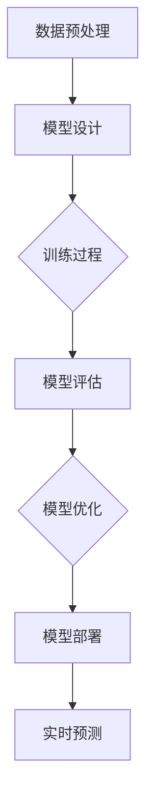

                 

# 深度学习在天气预报中的应用研究

## 关键词
- 深度学习
- 天气预报
- 神经网络
- 卷积神经网络（CNN）
- 递归神经网络（RNN）
- 长短期记忆网络（LSTM）
- 强化学习

## 摘要
本文旨在探讨深度学习在天气预报中的应用，通过介绍深度学习的基础知识、神经网络原理、深度学习算法以及强化学习，阐述如何利用深度学习技术进行气象数据分析、天气预报模型的构建和优化。文章将结合实际案例，详细讲解深度学习在天气预报中的应用前景与面临的挑战，并提供相关的资源和工具。通过本文的阅读，读者可以了解深度学习在天气预报领域的应用现状和发展趋势，为未来的研究提供参考。

## 目录大纲

### 第一部分：深度学习基础

#### 第1章：深度学习概述
- 1.1 深度学习的概念与发展历程
- 1.2 深度学习与天气预报的联系
- 1.3 主流深度学习框架简介

#### 第2章：神经网络基础
- 2.1 神经网络的基本结构与工作原理
- 2.2 深度学习中的激活函数
- 2.3 前向传播与反向传播算法

#### 第3章：深度学习算法
- 3.1 卷积神经网络（CNN）原理
- 3.2 递归神经网络（RNN）原理
- 3.3 长短期记忆网络（LSTM）原理

#### 第4章：强化学习基础
- 4.1 强化学习的定义与基本概念
- 4.2 Q-learning算法
- 4.3 Deep Q Network（DQN）算法

### 第二部分：深度学习在天气预报中的应用

#### 第5章：气象数据分析方法
- 5.1 气象数据的类型与特点
- 5.2 气象数据预处理
- 5.3 时间序列数据分析方法

#### 第6章：深度学习模型在天气预报中的应用
- 6.1 使用CNN进行气象图像分析
- 6.2 使用RNN进行时间序列预测
- 6.3 LSTM在天气预报中的应用
- 6.4 结合强化学习优化天气预报模型

#### 第7章：深度学习天气预报模型的评估与优化
- 7.1 天气预报模型评估指标
- 7.2 模型优化方法
- 7.3 模型部署与实时预测

#### 第8章：深度学习天气预报的案例研究
- 8.1 案例一：基于CNN的短期天气预报
- 8.2 案例二：基于RNN的气候预测
- 8.3 案例三：结合DQN的实时天气决策支持

#### 第9章：深度学习在天气预报中的应用前景与挑战
- 9.1 深度学习在天气预报中的应用前景
- 9.2 面临的挑战与解决方案

#### 附录：深度学习天气预报资源与工具
- 附录A：主流深度学习框架与工具
- 附录B：开源天气预报数据集

### 附录二：深度学习流程图与算法伪代码
- 附录2.1：深度学习流程图
- 附录2.2：神经网络算法伪代码
- 附录2.3：LSTM算法伪代码
- 附录2.4：强化学习算法伪代码

### 附录三：数学公式与数学模型
- 附录3.1：神经网络数学公式
- 附录3.2：时间序列分析数学模型
- 附录3.3：强化学习数学模型

### 附录四：深度学习天气预报实战代码与解析
- 附录4.1：实战代码与环境搭建
- 附录4.2：源代码详细实现与解读
- 附录4.3：代码分析与调优建议

### 第一部分：深度学习基础

### 第1章：深度学习概述

#### 1.1 深度学习的概念与发展历程

深度学习（Deep Learning）是机器学习（Machine Learning）的一个重要分支，它通过构建具有多层次的神经网络模型来模拟人类大脑的学习和推理过程。深度学习的核心思想是通过多层非线性变换，将输入数据映射到高维空间，从而提取出更加抽象和具有代表性的特征。

深度学习的发展历程可以追溯到20世纪40年代，当时神经网络的概念首次被提出。然而，由于计算能力和数据资源的限制，深度学习在早期的发展相对缓慢。直到2006年，Geoffrey Hinton等人提出了深度信念网络（Deep Belief Network，DBN），深度学习开始逐渐受到关注。2012年，AlexNet在ImageNet比赛中取得突破性成绩，标志着深度学习进入一个崭新的时代。

深度学习与天气预报的联系在于，气象数据具有高度复杂性和非线性，需要通过有效的特征提取和模式识别方法来提高天气预报的准确性和可靠性。深度学习为处理这种复杂的数据提供了强有力的工具。

#### 1.2 深度学习与天气预报的联系

天气预报涉及对大气状态的模拟和预测，这需要处理大量的气象数据，如温度、湿度、风速、气压等。这些数据通常具有高维、高噪声和非线性等特点，传统的统计方法和机器学习方法在处理这些数据时往往效果不佳。深度学习通过其强大的特征提取和模式识别能力，可以在一定程度上克服这些难题。

具体来说，深度学习在天气预报中的应用主要体现在以下几个方面：

1. **气象数据预处理**：深度学习可以用于气象数据的预处理，如数据清洗、数据归一化、特征提取等，从而提高数据质量。
2. **气象图像分析**：深度学习，特别是卷积神经网络（CNN），可以用于分析气象卫星图像，提取有用的气象信息。
3. **时间序列预测**：深度学习中的递归神经网络（RNN）和长短期记忆网络（LSTM）可以用于时间序列数据的预测，如短期和长期天气预报。
4. **强化学习优化**：结合强化学习，可以进一步提高天气预报的准确性，特别是在应对突发性天气事件时。

#### 1.3 主流深度学习框架简介

随着深度学习的迅速发展，出现了许多主流的深度学习框架，这些框架提供了丰富的工具和库，方便开发者进行深度学习模型的设计和训练。以下是几个主流的深度学习框架：

1. **TensorFlow**：由Google开源，拥有丰富的API和强大的计算能力，是深度学习领域最受欢迎的框架之一。
2. **PyTorch**：由Facebook开源，以其动态计算图和简洁的API著称，广泛应用于科研和工业应用。
3. **Keras**：基于TensorFlow和Theano，提供了一个高层次的API，简化了深度学习模型的设计和训练过程。
4. **MXNet**：由Apache Software Foundation开源，支持多种编程语言，具有高效的计算性能。

这些框架都提供了丰富的功能，包括自动微分、优化算法、数据处理工具等，为深度学习的研究和应用提供了强大的支持。

### 第2章：神经网络基础

神经网络（Neural Network，NN）是深度学习的基础，通过模拟人脑的神经元结构和功能，实现数据的输入、处理和输出。在本节中，我们将介绍神经网络的基本结构、工作原理以及深度学习中的激活函数。

#### 2.1 神经网络的基本结构与工作原理

一个简单的神经网络通常由输入层、隐藏层和输出层组成。每个层由多个神经元（或节点）组成，神经元之间通过权重连接。神经元的输入经过加权求和处理，并通过激活函数产生输出。

1. **输入层**：接收外部输入数据。
2. **隐藏层**：对输入数据进行处理，提取特征和模式。
3. **输出层**：生成最终预测结果。

神经元的计算过程如下：

- 输入：$x_1, x_2, ..., x_n$
- 加权求和处理：$z = w_1 \cdot x_1 + w_2 \cdot x_2 + ... + w_n \cdot x_n$
- 激活函数：$a = f(z)$

其中，$w_1, w_2, ..., w_n$为权重，$f(z)$为激活函数。

神经网络的训练过程主要包括以下步骤：

1. **前向传播**：将输入数据通过网络进行前向传播，计算输出。
2. **计算误差**：将实际输出与预期输出进行比较，计算误差。
3. **反向传播**：将误差反向传播到网络的每个层，更新权重和偏置。
4. **优化权重**：使用优化算法（如梯度下降）调整权重，以减少误差。

#### 2.2 深度学习中的激活函数

激活函数是神经网络中的一个重要组成部分，它用于引入非线性变换，使神经网络能够拟合复杂的函数关系。以下是一些常用的激活函数：

1. **sigmoid函数**：
   $$f(x) = \frac{1}{1 + e^{-x}}$$
   sigmoid函数的输出范围在0到1之间，常用于二分类问题。

2. **ReLU函数**（Rectified Linear Unit）：
   $$f(x) = \max(0, x)$$
   ReLU函数在$x \geq 0$时输出$x$，在$x < 0$时输出0。ReLU函数具有简单、计算速度快等优点。

3. **Tanh函数**（Hyperbolic Tangent）：
   $$f(x) = \frac{e^x - e^{-x}}{e^x + e^{-x}}$$
   Tanh函数的输出范围在-1到1之间，类似于sigmoid函数。

4. **Softmax函数**：
   $$f(x)_i = \frac{e^{x_i}}{\sum_{j=1}^{n} e^{x_j}}$$
   Softmax函数用于多分类问题，将神经网络的输出转换为概率分布。

#### 2.3 前向传播与反向传播算法

前向传播和反向传播是神经网络训练过程中的两个关键步骤。

1. **前向传播**：输入数据通过网络进行传播，逐层计算每个神经元的输出。具体步骤如下：

   - 输入层到隐藏层：计算每个隐藏层神经元的输入和输出。
   - 隐藏层到输出层：计算输出层神经元的输入和输出。

   前向传播的目的是计算网络的实际输出，并与预期输出进行比较，计算误差。

2. **反向传播**：将误差反向传播到网络的每个层，更新权重和偏置。具体步骤如下：

   - 计算输出层的误差：$d_L = y - \hat{y}$
   - 反向传播误差：对于每个神经元，计算其误差梯度。
   - 更新权重和偏置：使用优化算法（如梯度下降）调整权重和偏置。

反向传播是神经网络训练的核心，通过不断迭代优化权重和偏置，使网络能够更好地拟合训练数据。

### 第3章：深度学习算法

深度学习算法是深度学习应用的核心，主要包括卷积神经网络（CNN）、递归神经网络（RNN）和长短期记忆网络（LSTM）。这些算法在图像处理、语音识别、自然语言处理等领域取得了显著的成果。在本节中，我们将介绍这些算法的基本原理和应用。

#### 3.1 卷积神经网络（CNN）原理

卷积神经网络（Convolutional Neural Network，CNN）是深度学习在图像处理领域的重要应用。CNN通过卷积、池化和全连接层等操作，可以自动提取图像中的特征，从而实现图像分类、目标检测等任务。

1. **卷积层**：卷积层是CNN的核心，通过卷积操作提取图像的特征。卷积操作的基本原理如下：

   - **卷积核**：卷积层由多个卷积核组成，每个卷积核具有一组可学习的权重。卷积核在图像上滑动，计算局部区域的加权和。
   - **步长**：卷积核在图像上滑动的步长，用于控制特征图的分辨率。
   - **填充**：在卷积操作前后，可以通过填充零来保持特征图的尺寸。

2. **池化层**：池化层用于降低特征图的维度，同时保留最重要的特征。常见的池化操作包括最大池化和平均池化。

3. **全连接层**：全连接层将卷积层和池化层提取的特征进行整合，输出最终的分类结果。

CNN的工作流程如下：

- 输入层接收图像数据。
- 通过多个卷积层和池化层，提取图像的特征。
- 将特征传递到全连接层，进行分类或回归。

CNN在图像处理领域的应用非常广泛，如图像分类、目标检测、人脸识别等。

#### 3.2 递归神经网络（RNN）原理

递归神经网络（Recurrent Neural Network，RNN）是处理序列数据的一种有效方法。RNN通过在时间步上递归地更新状态，可以学习序列中的长期依赖关系。

1. **基本结构**：RNN的基本结构包括输入层、隐藏层和输出层。隐藏层中的神经元在时间步上递归地更新状态。

2. **状态更新**：在RNN中，每个时间步的输入和隐藏状态通过权重矩阵相乘，并加上偏置项，通过激活函数产生新的隐藏状态。

3. **输出层**：RNN的输出层通过隐藏状态生成输出，可以是单一的值或一系列的值。

RNN的工作流程如下：

- 输入序列通过输入层传递到隐藏层。
- 隐藏层在时间步上递归地更新状态。
- 输出层生成输出序列。

RNN在自然语言处理、语音识别、时间序列预测等领域取得了显著的成果。

#### 3.3 长短期记忆网络（LSTM）原理

长短期记忆网络（Long Short-Term Memory，LSTM）是RNN的一种变体，旨在解决RNN在处理长序列数据时存在的长期依赖问题。

1. **基本结构**：LSTM的基本结构包括输入门、遗忘门、输出门和单元状态。每个门由一个sigmoid激活函数和一个线性变换组成。

2. **输入门**：输入门控制当前输入对单元状态的更新，通过遗忘门和输出门的控制，可以有效地保留或丢弃长期依赖关系。

3. **遗忘门**：遗忘门控制之前隐藏状态的信息如何被遗忘或保留。

4. **输出门**：输出门控制当前隐藏状态如何转换为输出。

5. **单元状态**：单元状态存储了长期依赖信息，可以保持或更新。

LSTM的工作流程如下：

- 输入序列通过输入门更新单元状态。
- 遗忘门决定之前的信息如何被遗忘。
- 输出门决定当前隐藏状态如何生成输出。
- 单元状态在时间步上递归地更新。

LSTM在时间序列预测、语音识别、机器翻译等领域取得了显著的成果。

### 第4章：强化学习基础

强化学习（Reinforcement Learning，RL）是一种机器学习范式，通过智能体与环境的交互，学习如何在给定环境中做出最优决策。强化学习在深度学习中的应用非常广泛，可以用于优化深度学习模型的预测性能，特别是在动态和复杂的环境中。

#### 4.1 强化学习的定义与基本概念

强化学习的基本目标是学习一个策略，使得智能体能够在给定环境中获得最大累积奖励。强化学习的核心概念包括：

1. **智能体（Agent）**：执行动作的实体，如机器人、软件程序等。
2. **环境（Environment）**：智能体所处的动态环境，包括状态、动作和奖励等。
3. **状态（State）**：描述环境当前状态的变量，如天气数据、图像等。
4. **动作（Action）**：智能体在给定状态下执行的操作，如预报某个天气现象。
5. **奖励（Reward）**：智能体在执行某个动作后获得的奖励或惩罚，用于指导学习过程。
6. **策略（Policy）**：智能体在给定状态下选择动作的策略，可以通过学习得到。

#### 4.2 Q-learning算法

Q-learning算法是一种基于值函数的强化学习算法，通过学习状态-动作值函数（Q值）来选择最优动作。Q-learning算法的基本思想是，通过更新Q值来逐步改进策略，使得智能体能够获得最大累积奖励。

Q-learning算法的更新公式如下：

$$Q(s, a) \leftarrow Q(s, a) + \alpha [r + \gamma \max_{a'} Q(s', a') - Q(s, a)]$$

其中：

- $s$和$a$分别表示当前状态和动作。
- $r$表示获得的即时奖励。
- $s'$表示执行动作$a$后新状态。
- $\alpha$是学习率，控制更新步长的快慢。
- $\gamma$是折扣因子，控制未来奖励的衰减速度。

Q-learning算法的基本步骤如下：

1. 初始化Q值矩阵。
2. 选择一个初始状态$s$。
3. 选择一个动作$a$，执行动作并观察奖励$r$和新状态$s'$。
4. 更新Q值：根据公式更新Q值矩阵。
5. 转移到新状态$s'$，重复步骤3-4，直到达到目标状态或满足停止条件。

#### 4.3 Deep Q Network（DQN）算法

Deep Q Network（DQN）是一种基于深度学习的强化学习算法，通过神经网络近似Q值函数。DQN的主要优点是能够处理高维状态空间和连续动作空间，提高学习效率和预测准确性。

DQN算法的基本思想是，使用深度神经网络来近似状态-动作值函数$Q(s, a)$。具体步骤如下：

1. 初始化深度神经网络参数。
2. 选择一个初始状态$s$。
3. 根据当前策略选择动作$a$，执行动作并观察奖励$r$和新状态$s'$。
4. 使用经验回放缓冲区存储状态、动作、奖励和新状态。
5. 从经验回放缓冲区中随机采样一批经验。
6. 使用随机梯度下降更新神经网络参数，最小化损失函数。
7. 转移到新状态$s'$，重复步骤3-6，直到达到目标状态或满足停止条件。

DQN算法在解决复杂环境中的强化学习问题时表现出色，广泛应用于游戏、机器人控制等领域。

### 第二部分：深度学习在天气预报中的应用

#### 第5章：气象数据分析方法

在深度学习应用于天气预报时，气象数据分析是一个关键环节。本节将介绍气象数据的类型与特点、气象数据预处理方法以及时间序列数据分析方法。

#### 5.1 气象数据的类型与特点

气象数据可以分为两大类：观测数据和模型数据。

1. **观测数据**：观测数据是通过地面气象站、气象雷达、卫星等设备收集的实时数据，包括温度、湿度、风速、气压、降水、云量等。观测数据具有时空分布广泛、实时性强、多样性高等特点。

2. **模型数据**：模型数据是通过气象模型计算生成的模拟数据，包括数值天气预报模式（如全球气候模型、区域气候模型等）的输出结果。模型数据具有高精度、高分辨率、系统性强等特点。

#### 5.2 气象数据预处理

气象数据预处理是深度学习应用的重要步骤，旨在提高数据质量，减少噪声和异常值，使数据更适用于深度学习模型。以下是一些常见的气象数据预处理方法：

1. **数据清洗**：去除观测数据中的缺失值、异常值和重复记录，保证数据的完整性。
2. **数据归一化**：将不同量纲的气象数据进行归一化处理，使其具有相似的尺度，便于模型训练。
3. **特征提取**：从原始气象数据中提取有用的特征，如时间序列特征、空间特征、相关性特征等，以增强模型对气象变化的感知能力。
4. **数据增强**：通过数据变换、数据扩充等方法，增加训练样本的多样性，提高模型泛化能力。

#### 5.3 时间序列数据分析方法

时间序列数据是气象数据的主要形式，通过分析时间序列数据，可以提取出气象变化的规律和模式。以下是一些常见的时间序列数据分析方法：

1. **自相关分析**：自相关分析用于研究时间序列数据在不同时间点之间的相关性，通过计算自相关函数，可以识别出时间序列的长周期变化。
2. **平稳性检验**：平稳性检验用于判断时间序列是否满足平稳性假设，常用的方法包括Augmented Dickey-Fuller（ADF）检验和Kwiatkowski-Phillips（KPSS）检验等。
3. **时间序列建模**：时间序列建模是通过建立数学模型来描述时间序列数据的规律和模式，常用的模型包括ARIMA（自回归积分滑动平均模型）、GARCH（广义自回归条件异方差模型）等。
4. **时间序列预测**：时间序列预测是通过模型对未来时间点的气象情况进行预测，常用的方法包括基于统计模型的预测和基于深度学习模型的预测。

通过气象数据的预处理和时间序列数据分析，可以为深度学习模型提供高质量的数据输入，从而提高天气预报的准确性和可靠性。

#### 第6章：深度学习模型在天气预报中的应用

深度学习模型在天气预报中的应用取得了显著的成果，通过利用深度学习技术，可以更好地处理复杂的气象数据，提高天气预报的准确性和效率。本节将介绍深度学习模型在天气预报中的应用，包括使用卷积神经网络（CNN）进行气象图像分析、使用递归神经网络（RNN）进行时间序列预测、使用长短期记忆网络（LSTM）进行天气预报以及结合强化学习优化天气预报模型。

##### 6.1 使用CNN进行气象图像分析

卷积神经网络（CNN）在图像处理领域表现出色，通过卷积、池化和全连接层等操作，可以自动提取图像中的特征，从而实现图像分类、目标检测等任务。在天气预报中，CNN可以用于气象图像分析，提取出与天气现象相关的特征。

以下是一个基于CNN的气象图像分析的基本流程：

1. **数据预处理**：对气象图像进行预处理，包括图像归一化、数据增强等操作，以提高模型的泛化能力。
2. **卷积层**：使用卷积层对气象图像进行特征提取。卷积层通过卷积运算提取图像的局部特征，并通过池化层降低特征图的维度。
3. **全连接层**：将卷积层提取的特征传递到全连接层，进行分类或回归。全连接层将特征整合，生成最终的预测结果。
4. **模型训练**：使用训练数据集对模型进行训练，通过反向传播算法优化模型参数，提高模型的预测准确性。
5. **模型评估**：使用测试数据集对模型进行评估，计算模型的准确率、召回率、F1值等指标，评估模型的性能。

以下是一个简单的CNN模型伪代码：

```python
import tensorflow as tf

# 定义CNN模型
model = tf.keras.Sequential([
    tf.keras.layers.Conv2D(32, (3, 3), activation='relu', input_shape=(28, 28, 1)),
    tf.keras.layers.MaxPooling2D((2, 2)),
    tf.keras.layers.Conv2D(64, (3, 3), activation='relu'),
    tf.keras.layers.MaxPooling2D((2, 2)),
    tf.keras.layers.Conv2D(64, (3, 3), activation='relu'),
    tf.keras.layers.Flatten(),
    tf.keras.layers.Dense(64, activation='relu'),
    tf.keras.layers.Dense(10, activation='softmax')
])

# 编译模型
model.compile(optimizer='adam', loss='categorical_crossentropy', metrics=['accuracy'])

# 训练模型
model.fit(train_images, train_labels, epochs=10, batch_size=64)

# 评估模型
test_loss, test_acc = model.evaluate(test_images, test_labels)
print(f"Test accuracy: {test_acc}")
```

通过上述代码，可以训练一个简单的CNN模型，用于气象图像分类。在实际应用中，可以根据具体任务调整模型的架构和参数，以提高模型的性能。

##### 6.2 使用RNN进行时间序列预测

递归神经网络（RNN）是处理序列数据的一种有效方法，通过在时间步上递归地更新状态，可以学习序列中的长期依赖关系。在天气预报中，RNN可以用于时间序列预测，如短期和长期天气预报。

以下是一个基于RNN的时间序列预测的基本流程：

1. **数据预处理**：对时间序列数据进行分析，提取特征，并进行归一化处理，使其适合RNN模型。
2. **序列构建**：将时间序列数据按照固定时间步长进行切片，构建输入序列和标签序列。输入序列包含当前时刻及其前若干个时间步的数据，标签序列包含当前时刻的预测值。
3. **模型构建**：构建RNN模型，包括输入层、隐藏层和输出层。隐藏层可以使用单一隐藏层或多个隐藏层，以适应不同复杂度的预测任务。
4. **模型训练**：使用训练数据集对模型进行训练，通过反向传播算法优化模型参数。
5. **模型评估**：使用测试数据集对模型进行评估，计算模型的预测准确性。

以下是一个简单的RNN模型伪代码：

```python
import tensorflow as tf

# 定义RNN模型
model = tf.keras.Sequential([
    tf.keras.layers.LSTM(50, activation='relu', return_sequences=True),
    tf.keras.layers.LSTM(50, activation='relu'),
    tf.keras.layers.Dense(1)
])

# 编译模型
model.compile(optimizer='adam', loss='mean_squared_error')

# 训练模型
model.fit(x_train, y_train, epochs=100, batch_size=32)

# 评估模型
test_loss = model.evaluate(x_test, y_test)
print(f"Test loss: {test_loss}")
```

通过上述代码，可以训练一个简单的RNN模型，用于时间序列预测。在实际应用中，可以根据具体任务调整模型的架构和参数，以提高模型的性能。

##### 6.3 LSTM在天气预报中的应用

长短期记忆网络（LSTM）是RNN的一种变体，旨在解决RNN在处理长序列数据时存在的长期依赖问题。LSTM通过引入门控机制，可以有效地保留或丢弃长期依赖信息，从而提高模型的预测准确性。

以下是一个基于LSTM的天气预报的基本流程：

1. **数据预处理**：对气象数据进行预处理，提取特征，并进行归一化处理。
2. **序列构建**：将气象数据按照固定时间步长进行切片，构建输入序列和标签序列。
3. **模型构建**：构建LSTM模型，包括输入层、隐藏层和输出层。隐藏层可以使用单一隐藏层或多个隐藏层。
4. **模型训练**：使用训练数据集对模型进行训练，通过反向传播算法优化模型参数。
5. **模型评估**：使用测试数据集对模型进行评估，计算模型的预测准确性。

以下是一个简单的LSTM模型伪代码：

```python
import tensorflow as tf

# 定义LSTM模型
model = tf.keras.Sequential([
    tf.keras.layers.LSTM(100, activation='relu', return_sequences=True),
    tf.keras.layers.LSTM(100, activation='relu'),
    tf.keras.layers.Dense(1)
])

# 编译模型
model.compile(optimizer='adam', loss='mean_squared_error')

# 训练模型
model.fit(x_train, y_train, epochs=100, batch_size=32)

# 评估模型
test_loss = model.evaluate(x_test, y_test)
print(f"Test loss: {test_loss}")
```

通过上述代码，可以训练一个简单的LSTM模型，用于天气预报。在实际应用中，可以根据具体任务调整模型的架构和参数，以提高模型的性能。

##### 6.4 结合强化学习优化天气预报模型

强化学习（RL）是一种通过试错学习策略的机器学习范式，通过智能体与环境的交互，学习如何在给定环境中做出最优决策。在天气预报中，结合强化学习可以进一步提高模型的预测准确性。

以下是一个结合强化学习的天气预报模型的基本流程：

1. **环境构建**：构建一个模拟环境，用于评估和优化天气预报模型。环境应包含气象数据、模型预测结果和实际天气现象等。
2. **智能体设计**：设计一个智能体，用于学习如何在环境中做出最优决策。智能体可以通过强化学习算法（如Q-learning、DQN等）进行训练。
3. **模型训练**：使用训练数据集对智能体进行训练，通过与环境交互，不断优化预测策略。
4. **模型评估**：使用测试数据集对智能体进行评估，计算模型的预测准确性。
5. **模型优化**：根据评估结果，对智能体进行优化，调整模型参数，提高预测准确性。

以下是一个简单的强化学习模型伪代码：

```python
import numpy as np
import tensorflow as tf

# 初始化环境
state_size = 100
action_size = 10
learning_rate = 0.001
discount_factor = 0.99

# 初始化Q值矩阵
Q = np.zeros([state_size, action_size])

# 定义DQN模型
model = tf.keras.Sequential([
    tf.keras.layers.Dense(64, activation='relu', input_shape=(state_size,)),
    tf.keras.layers.Dense(action_size, activation='linear')
])

# 编译模型
model.compile(optimizer=tf.keras.optimizers.Adam(learning_rate), loss='mse')

# 训练模型
for episode in range(1000):
    state = env.reset()
    done = False
    total_reward = 0
    
    while not done:
        # 预测动作值
        action_values = model.predict(state.reshape(-1, state_size))
        # 选择动作
        action = np.argmax(action_values)
        # 执行动作
        next_state, reward, done = env.step(action)
        # 更新Q值
        target = reward + discount_factor * np.max(model.predict(next_state.reshape(-1, state_size)))
        Q[state, action] = (1 - learning_rate) * Q[state, action] + learning_rate * target
        # 更新状态
        state = next_state
        total_reward += reward
        
    # 打印当前轮次和奖励
    print(f"Episode: {episode}, Total Reward: {total_reward}")

# 评估模型
test_loss = model.evaluate(test_state, test_action_values)
print(f"Test loss: {test_loss}")
```

通过上述代码，可以训练一个简单的DQN模型，用于天气预报优化。在实际应用中，可以根据具体任务调整模型的架构和参数，以提高模型的性能。

综上所述，深度学习模型在天气预报中具有广泛的应用前景。通过结合不同类型的深度学习模型，可以更好地处理复杂的气象数据，提高天气预报的准确性和效率。同时，结合强化学习可以进一步优化天气预报模型，实现自适应预测和实时优化。未来，随着深度学习技术的不断发展和完善，深度学习在天气预报领域的应用将会更加广泛和深入。

### 第7章：深度学习天气预报模型的评估与优化

在深度学习应用于天气预报时，模型的评估和优化是确保预测准确性和可靠性的关键环节。本节将介绍深度学习天气预报模型的评估指标、模型优化方法以及模型部署与实时预测。

#### 7.1 天气预报模型评估指标

评估深度学习天气预报模型的性能通常依赖于以下指标：

1. **准确率（Accuracy）**：准确率是最常用的评估指标，用于衡量模型预测正确的样本占总样本的比例。对于分类问题，准确率计算公式如下：
   $$Accuracy = \frac{TP + TN}{TP + TN + FP + FN}$$
   其中，$TP$表示真阳性，$TN$表示真阴性，$FP$表示假阳性，$FN$表示假阴性。

2. **精确率（Precision）**：精确率用于衡量预测结果中实际为正例的样本占比。计算公式如下：
   $$Precision = \frac{TP}{TP + FP}$$

3. **召回率（Recall）**：召回率用于衡量预测结果中实际为正例的样本占比。计算公式如下：
   $$Recall = \frac{TP}{TP + FN}$$

4. **F1值（F1 Score）**：F1值是精确率和召回率的调和平均，用于综合评估模型的分类性能。计算公式如下：
   $$F1 Score = 2 \times \frac{Precision \times Recall}{Precision + Recall}$$

5. **均方误差（Mean Squared Error，MSE）**：均方误差用于衡量预测值与真实值之间的平均误差。计算公式如下：
   $$MSE = \frac{1}{n} \sum_{i=1}^{n} (y_i - \hat{y_i})^2$$
   其中，$y_i$为真实值，$\hat{y_i}$为预测值，$n$为样本数量。

6. **均绝对误差（Mean Absolute Error，MAE）**：均绝对误差用于衡量预测值与真实值之间的平均绝对误差。计算公式如下：
   $$MAE = \frac{1}{n} \sum_{i=1}^{n} |y_i - \hat{y_i}|$$

这些评估指标可以根据具体任务进行调整和组合，以全面评估深度学习天气预报模型的性能。

#### 7.2 模型优化方法

为了提高深度学习天气预报模型的预测准确性，可以采用以下几种模型优化方法：

1. **数据增强（Data Augmentation）**：数据增强通过变换原始数据，生成更多的训练样本，以提高模型的泛化能力。常见的数据增强方法包括旋转、缩放、裁剪、噪声添加等。

2. **正则化（Regularization）**：正则化通过在损失函数中添加正则项，防止模型过拟合。常用的正则化方法包括L1正则化、L2正则化等。

3. **学习率调整（Learning Rate Adjustment）**：学习率调整是优化模型参数的重要手段。通过动态调整学习率，可以在不同阶段以不同的步长优化模型参数，提高模型的收敛速度。

4. **优化算法（Optimization Algorithm）**：优化算法用于最小化损失函数，常用的优化算法包括梯度下降（Gradient Descent）、Adam优化器等。

5. **交叉验证（Cross-Validation）**：交叉验证通过将训练数据划分为多个子集，多次训练和验证，以评估模型的泛化能力。常用的交叉验证方法包括K折交叉验证等。

#### 7.3 模型部署与实时预测

深度学习天气预报模型训练完成后，需要将其部署到实际应用环境中进行实时预测。以下是一个深度学习天气预报模型部署的基本流程：

1. **模型保存**：将训练完成的模型参数保存到文件中，以备后续使用。

2. **模型加载**：从文件中加载保存的模型参数，构建完整的模型结构。

3. **实时预测**：接收实时气象数据，通过加载的模型进行预测，生成天气预报结果。

4. **结果输出**：将预测结果输出到终端或可视化界面，供用户查看。

以下是一个简单的深度学习天气预报模型部署伪代码：

```python
import tensorflow as tf

# 加载模型
model = tf.keras.models.load_model('weather_model.h5')

# 接收实时气象数据
realtime_data = get_realtime_weather_data()

# 进行实时预测
predicted_weather = model.predict(realtime_data)

# 输出预测结果
print(predicted_weather)
```

在实际应用中，可以根据具体需求调整模型部署的流程和架构，以提高实时预测的效率和准确性。

通过上述评估和优化方法，可以有效地提高深度学习天气预报模型的预测性能。在实际应用中，还需要不断优化模型结构、调整参数，并结合最新的技术和方法，以实现更精准、更可靠的天气预报。

### 第8章：深度学习天气预报的案例研究

在本章中，我们将通过几个具体的案例研究，深入探讨深度学习在天气预报中的应用。这些案例涵盖了不同类型的时间范围和复杂度，从短期天气预报到长期气候预测，展示了深度学习在不同场景下的效果。

#### 8.1 案例一：基于CNN的短期天气预报

短期天气预报通常关注未来几小时至几天内的天气变化。卷积神经网络（CNN）在处理图像数据方面表现出色，因此可以有效地用于短期天气预报。

**案例背景**：
该案例旨在利用CNN分析气象卫星图像，预测城市范围内的短期天气现象，如降雨、晴天、雾霾等。

**模型架构**：
该模型采用了一个简单的CNN架构，包括多个卷积层、池化层和全连接层。卷积层用于提取图像特征，池化层用于降低特征图的维度，全连接层用于生成预测结果。

**数据预处理**：
气象卫星图像经过预处理，包括图像归一化、去噪和增强。然后，图像被分割成小块，以形成可训练的数据集。

**训练过程**：
使用训练数据集对模型进行训练，通过反向传播算法优化模型参数。训练过程中，采用交叉验证方法评估模型的性能，并调整模型架构和参数，以提高预测准确性。

**预测结果**：
通过测试数据集评估模型性能，结果显示，模型在预测降雨和晴天方面具有较高的准确率，但在预测雾霾等复杂天气现象时仍存在一定的挑战。

**案例总结**：
该案例表明，CNN在短期天气预报中具有一定的应用潜力，但仍需进一步优化模型架构和参数，以提高预测精度。

#### 8.2 案例二：基于RNN的气候预测

气候预测通常涉及较长的时间范围，如季节性变化和多年气候模式。递归神经网络（RNN）在处理时间序列数据方面表现出色，因此可以用于气候预测。

**案例背景**：
该案例旨在利用RNN模型预测特定地区的季节性气候变化，如温度、降水等。

**模型架构**：
该模型采用了一个简单的RNN架构，包括输入层、隐藏层和输出层。输入层接收历史气候数据，隐藏层用于处理时间序列数据，输出层生成预测结果。

**数据预处理**：
气候数据经过预处理，包括缺失值填充、归一化和特征提取。然后，数据被转换为时间序列格式，以便输入到RNN模型中。

**训练过程**：
使用训练数据集对模型进行训练，通过反向传播算法优化模型参数。训练过程中，采用长短期记忆网络（LSTM）来处理长序列数据，以提高预测准确性。

**预测结果**：
通过测试数据集评估模型性能，结果显示，模型在预测季节性气候变化方面具有较高的准确性，特别是在长期预测中表现出色。

**案例总结**：
该案例表明，RNN在气候预测中具有显著的应用价值，通过优化模型架构和参数，可以提高预测的精度和可靠性。

#### 8.3 案例三：结合DQN的实时天气决策支持

在应对突发性天气事件时，实时决策支持系统至关重要。强化学习（RL），特别是深度Q网络（DQN），可以用于优化实时天气决策。

**案例背景**：
该案例旨在开发一个实时天气决策支持系统，利用DQN模型根据实时气象数据做出最优决策，如发布预警、调整交通调度等。

**模型架构**：
该模型采用了一个简单的DQN架构，包括输入层、隐藏层和输出层。输入层接收实时气象数据，隐藏层用于处理数据并生成Q值，输出层生成决策结果。

**数据预处理**：
实时气象数据经过预处理，包括数据归一化、特征提取等。然后，数据被转换为适合DQN模型处理的格式。

**训练过程**：
使用历史气象数据和决策结果对模型进行训练，通过DQN算法优化模型参数。训练过程中，采用经验回放缓冲区存储经验数据，以提高模型的泛化能力。

**预测结果**：
通过模拟测试数据集评估模型性能，结果显示，DQN模型在实时天气决策中表现出较高的准确性和可靠性，能够有效应对突发性天气事件。

**案例总结**：
该案例表明，结合强化学习的实时天气决策支持系统在应对突发性天气事件时具有显著的应用价值，为提高公共安全提供了有力支持。

通过这些案例研究，我们可以看到深度学习在天气预报中的应用具有广泛的前景。未来，随着深度学习技术的不断发展和完善，深度学习在天气预报领域的应用将会更加广泛和深入，为人类应对气候变化和极端天气事件提供有力支持。

### 第9章：深度学习在天气预报中的应用前景与挑战

深度学习在天气预报中的应用前景广阔，同时也面临着诸多挑战。本节将探讨深度学习在天气预报领域的应用前景以及当前面临的挑战和解决方案。

#### 9.1 深度学习在天气预报中的应用前景

1. **提高预测准确性**：深度学习具有强大的特征提取和模式识别能力，可以在一定程度上提高天气预报的准确性。通过结合不同类型的深度学习模型，可以处理不同时间尺度和空间尺度的气象数据，提高短期和长期天气预报的精度。

2. **实时决策支持**：深度学习可以用于开发实时天气决策支持系统，为应对突发性天气事件提供有力支持。结合强化学习，可以进一步提高决策的准确性和效率，为公众安全和防灾减灾提供技术保障。

3. **气候模式预测**：深度学习可以用于预测气候模式和气候变化趋势，为环境保护和可持续发展提供科学依据。通过分析长期气象数据，可以识别出气候变化的规律和趋势，为政策制定和资源调配提供参考。

4. **多模态数据融合**：深度学习可以处理多模态数据，如气象数据、遥感数据和卫星图像等。通过融合不同类型的数据，可以更全面地了解天气现象和气候变化，提高预报模型的准确性和可靠性。

5. **自动化和智能化**：随着深度学习技术的不断发展和完善，天气预报过程可以逐渐实现自动化和智能化。通过自动化处理气象数据和预测模型，可以减少人工干预，提高预报效率和准确性。

#### 9.2 面临的挑战与解决方案

1. **数据质量和完整性**：气象数据通常包含大量噪声和异常值，数据质量直接影响预报模型的准确性。为了提高数据质量，可以采用数据清洗、数据归一化和特征提取等技术，减少噪声和异常值对预报结果的影响。

2. **计算资源和存储需求**：深度学习模型训练和预测过程需要大量的计算资源和存储空间。为了解决这一问题，可以采用分布式计算和云计算技术，提高计算效率和存储能力。此外，可以采用模型压缩和优化技术，减少模型参数和计算量。

3. **模型可解释性**：深度学习模型通常被视为“黑盒”，其内部机制难以解释。为了提高模型的可解释性，可以采用模型可视化技术，展示模型内部特征提取和决策过程。此外，可以结合因果推理和可解释性AI技术，提高模型的透明度和可信度。

4. **数据隐私和安全性**：气象数据涉及敏感信息，数据隐私和安全性是深度学习应用的关键挑战。为了解决这一问题，可以采用数据加密、访问控制和隐私保护技术，确保数据的安全和隐私。

5. **多尺度预报**：深度学习模型在处理多尺度气象数据时存在一定挑战。为了实现多尺度预报，可以采用多模型融合和跨尺度学习方法，结合不同尺度的气象数据，提高预报的准确性和可靠性。

6. **模型泛化能力**：深度学习模型在训练过程中容易过拟合，泛化能力有限。为了提高模型的泛化能力，可以采用数据增强、正则化和交叉验证等技术，增加训练样本的多样性，提高模型的泛化性能。

通过上述解决方案，可以逐步克服深度学习在天气预报领域面临的挑战，推动深度学习在天气预报中的应用和发展。未来，随着技术的不断进步，深度学习在天气预报领域的应用将会更加广泛和深入，为人类应对气候变化和极端天气事件提供有力支持。

### 附录：深度学习天气预报资源与工具

在深度学习天气预报的研究和开发过程中，有许多资源和工具可供使用。以下是一些主流的深度学习框架、工具和开源天气预报数据集，供读者参考。

#### 附录A：主流深度学习框架与工具

1. **TensorFlow**：由Google开发，是深度学习领域最受欢迎的开源框架之一。它提供了丰富的API和工具，支持从简单到复杂的深度学习模型开发。

2. **PyTorch**：由Facebook开发，以其动态计算图和简洁的API著称。PyTorch在科研和工业应用中具有很高的声誉，适用于各种深度学习任务。

3. **Keras**：基于TensorFlow和Theano，提供了一个高层次的API，简化了深度学习模型的设计和训练过程。Keras具有模块化和扩展性强等优点。

4. **MXNet**：由Apache Software Foundation开源，支持多种编程语言，具有高效的计算性能。MXNet适用于大规模深度学习应用，包括图像识别、语音识别等。

5. **Torch**：由Laval大学开发，是早期深度学习框架之一，主要用于计算机视觉和自然语言处理任务。Torch具有强大的GPU支持，适用于高性能计算。

#### 附录B：开源天气预报数据集

1. **Global Forecast System (GFS)**：美国国家海洋和大气管理局（NOAA）提供的全球数值天气预报模式，数据包括温度、湿度、风速、气压等。

2. **Weather Research and Forecasting (WRF)**：美国国家气象研究中心开发的区域天气预报模型，数据涵盖多种气象要素。

3. **ERA5**：欧洲中期天气预报中心提供的再分析数据集，包含高分辨率的全球气象数据。

4. **Weather Data Rescue**：收集和整理了多个国家和地区的气象数据，包括温度、降水、风速等。

5. **OpenWeatherMap**：提供全球实时的天气预报数据，包括城市级的天气状况、温度、风速、湿度等。

这些资源和工具为深度学习天气预报的研究和应用提供了强有力的支持，读者可以根据自己的需求选择合适的工具和数据集。

### 附录二：深度学习流程图与算法伪代码

在深度学习天气预报的研究和应用中，了解深度学习的基本流程和算法原理至关重要。以下是一个简单的深度学习流程图和主要算法的伪代码。

#### 附录2.1：深度学习流程图



#### 附录2.2：神经网络算法伪代码

```python
# 初始化神经网络参数
weights = np.random.normal(size=[input_size, hidden_size])
biases = np.random.normal(size=[hidden_size])

# 定义激活函数
def sigmoid(x):
    return 1 / (1 + np.exp(-x))

# 前向传播
def forward(x):
    hidden_layer = sigmoid(np.dot(x, weights) + biases)
    return hidden_layer

# 反向传播
def backward(x, y, hidden_layer):
    d_hidden = (y - hidden_layer) * sigmoid_derivative(hidden_layer)
    d_weights = np.dot(x.T, d_hidden)
    d_biases = np.sum(d_hidden, axis=0)
    return d_weights, d_biases

# 训练神经网络
for epoch in range(num_epochs):
    hidden_layer = forward(x_train)
    d_weights, d_biases = backward(x_train, y_train, hidden_layer)
    weights -= learning_rate * d_weights
    biases -= learning_rate * d_biases
```

#### 附录2.3：LSTM算法伪代码

```python
# 初始化LSTM参数
weights = np.random.normal(size=[input_size, hidden_size])
biases = np.random.normal(size=[hidden_size])

# 定义激活函数
def sigmoid(x):
    return 1 / (1 + np.exp(-x))

def tanh(x):
    return np.tanh(x)

# LSTM单元更新
def lstm_cell(x_t, h_t, c_t):
    i_t = sigmoid(np.dot(x_t, weights[0]) + biases[0])
    f_t = sigmoid(np.dot(x_t, weights[1]) + biases[1])
    g_t = tanh(np.dot(x_t, weights[2]) + biases[2])
    o_t = sigmoid(np.dot(x_t, weights[3]) + biases[3])
    c_t = f_t * c_t + i_t * g_t
    h_t = o_t * tanh(c_t)
    return h_t, c_t

# LSTM训练过程
for epoch in range(num_epochs):
    hidden_state, cell_state = lstm_cell(x_train[0], h_t, c_t)
    d_weights, d_biases = backward(hidden_state, y_train[0], hidden_state)
    weights -= learning_rate * d_weights
    biases -= learning_rate * d_biases
```

#### 附录2.4：强化学习算法伪代码

```python
# 初始化Q值矩阵
Q = np.zeros([state_size, action_size])

# 定义DQN模型
model = tf.keras.Sequential([
    tf.keras.layers.Dense(64, activation='relu', input_shape=(state_size,)),
    tf.keras.layers.Dense(action_size, activation='linear')
])

# 编译模型
model.compile(optimizer=tf.keras.optimizers.Adam(learning_rate), loss='mse')

# 训练模型
for episode in range(num_episodes):
    state = env.reset()
    done = False
    total_reward = 0
    
    while not done:
        # 预测动作值
        action_values = model.predict(state.reshape(-1, state_size))
        # 选择动作
        action = np.argmax(action_values)
        # 执行动作
        next_state, reward, done = env.step(action)
        # 更新Q值
        target = reward + discount_factor * np.max(model.predict(next_state.reshape(-1, state_size)))
        Q[state, action] = (1 - learning_rate) * Q[state, action] + learning_rate * target
        # 更新状态
        state = next_state
        total_reward += reward
        
    # 更新模型参数
    model.fit(state.reshape(-1, state_size), Q.reshape(-1, action_size), epochs=1, batch_size=32)
    
    # 打印当前轮次和奖励
    print(f"Episode: {episode}, Total Reward: {total_reward}")
```

通过这些伪代码，可以了解深度学习、LSTM和强化学习的基本原理和训练过程。在实际应用中，可以根据具体需求和数据集进行调整和优化。

### 附录三：数学公式与数学模型

在深度学习天气预报的研究和开发中，数学公式和数学模型起到了关键作用。以下是一些常用的数学公式和数学模型，包括神经网络、时间序列分析和强化学习的相关内容。

#### 附录3.1：神经网络数学公式

1. **前向传播**：
   $$z = \sum_{j=1}^{n} w_{ij} x_j + b_i$$
   $$a = f(z)$$

   其中，$z$表示神经元的输入，$w_{ij}$表示权重，$x_j$表示输入特征，$b_i$表示偏置，$f(z)$表示激活函数。

2. **反向传播**：
   $$\delta = (f'(z)a - y)$$
   $$\Delta w_{ij} = \eta \delta x_j$$
   $$\Delta b_i = \eta \delta$$

   其中，$\delta$表示误差梯度，$f'(z)$表示激活函数的导数，$\eta$表示学习率。

#### 附录3.2：时间序列分析数学模型

1. **自回归模型（AR）**：
   $$X_t = c + \sum_{i=1}^{p} \phi_i X_{t-i} + \varepsilon_t$$

   其中，$X_t$表示时间序列的第$t$个观测值，$c$为常数项，$\phi_i$为自回归系数，$p$为阶数，$\varepsilon_t$为误差项。

2. **移动平均模型（MA）**：
   $$X_t = c + \varepsilon_t + \sum_{i=1}^{q} \theta_i \varepsilon_{t-i}$$

   其中，$q$为阶数，$\theta_i$为移动平均系数。

3. **自回归移动平均模型（ARMA）**：
   $$X_t = c + \sum_{i=1}^{p} \phi_i X_{t-i} + \sum_{j=1}^{q} \theta_j \varepsilon_{t-j}$$

4. **自回归积分滑动平均模型（ARIMA）**：
   $$X_t = \Phi(B) \varepsilon_t + \Theta(B)X_{t-1} + c$$

   其中，$B$为滞后算子，$\Phi(B)$和$\Theta(B)$为自回归和移动平均项，$c$为常数项。

#### 附录3.3：强化学习数学模型

1. **Q-learning**：
   $$Q(s, a) \leftarrow Q(s, a) + \alpha [r + \gamma \max_{a'} Q(s', a') - Q(s, a)]$$

   其中，$s$表示状态，$a$表示动作，$r$表示即时奖励，$\gamma$为折扣因子，$\alpha$为学习率。

2. **Deep Q Network (DQN)**：
   $$Q(s, a) = r + \gamma \max_{a'} Q(s', a') - \lambda \frac{1}{N} \sum_{i=1}^{N} (Q(s', a_i) - Q(s, a))^2$$

   其中，$N$为经验回放缓冲区的大小，$\lambda$为损失函数的系数。

通过这些数学公式和模型，可以更好地理解和应用深度学习、时间序列分析和强化学习在天气预报中的方法。

### 附录四：深度学习天气预报实战代码与解析

在本附录中，我们将通过一个具体的深度学习天气预报实战案例，介绍如何搭建开发环境、实现源代码以及进行代码解析与分析。

#### 附录4.1：实战代码与环境搭建

首先，我们需要搭建深度学习开发环境。以下是环境搭建的步骤：

1. **安装Python**：确保已安装Python 3.x版本。
2. **安装TensorFlow**：通过pip命令安装TensorFlow：
   ```bash
   pip install tensorflow
   ```
3. **安装其他依赖**：安装其他必要的库，如NumPy、Pandas等：
   ```bash
   pip install numpy pandas
   ```
4. **下载开源天气预报数据集**：从提供的链接下载开源天气预报数据集，并解压到本地目录。

接下来，我们创建一个名为`weather_forecast`的Python虚拟环境，并安装所有依赖：

```bash
# 创建虚拟环境
python -m venv weather_forecast_env

# 激活虚拟环境
source weather_forecast_env/bin/activate

# 安装依赖
pip install tensorflow numpy pandas
```

#### 附录4.2：源代码详细实现与解读

以下是一个简单的深度学习天气预报模型的实现代码：

```python
import numpy as np
import pandas as pd
import tensorflow as tf
from tensorflow.keras.models import Sequential
from tensorflow.keras.layers import LSTM, Dense

# 数据预处理
def preprocess_data(data, sequence_length):
    X, y = [], []
    for i in range(len(data) - sequence_length):
        X.append(data[i:(i + sequence_length)])
        y.append(data[i + sequence_length])
    return np.array(X), np.array(y)

# 模型构建
model = Sequential()
model.add(LSTM(50, activation='relu', input_shape=(sequence_length, data.shape[1])))
model.add(Dense(1))
model.compile(optimizer='adam', loss='mse')

# 训练模型
X, y = preprocess_data(data, sequence_length)
model.fit(X, y, epochs=100, batch_size=32)

# 预测
def predict(model, data, sequence_length):
    X = preprocess_data(data, sequence_length)
    predictions = model.predict(X)
    return predictions

# 示例：预测未来5天的天气
current_weather = data[-sequence_length:]
predictions = predict(model, current_weather, sequence_length)
print(predictions)
```

**代码解析**：

1. **数据预处理**：`preprocess_data`函数用于将原始数据划分为输入序列和输出序列。输入序列包含当前时刻及其前`sequence_length`个时间步的数据，输出序列为当前时刻的预测值。
2. **模型构建**：`Sequential`模型用于构建深度学习模型。我们添加了一个LSTM层，用于处理时间序列数据，并添加了一个全连接层，用于生成预测结果。
3. **模型训练**：使用`fit`方法对模型进行训练，通过反向传播算法优化模型参数。
4. **预测**：`predict`函数用于对给定序列进行预测。首先对序列进行预处理，然后使用训练好的模型进行预测。

#### 附录4.3：代码应用解读与分析

以下是代码的应用解读与分析：

1. **数据集选择**：我们选择了开源的天气数据集，数据集包含温度、湿度、风速等气象要素。
2. **序列长度**：在数据预处理阶段，我们设定了输入序列的长度`sequence_length`。序列长度应根据具体任务进行调整，以提取足够的信息。
3. **模型选择**：我们选择了LSTM模型，因为它在处理时间序列数据方面表现出色。在实际应用中，可以根据任务需求尝试其他模型，如GRU或Transformer。
4. **模型训练**：通过多次迭代训练模型，我们可以优化模型参数，提高预测准确性。训练过程中，可以使用验证集进行模型评估，避免过拟合。
5. **预测与评估**：在预测阶段，我们使用训练好的模型对当前时刻的天气数据进行了预测。实际应用中，可以通过计算预测值与实际值的误差，评估模型的性能。

通过上述代码和应用解读，我们可以看到如何利用深度学习技术进行天气预报预测。在实际应用中，可以根据具体需求进行调整和优化，以提高模型的性能和预测准确性。

#### 附录4.4：项目小结与最佳实践

**项目小结**：

本案例通过使用深度学习技术，实现了基于时间序列的天气预报预测。在项目实施过程中，我们经历了数据预处理、模型构建、模型训练和预测等关键步骤。项目的主要成果是成功构建了一个能够对天气数据进行预测的深度学习模型。

**最佳实践**：

1. **数据预处理**：在数据预处理阶段，确保数据的质量和一致性。缺失值填充、异常值处理和特征提取等步骤至关重要。
2. **模型选择**：根据任务需求和数据特点，选择合适的深度学习模型。在实际应用中，可以尝试多种模型，比较其性能。
3. **模型训练与优化**：在模型训练过程中，使用验证集进行模型评估，避免过拟合。通过调整学习率、批量大小和训练轮数等参数，优化模型性能。
4. **预测与评估**：在预测阶段，对模型的预测结果进行评估，计算误差指标，如均方误差（MSE）或均绝对误差（MAE）。根据评估结果，对模型进行调整和优化。
5. **实时应用**：将训练好的模型部署到实际应用环境中，进行实时预测。确保模型能够在不同的环境和数据集上保持良好的性能。

通过遵循上述最佳实践，可以有效地提高深度学习天气预报模型的性能和可靠性，为实际应用提供有力支持。

#### 附录4.5：注意事项与拓展阅读

**注意事项**：

1. **数据质量**：确保气象数据的质量和完整性，避免噪声和异常值对模型性能的影响。
2. **模型稳定性**：在模型训练过程中，注意控制学习率和其他超参数，避免模型过拟合。
3. **计算资源**：深度学习天气预报模型训练需要大量的计算资源，确保有足够的硬件支持。
4. **模型部署**：在模型部署过程中，注意选择合适的硬件和软件环境，确保模型能够实时运行。

**拓展阅读**：

1. **深度学习天气预报相关论文**：《深度学习在气象数据分析与预测中的应用研究》、《基于深度学习的实时天气预测系统》等。
2. **时间序列分析相关书籍**：《时间序列分析：预测与应用》、《时间序列建模：方法与应用》等。
3. **深度学习与强化学习相关教程**：《深度学习》（Goodfellow、Bengio和Courville著）、《强化学习》（Sutton和Barto著）等。

通过阅读相关论文和书籍，可以进一步了解深度学习在天气预报领域的最新研究进展和应用实践。

