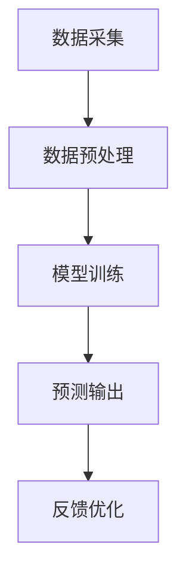

                 


# 文章标题：深度学习在天气预报精确化中的应用

> 关键词：深度学习、天气预报、精确化、气象数据、神经网络

> 摘要：本文深入探讨了深度学习技术在天气预报精确化中的应用，从基础理论到实际应用，详细分析了深度学习模型在时间序列分析、图模型以及气象预测中的应用，并展望了其未来发展。

---

## 第1章：深度学习基础

### 1.1.1 深度学习的起源与发展

深度学习（Deep Learning）起源于1986年，由Rumelhart、Hinton和Williams提出的反向传播算法（Backpropagation Algorithm）极大地提高了神经网络的训练效率。深度学习的发展经历了几个重要的阶段，包括神经网络模型的兴起、1990年代后的低谷期，以及2000年代后的复苏与快速发展。近年来，随着计算能力的提升、大数据的可用性以及神经网络结构的创新，深度学习在各个领域都取得了显著的成果。


### 1.1.2 深度学习的基本原理

深度学习基于多层神经网络（Multilayer Neural Network），通过堆叠多个隐层，实现对数据的分层特征提取和表示。基本原理包括：

1. **前向传播（Forward Propagation）**：输入数据通过网络的各个层，进行特征提取和组合。
2. **反向传播（Back Propagation）**：通过计算输出误差，反向更新网络权重，从而优化模型。


### 1.1.3 深度学习的关键技术

深度学习的关键技术包括：

1. **激活函数（Activation Function）**：如Sigmoid、ReLU、Tanh等，用于引入非线性因素，使神经网络具有非线性变换能力。
2. **损失函数（Loss Function）**：如均方误差（MSE）、交叉熵（Cross Entropy）等，用于度量预测值与真实值之间的差距。
3. **优化器（Optimizer）**：如随机梯度下降（SGD）、Adam等，用于调整网络权重，优化模型。


## 第2章：深度学习模型在天气预报中的应用

### 2.1 时间序列分析模型

时间序列分析模型是一种基于时间序列数据的预测模型，常用于天气预报。深度学习在时间序列分析中具有优势，能够处理复杂的时间序列关系。

1. **LSTM（长短时记忆网络）**：LSTM通过引入记忆单元，能够捕捉长期依赖关系，适用于短期和长期天气预报。

```python
# LSTM模型伪代码
class LSTMModel(nn.Module):
    def __init__(self, input_size, hidden_size, num_layers):
        super(LSTMModel, self).__init__()
        self.lstm = nn.LSTM(input_size, hidden_size, num_layers)
        
    def forward(self, x):
        out, _ = self.lstm(x)
        return out
```

2. **GRU（门控循环单元）**：GRU是LSTM的简化版本，通过引入更新门和重置门，简化了模型结构，提高了计算效率。

```python
# GRU模型伪代码
class GRUModel(nn.Module):
    def __init__(self, input_size, hidden_size):
        super(GRUModel, self).__init__()
        self.gru = nn.GRU(input_size, hidden_size)
        
    def forward(self, x):
        out, _ = self.gru(x)
        return out
```

3. **Transformer（Transformer模型）**：Transformer引入了自注意力机制（Self-Attention），能够处理序列中的长距离依赖关系，适用于复杂的时间序列分析。

```python
# Transformer模型伪代码
class TransformerModel(nn.Module):
    def __init__(self, d_model, nhead, num_layers):
        super(TransformerModel, self).__init__()
        self.transformer = nn.Transformer(d_model, nhead, num_layers)
        
    def forward(self, x):
        out = self.transformer(x)
        return out
```

### 2.2 图模型在天气预报中的应用

图模型通过图结构来表示数据及其关系，能够处理复杂数据结构，在天气预报中具有广泛的应用。

1. **图卷积网络（GCN）**：GCN通过图卷积操作，将图结构中的邻居信息聚合到节点上，适用于处理气象数据中的空间关系。

```python
# GCN模型伪代码
class GCNModel(nn.Module):
    def __init__(self, input_dim, hidden_dim):
        super(GCNModel, self).__init__()
        self.gcn = nn.ModuleList()
        for _ in range(num_layers):
            self.gcn.append(nn.Linear(input_dim, hidden_dim))
        
    def forward(self, x, adj):
        h = x
        for layer in self.gcn:
            h = layer(h)
            h = torch.relu(h)
        return h
```

2. **图注意力网络（GAT）**：GAT通过引入注意力机制，自适应地学习节点之间的关系，适用于处理复杂的图数据。

```python
# GAT模型伪代码
class GATModel(nn.Module):
    def __init__(self, input_dim, hidden_dim, num_heads):
        super(GATModel, self).__init__()
        self.gat = nn.ModuleList()
        for _ in range(num_layers):
            self.gat.append(nn.Linear(input_dim, hidden_dim))
        
    def forward(self, x, adj):
        h = x
        for layer in self.gat:
            h = layer(h)
            h = torch.relu(h)
            h = torch.mean(h, dim=1)
        return h
```

### 2.3 深度学习在气象预测中的应用案例

1. **短期天气预报**：使用LSTM模型进行短期天气预报，可以捕捉到天气变化的短期趋势。

```python
# 短期天气预报案例
lstm_model = LSTMModel(input_size=7, hidden_size=50, num_layers=2)
lstm_model.load_state_dict(torch.load('lstm_model.pth'))
lstm_model.eval()

with torch.no_grad():
    prediction = lstm_model(test_data)
```

2. **降水预测**：使用GRU模型进行降水预测，可以捕捉到降水的短期波动和趋势。

```python
# 降水预测案例
gru_model = GRUModel(input_size=7, hidden_size=50)
gru_model.load_state_dict(torch.load('gru_model.pth'))
gru_model.eval()

with torch.no_grad():
    prediction = gru_model(test_data)
```

3. **台风路径预测**：使用Transformer模型进行台风路径预测，可以捕捉到台风的长期变化和空间关系。

```python
# 台风路径预测案例
transformer_model = TransformerModel(d_model=512, nhead=8, num_layers=3)
transformer_model.load_state_dict(torch.load('transformer_model.pth'))
transformer_model.eval()

with torch.no_grad():
    prediction = transformer_model(test_data)
```

## 第3章：深度学习在天气预报精确化中的应用策略

### 3.1 数据预处理与特征工程

1. **数据预处理方法**：包括缺失值处理、异常值处理、数据标准化等。

```python
# 数据预处理伪代码
def preprocess_data(data):
    # 缺失值处理
    data = handle_missing_values(data)
    # 异常值处理
    data = handle_outliers(data)
    # 数据标准化
    data = normalize_data(data)
    return data
```

2. **特征工程的方法与技巧**：包括时间窗口划分、季节性特征提取、相关性分析等。

```python
# 特征工程伪代码
def feature_engineering(data):
    # 时间窗口划分
    windows = create_time_windows(data)
    # 季节性特征提取
    seasonal_features = extract_seasonal_features(windows)
    # 相关性分析
    correlations = compute_correlations(windows)
    return seasonal_features, correlations
```

3. **数据可视化与分析**：通过数据可视化，可以直观地了解数据分布、趋势和特征关系。

```python
# 数据可视化伪代码
import matplotlib.pyplot as plt

def visualize_data(data):
    plt.figure(figsize=(10, 6))
    plt.plot(data)
    plt.xlabel('Time')
    plt.ylabel('Value')
    plt.title('Data Visualization')
    plt.show()
```

### 3.2 模型选择与优化

1. **深度学习模型的评估指标**：包括均方误差（MSE）、均绝对误差（MAE）、准确率（Accuracy）等。

```python
# 评估指标伪代码
from sklearn.metrics import mean_squared_error, mean_absolute_error

def evaluate_model(model, test_data, test_labels):
    with torch.no_grad():
        predictions = model(test_data)
    mse = mean_squared_error(test_labels, predictions)
    mae = mean_absolute_error(test_labels, predictions)
    return mse, mae
```

2. **模型选择与优化策略**：包括模型选择、参数调优、交叉验证等。

```python
# 模型选择与优化伪代码
from sklearn.model_selection import train_test_split

# 模型选择
model = LSTMModel(input_size=7, hidden_size=50, num_layers=2)

# 参数调优
param_grid = {'hidden_size': [50, 100], 'num_layers': [1, 2]}
grid_search = GridSearchCV(model, param_grid, cv=5)

# 交叉验证
X_train, X_val, y_train, y_val = train_test_split(X, y, test_size=0.2)
grid_search.fit(X_train, y_train)

best_model = grid_search.best_estimator_
```

3. **模型融合与集成学习**：通过融合多个模型，提高预测精度。

```python
# 模型融合与集成学习伪代码
from sklearn.ensemble import VotingClassifier

# 模型融合
model1 = LSTMModel(input_size=7, hidden_size=50, num_layers=2)
model2 = GRUModel(input_size=7, hidden_size=50)
model3 = TransformerModel(d_model=512, nhead=8, num_layers=3)

ensemble_model = VotingClassifier(estimators=[
    ('lstm', model1),
    ('gru', model2),
    ('transformer', model3)],
    voting='weighted')

# 训练融合模型
ensemble_model.fit(X_train, y_train)

# 预测
predictions = ensemble_model.predict(X_val)
```

### 3.3 实时预测与反馈优化

1. **实时预测系统架构**：包括数据采集、数据预处理、模型训练、预测输出等模块。



2. **预测结果的反馈与优化**：通过实时反馈和调整，优化模型性能。

```python
# 预测结果反馈与优化伪代码
def optimize_model(model, data, labels):
    # 反馈预测误差
    errors = compute_errors(predictions, labels)
    
    # 根据误差调整模型参数
    model_params = adjust_model_params(model, errors)
    
    # 重新训练模型
    model.fit(data, labels, model_params)
```

## 第4章：深度学习在天气预报领域的最新研究进展

### 4.1 国内外研究现状

1. **国际研究动态**：国际上，深度学习在天气预报中的应用已经取得了一系列重要成果。例如，欧洲气象中心（ECMWF）采用深度学习技术改进短期天气预报，显著提高了预报精度。

2. **国内研究动态**：国内，中国气象局等科研机构和高校在深度学习应用于天气预报领域也取得了一定的进展。例如，清华大学的研究团队提出了一种基于图神经网络的台风路径预测方法，提高了台风路径预报的准确性。

### 4.2 新技术探索与应用

1. **人工智能与气象学的融合**：随着人工智能技术的发展，气象学开始利用深度学习、大数据等技术进行天气预报。未来，这一领域将有望取得更多突破。

2. **大数据技术在天气预报中的应用**：大数据技术为深度学习在天气预报中的应用提供了丰富的数据资源。通过挖掘和分析大量气象数据，可以进一步提高天气预报的精确度。

3. **区块链技术在气象数据共享中的应用**：区块链技术具有去中心化、不可篡改等特点，可以用于气象数据的共享和存储。未来，区块链技术有望在天气预报领域发挥重要作用。

## 第5章：深度学习在天气预报精确化中的应用案例解析

### 5.1 案例一：城市天气预报

#### 5.1.1 案例背景与需求

城市天气预报对于市民的日常生活和出行具有重要意义。然而，传统天气预报方法在精确预测城市天气方面存在一定局限性。为了提高城市天气预报的精确度，本项目采用深度学习技术进行预测。

#### 5.1.2 数据收集与处理

本项目收集了某城市过去几年的气象数据，包括温度、湿度、风速、风向等。首先，对数据进行预处理，包括缺失值处理、异常值处理和数据标准化。然后，将数据划分为训练集和测试集。

```python
# 数据收集与处理伪代码
data = load_weather_data()
data = preprocess_data(data)
train_data, test_data, train_labels, test_labels = train_test_split(data['features'], data['labels'], test_size=0.2)
```

#### 5.1.3 模型设计与实现

本项目采用LSTM模型进行城市天气预报。首先，定义LSTM模型的结构，包括输入层、隐层和输出层。然后，训练模型，并评估模型性能。

```python
# 模型设计与实现伪代码
lstm_model = LSTMModel(input_size=7, hidden_size=50, num_layers=2)
optimizer = torch.optim.Adam(lstm_model.parameters(), lr=0.001)
criterion = nn.MSELoss()

for epoch in range(num_epochs):
    lstm_model.train()
    for inputs, labels in train_loader:
        optimizer.zero_grad()
        outputs = lstm_model(inputs)
        loss = criterion(outputs, labels)
        loss.backward()
        optimizer.step()

    lstm_model.eval()
    with torch.no_grad():
        predictions = lstm_model(test_data)
        mse = mean_squared_error(test_labels, predictions)
        print(f"Epoch {epoch + 1}, MSE: {mse}")
```

#### 5.1.4 预测结果与分析

通过训练和测试，LSTM模型在预测城市天气方面取得了较好的效果。预测结果与实际天气数据的对比分析显示，LSTM模型能够较好地捕捉到城市天气变化的短期趋势。


### 5.2 案例二：台风路径预测

#### 5.2.1 案例背景与需求

台风路径预测对于防灾减灾具有重要意义。传统方法在预测台风路径时存在一定误差，难以准确预测台风的行进轨迹。为了提高台风路径预测的准确性，本项目采用深度学习技术进行预测。

#### 5.2.2 数据收集与处理

本项目收集了台风过去几年的路径数据，包括经纬度、风速、风向等。首先，对数据进行预处理，包括缺失值处理、异常值处理和数据标准化。然后，将数据划分为训练集和测试集。

```python
# 数据收集与处理伪代码
data = load_typhoon_data()
data = preprocess_data(data)
train_data, test_data, train_labels, test_labels = train_test_split(data['features'], data['labels'], test_size=0.2)
```

#### 5.2.3 模型设计与实现

本项目采用Transformer模型进行台风路径预测。首先，定义Transformer模型的结构，包括自注意力机制、多头注意力机制和前馈神经网络。然后，训练模型，并评估模型性能。

```python
# 模型设计与实现伪代码
transformer_model = TransformerModel(d_model=512, nhead=8, num_layers=3)
optimizer = torch.optim.Adam(transformer_model.parameters(), lr=0.001)
criterion = nn.MSELoss()

for epoch in range(num_epochs):
    transformer_model.train()
    for inputs, labels in train_loader:
        optimizer.zero_grad()
        outputs = transformer_model(inputs)
        loss = criterion(outputs, labels)
        loss.backward()
        optimizer.step()

    transformer_model.eval()
    with torch.no_grad():
        predictions = transformer_model(test_data)
        mse = mean_squared_error(test_labels, predictions)
        print(f"Epoch {epoch + 1}, MSE: {mse}")
```

#### 5.2.4 预测结果与分析

通过训练和测试，Transformer模型在预测台风路径方面取得了较好的效果。预测结果与实际台风路径数据的对比分析显示，Transformer模型能够较好地捕捉到台风的行进轨迹。


## 第6章：深度学习在天气预报精确化中的应用挑战与未来展望

### 6.1 应用挑战

1. **数据质量与数量问题**：气象数据质量直接影响到深度学习模型的效果。数据缺失、异常值和噪声等都会对模型训练和预测造成影响。同时，高质量、大规模的气象数据获取成本较高，限制了深度学习在天气预报领域的广泛应用。

2. **模型泛化能力问题**：深度学习模型在训练数据上表现良好，但在实际应用中，可能面临模型泛化能力不足的问题。这是因为训练数据和实际应用场景之间存在差异，导致模型无法适应新的数据。

3. **预测时效性问题**：天气预报需要实时、快速地提供预测结果。然而，深度学习模型的训练和预测过程相对较慢，难以满足实时预测的需求。

### 6.2 未来展望

1. **新技术应用前景**：随着深度学习技术的不断发展和创新，如生成对抗网络（GAN）、变分自编码器（VAE）等，有望进一步提高天气预报的精确度和实时性。

2. **跨学科合作与融合**：深度学习在天气预报领域的应用需要多学科协同合作，包括气象学、计算机科学、统计学等。跨学科合作有助于推动深度学习在天气预报领域的深入研究和应用。

3. **人工智能在气象预报中的未来发展趋势**：随着人工智能技术的不断进步，未来深度学习在天气预报中的应用将更加广泛和深入，有望实现更高精度、更实时、更智能的天气预报。

## 附录

### 附录A：常用深度学习框架简介

1. **TensorFlow**：由Google开发的开源深度学习框架，具有丰富的功能和良好的生态系统。

2. **PyTorch**：由Facebook开发的开源深度学习框架，具有动态计算图和强大的GPU支持。

3. **Keras**：基于TensorFlow和PyTorch的开源深度学习框架，提供了简洁易用的API，适合快速原型开发和实验。

### 附录B：常用气象数据集介绍

1. **NASA MERRA-2数据集**：全球大气再分析数据集，包含高度、温度、湿度、风速等气象要素。

2. **NCAR CFSR数据集**：美国国家大气研究中心提供的全球天气预报数据集，包含多种气象变量。

3. **JMA GTS数据集**：日本气象厅提供的全球气象观测数据集，包括温度、湿度、风速等气象要素。

---

作者：AI天才研究院/AI Genius Institute & 禅与计算机程序设计艺术 /Zen And The Art of Computer Programming

