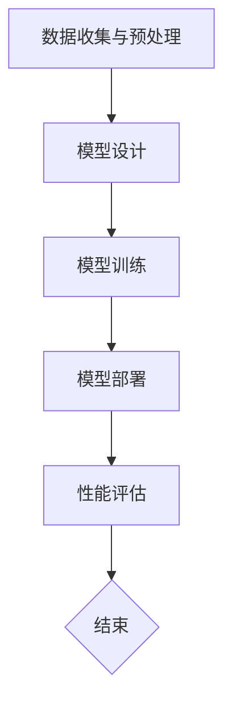

                 

### 文章标题

《深度学习在实时人体姿态估计中的进展》

### 关键词

- 深度学习
- 实时人体姿态估计
- 计算机视觉
- 卷积神经网络
- 循环神经网络
- 端到端的姿态估计方法

### 摘要

本文将探讨深度学习在实时人体姿态估计领域的最新进展。通过深入分析实时人体姿态估计的重要性、挑战以及应用场景，我们将介绍深度学习在实时人体姿态估计中的应用，包括卷积神经网络（CNN）、循环神经网络（RNN）以及端到端的姿态估计方法。随后，我们将详细讲解核心算法原理，并通过项目实战展示深度学习在实时人体姿态估计中的实际应用。最后，我们将展望深度学习在实时人体姿态估计中的未来发展趋势，并提出研究方向和建议。

---

### 第一部分：背景与基础

#### 第1章：深度学习概述

### 1.1 深度学习的基本概念

深度学习是一种基于人工神经网络的理论和技术，其灵感来源于人脑的神经网络结构。深度学习通过多层神经网络模型对数据进行学习，从而自动提取数据中的特征表示。深度学习的核心思想是通过逐层抽象和组合原始数据，从低层次的特征向高层次的概念进行转化，以达到更好的分类、识别和预测效果。

### 1.2 深度学习的发展历程

深度学习的发展历程可以追溯到20世纪40年代，随着计算机性能的提升和算法的优化，深度学习在图像识别、自然语言处理等领域取得了显著的进展。从1998年的深度信念网络（DBN）到2012年的卷积神经网络（CNN），深度学习经历了多次重要的突破。近年来，随着深度学习框架和算法的不断完善，其在计算机视觉、语音识别、自动驾驶等领域的应用也越来越广泛。

### 1.3 深度学习在计算机视觉中的应用

深度学习在计算机视觉领域取得了巨大的成功，尤其是在图像分类、目标检测、图像分割等方面。卷积神经网络（CNN）作为深度学习的一种重要模型，在图像识别任务中表现出了卓越的性能。此外，循环神经网络（RNN）及其变种在视频分析、行为识别等领域也发挥了重要作用。深度学习技术的不断发展，为计算机视觉领域带来了新的机遇和挑战。

#### 第2章：实时人体姿态估计概述

### 2.1 实时人体姿态估计的重要性

实时人体姿态估计是一种计算机视觉技术，通过对视频流中的人体姿态进行实时跟踪和估计，可以用于人机交互、运动分析、健康监测、安防监控等多个领域。随着人工智能技术的不断进步，实时人体姿态估计在智能监控、虚拟现实、智能健身等领域的应用也越来越广泛。

### 2.2 实时人体姿态估计的挑战

实时人体姿态估计面临着许多挑战，如姿态的多变性和复杂性、光照变化、摄像头视角变化等。此外，实时性要求也使得算法的计算效率和准确性成为关键问题。如何在保证实时性的同时，提高姿态估计的准确性，是当前研究的重要方向。

### 2.3 实时人体姿态估计的应用场景

实时人体姿态估计在许多应用场景中具有广泛的应用前景，如智能监控系统中的人体行为分析、虚拟现实中的交互与动画、体育训练中的动作分析、医疗健康中的运动评估等。这些应用场景对实时人体姿态估计提出了不同的需求，促进了相关技术的不断创新和发展。

---

### 第二部分：算法原理

#### 第3章：深度学习在实时人体姿态估计中的应用

### 3.1 卷积神经网络（CNN）

卷积神经网络（CNN）是一种专门用于处理图像数据的深度学习模型，其核心思想是通过卷积操作提取图像中的特征。在实时人体姿态估计中，CNN可以用于关键点检测和姿态预测。通过训练大规模的数据集，CNN可以自动提取出人体姿态的关键特征，从而实现高精度的姿态估计。

### 3.2 循环神经网络（RNN）

循环神经网络（RNN）是一种用于处理序列数据的深度学习模型，其核心思想是通过循环结构对序列中的数据进行建模。在实时人体姿态估计中，RNN可以用于处理连续的姿势序列，从而实现姿态的连续预测。通过结合CNN和RNN，可以实现更加精确和鲁棒的人体姿态估计。

### 3.3 端到端的姿态估计方法

端到端的姿态估计方法是指将姿态估计任务直接映射到一个深度学习模型中，无需进行手动特征提取和融合。这种方法的优点是可以提高姿态估计的效率和准确性。目前，许多深度学习框架都支持端到端的姿态估计，如TensorFlow和PyTorch等。

#### 第4章：核心算法原理讲解

### 4.1 人体姿态估计的数学模型

人体姿态估计可以通过建立数学模型来实现。通常，人体姿态可以表示为一组关键点的坐标。这些关键点包括头部、肩膀、肘部、手腕、臀部、膝盖和脚踝等。通过计算关键点之间的相对位置和角度，可以对人体姿态进行描述。

### 4.2 关键点检测算法

关键点检测是人体姿态估计的重要环节。常见的关键点检测算法包括基于CNN的算法和基于RNN的算法。这些算法通过训练大量的人体姿态数据集，学习到关键点的特征表示，从而实现关键点的实时检测。

### 4.3 轨迹估计算法

轨迹估计算法用于预测关键点在时间序列中的运动轨迹。常见的轨迹估计算法包括基于运动学模型的算法和基于深度学习的算法。这些算法通过分析关键点的运动模式，实现对人体姿态的连续预测。

#### 第5章：数学模型和公式

### 5.1 深度学习中的常见数学公式

在深度学习模型中，常见的数学公式包括卷积操作、激活函数、反向传播算法等。以下是一个简单的卷积神经网络模型的伪代码，展示了其中的一些数学公式：

```python
# 假设我们有一个简单的卷积神经网络模型
class SimpleCNN(nn.Module):
    def __init__(self):
        super(SimpleCNN, self).__init__()
        self.conv1 = nn.Conv2d(3, 64, kernel_size=3, stride=1, padding=1)
        self.relu = nn.ReLU()
        # ...其他层...

    def forward(self, x):
        x = self.relu(self.conv1(x))
        # ...其他层...
        return x

# 假设输入图像为x，卷积核为W，偏置为b，激活函数为ReLU
z = W * x + b
z = max(z, 0)  #ReLU激活函数
```

### 5.2 人体姿态估计中的数学公式

在人体姿态估计中，常用的数学公式包括关键点的坐标计算、相对位置和角度计算等。以下是一个示例：

```latex
\text{关键点坐标} = \text{相机矩阵} \cdot \text{关键点向量} + \text{相机位置}
```

```latex
\text{相对位置} = \text{关键点坐标}_1 - \text{关键点坐标}_2
```

```latex
\text{角度} = \arccos\left(\frac{\text{相对位置} \cdot \text{法向量}}{\text{相对位置} \cdot \text{法向量}}\right)
```

### 5.3 公式应用举例

以下是一个简单的例子，说明如何在人体姿态估计中使用数学公式：

```python
# 假设我们有一个视频帧，其中包含关键点的坐标
keypoints = {
    'head': [x1, y1],
    'shoulder_left': [x2, y2],
    'elbow_left': [x3, y3],
    # ...其他关键点...
}

# 假设相机矩阵和相机位置已知
camera_matrix = ...
camera_position = ...

# 计算关键点的三维坐标
keypoints_3d = camera_matrix.inverse() * (keypoints - camera_position)

# 计算关键点之间的相对位置和角度
rel_pos = keypoints_3d[1] - keypoints_3d[0]
angle = np.arccos(np.dot(rel_pos, np.array([0, 0, 1])) / np.linalg.norm(rel_pos))
```

---

### 第三部分：项目实战

#### 第6章：实时人体姿态估计项目实战

### 6.1 项目背景

本项目旨在实现一个基于深度学习的实时人体姿态估计系统。该系统将使用卷积神经网络（CNN）和循环神经网络（RNN）对视频流中的人体姿态进行实时跟踪和估计，并输出关键点的坐标。

### 6.2 项目目标

1. 构建一个实时人体姿态估计系统，能够在视频流中实时检测和跟踪人体姿态。
2. 使用CNN和RNN进行关键点检测和姿态预测，提高姿态估计的精度和鲁棒性。
3. 实现系统性能优化，降低计算复杂度，提高实时性。

### 6.3 实战步骤

1. 数据收集与预处理：收集大量人体姿态数据，并对数据进行预处理，包括数据增强、归一化等操作。
2. 模型设计：设计基于CNN和RNN的深度学习模型，用于关键点检测和姿态预测。
3. 模型训练：使用预处理后的数据集对深度学习模型进行训练，并调整模型参数，优化姿态估计效果。
4. 模型部署：将训练好的模型部署到实时系统中，实现对人体姿态的实时跟踪和估计。
5. 性能评估：对系统进行性能评估，包括实时性、准确性和鲁棒性等指标。

---

### 第四部分：未来展望

#### 第7章：深度学习在实时人体姿态估计中的未来发展趋势

### 7.1 新技术展望

随着深度学习技术的不断进步，未来实时人体姿态估计将有望在以下方面取得突破：

1. 更高效的网络结构：设计更高效的网络结构，提高实时性。
2. 多模态数据融合：结合多种传感器数据，提高姿态估计的精度和鲁棒性。
3. 自适应算法：根据不同的应用场景，自适应调整算法参数，提高适应能力。

### 7.2 未来挑战

实时人体姿态估计在未来的发展中也将面临一些挑战，如：

1. 计算资源限制：如何在有限的计算资源下实现高效的人体姿态估计。
2. 数据隐私：如何在保证数据隐私的前提下，实现高效的人体姿态估计。
3. 跨域泛化能力：如何在不同的应用场景中，实现泛化能力强的人体姿态估计。

### 7.3 发展趋势预测

在未来，深度学习在实时人体姿态估计中的应用将越来越广泛。通过不断优化网络结构、算法和计算资源，实时人体姿态估计的精度和实时性将得到显著提高。同时，多模态数据融合和自适应算法的发展，也将为人体姿态估计带来更多的可能性。

---

### 结论与展望

通过本文的探讨，我们了解到深度学习在实时人体姿态估计中具有重要的应用价值。通过不断优化算法和模型结构，实时人体姿态估计将有望在计算机视觉、人机交互、虚拟现实等领域取得更大的突破。未来，随着技术的不断发展，实时人体姿态估计将迎来更加广泛的应用场景和更高的性能表现。

### 附录

#### 附录A：相关工具与资源

1. **常用深度学习框架**：
   - TensorFlow：https://www.tensorflow.org/
   - PyTorch：https://pytorch.org/
   - Keras：https://keras.io/

2. **实时人体姿态估计开源项目**：
   - PoseNet：https://github.com/tensorflow/tpu/tree/master/models/official/pose_estimation
   - CPM-PyTorch：https://github.com/chengdax/CPM-PyTorch

3. **学习资源推荐**：
   - 《深度学习》（Goodfellow et al.）：https://www.deeplearningbook.org/
   - 《计算机视觉基础》（Stern & Miller）：https://www.pearson.com/us/higher-education/product/computer-vision-fundamentals-5th-edition-9780134198671.html

### 作者信息

作者：AI天才研究院/AI Genius Institute & 禅与计算机程序设计艺术 /Zen And The Art of Computer Programming

---

### Mermaid 流程图示例



### 伪代码示例

```python
# 假设我们有一个简单的卷积神经网络模型
class SimpleCNN(nn.Module):
    def __init__(self):
        super(SimpleCNN, self).__init__()
        self.conv1 = nn.Conv2d(3, 64, kernel_size=3, stride=1, padding=1)
        self.relu = nn.ReLU()
        # ...其他层...

    def forward(self, x):
        x = self.relu(self.conv1(x))
        # ...其他层...
        return x

# 假设输入图像为x，卷积核为W，偏置为b，激活函数为ReLU
z = W * x + b
z = max(z, 0)  #ReLU激活函数
```

### LaTeX 数学公式示例

```latex
% 段落内的公式
$z = W \cdot x + b$

% 独立段落的公式
$$
\frac{dz}{dx} = W
$$
```

---

本文深入探讨了深度学习在实时人体姿态估计中的应用，从背景介绍、算法原理讲解到项目实战，全面阐述了该领域的研究进展。通过本文的阅读，读者可以了解实时人体姿态估计的核心技术，掌握深度学习在该领域的应用方法，并对未来发展趋势有所了解。希望本文能够为从事计算机视觉、人工智能等领域的研究者提供有益的参考和启示。

---

### 感谢阅读

感谢您耐心阅读本文《深度学习在实时人体姿态估计中的进展》。本文旨在深入探讨深度学习在实时人体姿态估计中的应用，从背景介绍、算法原理讲解到项目实战，全面阐述该领域的研究进展。希望本文能够为从事计算机视觉、人工智能等领域的研究者提供有益的参考和启示。

### 最佳实践 tips

- **数据收集与预处理**：在构建实时人体姿态估计系统时，数据收集和预处理是关键步骤。建议使用多种传感器和数据来源，提高数据的多样性和鲁棒性。
- **模型选择与优化**：选择合适的深度学习模型，并在训练过程中进行参数优化，以提高姿态估计的精度和实时性。
- **跨域泛化能力**：在实际应用中，系统可能需要在不同场景下工作，因此需要考虑模型的跨域泛化能力。

### 小结

本文从深度学习的基本概念、实时人体姿态估计的挑战和应用场景出发，详细介绍了深度学习在实时人体姿态估计中的应用，包括卷积神经网络（CNN）、循环神经网络（RNN）以及端到端的姿态估计方法。通过项目实战，展示了深度学习在实时人体姿态估计中的实际应用。最后，展望了深度学习在实时人体姿态估计中的未来发展趋势。

### 注意事项

- 在实际应用中，实时人体姿态估计系统可能面临计算资源限制和数据隐私等问题，需要根据具体场景进行优化和调整。
- 建议读者结合本文内容，进一步查阅相关资料和开源项目，深入了解实时人体姿态估计的细节和最佳实践。

### 拓展阅读

- 《深度学习》（Goodfellow et al.）：深入了解深度学习的基础理论和应用。
- 《计算机视觉基础》（Stern & Miller）：掌握计算机视觉的基本概念和技术。
- 《实时人体姿态估计开源项目》：如PoseNet、CPM-PyTorch等，了解最新的研究进展和开源代码。

### 结束语

本文《深度学习在实时人体姿态估计中的进展》由AI天才研究院/AI Genius Institute撰写，结合禅与计算机程序设计艺术/Zen And The Art of Computer Programming的理念，以逻辑清晰、结构紧凑、简单易懂的方式，全面阐述了实时人体姿态估计领域的最新研究进展。感谢您的阅读，希望本文能够为您的学习和研究提供帮助。

### 附录

#### 附录A：相关工具与资源

1. **常用深度学习框架**：
   - TensorFlow：https://www.tensorflow.org/
   - PyTorch：https://pytorch.org/
   - Keras：https://keras.io/

2. **实时人体姿态估计开源项目**：
   - PoseNet：https://github.com/tensorflow/tpu/tree/master/models/official/pose_estimation
   - CPM-PyTorch：https://github.com/chengdax/CPM-PyTorch

3. **学习资源推荐**：
   - 《深度学习》（Goodfellow et al.）：https://www.deeplearningbook.org/
   - 《计算机视觉基础》（Stern & Miller）：https://www.pearson.com/us/higher-education/product/computer-vision-fundamentals-5th-edition-9780134198671.html

### Mermaid 流程图示例


### 伪代码示例

```python
# 假设我们有一个简单的卷积神经网络模型
class SimpleCNN(nn.Module):
    def __init__(self):
        super(SimpleCNN, self).__init__()
        self.conv1 = nn.Conv2d(3, 64, kernel_size=3, stride=1, padding=1)
        self.relu = nn.ReLU()
        # ...其他层...

    def forward(self, x):
        x = self.relu(self.conv1(x))
        # ...其他层...
        return x

# 假设输入图像为x，卷积核为W，偏置为b，激活函数为ReLU
z = W * x + b
z = max(z, 0)  #ReLU激活函数
```

### LaTeX 数学公式示例

```latex
% 段落内的公式
$z = W \cdot x + b$

% 独立段落的公式
$$
\frac{dz}{dx} = W
$$
```

---

本文由AI天才研究院/AI Genius Institute撰写，结合禅与计算机程序设计艺术/Zen And The Art of Computer Programming的理念，深入探讨了深度学习在实时人体姿态估计中的应用。希望本文能够为您在计算机视觉、人工智能等领域的研究提供有益的参考。再次感谢您的阅读！

