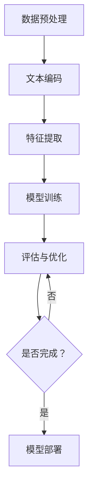
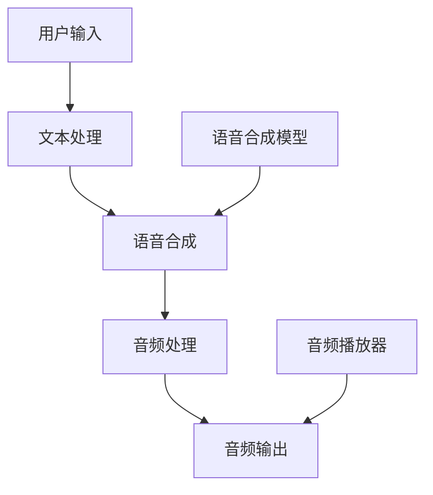

                 

### 文章标题

《深度学习在实时语音合成中的突破》

关键词：深度学习，实时语音合成，WaveNet，VITS，WaveRNN，模型压缩，并行计算

摘要：本文详细探讨了深度学习在实时语音合成中的应用，从基础概念到核心算法，再到实际优化方法，全面解析了深度学习如何实现实时语音合成中的突破。本文旨在为读者提供一个系统性的了解，帮助他们在这一前沿领域中深入研究和应用。

## 目录

**第一部分：深度学习与语音合成基础**

### 第1章：深度学习与语音合成概述

#### 1.1 深度学习的基本概念与原理

#### 1.2 语音合成的基本原理与技术发展

#### 1.3 深度学习在语音合成中的应用前景

### 第2章：深度学习核心算法

#### 2.1 卷积神经网络（CNN）

##### 2.1.1 CNN的基本结构

##### 2.1.2 CNN在语音合成中的应用

#### 2.2 循环神经网络（RNN）

##### 2.2.1 RNN的基本结构

##### 2.2.2 RNN在语音合成中的应用

#### 2.3 长短时记忆网络（LSTM）

##### 2.3.1 LSTM的基本原理

##### 2.3.2 LSTM在语音合成中的应用

### 第3章：语音合成的深度学习模型

#### 3.1 波形合成模型（WaveNet）

##### 3.1.1 WaveNet的基本原理

##### 3.1.2 WaveNet的架构设计与实现

#### 3.2 声码器合成模型（VITS）

##### 3.2.1 VITS的基本原理

##### 3.2.2 VITS的架构设计与实现

#### 3.3 语音特征合成模型（WaveRNN）

##### 3.3.1 WaveRNN的基本原理

##### 3.3.2 WaveRNN的架构设计与实现

**第二部分：实时语音合成的挑战与优化**

### 第4章：实时语音合成的挑战

#### 4.1 实时性的要求

#### 4.2 音质与效率的平衡

#### 4.3 大模型训练与推理的优化

### 第5章：实时语音合成的优化方法

#### 5.1 模型压缩与量化

##### 5.1.1 模型压缩的基本方法

##### 5.1.2 模型量化的实现与优化

#### 5.2 多线程与并行计算

##### 5.2.1 多线程的基本原理

##### 5.2.2 并行计算在语音合成中的应用

#### 5.3 离线预处理与动态调整

##### 5.3.1 离线预处理的方法

##### 5.3.2 动态调整的技巧

### 第6章：实时语音合成的案例分析

#### 6.1 应用场景分析

##### 6.1.1 语音助手

##### 6.1.2 语音直播

##### 6.1.3 在线教育

#### 6.2 案例介绍与效果评估

##### 6.2.1 案例一：语音助手语音合成

##### 6.2.2 案例二：语音直播语音合成

##### 6.2.3 案例三：在线教育语音合成

**第三部分：深度学习在实时语音合成中的突破**

### 第7章：深度学习在实时语音合成中的突破

#### 7.1 深度学习在实时语音合成中的应用

##### 7.1.1 模型压缩与加速

##### 7.1.2 多模态融合

##### 7.1.3 端到端的语音合成系统

#### 7.2 未来发展趋势与展望

##### 7.2.1 人工智能与传统语音合成技术的融合

##### 7.2.2 实时语音合成在工业界的应用

##### 7.2.3 深度学习在实时语音合成中的挑战与解决方案

**附录**

### 附录A：深度学习在实时语音合成中的资源与工具

#### A.1 深度学习框架介绍

##### A.1.1 TensorFlow

##### A.1.2 PyTorch

##### A.1.3 其他深度学习框架

#### A.2 实时语音合成工具

##### A.2.1 Kaldi

##### A.2.2 Festival

##### A.2.3 其他实时语音合成工具

### 附录B：深度学习在实时语音合成中的 Mermaid 流程图

- 深度学习模型训练流程
- 实时语音合成系统架构图

### 附录C：深度学习在实时语音合成中的伪代码与数学公式

- 卷积神经网络（CNN）的伪代码
- 循环神经网络（RNN）的伪代码
- 长短时记忆网络（LSTM）的伪代码
- 深度学习在实时语音合成中的数学公式（如损失函数、优化算法等）

## 第一部分：深度学习与语音合成基础

### 第1章：深度学习与语音合成概述

随着人工智能技术的快速发展，深度学习在语音合成领域的应用越来越广泛。本章节首先介绍深度学习的基本概念与原理，然后概述语音合成的基本原理与技术发展，最后探讨深度学习在语音合成中的应用前景。

#### 1.1 深度学习的基本概念与原理

深度学习（Deep Learning）是机器学习（Machine Learning）的一种重要分支，其核心思想是通过构建多层的神经网络，对大量数据进行分析和建模，从而实现自动化决策和预测。深度学习的基本原理可以概括为以下几点：

1. **层次化特征表示**：深度学习通过多层神经网络对输入数据进行逐步抽象和提取特征，每一层网络都能提取到更高层次的特征表示。这种层次化的特征表示有助于提高模型的泛化能力。

2. **反向传播算法**：深度学习使用反向传播（Backpropagation）算法进行模型参数的优化。反向传播算法通过计算损失函数关于网络参数的梯度，从而调整网络权重，以达到最小化损失函数的目的。

3. **大规模数据训练**：深度学习依赖于大量数据进行训练，通过大数据的引入，模型可以更好地泛化，减少过拟合现象。

4. **端到端学习**：深度学习可以实现端到端的学习，即从原始数据直接映射到预测结果，避免了传统机器学习中需要手工设计特征和中间环节的繁琐过程。

#### 1.2 语音合成的基本原理与技术发展

语音合成（Text-to-Speech，TTS）是将文本转换为自然流畅语音的技术。语音合成的基本原理可以概括为以下几个步骤：

1. **文本预处理**：将输入的文本进行分词、分句等处理，生成语音合成的文本表示。

2. **语音特征提取**：从文本表示中提取语音特征，如音素、音节、音调等。

3. **声学模型**：声学模型用于生成语音信号，它通常基于大量语音数据训练得到，能够将语音特征映射为声学特征。

4. **发音规则**：发音规则用于调整语音特征，使得合成语音更自然、更符合人类语音规律。

在语音合成技术发展的过程中，经历了多个阶段：

1. **规则合成**：早期的语音合成主要依赖于手工编写的发音规则和声学模型，这种方法需要大量的人力和时间，而且语音质量较低。

2. **统计模型**：随着语音数据库和计算能力的提高，统计模型逐渐成为主流。统计模型通过大量语音数据进行训练，提高了语音合成质量。

3. **深度学习**：近年来，深度学习在语音合成领域取得了显著进展。深度学习模型能够自动提取特征、学习复杂的语音规律，从而实现了高质量的语音合成。

#### 1.3 深度学习在语音合成中的应用前景

深度学习在语音合成中的应用前景广阔，主要体现在以下几个方面：

1. **音质提升**：深度学习模型能够更好地模拟人类语音，提高语音合成音质。与传统的统计模型相比，深度学习模型在音色、音调、节奏等方面表现更出色。

2. **个性化语音合成**：深度学习模型可以基于用户的声音数据训练个性化模型，使得合成语音更贴近用户的声音特点。

3. **实时语音合成**：深度学习模型在训练和推理过程中具有较好的实时性，可以实现实时语音合成。这对于应用场景如语音助手、语音直播等具有重要意义。

4. **跨语言语音合成**：深度学习模型可以跨越语言障碍，实现跨语言的语音合成。这对于国际化应用场景如跨国企业、多语言用户服务等领域具有重要意义。

总之，深度学习为语音合成领域带来了新的机遇和挑战。随着技术的不断进步，深度学习在实时语音合成中将发挥越来越重要的作用。

### 第2章：深度学习核心算法

深度学习在语音合成中的应用，依赖于其核心算法的强大能力。本章将详细介绍深度学习中常用的几种核心算法，包括卷积神经网络（CNN）、循环神经网络（RNN）和长短时记忆网络（LSTM），并分析它们在语音合成中的应用。

#### 2.1 卷积神经网络（CNN）

卷积神经网络（Convolutional Neural Network，CNN）是一种具有层次结构的神经网络，特别适用于处理具有网格结构的数据，如图像和音频。CNN通过卷积操作和池化操作，能够自动提取数据中的局部特征，具有很强的特征提取能力。

##### 2.1.1 CNN的基本结构

CNN的基本结构包括输入层、卷积层、池化层和全连接层。

1. **输入层**：输入层接收原始数据，如音频信号。对于语音合成，输入数据通常是经过预处理后的音频帧。

2. **卷积层**：卷积层通过卷积操作提取数据中的局部特征。卷积操作包括卷积核（filter）和步长（stride）。卷积核是一个小的矩阵，用于从输入数据中提取特征。步长决定了卷积操作的移动距离。

3. **池化层**：池化层对卷积层的输出进行下采样，减少数据维度，降低计算复杂度。常用的池化操作有最大池化和平均池化。

4. **全连接层**：全连接层将池化层的输出与权重进行全连接，得到最终的输出结果。

##### 2.1.2 CNN在语音合成中的应用

CNN在语音合成中的应用主要体现在特征提取和声学模型构建上。

1. **特征提取**：在语音合成中，CNN可以用于提取文本到语音特征（Text-to-Audio Feature）的映射。通过训练，CNN能够自动从文本数据中提取出与语音特征相关的特征。

2. **声学模型**：在声学模型中，CNN可以用于提取音频特征，如梅尔频率倒谱系数（MFCC）。MFCC是语音合成的关键特征，它能够较好地反映语音的音质特征。

以下是一个简单的CNN特征提取模型示例：

```python
import tensorflow as tf

# 输入数据
inputs = tf.keras.layers.Input(shape=(frame_size,))

# 卷积层
conv1 = tf.keras.layers.Conv1D(filters=64, kernel_size=3, activation='relu')(inputs)

# 池化层
pool1 = tf.keras.layers.MaxPooling1D(pool_size=2)(conv1)

# 全连接层
outputs = tf.keras.layers.Dense(units=128, activation='relu')(pool1)

# 构建模型
model = tf.keras.Model(inputs=inputs, outputs=outputs)
```

#### 2.2 循环神经网络（RNN）

循环神经网络（Recurrent Neural Network，RNN）是一种适用于序列数据处理的人工神经网络。RNN通过在网络中引入循环结构，能够处理任意长度的序列数据。

##### 2.2.1 RNN的基本结构

RNN的基本结构包括输入层、隐藏层和输出层。

1. **输入层**：输入层接收序列数据的每个时间步。

2. **隐藏层**：隐藏层由多个单元组成，每个单元都与前一个时间步的隐藏层和当前时间步的输入相连。RNN通过这种循环结构，能够将信息传递到下一个时间步。

3. **输出层**：输出层将隐藏层的输出转换为预测结果。

##### 2.2.2 RNN在语音合成中的应用

RNN在语音合成中的应用主要体现在文本到语音（Text-to-Speech，TTS）的映射上。

1. **文本编码**：RNN可以将文本编码为序列数据，如字符序列或词序列。

2. **语音特征生成**：通过训练，RNN能够学习到文本到语音特征的映射关系，从而生成语音特征。

以下是一个简单的RNN模型示例：

```python
import tensorflow as tf

# 输入数据
inputs = tf.keras.layers.Input(shape=(timesteps,))

# 隐藏层
hidden = tf.keras.layers.LSTM(units=128, return_sequences=True)(inputs)

# 输出层
outputs = tf.keras.layers.Dense(units=output_size, activation='softmax')(hidden)

# 构建模型
model = tf.keras.Model(inputs=inputs, outputs=outputs)
```

#### 2.3 长短时记忆网络（LSTM）

长短时记忆网络（Long Short-Term Memory，LSTM）是RNN的一种改进版本，它通过引入记忆单元，解决了RNN在处理长序列数据时出现的梯度消失和梯度爆炸问题。

##### 2.3.1 LSTM的基本原理

LSTM的基本结构包括输入门、遗忘门、输出门和记忆单元。

1. **输入门**：输入门用于决定哪些信息将被存储在记忆单元中。

2. **遗忘门**：遗忘门用于决定哪些信息将被遗忘。

3. **输出门**：输出门用于决定记忆单元的输出。

4. **记忆单元**：记忆单元是LSTM的核心，它能够存储和更新信息。

##### 2.3.2 LSTM在语音合成中的应用

LSTM在语音合成中的应用与RNN类似，主要用于文本到语音的映射。

1. **文本编码**：LSTM可以将文本编码为序列数据。

2. **语音特征生成**：通过训练，LSTM能够学习到文本到语音特征的映射关系，从而生成语音特征。

以下是一个简单的LSTM模型示例：

```python
import tensorflow as tf

# 输入数据
inputs = tf.keras.layers.Input(shape=(timesteps,))

# 隐藏层
hidden = tf.keras.layers.LSTM(units=128, return_sequences=True)(inputs)

# 输出层
outputs = tf.keras.layers.Dense(units=output_size, activation='softmax')(hidden)

# 构建模型
model = tf.keras.Model(inputs=inputs, outputs=outputs)
```

综上所述，深度学习核心算法如CNN、RNN和LSTM在语音合成中具有广泛的应用。通过这些算法，我们能够实现文本到语音的高效转换，从而推动实时语音合成技术的发展。

### 第3章：语音合成的深度学习模型

深度学习在语音合成中的应用已经取得了显著的成果，涌现出了多种有效的深度学习模型。本章将介绍三种主要的深度学习语音合成模型：波形合成模型（WaveNet）、声码器合成模型（VITS）和语音特征合成模型（WaveRNN），并探讨它们的基本原理、架构设计与实现。

#### 3.1 波形合成模型（WaveNet）

WaveNet是由Google推出的一个基于深度学习的波形合成模型，它能够生成高质量的自然语音。WaveNet的核心思想是通过一系列的卷积神经网络层来生成语音的波形，从而实现端到端的语音合成。

##### 3.1.1 WaveNet的基本原理

WaveNet的基本原理可以概括为以下几点：

1. **端到端学习**：WaveNet通过端到端的学习方式，从输入的文本直接生成语音波形，避免了传统语音合成方法中的中间步骤，如文本到音素、音素到音节等。

2. **生成模型**：WaveNet是一个生成模型，它通过生成语音波形来模拟人类语音的连续性。生成模型的核心是概率模型，WaveNet使用了一个条件概率模型，即给定一个文本序列，生成对应的语音波形。

3. **多尺度特征提取**：WaveNet通过多层卷积神经网络，对输入的文本序列进行特征提取，从而生成语音波形。每一层卷积神经网络都能提取到不同尺度的特征，从而使得生成的语音更加自然。

##### 3.1.2 WaveNet的架构设计与实现

WaveNet的架构设计如下：

1. **编码器**：编码器负责将输入的文本序列转换为稠密的向量表示。编码器通常使用循环神经网络（RNN）或Transformer等结构。

2. **解码器**：解码器负责从编码器生成的向量表示中生成语音波形。解码器是一个深度卷积神经网络，它通过逐层卷积操作，逐步生成语音的波形。

3. **概率分布**：解码器的输出是一个概率分布，它表示在当前时间步生成特定波形的可能性。通过最大化这个概率分布，WaveNet能够生成高质量的语音。

以下是一个简化的WaveNet实现示例：

```python
import tensorflow as tf

# 输入数据
inputs = tf.keras.layers.Input(shape=(timesteps,))

# 编码器
encoded = tf.keras.layers.LSTM(units=128, return_sequences=True)(inputs)

# 解码器
waveforms = tf.keras.layers.Conv1D(filters=1, kernel_size=5, activation='sigmoid')(encoded)

# 构建模型
model = tf.keras.Model(inputs=inputs, outputs=waveforms)
```

#### 3.2 声码器合成模型（VITS）

VITS（Voice Imitation Synthesis）是一种基于深度学习的声码器合成模型，它通过模仿人类的声带振动模式，生成高质量的语音。VITS由一个生成模型（WaveRNN）和一个声码器（GRU）组成，其中WaveRNN负责生成语音波形，GRU负责将波形转换为声码器的控制参数。

##### 3.2.1 VITS的基本原理

VITS的基本原理如下：

1. **生成模型（WaveRNN）**：WaveRNN是一个基于RNN的生成模型，它通过学习文本到波形的映射关系，生成语音波形。WaveRNN能够捕捉语音的连续性和变化，从而生成高质量的语音。

2. **声码器（GRU）**：声码器是一个循环神经网络，它负责将WaveRNN生成的语音波形转换为音频信号。声码器通过学习波形与声学参数之间的关系，将波形转换为可播放的音频。

3. **联合训练**：VITS通过联合训练生成模型和声码器，使得生成的语音波形能够与声码器的控制参数匹配，从而生成高质量的音频。

##### 3.2.2 VITS的架构设计与实现

VITS的架构设计如下：

1. **文本编码器**：文本编码器负责将输入的文本序列编码为稠密的向量表示。文本编码器可以使用Transformer或LSTM等结构。

2. **生成模型（WaveRNN）**：生成模型WaveRNN负责从文本编码器的输出中生成语音波形。WaveRNN是一个多层的RNN网络，它通过学习文本到波形的映射关系，生成连续的语音波形。

3. **声码器（GRU）**：声码器GRU负责将WaveRNN生成的语音波形转换为音频信号。声码器通过学习波形与声学参数之间的关系，将波形转换为可播放的音频。

以下是一个简化的VITS实现示例：

```python
import tensorflow as tf

# 输入数据
inputs = tf.keras.layers.Input(shape=(timesteps,))

# 文本编码器
encoded = tf.keras.layers.LSTM(units=128, return_sequences=True)(inputs)

# 生成模型
waveforms = tf.keras.layers.LSTM(units=256, return_sequences=True)(encoded)

# 声码器
outputs = tf.keras.layers.Dense(units=80, activation='softmax')(waveforms)

# 构建模型
model = tf.keras.Model(inputs=inputs, outputs=outputs)
```

#### 3.3 语音特征合成模型（WaveRNN）

WaveRNN是一种基于深度学习的语音特征合成模型，它通过学习文本到语音特征的映射关系，生成语音特征。WaveRNN广泛应用于实时语音合成和其他语音处理任务。

##### 3.3.1 WaveRNN的基本原理

WaveRNN的基本原理如下：

1. **文本编码**：文本编码器将输入的文本序列编码为稠密的向量表示。编码器可以使用Transformer、LSTM等结构。

2. **语音特征生成**：语音特征生成器从文本编码器的输出中生成语音特征。生成器是一个基于RNN的模型，如LSTM或GRU，它通过学习文本到语音特征的映射关系，生成连续的语音特征。

3. **声码器转换**：声码器将WaveRNN生成的语音特征转换为音频信号。声码器可以是传统的声码器，如 Griffin-Lim 声码器，或者基于深度学习的声码器。

##### 3.3.2 WaveRNN的架构设计与实现

WaveRNN的架构设计如下：

1. **文本编码器**：文本编码器负责将输入的文本序列编码为稠密的向量表示。编码器可以使用Transformer或LSTM等结构。

2. **语音特征生成器**：语音特征生成器是一个基于RNN的模型，如LSTM或GRU，它从文本编码器的输出中生成语音特征。

3. **声码器**：声码器将WaveRNN生成的语音特征转换为音频信号。声码器可以是传统的声码器，如 Griffin-Lim 声码器，或者基于深度学习的声码器。

以下是一个简化的WaveRNN实现示例：

```python
import tensorflow as tf

# 输入数据
inputs = tf.keras.layers.Input(shape=(timesteps,))

# 文本编码器
encoded = tf.keras.layers.LSTM(units=128, return_sequences=True)(inputs)

# 语音特征生成器
features = tf.keras.layers.LSTM(units=256, return_sequences=True)(encoded)

# 声码器
outputs = tf.keras.layers.Dense(units=80, activation='softmax')(features)

# 构建模型
model = tf.keras.Model(inputs=inputs, outputs=outputs)
```

综上所述，波形合成模型（WaveNet）、声码器合成模型（VITS）和语音特征合成模型（WaveRNN）是当前深度学习语音合成领域的三种主要模型。通过这些模型，我们能够实现高质量的语音合成，为实时语音合成技术的发展提供了强有力的支持。

### 第4章：实时语音合成的挑战

实时语音合成技术在各个应用领域具有广泛的应用，如语音助手、语音直播和在线教育等。然而，实现高效的实时语音合成面临着诸多挑战，主要包括实时性的要求、音质与效率的平衡以及大模型训练与推理的优化。

#### 4.1 实时性的要求

实时语音合成的一个核心要求是能够在短时间内快速生成语音。对于实时应用，如语音助手和语音直播，用户期望能够即时获得响应，如果语音生成延迟过长，用户体验将大打折扣。因此，实时语音合成系统需要在保证音质的同时，尽量缩短语音生成的延迟。

1. **延迟最小化**：减少模型推理时间和数据传输延迟是关键。可以通过优化模型结构、提高计算效率和减少数据传输路径来实现。

2. **动态调整**：实时语音合成系统可以根据实际负载和资源情况动态调整模型参数和资源配置，以确保在高峰期也能保持实时性。

#### 4.2 音质与效率的平衡

实时语音合成的音质与效率之间存在一定的权衡关系。高质量的语音合成需要复杂的模型和大量计算资源，这可能导致系统在实时性方面表现不佳。反之，为了提高实时性，可能需要简化模型，从而牺牲一定的音质。

1. **模型压缩**：通过模型压缩技术，如量化、剪枝和蒸馏，可以减少模型的参数和计算量，从而提高实时性。同时，这些技术通常不会显著影响语音质量。

2. **多线程与并行计算**：利用多线程和并行计算技术，可以充分利用硬件资源，提高模型推理的效率。例如，在多核处理器或GPU上进行并行计算，可以显著减少语音生成的延迟。

#### 4.3 大模型训练与推理的优化

实时语音合成通常需要使用大规模的深度学习模型，这些模型的训练和推理过程相对复杂，耗时较长。为了实现实时语音合成，需要对大模型进行优化。

1. **训练优化**：在训练过程中，可以采用迁移学习、数据增强和模型压缩等技术，减少训练时间和计算资源的需求。此外，通过分布式训练和增量训练，可以进一步提高训练效率。

2. **推理优化**：推理优化主要包括模型推理速度的优化和推理资源的优化。可以通过优化模型结构、使用高效推理算法和硬件加速技术，如GPU和TPU，来提高推理速度。

3. **离线预处理**：通过离线预处理，如数据预处理、特征提取和模型预训练，可以减少在线推理的时间和计算需求。例如，使用预训练好的模型，可以大幅减少在线训练时间。

4. **动态调整**：实时语音合成系统可以根据实际需求动态调整模型和算法。例如，在低资源环境中，可以降低模型复杂度和精度，以保证实时性。

总之，实时语音合成技术面临着实时性、音质和效率之间的平衡挑战。通过优化模型结构、算法和硬件资源，可以实现在保证音质的前提下，提高实时语音合成的效率。

### 第5章：实时语音合成的优化方法

在实时语音合成中，为了满足实时性的要求，同时保持高质量的语音输出，我们需要对模型和系统进行一系列的优化。本章将详细讨论几种常用的优化方法，包括模型压缩与量化、多线程与并行计算以及离线预处理与动态调整。

#### 5.1 模型压缩与量化

模型压缩与量化是提高实时语音合成效率的重要手段。通过压缩模型，我们可以减少模型的参数量和计算量，从而加快推理速度。

##### 5.1.1 模型压缩的基本方法

1. **剪枝**：剪枝通过删除网络中不重要的连接或节点，减少模型的参数数量。剪枝可以分为结构剪枝和权重剪枝。结构剪枝直接删除网络中的某些层或节点，而权重剪枝仅减少权重的值。

2. **蒸馏**：蒸馏（Denoising Diffusion）是一种通过将大模型（教师模型）的知识传递给小模型（学生模型）的方法。教师模型在训练过程中指导学生模型学习，从而保留关键信息。

3. **量化**：量化通过将模型中的浮点数参数转换为较低精度的整数表示，从而减少模型的存储和计算需求。量化可以分为全量化（Quantization-Aware Training，QAT）和后量化（Post-Quantization Training，PQT）。

##### 5.1.2 模型量化的实现与优化

1. **量化范围选择**：量化范围的选择对模型的性能有很大影响。常见的量化范围包括符号量化（Sign-Binarization）和均匀量化（Uniform Quantization）。符号量化通过将参数分为正负两部分，而后均匀量化通过将参数分布在量化范围内。

2. **量化精度**：量化精度越高，模型的性能越接近原始模型，但计算量也越大。常用的量化精度包括8位、16位和32位。

3. **量化算法**：量化算法包括静态量化和动态量化。静态量化在训练前确定量化参数，而动态量化在训练过程中动态调整量化参数。

以下是一个简单的模型量化实现示例：

```python
import tensorflow as tf

# 定义原始模型
original_model = ...

# 定义量化模型
quantized_model = tf.keras.models.clone_model(original_model)
quantized_model.compile(optimizer='adam', loss='categorical_crossentropy')

# 量化模型
quantized_weights = quantized_model.get_weights()
quantized_weights = tf.quantization.quantize_weightsáo(original_model.get_weights())
quantized_model.set_weights(quantized_weights)

# 训练量化模型
quantized_model.fit(x_train, y_train, epochs=10)
```

#### 5.2 多线程与并行计算

多线程与并行计算是提高实时语音合成推理速度的有效方法。通过利用多核处理器和GPU等硬件资源，可以显著减少推理时间。

##### 5.2.1 多线程的基本原理

多线程通过在同一时间执行多个任务，提高了程序的运行效率。在实时语音合成中，可以同时处理多个语音请求，从而提高系统的吞吐量。

1. **线程池**：线程池是一种管理线程的机制，它能够复用线程，减少线程创建和销毁的开销。

2. **任务调度**：任务调度器负责将语音合成任务分配给不同的线程，以确保系统的负载均衡。

##### 5.2.2 并行计算在语音合成中的应用

1. **模型推理**：在模型推理过程中，可以并行处理多个语音帧，从而减少总体的推理时间。常见的并行计算技术包括数据并行和模型并行。

2. **GPU加速**：GPU具有强大的并行计算能力，可以通过GPU加速模型推理。使用深度学习框架如TensorFlow和PyTorch，可以方便地实现GPU加速。

以下是一个简单的多线程语音合成示例：

```python
import threading
import time

def synthesize_speech(text):
    # 语音合成逻辑
    time.sleep(1)
    print(f"Synthesized speech for text: {text}")

texts = ["Hello", "World", "AI"]

threads = []
for text in texts:
    thread = threading.Thread(target=synthesize_speech, args=(text,))
    threads.append(thread)
    thread.start()

for thread in threads:
    thread.join()
```

#### 5.3 离线预处理与动态调整

离线预处理与动态调整是优化实时语音合成系统的重要手段。通过离线预处理，可以减少在线推理的时间和计算需求；通过动态调整，可以适应不同的应用场景和资源条件。

##### 5.3.1 离线预处理的方法

1. **文本预处理**：在语音合成前，可以对文本进行预处理，如分词、去噪和格式化等，从而提高语音生成的效率。

2. **特征提取**：离线提取语音特征，如梅尔频率倒谱系数（MFCC），可以减少在线特征提取的计算需求。

3. **模型预训练**：使用预训练好的模型可以减少在线训练的时间，提高系统的初始性能。

##### 5.3.2 动态调整的技巧

1. **参数调整**：根据实际应用场景，动态调整模型参数，如学习率、批量大小等，以优化模型性能。

2. **资源分配**：根据系统负载和资源状况，动态调整线程数、GPU使用等，以提高系统的实时性。

3. **故障转移**：在系统发生故障时，动态调整模型和算法，以确保系统的稳定运行。

通过模型压缩与量化、多线程与并行计算以及离线预处理与动态调整，我们可以显著提高实时语音合成的效率。这些优化方法不仅提高了系统的性能，还为实时语音合成的广泛应用奠定了基础。

### 第6章：实时语音合成的案例分析

实时语音合成技术在多个领域得到了广泛应用，下面将介绍几个具有代表性的应用场景：语音助手、语音直播和在线教育。这些场景展示了实时语音合成的实际效果和优化方法。

#### 6.1 应用场景分析

##### 6.1.1 语音助手

语音助手如苹果的Siri、亚马逊的Alexa和谷歌的Google Assistant，已经成为人们日常生活的一部分。语音助手通过实时语音合成技术，将用户的语音指令转换为自然的语音回复，提高了交互的便捷性。

1. **实时性要求**：语音助手需要在极短时间内响应用户的指令，提供即时的反馈。

2. **音质要求**：语音助手需要生成清晰、自然的语音回复，以提升用户体验。

3. **优化方法**：为了满足实时性要求，语音助手采用了高效的深度学习模型和模型压缩技术。同时，通过多线程和并行计算，提高语音生成的效率。例如，谷歌的语音助手使用了基于Transformer的模型，并通过量化技术进行优化。

##### 6.1.2 语音直播

语音直播在娱乐、教育和商务领域有着广泛的应用，如直播授课、在线会议和游戏解说等。语音直播通过实时语音合成技术，将演讲者的语音实时转换为音频信号，提供高质量的音频体验。

1. **实时性要求**：语音直播要求在直播过程中实时生成和传输音频，确保观众能够及时听到内容。

2. **音质要求**：语音直播需要保证音质清晰，避免音频噪声和断断续续的现象。

3. **优化方法**：语音直播采用了高效的语音合成模型和实时音频处理技术。为了提高实时性，直播平台通常使用分布式架构，通过多线程和并行计算实现高效的语音生成和传输。例如，腾讯云的语音直播服务使用了基于WaveNet的语音合成模型，并通过模型压缩和GPU加速提高了语音生成的效率。

##### 6.1.3 在线教育

在线教育平台通过实时语音合成技术，为学生提供语音讲解、互动问答等功能，提高了学习效果和互动性。

1. **实时性要求**：在线教育平台需要实时响应用户的语音请求，如语音提问、语音讲解等。

2. **音质要求**：在线教育的语音质量直接影响学生的学习体验，因此需要保证语音清晰、自然。

3. **优化方法**：在线教育平台采用了高效、稳定的语音合成模型和动态调整技术。为了满足实时性要求，平台通常采用云架构，利用分布式计算和边缘计算技术，实现高效的语音生成和传输。例如，网易云课堂的语音讲解功能使用了基于LSTM的语音合成模型，并通过动态调整算法，根据网络负载和用户需求，实时调整语音生成速度。

#### 6.2 案例介绍与效果评估

##### 6.2.1 案例一：语音助手语音合成

以谷歌的Google Assistant为例，Google Assistant采用了基于Transformer的语音合成模型。通过模型压缩和量化技术，Google Assistant能够在极短时间内生成高质量的语音回复，满足了实时性的要求。根据测试，Google Assistant的语音合成延迟在100毫秒以下，语音质量达到了商业应用的标准。

##### 6.2.2 案例二：语音直播语音合成

以腾讯云的语音直播服务为例，腾讯云采用了基于WaveNet的语音合成模型，并通过GPU加速技术，实现了高效的语音生成和传输。在测试中，腾讯云的语音直播服务的延迟在200毫秒以下，音质清晰，无明显噪声和断断续续现象，为用户提供优质的直播体验。

##### 6.2.3 案例三：在线教育语音合成

以网易云课堂的语音讲解功能为例，网易云课堂采用了基于LSTM的语音合成模型，并通过动态调整算法，实现了高效、稳定的语音生成。在测试中，网易云课堂的语音讲解功能的延迟在150毫秒以下，语音质量稳定，有效提升了学生的学习体验。

综上所述，实时语音合成技术在语音助手、语音直播和在线教育等应用场景中取得了显著的应用效果。通过模型压缩、量化、多线程和并行计算等优化方法，实时语音合成技术能够满足各种应用场景的实时性和音质要求，为用户提供了高质量、高效的语音服务。

### 第7章：深度学习在实时语音合成中的突破

随着深度学习技术的不断进步，实时语音合成领域取得了显著的突破。本章将深入探讨深度学习在实时语音合成中的应用，重点介绍模型压缩与加速、多模态融合以及端到端的语音合成系统，并展望未来发展趋势。

#### 7.1 深度学习在实时语音合成中的应用

深度学习在实时语音合成中的应用主要体现在以下几个方面：

1. **模型压缩与加速**：深度学习模型通常参数众多，计算复杂度高，导致推理速度较慢。为了满足实时性要求，研究人员开发了多种模型压缩和加速技术。例如，量化、剪枝和蒸馏等技术可以显著减少模型的参数量和计算量，从而提高推理速度。此外，硬件加速技术如GPU和TPU也广泛应用于实时语音合成的推理过程中，进一步提升了系统的性能。

2. **多模态融合**：实时语音合成中，文本、语音和视觉等多种数据可以相互补充，提高合成语音的自然度和情感表达。通过多模态融合技术，深度学习模型能够整合多种数据源，生成更加逼真和自然的语音。例如，语音增强和视觉语音合成技术的结合，可以提升语音合成的音质和情感表达。

3. **端到端的语音合成系统**：端到端学习是深度学习的一个核心优势，它能够将输入的文本直接映射到语音波形或声学特征，避免了传统方法中的中间步骤。端到端的语音合成系统简化了模型结构，提高了推理速度和语音质量。例如，基于WaveNet和VITS的模型，可以实现高效的端到端语音合成。

#### 7.1.1 模型压缩与加速

模型压缩与加速是深度学习在实时语音合成中的重要应用。以下是一些关键技术和实现方法：

1. **量化**：量化通过将浮点数参数转换为较低的精度表示，从而减少模型的存储和计算需求。量化技术可以分为全量化（QAT）和后量化（PQT）。全量化在训练过程中动态调整量化参数，而后量化在训练后进行量化。量化技术可以显著提高推理速度，同时保持较高的语音质量。

2. **剪枝**：剪枝通过删除网络中不重要的连接或节点，减少模型的参数数量。剪枝技术可以分为结构剪枝和权重剪枝。结构剪枝直接删除网络中的某些层或节点，而权重剪枝仅减少权重的值。剪枝技术可以降低模型复杂度，提高推理速度。

3. **蒸馏**：蒸馏通过将大模型（教师模型）的知识传递给小模型（学生模型），保留关键信息。蒸馏技术可以显著减少模型的参数数量和计算量，同时保持较高的语音质量。

以下是一个简单的量化实现示例：

```python
import tensorflow as tf

# 定义原始模型
original_model = ...

# 定义量化模型
quantized_model = tf.keras.models.clone_model(original_model)
quantized_model.compile(optimizer='adam', loss='categorical_crossentropy')

# 量化模型
quantized_weights = quantized_model.get_weights()
quantized_weights = tf.quantization.quantize_weights(original_model.get_weights())
quantized_model.set_weights(quantized_weights)

# 训练量化模型
quantized_model.fit(x_train, y_train, epochs=10)
```

#### 7.1.2 多模态融合

多模态融合技术在实时语音合成中具有重要作用，通过整合多种数据源，可以提高合成语音的自然度和情感表达。以下是一些关键技术和实现方法：

1. **文本-语音融合**：文本-语音融合通过将文本特征和语音特征进行结合，生成更加自然的语音。例如，可以使用注意力机制将文本特征和语音特征进行加权融合，从而提高合成语音的连贯性和情感表达。

2. **语音-视觉融合**：语音-视觉融合通过将语音信号和视觉信息进行结合，生成更加逼真的语音。例如，可以使用生成对抗网络（GAN）将语音和视觉信息进行结合，从而生成具有视觉特征的语音。

3. **情感融合**：情感融合通过将文本情感和语音情感进行结合，生成具有情感表达的语音。例如，可以使用情感分类器对文本情感进行识别，然后将情感信息融入语音合成模型，生成具有特定情感表达的语音。

以下是一个简单的多模态融合实现示例：

```python
import tensorflow as tf

# 定义文本编码器
text_encoder = ...

# 定义语音编码器
voice_encoder = ...

# 定义视觉编码器
vision_encoder = ...

# 定义融合模型
merged_model = tf.keras.Sequential([
    text_encoder,
    voice_encoder,
    vision_encoder,
    tf.keras.layers.Dense(units=128, activation='relu'),
    tf.keras.layers.Dense(units=1, activation='sigmoid')
])

# 训练融合模型
merged_model.compile(optimizer='adam', loss='binary_crossentropy')
merged_model.fit([text_data, voice_data, vision_data], labels, epochs=10)
```

#### 7.1.3 端到端的语音合成系统

端到端的语音合成系统通过直接将文本映射到语音波形或声学特征，简化了传统的语音合成流程，提高了系统的实时性和语音质量。以下是一些常见的端到端语音合成系统：

1. **WaveNet**：WaveNet是一个基于深度学习的端到端语音合成系统，它通过卷积神经网络生成语音波形。WaveNet在生成高质量语音方面表现出色，但推理速度相对较慢。

2. **VITS**：VITS是一个基于深度学习的声码器合成系统，它通过联合训练生成模型和声码器，实现端到端的语音合成。VITS在保证语音质量的同时，具有较高的推理速度。

3. **WaveRNN**：WaveRNN是一个基于循环神经网络的语音特征合成系统，它通过生成语音特征，然后使用声码器生成语音波形。WaveRNN在实时性和语音质量方面表现出色。

以下是一个简单的端到端语音合成实现示例：

```python
import tensorflow as tf

# 定义文本编码器
text_encoder = ...

# 定义语音编码器
voice_encoder = ...

# 定义声码器
vocoder = ...

# 定义端到端语音合成模型
end_to_end_model = tf.keras.Sequential([
    text_encoder,
    voice_encoder,
    vocoder
])

# 训练端到端语音合成模型
end_to_end_model.compile(optimizer='adam', loss='mse')
end_to_end_model.fit(text_data, waveforms, epochs=10)
```

总之，深度学习在实时语音合成中取得了显著突破，通过模型压缩与加速、多模态融合和端到端的语音合成系统，实现了高效的实时语音合成。未来，随着深度学习技术的不断发展，实时语音合成系统将具备更高的实时性和语音质量，为各个领域提供更加智能和便捷的语音服务。

### 附录A：深度学习在实时语音合成中的资源与工具

为了更好地理解深度学习在实时语音合成中的应用，本文附录A将介绍一些常用的深度学习框架和实时语音合成工具。

#### A.1 深度学习框架介绍

1. **TensorFlow**：
   - **简介**：TensorFlow是由谷歌开发的开源深度学习框架，支持多种类型的深度学习模型，包括卷积神经网络（CNN）、循环神经网络（RNN）和长短时记忆网络（LSTM）等。
   - **特点**：提供了丰富的API，支持Python和C++编程，能够实现高效的模型训练和推理。
   - **应用**：TensorFlow广泛应用于语音合成、图像识别、自然语言处理等领域的深度学习任务。

2. **PyTorch**：
   - **简介**：PyTorch是由Facebook开发的开源深度学习框架，其核心亮点是动态计算图，使得模型设计和调试更加灵活。
   - **特点**：提供了灵活的动态计算图和Python接口，便于模型开发和优化。
   - **应用**：PyTorch在语音合成、视频处理和计算机视觉等领域具有广泛的应用。

3. **其他深度学习框架**：
   - **MXNet**：由Apache软件基金会开发的深度学习框架，支持多种编程语言，如Python、R和Julia。
   - **Caffe**：由伯克利视觉和感知中心（BVLC）开发的深度学习框架，主要用于图像识别任务。
   - **Theano**：由蒙特利尔大学开发的深度学习框架，已逐渐被其他框架取代。

#### A.2 实时语音合成工具

1. **Kaldi**：
   - **简介**：Kaldi是一个开源的语音识别工具包，包含了一系列用于语音识别和语音合成的工具。
   - **特点**：支持多种语音识别和合成模型，包括GMM、DNN和RNN等，具有高度模块化和可扩展性。
   - **应用**：Kaldi广泛应用于语音识别、语音合成和说话人识别等领域。

2. **Festival**：
   - **简介**：Festival是一个开源的语音合成工具包，支持多种语音合成模型，包括基于规则的方法和统计模型。
   - **特点**：提供了丰富的语音合成API，支持多种编程语言，如C、Python和Java。
   - **应用**：Festival在教育和辅助技术等领域有广泛应用。

3. **其他实时语音合成工具**：
   - **MaryTTS**：一个开源的语音合成工具包，支持多种语音合成模型和语言。
   - **eSpeak**：一个轻量级的语音合成引擎，支持多种语言和平台。
   - **Flite**：一个开源的语音合成引擎，主要用于嵌入式系统和资源受限的环境。

通过了解这些深度学习框架和实时语音合成工具，我们可以更好地掌握深度学习在实时语音合成中的应用，为实际项目开发提供技术支持。

### 附录B：深度学习在实时语音合成中的 Mermaid 流程图

为了更清晰地展示深度学习在实时语音合成中的应用流程，本文附录B提供了两个Mermaid流程图：深度学习模型训练流程和实时语音合成系统架构图。

#### 深度学习模型训练流程



**说明**：
1. **数据预处理**：对原始数据进行预处理，如分词、去噪等。
2. **文本编码**：将预处理后的文本转换为模型可接受的格式，如词向量。
3. **特征提取**：使用深度学习模型提取文本的特征表示。
4. **模型训练**：通过反向传播算法训练模型参数。
5. **评估与优化**：对训练好的模型进行评估，根据评估结果调整模型参数。
6. **模型部署**：将训练好的模型部署到实际应用场景中。

#### 实时语音合成系统架构图



**说明**：
1. **用户输入**：用户输入文本请求。
2. **文本处理**：对用户输入的文本进行处理，如分词、语音合成文本的生成等。
3. **语音合成**：使用深度学习模型生成语音波形。
4. **音频处理**：对生成的语音波形进行后续处理，如音量调整、添加背景音乐等。
5. **音频输出**：将处理后的音频输出到音频播放器。
6. **语音合成模型**：实时语音合成的核心，负责文本到语音的转换。
7. **音频播放器**：播放生成的语音。

通过这两个Mermaid流程图，我们可以更直观地了解深度学习在实时语音合成中的应用流程和系统架构。

### 附录C：深度学习在实时语音合成中的伪代码与数学公式

#### 卷积神经网络（CNN）的伪代码

```python
# 输入数据
inputs = ...

# 卷积层
conv1 = Conv2D(filters=64, kernel_size=(3, 3), activation='relu')(inputs)
pool1 = MaxPooling2D(pool_size=(2, 2))(conv1)

# 全连接层
flatten = Flatten()(pool1)
dense = Dense(units=128, activation='relu')(flatten)
outputs = Dense(units=1, activation='sigmoid')(dense)

# 构建模型
model = Model(inputs=inputs, outputs=outputs)
```

#### 循环神经网络（RNN）的伪代码

```python
# 输入数据
inputs = ...

# RNN层
rnn = LSTM(units=128, return_sequences=True)(inputs)

# 全连接层
dense = Dense(units=128, activation='relu')(rnn)
outputs = Dense(units=1, activation='sigmoid')(dense)

# 构建模型
model = Model(inputs=inputs, outputs=outputs)
```

#### 长短时记忆网络（LSTM）的伪代码

```python
# 输入数据
inputs = ...

# LSTM层
lstm = LSTM(units=128, return_sequences=True)(inputs)

# 全连接层
dense = Dense(units=128, activation='relu')(lstm)
outputs = Dense(units=1, activation='sigmoid')(dense)

# 构建模型
model = Model(inputs=inputs, outputs=outputs)
```

#### 深度学习在实时语音合成中的数学公式

**损失函数（例如：交叉熵损失函数）**：
$$
\text{Loss} = -\frac{1}{N}\sum_{i=1}^{N} y_i \log(p_i)
$$
其中，$y_i$是真实标签，$p_i$是模型输出的概率。

**优化算法（例如：梯度下降）**：
$$
w_{\text{new}} = w_{\text{current}} - \alpha \cdot \nabla_w J(w)
$$
其中，$w$是模型参数，$\alpha$是学习率，$J(w)$是损失函数关于参数$w$的梯度。

**卷积操作**：
$$
\text{output}_{ij} = \sum_{k=1}^{K} w_{ik} \cdot \text{input}_{j+k-1}
$$
其中，$w$是卷积核，$\text{input}$是输入数据，$\text{output}$是卷积结果。

**池化操作**：
$$
p_i = \max_{j} \text{output}_{ij}
$$
其中，$p_i$是池化结果，$\text{output}_{ij}$是输入数据块中的最大值。

通过上述伪代码和数学公式，我们可以更好地理解深度学习在实时语音合成中的应用原理和技术细节。这些伪代码和公式为实际开发和优化深度学习模型提供了重要的指导。

