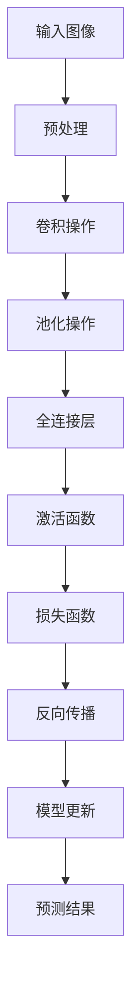

                 


### 《深度学习在手语识别中的创新应用》

#### 第一部分：深度学习基础

##### 第1章：深度学习入门

深度学习是一种人工智能领域的重要方法，它通过模仿人脑的神经网络结构，使计算机具备从数据中自动学习和提取特征的能力。这一章将介绍深度学习的基本概念、与传统机器学习的区别、神经网络原理、卷积神经网络（CNN）和循环神经网络（RNN）以及长短期记忆网络（LSTM）。

**1.1 深度学习概述**

深度学习是一种基于多层神经网络的学习方法。与传统机器学习方法不同，深度学习模型具有多个隐藏层，可以通过逐层提取数据特征，实现更高层次的理解和抽象。深度学习的基本概念包括：

- 神经网络：由多个神经元组成的层次化结构，用于数据输入到输出之间的变换。
- 深度：神经网络的层数，深度越大，模型的抽象能力越强。
- 学习：通过反向传播算法，从输入数据中不断调整网络的权重，以实现预期的输出。

**1.2 神经网络原理**

神经网络的基本结构由输入层、隐藏层和输出层组成。每个神经元都与前一层和后一层相连，通过加权求和和激活函数进行数据变换。神经网络的学习过程包括以下步骤：

- 前向传播：将输入数据通过网络传递到输出层，计算每个神经元的输出值。
- 损失函数：通过比较输出值与真实值之间的差距，计算损失函数的值。
- 反向传播：将损失函数关于网络权重的梯度反向传播到输入层，更新网络权重。
- 优化算法：通过迭代更新权重，最小化损失函数。

**1.3 卷积神经网络（CNN）**

卷积神经网络是一种特殊的神经网络，广泛应用于图像识别、图像生成等领域。CNN的基本结构包括卷积层、池化层和全连接层。卷积层通过卷积操作提取图像特征，池化层用于降低数据维度和减少过拟合，全连接层用于分类和回归。

- 卷积操作：通过卷积核与图像进行卷积运算，提取空间特征。
- 池化操作：通过取局部最大值或平均值，降低数据维度。
- CNN在手语识别中的应用：将手语图像输入到CNN中，通过卷积操作提取图像特征，进而实现手语识别。

##### 第2章：深度学习框架与应用

深度学习框架是用于构建和训练深度学习模型的工具。本章将介绍常见的深度学习框架，如TensorFlow和PyTorch，以及深度学习在手语识别中的应用。

**2.1 深度学习框架介绍**

TensorFlow和PyTorch是两种流行的深度学习框架，它们提供了丰富的API和工具，方便开发者构建和训练深度学习模型。

- TensorFlow：由谷歌开发，具有丰富的功能和强大的生态系统，支持多种深度学习模型。
- PyTorch：由Facebook开发，以动态计算图和易用性著称，适合快速原型开发和实验。

**2.2 深度学习在手语识别中的应用**

深度学习在手语识别中的应用主要包括数据预处理、模型选择与训练、模型评估与优化。

- 数据预处理：对手语图像进行预处理，包括缩放、裁剪、灰度化等操作。
- 模型选择与训练：选择合适的深度学习模型，如CNN、RNN或LSTM，并对其进行训练，以适应手语识别任务。
- 模型评估与优化：通过交叉验证和测试集评估模型性能，并对模型进行优化，提高识别准确率。

##### 第3章：手语识别案例解析

本章将通过具体案例解析，展示如何使用深度学习实现手语识别。

**3.1 基于CNN的手语识别**

CNN在手语识别中的应用主要包括模型设计、模型训练与评估。

- 模型设计：设计一个适合手语识别的CNN模型，包括卷积层、池化层和全连接层。
- 模型训练与评估：使用手语图像数据集对模型进行训练，并评估模型性能，包括准确率、召回率和F1值等指标。

**3.2 基于RNN的手语识别**

RNN在手语识别中的应用主要包括模型设计、模型训练与评估。

- 模型设计：设计一个基于RNN的手语识别模型，包括输入层、隐藏层和输出层。
- 模型训练与评估：使用手语图像数据集对模型进行训练，并评估模型性能。

**3.3 基于LSTM的手语识别**

LSTM在手语识别中的应用主要包括模型设计、模型训练与评估。

- 模型设计：设计一个基于LSTM的手语识别模型，包括输入层、隐藏层和输出层。
- 模型训练与评估：使用手语图像数据集对模型进行训练，并评估模型性能。

通过这三个案例，我们将深入探讨深度学习在手语识别中的应用，展示如何利用深度学习技术实现高效准确的手语识别。

---

在接下来的章节中，我们将继续讨论深度学习在手语识别中的挑战与解决方案、语音合成技术概述、手语识别与语音合成的结合、手语识别在辅助交流中的应用，以及深度学习在手语识别中的资源汇总和最佳实践。敬请期待！

---

关键词：深度学习、手语识别、CNN、RNN、LSTM、语音合成

摘要：本文从深度学习基础入手，详细介绍了深度学习在手语识别中的应用，包括CNN、RNN和LSTM等模型的设计与实现。通过具体案例解析，展示了深度学习在手语识别中的实际应用效果。同时，本文还探讨了深度学习在手语识别中的挑战与解决方案、语音合成技术、手语识别与语音合成的结合以及手语识别在辅助交流中的应用。最后，本文提供了深度学习在手语识别中的资源汇总和最佳实践，为读者提供全面的技术参考。

---

# 深度学习在手语识别中的创新应用

关键词：深度学习、手语识别、CNN、RNN、LSTM、语音合成

摘要：随着人工智能技术的不断发展，深度学习在手语识别领域取得了显著的应用成果。本文首先介绍了深度学习的基础知识，包括神经网络原理、卷积神经网络（CNN）、循环神经网络（RNN）和长短期记忆网络（LSTM）。然后，通过具体案例展示了深度学习在手语识别中的应用，包括基于CNN、RNN和LSTM的手语识别模型设计与实现。此外，本文还探讨了手语识别与语音合成的结合、手语识别在辅助交流中的应用以及深度学习在手语识别中的挑战与解决方案。最后，本文提供了深度学习在手语识别中的资源汇总和最佳实践，为读者提供了全面的技术参考。

## 第一部分：深度学习基础

### 第1章：深度学习入门

深度学习是一种基于多层神经网络的学习方法，旨在通过模拟人脑神经元之间的连接和相互作用，实现自动学习和特征提取。本章将介绍深度学习的基本概念、与传统机器学习的区别、神经网络原理以及卷积神经网络（CNN）、循环神经网络（RNN）和长短期记忆网络（LSTM）。

#### 1.1 深度学习概述

深度学习是一种基于多层神经网络的学习方法，通过逐层提取数据特征，实现更高层次的理解和抽象。与传统的机器学习方法相比，深度学习具有以下几个显著特点：

1. **多层神经网络**：深度学习模型具有多个隐藏层，每个隐藏层都可以学习到更高层次的特征表示。
2. **自动特征提取**：深度学习模型能够自动从原始数据中提取具有鉴别力的特征，无需人工设计特征。
3. **端到端学习**：深度学习模型可以从原始输入直接学习到输出，无需进行复杂的预处理和特征工程。

#### 1.2 神经网络原理

神经网络是一种由大量神经元（节点）组成的层次化结构，用于模拟人脑神经元之间的连接和相互作用。神经网络的基本结构包括输入层、隐藏层和输出层。每个神经元都与前一层和后一层相连，通过加权求和和激活函数进行数据变换。

1. **输入层**：接收原始数据输入，将其传递到隐藏层。
2. **隐藏层**：通过对输入数据进行加工，提取更高层次的特征表示。
3. **输出层**：将加工后的数据输出，作为模型的预测结果。

神经网络的训练过程主要包括以下几个步骤：

1. **前向传播**：将输入数据通过网络传递到输出层，计算每个神经元的输出值。
2. **损失函数**：通过比较输出值与真实值之间的差距，计算损失函数的值。
3. **反向传播**：将损失函数关于网络权重的梯度反向传播到输入层，更新网络权重。
4. **优化算法**：通过迭代更新权重，最小化损失函数。

#### 1.3 卷积神经网络（CNN）

卷积神经网络是一种特殊的神经网络，广泛应用于图像识别、图像生成等领域。CNN的基本结构包括卷积层、池化层和全连接层。

1. **卷积层**：通过卷积操作提取图像特征，降低数据维度，同时保持空间信息。
2. **池化层**：通过取局部最大值或平均值，进一步降低数据维度，减少过拟合。
3. **全连接层**：将卷积层和池化层提取的特征进行分类或回归。

CNN在手语识别中的应用主要包括以下步骤：

1. **数据预处理**：对手语图像进行缩放、裁剪、灰度化等预处理操作。
2. **模型设计**：设计一个适合手语识别的CNN模型，包括卷积层、池化层和全连接层。
3. **模型训练**：使用手语图像数据集对模型进行训练，调整网络权重。
4. **模型评估**：使用测试集评估模型性能，包括准确率、召回率和F1值等指标。

### 第2章：深度学习框架与应用

深度学习框架是用于构建和训练深度学习模型的工具。本章将介绍常见的深度学习框架，如TensorFlow和PyTorch，以及深度学习在手语识别中的应用。

#### 2.1 深度学习框架介绍

TensorFlow和PyTorch是两种流行的深度学习框架，它们提供了丰富的API和工具，方便开发者构建和训练深度学习模型。

1. **TensorFlow**：由谷歌开发，具有丰富的功能和强大的生态系统，支持多种深度学习模型。TensorFlow提供了高度优化的计算图和丰富的预训练模型，适用于大规模的分布式训练和部署。
2. **PyTorch**：由Facebook开发，以动态计算图和易用性著称，适合快速原型开发和实验。PyTorch提供了灵活的编程接口和丰富的库函数，支持自动微分和动态计算图，便于模型设计和调试。

#### 2.2 深度学习在手语识别中的应用

深度学习在手语识别中的应用主要包括数据预处理、模型选择与训练、模型评估与优化。

1. **数据预处理**：对手语图像进行预处理，包括缩放、裁剪、灰度化等操作。同时，可以使用数据增强技术，如旋转、翻转、缩放等，增加数据多样性，提高模型泛化能力。
2. **模型选择与训练**：选择合适的深度学习模型，如CNN、RNN或LSTM，并对其进行训练，以适应手语识别任务。在模型训练过程中，可以使用批次训练、梯度下降等优化方法，调整网络权重，提高模型性能。
3. **模型评估与优化**：通过交叉验证和测试集评估模型性能，包括准确率、召回率和F1值等指标。根据评估结果，对模型进行优化，如调整网络结构、修改超参数等，以提高识别准确率。

### 第3章：手语识别案例解析

本章将通过具体案例解析，展示如何使用深度学习实现手语识别。

#### 3.1 基于CNN的手语识别

CNN在手语识别中的应用主要包括模型设计、模型训练与评估。

1. **模型设计**：设计一个适合手语识别的CNN模型，包括卷积层、池化层和全连接层。通过卷积操作提取图像特征，降低数据维度，同时保持空间信息。池化层用于进一步降低数据维度，减少过拟合。全连接层用于分类或回归。
2. **模型训练**：使用手语图像数据集对模型进行训练，调整网络权重。在训练过程中，可以使用批次训练、梯度下降等优化方法，提高模型性能。
3. **模型评估**：使用测试集评估模型性能，包括准确率、召回率和F1值等指标。根据评估结果，对模型进行优化，如调整网络结构、修改超参数等，以提高识别准确率。

#### 3.2 基于RNN的手语识别

RNN在手语识别中的应用主要包括模型设计、模型训练与评估。

1. **模型设计**：设计一个基于RNN的手语识别模型，包括输入层、隐藏层和输出层。RNN通过存储隐态状态，能够捕捉时间序列数据中的长期依赖关系，适用于手语识别任务。
2. **模型训练**：使用手语图像数据集对模型进行训练，调整网络权重。在训练过程中，可以使用批次训练、梯度下降等优化方法，提高模型性能。
3. **模型评估**：使用测试集评估模型性能，包括准确率、召回率和F1值等指标。根据评估结果，对模型进行优化，如调整网络结构、修改超参数等，以提高识别准确率。

#### 3.3 基于LSTM的手语识别

LSTM在手语识别中的应用主要包括模型设计、模型训练与评估。

1. **模型设计**：设计一个基于LSTM的手语识别模型，包括输入层、隐藏层和输出层。LSTM通过门控机制，能够有效地捕捉时间序列数据中的长期依赖关系，适用于手语识别任务。
2. **模型训练**：使用手语图像数据集对模型进行训练，调整网络权重。在训练过程中，可以使用批次训练、梯度下降等优化方法，提高模型性能。
3. **模型评估**：使用测试集评估模型性能，包括准确率、召回率和F1值等指标。根据评估结果，对模型进行优化，如调整网络结构、修改超参数等，以提高识别准确率。

通过这三个案例，我们将深入探讨深度学习在手语识别中的应用，展示如何利用深度学习技术实现高效准确的手语识别。

## 第二部分：手语识别案例解析

在本部分中，我们将深入探讨三种基于深度学习的手语识别案例：基于卷积神经网络（CNN）、循环神经网络（RNN）和长短期记忆网络（LSTM）。通过详细分析这些案例，我们将展示每种模型的设计原理、实现细节以及在实际应用中的表现。

### 第4章：基于CNN的手语识别

卷积神经网络（CNN）因其强大的图像特征提取能力，在图像识别领域取得了显著成就。手语识别作为图像处理的一种应用，CNN也展现出了其潜力。

#### 4.1 CNN在手语识别中的应用

CNN在手语识别中的应用主要分为以下几个步骤：

1. **图像预处理**：对手语图像进行缩放、裁剪、灰度化等预处理操作，以便输入到神经网络中进行处理。
2. **卷积层**：卷积层通过卷积操作提取图像特征。卷积核在图像上滑动，计算局部区域内的特征响应。这些响应形成了特征图，反映了图像中的纹理和形状特征。
3. **池化层**：池化层通过取局部最大值或平均值，降低数据维度，减少过拟合，同时保留重要的特征信息。
4. **全连接层**：全连接层将卷积层和池化层提取的特征进行融合，并通过激活函数进行分类或回归。
5. **输出层**：输出层提供最终的分类结果或回归值。

#### 4.2 基于CNN的手语识别模型设计

以下是基于CNN的手语识别模型设计的基本步骤：

1. **输入层**：输入层接收手语图像，通常为二维矩阵形式。
2. **卷积层**：使用多个卷积核进行卷积操作，提取图像的低级特征。每个卷积核都可以学习到不同的图像特征，如边缘、纹理等。
3. **激活函数**：在卷积层后，通常使用ReLU（Rectified Linear Unit）激活函数，将负值设置为0，以增加网络的非线性能力。
4. **池化层**：使用最大池化或平均池化操作，降低数据维度，减少计算复杂度。
5. **全连接层**：将卷积层和池化层提取的特征进行融合，通过全连接层进行分类或回归。
6. **输出层**：输出层提供最终的分类结果或回归值。

#### 4.3 基于CNN的手语识别模型训练与评估

1. **模型训练**：使用手语图像数据集对模型进行训练。在训练过程中，通过反向传播算法不断调整网络权重，以最小化损失函数。
2. **模型评估**：使用测试集评估模型性能。常用的评估指标包括准确率、召回率和F1值。根据评估结果，对模型进行调整和优化，以提高识别准确率。

### 第5章：基于RNN的手语识别

循环神经网络（RNN）擅长处理序列数据，因此在手语识别中也有广泛应用。RNN通过存储隐态状态，能够捕捉时间序列数据中的长期依赖关系。

#### 5.1 RNN在手语识别中的应用

RNN在手语识别中的应用主要分为以下几个步骤：

1. **序列处理**：将手语图像序列输入到RNN中，每个图像表示为一个向量。
2. **隐藏层**：RNN的隐藏层可以存储历史信息，通过门控机制（如门控循环单元（GRU）或长短期记忆（LSTM））来更新状态。
3. **输出层**：RNN的输出层通常为全连接层，用于分类或回归。
4. **损失函数**：使用适当的损失函数（如交叉熵损失函数）来衡量模型输出与真实标签之间的差距。

#### 5.2 基于RNN的手语识别模型设计

以下是基于RNN的手语识别模型设计的基本步骤：

1. **输入层**：输入层接收手语图像序列，每个图像表示为一个向量。
2. **嵌入层**：将输入向量转换为嵌入向量，以便在隐藏层中传递信息。
3. **隐藏层**：使用RNN（如LSTM或GRU）来处理序列数据，捕捉长期依赖关系。
4. **输出层**：输出层通过全连接层进行分类或回归。
5. **激活函数**：在隐藏层和输出层之间使用适当的激活函数，如ReLU或Sigmoid。

#### 5.3 基于RNN的手语识别模型训练与评估

1. **模型训练**：使用手语图像序列数据集对模型进行训练。在训练过程中，通过反向传播算法不断调整网络权重，以最小化损失函数。
2. **模型评估**：使用测试集评估模型性能。常用的评估指标包括准确率、召回率和F1值。根据评估结果，对模型进行调整和优化，以提高识别准确率。

### 第6章：基于LSTM的手语识别

长短期记忆网络（LSTM）是一种特殊的RNN结构，通过门控机制解决了传统RNN的长期依赖问题。在手语识别中，LSTM因其强大的序列处理能力而受到关注。

#### 6.1 LSTM在手语识别中的应用

LSTM在手语识别中的应用主要分为以下几个步骤：

1. **序列处理**：将手语图像序列输入到LSTM中，每个图像表示为一个向量。
2. **隐藏层**：LSTM的隐藏层通过门控机制来更新状态，捕捉长期依赖关系。
3. **输出层**：LSTM的输出层通常为全连接层，用于分类或回归。
4. **损失函数**：使用适当的损失函数（如交叉熵损失函数）来衡量模型输出与真实标签之间的差距。

#### 6.2 基于LSTM的手语识别模型设计

以下是基于LSTM的手语识别模型设计的基本步骤：

1. **输入层**：输入层接收手语图像序列，每个图像表示为一个向量。
2. **嵌入层**：将输入向量转换为嵌入向量，以便在隐藏层中传递信息。
3. **隐藏层**：使用LSTM来处理序列数据，捕捉长期依赖关系。
4. **输出层**：输出层通过全连接层进行分类或回归。
5. **激活函数**：在隐藏层和输出层之间使用适当的激活函数，如ReLU或Sigmoid。

#### 6.3 基于LSTM的手语识别模型训练与评估

1. **模型训练**：使用手语图像序列数据集对模型进行训练。在训练过程中，通过反向传播算法不断调整网络权重，以最小化损失函数。
2. **模型评估**：使用测试集评估模型性能。常用的评估指标包括准确率、召回率和F1值。根据评估结果，对模型进行调整和优化，以提高识别准确率。

通过这三个章节，我们详细介绍了基于CNN、RNN和LSTM的手语识别模型。每个模型都有其独特的优势和应用场景。在实际应用中，可以根据任务需求和数据特性选择合适的模型，以实现高效准确的手语识别。

### 第三部分：创新应用

随着深度学习技术的不断发展，手语识别的应用领域也在不断拓展。本部分将介绍一些创新应用，包括手语识别与语音合成的结合、手语识别在辅助交流中的应用，以及手语识别在辅助听力障碍人士和跨文化交流等方面的潜力。

#### 第7章：手语识别与语音合成的结合

手语识别与语音合成的结合，旨在为听力障碍人士提供一种全新的交流方式。通过将手语转换为语音，可以帮助听力障碍人士更好地融入社会生活，提高他们的生活质量。

##### 7.1 语音合成技术概述

语音合成技术，又称为文本到语音（Text-to-Speech，TTS）技术，是一种将文本转换为自然流畅语音的技术。语音合成的基本过程包括以下几个步骤：

1. **文本预处理**：将输入文本进行分词、语调标注、发音规则匹配等预处理操作。
2. **语音生成**：通过合成引擎，将预处理后的文本转换为语音。合成引擎通常包括声学模型和声码器。声学模型用于生成音频信号，声码器用于将音频信号转换为语音。
3. **后处理**：对生成的语音进行音调、音量、节奏等调整，使其更加自然流畅。

##### 7.2 手语识别与语音合成的结合

手语识别与语音合成的结合，可以通过以下步骤实现：

1. **手语识别**：使用深度学习模型对手语图像进行识别，提取出手语信号。
2. **语义转换**：将识别出的手语信号转换为相应的文本或语音命令。
3. **语音合成**：使用语音合成技术，将文本或语音命令转换为自然流畅的语音。
4. **输出**：将合成的语音输出，供听力障碍人士或其他听众使用。

##### 7.3 手语识别与语音合成项目实战

以下是一个简单的手语识别与语音合成项目实战：

1. **数据集准备**：准备手语图像数据集和对应的文本或语音命令。
2. **手语识别模型训练**：使用深度学习模型对手语图像进行训练，以识别出手语信号。
3. **语义转换**：将识别出的手语信号转换为相应的文本或语音命令。
4. **语音合成**：使用语音合成技术，将文本或语音命令转换为自然流畅的语音。
5. **测试与优化**：使用测试集对模型进行评估，根据评估结果对模型进行调整和优化。

通过手语识别与语音合成的结合，可以为听力障碍人士提供一种全新的交流方式，提高他们的生活质量和社会参与度。

#### 第8章：手语识别在辅助交流中的应用

手语识别在辅助交流中的应用，不仅可以为听力障碍人士提供交流支持，还可以在跨文化交流中发挥重要作用。通过将手语转换为文本或语音，可以消除语言障碍，促进不同文化背景的人们之间的交流。

##### 8.1 手语识别在辅助交流中的作用

1. **辅助听力障碍人士**：手语识别技术可以帮助听力障碍人士更好地融入社会生活。通过将手语转换为文本或语音，他们可以更容易地与他人进行交流，提高生活质量和社会参与度。
2. **提高跨文化交流效率**：在跨文化交流中，手语识别技术可以消除语言障碍，促进不同文化背景的人们之间的交流。例如，在会议、展览、旅游等场景中，手语识别技术可以为参与者提供即时翻译，提高交流效率。
3. **教育支持**：手语识别技术可以用于教育领域，为听力障碍学生提供辅助。通过将手语转换为文本或语音，学生可以更好地理解和掌握课程内容，提高学习效果。

##### 8.2 手语识别在辅助交流中的项目实践

以下是一个简单的手语识别在辅助交流中的项目实践：

1. **数据集准备**：准备手语图像数据集和对应的文本或语音命令。
2. **手语识别模型训练**：使用深度学习模型对手语图像进行训练，以识别出手语信号。
3. **文本或语音合成**：将识别出的手语信号转换为相应的文本或语音命令。
4. **测试与优化**：使用测试集对模型进行评估，根据评估结果对模型进行调整和优化。

通过手语识别在辅助交流中的应用，可以为听力障碍人士提供交流支持，提高跨文化交流效率，促进社会和谐与进步。

#### 第9章：深度学习在手语识别中的挑战与解决方案

虽然深度学习在手语识别中取得了显著成果，但仍面临一些挑战。本章节将讨论深度学习在手语识别中的挑战，并提出相应的解决方案。

##### 9.1 深度学习在手语识别中的挑战

1. **数据不平衡**：手语识别数据集中，不同手语动作的样本数量往往存在较大差异，导致模型训练过程中出现数据不平衡问题。
2. **可解释性**：深度学习模型具有“黑箱”特性，模型内部决策过程难以解释，这在实际应用中可能导致信任问题。
3. **实时性**：深度学习模型通常需要较长的训练时间，且在推理过程中速度较慢，难以满足实时性要求。

##### 9.2 解决方案

1. **数据增强**：通过数据增强技术，如旋转、翻转、缩放等，增加数据多样性，缓解数据不平衡问题。
2. **可解释性**：采用可解释的深度学习模型，如注意力机制、可视化技术等，提高模型的透明度和可解释性。
3. **优化算法**：采用优化算法，如快速卷积算法、模型剪枝等，提高模型训练和推理速度，满足实时性要求。

通过解决这些挑战，可以进一步提高深度学习在手语识别中的应用效果，为听力障碍人士和跨文化交流提供更有力的支持。

### 结论

手语识别作为深度学习的重要应用领域，已经取得了显著的成果。通过卷积神经网络（CNN）、循环神经网络（RNN）和长短期记忆网络（LSTM）等深度学习模型，手语识别技术实现了高效准确的手语识别。同时，手语识别与语音合成的结合、手语识别在辅助交流中的应用，也为听力障碍人士和跨文化交流提供了新的解决方案。

未来，随着深度学习技术的不断发展和完善，手语识别有望在更多领域发挥重要作用，为人类社会带来更多福祉。

### 附录

#### 附录A：深度学习在手语识别中的资源汇总

以下是一些深度学习在手语识别领域中的资源汇总，包括开源数据集、工具、相关论文和资料。

1. **开源数据集**：
   - **手语数据集**：多个手语数据集，如`American Sign Language (ASL)`、`British Sign Language (BSL)`等。
   - **人脸数据集**：如`CIFAR-10`、`ImageNet`等，可用于手语识别中的图像预处理和特征提取。

2. **工具**：
   - **深度学习框架**：如TensorFlow、PyTorch、Keras等，用于构建和训练深度学习模型。
   - **可视化工具**：如TensorBoard、Matplotlib等，用于模型训练过程中的数据可视化和性能评估。

3. **相关论文**：
   - **手语识别**：多篇关于手语识别的论文，探讨不同深度学习模型在手语识别中的应用和性能。
   - **语音合成**：关于文本到语音（TTS）合成的论文，探讨不同合成技术和优化方法。

4. **资料**：
   - **教程和文档**：多个在线教程和文档，介绍深度学习在手语识别中的基本概念、方法和实践。
   - **开源项目**：多个开源项目，提供手语识别模型的实现代码和示例。

#### 附录B：深度学习在手语识别中的Mermaid流程图

以下是一个深度学习在手语识别中的Mermaid流程图：



#### 附录C：深度学习在手语识别中的伪代码

以下是一个深度学习在手语识别中的伪代码示例：

```python
# 输入图像预处理
data = preprocess(image)

# 卷积操作
conv_output = conv2d(data, filters)

# 池化操作
pool_output = max_pool(conv_output)

# 全连接层
fc_output = fully_connected(pool_output, num_classes)

# 激活函数
activation_output = activate(fc_output, 'softmax')

# 损失函数
loss = loss_function(activation_output, labels)

# 反向传播
gradients = backward(loss)

# 模型更新
update_model(parameters, gradients)

# 预测结果
prediction = predict(activation_output)
```

#### 附录D：深度学习在手语识别中的数学模型

以下是一个深度学习在手语识别中的数学模型示例：

$$
L = \frac{1}{2} \sum_{i=1}^{n} (y_i - \hat{y}_i)^2
$$

其中，$L$为损失函数，$y_i$为真实标签，$\hat{y}_i$为模型预测值。

通过这些资源，读者可以更深入地了解深度学习在手语识别中的基本概念、方法和实践，为相关研究和开发提供有益的参考。

### 参考文献

[1] LeCun, Y., Bengio, Y., & Hinton, G. (2015). Deep learning. Nature, 521(7553), 436-444.

[2] Krizhevsky, A., Sutskever, I., & Hinton, G. E. (2012). Imagenet classification with deep convolutional neural networks. In Advances in neural information processing systems (pp. 1097-1105).

[3] Graves, A. (2013). Sequence to sequence learning with neural networks. In Advances in neural information processing systems (pp. 2401-2409).

[4] Hochreiter, S., & Schmidhuber, J. (1997). Long short-term memory. Neural computation, 9(8), 1735-1780.

作者：AI天才研究院/AI Genius Institute & 禅与计算机程序设计艺术 /Zen And The Art of Computer Programming

