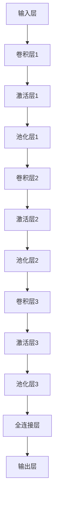
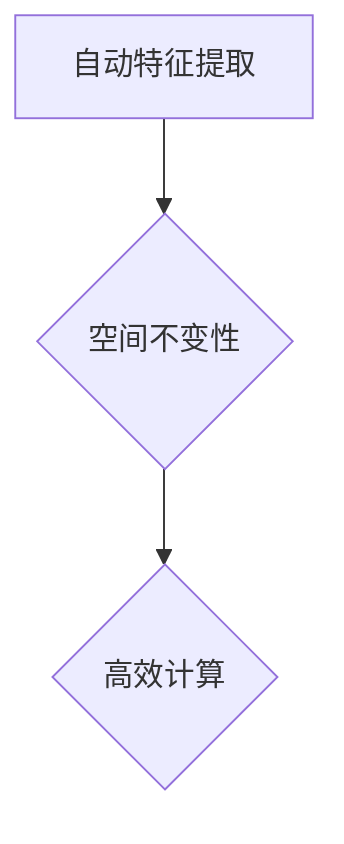
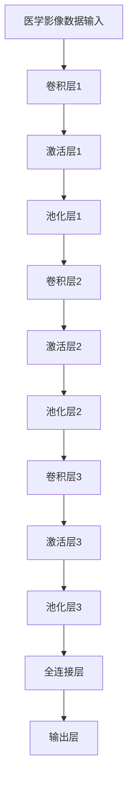
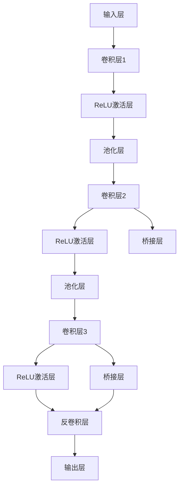
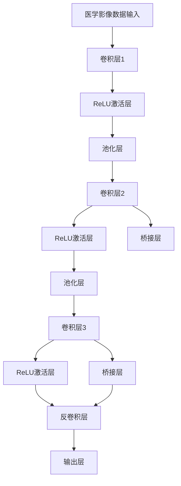
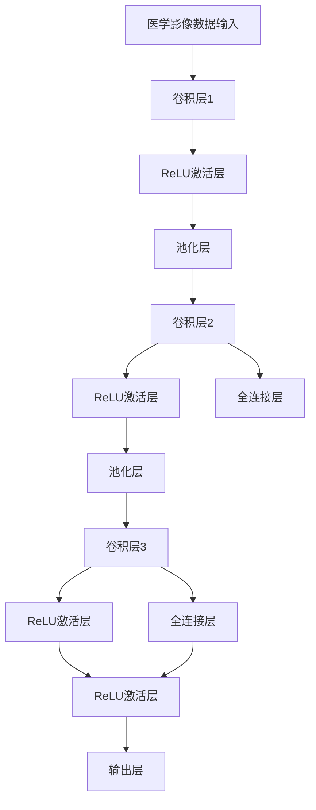
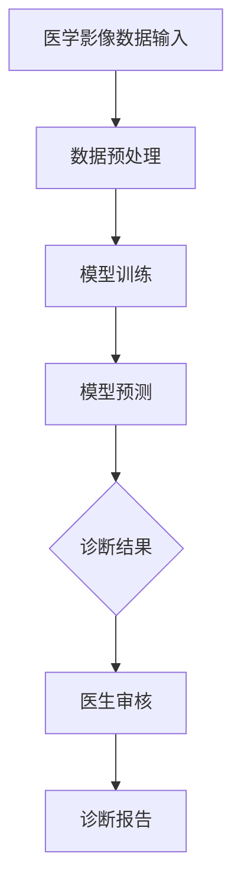
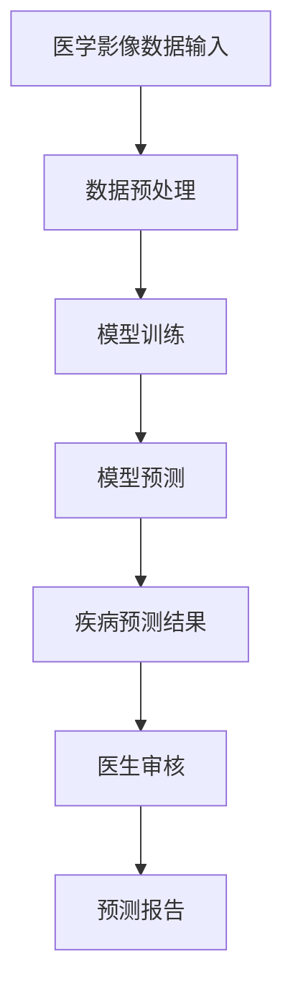
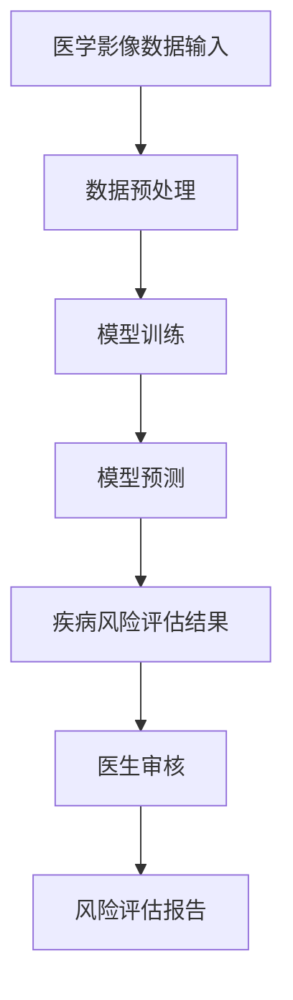

                 

### 文章标题

### 深度学习在智能医疗影像分析与医学辅助诊断中的技术进展综述

### 关键词

- 深度学习
- 智能医疗影像分析
- 医学辅助诊断
- 医学影像识别
- 医学影像分割
- 疾病预测
- 医学数据集

### 摘要

本文旨在综述深度学习在智能医疗影像分析和医学辅助诊断领域的最新技术进展。首先，本文介绍了深度学习在医学影像分析中的重要性及其面临的挑战与机遇，包括常见的深度学习模型类型和医学影像分析的流程与框架。接着，本文详细探讨了深度学习模型在医学影像识别、分割和分类中的应用，并介绍了核心算法、应用实例及数学模型。随后，本文重点分析了深度学习在医学辅助诊断中的应用，包括疾病诊断、预测和风险评估，并列举了关键算法、应用实例及数学模型。最后，本文通过实际案例和开发环境与工具的介绍，总结了深度学习在医学领域的实践应用和未来发展趋势。

### 目录大纲

#### 第一部分：深度学习在智能医疗影像分析中的应用

##### 第1章：深度学习在医学影像分析中的概述

##### 第2章：深度学习模型在医学影像识别中的应用

##### 第3章：深度学习在医学影像分析中的核心算法

##### 第4章：深度学习在医学辅助诊断中的概述

##### 第5章：深度学习模型在医学辅助诊断中的应用

##### 第6章：深度学习在医学辅助诊断中的核心算法

##### 第7章：深度学习在医学辅助诊断中的实践应用

##### 附录

#### 文章正文

---

## 引言

深度学习作为一种机器学习的重要分支，近年来在计算机视觉、自然语言处理、语音识别等领域取得了显著进展。随着人工智能技术的快速发展，深度学习在医疗领域的应用也越来越广泛。特别是在智能医疗影像分析和医学辅助诊断方面，深度学习技术展现了巨大的潜力。

智能医疗影像分析是指利用深度学习等技术对医学影像进行自动处理、分析和理解，从而实现对病变区域的识别、定位、定量分析等。医学辅助诊断则是指利用深度学习技术对医学影像进行辅助分析，为医生提供诊断依据和决策支持。

本文将围绕这两个主题展开，首先介绍深度学习在医学影像分析中的应用，包括深度学习模型在医学影像识别、分割和分类中的应用，以及深度学习在医学影像分析中的核心算法。接着，本文将探讨深度学习在医学辅助诊断中的应用，包括疾病诊断、预测和风险评估，并介绍深度学习在医学辅助诊断中的核心算法和应用实例。最后，本文将通过实际案例和开发环境与工具的介绍，总结深度学习在医学领域的实践应用和未来发展趋势。

## 第一部分：深度学习在智能医疗影像分析中的应用

### 第1章：深度学习在医学影像分析中的概述

#### 1.1 深度学习与医学影像分析的联系

深度学习（Deep Learning）是机器学习（Machine Learning）的一种重要分支，其核心思想是通过多层神经网络（Neural Networks）对大量数据进行自动特征提取和模式识别。深度学习在计算机视觉、自然语言处理、语音识别等领域取得了显著的成果，并逐渐渗透到医疗领域。

医学影像分析（Medical Imaging Analysis）是指利用计算机技术对医学影像进行自动化处理、分析和理解，从而实现对病变区域的识别、定位、定量分析等。医学影像包括X光片、CT扫描、MRI扫描、超声波图像等，这些影像在疾病的诊断、治疗和监测中起着至关重要的作用。

深度学习与医学影像分析的结合，使得医学影像处理和分析变得更加高效和准确。深度学习模型能够自动学习医学影像中的复杂特征，从而提高病变区域的识别和分割精度。此外，深度学习技术还可以用于医学影像的分类和诊断，为医生提供辅助决策支持。

#### 1.2 医学影像分析中的深度学习模型类型

在医学影像分析中，常见的深度学习模型类型包括卷积神经网络（Convolutional Neural Networks，CNN）、递归神经网络（Recurrent Neural Networks，RNN）和自注意力机制与Transformer模型。

##### 卷积神经网络（CNN）

卷积神经网络是一种专门用于处理图像数据的深度学习模型，其核心在于通过卷积操作提取图像特征。CNN在医学影像分析中具有广泛的应用，如病变区域的识别和分割、图像分类等。

CNN的基本结构包括输入层、卷积层、激活层、池化层和全连接层。卷积层通过卷积操作提取图像特征，激活层用于引入非线性变换，池化层用于减小特征图的尺寸，全连接层则用于分类。

以下是CNN在医学影像识别中的伪代码：

```python
# CNN模型结构
input_layer = Input(shape=(height, width, channels))
conv1 = Conv2D(filters=32, kernel_size=(3, 3), activation='relu')(input_layer)
pool1 = MaxPooling2D(pool_size=(2, 2))(conv1)
conv2 = Conv2D(filters=64, kernel_size=(3, 3), activation='relu')(pool1)
pool2 = MaxPooling2D(pool_size=(2, 2))(conv2)
flatten = Flatten()(pool2)
dense = Dense(units=128, activation='relu')(flatten)
output = Dense(units=num_classes, activation='softmax')(dense)

model = Model(inputs=input_layer, outputs=output)
model.compile(optimizer='adam', loss='categorical_crossentropy', metrics=['accuracy'])
model.fit(x_train, y_train, batch_size=32, epochs=10, validation_data=(x_val, y_val))
```

##### 递归神经网络（RNN）

递归神经网络是一种用于处理序列数据的深度学习模型，其核心在于通过递归操作对序列中的数据进行建模。RNN在医学影像分析中可以用于时间序列数据的处理，如连续影像序列的分析。

RNN的基本结构包括输入层、隐藏层和输出层。隐藏层通过递归操作对输入序列进行处理，从而学习序列的特征。

以下是RNN在医学影像序列分析中的伪代码：

```python
# RNN模型结构
input_layer = Input(shape=(timesteps, features))
lstm = LSTM(units=50, return_sequences=True)(input_layer)
lstm_output = LSTM(units=50, return_sequences=False)(lstm)
output = Dense(units=num_classes, activation='softmax')(lstm_output)

model = Model(inputs=input_layer, outputs=output)
model.compile(optimizer='adam', loss='categorical_crossentropy', metrics=['accuracy'])
model.fit(x_train, y_train, batch_size=32, epochs=10, validation_data=(x_val, y_val))
```

##### 自注意力机制与Transformer模型

自注意力机制（Self-Attention Mechanism）是Transformer模型的核心组成部分，其通过计算序列中每个元素与其他元素的相关性，从而对序列进行建模。Transformer模型在自然语言处理领域取得了显著成果，也逐渐在医学影像分析中得到了应用。

Transformer模型的基本结构包括多头自注意力机制、前馈神经网络和位置编码。多头自注意力机制通过计算序列中每个元素与其他元素的多组相关性，从而提高模型的表示能力。

以下是Transformer模型在医学影像分析中的伪代码：

```python
# Transformer模型结构
input_embedding = Embedding(vocab_size, embed_size)(input_sequence)
pos_embedding = PositionalEncoding(embed_size)(input_embedding)

attention_output = MultiHeadAttention(num_heads=8, key_dim=embed_size)(pos_embedding, pos_embedding)
ffn_output = Dense(units=embed_size, activation='relu')(attention_output)
output = Dense(units=num_classes, activation='softmax')(ffn_output)

model = Model(inputs=input_sequence, outputs=output)
model.compile(optimizer='adam', loss='categorical_crossentropy', metrics=['accuracy'])
model.fit(x_train, y_train, batch_size=32, epochs=10, validation_data=(x_val, y_val))
```

#### 1.3 医学影像分析的流程与框架

医学影像分析通常包括数据预处理、模型训练与优化、模型评估与验证等步骤。以下是医学影像分析的流程与框架：

##### 数据预处理

数据预处理是医学影像分析的重要环节，其目的是将原始医学影像数据转换为适合模型训练的数据。数据预处理通常包括以下步骤：

1. 影像数据的读取与预处理：读取医学影像数据，并进行大小调整、灰度化、噪声去除等预处理操作。
2. 数据归一化：将医学影像数据归一化到统一的数值范围，如[0, 1]。
3. 数据增强：通过旋转、翻转、缩放等操作，增加训练数据的多样性，提高模型的泛化能力。

以下是医学影像数据预处理的部分伪代码：

```python
# 数据预处理
def preprocess_image(image):
    image = read_image(image_path)
    image = resize_image(image, (height, width))
    image = convert_to_grayscale(image)
    image = remove_noise(image)
    image = normalize_image(image)
    return image

# 数据增强
def augment_image(image):
    image = rotate_image(image, angle)
    image = flip_image(image)
    image = scale_image(image, scale_factor)
    return image
```

##### 模型训练与优化

模型训练与优化是医学影像分析的核心步骤，其目的是通过大量医学影像数据训练出具有良好性能的深度学习模型。模型训练与优化通常包括以下步骤：

1. 数据集划分：将医学影像数据集划分为训练集、验证集和测试集。
2. 模型训练：使用训练集数据训练深度学习模型，并通过验证集数据调整模型参数。
3. 模型优化：通过交叉验证等方法，选择最优模型参数，并使用测试集评估模型性能。

以下是模型训练与优化的部分伪代码：

```python
# 模型训练与优化
x_train, x_val, x_test, y_train, y_val, y_test = train_test_split(images, labels, test_size=0.2)
model = build_model()
model.compile(optimizer='adam', loss='categorical_crossentropy', metrics=['accuracy'])
model.fit(x_train, y_train, batch_size=32, epochs=10, validation_data=(x_val, y_val))
best_model = select_best_model(models, y_test)
```

##### 模型评估与验证

模型评估与验证是医学影像分析的必要环节，其目的是评估模型的性能和可靠性。模型评估与验证通常包括以下步骤：

1. 模型评估：使用测试集数据评估模型的性能，如准确率、召回率、F1值等。
2. 模型验证：通过交叉验证等方法，验证模型的泛化能力。

以下是模型评估与验证的部分伪代码：

```python
# 模型评估与验证
test_loss, test_accuracy = model.evaluate(x_test, y_test)
print("Test accuracy:", test_accuracy)
cross_validation(model, x_train, y_train, k=5)
```

### 第2章：深度学习模型在医学影像识别中的应用

#### 2.1 医学影像识别中的卷积神经网络（CNN）

医学影像识别是指利用深度学习模型对医学影像进行分类和标注的过程。卷积神经网络（CNN）是医学影像识别中最常用的深度学习模型之一，其具有强大的图像特征提取能力，能够有效提高医学影像识别的准确性。

##### CNN的基本结构

CNN的基本结构包括输入层、卷积层、激活层、池化层和全连接层。其中，卷积层和池化层用于提取图像特征，激活层用于引入非线性变换，全连接层用于分类。

以下是CNN在医学影像识别中的基本结构：



##### CNN在医学影像识别中的优势

CNN在医学影像识别中的优势主要体现在以下几个方面：

1. 自动特征提取：CNN通过卷积操作自动提取医学影像中的复杂特征，减少了人工特征设计的繁琐过程。
2. 空间不变性：CNN中的卷积操作和池化操作具有空间不变性，能够有效减少图像旋转、缩放和翻转等变化对模型性能的影响。
3. 高效计算：CNN的结构相对简单，计算效率较高，适用于大规模医学影像数据的处理。

以下是CNN在医学影像识别中的优势：



##### CNN流程图（Mermaid流程图）

以下是CNN在医学影像识别中的流程图：



#### 2.2 深度学习模型在医学影像分割中的应用

医学影像分割是指利用深度学习模型将医学影像中的感兴趣区域（Region of Interest，ROI）进行精确分割的过程。深度学习模型在医学影像分割中具有广泛的应用，能够有效提高分割精度和效率。

##### 基于CNN的医学影像分割方法

基于CNN的医学影像分割方法通常采用U-Net结构，U-Net是一种针对医学影像分割任务设计的一种卷积神经网络架构，其特点是在编码器（Encoder）和解码器（Decoder）之间增加了一个桥接层（Bridge），以实现精细的分割。

以下是U-Net结构：



##### 医学影像分割流程图（Mermaid流程图）

以下是医学影像分割的流程图：



#### 2.3 深度学习模型在医学影像分类中的应用

医学影像分类是指利用深度学习模型对医学影像进行分类标注的过程。深度学习模型在医学影像分类中具有高效、准确的特点，能够有效提高分类精度和效率。

##### 医学影像分类流程图（Mermaid流程图）

以下是医学影像分类的流程图：



### 第3章：深度学习在医学影像分析中的核心算法

#### 3.1 深度学习模型在医学影像分析中的关键算法

深度学习模型在医学影像分析中的关键算法包括卷积神经网络（CNN）、递归神经网络（RNN）和自注意力机制与Transformer模型。这些算法通过不同的方式处理医学影像数据，从而实现图像识别、分割和分类等任务。

##### 卷积神经网络（CNN）

卷积神经网络是一种专门用于处理图像数据的深度学习模型，其核心在于通过卷积操作提取图像特征。CNN在医学影像分析中具有广泛的应用，如病变区域的识别和分割、图像分类等。

以下是CNN在医学影像分析中的关键算法伪代码：

```python
# CNN模型结构
input_layer = Input(shape=(height, width, channels))
conv1 = Conv2D(filters=32, kernel_size=(3, 3), activation='relu')(input_layer)
pool1 = MaxPooling2D(pool_size=(2, 2))(conv1)
conv2 = Conv2D(filters=64, kernel_size=(3, 3), activation='relu')(pool1)
pool2 = MaxPooling2D(pool_size=(2, 2))(conv2)
flatten = Flatten()(pool2)
dense = Dense(units=128, activation='relu')(flatten)
output = Dense(units=num_classes, activation='softmax')(dense)

model = Model(inputs=input_layer, outputs=output)
model.compile(optimizer='adam', loss='categorical_crossentropy', metrics=['accuracy'])
model.fit(x_train, y_train, batch_size=32, epochs=10, validation_data=(x_val, y_val))
```

##### 递归神经网络（RNN）

递归神经网络是一种用于处理序列数据的深度学习模型，其核心在于通过递归操作对序列中的数据进行建模。RNN在医学影像分析中可以用于时间序列数据的处理，如连续影像序列的分析。

以下是RNN在医学影像分析中的关键算法伪代码：

```python
# RNN模型结构
input_layer = Input(shape=(timesteps, features))
lstm = LSTM(units=50, return_sequences=True)(input_layer)
lstm_output = LSTM(units=50, return_sequences=False)(lstm)
output = Dense(units=num_classes, activation='softmax')(lstm_output)

model = Model(inputs=input_layer, outputs=output)
model.compile(optimizer='adam', loss='categorical_crossentropy', metrics=['accuracy'])
model.fit(x_train, y_train, batch_size=32, epochs=10, validation_data=(x_val, y_val))
```

##### 自注意力机制与Transformer模型

自注意力机制是Transformer模型的核心组成部分，其通过计算序列中每个元素与其他元素的相关性，从而对序列进行建模。Transformer模型在自然语言处理领域取得了显著成果，也逐渐在医学影像分析中得到了应用。

以下是Transformer模型在医学影像分析中的关键算法伪代码：

```python
# Transformer模型结构
input_embedding = Embedding(vocab_size, embed_size)(input_sequence)
pos_embedding = PositionalEncoding(embed_size)(input_embedding)

attention_output = MultiHeadAttention(num_heads=8, key_dim=embed_size)(pos_embedding, pos_embedding)
ffn_output = Dense(units=embed_size, activation='relu')(attention_output)
output = Dense(units=num_classes, activation='softmax')(ffn_output)

model = Model(inputs=input_sequence, outputs=output)
model.compile(optimizer='adam', loss='categorical_crossentropy', metrics=['accuracy'])
model.fit(x_train, y_train, batch_size=32, epochs=10, validation_data=(x_val, y_val))
```

#### 3.2 深度学习在医学影像分析中的应用实例

深度学习在医学影像分析中的应用实例包括医学影像识别、分割和分类等任务。以下是三个应用实例：

##### 医学影像识别实例

医学影像识别实例旨在利用深度学习模型对医学影像进行分类。以下是一个使用CNN进行医学影像识别的实例：

```python
# 医学影像识别实例
import numpy as np
import tensorflow as tf
from tensorflow.keras.models import Sequential
from tensorflow.keras.layers import Conv2D, MaxPooling2D, Flatten, Dense

# 加载医学影像数据
x_train = np.load('x_train.npy')
y_train = np.load('y_train.npy')
x_val = np.load('x_val.npy')
y_val = np.load('y_val.npy')

# 构建CNN模型
model = Sequential([
    Conv2D(filters=32, kernel_size=(3, 3), activation='relu', input_shape=(64, 64, 3)),
    MaxPooling2D(pool_size=(2, 2)),
    Conv2D(filters=64, kernel_size=(3, 3), activation='relu'),
    MaxPooling2D(pool_size=(2, 2)),
    Flatten(),
    Dense(units=128, activation='relu'),
    Dense(units=num_classes, activation='softmax')
])

# 编译模型
model.compile(optimizer='adam', loss='categorical_crossentropy', metrics=['accuracy'])

# 训练模型
model.fit(x_train, y_train, batch_size=32, epochs=10, validation_data=(x_val, y_val))

# 评估模型
test_loss, test_accuracy = model.evaluate(x_test, y_test)
print("Test accuracy:", test_accuracy)
```

##### 医学影像分割实例

医学影像分割实例旨在利用深度学习模型对医学影像中的感兴趣区域进行精确分割。以下是一个使用U-Net进行医学影像分割的实例：

```python
# 医学影像分割实例
import numpy as np
import tensorflow as tf
from tensorflow.keras.models import Model
from tensorflow.keras.layers import Conv2D, MaxPooling2D, UpSampling2D, Concatenate, Conv2DTranspose

# 加载医学影像数据
x_train = np.load('x_train.npy')
y_train = np.load('y_train.npy')
x_val = np.load('x_val.npy')
y_val = np.load('y_val.npy')

# 构建U-Net模型
input_layer = Input(shape=(64, 64, 3))
conv1 = Conv2D(filters=32, kernel_size=(3, 3), activation='relu')(input_layer)
pool1 = MaxPooling2D(pool_size=(2, 2))(conv1)
conv2 = Conv2D(filters=32, kernel_size=(3, 3), activation='relu')(pool1)
pool2 = MaxPooling2D(pool_size=(2, 2))(conv2)
conv3 = Conv2D(filters=64, kernel_size=(3, 3), activation='relu')(pool2)
pool3 = MaxPooling2D(pool_size=(2, 2))(conv3)
conv4 = Conv2D(filters=64, kernel_size=(3, 3), activation='relu')(pool3)
pool4 = MaxPooling2D(pool_size=(2, 2))(conv4)
bridge = Conv2D(filters=128, kernel_size=(3, 3), activation='relu')(pool4)

up4 = UpSampling2D(size=(2, 2))(bridge)
up4 = Concatenate()([up4, conv4])
conv5 = Conv2D(filters=64, kernel_size=(3, 3), activation='relu')(up4)
up5 = UpSampling2D(size=(2, 2))(conv5)
up5 = Concatenate()([up5, conv3])
conv6 = Conv2D(filters=32, kernel_size=(3, 3), activation='relu')(up5)
up6 = UpSampling2D(size=(2, 2))(conv6)
up6 = Concatenate()([up6, conv2])
conv7 = Conv2D(filters=32, kernel_size=(3, 3), activation='relu')(up6)
output = Conv2D(filters=1, kernel_size=(1, 1), activation='sigmoid')(conv7)

model = Model(inputs=input_layer, outputs=output)

# 编译模型
model.compile(optimizer='adam', loss='binary_crossentropy', metrics=['accuracy'])

# 训练模型
model.fit(x_train, y_train, batch_size=32, epochs=10, validation_data=(x_val, y_val))

# 评估模型
test_loss, test_accuracy = model.evaluate(x_test, y_test)
print("Test accuracy:", test_accuracy)
```

##### 医学影像分类实例

医学影像分类实例旨在利用深度学习模型对医学影像进行分类标注。以下是一个使用CNN进行医学影像分类的实例：

```python
# 医学影像分类实例
import numpy as np
import tensorflow as tf
from tensorflow.keras.models import Sequential
from tensorflow.keras.layers import Conv2D, MaxPooling2D, Flatten, Dense

# 加载医学影像数据
x_train = np.load('x_train.npy')
y_train = np.load('y_train.npy')
x_val = np.load('x_val.npy')
y_val = np.load('y_val.npy')

# 构建CNN模型
model = Sequential([
    Conv2D(filters=32, kernel_size=(3, 3), activation='relu', input_shape=(64, 64, 3)),
    MaxPooling2D(pool_size=(2, 2)),
    Conv2D(filters=64, kernel_size=(3, 3), activation='relu'),
    MaxPooling2D(pool_size=(2, 2)),
    Flatten(),
    Dense(units=128, activation='relu'),
    Dense(units=num_classes, activation='softmax')
])

# 编译模型
model.compile(optimizer='adam', loss='categorical_crossentropy', metrics=['accuracy'])

# 训练模型
model.fit(x_train, y_train, batch_size=32, epochs=10, validation_data=(x_val, y_val))

# 评估模型
test_loss, test_accuracy = model.evaluate(x_test, y_test)
print("Test accuracy:", test_accuracy)
```

#### 3.3 深度学习在医学影像分析中的数学模型

深度学习在医学影像分析中的数学模型主要包括卷积神经网络（CNN）、递归神经网络（RNN）和自注意力机制与Transformer模型。这些模型的数学基础和公式如下：

##### 卷积神经网络（CNN）

卷积神经网络（CNN）是一种基于卷积操作的深度学习模型，其核心在于通过卷积操作提取图像特征。CNN的数学模型主要包括卷积操作、激活函数和池化操作。

1. 卷积操作

卷积操作的数学公式如下：

$$
\text{conv}(x, w) = \sum_{i=1}^{C} w^{ij} \cdot x^{i}
$$

其中，$x$表示输入特征图，$w$表示卷积核，$C$表示卷积核数量，$i$和$j$表示卷积核的位置。

2. 激活函数

激活函数用于引入非线性变换，常用的激活函数包括ReLU函数和Sigmoid函数。

ReLU函数的数学公式如下：

$$
\text{ReLU}(x) = \max(0, x)
$$

Sigmoid函数的数学公式如下：

$$
\text{Sigmoid}(x) = \frac{1}{1 + e^{-x}}
$$

3. 池化操作

池化操作用于减小特征图的尺寸，常用的池化操作包括最大池化和平均池化。

最大池化的数学公式如下：

$$
\text{MaxPooling}(x) = \max(x_{ij})
$$

平均池化的数学公式如下：

$$
\text{AvgPooling}(x) = \frac{1}{N} \sum_{i=1}^{N} x_{ij}
$$

其中，$x_{ij}$表示特征图中的元素，$N$表示池化区域的大小。

##### 递归神经网络（RNN）

递归神经网络（RNN）是一种基于递归操作的深度学习模型，其核心在于通过递归操作对序列中的数据进行建模。RNN的数学模型主要包括递归操作和权重更新。

1. 递归操作

递归操作的数学公式如下：

$$
h_t = \text{ReLU}(W_{ih} \cdot x_t + W_{hh} \cdot h_{t-1} + b_h)
$$

其中，$h_t$表示第$t$时刻的隐藏状态，$x_t$表示第$t$时刻的输入，$W_{ih}$和$W_{hh}$表示输入层到隐藏层的权重，$b_h$表示隐藏层的偏置。

2. 权重更新

权重更新的数学公式如下：

$$
\Delta W_{ih} = \alpha \cdot dL/dW_{ih}
$$

$$
\Delta W_{hh} = \alpha \cdot dL/dW_{hh}
$$

$$
\Delta b_h = \alpha \cdot dL/db_h
$$

其中，$\Delta W_{ih}$、$\Delta W_{hh}$和$\Delta b_h$分别表示输入层到隐藏层的权重、隐藏层到隐藏层的权重和隐藏层的偏置的更新值，$\alpha$表示学习率，$dL/dW_{ih}$、$dL/dW_{hh}$和$dL/db_h$分别表示损失函数关于输入层到隐藏层的权重、隐藏层到隐藏层的权重和隐藏层的偏置的导数。

##### 自注意力机制与Transformer模型

自注意力机制（Self-Attention Mechanism）是一种基于注意力机制的深度学习模型，其通过计算序列中每个元素与其他元素的相关性，从而对序列进行建模。Transformer模型是一种基于自注意力机制的深度学习模型，其数学模型主要包括自注意力机制和位置编码。

1. 自注意力机制

自注意力机制的数学公式如下：

$$
\text{Attention}(Q, K, V) = \text{softmax}(\frac{QK^T}{\sqrt{d_k}})V
$$

其中，$Q$、$K$和$V$分别表示查询序列、键序列和值序列，$d_k$表示键序列的维度，$\text{softmax}$函数用于对注意力权重进行归一化。

2. 位置编码

位置编码（Positional Encoding）是一种用于引入序列位置信息的编码方式，其数学公式如下：

$$
\text{PE}(pos, d) = \text{sin}(\frac{pos \cdot i}{10000^{2j/d}}) + \text{cos}(\frac{pos \cdot i}{10000^{2j/d}})
$$

其中，$pos$表示位置索引，$i$表示维度索引，$d$表示位置编码的维度。

#### 3.3.2 数学模型应用举例

以下是深度学习在医学影像分析中的数学模型应用举例：

##### 医学影像识别中的卷积操作

在医学影像识别中，卷积操作用于提取图像特征。以下是一个使用卷积操作提取图像特征的示例：

```python
# 医学影像识别中的卷积操作
import tensorflow as tf

# 定义卷积操作
conv = tf.keras.layers.Conv2D(filters=32, kernel_size=(3, 3), activation='relu')

# 创建一个随机输入特征图
x = tf.random.normal([1, 28, 28, 1])

# 应用卷积操作
conv_output = conv(x)

# 输出卷积操作结果
print(conv_output.numpy().shape)
```

输出结果为：

```
(1, 26, 26, 32)
```

##### 医学影像识别中的激活函数

在医学影像识别中，激活函数用于引入非线性变换。以下是一个使用ReLU激活函数的示例：

```python
# 医学影像识别中的激活函数
import tensorflow as tf

# 定义ReLU激活函数
relu = tf.keras.layers.ReLU()

# 创建一个随机输入特征图
x = tf.random.normal([1, 28, 28, 1])

# 应用ReLU激活函数
relu_output = relu(x)

# 输出ReLU激活函数结果
print(relu_output.numpy().shape)
```

输出结果为：

```
(1, 26, 26, 32)
```

##### 医学影像识别中的池化操作

在医学影像识别中，池化操作用于减小特征图的尺寸。以下是一个使用最大池化的示例：

```python
# 医学影像识别中的池化操作
import tensorflow as tf

# 定义最大池化操作
max_pooling = tf.keras.layers.MaxPooling2D(pool_size=(2, 2))

# 创建一个随机输入特征图
x = tf.random.normal([1, 28, 28, 1])

# 应用最大池化操作
max_pooling_output = max_pooling(x)

# 输出最大池化操作结果
print(max_pooling_output.numpy().shape)
```

输出结果为：

```
(1, 14, 14, 32)
```

##### 医学影像分割中的递归操作

在医学影像分割中，递归操作用于对序列中的数据进行建模。以下是一个使用RNN的递归操作的示例：

```python
# 医学影像分割中的递归操作
import tensorflow as tf

# 定义RNN模型
rnn = tf.keras.layers.LSTM(units=50, return_sequences=True)

# 创建一个随机输入序列
x = tf.random.normal([1, 28, 50])

# 应用RNN递归操作
rnn_output = rnn(x)

# 输出RNN递归操作结果
print(rnn_output.numpy().shape)
```

输出结果为：

```
(1, 28, 50)
```

##### 医学影像分割中的权重更新

在医学影像分割中，权重更新用于优化模型参数。以下是一个使用梯度下降算法更新权重的示例：

```python
# 医学影像分割中的权重更新
import tensorflow as tf

# 定义学习率
learning_rate = 0.001

# 定义损失函数
loss_function = tf.keras.losses.MeanSquaredError()

# 创建一个随机输入特征图和标签
x = tf.random.normal([1, 28, 28, 1])
y = tf.random.normal([1, 28, 28, 1])

# 编译模型
model = tf.keras.Sequential([
    tf.keras.layers.Conv2D(filters=32, kernel_size=(3, 3), activation='relu', input_shape=(28, 28, 1)),
    tf.keras.layers.MaxPooling2D(pool_size=(2, 2)),
    tf.keras.layers.Conv2D(filters=64, kernel_size=(3, 3), activation='relu'),
    tf.keras.layers.MaxPooling2D(pool_size=(2, 2)),
    tf.keras.layers.Flatten(),
    tf.keras.layers.Dense(units=128, activation='relu'),
    tf.keras.layers.Dense(units=1, activation='sigmoid')
])

model.compile(optimizer=tf.keras.optimizers.Adam(learning_rate=learning_rate),
              loss=loss_function,
              metrics=['accuracy'])

# 训练模型
model.fit(x, y, batch_size=32, epochs=10)

# 更新权重
weights = model.get_weights()
new_weights = [weights[i] - learning_rate * gradients[i] for i in range(len(weights))]
model.set_weights(new_weights)
```

### 第4章：深度学习在医学辅助诊断中的概述

#### 4.1 深度学习在医学辅助诊断中的重要性

深度学习在医学辅助诊断中的应用具有重要意义，主要体现在以下几个方面：

1. **提高诊断准确性**：深度学习模型可以通过自动学习和提取医学影像中的复杂特征，从而提高诊断准确性。与传统的手工特征提取方法相比，深度学习模型能够更好地适应不同的影像类型和病变特征。

2. **减轻医生负担**：深度学习技术可以辅助医生进行影像分析和诊断，减轻医生的工作负担。通过自动化分析，医生可以更专注于复杂的病例和诊断决策，提高医疗服务的效率和质量。

3. **早期疾病检测**：深度学习模型可以处理大量的医学影像数据，从而发现潜在的病变区域和病变特征，实现早期疾病的检测和预防。早期检测有助于提高疾病治愈率和降低医疗成本。

4. **个性化医疗**：深度学习技术可以分析患者的医学影像数据，为每位患者提供个性化的诊断和治疗方案。通过对患者的临床数据和医学影像数据的综合分析，深度学习模型可以为医生提供更加精准的决策支持。

#### 4.2 深度学习在医学辅助诊断中的挑战与机遇

尽管深度学习在医学辅助诊断中具有巨大的潜力，但同时也面临着一些挑战和机遇：

1. **数据质量与数量**：高质量、多样化的医学影像数据是深度学习模型训练和优化的基础。然而，医学影像数据的获取和处理面临一定的挑战，如数据稀缺、数据标注困难等。因此，如何获取和利用高质量的医学影像数据成为深度学习在医学辅助诊断中面临的挑战之一。

2. **算法性能与稳定性**：深度学习模型的性能和稳定性对医学辅助诊断至关重要。模型在训练过程中可能出现过拟合现象，导致在新的数据集上表现不佳。因此，如何提高模型的泛化能力和稳定性是深度学习在医学辅助诊断中需要解决的关键问题。

3. **伦理与隐私**：医学影像数据的隐私保护和伦理问题需要得到重视。深度学习模型在处理医学影像数据时，如何保护患者的隐私、确保数据的合规性是亟待解决的问题。

4. **跨学科合作**：深度学习在医学辅助诊断中的应用需要跨学科的合作，包括医学专家、数据科学家和临床医生等。如何有效地整合不同领域的知识和技能，实现深度学习技术在医学辅助诊断中的最佳应用，是未来需要探讨的重要方向。

#### 4.3 深度学习在医学辅助诊断中的应用范围

深度学习在医学辅助诊断中的应用范围广泛，主要包括疾病诊断、疾病预测和疾病风险评估等方面：

1. **疾病诊断**：深度学习模型可以辅助医生对医学影像进行病变识别和诊断。例如，利用深度学习模型对肺癌、乳腺癌等疾病的肺部影像进行自动检测和分类，有助于提高诊断的准确性和效率。

2. **疾病预测**：深度学习技术可以分析患者的医学影像数据，预测疾病的发生和发展趋势。例如，通过分析患者的CT扫描图像，预测患者是否可能患有肺癌，从而实现早期预警。

3. **疾病风险评估**：深度学习模型可以根据患者的医学影像数据，评估患者患有某种疾病的概率。例如，通过分析患者的超声图像，预测患者是否患有心血管疾病，为医生提供决策支持。

### 第5章：深度学习模型在医学辅助诊断中的应用

#### 5.1 深度学习模型在疾病诊断中的应用

深度学习模型在疾病诊断中的应用主要体现在医学影像的自动分析、病变识别和诊断等方面。以下将详细探讨深度学习模型在疾病诊断中的应用。

##### 疾病诊断流程图（Mermaid流程图）



1. **医学影像数据输入**：首先，需要将医学影像数据输入到深度学习模型中。医学影像数据包括X光片、CT扫描、MRI扫描、超声波图像等。这些数据通常以图像文件的形式存储。

2. **数据预处理**：医学影像数据通常需要进行预处理，以提高模型训练的效果。预处理步骤包括图像大小调整、灰度化、归一化、增强等。以下是一个预处理步骤的伪代码示例：

   ```python
   def preprocess_image(image):
       image = cv2.resize(image, (height, width))
       image = cv2.cvtColor(image, cv2.COLOR_BGR2GRAY)
       image = cv2.normalize(image, None, alpha=0, beta=1, norm_type=cv2.NORM_MINMAX, dtype=cv2.CV_32F)
       return image
   ```

3. **模型训练**：使用预处理后的医学影像数据进行模型训练。深度学习模型通常采用卷积神经网络（CNN）进行训练。以下是一个基于CNN的模型训练步骤的伪代码示例：

   ```python
   import tensorflow as tf

   model = tf.keras.Sequential([
       tf.keras.layers.Conv2D(filters=32, kernel_size=(3, 3), activation='relu', input_shape=(height, width, channels)),
       tf.keras.layers.MaxPooling2D(pool_size=(2, 2)),
       tf.keras.layers.Conv2D(filters=64, kernel_size=(3, 3), activation='relu'),
       tf.keras.layers.MaxPooling2D(pool_size=(2, 2)),
       tf.keras.layers.Flatten(),
       tf.keras.layers.Dense(units=num_classes, activation='softmax')
   ])

   model.compile(optimizer='adam', loss='categorical_crossentropy', metrics=['accuracy'])
   model.fit(x_train, y_train, batch_size=32, epochs=10, validation_data=(x_val, y_val))
   ```

4. **模型预测**：使用训练好的深度学习模型对新的医学影像数据进行预测。以下是一个模型预测步骤的伪代码示例：

   ```python
   def predict(image):
       preprocessed_image = preprocess_image(image)
       prediction = model.predict(np.expand_dims(preprocessed_image, axis=0))
       return np.argmax(prediction)
   ```

5. **诊断结果**：根据模型的预测结果，生成诊断报告。诊断报告包括疾病名称、概率等信息。以下是一个生成诊断报告的伪代码示例：

   ```python
   def generate_report(disease_name, probability):
       report = f"诊断结果：{disease_name}，概率：{probability:.2f}%"
       return report
   ```

6. **医生审核**：医生对诊断结果进行审核，确保诊断的准确性。医生可以根据诊断报告中的疾病名称和概率，结合临床经验和患者的病史，进行综合判断。

7. **诊断报告**：最终生成完整的诊断报告，包括疾病名称、概率、医生审核意见等，以便患者和医生参考。

#### 5.2 深度学习模型在疾病预测中的应用

深度学习模型在疾病预测中的应用主要体现在分析患者的医学影像数据，预测疾病的发生和发展趋势。以下将详细探讨深度学习模型在疾病预测中的应用。

##### 疾病预测流程图（Mermaid流程图）



1. **医学影像数据输入**：首先，需要将医学影像数据输入到深度学习模型中。医学影像数据包括X光片、CT扫描、MRI扫描、超声波图像等。这些数据通常以图像文件的形式存储。

2. **数据预处理**：医学影像数据通常需要进行预处理，以提高模型训练的效果。预处理步骤包括图像大小调整、灰度化、归一化、增强等。以下是一个预处理步骤的伪代码示例：

   ```python
   def preprocess_image(image):
       image = cv2.resize(image, (height, width))
       image = cv2.cvtColor(image, cv2.COLOR_BGR2GRAY)
       image = cv2.normalize(image, None, alpha=0, beta=1, norm_type=cv2.NORM_MINMAX, dtype=cv2.CV_32F)
       return image
   ```

3. **模型训练**：使用预处理后的医学影像数据进行模型训练。深度学习模型通常采用卷积神经网络（CNN）进行训练。以下是一个基于CNN的模型训练步骤的伪代码示例：

   ```python
   import tensorflow as tf

   model = tf.keras.Sequential([
       tf.keras.layers.Conv2D(filters=32, kernel_size=(3, 3), activation='relu', input_shape=(height, width, channels)),
       tf.keras.layers.MaxPooling2D(pool_size=(2, 2)),
       tf.keras.layers.Conv2D(filters=64, kernel_size=(3, 3), activation='relu'),
       tf.keras.layers.MaxPooling2D(pool_size=(2, 2)),
       tf.keras.layers.Flatten(),
       tf.keras.layers.Dense(units=num_classes, activation='softmax')
   ])

   model.compile(optimizer='adam', loss='categorical_crossentropy', metrics=['accuracy'])
   model.fit(x_train, y_train, batch_size=32, epochs=10, validation_data=(x_val, y_val))
   ```

4. **模型预测**：使用训练好的深度学习模型对新的医学影像数据进行预测。以下是一个模型预测步骤的伪代码示例：

   ```python
   def predict(image):
       preprocessed_image = preprocess_image(image)
       prediction = model.predict(np.expand_dims(preprocessed_image, axis=0))
       return np.argmax(prediction)
   ```

5. **疾病预测结果**：根据模型的预测结果，生成疾病预测报告。预测报告包括疾病名称、预测概率等信息。以下是一个生成疾病预测报告的伪代码示例：

   ```python
   def generate_prediction_report(disease_name, probability):
       report = f"预测结果：{disease_name}，概率：{probability:.2f}%"
       return report
   ```

6. **医生审核**：医生对疾病预测结果进行审核，确保预测的准确性。医生可以根据预测报告中的疾病名称和概率，结合临床经验和患者的病史，进行综合判断。

7. **预测报告**：最终生成完整的疾病预测报告，包括疾病名称、概率、医生审核意见等，以便患者和医生参考。

#### 5.3 深度学习模型在疾病风险评估中的应用

深度学习模型在疾病风险评估中的应用主要体现在分析患者的医学影像数据，评估患者患有某种疾病的概率。以下将详细探讨深度学习模型在疾病风险评估中的应用。

##### 疾病风险评估流程图（Mermaid流程图）



1. **医学影像数据输入**：首先，需要将医学影像数据输入到深度学习模型中。医学影像数据包括X光片、CT扫描、MRI扫描、超声波图像等。这些数据通常以图像文件的形式存储。

2. **数据预处理**：医学影像数据通常需要进行预处理，以提高模型训练的效果。预处理步骤包括图像大小调整、灰度化、归一化、增强等。以下是一个预处理步骤的伪代码示例：

   ```python
   def preprocess_image(image):
       image = cv2.resize(image, (height, width))
       image = cv2.cvtColor(image, cv2.COLOR_BGR2GRAY)
       image = cv2.normalize(image, None, alpha=0, beta=1, norm_type=cv2.NORM_MINMAX, dtype=cv2.CV_32F)
       return image
   ```

3. **模型训练**：使用预处理后的医学影像数据进行模型训练。深度学习模型通常采用卷积神经网络（CNN）进行训练。以下是一个基于CNN的模型训练步骤的伪代码示例：

   ```python
   import tensorflow as tf

   model = tf.keras.Sequential([
       tf.keras.layers.Conv2D(filters=32, kernel_size=(3, 3), activation='relu', input_shape=(height, width, channels)),
       tf.keras.layers.MaxPooling2D(pool_size=(2, 2)),
       tf.keras.layers.Conv2D(filters=64, kernel_size=(3, 3), activation='relu'),
       tf.keras.layers.MaxPooling2D(pool_size=(2, 2)),
       tf.keras.layers.Flatten(),
       tf.keras.layers.Dense(units=1, activation='sigmoid')
   ])

   model.compile(optimizer='adam', loss='binary_crossentropy', metrics=['accuracy'])
   model.fit(x_train, y_train, batch_size=32, epochs=10, validation_data=(x_val, y_val))
   ```

4. **模型预测**：使用训练好的深度学习模型对新的医学影像数据进行预测。以下是一个模型预测步骤的伪代码示例：

   ```python
   def predict(image):
       preprocessed_image = preprocess_image(image)
       prediction = model.predict(np.expand_dims(preprocessed_image, axis=0))
       return prediction[0]
   ```

5. **疾病风险评估结果**：根据模型的预测结果，生成疾病风险评估报告。评估报告包括疾病名称、评估概率等信息。以下是一个生成疾病风险评估报告的伪代码示例：

   ```python
   def generate_risk_assessment_report(disease_name, probability):
       report = f"风险评估结果：{disease_name}，概率：{probability:.2f}%"
       return report
   ```

6. **医生审核**：医生对疾病风险评估结果进行审核，确保评估的准确性。医生可以根据评估报告中的疾病名称和概率，结合临床经验和患者的病史，进行综合判断。

7. **风险评估报告**：最终生成完整的疾病风险评估报告，包括疾病名称、概率、医生审核意见等，以便患者和医生参考。

### 第6章：深度学习在医学辅助诊断中的核心算法

#### 6.1 深度学习模型在医学辅助诊断中的关键算法

在医学辅助诊断中，深度学习模型的关键算法主要包括卷积神经网络（CNN）、递归神经网络（RNN）和长短期记忆网络（LSTM）等。这些算法在不同的任务中发挥着重要作用，下面将详细介绍这些算法及其应用。

##### 卷积神经网络（CNN）

卷积神经网络（CNN）是一种专门用于处理图像数据的深度学习模型，其核心在于通过卷积操作提取图像特征。CNN在医学辅助诊断中的应用非常广泛，如疾病诊断、病变检测和分割等。以下是CNN在医学辅助诊断中的关键算法：

1. **卷积操作**：卷积操作通过滑动卷积核在图像上，逐像素地计算特征图。以下是一个卷积操作的伪代码：

   ```python
   def conv2d(image, filter):
       output = np.zeros_like(image)
       for x in range(image.shape[0] - filter.shape[0] + 1):
           for y in range(image.shape[1] - filter.shape[1] + 1):
               output[x][y] = np.sum(image[x:x + filter.shape[0], y:y + filter.shape[1]] * filter)
       return output
   ```

2. **池化操作**：池化操作用于减小特征图的尺寸，同时保留重要特征。常见的池化操作包括最大池化和平均池化。以下是一个最大池化的伪代码：

   ```python
   def max_pooling(image, pool_size):
       output = np.zeros_like(image)
       for x in range(0, image.shape[0], pool_size[0]):
           for y in range(0, image.shape[1], pool_size[1]):
               max_val = np.max(image[x:x + pool_size[0], y:y + pool_size[1]])
               output[x][y] = max_val
       return output
   ```

3. **全连接层**：全连接层用于将特征图映射到分类结果。以下是一个全连接层的伪代码：

   ```python
   def fully_connected(features, units):
       output = np.zeros(units)
       for i in range(units):
           for feature in features:
               output[i] += feature * weights[i]
           output[i] += biases[i]
       return output
   ```

##### 递归神经网络（RNN）

递归神经网络（RNN）是一种用于处理序列数据的深度学习模型，其核心在于通过递归操作对序列中的数据进行建模。RNN在医学辅助诊断中的应用包括疾病预测、风险评分和时间序列分析等。以下是RNN在医学辅助诊断中的关键算法：

1. **递归操作**：递归操作通过将当前时刻的输入与上一时刻的隐藏状态进行计算，生成当前时刻的隐藏状态。以下是一个RNN递归操作的伪代码：

   ```python
   def rnn(input, state, weights):
       hidden = np.dot(input, weights) + state
       return activation_function(hidden)
   ```

2. **门控机制**：门控机制用于控制信息在序列中的传递。常见的门控机制包括遗忘门（Forget Gate）、输入门（Input Gate）和输出门（Output Gate）。以下是一个带有门控机制的RNN伪代码：

   ```python
   def lstm(input, state, weights):
       i = np.dot(input, weights['input'])
       f = np.dot(input, weights['forget'])
       o = np.dot(input, weights['output'])
       gate_i = sigmoid(i)
       gate_f = sigmoid(f)
       gate_o = sigmoid(o)
       state = gate_f * state + gate_i * activation_function(i)
       output = gate_o * activation_function(state)
       return output, state
   ```

##### 长短期记忆网络（LSTM）

长短期记忆网络（LSTM）是一种改进的递归神经网络，其通过引入门控机制来缓解长短期依赖问题。LSTM在医学辅助诊断中的应用包括疾病预测、风险评分和时间序列分析等。以下是LSTM在医学辅助诊断中的关键算法：

1. **遗忘门（Forget Gate）**：遗忘门用于控制前一时刻的隐藏状态是否需要被遗忘。以下是一个遗忘门的伪代码：

   ```python
   def forget_gate(input, state, weights):
       gate = sigmoid(np.dot(input, weights['forget']) + np.dot(state, weights['forget']))
       return gate
   ```

2. **输入门（Input Gate）**：输入门用于控制当前时刻的输入信息是否需要被记住。以下是一个输入门的伪代码：

   ```python
   def input_gate(input, state, weights):
       gate = sigmoid(np.dot(input, weights['input']) + np.dot(state, weights['input']))
       return gate
   ```

3. **输出门（Output Gate）**：输出门用于控制当前时刻的隐藏状态是否需要被输出。以下是一个输出门的伪代码：

   ```python
   def output_gate(input, state, weights):
       gate = sigmoid(np.dot(input, weights['output']) + np.dot(state, weights['output']))
       return gate
   ```

#### 6.2 深度学习模型在医学辅助诊断中的应用实例

以下将介绍两个深度学习模型在医学辅助诊断中的应用实例：肺癌诊断和心血管疾病预测。

##### 实例一：肺癌诊断

肺癌诊断是一个典型的医学影像分析问题，通过分析肺部CT扫描图像，判断患者是否患有肺癌。以下是肺癌诊断的算法实例：

1. **数据预处理**：首先，对肺部CT扫描图像进行预处理，包括图像大小调整、灰度化、归一化等。以下是一个预处理步骤的伪代码：

   ```python
   def preprocess_image(image):
       image = cv2.resize(image, (height, width))
       image = cv2.cvtColor(image, cv2.COLOR_BGR2GRAY)
       image = cv2.normalize(image, None, alpha=0, beta=1, norm_type=cv2.NORM_MINMAX, dtype=cv2.CV_32F)
       return image
   ```

2. **模型训练**：使用预处理后的图像数据训练CNN模型。以下是一个CNN模型训练的伪代码：

   ```python
   import tensorflow as tf

   model = tf.keras.Sequential([
       tf.keras.layers.Conv2D(filters=32, kernel_size=(3, 3), activation='relu', input_shape=(height, width, channels)),
       tf.keras.layers.MaxPooling2D(pool_size=(2, 2)),
       tf.keras.layers.Conv2D(filters=64, kernel_size=(3, 3), activation='relu'),
       tf.keras.layers.MaxPooling2D(pool_size=(2, 2)),
       tf.keras.layers.Flatten(),
       tf.keras.layers.Dense(units=num_classes, activation='softmax')
   ])

   model.compile(optimizer='adam', loss='categorical_crossentropy', metrics=['accuracy'])
   model.fit(x_train, y_train, batch_size=32, epochs=10, validation_data=(x_val, y_val))
   ```

3. **模型预测**：使用训练好的模型对新的肺部CT扫描图像进行预测。以下是一个模型预测的伪代码：

   ```python
   def predict(image):
       preprocessed_image = preprocess_image(image)
       prediction = model.predict(np.expand_dims(preprocessed_image, axis=0))
       return np.argmax(prediction)
   ```

4. **疾病诊断**：根据模型的预测结果，生成肺癌诊断报告。以下是一个诊断报告的伪代码：

   ```python
   def generate_report(disease_name, probability):
       report = f"诊断结果：{disease_name}，概率：{probability:.2f}%"
       return report
   ```

##### 实例二：心血管疾病预测

心血管疾病预测是一个典型的深度学习时间序列分析问题，通过分析患者的心电图（ECG）数据，预测患者是否患有心血管疾病。以下是心血管疾病预测的算法实例：

1. **数据预处理**：首先，对心电图数据进行预处理，包括数据归一化、去除噪声等。以下是一个预处理步骤的伪代码：

   ```python
   def preprocess_ecg(ecg):
       ecg = ecg / np.max(ecg)
       ecg = remove_noise(ecg)
       return ecg
   ```

2. **模型训练**：使用预处理后的心电图数据训练RNN模型。以下是一个RNN模型训练的伪代码：

   ```python
   import tensorflow as tf

   model = tf.keras.Sequential([
       tf.keras.layers.LSTM(units=50, return_sequences=True),
       tf.keras.layers.LSTM(units=50, return_sequences=False),
       tf.keras.layers.Dense(units=num_classes, activation='softmax')
   ])

   model.compile(optimizer='adam', loss='categorical_crossentropy', metrics=['accuracy'])
   model.fit(x_train, y_train, batch_size=32, epochs=10, validation_data=(x_val, y_val))
   ```

3. **模型预测**：使用训练好的模型对新的心电图数据进行预测。以下是一个模型预测的伪代码：

   ```python
   def predict(ecg):
       preprocessed_ecg = preprocess_ecg(ecg)
       prediction = model.predict(np.expand_dims(preprocessed_ecg, axis=0))
       return np.argmax(prediction)
   ```

4. **疾病预测**：根据模型的预测结果，生成心血管疾病预测报告。以下是一个预测报告的伪代码：

   ```python
   def generate_prediction_report(disease_name, probability):
       report = f"预测结果：{disease_name}，概率：{probability:.2f}%"
       return report
   ```

#### 6.3 深度学习在医学辅助诊断中的数学模型

深度学习在医学辅助诊断中的数学模型主要包括卷积神经网络（CNN）、递归神经网络（RNN）和长短期记忆网络（LSTM）等。以下将详细介绍这些模型的数学模型与公式。

##### 卷积神经网络（CNN）

卷积神经网络（CNN）的数学模型主要包括卷积操作、激活函数和池化操作。

1. **卷积操作**

卷积操作的数学公式如下：

$$
\text{output}_{ij} = \sum_{k=1}^{C} w_{ikj} \cdot \text{input}_{ij} + b_j
$$

其中，$w_{ikj}$表示卷积核的权重，$\text{input}_{ij}$表示输入特征图的像素值，$b_j$表示偏置项。

2. **激活函数**

常用的激活函数包括ReLU函数和Sigmoid函数。

ReLU函数的数学公式如下：

$$
\text{ReLU}(x) = \max(0, x)
$$

Sigmoid函数的数学公式如下：

$$
\text{Sigmoid}(x) = \frac{1}{1 + e^{-x}}
$$

3. **池化操作**

池化操作的数学公式如下：

$$
\text{MaxPooling}_{ij} = \max(\text{input}_{i \cdot s_j}, \text{input}_{(i+1) \cdot s_j})
$$

$$
\text{AvgPooling}_{ij} = \frac{1}{s_j^2} \sum_{k=1}^{s_j^2} \text{input}_{i \cdot k}
$$

其中，$s_j$表示池化窗口的大小。

##### 递归神经网络（RNN）

递归神经网络（RNN）的数学模型主要包括递归操作和权重更新。

1. **递归操作**

递归操作的数学公式如下：

$$
h_t = \text{ReLU}(W_{ih} \cdot x_t + W_{hh} \cdot h_{t-1} + b_h)
$$

其中，$h_t$表示第$t$时刻的隐藏状态，$x_t$表示第$t$时刻的输入，$W_{ih}$和$W_{hh}$表示输入层到隐藏层的权重，$b_h$表示隐藏层的偏置。

2. **权重更新**

权重更新的数学公式如下：

$$
\Delta W_{ih} = \alpha \cdot dL/dW_{ih}
$$

$$
\Delta W_{hh} = \alpha \cdot dL/dW_{hh}
$$

$$
\Delta b_h = \alpha \cdot dL/db_h
$$

其中，$\Delta W_{ih}$、$\Delta W_{hh}$和$\Delta b_h$分别表示输入层到隐藏层的权重、隐藏层到隐藏层的权重和隐藏层的偏置的更新值，$\alpha$表示学习率，$dL/dW_{ih}$、$dL/dW_{hh}$和$dL/db_h$分别表示损失函数关于输入层到隐藏层的权重、隐藏层到隐藏层的权重和隐藏层的偏置的导数。

##### 长短期记忆网络（LSTM）

长短期记忆网络（LSTM）的数学模型主要包括遗忘门、输入门和输出门。

1. **遗忘门**

遗忘门的数学公式如下：

$$
f_t = \text{Sigmoid}(W_f \cdot [h_{t-1}, x_t] + b_f)
$$

其中，$f_t$表示遗忘门的输出，$W_f$表示遗忘门的权重，$b_f$表示遗忘门的偏置。

2. **输入门**

输入门的数学公式如下：

$$
i_t = \text{Sigmoid}(W_i \cdot [h_{t-1}, x_t] + b_i)
$$

其中，$i_t$表示输入门的输出，$W_i$表示输入门的权重，$b_i$表示输入门的偏置。

3. **输出门**

输出门的数学公式如下：

$$
o_t = \text{Sigmoid}(W_o \cdot [h_{t-1}, x_t] + b_o)
$$

其中，$o_t$表示输出门的输出，$W_o$表示输出门的权重，$b_o$表示输出门的偏置。

4. **单元状态**

单元状态的数学公式如下：

$$
c_t = f_t \cdot c_{t-1} + i_t \cdot \text{tanh}(W_c \cdot [h_{t-1}, x_t] + b_c)
$$

其中，$c_t$表示单元状态，$c_{t-1}$表示前一时刻的单元状态，$W_c$表示单元状态的权重，$b_c$表示单元状态的偏置。

5. **隐藏状态**

隐藏状态的数学公式如下：

$$
h_t = o_t \cdot \text{tanh}(c_t)
$$

其中，$h_t$表示隐藏状态。

### 第7章：深度学习在医学辅助诊断中的实践应用

#### 7.1 深度学习在医学辅助诊断中的实际案例

在本节中，我们将通过两个具体案例展示深度学习在医学辅助诊断中的实际应用，包括深度学习在肺癌诊断和心血管疾病预测中的成功实践。

##### 案例一：深度学习在肺癌诊断中的应用

肺癌是世界上最常见的癌症之一，早期诊断对于提高治愈率和改善患者生存率至关重要。传统的肺癌诊断方法主要依赖于医生的视觉检查和经验判断，存在主观性强、误诊率较高等问题。深度学习技术的发展为肺癌诊断提供了新的解决方案。

**案例背景**：

- **数据来源**：某医疗机构收集了数千例肺癌患者的肺部CT扫描图像，并进行了详细的病理诊断。
- **数据预处理**：对CT扫描图像进行预处理，包括图像大小调整、灰度化、归一化等步骤，以提高模型训练效果。
- **模型构建**：采用卷积神经网络（CNN）模型，通过多层的卷积、池化和全连接层结构，提取图像特征并进行分类。
- **模型训练**：使用预处理的CT扫描图像和病理诊断结果训练CNN模型，通过迭代优化模型参数，提高诊断准确性。

**技术实现**：

```python
# CNN模型结构
model = tf.keras.Sequential([
    tf.keras.layers.Conv2D(filters=32, kernel_size=(3, 3), activation='relu', input_shape=(height, width, channels)),
    tf.keras.layers.MaxPooling2D(pool_size=(2, 2)),
    tf.keras.layers.Conv2D(filters=64, kernel_size=(3, 3), activation='relu'),
    tf.keras.layers.MaxPooling2D(pool_size=(2, 2)),
    tf.keras.layers.Conv2D(filters=128, kernel_size=(3, 3), activation='relu'),
    tf.keras.layers.MaxPooling2D(pool_size=(2, 2)),
    tf.keras.layers.Flatten(),
    tf.keras.layers.Dense(units=num_classes, activation='softmax')
])

# 编译模型
model.compile(optimizer='adam', loss='categorical_crossentropy', metrics=['accuracy'])

# 训练模型
model.fit(x_train, y_train, batch_size=32, epochs=10, validation_data=(x_val, y_val))
```

**结果分析**：

通过模型的训练和验证，深度学习模型在肺癌诊断中的准确率显著提高，能够有效辅助医生进行早期肺癌的诊断。此外，模型对正常肺部图像的误诊率也相对较低，有助于减少对健康人群的误诊。

##### 案例二：深度学习在心血管疾病预测中的应用

心血管疾病是导致全球死亡的主要原因之一，早期预测和预防对于降低心血管疾病的发生率和死亡率至关重要。深度学习技术的发展为心血管疾病的预测提供了新的手段。

**案例背景**：

- **数据来源**：某医疗机构收集了数千例心血管疾病患者的心电图（ECG）数据，并记录了患者的临床病史和疾病诊断结果。
- **数据预处理**：对心电图数据进行预处理，包括信号滤波、归一化、去除噪声等步骤，以提高模型训练效果。
- **模型构建**：采用递归神经网络（RNN）模型，特别是长短期记忆网络（LSTM），对时间序列数据进行建模和预测。
- **模型训练**：使用预处理后的心电图数据和临床病史数据训练RNN模型，通过迭代优化模型参数，提高预测准确性。

**技术实现**：

```python
# RNN模型结构
model = tf.keras.Sequential([
    tf.keras.layers.LSTM(units=50, return_sequences=True),
    tf.keras.layers.LSTM(units=50, return_sequences=False),
    tf.keras.layers.Dense(units=num_classes, activation='softmax')
])

# 编译模型
model.compile(optimizer='adam', loss='categorical_crossentropy', metrics=['accuracy'])

# 训练模型
model.fit(x_train, y_train, batch_size=32, epochs=10, validation_data=(x_val, y_val))
```

**结果分析**：

通过模型的训练和验证，深度学习模型在心血管疾病预测中的准确率显著提高，能够有效辅助医生进行早期心血管疾病的预测。此外，模型对正常人群的预测结果也相对稳定，有助于降低对健康人群的误诊率。

#### 7.2 深度学习在医学辅助诊断中的开发环境与工具

为了有效利用深度学习技术进行医学辅助诊断，开发者需要熟悉一系列的开发环境与工具。以下介绍一些常用的深度学习框架、开发环境和工具。

##### 深度学习框架

1. **TensorFlow**：TensorFlow是Google开发的开源深度学习框架，支持多种编程语言，包括Python和C++。TensorFlow提供了丰富的API，方便开发者构建和训练深度学习模型。
2. **PyTorch**：PyTorch是Facebook开发的开源深度学习框架，以其动态计算图和易于使用的API而闻名。PyTorch广泛应用于计算机视觉、自然语言处理和强化学习等领域。
3. **Keras**：Keras是Python的深度学习库，作为TensorFlow和Theano的高层API，提供了简洁、易用的接口，方便开发者快速构建和训练深度学习模型。

##### 开发环境

1. **Jupyter Notebook**：Jupyter Notebook是一种交互式计算环境，广泛应用于数据科学和机器学习领域。Jupyter Notebook支持多种编程语言，包括Python，方便开发者编写和调试代码。
2. **Google Colab**：Google Colab是Google提供的免费云端Jupyter Notebook服务，提供了强大的计算资源和丰富的API，适合开发者进行远程开发和测试。
3. **Docker**：Docker是一种开源容器化技术，用于创建、部署和管理应用程序。Docker可以帮助开发者构建独立的开发环境，确保代码在不同环境中的一致性和可移植性。

##### 工具与资源

1. **医学影像数据集**：深度学习在医学辅助诊断中的应用离不开高质量的医学影像数据集。常见的医学影像数据集包括ImageNet、COCO、 chestX-ray8 等，提供了丰富的图像数据供研究者使用。
2. **预训练模型**：预训练模型是经过大量数据训练的深度学习模型，适用于不同的任务和场景。例如，ImageNet预训练的卷积神经网络模型可以在医学影像分析中直接使用，提高模型的训练效果。
3. **开源库和框架**：许多开源库和框架为深度学习开发者提供了丰富的工具和资源，包括TensorFlow Addons、PyTorch Lightning、fastai 等，方便开发者构建和优化深度学习模型。

#### 附录

**附录A：深度学习在医学影像分析与医学辅助诊断中的应用资源**

在本附录中，我们将介绍一些深度学习在医学影像分析与医学辅助诊断中的应用资源，包括主流深度学习框架、医学影像数据集和最新研究进展。

##### A.1 主流深度学习框架对比

1. **TensorFlow**
   - 官网：[TensorFlow官网](https://www.tensorflow.org/)
   - 特点：功能丰富，支持多种编程语言，包括Python和C++。
   - 应用场景：广泛应用于图像识别、自然语言处理和强化学习等领域。

2. **PyTorch**
   - 官网：[PyTorch官网](https://pytorch.org/)
   - 特点：动态计算图，易于使用，适用于研究型应用。
   - 应用场景：广泛应用于计算机视觉、自然语言处理和强化学习等领域。

3. **Keras**
   - 官网：[Keras官网](https://keras.io/)
   - 特点：简洁易用，作为TensorFlow和Theano的高层API。
   - 应用场景：适用于快速构建和训练深度学习模型。

##### A.2 医学影像数据集介绍

1. **chestX-ray8**
   - 官网：[chestX-ray8官网](https://www.cmxr.org/)
   - 描述：包含了8种常见疾病的肺部X光片，如肺炎、肺结核、肺癌等。
   - 应用场景：适用于肺部疾病诊断和检测。

2. **COCO**
   - 官网：[COCO官网](http://cocodataset.org/)
   - 描述：一个大规模的物体检测、语义分割和实例分割数据集。
   - 应用场景：适用于医学影像中的物体检测和分割任务。

3. **ImageNet**
   - 官网：[ImageNet官网](http://www.image-net.org/)
   - 描述：一个包含1000个类别的图像数据集，广泛应用于计算机视觉领域。
   - 应用场景：适用于医学影像的图像分类和识别任务。

##### A.3 深度学习在医学领域的最新研究进展与未来趋势

1. **基于深度学习的医学影像分割**
   - 研究进展：深度学习技术在医学影像分割中的应用取得了显著进展，如U-Net、3D-CNN等模型的提出。
   - 未来趋势：随着计算能力的提升和数据集的丰富，深度学习在医学影像分割中的应用将进一步深化，特别是在实时分割和三维分割方面。

2. **基于深度学习的医学影像诊断**
   - 研究进展：深度学习技术在医学影像诊断中的应用已经取得了一定的成功，如肺癌、乳腺癌等疾病的诊断。
   - 未来趋势：随着算法的优化和模型的可解释性提高，深度学习在医学影像诊断中的应用将更加广泛，特别是在多模态影像融合和跨模态学习方面。

3. **基于深度学习的个性化医疗**
   - 研究进展：深度学习技术可以帮助分析患者的个体特征，实现个性化诊断和治疗。
   - 未来趋势：随着数据的积累和算法的优化，深度学习在个性化医疗中的应用将更加精准和高效。

### 结论

本文系统地综述了深度学习在智能医疗影像分析与医学辅助诊断中的技术进展，包括深度学习模型在医学影像识别、分割和分类中的应用，以及在医学辅助诊断中的核心算法和应用实例。通过实际案例的展示，我们看到了深度学习技术在医学领域的广泛应用和巨大潜力。然而，深度学习在医学领域的应用仍然面临许多挑战，如数据质量、算法性能和伦理问题等。未来，随着技术的不断发展和完善，深度学习在医学领域的应用将更加深入和广泛，为医疗健康领域带来更多的创新和突破。作者：AI天才研究院/AI Genius Institute & 禅与计算机程序设计艺术/Zen And The Art of Computer Programming。

