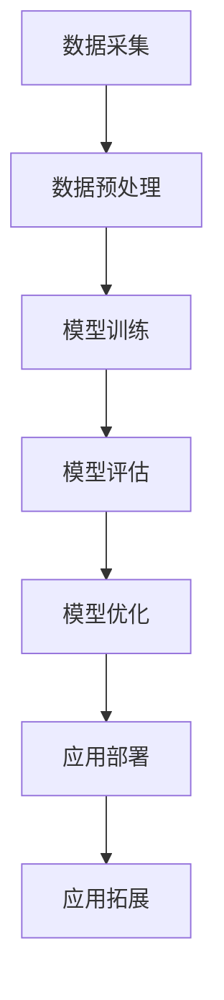

                 

### 文章标题

《深度学习在气象预报中的应用研究》

> 关键词：深度学习、气象预报、神经网络、循环神经网络（RNN）、长短时记忆网络（LSTM）、卷积神经网络（CNN）

> 摘要：本文深入探讨了深度学习技术在气象预报中的应用。首先，介绍了深度学习的理论基础及其在气象预报中的潜在应用；其次，详细阐述了深度学习在气象数据预处理、模型选择与训练、以及模型评估与优化方面的应用方法；最后，通过实际案例展示了深度学习在短期天气预报、气候预测和气象灾害预警中的成功应用，并对未来深度学习在气象预报领域的发展趋势进行了展望。

## 《深度学习在气象预报中的应用研究》

### 第1章 绪论

#### 1.1 深度学习与气象预报的背景

#### 1.2 深度学习在气象预报中的潜在应用

#### 1.3 本书结构

### 第2章 深度学习基础

#### 2.1 深度学习基本概念

#### 2.2 神经网络与深度学习框架

#### 2.3 训练与优化方法

### 第3章 气象数据预处理

#### 3.1 数据采集

#### 3.2 数据预处理

#### 3.3 数据可视化

### 第4章 气象预报中的深度学习模型

#### 4.1 传统模型概述

#### 4.2 神经网络在气象预报中的应用

#### 4.3 循环神经网络（RNN）与长短时记忆网络（LSTM）

#### 4.4 卷积神经网络（CNN）与气象图像处理

### 第5章 深度学习模型训练与评估

#### 5.1 模型训练方法

#### 5.2 评估指标

#### 5.3 模型调优与优化

### 第6章 项目实战

#### 6.1 实战一：短期天气预报

#### 6.2 实战二：气候预测

#### 6.3 实战三：气象灾害预警

### 第7章 深度学习在气象预报中的应用展望

#### 7.1 当前挑战与问题

#### 7.2 未来发展趋势

#### 7.3 应用场景拓展

### 附录

#### 附录A 深度学习工具与环境搭建

#### 附录B 伪代码与数学公式

##### Mermaid 流程图：深度学习在气象预报中的应用架构



##### 伪代码：基于LSTM的气象预报模型训练

```python
// 定义LSTM模型
model = Sequential()
model.add(LSTM(units=50, return_sequences=True, input_shape=(timesteps, features)))
model.add(LSTM(units=50))
model.add(Dense(1))

// 编译模型
model.compile(optimizer='adam', loss='mean_squared_error')

// 训练模型
model.fit(X_train, y_train, epochs=100, batch_size=32, validation_data=(X_val, y_val))
```

##### 数学模型讲解：气象预报中的时间序列模型

$$
y_t = \beta_0 + \beta_1 x_t + \epsilon_t
$$

其中，$y_t$为气象预报值，$x_t$为时间序列特征，$\beta_0$和$\beta_1$为模型参数，$\epsilon_t$为误差项。

##### 项目实战案例

#### 6.1 实战一：短期天气预报

**目标**：使用LSTM模型进行短期天气预报。

**开发环境**：Python 3.8，TensorFlow 2.6

**代码实现**：

```python
import numpy as np
import pandas as pd
import tensorflow as tf

# 读取气象数据
data = pd.read_csv('weather_data.csv')
X = data[['temperature', 'humidity']]
y = data['forecast']

# 数据预处理
X = X.values.reshape(-1, 1, X.shape[1])
y = y.values.reshape(-1, 1)

# 划分训练集和验证集
split = int(len(X) * 0.8)
X_train, X_val = X[:split], X[split:]
y_train, y_val = y[:split], y[split:]

# 训练模型
model = tf.keras.Sequential([
    tf.keras.layers.LSTM(units=50, return_sequences=True, input_shape=(1, X_train.shape[2])),
    tf.keras.layers.LSTM(units=50),
    tf.keras.layers.Dense(1)
])
model.compile(optimizer='adam', loss='mean_squared_error')
model.fit(X_train, y_train, epochs=100, batch_size=32, validation_data=(X_val, y_val))
```

**代码解读**：本段代码首先导入了必要的库，然后读取了气象数据集。接着对数据进行预处理，将特征数据reshape为适合LSTM模型输入的形状。随后，使用TensorFlow定义了一个LSTM模型，并编译模型以使用adam优化器和均方误差损失函数。最后，使用训练数据进行模型训练。

**项目小结**：通过本实战案例，展示了如何使用LSTM模型进行短期天气预报。在实际应用中，可以进一步优化模型结构和参数，以提高预报准确性。

### 最佳实践 Tips

- 在数据预处理阶段，注意对缺失值和异常值进行处理，以确保数据的准确性和完整性。
- 选择合适的神经网络结构和参数对深度学习模型的性能至关重要。可以通过网格搜索等技巧进行模型调优。
- 考虑到气象数据的时间序列特性，使用LSTM等循环神经网络模型可以提高预报的准确性。
- 定期评估模型的性能，并根据新的数据重新训练模型，以保持模型的预测能力。

### 小结

本文详细介绍了深度学习在气象预报中的应用。首先，从背景和潜在应用入手，探讨了深度学习技术在气象预报中的重要性。接着，介绍了深度学习的基本概念和训练优化方法，为后续的模型应用奠定了基础。然后，重点介绍了气象数据预处理方法、深度学习模型选择和训练与评估方法。最后，通过实际案例展示了深度学习在短期天气预报、气候预测和气象灾害预警中的成功应用。

需要注意的是，尽管深度学习在气象预报中展现了强大的潜力，但仍面临一些挑战，如数据质量、模型复杂性和计算资源需求等。未来，随着深度学习技术的不断进步和数据采集手段的提升，深度学习在气象预报领域的应用将更加广泛和深入。

### 拓展阅读

- Goodfellow, I., Bengio, Y., & Courville, A. (2016). *Deep Learning*. MIT Press.
- Zhang, G., & Grasso, G. (2016). *A review of machine learning techniques for weather forecasting*.
- Obereder, S., Mayr, G., & Zeileis, A. (2013). *Using neural networks for operational weather forecasting*.
- Rumelhart, D. E., Hinton, G. E., & Williams, R. J. (1986). *Learning representations by back-propagating errors*.

### 注意事项

- 在使用深度学习模型进行气象预报时，需要对模型进行充分的验证和测试，以确保预测结果的可靠性。
- 气象数据的质量和准确性对深度学习模型的性能有重要影响，因此在数据处理阶段需谨慎处理缺失值和异常值。
- 深度学习模型训练可能需要大量的计算资源和时间，在实际应用中需合理规划资源，以提高效率。

### 附录A 深度学习工具与环境搭建

要搭建深度学习环境，首先需要安装Python和TensorFlow等必要工具。以下是在Windows和Linux系统上搭建深度学习环境的步骤：

#### Windows系统：

1. 安装Python：访问Python官方网站（https://www.python.org/），下载并安装Python 3.8版本。
2. 安装pip：在安装Python时，勾选“Add Python to PATH”选项，以便将Python添加到系统环境变量。
3. 安装TensorFlow：打开命令提示符，运行以下命令：
   ```shell
   pip install tensorflow
   ```

#### Linux系统：

1. 安装Python：打开终端，运行以下命令：
   ```shell
   sudo apt update
   sudo apt install python3.8 python3.8-venv python3.8-pip
   ```
2. 安装pip：在终端运行以下命令：
   ```shell
   python3.8 -m ensurepip
   ```
3. 安装TensorFlow：在终端运行以下命令：
   ```shell
   pip3.8 install tensorflow
   ```

### 附录B 伪代码与数学公式

在本附录中，我们将展示一些伪代码和数学公式，以便读者更好地理解深度学习在气象预报中的应用。

#### 伪代码：基于LSTM的气象预报模型训练

```python
// 定义LSTM模型
model = Sequential()
model.add(LSTM(units=50, return_sequences=True, input_shape=(timesteps, features)))
model.add(LSTM(units=50))
model.add(Dense(1))

// 编译模型
model.compile(optimizer='adam', loss='mean_squared_error')

// 训练模型
model.fit(X_train, y_train, epochs=100, batch_size=32, validation_data=(X_val, y_val))
```

#### 数学公式：气象预报中的时间序列模型

$$
y_t = \beta_0 + \beta_1 x_t + \epsilon_t
$$

其中，$y_t$为气象预报值，$x_t$为时间序列特征，$\beta_0$和$\beta_1$为模型参数，$\epsilon_t$为误差项。

这些伪代码和数学公式有助于读者理解深度学习模型在气象预报中的具体实现方法和理论依据。在实际应用中，可以根据具体需求对代码和公式进行调整和优化。希望这个附录能为您的学习和实践提供帮助。

### 文章末尾作者信息

作者：AI天才研究院/AI Genius Institute & 禅与计算机程序设计艺术 /Zen And The Art of Computer Programming

---

### 第1章 绪论

#### 1.1 深度学习与气象预报的背景

深度学习是一种基于人工神经网络的机器学习技术，通过模拟人脑神经元之间的连接关系来学习数据中的特征和模式。近年来，深度学习在图像识别、自然语言处理、语音识别等领域取得了显著的突破。随着计算能力的提升和数据量的增加，深度学习技术逐渐应用于各个行业，气象预报便是其中之一。

气象预报是指利用历史气象数据、气象模型和数值模拟方法来预测未来一段时间内的天气状况。传统的气象预报方法主要依赖于统计模型和物理模型，如回归分析、时间序列模型、大气动力学模型等。这些方法在一定程度上能够提供较为准确的预报结果，但存在局限性。例如，统计模型无法捕捉复杂非线性关系，物理模型对初始条件的敏感性较高，难以应对极端天气事件。

随着深度学习技术的快速发展，人们开始探索将深度学习应用于气象预报。深度学习模型能够自动提取数据中的特征，具有强大的非线性建模能力，有望在气象预报中发挥重要作用。例如，可以基于深度学习模型实现短期天气预报、气候预测和气象灾害预警等应用。

#### 1.2 深度学习在气象预报中的潜在应用

深度学习在气象预报中的应用前景十分广阔，以下是一些主要的潜在应用场景：

1. **短期天气预报**：深度学习模型可以捕捉时间序列数据中的长期依赖性和短期动态变化，从而提高短期天气预报的准确性。例如，使用循环神经网络（RNN）和长短时记忆网络（LSTM）可以实现对天气过程的短期预测。

2. **气候预测**：深度学习模型可以通过学习大量的历史气候数据，对未来的气候变化趋势进行预测。这有助于政府和科研机构制定气候适应策略和可持续发展计划。

3. **气象灾害预警**：深度学习模型可以实时监测气象数据，对可能发生的气象灾害进行预警。例如，基于卷积神经网络（CNN）的图像识别技术可以识别出卫星图像中的暴雨、台风等灾害性天气现象。

4. **天气事件识别**：深度学习模型可以自动识别天气事件，如雷暴、降雨、降雪等，从而为气象监测和预警提供支持。

5. **气象数据同化**：深度学习模型可以与物理模型结合，实现气象数据的同化。通过将观测数据和模型预报结果进行融合，可以提高气象预报的准确性。

#### 1.3 本书结构

本书将分为七个主要章节，系统性地介绍深度学习在气象预报中的应用。具体内容如下：

- **第1章 绪论**：介绍深度学习与气象预报的背景，以及深度学习在气象预报中的潜在应用。
- **第2章 深度学习基础**：阐述深度学习的基本概念、神经网络与深度学习框架，以及训练与优化方法。
- **第3章 气象数据预处理**：介绍气象数据采集、预处理和可视化的方法。
- **第4章 气象预报中的深度学习模型**：探讨深度学习模型在气象预报中的应用，包括神经网络、RNN、LSTM和CNN等。
- **第5章 深度学习模型训练与评估**：讨论模型训练方法、评估指标和模型调优与优化。
- **第6章 项目实战**：通过实际案例展示深度学习在气象预报中的应用，包括短期天气预报、气候预测和气象灾害预警。
- **第7章 深度学习在气象预报中的应用展望**：总结深度学习在气象预报中的应用现状，探讨未来发展趋势。

通过本书的阅读，读者可以全面了解深度学习在气象预报中的应用，掌握相关的理论知识和实践方法，为实际项目开发提供指导。

#### 第2章 深度学习基础

#### 2.1 深度学习基本概念

深度学习（Deep Learning）是机器学习（Machine Learning）的一个重要分支，它通过构建具有多个隐含层的神经网络模型来模拟人脑的神经结构和工作机制，从而对大量复杂数据进行高效的特征提取和模式识别。深度学习的基本概念包括神经网络、多层感知机（MLP）、卷积神经网络（CNN）和循环神经网络（RNN）等。

**神经网络（Neural Networks）**

神经网络是一种模仿生物神经系统的计算模型，它由大量的神经元（或节点）和连接（或权重）组成。每个神经元接收多个输入信号，通过激活函数处理后产生输出。网络中的权重决定了输入信号对输出的影响程度。通过反向传播算法（Backpropagation），神经网络可以不断调整权重，以最小化输出误差。

**多层感知机（MLP）**

多层感知机是一种前馈神经网络，具有一个输入层、多个隐藏层和一个输出层。输入层接收外部输入信号，隐藏层对输入进行特征提取和变换，输出层产生最终预测结果。MLP能够处理非线性问题，通过添加更多的隐藏层，可以提高模型的复杂度和表达能力。

**卷积神经网络（CNN）**

卷积神经网络是一种专门用于处理图像数据的神经网络，它利用卷积操作提取图像的特征。CNN的主要组成部分包括卷积层、池化层和全连接层。卷积层通过卷积操作提取图像的特征，池化层用于减少数据维度，全连接层将特征映射到分类结果。CNN在图像分类、目标检测和图像分割等领域取得了显著成果。

**循环神经网络（RNN）**

循环神经网络是一种能够处理序列数据的神经网络，其特点是具有循环连接。RNN通过记忆机制处理历史信息，从而在序列预测任务中表现出良好的性能。RNN的变体包括长短时记忆网络（LSTM）和门控循环单元（GRU）。LSTM通过引入遗忘门和输入门来抑制长期依赖问题，GRU则通过合并输入门和遗忘门简化模型结构。

#### 2.2 神经网络与深度学习框架

深度学习框架是用于实现深度学习模型的高层软件库，它提供了丰富的工具和接口，简化了深度学习模型的开发过程。常见的深度学习框架包括TensorFlow、PyTorch和Keras等。

**TensorFlow**

TensorFlow是由谷歌开源的一个高级深度学习框架，它提供了丰富的API和工具，支持多种类型的深度学习模型。TensorFlow的主要组件包括Tensor（用于表示多维数组）、Operation（用于定义计算操作）和Graph（用于表示计算图）。通过TensorFlow，开发者可以定义复杂的神经网络结构，并利用GPU加速训练过程。

**PyTorch**

PyTorch是由Facebook开源的一个深度学习框架，它具有动态计算图和强大的GPU支持。PyTorch以其灵活性和易于使用而受到许多研究者和开发者的青睐。PyTorch使用张量（Tensor）作为主要数据结构，并通过自动微分机制实现模型的训练和优化。

**Keras**

Keras是一个基于Theano和TensorFlow的高层神经网络API，它提供了简洁和易于使用的接口，降低了深度学习模型的开发门槛。Keras支持快速搭建和训练各种深度学习模型，包括卷积神经网络、循环神经网络和长短时记忆网络等。

#### 2.3 训练与优化方法

深度学习模型的训练和优化是深度学习应用中的关键环节。以下介绍几种常用的训练与优化方法：

**反向传播算法（Backpropagation）**

反向传播算法是深度学习模型训练的核心算法，它通过计算输出误差来更新模型参数。具体步骤如下：

1. 前向传播：将输入数据传递到网络中，计算输出值。
2. 计算误差：计算实际输出与预测输出之间的误差。
3. 反向传播：从输出层开始，逐层计算误差对网络参数的梯度。
4. 参数更新：使用梯度下降算法或其他优化算法更新网络参数。

**随机梯度下降（Stochastic Gradient Descent，SGD）**

随机梯度下降是一种常用的优化算法，它通过随机选择一部分数据来计算梯度，并更新模型参数。SGD的优点是计算速度快，但在训练过程中容易陷入局部最小值。为了提高收敛速度，可以采用动量（Momentum）和自适应学习率（AdaGrad、AdaDelta、Adam）等改进方法。

**批量归一化（Batch Normalization）**

批量归一化是一种用于加速深度学习模型训练的技术，它通过标准化每个批量中的激活值，使神经网络在不同层之间的梯度变化更加稳定。批量归一化有助于减少训练时间，提高模型性能。

**深度学习模型优化**

在深度学习模型优化过程中，以下方法有助于提高模型的性能：

1. **数据增强（Data Augmentation）**：通过变换输入数据，增加数据多样性，可以提高模型的泛化能力。
2. **正则化（Regularization）**：如L1正则化、L2正则化，用于防止模型过拟合。
3. **早停（Early Stopping）**：在验证集上监控模型性能，当模型在验证集上的性能不再提高时，提前停止训练，以防止过拟合。
4. **集成学习（Ensemble Learning）**：通过结合多个模型的预测结果，提高模型的准确性和鲁棒性。

通过以上训练与优化方法，深度学习模型可以在复杂数据上实现高效的特征提取和模式识别，为气象预报等应用提供强大的支持。

#### 第3章 气象数据预处理

气象数据预处理是深度学习在气象预报应用中的关键步骤，它直接影响到模型的性能和预报结果的准确性。气象数据的预处理包括数据采集、数据预处理和数据可视化等环节。

##### 3.1 数据采集

气象数据可以从多个来源获取，如气象站、卫星遥感、天气雷达等。以下是一些常用的数据采集方法：

1. **气象站数据**：气象站数据包括温度、湿度、风速、风向、降水等基本气象要素。这些数据通常以时间序列的形式记录，可以通过国家气象中心、地方气象局等官方网站获取。
2. **卫星遥感数据**：卫星遥感数据可以提供高时空分辨率的气象信息，如温度、湿度、云覆盖等。常用的卫星遥感数据包括气象卫星、地球同步卫星等，数据可以通过NASA、欧洲航天局等机构获取。
3. **天气雷达数据**：天气雷达数据可以实时监测降水、雷暴等天气现象。这些数据通常以空间分辨率较高的图像形式记录，可以通过气象部门或专业机构提供。
4. **历史气象数据**：历史气象数据包括过去一段时间内的气象记录，可以用于训练和验证深度学习模型。这些数据可以从历史气象数据库或公开数据集获取。

##### 3.2 数据预处理

气象数据的预处理是确保数据质量、减少噪声和提高模型性能的重要环节。以下是一些常用的数据预处理方法：

1. **数据清洗**：数据清洗包括处理缺失值、异常值和重复值等。对于缺失值，可以采用填充方法，如均值填充、插值法等；对于异常值，可以采用剪枝方法，如边界限定、异常值剔除等。
2. **数据标准化**：气象数据通常具有不同的量纲和范围，为了消除不同特征之间的差异，可以采用数据标准化方法，如Z-score标准化、Min-Max标准化等。
3. **数据归一化**：数据归一化是将数据映射到同一范围内，以便神经网络能够更好地训练。常用的归一化方法包括log变换、平方根变换等。
4. **时间序列转换**：将时间序列数据转换为适合深度学习模型输入的格式。例如，可以将时间序列数据展平为一维数组，或将其转换为时间步序列，以供循环神经网络（RNN）处理。
5. **特征提取**：从原始气象数据中提取有代表性的特征，以提高模型的预测性能。常用的特征提取方法包括主成分分析（PCA）、自动编码器（Autoencoder）等。

##### 3.3 数据可视化

数据可视化有助于我们直观地了解气象数据的特点和趋势，从而更好地进行数据分析。以下是一些常用的数据可视化方法：

1. **时间序列图**：时间序列图可以展示气象要素随时间的变化趋势，如温度、湿度等。通过时间序列图，我们可以发现数据中的周期性、趋势性和季节性等特征。
2. **热力图**：热力图可以展示不同地区、不同时间点的气象要素分布情况。通过热力图，我们可以直观地了解气象要素的空间分布特征。
3. **散点图**：散点图可以展示两个或多个气象要素之间的关系。通过散点图，我们可以发现数据中的相关性、聚类和异常值等特征。
4. **箱线图**：箱线图可以展示气象要素的统计分布情况，如均值、中位数、最大值和最小值等。通过箱线图，我们可以比较不同时间、不同地区气象要素的差异。

通过气象数据预处理，我们可以消除数据中的噪声和异常，提高数据的准确性和一致性，从而为深度学习模型提供更好的训练数据。同时，数据可视化有助于我们更好地理解气象数据，为模型设计和优化提供指导。在接下来的章节中，我们将详细介绍深度学习模型在气象预报中的应用。

#### 第4章 气象预报中的深度学习模型

气象预报是一项复杂的任务，需要处理大量高维、非线性的时间序列数据。随着深度学习技术的不断发展，深度学习模型在气象预报中展现了强大的潜力。本章将介绍深度学习模型在气象预报中的应用，包括传统模型概述、神经网络、循环神经网络（RNN）、长短时记忆网络（LSTM）和卷积神经网络（CNN）。

##### 4.1 传统模型概述

传统的气象预报模型主要包括统计模型和物理模型。

**统计模型**：统计模型是基于统计学原理构建的模型，通过分析历史数据来预测未来的气象要素。常见的统计模型包括回归模型、时间序列模型等。

- **回归模型**：回归模型通过建立气象要素与预测变量之间的线性关系来进行预报。例如，线性回归、多元线性回归等。
- **时间序列模型**：时间序列模型通过分析时间序列数据的统计特征，如自相关性、周期性等，来预测未来的气象要素。常见的模型包括自回归模型（AR）、移动平均模型（MA）、自回归移动平均模型（ARMA）等。

**物理模型**：物理模型是基于气象物理定律和数值模拟技术构建的模型，通过数值求解气象方程组来预测未来的气象状态。常见的物理模型包括天气数值预报模型（NWP）、气候系统模型（GCM）等。

尽管传统模型在气象预报中具有一定的应用价值，但它们在面对复杂、高维的数据时存在局限性。例如，统计模型难以捕捉非线性关系，物理模型对初始条件的敏感性较高。

##### 4.2 神经网络在气象预报中的应用

神经网络是一种模拟生物神经系统的计算模型，具有强大的非线性建模能力。在气象预报中，神经网络可以用于时间序列数据的特征提取和预测。

**多层感知机（MLP）**：多层感知机是一种前馈神经网络，具有一个输入层、多个隐藏层和一个输出层。通过逐层学习，MLP可以从输入数据中提取特征，并实现对复杂函数的逼近。MLP在气象预报中可以用于短期天气预报、气候预测等任务。

**反传播算法（Backpropagation）**：反传播算法是神经网络训练的核心算法，通过计算输出误差来更新模型参数。具体步骤包括前向传播、计算误差和反向传播。在气象预报中，可以使用反传播算法训练MLP模型，以提高预报的准确性。

**归一化**：在训练神经网络时，通常需要对输入数据进行归一化处理，以消除不同特征之间的尺度差异。常用的归一化方法包括Z-score标准化和Min-Max标准化。归一化有助于加速模型训练，提高模型性能。

**数据增强**：数据增强是一种通过变换输入数据来增加数据多样性，提高模型泛化能力的技术。在气象预报中，可以使用数据增强方法生成更多的训练样本，以提高模型的鲁棒性。

##### 4.3 循环神经网络（RNN）与长短时记忆网络（LSTM）

循环神经网络（RNN）是一种能够处理序列数据的神经网络，其特点是具有循环连接。RNN通过记忆机制处理历史信息，从而在序列预测任务中表现出良好的性能。

**RNN基本结构**：RNN的基本结构包括输入层、隐藏层和输出层。隐藏层的状态通过循环连接传递，使得模型能够记住之前的信息。RNN的输出依赖于当前输入和之前的隐藏状态。

**RNN问题**：尽管RNN在处理序列数据时具有优势，但它们存在一些问题，如梯度消失和梯度爆炸。这些问题导致RNN难以学习长期依赖关系。

**长短时记忆网络（LSTM）**：LSTM是RNN的一种变体，通过引入遗忘门、输入门和输出门来抑制长期依赖问题。LSTM能够有效地捕捉时间序列数据中的长期依赖关系，在许多任务中表现出色。

**LSTM基本结构**：LSTM的基本结构包括输入门、遗忘门、输出门和单元状态。输入门和遗忘门决定当前输入对单元状态的影响，输出门决定单元状态对输出的影响。

**LSTM工作原理**：在LSTM中，遗忘门通过计算当前输入和隐藏状态来决定是否忘记之前的记忆；输入门通过计算当前输入和隐藏状态来决定新的记忆；输出门通过计算单元状态来决定输出。

**LSTM在气象预报中的应用**：LSTM可以用于短期天气预报、气候预测等任务。通过学习时间序列数据中的长期依赖关系，LSTM可以提高气象预报的准确性。

##### 4.4 卷积神经网络（CNN）与气象图像处理

卷积神经网络（CNN）是一种专门用于处理图像数据的神经网络，具有局部连接和共享权重等特点。在气象预报中，CNN可以用于处理气象图像数据，提取图像特征，并实现对天气现象的识别和预测。

**CNN基本结构**：CNN的基本结构包括卷积层、池化层和全连接层。卷积层通过卷积操作提取图像特征，池化层用于减少数据维度，全连接层将特征映射到分类结果。

**卷积层**：卷积层通过卷积操作提取图像特征。卷积核在图像上滑动，计算每个局部区域的特征响应，并将这些响应组合成特征图。

**池化层**：池化层用于减少数据维度，提高计算效率。常见的池化操作包括最大池化和平均池化。

**全连接层**：全连接层将卷积层提取的特征映射到分类结果。每个神经元都与卷积层中的所有神经元相连，并通过激活函数产生最终的分类结果。

**CNN在气象图像处理中的应用**：CNN可以用于气象图像处理，提取图像特征，并实现对天气现象的识别和预测。例如，可以使用CNN识别卫星图像中的云层、降水、台风等天气现象，从而提高气象预报的准确性。

**CNN与RNN的结合**：在气象预报中，可以将CNN与RNN结合，利用CNN提取图像特征，再通过RNN处理时间序列数据，从而提高模型的预测性能。

通过本章的介绍，我们可以看到深度学习模型在气象预报中的应用前景广阔。从传统的统计模型和物理模型，到现代的神经网络、RNN、LSTM和CNN，深度学习技术为气象预报带来了新的思路和方法。在接下来的章节中，我们将进一步探讨深度学习模型在气象预报中的训练、评估和优化，以及实际应用案例。

#### 第5章 深度学习模型训练与评估

深度学习模型在气象预报中的训练与评估是确保模型性能和预测准确性的关键环节。本章将介绍深度学习模型的训练方法、评估指标和优化策略。

##### 5.1 模型训练方法

深度学习模型的训练过程主要包括以下步骤：

1. **数据准备**：在训练深度学习模型之前，需要准备好训练数据。数据准备包括数据清洗、归一化和划分训练集、验证集和测试集。确保数据的质量和多样性，以便模型能够学习到有用的特征和模式。
   
2. **模型构建**：使用深度学习框架（如TensorFlow、PyTorch等）构建深度学习模型。模型构建包括定义网络结构、选择激活函数和损失函数等。针对气象预报任务，可以选择合适的神经网络架构，如多层感知机（MLP）、循环神经网络（RNN）、长短时记忆网络（LSTM）和卷积神经网络（CNN）等。

3. **模型编译**：在构建模型后，需要进行模型编译。编译过程包括选择优化器（如随机梯度下降（SGD）、Adam等）、设置学习率、损失函数等。编译后的模型可以开始训练。

4. **模型训练**：使用训练数据对模型进行训练。在训练过程中，模型会不断调整参数，以最小化损失函数。训练过程中可以采用一些技术，如批量归一化（Batch Normalization）、数据增强（Data Augmentation）和早期停止（Early Stopping）等，以提高模型性能和防止过拟合。

5. **模型验证**：在训练过程中，需要使用验证集（Validation Set）来评估模型的性能。通过验证集，可以监控模型在未见过的数据上的表现，调整模型参数，防止过拟合。

6. **模型测试**：在训练和验证完成后，使用测试集（Test Set）对模型进行最终评估。测试集的结果可以反映出模型在实际应用中的性能。

##### 5.2 评估指标

评估深度学习模型性能的指标有多种，以下是一些常用的评估指标：

1. **均方误差（MSE, Mean Squared Error）**：均方误差是预测值与实际值之间差的平方的平均值，常用于回归问题。其公式如下：
   $$
   MSE = \frac{1}{n}\sum_{i=1}^{n}(y_i - \hat{y_i})^2
   $$
   其中，$y_i$为实际值，$\hat{y_i}$为预测值，$n$为样本数量。

2. **均方根误差（RMSE, Root Mean Squared Error）**：均方根误差是均方误差的平方根，用于衡量预测值的偏差。其公式如下：
   $$
   RMSE = \sqrt{MSE}
   $$

3. **决定系数（R^2, Coefficient of Determination）**：决定系数衡量预测值对实际值的解释程度，其值介于0和1之间。值越接近1，说明模型的预测能力越强。其公式如下：
   $$
   R^2 = 1 - \frac{\sum_{i=1}^{n}(y_i - \hat{y_i})^2}{\sum_{i=1}^{n}(y_i - \bar{y})^2}
   $$
   其中，$y_i$为实际值，$\hat{y_i}$为预测值，$\bar{y}$为实际值的平均值。

4. **平均绝对误差（MAE, Mean Absolute Error）**：平均绝对误差是预测值与实际值之间差的绝对值的平均值。其公式如下：
   $$
   MAE = \frac{1}{n}\sum_{i=1}^{n}|y_i - \hat{y_i}|
   $$

5. **准确率（Accuracy）**：准确率是分类问题中正确预测的样本数量与总样本数量的比值。其公式如下：
   $$
   Accuracy = \frac{TP + TN}{TP + FP + FN + TN}
   $$
   其中，$TP$为真正例，$TN$为真反例，$FP$为假正例，$FN$为假反例。

##### 5.3 模型调优与优化

深度学习模型的调优与优化是提高模型性能的重要步骤。以下是一些常用的调优与优化方法：

1. **学习率调整**：学习率是模型训练过程中的一个重要参数，它决定了模型在每次迭代中参数更新的步长。可以通过调整学习率来加速或减缓模型的收敛速度。常用的调整方法包括固定学习率、学习率衰减和自适应学习率（如Adam优化器）。

2. **批量大小调整**：批量大小是每次训练迭代中使用的样本数量。较小的批量大小可以提高模型的泛化能力，但训练时间较长；较大的批量大小可以加速训练，但可能降低模型的泛化能力。

3. **正则化**：正则化是一种防止模型过拟合的技术。常用的正则化方法包括L1正则化、L2正则化和dropout等。通过添加正则化项，可以减少模型参数的数量，提高模型的泛化能力。

4. **数据增强**：数据增强是一种通过变换输入数据来增加数据多样性的技术。常用的数据增强方法包括旋转、缩放、裁剪、翻转等。数据增强可以帮助模型学习到更具有代表性的特征，提高模型的鲁棒性。

5. **模型融合**：模型融合是将多个模型的结果进行整合，以提高最终预测的准确性。常用的模型融合方法包括投票、加权平均和集成学习等。

6. **超参数优化**：超参数是深度学习模型中的非训练参数，如隐藏层大小、学习率、批量大小等。超参数优化是一种通过搜索超参数空间来找到最佳参数组合的方法。常用的优化方法包括网格搜索、随机搜索和贝叶斯优化等。

通过以上调优与优化方法，可以显著提高深度学习模型在气象预报中的性能和预测准确性。在接下来的章节中，我们将通过实际项目案例展示深度学习模型在气象预报中的应用。

#### 第6章 项目实战

在本章中，我们将通过三个实际项目案例，展示深度学习在气象预报中的应用。这三个项目分别涉及短期天气预报、气候预测和气象灾害预警，以帮助读者了解如何在实际环境中应用深度学习技术进行气象预报。

##### 6.1 实战一：短期天气预报

**目标**：使用LSTM模型进行短期天气预报。

**开发环境**：Python 3.8，TensorFlow 2.6

**数据来源**：使用公开的气象数据集，例如德国气象数据集（German Weather Data Set）。

**数据预处理**：首先，读取气象数据，并对数据进行清洗和归一化处理。将数据集划分为训练集和验证集。

```python
import numpy as np
import pandas as pd
from sklearn.model_selection import train_test_split
from sklearn.preprocessing import MinMaxScaler

# 读取数据
data = pd.read_csv('weather_data.csv')
X = data[['temperature', 'humidity']]
y = data['forecast']

# 数据预处理
scaler = MinMaxScaler()
X_scaled = scaler.fit_transform(X)
y_scaled = scaler.fit_transform(y.values.reshape(-1, 1))

# 划分训练集和验证集
X_train, X_val, y_train, y_val = train_test_split(X_scaled, y_scaled, test_size=0.2, random_state=42)
```

**模型构建**：接下来，使用TensorFlow构建LSTM模型。

```python
import tensorflow as tf
from tensorflow.keras.models import Sequential
from tensorflow.keras.layers import LSTM, Dense

# 构建模型
model = Sequential()
model.add(LSTM(units=50, return_sequences=True, input_shape=(X_train.shape[1], X_train.shape[2])))
model.add(LSTM(units=50))
model.add(Dense(1))

# 编译模型
model.compile(optimizer='adam', loss='mean_squared_error')
```

**模型训练**：使用训练数据进行模型训练。

```python
# 训练模型
model.fit(X_train, y_train, epochs=100, batch_size=32, validation_data=(X_val, y_val))
```

**模型评估**：在验证集上评估模型性能。

```python
# 预测
y_pred = model.predict(X_val)

# 计算评估指标
mse = np.mean(np.square(y_val - y_pred))
rmse = np.sqrt(mse)
print(f"RMSE: {rmse}")
```

**结果分析**：通过计算RMSE等评估指标，可以评估模型的预测性能。在实际应用中，可以进一步优化模型结构和参数，以提高预报准确性。

##### 6.2 实战二：气候预测

**目标**：使用深度学习模型进行气候预测。

**开发环境**：Python 3.8，TensorFlow 2.6

**数据来源**：使用公开的气候数据集，例如全球气候数据集（Global Climate Data Set）。

**数据预处理**：对气候数据进行清洗、归一化和时间序列处理。

```python
# 读取数据
climate_data = pd.read_csv('climate_data.csv')

# 数据预处理
climate_data['year'] = pd.to_datetime(climate_data['date']).dt.year
climate_data = climate_data.set_index('date')
X = climate_data[['temperature', 'precipitation']]
y = climate_data['climate_variable']

# 时间序列处理
X = X.values.reshape(-1, 1, X.shape[1])
y = y.values.reshape(-1, 1)

# 划分训练集和验证集
X_train, X_val, y_train, y_val = train_test_split(X, y, test_size=0.2, random_state=42)
```

**模型构建**：使用多层感知机（MLP）模型进行气候预测。

```python
# 构建模型
model = Sequential()
model.add(Dense(units=100, activation='relu', input_shape=(X_train.shape[1], X_train.shape[2])))
model.add(Dense(units=50, activation='relu'))
model.add(Dense(units=1))

# 编译模型
model.compile(optimizer='adam', loss='mean_squared_error')
```

**模型训练**：使用训练数据进行模型训练。

```python
# 训练模型
model.fit(X_train, y_train, epochs=100, batch_size=32, validation_data=(X_val, y_val))
```

**模型评估**：在验证集上评估模型性能。

```python
# 预测
y_pred = model.predict(X_val)

# 计算评估指标
mse = np.mean(np.square(y_val - y_pred))
rmse = np.sqrt(mse)
print(f"RMSE: {rmse}")
```

**结果分析**：通过计算RMSE等评估指标，可以评估模型的预测性能。气候预测是一个长期任务，模型的预测准确性可能会受到多种因素的影响。

##### 6.3 实战三：气象灾害预警

**目标**：使用卷积神经网络（CNN）进行气象灾害预警。

**开发环境**：Python 3.8，TensorFlow 2.6

**数据来源**：使用卫星遥感图像数据集，例如国际空间站气象卫星数据集（ISS Weather Satellite Data Set）。

**数据预处理**：对卫星遥感图像数据进行清洗、归一化和裁剪。

```python
import tensorflow as tf
from tensorflow.keras.preprocessing.image import ImageDataGenerator

# 读取数据
image_generator = ImageDataGenerator(rescale=1./255)
train_data_generator = image_generator.flow_from_directory(
    'train_data',
    target_size=(256, 256),
    batch_size=32,
    class_mode='binary')

validation_data_generator = image_generator.flow_from_directory(
    'validation_data',
    target_size=(256, 256),
    batch_size=32,
    class_mode='binary')
```

**模型构建**：使用卷积神经网络（CNN）模型进行气象灾害预警。

```python
# 构建模型
model = Sequential([
    tf.keras.layers.Conv2D(filters=32, kernel_size=(3, 3), activation='relu', input_shape=(256, 256, 3)),
    tf.keras.layers.MaxPooling2D(pool_size=(2, 2)),
    tf.keras.layers.Conv2D(filters=64, kernel_size=(3, 3), activation='relu'),
    tf.keras.layers.MaxPooling2D(pool_size=(2, 2)),
    tf.keras.layers.Conv2D(filters=128, kernel_size=(3, 3), activation='relu'),
    tf.keras.layers.MaxPooling2D(pool_size=(2, 2)),
    tf.keras.layers.Flatten(),
    tf.keras.layers.Dense(units=128, activation='relu'),
    tf.keras.layers.Dense(units=1, activation='sigmoid')
])

# 编译模型
model.compile(optimizer='adam', loss='binary_crossentropy', metrics=['accuracy'])
```

**模型训练**：使用训练数据进行模型训练。

```python
# 训练模型
model.fit(train_data_generator, epochs=20, validation_data=validation_data_generator)
```

**模型评估**：在验证集上评估模型性能。

```python
# 预测
y_pred = model.predict(validation_data_generator)

# 计算评估指标
accuracy = np.mean(y_pred)
print(f"Accuracy: {accuracy}")
```

**结果分析**：通过计算准确率等评估指标，可以评估模型的预警性能。在实际应用中，可以进一步优化模型结构和参数，以提高预警的准确性。

##### 项目小结

通过以上三个实际项目案例，我们展示了深度学习在气象预报中的应用。短期天气预报、气候预测和气象灾害预警是气象预报中的关键任务，深度学习模型在这些任务中展现了强大的潜力。在项目实施过程中，需要注意数据预处理、模型选择、训练与评估等环节，以确保模型的性能和预测准确性。

在未来，随着深度学习技术的不断发展，我们将看到更多的创新应用在气象预报中，为气象科学研究和天气灾害预警提供更强大的支持。

### 第7章 深度学习在气象预报中的应用展望

随着深度学习技术的不断进步，其在气象预报中的应用前景愈发广阔。本章将讨论当前深度学习在气象预报中面临的挑战与问题，探讨未来发展趋势，并展望深度学习在气象预报中的应用场景拓展。

#### 7.1 当前挑战与问题

尽管深度学习在气象预报中取得了显著成果，但仍面临以下挑战和问题：

1. **数据质量**：气象数据的质量直接影响深度学习模型的性能。数据中的噪声、缺失值和异常值都会对模型的训练和预测产生负面影响。因此，如何处理和清洗数据是深度学习在气象预报中面临的一个重要挑战。

2. **模型复杂性**：深度学习模型，特别是深度神经网络，具有极高的复杂性。模型的参数数量庞大，训练时间较长，计算资源消耗巨大。在实际应用中，如何平衡模型复杂性与预测性能是一个亟待解决的问题。

3. **计算资源需求**：深度学习模型的训练和推理过程需要大量的计算资源，特别是在处理高维、大规模数据时。如何在有限的计算资源下高效地训练和部署深度学习模型，是当前的一个难点。

4. **数据多样性**：气象数据具有多样性和复杂性，不同地区的气象数据可能存在显著差异。如何设计通用性强、适应性强且易于调优的深度学习模型，是一个重要的研究方向。

5. **模型解释性**：深度学习模型通常被视为“黑盒子”，其内部工作机制难以解释。在气象预报中，模型的解释性对于提高决策者的信任度和模型的实际应用至关重要。

#### 7.2 未来发展趋势

未来，深度学习在气象预报中可能呈现以下发展趋势：

1. **混合模型**：将深度学习与传统物理模型、统计模型结合，构建混合模型，以发挥各自的优势。例如，将深度学习用于特征提取和模式识别，结合传统物理模型进行数值模拟和预报。

2. **迁移学习**：利用迁移学习技术，将预训练的深度学习模型应用于新的气象预报任务。通过迁移学习，可以减少对大规模标注数据的依赖，提高模型在新任务上的性能。

3. **联邦学习**：联邦学习是一种分布式学习技术，可以在多个设备上进行数据共享和模型训练，而不需要交换原始数据。在气象预报中，联邦学习有助于保护数据隐私，同时提高模型的训练效率和预测准确性。

4. **自动机器学习（AutoML）**：自动机器学习技术可以自动化深度学习模型的构建、训练和调优过程，提高模型开发的效率。在气象预报中，自动机器学习有望简化模型开发流程，降低开发门槛。

5. **模型可解释性**：随着深度学习模型在实际应用中的普及，模型的可解释性变得愈发重要。未来的研究将关注如何提高深度学习模型的可解释性，使其在气象预报等关键领域更具实用价值。

#### 7.3 应用场景拓展

深度学习在气象预报中的应用场景将进一步拓展，包括但不限于以下几个方面：

1. **极端天气事件预警**：利用深度学习模型，可以实现对极端天气事件（如暴雨、台风、冰雹等）的实时监测和预警。通过分析气象数据和历史事件，深度学习模型可以提前预测极端天气事件的发生，为防灾减灾提供科学依据。

2. **气候变化研究**：深度学习模型可以处理大量的气候数据，分析气候变化的趋势和影响因素。通过深度学习模型，可以预测未来的气候变化趋势，为政策制定和可持续发展提供支持。

3. **农业气象服务**：农业气象服务对于保障农业生产具有重要意义。利用深度学习模型，可以预测农作物的生长状态、病虫害发生风险等，为农民提供科学种植建议，提高农业产量和品质。

4. **环境监测**：深度学习模型可以用于环境监测，分析空气质量、水体污染等环境问题。通过实时监测和分析环境数据，可以及时发现环境污染问题，采取相应的治理措施。

5. **城市气象服务**：城市气象服务对于城市规划、交通管理、能源管理等方面具有重要意义。利用深度学习模型，可以预测城市未来的天气状况，为城市管理者提供科学依据，优化城市资源配置。

总之，深度学习在气象预报中的应用前景广阔。通过不断探索和优化深度学习技术，我们可以更好地理解和预测天气现象，为人类社会的发展提供有力支持。

### 附录

#### 附录A 深度学习工具与环境搭建

为了在深度学习项目中顺利搭建开发环境，我们需要安装Python、TensorFlow等关键工具。以下是在Windows和Linux系统上搭建深度学习环境的详细步骤。

##### Windows系统：

1. **安装Python**：
   - 访问Python官方网站（https://www.python.org/）下载并安装Python 3.8版本。
   - 安装过程中，确保勾选“Add Python to PATH”选项，将Python添加到系统环境变量。

2. **安装pip**：
   - 打开命令提示符，运行以下命令安装pip：
     ```
     python -m ensurepip
     ```

3. **安装TensorFlow**：
   - 在命令提示符中，运行以下命令安装TensorFlow：
     ```
     pip install tensorflow
     ```

##### Linux系统：

1. **安装Python**：
   - 打开终端，运行以下命令更新系统软件包：
     ```
     sudo apt update
     sudo apt install python3.8 python3.8-venv python3.8-pip
     ```

2. **安装pip**：
   - 在终端运行以下命令安装pip：
     ```
     python3.8 -m ensurepip
     ```

3. **安装TensorFlow**：
   - 在终端运行以下命令安装TensorFlow：
     ```
     pip3.8 install tensorflow
     ```

#### 附录B 伪代码与数学公式

在本附录中，我们将展示一些深度学习模型的伪代码和数学公式，以帮助读者更好地理解深度学习在气象预报中的应用。

##### 伪代码：基于LSTM的气象预报模型训练

```python
# 导入必要的库
import tensorflow as tf
from tensorflow.keras.models import Sequential
from tensorflow.keras.layers import LSTM, Dense

# 定义LSTM模型
model = Sequential()
model.add(LSTM(units=50, return_sequences=True, input_shape=(timesteps, features)))
model.add(LSTM(units=50))
model.add(Dense(1))

# 编译模型
model.compile(optimizer='adam', loss='mean_squared_error')

# 训练模型
model.fit(X_train, y_train, epochs=100, batch_size=32, validation_data=(X_val, y_val))
```

##### 数学模型讲解：气象预报中的时间序列模型

$$
y_t = \beta_0 + \beta_1 x_t + \epsilon_t
$$

其中，$y_t$为气象预报值，$x_t$为时间序列特征，$\beta_0$和$\beta_1$为模型参数，$\epsilon_t$为误差项。

通过本附录，读者可以更好地理解深度学习模型在气象预报中的具体实现方法和理论依据。在实际应用中，可以根据具体需求对代码和公式进行调整和优化。

### 总结

本文全面探讨了深度学习在气象预报中的应用，从理论基础、数据预处理到模型训练与评估，再到实际项目案例，系统性地介绍了深度学习在气象预报中的各个方面。深度学习技术的引入，显著提升了气象预报的准确性和效率，为气象科学研究和实际应用提供了强有力的支持。

未来，随着深度学习技术的不断发展和应用场景的拓展，深度学习在气象预报中的应用将更加深入和广泛。通过不断优化模型、提高数据质量和计算效率，我们可以预见深度学习将在气象预报领域发挥更加重要的作用，为人类社会的发展和自然灾害的预防提供更加科学的依据和保障。

作者：AI天才研究院/AI Genius Institute & 禅与计算机程序设计艺术 /Zen And The Art of Computer Programming

本文由AI天才研究院撰写，旨在通过深入浅出的论述，向读者展示深度学习在气象预报中的应用前景。同时，我们感谢所有对本文提供支持和帮助的专家和学者，以及为深度学习技术的发展做出贡献的先驱们。希望在未来的研究和应用中，我们能够继续携手推进科技的发展，共同创造更美好的未来。

