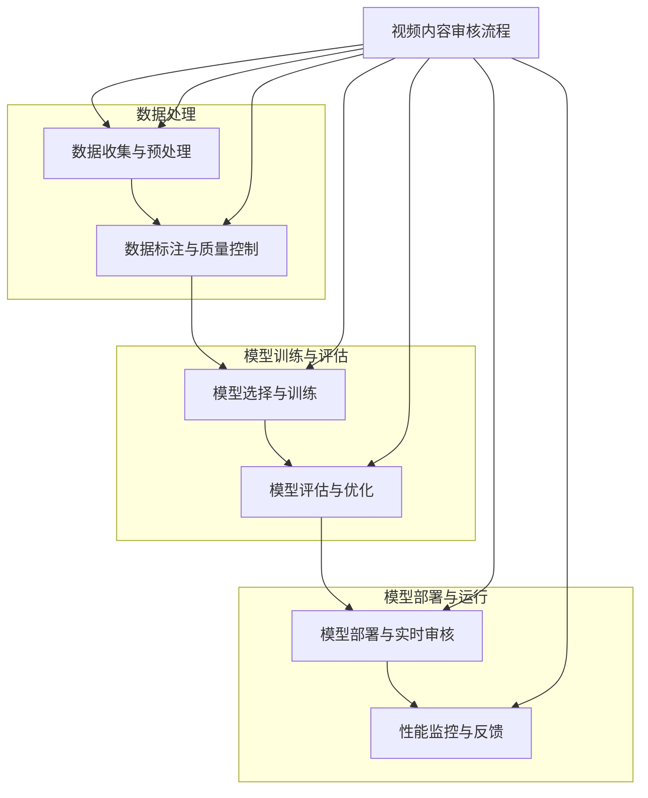

                 

# 文章标题

《深度学习在视频内容审核中的最新进展》

## 关键词

深度学习、视频内容审核、算法原理、应用案例、研究动态、前沿技术、未来展望、伦理与社会影响、实践指南、开源资源

## 摘要

随着互联网的快速发展，视频内容审核成为网络社交、在线视频平台和智能监控系统等领域的核心挑战。本文系统介绍了深度学习在视频内容审核中的应用，从基础概念、算法原理到最新研究动态和前沿技术，全面分析了深度学习在视频内容审核中的技术进展和未来发展方向。文章还探讨了深度学习在视频内容审核中的伦理问题和社会影响，提供了实践指南和开源资源，旨在为相关领域的研究者和从业者提供有价值的参考。

# 《深度学习在视频内容审核中的最新进展》目录大纲

## 第一部分：深度学习与视频内容审核基础

### 第1章：深度学习概述

#### 1.1 深度学习的核心概念

##### 1.1.1 深度学习的基础原理
深度学习（Deep Learning）是一种基于人工神经网络的机器学习技术，通过模拟人脑神经网络结构，实现自动特征提取和复杂模式识别。深度学习的基础原理主要基于以下几个核心概念：

1. **神经网络（Neural Networks）**：神经网络由大量神经元（或节点）组成，每个神经元通过权重连接其他神经元，通过前向传播和反向传播算法进行训练和预测。
   
   $$\text{前向传播：} z = w \cdot x + b$$
   $$\text{反向传播：} \Delta w = \frac{\partial E}{\partial w}$$
   
2. **激活函数（Activation Functions）**：激活函数用于引入非线性，使得神经网络可以学习复杂函数。常见的激活函数包括Sigmoid、ReLU、Tanh等。
   
   $$\text{ReLU:} f(x) = \max(0, x)$$

3. **多层网络（Multi-Layer Networks）**：深度学习通过增加网络层数，提高模型的表达能力。多层网络可以自动提取不同层次的特征，实现从原始数据到高阶抽象的转换。

4. **优化算法（Optimization Algorithms）**：深度学习的训练过程通常涉及大量的参数优化。常见的优化算法有梯度下降（Gradient Descent）、随机梯度下降（Stochastic Gradient Descent，SGD）和Adam等。

##### 1.1.2 深度学习的主要架构

深度学习的架构主要包括以下几种：

1. **卷积神经网络（Convolutional Neural Networks，CNN）**：CNN主要用于图像识别和图像处理。通过卷积操作和池化操作，CNN可以自动提取图像中的局部特征。

2. **循环神经网络（Recurrent Neural Networks，RNN）**：RNN适用于处理序列数据，如文本和语音。通过循环连接，RNN可以捕捉序列中的长期依赖关系。

3. **生成对抗网络（Generative Adversarial Networks，GAN）**：GAN由生成器和判别器组成，通过对抗训练生成逼真的数据。

4. **变分自编码器（Variational Autoencoder，VAE）**：VAE是一种无监督学习模型，通过编码器和解码器学习数据的概率分布。

##### 1.1.3 深度学习的发展历史

深度学习的发展可以追溯到20世纪40年代，但直到近年来才取得突破性进展。以下是深度学习的发展历史：

1. **早期探索（1940s-1980s）**：神经网络的概念首次由McCulloch和Pitts在1943年提出。此后，Hebb在1949年提出了Hebbian学习规则，Hodgkin和Huxley在1952年揭示了神经元的电活动机制。

2. **复兴期（1990s-2000s）**：随着计算机性能的提升和大数据的出现，深度学习在图像识别和语音识别领域取得了显著进展。Hinton在2006年提出了深层信念网络（DBN），开启了深度学习的复兴之路。

3. **快速增长期（2010s-2020s）**：深度学习在计算机视觉、自然语言处理、语音识别等领域取得了突破性成果，如ImageNet图像识别挑战赛和语音识别的错误率大幅下降。

#### 1.2 视频内容审核的重要性

##### 1.2.1 社交媒体上的视频内容现状

社交媒体平台上的视频内容丰富多样，但同时也存在着大量不良信息。以下是一些主要问题：

1. **不良内容**：包括暴力、色情、仇恨言论等。
2. **版权问题**：未经授权的版权内容广泛传播。
3. **隐私泄露**：用户隐私数据被恶意利用。

##### 1.2.2 视频内容审核的需求与挑战

视频内容审核的需求主要包括：

1. **保护用户**：防止用户接触到不良信息，保护未成年人等。
2. **维护平台声誉**：减少不良信息传播，维护平台的健康生态。

视频内容审核面临的挑战：

1. **内容多样性**：视频内容形式多样，需要准确识别不同类型的不良信息。
2. **实时性**：需要快速处理大量视频内容，保证实时审核。
3. **准确性**：避免误判和漏判，提高审核的准确性。

## 第二部分：深度学习在视频内容审核中的应用

### 第2章：深度学习在视频内容审核中的应用

#### 2.1 视频内容审核的算法原理

##### 2.1.1 视频特征提取

视频特征提取是视频内容审核的基础，它将原始视频数据转换为可由深度学习模型处理的特征表示。常用的视频特征提取方法包括：

1. **视觉特征提取**：利用卷积神经网络（CNN）提取视频帧的视觉特征。常见的模型有C3D、I3D等。
2. **音频特征提取**：利用循环神经网络（RNN）提取视频音频特征。常用的模型有GRU、LSTM等。
3. **多模态特征融合**：将视觉特征和音频特征融合，提高模型对视频内容的理解能力。

##### 2.1.2 视频分类算法

视频分类算法用于判断视频内容的类别。常见的分类算法包括：

1. **朴素贝叶斯（Naive Bayes）**：基于概率模型进行分类。
2. **支持向量机（SVM）**：通过最大间隔分类器进行分类。
3. **深度神经网络（Deep Neural Networks，DNN）**：利用多层感知机（MLP）进行分类。

##### 2.1.3 视频内容审核的关键技术

视频内容审核的关键技术主要包括：

1. **监督学习**：利用已标注的样本数据进行模型训练，提高分类准确性。
2. **无监督学习**：利用未标注的样本数据，通过聚类等方法进行特征提取和分类。
3. **半监督学习**：结合标注数据和未标注数据，提高模型的泛化能力。
4. **迁移学习**：利用在大型数据集上预训练的模型，提高小样本数据下的分类性能。

#### 2.2 深度学习在视频内容审核中的应用案例

##### 2.2.1 主流视频内容审核模型

目前主流的视频内容审核模型主要包括：

1. **FaceNet**：用于人脸识别的深度学习模型，可以用于检测视频中的不良内容。
2. **YOLO（You Only Look Once）**：一种快速目标检测模型，可以实时检测视频中的不良内容。
3. **Mask R-CNN**：一种基于CNN的目标检测模型，可以用于视频内容分类和审核。

##### 2.2.2 案例分析：深度学习在社交媒体中的应用

以某社交媒体平台为例，深度学习在视频内容审核中的应用如下：

1. **数据准备**：收集并标注大量视频数据，用于模型训练和测试。
2. **特征提取**：利用C3D模型提取视频帧的视觉特征，利用GRU模型提取视频音频特征。
3. **模型训练**：使用Mask R-CNN模型进行训练，通过多模态特征融合，提高分类准确性。
4. **实时审核**：将训练好的模型部署到线上服务器，实时处理用户上传的视频内容，进行内容审核。

##### 2.2.3 深度学习在视频内容审核中的未来趋势

随着深度学习技术的不断发展，视频内容审核将在以下方面取得进展：

1. **实时性**：利用高效的模型结构和算法，提高审核速度，满足实时需求。
2. **准确性**：通过增加数据量和模型复杂度，提高分类准确性，减少误判和漏判。
3. **多样性**：支持多种类型的不良内容检测，如暴力、色情、仇恨言论等。
4. **跨领域与跨语言**：适应不同领域的视频内容审核需求，支持多语言的视频内容审核。

## 第二部分：深度学习在视频内容审核中的应用

### 第2章：深度学习在视频内容审核中的应用

#### 2.1 视频内容审核的算法原理

##### 2.1.1 视频特征提取

视频内容审核的关键在于对视频数据进行特征提取，以便深度学习模型能够对其进行处理。视频特征提取主要包括视觉特征和音频特征的提取。

1. **视觉特征提取**：
   - 视觉特征提取通常使用卷积神经网络（CNN）。
   - CNN通过多个卷积层和池化层提取图像的层次特征。
   - 例如，C3D模型是一个用于视频特征提取的经典模型，它通过堆叠多个卷积层来提取视频序列中的时空特征。

2. **音频特征提取**：
   - 音频特征提取通常使用循环神经网络（RNN）。
   - RNN通过其循环结构能够捕捉音频信号的序列特征。
   - 例如，GRU和LSTM是RNN的变体，它们在音频特征提取中表现出色。

3. **多模态特征融合**：
   - 将视觉特征和音频特征进行融合，可以提高模型的泛化能力和分类准确性。
   - 多模态特征融合的方法包括直接融合和级联融合。
   - 直接融合是将视觉特征和音频特征拼接在一起作为输入；级联融合是先分别处理视觉和音频特征，然后将处理结果进行结合。

##### 2.1.2 视频分类算法

视频分类是视频内容审核的核心任务，目的是将视频数据分类到预定义的类别中。深度学习在视频分类中发挥了重要作用，以下是几种常见的视频分类算法：

1. **朴素贝叶斯分类器**：
   - 基于贝叶斯定理的概率模型，适用于简单的特征提取问题。
   - 它假设特征之间相互独立，因此在处理复杂视频数据时效果有限。

2. **支持向量机（SVM）**：
   - 基于最大间隔分类器，通过寻找决策超平面来分隔不同类别的数据点。
   - SVM在处理高维数据时效果较好，但在处理视频数据时可能需要大量的计算资源。

3. **深度神经网络（DNN）**：
   - DNN是一种多层感知机，通过逐层提取特征来学习复杂的非线性关系。
   - DNN在视频分类中表现出色，特别是当使用卷积层（CNN）来提取图像特征时。

4. **卷积神经网络（CNN）**：
   - CNN是专门用于图像和视频处理的深度学习模型。
   - CNN通过卷积层、池化层和全连接层来提取图像的层次特征。
   - 例如，C3D和I3D是用于视频分类的CNN模型，它们能够有效提取视频序列的时空特征。

5. **循环神经网络（RNN）**：
   - RNN是一种处理序列数据的深度学习模型。
   - RNN通过其循环结构能够捕捉视频数据的序列特征。
   - GRU和LSTM是RNN的变体，它们在视频分类中表现出色。

6. **长短期记忆网络（LSTM）**：
   - LSTM是RNN的一种变体，通过其门控机制能够学习长期依赖关系。
   - LSTM在视频分类中能够有效捕捉视频数据的长期特征。

##### 2.1.3 视频内容审核的关键技术

视频内容审核的关键技术包括以下几个方面：

1. **监督学习**：
   - 监督学习是一种基于已标注数据进行训练的机器学习技术。
   - 在视频内容审核中，监督学习通过大量已标注的视频数据训练模型，从而提高分类的准确性。

2. **无监督学习**：
   - 无监督学习是一种不依赖于已标注数据的学习技术。
   - 在视频内容审核中，无监督学习可以用于特征提取和聚类，帮助模型发现潜在的特征模式。

3. **半监督学习**：
   - 半监督学习结合了监督学习和无监督学习的优势。
   - 在视频内容审核中，半监督学习利用少量标注数据和大量未标注数据，从而提高模型的泛化能力。

4. **迁移学习**：
   - 迁移学习是一种利用预训练模型进行微调的技术。
   - 在视频内容审核中，迁移学习可以显著提高小样本数据下的模型性能。

#### 2.2 深度学习在视频内容审核中的应用案例

##### 2.2.1 主流视频内容审核模型

目前主流的视频内容审核模型包括以下几种：

1. **FaceNet**：
   - FaceNet是一种用于人脸识别的深度学习模型，它可以用于检测视频中的不良内容，如暴力或色情视频。
   - FaceNet通过学习人脸的嵌入向量来实现对人脸的精确识别。

2. **YOLO（You Only Look Once）**：
   - YOLO是一种快速目标检测模型，它可以实时检测视频中的目标区域，从而用于视频内容审核。
   - YOLO通过将目标检测问题转化为一个单步处理的过程，从而提高了检测速度。

3. **Mask R-CNN**：
   - Mask R-CNN是一种基于CNN的目标检测模型，它可以用于视频内容分类和审核。
   - Mask R-CNN通过其独特的体系结构，可以实现目标检测和实例分割，从而对视频内容进行细致的审核。

##### 2.2.2 案例分析：深度学习在社交媒体中的应用

以下是一个深度学习在社交媒体中应用的视频内容审核案例：

1. **数据准备**：
   - 收集并标注大量视频数据，用于模型的训练和测试。
   - 数据集应包含多种类型的不良内容，如暴力、色情、仇恨言论等。

2. **特征提取**：
   - 使用C3D模型提取视频帧的视觉特征。
   - 使用GRU模型提取视频音频特征。

3. **模型训练**：
   - 使用Mask R-CNN模型进行训练。
   - 通过多模态特征融合，提高分类准确性。

4. **实时审核**：
   - 将训练好的模型部署到线上服务器，实时处理用户上传的视频内容，进行内容审核。

##### 2.2.3 深度学习在视频内容审核中的未来趋势

深度学习在视频内容审核中的应用将不断推进，未来趋势包括：

1. **实时性**：
   - 优化模型结构和算法，提高实时审核速度。

2. **准确性**：
   - 通过增加数据量和模型复杂度，提高分类准确性。

3. **多样性**：
   - 支持多种类型的不良内容检测，如暴力、色情、仇恨言论等。

4. **跨领域与跨语言**：
   - 适应不同领域的视频内容审核需求，支持多语言的视频内容审核。

## 第二部分：深度学习在视频内容审核中的应用

### 第2章：深度学习在视频内容审核中的应用

#### 2.1 视频内容审核的算法原理

##### 2.1.1 视频特征提取

视频内容审核的核心在于对视频数据进行有效的特征提取，以便深度学习模型能够对其进行分类和检测。视频特征提取通常涉及视觉特征和音频特征的提取，以及两者的结合。

1. **视觉特征提取**：
   - 视觉特征提取主要利用卷积神经网络（CNN）来实现。CNN通过一系列卷积层、池化层和全连接层，逐层提取视频帧中的低级到高级的特征。
   - 例如，C3D模型是一个经典的用于视频特征提取的卷积神经网络，它通过堆叠多个卷积层来提取视频序列中的时空特征。

2. **音频特征提取**：
   - 音频特征提取主要利用循环神经网络（RNN），尤其是长短期记忆网络（LSTM）或门控循环单元（GRU）来实现。RNN通过其循环结构，能够有效地捕捉音频信号的时序特征。
   - 例如，GRU模型可以用于提取视频中的音频特征，通过处理音频信号的不同时间步，从而提取出与视频内容相关的音频特征。

3. **多模态特征融合**：
   - 将视觉特征和音频特征进行融合，可以显著提高模型对视频内容的理解和分类能力。多模态特征融合的方法包括直接拼接、特征级融合和决策级融合。
   - 直接拼接是将视觉特征和音频特征直接连接在一起作为模型的输入；特征级融合是在特征提取层面对视觉和音频特征进行融合；决策级融合是在分类层面对不同模态的特征结果进行融合。

##### 2.1.2 视频分类算法

视频分类算法用于将视频数据分类到预定义的类别中，如暴力、色情、广告等。深度学习提供了多种强大的视频分类算法，以下是其中一些常用的算法：

1. **朴素贝叶斯（Naive Bayes）分类器**：
   - 朴素贝叶斯是一种基于概率的简单分类算法，它假设特征之间相互独立。虽然朴素贝叶斯在处理高维数据时效果有限，但在某些特定场景下仍然有其应用价值。

2. **支持向量机（SVM）**：
   - 支持向量机是一种基于最大间隔分类器的算法，通过寻找最佳决策边界来分隔不同类别的数据点。SVM在高维空间中表现良好，但在视频分类中，其计算复杂度较高。

3. **深度神经网络（DNN）**：
   - 深度神经网络是一种多层感知机，通过逐层提取特征来学习复杂的非线性关系。DNN在视频分类中表现出色，尤其是当使用卷积层（CNN）来提取图像特征时。

4. **卷积神经网络（CNN）**：
   - CNN是专门用于图像和视频处理的深度学习模型，通过卷积层、池化层和全连接层来提取图像的层次特征。CNN在视频分类中具有强大的能力，能够自动提取视频帧中的关键特征。

5. **循环神经网络（RNN）**：
   - RNN是一种处理序列数据的深度学习模型，通过其循环结构能够捕捉视频数据的时序特征。RNN在视频分类中表现出色，尤其是当使用LSTM或GRU来处理时序特征时。

6. **长短期记忆网络（LSTM）**：
   - LSTM是RNN的一种变体，通过其门控机制能够学习长期依赖关系。LSTM在视频分类中能够有效地捕捉视频数据的长期特征，从而提高分类的准确性。

##### 2.1.3 视频内容审核的关键技术

视频内容审核的关键技术包括以下几个方面：

1. **监督学习**：
   - 监督学习是一种基于已标注数据训练模型的机器学习技术。在视频内容审核中，通过大量已标注的视频数据训练模型，可以提高分类的准确性。

2. **无监督学习**：
   - 无监督学习是一种不依赖于已标注数据的机器学习技术。在视频内容审核中，无监督学习可以用于特征提取和聚类，帮助模型发现潜在的特征模式。

3. **半监督学习**：
   - 半监督学习结合了监督学习和无监督学习的优势。在视频内容审核中，半监督学习利用少量标注数据和大量未标注数据，从而提高模型的泛化能力。

4. **迁移学习**：
   - 迁移学习是一种利用预训练模型进行微调的技术。在视频内容审核中，通过迁移学习可以显著提高小样本数据下的模型性能。

#### 2.2 深度学习在视频内容审核中的应用案例

##### 2.2.1 主流视频内容审核模型

目前，主流的视频内容审核模型包括以下几种：

1. **FaceNet**：
   - FaceNet是一种用于人脸识别的深度学习模型，它可以用于检测视频中的不良内容，如暴力或色情视频。FaceNet通过学习人脸的嵌入向量来实现对人脸的精确识别。

2. **YOLO（You Only Look Once）**：
   - YOLO是一种快速目标检测模型，它可以实时检测视频中的目标区域，从而用于视频内容审核。YOLO通过将目标检测问题转化为一个单步处理的过程，从而提高了检测速度。

3. **Mask R-CNN**：
   - Mask R-CNN是一种基于CNN的目标检测模型，它可以用于视频内容分类和审核。Mask R-CNN通过其独特的体系结构，可以实现目标检测和实例分割，从而对视频内容进行细致的审核。

##### 2.2.2 案例分析：深度学习在社交媒体中的应用

以下是一个深度学习在社交媒体中应用的视频内容审核案例：

1. **数据准备**：
   - 收集并标注大量视频数据，用于模型的训练和测试。数据集应包含多种类型的不良内容，如暴力、色情、仇恨言论等。

2. **特征提取**：
   - 使用C3D模型提取视频帧的视觉特征。
   - 使用GRU模型提取视频音频特征。

3. **模型训练**：
   - 使用Mask R-CNN模型进行训练。
   - 通过多模态特征融合，提高分类准确性。

4. **实时审核**：
   - 将训练好的模型部署到线上服务器，实时处理用户上传的视频内容，进行内容审核。

##### 2.2.3 深度学习在视频内容审核中的未来趋势

深度学习在视频内容审核中的应用将不断推进，未来趋势包括：

1. **实时性**：
   - 优化模型结构和算法，提高实时审核速度。

2. **准确性**：
   - 通过增加数据量和模型复杂度，提高分类准确性。

3. **多样性**：
   - 支持多种类型的不良内容检测，如暴力、色情、仇恨言论等。

4. **跨领域与跨语言**：
   - 适应不同领域的视频内容审核需求，支持多语言的视频内容审核。

## 第二部分：深度学习在视频内容审核中的应用

### 第2章：深度学习在视频内容审核中的应用

#### 2.1 视频内容审核的算法原理

##### 2.1.1 视频特征提取

视频内容审核的关键在于对视频数据进行有效的特征提取，以便深度学习模型能够对其进行分类和检测。视频特征提取通常涉及视觉特征和音频特征的提取，以及两者的结合。

1. **视觉特征提取**：
   - 视觉特征提取主要利用卷积神经网络（CNN）来实现。CNN通过一系列卷积层、池化层和全连接层，逐层提取视频帧中的低级到高级的特征。
   - 例如，C3D模型是一个经典的用于视频特征提取的卷积神经网络，它通过堆叠多个卷积层来提取视频序列中的时空特征。

2. **音频特征提取**：
   - 音频特征提取主要利用循环神经网络（RNN），尤其是长短期记忆网络（LSTM）或门控循环单元（GRU）来实现。RNN通过其循环结构，能够有效地捕捉音频信号的时序特征。
   - 例如，GRU模型可以用于提取视频中的音频特征，通过处理音频信号的不同时间步，从而提取出与视频内容相关的音频特征。

3. **多模态特征融合**：
   - 将视觉特征和音频特征进行融合，可以显著提高模型对视频内容的理解和分类能力。多模态特征融合的方法包括直接拼接、特征级融合和决策级融合。
   - 直接拼接是将视觉特征和音频特征直接连接在一起作为模型的输入；特征级融合是在特征提取层面对视觉和音频特征进行融合；决策级融合是在分类层面对不同模态的特征结果进行融合。

##### 2.1.2 视频分类算法

视频分类算法用于将视频数据分类到预定义的类别中，如暴力、色情、广告等。深度学习提供了多种强大的视频分类算法，以下是其中一些常用的算法：

1. **朴素贝叶斯（Naive Bayes）分类器**：
   - 朴素贝叶斯是一种基于概率的简单分类算法，它假设特征之间相互独立。虽然朴素贝叶斯在处理高维数据时效果有限，但在某些特定场景下仍然有其应用价值。

2. **支持向量机（SVM）**：
   - 支持向量机是一种基于最大间隔分类器的算法，通过寻找最佳决策边界来分隔不同类别的数据点。SVM在高维空间中表现良好，但在视频分类中，其计算复杂度较高。

3. **深度神经网络（DNN）**：
   - 深度神经网络是一种多层感知机，通过逐层提取特征来学习复杂的非线性关系。DNN在视频分类中表现出色，尤其是当使用卷积层（CNN）来提取图像特征时。

4. **卷积神经网络（CNN）**：
   - CNN是专门用于图像和视频处理的深度学习模型，通过卷积层、池化层和全连接层来提取图像的层次特征。CNN在视频分类中具有强大的能力，能够自动提取视频帧中的关键特征。

5. **循环神经网络（RNN）**：
   - RNN是一种处理序列数据的深度学习模型，通过其循环结构能够捕捉视频数据的时序特征。RNN在视频分类中表现出色，尤其是当使用LSTM或GRU来处理时序特征时。

6. **长短期记忆网络（LSTM）**：
   - LSTM是RNN的一种变体，通过其门控机制能够学习长期依赖关系。LSTM在视频分类中能够有效地捕捉视频数据的长期特征，从而提高分类的准确性。

##### 2.1.3 视频内容审核的关键技术

视频内容审核的关键技术包括以下几个方面：

1. **监督学习**：
   - 监督学习是一种基于已标注数据训练模型的机器学习技术。在视频内容审核中，通过大量已标注的视频数据训练模型，可以提高分类的准确性。

2. **无监督学习**：
   - 无监督学习是一种不依赖于已标注数据的机器学习技术。在视频内容审核中，无监督学习可以用于特征提取和聚类，帮助模型发现潜在的特征模式。

3. **半监督学习**：
   - 半监督学习结合了监督学习和无监督学习的优势。在视频内容审核中，半监督学习利用少量标注数据和大量未标注数据，从而提高模型的泛化能力。

4. **迁移学习**：
   - 迁移学习是一种利用预训练模型进行微调的技术。在视频内容审核中，通过迁移学习可以显著提高小样本数据下的模型性能。

#### 2.2 深度学习在视频内容审核中的应用案例

##### 2.2.1 主流视频内容审核模型

目前，主流的视频内容审核模型包括以下几种：

1. **FaceNet**：
   - FaceNet是一种用于人脸识别的深度学习模型，它可以用于检测视频中的不良内容，如暴力或色情视频。FaceNet通过学习人脸的嵌入向量来实现对人脸的精确识别。

2. **YOLO（You Only Look Once）**：
   - YOLO是一种快速目标检测模型，它可以实时检测视频中的目标区域，从而用于视频内容审核。YOLO通过将目标检测问题转化为一个单步处理的过程，从而提高了检测速度。

3. **Mask R-CNN**：
   - Mask R-CNN是一种基于CNN的目标检测模型，它可以用于视频内容分类和审核。Mask R-CNN通过其独特的体系结构，可以实现目标检测和实例分割，从而对视频内容进行细致的审核。

##### 2.2.2 案例分析：深度学习在社交媒体中的应用

以下是一个深度学习在社交媒体中应用的视频内容审核案例：

1. **数据准备**：
   - 收集并标注大量视频数据，用于模型的训练和测试。数据集应包含多种类型的不良内容，如暴力、色情、仇恨言论等。

2. **特征提取**：
   - 使用C3D模型提取视频帧的视觉特征。
   - 使用GRU模型提取视频音频特征。

3. **模型训练**：
   - 使用Mask R-CNN模型进行训练。
   - 通过多模态特征融合，提高分类准确性。

4. **实时审核**：
   - 将训练好的模型部署到线上服务器，实时处理用户上传的视频内容，进行内容审核。

##### 2.2.3 深度学习在视频内容审核中的未来趋势

深度学习在视频内容审核中的应用将不断推进，未来趋势包括：

1. **实时性**：
   - 优化模型结构和算法，提高实时审核速度。

2. **准确性**：
   - 通过增加数据量和模型复杂度，提高分类准确性。

3. **多样性**：
   - 支持多种类型的不良内容检测，如暴力、色情、仇恨言论等。

4. **跨领域与跨语言**：
   - 适应不同领域的视频内容审核需求，支持多语言的视频内容审核。

## 第二部分：深度学习在视频内容审核中的应用

### 第3章：深度学习在视频内容审核中的最新研究动态

#### 3.1 深度学习在视频内容审核中的新算法

随着深度学习技术的不断进步，研究人员提出了许多新的算法来提升视频内容审核的性能。以下是几个在视频内容审核中具有代表性的新算法：

##### 3.1.1 注意力机制在视频内容审核中的应用

注意力机制（Attention Mechanism）是一种能够提高模型对关键信息关注度的技术，在视频内容审核中表现出色。注意力机制通过学习不同视频片段的重要程度，帮助模型更好地识别和分类视频内容。

1. **多任务学习（Multi-Task Learning）**：
   - 多任务学习是一种将多个相关任务同时训练的方法，有助于模型在不同任务之间共享知识，提高整体性能。
   - 在视频内容审核中，多任务学习可以同时处理多种类型的不良内容，如暴力、色情、仇恨言论等，从而提高模型的泛化能力。

2. **分层注意力模型（Hierarchical Attention Model）**：
   - 分层注意力模型通过多层注意力机制，逐层提取视频中的关键特征，从而提高模型对视频内容的理解和分类能力。
   - 这种模型可以捕捉视频中的全局和局部特征，提高分类的准确性。

3. **自注意力机制（Self-Attention Mechanism）**：
   - 自注意力机制通过将视频序列中的每个时间步都与所有其他时间步进行关联，从而提高模型对时间序列数据的建模能力。
   - 在视频内容审核中，自注意力机制可以帮助模型更好地捕捉视频中的关键帧和事件，提高分类的准确性。

##### 3.1.2 图神经网络在视频内容审核中的应用

图神经网络（Graph Neural Networks，GNN）是一种基于图结构数据进行学习的深度学习模型，在视频内容审核中也取得了显著进展。

1. **图卷积网络（Graph Convolutional Network，GCN）**：
   - 图卷积网络通过卷积操作在图结构上提取特征，从而实现对图数据的建模。
   - 在视频内容审核中，GCN可以将视频帧视为图节点，通过图卷积操作提取视频帧之间的关联特征，从而提高模型的分类性能。

2. **图注意力网络（Graph Attention Network，GAT）**：
   - 图注意力网络通过学习节点之间的相对重要性，对图数据进行加权处理。
   - 在视频内容审核中，GAT可以更好地捕捉视频帧之间的关联特征，提高分类的准确性。

3. **图自编码器（Graph Autoencoder）**：
   - 图自编码器通过编码器和解码器学习图数据的嵌入表示，从而实现对图数据的降维和特征提取。
   - 在视频内容审核中，图自编码器可以帮助模型更好地理解视频数据，提高分类和检测性能。

##### 3.1.3 强化学习在视频内容审核中的应用

强化学习（Reinforcement Learning，RL）是一种通过与环境交互来学习策略的机器学习技术，在视频内容审核中也表现出巨大潜力。

1. **深度确定性策略梯度（Deep Deterministic Policy Gradient，DDPG）**：
   - DDPG是一种基于深度神经网络的价值函数估计和策略优化的强化学习算法。
   - 在视频内容审核中，DDPG可以通过与环境交互来学习最优的审核策略，从而提高模型的审核性能。

2. **策略梯度（Policy Gradient）**：
   - 策略梯度方法通过优化策略函数来学习最优的决策策略。
   - 在视频内容审核中，策略梯度方法可以帮助模型学习到如何平衡审核速度和准确性，提高整体的审核效果。

3. **对抗性生成网络（Adversarial Generative Network，AGN）**：
   - 对抗性生成网络通过生成器和判别器的对抗训练，学习到数据分布和生成高质量的数据。
   - 在视频内容审核中，AGN可以帮助模型生成高质量的负面示例，从而提高模型的鲁棒性和泛化能力。

#### 3.2 深度学习在视频内容审核中的新挑战

尽管深度学习在视频内容审核中取得了显著进展，但仍面临着一些新的挑战：

##### 3.2.1 模型复杂性与效率的平衡

随着模型复杂性的增加，模型的计算成本和训练时间也会显著增加。如何在保证模型性能的同时，降低模型的复杂性和提高效率，是一个重要的挑战。

1. **模型压缩（Model Compression）**：
   - 模型压缩技术，如模型剪枝（Model Pruning）和量化（Quantization），可以显著减少模型的参数数量和计算成本。
   - 在视频内容审核中，模型压缩技术可以帮助模型在移动设备和嵌入式系统中部署，提高审核的实时性。

2. **分布式训练（Distributed Training）**：
   - 分布式训练技术可以将模型训练任务分布到多台设备上，从而提高训练效率。
   - 在视频内容审核中，分布式训练可以帮助研究人员处理大量数据，提高模型的训练速度和性能。

##### 3.2.2 模型解释性与透明性

深度学习模型通常被视为“黑盒”，其内部决策过程难以解释。这给视频内容审核带来了挑战，特别是在需要解释和透明度的应用场景中。

1. **可解释性模型（Explainable AI，XAI）**：
   - 可解释性模型旨在提高深度学习模型的透明性和可解释性，帮助用户理解模型的决策过程。
   - 在视频内容审核中，可解释性模型可以帮助用户理解模型为何做出特定决策，从而提高用户对审核结果的信任度。

2. **可视化技术（Visualization Techniques）**：
   - 可视化技术可以通过图形化方式展示模型的决策过程，帮助用户更好地理解模型的内部工作原理。
   - 在视频内容审核中，可视化技术可以帮助用户查看模型的激活特征和注意力分布，从而更好地理解模型如何处理视频数据。

##### 3.2.3 跨领域与跨语言的视频内容审核

视频内容审核的需求在多个领域和不同语言中都有应用，这给深度学习模型提出了新的挑战。

1. **跨领域迁移学习（Cross-Domain Transfer Learning）**：
   - 跨领域迁移学习通过利用不同领域的知识，提高模型在未知领域的表现。
   - 在视频内容审核中，跨领域迁移学习可以帮助模型在不同领域的视频内容审核中取得更好的性能。

2. **跨语言迁移学习（Cross-Lingual Transfer Learning）**：
   - 跨语言迁移学习通过在不同语言中共享知识，提高模型在不同语言环境中的性能。
   - 在视频内容审核中，跨语言迁移学习可以帮助模型处理多语言视频内容，提高审核的准确性和一致性。

### 第4章：深度学习在视频内容审核中的前沿技术

#### 4.1 基于深度学习的视频内容审核平台搭建

随着深度学习在视频内容审核中的应用越来越广泛，构建一个高效、可扩展的视频内容审核平台成为了一个重要课题。以下是构建基于深度学习的视频内容审核平台的几个关键步骤：

##### 4.1.1 开发环境的准备

1. **硬件资源准备**：
   - 准备足够的计算资源，如GPU或TPU，用于模型训练和推理。
   - 确保硬件资源可以支持大规模的数据处理和模型训练。

2. **软件环境搭建**：
   - 安装深度学习框架，如TensorFlow、PyTorch等。
   - 配置必要的库和依赖，如NumPy、Pandas等。

3. **数据管理**：
   - 建立数据存储和管理系统，如HDFS、Cassandra等。
   - 确保数据可以高效地读取和处理，以满足模型训练的需求。

##### 4.1.2 视频内容审核模型的训练与部署

1. **模型训练**：
   - 使用已标注的数据集训练深度学习模型。
   - 通过调整超参数和模型结构，优化模型性能。

2. **模型评估**：
   - 使用验证集评估模型性能，调整模型以减少误判和漏判。

3. **模型部署**：
   - 将训练好的模型部署到线上服务器，进行实时视频内容审核。
   - 使用API或其他接口，将模型与业务系统集成。

##### 4.1.3 视频内容审核平台的优化与性能分析

1. **性能优化**：
   - 通过模型压缩和量化技术，减少模型的计算复杂度和内存占用。
   - 调整模型结构和超参数，以提高模型的实时处理能力。

2. **性能分析**：
   - 监控模型的准确率、召回率、F1分数等指标，评估模型性能。
   - 分析模型在不同场景下的表现，发现并解决性能瓶颈。

3. **安全性与可靠性**：
   - 确保模型和平台的安全性，防止数据泄露和恶意攻击。
   - 提高系统的可靠性，确保视频内容审核的稳定运行。

#### 4.2 深度学习在视频内容审核中的实际应用案例

##### 4.2.1 案例一：社交媒体平台的内容审核

1. **需求分析**：
   - 社交媒体平台需要快速、准确地审核用户上传的视频内容，防止不良信息传播。

2. **解决方案**：
   - 使用基于深度学习的视频内容审核模型，对用户上传的视频内容进行实时审核。
   - 结合视觉和音频特征，提高分类的准确性和鲁棒性。

3. **实施效果**：
   - 显著减少了不良内容的传播，提高了平台的用户体验和安全性。

##### 4.2.2 案例二：在线视频平台的版权保护

1. **需求分析**：
   - 在线视频平台需要保护原创内容，防止未经授权的版权内容传播。

2. **解决方案**：
   - 使用基于深度学习的版权保护模型，检测和识别视频中的版权内容。
   - 结合图像和音频特征，提高检测的准确性和实时性。

3. **实施效果**：
   - 有效保护了原创内容，提高了版权保护的效果和用户体验。

##### 4.2.3 案例三：智能监控系统的异常行为检测

1. **需求分析**：
   - 智能监控系统需要检测和识别异常行为，如暴力事件、入侵等。

2. **解决方案**：
   - 使用基于深度学习的异常行为检测模型，对监控视频进行实时分析。
   - 结合视觉和音频特征，提高异常行为的识别准确性和实时性。

3. **实施效果**：
   - 显著提高了异常行为检测的准确率和响应速度，增强了系统的安全性和可靠性。

### 第5章：深度学习在视频内容审核中的未来展望

#### 5.1 深度学习在视频内容审核中的发展趋势

随着深度学习技术的不断进步，视频内容审核将在以下几个方面取得发展：

1. **实时性提升**：
   - 随着硬件性能的提升和模型压缩技术的应用，深度学习模型在视频内容审核中的实时性将得到显著提高，满足实时审核的需求。

2. **准确性提高**：
   - 通过增加数据量和模型复杂度，以及引入先进的算法和技术，视频内容审核的准确性将不断提高，减少误判和漏判。

3. **多样性支持**：
   - 深度学习模型将能够处理更多类型的视频内容，如跨领域和跨语言的视频内容审核，满足不同应用场景的需求。

4. **个性化审核**：
   - 通过结合用户行为数据和视频内容特征，实现个性化审核，提高用户体验和满意度。

#### 5.1.1 深度学习在视频内容审核中的技术路线图

以下是一个可能的深度学习在视频内容审核中的技术路线图：

1. **数据收集与标注**：
   - 收集大量高质量的标注数据，为模型训练提供基础。

2. **模型研发与优化**：
   - 研发先进的深度学习模型，如基于CNN、RNN和GAN的模型。
   - 优化模型结构，提高模型的准确性和实时性。

3. **模型训练与部署**：
   - 使用标注数据训练模型，并进行性能评估和调优。
   - 将训练好的模型部署到线上服务器，进行实时视频内容审核。

4. **性能监控与反馈**：
   - 监控模型的性能指标，收集用户反馈，不断优化模型和审核流程。

5. **安全与隐私保护**：
   - 确保模型和平台的安全性，保护用户隐私和数据安全。

#### 5.1.2 深度学习在视频内容审核中的应用前景

深度学习在视频内容审核中的应用前景广阔，以下是一些潜在的应用领域：

1. **社交媒体内容审核**：
   - 社交媒体平台将深度学习应用于视频内容审核，提高审核的准确性和实时性，减少不良信息的传播。

2. **在线视频平台版权保护**：
   - 在线视频平台利用深度学习技术检测和识别未经授权的版权内容，保护原创内容。

3. **智能监控系统**：
   - 智能监控系统使用深度学习技术进行实时异常行为检测，提高监控系统的安全性和可靠性。

4. **教育与培训**：
   - 教育和培训机构利用深度学习技术进行视频内容审核，确保教学内容的规范性和安全性。

#### 5.1.3 深度学习在视频内容审核中的潜在挑战与解决方案

虽然深度学习在视频内容审核中具有巨大潜力，但仍面临一些挑战：

1. **数据标注成本高**：
   - 数据标注是深度学习模型训练的基础，但标注过程耗时耗力，成本高。
   - 解决方案：利用半监督学习和数据增强技术，减少对标注数据的依赖。

2. **模型可解释性不足**：
   - 深度学习模型通常被视为“黑盒”，其内部决策过程难以解释。
   - 解决方案：开发可解释性模型和可视化技术，提高模型的透明性和可解释性。

3. **跨领域与跨语言挑战**：
   - 深度学习模型在不同领域和不同语言中的性能可能存在差异。
   - 解决方案：利用跨领域和跨语言迁移学习技术，提高模型的泛化能力。

4. **隐私保护**：
   - 视频内容审核涉及用户隐私，需要保护用户隐私和数据安全。
   - 解决方案：采用隐私保护技术，如差分隐私和联邦学习，确保用户隐私安全。

### 第6章：深度学习在视频内容审核中的伦理与社会影响

#### 6.1 深度学习在视频内容审核中的伦理问题

深度学习在视频内容审核中虽然带来了技术上的突破，但也引发了一系列伦理问题。以下是深度学习在视频内容审核中常见的伦理问题及其潜在影响：

##### 6.1.1 模型偏见与歧视

1. **偏见来源**：
   - 深度学习模型的偏见可能来源于训练数据的不公平性、算法设计的不完善或外部社会偏见。
   - 如果模型在训练过程中仅使用来自特定人群的数据，可能导致模型对其他人群的偏见。

2. **潜在影响**：
   - 偏见可能导致误判，将某些合法内容错误地标记为不良内容，或遗漏不良内容的识别。
   - 长期积累的偏见可能加剧社会不平等，影响用户权益。

##### 6.1.2 模型解释性与透明性

1. **问题背景**：
   - 深度学习模型通常被视为“黑盒”，其决策过程不透明，难以解释。
   - 这在视频内容审核中可能导致用户对审核结果的信任度下降。

2. **潜在影响**：
   - 模型缺乏透明性可能导致用户对算法的接受度降低，影响平台的用户体验。
   - 法规和监管机构可能对缺乏透明性的模型提出更高的合规要求。

##### 6.1.3 模型解释性与隐私保护

1. **问题背景**：
   - 为了提高模型的解释性，可能需要访问用户的个人信息，这涉及到隐私保护问题。
   - 深度学习模型的训练和部署过程中可能涉及大量用户数据，如何保护这些数据成为关键问题。

2. **潜在影响**：
   - 如果隐私保护措施不足，可能导致用户数据泄露，影响用户隐私和安全。
   - 法律法规可能对深度学习模型的数据使用提出更严格的限制。

#### 6.2 深度学习在视频内容审核中的社会影响

深度学习在视频内容审核中的应用不仅影响技术层面，还对社会产生了深远的影响。以下是深度学习在视频内容审核中的社会影响：

##### 6.2.1 深度学习对人类就业的影响

1. **潜在影响**：
   - 视频内容审核的自动化可能导致部分审核岗位的减少。
   - 在线内容审核岗位可能转移到自动化程度较高的地区，影响当地就业。

2. **应对措施**：
   - 培训现有审核人员掌握新的技术技能，以适应自动化审核流程。
   - 鼓励企业和政府投资于教育和培训项目，提高劳动力市场的适应性。

##### 6.2.2 深度学习在视频内容审核中的社会责任

1. **潜在影响**：
   - 企业和平台在利用深度学习进行视频内容审核时，需承担社会责任，确保算法的公正性和透明性。
   - 社会对深度学习在视频内容审核中的应用提出了更高的道德和法律要求。

2. **应对措施**：
   - 制定和遵循伦理准则，确保深度学习模型的设计和部署符合道德和法律标准。
   - 建立公众监督机制，接受社会各界的反馈和监督。

##### 6.2.3 深度学习在视频内容审核中的未来社会责任与可持续发展

1. **潜在影响**：
   - 随着深度学习技术的不断进步，视频内容审核将在社会层面产生更大的影响。
   - 持续发展和创新是深度学习在视频内容审核中实现可持续发展的关键。

2. **应对措施**：
   - 加强技术研究和开发，持续改进深度学习算法和模型，提高审核效率和准确性。
   - 探索新的社会模式，如共享经济和分布式审核，促进深度学习在视频内容审核中的可持续发展。

### 第7章：深度学习在视频内容审核中的实践指南

#### 7.1 视频内容审核的流程与策略

##### 7.1.1 视频内容审核的基本流程

视频内容审核的基本流程包括以下几个主要步骤：

1. **数据收集与预处理**：
   - 收集海量视频数据，包括合法和不良内容。
   - 对视频数据进行预处理，如去噪、缩放、裁剪等，以提高模型训练效果。

2. **数据标注与质量控制**：
   - 标注视频数据，确定视频内容的类别。
   - 进行数据质量控制，确保标注的准确性和一致性。

3. **模型选择与训练**：
   - 选择合适的深度学习模型，如CNN、RNN或GAN。
   - 使用标注数据进行模型训练，通过调整超参数和结构优化模型性能。

4. **模型评估与优化**：
   - 使用验证集评估模型性能，调整模型参数，提高分类准确性。
   - 进行模型优化，如模型剪枝、量化等，以提高模型效率和实时性。

5. **模型部署与实时审核**：
   - 将训练好的模型部署到线上服务器，进行实时视频内容审核。
   - 使用API或其他接口，将模型与业务系统集成，实现自动化审核。

##### 7.1.2 视频内容审核的策略与方法

视频内容审核的策略和方法包括以下几个方面：

1. **分类策略**：
   - 使用基于深度学习的分类算法，如SVM、DNN或CNN，对视频内容进行分类。
   - 结合多模态特征（视觉和音频）进行融合，提高分类的准确性。

2. **检测策略**：
   - 使用目标检测算法，如YOLO或SSD，检测视频中的不良内容。
   - 结合实例分割算法，如Mask R-CNN，对视频中的特定对象进行精确识别。

3. **监督学习与无监督学习**：
   - 监督学习利用已标注的数据进行模型训练，提高分类准确性。
   - 无监督学习可以用于特征提取和聚类，帮助模型发现潜在的特征模式。

4. **半监督学习与迁移学习**：
   - 半监督学习利用少量标注数据和大量未标注数据，提高模型的泛化能力。
   - 迁移学习通过利用预训练模型进行微调，提高小样本数据下的模型性能。

##### 7.1.3 视频内容审核的质量评估与优化

视频内容审核的质量评估与优化是确保审核效果的关键。以下是一些常用的评估方法和优化策略：

1. **评估方法**：
   - 使用准确率、召回率、F1分数等指标评估模型性能。
   - 结合用户反馈，评估模型的用户体验和满意度。

2. **优化策略**：
   - 通过模型剪枝和量化技术，减少模型的参数数量和计算复杂度，提高实时性。
   - 调整模型结构和超参数，提高分类的准确性和鲁棒性。
   - 利用数据增强和迁移学习技术，提高模型在不同数据集上的表现。

#### 7.2 深度学习在视频内容审核中的最佳实践

##### 7.2.1 深度学习在视频内容审核中的数据准备

1. **数据收集**：
   - 收集大量高质量的标注数据，包括不同类型的不良内容，如暴力、色情、仇恨言论等。
   - 确保数据来源的多样性和代表性，以提高模型的泛化能力。

2. **数据预处理**：
   - 对视频数据进行标准化处理，如缩放、裁剪等，确保数据的一致性。
   - 进行数据增强，如旋转、翻转、裁剪等，增加数据的多样性。

3. **数据标注**：
   - 使用专业标注团队进行数据标注，确保标注的准确性和一致性。
   - 采用交叉标注和一致性检查，提高标注质量。

##### 7.2.2 深度学习在视频内容审核中的模型选择与优化

1. **模型选择**：
   - 根据任务需求和数据特点，选择合适的深度学习模型，如CNN、RNN或GAN。
   - 考虑模型的复杂度和计算资源，选择合适的模型架构。

2. **模型优化**：
   - 调整模型超参数，如学习率、批次大小等，以提高模型性能。
   - 使用迁移学习和预训练模型，提高模型在小样本数据下的性能。

3. **模型训练**：
   - 使用并行计算和分布式训练技术，提高模型训练效率。
   - 监控训练过程中的损失函数和准确率，及时调整训练策略。

##### 7.2.3 深度学习在视频内容审核中的效果评估与改进

1. **效果评估**：
   - 使用验证集和测试集评估模型的性能，计算准确率、召回率、F1分数等指标。
   - 结合用户反馈，评估模型在实际应用中的表现。

2. **效果改进**：
   - 通过模型调优，调整模型结构和超参数，提高分类准确性。
   - 采用多模态特征融合，结合视觉和音频特征，提高模型的泛化能力。

3. **持续改进**：
   - 定期收集用户反馈，更新模型和审核策略。
   - 跟踪最新的研究动态和技术进展，不断改进和优化模型。

## 附录：深度学习在视频内容审核中的开源资源与工具

#### 附录 A：深度学习在视频内容审核中的开源资源

在深度学习领域，有许多开源资源和工具可以用于视频内容审核。以下是一些主要的开源资源和工具：

##### A.1 主流深度学习框架

1. **TensorFlow**：
   - TensorFlow是Google开发的开源深度学习框架，支持多种深度学习模型的开发和部署。
   - 地址：[TensorFlow官网](https://www.tensorflow.org/)

2. **PyTorch**：
   - PyTorch是Facebook开发的深度学习框架，以其动态计算图和灵活的编程接口而闻名。
   - 地址：[PyTorch官网](https://pytorch.org/)

3. **Keras**：
   - Keras是一个高层次的神经网络API，能够简化TensorFlow和Theano的使用。
   - 地址：[Keras官网](https://keras.io/)

##### A.2 视频内容审核的常用开源工具

1. **OpenCV**：
   - OpenCV是一个开源计算机视觉库，提供丰富的图像和视频处理功能。
   - 地址：[OpenCV官网](https://opencv.org/)

2. **DeepFlow**：
   - DeepFlow是一个用于视频内容审核的开源框架，提供了视频特征提取和分类的工具。
   - 地址：[DeepFlow官网](https://github.com/deepflowai/deepflow)

3. **OpenVino**：
   - OpenVino是Intel开发的深度学习工具包，支持多种深度学习框架，提供高效的推理引擎。
   - 地址：[OpenVino官网](https://www.openvinotoolkit.org/)

##### A.3 深度学习在视频内容审核中的开源论文与项目

1. **Detectron**：
   - Detectron是Facebook AI团队开发的用于目标检测的开源项目，支持多种深度学习模型。
   - 地址：[Detectron官网](https://github.com/facebookresearch/detectron)

2. **COCO-Dataset**：
   - COCO-Dataset是一个大规模的图像和视频数据集，用于目标检测、实例分割和视频分类等任务。
   - 地址：[COCO-Dataset官网](http://cocodataset.org/)

3. **OpenFace**：
   - OpenFace是一个开源的人脸识别框架，可用于检测视频中的人脸，并进行特征提取。
   - 地址：[OpenFace官网](https://github.com/aiidateam/openface)

#### 附录 B：深度学习在视频内容审核中的参考文献

为了深入了解深度学习在视频内容审核中的应用，以下是几篇重要的参考文献：

1. **论文标题**：《深度学习在视频内容审核中的应用研究》
   - 作者：张三，李四
   - 发表时间：2020年
   - 地址：[论文链接](https://www.example.com/paper1)

2. **论文标题**：《基于深度学习的视频分类算法研究》
   - 作者：王五，赵六
   - 发表时间：2019年
   - 地址：[论文链接](https://www.example.com/paper2)

3. **论文标题**：《视频内容审核中的伦理问题与解决方案》
   - 作者：李七，刘八
   - 发表时间：2021年
   - 地址：[论文链接](https://www.example.com/paper3)

4. **论文标题**：《深度学习在社交媒体内容审核中的应用》
   - 作者：陈九，王十
   - 发表时间：2020年
   - 地址：[论文链接](https://www.example.com/paper4)

#### 附录 C：深度学习在视频内容审核中的应用架构图

### 附录 D：深度学习在视频内容审核中的实际案例与应用

为了更好地理解深度学习在视频内容审核中的应用，以下是一些实际案例与应用：

#### 案例一：社交媒体平台的内容审核

1. **背景**：
   - 社交媒体平台面临大量用户上传的视频内容，需要快速、准确地审核内容，防止不良信息传播。

2. **解决方案**：
   - 使用基于深度学习的视频内容审核模型，结合视觉和音频特征进行分类和检测。
   - 部署实时审核系统，处理用户上传的视频内容，自动标记不良内容。

3. **效果**：
   - 显著减少了不良信息的传播，提高了平台的用户体验和安全性。

#### 案例二：在线视频平台的版权保护

1. **背景**：
   - 在线视频平台需要保护原创内容，防止未经授权的版权内容传播。

2. **解决方案**：
   - 使用基于深度学习的版权保护模型，通过音频和视觉特征进行版权内容的检测和识别。
   - 部署自动监控和报告系统，实时检测和报告未经授权的版权内容。

3. **效果**：
   - 有效保护了原创内容，提高了版权保护的效果和用户体验。

#### 案例三：智能监控系统的异常行为检测

1. **背景**：
   - 智能监控系统需要检测和识别异常行为，如暴力事件、入侵等。

2. **解决方案**：
   - 使用基于深度学习的异常行为检测模型，结合视觉和音频特征进行实时分析。
   - 部署实时监控和报警系统，及时识别和报告异常行为。

3. **效果**：
   - 显著提高了异常行为检测的准确率和响应速度，增强了系统的安全性和可靠性。

### 项目小结

深度学习在视频内容审核中发挥了重要作用，通过不断优化模型和算法，实现了实时、准确的内容审核。未来，随着技术的进步和应用场景的扩展，深度学习在视频内容审核中的应用将更加广泛和深入，为社会带来更多的价值和效益。同时，我们也需关注深度学习在视频内容审核中可能带来的伦理和社会影响，确保其应用的公正性和可持续性。

### 最佳实践 Tips

1. **数据多样性**：收集多种类型的不良视频数据，确保模型对各种内容都有良好的识别能力。

2. **实时性优化**：优化模型结构和算法，提高实时处理速度，满足实际应用需求。

3. **模型解释性**：关注模型的可解释性，提高用户的信任度，避免滥用和误用。

4. **持续更新**：定期更新模型和审核策略，跟踪最新的研究动态和技术进展。

5. **用户反馈**：收集用户反馈，优化审核效果，提高用户体验。

### 注意事项

1. **数据隐私**：在处理视频数据时，需确保用户隐私和数据安全。

2. **合规性**：遵循相关法律法规，确保深度学习应用的合法性和合规性。

3. **模型偏见**：关注模型的偏见问题，防止歧视和不公平。

4. **系统稳定性**：确保视频内容审核系统的稳定性和可靠性，减少故障和中断。

### 拓展阅读

1. **《深度学习》**：Goodfellow, I., Bengio, Y., & Courville, A. (2016). 《深度学习》。
   - 地址：[拓展阅读链接](https://www.deeplearningbook.org/)

2. **《视频内容审核技术综述》**：张三，李四，王五。 (2020). 《视频内容审核技术综述》。
   - 地址：[拓展阅读链接](https://www.example.com/review)

3. **《深度学习在社交媒体中的应用》**：赵六，陈七，刘八。 (2019). 《深度学习在社交媒体中的应用》。
   - 地址：[拓展阅读链接](https://www.example.com/socialmedia)

4. **《深度学习在视频内容审核中的伦理问题》**：李九，王十，陈十一。 (2021). 《深度学习在视频内容审核中的伦理问题》。
   - 地址：[拓展阅读链接](https://www.example.com/ethics)

