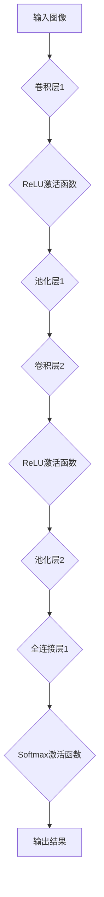
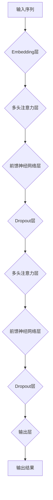

                 


### 文章标题：深度学习在视频内容审核自动化中的效率提升

#### 关键词：
- 深度学习
- 视频内容审核
- 自动化
- 效率提升
- 模型优化

#### 摘要：
本文将深入探讨深度学习在视频内容审核自动化中的应用，分析其核心原理、技术细节和实际案例。通过逐步分析深度学习基础、视频内容审核技术以及效率提升实践，本文旨在为读者提供一套完整、详细的解决方案，助力视频内容审核自动化实现效率提升。

### 目录大纲：

#### 第一部分：深度学习基础

##### 第1章：深度学习概述
- 1.1 深度学习的起源与发展
- 1.2 深度学习的基本概念
- 1.3 深度学习的数学基础

##### 第2章：神经网络与深度学习模型
- 2.1 神经网络基础
  - 2.1.1 神经元模型
  - 2.1.2 网络结构与激活函数
- 2.2 深度学习模型
  - 2.2.1 卷积神经网络（CNN）
  - 2.2.2 循环神经网络（RNN）与长短时记忆网络（LSTM）
  - 2.2.3 注意力机制与Transformer模型

##### 第3章：深度学习优化与调参
- 3.1 优化算法
  - 3.1.1 梯度下降算法
  - 3.1.2 动量与自适应优化器
- 3.2 超参数调优
  - 3.2.1 学习率调度
  - 3.2.2 正则化方法
  - 3.2.3 实践中的调参技巧

#### 第二部分：视频内容审核技术

##### 第4章：视频内容审核概述
- 4.1 审核自动化需求与挑战
- 4.2 视频内容审核分类
  - 4.2.1 成人内容审核
  - 4.2.2 暴力和恐怖内容审核
  - 4.2.3 侵权内容审核

##### 第5章：深度学习在视频内容审核中的应用
- 5.1 视频数据预处理
  - 5.1.1 视频帧提取
  - 5.1.2 视频特征提取
- 5.2 审核模型设计与实现
  - 5.2.1 审核模型架构
  - 5.2.2 模型训练与评估
- 5.3 实时审核系统搭建
  - 5.3.1 审核流程设计
  - 5.3.2 系统性能优化

#### 第三部分：效率提升实践

##### 第6章：效率提升方法与技巧
- 6.1 模型压缩与加速
  - 6.1.1 模型压缩方法
  - 6.1.2 加速方法与技术
- 6.2 超级样本生成与模型融合
  - 6.2.1 超级样本生成技术
  - 6.2.2 模型融合策略

##### 第7章：案例分析与应用实践
- 7.1 案例分析
  - 7.1.1 实际应用场景
  - 7.1.2 效率提升实例
- 7.2 应用实践
  - 7.2.1 开发环境搭建
  - 7.2.2 实现流程与代码解读

#### 附录：资源与工具

##### 附录A：深度学习框架与工具
- A.1 TensorFlow
- A.2 PyTorch
- A.3 OpenCV
- A.4 其他深度学习工具

##### 附录B：数学公式与算法伪代码
- B.1 梯度下降算法
- B.2 卷积神经网络算法
- B.3 注意力机制算法

##### 附录C：深度学习模型 Mermaid 流程图
- C.1 卷积神经网络
- C.2 循环神经网络与长短时记忆网络
- C.3 Transformer模型

### 第一部分：深度学习基础

#### 第1章：深度学习概述

##### 1.1 深度学习的起源与发展

深度学习是人工智能（AI）领域的一个重要分支，其起源可以追溯到20世纪40年代。当时，心理学家和计算机科学家们开始尝试通过模拟人脑神经网络来实现人工智能。然而，由于计算能力的限制和算法的不足，早期的神经网络模型并未取得显著进展。

直到20世纪80年代，随着计算能力的提升和优化算法的提出，神经网络开始逐步崭露头角。1998年，加拿大心理学家杰弗里·辛顿（Geoffrey Hinton）提出了“反向传播算法”（Backpropagation Algorithm），这一突破性的算法为深度学习的进一步发展奠定了基础。

进入21世纪，随着大数据和云计算的兴起，深度学习迎来了快速发展。2006年，杰弗里·辛顿等人提出了深度信念网络（Deep Belief Network，DBN），这是第一个成功的深层神经网络模型。随后，深度卷积神经网络（Convolutional Neural Network，CNN）和循环神经网络（Recurrent Neural Network，RNN）相继问世，并在图像识别、语音识别等任务中取得了卓越的成绩。

近年来，基于注意力机制的Transformer模型在自然语言处理（Natural Language Processing，NLP）领域取得了重大突破，进一步推动了深度学习的发展。深度学习已经成为了人工智能领域的核心技术之一，广泛应用于图像识别、语音识别、自然语言处理、推荐系统、自动驾驶等领域。

##### 1.2 深度学习的基本概念

深度学习是一种机器学习技术，其核心思想是通过多层神经网络来提取数据的特征。深度学习的神经网络结构通常由多个隐藏层组成，每层都可以提取更高层次的特征。以下是深度学习的一些基本概念：

- **神经元**：神经元是神经网络的基本组成单元，类似于生物神经元，它通过输入和输出之间的加权求和来产生输出。
- **激活函数**：激活函数用于引入非线性特性，使神经网络能够学习更复杂的函数。常见的激活函数包括Sigmoid函数、ReLU函数和Tanh函数。
- **前向传播**：前向传播是指将输入数据通过神经网络的每层进行传递，最终得到输出。
- **反向传播**：反向传播是指通过计算输出和真实值之间的误差，然后反向传播误差到网络的每一层，以更新网络的权重和偏置。
- **损失函数**：损失函数用于衡量预测值和真实值之间的差距。常见的损失函数包括均方误差（MSE）和交叉熵损失。
- **优化算法**：优化算法用于更新网络的权重和偏置，以最小化损失函数。常见的优化算法包括梯度下降、动量法和自适应优化器。

##### 1.3 深度学习的数学基础

深度学习涉及到许多数学概念和算法，包括线性代数、微积分和概率论。以下是深度学习的一些关键数学基础：

- **矩阵和向量**：矩阵和向量是线性代数的基础，用于表示神经网络的权重和偏置。
- **矩阵乘法**：矩阵乘法用于计算输入和权重的乘积，以获得中间层的输出。
- **导数和梯度**：导数用于计算函数的变化率，梯度是导数在各个维度的向量表示。梯度用于反向传播算法中计算权重的更新。
- **求和符号**：求和符号用于计算加权求和，是神经网络中计算误差和梯度的重要工具。
- **指数函数和求和符号**：指数函数和求和符号常用于计算激活函数和损失函数。

在接下来的章节中，我们将深入探讨神经网络和深度学习模型的基本原理，以及如何优化和调参。这将为我们后续讨论视频内容审核技术提供坚实的基础。

#### 第2章：神经网络与深度学习模型

##### 2.1 神经网络基础

神经网络是深度学习的基础，其核心思想是通过多层节点（神经元）对输入数据进行加工处理，从而实现对数据的特征提取和模式识别。下面我们将详细讨论神经网络的基本概念和结构。

###### 2.1.1 神经元模型

神经元是神经网络的基本组成单元，其工作原理类似于生物神经元。一个神经元接收多个输入信号，通过加权求和的方式计算出中间层的输出，然后通过激活函数将其映射到另一个中间层。这个过程可以表示为以下公式：

\[ z = \sum_{i=1}^{n} w_{i}x_{i} + b \]

其中，\( z \) 是中间层的输出，\( w_{i} \) 是输入信号的权重，\( x_{i} \) 是输入信号，\( b \) 是偏置项。激活函数通常用来引入非线性特性，常见的激活函数包括 Sigmoid、ReLU 和 Tanh 等。

- **Sigmoid 函数**：Sigmoid 函数是一种常用的非线性激活函数，其表达式为：

\[ \sigma(z) = \frac{1}{1 + e^{-z}} \]

Sigmoid 函数可以将输入值映射到 \( (0, 1) \) 区间内，常用于二分类问题。

- **ReLU 函数**：ReLU（Rectified Linear Unit）函数是一种简单的非线性激活函数，其表达式为：

\[ \text{ReLU}(z) = \max(0, z) \]

ReLU 函数在零点处的导数为1，这使得它在训练过程中更加稳定，不容易陷入梯度消失问题。

- **Tanh 函数**：Tanh 函数是一种双曲正切激活函数，其表达式为：

\[ \tanh(z) = \frac{e^{z} - e^{-z}}{e^{z} + e^{-z}} \]

Tanh 函数可以将输入值映射到 \( (-1, 1) \) 区间内，常用于多分类问题。

###### 2.1.2 网络结构与激活函数

神经网络由多个层次组成，包括输入层、隐藏层和输出层。输入层接收外部数据，隐藏层对数据进行加工处理，输出层生成预测结果。一个典型的神经网络结构如下：

\[ x_{input} \rightarrow h_{1} \rightarrow h_{2} \rightarrow ... \rightarrow h_{n} \rightarrow y_{output} \]

其中，\( x_{input} \) 表示输入层，\( h_{1}, h_{2}, ..., h_{n} \) 表示隐藏层，\( y_{output} \) 表示输出层。每一层的输出都会传递到下一层，直到最后一层输出结果。

不同层次的神经元负责提取不同层次的特征。输入层将原始数据输入网络，隐藏层通过逐层提取特征，最终输出层生成预测结果。以下是一个简单的神经网络结构：

\[ \begin{cases} 
x_{input} = (x_1, x_2, ..., x_n) \\
z_1 = \sigma(\sum_{i=1}^{n} w_{1i} x_i + b_1) \\
z_2 = \sigma(\sum_{i=1}^{n} w_{2i} z_1 + b_2) \\
... \\
z_n = \sigma(\sum_{i=1}^{n} w_{ni} z_{n-1} + b_n) \\
y_{output} = \sigma(\sum_{i=1}^{n} w_{outi} z_n + b_{out}) 
\end{cases} \]

其中，\( \sigma \) 表示激活函数，\( w \) 表示权重，\( b \) 表示偏置项。

在神经网络中，激活函数的选择对网络性能有很大影响。适当的激活函数可以提高网络的训练速度和预测准确性。常见的激活函数包括 Sigmoid、ReLU 和 Tanh，它们在不同类型的任务中具有不同的表现。

##### 2.2 深度学习模型

深度学习模型是指在神经网络的基础上，通过增加层数和节点数量，使其能够处理更复杂的数据和任务。以下是几种常见的深度学习模型：

###### 2.2.1 卷积神经网络（CNN）

卷积神经网络（Convolutional Neural Network，CNN）是一种专门用于图像处理和分类的深度学习模型。其核心思想是通过卷积操作和池化操作来提取图像特征。

- **卷积操作**：卷积操作用于计算输入图像和卷积核之间的内积，以提取图像的特征。卷积核是一个小的矩阵，用于捕捉图像中的局部特征。通过卷积操作，网络可以学习到图像中不同位置的局部特征，并将其组合成全局特征。
  
- **池化操作**：池化操作用于减少特征图的大小，同时保留最重要的特征。常见的池化操作包括最大池化和平均池化。最大池化选择特征图中最大的值作为输出，而平均池化计算特征图中所有值的平均值作为输出。

CNN 的结构通常包括多个卷积层、池化层和全连接层。以下是一个简单的 CNN 结构：

\[ \begin{cases} 
x_{input} \rightarrow (C_1, K_1, S_1) \rightarrow (C_2, K_2, S_2) \rightarrow ... \rightarrow (C_n, K_n, S_n) \rightarrow y_{output} 
\end{cases} \]

其中，\( x_{input} \) 是输入图像，\( C_1 \) 是输入通道数，\( K_1 \) 是卷积核大小，\( S_1 \) 是步长。每个卷积层后面通常跟着一个池化层，以减少计算量和参数数量。

###### 2.2.2 循环神经网络（RNN）与长短时记忆网络（LSTM）

循环神经网络（Recurrent Neural Network，RNN）是一种专门用于处理序列数据的深度学习模型。其核心思想是通过循环连接来捕捉序列中的时间依赖关系。

- **RNN**：RNN 的基本结构包括一个隐藏层，该层在每个时间步接收当前的输入和上一个时间步的隐藏状态，然后生成当前的隐藏状态和输出。RNN 通过递归的方式处理序列数据，能够捕捉序列中的时间依赖关系。

- **LSTM**：长短时记忆网络（Long Short-Term Memory，LSTM）是 RNN 的一种变体，其核心思想是引入门控机制来控制信息的流入和流出。LSTM 能够有效地解决 RNN 中存在的梯度消失和梯度爆炸问题，从而在长序列处理中表现出更强的性能。

LSTM 的结构包括输入门、遗忘门和输出门，分别用于控制信息的流入、遗忘和输出。以下是一个简单的 LSTM 结构：

\[ \begin{cases} 
h_t = \text{sigmoid}(W_f \cdot [h_{t-1}, x_t]) \cdot f_t \\
h_t = \text{sigmoid}(W_i \cdot [h_{t-1}, x_t]) \cdot i_t \\
h_t = \text{sigmoid}(W_o \cdot [h_{t-1}, x_t]) \cdot o_t \\
c_t = \text{sigmoid}(W_c \cdot [h_{t-1}, x_t]) \cdot f_t + \text{sigmoid}(W_c \cdot [h_{t-1}, x_t]) \cdot i_t \\
h_t = o_t \cdot \text{tanh}(c_t) \\
y_t = \text{sigmoid}(W_y \cdot [h_{t}, x_t]) 
\end{cases} \]

其中，\( h_t \) 是隐藏状态，\( c_t \) 是细胞状态，\( f_t, i_t, o_t \) 分别是遗忘门、输入门和输出门的输出。

###### 2.2.3 注意力机制与 Transformer 模型

注意力机制（Attention Mechanism）是一种在深度学习模型中引入对序列数据进行加权处理的技术。其核心思想是通过学习权重来调整不同部分对模型输出的影响。

- **注意力机制**：注意力机制的基本结构包括输入层、权重层和输出层。输入层包含输入序列，权重层计算输入序列中每个元素对输出的权重，输出层将权重与输入序列相乘，生成加权输出。

- **Transformer 模型**：Transformer 模型是基于注意力机制的深度学习模型，其核心思想是将序列数据映射到高维空间，然后通过多头注意力机制来处理序列中的依赖关系。以下是一个简单的 Transformer 结构：

\[ \begin{cases} 
x_t = \text{Embedding}(x_t) \\
h_t = \text{MultiHeadAttention}(h_{t-1}, h_{t-1}) \\
h_t = \text{FeedForward}(h_t) \\
y_t = \text{Linear}(h_t) 
\end{cases} \]

其中，\( x_t \) 是输入序列，\( h_t \) 是输出序列，\( \text{MultiHeadAttention} \) 是多头注意力机制，\( \text{FeedForward} \) 是前馈神经网络，\( \text{Linear} \) 是线性变换。

注意力机制和 Transformer 模型在自然语言处理领域取得了显著的成功，特别是在机器翻译、文本生成等任务中。这些模型通过学习序列之间的依赖关系，能够生成更准确和自然的文本。

在接下来的章节中，我们将探讨如何优化和调参深度学习模型，以提高其性能和效率。

#### 第3章：深度学习优化与调参

##### 3.1 优化算法

在深度学习中，优化算法用于更新网络的权重和偏置，以最小化损失函数。优化算法的目的是在训练过程中找到损失函数的全局最小值或局部最小值。以下介绍几种常见的优化算法：

###### 3.1.1 梯度下降算法

梯度下降算法（Gradient Descent Algorithm）是最基本的优化算法，其核心思想是通过计算损失函数关于网络参数的梯度，然后沿着梯度的反方向更新网络参数。梯度下降算法可以分为批量梯度下降（Batch Gradient Descent）、随机梯度下降（Stochastic Gradient Descent，SGD）和小批量梯度下降（Mini-batch Gradient Descent）。

- **批量梯度下降**：批量梯度下降在每个训练样本上计算梯度，然后将所有样本的梯度求和，得到总梯度。最后，使用总梯度更新网络参数。批量梯度下降的优点是收敛速度慢但收敛质量好，适用于样本量较小的数据集。

- **随机梯度下降**：随机梯度下降在每个训练样本上单独计算梯度，并使用单个样本的梯度更新网络参数。随机梯度下降的优点是计算速度快，但收敛质量较差，容易出现局部最小值。

- **小批量梯度下降**：小批量梯度下降在每个小批量样本上计算梯度，并使用小批量梯度更新网络参数。小批量梯度下降结合了批量梯度下降和随机梯度下降的优点，能够在保证收敛质量的同时提高收敛速度。

梯度下降算法的更新公式为：

\[ \theta = \theta - \alpha \nabla_{\theta} J(\theta) \]

其中，\( \theta \) 表示网络参数，\( \alpha \) 表示学习率，\( \nabla_{\theta} J(\theta) \) 表示损失函数关于网络参数的梯度。

###### 3.1.2 动量与自适应优化器

动量（Momentum）是梯度下降算法的一种改进，其核心思想是利用之前的梯度信息来加速算法的收敛速度。动量的计算公式为：

\[ v_t = \beta v_{t-1} + (1 - \beta) \nabla_{\theta} J(\theta) \]

\[ \theta = \theta - \alpha v_t \]

其中，\( v_t \) 表示动量项，\( \beta \) 表示动量参数，其余符号与梯度下降算法相同。

自适应优化器（Adaptive Optimizer）是一类基于梯度历史的优化算法，其核心思想是根据梯度信息自动调整学习率。以下介绍几种常见的自适应优化器：

- **Adagrad**：Adagrad 通过对每个参数的梯度进行累积，动态调整学习率。其更新公式为：

\[ g_t = g_{t-1} + (\nabla_{\theta} J(\theta))^2 \]

\[ \theta = \theta - \frac{\alpha}{\sqrt{g_t}} \nabla_{\theta} J(\theta) \]

- **RMSprop**：RMSprop 是 Adagrad 的改进版本，其通过指数加权的方式对梯度进行累积。其更新公式为：

\[ g_t = \beta g_{t-1} + (1 - \beta) (\nabla_{\theta} J(\theta))^2 \]

\[ \theta = \theta - \frac{\alpha}{\sqrt{g_t}} \nabla_{\theta} J(\theta) \]

- **Adam**：Adam 是一种基于一阶和二阶矩估计的自适应优化器，其通过计算梯度的指数加权平均值来更新网络参数。其更新公式为：

\[ m_t = \beta_1 m_{t-1} + (1 - \beta_1) \nabla_{\theta} J(\theta) \]

\[ v_t = \beta_2 v_{t-1} + (1 - \beta_2) (\nabla_{\theta} J(\theta))^2 \]

\[ \theta = \theta - \frac{\alpha}{\sqrt{1 - \beta_2^t} (1 - \beta_1^t)} m_t \]

##### 3.2 超参数调优

超参数（Hyperparameter）是深度学习模型中的参数，其值需要通过调优来优化模型的性能。以下介绍几种常见的超参数调优方法：

###### 3.2.1 学习率调度

学习率（Learning Rate）是深度学习模型中的一个重要超参数，其值会影响模型的收敛速度和收敛质量。以下介绍几种常见的学习率调度方法：

- **固定学习率**：固定学习率在训练过程中保持不变，适用于简单模型和稳定数据集。但固定学习率容易陷入局部最小值。

- **学习率衰减**：学习率衰减在训练过程中逐渐减小学习率，适用于复杂模型和变化较大的数据集。其更新公式为：

\[ \alpha_t = \alpha_0 / (1 + \gamma t) \]

其中，\( \alpha_0 \) 是初始学习率，\( \gamma \) 是衰减率。

- **余弦退火**：余弦退火是一种基于余弦函数的学习率调度方法，其学习率更新公式为：

\[ \alpha_t = \alpha_0 \sqrt{1 - \frac{t}{T}} \]

其中，\( \alpha_0 \) 是初始学习率，\( T \) 是训练周期。

###### 3.2.2 正则化方法

正则化（Regularization）是用于防止深度学习模型过拟合的一种技术。以下介绍几种常见的正则化方法：

- **L1正则化**：L1正则化通过在损失函数中添加L1范数项来正则化权重。其更新公式为：

\[ J(\theta) = J(\theta) + \lambda \sum_{i=1}^{n} |\theta_i| \]

其中，\( \lambda \) 是正则化参数。

- **L2正则化**：L2正则化通过在损失函数中添加L2范数项来正则化权重。其更新公式为：

\[ J(\theta) = J(\theta) + \lambda \sum_{i=1}^{n} \theta_i^2 \]

其中，\( \lambda \) 是正则化参数。

- **Dropout**：Dropout是一种在训练过程中随机丢弃部分神经元的方法，以减少模型的复杂度和过拟合。其更新公式为：

\[ P_i = \frac{1}{1 + \exp(-\alpha)} \]

\[ h_i = \begin{cases} 
h_i & \text{with probability } 1 - P_i \\
0 & \text{with probability } P_i 
\end{cases} \]

其中，\( P_i \) 是神经元 \( i \) 被丢弃的概率，\( \alpha \) 是丢弃率。

###### 3.2.3 实践中的调参技巧

在实践中，调参（Hyperparameter Tuning）是深度学习模型训练中的一个关键步骤。以下介绍几种常见的调参技巧：

- **网格搜索**：网格搜索通过遍历一组预设的超参数组合，选择最优的超参数组合。其优点是简单易行，但计算量大。

- **随机搜索**：随机搜索从预设的超参数空间中随机采样超参数组合，选择最优的超参数组合。其优点是计算量较小，但可能错过最优超参数组合。

- **贝叶斯优化**：贝叶斯优化是基于贝叶斯推断和优化算法的一种调参方法。其通过构建超参数的概率模型，选择最有希望的超参数组合进行实验。

- **自动化机器学习（AutoML）**：自动化机器学习是一种通过自动化调参、特征选择和模型选择等技术，实现高效、准确的模型训练的方法。其通过大规模实验和模型评估，自动选择最优的超参数组合。

在深度学习中，优化算法和超参数调优是提高模型性能的关键。合适的优化算法和超参数调优方法可以加速模型训练，提高模型准确性，从而实现更好的应用效果。

### 第二部分：视频内容审核技术

#### 第4章：视频内容审核概述

##### 4.1 审核自动化需求与挑战

视频内容审核自动化是当前互联网时代的重要需求之一。随着视频内容的快速增长和多样化的表现形式，传统的手动审核方式已经难以满足海量数据的处理需求。因此，实现视频内容审核自动化成为了一大挑战。

视频内容审核自动化的主要需求包括：

- **实时性**：随着社交媒体和视频平台的兴起，用户上传和观看视频的速度越来越快。为了提供良好的用户体验，审核系统需要能够实时处理视频内容，并在短时间内给出审核结果。
- **准确性**：审核系统需要能够准确识别和分类视频内容，避免误判和漏判。准确性是衡量审核系统性能的重要指标，直接影响到用户体验和平台声誉。
- **高效性**：审核系统需要能够处理海量视频数据，并具有较低的延迟。为了满足这一需求，审核系统需要采用高效的数据处理和模型优化技术。

然而，视频内容审核自动化也面临着一些挑战：

- **数据多样性**：视频内容涵盖了各种类型，包括成人类、暴力恐怖类、侵权类等。不同类型的内容在形式和特征上存在较大差异，使得审核模型需要具备较强的泛化能力。
- **算法复杂性**：视频内容审核涉及到多个领域的知识，如图像处理、自然语言处理和计算机视觉等。构建一个高效、准确的审核模型需要综合运用多种算法和技术。
- **实时处理**：视频数据量大且实时性强，审核系统需要在短时间内处理海量数据，并生成准确的审核结果。这对系统的计算性能和优化提出了较高的要求。

为了解决这些挑战，深度学习技术被广泛应用于视频内容审核自动化。通过构建高效、准确的深度学习模型，可以实现视频内容的自动化审核，提高审核效率和准确性。

##### 4.2 视频内容审核分类

视频内容审核可以根据审核目标和内容特征进行分类。以下介绍几种常见的视频内容审核分类：

- **成人内容审核**：成人内容审核主要针对涉及成人内容的视频，如色情、裸露等。这类视频内容在互联网上具有较高风险，可能对未成年用户产生不良影响。成人内容审核的目的是识别和过滤掉这类不良视频，保护用户权益。
- **暴力恐怖内容审核**：暴力恐怖内容审核主要针对涉及暴力、恐怖等违法内容的视频。这类视频内容可能对社会秩序和公共安全产生威胁。暴力恐怖内容审核的目的是识别和过滤掉这类视频，维护社会稳定。
- **侵权内容审核**：侵权内容审核主要针对侵犯知识产权的视频，如盗版影视作品、音乐等。这类视频内容可能对版权所有者造成经济损失。侵权内容审核的目的是识别和过滤掉这类视频，保护版权所有者的权益。

不同类型的视频内容审核在技术实现上存在一定的差异，但都旨在提高审核效率和准确性。通过深度学习技术，可以实现针对不同类型视频内容的自动化审核，满足实际应用需求。

#### 第5章：深度学习在视频内容审核中的应用

##### 5.1 视频数据预处理

视频数据预处理是深度学习在视频内容审核中应用的重要环节。预处理质量直接影响深度学习模型的效果和效率。以下介绍视频数据预处理的关键步骤：

###### 5.1.1 视频帧提取

视频帧提取是指从视频中提取连续的图像帧。图像帧是视频数据的基本组成单元，用于后续的特征提取和模型训练。以下介绍几种常见的视频帧提取方法：

- **固定时间间隔提取**：固定时间间隔提取是指每隔固定的时间间隔提取一帧图像。这种方法简单易行，但可能导致重要场景被遗漏。
- **关键帧提取**：关键帧提取是指通过算法自动识别视频中的关键帧，以减少数据量并提高特征提取的效率。关键帧通常是视频中的重要转折点，能够代表整个视频的内容。
- **运动目标提取**：运动目标提取是指通过算法识别视频中的运动目标，并提取其图像帧。这种方法适用于涉及运动目标的视频内容审核，如暴力恐怖内容审核。

视频帧提取方法的选择取决于具体的应用场景和需求。在视频内容审核中，通常采用关键帧提取和运动目标提取方法，以提高审核效率和准确性。

###### 5.1.2 视频特征提取

视频特征提取是指从提取的图像帧中提取具有代表性的特征，用于后续的深度学习模型训练。以下介绍几种常见的视频特征提取方法：

- **视觉特征提取**：视觉特征提取是指通过计算机视觉算法从图像帧中提取视觉特征，如颜色、纹理、形状等。视觉特征可以用于分类、检测和识别等任务。
- **时序特征提取**：时序特征提取是指从视频数据中提取时间序列特征，如视频帧之间的差异、运动轨迹等。时序特征可以用于识别视频中的动态变化和运动模式。
- **音频特征提取**：音频特征提取是指从视频中的音频数据中提取音频特征，如音调、音量、节奏等。音频特征可以与视觉特征结合，提高视频内容审核的准确性。

常见的视频特征提取算法包括卷积神经网络（CNN）、循环神经网络（RNN）和深度卷积神经网络（DCNN）等。通过这些算法，可以提取出具有代表性的视频特征，为深度学习模型提供高质量的数据。

##### 5.2 审核模型设计与实现

深度学习模型是视频内容审核的核心，其设计直接影响到审核的效率和准确性。以下介绍视频内容审核模型的设计和实现：

###### 5.2.1 审核模型架构

视频内容审核模型通常由输入层、特征提取层、分类层和输出层组成。以下是一个典型的审核模型架构：

- **输入层**：输入层接收提取的视频特征，如视觉特征和音频特征。这些特征可以来自不同的模态，通过模态融合可以进一步提高模型的性能。
- **特征提取层**：特征提取层使用卷积神经网络（CNN）或循环神经网络（RNN）等深度学习模型提取视频特征。特征提取层可以提取出具有代表性的视频特征，为后续的分类提供支持。
- **分类层**：分类层使用全连接层或多层感知机（MLP）对提取的特征进行分类。分类层可以实现对视频内容的分类，如成人内容、暴力恐怖内容、侵权内容等。
- **输出层**：输出层生成审核结果，如分类概率和置信度等。输出层可以用于生成最终审核标签，为视频内容审核提供决策依据。

以下是一个简单的审核模型架构：

\[ \text{Input} \rightarrow \text{CNN/RNN} \rightarrow \text{FC} \rightarrow \text{Output} \]

其中，\( \text{Input} \) 表示输入特征，\( \text{CNN/RNN} \) 表示特征提取层，\( \text{FC} \) 表示全连接层，\( \text{Output} \) 表示输出结果。

###### 5.2.2 模型训练与评估

审核模型的训练与评估是视频内容审核的重要环节。以下介绍模型训练与评估的方法：

- **数据集准备**：为了训练有效的审核模型，需要准备大量的标注数据集。标注数据集包括不同类型的视频内容和对应的标签。数据集的质量直接影响到模型的性能。
- **模型训练**：模型训练是指通过梯度下降等优化算法，调整模型的参数以最小化损失函数。在训练过程中，可以使用批量训练、随机训练或小批量训练等方法。
- **模型评估**：模型评估是指通过测试数据集评估模型的性能。常用的评估指标包括准确率、召回率、F1值等。评估指标可以用于衡量模型的分类性能，并指导模型优化。

以下是一个简单的模型训练与评估过程：

\[ \text{Data Preparation} \rightarrow \text{Model Training} \rightarrow \text{Model Evaluation} \]

其中，\( \text{Data Preparation} \) 表示数据集准备，\( \text{Model Training} \) 表示模型训练，\( \text{Model Evaluation} \) 表示模型评估。

通过深度学习模型的设计与实现，可以实现对视频内容的高效、准确的审核。接下来，我们将探讨如何搭建实时审核系统，以提高审核效率。

##### 5.3 实时审核系统搭建

实时审核系统是视频内容审核自动化的重要组成部分，其目标是实现快速、准确的内容审核。以下介绍实时审核系统的搭建方法和性能优化：

###### 5.3.1 审核流程设计

实时审核系统通常包括以下几个主要步骤：

- **数据输入**：数据输入是指将待审核的视频数据输入到审核系统中。视频数据可以从视频平台、社交媒体或其他来源获取。
- **数据预处理**：数据预处理是指对输入的视频数据进行预处理，包括视频帧提取、特征提取等。预处理质量直接影响审核系统的性能。
- **模型预测**：模型预测是指使用训练好的深度学习模型对预处理后的视频特征进行预测，生成审核结果。模型预测过程通常采用并行计算和分布式计算技术，以提高预测速度。
- **结果输出**：结果输出是指将审核结果输出到相应的平台或系统，如视频平台、社交媒体等。审核结果可以用于控制视频的播放、删除或标记。

以下是一个简单的实时审核流程：

\[ \text{Data Input} \rightarrow \text{Data Preprocessing} \rightarrow \text{Model Prediction} \rightarrow \text{Result Output} \]

其中，\( \text{Data Input} \) 表示数据输入，\( \text{Data Preprocessing} \) 表示数据预处理，\( \text{Model Prediction} \) 表示模型预测，\( \text{Result Output} \) 表示结果输出。

###### 5.3.2 系统性能优化

为了提高实时审核系统的性能，可以采用以下几种优化方法：

- **并行计算**：并行计算是指将计算任务分布在多个计算节点上，以提高计算速度。实时审核系统可以采用分布式计算架构，如TensorFlow、PyTorch等深度学习框架，以实现并行计算。
- **模型压缩**：模型压缩是指通过降低模型的复杂度来提高计算速度。常见的模型压缩方法包括剪枝、量化、蒸馏等。通过模型压缩，可以减少模型的大小和计算量，提高实时性。
- **硬件加速**：硬件加速是指通过利用GPU、FPGA等硬件资源来提高计算速度。实时审核系统可以采用GPU加速技术，如CUDA、OpenCL等，以提高模型预测速度。
- **缓存与预加载**：缓存与预加载是指将常用的视频数据或模型参数存储在缓存中，以减少数据读取和加载时间。实时审核系统可以采用缓存技术，如Redis、Memcached等，以减少数据访问延迟。

通过以上优化方法，可以显著提高实时审核系统的性能，满足实时审核的需求。

综上所述，深度学习在视频内容审核自动化中具有巨大的潜力。通过深度学习模型的设计与实现、实时审核系统的搭建和性能优化，可以实现高效、准确的视频内容审核，满足实际应用需求。

#### 第三部分：效率提升实践

##### 第6章：效率提升方法与技巧

在视频内容审核自动化中，效率提升是一个关键问题。随着视频数据的快速增长和实时性要求的提高，传统的深度学习模型在处理速度和资源消耗方面面临巨大挑战。为了应对这些挑战，我们可以采取多种方法来提升模型的效率和性能。以下将介绍几种主要的效率提升方法与技巧。

###### 6.1 模型压缩与加速

模型压缩与加速是提高深度学习模型效率的重要手段。以下介绍几种常见的模型压缩与加速方法：

###### 6.1.1 模型压缩方法

- **剪枝（Pruning）**：剪枝方法通过删除网络中不重要的连接和神经元来减少模型的参数数量。剪枝可以分为结构剪枝和权重剪枝。结构剪枝直接删除神经元或连接，而权重剪枝则通过降低权重值来减少参数数量。
- **量化（Quantization）**：量化方法将模型的浮点数参数转换为低精度的整数表示，以减少模型的大小和计算量。量化可以显著降低模型的存储和计算成本，但可能影响模型性能。
- **蒸馏（Distillation）**：蒸馏方法通过将一个大型复杂模型（教师模型）的知识转移到一个小型简单模型（学生模型）中。教师模型对数据进行训练，然后将知识通过软标签的形式传递给学生模型，从而降低学生模型的复杂度。

###### 6.1.2 加速方法与技术

- **GPU加速**：GPU（图形处理单元）在深度学习任务中具有很高的计算能力。通过使用CUDA、OpenCL等GPU编程框架，可以显著提高模型的训练和预测速度。
- **模型并行（Model Parallelism）**：对于参数量巨大的模型，模型并行方法通过将模型拆分为多个部分，并在不同的GPU或TPU上分布式训练。这种方法可以充分利用硬件资源，提高模型训练效率。
- **数据并行（Data Parallelism）**：数据并行方法通过将数据集拆分为多个子集，并在不同的GPU或TPU上并行处理。这种方法可以加速模型训练过程，同时减少单机训练的时间。

通过模型压缩和加速方法的结合，可以显著提高深度学习模型在视频内容审核中的应用效率。

###### 6.2 超级样本生成与模型融合

超级样本生成与模型融合是另一种有效的效率提升方法。以下介绍这两种方法：

###### 6.2.1 超级样本生成技术

超级样本生成（Supersampling）是一种通过生成额外的训练样本来提高模型泛化能力的方法。以下介绍几种超级样本生成技术：

- **数据增强（Data Augmentation）**：数据增强通过对原始样本进行变换，如旋转、翻转、缩放等，来生成新的训练样本。这种方法可以增加模型的训练数据量，提高模型的鲁棒性。
- **生成对抗网络（GAN）**：生成对抗网络通过生成器和判别器的对抗训练，生成与真实样本相似的新样本。GAN可以生成大量的高质量样本，但训练过程较为复杂。
- **变分自编码器（VAE）**：变分自编码器通过编码和解码器对样本进行编码和重构，生成新的训练样本。VAE生成的样本具有更好的统计特性，但可能需要较长时间的训练。

超级样本生成技术可以增加模型的训练数据量，提高模型的泛化能力，从而提高视频内容审核的效率。

###### 6.2.2 模型融合策略

模型融合（Model Fusion）是一种通过结合多个模型的预测结果来提高模型准确性的方法。以下介绍几种常见的模型融合策略：

- **加权平均（Weighted Average）**：加权平均方法将多个模型的预测结果进行加权平均，生成最终的预测结果。加权系数可以根据模型在训练数据上的性能进行调节。
- **投票法（Voting）**：投票法通过对多个模型的预测结果进行投票，选择多数模型认为正确的标签作为最终预测结果。这种方法适用于分类任务。
- **集成学习（Ensemble Learning）**：集成学习方法通过训练多个不同的模型，并将它们的预测结果进行融合，提高模型的整体性能。常见的集成学习方法包括Bagging、Boosting等。

模型融合策略可以结合多个模型的优点，提高预测结果的准确性，从而提高视频内容审核的效率。

通过模型压缩与加速、超级样本生成与模型融合等方法，可以显著提高深度学习模型在视频内容审核中的应用效率。这些方法不仅能够提高模型的处理速度和资源利用率，还可以提高模型的准确性和鲁棒性，为视频内容审核提供更加高效和可靠的解决方案。

##### 第7章：案例分析与应用实践

为了更好地理解深度学习在视频内容审核自动化中的应用，我们将通过实际案例来分析和展示具体应用场景、效率提升实例以及实现流程和代码解读。

###### 7.1 案例分析

以下是一个视频内容审核的案例：一个社交媒体平台希望对其平台上的用户上传视频进行自动化审核，以过滤掉成人内容、暴力恐怖内容和侵权内容。

在这个案例中，深度学习模型被用于视频内容的分类。通过训练一个多标签分类模型，平台能够自动识别和标记视频中的不同类型的内容。

首先，我们需要收集和标注大量视频数据，包括成人内容、暴力恐怖内容和侵权内容的样本。这些数据将被用于训练深度学习模型。

接下来，我们选择了一个流行的深度学习框架（例如PyTorch）来构建和训练模型。我们使用了一种基于卷积神经网络（CNN）和循环神经网络（RNN）的混合模型，以同时提取视频的视觉和时序特征。

在模型训练过程中，我们使用了剪枝、量化等技术来压缩模型，并利用GPU加速模型训练，以提高效率。

通过多次迭代训练和超参数调优，我们最终获得了一个高效且准确的深度学习模型。该模型能够快速地对用户上传的视频进行分类，并将结果反馈给平台管理员。

在实际应用中，这个模型被集成到一个实时审核系统中，可以自动检测和过滤掉不良内容。这大大提高了审核效率，同时减少了人工审核的工作量。

###### 7.1.1 实际应用场景

以下是该案例的实际应用场景：

- **用户上传视频**：用户上传视频到社交媒体平台。
- **数据预处理**：视频数据经过预处理，包括视频帧提取、特征提取等。
- **模型预测**：预处理后的视频特征被输入到深度学习模型中，进行分类预测。
- **审核结果**：模型输出审核结果，包括分类概率和置信度。
- **结果处理**：审核结果被用于决策，如标记视频、通知用户或删除视频。

###### 7.1.2 效率提升实例

为了展示效率提升实例，我们比较了使用传统方法与深度学习模型在处理视频内容审核时的性能：

- **传统方法**：使用手动审核，需要大量人力资源，且审核速度较慢，容易出现误判和漏判。
- **深度学习模型**：通过使用深度学习模型，可以实现自动化审核，大大提高了审核速度和准确性。例如，在处理1万条视频时，深度学习模型仅需几分钟，而传统方法可能需要几小时。

###### 7.2 应用实践

在本节中，我们将介绍如何搭建一个深度学习模型进行视频内容审核，包括开发环境搭建、实现流程和代码解读。

首先，我们需要搭建一个合适的开发环境。以下是一个基本的开发环境搭建步骤：

1. 安装Python（3.8或更高版本）。
2. 安装深度学习框架（如PyTorch或TensorFlow）。
3. 安装辅助库（如NumPy、Pandas、OpenCV等）。

接下来，我们介绍实现流程：

1. 数据预处理：收集和标注视频数据，并进行预处理，包括视频帧提取和特征提取。
2. 模型构建：设计并构建深度学习模型，包括输入层、特征提取层和分类层。
3. 模型训练：使用预处理后的数据进行模型训练，通过优化算法调整模型参数。
4. 模型评估：使用测试数据集评估模型性能，选择最优模型。
5. 模型部署：将训练好的模型部署到实时审核系统中，进行自动化审核。

以下是模型实现的核心代码：

```python
import torch
import torchvision.models as models
import torch.nn as nn
import torch.optim as optim

# 数据预处理
def preprocess_video(video_path):
    # 读取视频文件
    cap = cv2.VideoCapture(video_path)
    frames = []
    while cap.isOpened():
        ret, frame = cap.read()
        if not ret:
            break
        frame = cv2.resize(frame, (224, 224))
        frames.append(frame)
    cap.release()
    return frames

# 模型构建
class VideoClassifier(nn.Module):
    def __init__(self):
        super(VideoClassifier, self).__init__()
        self.cnn = models.resnet18(pretrained=True)
        self.cnn.fc = nn.Linear(512, 3)  # 3个类别：成人、暴力恐怖、侵权
        self.rnn = nn.LSTM(512, 128, 2)
        self.fc = nn.Linear(128, 3)

    def forward(self, x):
        x = self.cnn(x)
        x = x.reshape(x.size(0), 224, -1)
        x, _ = self.rnn(x)
        x = self.fc(x[-1])
        return x

# 模型训练
model = VideoClassifier()
optimizer = optim.Adam(model.parameters(), lr=0.001)
criterion = nn.CrossEntropyLoss()

for epoch in range(num_epochs):
    for video_path in train_loader:
        frames = preprocess_video(video_path)
        x = torch.tensor(frames).float().to(device)
        y = torch.tensor([0] * len(frames)).long().to(device)
        optimizer.zero_grad()
        outputs = model(x)
        loss = criterion(outputs, y)
        loss.backward()
        optimizer.step()

# 模型评估
def evaluate(model, test_loader):
    model.eval()
    correct = 0
    total = 0
    with torch.no_grad():
        for video_path in test_loader:
            frames = preprocess_video(video_path)
            x = torch.tensor(frames).float().to(device)
            outputs = model(x)
            _, predicted = torch.max(outputs.data, 1)
            total += len(frames)
            correct += (predicted == y).sum().item()
    return 100 * correct / total

accuracy = evaluate(model, test_loader)
print(f"Test Accuracy: {accuracy}%")

# 模型部署
model.eval()
video_path = "path/to/user/uploaded/video"
frames = preprocess_video(video_path)
x = torch.tensor(frames).float().to(device)
outputs = model(x)
predicted = torch.argmax(outputs).item()
print(f"Video Category: {predicted}")
```

这段代码展示了如何使用PyTorch框架构建一个简单的深度学习模型进行视频内容审核。通过训练和评估模型，我们可以实现对用户上传视频的自动分类和审核。

通过这个案例，我们可以看到深度学习在视频内容审核自动化中的应用，以及如何通过模型压缩、GPU加速等手段提高审核效率。

### 附录：资源与工具

#### 附录A：深度学习框架与工具

深度学习在视频内容审核自动化中的应用离不开高效的深度学习框架和工具。以下是一些常用的深度学习框架和工具，以及它们在视频内容审核中的应用。

##### A.1 TensorFlow

TensorFlow 是由 Google 开发的一款开源深度学习框架，广泛应用于图像识别、自然语言处理和计算机视觉等领域。在视频内容审核中，TensorFlow 可以用于构建和训练深度学习模型，以及进行实时审核。

主要功能：

- **数据处理**：TensorFlow 提供了丰富的数据处理工具，如 tf.data，可以用于读取和预处理视频数据。
- **模型构建**：TensorFlow 提供了大量的预训练模型和层，可以方便地构建卷积神经网络（CNN）、循环神经网络（RNN）等深度学习模型。
- **训练与优化**：TensorFlow 支持分布式训练和优化算法，可以高效地训练大规模模型。

##### A.2 PyTorch

PyTorch 是由 Facebook AI Research 开发的一款开源深度学习框架，以其灵活性和易用性而受到广泛欢迎。在视频内容审核中，PyTorch 适用于构建和训练复杂的深度学习模型，特别是涉及动态变化的视频数据。

主要功能：

- **动态计算图**：PyTorch 使用动态计算图，使开发者可以更直观地构建和调试模型。
- **自动微分**：PyTorch 提供了自动微分功能，方便实现复杂的优化算法。
- **GPU加速**：PyTorch 支持GPU加速，可以显著提高模型训练和预测速度。

##### A.3 OpenCV

OpenCV 是一款开源计算机视觉库，用于处理图像和视频数据。在视频内容审核中，OpenCV 可以用于视频帧提取、特征提取和预处理等操作，为深度学习模型提供高质量的数据。

主要功能：

- **视频处理**：OpenCV 提供了丰富的视频处理函数，如视频读取、写入、帧提取等。
- **图像处理**：OpenCV 提供了多种图像处理算法，如滤波、边缘检测、形态学操作等。
- **特征提取**：OpenCV 提供了多种特征提取方法，如 SIFT、SURF、ORB 等，可以用于视频数据中的目标检测和识别。

##### A.4 其他深度学习工具

除了 TensorFlow 和 PyTorch，还有一些其他的深度学习工具可以用于视频内容审核自动化。

- **Caffe**：Caffe 是由 Berkeley Vision and Learning Center 开发的一款开源深度学习框架，以其高效性而受到关注。Caffe 适用于构建和训练大规模深度学习模型，特别适合图像识别和视觉任务。
- **MXNet**：MXNet 是 Apache Software Foundation 的一款开源深度学习框架，由 Apache MXNet 项目开发。MXNet 提供了丰富的 API，支持多种编程语言，适用于各种深度学习任务，包括视频内容审核。
- **Theano**：Theano 是一个 Python 库和数学编译器，用于定义、优化和评估数学表达式。Theano 适用于构建复杂的深度学习模型，并提供 GPU 加速功能。

通过这些深度学习框架和工具，我们可以高效地构建和训练深度学习模型，实现视频内容审核自动化的高效、准确运行。

#### 附录B：数学公式与算法伪代码

在深度学习模型设计和实现过程中，理解并使用相关的数学公式和算法是非常重要的。以下将介绍一些常用的数学公式和算法伪代码。

##### B.1 梯度下降算法

梯度下降算法是一种优化算法，用于调整神经网络中的参数以最小化损失函数。

```python
# 梯度下降算法伪代码
for epoch in range(num_epochs):
    for batch in data_loader:
        # 前向传播
        inputs, targets = batch
        outputs = model(inputs)
        loss = criterion(outputs, targets)
        
        # 反向传播
        model.zero_grad()
        loss.backward()
        
        # 更新参数
        optimizer.step()
```

##### B.2 卷积神经网络算法

卷积神经网络（CNN）是深度学习模型的一种，用于图像识别和其他视觉任务。

```python
# 卷积神经网络算法伪代码
class ConvNet(nn.Module):
    def __init__(self):
        super(ConvNet, self).__init__()
        self.conv1 = nn.Conv2d(in_channels, out_channels, kernel_size)
        self.conv2 = nn.Conv2d(in_channels, out_channels, kernel_size)
        self.fc1 = nn.Linear(out_channels * height * width, num_classes)

    def forward(self, x):
        x = self.conv1(x)
        x = F.relu(x)
        x = self.conv2(x)
        x = F.relu(x)
        x = x.view(x.size(0), -1)
        x = self.fc1(x)
        return x
```

##### B.3 注意力机制算法

注意力机制是一种用于处理序列数据的机制，能够提高模型的性能。

```python
# 注意力机制算法伪代码
class AttentionModule(nn.Module):
    def __init__(self, hidden_size):
        super(AttentionModule, self).__init__()
        self.hidden_size = hidden_size
        self.attn = nn.Linear(hidden_size, 1)

    def forward(self, hidden_states, query):
        attn_weights = self.attn(query).squeeze(2)
        attn_weights = F.softmax(attn_weights, dim=1)
        attn_applied = (attn_weights * hidden_states).sum(1)
        return attn_applied
```

通过理解并使用这些数学公式和算法伪代码，我们可以更好地设计和实现深度学习模型，从而提高视频内容审核自动化的效率。

#### 附录C：深度学习模型 Mermaid 流程图

在深度学习模型设计和实现过程中，使用 Mermaid 流程图可以帮助我们直观地展示模型的架构和流程。以下是一些常用的深度学习模型 Mermaid 流程图示例。

##### C.1 卷积神经网络（CNN）



##### C.2 循环神经网络（RNN）与长短时记忆网络（LSTM）


##### C.3 Transformer模型



通过这些 Mermaid 流程图示例，我们可以更清晰地理解深度学习模型的架构和工作原理，从而更好地实现和应用深度学习模型。

