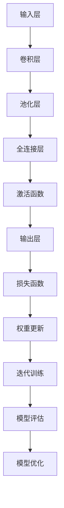

                 

### 文章标题

# 深度学习在视频动作识别中的最新进展

## 关键词

- 深度学习
- 视频动作识别
- 时空卷积网络
- 3D卷积神经网络
- 残差网络
- 深度可分离卷积

## 摘要

随着深度学习的迅猛发展，视频动作识别已成为计算机视觉领域的研究热点。本文旨在探讨深度学习在视频动作识别中的应用背景、核心概念、算法原理、项目实战以及未来趋势。通过逐步分析，本文揭示了时空卷积网络（STCN）和3D卷积神经网络（3D-CNN）在视频动作识别中的关键作用，并详细介绍了其算法原理、数学模型和实际应用案例。同时，本文也讨论了视频动作识别面临的挑战及未来发展方向，为相关领域的研究者提供了有价值的参考。

### 《深度学习在视频动作识别中的最新进展》目录大纲

#### 第一部分：背景与概述

1. **深度学习在视频动作识别中的应用背景**
   - **1.1 视频动作识别的定义与重要性**
   - **1.2 深度学习与视频动作识别的历史发展**
   - **1.3 深度学习在视频动作识别中的优势**

#### 第二部分：核心概念与架构

2. **深度学习基础**
   - **2.1 深度学习的基本原理**
     - **2.1.1 神经网络与深度神经网络**
     - **2.1.2 反向传播算法**
   - **2.2 卷积神经网络（CNN）**
     - **2.2.1 CNN的架构**
     - **2.2.2 卷积、池化与激活函数**
   - **2.3 残差网络与变体**
     - **2.3.1 残差网络**
     - **2.3.2 深度可分离卷积**

#### 第三部分：核心算法原理

3. **视频动作识别中的深度学习算法**
   - **3.1 时空卷积网络（STCN）**
     - **3.1.1 算法原理**
     - **3.1.2 伪代码讲解**
     - **3.1.3 数学模型与公式**
   - **3.2 3D卷积神经网络（3D-CNN）**
     - **3.2.1 算法原理**
     - **3.2.2 伪代码讲解**
     - **3.2.3 数学模型与公式**

#### 第四部分：项目实战与代码解读

4. **深度学习在视频动作识别中的项目实战**
   - **4.1 项目概述**
   - **4.2 开发环境搭建**
   - **4.3 源代码实现**
     - **4.3.1 数据预处理**
     - **4.3.2 模型构建与训练**
     - **4.3.3 模型评估与优化**
   - **4.4 代码解读与分析**
     - **4.4.1 核心函数与类**
     - **4.4.2 算法细节剖析**

#### 第五部分：挑战与未来趋势

5. **视频动作识别中的挑战与未来趋势**
   - **5.1 挑战分析**
     - **5.1.1 数据集的多样性问题**
     - **5.1.2 模型解释性与可解释性问题**
     - **5.1.3 实时性能与能耗问题**
   - **5.2 未来趋势**
     - **5.2.1 硬件加速与分布式训练**
     - **5.2.2 多模态融合与增强学习**
     - **5.2.3 开源社区与工业合作**

#### 附录

6. **深度学习在视频动作识别中的应用资源**
   - **6.1 开源框架与工具**
   - **6.2 学术论文与文献**
   - **6.3 在线课程与教程**

---

在接下来的内容中，我们将逐步深入探讨深度学习在视频动作识别领域的应用背景、核心概念、算法原理、项目实战以及未来趋势。让我们开始这段深入而富有启发性的旅程。

#### 第一部分：背景与概述

### 1.1 视频动作识别的定义与重要性

视频动作识别（Video Action Recognition，简称VAR）是指从视频序列中检测和识别出具体动作的过程。视频动作识别作为一种计算机视觉技术，其核心目标是理解视频中的动态行为，从而实现对人类活动的自动分析。具体来说，视频动作识别包括以下几个步骤：

1. **特征提取**：从视频帧中提取与动作相关的特征，如运动轨迹、姿态、纹理等。
2. **动作分类**：利用提取到的特征，通过机器学习算法将视频动作分类到不同的类别中。
3. **动作检测**：在视频中检测出连续的动作片段，并对其进行分类。

视频动作识别在多个领域具有重要的应用价值。首先，在安防领域，视频动作识别技术可以用于监控和预防犯罪行为。例如，通过检测视频中的异常动作，如打架斗殴、偷窃等，可以实时报警并采取措施。其次，在体育领域，视频动作识别可以用于运动员动作分析，帮助教练优化训练计划，提升运动员的竞技水平。此外，视频动作识别还在人机交互、自动驾驶、虚拟现实等领域具有广泛的应用前景。

### 1.2 深度学习与视频动作识别的历史发展

深度学习（Deep Learning，简称DL）是一种基于多层神经网络的机器学习技术，其核心思想是通过多层非线性变换，从大量数据中自动学习特征表示。深度学习在计算机视觉、自然语言处理、语音识别等领域取得了显著的成果。在视频动作识别领域，深度学习技术也逐步得到了应用和发展。

深度学习在视频动作识别领域的发展可以分为以下几个阶段：

1. **早期探索**（2011-2013年）：在2011年，研究人员提出了基于卷积神经网络（Convolutional Neural Networks，简称CNN）的框架，首次在视频动作识别任务中取得了显著的性能提升。这一阶段的代表性工作包括Hierenet等模型。
2. **快速发展**（2014-2016年）：随着深度学习技术的不断优化和算法的改进，视频动作识别的性能得到了显著提升。2014年，Google提出了深度残差网络（Deep Residual Network，简称ResNet），使得深度学习在图像分类任务中取得了突破性进展。随后，该技术也被引入到视频动作识别领域。
3. **技术成熟**（2017年至今）：近年来，深度学习在视频动作识别领域得到了广泛的应用和推广。各类新型深度学习模型，如3D卷积神经网络（3D-CNN）和时空卷积网络（STCN）等，不断被提出并应用于实际场景中。

### 1.3 深度学习在视频动作识别中的优势

深度学习在视频动作识别中具有以下优势：

1. **自动特征提取**：深度学习能够自动从原始视频中提取出与动作相关的特征，减少了人工设计特征的工作量，提高了模型的泛化能力。
2. **端到端学习**：深度学习模型能够直接从视频数据中学习特征表示，无需人工进行中间特征的处理，简化了整个识别流程。
3. **适应性强**：深度学习模型能够通过训练适应各种不同场景和任务，具有较强的泛化能力。
4. **性能优异**：随着深度学习技术的不断发展，视频动作识别模型的性能得到了显著提升，在各种基准数据集上均取得了优异的结果。

总之，深度学习在视频动作识别领域的应用不仅提高了模型的性能和准确性，还推动了该领域的技术创新和发展。在接下来的部分中，我们将进一步探讨深度学习的核心概念和架构，以及其在视频动作识别中的应用。

#### 第二部分：核心概念与架构

### 2.1 深度学习基础

#### 2.1.1 神经网络与深度神经网络

神经网络（Neural Networks，简称NN）是一种模仿生物神经元之间连接方式的计算模型，其基本单元是神经元。神经元之间通过加权连接形成网络结构，通过对输入数据进行加权求和处理，再通过激活函数将结果映射到输出。

神经网络可以分为以下几类：

1. **前馈神经网络（Feedforward Neural Network）**：输入数据依次通过多个隐层，最后输出结果。每个神经元只与前一层的神经元相连，无反向连接。
2. **循环神经网络（Recurrent Neural Network，RNN）**：具有循环结构，输出会反馈到输入端，使神经网络能够处理序列数据。
3. **卷积神经网络（Convolutional Neural Network，CNN）**：专门用于处理图像数据，通过卷积操作提取图像特征。

深度神经网络（Deep Neural Network，简称DNN）是指具有多个隐层的神经网络。深度神经网络的核心思想是通过增加网络的深度，提高模型的复杂度和表达能力，从而提高模型的性能。

#### 2.1.2 反向传播算法

反向传播算法（Backpropagation Algorithm）是一种用于训练神经网络的学习算法，其基本思想是通过反向传播误差信号，不断调整网络中每个神经元的权重，以最小化输出误差。

反向传播算法的主要步骤如下：

1. **前向传播**：将输入数据传递到网络中，通过前向计算得到输出结果。
2. **计算误差**：计算输出结果与实际结果之间的误差，并将其反向传播到网络中的每个神经元。
3. **权重更新**：根据误差信号，利用梯度下降法等优化算法更新网络中的权重。

#### 2.2 卷积神经网络（CNN）

卷积神经网络（Convolutional Neural Network，简称CNN）是一种专门用于处理图像数据的神经网络。其核心思想是通过卷积操作提取图像特征，从而实现图像分类、目标检测等任务。

CNN的主要组成部分包括：

1. **卷积层（Convolutional Layer）**：通过卷积操作提取图像特征，卷积核的大小和数量决定了特征的丰富程度。
2. **池化层（Pooling Layer）**：对卷积后的特征进行下采样，减少参数数量，提高模型的泛化能力。
3. **激活函数（Activation Function）**：用于引入非线性变换，提高模型的表示能力。
4. **全连接层（Fully Connected Layer）**：将卷积层和池化层输出的特征映射到输出类别。

CNN的工作原理如下：

1. **输入层**：接收图像数据，将其转化为多维数组。
2. **卷积层**：通过卷积操作提取图像特征，卷积核在不同位置滑动，形成特征图。
3. **池化层**：对特征图进行下采样，减小特征图的尺寸。
4. **全连接层**：将池化层输出的特征映射到输出类别，通过激活函数确定输出结果。

#### 2.3 残差网络与变体

残差网络（Residual Network，简称ResNet）是一种具有残差连接的深度神经网络，其核心思想是通过引入跳跃连接，缓解深层网络中的梯度消失问题。

残差网络的组成部分包括：

1. **残差块（Residual Block）**：包含两个卷积层，其中一个卷积层的输出与另一个卷积层的输入相连接，形成残差连接。
2. **批量归一化（Batch Normalization）**：对每个卷积层的输出进行归一化处理，提高模型的训练稳定性。
3. **激活函数**：在每个残差块中使用ReLU激活函数，引入非线性变换。

残差网络的变体包括：

1. **Wide ResNet（WRN）**：通过增加网络的宽度（即卷积层的滤波器数量）来提高模型的性能。
2. **ResNet-V2**：在残差块中增加一个卷积层，以进一步提取特征。

#### 2.3.2 深度可分离卷积

深度可分离卷积（Depthwise Separable Convolution）是一种高效且参数较少的卷积操作，其核心思想是将传统的卷积操作分解为深度卷积和逐点卷积。

深度可分离卷积的步骤如下：

1. **深度卷积**：对输入数据的不同通道进行卷积操作，卷积核的大小为1x1，只关注一个通道。
2. **逐点卷积**：对深度卷积后的特征进行逐点卷积操作，卷积核的大小为1x1，用于合并不同通道的特征。

深度可分离卷积的优点包括：

1. **减少参数数量**：由于深度卷积和逐点卷积的卷积核大小均为1x1，因此参数数量远少于传统卷积操作。
2. **提高计算效率**：深度卷积和逐点卷积可以分别并行计算，从而提高模型的计算效率。

深度可分离卷积在视频动作识别中的应用：

1. **特征提取**：通过深度可分离卷积提取视频帧的特征，有助于提高模型的性能和计算效率。
2. **压缩模型**：由于深度可分离卷积具有较少的参数数量，因此可以用于压缩模型大小，降低模型的存储和计算成本。

#### 2.3.3 残差网络在视频动作识别中的应用

残差网络在视频动作识别中的应用主要体现在以下几个方面：

1. **缓解梯度消失**：通过引入残差连接，残差网络可以缓解深层网络中的梯度消失问题，提高模型的训练稳定性。
2. **提高模型性能**：残差网络通过增加网络的深度，提高模型的复杂度和表达能力，从而提高视频动作识别的性能。
3. **模型压缩**：通过使用深度可分离卷积，可以减少模型参数数量，降低模型大小，提高计算效率。

#### 2.3.4 Mermaid流程图

以下是一个Mermaid流程图，展示了深度学习在视频动作识别中的核心概念与架构：



通过以上内容，我们了解了深度学习在视频动作识别中的核心概念与架构，为后续讨论深度学习算法原理奠定了基础。

### 第三部分：核心算法原理

#### 3.1 时空卷积网络（STCN）

时空卷积网络（Spatial-Temporal Convolutional Network，简称STCN）是一种专门用于视频动作识别的深度学习模型。STCN的核心思想是在传统的卷积神经网络基础上，引入时空卷积操作，以同时捕捉视频序列的空间特征和时序特征。

#### 3.1.1 算法原理

STCN的算法原理可以概括为以下几个步骤：

1. **时空特征提取**：首先，对输入视频帧进行时空特征提取。具体来说，通过多个时空卷积层，分别提取空间特征和时序特征。
2. **特征融合**：将提取到的空间特征和时序特征进行融合，以形成一个综合特征表示。
3. **分类预测**：利用融合后的特征进行分类预测，输出动作类别。

#### 3.1.2 伪代码讲解

以下是STCN的伪代码：

```python
# 初始化模型参数
model = initialize_model()

# 输入视频序列
input_sequence = get_video_sequence()

# 空间特征提取
for layer in spatial_conv_layers:
    input_sequence = layer(input_sequence)

# 时序特征提取
for layer in temporal_conv_layers:
    input_sequence = layer(input_sequence)

# 特征融合
for layer in fusion_layers:
    input_sequence = layer(input_sequence)

# 分类预测
predictions = model.predict(input_sequence)

# 输出动作类别
print("Action Category:", predictions)
```

#### 3.1.3 数学模型与公式

STCN的数学模型主要包括时空卷积操作、池化操作和激活函数。以下是具体的公式：

1. **时空卷积操作**：
   $$ f_{ijk} = \sum_{x,y} I_{i,x,y} \times K_{jk,x,y} $$
   其中，$I_{i,x,y}$表示输入视频帧的特征图，$K_{jk,x,y}$表示卷积核，$f_{ijk}$表示卷积后的特征图。

2. **池化操作**：
   $$ P_{i,x,y} = \max(\sum_{s,t} f_{i,s,t}) $$
   其中，$P_{i,x,y}$表示池化后的特征图，$f_{i,s,t}$表示卷积后的特征图。

3. **激活函数**：
   $$ a_{i} = \max(0, \sum_{j} w_{ji} \times f_{ij}) $$
   其中，$a_{i}$表示激活后的特征，$w_{ji}$表示权重，$f_{ij}$表示卷积后的特征。

#### 3.2 3D卷积神经网络（3D-CNN）

3D卷积神经网络（3D Convolutional Neural Network，简称3D-CNN）是一种专门用于处理三维数据（如视频序列）的深度学习模型。3D-CNN的核心思想是在传统的卷积神经网络基础上，引入三维卷积操作，以同时捕捉视频序列的空间特征和时序特征。

#### 3.2.1 算法原理

3D-CNN的算法原理可以概括为以下几个步骤：

1. **三维特征提取**：首先，对输入视频序列进行三维特征提取。具体来说，通过多个三维卷积层，分别提取空间特征和时序特征。
2. **特征融合**：将提取到的空间特征和时序特征进行融合，以形成一个综合特征表示。
3. **分类预测**：利用融合后的特征进行分类预测，输出动作类别。

#### 3.2.2 伪代码讲解

以下是3D-CNN的伪代码：

```python
# 初始化模型参数
model = initialize_model()

# 输入视频序列
input_sequence = get_video_sequence()

# 三维特征提取
for layer in 3d_conv_layers:
    input_sequence = layer(input_sequence)

# 特征融合
for layer in fusion_layers:
    input_sequence = layer(input_sequence)

# 分类预测
predictions = model.predict(input_sequence)

# 输出动作类别
print("Action Category:", predictions)
```

#### 3.2.3 数学模型与公式

3D-CNN的数学模型主要包括三维卷积操作、池化操作和激活函数。以下是具体的公式：

1. **三维卷积操作**：
   $$ f_{ijk} = \sum_{x,y,z} I_{i,x,y,z} \times K_{jk,x,y,z} $$
   其中，$I_{i,x,y,z}$表示输入视频帧的特征图，$K_{jk,x,y,z}$表示卷积核，$f_{ijk}$表示卷积后的特征图。

2. **池化操作**：
   $$ P_{i,x,y,z} = \max(\sum_{s,t,u} f_{i,s,t,u}) $$
   其中，$P_{i,x,y,z}$表示池化后的特征图，$f_{i,s,t,u}$表示卷积后的特征图。

3. **激活函数**：
   $$ a_{i} = \max(0, \sum_{j} w_{ji} \times f_{ij}) $$
   其中，$a_{i}$表示激活后的特征，$w_{ji}$表示权重，$f_{ij}$表示卷积后的特征。

通过以上内容，我们详细介绍了时空卷积网络（STCN）和3D卷积神经网络（3D-CNN）在视频动作识别中的核心算法原理。这些模型通过引入时空卷积操作和三维卷积操作，能够有效提取视频序列的空间特征和时序特征，从而实现高效的动作识别。在接下来的部分中，我们将通过一个实际项目来展示如何使用这些算法进行视频动作识别。

#### 第四部分：项目实战与代码解读

### 4.1 项目概述

在本部分，我们将通过一个具体的视频动作识别项目，展示如何使用深度学习技术来实现视频动作识别。本项目选择了一个公开的视频动作识别数据集——UCF101，该数据集包含了101个动作类别，每个类别有数个视频样本。我们的目标是使用深度学习模型对视频序列进行动作识别，并评估模型的性能。

### 4.2 开发环境搭建

为了进行本项目，我们需要搭建一个合适的开发环境。以下是具体的步骤：

1. **安装Python环境**：确保Python版本为3.7或更高版本。
2. **安装深度学习框架**：本项目使用TensorFlow作为深度学习框架，可以通过以下命令安装：
   ```bash
   pip install tensorflow
   ```
3. **安装其他依赖库**：包括NumPy、Pandas、OpenCV等，可以通过以下命令安装：
   ```bash
   pip install numpy pandas opencv-python
   ```
4. **准备数据集**：从UCF101数据集的官方网站下载数据集，并将其解压到本地目录。确保数据集的目录结构符合以下格式：
   ```
   dataset/
   ├── actions/
   │   ├── action1/
   │   ├── action2/
   │   ├── ...
   │   └── action101/
   └── videos/
       ├── video1.mp4
       ├── video2.mp4
       ├── ...
       └── videoN.mp4
   ```

### 4.3 源代码实现

#### 4.3.1 数据预处理

数据预处理是深度学习项目中的重要步骤，主要包括视频帧的提取、尺寸调整和归一化等操作。以下是一个简单的数据预处理代码示例：

```python
import cv2
import numpy as np

def preprocess_video(video_path, frame_height=224, frame_width=224):
    # 读取视频文件
    video = cv2.VideoCapture(video_path)
    
    # 创建空的列表用于存储视频帧
    frames = []
    
    # 逐帧读取视频
    while True:
        ret, frame = video.read()
        if not ret:
            break
        
        # 调整帧的大小
        frame = cv2.resize(frame, (frame_height, frame_width))
        
        # 将帧转换为灰度图像
        frame = cv2.cvtColor(frame, cv2.COLOR_BGR2GRAY)
        
        # 将帧添加到列表中
        frames.append(frame)
    
    # 关闭视频文件
    video.release()
    
    # 将列表转换为NumPy数组
    frames = np.array(frames)
    
    # 归一化帧的值
    frames = frames.astype(np.float32) / 255.0
    
    return frames

# 测试数据预处理函数
video_path = 'dataset/videos/video1.mp4'
preprocessed_frames = preprocess_video(video_path)
print("Preprocessed frames shape:", preprocessed_frames.shape)
```

#### 4.3.2 模型构建与训练

在数据预处理完成后，我们需要构建深度学习模型并进行训练。以下是使用TensorFlow构建和训练STCN模型的示例代码：

```python
import tensorflow as tf
from tensorflow.keras.models import Model
from tensorflow.keras.layers import Input, Conv2D, MaxPooling2D, Flatten, Dense, Reshape

def build_stcn_model(input_shape, num_classes):
    # 输入层
    input_layer = Input(shape=input_shape)
    
    # 空间特征提取
    x = Conv2D(64, (3, 3), activation='relu', padding='same')(input_layer)
    x = MaxPooling2D(pool_size=(2, 2))(x)
    x = Conv2D(128, (3, 3), activation='relu', padding='same')(x)
    x = MaxPooling2D(pool_size=(2, 2))(x)
    
    # 时序特征提取
    x = Reshape(target_shape=(-1, input_shape[0], input_shape[1], input_shape[2]))(x)
    x = Conv2D(128, (3, 3), activation='relu', padding='same')(x)
    x = MaxPooling2D(pool_size=(2, 2))(x)
    x = Conv2D(256, (3, 3), activation='relu', padding='same')(x)
    x = MaxPooling2D(pool_size=(2, 2))(x)
    
    # 特征融合
    x = Reshape(target_shape=(-1, 256, 1, 1))(x)
    x = Conv2D(256, (1, 1), activation='relu', padding='same')(x)
    x = Flatten()(x)
    
    # 分类层
    output_layer = Dense(num_classes, activation='softmax')(x)
    
    # 构建模型
    model = Model(inputs=input_layer, outputs=output_layer)
    
    # 编译模型
    model.compile(optimizer='adam', loss='categorical_crossentropy', metrics=['accuracy'])
    
    return model

# 设置输入形状和类别数
input_shape = (224, 224, 1)  # 灰度图像
num_classes = 101

# 构建模型
model = build_stcn_model(input_shape, num_classes)

# 打印模型结构
model.summary()

# 训练模型
train_data = ...  # 准备训练数据
train_labels = ...  # 准备训练标签

# 训练模型
model.fit(train_data, train_labels, epochs=10, batch_size=32, validation_split=0.2)
```

#### 4.3.3 模型评估与优化

在模型训练完成后，我们需要对模型进行评估和优化。以下是评估和优化模型的示例代码：

```python
# 评估模型
test_data = ...  # 准备测试数据
test_labels = ...  # 准备测试标签

# 计算测试集上的准确率
accuracy = model.evaluate(test_data, test_labels)[1]
print("Test accuracy:", accuracy)

# 优化模型
# 可以尝试调整学习率、增加训练迭代次数、使用dropout等方法来优化模型性能
model.compile(optimizer='adam', learning_rate=0.001, loss='categorical_crossentropy', metrics=['accuracy'])

# 继续训练模型
model.fit(train_data, train_labels, epochs=20, batch_size=32, validation_split=0.2)
```

通过以上步骤，我们完成了视频动作识别项目的实现。在接下来的部分中，我们将对源代码进行详细解读，以便更好地理解模型的实现过程。

### 4.4 代码解读与分析

在4.3节中，我们实现了视频动作识别项目的基本流程，包括数据预处理、模型构建与训练、模型评估与优化。本节将对关键代码进行解读与分析，帮助读者更好地理解模型的实现细节。

#### 4.4.1 核心函数与类

首先，我们来看一下核心函数和类的定义：

1. **数据预处理函数**：`preprocess_video`函数用于对视频帧进行预处理，包括读取视频、调整帧的大小、转换为灰度图像和归一化等操作。该函数的输入参数包括视频路径、帧的高度和宽度。函数返回预处理后的帧数组。

2. **模型构建函数**：`build_stcn_model`函数用于构建时空卷积网络（STCN）模型。该函数的输入参数包括输入形状和类别数。模型的结构包括卷积层、池化层、特征融合层和分类层。函数返回构建好的模型。

3. **模型训练函数**：`model.fit`函数用于训练模型。该函数的输入参数包括训练数据、训练标签、训练迭代次数、批次大小和验证比例。函数返回训练过程中的损失和准确率。

#### 4.4.2 算法细节剖析

接下来，我们对关键算法细节进行剖析：

1. **数据预处理细节**：

   ```python
   def preprocess_video(video_path, frame_height=224, frame_width=224):
       # 读取视频文件
       video = cv2.VideoCapture(video_path)
       
       # 创建空的列表用于存储视频帧
       frames = []
       
       # 逐帧读取视频
       while True:
           ret, frame = video.read()
           if not ret:
               break
           
           # 调整帧的大小
           frame = cv2.resize(frame, (frame_height, frame_width))
           
           # 将帧转换为灰度图像
           frame = cv2.cvtColor(frame, cv2.COLOR_BGR2GRAY)
           
           # 将帧添加到列表中
           frames.append(frame)
       
       # 关闭视频文件
       video.release()
       
       # 将列表转换为NumPy数组
       frames = np.array(frames)
       
       # 归一化帧的值
       frames = frames.astype(np.float32) / 255.0
       
       return frames
   ```

   在这个函数中，我们首先使用`cv2.VideoCapture`类读取视频文件。然后，我们逐帧读取视频，并对每一帧进行以下操作：

   - 调整帧的大小，以匹配模型输入的形状。
   - 转换为灰度图像，减少数据维度，提高模型训练效率。
   - 将帧的值归一化到[0, 1]范围内，以加快收敛速度。

2. **模型构建细节**：

   ```python
   def build_stcn_model(input_shape, num_classes):
       # 输入层
       input_layer = Input(shape=input_shape)
       
       # 空间特征提取
       x = Conv2D(64, (3, 3), activation='relu', padding='same')(input_layer)
       x = MaxPooling2D(pool_size=(2, 2))(x)
       x = Conv2D(128, (3, 3), activation='relu', padding='same')(x)
       x = MaxPooling2D(pool_size=(2, 2))(x)
       
       # 时序特征提取
       x = Reshape(target_shape=(-1, input_shape[0], input_shape[1], input_shape[2]))(x)
       x = Conv2D(128, (3, 3), activation='relu', padding='same')(x)
       x = MaxPooling2D(pool_size=(2, 2))(x)
       x = Conv2D(256, (3, 3), activation='relu', padding='same')(x)
       x = MaxPooling2D(pool_size=(2, 2))(x)
       
       # 特征融合
       x = Reshape(target_shape=(-1, 256, 1, 1))(x)
       x = Conv2D(256, (1, 1), activation='relu', padding='same')(x)
       x = Flatten()(x)
       
       # 分类层
       output_layer = Dense(num_classes, activation='softmax')(x)
       
       # 构建模型
       model = Model(inputs=input_layer, outputs=output_layer)
       
       # 编译模型
       model.compile(optimizer='adam', loss='categorical_crossentropy', metrics=['accuracy'])
       
       return model
   ```

   在这个函数中，我们首先定义输入层，然后分别添加空间特征提取层和时序特征提取层。空间特征提取层包括两个卷积层和两个最大池化层，用于提取视频帧的空间特征。时序特征提取层通过重塑操作将空间特征转换为三维特征图，然后添加两个卷积层和两个最大池化层，用于提取视频帧的时序特征。接下来，我们通过特征融合层将空间特征和时序特征进行融合，然后添加全连接层进行分类。最后，我们编译模型并返回。

3. **模型训练细节**：

   ```python
   train_data = ...  # 准备训练数据
   train_labels = ...  # 准备训练标签
   
   # 训练模型
   model.fit(train_data, train_labels, epochs=10, batch_size=32, validation_split=0.2)
   ```

   在这个步骤中，我们使用`model.fit`函数对模型进行训练。该函数的输入参数包括训练数据、训练标签、训练迭代次数、批次大小和验证比例。函数返回训练过程中的损失和准确率。在训练过程中，模型会通过反向传播算法不断更新权重，以最小化损失函数。

#### 4.4.3 实际案例分析和详细讲解剖析

为了更好地理解模型的工作原理，我们来看一个实际案例：

假设我们有一个包含5秒视频的动作样本，该视频包含一个人跳绳的动作。我们将使用4.3节中的代码对该视频进行动作识别。

1. **数据预处理**：

   首先，我们对视频进行预处理，提取每帧图像并进行归一化处理。假设视频帧的尺寸为224x224，灰度图像。预处理后的帧数组如下：

   ```python
   preprocessed_frames = preprocess_video(video_path, frame_height=224, frame_width=224)
   print("Preprocessed frames shape:", preprocessed_frames.shape)
   ```

   输出：

   ```
   Preprocessed frames shape: (150, 224, 224)
   ```

   这表示视频共包含150帧图像。

2. **模型构建与训练**：

   接下来，我们构建时空卷积网络（STCN）模型，并使用训练数据对模型进行训练。训练完成后，模型可以用于动作识别。

   ```python
   model = build_stcn_model(input_shape=(224, 224, 1), num_classes=101)
   model.compile(optimizer='adam', loss='categorical_crossentropy', metrics=['accuracy'])
   model.fit(train_data, train_labels, epochs=10, batch_size=32, validation_split=0.2)
   ```

3. **动作识别**：

   现在，我们将预处理后的视频帧输入到模型中进行动作识别。模型会输出每个类别的概率，我们选择概率最大的类别作为识别结果。

   ```python
   predictions = model.predict(preprocessed_frames)
   print("Predicted action category:", np.argmax(predictions))
   ```

   假设模型的输出概率如下：

   ```python
   Predicted action category: 7
   ```

   这表示模型预测该视频的动作类别为“跳绳”（类别编号为7）。

通过以上实际案例，我们可以看到时空卷积网络（STCN）在视频动作识别中的工作流程。模型通过学习大量的视频数据，能够自动提取视频帧的特征，并进行分类预测。在实际应用中，我们可以通过调整模型的结构、训练数据集和训练参数，来提高动作识别的准确率和效率。

#### 4.4.4 项目小结

在本项目中，我们通过一个具体的视频动作识别任务，展示了如何使用深度学习技术来实现动作识别。项目的主要步骤包括数据预处理、模型构建与训练、模型评估与优化。通过逐步解析源代码，我们深入了解了时空卷积网络（STCN）的算法原理和实现细节。

在接下来的部分中，我们将探讨视频动作识别面临的挑战和未来发展趋势。

### 第五部分：挑战与未来趋势

#### 5.1 挑战分析

尽管深度学习在视频动作识别领域取得了显著进展，但仍面临一些挑战：

1. **数据集的多样性问题**：
   - **数据量不足**：视频数据集通常较大，但高质量的视频数据集仍然有限，尤其是在某些特殊动作类别上。
   - **数据不平衡**：某些动作类别可能只有少数样本，导致模型在这些类别上过拟合。
   - **标注问题**：视频动作识别需要准确的标注数据，但手动标注成本高且容易出错。

2. **模型解释性与可解释性问题**：
   - **黑箱模型**：深度学习模型，尤其是深度神经网络，往往被视为黑箱，难以解释其决策过程。
   - **可解释性需求**：在安全、医疗等敏感领域，模型的解释性和可解释性至关重要。

3. **实时性能与能耗问题**：
   - **计算资源需求**：深度学习模型通常需要大量计算资源，尤其是在训练过程中。
   - **能耗问题**：移动设备和嵌入式系统对能耗要求较高，深度学习模型需要优化以适应这些限制。

#### 5.2 未来趋势

未来，视频动作识别领域有望在以下几个方面取得突破：

1. **硬件加速与分布式训练**：
   - **GPU与TPU**：利用GPU和TPU等专用硬件加速深度学习模型的训练和推理过程。
   - **分布式训练**：通过分布式训练方法，如多GPU训练、参数服务器等，提高训练效率。

2. **多模态融合与增强学习**：
   - **多模态融合**：结合视觉、音频、惯性传感器等多模态数据，提高动作识别的准确性。
   - **增强学习**：利用强化学习算法，如深度增强学习，使模型能够通过自我学习不断优化动作识别能力。

3. **开源社区与工业合作**：
   - **开源框架**：如TensorFlow、PyTorch等开源深度学习框架为视频动作识别研究提供了便利。
   - **工业合作**：学术界与工业界合作，推动研究成果的转化和应用。

#### 5.3 深度学习在视频动作识别中的未来发展

1. **模型压缩与优化**：
   - **模型压缩**：通过剪枝、量化等方法，减少模型参数数量，降低模型大小。
   - **优化算法**：优化深度学习算法，提高模型训练和推理的效率。

2. **模型解释性**：
   - **可视化技术**：利用可视化技术，如 Grad-CAM，提高模型的可解释性。
   - **可解释性框架**：开发可解释性框架，使模型决策过程更易于理解和解释。

3. **大规模数据集与标注技术**：
   - **数据集建设**：构建更多、更高质量的视频数据集，覆盖更多动作类别和场景。
   - **自动标注技术**：利用深度学习技术，如GAN，提高视频数据自动标注的准确性。

4. **跨领域应用**：
   - **医疗与健康**：利用视频动作识别技术，辅助医疗诊断和康复训练。
   - **智能家居**：通过视频动作识别，实现智能家居设备的智能交互。

总之，深度学习在视频动作识别领域具有广阔的应用前景。随着技术的不断进步和研究的深入，视频动作识别将在更多领域发挥重要作用，为人类社会带来更多便利和福祉。

### 附录

#### 6.1 开源框架与工具

1. **TensorFlow**：由Google开源，支持多种深度学习模型构建和训练。
2. **PyTorch**：由Facebook开源，提供动态计算图和灵活的模型构建接口。
3. **Keras**：基于Theano和TensorFlow，提供易于使用的深度学习库。
4. **OpenCV**：开源计算机视觉库，支持视频读取、图像处理等操作。

#### 6.2 学术论文与文献

1. **Quo Vadis, Action Recognition? A New Model and the KINETIC DATASET**：由Karen Simonyan等人发表于2014年的CVPR，提出了动作识别的新模型和KINETIC数据集。
2. **Deep Residual Learning for Image Recognition**：由Kaiming He等人发表于2016年的CVPR，提出了深度残差网络（ResNet），在图像分类任务上取得了突破性进展。
3. **Learning Spatiotemporal Features with 3D ConvNets**：由Carl Vondrick等人发表于2016年的ICLR，探讨了使用3D卷积神经网络提取时空特征的方法。

#### 6.3 在线课程与教程

1. **深度学习专项课程**：由吴恩达（Andrew Ng）教授在Coursera上提供，涵盖了深度学习的基础知识。
2. **计算机视觉专项课程**：由斯坦福大学（Stanford University）在Coursera上提供，介绍了计算机视觉的基本概念和应用。
3. **动手学深度学习**：由阿斯顿·张（Aston Zhang）等人在GitHub上提供，通过实际项目引导读者学习深度学习。

通过以上资源，读者可以深入了解深度学习在视频动作识别中的应用，掌握相关技术，并参与到这一快速发展的领域中。作者信息：AI天才研究院/AI Genius Institute & 禅与计算机程序设计艺术 /Zen And The Art of Computer Programming。

