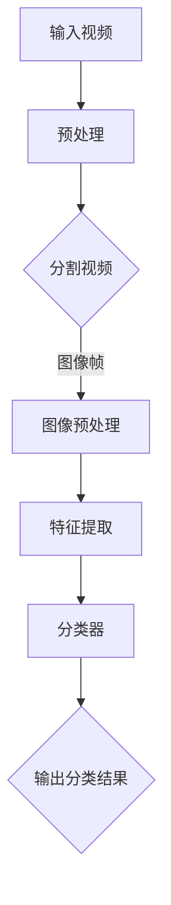
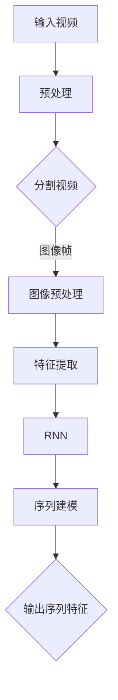
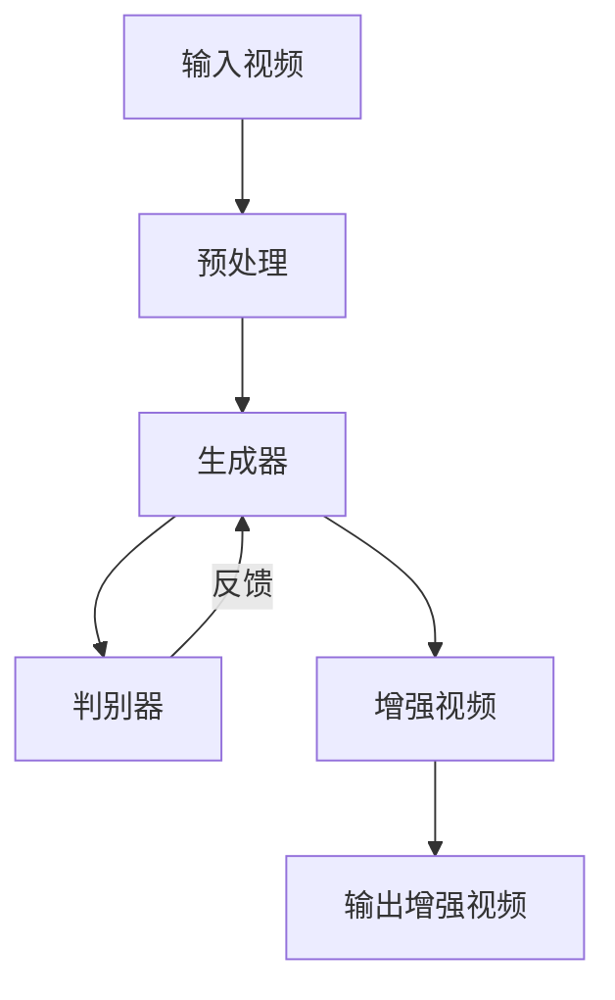

                 

### 文章标题

# 深度学习在视频理解中的最新进展

### 关键词

- 深度学习
- 视频理解
- 卷积神经网络
- 循环神经网络
- 生成对抗网络
- 图神经网络

### 摘要

本文旨在探讨深度学习在视频理解领域的最新进展，重点关注核心算法的应用、挑战与未来趋势。首先，我们将回顾深度学习的起源与发展，介绍视频理解的基本概念与目标。随后，详细阐述深度学习在视频理解中的核心技术，包括卷积神经网络、循环神经网络及其变体、变分自编码器、生成对抗网络和图神经网络。接着，通过具体案例展示深度学习在视频监控、内容审核和虚拟现实中的应用。最后，分析深度学习在视频理解中的挑战和未来趋势，并总结全文，提供相关工具与资源。本文旨在为读者提供一个全面而深入的视角，帮助理解深度学习在视频理解中的前沿发展。

## 第一部分：深度学习基础与视频理解概述

### 1.1 深度学习简介

#### 1.1.1 深度学习的起源与发展

深度学习作为一种人工智能的重要分支，起源于20世纪40年代的人工智能研究。1950年，艾伦·图灵提出了图灵测试，标志着人工智能研究的起步。随着计算机性能的提升和大数据时代的到来，深度学习在20世纪80年代开始逐步发展。1986年，Rumelhart、Hinton和Williams等人提出了反向传播算法（Backpropagation），这一算法为深度学习模型训练奠定了基础。

20世纪90年代，由于计算资源和数据量的限制，深度学习的研究和应用受到一定程度的阻碍。然而，随着硬件性能的提升和大数据技术的进步，深度学习在21世纪初迎来了爆发式发展。2006年，Hinton等人重新激发了深度学习的热潮，通过改进算法和优化硬件，成功训练了大规模神经网络，实现了在图像识别、语音识别等领域的突破。

#### 1.1.2 深度学习的基本原理

深度学习基于多层神经网络，通过逐层提取特征，实现对复杂数据的建模和理解。其基本原理包括以下几个方面：

1. **多层神经网络**：深度学习模型通常由多个隐藏层组成，每层网络负责提取不同层次的特征。输入数据经过层层传递，最终在输出层得到预测结果。

2. **激活函数**：激活函数用于引入非线性因素，使神经网络能够学习复杂函数。常见的激活函数包括ReLU（Rectified Linear Unit）、Sigmoid和Tanh等。

3. **反向传播算法**：反向传播算法通过计算损失函数关于网络参数的梯度，更新网络权重，实现模型的优化。这一过程包括前向传播和后向传播两个步骤。

4. **优化算法**：深度学习训练过程中常使用优化算法来加速收敛，如随机梯度下降（SGD）、Adam等。

5. **正则化方法**：正则化方法用于防止过拟合，提高模型泛化能力。常见的正则化方法包括L1正则化、L2正则化和Dropout等。

### 1.2 视频理解的基本概念

视频理解是指利用计算机技术对视频数据进行分析和处理，实现对视频内容的理解和解读。视频理解涉及到多个领域，包括计算机视觉、自然语言处理、机器学习等。

#### 1.2.1 视频数据的特点

视频数据具有以下特点：

1. **高维度**：视频数据由大量连续的图像帧组成，每个图像帧包含丰富的颜色信息和空间信息，导致数据维度非常高。

2. **动态性**：视频数据是动态变化的，图像帧之间存在时间序列关系，需要考虑时序信息。

3. **冗余性**：视频数据中存在大量冗余信息，如背景、重复动作等，需要有效提取关键特征。

4. **复杂性**：视频数据包含多种复杂场景和目标，如运动目标、遮挡、光照变化等，给视频理解带来了挑战。

#### 1.2.2 视频理解的目标与挑战

视频理解的目标包括：

1. **内容提取**：从视频数据中提取关键内容，如人物、动作、场景等。

2. **行为识别**：识别视频中人物或物体的行为和动作。

3. **事件检测**：检测视频中发生的事件，如交通违规、暴力行为等。

4. **情感分析**：分析视频中人物的情感状态。

视频理解面临的挑战包括：

1. **数据多样性**：视频数据来源广泛，存在大量的多样性，如不同拍摄角度、光照条件、场景等。

2. **时间序列处理**：视频数据具有时间序列特性，需要考虑时间维度上的关联性。

3. **高效计算**：视频数据量庞大，对计算资源有较高要求，需要优化算法和硬件加速。

4. **可解释性**：深度学习模型通常具有较好的性能，但缺乏可解释性，难以理解模型的工作机制。

### 1.3 视频理解的技术框架

视频理解的技术框架主要包括视频编解码技术、视频数据处理方法、视频特征提取技术和深度学习模型应用等方面。

#### 1.3.1 视频编解码技术

视频编解码技术用于压缩和解压缩视频数据，提高数据传输和存储效率。常见的视频编解码标准包括H.264、HEVC、VP9等。编解码技术涉及到视频数据采样、量化、编码和解码等步骤。

#### 1.3.2 视频数据处理方法

视频数据处理方法包括预处理、去噪、增强等，用于提高视频数据的质量和可用性。预处理步骤包括图像校正、旋转、缩放等；去噪方法包括空间滤波、频域滤波等；增强方法包括对比度增强、亮度调整等。

#### 1.3.3 视频特征提取技术

视频特征提取技术用于从视频数据中提取具有区分性的特征，用于后续的深度学习模型训练和推理。常见的视频特征包括颜色特征、纹理特征、形状特征、运动特征等。

#### 1.3.4 视频特征提取技术

视频特征提取技术是视频理解的重要环节，常见的特征提取方法包括：

1. **颜色特征**：基于颜色直方图、颜色矩等，用于描述视频的视觉内容。

2. **纹理特征**：基于纹理梯度、纹理能量等，用于描述视频的纹理信息。

3. **形状特征**：基于轮廓、区域增长等，用于描述视频的形状信息。

4. **运动特征**：基于光流、运动矢量等，用于描述视频的运动信息。

#### 1.4 深度学习在视频理解中的应用

深度学习在视频理解中具有广泛的应用，主要包括视频分类、目标检测、视频分割等方面。

1. **视频分类**：通过深度学习模型对视频进行分类，实现对视频内容的理解。常见的模型包括卷积神经网络（CNN）、循环神经网络（RNN）及其变体等。

2. **目标检测**：通过深度学习模型检测视频中的人或物体，确定其位置和属性。常见的模型包括YOLO、SSD、Faster R-CNN等。

3. **视频分割**：通过深度学习模型对视频进行时空分割，将连续的视频数据划分为不同的片段。常见的模型包括光流分割、深度神经网络分割等。

### 1.4 深度学习在视频理解中的应用

深度学习在视频理解中的应用已经取得了显著的成果，以下将分别介绍深度学习在视频分类、目标检测和视频分割中的应用。

#### 1.4.1 深度学习在视频分类中的应用

视频分类是指利用深度学习模型对视频内容进行分类，实现对视频内容的理解和解析。深度学习在视频分类中的应用主要包括以下方面：

1. **基于CNN的视频分类**：卷积神经网络（CNN）在图像分类领域取得了显著的成果，自然地也被应用于视频分类。CNN可以通过多层卷积和池化操作提取视频图像的特征，并利用全连接层进行分类。代表性的模型有C3D、I3D等。

2. **基于RNN的视频分类**：循环神经网络（RNN）及其变体，如长短期记忆网络（LSTM）和门控循环单元（GRU），可以有效地处理序列数据。在视频分类任务中，RNN可以捕捉视频的时间序列信息，实现对视频内容的分类。代表性的模型有VideoRNN、3D-CNN等。

3. **多模态融合**：视频数据通常包含多种模态，如图像、声音和文本等。通过多模态融合技术，可以充分利用不同模态的信息，提高视频分类的准确性。代表性的模型有MTCNN、VIBE等。

#### 1.4.2 深度学习在目标检测中的应用

目标检测是指从视频中检测出特定目标的位置和属性。深度学习在目标检测中的应用主要包括以下方面：

1. **基于CNN的目标检测**：CNN可以通过卷积和池化操作提取图像特征，并利用全连接层进行分类和定位。代表性的目标检测模型有YOLO、SSD、Faster R-CNN等。YOLO（You Only Look Once）通过单步检测方法实现高效的目标检测，SSD（Single Shot MultiBox Detector）通过多尺度特征图实现目标检测，Faster R-CNN通过区域建议网络和Fast R-CNN实现端到端的目标检测。

2. **基于RNN的目标检测**：RNN及其变体可以捕捉视频的时间序列信息，实现对目标轨迹的检测。代表性的模型有R-CNN、Temporal R-CNN等。R-CNN通过先检测区域，然后分类和定位的方法实现目标检测，Temporal R-CNN通过RNN捕捉目标轨迹，提高检测精度。

3. **基于GAN的目标检测**：生成对抗网络（GAN）可以生成大量高质量的目标检测数据，用于模型训练和评估。代表性的模型有GAN-Capsule、GAN-Based Object Detection等。GAN-Capsule通过GAN生成目标检测数据，结合Capsule Network实现目标检测，GAN-Based Object Detection通过GAN生成目标检测数据，结合检测网络实现目标检测。

#### 1.4.3 深度学习在视频分割中的应用

视频分割是指将连续的视频数据划分为不同的片段，实现对视频内容的分割和理解。深度学习在视频分割中的应用主要包括以下方面：

1. **基于CNN的视频分割**：CNN可以通过卷积和池化操作提取图像特征，并利用全连接层进行分类和分割。代表性的模型有DeepLab、U-Net等。DeepLab通过空洞卷积和上采样实现精细分割，U-Net通过编码器-解码器结构实现视频分割。

2. **基于RNN的视频分割**：RNN及其变体可以捕捉视频的时间序列信息，实现对视频内容的分割。代表性的模型有RNN-LSTM、VideoRNN等。RNN-LSTM通过LSTM捕捉视频的时间序列信息，实现视频分割，VideoRNN通过RNN捕捉视频的时间序列信息，实现视频分割。

3. **基于GAN的视频分割**：GAN可以生成高质量的视频分割数据，用于模型训练和评估。代表性的模型有GAN-Based Video Segmentation、GAN-VDNet等。GAN-Based Video Segmentation通过GAN生成视频分割数据，结合分割网络实现视频分割，GAN-VDNet通过GAN生成视频分割数据，结合VGG和U-Net实现视频分割。

### 总结

深度学习在视频理解中的应用已经取得了显著的成果，通过卷积神经网络、循环神经网络、生成对抗网络等核心技术，实现对视频分类、目标检测和视频分割的准确理解和解析。然而，视频理解任务仍然面临许多挑战，如数据多样性、时间序列处理和高效计算等。未来，随着硬件性能的提升和算法的优化，深度学习在视频理解领域将继续取得突破，为人工智能的发展带来更多可能性。

## 第二部分：深度学习在视频理解中的核心技术

深度学习在视频理解中扮演着至关重要的角色，其核心技术的应用极大地推动了这一领域的发展。本部分将深入探讨卷积神经网络（CNN）、循环神经网络（RNN）及其变体、变分自编码器（VAE）、生成对抗网络（GAN）和图神经网络（GNN）在视频理解中的应用。

### 2.1 卷积神经网络（CNN）在视频理解中的应用

卷积神经网络（CNN）是深度学习中最常用的模型之一，尤其在图像处理和计算机视觉领域取得了显著成果。CNN在视频理解中的应用主要体现在以下几个方面：

#### 2.1.1 CNN的基本结构

CNN的基本结构包括输入层、卷积层、池化层和全连接层。卷积层通过卷积操作提取图像特征，池化层用于减少特征图的大小，全连接层用于分类和回归。

#### 2.1.2 CNN在视频分类中的应用

在视频分类任务中，CNN通过处理连续的图像帧来提取时间序列特征。常见的模型有C3D、I3D和3D-CNN等。C3D模型通过三维卷积操作提取视频的时空特征，I3D模型通过残差块和扩张卷积提高模型的性能，3D-CNN模型通过多尺度特征融合实现视频分类。

#### 2.1.3 CNN在目标检测中的应用

CNN在目标检测中的应用主要体现在两阶段检测器和单阶段检测器中。Faster R-CNN、SSD和YOLO是典型的目标检测模型。Faster R-CNN通过区域建议网络（RPN）和Fast R-CNN实现目标检测，SSD通过多尺度特征图实现目标检测，YOLO通过单步检测方法实现高效目标检测。

#### 2.1.4 CNN在视频分割中的应用

视频分割是将连续的视频数据划分为不同的片段，实现对视频内容的分割和理解。CNN在视频分割中的应用主要体现在全卷积网络（FCN）和编码器-解码器结构中。DeepLab和U-Net是典型的视频分割模型。DeepLab通过空洞卷积和上采样实现精细分割，U-Net通过编码器-解码器结构实现视频分割。

### 2.2 循环神经网络（RNN）及其变体在视频理解中的应用

循环神经网络（RNN）是一种能够处理序列数据的神经网络，通过记忆单元（如LSTM和GRU）来捕捉序列中的长期依赖关系。RNN及其变体在视频理解中的应用主要体现在以下几个方面：

#### 2.2.1 RNN的基本原理

RNN的基本原理是通过循环结构将前一时间步的输出传递到下一时间步，从而处理序列数据。然而，标准的RNN在处理长序列时容易出现梯度消失或爆炸问题。为解决这一问题，Hochreiter和Schmidhuber提出了长短期记忆网络（LSTM）。

#### 2.2.2 LSTM与GRU模型

LSTM和GRU是RNN的两种常见变体，用于解决长序列依赖问题。LSTM通过引入门控单元（输入门、遗忘门和输出门）来控制信息的流动，从而有效地捕捉长期依赖关系。GRU通过简化LSTM的结构，合并输入门和遗忘门，降低计算复杂度。

#### 2.2.3 RNN在视频理解中的应用

在视频理解任务中，RNN及其变体可以用于视频分类、目标检测和视频分割等任务。VideoRNN模型通过RNN捕捉视频的时间序列特征，实现视频分类。Temporal R-CNN模型通过LSTM捕捉目标轨迹，实现视频目标检测。RNN-LSTM模型通过LSTM捕捉视频的时间序列特征，实现视频分割。

### 2.3 变分自编码器（VAE）在视频理解中的应用

变分自编码器（VAE）是一种生成模型，通过引入概率编码来学习数据的高层次表示。VAE在视频理解中的应用主要体现在数据生成、特征提取和模型压缩等方面。

#### 2.3.1 VAE的基本原理

VAE由编码器和解码器组成。编码器将输入数据映射到潜在空间，解码器将潜在空间的数据映射回原始数据。VAE通过最大化数据概率分布和最小化重建误差来训练模型。

#### 2.3.2 VAE在视频数据生成中的应用

VAE可以生成高质量的视频数据，用于模型训练和评估。通过在潜在空间中进行随机采样，VAE可以生成具有多样性的视频数据，提高模型的泛化能力。

#### 2.3.3 VAE在视频理解任务中的应用

VAE在视频理解任务中的应用主要体现在特征提取和模型压缩中。通过将视频数据映射到潜在空间，VAE可以提取视频数据的高层次特征，用于后续的深度学习任务。此外，VAE还可以用于模型压缩，通过压缩编码器和解码器的参数，降低模型的大小和计算复杂度。

### 2.4 生成对抗网络（GAN）在视频理解中的应用

生成对抗网络（GAN）是一种由生成器和判别器组成的对抗性模型。GAN通过两个网络的对抗训练，使生成器生成尽可能真实的数据。GAN在视频理解中的应用主要体现在数据增强、视频生成和特征提取等方面。

#### 2.4.1 GAN的基本原理

GAN由生成器和判别器组成。生成器生成数据，判别器判断生成数据的真实性。生成器和判别器通过对抗训练，使生成器生成的数据越来越真实。

#### 2.4.2 GAN在视频数据增强中的应用

GAN可以用于生成大量高质量的视频数据，用于模型训练和评估。通过在数据集中引入生成器的数据，可以增加数据的多样性，提高模型的泛化能力。

#### 2.4.3 GAN在视频生成中的应用

GAN可以生成高质量的合成视频，用于视频编辑和生成对抗任务。通过在生成器的潜在空间中进行随机采样，GAN可以生成具有多样性的视频内容。

#### 2.4.4 GAN在特征提取中的应用

GAN可以用于提取视频数据的高层次特征，用于后续的深度学习任务。通过将视频数据输入到GAN中，可以提取视频数据中的关键特征，提高模型的性能。

### 2.5 图神经网络（GNN）在视频理解中的应用

图神经网络（GNN）是一种用于处理图数据的神经网络，通过图卷积操作提取图数据的高层次特征。GNN在视频理解中的应用主要体现在视频序列建模和视频社交网络分析等方面。

#### 2.5.1 GNN的基本原理

GNN通过图卷积操作对图数据进行处理。图卷积操作包括图池化、邻接矩阵计算和图卷积层等。GNN可以提取图数据中的结构信息和节点属性信息。

#### 2.5.2 GNN在视频序列建模中的应用

GNN可以用于建模视频序列数据，提取视频序列的高层次特征。通过将视频序列数据表示为图结构，GNN可以捕捉视频序列中的时间依赖关系。

#### 2.5.3 GNN在视频社交网络分析中的应用

GNN可以用于分析视频社交网络中的用户行为和社交关系。通过将社交网络表示为图结构，GNN可以提取用户行为和社交关系的高层次特征，用于社交网络分析。

### 总结

深度学习在视频理解中的应用主要体现在卷积神经网络（CNN）、循环神经网络（RNN）及其变体、变分自编码器（VAE）、生成对抗网络（GAN）和图神经网络（GNN）等方面。这些核心技术的应用使得视频理解任务取得了显著的进展，为人工智能的发展带来了新的可能性。然而，视频理解任务仍然面临许多挑战，如数据多样性、时间序列处理和高效计算等。未来，随着硬件性能的提升和算法的优化，深度学习在视频理解领域将继续取得突破，为人工智能的发展带来更多可能性。

## 第三部分：深度学习在视频理解中的应用案例

深度学习在视频理解领域的应用已经取得了显著的成果，本部分将详细介绍深度学习在视频监控、内容审核和虚拟现实等领域的具体应用案例，并通过实际案例进行分析和讲解。

### 3.1 深度学习在视频监控中的应用

视频监控是指利用摄像头等设备对公共区域、场所或特定目标进行实时监控，并通过图像处理和分析技术实现对监控内容的实时识别、跟踪和报警等功能。深度学习在视频监控中的应用主要包括目标检测、行为识别和异常检测等方面。

#### 3.1.1 视频监控中的目标检测

目标检测是视频监控中的基础任务，通过检测视频中的特定目标，如行人、车辆等，实现对监控内容的实时监控和分析。深度学习模型在目标检测中的应用主要包括以下几种：

1. **YOLO（You Only Look Once）**：YOLO是一种单阶段目标检测模型，通过将目标检测任务分解为多个网格单元，在每个单元内预测目标的边界框和类别概率。YOLO具有实时检测速度快、准确度高等优点，被广泛应用于视频监控领域。

2. **SSD（Single Shot MultiBox Detector）**：SSD是一种多阶段目标检测模型，通过在不同的尺度特征图上预测目标，实现了高效的实时目标检测。SSD在视频监控中广泛应用于行人检测、车辆检测等任务。

3. **Faster R-CNN（Region-based Convolutional Neural Network）**：Faster R-CNN是一种两阶段目标检测模型，通过先检测候选区域，然后对这些区域进行分类和定位。Faster R-CNN在视频监控中具有较高的检测准确率和实时性，适用于复杂场景的目标检测。

**案例分析**：在某城市交通监控项目中，使用深度学习模型进行车辆检测。通过在摄像头前部署YOLOv5模型，对实时视频流进行目标检测，可以实现对车辆的实时识别和跟踪。系统通过对检测到的车辆进行轨迹分析，实现了车辆的交通流量统计和异常事件报警等功能。

#### 3.1.2 视频监控中的行为识别

行为识别是指通过分析视频内容，识别和分类其中的行为或事件。深度学习模型在行为识别中的应用主要包括以下几种：

1. **C3D（3D Convolutional Neural Network）**：C3D模型是一种用于视频分类的三维卷积神经网络，通过处理连续的图像帧，提取视频的时间序列特征。C3D模型在行为识别任务中具有较高的准确率，适用于运动捕捉、体育分析等领域。

2. **R-CNN（Region-based Convolutional Neural Network）**：R-CNN模型是一种用于目标检测和分类的深度学习模型，通过先检测候选区域，然后对区域进行分类。R-CNN模型在行为识别任务中可以通过检测视频中的目标，实现对行为的识别和分类。

3. **ST-GCN（Spatial Temporal Graph Convolutional Network）**：ST-GCN模型是一种用于视频行为识别的图神经网络模型，通过将视频数据表示为图结构，提取视频的空间和时间特征。ST-GCN模型在行为识别任务中具有较好的性能，适用于复杂场景的行为识别。

**案例分析**：在某智能安防项目中，使用深度学习模型进行行为识别。通过在摄像头前部署C3D模型，对实时视频流进行处理，可以实现对行人的行为识别，如行走、奔跑、滑倒等。系统通过对检测到的行为进行分析，实现了对潜在危险的实时预警和报警。

#### 3.1.3 视频监控中的异常检测

异常检测是指通过分析视频内容，识别和检测其中的异常事件或行为。深度学习模型在异常检测中的应用主要包括以下几种：

1. **One-Class SVM（One-Class Support Vector Machine）**：One-Class SVM是一种无监督学习模型，用于检测数据中的异常值。在视频监控中，One-Class SVM可以通过学习正常行为的特征分布，检测视频中的异常事件。

2. **Isolation Forest（Isolation Forest）**：Isolation Forest是一种基于随机森林的异常检测模型，通过随机选择特征和样本进行分割，实现异常检测。在视频监控中，Isolation Forest可以通过对视频内容的特征分析，识别异常事件。

3. **深度学习聚类模型**：如K-Means、DBSCAN等聚类模型，通过将视频内容进行聚类分析，识别异常事件。深度学习聚类模型在视频监控中可以通过对视频内容的时间序列特征进行聚类，识别异常行为。

**案例分析**：在某商场安全监控项目中，使用深度学习模型进行异常检测。通过在摄像头前部署K-Means聚类模型，对实时视频流进行分析，可以实现对顾客行为的异常检测，如偷窃行为、异常滞留等。系统通过对检测到的异常事件进行报警，提高了商场的安全管理水平。

### 3.2 深度学习在视频内容审核中的应用

视频内容审核是指通过技术手段对视频内容进行审核，识别和过滤不良、违规、暴力等有害信息。深度学习在视频内容审核中的应用主要包括视频分类、视频内容检测和视频内容生成等方面。

#### 3.2.1 视频内容分类

视频内容分类是指通过分析视频内容，将其归类到不同的类别中。深度学习模型在视频内容分类中的应用主要包括以下几种：

1. **CNN（Convolutional Neural Network）**：CNN模型通过卷积和池化操作，从视频图像中提取特征，实现视频内容分类。常见的CNN模型有VGG、ResNet等。

2. **RNN（Recurrent Neural Network）**：RNN模型通过处理视频的时间序列信息，实现视频内容分类。常见的RNN模型有LSTM、GRU等。

3. **多模态融合模型**：多模态融合模型通过融合视频、音频和文本等不同模态的信息，实现视频内容分类。常见的多模态融合模型有MTCNN、ViLBERT等。

**案例分析**：在某短视频平台内容审核项目中，使用深度学习模型进行视频内容分类。通过在摄像头前部署ResNet模型，对上传的视频进行实时分类，可以实现对不良、违规视频的自动过滤和标记。系统通过对分类结果进行审核，提高了平台的监管能力和用户体验。

#### 3.2.2 视频内容检测

视频内容检测是指通过分析视频内容，识别和检测其中的有害、不良信息。深度学习模型在视频内容检测中的应用主要包括以下几种：

1. **GAN（Generative Adversarial Network）**：GAN模型通过生成器和判别器的对抗训练，生成高质量的合成视频，用于模型训练和评估。在视频内容检测中，GAN可以通过生成和检测对抗性样本，提高检测模型的准确率。

2. **基于注意力机制的模型**：基于注意力机制的模型通过学习视频图像中的重要区域，实现视频内容检测。常见的注意力机制模型有SENet、CBAM等。

3. **基于语义分割的模型**：基于语义分割的模型通过将视频图像划分为不同的区域，实现视频内容检测。常见的语义分割模型有U-Net、DeepLab等。

**案例分析**：在某社交媒体平台上，使用深度学习模型进行视频内容检测。通过在摄像头前部署GAN模型，对上传的视频进行实时检测，可以识别和过滤不良、违规视频。系统通过对检测结果进行审核，提高了平台的监管能力和用户体验。

#### 3.2.3 视频内容生成

视频内容生成是指通过技术手段，生成具有特定内容和风格的视频。深度学习模型在视频内容生成中的应用主要包括以下几种：

1. **生成对抗网络（GAN）**：GAN模型通过生成器和判别器的对抗训练，生成高质量的合成视频。在视频内容生成中，GAN可以通过对视频进行风格迁移、内容生成等操作，实现视频内容的创作。

2. **变分自编码器（VAE）**：VAE模型通过编码器和解码器，将视频数据映射到潜在空间，实现视频内容的生成。在视频内容生成中，VAE可以通过在潜在空间中进行随机采样，生成具有多样性的视频内容。

3. **视频生成对抗网络（V-GAN）**：V-GAN模型通过生成器和判别器的对抗训练，生成高质量的合成视频。在视频内容生成中，V-GAN可以通过对视频进行内容增强、风格迁移等操作，实现视频内容的创作。

**案例分析**：在某视频编辑项目中，使用深度学习模型进行视频内容生成。通过在摄像头前部署V-GAN模型，可以对输入的视频进行实时编辑，实现视频内容的添加、删除和替换等操作。系统通过对生成结果进行审核，提高了视频创作的效率和效果。

### 3.3 深度学习在虚拟现实与增强现实中的应用

虚拟现实（VR）和增强现实（AR）是通过计算机技术模拟和增强现实环境的技术，深度学习在虚拟现实和增强现实中的应用主要包括视频增强、视频编码与传输优化和视频交互与沉浸式体验等方面。

#### 3.3.1 视频增强

视频增强是指通过技术手段提高视频的视觉效果和清晰度。深度学习模型在视频增强中的应用主要包括以下几种：

1. **超分辨率重建**：通过深度学习模型对低分辨率视频进行超分辨率重建，提高视频的清晰度。常见的超分辨率重建模型有SRCNN、EDSR等。

2. **图像修复**：通过深度学习模型修复视频中的破损、模糊或失真的图像部分，提高视频的完整性和清晰度。常见的图像修复模型有EDVR、GAN-LVR等。

3. **视频噪声消除**：通过深度学习模型消除视频中的噪声，提高视频的清晰度和视觉效果。常见的视频噪声消除模型有DnCNN、VDDNet等。

**案例分析**：在某虚拟现实项目中，使用深度学习模型进行视频增强。通过在摄像头前部署EDSR模型，对输入的视频进行实时超分辨率重建，可以显著提高视频的清晰度和画质。系统通过视频增强技术，实现了更真实的虚拟现实体验。

#### 3.3.2 视频编码与传输优化

视频编码与传输优化是指通过技术手段提高视频编码效率和传输速度。深度学习模型在视频编码与传输优化中的应用主要包括以下几种：

1. **基于内容的编码优化**：通过深度学习模型分析视频内容，实现视频编码的优化。常见的编码优化模型有VLC、CRF等。

2. **视频压缩算法**：通过深度学习模型实现视频压缩算法，降低视频数据的大小和传输带宽。常见的视频压缩算法有H.264、HEVC等。

3. **传输优化策略**：通过深度学习模型分析网络传输状态，实现视频传输的优化。常见的传输优化策略有动态码率控制、QoS等。

**案例分析**：在某视频直播项目中，使用深度学习模型进行视频编码与传输优化。通过在编码器前部署VLC模型，对输入的视频进行内容驱动的编码优化，可以降低视频数据的大小和传输带宽。系统通过传输优化策略，实现了流畅的视频直播体验。

#### 3.3.3 视频交互与沉浸式体验

视频交互与沉浸式体验是指通过技术手段提高用户的交互体验和沉浸感。深度学习模型在视频交互与沉浸式体验中的应用主要包括以下几种：

1. **手势识别**：通过深度学习模型识别用户的手势，实现视频交互。常见的手势识别模型有CNN、RNN等。

2. **语音识别**：通过深度学习模型识别用户的语音，实现视频交互。常见的语音识别模型有DNN、HMM等。

3. **视觉注意力机制**：通过深度学习模型学习用户的视觉注意力，实现视频内容的关键帧提取和交互。常见的注意力机制模型有CBAM、SENet等。

**案例分析**：在某虚拟现实项目中，使用深度学习模型进行视频交互与沉浸式体验。通过在摄像头前部署CNN模型，识别用户的手势，实现视频内容的选择和播放控制。通过在音频处理模块中部署语音识别模型，识别用户的语音指令，实现视频内容的选择和播放控制。系统通过视觉注意力机制，提取视频内容的关键帧，实现更自然的交互体验。

### 总结

深度学习在视频监控、内容审核、虚拟现实和增强现实等领域具有广泛的应用。通过目标检测、行为识别、异常检测、视频内容分类、视频内容检测、视频内容生成、视频增强、视频编码与传输优化、视频交互与沉浸式体验等技术手段，深度学习为视频理解领域带来了新的可能性和发展机遇。未来，随着深度学习技术的不断发展和应用，视频理解领域将继续取得突破，为人工智能的发展和社会进步带来更多价值。

## 第四部分：深度学习在视频理解中的挑战与未来趋势

尽管深度学习在视频理解领域取得了显著的成果，但仍面临诸多挑战。以下是深度学习在视频理解中的一些主要挑战和未来的发展趋势。

### 4.1 深度学习在视频理解中的挑战

#### 4.1.1 数据集的多样性与代表性

视频理解任务需要处理大量多样化的数据，如不同的场景、拍摄角度、光照条件、天气变化等。然而，现有的数据集往往具有局限性，不能完全覆盖所有可能的场景。这导致训练得到的模型在特定场景下可能表现不佳，降低了模型的泛化能力。因此，构建更加多样化和代表性的数据集是深度学习在视频理解中的一大挑战。

#### 4.1.2 模型的可解释性与透明性

深度学习模型，尤其是复杂的大型网络，往往被视为“黑箱”。模型内部的工作机制不透明，难以解释。这在某些应用场景中，如医疗影像分析、金融风控等，对模型的可解释性有较高要求。提升模型的透明性和可解释性，使决策过程更加可信，是深度学习在视频理解中的另一个挑战。

#### 4.1.3 能效优化与硬件加速

视频理解任务通常需要大量的计算资源，这给硬件设备带来了巨大的压力。优化模型的计算效率，减少资源消耗，是提高深度学习应用可行性的关键。此外，随着硬件技术的不断发展，如何充分利用硬件加速技术（如GPU、TPU等）来提升模型的训练和推理速度，也是一个重要的研究方向。

### 4.2 深度学习在视频理解中的未来趋势

#### 4.2.1 多模态数据的融合与处理

视频理解任务往往涉及到多种模态的数据，如图像、声音、文本等。未来的发展趋势是将这些多模态数据融合在一起，利用深度学习模型进行统一处理。通过多模态数据的融合，可以更全面地理解视频内容，提高模型的准确性和鲁棒性。

#### 4.2.2 交互式视频理解与学习

交互式视频理解与学习是指通过用户与系统的交互，动态调整和优化视频理解模型。这种交互式方法不仅可以提高模型的准确性，还可以增强用户体验。未来的发展趋势是将交互元素融入视频理解系统，使模型能够根据用户需求进行自适应调整。

#### 4.2.3 视频理解的自动化与智能化

视频理解的自动化与智能化是未来的重要方向。通过利用深度学习和人工智能技术，可以实现视频内容的自动分析、分类、标注和生成。这些自动化和智能化技术将极大地提高视频处理的效率和质量，为各行业带来新的应用场景。

### 总结

深度学习在视频理解中面临着多样性与代表性、可解释性、能效优化等挑战。同时，未来的发展趋势包括多模态数据的融合、交互式理解与学习和自动化与智能化。通过不断克服这些挑战和探索新的发展方向，深度学习将在视频理解领域发挥更大的作用，推动人工智能技术的进步。

### 附录 A：深度学习在视频理解中的工具与资源

深度学习在视频理解领域的发展离不开各种工具和资源的支持。以下是几个主流的深度学习框架、视频处理库、数据集与竞赛平台，它们为深度学习研究人员提供了丰富的资源和技术支持。

#### A.1 主流深度学习框架

1. **TensorFlow**：由谷歌开发的开源深度学习框架，广泛应用于图像、语音、自然语言处理和视频理解等领域。
2. **PyTorch**：由Facebook AI研究院开发的开源深度学习框架，以其动态计算图和灵活的接口受到广泛欢迎。
3. **Keras**：一个高层次的深度学习API，用于构建和训练神经网络，支持TensorFlow和PyTorch等底层框架。
4. **MXNet**：由Apache软件基金会支持的开源深度学习框架，支持多种编程语言，具有良好的灵活性和可扩展性。

#### A.2 视频处理库

1. **OpenCV**：一个开源的计算机视觉库，提供丰富的图像和视频处理功能，包括滤波、边缘检测、运动跟踪等。
2. **FFmpeg**：一个开源的多媒体处理框架，支持视频编码、解码、剪切、合并等多种操作。
3. **MoviePy**：一个用于视频编辑的Python库，支持视频剪辑、添加特效、音频处理等操作。
4. **opencv-contrib**：OpenCV的一个扩展库，包含一些额外的视频处理工具和算法。

#### A.3 数据集与竞赛平台

1. **YouTube-VOS**：一个用于视频对象分割的数据集，包含大量带有标签的视频序列。
2. **UAD**：一个用于视频理解和分析的数据集，包含多种不同场景和任务的标签。
3. **VOC**：一个用于目标检测和识别的数据集，包含大量带有标签的图像和视频。
4. **ImageNet**：一个广泛使用的图像识别数据集，包含大量不同类别的高分辨率图像。
5. **AI Challenger**：一个提供多种AI竞赛的数据集和平台，包括视频理解任务。
6. **ICCV**：国际计算机视觉会议，提供丰富的视频理解相关论文和数据集。

### 使用示例

以下是使用PyTorch和OpenCV进行视频分类的简单示例代码：

```python
import torch
import torchvision
import cv2

# 加载预训练的模型
model = torchvision.models.resnet50(pretrained=True)
model.eval()

# 加载图像数据
video_path = 'path/to/video.mp4'
cap = cv2.VideoCapture(video_path)

while cap.isOpened():
    ret, frame = cap.read()
    if not ret:
        break
    
    # 对图像进行预处理
    frame = cv2.resize(frame, (224, 224))
    frame = cv2.cvtColor(frame, cv2.COLOR_BGR2RGB)
    frame = torch.tensor(frame).float()
    frame = frame.unsqueeze(0)

    # 进行分类预测
    with torch.no_grad():
        output = model(frame)
    _, predicted = torch.max(output, 1)

    # 显示分类结果
    label = torchvision.datasets.ImageNet.classes[predicted.item()]
    cv2.putText(frame, label, (10, 30), cv2.FONT_HERSHEY_SIMPLEX, 1, (255, 0, 0), 2)
    cv2.imshow('Frame', frame)

    if cv2.waitKey(1) & 0xFF == ord('q'):
        break

cap.release()
cv2.destroyAllWindows()
```

### 注意事项

1. 在使用深度学习框架和视频处理库时，确保安装相应的依赖项和版本兼容性。
2. 在处理视频数据时，注意数据的安全性和隐私保护。
3. 对于开源数据集和竞赛平台，遵循相应的使用规则和版权声明。

### 拓展阅读

- [TensorFlow官方网站](https://www.tensorflow.org/)
- [PyTorch官方网站](https://pytorch.org/)
- [OpenCV官方网站](https://opencv.org/)
- [YouTube-VOS官方网站](https://ai Challenger.com/dataset/youtube-vos)
- [AI Challenger官方网站](https://ai Challenger.com/)

通过以上工具和资源的介绍，读者可以更全面地了解深度学习在视频理解中的应用，并开展相关的研究和实践。

### 附录 B：深度学习在视频理解中的 Mermaid 流程图

为了更直观地展示深度学习在视频理解中的流程，我们使用Mermaid语言绘制了一些流程图。以下是一些关键流程的示例：

#### B.1 CNN在视频分类中的应用流程



#### B.2 RNN在视频序列建模中的应用流程



#### B.3 GAN在视频数据增强中的应用流程



这些流程图展示了从视频预处理、特征提取到模型训练和输出的整个过程。通过这些图，读者可以更清晰地理解各个步骤之间的关联和作用。

### 附录 C：深度学习在视频理解中的伪代码与数学公式

在深度学习模型的实现过程中，伪代码和数学公式是理解模型工作原理的关键。以下是一些常见深度学习模型的核心算法和数学公式的示例：

#### C.1 卷积神经网络（CNN）的伪代码

```python
# 初始化CNN模型
model = initialize_cnn()

# 定义损失函数和优化器
criterion = LossFunction()
optimizer = Optimizer(model.parameters())

# 训练模型
for epoch in range(num_epochs):
    for images, labels in data_loader:
        # 前向传播
        outputs = model(images)
        loss = criterion(outputs, labels)

        # 反向传播和优化
        optimizer.zero_grad()
        loss.backward()
        optimizer.step()

        # 输出训练状态
        print(f"Epoch [{epoch+1}/{num_epochs}], Loss: {loss.item()}")
```

#### C.2 循环神经网络（RNN）及其变体的伪代码

```python
# 初始化RNN模型
model = initialize_rnn()

# 定义损失函数和优化器
criterion = LossFunction()
optimizer = Optimizer(model.parameters())

# 训练模型
for epoch in range(num_epochs):
    for sequences, labels in data_loader:
        # 前向传播
        outputs, hidden = model(sequences)
        loss = criterion(outputs, labels)

        # 反向传播和优化
        optimizer.zero_grad()
        loss.backward()
        optimizer.step()

        # 输出训练状态
        print(f"Epoch [{epoch+1}/{num_epochs}], Loss: {loss.item()}")
```

#### C.3 生成对抗网络（GAN）的伪代码

```python
# 初始化GAN模型
model = initialize_gan()

# 定义损失函数和优化器
generator_loss = LossFunction()
discriminator_loss = LossFunction()
generator_optimizer = Optimizer(model.generator.parameters())
discriminator_optimizer = Optimizer(model.discriminator.parameters())

# 训练模型
for epoch in range(num_epochs):
    for real_images, _ in data_loader:
        # 训练生成器
        fake_images = model.generator(z)
        g_loss = generator_loss(model.discriminator(fake_images), True)

        # 训练判别器
        real_loss = discriminator_loss(model.discriminator(real_images), True)
        fake_loss = discriminator_loss(model.discriminator(fake_images), False)
        d_loss = (real_loss + fake_loss) / 2

        # 反向传播和优化
        generator_optimizer.zero_grad()
        g_loss.backward()
        generator_optimizer.step()

        discriminator_optimizer.zero_grad()
        d_loss.backward()
        discriminator_optimizer.step()

        # 输出训练状态
        print(f"Epoch [{epoch+1}/{num_epochs}], G Loss: {g_loss.item()}, D Loss: {d_loss.item()}")
```

#### C.4 数学模型与公式解释

以下是深度学习模型中常见的数学模型和公式的简要解释：

1. **卷积操作**：

   \( (f * g)(x) = \sum_{i=-\infty}^{\infty} \sum_{j=-\infty}^{\infty} f(i, j) \cdot g(x - i, y - j) \)

   卷积操作是CNN的核心，用于提取图像特征。这里，\( f \)和\( g \)分别表示卷积核和输入图像，\( (x, y) \)是卷积操作的位置。

2. **反向传播**：

   \( \frac{\partial L}{\partial w} = \frac{\partial L}{\partial a} \cdot \frac{\partial a}{\partial w} \)

   反向传播是深度学习训练的核心算法，用于更新模型权重。这里，\( L \)是损失函数，\( a \)是中间层激活值，\( w \)是权重。

3. **ReLU激活函数**：

   \( \text{ReLU}(x) = \max(0, x) \)

  ReLU（Rectified Linear Unit）是一种常用的激活函数，可以加速神经网络的训练，并防止梯度消失。

4. **生成对抗网络（GAN）损失函数**：

   \( G_L = -\log(D(G(z))) \)
   \( D_L = -\log(D(x)) \)

   这里，\( G(z) \)是生成器的输出，\( D(x) \)是判别器的输出。\( G_L \)和\( D_L \)分别是生成器和判别器的损失函数。

通过这些伪代码和数学公式的示例，读者可以更深入地理解深度学习模型的工作原理，为实际应用打下坚实的基础。同时，这些示例也提供了开发深度学习项目的基本框架和实现思路。

