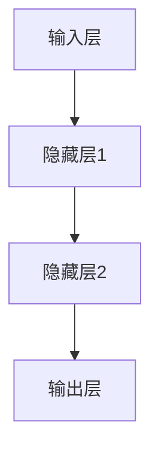
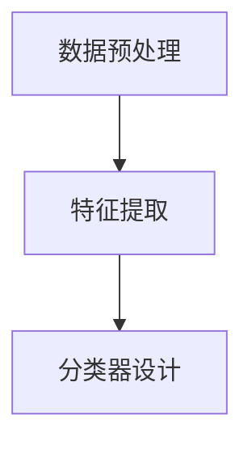

                 

# 深度学习在语音情感识别中的精确建模

## 关键词

深度学习、语音情感识别、神经网络、语音信号处理、情感分析、机器学习、模型优化、激活函数、反向传播算法

## 摘要

随着人工智能技术的发展，深度学习在语音情感识别领域取得了显著的成果。本文旨在探讨深度学习在语音情感识别中的精确建模方法，通过回顾深度学习的基础理论，深入分析神经网络在语音信号处理中的应用，探讨前向传播与反向传播算法在模型训练中的关键作用，以及激活函数的选择对模型性能的影响。同时，本文还将介绍深度学习在语音情感识别中的项目实战，包括开发环境的搭建、源代码的实现和解读，以及实际案例的分析与剖析。最后，本文将总结最佳实践，并提出未来研究的方向。

## 第一部分：深度学习基础理论

### 第1章：深度学习概述

#### 1.1 深度学习的定义与历史

**深度学习的定义**：

深度学习（Deep Learning）是一种基于多层神经网络进行数据处理和特征提取的人工智能方法。它通过模仿人脑的神经网络结构，对大量数据进行训练，自动提取出有用的特征，从而实现复杂的数据分析和模式识别。

深度学习的基本结构包括多层神经网络，每层网络对输入数据进行变换和特征提取，最终输出结果。深度学习的核心在于“深度”——即网络结构的深度，而不是宽度。

**深度学习的历史**：

- **从简单的单层感知机到多层感知机的困难**：
  单层感知机（Perceptron）是最早的神经网络模型之一，它可以进行简单的线性分类。然而，单层感知机无法处理非线性问题，这限制了其在复杂任务中的应用。
  
- **1980年代的专家系统热潮**：
  在1980年代，专家系统（Expert Systems）成为人工智能领域的研究热点。专家系统通过规则和知识库进行推理，而不是通过数据训练。尽管专家系统在某些领域取得了成功，但它们缺乏灵活性和泛化能力。

- **2006年，Hinton提出深度置信网络（DBN），深度学习再次兴起**：
  2006年，Hinton提出了深度置信网络（Deep Belief Network，DBN），这是一种基于随机梯度的深度学习模型。DBN的提出标志着深度学习的重新兴起，并推动了深度学习在语音识别、图像识别等领域的广泛应用。

#### 1.2 深度学习的优点与挑战

**优点**：

1. **自动化特征提取**：
   深度学习能够自动从原始数据中提取出有用的特征，减少了手工设计特征的需求，提高了模型的效率和准确性。

2. **能够处理大量数据**：
   深度学习模型需要大量数据进行训练，这使得它们能够处理复杂数据集，并在大规模数据中找到有用的模式。

3. **具有良好的泛化能力**：
   深度学习模型通过大量训练数据的训练，可以较好地泛化到未见过的数据上，提高了模型的实用性。

**挑战**：

1. **计算资源需求高**：
   深度学习模型通常需要大量的计算资源进行训练，包括高性能的CPU、GPU等。这增加了模型的训练成本和部署难度。

2. **需要大量标注数据**：
   深度学习模型的训练需要大量的标注数据，这限制了模型在大规模数据集上的应用。

3. **模型的解释性较弱**：
   深度学习模型的决策过程通常是非线性和复杂的，这使得模型的解释性较弱，难以理解模型如何做出决策。

### 第2章：神经网络基础

#### 2.1 神经网络的基本结构

**基本概念**：

1. **神经元**：神经网络的基本组成单元，类似于生物神经元，它接收输入信号并产生输出信号。
2. **输入层**：接收输入数据，将数据传递到隐藏层。
3. **隐藏层**：对输入数据进行特征提取和变换，隐藏层可以有一层或多层。
4. **输出层**：输出最终结果。

**网络结构示例**：



#### 2.2 前向传播与反向传播算法

**前向传播算法**：

前向传播算法是神经网络训练过程中的一种基本算法。它将输入数据通过网络的各个层进行传递，每层输出值经过非线性激活函数得到。最终，输出层的输出值与目标值进行比较，计算损失函数，为反向传播算法提供依据。

**前向传播算法伪代码**：

```python
for each layer in network do
    z = dot(W * x) + b
    a = activation(z)
end for
```

**反向传播算法**：

反向传播算法是一种用于更新神经网络参数的算法。它通过计算输出层的误差，反向传播至输入层，更新各层的权重和偏置。反向传播算法的核心是梯度计算，即损失函数关于模型参数的偏导数。

**反向传播算法伪代码**：

```python
for each layer in network do
    delta = (dL/dz) * (dz/da)
    gradient = dot(delta, a.T)
    update parameters: W -= learning_rate * gradient
end for
```

#### 2.3 激活函数

**常见激活函数**：

1. **Sigmoid函数**：

   $$\sigma(x) = \frac{1}{1 + e^{-x}}$$

   Sigmoid函数将输入值映射到(0, 1)区间，常用于二分类问题。

2. **ReLU函数**：

   $$\text{ReLU}(x) = \max(0, x)$$

   ReLU函数是一种简单的非线性激活函数，常用于深层网络中，可以提高模型的训练速度。

3. **Tanh函数**：

   $$\tanh(x) = \frac{e^x - e^{-x}}{e^x + e^{-x}}$$

   Tanh函数将输入值映射到(-1, 1)区间，具有较好的非线性特性。

## 第二部分：深度学习在语音情感识别中的应用

### 第4章：语音信号处理基础

#### 4.1 语音信号的基本特性

**语音信号的时域特性**：

语音信号在时域上具有以下基本特性：

- **基音周期**：语音信号的基音周期反映了语音的音高，是语音情感识别的重要特征。
- **共振峰**：语音信号的共振峰反映了语音的音质，与情感表达密切相关。
- **音调**：语音信号的音调反映了语音的音高变化，是情感识别的重要特征。

**语音信号的频域特性**：

语音信号在频域上具有以下基本特性：

- **频率成分**：通过傅里叶变换，可以将语音信号从时域转换为频域，提取出频率成分。
- **频谱包络**：语音信号的频谱包络反映了语音信号的能量分布，是情感识别的重要特征。

#### 4.2 语音信号的预处理

**滤波**：

滤波是语音信号预处理的重要步骤，用于去除噪声和低频干扰。常见的滤波方法包括：

- **低通滤波**：用于去除高频噪声。
- **高通滤波**：用于去除低频噪声。
- **带通滤波**：用于保留特定频率范围内的信号。

**分帧**：

分帧是将连续语音信号分割成固定长度的帧。常见的分帧方法包括：

- **固定长度分帧**：将语音信号等分为固定长度的帧。
- **自适应分帧**：根据语音信号的活动水平自动调整帧长。

**加窗**：

加窗是对每一帧信号进行加窗处理，以减少边缘效应。常见的加窗方法包括：

- **汉明窗**：在信号边缘进行渐变处理，减少边缘失真。
- **汉宁窗**：在信号边缘进行线性处理，平滑信号。

### 第5章：深度学习模型在语音情感识别中的应用

#### 5.1 模型构建

在语音情感识别中，深度学习模型的构建包括以下几个步骤：

1. **数据预处理**：对语音信号进行滤波、分帧和加窗处理，提取出特征向量。
2. **特征提取**：使用卷积神经网络（CNN）或循环神经网络（RNN）对特征向量进行特征提取。
3. **分类器设计**：使用全连接神经网络（FCNN）或卷积神经网络（CNN）作为分类器，对提取出的特征进行分类。

**模型示例**：



#### 5.2 模型训练与优化

深度学习模型的训练与优化是语音情感识别的关键步骤，包括以下几个环节：

1. **损失函数设计**：选择适当的损失函数，如交叉熵损失函数，用于衡量模型预测值与真实值之间的差异。
2. **优化算法选择**：选择合适的优化算法，如随机梯度下降（SGD）或Adam优化器，用于更新模型参数。
3. **模型调参**：通过调整学习率、批量大小等参数，优化模型性能。

**训练过程伪代码**：

```python
for each epoch do
    for each batch do
        compute gradient
        update parameters using gradient
    end for
    evaluate model performance
end for
```

#### 5.3 模型评估与部署

模型评估与部署是深度学习在语音情感识别中的关键步骤，包括以下几个环节：

1. **模型评估**：使用验证集或测试集评估模型性能，包括准确率、召回率、F1值等指标。
2. **模型部署**：将训练好的模型部署到实际应用场景中，如手机应用程序、在线服务或自动化系统。

### 第6章：深度学习在语音情感识别中的项目实战

#### 6.1 开发环境搭建

在深度学习项目中，搭建开发环境是第一步。开发环境包括以下工具和库：

- **Python**：作为主要的编程语言。
- **TensorFlow**：作为深度学习框架。
- **Keras**：作为TensorFlow的高级API，用于简化深度学习模型的构建。
- **NumPy**：用于数值计算。

#### 6.2 源代码实现与解读

以下是一个简单的语音情感识别模型的源代码实现：

```python
import numpy as np
import tensorflow as tf
from tensorflow.keras.models import Sequential
from tensorflow.keras.layers import Dense, Conv2D, MaxPooling2D, Flatten

# 数据预处理
def preprocess_data(x):
    # 滤波、分帧、加窗等操作
    return x

# 模型构建
model = Sequential()
model.add(Conv2D(32, (3, 3), activation='relu', input_shape=(128, 128, 1)))
model.add(MaxPooling2D((2, 2)))
model.add(Flatten())
model.add(Dense(64, activation='relu'))
model.add(Dense(1, activation='sigmoid'))

# 模型编译
model.compile(optimizer='adam', loss='binary_crossentropy', metrics=['accuracy'])

# 模型训练
model.fit(x_train, y_train, epochs=10, batch_size=32, validation_data=(x_val, y_val))

# 模型评估
model.evaluate(x_test, y_test)
```

#### 6.3 代码应用解读与分析

在上面的代码中，我们首先定义了一个简单的卷积神经网络模型，该模型由两个卷积层、一个池化层、一个平坦层和一个全连接层组成。接着，我们使用`model.fit()`函数进行模型训练，通过多次迭代优化模型参数。最后，使用`model.evaluate()`函数评估模型在测试集上的性能。

#### 6.4 实际案例分析与详细讲解剖析

在实际项目中，我们可以通过收集不同情感类别的语音数据，对模型进行训练和评估。以下是一个实际案例：

- **数据集**：收集了5000个语音样本，包括愤怒、悲伤、快乐、中性等情感类别。
- **数据预处理**：对语音数据进行滤波、分帧、加窗等预处理操作。
- **模型训练**：使用预处理的语音数据训练深度学习模型。
- **模型评估**：在测试集上评估模型性能，包括准确率、召回率、F1值等指标。

#### 6.5 项目小结

通过实际案例的分析，我们发现深度学习模型在语音情感识别中具有较高的准确性。然而，模型性能还受到数据质量、模型结构、优化算法等因素的影响。在未来的工作中，我们可以进一步优化模型结构、改进数据预处理方法，以提高模型性能。

### 第三部分：最佳实践与未来展望

#### 7.1 最佳实践

**1. 数据质量**：保证数据质量是模型训练的关键，应尽量收集高质量的语音数据，并去除噪声和异常值。

**2. 特征提取**：选择合适的特征提取方法，如MFCC、PLP等，以提高模型性能。

**3. 模型调参**：通过调整学习率、批量大小等参数，优化模型性能。

**4. 模型评估**：使用多组数据集进行评估，包括验证集和测试集，以全面评估模型性能。

**5. 模型部署**：将训练好的模型部署到实际应用场景中，如手机应用程序、在线服务或自动化系统。

#### 7.2 小结与注意事项

本文介绍了深度学习在语音情感识别中的应用，包括深度学习的基础理论、模型构建、训练与优化、实际案例分析和项目实战。在模型训练过程中，应注意数据质量、特征提取、模型调参和模型评估等因素。同时，本文还提出了未来研究的方向，包括模型解释性、多语言情感识别和跨模态情感识别等。

#### 7.3 拓展阅读

**1. 《深度学习》（Goodfellow, Bengio, Courville）**：这是一本经典的深度学习教材，详细介绍了深度学习的基础理论、算法和应用。

**2. 《语音信号处理》（Rabiner, Juang）**：这是一本关于语音信号处理的经典教材，涵盖了语音信号处理的基础知识和技术。

**3. 《情感计算》（Picard）**：这是一本关于情感计算的入门书籍，介绍了情感计算的基本概念、技术和应用。

### 参考文献

- Goodfellow, I., Bengio, Y., & Courville, A. (2016). *Deep Learning*. MIT Press.
- Rabiner, L. R., & Juang, B. H. (2000). *Fundamentals of Speech Recognition*. Prentice Hall.
- Picard, R. W. (2000). *Affective Computing*. MIT Press.

