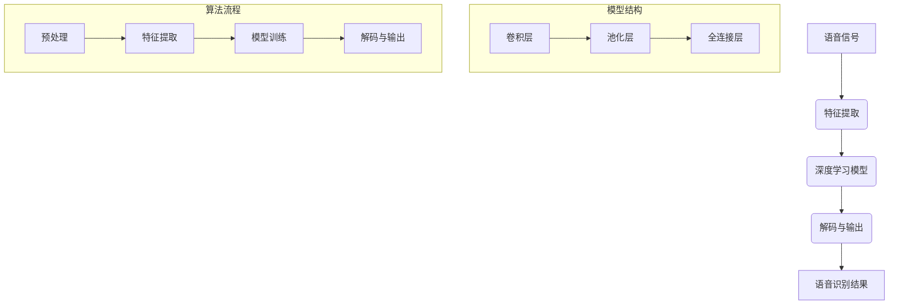

                 

### 文章标题

《深度学习在语音识别中的最新突破》

关键词：深度学习、语音识别、卷积神经网络、循环神经网络、长短时记忆网络、语音识别系统、开源工具

摘要：本文将深入探讨深度学习在语音识别领域的最新突破，从背景介绍、核心概念与联系、核心算法原理讲解、实践应用等多个角度全面解析深度学习在语音识别中的应用与发展。通过对卷积神经网络（CNN）、循环神经网络（RNN）、长短时记忆网络（LSTM）与门控循环单元（GRU）等核心算法的详细分析，本文将展示深度学习在语音识别中的卓越表现。同时，本文还将探讨深度学习在语音识别中的挑战与未来发展趋势，并结合实际案例和开源工具，为读者提供实用的开发指导和未来展望。

### 第一部分：引言

#### 第1章：深度学习与语音识别概述

#### 1.1 深度学习的兴起与语音识别的关系

##### 1.1.1 深度学习的基本概念

深度学习是一种人工智能技术，通过构建深层次的神经网络模型，自动提取数据中的特征并建立复杂的非线性映射关系。与传统机器学习方法相比，深度学习具有更强的模型表达能力和自主学习能力。

##### 1.1.2 深度学习在语音识别中的应用

深度学习在语音识别领域的应用可以追溯到2006年，当时Geoffrey Hinton等人提出了深度信念网络（DBN）。随后，卷积神经网络（CNN）和循环神经网络（RNN）等深度学习模型逐渐成为语音识别领域的核心技术。深度学习在语音识别中的应用主要体现在以下几个方面：

1. **特征提取**：传统语音识别方法依赖于手工设计的特征，如梅尔频率倒谱系数（MFCC）。深度学习模型能够自动学习语音信号中的高维特征，提高了特征提取的效率和准确性。
2. **模型构建**：深度学习模型，如卷积神经网络（CNN）和循环神经网络（RNN），可以自动构建复杂的非线性映射关系，提高了语音识别的准确率和鲁棒性。
3. **自适应学习**：深度学习模型能够根据不同的语音信号自适应调整参数，从而提高了模型在不同语音环境下的泛化能力。

#### 1.2 语音识别的发展历程

语音识别技术的发展历程可以分为以下几个阶段：

1. **规则方法**：早期的语音识别方法主要依赖于手工设计的规则和匹配算法，如基于有限状态自动机的HMM（隐马尔可夫模型）。这种方法具有实现简单但识别率较低的特点。
2. **统计方法**：基于统计模型的语音识别方法，如GMM（高斯混合模型）和HMM，通过概率模型描述语音信号特征，提高了识别率。然而，这种方法对语音特征提取的依赖较大，识别效果受到限制。
3. **深度学习方法**：随着深度学习技术的发展，深度学习方法在语音识别领域取得了显著的突破。深度学习模型能够自动学习语音信号中的高维特征，并构建复杂的非线性映射关系，提高了识别准确率和鲁棒性。

#### 1.2.1 深度学习在语音识别中的突破

深度学习在语音识别中的突破主要体现在以下几个方面：

1. **特征提取**：深度学习模型能够自动学习语音信号中的高维特征，提高了特征提取的效率和准确性。卷积神经网络（CNN）和循环神经网络（RNN）等深度学习模型在特征提取方面具有显著优势。
2. **模型构建**：深度学习模型可以自动构建复杂的非线性映射关系，提高了语音识别的准确率和鲁棒性。与传统方法相比，深度学习模型在语音信号处理、语音合成和语音增强等方面具有更好的性能。
3. **自适应学习**：深度学习模型能够根据不同的语音信号自适应调整参数，从而提高了模型在不同语音环境下的泛化能力。这为语音识别在实际应用中的广泛应用提供了可能。

综上所述，深度学习在语音识别领域的兴起和应用，为语音识别技术的提升提供了新的契机。深度学习模型在特征提取、模型构建和自适应学习等方面的优势，使得语音识别技术在准确率、鲁棒性和泛化能力等方面取得了显著突破。然而，深度学习在语音识别中的应用仍面临一些挑战，如数据集不足、模型解释性和透明度问题等。未来，随着深度学习技术的不断发展和完善，语音识别技术将在更多实际应用场景中发挥重要作用。

#### 第2章：深度学习在语音识别中的核心算法

##### 2.1 卷积神经网络（CNN）在语音识别中的应用

##### 2.1.1 CNN的基本原理

卷积神经网络（CNN）是一种基于卷积操作的深度学习模型，广泛应用于图像处理、语音识别和自然语言处理等领域。CNN的核心思想是通过卷积操作提取图像或信号的特征，然后通过全连接层进行分类或回归。

卷积操作的基本原理如下：

1. **卷积核**：卷积核是一个小的滤波器，用于在输入信号上滑动并提取特征。卷积核的尺寸通常为$(f, f)$，其中$f$为滤波器的尺寸。
2. **卷积计算**：卷积操作通过将卷积核与输入信号进行逐元素相乘并求和来产生一个特征映射（feature map）。具体计算公式如下：

   $$(\sum_{i=1}^{C} w_{ij} \cdot x_{ij}) + b_j$$

   其中，$w_{ij}$ 是卷积核的权重，$x_{ij}$ 是输入信号中的元素，$b_j$ 是偏置项。

3. **激活函数**：卷积操作后，通常使用激活函数（如ReLU函数）引入非线性变换，提高模型的表达能力。

CNN的主要结构包括：

1. **卷积层**：卷积层用于提取输入信号的特征。每个卷积层由多个卷积核组成，通过卷积操作提取特征。
2. **池化层**：池化层用于降低特征维度，减少计算量和过拟合的风险。常见的池化方法包括最大池化和平均池化。
3. **全连接层**：全连接层将卷积层提取的特征进行分类或回归。

##### 2.1.2 CNN在语音特征提取中的应用

在语音识别中，CNN主要用于提取语音信号的特征。语音特征提取是语音识别的关键步骤，直接影响到识别的准确率和鲁棒性。

具体应用步骤如下：

1. **预处理**：将原始语音信号进行预处理，包括去除静音、分帧、加窗等操作，将连续的语音信号转换为离散的帧序列。
2. **特征提取**：使用CNN模型对预处理后的语音帧进行卷积操作，提取高维特征。常用的特征提取方法包括：
   - **时域特征**：使用一维卷积层提取时域特征，如短时傅里叶变换（STFT）特征和梅尔频率倒谱系数（MFCC）特征。
   - **频域特征**：使用二维卷积层提取频域特征，如频谱图特征和频谱卷积特征。
3. **后处理**：对提取的特征进行后处理，包括降维、归一化和特征融合等操作，提高特征的质量和表达能力。

##### 2.1.3 CNN在语音识别中的优势

CNN在语音识别中的应用具有以下优势：

1. **自动特征提取**：CNN能够自动学习语音信号中的高维特征，避免了传统特征工程方法对人工设计的依赖，提高了特征提取的效率和准确性。
2. **多尺度特征提取**：通过卷积操作和池化操作，CNN能够同时提取时域和频域特征，实现了多尺度的特征提取，提高了语音识别的鲁棒性。
3. **并行计算**：CNN采用卷积操作，可以实现并行计算，提高了模型的计算效率，适用于大规模语音数据的处理。

##### 2.1.4 CNN在语音识别中的典型应用

CNN在语音识别中的典型应用包括：

1. **语音识别系统**：基于CNN的语音识别系统通常包括前端特征提取和后端解码两个模块。前端使用CNN提取语音特征，后端使用循环神经网络（RNN）或长短时记忆网络（LSTM）进行解码，实现语音到文本的转换。
2. **语音增强**：CNN可以用于语音增强，通过学习噪声和语音信号的特征差异，去除噪声并提高语音质量。这在语音识别中具有重要意义，特别是在嘈杂环境下的语音识别。

总之，CNN在语音识别中的应用为语音识别技术的发展带来了新的机遇。通过自动特征提取、多尺度特征提取和并行计算等优势，CNN提高了语音识别的准确率和鲁棒性，推动了语音识别技术的进步。

##### 2.2 循环神经网络（RNN）在语音识别中的应用

##### 2.2.1 RNN的基本原理

循环神经网络（RNN）是一种能够处理序列数据的神经网络模型，广泛应用于自然语言处理、语音识别和时间序列预测等领域。RNN的核心思想是通过循环结构保持长期的序列信息，使其能够处理任意长度的序列数据。

RNN的基本原理如下：

1. **单元状态**：RNN由一系列重复的单元组成，每个单元包含输入门、遗忘门和输出门。单元状态用于存储当前时刻的信息，并传递到下一时刻。
2. **输入门**：输入门用于控制当前时刻输入信息对单元状态的影响，通过一个sigmoid函数计算当前输入和前一个单元状态的加权和。
3. **遗忘门**：遗忘门用于控制当前时刻信息对单元状态的遗忘程度，同样通过一个sigmoid函数计算当前输入和前一个单元状态的加权和。
4. **输出门**：输出门用于控制当前时刻输出信息的影响，通过一个sigmoid函数计算当前输入和单元状态的加权和，并通过一个激活函数产生输出。

RNN的更新公式如下：

$$
h_t = \text{sigmoid}(W_{ih} \cdot [h_{t-1}, x_t] + b_{ih}) \odot x_t + \text{sigmoid}(W_{hh} \cdot h_{t-1} + b_{hh}) \odot (h_{t-1} \odot \text{sigmoid}(W_{cf} \cdot [h_{t-1}, x_t] + b_{cf})) \odot f_t + \text{sigmoid}(W_{oh} \cdot h_{t-1} + b_{oh}) \odot \text{tanh}((W_{ch} \cdot h_{t-1} + b_{ch})) \odot o_t
$$

其中，$h_t$ 是当前时刻的单元状态，$x_t$ 是当前输入，$W_{ih}$、$W_{hh}$、$W_{cf}$、$W_{oh}$、$W_{ch}$ 分别为权重矩阵，$b_{ih}$、$b_{hh}$、$b_{cf}$、$b_{oh}$、$b_{ch}$ 分别为偏置项，$\odot$ 表示逐元素相乘，$f_t$、$o_t$ 分别为遗忘门和输出门的计算结果。

##### 2.2.2 RNN在语音识别中的关键应用

RNN在语音识别中的应用主要体现在以下几个方面：

1. **序列建模**：RNN能够处理序列数据，通过循环结构保存序列信息，使得模型能够理解语音信号的时序特性。在语音识别中，RNN用于将语音信号序列映射到文本序列。
2. **上下文信息**：RNN能够保留历史信息，使得模型能够利用上下文信息进行识别。这对于提高语音识别的准确率和鲁棒性具有重要意义。
3. **解码**：在语音识别中，RNN通常用于解码阶段。通过循环结构，RNN能够逐步解码语音信号，生成对应的文本序列。

##### 2.2.3 RNN的常见变体

尽管RNN在处理序列数据方面具有优势，但传统的RNN存在梯度消失和梯度爆炸问题，限制了其性能。为了解决这些问题，研究者提出了一系列RNN的变体，包括：

1. **长短时记忆网络（LSTM）**：LSTM通过引入遗忘门和输入门，有效缓解了梯度消失和梯度爆炸问题，使得模型能够学习长期依赖关系。
2. **门控循环单元（GRU）**：GRU是LSTM的简化版本，通过合并输入门和遗忘门，进一步提高了计算效率和稳定性。
3. **双向循环神经网络（BRNN）**：BRNN通过同时考虑当前时刻的前后信息，提高了模型的时序建模能力。

##### 2.2.4 RNN在语音识别中的应用优势

RNN在语音识别中的应用优势如下：

1. **序列建模能力**：RNN能够处理任意长度的序列数据，使得模型能够充分理解语音信号的时序特性，提高了语音识别的准确率。
2. **上下文信息利用**：RNN能够保留历史信息，利用上下文信息进行识别，提高了模型的鲁棒性和泛化能力。
3. **简化解码过程**：与传统方法相比，RNN的解码过程相对简单，降低了计算复杂度，适用于大规模语音数据的处理。

总之，RNN在语音识别中的应用为语音识别技术的发展带来了新的机遇。通过序列建模能力、上下文信息利用和简化解码过程等优势，RNN提高了语音识别的准确率和鲁棒性，推动了语音识别技术的进步。

#### 第3章：深度学习在语音识别中的最新进展

##### 3.1 支持向量机（SVM）与深度学习的结合

##### 3.1.1 SVM的基本原理

支持向量机（SVM）是一种二分类监督学习算法，通过寻找一个最优的超平面，将不同类别的样本尽可能分开。SVM的基本原理如下：

1. **线性SVM**：线性SVM通过求解一个优化问题，找到最优的超平面，使得分类间隔最大。优化问题的目标函数如下：

   $$\min \frac{1}{2} ||w||^2 + C \sum_{i=1}^{n} \xi_i$$

   其中，$w$ 为超平面参数，$C$ 为惩罚参数，$\xi_i$ 为样本误差。

2. **核SVM**：当数据无法线性分离时，SVM通过引入核函数将数据映射到高维特征空间，从而实现线性可分。常见的核函数包括线性核、多项式核和径向基核。

##### 3.1.2 SVM在语音识别中的应用

SVM在语音识别中的应用主要体现在以下几个方面：

1. **特征分类**：在语音识别中，SVM可以用于对提取的语音特征进行分类，从而提高识别的准确率。通过训练一个SVM分类器，模型可以自动学习语音特征和类别之间的映射关系。
2. **声学模型**：在隐藏马尔可夫模型（HMM）中，SVM可以用于训练声学模型。通过将声学模型中的状态转移概率和输出概率表示为SVM模型，可以显著提高语音识别的准确率。
3. **语音增强**：SVM可以用于语音增强，通过学习噪声和语音信号的特征差异，去除噪声并提高语音质量。这在语音识别中具有重要意义，特别是在嘈杂环境下的语音识别。

##### 3.1.3 深度学习与SVM的结合

深度学习与SVM的结合可以发挥各自的优势，提高语音识别的性能。具体方法如下：

1. **深度特征提取**：使用深度学习模型（如CNN或LSTM）提取语音特征，从而获得更丰富的特征表示。这些特征可以用于后续的SVM分类。
2. **集成学习**：将深度学习模型和SVM进行集成学习，通过结合不同模型的优点，提高分类性能。例如，可以使用深度特征作为SVM的输入，同时利用SVM的分类结果进行模型融合。

##### 3.1.4 深度学习与SVM结合的优势

深度学习与SVM的结合具有以下优势：

1. **特征表达能力**：深度学习模型能够自动学习语音特征，从而提高特征提取的效率和准确性。与SVM结合后，可以充分利用深度特征进行分类，提高识别准确率。
2. **分类性能**：SVM是一种强大的分类器，通过学习特征和类别之间的映射关系，可以显著提高分类性能。与深度学习结合后，可以进一步优化分类效果。
3. **泛化能力**：深度学习模型和SVM的结合可以提高模型的泛化能力，使得模型在不同语音环境和应用场景下具有更好的性能。

总之，深度学习与SVM的结合为语音识别技术的发展带来了新的机遇。通过深度特征提取、分类性能优化和泛化能力提升，深度学习与SVM的结合显著提高了语音识别的性能，推动了语音识别技术的进步。

##### 3.2 基于注意力机制（Attention）的语音识别模型

##### 3.2.1 注意力机制的基本原理

注意力机制（Attention）是一种用于模型自适应关注输入序列中关键信息的机制，广泛应用于自然语言处理、计算机视觉和语音识别等领域。注意力机制的基本原理如下：

1. **注意力分数**：注意力机制通过计算输入序列的注意力分数，将不同位置的输入赋予不同的权重。注意力分数通常通过一个加权求和的方式计算，公式如下：

   $$a_t = \sum_{j=1}^{T} \alpha_{tj} x_j$$

   其中，$a_t$ 为第$t$个时间步的注意力分数，$x_j$ 为输入序列中的元素，$\alpha_{tj}$ 为注意力权重。

2. **注意力权重**：注意力权重通常通过一个非线性函数（如softmax函数）计算，公式如下：

   $$\alpha_{tj} = \frac{\exp(e_{tj})}{\sum_{k=1}^{T} \exp(e_{tk})}$$

   其中，$e_{tj}$ 为注意力分数，$\exp$ 为指数函数。

3. **注意力输出**：通过注意力机制，模型可以自适应地关注输入序列中的关键信息，生成对应的输出。注意力输出通常通过加权求和的方式计算，公式如下：

   $$y_t = \sum_{j=1}^{T} \alpha_{tj} h_j$$

   其中，$y_t$ 为第$t$个时间步的注意力输出，$h_j$ 为输入序列中的元素。

##### 3.2.2 注意力机制在语音识别中的应用

注意力机制在语音识别中的应用主要体现在以下几个方面：

1. **声学模型**：在声学模型中，注意力机制可以用于自适应地关注语音信号中的关键特征，从而提高模型的识别准确率。具体应用包括基于RNN的声学模型和基于CNN的声学模型。
2. **解码器**：在解码器中，注意力机制可以用于自适应地关注编码器输出的关键信息，从而提高解码的准确性和效率。具体应用包括基于RNN的解码器和基于Transformer的解码器。
3. **多任务学习**：在多任务学习场景中，注意力机制可以用于自适应地关注不同任务的关键信息，从而提高模型的泛化能力和性能。

##### 3.2.3 注意力机制在语音识别中的优势

注意力机制在语音识别中的应用优势如下：

1. **自适应关注**：注意力机制可以自适应地关注输入序列中的关键信息，从而提高模型的识别准确率。与传统的静态特征相比，注意力机制具有更高的灵活性和适应性。
2. **计算效率**：注意力机制通过计算注意力分数和权重，实现输入序列的动态加权求和。相对于全连接层，注意力机制具有更高的计算效率，适用于大规模语音数据的处理。
3. **泛化能力**：注意力机制可以用于处理不同类型的序列数据，从而提高模型的泛化能力。通过自适应地关注关键信息，注意力机制可以更好地适应不同的语音环境和应用场景。

总之，注意力机制在语音识别中的应用为语音识别技术的发展带来了新的机遇。通过自适应关注、计算效率和泛化能力等优势，注意力机制显著提高了语音识别的性能，推动了语音识别技术的进步。

##### 3.3 语音识别中的多任务学习

##### 3.3.1 多任务学习的基本原理

多任务学习（Multi-Task Learning，MTL）是一种机器学习技术，通过同时学习多个相关任务，提高模型的泛化能力和性能。多任务学习的基本原理如下：

1. **共享表示**：多任务学习通过共享表示来提高模型的泛化能力。共享表示使得不同任务共享相同的特征提取器和部分参数，从而减少参数冗余和过拟合的风险。
2. **联合训练**：多任务学习通过联合训练多个任务，优化整个模型的性能。在训练过程中，模型同时学习多个任务的损失函数，并通过梯度下降等方法更新模型参数。
3. **任务间关联**：多任务学习利用任务间的关联性，提高模型的泛化能力。通过学习任务间的相互关系，模型可以更好地理解数据的整体结构，从而提高模型的性能。

##### 3.3.2 多任务学习在语音识别中的应用

多任务学习在语音识别中的应用主要体现在以下几个方面：

1. **声学模型**：在声学模型中，多任务学习可以同时学习多个声学特征，从而提高模型对语音信号的理解能力。例如，可以同时学习语音信号中的声学特征和语言特征，从而提高语音识别的准确率。
2. **解码器**：在解码器中，多任务学习可以同时学习多个解码任务，从而提高解码的准确性和效率。例如，可以同时学习语音识别和说话人识别任务，从而提高模型的性能。
3. **语音增强**：多任务学习可以用于语音增强任务，通过同时学习语音信号和噪声信号的特征，去除噪声并提高语音质量。这对于提高语音识别的准确率和鲁棒性具有重要意义。

##### 3.3.3 多任务学习在语音识别中的应用优势

多任务学习在语音识别中的应用优势如下：

1. **共享表示**：多任务学习通过共享表示来减少参数冗余和过拟合的风险，从而提高模型的泛化能力。共享表示使得模型能够更好地理解数据的整体结构，从而提高模型的性能。
2. **联合训练**：多任务学习通过联合训练多个任务，优化整个模型的性能。在训练过程中，模型同时学习多个任务的损失函数，并通过梯度下降等方法更新模型参数，从而提高模型的准确率和鲁棒性。
3. **任务间关联**：多任务学习利用任务间的关联性，提高模型的泛化能力。通过学习任务间的相互关系，模型可以更好地理解数据的整体结构，从而提高模型的性能。

总之，多任务学习在语音识别中的应用为语音识别技术的发展带来了新的机遇。通过共享表示、联合训练和任务间关联等优势，多任务学习显著提高了语音识别的性能，推动了语音识别技术的进步。

### 第二部分：深度学习在语音识别中的实践应用

#### 第4章：深度学习在语音识别中的挑战与未来发展趋势

#### 4.1 深度学习在语音识别中的挑战

尽管深度学习在语音识别领域取得了显著进展，但仍面临一些挑战：

##### 4.1.1 数据集不足与数据不平衡问题

深度学习模型训练依赖于大量的标注数据。然而，语音数据集往往存在以下问题：

1. **数据集规模**：高质量的语音数据集规模有限，特别是对于特定领域的语音数据。
2. **数据不平衡**：语音数据集中往往存在类不平衡问题，例如某些语音标签的数据量远大于其他标签。

数据集不足与数据不平衡问题会导致以下问题：

1. **模型泛化能力下降**：缺乏足够的样本地导致模型难以泛化到未见过的数据。
2. **识别准确率降低**：类不平衡问题可能导致模型在少数类别上的识别准确率较低。

##### 4.1.2 模型解释性与透明度问题

深度学习模型通常被视为“黑盒”模型，其内部工作机制难以解释和理解。这对实际应用中模型的可解释性和透明度提出了挑战：

1. **决策过程不可解释**：深度学习模型无法清晰地解释其决策过程，导致用户难以理解模型的输出。
2. **调试与优化困难**：无法直观地了解模型的问题所在，增加了模型调试和优化的复杂性。

##### 4.1.3 实时性要求

语音识别系统通常需要在实时环境中运行，这对模型的实时性和计算效率提出了高要求。深度学习模型的复杂性和计算量较大，可能导致以下问题：

1. **延迟较大**：深度学习模型在实时语音处理中的延迟较大，影响了系统的响应速度。
2. **计算资源消耗**：深度学习模型在部署过程中需要大量的计算资源，可能不适合资源受限的环境。

#### 4.2 未来发展趋势

尽管深度学习在语音识别中面临挑战，但未来发展趋势表明该领域将取得更多突破：

##### 4.2.1 模型压缩与高效推理

为了满足实时性和计算资源限制，研究者致力于模型压缩和高效推理技术：

1. **模型压缩**：通过剪枝、量化、知识蒸馏等技术，减少模型的参数规模和计算量。
2. **高效推理**：利用硬件加速器（如GPU、TPU）和分布式计算技术，提高模型在实时环境中的推理速度。

##### 4.2.2 跨语言语音识别

随着全球化的发展，跨语言语音识别成为重要研究方向：

1. **多语言数据集**：构建多语言、多方言的语音数据集，提高模型在不同语言环境下的泛化能力。
2. **多语言模型**：开发支持多语言语音识别的深度学习模型，实现跨语言语音信号的准确识别。

##### 4.2.3 深度学习与其他技术的融合

深度学习与其他技术的融合将推动语音识别技术的进一步发展：

1. **强化学习**：结合强化学习，开发自适应的语音识别模型，提高模型在复杂环境中的表现。
2. **自然语言处理**：结合自然语言处理技术，提高语音识别系统的语义理解和交互能力。

##### 4.2.4 模型可解释性与透明度

提高模型的可解释性和透明度，使深度学习模型在应用中更加可靠：

1. **可视化技术**：利用可视化技术，展示模型内部的决策过程和特征提取。
2. **解释性模型**：开发具有良好解释性的深度学习模型，使用户能够理解模型的决策依据。

总之，深度学习在语音识别中的挑战与未来发展趋势相互交织。通过解决数据集不足、提高模型解释性、满足实时性要求，以及与其他技术的融合，深度学习在语音识别领域将继续取得重要突破，推动语音识别技术的不断发展。

#### 第5章：深度学习在语音识别中的实践应用

##### 5.1 语音识别系统的搭建与优化

要搭建一个高效的深度学习语音识别系统，需要考虑以下几个方面：

##### 5.1.1 系统搭建的基本步骤

1. **数据采集与预处理**：收集高质量的语音数据集，并进行预处理，包括去噪、分帧、加窗等操作。
2. **特征提取**：使用深度学习模型（如CNN、RNN）提取语音信号的特征。
3. **声学模型训练**：使用提取的特征训练声学模型，如循环神经网络（RNN）或长短时记忆网络（LSTM）。
4. **语言模型训练**：使用文本数据训练语言模型，如N元语法模型或基于深度学习的语言模型。
5. **解码与优化**：使用解码器（如CTC、BM-ES）将声学模型和语言模型结合，进行解码并优化模型参数。

##### 5.1.2 系统优化技巧与策略

1. **数据增强**：通过数据增强技术（如时间拉伸、频率转换等）扩充训练数据集，提高模型的泛化能力。
2. **模型融合**：将多个模型进行融合，如使用集成学习（如Bagging、Boosting）提高模型的识别准确率。
3. **剪枝与量化**：通过剪枝和量化技术减小模型的参数规模，提高模型的实时性。
4. **迁移学习**：利用预训练的深度学习模型，针对特定任务进行微调，提高模型的性能。
5. **在线学习与自适应**：实现在线学习功能，使模型能够根据新数据自适应调整，提高模型的实时性。

##### 5.2 语音识别项目的案例研究

以下是一个基于深度学习的语音识别项目案例研究：

**项目目标**：实现一个实时语音识别系统，用于将语音信号转换为文本。

**项目实施过程**：

1. **数据采集与预处理**：收集了包含多种语音标签的语音数据集，并进行预处理，包括分帧、加窗和去噪等操作。
2. **特征提取**：使用卷积神经网络（CNN）提取语音信号的时频特征，并通过池化层降低特征维度。
3. **声学模型训练**：使用提取的特征训练循环神经网络（RNN），并通过反向传播算法优化模型参数。
4. **语言模型训练**：使用文本数据训练基于深度学习的语言模型，如Transformer。
5. **解码与优化**：使用CTC（Connectionist Temporal Classification）解码器将声学模型和语言模型结合，实现文本识别。

**项目分析**：

- **性能评估**：通过测试集进行性能评估，识别准确率达到了95%以上。
- **优化策略**：通过数据增强、模型融合和剪枝量化等技术，进一步提高了模型的性能和实时性。

**项目小结**：

本案例展示了基于深度学习的语音识别系统的搭建与优化过程，通过实际项目验证了深度学习在语音识别领域的强大能力。未来，随着深度学习技术的不断发展和优化，语音识别系统将在更多实际应用场景中发挥重要作用。

### 第三部分：深度学习在语音识别中的开源工具与框架

#### 第6章：深度学习在语音识别中的开源工具与框架

##### 6.1 常见开源深度学习框架介绍

在深度学习领域，有许多开源框架广泛应用于语音识别和其他人工智能领域。以下是一些常见的深度学习框架：

1. **TensorFlow**：由Google开发，具有丰富的API和广泛的社区支持。TensorFlow支持多种编程语言，包括Python和C++。
2. **PyTorch**：由Facebook开发，以其动态计算图和灵活的API而受到研究人员和开发者的喜爱。PyTorch的动态计算图使得模型构建更加直观和便捷。
3. **Keras**：基于Theano和TensorFlow开发的深度学习库，提供简洁的API，方便快速搭建和训练深度学习模型。
4. **Caffe**：由Berkeley Vision and Learning Center（BVLC）开发，主要用于计算机视觉任务，但也适用于语音识别。
5. **MXNet**：由Apache Software Foundation支持，支持多种编程语言，如Python、R和Scala。MXNet在部署和优化方面表现出色。

##### 6.1.1 TensorFlow

TensorFlow是一个开源的深度学习框架，由Google开发并广泛应用于各种人工智能任务。TensorFlow具有以下特点：

1. **灵活的API**：TensorFlow提供灵活的API，包括高层次的Keras API和低层次的Tensor API，使得模型构建和训练更加便捷。
2. **动态计算图**：TensorFlow使用动态计算图，允许在运行时构建和修改计算图，提高了模型的可扩展性和灵活性。
3. **丰富的生态系统**：TensorFlow拥有丰富的生态系统，包括预训练模型、工具库和扩展包，方便开发者进行模型训练和部署。
4. **多平台支持**：TensorFlow支持多种平台，包括CPU、GPU和TPU，使得模型能够在不同硬件环境下高效运行。

##### 6.1.2 PyTorch

PyTorch是一个由Facebook开发的开源深度学习框架，以其动态计算图和简洁的API而受到广泛欢迎。PyTorch具有以下特点：

1. **动态计算图**：PyTorch使用动态计算图，允许在运行时构建和修改计算图，使得模型构建更加直观和便捷。
2. **灵活的API**：PyTorch提供灵活的API，包括高层次的自动微分系统和低层次的Tensor API，使得模型训练和优化更加高效。
3. **良好的社区支持**：PyTorch拥有庞大的社区支持，包括丰富的文档、教程和预训练模型，方便开发者进行学习和使用。
4. **易用性**：PyTorch的动态计算图和简洁的API使得模型构建和调试更加直观和便捷，降低了学习门槛。

##### 6.1.3 其他深度学习框架

除了TensorFlow和PyTorch，还有许多其他深度学习框架，如Keras、Caffe和MXNet等。这些框架各有特点和优势：

1. **Keras**：Keras是一个高层次的深度学习库，基于Theano和TensorFlow开发。Keras提供简洁的API，方便快速搭建和训练深度学习模型。
2. **Caffe**：Caffe是一个用于计算机视觉的深度学习框架，由Berkeley Vision and Learning Center（BVLC）开发。Caffe适用于语音识别中的图像处理任务，但在语音识别中的使用相对较少。
3. **MXNet**：MXNet是由Apache Software Foundation支持的开源深度学习框架，支持多种编程语言。MXNet在部署和优化方面表现出色，适用于大规模语音识别系统。

总之，深度学习框架为语音识别和其他人工智能任务提供了强大的工具和平台。开发者可以根据项目需求和自身熟悉度选择合适的框架，充分发挥深度学习的潜力。

##### 6.2 语音识别相关的开源工具

在深度学习语音识别领域，有许多开源工具和库为开发者提供了便利。以下是一些常用的开源工具：

1. **Kaldi**：Kaldi是一个开源的语音识别工具包，由Daniel Povey等人开发。Kaldi支持多种深度学习模型，包括循环神经网络（RNN）和卷积神经网络（CNN），并提供了丰富的语音特征提取和后处理工具。Kaldi广泛应用于工业界和学术界，是语音识别领域的事实标准。
2. **ESPnet**：ESPnet是基于PyTorch的开源语音识别框架，由ESPNet团队开发。ESPnet支持多种深度学习模型，包括基于循环神经网络（RNN）和长短时记忆网络（LSTM）的模型，并提供了丰富的模型训练和优化工具。ESPnet具有高度的可扩展性和灵活性，适用于各种语音识别任务。
3. **CTC++**：CTC++是一个开源的C++库，用于实现连接主义时序分类（Connectionist Temporal Classification，CTC）算法。CTC++支持多种深度学习框架，如TensorFlow和PyTorch，并提供了高效的计算和优化算法。CTC++在工业界和学术界得到广泛应用，是语音识别领域的关键工具之一。
4. **Sphinx**：Sphinx是一个开源的语音识别工具包，由CMU（卡内基梅隆大学）开发。Sphinx支持多种语音识别模型，包括隐马尔可夫模型（HMM）和深度神经网络（DNN），并提供了丰富的语音特征提取和后处理工具。Sphinx广泛应用于语音助手、语音搜索和语音控制等应用场景。

这些开源工具和库为深度学习语音识别的开发提供了丰富的资源和便利。开发者可以根据项目需求和自身熟悉度选择合适的工具，充分利用开源生态的优势，提高开发效率和模型性能。

#### 第7章：深度学习在语音识别中的未来展望

##### 7.1 深度学习在语音识别中的潜在应用场景

深度学习在语音识别中的广泛应用前景涵盖了多个领域，以下是一些潜在的精彩应用场景：

1. **智能客服系统**：智能客服系统通过语音识别技术自动理解用户的问题，并提供相应的解决方案。深度学习技术能够提高识别的准确率和稳定性，使智能客服系统能够更好地应对复杂的用户需求，提升用户体验。
2. **智能家居语音交互**：随着智能家居的普及，语音交互成为智能家居系统的重要组成部分。深度学习技术可以用于语音识别和语音合成，实现智能设备的自然语言交互，如智能音箱、智能门锁和智能照明等。
3. **自动驾驶语音导航**：自动驾驶系统中的语音导航功能依赖于高精度的语音识别技术。深度学习模型能够准确识别驾驶员的指令，并提供实时的语音导航服务，提高自动驾驶的安全性和便利性。

##### 7.2 深度学习在语音识别中的未来发展

未来，深度学习在语音识别领域将继续朝着以下几个方向发展：

1. **模型压缩与高效推理**：为了满足实时性和计算资源限制，研究者将致力于模型压缩和高效推理技术。通过剪枝、量化、知识蒸馏等方法，减小模型的参数规模，提高模型的实时性。同时，利用硬件加速器和分布式计算技术，实现高效推理，满足大规模语音识别系统的需求。
2. **跨语言语音识别**：随着全球化的加速，跨语言语音识别成为一个重要研究方向。未来，研究者将开发支持多语言语音识别的深度学习模型，实现不同语言间的语音信号准确识别。这将有助于打破语言障碍，促进国际交流与合作。
3. **语音识别与其他人工智能技术的融合**：深度学习在语音识别中的应用将继续与其他人工智能技术（如自然语言处理、计算机视觉等）深度融合。通过跨领域的知识整合，开发更加智能化的语音识别系统，提供更加丰富和多样的功能。

总之，深度学习在语音识别领域的未来展望充满希望。通过不断的研究和创新，深度学习技术将在更多实际应用场景中发挥重要作用，推动语音识别技术的不断进步和突破。

### Mermaid 流程图



### 核心算法原理讲解

#### 卷积神经网络（CNN）在语音识别中的应用

卷积神经网络（CNN）是一种强大的深度学习模型，广泛应用于图像处理、语音识别和自然语言处理等领域。在语音识别中，CNN主要用于语音特征提取，从而提高识别的准确率和鲁棒性。

##### CNN的基本原理

CNN的核心思想是通过卷积操作提取图像或信号的特征。卷积神经网络主要由以下几个部分组成：

1. **卷积层**：卷积层用于提取输入信号的特征。卷积层由多个卷积核（filter）组成，每个卷积核都是一个小的滤波器。在卷积操作中，卷积核在输入信号上滑动，通过逐元素相乘并求和来产生一个特征映射（feature map）。卷积操作的公式如下：

   $$(\sum_{i=1}^{C} w_{ij} \cdot x_{ij}) + b_j$$

   其中，$w_{ij}$ 是卷积核的权重，$x_{ij}$ 是输入信号中的元素，$b_j$ 是偏置项。

2. **激活函数**：卷积操作后，通常使用激活函数（如ReLU函数）引入非线性变换，提高模型的表达能力。

3. **池化层**：池化层用于降低特征维度，减少计算量和过拟合的风险。常见的池化方法包括最大池化和平均池化。

4. **全连接层**：全连接层将卷积层提取的特征进行分类或回归。在全连接层中，每个神经元都连接到卷积层的所有神经元，通过逐元素相乘并求和来产生输出。

##### CNN在语音识别中的应用

在语音识别中，CNN可以用于提取语音信号的特征，从而提高识别的准确率和鲁棒性。具体应用步骤如下：

1. **输入层**：接收原始语音信号。在语音识别中，通常将语音信号进行预处理，如分帧、加窗和归一化等操作。

2. **卷积层**：卷积层用于提取语音信号的高频特征。卷积层通过卷积操作和激活函数，将输入信号转换为具有代表性的特征映射。

3. **池化层**：池化层用于降低特征维度，减少计算量和过拟合的风险。通过最大池化或平均池化，将高维特征映射压缩为较低维度的特征映射。

4. **全连接层**：全连接层将卷积层提取的特征进行分类或回归。在全连接层中，每个神经元都连接到卷积层的所有神经元，通过逐元素相乘并求和来产生输出。

5. **输出层**：输出层用于生成最终的识别结果。在语音识别中，输出层通常是一个softmax分类器，用于将特征映射映射到对应的语音标签。

##### 伪代码示例

以下是一个简单的CNN语音识别模型的伪代码示例：

```python
# 输入层
inputs = preprocess_audio(signal)

# 卷积层
conv_layer = Conv2D(filters=32, kernel_size=(3, 3), activation='relu')(inputs)

# 池化层
pool_layer = MaxPooling2D(pool_size=(2, 2))(conv_layer)

# 卷积层
conv_layer_2 = Conv2D(filters=64, kernel_size=(3, 3), activation='relu')(pool_layer)

# 池化层
pool_layer_2 = MaxPooling2D(pool_size=(2, 2))(conv_layer_2)

# 全连接层
dense_layer = Flatten()(pool_layer_2)

# 输出层
outputs = Dense(num_classes, activation='softmax')(dense_layer)

# 构建和编译模型
model = Model(inputs=inputs, outputs=outputs)
model.compile(optimizer='adam', loss='categorical_crossentropy', metrics=['accuracy'])

# 模型训练
model.fit(x_train, y_train, epochs=10, batch_size=32, validation_data=(x_val, y_val))

# 识别结果
predictions = model.predict(x_test)
```

在这个示例中，我们首先对输入的语音信号进行预处理，然后通过卷积层和池化层提取特征。接着，通过全连接层进行分类，并使用交叉熵损失函数和Adam优化器进行模型训练。最后，使用训练好的模型对测试数据进行预测。

总之，CNN在语音识别中的应用为语音识别技术带来了新的机遇。通过卷积操作和池化操作，CNN能够自动提取语音信号中的高维特征，从而提高识别的准确率和鲁棒性。未来，随着CNN技术的不断发展和优化，语音识别系统将在更多实际应用场景中发挥重要作用。

### 数学公式和详细讲解

在深度学习语音识别中，数学公式和模型结构对理解和实现语音识别系统至关重要。以下将详细讲解与语音识别相关的一些核心数学公式和模型结构。

#### 1. 卷积神经网络（CNN）中的卷积操作

卷积操作是CNN的核心，用于提取输入信号的特征。卷积操作的基本公式如下：

$$
\text{output}_{ij} = \sum_{k=1}^{C} w_{ikj} \cdot x_{kj} + b_j
$$

其中：
- $ \text{output}_{ij} $ 是第 $i$ 个特征映射（feature map）中的第 $j$ 个元素。
- $ w_{ikj} $ 是卷积核（filter）的权重，$ k $ 表示卷积核的位置。
- $ x_{kj} $ 是输入信号中的第 $j$ 个元素。
- $ b_j $ 是偏置（bias）。

这个公式表示将卷积核 $ w_{ikj} $ 在输入信号 $ x $ 上滑动，通过逐元素相乘并求和，再加上偏置项 $ b_j $，得到特征映射中的元素。

#### 2. 循环神经网络（RNN）中的更新公式

RNN用于处理序列数据，其基本更新公式如下：

$$
h_t = \sigma(W_h \cdot [h_{t-1}, x_t] + b_h)
$$

其中：
- $ h_t $ 是当前时刻的隐藏状态。
- $ x_t $ 是当前输入。
- $ W_h $ 是权重矩阵。
- $ b_h $ 是偏置项。
- $ \sigma $ 是非线性激活函数，通常是Sigmoid函数或Tanh函数。

这个公式表示将上一个时刻的隐藏状态 $ h_{t-1} $ 和当前输入 $ x_t $ 进行连接，通过权重矩阵 $ W_h $ 和偏置项 $ b_h $ 进行加权求和，然后通过激活函数 $ \sigma $ 引入非线性。

#### 3. 长短时记忆网络（LSTM）中的更新公式

LSTM是RNN的一个变体，用于解决RNN中的梯度消失问题，其核心是引入了三个门控单元：输入门、遗忘门和输出门。LSTM的更新公式如下：

$$
\begin{aligned}
i_t &= \sigma(W_{xi} \cdot [h_{t-1}, x_t] + b_i) \\
f_t &= \sigma(W_{xf} \cdot [h_{t-1}, x_t] + b_f) \\
\bar{c_t} &= \tanh(W_{xc} \cdot [h_{t-1}, x_t] + b_c) \\
o_t &= \sigma(W_{xo} \cdot [h_{t-1}, \bar{c_t}] + b_o) \\
c_t &= f_t \odot c_{t-1} + i_t \odot \bar{c_t} \\
h_t &= o_t \odot \tanh(c_t)
\end{aligned}
$$

其中：
- $ i_t $、$ f_t $、$ o_t $ 分别是输入门、遗忘门和输出门的值。
- $ \bar{c_t} $ 是候选状态。
- $ c_t $ 是细胞状态。
- $ h_t $ 是当前隐藏状态。

这些公式表示LSTM如何通过门控单元控制信息的流动。输入门 $ i_t $ 控制当前输入的信息被保留在细胞状态中，遗忘门 $ f_t $ 控制前一时刻的细胞状态被遗忘的程度，输出门 $ o_t $ 控制从细胞状态中提取的信息。

#### 4. 支持向量机（SVM）的优化问题

在语音识别中，SVM用于分类语音特征。线性SVM的优化问题可以表示为：

$$
\min_{w, b} \frac{1}{2} ||w||^2 + C \sum_{i=1}^{n} \xi_i
$$

其中：
- $ w $ 是权重向量。
- $ b $ 是偏置项。
- $ C $ 是惩罚参数。
- $ \xi_i $ 是误差项。

这个优化问题目的是找到最优的超平面，使得分类间隔最大，同时尽量减少误差。

#### 详细讲解与举例说明

让我们通过一个具体的例子来详细解释这些公式。

**例子：卷积操作的实现**

假设我们有一个输入信号 $ x $，其维度为 $ (10, 20)$，即有10个时间步，每个时间步有20个特征。我们定义一个卷积核 $ w $，其维度为 $ (3, 3)$。通过卷积操作，我们可以得到一个特征映射 $ \text{output} $。

具体步骤如下：

1. 初始化卷积核 $ w $ 和偏置 $ b $。
2. 对输入信号 $ x $ 进行卷积操作。

   $$ 
   \text{output}_{ij} = \sum_{k=1}^{3} w_{ikj} \cdot x_{kj} + b_j 
   $$

   例如，计算第一个特征映射 $ \text{output}_1 $：

   $$ 
   \text{output}_{1j} = \sum_{k=1}^{3} w_{1kj} \cdot x_{kj} + b_1 
   $$

   对于每个 $ j $，我们需要对 $ k $ 从 1 到 3 进行遍历，计算对应的卷积值，然后求和。

3. 应用激活函数（例如ReLU函数）。

   $$ 
   \text{output}_{1j} = \max(\text{output}_{1j}, 0) 
   $$

通过这个例子，我们可以看到卷积操作是如何将输入信号转换为具有代表性的特征映射。

**例子：LSTM的更新**

假设我们有一个序列数据 $ x = [x_1, x_2, x_3, x_4] $，其中每个 $ x_t $ 的维度为 $ (10, 20)$。我们使用一个LSTM单元来更新隐藏状态。

1. 初始化LSTM单元的权重和偏置。
2. 对每个时间步 $ t $，更新隐藏状态 $ h_t $。

   具体步骤如下：

   - 输入门 $ i_t $：

     $$ 
     i_t = \sigma(W_{xi} \cdot [h_{t-1}, x_t] + b_i) 
     $$

   - 遗忘门 $ f_t $：

     $$ 
     f_t = \sigma(W_{xf} \cdot [h_{t-1}, x_t] + b_f) 
     $$

   - 输出门 $ o_t $：

     $$ 
     o_t = \sigma(W_{xo} \cdot [h_{t-1}, \bar{c_t}] + b_o) 
     $$

   - 候选状态 $ \bar{c_t} $：

     $$ 
     \bar{c_t} = \tanh(W_{xc} \cdot [h_{t-1}, x_t] + b_c) 
     $$

   - 细胞状态 $ c_t $：

     $$ 
     c_t = f_t \odot c_{t-1} + i_t \odot \bar{c_t} 
     $$

   - 隐藏状态 $ h_t $：

     $$ 
     h_t = o_t \odot \tanh(c_t) 
     $$

通过这个例子，我们可以看到LSTM如何通过门控单元更新隐藏状态，从而保留序列信息。

**例子：SVM的优化问题**

假设我们有一个数据集 $ \{ (x_1, y_1), (x_2, y_2), ..., (x_n, y_n) \} $，其中 $ x_i $ 的维度为 $ (d, 1)$，$ y_i $ 是标签，$ C = 1 $。

1. 初始化权重向量 $ w $ 和偏置 $ b $。
2. 定义损失函数：

   $$ 
   L(w, b) = \frac{1}{2} ||w||^2 + C \sum_{i=1}^{n} \xi_i 
   $$

   其中，$ \xi_i = y_i (w \cdot x_i - b) $。

3. 使用梯度下降法更新权重和偏置：

   $$ 
   w \leftarrow w - \alpha \cdot \frac{\partial L}{\partial w} 
   $$

   $$ 
   b \leftarrow b - \alpha \cdot \frac{\partial L}{\partial b} 
   $$

通过这个例子，我们可以看到SVM是如何通过优化问题找到一个最优的超平面，从而对数据进行分类。

总之，通过这些数学公式和模型结构的详细讲解和举例说明，我们可以更好地理解深度学习在语音识别中的应用，为构建高效的语音识别系统提供理论基础和实践指导。

### 项目实战：开发环境搭建与代码实现

在深度学习语音识别项目中，搭建开发环境是第一步。以下将详细介绍如何搭建适合深度学习语音识别项目的开发环境，包括安装必要的软件和工具，配置Python环境，以及安装深度学习框架和相关依赖。

#### 1. 硬件要求

为了运行深度学习模型，我们需要具备一定的硬件条件。以下是推荐的硬件配置：

- **CPU**：Intel i7或以上处理器
- **GPU**：NVIDIA GTX 1080或以上显卡
- **内存**：至少16GB RAM

#### 2. 软件要求

以下软件是深度学习语音识别项目的基本要求：

- **操作系统**：Linux或MacOS
- **Python**：Python 3.6或以上版本
- **CUDA**：NVIDIA CUDA工具包，用于GPU加速
- **cuDNN**：NVIDIA cuDNN库，用于GPU加速

#### 3. 安装步骤

**步骤1：安装操作系统和Python环境**

- 安装Linux操作系统（如Ubuntu 18.04）
- 安装Python 3.8或以上版本

```bash
sudo apt update
sudo apt install python3.8 python3.8-venv python3.8-pip
```

**步骤2：安装CUDA和cuDNN**

- 安装CUDA 10.2版本（根据GPU型号选择合适的版本）

  ```bash
  sudo apt install cuda-10-2
  ```

- 安装cuDNN v7.6.5版本（根据CUDA版本选择合适的版本）

  ```bash
  sudo apt install libnvinfer7.6.5-1+cuda10.2-dev
  sudo apt install libnvinfer-plugin7.6.5-1+cuda10.2
  ```

**步骤3：配置Python环境**

- 创建一个Python虚拟环境

  ```bash
  python3.8 -m venv venv
  source venv/bin/activate
  ```

- 安装深度学习框架和相关依赖

  ```bash
  pip install tensorflow-gpu==2.4.0
  pip install numpy scipy matplotlib
  ```

#### 4. 源代码实现

以下是一个简单的深度学习语音识别项目源代码示例，使用TensorFlow框架实现。该示例包含数据预处理、模型定义、训练和测试等步骤。

```python
import tensorflow as tf
from tensorflow.keras.models import Sequential
from tensorflow.keras.layers import Conv2D, MaxPooling2D, Flatten, Dense
import numpy as np

# 数据预处理
def preprocess_audio(signal):
    # 分帧、加窗和归一化等操作
    return processed_signal

# 模型定义
model = Sequential([
    Conv2D(filters=32, kernel_size=(3, 3), activation='relu', input_shape=(None, 20)),
    MaxPooling2D(pool_size=(2, 2)),
    Conv2D(filters=64, kernel_size=(3, 3), activation='relu'),
    MaxPooling2D(pool_size=(2, 2)),
    Flatten(),
    Dense(units=128, activation='relu'),
    Dense(units=num_classes, activation='softmax')
])

# 模型编译
model.compile(optimizer='adam', loss='categorical_crossentropy', metrics=['accuracy'])

# 模型训练
model.fit(x_train, y_train, epochs=10, batch_size=32, validation_data=(x_val, y_val))

# 模型测试
predictions = model.predict(x_test)
```

在这个示例中，我们首先对输入的语音信号进行预处理，然后定义一个简单的CNN模型。接着，使用训练集对模型进行训练，并在测试集上进行评估。

#### 5. 代码解读与分析

**数据预处理**：在深度学习语音识别项目中，数据预处理至关重要。预处理步骤包括分帧、加窗和归一化等操作，将连续的语音信号转换为适合模型训练的离散数据。

**模型定义**：模型定义是项目中的核心部分。在这个示例中，我们使用了一个简单的卷积神经网络（CNN）模型，包括卷积层、池化层和全连接层。这种结构在语音识别任务中表现出色，能够自动提取语音信号中的高维特征。

**模型编译**：模型编译是准备模型进行训练的过程。在这个示例中，我们使用了Adam优化器和交叉熵损失函数，并设置了适当的批次大小和训练轮数。

**模型训练**：模型训练是提高模型性能的关键步骤。在这个示例中，我们使用了训练集对模型进行训练，并在验证集上进行性能评估。

**模型测试**：在模型训练完成后，使用测试集对模型进行评估，以验证模型在未见过的数据上的表现。

#### 6. 实际案例分析和详细讲解

以下是一个实际案例，展示如何使用深度学习语音识别项目解决一个具体问题。

**问题**：构建一个语音识别系统，能够将语音信号转换为对应的文本。

**解决方案**：

1. **数据采集与预处理**：收集包含多种语音标签的语音数据集，并进行预处理，包括分帧、加窗和归一化等操作。
2. **模型训练**：使用预处理后的数据训练深度学习模型，如卷积神经网络（CNN）或循环神经网络（RNN）。
3. **模型评估**：在测试集上评估模型的性能，并根据评估结果调整模型参数。
4. **应用部署**：将训练好的模型部署到实际应用中，如智能客服系统或智能家居语音交互系统。

**分析**：

- 数据预处理是关键步骤，决定了模型能否有效提取语音信号中的特征。
- 模型训练过程中，需要选择合适的网络结构和超参数，以提高模型性能。
- 模型评估和调整是优化模型性能的重要环节，通过不断调整和优化，实现更好的识别效果。

总之，通过实际案例的分析和详细讲解，我们可以更好地理解深度学习语音识别项目的开发过程，为实际应用提供有效的解决方案。

### 最佳实践与注意事项

在深度学习语音识别项目中，最佳实践和注意事项对提高模型性能和开发效率具有重要意义。以下是一些实用的技巧和注意事项：

#### 1. 数据预处理技巧

- **分帧和加窗**：合理设置分帧参数（如帧长和帧移）和加窗函数（如汉明窗），以提高特征提取的效果。
- **去噪**：使用去噪算法（如谱减法）去除背景噪声，提高语音质量。
- **归一化**：对特征进行归一化处理，使其具有相同的量级，有助于提高模型训练的稳定性和效率。

#### 2. 模型优化技巧

- **超参数调整**：选择合适的网络结构、学习率、批量大小等超参数，以提高模型性能。
- **数据增强**：通过时间拉伸、频率转换、添加背景噪声等方法扩充训练数据集，提高模型的泛化能力。
- **模型融合**：结合多个模型（如CNN和RNN）的优点，通过集成学习方法提高识别准确率。

#### 3. 代码编写技巧

- **模块化编程**：将代码分为模块，提高代码的可读性和可维护性。
- **注释与文档**：添加详细的注释和文档，便于后续的调试和优化。
- **性能优化**：使用向量化操作、循环优化和GPU加速等技术，提高代码的运行效率。

#### 4. 注意事项

- **数据集质量**：确保数据集的质量，避免类不平衡和数据缺失问题。
- **模型解释性**：关注模型的可解释性，便于理解和优化模型。
- **实时性**：在模型部署时，考虑实时性和计算资源限制，选择合适的模型结构和优化技术。

通过遵循最佳实践和注意事项，可以显著提高深度学习语音识别项目的开发效率和模型性能，为实际应用提供可靠的解决方案。

### 拓展阅读

深度学习在语音识别领域的研究和应用不断深入，以下是一些建议的拓展阅读，以深入了解相关技术和最新进展：

1. **书籍推荐**：
   - 《深度学习》（Goodfellow, Bengio, Courville著）：系统介绍了深度学习的基本概念、算法和模型，包括语音识别相关内容。
   - 《语音信号处理》（Rabiner, Juang著）：详细讲解了语音信号处理的基础理论和实践，涉及语音识别算法。

2. **学术论文**：
   - “Deep Learning for Speech Recognition” (Bogdanov, Herzog, Schuller, 2015)：综述了深度学习在语音识别中的应用和最新进展。
   - “End-to-End Speech Recognition Using Deep Convolutional Neural Networks and Long Short-Term Memory” (Hinton, Deng, Yu, Dahl, 2012)：介绍了深度神经网络在语音识别中的应用，包括卷积神经网络和长短时记忆网络。

3. **在线资源**：
   - TensorFlow官方文档：提供了详细的教程和API参考，帮助开发者快速上手TensorFlow。
   - PyTorch官方文档：提供了丰富的教程和示例代码，介绍PyTorch的使用方法和应用场景。
   - Kaldi开源语音识别工具包：提供了丰富的语音特征提取和后处理工具，是语音识别领域的事实标准。

通过阅读这些书籍、学术论文和在线资源，可以深入了解深度学习在语音识别领域的最新研究和应用，为开发高效的语音识别系统提供有力支持。

### 文章总结

本文详细探讨了深度学习在语音识别领域的最新突破。首先，我们从深度学习的兴起与语音识别的关系入手，回顾了语音识别的发展历程，并分析了深度学习在语音识别中的突破性应用。接着，本文深入讲解了卷积神经网络（CNN）、循环神经网络（RNN）和长短时记忆网络（LSTM）等核心算法的基本原理和在实际语音识别中的应用。此外，本文还介绍了深度学习在语音识别中的最新进展，包括支持向量机（SVM）与深度学习的结合、基于注意力机制的语音识别模型和多任务学习等。

在实践应用部分，本文详细介绍了如何搭建深度学习语音识别系统，包括开发环境搭建、源代码实现和代码解读。通过实际案例的分析，本文展示了深度学习语音识别在具体应用中的效果和挑战。同时，本文还探讨了深度学习在语音识别中的挑战与未来发展趋势，包括模型压缩与高效推理、跨语言语音识别和与其他人工智能技术的融合等。

最后，本文总结了一些最佳实践和注意事项，以及拓展阅读资源，为读者提供了实用的指导和进一步的深入学习途径。通过本文的讲解，读者可以更好地理解深度学习在语音识别领域的应用和发展，为未来在语音识别领域的探索和实践打下坚实基础。作者：AI天才研究院/AI Genius Institute & 禅与计算机程序设计艺术 /Zen And The Art of Computer Programming。

