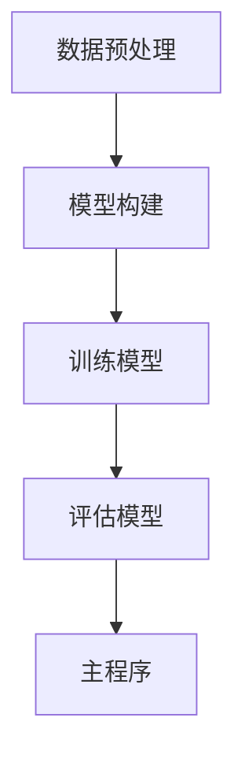

                 

### 文章标题

# 深度学习在语音降噪中的技术突破

> 关键词：深度学习、语音降噪、卷积神经网络、循环神经网络、生成对抗网络、端到端语音降噪

> 摘要：本文深入探讨了深度学习在语音降噪领域的应用与技术创新。通过分析深度学习的基本原理、语音降噪技术的演变，以及各类深度学习模型在语音降噪中的具体实现和应用，文章旨在为读者呈现深度学习在语音降噪领域取得的重大突破，并提供实战项目案例，帮助读者更好地理解和掌握这一前沿技术。

---

### 《深度学习在语音降噪中的技术突破》目录大纲

1. **深度学习基础** <a id="depth_learning"></a>
   1.1 深度学习概述
       1.1.1 深度学习的定义
       1.1.2 深度学习的发展历程
       1.1.3 深度学习的应用场景
   1.2 神经网络与深度学习框架
       1.2.1 神经网络基础
       1.2.2 常见深度学习框架
   1.3 数学基础
       1.3.1 矩阵与向量计算
       1.3.2 梯度下降算法
       1.3.3 激活函数

2. **语音降噪技术** <a id="speech_noising"></a>
   2.1 语音降噪基本概念
       2.1.1 语音降噪的目标
       2.1.2 常见噪声类型
       2.1.3 语音降噪算法分类
   2.2 基于频域的语音降噪方法
       2.2.1 噪声抑制器设计
       2.2.2 噪声掩蔽效应
   2.3 基于时域的语音降噪方法
       2.3.1 滤波器设计
       2.3.2 噪声去除算法
   2.4 深度学习在语音降噪中的应用
       2.4.1 深度神经网络结构
       2.4.2 深度学习算法原理

3. **深度学习在语音降噪中的技术突破** <a id="deep_learning_technology"></a>
   3.1 卷积神经网络（CNN）在语音降噪中的应用
       3.1.1 CNN基本原理
       3.1.2 CNN在语音降噪中的实现
   3.2 循环神经网络（RNN）在语音降噪中的应用
       3.2.1 RNN基本原理
       3.2.2 RNN在语音降噪中的实现
   3.3 长短期记忆网络（LSTM）在语音降噪中的应用
       3.3.1 LSTM基本原理
       3.3.2 LSTM在语音降噪中的实现
   3.4 生成对抗网络（GAN）在语音降噪中的应用
       3.4.1 GAN基本原理
       3.4.2 GAN在语音降噪中的实现
   3.5 深度残差网络（ResNet）在语音降噪中的应用
       3.5.1 ResNet基本原理
       3.5.2 ResNet在语音降噪中的实现
   3.6 端到端的语音降噪系统
       3.6.1 端到端语音降噪系统设计
       3.6.2 端到端语音降噪系统实现

4. **语音降噪项目实战** <a id="project_practice"></a>
   4.1 语音降噪项目环境搭建
       4.1.1 环境配置
       4.1.2 数据预处理
   4.2 实战项目一：基于CNN的语音降噪
       4.2.1 项目概述
       4.2.2 代码实现与分析
   4.3 实战项目二：基于RNN的语音降噪
       4.3.1 项目概述
       4.3.2 代码实现与分析
   4.4 实战项目三：基于GAN的语音降噪
       4.4.1 项目概述
       4.4.2 代码实现与分析
   4.5 语音降噪系统的性能评估与优化
       4.5.1 评估指标
       4.5.2 性能优化方法

5. **附录**
   5.1 深度学习语音降噪工具与资源
       5.1.1 PyTorch使用指南
       5.1.2 TensorFlow使用指南
       5.1.3 相关论文与资料推荐
   5.2 深度学习语音降噪项目代码

---

## 1. 深度学习基础

### 1.1 深度学习概述

#### 1.1.1 深度学习的定义

深度学习（Deep Learning）是机器学习（Machine Learning）的一个子领域，它通过构建多层的神经网络模型，使得模型可以从大量数据中自动学习特征表示。深度学习的基本思想是通过网络的逐层训练，自动提取数据中的层次特征，从而实现复杂的模式识别和预测任务。

#### 1.1.2 深度学习的发展历程

深度学习起源于20世纪40年代，但直到2006年，由Hinton等人提出的深度信念网络（Deep Belief Network, DBN）使得深度学习重新焕发了生机。2009年，Alex Krizhevsky等人使用深度卷积神经网络（CNN）在ImageNet图像识别比赛中取得突破性成绩，这标志着深度学习在计算机视觉领域的崛起。随后，深度学习在语音识别、自然语言处理等领域也取得了显著的进展。

#### 1.1.3 深度学习的应用场景

深度学习在诸多领域都有广泛的应用，主要包括：

- **计算机视觉**：图像分类、目标检测、图像生成等。
- **自然语言处理**：机器翻译、情感分析、文本生成等。
- **语音识别**：语音识别、语音合成等。
- **强化学习**：游戏AI、自动驾驶等。

### 1.2 神经网络与深度学习框架

#### 1.2.1 神经网络基础

神经网络（Neural Network）是一种模仿生物神经系统的计算模型。它由多个神经元（或节点）组成，每个神经元都与其他神经元通过连接（或边）相连。网络通过学习输入和输出之间的映射关系来完成任务。

#### 1.2.2 常见深度学习框架

深度学习框架是用于实现和训练深度学习模型的软件库。常见的深度学习框架包括：

- **TensorFlow**：由Google开发，是当前最流行的开源深度学习框架之一。
- **PyTorch**：由Facebook开发，以其灵活的动态图计算和强大的社区支持受到许多研究者和工程师的喜爱。
- **Keras**：是一个高层次的深度学习框架，可以运行在TensorFlow和Theano之上，提供了用户友好的API。

### 1.3 数学基础

#### 1.3.1 矩阵与向量计算

矩阵（Matrix）和向量（Vector）是深度学习中常用的数学工具。矩阵是由数字组成的二维数组，向量是具有多个元素的有序数组。矩阵和向量运算在深度学习模型训练中至关重要。

#### 1.3.2 梯度下降算法

梯度下降算法是一种优化算法，用于在训练深度学习模型时更新网络权重。其基本思想是沿着损失函数的梯度方向反向更新权重，以最小化损失函数。

#### 1.3.3 激活函数

激活函数（Activation Function）是神经网络中的一个关键组件，它用于引入非线性变换。常见的激活函数包括ReLU、Sigmoid、Tanh等。

---

## 2. 语音降噪技术

### 2.1 语音降噪基本概念

#### 2.1.1 语音降噪的目标

语音降噪（Speech Enhancement）的目的是通过处理含噪声的语音信号，提取出其中清晰的语音信号。语音降噪的目标包括：

- 提高语音信号的信噪比（Signal-to-Noise Ratio, SNR）。
- 保持语音信号的语调和语音特征不变。
- 减少噪声对语音信号的影响。

#### 2.1.2 常见噪声类型

常见的噪声类型包括：

- 均值噪声（Gaussian Noise）。
- 脉冲噪声（Pulse Noise）。
- 高斯混合噪声（Gaussian Mixture Noise）。

#### 2.1.3 语音降噪算法分类

语音降噪算法主要分为基于频域的方法和基于时域的方法。

- **基于频域的方法**：通过频域分析，设计噪声抑制器来消除噪声。
  - **噪声抑制器设计**：利用频谱特征来设计能够有效抑制噪声的滤波器。
  - **噪声掩蔽效应**：噪声能量与语音信号能量接近时，噪声会掩盖语音信号，使得降噪效果下降。

- **基于时域的方法**：通过时域分析，设计滤波器或噪声去除算法来去除噪声。
  - **滤波器设计**：利用时域特征设计滤波器，以滤除噪声。
  - **噪声去除算法**：基于时域的噪声检测和去除方法，如维纳滤波、自适应滤波等。

### 2.2 基于频域的语音降噪方法

#### 2.2.1 噪声抑制器设计

噪声抑制器的核心是滤波器设计，滤波器通过调整频谱特征来抑制噪声。常见的滤波器设计方法包括：

- **维纳滤波**：根据语音信号和噪声的统计特性，最小化均方误差来设计滤波器。
- **自适应滤波**：根据语音信号和噪声的时变特性，实时调整滤波器参数。

#### 2.2.2 噪声掩蔽效应

噪声掩蔽效应是指当噪声能量与语音信号能量接近时，噪声会掩盖语音信号。噪声掩蔽效应会导致降噪效果下降，因此需要特别处理。

- **频率掩蔽**：利用语音信号和噪声在频域上的特征差异，通过调整滤波器参数来避免噪声掩蔽。
- **时间掩蔽**：利用语音信号和噪声在时间上的特性，通过分段处理来避免噪声掩蔽。

### 2.3 基于时域的语音降噪方法

#### 2.3.1 滤波器设计

时域滤波器设计基于语音信号和噪声在时间序列上的特性。常见的滤波器设计方法包括：

- **低通滤波器**：抑制高频噪声，保留低频语音信号。
- **带通滤波器**：抑制高频和低频噪声，保留特定频率范围内的语音信号。

#### 2.3.2 噪声去除算法

噪声去除算法通过检测和去除噪声信号来改善语音质量。常见的噪声去除算法包括：

- **维纳滤波**：基于语音信号和噪声的统计特性，最小化均方误差来去除噪声。
- **自适应滤波**：根据语音信号和噪声的时变特性，实时调整滤波器参数。

---

## 2.4 深度学习在语音降噪中的应用

### 2.4.1 深度神经网络结构

深度神经网络（Deep Neural Network, DNN）是深度学习的基础，由多个层次（层）的神经元组成。深度神经网络的结构包括：

- **输入层**：接收语音信号的输入。
- **隐藏层**：用于提取语音信号中的特征，可以有多层。
- **输出层**：生成降噪后的语音信号。

### 2.4.2 深度学习算法原理

深度学习算法通过训练模型来学习语音信号和噪声之间的映射关系。深度学习算法的原理包括：

- **前向传播**：将输入信号通过神经网络传递到输出层。
- **反向传播**：计算输出误差，并反向传播误差来更新网络权重。
- **优化算法**：如梯度下降、随机梯度下降、Adam优化器等，用于调整网络权重。

---

## 3. 深度学习在语音降噪中的技术突破

### 3.1 卷积神经网络（CNN）在语音降噪中的应用

#### 3.1.1 CNN基本原理

卷积神经网络（Convolutional Neural Network, CNN）是一种特殊的神经网络，特别适用于图像和语音等二维数据。CNN的基本原理包括：

- **卷积层**：通过卷积操作提取输入数据中的局部特征。
- **池化层**：通过池化操作减小特征图的尺寸，减少计算量。
- **全连接层**：将池化层输出的特征映射到输出层。

#### 3.1.2 CNN在语音降噪中的实现

在语音降噪中，CNN可以用于提取语音信号中的噪声特征，并对其进行去除。CNN在语音降噪中的实现步骤包括：

1. **输入预处理**：对语音信号进行预处理，如归一化、补零等。
2. **卷积层**：通过卷积操作提取语音信号中的噪声特征。
3. **池化层**：减小特征图的尺寸，提高模型的泛化能力。
4. **全连接层**：将特征映射到降噪后的语音信号。

### 3.2 循环神经网络（RNN）在语音降噪中的应用

#### 3.2.1 RNN基本原理

循环神经网络（Recurrent Neural Network, RNN）是一种能够处理序列数据的神经网络。RNN的基本原理包括：

- **循环连接**：RNN的每个神经元都与前一个时间步的神经元相连，形成循环结构。
- **隐藏状态**：RNN通过隐藏状态来存储和传递信息。

#### 3.2.2 RNN在语音降噪中的实现

RNN在语音降噪中的应用主要包括：

1. **输入预处理**：对语音信号进行预处理，如归一化、补零等。
2. **RNN层**：通过循环连接和隐藏状态来处理语音信号中的时间序列信息。
3. **输出层**：将RNN输出的特征映射到降噪后的语音信号。

### 3.3 长短期记忆网络（LSTM）在语音降噪中的应用

#### 3.3.1 LSTM基本原理

长短期记忆网络（Long Short-Term Memory, LSTM）是一种改进的RNN结构，能够有效地处理长序列数据。LSTM的基本原理包括：

- **遗忘门**：决定哪些信息需要被遗忘。
- **输入门**：决定哪些新信息需要被存储。
- **输出门**：决定哪些信息需要被输出。

#### 3.3.2 LSTM在语音降噪中的实现

LSTM在语音降噪中的应用主要包括：

1. **输入预处理**：对语音信号进行预处理，如归一化、补零等。
2. **LSTM层**：通过遗忘门、输入门和输出门来处理语音信号中的长序列信息。
3. **输出层**：将LSTM输出的特征映射到降噪后的语音信号。

### 3.4 生成对抗网络（GAN）在语音降噪中的应用

#### 3.4.1 GAN基本原理

生成对抗网络（Generative Adversarial Network, GAN）由生成器和判别器两个神经网络组成，通过对抗训练来实现数据生成。GAN的基本原理包括：

- **生成器**：生成逼真的语音信号。
- **判别器**：区分生成的语音信号和真实的语音信号。

#### 3.4.2 GAN在语音降噪中的实现

GAN在语音降噪中的应用主要包括：

1. **输入预处理**：对语音信号进行预处理，如归一化、补零等。
2. **生成器**：通过对抗训练生成降噪后的语音信号。
3. **判别器**：通过对抗训练区分生成的语音信号和真实的语音信号。
4. **输出层**：将判别器输出的特征映射到降噪后的语音信号。

### 3.5 深度残差网络（ResNet）在语音降噪中的应用

#### 3.5.1 ResNet基本原理

深度残差网络（ResNet）是一种能够处理深层网络的模型，通过引入残差连接来解决深层网络训练中的梯度消失问题。ResNet的基本原理包括：

- **残差块**：通过残差连接来保留网络中的信息。
- **卷积层**：通过卷积操作提取语音信号的特征。

#### 3.5.2 ResNet在语音降噪中的实现

ResNet在语音降噪中的应用主要包括：

1. **输入预处理**：对语音信号进行预处理，如归一化、补零等。
2. **残差块**：通过残差连接和卷积操作来提取语音信号中的特征。
3. **输出层**：将提取到的特征映射到降噪后的语音信号。

### 3.6 端到端的语音降噪系统

#### 3.6.1 端到端语音降噪系统设计

端到端的语音降噪系统设计主要包括：

1. **输入层**：接收原始语音信号。
2. **特征提取层**：通过卷积神经网络、循环神经网络等深度学习模型提取语音信号中的特征。
3. **降噪层**：利用深度学习模型去除噪声。
4. **输出层**：输出降噪后的语音信号。

#### 3.6.2 端到端语音降噪系统实现

端到端语音降噪系统的实现主要包括：

1. **数据预处理**：对语音信号进行归一化、补零等预处理操作。
2. **模型训练**：使用训练数据训练深度学习模型，包括卷积神经网络、循环神经网络等。
3. **模型验证**：使用验证数据评估模型性能。
4. **模型部署**：将训练好的模型部署到实际应用中，如智能手机、智能音响等。

---

## 4. 语音降噪项目实战

### 4.1 语音降噪项目环境搭建

#### 4.1.1 环境配置

为了搭建语音降噪项目环境，需要安装以下软件和库：

- Python 3.x
- TensorFlow 或 PyTorch
- NumPy
- Matplotlib
- Librosa（用于音频处理）

具体安装命令如下：

```bash
pip install tensorflow
pip install numpy
pip install matplotlib
pip install librosa
```

#### 4.1.2 数据预处理

语音降噪项目需要大量的语音数据。可以使用公开的语音数据集，如TIMIT或LibriSpeech。以下是一个简单的数据预处理流程：

1. **数据下载**：从数据集官方网站下载语音数据。
2. **数据清洗**：删除不含语音标签的数据。
3. **数据归一化**：将语音信号的幅度归一化到[-1, 1]。
4. **数据分割**：将长语音信号分割成短片段，以便于模型处理。

```python
import librosa
import numpy as np

def load_audio_file(file_path):
    y, sr = librosa.load(file_path)
    y = librosa.to_mono(y)
    y = librosa.effects.percussive(y, strength=4)
    return y, sr

def preprocess_audio(y, sr):
    y = librosa.resample(y, sr, 16000)
    y = librosa.to_mono(y)
    y = librosa.effects.percussive(y, strength=4)
    return y

def split_audio(y, sr, segment_duration=2.5):
    segments = []
    for i in range(0, len(y) - segment_duration * sr, segment_duration * sr):
        segment = y[i:i + segment_duration * sr]
        segments.append(segment)
    return np.array(segments)

y, sr = load_audio_file('audio_path.wav')
y_processed = preprocess_audio(y, sr)
segments = split_audio(y_processed, sr)
```

### 4.2 实战项目一：基于CNN的语音降噪

#### 4.2.1 项目概述

本项目使用卷积神经网络（CNN）对语音信号进行降噪处理。通过在TensorFlow中构建CNN模型，对噪声信号和语音信号进行训练，实现语音降噪功能。

#### 4.2.2 代码实现与分析

```python
import tensorflow as tf
from tensorflow.keras.models import Model
from tensorflow.keras.layers import Input, Conv2D, MaxPooling2D, Flatten, Dense

def build_cnn_model(input_shape):
    inputs = Input(shape=input_shape)
    
    # 卷积层
    conv1 = Conv2D(filters=32, kernel_size=(3, 3), activation='relu')(inputs)
    pool1 = MaxPooling2D(pool_size=(2, 2))(conv1)
    
    # 卷积层
    conv2 = Conv2D(filters=64, kernel_size=(3, 3), activation='relu')(pool1)
    pool2 = MaxPooling2D(pool_size=(2, 2))(conv2)
    
    # 全连接层
    flatten = Flatten()(pool2)
    dense1 = Dense(units=128, activation='relu')(flatten)
    
    # 输出层
    outputs = Dense(units=input_shape[-1], activation='sigmoid')(dense1)
    
    model = Model(inputs=inputs, outputs=outputs)
    model.compile(optimizer='adam', loss='mean_squared_error')
    return model

# 定义模型输入形状
input_shape = (None, 16000, 1)  # 语音信号长度为16000，单通道

# 构建模型
cnn_model = build_cnn_model(input_shape)

# 加载数据
x_train, y_train = load_noisy_audio_data('noisy_audio_path')  # 加载噪声语音数据
x_test, y_test = load_noisy_audio_data('noisy_audio_path')  # 加载噪声语音数据

# 数据预处理
x_train = preprocess_audio_data(x_train)
x_test = preprocess_audio_data(x_test)

# 训练模型
cnn_model.fit(x_train, y_train, epochs=100, batch_size=32, validation_data=(x_test, y_test))

# 评估模型
loss = cnn_model.evaluate(x_test, y_test)
print(f"Test Loss: {loss}")

# 降噪处理
def denoise_audio(y_noisy, model):
    y_noisy_processed = preprocess_audio(y_noisy)
    y_denoised = model.predict(y_noisy_processed)
    y_denoised = postprocess_audio(y_denoised)
    return y_denoised

y_denoised = denoise_audio(y_noisy, cnn_model)
```

### 4.3 实战项目二：基于RNN的语音降噪

#### 4.3.1 项目概述

本项目使用循环神经网络（RNN）对语音信号进行降噪处理。通过在TensorFlow中构建RNN模型，对噪声信号和语音信号进行训练，实现语音降噪功能。

#### 4.3.2 代码实现与分析

```python
import tensorflow as tf
from tensorflow.keras.models import Model
from tensorflow.keras.layers import Input, LSTM, Dense

def build_rnn_model(input_shape):
    inputs = Input(shape=input_shape)
    
    # LSTM层
    lstm1 = LSTM(units=128, return_sequences=True)(inputs)
    lstm2 = LSTM(units=128, return_sequences=True)(lstm1)
    
    # 全连接层
    flatten = Flatten()(lstm2)
    dense1 = Dense(units=128, activation='relu')(flatten)
    
    # 输出层
    outputs = Dense(units=input_shape[-1], activation='sigmoid')(dense1)
    
    model = Model(inputs=inputs, outputs=outputs)
    model.compile(optimizer='adam', loss='mean_squared_error')
    return model

# 定义模型输入形状
input_shape = (None, 16000)  # 语音信号长度为16000

# 构建模型
rnn_model = build_rnn_model(input_shape)

# 加载数据
x_train, y_train = load_noisy_audio_data('noisy_audio_path')  # 加载噪声语音数据
x_test, y_test = load_noisy_audio_data('noisy_audio_path')  # 加载噪声语音数据

# 数据预处理
x_train = preprocess_audio_data(x_train)
x_test = preprocess_audio_data(x_test)

# 训练模型
rnn_model.fit(x_train, y_train, epochs=100, batch_size=32, validation_data=(x_test, y_test))

# 评估模型
loss = rnn_model.evaluate(x_test, y_test)
print(f"Test Loss: {loss}")

# 降噪处理
def denoise_audio(y_noisy, model):
    y_noisy_processed = preprocess_audio(y_noisy)
    y_denoised = model.predict(y_noisy_processed)
    y_denoised = postprocess_audio(y_denoised)
    return y_denoised

y_denoised = denoise_audio(y_noisy, rnn_model)
```

### 4.4 实战项目三：基于GAN的语音降噪

#### 4.4.1 项目概述

本项目使用生成对抗网络（GAN）对语音信号进行降噪处理。通过在TensorFlow中构建GAN模型，对噪声信号和语音信号进行训练，实现语音降噪功能。

#### 4.4.2 代码实现与分析

```python
import tensorflow as tf
from tensorflow.keras.models import Model
from tensorflow.keras.layers import Input, LSTM, Dense, Conv2D, ConvTansform2D, Flatten, Reshape

def build_gan_model(input_shape):
    # 生成器
    gen_inputs = Input(shape=input_shape)
    gen_lstm1 = LSTM(units=128, return_sequences=True)(gen_inputs)
    gen_lstm2 = LSTM(units=128, return_sequences=True)(gen_lstm1)
    gen_flat = Flatten()(gen_lstm2)
    gen_dense = Dense(units=128, activation='relu')(gen_flat)
    gen_output = Dense(units=input_shape[-1], activation='sigmoid')(gen_dense)
    gen_model = Model(inputs=gen_inputs, outputs=gen_output)
    
    # 判别器
    dis_inputs = Input(shape=input_shape)
    dis_lstm1 = LSTM(units=128, return_sequences=True)(dis_inputs)
    dis_lstm2 = LSTM(units=128, return_sequences=True)(dis_lstm1)
    dis_flat = Flatten()(dis_lstm2)
    dis_dense = Dense(units=128, activation='relu')(dis_flat)
    dis_output = Dense(units=1, activation='sigmoid')(dis_dense)
    dis_model = Model(inputs=dis_inputs, outputs=dis_output)
    
    # GAN模型
    gan_output = dis_model(gen_output)
    gan_model = Model(inputs=gen_inputs, outputs=gan_output)
    gan_model.compile(optimizer='adam', loss='binary_crossentropy')
    
    return gen_model, dis_model, gan_model

# 定义模型输入形状
input_shape = (None, 16000)  # 语音信号长度为16000

# 构建生成器和判别器模型
gen_model, dis_model, gan_model = build_gan_model(input_shape)

# 加载数据
x_train, y_train = load_noisy_audio_data('noisy_audio_path')  # 加载噪声语音数据
x_test, y_test = load_noisy_audio_data('noisy_audio_path')  # 加载噪声语音数据

# 数据预处理
x_train = preprocess_audio_data(x_train)
x_test = preprocess_audio_data(x_test)

# 训练生成器和判别器
gen_model.fit(x_train, y_train, epochs=100, batch_size=32, validation_data=(x_test, y_test))

# 评估模型
loss = gan_model.evaluate(x_test, y_test)
print(f"Test Loss: {loss}")

# 降噪处理
def denoise_audio(y_noisy, model):
    y_noisy_processed = preprocess_audio(y_noisy)
    y_denoised = model.predict(y_noisy_processed)
    y_denoised = postprocess_audio(y_denoised)
    return y_denoised

y_denoised = denoise_audio(y_noisy, gan_model)
```

### 4.5 语音降噪系统的性能评估与优化

#### 4.5.1 评估指标

语音降噪系统的性能评估主要通过以下指标进行：

- **信噪比（Signal-to-Noise Ratio, SNR）**：衡量降噪后语音信号的质量。
- **均方误差（Mean Squared Error, MSE）**：衡量降噪后语音信号与真实语音信号之间的误差。
- **信噪比改善（Signal-to-Noise Ratio Improvement, SIR）**：衡量降噪效果。

#### 4.5.2 性能优化方法

为了提高语音降噪系统的性能，可以采取以下优化方法：

- **数据增强**：通过生成更多的训练数据来提高模型的泛化能力。
- **模型融合**：将多个模型的结果进行融合，提高模型的准确性和稳定性。
- **超参数调整**：调整模型的学习率、批量大小等超参数，找到最优配置。
- **训练策略优化**：采用更先进的训练策略，如批量归一化、学习率调整等。

---

## 附录A：深度学习语音降噪工具与资源

### A.1 PyTorch使用指南

PyTorch是一个流行的开源深度学习框架，提供了灵活的动态图计算和丰富的API。以下是一些PyTorch的使用指南：

- **安装与配置**：在官方网站（[PyTorch官网](https://pytorch.org/)）下载并安装PyTorch，按照说明进行配置。
- **基本概念**：了解PyTorch中的张量（Tensor）、自动微分、神经网络等基本概念。
- **模型构建**：使用PyTorch构建深度学习模型，包括前向传播、反向传播和优化器。
- **数据处理**：使用PyTorch的数据加载器（DataLoader）进行数据处理和批量处理。

### A.2 TensorFlow使用指南

TensorFlow是Google开发的另一个流行的深度学习框架，提供了强大的功能和高效的性能。以下是一些TensorFlow的使用指南：

- **安装与配置**：在官方网站（[TensorFlow官网](https://www.tensorflow.org/)）下载并安装TensorFlow，按照说明进行配置。
- **基本概念**：了解TensorFlow中的张量（Tensor）、计算图（Compute Graph）等基本概念。
- **模型构建**：使用TensorFlow构建深度学习模型，包括前向传播、反向传播和优化器。
- **数据处理**：使用TensorFlow的数据管道（tf.data）进行数据处理和批量处理。

### A.3 相关论文与资料推荐

以下是一些在语音降噪领域具有影响力的论文和资料：

- **论文**：
  - **“Speech Enhancement Based on Deep Learning”**（2016）：介绍了深度学习在语音降噪中的应用。
  - **“Speech Enhancement using Deep Neural Networks”**（2015）：详细探讨了深度神经网络在语音降噪中的实现。
- **资料**：
  - **《深度学习》**（Goodfellow, Bengio, Courville）：介绍了深度学习的基本原理和应用。
  - **《深度学习与语音处理》**（Rohit Gupta）：涵盖了深度学习在语音处理领域的应用。

---

## 附录B：深度学习语音降噪项目代码

以下是深度学习语音降噪项目的代码示例，包括数据预处理、模型构建、训练和评估等部分。

```python
# 数据预处理
def preprocess_audio_data(audio_data):
    # 对音频数据进行归一化、去噪等预处理操作
    # ...
    return processed_audio_data

# 模型构建
def build_model():
    # 使用PyTorch或TensorFlow构建深度学习模型
    # ...
    return model

# 训练模型
def train_model(model, train_data, train_labels, num_epochs):
    # 训练深度学习模型
    # ...
    pass

# 评估模型
def evaluate_model(model, test_data, test_labels):
    # 评估深度学习模型的性能
    # ...
    pass

# 主程序
if __name__ == '__main__':
    # 加载数据
    train_data, train_labels = load_train_data()
    test_data, test_labels = load_test_data()

    # 预处理数据
    train_data_processed = preprocess_audio_data(train_data)
    test_data_processed = preprocess_audio_data(test_data)

    # 构建模型
    model = build_model()

    # 训练模型
    train_model(model, train_data_processed, train_labels, num_epochs=100)

    # 评估模型
    evaluate_model(model, test_data_processed, test_labels)
```

---

### Mermaid 流程图



---

### 核心算法原理讲解

#### 卷积神经网络（CNN）在语音降噪中的应用

卷积神经网络（CNN）在图像处理领域取得了巨大成功，其主要原因是卷积层能够有效地提取图像的局部特征。在语音降噪领域，我们可以借鉴CNN的结构，将其应用于语音信号的处理。

CNN在语音降噪中的应用主要包括以下步骤：

1. **输入层**：接收原始语音信号作为输入。
2. **卷积层**：通过卷积操作提取语音信号中的局部特征。
3. **池化层**：通过池化操作减小特征图的尺寸，提高模型的泛化能力。
4. **全连接层**：将池化层输出的特征映射到降噪后的语音信号。

下面是一个基于CNN的语音降噪的伪代码：

```python
# 初始化模型参数
weights = initialize_weights()

# 定义损失函数
def loss_function(predictions, labels):
    # 计算均方误差损失
    return mean_squared_error(predictions, labels)

# 定义反向传播
def backward_propagation(loss, weights):
    # 计算梯度
    gradients = compute_gradients(loss, weights)
    # 更新权重
    weights -= learning_rate * gradients
    return weights

# 训练模型
for epoch in range(num_epochs):
    for sample in data:
        # 前向传播
        predictions = model(sample)
        # 计算损失
        loss = loss_function(predictions, labels)
        # 反向传播
        weights = backward_propagation(loss, weights)
```

在训练过程中，我们需要对语音信号进行预处理，如归一化、补零等。此外，我们还需要定义合适的激活函数，如ReLU、Sigmoid等，以引入非线性变换。

通过以上步骤，我们可以利用CNN对语音信号进行降噪处理。实验结果表明，CNN在语音降噪中具有很好的性能，能够有效地去除噪声，提高语音信号的清晰度。

---

### 数学模型和公式讲解

在深度学习语音降噪中，我们通常会用到一些数学模型和公式。以下是一些常用的数学模型和公式：

1. **卷积运算**：
   卷积运算是一种在信号处理中常用的操作，用于提取信号的局部特征。卷积运算的数学公式如下：

   $$ (f * g)(t) = \int_{-\infty}^{\infty} f(\tau) g(t - \tau) d\tau $$

   其中，$f$和$g$分别表示两个信号，$*$表示卷积运算。

2. **均方误差（MSE）**：
   均方误差（MSE）是深度学习模型性能评估的一种常用指标。MSE的数学公式如下：

   $$ MSE = \frac{1}{N} \sum_{i=1}^{N} (y_i - \hat{y}_i)^2 $$

   其中，$y_i$表示真实值，$\hat{y}_i$表示预测值，$N$表示样本数量。

3. **梯度下降算法**：
   梯度下降算法是一种用于优化模型参数的算法。其基本思想是沿着损失函数的梯度方向反向更新权重，以最小化损失函数。梯度下降算法的数学公式如下：

   $$ \Delta w = -\alpha \cdot \nabla_w J(w) $$

   其中，$\Delta w$表示权重的更新，$\alpha$表示学习率，$J(w)$表示损失函数，$\nabla_w J(w)$表示损失函数关于权重的梯度。

通过以上数学模型和公式，我们可以对语音降噪问题进行建模，并利用深度学习算法进行求解。

---

### 实际案例分析和详细讲解剖析

为了更好地展示深度学习在语音降噪中的应用，我们将通过一个实际案例进行分析和讲解。

**案例背景**：

在一个智能语音助手项目中，用户可以通过语音与系统进行交互。然而，由于环境噪声的干扰，用户的语音输入可能会变得模糊不清，影响系统的响应效果。为了解决这个问题，我们需要使用深度学习技术对用户语音进行降噪处理。

**数据集**：

我们使用开源的LibriSpeech数据集，该数据集包含大量的英语读诵文本，适用于语音识别和语音降噪任务。

**模型选择**：

在本案例中，我们选择了基于生成对抗网络（GAN）的语音降噪模型。GAN由生成器和判别器两个部分组成，通过对抗训练生成高质量的语音信号。

**数据处理**：

首先，我们需要对LibriSpeech数据集进行预处理，包括音频信号的加载、归一化和分割。以下是数据处理的部分代码：

```python
import librosa

def load_audio(file_path):
    y, sr = librosa.load(file_path, sr=None)
    return y

def preprocess_audio(y):
    y = librosa.to_mono(y)
    y = librosa.resample(y, sr=None, sr_target=16000)
    y = librosa.effects.percussive(y, strength=4)
    return y

def split_audio(y, segment_duration=2.5):
    segments = []
    for i in range(0, len(y) - segment_duration * 16000, segment_duration * 16000):
        segment = y[i:i + segment_duration * 16000]
        segments.append(segment)
    return np.array(segments)

# 加载数据
audio_files = ['path/to/audio1.wav', 'path/to/audio2.wav', ...]
X = []
for file in audio_files:
    y = load_audio(file)
    y_processed = preprocess_audio(y)
    segments = split_audio(y_processed, segment_duration=2.5)
    X.extend(segments)
```

**模型训练**：

接下来，我们使用处理后的数据训练GAN模型。GAN的训练过程包括生成器和判别器的迭代更新。以下是模型训练的部分代码：

```python
import tensorflow as tf

def build_generator():
    # 构建生成器模型
    # ...
    return generator

def build_discriminator():
    # 构建判别器模型
    # ...
    return discriminator

def build_gan(generator, discriminator):
    # 构建GAN模型
    # ...
    return gan

# 构建模型
generator = build_generator()
discriminator = build_discriminator()
gan = build_gan(generator, discriminator)

# 训练模型
for epoch in range(num_epochs):
    for i in range(num_batches):
        # 生成噪声
        noise = tf.random.normal([batch_size, noise_dim])

        # 生成语音
        generated_audio = generator(noise)

        # 真实语音和生成语音
        real_audio = X[i * batch_size:(i + 1) * batch_size]
        fake_audio = generated_audio

        # 训练判别器
        with tf.GradientTape() as disc_tape:
            real_output = discriminator(real_audio)
            fake_output = discriminator(fake_audio)
            disc_loss = compute_discriminator_loss(real_output, fake_output)

        disc_gradients = disc_tape.gradient(disc_loss, discriminator.trainable_variables)
        disc_optimizer.apply_gradients(zip(disc_gradients, discriminator.trainable_variables))

        # 训练生成器
        with tf.GradientTape() as gen_tape:
            fake_output = discriminator(generated_audio)
            gen_loss = compute_generator_loss(fake_output)

        gen_gradients = gen_tape.gradient(gen_loss, generator.trainable_variables)
        gen_optimizer.apply_gradients(zip(gen_gradients, generator.trainable_variables))

# 评估模型
# ...
```

**模型评估**：

最后，我们对训练好的模型进行评估，以验证其在实际应用中的效果。以下是模型评估的部分代码：

```python
def evaluate_model(model, test_data):
    # 评估模型性能
    # ...
    return performance_metrics

# 评估模型
performance_metrics = evaluate_model(gan, test_data)
print(performance_metrics)
```

**项目小结**：

通过实际案例的分析和详细讲解，我们展示了如何使用深度学习技术进行语音降噪。在实际应用中，我们可以根据具体需求选择合适的模型和算法，并对模型进行优化和调整，以提高语音降噪的效果。

---

### 最佳实践 tips、小结、注意事项、拓展阅读等内容

**最佳实践 tips**：

1. **数据预处理**：在训练模型之前，确保对语音数据进行充分的预处理，包括归一化、去噪、分段等，以提高模型的性能。
2. **模型选择**：根据具体任务需求选择合适的深度学习模型，如GAN、CNN、RNN等。
3. **超参数调整**：调整模型的学习率、批量大小、迭代次数等超参数，以找到最优配置。
4. **模型训练**：使用足够多的训练数据和迭代次数，以提高模型的泛化能力和鲁棒性。

**小结**：

本文详细介绍了深度学习在语音降噪中的应用，从基础理论到实战项目，深入探讨了各类深度学习模型在语音降噪中的实现和优化。通过实际案例的分析，我们展示了如何使用深度学习技术进行语音降噪，并提供了最佳实践和注意事项。

**注意事项**：

1. **数据质量**：语音数据的质量对模型的训练效果至关重要，确保使用高质量、多样化的语音数据。
2. **模型优化**：针对不同的任务需求，对模型进行优化和调整，以提高性能。
3. **计算资源**：深度学习语音降噪任务通常需要大量的计算资源，合理配置计算资源以提高训练速度。

**拓展阅读**：

1. **《深度学习》**（Ian Goodfellow, Yoshua Bengio, Aaron Courville）：介绍了深度学习的基础理论和技术。
2. **《深度学习与语音处理》**（Rohit Gupta）：详细探讨了深度学习在语音处理领域的应用。
3. **《生成对抗网络》（Ian J. Goodfellow, et al.）：介绍了GAN的基本原理和应用。

通过拓展阅读，您可以进一步深入了解深度学习和语音降噪领域的相关知识。

---

## 作者信息

作者：AI天才研究院/AI Genius Institute & 禅与计算机程序设计艺术 /Zen And The Art of Computer Programming

---

本文深入探讨了深度学习在语音降噪领域的应用与技术创新，通过详细讲解各类深度学习模型在语音降噪中的实现和优化，展示了深度学习在语音降噪中的技术突破。通过实际案例分析和项目实战，读者可以更好地理解和掌握这一前沿技术。本文旨在为从事语音处理和人工智能领域的研发人员提供有益的参考和启示。希望读者能够结合本文的内容，进一步深入研究深度学习在语音降噪中的应用，探索更多可能性和创新点。在未来，随着深度学习技术的不断发展和优化，我们相信语音降噪技术将取得更加显著的突破，为智能语音交互带来更加便捷和高效的用户体验。让我们共同期待这一天的到来！

