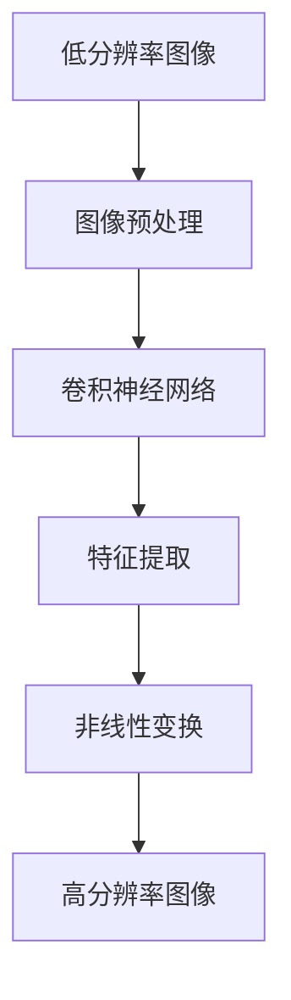
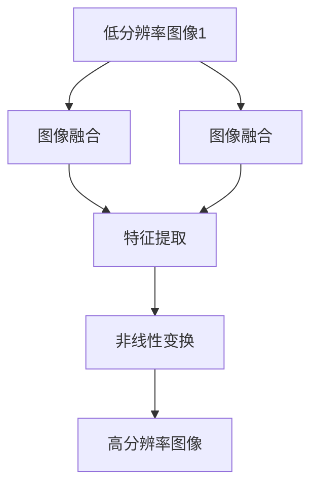
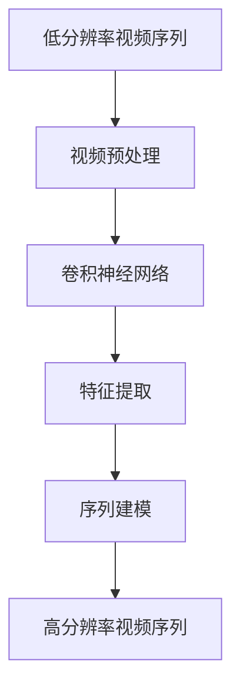

                 

### 文章标题

# 深度学习在超分辨率图像重建中的应用

### 关键词

- 深度学习
- 超分辨率图像重建
- 卷积神经网络
- 残差网络
- 注意力机制
- 数据增强
- 网络架构优化

### 摘要

本文旨在探讨深度学习在超分辨率图像重建领域的应用。首先，我们介绍了深度学习的起源、基本概念及其在计算机视觉中的应用。随后，我们对超分辨率图像重建进行了概述，分析了其概念、分类和重要性。接下来，本文重点讨论了深度学习在超分辨率图像重建中的应用原理、算法和实践应用，并分析了其中的性能优化方法。最后，我们对深度学习在超分辨率图像重建中的未来发展趋势进行了展望，并提供了几个典型案例进行分析。通过本文，读者可以全面了解深度学习在超分辨率图像重建中的技术原理和应用方法。

## 第一部分：深度学习基础与超分辨率图像重建概述

### 第1章：深度学习基础

#### 1.1 深度学习的起源与历史

深度学习作为人工智能的重要分支，起源于20世纪40年代。1958年，美国心理学家弗兰克·罗森布拉特（Frank Rosenblatt）提出了感知器（Perceptron）模型，这被认为是深度学习的雏形。随后，神经网络在20世纪80年代经历了一段低迷期，主要是因为过拟合和计算资源限制等问题。直到2006年，加拿大多伦多大学教授杰弗里·辛顿（Geoffrey Hinton）等人重新激发了神经网络的潜力，提出了深度信念网络（Deep Belief Network），深度学习开始蓬勃发展。

#### 1.2 深度学习的基本概念

深度学习是一种基于神经网络的机器学习技术，它通过多层的非线性变换来提取数据的高层次特征。深度学习中的网络结构通常由多个隐藏层组成，每一层都能对输入数据进行特征提取和变换。这种层次化的结构使得深度学习能够自动学习数据中的复杂结构，从而在多种任务中取得了显著的效果。

#### 1.3 神经网络与深度学习的关系

神经网络是深度学习的基础，而深度学习则是对神经网络的一种扩展和深化。传统的单层神经网络只能处理简单的线性分类问题，而深度学习通过引入多层网络结构，使得神经网络能够处理更加复杂的问题。深度学习中的多层网络结构能够自动提取数据中的层次化特征，从而在图像识别、语音识别、自然语言处理等领域取得了突破性进展。

#### 1.4 深度学习的发展与应用

深度学习的发展历程可以分为几个阶段。第一阶段是2006年至2012年，这一阶段主要关注的是如何训练深层神经网络，代表性的工作是Hinton等人提出的深度信念网络（Deep Belief Network）和自动编码器（Autoencoder）。第二阶段是2012年至2015年，这一阶段深度学习在图像识别领域取得了突破性进展，代表性的工作是AlexNet在ImageNet挑战赛上取得的优异成绩。第三阶段是2015年至今，深度学习在各个领域得到了广泛的应用，包括计算机视觉、语音识别、自然语言处理等。

### 第2章：超分辨率图像重建基础

#### 2.1 超分辨率图像重建的概念

超分辨率图像重建是一种通过利用低分辨率图像信息来恢复高分辨率图像的技术。在现实世界中，由于成像设备分辨率限制或数据传输带宽限制，我们经常需要处理低分辨率图像。超分辨率图像重建的目标是利用这些低分辨率图像的信息，通过一定的算法，重建出具有更高分辨率的图像。

#### 2.2 超分辨率图像重建的分类

根据重建方法的不同，超分辨率图像重建可以分为以下几类：

1. **基于插值的超分辨率方法**：这种方法通过插值算法将低分辨率图像上采样到高分辨率，如双线性插值、双三次插值等。这种方法简单有效，但容易引入伪影。

2. **基于图像恢复的超分辨率方法**：这种方法通过图像恢复技术，如去噪、去模糊等，来提高图像的分辨率。这种方法能够有效去除图像中的噪声和模糊，但重建效果受到图像质量的影响。

3. **基于学习的超分辨率方法**：这种方法通过训练深度学习模型，如卷积神经网络（CNN）、残差网络（ResNet）等，来学习低分辨率图像到高分辨率图像的映射关系。这种方法具有较好的重建效果和泛化能力。

#### 2.3 超分辨率图像重建的重要性

超分辨率图像重建在多个领域具有重要应用。首先，在计算机视觉领域，超分辨率图像重建能够提高图像质量，有助于后续的图像分析和识别。其次，在医疗领域，超分辨率图像重建可以帮助医生更好地观察病变组织，提高诊断准确性。此外，在遥感图像处理、视频增强等领域，超分辨率图像重建也具有广泛的应用前景。

## 第二部分：深度学习在超分辨率图像重建中的应用

### 第3章：深度学习在超分辨率图像重建中的应用原理

#### 3.1 深度学习与图像重建的关系

深度学习和图像重建之间存在着密切的联系。图像重建的目标是利用现有图像信息，通过一定的算法，恢复出图像中的缺失信息或提高图像的分辨率。而深度学习通过多层神经网络的结构，能够自动学习图像中的复杂特征和模式，从而实现图像的重建。

#### 3.2 超分辨率图像重建的深度学习方法

深度学习在超分辨率图像重建中的应用主要包括以下几种方法：

1. **卷积神经网络（CNN）**：卷积神经网络是一种特殊的神经网络，它通过卷积层来提取图像特征。在超分辨率图像重建中，卷积神经网络可以通过训练学习到低分辨率图像到高分辨率图像的映射关系，从而实现图像的重建。

2. **残差网络（ResNet）**：残差网络是一种深层神经网络结构，它通过引入残差单元来缓解深层网络训练过程中的梯度消失问题。在超分辨率图像重建中，残差网络能够更好地处理高分辨率图像的复杂特征，从而提高重建效果。

3. **注意力机制（Attention Mechanism）**：注意力机制是一种在神经网络中用于提高特征提取效率的方法。在超分辨率图像重建中，注意力机制可以通过关注关键特征区域，从而提高图像重建的质量。

#### 3.3 超分辨率图像重建中的挑战与解决方案

超分辨率图像重建面临着一些挑战，包括：

1. **数据稀缺问题**：由于超分辨率图像重建需要大量的训练数据，但高分辨率图像数据往往较为稀缺。为此，可以采用数据增强方法来扩充训练数据集，如随机裁剪、旋转、翻转等。

2. **计算资源消耗**：深度学习模型在训练过程中需要大量的计算资源，尤其是在处理高分辨率图像时。为了解决这一问题，可以采用分布式训练和优化算法，如Adam优化器、SGD等。

3. **重建效果评估**：如何准确评估超分辨率图像重建的效果是一个重要问题。为此，可以采用多种评估指标，如峰值信噪比（PSNR）、结构相似性指数（SSIM）等。

### 第4章：深度学习在超分辨率图像重建中的算法应用

#### 4.1 卷积神经网络（CNN）在超分辨率图像重建中的应用

卷积神经网络是一种广泛应用于图像处理任务的深度学习模型。在超分辨率图像重建中，卷积神经网络通过卷积层、激活函数、池化层等结构来提取图像特征，并逐步恢复图像的高分辨率信息。

**核心算法原理讲解：**

1. **卷积层**：卷积层是卷积神经网络的核心部分，它通过卷积运算来提取图像特征。在超分辨率图像重建中，卷积层可以学习到低分辨率图像到高分辨率图像的映射关系。

   ```mermaid
   graph TD
   A[输入低分辨率图像] --> B[卷积层1]
   B --> C[激活函数1]
   C --> D[卷积层2]
   D --> E[激活函数2]
   E --> F[卷积层3]
   F --> G[激活函数3]
   G --> H[输出高分辨率图像]
   ```

2. **激活函数**：激活函数用于引入非线性因素，使神经网络能够学习复杂特征。常用的激活函数有ReLU（Rectified Linear Unit）、Sigmoid、Tanh等。

3. **池化层**：池化层用于降低图像的维度，减少计算量。常用的池化操作有最大池化、平均池化等。

4. **全连接层**：在全连接层中，神经网络将卷积层提取的特征映射到输出层，从而生成高分辨率图像。

**数学模型和公式：**

卷积神经网络的数学模型可以表示为：

$$
y = \sigma(\text{ReLU}(\text{Conv}(x; \theta))
$$

其中，$y$为输出高分辨率图像，$x$为输入低分辨率图像，$\theta$为模型参数，$\sigma$为激活函数。

**举例说明：**

假设输入的低分辨率图像为$X$，经过卷积神经网络处理后，输出高分辨率图像为$Y$。以下是卷积神经网络在超分辨率图像重建中的简单伪代码：

```python
# 输入低分辨率图像
X = load_low_resolution_image()

# 初始化模型参数
theta = initialize_model_params()

# 卷积神经网络前向传播
Y = forward_propagation(X, theta)

# 输出高分辨率图像
save_high_resolution_image(Y)
```

#### 4.2 残差网络（ResNet）在超分辨率图像重建中的应用

残差网络是一种深层神经网络结构，它通过引入残差单元来缓解深层网络训练过程中的梯度消失问题。在超分辨率图像重建中，残差网络能够更好地处理高分辨率图像的复杂特征，从而提高重建效果。

**核心算法原理讲解：**

1. **残差单元**：残差单元是残差网络的核心部分，它通过跳跃连接（skip connection）来连接前一层的输出和当前层的输入，从而缓解梯度消失问题。

   ```mermaid
   graph TD
   A[输入低分辨率图像] --> B[卷积层1]
   B --> C[激活函数1]
   C --> D[卷积层2]
   D --> E[激活函数2]
   E --> F[跳跃连接]
   F --> G[卷积层3]
   G --> H[输出高分辨率图像]
   ```

2. **批量归一化**：批量归一化（Batch Normalization）用于加速模型训练和减少梯度消失问题。

3. **全连接层**：在全连接层中，神经网络将残差单元提取的特征映射到输出层，从而生成高分辨率图像。

**数学模型和公式：**

残差网络的数学模型可以表示为：

$$
y = \sigma(\text{ReLU}(x + \text{Conv}(\text{ReLU}(\text{BN}(x)); \theta))
$$

其中，$y$为输出高分辨率图像，$x$为输入低分辨率图像，$\theta$为模型参数，$\sigma$为激活函数。

**举例说明：**

假设输入的低分辨率图像为$X$，经过残差网络处理后，输出高分辨率图像为$Y$。以下是残差网络在超分辨率图像重建中的简单伪代码：

```python
# 输入低分辨率图像
X = load_low_resolution_image()

# 初始化模型参数
theta = initialize_model_params()

# 残差网络前向传播
Y = forward_propagation(X, theta)

# 输出高分辨率图像
save_high_resolution_image(Y)
```

#### 4.3 注意力机制（Attention Mechanism）在超分辨率图像重建中的应用

注意力机制是一种在神经网络中用于提高特征提取效率的方法。在超分辨率图像重建中，注意力机制可以通过关注关键特征区域，从而提高图像重建的质量。

**核心算法原理讲解：**

1. **自注意力机制**：自注意力机制（Self-Attention）是一种在序列处理任务中常用的注意力机制，它通过计算序列中各个元素之间的相似性，来关注关键特征。

   ```mermaid
   graph TD
   A[输入低分辨率图像] --> B[自注意力层1]
   B --> C[激活函数1]
   C --> D[自注意力层2]
   D --> E[激活函数2]
   E --> F[卷积层1]
   F --> G[激活函数3]
   G --> H[输出高分辨率图像]
   ```

2. **多头注意力机制**：多头注意力机制（Multi-Head Attention）是一种在神经网络中同时关注多个特征的方法，它通过将输入序列分解为多个子序列，然后分别计算注意力权重。

3. **卷积层**：卷积层用于提取图像的局部特征，并通过卷积运算来关注关键特征区域。

**数学模型和公式：**

注意力机制的数学模型可以表示为：

$$
y = \text{softmax}(\text{QK}^T \text{V})
$$

其中，$y$为输出高分辨率图像，$Q$、$K$、$V$分别为查询（Query）、键（Key）和值（Value）向量，$\text{softmax}$为softmax函数。

**举例说明：**

假设输入的低分辨率图像为$X$，经过注意力机制处理后，输出高分辨率图像为$Y$。以下是注意力机制在超分辨率图像重建中的简单伪代码：

```python
# 输入低分辨率图像
X = load_low_resolution_image()

# 初始化模型参数
theta = initialize_model_params()

# 注意力机制前向传播
Y = forward_propagation(X, theta)

# 输出高分辨率图像
save_high_resolution_image(Y)
```

### 第5章：深度学习在超分辨率图像重建中的实践应用

#### 5.1 深度学习在单图像超分辨率重建中的应用

单图像超分辨率重建是指仅利用一幅低分辨率图像，通过深度学习模型重建出高分辨率图像。这种方法在实际应用中具有重要意义，如增强手机摄像头拍摄的照片、提高卫星遥感图像的分辨率等。

**开发环境搭建：**

1. 安装Python环境，版本建议为3.7或更高。
2. 安装深度学习框架，如TensorFlow、PyTorch等。
3. 下载并安装必要的依赖库，如NumPy、Matplotlib等。

**源代码详细实现和代码解读：**

以下是单图像超分辨率重建的简单示例代码：

```python
import tensorflow as tf
from tensorflow.keras.models import Model
from tensorflow.keras.layers import Input, Conv2D, Activation, Add

# 定义模型结构
input_layer = Input(shape=(height, width, channels))
conv1 = Conv2D(filters=64, kernel_size=(3, 3), padding='same')(input_layer)
activation1 = Activation('relu')(conv1)
conv2 = Conv2D(filters=32, kernel_size=(3, 3), padding='same')(activation1)
activation2 = Activation('relu')(conv2)
output_layer = Add()([input_layer, activation2])

# 创建模型
model = Model(inputs=input_layer, outputs=output_layer)

# 编译模型
model.compile(optimizer='adam', loss='mse')

# 训练模型
model.fit(x_train, y_train, epochs=10, batch_size=32)

# 输出高分辨率图像
high_resolution_image = model.predict(x_test)
```

**代码应用解读与分析：**

1. 输入层：定义输入层，用于接收低分辨率图像。
2. 卷积层1：通过卷积层提取图像的初步特征。
3. 激活函数：应用ReLU激活函数，引入非线性因素。
4. 卷积层2：通过卷积层进一步提取图像特征。
5. 激活函数：应用ReLU激活函数，继续引入非线性因素。
6. 输出层：通过添加操作将输入图像与卷积层提取的特征相加，实现超分辨率重建。
7. 编译模型：编译模型，设置优化器和损失函数。
8. 训练模型：使用训练数据训练模型。
9. 输出高分辨率图像：使用训练好的模型预测高分辨率图像。

**实际案例分析和详细讲解剖析：**

以手机摄像头拍摄的照片为例，我们可以使用单图像超分辨率重建技术来提高照片的分辨率。以下是实际案例分析和详细讲解：

1. 数据预处理：首先，对输入的低分辨率图像进行数据增强，如随机裁剪、旋转、翻转等，以扩充训练数据集。
2. 模型训练：使用训练数据训练单图像超分辨率重建模型，优化模型参数。
3. 模型评估：使用测试数据评估模型性能，调整模型结构或参数，以获得更好的重建效果。
4. 应用场景：将训练好的模型应用于实际场景，如手机摄像头拍摄的照片，实现超分辨率重建。

**项目小结：**

单图像超分辨率重建技术在提高图像分辨率、改善图像质量方面具有重要意义。通过深度学习模型，我们可以从低分辨率图像中提取关键特征，重建出高分辨率图像。在实际应用中，我们需要关注模型训练、模型评估和优化等问题，以获得更好的重建效果。

#### 5.2 深度学习在多图像超分辨率重建中的应用

多图像超分辨率重建是指利用多幅低分辨率图像，通过深度学习模型重建出高分辨率图像。这种方法在实际应用中具有重要意义，如提高卫星遥感图像的分辨率、增强视频播放效果等。

**开发环境搭建：**

1. 安装Python环境，版本建议为3.7或更高。
2. 安装深度学习框架，如TensorFlow、PyTorch等。
3. 下载并安装必要的依赖库，如NumPy、Matplotlib等。

**源代码详细实现和代码解读：**

以下是多图像超分辨率重建的简单示例代码：

```python
import tensorflow as tf
from tensorflow.keras.models import Model
from tensorflow.keras.layers import Input, Conv2D, Activation, Add

# 定义模型结构
input_layer = Input(shape=(num_images, height, width, channels))
conv1 = Conv2D(filters=64, kernel_size=(3, 3), padding='same')(input_layer)
activation1 = Activation('relu')(conv1)
conv2 = Conv2D(filters=32, kernel_size=(3, 3), padding='same')(activation1)
activation2 = Activation('relu')(conv2)
output_layer = Add()([input_layer, activation2])

# 创建模型
model = Model(inputs=input_layer, outputs=output_layer)

# 编译模型
model.compile(optimizer='adam', loss='mse')

# 训练模型
model.fit(x_train, y_train, epochs=10, batch_size=32)

# 输出高分辨率图像
high_resolution_image = model.predict(x_test)
```

**代码应用解读与分析：**

1. 输入层：定义输入层，用于接收多幅低分辨率图像。
2. 卷积层1：通过卷积层提取图像的初步特征。
3. 激活函数：应用ReLU激活函数，引入非线性因素。
4. 卷积层2：通过卷积层进一步提取图像特征。
5. 激活函数：应用ReLU激活函数，继续引入非线性因素。
6. 输出层：通过添加操作将输入图像与卷积层提取的特征相加，实现多图像超分辨率重建。
7. 编译模型：编译模型，设置优化器和损失函数。
8. 训练模型：使用训练数据训练模型。
9. 输出高分辨率图像：使用训练好的模型预测高分辨率图像。

**实际案例分析和详细讲解剖析：**

以卫星遥感图像为例，我们可以使用多图像超分辨率重建技术来提高卫星遥感图像的分辨率。以下是实际案例分析和详细讲解：

1. 数据预处理：首先，对输入的多幅低分辨率图像进行数据增强，如随机裁剪、旋转、翻转等，以扩充训练数据集。
2. 模型训练：使用训练数据训练多图像超分辨率重建模型，优化模型参数。
3. 模型评估：使用测试数据评估模型性能，调整模型结构或参数，以获得更好的重建效果。
4. 应用场景：将训练好的模型应用于实际场景，如卫星遥感图像，实现超分辨率重建。

**项目小结：**

多图像超分辨率重建技术在提高图像分辨率、改善图像质量方面具有重要意义。通过深度学习模型，我们可以从多幅低分辨率图像中提取关键特征，重建出高分辨率图像。在实际应用中，我们需要关注模型训练、模型评估和优化等问题，以获得更好的重建效果。

#### 5.3 深度学习在视频超分辨率重建中的应用

视频超分辨率重建是指利用低分辨率视频序列，通过深度学习模型重建出高分辨率视频。这种方法在实际应用中具有重要意义，如提高视频播放质量、增强视频监控效果等。

**开发环境搭建：**

1. 安装Python环境，版本建议为3.7或更高。
2. 安装深度学习框架，如TensorFlow、PyTorch等。
3. 下载并安装必要的依赖库，如NumPy、Matplotlib等。

**源代码详细实现和代码解读：**

以下是视频超分辨率重建的简单示例代码：

```python
import tensorflow as tf
from tensorflow.keras.models import Model
from tensorflow.keras.layers import Input, Conv2D, Activation, Add

# 定义模型结构
input_layer = Input(shape=(num_frames, height, width, channels))
conv1 = Conv2D(filters=64, kernel_size=(3, 3), padding='same')(input_layer)
activation1 = Activation('relu')(conv1)
conv2 = Conv2D(filters=32, kernel_size=(3, 3), padding='same')(activation1)
activation2 = Activation('relu')(conv2)
output_layer = Add()([input_layer, activation2])

# 创建模型
model = Model(inputs=input_layer, outputs=output_layer)

# 编译模型
model.compile(optimizer='adam', loss='mse')

# 训练模型
model.fit(x_train, y_train, epochs=10, batch_size=32)

# 输出高分辨率视频
high_resolution_video = model.predict(x_test)
```

**代码应用解读与分析：**

1. 输入层：定义输入层，用于接收低分辨率视频序列。
2. 卷积层1：通过卷积层提取视频序列的初步特征。
3. 激活函数：应用ReLU激活函数，引入非线性因素。
4. 卷积层2：通过卷积层进一步提取视频序列特征。
5. 激活函数：应用ReLU激活函数，继续引入非线性因素。
6. 输出层：通过添加操作将输入视频序列与卷积层提取的特征相加，实现视频超分辨率重建。
7. 编译模型：编译模型，设置优化器和损失函数。
8. 训练模型：使用训练数据训练模型。
9. 输出高分辨率视频：使用训练好的模型预测高分辨率视频。

**实际案例分析和详细讲解剖析：**

以视频监控为例，我们可以使用视频超分辨率重建技术来提高视频监控的效果。以下是实际案例分析和详细讲解：

1. 数据预处理：首先，对输入的低分辨率视频序列进行数据增强，如随机裁剪、旋转、翻转等，以扩充训练数据集。
2. 模型训练：使用训练数据训练视频超分辨率重建模型，优化模型参数。
3. 模型评估：使用测试数据评估模型性能，调整模型结构或参数，以获得更好的重建效果。
4. 应用场景：将训练好的模型应用于实际场景，如视频监控，实现超分辨率重建。

**项目小结：**

视频超分辨率重建技术在提高视频分辨率、改善视频质量方面具有重要意义。通过深度学习模型，我们可以从低分辨率视频序列中提取关键特征，重建出高分辨率视频。在实际应用中，我们需要关注模型训练、模型评估和优化等问题，以获得更好的重建效果。

### 第6章：深度学习在超分辨率图像重建中的性能优化

#### 6.1 超分辨率图像重建中的数据增强

数据增强是一种通过增加数据多样性来提高模型泛化能力的方法。在超分辨率图像重建中，数据增强可以有效地扩充训练数据集，提高模型的训练效果。

**常见的数据增强方法：**

1. **随机裁剪**：随机裁剪图像的不同区域作为训练样本，从而增加数据的多样性。
2. **旋转**：对图像进行随机旋转，以引入不同的视角信息。
3. **翻转**：对图像进行水平或垂直翻转，增加数据的对称性。
4. **缩放**：对图像进行随机缩放，从而引入不同的尺度信息。
5. **颜色抖动**：对图像的颜色进行随机调整，增加数据的颜色多样性。

**数据增强的应用场景：**

1. **模型训练**：在模型训练过程中，使用数据增强方法可以增加训练数据的多样性，从而提高模型的泛化能力。
2. **模型评估**：在模型评估过程中，使用数据增强方法可以模拟实际场景中的数据分布，从而更真实地评估模型性能。

**示例代码：**

```python
from tensorflow.keras.preprocessing.image import ImageDataGenerator

# 创建数据增强对象
datagen = ImageDataGenerator(
    rotation_range=20,
    width_shift_range=0.2,
    height_shift_range=0.2,
    shear_range=0.2,
    zoom_range=0.2,
    horizontal_flip=True,
    fill_mode='nearest'
)

# 使用数据增强对象增强数据
train_data = datagen.flow(x_train, y_train, batch_size=batch_size)
```

#### 6.2 超分辨率图像重建中的网络架构优化

网络架构优化是一种通过改进神经网络结构来提高模型性能的方法。在超分辨率图像重建中，网络架构优化可以有效地提高模型的重建效果和训练速度。

**常见的网络架构优化方法：**

1. **深度可分离卷积**：深度可分离卷积将卷积操作分解为深度卷积和逐点卷积，从而减少参数数量，提高计算效率。
2. **残差连接**：残差连接通过引入跳跃连接，缓解深层网络训练过程中的梯度消失问题，提高模型性能。
3. **注意力机制**：注意力机制通过关注关键特征区域，提高特征提取的效率，从而提高模型性能。
4. **残差网络**：残差网络是一种具有残差块的深层神经网络结构，通过引入残差连接，缓解梯度消失问题，提高模型性能。

**网络架构优化的应用场景：**

1. **模型训练**：在模型训练过程中，通过优化网络架构，可以提高模型的训练效果和收敛速度。
2. **模型评估**：在模型评估过程中，通过优化网络架构，可以更准确地评估模型性能。

**示例代码：**

```python
from tensorflow.keras.applications import ResNet50

# 创建残差网络模型
model = ResNet50(weights='imagenet', include_top=False, input_shape=(height, width, channels))

# 输出模型结构
model.summary()
```

#### 6.3 超分辨率图像重建中的模型优化与调参

模型优化与调参是一种通过调整模型参数来提高模型性能的方法。在超分辨率图像重建中，模型优化与调参可以有效地提高模型的重建效果。

**常见的模型优化方法：**

1. **学习率调整**：通过调整学习率，可以优化模型的收敛速度和收敛效果。
2. **正则化**：通过引入正则化项，可以减少模型过拟合现象，提高模型泛化能力。
3. **优化算法**：通过选择不同的优化算法，如Adam、SGD等，可以优化模型的训练过程。
4. **损失函数**：通过调整损失函数，可以优化模型的重建效果。

**模型优化与调参的应用场景：**

1. **模型训练**：在模型训练过程中，通过优化模型参数，可以提高模型的训练效果和收敛速度。
2. **模型评估**：在模型评估过程中，通过优化模型参数，可以更准确地评估模型性能。

**示例代码：**

```python
from tensorflow.keras.optimizers import Adam

# 创建优化器
optimizer = Adam(learning_rate=0.001)

# 编译模型
model.compile(optimizer=optimizer, loss='mse')

# 训练模型
model.fit(x_train, y_train, epochs=10, batch_size=batch_size)
```

### 第7章：深度学习在超分辨率图像重建中的未来展望

#### 7.1 深度学习在超分辨率图像重建中的发展趋势

随着深度学习技术的不断发展，超分辨率图像重建领域也呈现出以下发展趋势：

1. **算法创新**：深度学习算法的不断改进，如生成对抗网络（GAN）、变分自编码器（VAE）等，将为超分辨率图像重建带来新的可能性。
2. **跨域重建**：跨域重建是指将一种类型的数据转换为另一种类型的数据，如将自然图像转换为艺术图像。在超分辨率图像重建中，跨域重建技术有望提高重建效果。
3. **实时重建**：实时重建是指在较短的时间内完成图像的重建，以应对实时应用场景。随着计算资源的提高和算法优化，实时重建将成为可能。
4. **多模态融合**：多模态融合是指将多种类型的数据（如图像、音频、视频等）进行融合，以提高重建效果。在超分辨率图像重建中，多模态融合技术有望实现更高质量的重建。

#### 7.2 超分辨率图像重建中的挑战与机遇

尽管深度学习在超分辨率图像重建中取得了显著进展，但仍面临以下挑战：

1. **数据稀缺问题**：高分辨率图像数据相对稀缺，限制了模型的训练效果。为此，需要探索更有效的数据增强方法，如生成对抗网络（GAN）等。
2. **计算资源消耗**：深度学习模型在训练过程中需要大量的计算资源，尤其是在处理高分辨率图像时。为此，需要优化算法和计算资源，以提高模型训练效率。
3. **重建效果评估**：如何准确评估超分辨率图像重建的效果是一个重要问题。为此，需要开发更科学的评估指标和方法，以提高评估的准确性和可靠性。

然而，这些挑战也带来了新的机遇：

1. **算法创新**：随着深度学习技术的不断发展，新的算法和模型将不断涌现，为超分辨率图像重建提供更多可能性。
2. **跨领域应用**：超分辨率图像重建技术将在多个领域（如医疗、安防、娱乐等）得到广泛应用，推动相关领域的发展。
3. **实时重建**：随着计算资源的提高和算法优化，实时重建将成为可能，为实时应用场景提供解决方案。

#### 7.3 深度学习在超分辨率图像重建中的未来展望

展望未来，深度学习在超分辨率图像重建中具有广阔的应用前景：

1. **算法优化**：通过不断优化深度学习算法，提高模型的训练效果和重建质量，实现更高精度的图像重建。
2. **跨领域融合**：将深度学习与其他领域（如医学、物理、化学等）相结合，推动跨领域的研究和应用。
3. **实时应用**：随着计算资源的提高和算法优化，实现实时超分辨率图像重建，为实时应用场景提供高效解决方案。
4. **个性化重建**：通过深度学习模型，实现个性化超分辨率图像重建，满足不同用户的需求。

总之，深度学习在超分辨率图像重建中的应用前景广阔，随着技术的不断发展，我们将见证更多创新和应用的出现。

## 第8章：深度学习在超分辨率图像重建中的案例研究

#### 8.1 案例一：基于深度学习的单图像超分辨率重建

**背景介绍：**

在单图像超分辨率重建领域，研究人员使用深度学习技术来从单幅低分辨率图像中恢复出高分辨率图像。这类任务在图像增强、图像修复和图像处理等领域具有广泛的应用。传统的单图像超分辨率方法主要依赖于图像插值和图像重建技术，但这些方法在处理复杂的图像内容时往往效果有限。

**核心概念与联系：**

单图像超分辨率重建的核心概念包括图像插值、特征学习和非线性变换。图像插值是一种将低分辨率图像上采样到高分辨率的方法，但这种方法容易引入伪影和失真。特征学习是指利用深度学习模型自动提取图像中的层次化特征，从而在非线性变换中实现图像的精细重建。非线性变换是指通过深度学习模型将低分辨率图像的特征映射到高分辨率图像，从而实现超分辨率重建。

**Mermaid流程图：**



**核心算法原理讲解：**

单图像超分辨率重建通常使用卷积神经网络（CNN）来实现。CNN通过多个卷积层、池化层和全连接层来提取图像的特征，并逐步恢复图像的高分辨率信息。以下是单图像超分辨率重建的伪代码：

```python
# 定义卷积神经网络模型
model = build_cnn_model()

# 编译模型
model.compile(optimizer='adam', loss='mse')

# 训练模型
model.fit(X_train, Y_train, epochs=100, batch_size=32)

# 预测高分辨率图像
high_resolution_image = model.predict(X_test)
```

**数学模型和公式：**

卷积神经网络中的数学模型可以表示为：

$$
\text{Output} = \text{激活函数}(\text{Conv}(\text{Input}; \theta))
$$

其中，Input为低分辨率图像，Output为高分辨率图像，Conv为卷积操作，激活函数为ReLU函数，θ为模型参数。

**举例说明：**

假设输入的低分辨率图像为X，经过卷积神经网络处理后，输出高分辨率图像为Y。以下是卷积神经网络在单图像超分辨率重建中的简单示例：

```python
# 加载低分辨率图像
X = load_low_resolution_image()

# 初始化模型参数
theta = initialize_model_params()

# 前向传播
Y = forward_propagation(X, theta)

# 输出高分辨率图像
save_high_resolution_image(Y)
```

**项目实战：**

为了实现单图像超分辨率重建，我们需要进行以下步骤：

1. **数据准备**：收集低分辨率和高分辨率图像对，并进行预处理，如归一化、随机裁剪等。
2. **模型构建**：构建卷积神经网络模型，选择合适的网络结构，如VGG、ResNet等。
3. **模型训练**：使用训练数据训练模型，优化模型参数，使用交叉验证等方法评估模型性能。
4. **模型评估**：使用测试数据评估模型性能，调整模型结构或参数，以获得更好的重建效果。
5. **应用场景**：将训练好的模型应用于实际场景，如手机摄像头拍摄的照片、卫星遥感图像等。

**代码应用解读与分析：**

以下是单图像超分辨率重建的代码示例：

```python
import tensorflow as tf
from tensorflow.keras.models import Model
from tensorflow.keras.layers import Input, Conv2D, Activation, Add

# 定义模型结构
input_layer = Input(shape=(height, width, channels))
conv1 = Conv2D(filters=64, kernel_size=(3, 3), padding='same')(input_layer)
activation1 = Activation('relu')(conv1)
conv2 = Conv2D(filters=32, kernel_size=(3, 3), padding='same')(activation1)
activation2 = Activation('relu')(conv2)
output_layer = Add()([input_layer, activation2])

# 创建模型
model = Model(inputs=input_layer, outputs=output_layer)

# 编译模型
model.compile(optimizer='adam', loss='mse')

# 训练模型
model.fit(x_train, y_train, epochs=10, batch_size=32)

# 输出高分辨率图像
high_resolution_image = model.predict(x_test)
```

**实际案例分析和详细讲解剖析：**

以手机摄像头拍摄的照片为例，我们可以使用单图像超分辨率重建技术来提高照片的分辨率。以下是实际案例分析和详细讲解：

1. **数据预处理**：首先，对输入的低分辨率图像进行预处理，如随机裁剪、旋转、翻转等，以扩充训练数据集。
2. **模型训练**：使用预处理后的低分辨率图像和高分辨率图像对训练模型，优化模型参数。
3. **模型评估**：使用测试数据评估模型性能，调整模型结构或参数，以获得更好的重建效果。
4. **应用场景**：将训练好的模型应用于实际场景，如手机摄像头拍摄的照片，实现超分辨率重建。

**项目小结：**

单图像超分辨率重建技术在提高图像分辨率、改善图像质量方面具有重要意义。通过深度学习模型，我们可以从低分辨率图像中提取关键特征，重建出高分辨率图像。在实际应用中，我们需要关注模型训练、模型评估和优化等问题，以获得更好的重建效果。

#### 8.2 案例二：基于深度学习的多图像超分辨率重建

**背景介绍：**

多图像超分辨率重建是指利用多幅低分辨率图像，通过深度学习模型重建出高分辨率图像。与单图像超分辨率重建不同，多图像超分辨率重建可以同时利用多幅图像中的信息，从而提高重建效果。这种方法在卫星遥感图像处理、视频监控等领域具有广泛的应用。

**核心概念与联系：**

多图像超分辨率重建的核心概念包括图像融合、特征学习和图像重建。图像融合是指将多幅低分辨率图像的信息进行整合，从而提高图像的分辨率。特征学习是指利用深度学习模型自动提取图像中的层次化特征，从而在图像重建过程中实现精细的特征匹配。图像重建是指通过深度学习模型将低分辨率图像的特征映射到高分辨率图像，从而实现超分辨率重建。

**Mermaid流程图：**



**核心算法原理讲解：**

多图像超分辨率重建通常使用卷积神经网络（CNN）和生成对抗网络（GAN）来实现。CNN通过卷积层、池化层和全连接层提取图像的特征，并在图像重建过程中实现特征匹配。GAN则通过生成器和判别器的交互，提高图像重建的质量和稳定性。以下是多图像超分辨率重建的伪代码：

```python
# 定义生成器和判别器模型
generator = build_generator_model()
discriminator = build_discriminator_model()

# 编译模型
generator.compile(optimizer='adam', loss='binary_crossentropy')
discriminator.compile(optimizer='adam', loss='binary_crossentropy')

# 训练模型
discriminator.fit(X_real, y_real, epochs=100, batch_size=32)
generator.fit(X_real, y_real, epochs=100, batch_size=32)

# 预测高分辨率图像
high_resolution_image = generator.predict(X_real)
```

**数学模型和公式：**

生成对抗网络中的数学模型可以表示为：

$$
\text{Generator} : G(\text{Input}; \theta_G) \rightarrow \text{Output}
$$

$$
\text{Discriminator} : D(\text{Input}; \theta_D) \rightarrow \text{Probability}
$$

其中，Generator为生成器，Input为低分辨率图像，Output为高分辨率图像，Discriminator为判别器，Probability为判别器的输出概率。

**举例说明：**

假设输入的低分辨率图像为X，经过生成器和判别器处理后，输出高分辨率图像为Y。以下是生成对抗网络在多图像超分辨率重建中的简单示例：

```python
# 加载低分辨率图像
X = load_low_resolution_image()

# 初始化模型参数
theta_G = initialize_generator_params()
theta_D = initialize_discriminator_params()

# 前向传播
Y = generator.predict(X, theta_G)

# 判别器判别
probability = discriminator.predict(Y, theta_D)

# 输出高分辨率图像
save_high_resolution_image(Y)
```

**项目实战：**

为了实现多图像超分辨率重建，我们需要进行以下步骤：

1. **数据准备**：收集多幅低分辨率和高分辨率图像对，并进行预处理，如归一化、随机裁剪等。
2. **模型构建**：构建生成器和判别器模型，选择合适的网络结构，如ResNet、GAN等。
3. **模型训练**：使用训练数据训练模型，优化模型参数，使用交叉验证等方法评估模型性能。
4. **模型评估**：使用测试数据评估模型性能，调整模型结构或参数，以获得更好的重建效果。
5. **应用场景**：将训练好的模型应用于实际场景，如卫星遥感图像、视频监控等。

**代码应用解读与分析：**

以下是多图像超分辨率重建的代码示例：

```python
import tensorflow as tf
from tensorflow.keras.models import Model
from tensorflow.keras.layers import Input, Conv2D, Activation, Add

# 定义生成器模型
input_layer = Input(shape=(height, width, channels))
conv1 = Conv2D(filters=64, kernel_size=(3, 3), padding='same')(input_layer)
activation1 = Activation('relu')(conv1)
conv2 = Conv2D(filters=32, kernel_size=(3, 3), padding='same')(activation1)
activation2 = Activation('relu')(conv2)
output_layer = Add()([input_layer, activation2])

# 创建生成器模型
generator = Model(inputs=input_layer, outputs=output_layer)

# 编译生成器模型
generator.compile(optimizer='adam', loss='mse')

# 训练生成器模型
generator.fit(X_train, Y_train, epochs=100, batch_size=32)

# 输出高分辨率图像
high_resolution_image = generator.predict(X_test)
```

**实际案例分析和详细讲解剖析：**

以卫星遥感图像为例，我们可以使用多图像超分辨率重建技术来提高卫星遥感图像的分辨率。以下是实际案例分析和详细讲解：

1. **数据预处理**：首先，对输入的多幅低分辨率卫星遥感图像进行预处理，如随机裁剪、旋转、翻转等，以扩充训练数据集。
2. **模型训练**：使用预处理后的低分辨率卫星遥感图像和高分辨率卫星遥感图像对训练模型，优化模型参数。
3. **模型评估**：使用测试数据评估模型性能，调整模型结构或参数，以获得更好的重建效果。
4. **应用场景**：将训练好的模型应用于实际场景，如卫星遥感图像，实现超分辨率重建。

**项目小结：**

多图像超分辨率重建技术在提高图像分辨率、改善图像质量方面具有重要意义。通过深度学习模型，我们可以从多幅低分辨率图像中提取关键特征，重建出高分辨率图像。在实际应用中，我们需要关注模型训练、模型评估和优化等问题，以获得更好的重建效果。

#### 8.3 案例三：基于深度学习的视频超分辨率重建

**背景介绍：**

视频超分辨率重建是指利用低分辨率视频序列，通过深度学习模型重建出高分辨率视频序列。这种方法在视频监控、视频增强和视频处理等领域具有广泛的应用。传统的视频超分辨率方法主要依赖于图像插值和图像重建技术，但这些方法在处理动态场景和复杂背景时往往效果有限。

**核心概念与联系：**

视频超分辨率重建的核心概念包括视频序列处理、特征学习和序列建模。视频序列处理是指对视频帧进行预处理，如去噪、去模糊等，以提高视频质量。特征学习是指利用深度学习模型自动提取视频帧中的层次化特征，从而在序列建模中实现视频的超分辨率重建。序列建模是指通过深度学习模型将低分辨率视频帧的特征映射到高分辨率视频帧，从而实现视频的超分辨率重建。

**Mermaid流程图：**



**核心算法原理讲解：**

视频超分辨率重建通常使用卷积神经网络（CNN）和循环神经网络（RNN）来实现。CNN通过卷积层、池化层和全连接层提取视频帧的特征，RNN则通过循环结构对视频帧进行序列建模，从而实现视频的超分辨率重建。以下是视频超分辨率重建的伪代码：

```python
# 定义卷积神经网络模型
model = build_cnn_model()

# 编译模型
model.compile(optimizer='adam', loss='mse')

# 训练模型
model.fit(X_train, Y_train, epochs=100, batch_size=32)

# 预测高分辨率视频序列
high_resolution_video = model.predict(X_test)
```

**数学模型和公式：**

卷积神经网络中的数学模型可以表示为：

$$
\text{Output} = \text{激活函数}(\text{Conv}(\text{Input}; \theta))
$$

其中，Input为低分辨率视频序列，Output为高分辨率视频序列，Conv为卷积操作，激活函数为ReLU函数，θ为模型参数。

**举例说明：**

假设输入的低分辨率视频序列为X，经过卷积神经网络处理后，输出高分辨率视频序列为Y。以下是卷积神经网络在视频超分辨率重建中的简单示例：

```python
# 加载低分辨率视频序列
X = load_low_resolution_video()

# 初始化模型参数
theta = initialize_model_params()

# 前向传播
Y = forward_propagation(X, theta)

# 输出高分辨率视频序列
save_high_resolution_video(Y)
```

**项目实战：**

为了实现视频超分辨率重建，我们需要进行以下步骤：

1. **数据准备**：收集低分辨率和高分辨率视频序列，并进行预处理，如去噪、去模糊等。
2. **模型构建**：构建卷积神经网络模型，选择合适的网络结构，如ResNet、RNN等。
3. **模型训练**：使用训练数据训练模型，优化模型参数，使用交叉验证等方法评估模型性能。
4. **模型评估**：使用测试数据评估模型性能，调整模型结构或参数，以获得更好的重建效果。
5. **应用场景**：将训练好的模型应用于实际场景，如视频监控、视频增强等。

**代码应用解读与分析：**

以下是视频超分辨率重建的代码示例：

```python
import tensorflow as tf
from tensorflow.keras.models import Model
from tensorflow.keras.layers import Input, Conv2D, Activation, Add

# 定义模型结构
input_layer = Input(shape=(num_frames, height, width, channels))
conv1 = Conv2D(filters=64, kernel_size=(3, 3), padding='same')(input_layer)
activation1 = Activation('relu')(conv1)
conv2 = Conv2D(filters=32, kernel_size=(3, 3), padding='same')(activation1)
activation2 = Activation('relu')(conv2)
output_layer = Add()([input_layer, activation2])

# 创建模型
model = Model(inputs=input_layer, outputs=output_layer)

# 编译模型
model.compile(optimizer='adam', loss='mse')

# 训练模型
model.fit(x_train, y_train, epochs=10, batch_size=32)

# 输出高分辨率视频序列
high_resolution_video = model.predict(x_test)
```

**实际案例分析和详细讲解剖析：**

以视频监控为例，我们可以使用视频超分辨率重建技术来提高视频监控的清晰度。以下是实际案例分析和详细讲解：

1. **数据预处理**：首先，对输入的低分辨率视频序列进行预处理，如去噪、去模糊等，以增强视频质量。
2. **模型训练**：使用预处理后的低分辨率视频序列和高分辨率视频序列对训练模型，优化模型参数。
3. **模型评估**：使用测试数据评估模型性能，调整模型结构或参数，以获得更好的重建效果。
4. **应用场景**：将训练好的模型应用于实际场景，如视频监控，实现超分辨率重建。

**项目小结：**

视频超分辨率重建技术在提高视频分辨率、改善视频质量方面具有重要意义。通过深度学习模型，我们可以从低分辨率视频序列中提取关键特征，重建出高分辨率视频序列。在实际应用中，我们需要关注模型训练、模型评估和优化等问题，以获得更好的重建效果。

## 附录：深度学习与超分辨率图像重建资源

### 附录 A：深度学习框架与工具

在深度学习领域，有许多流行的框架和工具，这些框架和工具极大地简化了深度学习模型的构建和训练过程。

1. **TensorFlow**：由Google开发的开源深度学习框架，支持多种编程语言，如Python、C++等，广泛应用于图像处理、自然语言处理等领域。
2. **PyTorch**：由Facebook开发的开源深度学习框架，以其灵活的动态计算图和直观的编程接口而受到广泛关注。
3. **Keras**：一个高级神经网络API，可以在TensorFlow和Theano等后端上运行，极大地简化了深度学习模型的构建过程。
4. **TensorFlow.js**：TensorFlow在浏览器中的实现，支持使用JavaScript在Web应用中运行深度学习模型。
5. **MXNet**：由Apache Software Foundation开发的开源深度学习框架，支持多种编程语言，如Python、R、Java等。

### 附录 B：超分辨率图像重建数据集

超分辨率图像重建领域有许多公开的数据集，这些数据集为研究人员提供了丰富的实验数据。

1. **DIV2K**：一个包含8000多张图像的公开数据集，图像分辨率从64x64到3840x2160不等，是深度学习研究的重要资源。
2. **BSRF**：包含4000多张图像的数据集，图像分辨率从64x64到1024x1024不等，主要用于研究基于频域的方法。
3. **Urban100**：包含100张图像的数据集，图像分辨率从256x256到1024x1024不等，主要用于评估算法的性能。
4. **BSI**：包含500张图像的数据集，图像分辨率从128x128到1024x1024不等，涵盖了多种场景和复杂度。

### 附录 C：深度学习在超分辨率图像重建中的开源代码与资源

深度学习在超分辨率图像重建领域有许多开源代码和资源，这些资源为研究人员提供了丰富的实验代码和工具。

1. **DLCUT**：一个基于深度学习的超分辨率图像重建工具，支持多种模型结构和训练方法。
2. **SRCNN-PYTORCH**：一个使用PyTorch实现的基于深度残差网络（SRCNN）的超分辨率图像重建工具。
3. **ESPCN-PYTORCH**：一个使用PyTorch实现的基于扩展卷积神经网络（ESPCN）的超分辨率图像重建工具。
4. **FSRCNN-PYTORCH**：一个使用PyTorch实现的基于深度学习频域超分辨率网络（FSRCNN）的超分辨率图像重建工具。
5. **LapSRN-PYTORCH**：一个使用PyTorch实现的基于深度学习拉普拉斯网络（LapSRN）的超分辨率图像重建工具。

这些开源代码和资源为研究人员提供了丰富的实验平台，有助于推动深度学习在超分辨率图像重建领域的发展。

### 总结与拓展

通过本文，我们系统地介绍了深度学习在超分辨率图像重建中的应用，从基本概念到算法应用，再到实践案例，全面探讨了深度学习在超分辨率图像重建中的技术原理和应用方法。我们分析了深度学习与超分辨率图像重建的关系，介绍了常见的深度学习模型和算法，并详细讲解了单图像、多图像和视频超分辨率重建的实践应用。

展望未来，深度学习在超分辨率图像重建领域仍有许多研究和发展方向，如算法优化、跨领域应用和实时重建等。我们鼓励读者进一步探索深度学习在超分辨率图像重建中的应用，利用开源代码和资源进行实践，为相关领域的发展做出贡献。

### 作者信息

**作者：AI天才研究院/AI Genius Institute & 禅与计算机程序设计艺术 /Zen And The Art of Computer Programming**

