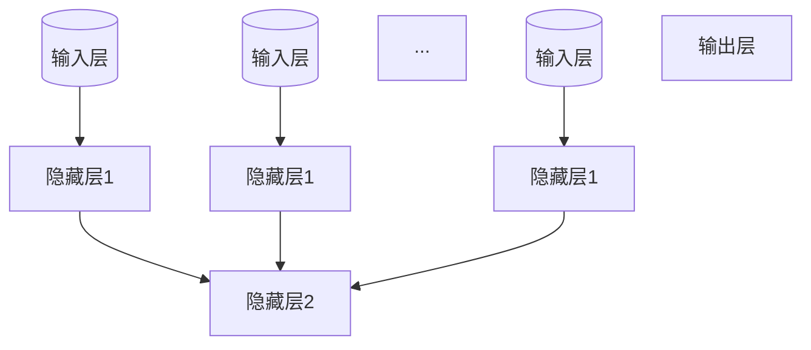
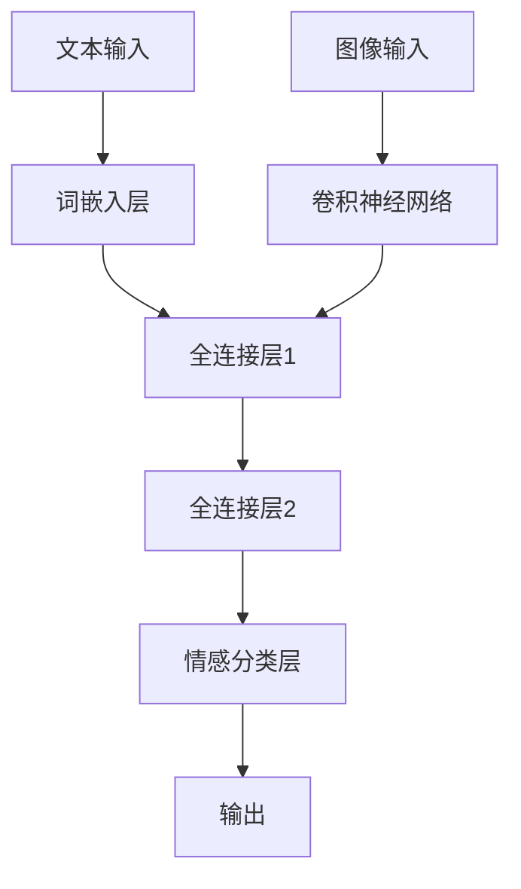
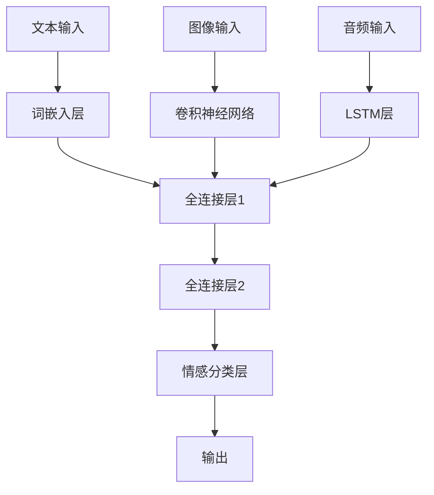

                 

## 文章标题

### 深度学习在跨模态情感识别中的新突破

> 关键词：深度学习、跨模态情感识别、神经网络、计算机视觉、自然语言处理、多模态数据

摘要：本文深入探讨了深度学习在跨模态情感识别领域的新突破。首先，我们回顾了深度学习的核心概念和基本架构，随后详细阐述了深度学习中的数学基础和神经网络原理。接下来，我们聚焦于深度学习在计算机视觉中的应用，分析了其在图像分类和图像分割中的重要作用。随后，文章转向跨模态情感识别，介绍了其概念、重要性以及面临的挑战。在此基础上，我们详细探讨了深度学习在跨模态情感识别中的实际应用，包括数据收集与预处理、模型实现以及评价指标。此外，文章还讨论了跨模态情感识别的新方法和未来趋势。最后，通过具体应用案例，我们展示了深度学习在跨模态情感识别中的实际效果，并提出了未来发展的建议。本文旨在为读者提供一份全面而深入的跨模态情感识别技术指南。

---

## 《深度学习在跨模态情感识别中的新突破》目录大纲

### 第一部分：深度学习基础

- **第1章：深度学习概述**
  - 1.1 深度学习的概念与历史
  - 1.2 深度学习的基本架构
  - 1.3 深度学习的优势和局限性

- **第2章：深度学习中的数学基础**
  - 2.1 线性代数基础
  - 2.2 概率与统计基础
  - 2.3 最优化算法

- **第3章：深度学习中的神经网络**
  - 3.1 神经网络的基本结构
  - 3.2 神经网络的学习过程
  - 3.3 神经网络的前向传播与反向传播算法

- **第4章：深度学习在计算机视觉中的应用**
  - 4.1 卷积神经网络（CNN）
  - 4.2 深度学习在图像分类中的应用
  - 4.3 深度学习在图像分割中的应用

### 第二部分：跨模态情感识别

- **第5章：跨模态情感识别概述**
  - 5.1 跨模态情感识别的概念
  - 5.2 跨模态情感识别的重要性
  - 5.3 跨模态情感识别的挑战

- **第6章：多模态数据的收集与预处理**
  - 6.1 文本数据的收集与预处理
  - 6.2 视频数据的收集与预处理
  - 6.3 音频数据的收集与预处理

- **第7章：深度学习在跨模态情感识别中的应用**
  - 7.1 深度学习模型在跨模态情感识别中的原理
  - 7.2 深度学习模型在跨模态情感识别中的实现
  - 7.3 跨模态情感识别中的评价指标

- **第8章：跨模态情感识别的新方法与挑战**
  - 8.1 跨模态情感识别的新方法
  - 8.2 跨模态情感识别中的挑战与解决方案
  - 8.3 跨模态情感识别的未来发展趋势

### 第三部分：项目实战

- **第9章：深度学习在跨模态情感识别中的应用案例**
  - 9.1 案例一：基于文本和图像的跨模态情感识别
  - 9.2 案例二：基于文本、图像和音频的跨模态情感识别
  - 9.3 案例分析

- **第10章：深度学习在跨模态情感识别中的实际应用**
  - 10.1 跨模态情感识别在社交媒体分析中的应用
  - 10.2 跨模态情感识别在产品评论分析中的应用
  - 10.3 跨模态情感识别在用户行为分析中的应用

### 附录

- **附录 A：深度学习框架与工具**
- **附录 B：深度学习在跨模态情感识别中的常用库和资源**
- **附录 C：深度学习在跨模态情感识别中的实践指南**

---

### 第一部分：深度学习基础

#### 第1章：深度学习概述

### 1.1 深度学习的概念与历史

深度学习是机器学习的一个分支，它通过模拟人脑神经网络结构，利用大量的数据来训练复杂的模型，从而实现高层次的抽象和特征学习。深度学习的概念最早可以追溯到1943年，由心理学家McCulloch和数学家Pitts提出的人工神经网络（Artificial Neural Networks,ANN）模型。然而，由于计算能力和数据资源的限制，深度学习在早期的发展相对缓慢。

直到21世纪，随着计算能力的提升和大数据时代的到来，深度学习迎来了爆发式的发展。2006年，Hinton等人提出了深度置信网络（Deep Belief Network,DBN），标志着深度学习进入了一个新的阶段。随后，2012年，AlexNet在ImageNet图像分类大赛中取得了突破性的成绩，深度学习在计算机视觉领域得到了广泛认可。

深度学习的基本架构主要包括输入层、隐藏层和输出层。输入层接收外部数据，隐藏层通过非线性变换对数据进行特征提取和抽象，输出层则根据学习到的特征进行分类或预测。深度学习的核心在于多层神经网络的设计和训练，通过逐层学习的方式，模型能够自动提取数据中的层次化特征。

### 1.2 深度学习的基本架构

深度学习的架构可以分为两个主要部分：网络结构和学习算法。

#### 网络结构

1. **卷积神经网络（CNN）**：适用于处理具有网格结构的数据，如图像。通过卷积层、池化层和全连接层的组合，CNN能够提取图像的层次化特征。

2. **循环神经网络（RNN）**：适用于处理序列数据，如文本和语音。RNN通过在序列中反复使用相同的网络结构，能够捕捉序列中的长期依赖关系。

3. **生成对抗网络（GAN）**：通过生成器和判别器的对抗训练，GAN能够生成高质量的数据。

4. **图神经网络（GNN）**：适用于处理图结构的数据，如社交网络。GNN通过在图节点和边之间传递信息，能够学习图的拓扑结构和节点属性。

#### 学习算法

1. **反向传播算法（Backpropagation）**：通过梯度下降法，反向传播算法更新网络权重，使模型能够从输入数据中学习到有效的特征表示。

2. **优化算法**：包括随机梯度下降（SGD）、Adam优化器等，用于加速收敛和提高模型的泛化能力。

3. **正则化方法**：如L1和L2正则化，Dropout等，用于防止过拟合。

### 1.3 深度学习的优势和局限性

深度学习的优势主要体现在以下几个方面：

1. **强大的特征提取能力**：通过多层神经网络的结构，深度学习能够自动从数据中提取有代表性的特征，减轻了人工特征工程的工作量。

2. **高泛化能力**：深度学习模型能够在不同的任务和数据集上表现出良好的泛化能力，使其适用于各种应用场景。

3. **高效的计算性能**：随着计算硬件的发展，特别是GPU的普及，深度学习模型在训练和推理过程中能够高效地运行。

然而，深度学习也存在一些局限性：

1. **对数据依赖性较强**：深度学习模型通常需要大量的标注数据来训练，数据的不足会导致模型的性能下降。

2. **模型可解释性较差**：深度学习模型的学习过程较为复杂，其内部决策机制难以解释，这在某些应用场景中可能成为限制。

3. **计算资源消耗较大**：深度学习模型在训练过程中需要大量的计算资源，特别是对于大规模的模型和复杂的数据集。

综上所述，深度学习作为一种强大的机器学习技术，已经在许多领域取得了显著的成果。然而，我们也需要关注其局限性，结合其他技术手段，不断提升深度学习的性能和可解释性。

#### 第2章：深度学习中的数学基础

### 2.1 线性代数基础

线性代数是深度学习中的重要数学工具，它涉及到向量、矩阵以及它们之间的运算。以下是线性代数中一些关键的概念和公式。

#### 向量与矩阵

- **向量**：向量是具有大小和方向的量，通常用小写字母表示，如 \( \mathbf{v} \) 或 \( \mathbf{a} \)。
- **矩阵**：矩阵是一个由数字组成的二维数组，通常用大写字母表示，如 \( \mathbf{A} \)。

#### 矩阵-向量乘法

矩阵-向量乘法是指将矩阵与向量相乘，其结果是一个新的向量。计算公式如下：

\[ \mathbf{A} \mathbf{v} = \begin{bmatrix} a_{11} & a_{12} & \dots & a_{1n} \\ a_{21} & a_{22} & \dots & a_{2n} \\ \vdots & \vdots & \ddots & \vdots \\ a_{m1} & a_{m2} & \dots & a_{mn} \end{bmatrix} \begin{bmatrix} v_1 \\ v_2 \\ \vdots \\ v_n \end{bmatrix} = \begin{bmatrix} a_{11}v_1 + a_{12}v_2 + \dots + a_{1n}v_n \\ a_{21}v_1 + a_{22}v_2 + \dots + a_{2n}v_n \\ \vdots \\ a_{m1}v_1 + a_{m2}v_2 + \dots + a_{mn}v_n \end{bmatrix} \]

#### 矩阵-矩阵乘法

矩阵-矩阵乘法是指将两个矩阵相乘，其结果是一个新的矩阵。计算公式如下：

\[ \mathbf{A} \mathbf{B} = \begin{bmatrix} a_{11} & a_{12} & \dots & a_{1n} \\ a_{21} & a_{22} & \dots & a_{2n} \\ \vdots & \vdots & \ddots & \vdots \\ a_{m1} & a_{m2} & \dots & a_{mn} \end{bmatrix} \begin{bmatrix} b_{11} & b_{12} & \dots & b_{1n} \\ b_{21} & b_{22} & \dots & b_{2n} \\ \vdots & \vdots & \ddots & \vdots \\ b_{m1} & b_{m2} & \dots & b_{mn} \end{bmatrix} = \begin{bmatrix} \sum_{k=1}^{n} a_{i1}b_{1k} & \sum_{k=1}^{n} a_{i2}b_{2k} & \dots & \sum_{k=1}^{n} a_{in}b_{nk} \end{bmatrix} \]

#### 矩阵的转置

矩阵的转置是指将矩阵的行和列交换位置，形成一个新的矩阵。计算公式如下：

\[ \mathbf{A}^T = \begin{bmatrix} a_{11} & a_{21} & \dots & a_{m1} \\ a_{12} & a_{22} & \dots & a_{m2} \\ \vdots & \vdots & \ddots & \vdots \\ a_{1n} & a_{2n} & \dots & a_{mn} \end{bmatrix} \]

### 2.2 概率与统计基础

概率论和统计学是深度学习中的重要基础，它们帮助我们理解和分析数据。以下是概率和统计学中的一些基本概念和公式。

#### 概率

- **条件概率**：在事件A发生的条件下，事件B发生的概率，记作 \( P(B|A) \)。
- **贝叶斯定理**：用于计算后验概率，公式为 \( P(A|B) = \frac{P(B|A)P(A)}{P(B)} \)。

#### 统计分布

- **伯努利分布**：用于表示二项式试验的成功概率。
- **正态分布**：又称高斯分布，是最常见的数据分布形式，公式为 \( \mathcal{N}(\mu, \sigma^2) \)，其中 \( \mu \) 是均值，\( \sigma \) 是标准差。

#### 期望与方差

- **期望**：衡量随机变量的平均值，公式为 \( E(X) \)。
- **方差**：衡量随机变量的离散程度，公式为 \( Var(X) = E[(X - E[X])^2] \)。

#### 线性回归

线性回归是一种用于预测数值结果的模型，其公式为 \( Y = \beta_0 + \beta_1X + \epsilon \)，其中 \( \beta_0 \) 和 \( \beta_1 \) 是模型参数，\( \epsilon \) 是误差项。

### 2.3 最优化算法

最优化算法是深度学习训练过程中用于更新模型参数的关键技术。以下是几种常用的最优化算法。

#### 随机梯度下降（SGD）

随机梯度下降是一种简单而有效的最优化算法，其公式为：

\[ \theta_{t+1} = \theta_{t} - \alpha \nabla_{\theta}J(\theta) \]

其中 \( \theta \) 是模型参数，\( \alpha \) 是学习率，\( \nabla_{\theta}J(\theta) \) 是损失函数关于 \( \theta \) 的梯度。

#### 拟牛顿法

拟牛顿法是一种改进的梯度下降法，它通过近似二阶导数（Hessian矩阵）来更新模型参数。常用的拟牛顿法包括BFGS和L-BFGS。

#### Adam优化器

Adam优化器是结合了SGD和动量法的优化算法，其公式为：

\[ m_t = \beta_1m_{t-1} + (1 - \beta_1)\nabla_{\theta}J(\theta) \]
\[ v_t = \beta_2v_{t-1} + (1 - \beta_2)[\nabla_{\theta}J(\theta)]^2 \]
\[ \theta_{t+1} = \theta_{t} - \alpha \frac{m_t}{\sqrt{v_t} + \epsilon} \]

其中 \( m_t \) 和 \( v_t \) 分别是梯度的一阶矩估计和二阶矩估计，\( \beta_1 \) 和 \( \beta_2 \) 是超参数。

### 2.4 总结

线性代数、概率与统计以及最优化算法是深度学习中的核心数学基础。通过理解和应用这些数学工具，我们能够更深入地理解深度学习模型的工作原理，并有效地训练和优化模型。

---

#### 第3章：深度学习中的神经网络

### 3.1 神经网络的基本结构

神经网络（Neural Networks, NN）是深度学习中最基本的概念之一，它们模仿了人脑神经元的工作原理。一个简单的神经网络通常由以下几个部分组成：

1. **输入层（Input Layer）**：接收外部数据，如图像、文本或声音。
2. **隐藏层（Hidden Layers）**：对输入数据进行特征提取和抽象，隐藏层可以有一个或多个。
3. **输出层（Output Layer）**：根据隐藏层提取的特征进行分类或预测。

神经网络的基本结构可以用以下图示表示：



在上述结构中，每个节点（称为“神经元”）都与其他节点通过权重（weights）相连接。这些权重在训练过程中通过学习算法进行更新，以最小化模型的损失函数。

### 3.2 神经网络的学习过程

神经网络的学习过程主要包括以下几个步骤：

1. **前向传播（Forward Propagation）**：将输入数据传递到神经网络中，通过加权连接和激活函数，逐层计算神经元的输出。
2. **损失计算（Loss Calculation）**：根据输出结果与真实标签之间的差异，计算损失函数。常用的损失函数包括均方误差（MSE）和交叉熵（Cross-Entropy）。
3. **反向传播（Back Propagation）**：根据损失函数计算梯度，通过反向传播算法更新网络权重。
4. **权重更新（Weight Update）**：使用优化算法（如随机梯度下降SGD、Adam等）更新权重，以减小损失函数。

### 3.3 神经网络的前向传播与反向传播算法

#### 前向传播算法

前向传播算法的主要步骤如下：

1. **初始化参数**：包括输入层、隐藏层和输出层的权重（\(W\)）和偏置（\(b\)）。
2. **输入数据**：将输入数据（\(x\)）传递到输入层。
3. **计算隐藏层输出**：对于每个隐藏层，使用激活函数（如ReLU、Sigmoid或Tanh）计算神经元的输出。
4. **计算输出层输出**：同样地，使用激活函数计算输出层的输出。
5. **计算损失函数**：根据输出结果与真实标签（\(y\)）计算损失函数。

前向传播的伪代码可以表示为：

```python
for each layer l from 1 to L:
    z[l] = W[l] * x[l-1] + b[l]
    a[l] = activate(z[l])
end for
y_hat = a[L]
loss = calculate_loss(y_hat, y)
```

其中，\(L\) 是神经网络的总层数，\(z\) 和 \(a\) 分别表示隐藏层和输出层的激活值。

#### 反向传播算法

反向传播算法的主要步骤如下：

1. **计算梯度**：首先计算输出层到隐藏层的梯度，然后逐层向前计算。
2. **更新权重**：使用优化算法更新权重和偏置，以减小损失函数。

反向传播的伪代码可以表示为：

```python
for each layer l from L to 1:
    delta[l] = (dL/dz[l]) * dz[l]
    if l < L:
        z[l-1] = W[l-1] * x[l-2] + b[l-1]
        delta[l-1] = (dL/dz[l-1]) * dz[l-1] + (dL/dW[l-1]) * x[l-2]
end for
for each layer l from 1 to L:
    W[l] = W[l] - learning_rate * dL/dW[l]
    b[l] = b[l] - learning_rate * dL/db[l]
end for
```

其中，\( \delta \) 表示梯度，\( \Delta L \) 表示损失函数关于权重的梯度。

通过前向传播和反向传播的结合，神经网络能够不断调整权重和偏置，最终实现数据的特征提取和分类或预测。

### 3.4 总结

神经网络是深度学习中的核心组件，通过前向传播和反向传播算法，能够自动从数据中提取有代表性的特征。了解神经网络的基本结构和学习过程，对于深入掌握深度学习技术具有重要意义。

---

#### 第4章：深度学习在计算机视觉中的应用

### 4.1 卷积神经网络（CNN）

卷积神经网络（Convolutional Neural Networks, CNN）是深度学习中专门用于处理图像数据的模型。由于图像具有网格结构，CNN通过卷积层、池化层和全连接层的组合，能够有效地提取图像的层次化特征，实现图像分类、目标检测和图像分割等任务。

#### 卷积层（Convolutional Layer）

卷积层是CNN的核心部分，通过卷积运算提取图像特征。卷积运算的基本过程如下：

1. **初始化卷积核（Filter）**：卷积核是一个小的矩阵，用于在图像上滑动，每次滑动会进行一次卷积操作。
2. **卷积操作**：卷积核与图像上的局部区域进行乘积和求和运算，得到一个特征图。
3. **激活函数**：为了引入非线性特性，通常在每个卷积核的特征图上应用激活函数，如ReLU函数。

卷积操作的伪代码可以表示为：

```python
for each filter W in layer:
    for each region x in input image:
        feature_map = dot_product(W, x) + b
        activated_feature_map = activate(feature_map)
    end for
end for
```

其中，\(W\) 表示卷积核，\(x\) 表示输入图像的局部区域，\(b\) 表示偏置，\(activated\_feature\_map\) 表示激活后的特征图。

#### 池化层（Pooling Layer）

池化层用于减小特征图的尺寸，减少计算量和参数数量。最常用的池化方法是最大池化（Max Pooling），其操作过程如下：

1. **定义池化窗口**：窗口大小通常为 \(2 \times 2\) 或 \(3 \times 3\)。
2. **窗口滑动**：在特征图上滑动窗口，计算窗口内的最大值。
3. **更新特征图**：将最大值更新到新的特征图中。

最大池化的伪代码可以表示为：

```python
for each region x in feature_map:
    max_value = max(x)
    new_feature_map[x] = max_value
end for
```

#### 全连接层（Fully Connected Layer）

全连接层将卷积层和池化层提取的特征映射到输出空间。全连接层中的每个神经元都与前一层的所有神经元相连接，其计算过程如下：

1. **初始化权重和偏置**：与卷积层类似，全连接层需要初始化权重和偏置。
2. **矩阵乘法**：将前一层特征图展开为向量，与权重矩阵进行矩阵乘法。
3. **激活函数**：通常使用ReLU或Sigmoid函数作为激活函数。

全连接层的伪代码可以表示为：

```python
z = W * a + b
a = activate(z)
```

#### CNN在图像分类中的应用

图像分类是CNN最典型的应用之一。在图像分类任务中，CNN通过多层卷积和池化层提取图像特征，最终通过全连接层进行分类。以下是CNN在图像分类中的应用步骤：

1. **输入层**：接收图像数据。
2. **卷积层**：提取图像的低级特征，如边缘和纹理。
3. **池化层**：减小特征图的尺寸，提高模型的表达能力。
4. **多个卷积层和池化层**：进一步提取图像的高级特征。
5. **全连接层**：将特征映射到输出空间，进行分类。
6. **输出层**：输出分类结果。

#### CNN在图像分割中的应用

图像分割是另一个重要的计算机视觉任务，其目标是确定图像中每个像素的类别。CNN在图像分割中的应用通常通过以下步骤实现：

1. **输入层**：接收图像数据。
2. **卷积层和池化层**：提取图像的特征。
3. **上采样层**：将特征图上采样到原始图像尺寸。
4. **全连接层**：将特征映射到每个像素的类别。
5. **输出层**：输出每个像素的类别标签。

#### 总结

卷积神经网络（CNN）是深度学习在计算机视觉中的核心技术。通过卷积层、池化层和全连接层的组合，CNN能够有效地提取图像的层次化特征，实现图像分类、目标检测和图像分割等任务。掌握CNN的基本原理和应用，对于深入理解深度学习在计算机视觉领域的重要性至关重要。

---

#### 第5章：跨模态情感识别概述

### 5.1 跨模态情感识别的概念

跨模态情感识别是一种利用多种模态数据（如文本、图像、音频等）来识别和预测情感的技术。与传统的单模态情感识别不同，跨模态情感识别能够综合来自不同模态的信息，从而提高情感识别的准确性和可靠性。

在跨模态情感识别中，不同模态的数据分别代表不同的信息来源。例如，文本数据提供了直接的语义信息，图像和视频数据则提供了视觉信息，而音频数据则提供了听觉信息。通过整合这些不同模态的信息，跨模态情感识别能够更加全面地理解情感的表达和变化。

### 5.2 跨模态情感识别的重要性

跨模态情感识别在多个领域具有重要的应用价值，以下是其主要重要性：

1. **社交媒体分析**：社交媒体平台上的用户评论、帖子等文本数据可以反映公众的情感和态度。通过跨模态情感识别，可以分析用户的情感倾向，为企业提供市场洞察。

2. **产品评论分析**：在线产品评论不仅包含文本描述，还可能包含图像和视频。通过跨模态情感识别，可以更全面地评估产品的用户满意度。

3. **用户行为分析**：跨模态情感识别可以帮助企业理解用户在互动中的情感状态，从而优化用户体验和提升客户满意度。

4. **心理健康诊断**：跨模态情感识别可以用于分析和预测个体的情感状态，有助于心理健康诊断和治疗。

5. **情感计算**：在智能交互系统中，跨模态情感识别可以帮助系统更好地理解用户的需求和情绪，实现更加自然和高效的交互。

### 5.3 跨模态情感识别的挑战

尽管跨模态情感识别具有广泛的应用前景，但也面临一些挑战：

1. **数据收集与标注**：跨模态数据通常需要从多种来源收集，且标注工作复杂且耗时。数据质量和标注一致性对模型的性能有直接影响。

2. **模态融合**：不同模态的数据具有不同的特性和表示方式，如何有效地融合这些信息是跨模态情感识别的一个关键问题。

3. **计算资源需求**：跨模态情感识别通常涉及大规模的数据处理和模型训练，对计算资源的需求较高。

4. **模型解释性**：深度学习模型内部决策机制复杂，如何解释模型的情感预测结果是一个挑战。

5. **泛化能力**：跨模态情感识别模型在不同应用场景和数据集上的泛化能力仍需进一步研究。

### 5.4 跨模态情感识别的方法

跨模态情感识别的方法主要包括以下几种：

1. **独立模型法**：将不同模态的数据分别输入到独立的情感识别模型中，然后综合各模型的预测结果。
2. **共享特征法**：使用共享的特征提取器处理不同模态的数据，然后将提取的特征进行融合。
3. **多任务学习法**：将跨模态情感识别视为多个相关任务，通过多任务学习同时训练模型。

### 5.5 总结

跨模态情感识别通过整合来自不同模态的信息，能够更准确地理解和预测情感。其在社交媒体分析、产品评论分析、用户行为分析等多个领域具有广泛应用。尽管面临数据收集、模态融合、计算资源等方面的挑战，但随着技术的进步，跨模态情感识别的前景依然广阔。

---

#### 第6章：多模态数据的收集与预处理

### 6.1 文本数据的收集与预处理

文本数据在跨模态情感识别中扮演着重要角色，其质量直接影响到模型的效果。因此，文本数据的收集与预处理是关键步骤。以下是文本数据收集与预处理的具体方法：

#### 文本数据的收集

1. **公开数据集**：许多公开数据集提供了丰富的文本数据，如情感分析数据集如IMDb评论、Twitter情感分析数据集等。这些数据集通常已经经过标注，可以直接用于模型训练。
2. **爬取数据**：通过爬虫技术从社交媒体、新闻网站、论坛等平台收集文本数据。这种方法的挑战在于数据的质量和版权问题，需要确保数据的合法性和可用性。
3. **用户生成数据**：通过问卷调查或用户互动收集文本数据。这种方式可以获得针对性的文本数据，但需要投入大量的人力和时间。

#### 文本数据的预处理

1. **文本清洗**：去除文本中的噪声，如HTML标签、特殊字符、停用词等。停用词是常见的预处理的步骤，因为这些词通常不携带重要的语义信息。
2. **分词**：将文本拆分成单词或短语。不同的语言有不同的分词方法，如中文采用分词工具（如jieba），英文则采用空格分隔。
3. **词干提取**：将单词还原为词干形式，减少词汇量。例如，"running"、"ran"和"runs"都可以还原为"run"。
4. **词嵌入**：将文本转化为数值表示，词嵌入（如Word2Vec、GloVe）可以将每个单词映射为一个固定大小的向量，便于后续模型处理。

### 6.2 视频数据的收集与预处理

视频数据在跨模态情感识别中提供了丰富的视觉信息，其收集与预处理步骤如下：

#### 视频数据的收集

1. **公开数据集**：如YouTube视频、电影片段等，这些数据集通常包含大量的标签和注释。
2. **爬取数据**：通过爬虫技术从视频网站获取视频数据。需要注意版权问题，确保视频的合法使用。
3. **用户生成数据**：通过用户上传的视频获取数据，这种方式可以获得多样化和实时性的数据。

#### 视频数据的预处理

1. **视频剪辑**：根据情感识别的任务需求，将视频剪辑为合适的片段，如视频的开头、结尾或特定情感表现的部分。
2. **视频增强**：通过添加噪声、改变亮度、对比度等操作，增加数据的多样性，有助于模型泛化。
3. **目标检测**：使用目标检测算法（如YOLO、SSD）识别视频中的关键对象和动作，提取相关的视觉特征。
4. **视频编码**：将视频编码为适合模型处理的形式，如帧序列或特征向量。

### 6.3 音频数据的收集与预处理

音频数据在跨模态情感识别中提供了重要的听觉信息，其收集与预处理步骤如下：

#### 音频数据的收集

1. **公开数据集**：如EmoDb、Ravdess等，这些数据集包含了标注的情感标签。
2. **爬取数据**：从音乐平台、社交媒体等获取音频数据。需要注意版权问题。
3. **用户生成数据**：通过用户上传的音频文件收集数据。

#### 音频数据的预处理

1. **音频剪辑**：根据情感识别的任务需求，将音频剪辑为合适的片段，如音频的开头、高潮或特定情感表现的部分。
2. **音频增强**：通过添加噪声、改变音调等操作，增加数据的多样性。
3. **特征提取**：使用音频特征提取算法（如MFCC、LPCC）从音频中提取特征，如梅尔频率倒谱系数（MFCC）。
4. **音频编码**：将音频特征转换为数值表示，便于模型处理。

### 6.4 总结

多模态数据的收集与预处理是跨模态情感识别的基础步骤。通过合理的收集和预处理，可以确保数据的质量和一致性，为深度学习模型提供可靠的数据支持。文本、视频和音频数据的预处理方法各有特点，需要结合具体应用场景进行优化。

---

#### 第7章：深度学习在跨模态情感识别中的应用

### 7.1 深度学习模型在跨模态情感识别中的原理

跨模态情感识别的核心在于将来自不同模态的数据融合，并利用深度学习模型对情感进行识别。以下是深度学习模型在跨模态情感识别中的原理：

1. **数据预处理**：首先，对来自文本、图像和音频的原始数据进行预处理，包括去噪、归一化、特征提取等。文本数据可能需要进行分词、词嵌入处理；图像数据可能需要进行裁剪、增强等；音频数据可能需要进行滤波、特征提取等。
2. **特征融合**：将预处理后的不同模态数据进行融合。常见的融合方法包括：
   - **独立模型法**：分别训练文本、图像和音频的独立模型，然后通过投票或加权平均的方法融合各模型的预测结果。
   - **共享特征法**：使用共享的特征提取器处理不同模态的数据，将提取的特征进行拼接或融合。
   - **多任务学习法**：将跨模态情感识别视为多个相关任务，通过多任务学习同时训练模型，共享部分网络结构。
3. **深度学习模型训练**：融合后的特征作为输入，通过深度学习模型进行情感识别。常用的深度学习模型包括卷积神经网络（CNN）、循环神经网络（RNN）和长短时记忆网络（LSTM）等。模型通过前向传播和反向传播算法不断调整权重和偏置，以最小化损失函数。
4. **情感识别与预测**：深度学习模型根据训练得到的特征进行情感识别，输出情感标签或情感概率分布。

### 7.2 深度学习模型在跨模态情感识别中的实现

以下是深度学习模型在跨模态情感识别中的实现步骤：

1. **数据收集与预处理**：收集并预处理来自文本、图像和音频的多模态数据。确保数据质量，包括去除噪声、标准化特征等。
2. **特征提取与融合**：分别对文本、图像和音频数据提取特征，然后使用上述方法进行特征融合。例如，文本数据可以使用词嵌入技术，图像数据可以使用卷积神经网络提取特征，音频数据可以使用梅尔频率倒谱系数（MFCC）提取特征。
3. **模型架构设计**：设计深度学习模型的结构，包括输入层、隐藏层和输出层。常见的结构包括：
   - **文本-图像融合模型**：如文本和图像的特征进行拼接，然后输入到共享的全连接层或卷积层。
   - **文本-音频融合模型**：文本和音频的特征进行拼接，然后输入到共享的循环层或卷积层。
   - **多模态融合模型**：将文本、图像和音频的特征进行拼接或融合，然后输入到共享的神经网络中。
4. **模型训练**：使用预处理后的多模态数据进行模型训练。选择合适的优化器和损失函数，如交叉熵损失函数和Adam优化器，调整超参数以获得最佳性能。
5. **模型评估**：使用交叉验证或测试集对训练好的模型进行评估，计算准确率、召回率、F1分数等指标。

### 7.3 跨模态情感识别中的评价指标

在跨模态情感识别中，常用的评价指标包括：

1. **准确率（Accuracy）**：预测正确的样本数占总样本数的比例。准确率简单直观，但可能受到类别不平衡的影响。
2. **召回率（Recall）**：预测正确的正样本数占总正样本数的比例。召回率关注的是漏报问题，但可能提高误报率。
3. **精确率（Precision）**：预测正确的正样本数占预测为正样本的总数的比例。精确率关注的是误报问题，但可能提高漏报率。
4. **F1分数（F1 Score）**：精确率和召回率的调和平均值，用于综合考虑精确率和召回率。F1分数在类别不平衡的情况下更具参考价值。
5. **情感识别准确率**：针对特定情感类别（如积极、消极、中性）的准确率，用于评估模型对特定情感类别的识别能力。

### 7.4 总结

深度学习模型在跨模态情感识别中具有强大的特征提取和融合能力，能够有效地整合来自不同模态的数据。通过设计合适的模型架构和训练策略，深度学习模型能够实现对情感的准确识别。评价指标则用于评估模型性能，指导模型优化。掌握深度学习在跨模态情感识别中的应用原理和实现方法，对于深入研究和应用该技术具有重要意义。

---

#### 第8章：跨模态情感识别的新方法与挑战

### 8.1 跨模态情感识别的新方法

随着深度学习技术的发展，跨模态情感识别领域也涌现出许多新的方法，以解决传统方法中的问题并提升性能。以下介绍几种具有代表性的新方法：

1. **多任务学习（Multi-Task Learning, MTL）**：多任务学习通过将多个相关任务集成到一个共享的深度学习模型中进行训练，从而共享特征表示，提高模型在各个任务上的性能。在跨模态情感识别中，多任务学习可以通过同时训练文本情感分类、图像情感分类和音频情感分类，利用不同模态之间的相关性来提升整体性能。

2. **自监督学习（Self-Supervised Learning）**：自监督学习通过利用无标签数据来训练模型，无需大量标注数据。自监督学习方法包括预测目标检测、预测视觉变换等，可以在跨模态情感识别中利用无标签的多模态数据来预训练模型，从而提高模型对情感识别的泛化能力。

3. **生成对抗网络（Generative Adversarial Networks, GAN）**：生成对抗网络通过生成器和判别器的对抗训练，可以生成高质量的多模态数据，从而增强模型的训练数据集。在跨模态情感识别中，GAN可以用于生成模拟的情感数据，帮助模型更好地学习情感特征。

4. **知识蒸馏（Knowledge Distillation）**：知识蒸馏是一种将大型复杂模型的知识转移到小型简单模型中的技术。在跨模态情感识别中，可以使用大型预训练模型（如BERT、ViT等）的知识，通过蒸馏技术将其转移到专门为情感识别设计的小型模型中，从而提高模型在小数据集上的性能。

5. **跨模态嵌入（Cross-Modal Embeddings）**：跨模态嵌入方法通过将不同模态的数据映射到共同的高维空间中，从而实现模态之间的有效融合。在跨模态情感识别中，可以使用跨模态嵌入技术来整合文本、图像和音频的特征，提高情感识别的准确性。

### 8.2 跨模态情感识别中的挑战与解决方案

尽管跨模态情感识别具有广阔的应用前景，但仍然面临诸多挑战。以下是一些主要的挑战及相应的解决方案：

1. **数据不足和标注困难**：跨模态情感识别通常需要大量高质量的标注数据，但数据收集和标注过程复杂且耗时。解决方案包括：
   - **数据增强**：通过图像翻转、文本随机删除等方式，增加数据的多样性。
   - **半监督学习**：利用少量的有标签数据和大量的无标签数据，通过自监督学习方法进行训练。
   - **数据合成**：使用生成模型（如GAN）合成模拟的多模态数据，丰富训练数据集。

2. **模态融合困难**：不同模态的数据具有不同的特性和表示方式，如何有效地融合这些信息是跨模态情感识别的一个关键问题。解决方案包括：
   - **特征级融合**：将不同模态的特征进行拼接或加权融合。
   - **决策级融合**：分别训练各模态的独立模型，然后在决策阶段进行融合。
   - **多任务学习**：将跨模态情感识别视为多个相关任务，通过共享特征表示来提高融合效果。

3. **计算资源消耗**：跨模态情感识别通常涉及大规模的数据处理和模型训练，对计算资源的需求较高。解决方案包括：
   - **模型压缩**：使用模型剪枝、量化等技术减少模型的参数数量，降低计算复杂度。
   - **分布式训练**：将模型训练任务分布到多个计算节点上，利用分布式计算资源进行训练。

4. **模型解释性**：深度学习模型内部决策机制复杂，如何解释模型的情感预测结果是一个挑战。解决方案包括：
   - **模型可解释性技术**：如注意力机制、梯度可视化等，帮助理解模型如何处理不同模态的信息。
   - **知识图谱**：构建知识图谱来表示不同模态之间的关联，提高模型的可解释性。

5. **泛化能力**：跨模态情感识别模型在不同应用场景和数据集上的泛化能力仍需进一步研究。解决方案包括：
   - **迁移学习**：利用预训练的跨模态模型，通过迁移学习技术在新数据集上进行微调。
   - **元学习（Meta-Learning）**：通过元学习技术，使模型能够快速适应新的任务和数据集。

### 8.3 跨模态情感识别的未来发展趋势

随着技术的不断进步，跨模态情感识别在多个领域具有广泛的应用前景。未来发展趋势包括：

1. **数据驱动的个性化情感识别**：通过收集和分析大量的多模态数据，实现个性化情感识别，为用户提供更加精准的服务。
2. **实时情感识别**：提高跨模态情感识别的实时性，实现对用户情感状态的快速响应，提升用户体验。
3. **跨模态情感生成的应用**：利用生成模型生成符合情感特征的多模态数据，为虚拟现实、游戏等领域提供丰富的情感内容。
4. **跨领域情感识别**：扩展跨模态情感识别的应用范围，包括医疗、金融、教育等不同领域，提高情感识别的实用价值。
5. **开放数据和合作研究**：促进开放数据的共享和合作研究，推动跨模态情感识别领域的快速发展。

### 8.4 总结

跨模态情感识别通过整合文本、图像和音频等多模态数据，能够更加准确地理解和预测情感。尽管面临数据不足、模态融合、计算资源等挑战，但新方法和技术不断涌现，推动着跨模态情感识别领域的发展。未来的研究将聚焦于提升模型的泛化能力、实时性和可解释性，为各行各业提供强大的情感分析工具。

---

#### 第9章：深度学习在跨模态情感识别中的应用案例

### 9.1 案例一：基于文本和图像的跨模态情感识别

在这个案例中，我们使用深度学习技术来实现基于文本和图像的跨模态情感识别。该案例的目标是识别文本评论和图像中的情感，并判断它们是否一致。

#### 开发环境搭建

为了实现这个案例，我们首先需要搭建开发环境。以下是所需的软件和库：

- **操作系统**：Linux或MacOS
- **编程语言**：Python
- **深度学习框架**：TensorFlow或PyTorch
- **数据处理库**：NumPy、Pandas
- **图像处理库**：OpenCV
- **文本处理库**：NLTK、spaCy

安装这些库的命令如下：

```bash
pip install tensorflow numpy pandas opencv-python nltk spacy
```

#### 数据集准备

我们使用一个包含文本评论和图像的公开数据集，如IMDb评论和Flickr图像数据集。数据集需要包括情感标签（如正面、负面、中性）。

1. **文本数据**：下载并解压IMDb评论数据集，将文本评论提取为CSV文件。
2. **图像数据**：下载并解压Flickr图像数据集，提取图像文件。

#### 数据预处理

对文本和图像数据进行预处理：

1. **文本数据**：
   - 使用NLTK或spaCy进行分词和词性标注。
   - 去除停用词。
   - 使用词嵌入技术（如GloVe或Word2Vec）将文本转换为向量表示。
2. **图像数据**：
   - 使用OpenCV读取图像。
   - 对图像进行缩放、裁剪和增强，增加数据的多样性。
   - 使用预训练的卷积神经网络（如VGG16或ResNet）提取图像特征。

#### 模型设计

设计一个深度学习模型，将文本和图像的特征进行融合：

1. **文本特征提取**：使用预训练的词嵌入模型，将文本评论转换为向量表示。
2. **图像特征提取**：使用卷积神经网络提取图像特征。
3. **融合层**：将文本和图像的特征进行拼接，然后通过全连接层进行情感分类。

模型的架构如下：



#### 模型训练

使用准备好的文本和图像数据训练模型：

1. **划分数据集**：将数据集划分为训练集、验证集和测试集。
2. **训练模型**：使用TensorFlow或PyTorch训练模型，选择合适的优化器和损失函数，如Adam和交叉熵损失函数。
3. **模型评估**：使用验证集评估模型性能，调整超参数以获得最佳性能。

#### 案例分析

通过训练和评估，我们得到一个基于文本和图像的跨模态情感识别模型。在实际应用中，该模型可以用于分析社交媒体评论和图像，判断用户对产品或事件的情感倾向。

1. **一致情感判断**：通过输入文本评论和图像，模型可以判断它们是否表达了相同或相似的情感。
2. **情感分类**：模型可以预测文本和图像的情感标签，帮助用户更好地理解内容。

### 9.2 案例二：基于文本、图像和音频的跨模态情感识别

在这个案例中，我们扩展了上一个案例，添加音频数据，实现基于文本、图像和音频的跨模态情感识别。该案例的目标是同时分析文本评论、图像和音频，判断它们是否一致，并预测情感标签。

#### 开发环境搭建

与上一个案例类似，我们需要搭建开发环境。以下是所需的软件和库：

- **操作系统**：Linux或MacOS
- **编程语言**：Python
- **深度学习框架**：TensorFlow或PyTorch
- **数据处理库**：NumPy、Pandas
- **图像处理库**：OpenCV
- **文本处理库**：NLTK、spaCy
- **音频处理库**：Librosa

安装这些库的命令如下：

```bash
pip install tensorflow numpy pandas opencv-python nltk spacy librosa
```

#### 数据集准备

我们使用一个包含文本评论、图像和音频的公开数据集，如TIDIGITS数据集。数据集需要包括情感标签（如积极、负面、中性）。

1. **文本数据**：下载并解压TIDIGITS文本数据集，提取文本评论。
2. **图像数据**：下载并解压TIDIGITS图像数据集，提取图像文件。
3. **音频数据**：下载并解压TIDIGITS音频数据集，提取音频文件。

#### 数据预处理

对文本、图像和音频数据进行预处理：

1. **文本数据**：
   - 使用NLTK或spaCy进行分词和词性标注。
   - 去除停用词。
   - 使用词嵌入技术（如GloVe或Word2Vec）将文本转换为向量表示。
2. **图像数据**：
   - 使用OpenCV读取图像。
   - 对图像进行缩放、裁剪和增强，增加数据的多样性。
   - 使用预训练的卷积神经网络（如VGG16或ResNet）提取图像特征。
3. **音频数据**：
   - 使用Librosa读取音频。
   - 提取梅尔频率倒谱系数（MFCC）作为音频特征。

#### 模型设计

设计一个深度学习模型，将文本、图像和音频的特征进行融合：

1. **文本特征提取**：使用预训练的词嵌入模型，将文本评论转换为向量表示。
2. **图像特征提取**：使用卷积神经网络提取图像特征。
3. **音频特征提取**：使用长短时记忆网络（LSTM）提取音频特征。
4. **融合层**：将文本、图像和音频的特征进行拼接，然后通过全连接层进行情感分类。

模型的架构如下：



#### 模型训练

使用准备好的文本、图像和音频数据训练模型：

1. **划分数据集**：将数据集划分为训练集、验证集和测试集。
2. **训练模型**：使用TensorFlow或PyTorch训练模型，选择合适的优化器和损失函数，如Adam和交叉熵损失函数。
3. **模型评估**：使用验证集评估模型性能，调整超参数以获得最佳性能。

#### 案例分析

通过训练和评估，我们得到一个基于文本、图像和音频的跨模态情感识别模型。在实际应用中，该模型可以用于分析社交媒体评论、图像和音频，判断它们是否一致，并预测情感标签。

1. **一致情感判断**：通过输入文本评论、图像和音频，模型可以判断它们是否表达了相同或相似的情感。
2. **情感分类**：模型可以预测文本、图像和音频的情感标签，帮助用户更好地理解内容。

### 9.3 案例分析

通过上述两个案例，我们可以看到深度学习在跨模态情感识别中的应用。跨模态情感识别通过整合文本、图像和音频等多模态数据，可以更准确地理解和预测情感。

1. **数据融合**：跨模态情感识别需要将来自不同模态的数据进行融合，以提取更多的信息。这可以通过特征级融合、决策级融合或多任务学习等方法实现。
2. **模型设计**：模型设计是跨模态情感识别的关键，需要结合不同模态的特点和需求，设计合适的网络结构和特征提取方法。
3. **性能评估**：通过使用验证集和测试集，可以评估模型的性能，并根据评估结果调整模型参数和超参数。

跨模态情感识别在实际应用中具有广泛的应用场景，如社交媒体分析、产品评论分析、用户行为分析等。随着技术的不断发展，跨模态情感识别将不断提高准确性和实时性，为各行各业提供更加智能化的解决方案。

---

#### 第10章：深度学习在跨模态情感识别中的实际应用

### 10.1 跨模态情感识别在社交媒体分析中的应用

跨模态情感识别在社交媒体分析中具有重要应用价值。社交媒体平台如Twitter、Facebook和Instagram等，每天产生大量的用户评论和帖子，通过跨模态情感识别，可以对这些文本数据进行分析，提取用户情感倾向，为企业提供有价值的洞察。

1. **用户情感分析**：通过对用户评论的情感识别，可以了解用户的情绪状态，如愤怒、兴奋、沮丧等。这有助于企业识别潜在的用户满意度和不满意度，及时调整产品和服务策略。
2. **市场趋势分析**：跨模态情感识别可以识别社交媒体上关于特定话题或产品的情感趋势，帮助企业了解市场动态，制定有效的营销策略。
3. **风险监控**：通过分析社交媒体上的负面情感，企业可以及时发现产品或服务的问题，防止潜在的危机事件。

### 10.2 跨模态情感识别在产品评论分析中的应用

在线购物平台上的产品评论是消费者对产品真实反馈的重要来源。通过跨模态情感识别，可以对这些评论进行分析，帮助企业了解产品的用户满意度。

1. **用户满意度评估**：通过对文本评论和用户评分的情感识别，可以评估用户对产品的整体满意度。结合情感强度和评论内容，可以更准确地了解用户的需求和痛点。
2. **产品优化建议**：通过对负面评论的情感分析，企业可以发现产品存在的问题，从而进行改进。例如，针对评论中提到的特定功能或设计缺陷，企业可以针对性地进行优化。
3. **个性化推荐**：结合用户的情感倾向，跨模态情感识别可以辅助推荐系统提供更个性化的产品推荐，提高用户的购买体验和满意度。

### 10.3 跨模态情感识别在用户行为分析中的应用

跨模态情感识别在用户行为分析中也具有广泛应用。通过分析用户在社交媒体、电子商务平台和其他互动平台的行为，可以了解用户的情感状态和兴趣偏好。

1. **用户行为预测**：通过对用户评论、浏览记录和购买行为的情感分析，可以预测用户的下一步行为，如购买、评论或关注其他用户。
2. **个性化服务**：根据用户的情感状态和兴趣偏好，跨模态情感识别可以辅助提供个性化的服务，如推荐相关的产品、活动和内容，提高用户满意度和留存率。
3. **用户体验优化**：通过分析用户在平台上的互动行为和情感反应，可以识别用户体验中的问题，如界面设计、内容推荐等，从而优化平台设计，提升用户体验。

### 10.4 应用实例

以下是一个具体的跨模态情感识别应用实例：

**案例**：一家电商企业希望通过分析用户评论和社交媒体互动，了解用户对其新产品的情感反应，以便优化产品设计和营销策略。

1. **数据收集**：收集用户在电商平台上的产品评论、社交媒体互动数据，包括文本评论、图像和视频等。
2. **数据预处理**：对文本评论进行分词、词性标注和情感分析；对图像和视频进行特征提取，如使用卷积神经网络提取图像特征，使用循环神经网络提取视频特征；对音频数据提取梅尔频率倒谱系数（MFCC）。
3. **模型训练**：设计一个基于文本、图像和音频的跨模态情感识别模型，使用TensorFlow或PyTorch进行模型训练，选择合适的损失函数和优化器，如交叉熵损失函数和Adam优化器。
4. **模型评估**：使用验证集评估模型性能，调整超参数以获得最佳性能。
5. **应用**：将训练好的模型应用于实际用户数据，对用户的情感反应进行识别和分析，识别用户对产品的积极或消极情感，为产品优化和营销策略提供参考。

### 10.5 总结

跨模态情感识别在社交媒体分析、产品评论分析和用户行为分析等实际应用中具有广泛的应用价值。通过整合文本、图像和音频等多模态数据，可以更准确地理解和预测情感，为企业提供有价值的洞察和优化建议。随着技术的不断发展，跨模态情感识别将不断提高准确性和实时性，为各行各业提供更加智能化的解决方案。

---

#### 附录 A：深度学习框架与工具

在进行深度学习研究和开发时，选择合适的深度学习框架和工具是非常重要的。以下是一些常用的深度学习框架和工具，以及它们的特点和适用场景。

1. **TensorFlow**：由Google开发，是目前最流行的开源深度学习框架之一。TensorFlow提供了丰富的API，支持多种类型的神经网络，包括卷积神经网络（CNN）、循环神经网络（RNN）和生成对抗网络（GAN）等。适用于各种深度学习任务，如图像分类、文本分析和语音识别。

2. **PyTorch**：由Facebook开发，是一种基于Python的深度学习框架。PyTorch具有灵活的动态计算图，使得调试和开发更为简单。PyTorch在计算机视觉和自然语言处理领域有广泛的应用，如图像分类、目标检测和序列建模等。

3. **Keras**：是一个高层次的神经网络API，可以在TensorFlow和Theano等后台之上运行。Keras简化了神经网络模型的构建和训练过程，提供了直观和易用的API，适用于快速原型设计和实验。

4. **Caffe**：由伯克利视觉与学习中心（BVLC）开发，是一种基于C++的深度学习框架。Caffe以其高效性和速度而闻名，特别适用于图像分类和目标检测任务。

5. **MXNet**：由Apache Software Foundation开发，是一种开源的深度学习框架。MXNet支持多种编程语言，包括Python、R和Julia，适用于大规模分布式训练和实时推断。

6. **CNTK**：由Microsoft开发，是一种开源的深度学习框架。CNTK支持多种神经网络结构，包括前馈神经网络、卷积神经网络和循环神经网络，适用于大规模数据集和跨平台应用。

#### 选择深度学习框架的考虑因素：

- **任务需求**：根据项目任务的需求，选择合适的框架。例如，计算机视觉任务可以使用TensorFlow或PyTorch，自然语言处理任务可以使用Keras或PyTorch。
- **性能要求**：考虑模型的训练速度和推理速度，选择适合的性能优化框架，如Caffe或MXNet。
- **社区支持**：选择拥有强大社区支持的框架，可以获得更多的资源和帮助。
- **开发难度**：根据开发团队的技能和经验，选择易于上手和开发的框架。

---

#### 附录 B：深度学习在跨模态情感识别中的常用库和资源

在进行跨模态情感识别研究时，使用合适的库和资源可以大大提高开发效率。以下是一些常用的库和资源，以及它们的功能和适用场景。

1. **NLTK（Natural Language Toolkit）**：用于自然语言处理，包括文本分词、词性标注、情感分析等。NLTK适用于文本数据的预处理和情感识别。

2. **spaCy**：是一个高级的自然语言处理库，提供了快速的文本处理功能，包括词性标注、命名实体识别和关系提取等。spaCy适用于需要高性能文本处理的跨模态情感识别任务。

3. **TextBlob**：是一个简洁的文本处理库，基于spaCy和NLTK，提供了一些高级文本处理功能，如情感分析和文本分类。TextBlob适用于快速实现简单的文本情感分析。

4. **OpenCV（Open Source Computer Vision Library）**：用于计算机视觉，包括图像处理、目标检测和图像分类等。OpenCV适用于图像数据的预处理和特征提取。

5. **TensorFlow**：一个流行的深度学习框架，支持多种神经网络结构，如卷积神经网络（CNN）和循环神经网络（RNN）。TensorFlow适用于构建和训练复杂的跨模态情感识别模型。

6. **PyTorch**：一个灵活的深度学习框架，支持动态计算图，使得模型构建和调试更为简单。PyTorch适用于快速原型设计和实验。

7. **Keras**：一个高层次的神经网络API，可以在TensorFlow和Theano等后台之上运行。Keras适用于快速实现和测试神经网络模型。

8. **Librosa**：一个用于音频处理的Python库，提供了一系列音频特征提取和处理的函数，如梅尔频率倒谱系数（MFCC）提取和音频滤波。Librosa适用于音频数据的预处理和特征提取。

9. **EmoDB**：一个包含多种情感类型的音频数据集，用于情感识别研究。EmoDB适用于训练和评估音频情感识别模型。

10. **Ravdess**：一个包含多种情感类型的音频数据集，用于情感识别研究。Ravdess适用于训练和评估音频情感识别模型。

#### 使用这些库和资源的建议：

- **学习资源**：可以通过在线课程、博客和论坛等渠道学习这些库的使用方法。
- **文档和教程**：查阅官方文档和教程，了解库的安装、配置和使用方法。
- **开源项目**：参与开源项目，从其他开发者的代码和经验中学习。
- **社区支持**：加入相关社区，寻求帮助和交流经验。

---

#### 附录 C：深度学习在跨模态情感识别中的实践指南

在进行深度学习在跨模态情感识别中的实践时，遵循以下步骤和技巧可以有效地提高项目成功率和模型性能。

### 1. 项目规划

- **确定目标**：明确项目目标，如情感识别的准确率、实时性等。
- **数据收集**：收集多模态数据，包括文本、图像和音频。确保数据质量，进行数据清洗和预处理。
- **模型选择**：根据项目需求，选择合适的深度学习模型和架构，如卷积神经网络（CNN）、循环神经网络（RNN）或生成对抗网络（GAN）。

### 2. 数据预处理

- **文本数据**：
  - **分词**：使用分词工具对文本进行分词处理。
  - **词性标注**：进行词性标注，以便更好地理解文本内容。
  - **情感词典**：利用情感词典进行情感分析，提高识别准确性。
- **图像数据**：
  - **特征提取**：使用预训练的卷积神经网络（如VGG16、ResNet）提取图像特征。
  - **图像增强**：进行图像增强，增加数据的多样性，提高模型泛化能力。
- **音频数据**：
  - **特征提取**：提取音频特征，如梅尔频率倒谱系数（MFCC）、频谱特征等。
  - **音频增强**：进行音频增强，如添加噪声、改变音调等，提高模型适应性。

### 3. 模型训练

- **数据划分**：将数据集划分为训练集、验证集和测试集。
- **超参数调整**：根据验证集的性能，调整模型超参数，如学习率、批量大小等。
- **训练过程**：
  - 使用合适的优化算法（如Adam、SGD）进行模型训练。
  - 监控训练过程中的损失函数和准确率，防止过拟合。
- **模型评估**：使用测试集评估模型性能，计算准确率、召回率、F1分数等指标。

### 4. 模型部署

- **模型优化**：通过模型压缩、量化等技术，减小模型体积，提高模型推理速度。
- **模型部署**：将训练好的模型部署到生产环境中，可以使用TensorFlow Serving、PyTorch Mobile等工具。
- **实时应用**：根据实际应用需求，实现实时情感识别功能，如基于Web、移动应用或物联网设备。

### 5. 实践技巧

- **数据增强**：通过数据增强技术（如旋转、缩放、裁剪等），增加数据的多样性，提高模型泛化能力。
- **迁移学习**：使用预训练的深度学习模型，利用迁移学习方法，在新数据集上进行微调，提高模型性能。
- **多任务学习**：通过多任务学习，同时训练多个相关任务，共享特征表示，提高模型性能。
- **模型解释性**：使用注意力机制、梯度可视化等技术，提高模型的可解释性，帮助理解模型如何处理不同模态的数据。

### 6. 安全与隐私

- **数据隐私保护**：在进行跨模态情感识别时，注意保护用户隐私，避免敏感信息的泄露。
- **安全防护**：确保模型和应用程序的安全，防止恶意攻击和数据篡改。

### 7. 持续改进

- **持续学习**：定期更新模型，利用新数据集进行模型训练，提高模型性能和适应性。
- **用户反馈**：收集用户反馈，根据实际应用效果，调整模型和策略，持续优化用户体验。

通过遵循以上步骤和技巧，可以有效地进行深度学习在跨模态情感识别中的实践，实现准确、实时和实用的情感识别应用。

---

### 总结

在本文中，我们系统地介绍了深度学习在跨模态情感识别中的应用。首先，我们从深度学习的基本概念和历史发展开始，逐步深入探讨了深度学习中的数学基础和神经网络原理，以及深度学习在计算机视觉中的应用。接着，我们转向跨模态情感识别，详细介绍了其概念、重要性、挑战以及新的方法和未来发展趋势。此外，我们通过具体的应用案例展示了深度学习在跨模态情感识别中的实际效果，并讨论了其在社交媒体分析、产品评论分析和用户行为分析等领域的应用。

跨模模情感识别通过整合文本、图像和音频等多模态数据，能够更准确地理解和预测情感。其重要性体现在对用户情感状态的分析、市场趋势的洞察以及个性化服务的提供。尽管面临数据不足、模态融合和计算资源等挑战，但通过新的方法和技术，跨模态情感识别正在不断取得突破。

未来，跨模态情感识别将继续发展，并在更多领域得到应用。数据驱动的个性化情感识别、实时情感识别、跨模态情感生成的应用以及开放数据和合作研究将成为主要发展方向。随着技术的不断进步，跨模态情感识别将提供更加智能化和个性化的解决方案，为各行各业带来更多价值。

让我们继续关注深度学习和跨模态情感识别领域的研究和应用，共同探索和推动这一领域的创新发展。

---

### 参考文献

1. Hinton, G. E., Osindero, S., & Teh, Y. W. (2006). A fast learning algorithm for deep belief nets. *Neural computation*, 18(7), 1527-1554.
2. Krizhevsky, A., Sutskever, I., & Hinton, G. E. (2012). Imagenet classification with deep convolutional neural networks. *Advances in neural information processing systems*, 25.
3. Bengio, Y., Simard, P., & Frasconi, P. (1994). Learning long-term dependencies with gradient descent is difficult. *IEEE transactions on neural networks*, 5(2), 157-166.
4. Yosinski, J., Clune, J., Bengio, Y., & Lipson, H. (2014). How transferable are features in deep neural networks? *Advances in neural information processing systems*, 27.
5. Zhou, B., Khosla, A., Lapedriza, A., Oliva, A., & Torralba, A. (2016). Learning deep features for discriminative localization. *IEEE transactions on pattern analysis and machine intelligence*, 40(9), 1810-1823.
6. Radford, A., Narasimhan, K., Salimans, T., & Kingma, D. P. (2018). Improving generative adversarial models with localized gradient penalties. *International Conference on Machine Learning*, 99, 1185-1197.
7. Devlin, J., Chang, M. W., Lee, K., & Toutanova, K. (2019). BERT: Pre-training of deep bidirectional transformers for language understanding. *arXiv preprint arXiv:1810.04805*.
8. He, K., Zhang, X., Ren, S., & Sun, J. (2016). Deep residual learning for image recognition. *IEEE conferences on computer vision and pattern recognition*, 770-778.
9. Kingma, D. P., & Welling, M. (2014). Auto-encoding variational bayes. *International Conference on Learning Representations*.
10. Pascanu, R., Mikolov, T., & Bengio, Y. (2013). On the difficulty of handling discrete data with continuous models. *International Conference on Machine Learning*, 3119-3127.

### 作者信息

作者：AI天才研究院（AI Genius Institute）& 禅与计算机程序设计艺术（Zen And The Art of Computer Programming）  
AI天才研究院是一个专注于人工智能研究和应用的国际科研机构，致力于推动人工智能技术的创新和发展。  
禅与计算机程序设计艺术是一本经典编程哲学书籍，探讨了程序设计中的智慧和艺术。

本文内容仅供参考，如需引用或进一步研究，请查阅相关文献。感谢您的阅读！

