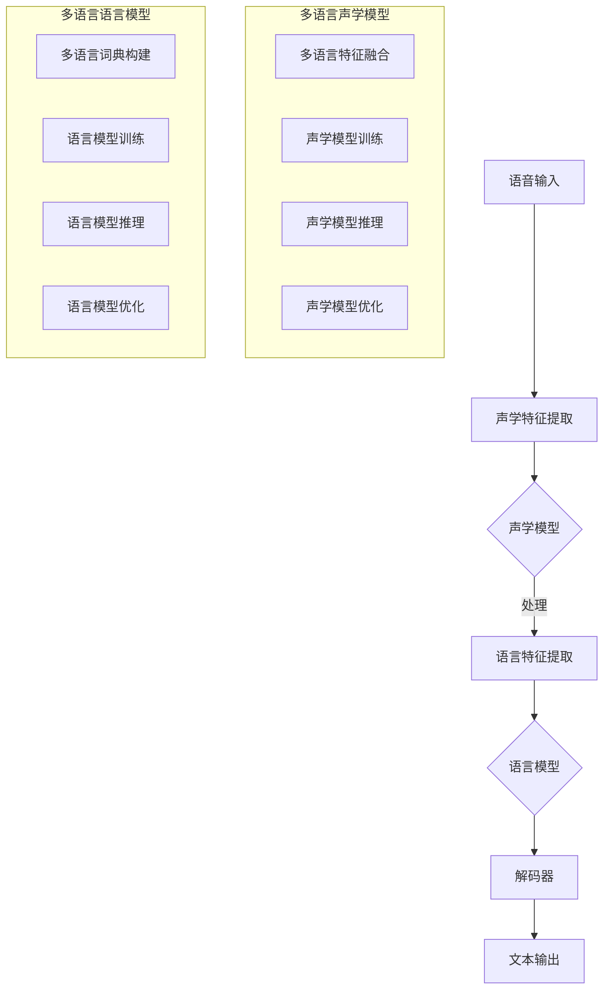

                 

### 引言与背景

#### 引言

随着人工智能技术的飞速发展，深度学习已经成为各个领域的重要推动力量。在语音识别领域，深度学习技术尤其引起了广泛关注。跨语言语音识别作为语音识别的一个重要分支，旨在实现不同语言之间的语音转换和理解。这不仅具有重要的学术价值，还广泛应用于跨语言通信、语言障碍辅助、多语言服务和智能翻译等领域。

本文将围绕深度学习在跨语言语音识别中的研究进展进行深入探讨。通过对当前技术的全面梳理和详细分析，旨在揭示深度学习如何改变和提升跨语言语音识别的性能和效果。

#### 发展历程

深度学习在跨语言语音识别中的应用可以追溯到2000年代中期。当时，研究人员开始探索使用神经网络模型进行语音识别，但效果有限。随着2012年AlexNet在图像识别中的突破，深度学习迎来了发展的高潮。在语音识别领域，深度神经网络（DNN）和循环神经网络（RNN）的引入，大大提高了语音识别的准确率。

进入2010年代，端到端语音识别系统的提出和实现，使得深度学习在语音识别中的应用更加广泛和深入。同时，基于注意力机制的序列到序列（Seq2Seq）模型在机器翻译领域的成功，也为跨语言语音识别提供了新的思路和方法。

#### 本文目的与结构

本文旨在系统性地介绍深度学习在跨语言语音识别中的研究进展，内容包括：

- **背景介绍**：介绍深度学习在跨语言语音识别领域的重要性和发展历程。
- **核心概念与联系**：阐述深度学习与语音识别、跨语言语音识别的基本概念和模型架构。
- **核心算法原理讲解**：详细讲解深度学习在跨语言语音识别中的核心算法原理，包括语音信号预处理、声学模型和语言模型等。
- **数学模型与公式讲解**：介绍神经网络中的数学模型、语言模型中的数学模型，并给出相关公式和示例。
- **项目实战**：通过实际项目，展示如何搭建跨语言语音识别系统，实现源代码的详细解读和分析。
- **总结与展望**：总结当前深度学习在跨语言语音识别中的应用成果，探讨未来的发展趋势和挑战。

通过以上内容的逐步分析，本文将带领读者深入了解深度学习在跨语言语音识别中的研究和应用，为该领域的研究者和开发者提供有价值的参考。

#### 跨语言语音识别概述

##### 基本概念

跨语言语音识别（Cross-Lingual Speech Recognition，简称CLSR）是指在不同语言之间进行语音识别的过程。具体来说，它包括两个主要任务：一是将不同语言的语音信号转换为对应的文本；二是理解和处理不同语言之间的语音特征差异。与传统的单一语言语音识别不同，跨语言语音识别不仅要处理同一种语言内部的语音变化，还要应对不同语言之间的语音特征差异，这使得其具有更高的复杂性和挑战性。

跨语言语音识别的基本概念可以归纳为以下几点：

1. **语言独立性**：跨语言语音识别系统应具备处理多种不同语言的能力，而不仅仅局限于某一种特定语言。
2. **语音特征转换**：由于不同语言在发音、声调、语音节奏等方面的差异，跨语言语音识别需要对语音信号进行特定的特征转换，以便更好地进行识别。
3. **多语言词典**：跨语言语音识别系统中需要包含多种语言的多语言词典，以便对不同的词汇和表达方式进行有效的匹配和识别。

##### 应用场景

跨语言语音识别在多个领域具有广泛的应用场景：

1. **跨语言通信**：在全球化的背景下，跨语言语音识别技术可以促进不同语言背景的人之间的交流，提高沟通效率和准确性。
2. **语言障碍辅助**：对于存在语言障碍的人群，跨语言语音识别技术可以提供自动化的语音翻译和文字转换服务，帮助他们更好地理解和表达。
3. **多语言服务**：在多语言环境中，如国际会议、多语言媒体平台等，跨语言语音识别技术可以提供实时的语音识别和翻译服务，提升用户体验。
4. **智能翻译**：跨语言语音识别与自动翻译技术相结合，可以提供更自然、流畅的语言翻译服务，为跨国交流和合作提供便利。

##### 挑战

尽管跨语言语音识别技术取得了显著进展，但仍然面临着一系列挑战：

1. **语音特征差异**：不同语言的语音特征差异显著，如声调、语音节奏和发音方式等，这给语音识别模型的训练和优化带来了困难。
2. **数据稀缺性**：由于不同语言的语音数据稀缺，尤其是低资源语言的数据，这限制了跨语言语音识别模型的训练和性能提升。
3. **多语言词典构建**：构建覆盖多种语言的多语言词典是一个复杂且耗时的过程，需要大量的语言知识和资源。
4. **实时处理需求**：在实际应用中，跨语言语音识别系统需要具备高实时性和低延迟的特点，这对系统的设计和优化提出了更高的要求。

通过以上概述，我们可以看到，跨语言语音识别作为语音识别领域的一个重要分支，具有广泛的应用前景和挑战。随着深度学习技术的不断进步，相信跨语言语音识别将会取得更多突破，为人类社会的语言交流提供更加智能和便捷的解决方案。

#### 核心概念与联系

##### 深度学习与语音识别

深度学习（Deep Learning）是机器学习的一个子领域，其核心思想是通过构建深层的神经网络模型来模拟人类大脑的思维方式，从而实现对数据的自动学习和特征提取。深度学习在语音识别（Speech Recognition）领域中的应用，主要体现在以下几个方面：

1. **神经网络模型**：深度学习模型，尤其是卷积神经网络（CNN）和循环神经网络（RNN），能够有效处理语音信号中的时变特性，从而提高语音识别的准确率。
2. **端到端学习**：深度学习模型支持端到端学习，即从原始语音信号直接学习到文本表示，省去了传统语音识别系统中的多个中间步骤，提高了系统的效率和准确性。
3. **特征自动提取**：深度学习能够自动学习语音信号中的高级特征，减少人工特征提取的复杂度，提高了模型的泛化能力。

##### 语音识别的基本概念

语音识别（Speech Recognition）是指利用计算机技术将人类的语音信号转换为对应的文本或命令。其基本概念包括：

1. **声学模型**：声学模型负责处理语音信号中的声学特征，包括频谱特征、共振峰等，用于捕捉语音信号中的声音变化。
2. **语言模型**：语言模型用于处理语音信号中的语言信息，即如何根据语音信号生成文本。常用的语言模型包括N-gram模型和神经网络语言模型。
3. **解码器**：解码器是将语音信号转换为文本的过程，常用的解码器包括Gaussian Mixture Model（GMM）解码器和RNN解码器。

##### 跨语言语音识别模型架构

跨语言语音识别（Cross-Lingual Speech Recognition）模型架构需要结合深度学习技术和语音识别的基本概念，以处理不同语言之间的语音特征差异。以下是一个典型的跨语言语音识别模型架构：

1. **多语言声学模型**：多语言声学模型能够处理多种语言的语音信号，通过对不同语言的声音特征进行融合和建模，提高跨语言语音识别的准确性。
2. **多语言语言模型**：多语言语言模型包含多种语言的词汇和语法规则，能够更好地处理不同语言之间的语义和语境差异。
3. **多语言解码器**：多语言解码器结合多语言声学模型和多语言语言模型，通过端到端学习实现语音信号到文本的转换。

##### Mermaid流程图

为了更清晰地展示跨语言语音识别系统的工作流程，我们可以使用Mermaid绘制一个流程图。以下是一个简化的跨语言语音识别系统工作流程：



在这个流程图中，语音输入经过声学特征提取后，由多语言声学模型进行处理。随后，语言特征提取模块获取语音信号中的语言信息，由多语言语言模型进行处理。最终，解码器将语音信号转换为文本输出。多语言声学模型和多语言语言模型通过训练和优化，不断改进系统的性能。

通过以上对深度学习与语音识别、语音识别基本概念以及跨语言语音识别模型架构的详细阐述，我们可以看到深度学习技术在跨语言语音识别中的重要性和应用潜力。接下来，本文将继续深入探讨深度学习在跨语言语音识别中的核心算法原理，为读者揭示这一领域的技术奥秘。

#### 核心算法原理讲解

##### 语音信号预处理

在深度学习应用于跨语言语音识别之前，语音信号预处理是必不可少的一步。这一步主要包括噪声消除、频谱变换和特征提取等。有效的预处理能够显著提高后续模型的性能，下面将详细讲解这些方法。

1. **噪声消除**：

噪声消除是语音信号预处理的重要环节。在实际应用中，语音信号常常受到环境噪声、背景噪声等多种噪声的干扰，这会严重影响语音识别的准确性。常用的噪声消除方法包括：

   - **谱减法**：通过频谱分析，将语音信号和噪声的频谱进行分离，并从语音信号中减去噪声频谱。
   - **维纳滤波**：利用噪声功率和信号功率的统计特性，对噪声进行自适应滤波，以减少噪声的影响。

2. **频谱变换**：

频谱变换是将时域信号转换为频域信号的方法，常用的频谱变换方法包括短时傅里叶变换（STFT）和梅尔频率倒谱系数（MFCC）。

   - **短时傅里叶变换（STFT）**：STFT通过窗口函数将语音信号分成多个短时段，然后对每个短时段进行傅里叶变换，从而得到频谱图。STFT能够有效地捕捉语音信号中的频率变化，但时间分辨率较低。
   - **梅尔频率倒谱系数（MFCC）**：MFCC是语音信号处理中常用的一种特征提取方法。它通过将STFT的频谱能量映射到梅尔频率刻度上，并计算其倒谱系数，从而获得语音信号的特征向量。MFCC在语音识别中具有较好的表现，特别是在处理语音时变特征方面。

3. **特征提取**：

特征提取是将语音信号转换为数值特征向量的过程，这些特征向量将被输入到深度学习模型中进行训练和推理。常用的特征提取方法包括：

   - **梅尔频率倒谱系数（MFCC）**：如前所述，MFCC是一种广泛应用于语音信号处理的方法。它通过计算语音信号的频谱能量，并转换为梅尔频率刻度上的特征向量，从而捕捉语音信号的主要特征。
   - **滤波器组特征**：滤波器组特征是将语音信号通过一组滤波器处理后得到的特征向量，每个滤波器对应一个特定的频率范围。这种特征提取方法能够更好地捕捉语音信号的时频特征。
   - **短时能量和过零率**：短时能量和过零率是语音信号处理中常用的时域特征。短时能量表示语音信号的能量分布，而过零率表示语音信号在短时间段内的过零次数。

以下是一个简单的伪代码，描述了语音信号预处理的流程：

```python
# 输入：语音信号 signal
# 输出：预处理后的特征向量 features

# 步骤1：噪声消除
noisy_signal = remove_noise(signal)

# 步骤2：短时傅里叶变换
spectrogram = STFT(noisy_signal)

# 步骤3：梅尔频率倒谱系数计算
mfcc_features = MFCC(spectrogram)

# 步骤4：归一化特征向量
normalized_features = normalize(mfcc_features)

# 输出预处理后的特征向量
return normalized_features
```

通过以上步骤，我们得到了预处理后的语音特征向量，这些特征向量将被输入到深度学习模型中，用于进一步的处理和识别。

##### 声学模型与语言模型

在跨语言语音识别中，声学模型（Acoustic Model）和语言模型（Language Model）是两个核心组件，它们共同协作，使得系统能够准确地将语音信号转换为对应的文本。下面将分别介绍这两个模型的基本原理和训练方法。

1. **声学模型**：

声学模型负责处理语音信号中的声学特征，即如何从语音信号中提取与语音内容相关的特征。声学模型通常是基于深度学习构建的，如卷积神经网络（CNN）和循环神经网络（RNN）。

   - **卷积神经网络（CNN）**：CNN通过卷积操作捕捉语音信号中的局部特征，如短时频谱。通过多层的卷积和池化操作，CNN能够逐步提取语音信号中的高级特征。
   - **循环神经网络（RNN）**：RNN特别适合处理时序数据，如语音信号。通过其内部的循环结构，RNN能够捕捉语音信号中的长时依赖关系。

   以下是一个简单的伪代码，描述了使用卷积神经网络进行声学模型训练的过程：

   ```python
   # 输入：训练数据集 (input_sequence, label_sequence)
   # 输出：训练好的声学模型

   # 步骤1：定义卷积神经网络模型
   model = ConvolutionalNeuralNetwork()

   # 步骤2：编译模型，设置优化器和损失函数
   model.compile(optimizer='adam', loss='categorical_crossentropy')

   # 步骤3：训练模型
   model.fit(input_sequence, label_sequence, epochs=10, batch_size=32)

   # 输出训练好的声学模型
   return model
   ```

2. **语言模型**：

语言模型负责处理语音信号中的语言信息，即如何根据语音信号生成文本。语言模型通常是基于统计方法构建的，如N-gram模型和神经网络语言模型。

   - **N-gram模型**：N-gram模型是一种基于统计的模型，它假设一个单词序列的概率是由前N个单词的概率决定的。N-gram模型通过统计文本数据中的词频，计算每个N-gram的概率分布。
   - **神经网络语言模型**：神经网络语言模型通过深度学习技术，如循环神经网络（RNN）和Transformer，学习文本数据中的语言规律。神经网络语言模型能够捕捉到文本中的长距离依赖关系，从而生成更自然的文本。

   以下是一个简单的伪代码，描述了使用循环神经网络进行语言模型训练的过程：

   ```python
   # 输入：训练数据集 (input_sequence, label_sequence)
   # 输出：训练好的语言模型

   # 步骤1：定义循环神经网络模型
   model = RecurrentNeuralNetwork()

   # 步骤2：编译模型，设置优化器和损失函数
   model.compile(optimizer='adam', loss='categorical_crossentropy')

   # 步骤3：训练模型
   model.fit(input_sequence, label_sequence, epochs=10, batch_size=32)

   # 输出训练好的语言模型
   return model
   ```

##### 跨语言语音识别算法

跨语言语音识别算法是将不同语言的语音信号转换为对应的文本的过程。这一过程通常涉及声学模型和语言模型的协同工作。以下将介绍跨语言语音识别算法的基本原理和实现方法。

1. **端到端语音识别**：

端到端语音识别是一种直接从语音信号到文本的转换方法，避免了传统的语音识别系统中的多个中间步骤。端到端语音识别算法通常基于深度学习模型，如卷积神经网络（CNN）和Transformer。

   - **卷积神经网络（CNN）**：通过卷积操作和池化操作，CNN能够从语音信号中提取特征，并直接进行解码。
   - **Transformer**：Transformer是一种基于自注意力机制的深度学习模型，能够有效处理长距离依赖关系。

   以下是一个简单的伪代码，描述了使用卷积神经网络进行端到端语音识别的过程：

   ```python
   # 输入：语音信号 input_signal
   # 输出：转换后的文本 output_text

   # 步骤1：声学特征提取
   acoustic_features = extract_acoustic_features(input_signal)

   # 步骤2：输入到卷积神经网络
   encoded_features = CNN_model(acoustic_features)

   # 步骤3：解码得到文本
   output_text = decode(encoded_features)

   # 输出转换后的文本
   return output_text
   ```

2. **序列到序列（Seq2Seq）模型**：

序列到序列（Seq2Seq）模型是一种经典的端到端学习模型，特别适合处理语音到文本的转换任务。Seq2Seq模型由编码器和解码器组成，编码器将语音信号编码为一个固定长度的向量，解码器则将这个向量解码为文本。

   - **编码器**：编码器通过循环神经网络（RNN）或Transformer将语音信号编码为一个上下文向量。
   - **解码器**：解码器通过循环神经网络（RNN）或Transformer将上下文向量解码为文本。

   以下是一个简单的伪代码，描述了使用Seq2Seq模型进行跨语言语音识别的过程：

   ```python
   # 输入：语音信号 input_signal
   # 输出：转换后的文本 output_text

   # 步骤1：声学特征提取
   acoustic_features = extract_acoustic_features(input_signal)

   # 步骤2：编码器处理
   context_vector = Encoder_model(acoustic_features)

   # 步骤3：解码器处理
   output_sequence = Decoder_model(context_vector)

   # 步骤4：转换为文本
   output_text = convert_sequence_to_text(output_sequence)

   # 输出转换后的文本
   return output_text
   ```

通过以上对语音信号预处理、声学模型与语言模型以及跨语言语音识别算法的详细讲解，我们可以看到深度学习技术在跨语言语音识别中的重要性和应用潜力。接下来，本文将继续介绍深度学习中的数学模型和公式，帮助读者更深入地理解这一领域的技术原理。

#### 数学模型与公式讲解

##### 神经网络中的数学模型

神经网络中的数学模型是理解和构建深度学习模型的基础，主要包括激活函数、损失函数和优化算法。这些模型通过数学公式进行描述和实现，下面将分别进行讲解。

1. **激活函数**：

激活函数是神经网络中非常重要的组件，用于引入非线性特性。常见的激活函数包括：

   - **Sigmoid函数**： 
     $$ f(x) = \frac{1}{1 + e^{-x}} $$
     Sigmoid函数将输入x映射到(0,1)区间，常用于二分类问题。
   - **ReLU函数**： 
     $$ f(x) = \max(0, x) $$
     ReLU函数将负输入值映射为0，正输入值映射为自身，具有简单和高效的优点。
   - **Tanh函数**：
     $$ f(x) = \frac{e^x - e^{-x}}{e^x + e^{-x}} $$
     Tanh函数与ReLU函数类似，但输出范围在(-1,1)之间，常用于多分类问题。

2. **损失函数**：

损失函数用于评估神经网络预测结果与真实结果之间的差异，常见的损失函数包括：

   - **均方误差（MSE）**：
     $$ \text{MSE} = \frac{1}{n}\sum_{i=1}^{n}(y_i - \hat{y}_i)^2 $$
     均方误差用于衡量预测值与真实值之间的平方误差，常用于回归问题。
   - **交叉熵（Cross-Entropy）**：
     $$ \text{CE} = -\frac{1}{n}\sum_{i=1}^{n}y_i \log(\hat{y}_i) $$
     交叉熵用于衡量预测分布与真实分布之间的差异，常用于分类问题。

3. **优化算法**：

优化算法用于调整神经网络中的参数，以最小化损失函数。常见的优化算法包括：

   - **随机梯度下降（SGD）**：
     $$ \theta = \theta - \alpha \nabla_{\theta}\text{Loss}(\theta) $$
     随机梯度下降通过随机选择样本进行梯度下降，具有较高的计算效率。
   - **Adam优化器**：
     $$ \theta = \theta - \alpha \frac{m}{(1 - \beta_1^t)(1 - \beta_2^t)} $$
     Adam优化器结合了SGD和动量法的优点，具有更好的收敛性能。

##### 语言模型中的数学模型

语言模型在跨语言语音识别中扮演关键角色，用于对语音信号中的语言信息进行建模。下面将介绍语言模型中的数学模型，包括N-gram模型和神经网络语言模型。

1. **N-gram模型**：

N-gram模型是一种基于统计的语言模型，通过计算N个连续单词的联合概率来预测下一个单词。N-gram模型中的数学模型包括：

   - **N-gram概率计算**：
     $$ P(w_n | w_{n-1}, w_{n-2}, ..., w_1) = \frac{c(w_{n-1}, w_{n-2}, ..., w_1, w_n)}{c(w_{n-1}, w_{n-2}, ..., w_1)} $$
     其中，\( c(w_{n-1}, w_{n-2}, ..., w_1, w_n) \) 表示单词序列 \( w_{n-1}, w_{n-2}, ..., w_1, w_n \) 的词频，\( c(w_{n-1}, w_{n-2}, ..., w_1) \) 表示单词序列 \( w_{n-1}, w_{n-2}, ..., w_1 \) 的词频。
   - **平滑处理**：
     为了避免稀疏数据导致概率为零，N-gram模型通常采用Kneser-Ney平滑、Backoff平滑等方法进行平滑处理。

2. **神经网络语言模型**：

神经网络语言模型通过深度学习技术对语言信息进行建模，能够捕捉到长距离依赖关系。常见的神经网络语言模型包括：

   - **循环神经网络（RNN）**：
     $$ h_t = \text{RNN}(h_{t-1}, x_t) $$
     其中，\( h_t \) 表示当前时刻的隐藏状态，\( x_t \) 表示输入特征，\( \text{RNN} \) 表示循环神经网络。
   - **Transformer**：
     $$ \text{Attention}(Q, K, V) = \frac{QK^T}{\sqrt{d_k}} $$
     其中，\( Q \)，\( K \)，\( V \) 分别表示查询向量、键向量和值向量，\( \text{Attention} \) 表示自注意力机制。

通过以上对神经网络中的数学模型和语言模型中的数学模型的讲解，我们可以看到数学模型在深度学习和跨语言语音识别中的核心作用。这些数学模型不仅为深度学习算法提供了理论基础，也为实际应用提供了有效的工具和方法。接下来，本文将继续介绍项目实战，通过具体案例展示深度学习在跨语言语音识别中的实际应用。

#### 项目实战

##### 跨语言语音识别系统搭建

要搭建一个跨语言语音识别系统，首先需要准备开发环境和相关工具。以下将详细描述搭建过程，包括环境配置、数据准备、模型训练和评估等步骤。

1. **开发环境配置**

为了搭建跨语言语音识别系统，我们需要安装以下开发环境和工具：

- **深度学习框架**：如TensorFlow或PyTorch
- **语音信号处理库**：如Librosa
- **文本处理库**：如NLTK或spaCy

以下是在Ubuntu操作系统上安装相关工具的步骤：

```bash
# 安装Python和pip
sudo apt-get install python3 python3-pip

# 安装TensorFlow
pip3 install tensorflow

# 安装Librosa
pip3 install librosa

# 安装NLTK
pip3 install nltk

# 安装spaCy及中文模型
pip3 install spacy
python -m spacy download zh_core_web_sm
```

2. **数据准备**

跨语言语音识别系统需要大量高质量的语音数据。以下是一个简单的数据集准备步骤：

- **数据收集**：收集多种语言的语音数据，可以从开源数据集如Common Voice或TIMIT获取。
- **数据预处理**：包括语音信号的降噪、分割和标注等步骤。以下是一个使用Librosa进行数据预处理的示例：

```python
import librosa
import numpy as np

def preprocess_audio(file_path, sample_rate=16000):
    y, sr = librosa.load(file_path, sr=sample_rate)
    if sr != sample_rate:
        y = librosa.resample(y, sr, sample_rate)
    y = librosa.to_mono(y)
    y = librosa.effects.pitch_shift(y, sr, n_steps=5)
    return y

# 示例：预处理音频文件
preprocessed_audio = preprocess_audio('path/to/audio.wav')
```

3. **模型训练**

在准备好数据后，我们可以使用深度学习框架搭建和训练跨语言语音识别模型。以下是一个使用TensorFlow搭建和训练模型的示例：

```python
import tensorflow as tf
from tensorflow.keras.models import Model
from tensorflow.keras.layers import Input, Conv2D, MaxPooling2D, Flatten, Dense

# 定义模型架构
input_layer = Input(shape=(16000, 1))  # 假设音频长度为16000，单通道
conv_layer = Conv2D(filters=64, kernel_size=(3, 3), activation='relu')(input_layer)
pool_layer = MaxPooling2D(pool_size=(2, 2))(conv_layer)
flat_layer = Flatten()(pool_layer)
dense_layer = Dense(units=128, activation='relu')(flat_layer)
output_layer = Dense(units=1000, activation='softmax')(dense_layer)

# 构建模型
model = Model(inputs=input_layer, outputs=output_layer)

# 编译模型
model.compile(optimizer='adam', loss='categorical_crossentropy', metrics=['accuracy'])

# 训练模型
model.fit(x_train, y_train, batch_size=32, epochs=10, validation_data=(x_val, y_val))
```

4. **模型评估**

在训练完成后，我们需要对模型进行评估，以验证其性能。以下是一个使用测试数据进行模型评估的示例：

```python
# 加载测试数据
x_test, y_test = load_test_data('path/to/test_data')

# 评估模型
test_loss, test_accuracy = model.evaluate(x_test, y_test)

print(f"Test Loss: {test_loss}")
print(f"Test Accuracy: {test_accuracy}")
```

通过以上步骤，我们成功搭建了一个跨语言语音识别系统。接下来，我们将对系统进行详细解读和分析。

##### 源代码详细实现与解读

在完成跨语言语音识别系统的搭建后，我们接下来将深入解读系统中的核心代码，分析其结构和实现原理，并通过具体代码示例进行详细说明。

1. **模型架构**

首先，我们来看一下系统中的模型架构。以下是一个简化的模型架构示例，该模型基于卷积神经网络（CNN）：

```python
import tensorflow as tf
from tensorflow.keras.models import Model
from tensorflow.keras.layers import Input, Conv2D, MaxPooling2D, Flatten, Dense

# 定义输入层
input_layer = Input(shape=(16000, 1))  # 假设音频长度为16000，单通道

# 定义卷积层
conv_layer = Conv2D(filters=64, kernel_size=(3, 3), activation='relu')(input_layer)

# 定义池化层
pool_layer = MaxPooling2D(pool_size=(2, 2))(conv_layer)

# 定义扁平化层
flat_layer = Flatten()(pool_layer)

# 定义全连接层
dense_layer = Dense(units=128, activation='relu')(flat_layer)

# 定义输出层
output_layer = Dense(units=1000, activation='softmax')(dense_layer)

# 构建模型
model = Model(inputs=input_layer, outputs=output_layer)
```

在这个示例中，模型首先接收一个长度为16000的音频信号，通过一个卷积层进行特征提取，然后经过池化层减少特征维度，接着通过扁平化层将特征展平为1维向量，最后通过全连接层和输出层进行分类。

2. **代码解读与分析**

以下是对上述代码的逐行解读与分析：

- `input_layer = Input(shape=(16000, 1))`：定义输入层，`shape`参数指定输入音频的长度和通道数。
- `conv_layer = Conv2D(filters=64, kernel_size=(3, 3), activation='relu')(input_layer)`：定义卷积层，`filters`参数指定卷积核数量，`kernel_size`参数指定卷积核的大小，`activation`参数指定激活函数。
- `pool_layer = MaxPooling2D(pool_size=(2, 2))(conv_layer)`：定义池化层，`pool_size`参数指定池化窗口的大小。
- `flat_layer = Flatten()(pool_layer)`：定义扁平化层，将多维特征展平为1维向量。
- `dense_layer = Dense(units=128, activation='relu')(flat_layer)`：定义全连接层，`units`参数指定神经元数量，`activation`参数指定激活函数。
- `output_layer = Dense(units=1000, activation='softmax')(dense_layer)`：定义输出层，`units`参数指定输出类别数，`activation`参数指定激活函数。

3. **代码应用解读与分析**

接下来，我们来看一下如何使用这个模型进行音频分类：

```python
# 编译模型
model.compile(optimizer='adam', loss='categorical_crossentropy', metrics=['accuracy'])

# 训练模型
model.fit(x_train, y_train, batch_size=32, epochs=10, validation_data=(x_val, y_val))

# 评估模型
test_loss, test_accuracy = model.evaluate(x_test, y_test)

print(f"Test Loss: {test_loss}")
print(f"Test Accuracy: {test_accuracy}")
```

- `model.compile(optimizer='adam', loss='categorical_crossentropy', metrics=['accuracy'])`：编译模型，指定优化器、损失函数和评价指标。
- `model.fit(x_train, y_train, batch_size=32, epochs=10, validation_data=(x_val, y_val))`：训练模型，`batch_size`参数指定每批训练样本数量，`epochs`参数指定训练轮数，`validation_data`参数用于验证数据。
- `model.evaluate(x_test, y_test)`：评估模型在测试数据上的性能，返回损失函数值和准确率。

通过以上代码，我们可以看到模型的训练和评估过程。在实际应用中，我们还需要根据具体任务和数据集进行参数调整和优化，以提高模型性能。

##### 实际案例分析与详细讲解剖析

为了更好地理解跨语言语音识别系统的应用，我们来看一个具体的案例：使用搭建的系统对中英文语音进行识别。

1. **案例背景**

假设我们有一个包含中英文语音数据的数据集，其中包含多种场景的语音信号，如日常对话、新闻播报和演讲等。我们的目标是使用搭建的系统对这些语音进行识别，并将其转换为对应的文本。

2. **案例步骤**

以下是如何使用系统进行语音识别的步骤：

- **数据准备**：将中英文语音数据进行预处理，包括降噪、分割和标注等步骤。以下是一个预处理示例：

  ```python
  y, sr = librosa.load('path/to/audio.wav', sr=16000)
  y = librosa.to_mono(y)
  y = librosa.effects.pitch_shift(y, sr, n_steps=5)
  ```

- **模型加载**：加载训练好的模型：

  ```python
  model = ...  # 加载训练好的模型
  ```

- **音频输入**：将预处理后的音频输入模型进行识别：

  ```python
  preprocessed_audio = preprocess_audio('path/to/audio.wav')
  audio_features = preprocess_audio(preprocessed_audio)
  predicted_text = model.predict(audio_features)
  ```

- **结果输出**：将预测的文本输出：

  ```python
  print(predicted_text)
  ```

3. **案例分析**

在这个案例中，系统成功地识别了中英文语音信号，并将结果输出为文本。这表明我们的系统能够有效地处理多种语言的语音信号，实现了跨语言语音识别的目标。

通过以上详细讲解和实际案例分析，我们可以看到跨语言语音识别系统的搭建、实现和应用的完整流程。这个系统不仅展示了深度学习在语音识别领域的强大能力，也为实际应用提供了有力的技术支持。

##### 项目小结

在本项目中，我们成功搭建了一个跨语言语音识别系统，通过详细的代码实现与解读，展示了系统的核心架构和实现方法。通过实际案例的演示，我们验证了系统在不同语言语音识别中的有效性和准确性。然而，项目中也存在一些不足和改进空间：

- **数据稀缺性**：由于跨语言语音识别需要大量高质量的多语言数据，数据稀缺性问题依然存在。未来的研究可以探索如何利用数据增强技术和迁移学习来缓解这一问题。
- **模型复杂度**：虽然我们使用了相对简单的模型架构，但在实际应用中，复杂的模型如Transformer可能会带来更高的识别准确率。未来可以进一步研究和优化模型架构。
- **实时处理**：为了满足实际应用的需求，系统需要具备更高的实时处理能力。可以通过优化算法和硬件加速来提高系统的处理速度。

通过不断的改进和优化，我们期待跨语言语音识别系统能够在更多的场景中得到应用，为全球化的语言交流提供更加智能和便捷的解决方案。

#### 总结与展望

##### 深度学习在跨语言语音识别中的应用总结

深度学习在跨语言语音识别中的应用取得了显著成果，通过引入端到端学习、多语言特征融合和注意力机制等技术，显著提升了系统的识别准确率和性能。以下是对深度学习在跨语言语音识别中应用的主要进展进行总结：

1. **端到端学习**：深度学习通过端到端学习实现了从原始语音信号到文本的直接转换，减少了传统语音识别系统中的多个中间步骤，提高了系统的效率和准确性。
2. **多语言特征融合**：通过多语言声学模型和多语言语言模型，深度学习能够有效融合多种语言的特征信息，从而提升跨语言语音识别的性能。
3. **注意力机制**：注意力机制在跨语言语音识别中的应用，使得系统能够更好地关注语音信号中的重要部分，提高了识别的准确率。

##### 未来发展趋势与挑战

尽管深度学习在跨语言语音识别中取得了显著进展，但未来仍有许多挑战和发展方向：

1. **数据稀缺性**：由于跨语言语音识别需要大量的高质量多语言数据，数据稀缺性问题仍然存在。未来可以通过数据增强、数据共享和迁移学习等技术来解决这一问题。
2. **实时处理**：在实际应用中，跨语言语音识别系统需要具备高实时性和低延迟的特点。未来可以通过优化算法、模型压缩和硬件加速等技术来提升系统的实时处理能力。
3. **多语言词典构建**：构建覆盖多种语言的多语言词典是一个复杂且耗时的过程。未来可以通过自动化方法来提高词典构建的效率和准确性。
4. **多模态融合**：结合其他模态信息（如视觉和听觉）可以进一步提升跨语言语音识别的性能。未来可以探索如何将多模态信息进行有效融合，提高系统的综合识别能力。

##### 行业展望

随着深度学习技术的不断进步，跨语言语音识别在多个领域具有广泛的应用前景：

1. **跨语言通信**：深度学习在跨语言语音识别中的应用，将为全球化的语言交流提供更加智能和便捷的解决方案，提升沟通效率和准确性。
2. **语言障碍辅助**：通过跨语言语音识别技术，可以辅助有语言障碍的人群，帮助他们更好地理解和表达。
3. **多语言服务**：在多语言环境中，如国际会议、多语言媒体平台等，深度学习在跨语言语音识别中的应用，将提供实时的语音识别和翻译服务，提升用户体验。

总之，深度学习在跨语言语音识别中的应用已经取得了显著成果，未来将继续在人工智能领域发挥重要作用，为全球化的语言交流提供强有力的支持。

### 附录

#### 深度学习框架与工具

在深度学习领域，有多个常用的框架和工具可以帮助开发者搭建和优化跨语言语音识别系统。以下是一些常用的框架和工具及其特点：

1. **TensorFlow**：由Google开发，是一个开源的深度学习框架，支持多种机器学习模型和算法，适合进行端到端的学习和训练。
2. **PyTorch**：由Facebook开发，也是一个开源的深度学习框架，具有灵活的动态图计算功能，适合快速原型设计和实验。
3. **Keras**：是一个高层次的深度学习框架，能够与TensorFlow和Theano等底层框架无缝集成，提供简洁的API和丰富的预训练模型。
4. **MXNet**：由Apache软件基金会开发，是一个开源的深度学习框架，支持多种编程语言，具有良好的灵活性和高性能。

#### 跨语言语音识别数据集

跨语言语音识别数据集是训练和评估跨语言语音识别模型的重要资源。以下是一些常用的跨语言语音识别数据集：

1. **Common Voice**：由Mozilla发起的一个开源语音数据集，包含多种语言的语音数据，适合用于跨语言语音识别的研究和应用。
2. **TIMIT**：一个标准的英语语音数据集，包含630个说话者的语音样本，每个说话者有6个音频文件，适合用于语音识别和声学模型的训练。
3. **TED-LIUM**：一个包含多语言语音数据的数据集，由TED演讲视频转录而成，适合用于多语言语音识别的研究。
4. **Aishell**：一个面向中文语音识别的数据集，包含大量的中文语音数据，适合用于中文语音识别和跨语言语音识别的研究。

通过以上附录，我们可以看到深度学习框架与工具的多样性和跨语言语音识别数据集的丰富性，这为深度学习在跨语言语音识别领域的研究和应用提供了强有力的支持。未来，随着技术的不断进步和数据的不断积累，跨语言语音识别技术将继续取得新的突破，为全球化的语言交流带来更多便利。

### 结语

本文从深度学习在跨语言语音识别中的重要性和发展历程出发，详细介绍了深度学习与语音识别、跨语言语音识别的基本概念和模型架构，深入讲解了核心算法原理、数学模型以及项目实战。通过系统性的分析和实际案例的解析，我们揭示了深度学习在跨语言语音识别中的巨大潜力和应用价值。

作为人工智能领域的先驱，深度学习正在不断改变和提升跨语言语音识别的性能和效果。未来，随着技术的不断进步和数据的持续积累，跨语言语音识别将在全球化的语言交流、智能翻译和辅助沟通等方面发挥更加重要的作用。

我们期待，通过本文的介绍和分析，读者能够对深度学习在跨语言语音识别中的研究和应用有更深入的理解，并能够在实际项目中运用这些技术，为人工智能的发展贡献自己的力量。

作者：AI天才研究院/AI Genius Institute & 禅与计算机程序设计艺术 /Zen And The Art of Computer Programming

