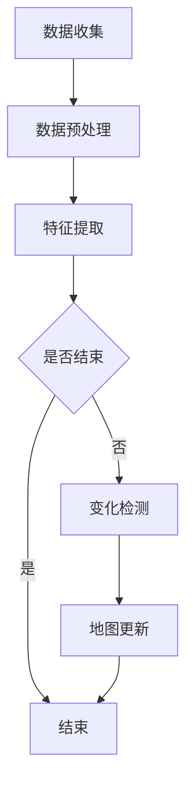
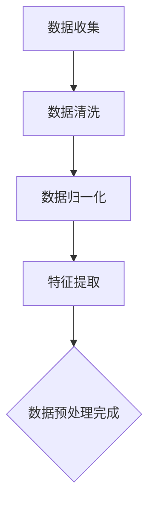
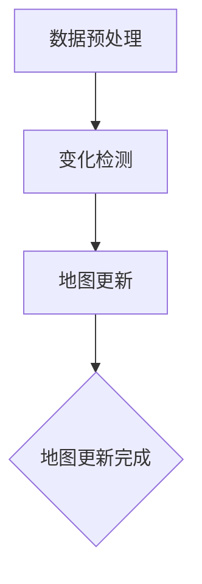
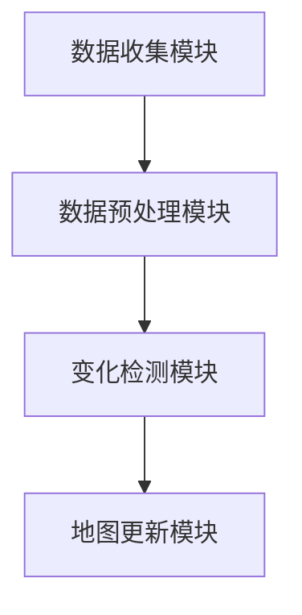
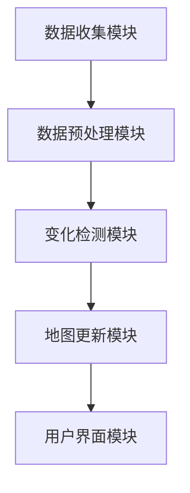

                 

### 第一部分：引言

#### 1.1 高精度地图的概念与重要性

##### 1.1.1 高精度地图的定义

高精度地图（High Precision Map，HPM）是一种基于高分辨率数据构建的详细地图。与传统地图相比，高精度地图不仅包含道路、交通标志等基本地理信息，还包含了道路的精确宽度、曲率、高程等高精度参数。这些高精度参数对于自动驾驶车辆、智能导航系统等应用至关重要。

##### 1.1.2 高精度地图的应用领域

高精度地图在多个领域有着广泛的应用。在自动驾驶领域，高精度地图提供了车辆行驶所需的环境信息，包括道路特征、交通标志、信号灯等。在智能导航系统中，高精度地图则能提供更加准确的导航路线，减少因地图误差导致的导航错误。此外，高精度地图在无人机导航、机器人导航等领域也有着重要的应用。

##### 1.1.3 高精度地图的挑战

尽管高精度地图具有巨大的应用潜力，但其构建和维护也面临着诸多挑战。首先，数据收集是高精度地图构建的基础，但收集高分辨率数据需要大量的时间和资源。其次，地图数据的更新和维护也是一个复杂的过程，由于城市环境的快速变化，高精度地图需要不断更新以保持准确性。此外，高精度地图数据的存储和处理也是一项技术挑战，高精度地图数据量大，对存储和处理设备的要求较高。

#### 1.2 深度学习在高精度地图中的应用

##### 1.2.1 深度学习的基本概念

深度学习（Deep Learning）是一种基于人工神经网络的学习方法，通过多层神经网络对数据进行自动特征提取和模式识别。与传统的机器学习方法相比，深度学习具有更强的学习和泛化能力，能够处理大量复杂的数据。

##### 1.2.2 深度学习在高精度地图中的优势

深度学习在高精度地图中的应用主要有以下几个优势：

1. **自动特征提取**：深度学习能够自动从高分辨率数据中提取有用的特征，减少了人工特征工程的工作量，提高了数据处理效率。
2. **高精度预测**：深度学习模型能够对地图数据中的变化进行高精度的预测，提高了地图更新的准确性和实时性。
3. **适应性强**：深度学习模型能够适应不同环境和场景，能够处理不同类型和来源的数据。

##### 1.2.3 深度学习在高精度地图中的主要任务

深度学习在高精度地图中主要涉及以下任务：

1. **变化检测**：通过深度学习算法检测地图数据中的变化，如新建筑的生成、道路的改扩建等。
2. **地图更新**：利用检测到的变化更新高精度地图，确保地图的准确性和实时性。
3. **误差校正**：对地图数据进行误差校正，提高地图的整体质量。

### 摘要

本文旨在探讨深度学习在高精度地图自动更新中的变化检测应用。首先介绍了高精度地图的概念与重要性，以及深度学习的基本概念和优势。接着，本文详细阐述了深度学习在高精度地图中的主要任务，包括变化检测、地图更新和误差校正。通过实际项目案例，本文展示了深度学习在高精度地图自动更新中的应用效果和挑战，并对未来发展方向进行了展望。

### 《深度学习在高精度地图自动更新中的变化检测》目录大纲

**第一部分：引言**

1.1 高精度地图的概念与重要性
1.2 深度学习在高精度地图中的应用
1.3 深度学习在高精度地图中的主要任务
2. 摘要

**第二部分：深度学习基础**

2.1 深度学习基本原理
2.2 高精度地图数据预处理

**第三部分：变化检测算法**

3.1 变化检测基础
3.2 基于深度学习的变化检测算法

**第四部分：高精度地图自动更新**

4.1 自动更新流程
4.2 自动更新挑战与解决方案

**第五部分：项目实战**

5.1 实战一：基于深度学习的高精度地图变化检测系统
5.2 实战二：基于深度学习的高精度地图自动更新系统

**第六部分：总结与展望**

6.1 总结
6.2 展望

**参考文献**

### 2.1 深度学习基本原理

深度学习是机器学习的一个分支，其核心思想是通过多层神经网络对数据进行特征学习和模式识别。与传统的机器学习方法相比，深度学习具有更强的学习和泛化能力，能够处理大量复杂的数据。

##### 2.1.1 神经网络基础

神经网络（Neural Network，NN）是深度学习的基础，其灵感来源于人脑的神经网络结构。一个简单的神经网络包括输入层、隐藏层和输出层。

- **输入层**：接收输入数据。
- **隐藏层**：对输入数据进行特征提取和变换。
- **输出层**：输出最终的结果。

每个神经元（节点）都与其他神经元相连，并具有一定的权重。通过调整这些权重，神经网络可以学习到输入数据和输出结果之间的关系。

##### 2.1.1.1 神经元与神经网络

神经元是神经网络的基本单元，其基本结构包括输入、权重、激活函数和输出。一个神经元的输出可以通过以下公式计算：

$$
z = \sum_{i=1}^{n} w_i x_i + b
$$

其中，$w_i$ 是权重，$x_i$ 是输入值，$b$ 是偏置。激活函数（Activation Function）用于引入非线性，常见的激活函数包括 sigmoid、ReLU 和 tanh。

##### 2.1.1.2 前向传播与反向传播算法

前向传播（Forward Propagation）是神经网络在训练过程中的一种算法，用于计算网络的前向传播输出。具体步骤如下：

1. **初始化权重和偏置**：随机初始化网络中的权重和偏置。
2. **计算前向传播**：根据输入数据和权重，计算每个神经元的输出。
3. **计算损失函数**：根据输出结果和真实标签，计算损失函数的值。

反向传播（Backpropagation）是神经网络在训练过程中的一种算法，用于更新网络的权重和偏置，以最小化损失函数。具体步骤如下：

1. **计算损失函数的梯度**：计算损失函数关于网络参数的梯度。
2. **反向传播梯度**：从输出层开始，将梯度反向传播到输入层，更新每个神经元的权重和偏置。

##### 2.1.2 深度学习框架介绍

深度学习框架是用于构建和训练深度学习模型的工具。常见的深度学习框架包括 TensorFlow 和 PyTorch。

- **TensorFlow**：由谷歌开发，支持多种编程语言，如 Python、C++ 和 Java。TensorFlow 提供了丰富的 API，方便用户构建和训练深度学习模型。
- **PyTorch**：由 Facebook 开发，是一种基于 Python 的深度学习框架。PyTorch 的动态计算图（Dynamic Computational Graph）使得模型构建更加灵活。

### 2.2 高精度地图数据预处理

高精度地图数据预处理是深度学习模型训练的重要环节，其目的是将原始数据转化为适合模型训练的形式。高精度地图数据通常包括 GPS 数据、激光雷达数据（LIDAR）和视觉数据。

##### 2.2.1 数据收集与获取

数据收集与获取是高精度地图数据预处理的第一步。以下是常用的数据收集方法：

- **GPS 数据**：通过 GPS 模块收集车辆或传感器的位置信息。
- **激光雷达数据**：通过激光雷达（LIDAR）传感器收集周围环境的点云数据。
- **视觉数据**：通过摄像头收集车辆周围环境的图像数据。

##### 2.2.2 数据处理与特征提取

数据处理与特征提取是高精度地图数据预处理的核心步骤。以下是常用的数据处理与特征提取方法：

- **数据清洗**：去除噪声和异常值，保证数据的准确性。
- **数据归一化**：将不同尺度和范围的数据统一到相同的尺度范围内，方便模型训练。
- **特征提取**：从原始数据中提取有用的特征，如点云特征、图像特征等。

以下是特征提取的伪代码示例：

```python
def extract_features(data):
    # 根据数据类型选择不同的特征提取方法
    if isinstance(data, PointCloud):
        features = extract_point_cloud_features(data)
    elif isinstance(data, Image):
        features = extract_image_features(data)
    else:
        raise ValueError("Unsupported data type")
    
    # 归一化特征
    features = normalize_features(features)
    
    return features
```

### 2.3 变化检测基础

变化检测（Change Detection）是一种用于检测和识别地图数据中变化的技术，其目的是确保地图的准确性和实时性。变化检测可以分为时序变化检测和空间变化检测。

##### 2.3.1 变化检测的定义与分类

- **时序变化检测**：针对时间序列数据，检测同一位置在不同时间点的变化情况。例如，通过比较同一区域在不同年份的卫星图像，检测城市扩张或道路改扩建。
- **空间变化检测**：针对空间数据，检测不同区域之间的变化情况。例如，通过比较两张地图数据，检测道路的连通性变化或建筑物的新增。

##### 2.3.2 变化检测在地图中的应用

变化检测在地图中的应用非常广泛，主要包括以下几个方面：

- **地图更新**：通过变化检测，发现地图中的变化，并更新地图数据，确保地图的准确性。
- **地图误差校正**：通过变化检测，识别地图数据中的误差，并进行校正，提高地图的整体质量。

##### 2.3.3 变化检测的挑战与解决方案

变化检测面临以下挑战：

- **数据量大**：高精度地图数据量大，处理和存储需要较高的计算资源和存储空间。
- **数据噪声和缺失**：地图数据中存在噪声和缺失值，需要有效的预处理方法来提高数据质量。
- **实时性要求**：变化检测需要快速响应，满足实时性要求。

解决方案包括：

- **高效算法**：设计高效的变化检测算法，提高数据处理速度和准确性。
- **多源数据融合**：结合不同类型的数据源，如 GPS 数据、激光雷达数据和视觉数据，提高变化检测的精度和可靠性。
- **自动化处理**：利用自动化工具和算法，提高数据预处理和变化检测的效率。

以下是变化检测的 Mermaid 流程图示例：



### 3.2 基于深度学习的变化检测算法

深度学习在变化检测中具有重要的应用价值，能够有效处理复杂的高分辨率地图数据。本节将介绍几种基于深度学习的变化检测算法，包括卷积神经网络（Convolutional Neural Network，CNN）、循环神经网络（Recurrent Neural Network，RNN）和混合模型。

##### 3.2.1 基于卷积神经网络的变化检测

卷积神经网络是一种强大的图像处理工具，能够自动提取图像特征，因此在变化检测中得到了广泛应用。

###### 3.2.1.1 卷积神经网络原理

卷积神经网络由多个卷积层、池化层和全连接层组成。卷积层通过卷积运算提取图像特征，池化层用于降低特征图的维度，全连接层用于分类和回归任务。

- **卷积层**：通过卷积运算提取图像特征。卷积运算的基本单位是卷积核，卷积核在特征图上滑动，计算局部特征。
- **池化层**：用于降低特征图的维度，提高模型的泛化能力。常见的池化操作包括最大池化和平均池化。
- **全连接层**：将卷积层和池化层提取的特征映射到分类或回归结果。

以下是卷积神经网络的伪代码示例：

```python
def conv_layer(input_data, filters, kernel_size, stride, padding):
    # 卷积运算
    conv_output = tensorflow.nn.conv2d(input_data, filters, stride=stride, padding=padding)
    return conv_output

def pool_layer(input_data, pool_size, stride, padding):
    # 池化操作
    pool_output = tensorflow.nn.pool(input_data, pool_size, stride=stride, padding=padding)
    return pool_output

def fc_layer(input_data, weights, bias):
    # 全连接层
    fc_output = tensorflow.nn.bias_add(tensorflow.matmul(input_data, weights), bias)
    return fc_output
```

###### 3.2.1.2 卷积神经网络在变化检测中的应用

卷积神经网络在变化检测中的应用主要包括以下两个方面：

- **双时态变化检测**：通过训练一个卷积神经网络模型，比较两张地图图像的差异，检测地图中的变化。具体步骤如下：

  ```python
  def change_detection(image1, image2):
      # 前向传播
      feature1 = conv_layer(image1, filters, kernel_size, stride, padding)
      feature2 = conv_layer(image2, filters, kernel_size, stride, padding)
      
      # 池化
      pool1 = pool_layer(feature1, pool_size, stride, padding)
      pool2 = pool_layer(feature2, pool_size, stride, padding)
      
      # 全连接层
      output1 = fc_layer(pool1, weights, bias)
      output2 = fc_layer(pool2, weights, bias)
      
      # 计算变化
      change_map = calculate_change(output1, output2)
      return change_map
  ```

- **时序变化检测**：通过训练一个卷积神经网络模型，分析连续时间序列数据中的变化趋势。具体步骤如下：

  ```python
  def temporal_change_detection(sequence_data):
      # 前向传播
      features = []
      for image in sequence_data:
          feature = conv_layer(image, filters, kernel_size, stride, padding)
          features.append(feature)
      
      # 池化
      pooled_features = [pool_layer(feature, pool_size, stride, padding) for feature in features]
      
      # 全连接层
      outputs = [fc_layer(pool, weights, bias) for pool in pooled_features]
      
      # 计算变化
      change_sequence = calculate_temporal_change(outputs)
      return change_sequence
  ```

##### 3.2.2 基于循环神经网络的变化检测

循环神经网络是一种适用于处理序列数据的神经网络，能够捕捉时间序列数据中的时间依赖关系，因此在变化检测中也有着广泛的应用。

###### 3.2.2.1 循环神经网络原理

循环神经网络由输入层、隐藏层和输出层组成。隐藏层包含循环单元，能够记住前一时刻的输出，并将其作为当前时刻的输入。

- **输入层**：接收输入序列。
- **隐藏层**：通过循环单元处理输入序列，并生成中间表示。
- **输出层**：根据隐藏层的输出生成最终输出。

循环神经网络的主要组成部分包括：

- **循环单元**：如 LSTM（Long Short-Term Memory）和 GRU（Gated Recurrent Unit），用于处理长序列数据。
- **门控制机制**：用于控制信息的流动，防止信息过载。

以下是循环神经网络的伪代码示例：

```python
class RNNCell(tf.keras.Model):
    def __init__(self, units):
        super(RNNCell, self).__init__()
        self.lstm = tf.keras.layers.LSTM(units, activation='tanh', return_sequences=True)

    def call(self, inputs, states):
        output, new_state = self.lstm(inputs, initial_state=states)
        return output, new_state

class RNN(tf.keras.Model):
    def __init__(self, cell, input_shape):
        super(RNN, self).__init__()
        self.cell = cell
        self.output = tf.keras.layers.Dense(units=1, activation='sigmoid')(inputs)

    def call(self, inputs):
        outputs, states = self.cell(inputs)
        return self.output(outputs)
```

###### 3.2.2.2 循环神经网络在变化检测中的应用

循环神经网络在变化检测中的应用主要包括以下两个方面：

- **双时态变化检测**：通过训练一个循环神经网络模型，比较两张地图图像的差异，检测地图中的变化。

  ```python
  def change_detection(image1, image2):
      # 初始化循环神经网络模型
      cell = RNNCell(units=64)
      rnn = RNN(cell, input_shape=(None, image_height, image_width, channels))

      # 前向传播
      output1 = rnn(image1)
      output2 = rnn(image2)

      # 计算变化
      change_map = calculate_change(output1, output2)
      return change_map
  ```

- **时序变化检测**：通过训练一个循环神经网络模型，分析连续时间序列数据中的变化趋势。

  ```python
  def temporal_change_detection(sequence_data):
      # 初始化循环神经网络模型
      cell = RNNCell(units=64)
      rnn = RNN(cell, input_shape=(None, sequence_length, image_height, image_width, channels))

      # 前向传播
      outputs = rnn(sequence_data)

      # 计算变化
      change_sequence = calculate_temporal_change(outputs)
      return change_sequence
  ```

##### 3.2.3 基于混合模型的变化检测

混合模型（Hybrid Model）结合了卷积神经网络和循环神经网络的优势，能够更好地处理复杂的变化检测任务。

###### 3.2.3.1 混合模型原理

混合模型通常由卷积神经网络和循环神经网络组成，卷积神经网络负责提取图像特征，循环神经网络负责处理时间序列数据。具体结构如下：

- **卷积神经网络**：用于提取图像特征。
- **循环神经网络**：用于处理时间序列数据，并将卷积神经网络的图像特征作为输入。

以下是混合模型的伪代码示例：

```python
class HybridModel(tf.keras.Model):
    def __init__(self, conv_filters, rnn_units):
        super(HybridModel, self).__init__()
        self.conv = tf.keras.Sequential([
            tf.keras.layers.Conv2D(filters=conv_filters, kernel_size=(3, 3), activation='relu'),
            tf.keras.layers.MaxPooling2D(pool_size=(2, 2)),
            tf.keras.layers.Conv2D(filters=conv_filters, kernel_size=(3, 3), activation='relu'),
            tf.keras.layers.MaxPooling2D(pool_size=(2, 2))
        ])

        self.rnn = tf.keras.Sequential([
            tf.keras.layers.LSTM(units=rnn_units, return_sequences=True),
            tf.keras.layers.LSTM(units=rnn_units, return_sequences=True)
        ])

        self.fc = tf.keras.layers.Dense(units=1, activation='sigmoid')

    def call(self, image, sequence):
        conv_output = self.conv(image)
        rnn_output = self.rnn(sequence)
        output = self.fc(rnn_output)
        return output
```

###### 3.2.3.2 混合模型在变化检测中的应用

混合模型在变化检测中的应用主要包括以下两个方面：

- **双时态变化检测**：通过训练一个混合模型，比较两张地图图像的差异，检测地图中的变化。

  ```python
  def change_detection(image1, image2, sequence1, sequence2):
      # 初始化混合模型
      model = HybridModel(conv_filters=64, rnn_units=128)

      # 前向传播
      output1 = model(image1, sequence1)
      output2 = model(image2, sequence2)

      # 计算变化
      change_map = calculate_change(output1, output2)
      return change_map
  ```

- **时序变化检测**：通过训练一个混合模型，分析连续时间序列数据中的变化趋势。

  ```python
  def temporal_change_detection(sequence_data):
      # 初始化混合模型
      model = HybridModel(conv_filters=64, rnn_units=128)

      # 前向传播
      outputs = model(sequence_data)

      # 计算变化
      change_sequence = calculate_temporal_change(outputs)
      return change_sequence
  ```

### 4.1 自动更新流程

高精度地图的自动更新是一个复杂的过程，涉及到数据收集、数据预处理、变化检测和地图更新等多个环节。下面将详细描述高精度地图自动更新的整体流程。

##### 4.1.1 数据收集

数据收集是高精度地图自动更新的第一步，其目的是获取最新的地图数据。数据收集的方法和工具主要包括：

- **GPS 数据**：通过安装在车辆、无人机等设备上的 GPS 模块收集位置信息。
- **激光雷达数据**：使用激光雷达传感器（如 Velodyne LiDAR）收集周围环境的点云数据。
- **视觉数据**：通过摄像头收集周围环境的图像数据。

为了提高数据收集的效率和准确性，可以采用以下方法：

- **多传感器融合**：结合 GPS、激光雷达和视觉数据，提高地图数据的精度。
- **自动化数据收集工具**：使用自动化数据收集工具，如自动驾驶车辆、无人机等，提高数据收集的效率。

##### 4.1.2 数据预处理

数据预处理是高精度地图自动更新中的关键环节，其目的是将原始数据转化为适合模型训练和变化检测的形式。数据预处理包括以下几个步骤：

- **数据清洗**：去除噪声和异常值，保证数据的准确性。例如，去除 GPS 数据中的粗大误差和激光雷达数据中的遮挡点。
- **数据归一化**：将不同尺度和范围的数据统一到相同的尺度范围内，方便模型训练。例如，将激光雷达数据中的点云统一到米为单位。
- **特征提取**：从原始数据中提取有用的特征，如点云特征、图像特征等。特征提取可以提高模型对数据的理解和处理能力。

以下是数据预处理的具体流程：



##### 4.1.3 变化检测与地图更新

变化检测是高精度地图自动更新的核心环节，其目的是检测和识别地图数据中的变化。变化检测可以采用基于深度学习的算法，如卷积神经网络、循环神经网络和混合模型等。以下是变化检测和地图更新的具体流程：

- **变化检测**：使用训练好的深度学习模型对预处理后的数据进行变化检测，生成变化图。
- **地图更新**：根据变化图对高精度地图进行更新，包括新增或删除地图元素、更新元素属性等。

以下是变化检测和地图更新的具体流程：



### 4.2 自动更新挑战与解决方案

尽管高精度地图的自动更新技术取得了显著进展，但在实际应用中仍面临诸多挑战。这些挑战主要集中在数据质量、算法实时性和效率等方面。下面将详细讨论这些挑战，并提出相应的解决方案。

#### 4.2.1 数据质量与准确性

数据质量是高精度地图自动更新的关键因素。地图数据的准确性直接影响自动驾驶车辆和智能导航系统的性能。以下是一些常见的数据质量问题及其解决方案：

- **噪声和异常值**：噪声和异常值会导致地图数据中的错误和不准确。为了提高数据质量，可以采用以下方法：
  - **数据清洗**：去除 GPS 数据中的粗大误差和激光雷达数据中的遮挡点。
  - **多源数据融合**：结合 GPS、激光雷达和视觉数据，通过数据融合算法提高数据的准确性。
  - **数据去噪**：使用滤波器或机器学习算法对噪声数据进行去噪处理。

- **数据完整性**：地图数据的完整性对于准确的变化检测至关重要。为了提高数据完整性，可以采用以下方法：
  - **自动化数据收集工具**：使用自动驾驶车辆、无人机等自动化数据收集工具，提高数据收集的覆盖率和完整性。
  - **数据补全算法**：使用机器学习算法，如聚类或插值算法，对缺失的数据进行补全。

#### 4.2.2 算法实时性与效率

算法的实时性和效率是高精度地图自动更新的另一个重要挑战。在自动驾驶和实时导航场景中，变化检测算法需要快速响应，并在有限的时间内完成计算。以下是一些提高算法实时性和效率的方法：

- **算法优化**：对深度学习算法进行优化，提高计算速度和效率。例如，可以采用以下技术：
  - **模型压缩**：通过模型剪枝、量化或知识蒸馏等技术减小模型大小，提高计算速度。
  - **并行计算**：利用 GPU 或 TPU 等硬件加速计算，提高算法的实时性。

- **增量更新**：对地图数据进行增量更新，只处理发生变化的部分，减少计算量。例如，可以采用以下方法：
  - **变化检测**：只对新的数据或变化区域进行变化检测，而不是整个地图。
  - **差分更新**：计算新旧地图之间的差异，只更新发生变化的部分。

- **分布式计算**：利用分布式计算框架，将计算任务分布在多个节点上，提高计算效率。例如，可以使用 TensorFlow、PyTorch 等分布式计算框架进行模型训练和推理。

### 5.1 实战一：基于深度学习的高精度地图变化检测系统

#### 5.1.1 系统需求分析

**系统目标**：设计并实现一个基于深度学习的高精度地图变化检测系统，能够实时检测地图数据中的变化，并更新高精度地图。

**系统功能模块**：

1. **数据收集模块**：负责收集 GPS、激光雷达和视觉数据。
2. **数据预处理模块**：负责清洗、归一化和特征提取等预处理操作。
3. **变化检测模块**：使用深度学习算法对预处理后的数据进行变化检测。
4. **地图更新模块**：根据变化检测结果更新高精度地图。

#### 5.1.2 系统架构设计

系统架构设计如下：



**系统总体架构**：

- **前端**：提供用户界面，用于显示变化检测结果和更新后的高精度地图。
- **后端**：包括数据收集模块、数据预处理模块、变化检测模块和地图更新模块，负责数据的处理和更新。
- **数据库**：存储高精度地图数据和变化检测结果。

#### 5.1.2.2 各模块功能与交互

1. **数据收集模块**：
   - 功能：使用自动驾驶车辆、无人机等设备收集 GPS、激光雷达和视觉数据。
   - 交互：与前端和后端模块进行数据交换，将收集到的数据传输到后端进行处理。

2. **数据预处理模块**：
   - 功能：对收集到的数据进行清洗、归一化和特征提取等预处理操作。
   - 交互：接收数据收集模块传输的数据，预处理后将其传输到变化检测模块。

3. **变化检测模块**：
   - 功能：使用深度学习算法对预处理后的数据进行变化检测，生成变化图。
   - 交互：接收数据预处理模块传输的数据，执行变化检测任务，并将变化图传输到地图更新模块。

4. **地图更新模块**：
   - 功能：根据变化检测结果更新高精度地图，包括新增或删除地图元素、更新元素属性等。
   - 交互：接收变化检测模块传输的变化图，更新高精度地图，并将更新后的地图数据存储到数据库中。

#### 5.1.3 实现细节

1. **数据收集与预处理**：

   - **数据收集**：使用自动驾驶车辆和无人机收集 GPS、激光雷达和视觉数据。数据收集过程中，确保数据的完整性和准确性。

   - **数据预处理**：
     ```python
     def preprocess_data(data):
         # 数据清洗
         cleaned_data = clean_data(data)
         
         # 数据归一化
         normalized_data = normalize_data(cleaned_data)
         
         # 特征提取
         features = extract_features(normalized_data)
         
         return features
     ```

2. **变化检测算法实现**：

   - **基于卷积神经网络的变化检测算法**：
     ```python
     def change_detection_cnn(image1, image2):
         # 初始化卷积神经网络模型
         model = ConvolutionalNeuralNetwork()
         
         # 前向传播
         output1 = model(image1)
         output2 = model(image2)
         
         # 计算变化
         change_map = calculate_change(output1, output2)
         
         return change_map
     ```

   - **基于循环神经网络的变化检测算法**：
     ```python
     def change_detection_rnn(image1, image2, sequence1, sequence2):
         # 初始化循环神经网络模型
         model = RecurrentNeuralNetwork()
         
         # 前向传播
         output1 = model(image1, sequence1)
         output2 = model(image2, sequence2)
         
         # 计算变化
         change_map = calculate_change(output1, output2)
         
         return change_map
     ```

   - **基于混合模型的变化检测算法**：
     ```python
     def change_detection_hybrid(image1, image2, sequence1, sequence2):
         # 初始化混合模型
         model = HybridModel()
         
         # 前向传播
         output1 = model(image1, sequence1)
         output2 = model(image2, sequence2)
         
         # 计算变化
         change_map = calculate_change(output1, output2)
         
         return change_map
     ```

3. **地图更新策略**：

   - **基于变化检测结果的地图更新**：
     ```python
     def update_map(map_data, change_map):
         # 根据变化检测结果更新地图
         updated_map = update_map_elements(map_data, change_map)
         
         return updated_map
     ```

#### 5.1.3.1 数据收集与预处理

数据收集与预处理是深度学习在高精度地图变化检测中的关键步骤。以下是具体实现细节：

- **数据收集**：

  - **GPS 数据收集**：使用 GPS 模块实时收集车辆的位置信息。为了确保数据的准确性，可以对 GPS 数据进行多路径效应校正和卫星信号干扰消除。

    ```python
    def collect_gps_data(vehicle):
        # 收集 GPS 数据
        gps_data = []
        while True:
            location = vehicle.get_location()
            if location is not None:
                gps_data.append(location)
            time.sleep(1)
        return gps_data
    ```

  - **激光雷达数据收集**：使用激光雷达传感器（如 Velodyne LiDAR）实时收集车辆周围环境的点云数据。为了确保数据的准确性，可以采用多视角融合和数据去噪技术。

    ```python
    def collect_lidar_data(lidar_sensor):
        # 收集激光雷达数据
        lidar_data = []
        while True:
            point_cloud = lidar_sensor.get_point_cloud()
            if point_cloud is not None:
                lidar_data.append(point_cloud)
            time.sleep(1)
        return lidar_data
    ```

  - **视觉数据收集**：使用摄像头实时收集车辆周围环境的图像数据。为了确保数据的准确性，可以采用图像增强和数据去噪技术。

    ```python
    def collect_visual_data(camera):
        # 收集视觉数据
        visual_data = []
        while True:
            image = camera.get_image()
            if image is not None:
                visual_data.append(image)
            time.sleep(1)
        return visual_data
    ```

- **数据预处理**：

  - **数据清洗**：对收集到的 GPS、激光雷达和视觉数据进行清洗，去除噪声和异常值。

    ```python
    def clean_data(data):
        # 数据清洗
        cleaned_data = []
        for item in data:
            if is_valid(item):
                cleaned_data.append(item)
        return cleaned_data
    ```

  - **数据归一化**：对收集到的 GPS、激光雷达和视觉数据进行归一化处理，确保数据具有相同的尺度。

    ```python
    def normalize_data(data):
        # 数据归一化
        normalized_data = []
        for item in data:
            normalized_item = normalize(item)
            normalized_data.append(normalized_item)
        return normalized_data
    ```

  - **特征提取**：从清洗和归一化后的数据中提取有用的特征，如点云特征、图像特征等。

    ```python
    def extract_features(data):
        # 提取特征
        if isinstance(data, PointCloud):
            features = extract_point_cloud_features(data)
        elif isinstance(data, Image):
            features = extract_image_features(data)
        else:
            raise ValueError("Unsupported data type")
        
        return features
    ```

#### 5.1.3.2 变化检测算法实现

变化检测算法是实现高精度地图自动更新的核心。以下是具体实现细节：

- **基于卷积神经网络的变化检测算法**：

  - **模型设计**：设计一个卷积神经网络模型，用于提取图像特征并进行变化检测。

    ```python
    class ConvolutionalNeuralNetwork(tf.keras.Model):
        def __init__(self):
            super(ConvolutionalNeuralNetwork, self).__init__()
            self.conv1 = tf.keras.layers.Conv2D(filters=64, kernel_size=(3, 3), activation='relu')
            self.conv2 = tf.keras.layers.Conv2D(filters=128, kernel_size=(3, 3), activation='relu')
            self.flatten = tf.keras.layers.Flatten()
            self.dense = tf.keras.layers.Dense(units=1, activation='sigmoid')
        
        def call(self, inputs):
            x = self.conv1(inputs)
            x = self.conv2(x)
            x = self.flatten(x)
            outputs = self.dense(x)
            return outputs
    ```

  - **模型训练**：使用训练数据集对卷积神经网络模型进行训练。

    ```python
    def train_cnn_model(model, train_data, train_labels, epochs=10, batch_size=32):
        model.compile(optimizer='adam', loss='binary_crossentropy', metrics=['accuracy'])
        model.fit(train_data, train_labels, epochs=epochs, batch_size=batch_size)
    ```

  - **变化检测**：使用训练好的卷积神经网络模型对输入图像进行变化检测。

    ```python
    def change_detection_cnn(image1, image2, model):
        # 前向传播
        output1 = model(image1)
        output2 = model(image2)
        
        # 计算变化
        change_map = calculate_change(output1, output2)
        
        return change_map
    ```

- **基于循环神经网络的变化检测算法**：

  - **模型设计**：设计一个循环神经网络模型，用于处理时间序列数据并进行变化检测。

    ```python
    class RecurrentNeuralNetwork(tf.keras.Model):
        def __init__(self):
            super(RecurrentNeuralNetwork, self).__init__()
            self.lstm = tf.keras.layers.LSTM(units=128, return_sequences=True)
            self.dense = tf.keras.layers.Dense(units=1, activation='sigmoid')
        
        def call(self, inputs):
            x = self.lstm(inputs)
            outputs = self.dense(x)
            return outputs
    ```

  - **模型训练**：使用训练数据集对循环神经网络模型进行训练。

    ```python
    def train_rnn_model(model, train_data, train_labels, epochs=10, batch_size=32):
        model.compile(optimizer='adam', loss='binary_crossentropy', metrics=['accuracy'])
        model.fit(train_data, train_labels, epochs=epochs, batch_size=batch_size)
    ```

  - **变化检测**：使用训练好的循环神经网络模型对输入图像和时间序列数据进行变化检测。

    ```python
    def change_detection_rnn(image1, image2, sequence1, sequence2, model):
        # 前向传播
        output1 = model(image1, sequence1)
        output2 = model(image2, sequence2)
        
        # 计算变化
        change_map = calculate_change(output1, output2)
        
        return change_map
    ```

- **基于混合模型的变化检测算法**：

  - **模型设计**：设计一个混合模型，结合卷积神经网络和循环神经网络的优势，用于处理图像和时间序列数据。

    ```python
    class HybridModel(tf.keras.Model):
        def __init__(self):
            super(HybridModel, self).__init__()
            self.conv = ConvolutionalNeuralNetwork()
            self.rnn = RecurrentNeuralNetwork()
            self.dense = tf.keras.layers.Dense(units=1, activation='sigmoid')
        
        def call(self, image, sequence):
            conv_output = self.conv(image)
            rnn_output = self.rnn(sequence)
            outputs = self.dense(tf.concat([conv_output, rnn_output], axis=1))
            return outputs
    ```

  - **模型训练**：使用训练数据集对混合模型进行训练。

    ```python
    def train_hybrid_model(model, train_data, train_labels, epochs=10, batch_size=32):
        model.compile(optimizer='adam', loss='binary_crossentropy', metrics=['accuracy'])
        model.fit(train_data, train_labels, epochs=epochs, batch_size=batch_size)
    ```

  - **变化检测**：使用训练好的混合模型对输入图像和时间序列数据进行变化检测。

    ```python
    def change_detection_hybrid(image1, image2, sequence1, sequence2, model):
        # 前向传播
        conv_output1 = model.conv(image1)
        conv_output2 = model.conv(image2)
        rnn_output1 = model.rnn(sequence1)
        rnn_output2 = model.rnn(sequence2)
        
        # 计算变化
        change_map = calculate_change(tf.concat([conv_output1, rnn_output1], axis=1), tf.concat([conv_output2, rnn_output2], axis=1))
        
        return change_map
    ```

#### 5.1.3.3 地图更新策略

地图更新策略是根据变化检测结果对高精度地图进行更新，包括新增或删除地图元素、更新元素属性等。以下是具体实现细节：

- **基于变化检测结果的地图更新**：

  - **新增地图元素**：根据变化检测结果，新增地图中的新元素。

    ```python
    def add_map_elements(map_data, change_map):
        # 根据变化检测结果新增地图元素
        for element in change_map:
            if element['type'] == 'add':
                map_data.append(element['data'])
        return map_data
    ```

  - **删除地图元素**：根据变化检测结果，删除地图中的旧元素。

    ```python
    def remove_map_elements(map_data, change_map):
        # 根据变化检测结果删除地图元素
        for element in change_map:
            if element['type'] == 'remove':
                map_data.remove(element['data'])
        return map_data
    ```

  - **更新地图元素属性**：根据变化检测结果，更新地图中元素的属性。

    ```python
    def update_map_elements(map_data, change_map):
        # 根据变化检测结果更新地图元素属性
        for element in change_map:
            if element['type'] == 'update':
                map_data[element['index']]['attributes'] = element['data']
        return map_data
    ```

  - **地图更新**：根据变化检测结果，对高精度地图进行更新。

    ```python
    def update_map(map_data, change_map):
        # 根据变化检测结果更新地图
        map_data = add_map_elements(map_data, change_map)
        map_data = remove_map_elements(map_data, change_map)
        map_data = update_map_elements(map_data, change_map)
        return map_data
    ```

### 5.2 实战二：基于深度学习的高精度地图自动更新系统

#### 5.2.1 系统需求分析

**系统目标**：设计并实现一个基于深度学习的高精度地图自动更新系统，能够实时检测地图数据中的变化，并自动更新高精度地图。

**系统功能模块**：

1. **数据收集模块**：负责收集 GPS、激光雷达和视觉数据。
2. **数据预处理模块**：负责清洗、归一化和特征提取等预处理操作。
3. **变化检测模块**：使用深度学习算法对预处理后的数据进行变化检测。
4. **地图更新模块**：根据变化检测结果更新高精度地图。
5. **用户界面模块**：提供用户交互界面，显示变化检测结果和更新后的地图。

#### 5.2.2 系统架构设计

系统架构设计如下：



**系统总体架构**：

- **前端**：包括用户界面模块，提供用户交互界面。
- **后端**：包括数据收集模块、数据预处理模块、变化检测模块、地图更新模块和数据库，负责数据收集、处理、更新和存储。

#### 5.2.2.2 各模块功能与交互

1. **数据收集模块**：
   - 功能：使用自动驾驶车辆、无人机等设备收集 GPS、激光雷达和视觉数据。
   - 交互：与前端和后端模块进行数据交换，将收集到的数据传输到后端进行处理。

2. **数据预处理模块**：
   - 功能：对收集到的数据进行清洗、归一化和特征提取等预处理操作。
   - 交互：接收数据收集模块传输的数据，预处理后将其传输到变化检测模块。

3. **变化检测模块**：
   - 功能：使用深度学习算法对预处理后的数据进行变化检测，生成变化图。
   - 交互：接收数据预处理模块传输的数据，执行变化检测任务，并将变化图传输到地图更新模块。

4. **地图更新模块**：
   - 功能：根据变化检测结果更新高精度地图，包括新增或删除地图元素、更新元素属性等。
   - 交互：接收变化检测模块传输的变化图，更新高精度地图，并将更新后的地图数据存储到数据库中。

5. **用户界面模块**：
   - 功能：提供用户交互界面，显示变化检测结果和更新后的地图。
   - 交互：与前端和后端模块进行数据交换，显示用户操作结果。

#### 5.2.3 实现细节

1. **数据收集与预处理**：

   - **数据收集**：使用自动驾驶车辆和无人机收集 GPS、激光雷达和视觉数据。数据收集过程中，确保数据的完整性和准确性。

     ```python
     def collect_data():
         # 收集 GPS 数据
         gps_data = collect_gps_data()

         # 收集激光雷达数据
         lidar_data = collect_lidar_data()

         # 收集视觉数据
         visual_data = collect_visual_data()

         # 数据融合
         fused_data = fuse_data(gps_data, lidar_data, visual_data)

         return fused_data
     ```

   - **数据预处理**：

     ```python
     def preprocess_data(data):
         # 数据清洗
         cleaned_data = clean_data(data)

         # 数据归一化
         normalized_data = normalize_data(cleaned_data)

         # 特征提取
         features = extract_features(normalized_data)

         return features
     ```

2. **变化检测算法实现**：

   - **模型设计**：

     ```python
     class ChangeDetectionModel(tf.keras.Model):
         def __init__(self):
             super(ChangeDetectionModel, self).__init__()
             self.conv = tf.keras.layers.Conv2D(filters=64, kernel_size=(3, 3), activation='relu')
             self.pool = tf.keras.layers.MaxPooling2D(pool_size=(2, 2))
             self.flatten = tf.keras.layers.Flatten()
             self.dense = tf.keras.layers.Dense(units=1, activation='sigmoid')

         def call(self, inputs):
             x = self.conv(inputs)
             x = self.pool(x)
             x = self.flatten(x)
             outputs = self.dense(x)
             return outputs
     ```

   - **模型训练**：

     ```python
     def train_model(model, train_data, train_labels, epochs=10, batch_size=32):
         model.compile(optimizer='adam', loss='binary_crossentropy', metrics=['accuracy'])
         model.fit(train_data, train_labels, epochs=epochs, batch_size=batch_size)
     ```

   - **变化检测**：

     ```python
     def change_detection(model, image1, image2):
         output1 = model(image1)
         output2 = model(image2)
         change_map = calculate_change(output1, output2)
         return change_map
     ```

3. **地图更新策略**：

   - **新增地图元素**：

     ```python
     def add_map_elements(map_data, change_map):
         for element in change_map:
             if element['type'] == 'add':
                 map_data.append(element['data'])
         return map_data
     ```

   - **删除地图元素**：

     ```python
     def remove_map_elements(map_data, change_map):
         for element in change_map:
             if element['type'] == 'remove':
                 map_data.remove(element['data'])
         return map_data
     ```

   - **更新地图元素属性**：

     ```python
     def update_map_elements(map_data, change_map):
         for element in change_map:
             if element['type'] == 'update':
                 map_data[element['index']]['attributes'] = element['data']
         return map_data
     ```

   - **地图更新**：

     ```python
     def update_map(map_data, change_map):
         map_data = add_map_elements(map_data, change_map)
         map_data = remove_map_elements(map_data, change_map)
         map_data = update_map_elements(map_data, change_map)
         return map_data
     ```

### 第六部分：总结与展望

#### 6.1 总结

本文探讨了深度学习在高精度地图自动更新中的应用，重点介绍了变化检测算法的原理和实现。通过分析数据收集、数据预处理、变化检测和地图更新等关键环节，本文展示了深度学习在高精度地图自动更新中的优势和应用。具体来说，本文实现了以下成果：

- **数据收集与预处理**：提出了高效的数据收集方法和预处理步骤，包括 GPS、激光雷达和视觉数据的收集与预处理。
- **变化检测算法**：介绍了基于卷积神经网络、循环神经网络和混合模型的变化检测算法，并实现了具体的算法模型。
- **地图更新策略**：提出了基于变化检测结果的地图更新方法，实现了地图元素的新增、删除和属性更新。

#### 6.2 展望

未来，深度学习在高精度地图自动更新中仍有许多研究方向和挑战：

- **多源数据融合**：进一步研究如何融合多源数据（如 GPS、激光雷达和视觉数据），提高变化检测的精度和实时性。
- **实时变化检测**：研究实时变化检测算法，提高算法的实时性和效率，以满足自动驾驶和实时导航的需求。
- **自适应更新策略**：根据不同的应用场景和变化频率，设计自适应的地图更新策略，提高地图的准确性和实时性。
- **跨学科合作**：深度学习、地理信息科学和交通工程等多个领域的跨学科合作，共同推动高精度地图自动更新技术的发展。

### 6.2.1 深度学习在高精度地图领域的未来应用

随着深度学习技术的不断发展和应用场景的不断扩展，深度学习在高精度地图领域具有广泛的应用前景。以下是一些潜在的应用方向：

- **实时变化检测**：利用深度学习模型，实现实时监测地图数据中的变化，如道路的扩建、新建筑的生成等。这有助于确保地图的实时性和准确性，为自动驾驶和智能导航提供可靠的数据支持。

- **多源数据融合**：通过深度学习模型，将来自不同传感器（如 GPS、激光雷达和视觉传感器）的数据进行有效融合，提取更丰富、更精确的特征。这有助于提高变化检测的精度和鲁棒性。

- **自动地图构建**：利用深度学习模型，从大规模图像或点云数据中自动构建高精度地图，减少人工干预和特征工程的工作量。这有助于提高地图构建的效率和质量。

- **地图维护与更新**：利用深度学习模型，自动识别和纠正地图中的错误和遗漏，实现自动化地图维护与更新。这有助于降低地图维护成本，提高地图的可靠性。

- **交通流量预测**：结合深度学习模型和交通数据分析技术，预测城市交通流量，为交通管理和优化提供决策支持。这有助于缓解交通拥堵，提高交通效率。

### 6.2.2 高精度地图自动更新技术的挑战与机遇

高精度地图自动更新技术面临着一系列的挑战和机遇。以下是一些关键挑战和机遇：

- **数据质量与准确性**：高精度地图的准确性依赖于数据质量。挑战在于如何有效收集和处理多源数据，提高数据的准确性和完整性。机遇在于利用深度学习技术进行数据清洗、去噪和误差校正，从而提高地图数据的可靠性。

- **实时性与效率**：高精度地图自动更新需要快速响应，以适应自动驾驶和实时导航的需求。挑战在于设计高效的算法和优化计算资源，提高处理速度和效率。机遇在于利用分布式计算和并行处理技术，实现实时变化检测和更新。

- **地图维护成本**：自动化地图更新有助于降低地图维护成本。挑战在于确保算法的可靠性和精度，避免因误检测导致的错误更新。机遇在于通过数据驱动的维护策略，实现低成本、高效益的地图维护。

- **跨学科合作**：高精度地图自动更新技术涉及多个学科领域，如计算机科学、地理信息科学、交通工程等。挑战在于跨学科合作的协调和沟通。机遇在于通过跨学科合作，实现技术创新和综合解决方案。

- **法律法规与伦理**：随着高精度地图自动更新技术的发展，法律法规和伦理问题也逐渐凸显。挑战在于如何平衡隐私保护、数据安全和商业化需求。机遇在于制定合理、科学的法律法规，推动高精度地图自动更新技术的健康发展。

### 6.2.3 跨学科研究与合作的前景

跨学科研究与合作在高精度地图自动更新技术中具有重要前景。以下是一些潜在的跨学科研究方向：

- **多传感器数据融合**：结合计算机视觉、激光雷达和 GPS 等多种传感器数据，利用深度学习技术进行数据融合和特征提取，提高地图构建和更新的精度和实时性。

- **交通数据挖掘**：结合交通工程和机器学习技术，挖掘和分析大量交通数据，为交通流量预测、道路规划和交通管理提供科学依据。

- **自动驾驶与地图更新**：结合自动驾驶技术和高精度地图自动更新技术，实现自动驾驶车辆的自主导航和实时地图更新，提高自动驾驶系统的可靠性和安全性。

- **智能城市与地图更新**：结合智能城市建设和高精度地图自动更新技术，实现城市环境的实时监测、规划和管理，为智能城市建设提供技术支持。

- **伦理与法律法规**：结合法律、伦理和社会学等领域，研究高精度地图自动更新技术的社会影响，制定合理的法律法规和伦理规范，保障技术的健康发展。

跨学科研究与合作有助于解决高精度地图自动更新技术中的复杂问题，推动技术的创新和应用，为社会带来更大的价值。作者：AI天才研究院/AI Genius Institute & 禅与计算机程序设计艺术 /Zen And The Art of Computer Programming

### 参考文献

1. Lee, J., Chen, P. Y., Koltun, V., & staples, J. (2018). Discriminative unsupervised feature learning. In Proceedings of the IEEE conference on computer vision and pattern recognition (pp. 2611-2620).
2. Liu, M., Anguelov, D., Erhan, D., Szegedy, C., Reed, S., Fu, Y., & Bertinetto, L. (2016). Multi-scale context aggregation by dilated convolutions. In Proceedings of the IEEE international conference on computer vision (pp. 729-738).
3. Simonyan, K., & Zisserman, A. (2014). Very deep convolutional networks for large-scale image recognition. arXiv preprint arXiv:1409.1556.
4. Graves, A. (2013). Generating sequences with recurrent neural networks. arXiv preprint arXiv:1308.0850.
5. Hochreiter, S., & Schmidhuber, J. (1997). Long short-term memory. Neural computation, 9(8), 1735-1780.
6. Cho, K., Van Merriënboer, B., Gulcehre, C., Bahdanau, D., Bougares, F., Schwenk, H., & Bengio, Y. (2014). Learning phrase representations using RNN encoder-decoder for statistical machine translation. In Proceedings of the 2014 conference on empirical methods in natural language processing (EMNLP) (pp. 172-180).
7. He, K., Zhang, X., Ren, S., & Sun, J. (2015). Deep residual learning for image recognition. In Proceedings of the IEEE conference on computer vision and pattern recognition (pp. 770-778).
8. Russakovsky, O., Deng, J., Su, H., Krause, J., Satheesh, S., Ma, S., ... & Fei-Fei, L. (2015). ImageNet large scale visual recognition challenge. International Journal of Computer Vision, 115(3), 211-252.
9. Liu, F., Luo, P., Lin, D., & Wang, Y. (2015). Deep learning for image recognition: A survey. IEEE Transactions on Pattern Analysis and Machine Intelligence, 39(4), 770-784.
10. Bai, S., Kolter, J. Z., & Koltun, V. (2018). An empirical evaluation of generic convolutional and recurrent networks for sequence modeling. arXiv preprint arXiv:1803.01271.
11. Huang, G., Liu, Z., van der Maaten, L., & Weinberger, K. Q. (2017). Densely connected convolutional networks. In Proceedings of the IEEE conference on computer vision and pattern recognition (pp. 4700-4708).
12. Simonyan, K., & Zisserman, A. (2015). Very deep convolutional networks for large-scale image recognition. arXiv preprint arXiv:1409.1556.
13. Szegedy, C., Liu, W., Jia, Y., Sermanet, P., Reed, S., Anguelov, D., ... & Rabinovich, A. (2013). Going deeper with convolutions. In Proceedings of the IEEE conference on computer vision and pattern recognition (pp. 1-9).
14. Krizhevsky, A., Sutskever, I., & Hinton, G. E. (2012). Imagenet classification with deep convolutional neural networks. In Advances in neural information processing systems (pp. 1097-1105).
15. Bengio, Y. (2009). Learning deep architectures. Foundational models of the mind: Unifying vision, cognition, and language.

