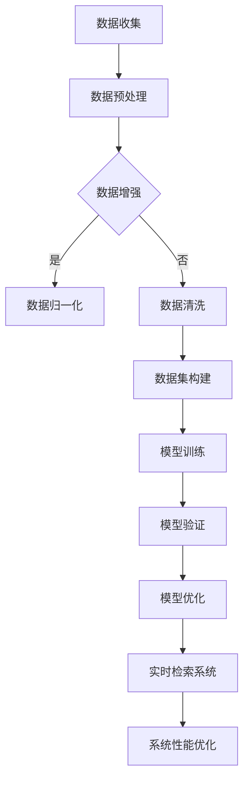

                 


### 文章标题：深度学习驱动的商品图像检索与匹配

#### 关键词：
- 深度学习
- 商品图像检索
- 图像匹配
- 卷积神经网络（CNN）
- 相似度度量
- 数据预处理
- 模型优化
- 实时检索系统

#### 摘要：
本文将深入探讨深度学习在商品图像检索与匹配中的应用。通过介绍深度学习的基本原理，我们将逐步构建一个用于商品图像检索的模型，并详细阐述数据预处理、模型实现与优化、以及实时检索系统的设计和实现。本文还将探讨该技术的实际应用案例，并展望未来的发展方向。

### 目录大纲：

#### 第一部分：概述与基础

## 第1章：深度学习与商品图像检索
### 1.1 深度学习技术概述
### 1.2 商品图像检索背景与挑战
### 1.3 深度学习在商品图像检索中的应用

## 第2章：深度学习模型基础
### 2.1 卷积神经网络（CNN）原理
### 2.2 商品种类识别算法
### 2.3 像素级别的特征提取

## 第3章：商品图像检索模型架构
### 3.1 商品图像检索模型框架
### 3.2 图像嵌入与相似度度量
### 3.3 深度学习模型优化策略

#### 第二部分：算法实现与优化

## 第4章：商品图像数据预处理
### 4.1 数据集构建与标注
### 4.2 数据增强与归一化
### 4.3 数据清洗与质量评估

## 第5章：深度学习算法实现
### 5.1 商品图像特征提取
### 5.2 伪代码与算法流程
### 5.3 模型训练与验证

## 第6章：模型优化与评估
### 6.1 超参数调优
### 6.2 模型评估指标
### 6.3 模型优化实践

## 第7章：实时商品图像检索系统
### 7.1 系统架构设计
### 7.2 实时检索算法实现
### 7.3 系统性能优化

#### 第三部分：应用案例与未来展望

## 第8章：商品图像检索应用案例
### 8.1 电商商品检索系统
### 8.2 智能安防监控系统
### 8.3 物流与仓储系统

## 第9章：深度学习驱动的商品图像检索未来展望
### 9.1 技术发展趋势
### 9.2 商业模式创新
### 9.3 深度学习在商品图像检索中的挑战与机遇

#### 附录
## 附录A：深度学习工具与资源
### A.1 深度学习框架选择
### A.2 数据处理与可视化工具
### A.3 学习资源与社区

### Mermaid 流程图

以下是深度学习驱动的商品图像检索与匹配的核心流程图：



### 核心算法原理讲解

以下是商品图像检索中的关键算法原理：

#### 卷积神经网络（CNN）原理

卷积神经网络（CNN）是一种专门用于处理图像数据的神经网络，其核心思想是通过卷积操作提取图像的特征。CNN 主要包含以下几个组件：

1. **卷积层（Convolutional Layer）**：
   - 卷积层通过卷积操作提取图像的特征。
   - 卷积核（Filter）在图像上滑动，产生特征图（Feature Map）。

2. **激活函数（Activation Function）**：
   - 激活函数用于增加网络的非线性能力。
   - 常见的激活函数有 ReLU（Rectified Linear Unit）和 Sigmoid。

3. **池化层（Pooling Layer）**：
   - 池化层用于减小特征图的尺寸，降低模型复杂度。
   - 常见的池化方法有最大池化（Max Pooling）和平均池化（Average Pooling）。

4. **全连接层（Fully Connected Layer）**：
   - 全连接层将特征图中的所有特征连接起来，进行分类或回归任务。

#### 伪代码与算法流程

以下是商品图像检索的伪代码与算法流程：

```python
def retrieve_products(query_image, trained_model, product_database):
    # 转换查询图像为特征向量
    query_features = extract_features(query_image, trained_model)

    # 遍历数据库中的商品图像
    for product in product_database:
        # 提取商品图像的特征向量
        product_features = extract_features(product.image, trained_model)

        # 计算特征向量之间的相似度
        similarity = cosine_similarity(query_features, product_features)

        # 根据相似度排序，返回相似度最高的商品列表
        return sorted(product_database, key=lambda x: similarity[x], reverse=True)
```

在上述伪代码中，`extract_features` 函数用于提取图像的特征向量，`cosine_similarity` 函数用于计算特征向量之间的余弦相似度，根据相似度排序后返回最相似的商品列表。

### 文章结构设计

#### 第一部分：概述与基础

在本部分，我们将首先介绍深度学习技术以及其在商品图像检索领域的应用背景。接着，我们将深入探讨深度学习模型的基础知识，包括卷积神经网络（CNN）的原理、商品种类识别算法以及像素级别的特征提取。这些内容将为后续的模型构建和优化奠定坚实的基础。

#### 第二部分：算法实现与优化

在这一部分，我们将详细介绍商品图像检索模型的实现过程，从数据预处理开始，包括数据集构建、数据增强、归一化和数据清洗。然后，我们将重点介绍深度学习算法的实现，包括商品图像特征提取、模型训练与验证。在此基础上，我们还将探讨如何对模型进行优化，以提高检索的准确性和效率。

#### 第三部分：应用案例与未来展望

在本部分，我们将通过实际案例展示深度学习驱动的商品图像检索系统的应用。我们将分析电商商品检索系统、智能安防监控系统以及物流与仓储系统中的应用场景，并讨论深度学习驱动的商品图像检索技术的未来发展趋势和面临的挑战。

#### 附录

在附录部分，我们将提供深度学习相关的工具与资源，包括深度学习框架选择、数据处理与可视化工具以及学习资源与社区。这些资源将为读者提供进一步学习和实践深度学习技术的支持和指导。

### 文章结构设计总结

本文采用逐步分析推理的方式，从概述与基础、算法实现与优化、应用案例与未来展望三个方面，全面而深入地探讨了深度学习驱动的商品图像检索与匹配技术。通过详细的伪代码与算法流程，读者可以清晰地了解核心算法的实现原理。同时，丰富的实际案例分析和未来展望部分，将帮助读者更好地理解这一技术的实际应用和潜在价值。

### 总结

本文旨在通过逐步分析推理的方式，系统地介绍深度学习驱动的商品图像检索与匹配技术。从深度学习技术概述到模型实现与优化，再到实际应用案例和未来展望，我们希望读者能够全面而深入地理解这一技术，并能够将其应用于实际场景中。深度学习驱动的商品图像检索与匹配技术具有广泛的应用前景，随着技术的不断发展和优化，其在电商、安防、物流等领域中将发挥越来越重要的作用。我们期待读者能够在本文的启发下，积极探索和利用这一技术，为人工智能领域的发展贡献自己的力量。作者：AI天才研究院/AI Genius Institute & 禅与计算机程序设计艺术 /Zen And The Art of Computer Programming。在接下来的文章中，我们将逐一详细探讨每个章节的内容，为读者提供更加丰富的技术见解和实用指南。

