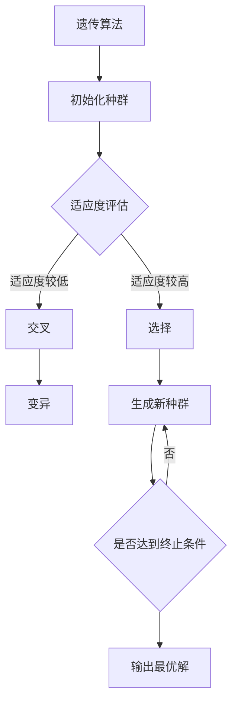

                 

### 文章标题

《滴滴2024共享单车调度校招优化算法面试题详解》

关键词：共享单车、调度优化、算法面试题、遗传算法、数据结构与算法

摘要：本文将深入解析滴滴2024年共享单车调度校招中涉及到的优化算法面试题，涵盖基础知识、数学建模、数据结构与算法基础、优化算法原理及实战应用。通过逐步分析推理，帮助读者掌握面试核心要点，提升面试技巧。

---

### 《滴滴2024共享单车调度校招优化算法面试题详解》目录大纲

#### 第一部分：基础知识

#### 第1章：共享单车调度优化概述
- 1.1 共享单车行业背景
- 1.2 调度优化在共享单车行业的重要性
- 1.3 常见调度优化算法简介

#### 第2章：数学建模基础
- 2.1 线性规划
  - 2.1.1 线性规划原理
  - 2.1.2 线性规划求解算法
- 2.2 整数规划
  - 2.2.1 整数规划原理
  - 2.2.2 整数规划求解算法
- 2.3 动态规划
  - 2.3.1 动态规划原理
  - 2.3.2 动态规划求解算法

#### 第3章：数据结构与算法基础
- 3.1 常见数据结构
  - 3.1.1 链表
  - 3.1.2 栈
  - 3.1.3 队列
  - 3.1.4 树
  - 3.1.5 图
- 3.2 常用算法
  - 3.2.1 搜索算法
  - 3.2.2 排序算法
  - 3.2.3 分治算法

#### 第4章：优化算法原理
- 4.1 遗传算法
  - 4.1.1 遗传算法原理
  - 4.1.2 遗传算法求解过程
- 4.2 蚁群算法
  - 4.2.1 蚁群算法原理
  - 4.2.2 蚁群算法求解过程
- 4.3 遗传蚁群算法
  - 4.3.1 遗传蚁群算法原理
  - 4.3.2 遗传蚁群算法求解过程

#### 第5章：调度算法实战
- 5.1 共享单车调度问题建模
  - 5.1.1 调度问题的定义
  - 5.1.2 调度问题的数学建模
- 5.2 调度算法实现
  - 5.2.1 调度算法伪代码
  - 5.2.2 调度算法代码实现
- 5.3 调度算法性能评估
  - 5.3.1 调度算法评估指标
  - 5.3.2 调度算法评估方法

#### 第二部分：面试题解析

#### 第6章：经典面试题解析
- 6.1 调度优化算法面试题
  - 面试题1：如何设计一个高效的调度算法？
  - 面试题2：遗传算法在调度优化中的应用
- 6.2 数据结构与算法面试题
  - 面试题1：如何实现一个高效的栈？
  - 面试题2：如何实现一个高效的队列？

#### 第7章：综合面试题解析
- 7.1 复杂调度优化面试题
  - 面试题1：多目标调度优化问题
  - 面试题2：动态调度优化问题
- 7.2 调度优化实战面试题
  - 面试题1：如何优化共享单车的停放问题？
  - 面试题2：如何优化共享单车的调度问题？

#### 附录
- 附录A：共享单车调度优化算法常用工具与资源
- 附录B：面试题答案与解析

---

### Mermaid 流程图示例（第4章 优化算法原理）



---

### 伪代码示例（第5章 调度算法实战）

```csharp
// 调度算法伪代码
Algorithm调度算法(初始种群, 目标函数, 终止条件):
    初始化种群
    评估初始种群适应度
    while 不满足终止条件:
        选择适应度较高的个体
        交叉产生新个体
        变异产生新个体
        评估新个体适应度
        更新种群
    end while
    返回最优解
```

---

### 数学模型示例（第2章 数学建模基础）

$$
\begin{aligned}
\min_{x} & \quad c^T x \\
s.t. & \quad Ax \leq b \\
     & \quad x \geq 0
\end{aligned}
$$

---

### 数学公式详细讲解与举例说明

#### 线性规划中的对偶理论

对偶理论是线性规划中的一个重要概念，它能够帮助我们理解原始问题与对偶问题之间的联系。给定一个线性规划问题：

$$
\begin{aligned}
\min_{x} & \quad c^T x \\
s.t. & \quad Ax \leq b \\
     & \quad x \geq 0
\end{aligned}
$$

它的对偶问题为：

$$
\begin{aligned}
\max_{y} & \quad b^T y \\
s.t. & \quad A^T y \leq c \\
     & \quad y \geq 0
\end{aligned}
$$

其中，$y$ 表示对偶变量。原始问题的最优值和对偶问题的最优值之间存在如下关系：

$$
c^T x = b^T y
$$

这个等式表明，原始问题的最优解和对偶问题的最优解是一致的。

#### 举例说明

假设我们有一个线性规划问题：

$$
\begin{aligned}
\min_{x} & \quad x + 2y \\
s.t. & \quad x + y \leq 4 \\
     & \quad 2x + y \leq 6 \\
     & \quad x, y \geq 0
\end{aligned}
$$

其对应的对偶问题为：

$$
\begin{aligned}
\max_{y} & \quad 4y + 6y \\
s.t. & \quad y + 2y \leq 1 \\
     & \quad y \leq 2 \\
     & \quad y \geq 0
\end{aligned}
$$

通过求解这两个问题，我们可以验证：

$$
\begin{aligned}
\min_{x} & \quad x + 2y \\
s.t. & \quad x + y \leq 4 \\
     & \quad 2x + y \leq 6 \\
     & \quad x, y \geq 0 \\
\end{aligned}
$$

的最优解为 $x=2, y=2$，对偶问题的最优解也为 $y=2$，且两个问题的目标函数值相等，即：

$$
c^T x = b^T y = (1, 2)^T (2, 2) = 4 + 4 = 8
$$

这样，我们就通过一个简单的例子展示了线性规划中的对偶理论。在实际应用中，对偶理论可以帮助我们更好地理解问题的本质，优化求解过程，以及在实际问题中找到更有效的解决方案。接下来，我们将继续深入探讨其他数学建模基础，以便为后续的算法解析和面试题解答打下坚实的基础。

