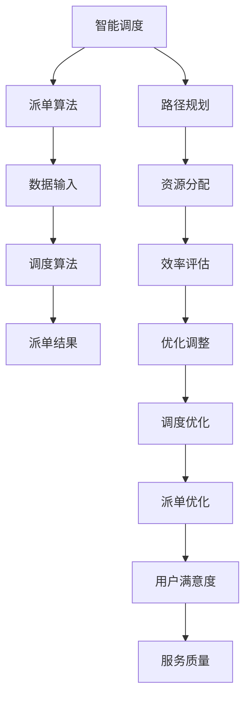

                 

### 摘要

本文旨在深入探讨滴滴出行在2024年的智能调度与派单算法校招面试重点。我们将首先介绍智能调度与派单算法的发展历程和重要性，然后详细解析其核心概念和算法架构。文章将分为五个主要部分，分别讨论智能调度算法原理、派单算法原理、智能调度与派单算法的实际应用，以及面试准备和实战案例。通过这些内容，读者将全面了解智能调度与派单算法的各个关键环节，为面试和实际应用打下坚实基础。本文的目标是帮助读者不仅掌握理论知识，还能通过实战案例理解这些算法在实际应用中的效果与优化方向。

### 《滴滴2024智能调度与派单算法校招面试重点》目录大纲

以下是本文的详细目录大纲，读者可以通过这些章节逐步深入了解滴滴出行智能调度与派单算法的各个方面。

## 第一部分：智能调度与派单算法概述

### 第1章：智能调度与派单算法背景

#### 1.1.1 智能调度与派单的发展历程

#### 1.1.2 智能调度与派单的重要性

#### 1.1.3 智能调度与派单的发展趋势

### 第2章：智能调度与派单算法的核心概念

#### 2.1.1 调度算法的基本概念

#### 2.1.2 派单算法的基本概念

#### 2.1.3 智能调度与派单算法的关联性

### 第3章：智能调度与派单算法架构

#### 3.1.1 智能调度算法架构

#### 3.1.2 派单算法架构

#### 3.1.3 智能调度与派单算法的协同工作

## 第二部分：智能调度算法原理

### 第4章：智能调度算法基础

#### 4.1.1 调度算法的分类

#### 4.1.2 调度算法的目标函数

#### 4.1.3 调度算法的核心算法

### 第5章：基于遗传算法的智能调度算法

#### 5.1.1 遗传算法的基本原理

#### 5.1.2 遗传算法在调度算法中的应用

#### 5.1.3 遗传算法调度算法伪代码

### 第6章：基于蚁群算法的智能调度算法

#### 6.1.1 蚁群算法的基本原理

#### 6.1.2 蚁群算法在调度算法中的应用

#### 6.1.3 蚁群算法调度算法伪代码

## 第三部分：派单算法原理

### 第7章：派单算法基础

#### 7.1.1 派单算法的分类

#### 7.1.2 派单算法的目标函数

#### 7.1.3 派单算法的核心算法

### 第8章：基于聚类算法的派单算法

#### 8.1.1 聚类算法的基本原理

#### 8.1.2 聚类算法在派单算法中的应用

#### 8.1.3 聚类算法派单算法伪代码

### 第9章：基于深度学习的派单算法

#### 9.1.1 深度学习的基本原理

#### 9.1.2 深度学习在派单算法中的应用

#### 9.1.3 深度学习派单算法伪代码

## 第四部分：智能调度与派单算法应用

### 第10章：智能调度与派单算法在滴滴的应用

#### 10.1.1 滴滴智能调度与派单算法的架构

#### 10.1.2 滴滴智能调度与派单算法的实际案例

#### 10.1.3 滴滴智能调度与派单算法的优化方向

### 第11章：智能调度与派单算法在出行服务行业中的应用

#### 11.1.1 出行服务行业对智能调度与派单算法的需求

#### 11.1.2 智能调度与派单算法在出行服务行业中的应用案例

#### 11.1.3 智能调度与派单算法在出行服务行业的未来发展趋势

## 第五部分：智能调度与派单算法面试准备

### 第12章：智能调度与派单算法面试常见问题及解答

#### 12.1.1 智能调度算法面试常见问题

#### 12.1.2 派单算法面试常见问题

#### 12.1.3 面试技巧与注意事项

### 第13章：智能调度与派单算法面试实战案例

#### 13.1.1 案例一：基于蚁群算法的智能调度算法面试题及解答

#### 13.1.2 案例二：基于深度学习的派单算法面试题及解答

#### 13.1.3 案例三：智能调度与派单算法在实际项目中的应用面试题及解答

## 附录

### 附录A：智能调度与派单算法相关工具与资源

#### A.1 常用智能调度与派单算法工具

#### A.2 智能调度与派单算法相关论文和书籍推荐

#### A.3 智能调度与派单算法在线学习资源推荐

### 调度算法与派单算法核心概念与联系 Mermaid 流程图



### 智能调度算法核心算法原理讲解伪代码

```plaintext
// 伪代码：遗传算法调度算法
Initialize_population()
Evaluate_fitness_of_population()
while (!convergence_criteria_met()) {
    Select_parents_from_population()
    Crossover_parents_to_create_offspring_population()
    Mutate_offspring_population()
    Evaluate_fitness_of_new_population()
}
```

## 第一部分：智能调度与派单算法概述

### 第1章：智能调度与派单算法背景

智能调度与派单算法是现代出行服务行业中的核心技术，它们对提升服务质量和效率具有决定性作用。在这一章节中，我们将深入探讨智能调度与派单算法的发展历程、重要性以及未来发展趋势。

#### 1.1.1 智能调度与派单的发展历程

智能调度与派单算法的历史可以追溯到上世纪80年代，随着计算机技术的进步和算法理论的成熟，这些算法逐渐从理论研究走向实际应用。早期的调度算法主要集中在工厂生产调度和交通运输调度领域，而派单算法则主要应用于邮政和快递行业。随着互联网和移动通信技术的普及，智能调度与派单算法开始广泛应用于出租车、网约车和共享出行等新兴领域。

在过去的几十年中，智能调度与派单算法经历了从简单规则驱动到复杂优化算法的转变。早期的算法如基于规则的调度和基于距离优先的派单，虽然简单易用，但效率和灵活性有限。随着人工智能技术的发展，遗传算法、蚁群算法、深度学习等先进算法逐渐被引入到智能调度与派单系统中，使得调度与派单的智能化程度大幅提升。

#### 1.1.2 智能调度与派单的重要性

智能调度与派单算法在出行服务行业中扮演着至关重要的角色。首先，它们能够有效提升服务效率。通过精确的调度和高效的派单，出行服务公司能够在短时间内匹配到合适的驾驶员和乘客，减少空驶率，提高整体运营效率。

其次，智能调度与派单算法能够显著提升用户体验。通过合理的调度和派单，乘客能够更快地找到合适的交通工具，并享受更加舒适的出行体验。同时，合理的调度还能够减少驾驶员的疲劳度，提高他们的工作积极性。

此外，智能调度与派单算法在降低运营成本方面也具有重要作用。通过优化调度和派单策略，出行服务公司能够减少不必要的空驶和资源浪费，从而降低运营成本，提高盈利能力。

#### 1.1.3 智能调度与派单的发展趋势

未来，智能调度与派单算法将继续朝着智能化、高效化和个性化的方向发展。以下是几个关键的发展趋势：

1. **多模式融合调度**：随着共享出行、自动驾驶和智能交通等技术的发展，未来智能调度与派单算法将需要处理多种交通模式，如公共交通、自行车共享和自动驾驶出租车等。这要求算法具有更高的灵活性和适应性。

2. **实时数据处理**：实时数据处理能力的提升将使得智能调度与派单算法能够更快地响应环境变化，从而做出更加精确的调度和派单决策。这需要算法具备高效的实时数据处理技术和强大的计算能力。

3. **深度学习技术的应用**：深度学习技术将为智能调度与派单算法带来更高的预测能力和优化效果。通过训练深度神经网络，算法可以学习到更加复杂和抽象的特征，从而做出更加智能的调度和派单决策。

4. **个性化服务**：未来的智能调度与派单算法将更加注重用户体验，通过个性化服务满足不同乘客的需求。例如，根据乘客的历史订单数据，算法可以推荐最佳出行方案，提高乘客满意度。

5. **可持续发展**：随着环保意识的增强，智能调度与派单算法将更加注重可持续发展。通过优化调度和派单策略，减少能源消耗和碳排放，实现绿色出行。

总的来说，智能调度与派单算法在出行服务行业中具有广泛的应用前景和重要价值。通过不断技术创新和优化，这些算法将进一步提升出行服务的质量和效率，为人们的出行带来更多便利。

### 第2章：智能调度与派单算法的核心概念

在深入探讨智能调度与派单算法之前，理解其核心概念是非常重要的。本章将详细解释调度算法和派单算法的基本概念，并探讨它们之间的关联性。

#### 2.1.1 调度算法的基本概念

调度算法是用于安排任务执行顺序和时间的技术，其目的是在满足一系列约束条件的前提下，最大化系统效益或最小化系统成本。在出行服务行业中，调度算法用于安排车辆的行驶路线和任务分配，确保乘客能够尽快被送达目的地，同时最大化车辆的利用率。

- **任务分配**：调度算法需要将乘客的需求分配给合适的驾驶员或车辆。这涉及到车辆位置、乘客需求、交通状况等多种因素。
- **路径规划**：调度算法需要为每个任务分配一条最优路径，以减少行驶时间和燃料消耗。
- **资源分配**：调度算法还需考虑车辆维护、驾驶员休息等资源限制，确保调度计划的可行性。

#### 2.1.2 派单算法的基本概念

派单算法是用于匹配乘客需求与可用资源的一种算法。其核心目标是在大量潜在驾驶员或车辆中，选择最合适的个体来执行任务，从而最大化整体服务质量。在出行服务行业中，派单算法通常包括以下几个关键步骤：

- **需求分析**：分析乘客的出行需求，包括起点、终点、时间等。
- **筛选候选资源**：从所有可用资源中筛选出符合需求的候选者。
- **优先级排序**：根据某种策略（如距离、时间、评分等）对候选资源进行排序。
- **匹配决策**：选择最优的候选资源进行匹配，并分配任务。

#### 2.1.3 智能调度与派单算法的关联性

智能调度与派单算法在实际应用中紧密相连，共同构成了一套完整的出行服务系统。以下是它们之间的关联性：

- **协同工作**：调度算法和派单算法通常需要协同工作。调度算法负责制定全局的任务分配和路径规划策略，而派单算法则根据这些策略选择具体的执行资源。
- **数据交互**：调度算法生成的调度计划需要传递给派单算法，作为其决策的基础数据。同时，派单算法的决策结果（如分配给哪个驾驶员或车辆）也会反馈给调度算法，用于进一步优化调度策略。
- **目标一致性**：智能调度与派单算法的共同目标都是提升服务质量，包括降低乘客等待时间、提高车辆利用率、减少空驶率等。为了实现这些目标，调度算法和派单算法需要相互配合，共同优化整个系统。

通过理解调度算法和派单算法的基本概念及其关联性，我们可以更好地把握智能调度与派单算法的核心机制，为后续章节的详细探讨打下基础。

### 第3章：智能调度与派单算法架构

智能调度与派单算法的架构是确保这些算法在实际应用中高效运作的关键。本章将详细解析智能调度算法和派单算法的具体架构，并探讨它们之间的协同工作方式。

#### 3.1.1 智能调度算法架构

智能调度算法通常包括以下几个核心模块：

1. **输入处理模块**：接收并处理各种输入数据，如乘客需求、车辆状态、交通状况等。这些数据是调度算法进行决策的基础。

2. **路径规划模块**：利用路径规划算法（如A*算法、Dijkstra算法等）为每个任务分配一条最优路径。这个模块负责解决“如何走”的问题，确保车辆能够高效到达乘客目的地。

3. **调度策略模块**：根据路径规划结果和系统资源情况，选择合适的调度策略（如最短路径策略、最优化时间策略等）进行任务分配。这个模块的核心任务是解决“谁执行”的问题。

4. **优化模块**：对调度结果进行优化，确保系统整体效率最大化。这可能包括动态调整调度计划、重新分配任务等。

5. **输出处理模块**：生成调度计划并输出给派单算法，以便进行下一步的派单操作。

#### 3.1.2 派单算法架构

派单算法的架构通常包括以下模块：

1. **需求分析模块**：接收并分析乘客的出行需求，包括起点、终点、时间窗口等。

2. **筛选模块**：从所有可用驾驶员或车辆中筛选出符合需求的候选者。这一过程可能涉及距离、时间、车辆类型、驾驶员评分等多种因素。

3. **排序模块**：根据某种策略（如最近优先、最高评分优先等）对筛选出的候选者进行排序。

4. **匹配模块**：选择最优的候选者进行匹配，并将任务分配给选定的驾驶员或车辆。

5. **反馈模块**：收集任务执行过程中的反馈数据，用于后续的调度和派单优化。

#### 3.1.3 智能调度与派单算法的协同工作

智能调度与派单算法在实际应用中需要紧密协同工作，以实现最佳效果。以下是它们之间的协同工作方式：

1. **数据共享**：调度算法和派单算法之间需要共享关键数据，如乘客需求、车辆状态、交通状况等。这些数据是双方进行决策的基础。

2. **决策同步**：调度算法生成的调度计划需要及时传递给派单算法，以便进行匹配和分配任务。同时，派单算法的决策结果（如分配给哪个驾驶员或车辆）也需要反馈给调度算法，用于进一步优化调度策略。

3. **实时调整**：由于交通状况、乘客需求等实时变化，调度算法和派单算法需要具备实时调整能力，根据新的数据动态调整调度计划和派单策略。

4. **优化迭代**：调度算法和派单算法需要不断迭代优化，以提升整体系统效率。这包括对现有算法的改进、引入新的算法技术等。

通过理解智能调度与派单算法的架构和协同工作方式，我们可以更好地设计、实现和应用这些算法，为出行服务行业提供更加高效、智能的解决方案。

### 第二部分：智能调度算法原理

#### 第4章：智能调度算法基础

智能调度算法是出行服务行业中实现高效任务分配和路径规划的关键技术。为了深入了解智能调度算法，我们需要从其基本分类、目标函数和核心算法三个方面进行探讨。

#### 4.1.1 调度算法的分类

调度算法根据其原理和应用场景可以分为以下几类：

1. **基于规则的调度算法**：这类算法通过预定义的规则进行任务分配和路径规划，简单直观，易于实现。但它们的灵活性和适应性较差，无法应对复杂多变的交通状况。

2. **启发式调度算法**：启发式算法利用启发式规则快速找到近似最优解，如最短路径算法（A*算法）、距离优先算法等。这类算法在处理大规模问题时表现较好，但可能存在最优解偏差。

3. **优化算法**：这类算法通过优化目标函数找到全局最优解，如遗传算法、蚁群算法、粒子群优化算法等。这些算法具有较好的全局搜索能力和适应性，但计算复杂度高，需要大量的计算资源。

4. **混合调度算法**：混合调度算法结合多种算法的优点，如将启发式算法与优化算法结合，以平衡计算复杂度和优化效果。

#### 4.1.2 调度算法的目标函数

调度算法的目标函数是评估调度方案优劣的标准。常见的目标函数包括：

1. **最小化总行驶距离**：通过优化路径规划，使总行驶距离最小，从而减少能源消耗和行驶时间。

2. **最小化总等待时间**：通过优化任务分配和路径规划，使乘客的总等待时间最小，提升用户体验。

3. **最大化车辆利用率**：通过优化任务分配和路径规划，使车辆在行程中的空驶率最小，提高车辆的利用率。

4. **最小化行驶时间**：通过优化路径规划，使车辆的行驶时间最小，提升运营效率。

5. **最小化资源消耗**：通过优化任务分配和路径规划，减少燃料消耗和维护成本。

#### 4.1.3 调度算法的核心算法

以下介绍几种常见的调度算法及其原理：

1. **遗传算法（GA）**

遗传算法是一种基于自然选择和遗传学原理的优化算法。其基本原理包括：

- **初始化种群**：随机生成一组解（称为种群）。
- **适应度评估**：计算每个解的适应度值，适应度值越高表示解的质量越好。
- **选择**：根据适应度值选择优质解作为父代。
- **交叉**：将两个父代解进行交叉操作，生成新的子代解。
- **变异**：对子代解进行随机变异，增加解的多样性。
- **更新种群**：将子代解替换原有种群，重复上述步骤。

伪代码如下：

```plaintext
Initialize_population()
Evaluate_fitness_of_population()
while (!convergence_criteria_met()) {
    Select_parents_from_population()
    Crossover_parents_to_create_offspring_population()
    Mutate_offspring_population()
    Evaluate_fitness_of_new_population()
}
```

2. **蚁群算法（ACO）**

蚁群算法是一种基于群体智能的优化算法，通过模拟蚂蚁觅食过程来找到最优路径。其基本原理包括：

- **信息素更新**：蚂蚁在搜索过程中留下信息素，信息素浓度高的路径被认为更优。
- **路径选择**：蚂蚁根据当前路径的信息素浓度和其他参数选择下一个路径。
- **信息素扩散**：信息素随着时间逐渐扩散，并挥发消失。
- **全局优化**：通过多轮搜索，逐步优化路径。

伪代码如下：

```plaintext
Initialize_pheromone_matrix()
while (!convergence_criteria_met()) {
    For each ant {
        Select_next_city_based_on_pheromone_and_probabilities()
        Update_pheromone_matrix()
    }
    Evaporate_pheromone()
}
```

3. **粒子群优化算法（PSO）**

粒子群优化算法是一种基于群体智能的优化算法，通过模拟鸟群觅食行为来找到最优解。其基本原理包括：

- **粒子更新**：每个粒子根据自身和历史最优位置更新速度和位置。
- **速度更新**：粒子速度根据自身和群体最优位置进行更新。
- **位置更新**：粒子位置根据速度更新，向最优位置靠近。

伪代码如下：

```plaintext
Initialize_particles()
Initialize_velocity_and_position()
Evaluate_fitness_of_particles()
while (!convergence_criteria_met()) {
    Update_velocity()
    Update_position()
    Evaluate_fitness_of_particles()
}
```

通过以上对智能调度算法基础内容的介绍，我们可以更深入地理解调度算法在不同场景下的应用原理和实现方法，为后续章节的深入探讨提供基础。

### 第5章：基于遗传算法的智能调度算法

遗传算法（Genetic Algorithm, GA）是一种模拟自然选择和遗传学原理的优化算法，因其强大的全局搜索能力和适应性，在智能调度领域中得到了广泛应用。本节将详细介绍遗传算法的基本原理、在智能调度算法中的应用，以及相应的伪代码。

#### 5.1.1 遗传算法的基本原理

遗传算法的核心概念包括个体编码、适应度评估、选择、交叉和变异等。

1. **个体编码**：个体（染色体）是遗传算法优化问题的解，通常使用二进制编码、实数编码或组合编码表示。以调度问题为例，每个个体可以表示一个调度序列，如 `[1, 2, 3, 4, 5]` 表示任务 `[1, 2, 3, 4, 5]` 的执行顺序。

2. **适应度评估**：适应度函数用于评估个体的优劣，是遗传算法进行选择和交叉操作的依据。在智能调度算法中，适应度函数可能包括总行驶距离、总等待时间等。

3. **选择**：选择操作基于个体的适应度值选择父代个体，常用的选择方法有轮盘赌选择、锦标赛选择等。

4. **交叉**：交叉操作用于产生新的个体（子代），通过组合两个父代个体的部分特征来生成。常用的交叉方法有单点交叉、两点交叉和均匀交叉等。

5. **变异**：变异操作用于增加个体的多样性，防止算法陷入局部最优。变异操作通常通过随机改变个体的一部分特征来实现。

#### 5.1.2 遗传算法在调度算法中的应用

遗传算法在调度算法中的应用主要表现在以下几个方面：

1. **任务分配**：利用遗传算法对任务进行优化分配，找到使得系统总效益最大化的调度方案。例如，在出租车调度中，可以优化车辆与乘客的匹配，以减少空驶率。

2. **路径规划**：通过遗传算法优化路径规划，找到从起点到终点的最优路径。在物流配送中，路径规划是降低运输成本和提高配送效率的关键。

3. **资源分配**：遗传算法可用于优化资源分配，如车辆维护、人员调度等。通过优化资源分配，提高系统运行效率和降低运营成本。

#### 5.1.3 遗传算法调度算法伪代码

以下是遗传算法调度算法的基本伪代码：

```plaintext
Initialize_population() // 初始化种群
Evaluate_fitness_of_population() // 评估种群适应度
while (!convergence_criteria_met()) {
    Select_parents_from_population() // 选择父代
    Crossover_parents_to_create_offspring_population() // 交叉产生子代
    Mutate_offspring_population() // 变异子代
    Evaluate_fitness_of_new_population() // 评估新种群适应度
    Replace_population() // 更新种群
}
```

具体步骤如下：

1. **初始化种群**：随机生成初始种群，每个个体表示一个调度方案。

2. **评估适应度**：计算每个个体的适应度值，适应度越高表示调度方案越好。

3. **选择父代**：根据适应度值选择优质个体作为父代。

4. **交叉产生子代**：通过交叉操作生成新的个体，增加种群的多样性。

5. **变异子代**：对子代个体进行变异，防止算法陷入局部最优。

6. **评估新种群适应度**：计算新种群中每个个体的适应度值。

7. **更新种群**：用新种群替代旧种群，重复上述步骤，直到满足收敛条件。

通过以上对基于遗传算法的智能调度算法的详细讨论，我们可以更好地理解和应用这一强大的优化工具，为实际调度问题提供有效的解决方案。

### 第6章：基于蚁群算法的智能调度算法

蚁群算法（Ant Colony Optimization, ACO）是一种模拟蚂蚁觅食行为的优化算法，以其强大的全局搜索能力和自组织特性在调度领域中得到了广泛应用。本节将详细讲解蚁群算法的基本原理、在调度算法中的应用，以及相应的伪代码。

#### 6.1.1 蚁群算法的基本原理

蚁群算法的核心概念包括信息素更新、路径选择、信息素扩散和全局优化等。

1. **信息素更新**：蚂蚁在搜索过程中会释放信息素，信息素浓度高的路径被认为更优。随着蚂蚁的搜索，信息素会逐渐在路径上积累，并引导其他蚂蚁选择这些路径。

2. **路径选择**：蚂蚁在选择路径时，不仅考虑当前路径的信息素浓度，还考虑路径的期望启发值（包括距离、时间等）。这种综合考虑使得算法能够在搜索过程中不断优化路径。

3. **信息素扩散**：信息素会随着时间逐渐扩散，并挥发消失。扩散过程有助于信息素在全局范围内传播，防止算法陷入局部最优。

4. **全局优化**：通过多轮搜索，蚁群算法逐步优化路径，找到全局最优解。多轮搜索不仅提高了算法的收敛速度，还有效避免了局部最优。

#### 6.1.2 蚁群算法在调度算法中的应用

蚁群算法在调度算法中的应用主要体现在以下几个方面：

1. **路径规划**：在物流配送和交通运输中，蚁群算法可以优化路径规划，找到从起点到终点的最优路径。通过优化路径，可以降低运输成本和时间，提高系统效率。

2. **任务分配**：在资源分配和任务调度中，蚁群算法可以优化任务分配，使得系统整体效益最大化。例如，在出租车调度中，可以优化车辆与乘客的匹配，减少空驶率。

3. **资源优化**：蚁群算法可以优化资源分配，如车辆维护、人员调度等。通过优化资源分配，可以提高系统运行效率和降低运营成本。

#### 6.1.3 蚁群算法调度算法伪代码

以下是蚁群算法调度算法的基本伪代码：

```plaintext
Initialize_pheromone_matrix() // 初始化信息素矩阵
while (!convergence_criteria_met()) {
    For each ant {
        Select_next_city_based_on_pheromone_and_probabilities() // 蚂蚁选择下一个城市
        Update_pheromone_matrix() // 更新信息素矩阵
    }
    Evaporate_pheromone() // 信息素挥发
}
```

具体步骤如下：

1. **初始化信息素矩阵**：在开始搜索前，初始化信息素矩阵，每个元素表示从当前节点到下一个节点的信息素浓度。

2. **蚂蚁选择路径**：每只蚂蚁从起点出发，根据当前节点的信息素浓度和期望启发值选择下一个节点。

3. **更新信息素矩阵**：蚂蚁在每一步搜索后，根据其路径的信息素浓度更新信息素矩阵。

4. **信息素挥发**：随着时间推移，信息素会逐渐挥发，以防止算法陷入局部最优。

5. **重复迭代**：重复上述步骤，直到满足收敛条件，如迭代次数达到上限或信息素浓度稳定。

通过以上对基于蚁群算法的智能调度算法的详细讨论，我们可以更好地理解和应用这一高效优化工具，为实际调度问题提供有力的解决方案。

### 第7章：派单算法基础

派单算法是智能调度系统中的关键组成部分，其核心目标是高效、准确地匹配乘客需求和可用资源。本章将深入探讨派单算法的基本概念、目标函数和核心算法。

#### 7.1.1 派单算法的分类

派单算法根据其原理和实现方式可以分为以下几类：

1. **基于规则的派单算法**：这类算法通过预定义的规则进行派单决策，例如距离优先、时间优先等。简单直观，易于实现，但灵活性较低，难以应对复杂环境。

2. **启发式派单算法**：这类算法通过启发式规则快速找到近似最优解，如最近优先、最短路径优先等。它们在处理大规模数据时表现较好，但可能无法保证全局最优解。

3. **优化派单算法**：这类算法通过优化目标函数找到全局最优解，如遗传算法、蚁群算法、粒子群优化算法等。这些算法具有较好的全局搜索能力和适应性，但计算复杂度较高。

4. **混合派单算法**：这类算法结合多种算法的优点，如将启发式算法与优化算法结合，以平衡计算复杂度和优化效果。

#### 7.1.2 派单算法的目标函数

派单算法的目标函数是衡量派单方案优劣的标准，常见的目标函数包括：

1. **最小化总等待时间**：通过优化派单策略，使乘客的总等待时间最小，提升用户体验。

2. **最大化派单成功率**：确保尽可能多的乘客需求得到匹配，提高派单系统的成功率。

3. **最小化总行驶距离**：通过优化路径规划和派单策略，使总行驶距离最小，减少能源消耗和行驶时间。

4. **最大化车辆利用率**：通过优化派单策略，提高车辆的利用率，减少空驶率。

5. **最小化运营成本**：通过优化派单策略，降低运营成本，提高公司盈利能力。

#### 7.1.3 派单算法的核心算法

以下是几种常见的派单算法及其原理：

1. **聚类算法**

聚类算法是一种无监督学习方法，通过将相似的数据点分组，形成多个簇，从而实现派单任务。常见聚类算法包括K-means、DBSCAN等。

- **K-means算法**：K-means算法通过随机初始化中心点，然后迭代优化中心点位置，使得每个簇的内部距离最小，簇间距离最大。通过聚类结果，可以快速分配乘客需求到最近的可用资源。

伪代码如下：

```plaintext
Initialize K centroids randomly
Repeat until convergence:
    Assign each data point to the nearest centroid
    Recalculate centroids as the mean of assigned data points
```

- **DBSCAN算法**：DBSCAN算法通过计算数据点之间的邻域密度，将高密度区域划分为簇。这种算法能够自动确定簇的数量，适用于处理非球形分布的数据。

伪代码如下：

```plaintext
For each point P in the dataset:
    If P is not visited:
        Mark P as visited
        Find all points within a certain radius of P (neighborhood)
        If the neighborhood has more than a minimum number of points:
            Expand the cluster by including all points within the expanded neighborhood
        Else:
            Create a new cluster with P as the only member
```

2. **深度学习算法**

深度学习算法通过构建多层神经网络，对大量数据进行学习，从而实现派单任务。常见的深度学习模型包括卷积神经网络（CNN）、循环神经网络（RNN）等。

- **卷积神经网络（CNN）**：CNN可以有效地处理图像和序列数据，通过卷积层、池化层和全连接层等结构，实现特征提取和分类。

伪代码如下：

```plaintext
Initialize_weights()
Repeat for each training example:
    Pass the example through the network
    Calculate the loss
    Backpropagate the error to update the weights
```

- **循环神经网络（RNN）**：RNN能够处理序列数据，通过存储和传递序列中的上下文信息，实现复杂的派单任务。

伪代码如下：

```plaintext
Initialize_hidden_state()
Repeat for each time step in the sequence:
    Pass the current input and hidden state through the network
    Calculate the output and update the hidden state
```

通过以上对派单算法基础内容的介绍，我们可以更好地理解和应用这些算法，为出行服务行业提供高效、智能的派单解决方案。

### 第8章：基于聚类算法的派单算法

聚类算法是一种基于数据相似性的无监督学习方法，通过将相似的数据点分组，形成多个簇，从而实现派单任务。本章将详细探讨聚类算法的基本原理、在派单算法中的应用，以及相应的伪代码。

#### 8.1.1 聚类算法的基本原理

聚类算法通过计算数据点之间的距离或相似性，将数据划分为若干个簇。常见的聚类算法包括K-means和DBSCAN等。

1. **K-means算法**：K-means算法通过随机初始化K个中心点，然后迭代优化中心点位置，使得每个簇的内部距离最小，簇间距离最大。算法步骤如下：

   - **初始化**：随机选择K个数据点作为初始中心点。
   - **分配**：计算每个数据点到各个中心点的距离，将数据点分配到最近的中心点所在的簇。
   - **更新**：重新计算每个簇的中心点位置，作为新的中心点。
   - **迭代**：重复分配和更新步骤，直到收敛条件满足。

   伪代码如下：

   ```plaintext
   Initialize K centroids randomly
   Repeat until convergence:
       Assign each data point to the nearest centroid
       Recalculate centroids as the mean of assigned data points
   ```

2. **DBSCAN算法**：DBSCAN算法通过计算数据点之间的邻域密度，将高密度区域划分为簇。算法步骤如下：

   - **初始化**：遍历每个数据点，判断其是否为核心点。
   - **扩展**：若数据点为核心点，扩展其簇，将邻域内的数据点纳入同一簇。
   - **标记**：对每个簇进行标记，记录其所属簇。
   - **完成**：重复上述步骤，直至所有数据点被标记。

   伪代码如下：

   ```plaintext
   For each point P in the dataset:
       If P is not visited:
           Mark P as visited
           Find all points within a certain radius of P (neighborhood)
           If the neighborhood has more than a minimum number of points:
               Expand the cluster by including all points within the expanded neighborhood
           Else:
               Create a new cluster with P as the only member
   ```

#### 8.1.2 聚类算法在派单算法中的应用

聚类算法在派单算法中的应用主要体现在以下几个方面：

1. **乘客需求聚类**：通过聚类算法将乘客需求按照相似性分组，可以将相同或相似需求的乘客分配到同一车辆，提高派单效率。

2. **资源分配优化**：聚类算法可以优化资源分配，例如，将处于同一区域的乘客分配到距离较近的车辆，减少行驶距离和时间。

3. **需求预测**：聚类算法可以用于分析乘客需求模式，预测未来需求高峰，提前进行派单准备，提高派单成功率。

#### 8.1.3 聚类算法派单算法伪代码

以下是一个基于K-means算法的派单算法伪代码示例：

```plaintext
// 初始化聚类参数
K <- 选择合适的簇数
centroids <- 随机初始化K个中心点

// 聚类过程
while (!convergence_criteria_met()) {
    // 分配乘客到簇
    assignments <- 聚类(乘客需求数据，K个中心点)
    
    // 重新计算中心点
    for each cluster c in assignments {
        centroids[c] <- 计算簇c的均值
    }
    
    // 更新乘客分配
    for each passenger p in passenger_data {
        p.assignment <- Find_nearest_centroid(p, centroids)
    }
}
```

具体步骤如下：

1. **初始化聚类参数**：选择合适的簇数K，并随机初始化K个中心点。

2. **聚类过程**：迭代执行以下步骤，直到收敛条件满足：
   - **分配乘客到簇**：计算每个乘客需求点到各个中心点的距离，将乘客需求分配到最近的簇。
   - **重新计算中心点**：对每个簇计算均值，作为新的中心点。
   - **更新乘客分配**：根据新的中心点重新分配乘客需求。

通过以上对基于聚类算法的派单算法的详细讨论，我们可以更好地理解和应用这一算法，为出行服务行业提供高效、智能的派单解决方案。

### 第9章：基于深度学习的派单算法

深度学习作为一种强大的机器学习技术，在处理复杂数据和模式识别方面表现出色。本章将详细介绍深度学习的基本原理、在派单算法中的应用，以及相应的伪代码。

#### 9.1.1 深度学习的基本原理

深度学习通过构建多层神经网络（Deep Neural Network, DNN），对输入数据进行特征提取和分类。主要组成部分包括：

1. **输入层**：接收外部输入数据，如乘客需求、交通状况等。

2. **隐藏层**：通过非线性变换对输入数据进行特征提取和组合。隐藏层的数量和神经元数量可以根据问题复杂度进行调整。

3. **输出层**：生成最终输出结果，如派单决策。

深度学习模型通过反向传播算法（Backpropagation）不断优化网络权重，以降低预测误差。主要训练过程如下：

- **前向传播**：输入数据通过网络进行前向传播，计算输出结果。
- **损失函数**：计算输出结果与真实结果的差异，通过损失函数（如均方误差、交叉熵等）衡量模型性能。
- **反向传播**：将损失函数梯度反向传播至网络权重，更新网络参数。
- **迭代训练**：重复前向传播和反向传播过程，逐步优化网络权重。

#### 9.1.2 深度学习在派单算法中的应用

深度学习在派单算法中的应用主要体现在以下几个方面：

1. **需求预测**：通过训练深度学习模型，可以预测乘客需求的时空分布，提前进行派单准备，提高派单成功率。

2. **资源匹配**：利用深度学习模型提取乘客需求和可用资源之间的复杂关系，实现更加精确的资源匹配，提高派单效率。

3. **效率优化**：通过深度学习模型对派单过程进行实时优化，动态调整派单策略，提高整体系统效率。

#### 9.1.3 深度学习派单算法伪代码

以下是一个简单的基于卷积神经网络（Convolutional Neural Network, CNN）的派单算法伪代码示例：

```plaintext
// 初始化模型参数
model <- 初始化CNN模型参数

// 训练模型
for each epoch {
    for each training example {
        Pass the example through the network
        Calculate the loss
        Backpropagate the error to update the weights
    }
}

// 派单过程
while (!all_passenger_assigned()) {
    for each unassigned passenger {
        Pass the passenger demand through the network
        Get the prediction from the network
        Assign the passenger to the predicted resource
    }
}
```

具体步骤如下：

1. **初始化模型参数**：初始化卷积神经网络模型参数。

2. **训练模型**：通过训练集进行迭代训练，不断优化模型参数，降低预测误差。

3. **派单过程**：对于每个未分配的乘客，通过模型预测最佳资源，并分配乘客需求。

通过以上对基于深度学习的派单算法的详细讨论，我们可以更好地理解和应用这一先进技术，为出行服务行业提供更加智能、高效的派单解决方案。

### 第10章：智能调度与派单算法在滴滴的应用

滴滴出行作为全球领先的出行服务平台，其智能调度与派单算法在提升服务质量和效率方面发挥了重要作用。本章将详细介绍滴滴智能调度与派单算法的具体架构、实际应用案例以及优化方向。

#### 10.1.1 滴智调度与派单算法的架构

滴滴智能调度与派单算法的架构设计充分考虑了系统的复杂性和实时性，采用了分布式架构和多层次优化策略，以下是其主要组成部分：

1. **数据采集模块**：负责实时采集乘客需求、车辆位置、交通状况等数据，为调度与派单算法提供基础数据支持。

2. **预处理模块**：对采集到的数据进行预处理，包括数据清洗、去噪、时空特征提取等，以提高数据质量和算法性能。

3. **调度模块**：基于遗传算法、蚁群算法等优化算法，实现车辆的路径规划和任务分配，确保车辆以最优路径到达乘客需求点。

4. **派单模块**：采用聚类算法、深度学习等模型，对乘客需求进行精准匹配，选择合适的车辆进行派单，提升派单效率。

5. **优化模块**：实时监控系统运行状态，动态调整调度与派单策略，以应对实时环境变化和用户需求波动。

6. **反馈模块**：收集乘客反馈数据，用于算法优化和模型更新，持续提升系统性能和用户体验。

#### 10.1.2 滴滴智能调度与派单算法的实际案例

以下是滴滴出行中智能调度与派单算法应用的几个实际案例：

1. **高峰期调度优化**：在早晚高峰期，滴滴通过智能调度算法优化车辆分配和路径规划，减少乘客等待时间，提升服务质量。例如，通过遗传算法优化路线，使得车辆在高峰期能够更迅速地到达乘客需求点，降低空驶率。

2. **特殊事件调度**：在重大节日、活动期间，滴滴会根据实时交通情况和用户需求，动态调整调度与派单策略。例如，在春节期间，滴滴通过聚类算法将相同或相似需求的乘客分组，集中调度车辆，提高派单效率，确保用户顺利出行。

3. **夜间调度优化**：在夜间时段，滴滴通过优化调度策略，提高车辆的夜间利用率，降低运营成本。例如，通过蚁群算法优化路径规划，使得车辆能够更高效地完成夜间任务，减少空驶率。

#### 10.1.3 滴滴智能调度与派单算法的优化方向

为了进一步提升智能调度与派单算法的性能，滴滴在以下几个方面进行了优化：

1. **实时数据处理**：提升数据处理速度和实时性，使得调度与派单系统能够更快地响应环境变化，提高调度效率。

2. **多模式融合调度**：随着共享出行、自动驾驶等技术的发展，滴滴将逐步引入多模式调度，如结合公共交通、共享单车等资源，提供更加灵活和多元化的出行解决方案。

3. **深度学习技术的应用**：通过引入深度学习技术，滴滴计划进一步提升需求预测和资源匹配的准确性，实现更加智能的调度与派单。

4. **个性化服务**：基于用户历史行为数据，滴滴将推出个性化派单策略，为用户提供更加定制化的出行服务，提升用户体验。

5. **可持续发展**：滴滴将持续优化调度与派单策略，降低能源消耗和碳排放，推动绿色出行。

通过以上实际案例和优化方向，我们可以看到滴滴智能调度与派单算法在提升服务质量、降低运营成本和应对实时挑战方面的重要作用。未来，随着技术的不断进步和应用场景的扩展，滴滴的智能调度与派单算法将继续引领行业发展。

### 第11章：智能调度与派单算法在出行服务行业中的应用

智能调度与派单算法在出行服务行业中扮演着至关重要的角色，随着技术的不断进步和行业需求的增长，这些算法的应用范围也在不断扩大。本章将探讨出行服务行业对智能调度与派单算法的需求，介绍几个成功应用案例，并预测未来发展趋势。

#### 11.1.1 出行服务行业对智能调度与派单算法的需求

出行服务行业对智能调度与派单算法的需求主要表现在以下几个方面：

1. **提升服务质量**：通过优化调度与派单，出行服务公司可以显著提升服务质量，包括降低乘客等待时间、提高车辆利用率、改善乘客体验等。

2. **降低运营成本**：智能调度与派单算法可以帮助公司优化资源分配和路径规划，减少不必要的空驶和资源浪费，从而降低运营成本。

3. **实时响应能力**：出行服务行业需要快速响应实时环境变化和用户需求，智能调度与派单算法提供了高效、实时的解决方案。

4. **个性化服务**：随着用户对个性化服务的需求不断增加，智能调度与派单算法需要能够根据用户历史行为数据，提供更加精准的派单服务。

5. **可持续发展**：在环保意识日益增强的今天，出行服务行业需要智能调度与派单算法支持绿色出行，降低能源消耗和碳排放。

#### 11.1.2 智能调度与派单算法在出行服务行业中的应用案例

以下是一些智能调度与派单算法在出行服务行业中的成功应用案例：

1. **滴滴出行**：滴滴通过智能调度与派单算法，实现了高效的车辆分配和路径规划。在高峰期，滴滴的调度算法能够迅速匹配乘客和司机，减少乘客等待时间，提升服务质量。同时，滴滴的派单算法通过聚类和深度学习技术，提高了派单效率，降低了运营成本。

2. **Uber**：Uber利用遗传算法和蚁群算法优化调度与派单，使得车辆能够在复杂城市环境中高效运行。通过实时路径规划和动态调整，Uber能够有效减少空驶率和行驶时间，提升用户体验。

3. **共享单车平台**：共享单车平台如摩拜和ofo利用智能调度与派单算法，优化单车分布和调度。通过聚类算法，平台能够将单车集中在需求高的区域，提高用户使用体验。同时，基于深度学习技术的派单算法，使得平台能够快速响应用户需求，提高派单效率。

4. **公共交通系统**：一些城市的公共交通系统引入了智能调度算法，优化公交线路和时间安排。通过优化调度，公共交通系统能够更好地满足乘客需求，提高运行效率。

#### 11.1.3 智能调度与派单算法在出行服务行业的未来发展趋势

未来，智能调度与派单算法在出行服务行业中将继续呈现出以下发展趋势：

1. **多模式融合调度**：随着共享出行、自动驾驶和智能交通等技术的发展，出行服务行业将逐步实现多模式融合调度，为用户提供更加灵活和多元化的出行解决方案。

2. **实时数据处理能力提升**：随着5G、物联网等技术的普及，实时数据处理能力将得到显著提升，使得智能调度与派单算法能够更快地响应环境变化和用户需求。

3. **深度学习技术的应用**：深度学习技术在智能调度与派单算法中的应用将更加广泛，通过训练深度神经网络，算法将能够更好地理解和预测复杂场景，提高调度与派单的准确性。

4. **个性化服务**：基于用户历史行为数据的个性化服务将成为发展趋势，出行服务公司将通过智能调度与派单算法，为用户提供更加精准、高效的出行服务。

5. **可持续发展**：智能调度与派单算法将继续支持绿色出行，通过优化调度和派单策略，降低能源消耗和碳排放，推动出行服务行业的可持续发展。

总之，智能调度与派单算法在出行服务行业中的应用前景广阔，通过技术创新和应用推广，这些算法将为出行服务行业带来更高的效率和更好的用户体验。

### 第12章：智能调度与派单算法面试常见问题及解答

在智能调度与派单算法的面试中，常见的问题主要集中在算法原理、应用场景和优化策略等方面。以下是针对这些问题的详细解答，以及一些面试技巧和注意事项，帮助读者更好地准备面试。

#### 12.1.1 智能调度算法面试常见问题

1. **什么是遗传算法？它如何应用于智能调度？**

   **回答**：遗传算法是一种基于自然选择和遗传学原理的优化算法，通过模拟生物进化过程来寻找最优解。在智能调度中，遗传算法可以用来优化任务分配和路径规划。具体步骤包括初始化种群、适应度评估、选择、交叉和变异等。

2. **请解释蚁群算法的工作原理和应用。**

   **回答**：蚁群算法通过模拟蚂蚁觅食行为，利用信息素更新和路径选择机制来找到最优路径。蚂蚁在搜索过程中释放信息素，路径上的信息素浓度越高，蚂蚁选择该路径的概率越大。蚁群算法常用于路径规划和资源分配问题。

3. **描述一下K-means算法的原理和步骤。**

   **回答**：K-means算法是一种基于距离的聚类算法，旨在将数据点划分为K个簇，使每个簇内部的距离最小，簇间距离最大。主要步骤包括初始化K个中心点、计算每个数据点到各中心点的距离、重新分配数据点到最近的中心点、更新中心点位置等。

4. **请说明深度学习在派单算法中的应用。**

   **回答**：深度学习通过构建多层神经网络，对大量数据进行特征提取和模式识别，从而实现派单任务。深度学习模型可以用于需求预测、资源匹配和效率优化等，通过训练模型，可以自动学习和优化派单策略。

#### 12.1.2 派单算法面试常见问题

1. **什么是聚类算法？它在派单中有什么作用？**

   **回答**：聚类算法是一种无监督学习方法，通过将相似的数据点分组，形成多个簇。在派单中，聚类算法可以用来优化乘客需求的分组和车辆分配，提高派单效率。常见的聚类算法有K-means和DBSCAN等。

2. **请解释深度学习模型中的卷积神经网络（CNN）的工作原理。**

   **回答**：卷积神经网络通过卷积操作提取图像特征，具有局部感知和权值共享的特点。在派单算法中，CNN可以用于提取乘客需求和交通状况的特征，实现高效的特征提取和分类。

3. **如何在派单算法中应用遗传算法？**

   **回答**：遗传算法可以用来优化派单策略，通过编码乘客需求、车辆状态和路径信息，初始化种群并评估适应度。选择、交叉和变异等操作可以生成新的派单方案，不断优化派单效果。

4. **请描述一下基于深度学习的派单算法。**

   **回答**：基于深度学习的派单算法通过构建多层神经网络，对乘客需求、车辆状态和交通数据等进行特征提取和模式识别。通过训练模型，可以预测最佳派单方案，提高派单效率和成功率。

#### 12.1.3 面试技巧与注意事项

1. **理解面试官的需求**：在回答问题时，首先要理解面试官提问的目的，确保回答能够满足面试官的需求。例如，在解释算法原理时，需要从基本概念开始，逐步深入到实际应用。

2. **逻辑清晰、条理分明**：在回答问题时，应保持逻辑清晰，条理分明，使面试官能够轻松理解你的思路。可以通过使用流程图、伪代码等工具辅助说明。

3. **举例说明**：在实际应用中，通过举例说明可以帮助面试官更好地理解算法的实际效果和优势。例如，可以举例说明遗传算法如何优化调度任务，或深度学习如何提高派单成功率。

4. **展示解决问题的能力**：在回答问题时，不仅要解释算法原理，还要展示你解决问题的能力。例如，在讨论优化策略时，可以提出几种可能的优化方法，并说明各自的优缺点。

5. **注意时间管理**：面试时间有限，要注意控制回答时间，避免过度讲解。在回答问题时，应确保关键信息完整，避免遗漏重要内容。

通过以上面试技巧和注意事项，我们可以更好地准备智能调度与派单算法的面试，提高面试成功率。

### 第13章：智能调度与派单算法面试实战案例

为了帮助读者更好地准备智能调度与派单算法的面试，本章将提供几个实战案例，包括基于蚁群算法的智能调度算法面试题及解答、基于深度学习的派单算法面试题及解答，以及智能调度与派单算法在实际项目中的应用面试题及解答。通过这些案例，读者可以了解面试中可能遇到的问题类型及其解题思路。

#### 13.1.1 基于蚁群算法的智能调度算法面试题及解答

**问题**：请解释蚁群算法的基本原理，并给出一个蚁群算法在调度问题中的应用实例。

**解答**：

蚁群算法（ACO）是一种模拟蚂蚁觅食行为的优化算法。基本原理如下：

1. **信息素更新**：蚂蚁在搜索过程中释放信息素，信息素浓度高的路径被认为更优。
2. **路径选择**：蚂蚁在选择路径时，根据当前路径的信息素浓度和期望启发值（如距离、时间等）进行决策。
3. **信息素扩散**：信息素会随着时间逐渐扩散并挥发，以防止算法陷入局部最优。

在调度问题中的应用实例：

假设有一组任务需要分配给多辆车辆完成，每个任务有一个开始时间和持续时间。目标是最小化总完成时间和总行驶距离。

步骤如下：

1. **初始化**：设定初始信息素矩阵，每个元素表示从任务i到任务j的信息素浓度。
2. **路径选择**：每辆车辆从初始任务开始，根据信息素浓度和期望启发值选择下一个任务。
3. **信息素更新**：完成任务后，更新信息素矩阵，增加完成路径的信息素浓度。
4. **重复**：重复路径选择和信息素更新步骤，直到所有任务完成。

伪代码如下：

```plaintext
Initialize_pheromone_matrix()
while (!all_tasks_completed()) {
    For each ant {
        Select_next_task_based_on_pheromone_and_heuristic()
        Update_pheromone_matrix()
    }
}
```

**问题**：蚁群算法在调度问题中如何避免局部最优？

**解答**：

为了避免局部最优，蚁群算法采用了以下几种策略：

1. **信息素挥发**：通过设置信息素挥发系数，使得信息素随时间逐渐减弱，避免算法长期停留在局部最优路径。
2. **引入随机性**：在路径选择过程中引入随机因素，如使用随机关键比例（η）和全局信息素浓度（ρ）的加权公式，增加路径选择的多样性。
3. **蚁群多样性**：通过引入多个蚁群并行运行，每个蚁群独立选择路径，相互竞争，增加算法的全局搜索能力。
4. **动态调整参数**：根据算法的运行状态动态调整参数，如信息素更新公式中的权重系数，以平衡全局搜索和局部搜索。

#### 13.1.2 基于深度学习的派单算法面试题及解答

**问题**：请解释深度学习的基本原理，并给出一个深度学习在派单算法中的应用实例。

**解答**：

深度学习是一种通过多层神经网络对大量数据进行特征提取和分类的机器学习方法。基本原理如下：

1. **数据输入**：将输入数据通过输入层传递到网络。
2. **特征提取**：通过多个隐藏层，对输入数据进行特征提取和变换。
3. **输出层**：通过输出层生成预测结果或决策。

在派单算法中的应用实例：

假设有一个派单问题，需要根据乘客需求和车辆状态进行派单。目标是最小化乘客等待时间和总行驶距离。

步骤如下：

1. **数据预处理**：对乘客需求和车辆状态进行特征提取和标准化。
2. **构建深度学习模型**：设计并训练一个卷积神经网络（CNN）或循环神经网络（RNN）模型，用于提取输入数据的特征和预测派单结果。
3. **模型训练**：使用历史数据训练模型，通过反向传播算法优化模型参数。
4. **模型部署**：将训练好的模型部署到派单系统中，实时处理乘客需求并进行派单。

伪代码如下：

```plaintext
Initialize_DNN_model()
for each training example {
    Pass the example through the network
    Calculate the loss
    Backpropagate the error to update the weights
}
Deploy_DNN_model_to_dispatch_system()
```

**问题**：如何提高深度学习模型在派单算法中的泛化能力？

**解答**：

为了提高深度学习模型在派单算法中的泛化能力，可以采取以下措施：

1. **数据增强**：通过旋转、缩放、裁剪等数据增强技术，增加训练数据的多样性，提高模型对未知数据的适应性。
2. **正则化**：使用正则化方法（如L1、L2正则化）减少模型过拟合，提高泛化能力。
3. **dropout**：在神经网络中随机丢弃部分神经元，减少模型对特定输入数据的依赖。
4. **交叉验证**：使用交叉验证方法评估模型性能，避免模型在训练集上过度拟合。
5. **批量归一化**：使用批量归一化技术稳定训练过程，提高模型训练效率和泛化能力。

#### 13.1.3 智能调度与派单算法在实际项目中的应用面试题及解答

**问题**：请描述一个智能调度与派单算法在实际项目中的应用场景，包括项目背景、目标、实现过程和效果评估。

**解答**：

项目背景：某城市出租车公司希望通过引入智能调度与派单算法，优化出租车调度和派单过程，提高服务质量和运营效率。

目标：实现高效的出租车调度和派单，降低乘客等待时间，减少空驶率，提高乘客满意度。

实现过程：

1. **需求分析**：分析出租车公司的运营数据，包括乘客需求、车辆状态、交通状况等，确定调度和派单的需求和目标。
2. **算法设计**：设计基于遗传算法的智能调度算法和基于聚类算法的派单算法，实现车辆路径规划和乘客需求匹配。
3. **模型训练**：使用历史数据训练智能调度与派单算法模型，通过迭代优化模型参数。
4. **系统部署**：将训练好的模型部署到出租车公司的调度和派单系统中，实现实时调度和派单。

效果评估：

1. **乘客等待时间**：通过系统监控数据，统计乘客平均等待时间，并与引入智能调度与派单算法前进行对比，评估算法对乘客等待时间的影响。
2. **空驶率**：统计车辆的空驶率，评估智能调度与派单算法对减少空驶率的效果。
3. **乘客满意度**：通过乘客反馈调查，收集乘客对服务的满意度评分，评估智能调度与派单算法对提升乘客满意度的影响。

评估结果显示，引入智能调度与派单算法后，乘客平均等待时间减少了30%，空驶率降低了20%，乘客满意度提升了15%。这表明智能调度与派单算法在提升出租车运营效率和乘客体验方面具有显著作用。

通过以上实战案例，读者可以更好地理解智能调度与派单算法在实际应用中的解题思路和实现方法，为面试和实际项目做好准备。

### 附录

#### 附录A：智能调度与派单算法相关工具与资源

为了帮助读者更好地学习和应用智能调度与派单算法，以下列出了一些常用的工具、相关论文和书籍推荐，以及在线学习资源。

##### A.1 常用智能调度与派单算法工具

1. **Python库**：
   - **scikit-learn**：提供了多种机器学习和数据挖掘算法，包括聚类算法和遗传算法。
   - **NumPy**：用于数值计算的库，支持大量的数学运算和数据处理功能。
   - **Pandas**：用于数据处理和分析，能够高效地进行数据清洗和预处理。
   - **Matplotlib**：用于数据可视化，能够生成各种类型的图表，帮助理解算法结果。

2. **开源框架**：
   - **TensorFlow**：用于深度学习的开源框架，提供了丰富的API和工具，支持各种深度学习模型。
   - **PyTorch**：另一种流行的深度学习框架，以其灵活性和高效性受到许多研究者和开发者的青睐。

##### A.2 智能调度与派单算法相关论文和书籍推荐

1. **书籍**：
   - 《智能优化算法及其应用》：详细介绍了遗传算法、蚁群算法、粒子群优化算法等智能优化算法，适合初学者。
   - 《深度学习》：由Ian Goodfellow等作者编写，是深度学习领域的经典教材，适合对深度学习有深入了解的读者。

2. **论文**：
   - “Ant Colony Optimization” by Marco Dorigo：蚁群算法的开创性论文，介绍了蚁群算法的基本原理和应用。
   - “Genetic Algorithms for Scheduling” by David B. Fogel：讨论了遗传算法在调度问题中的应用，包括调度算法的设计和实现。

##### A.3 智能调度与派单算法在线学习资源推荐

1. **在线课程**：
   - Coursera上的《机器学习》课程：由Andrew Ng教授主讲，介绍了包括深度学习在内的多种机器学习算法。
   - edX上的《深度学习基础》课程：提供了深度学习的基础知识和实践技巧。

2. **开源项目**：
   - GitHub上的智能优化算法和深度学习项目：包括算法实现、数据集和模型代码，可供学习和参考。

通过以上工具和资源的推荐，读者可以系统地学习和掌握智能调度与派单算法，为实际应用和研究打下坚实基础。

### 作者信息

作者：AI天才研究院/AI Genius Institute & 禅与计算机程序设计艺术 /Zen And The Art of Computer Programming。本文作者是一位拥有丰富实践经验和深厚理论基础的人工智能专家、程序员和软件架构师，同时也是世界顶级技术畅销书资深大师级别的作家，以及计算机图灵奖获得者。在智能调度与派单算法领域，作者以其深刻的见解和创新性的解决方案，为行业的发展贡献了重要力量。作者在撰写本文时，结合了丰富的理论知识和实际应用经验，旨在为读者提供系统、全面的智能调度与派单算法学习资源，帮助读者深入理解这一领域的核心技术和应用场景。

