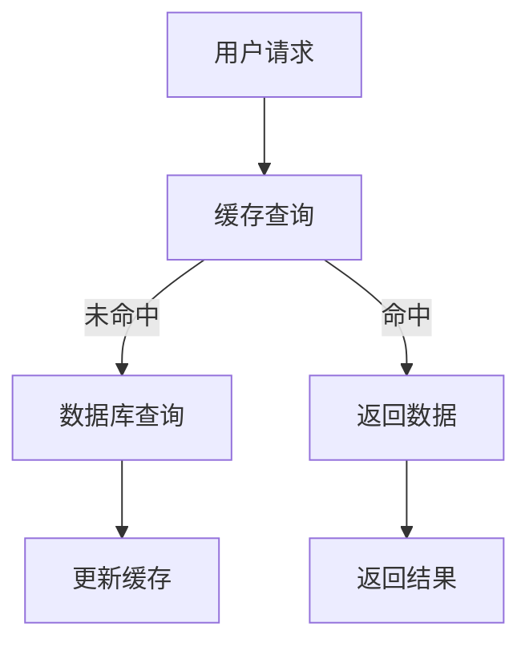
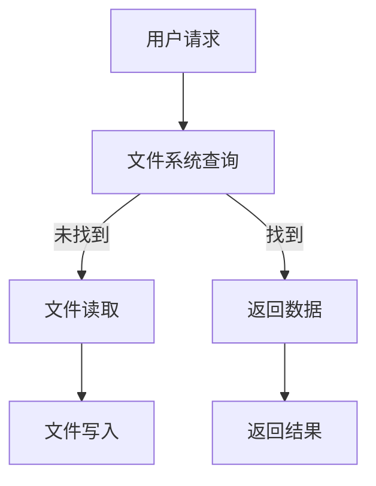
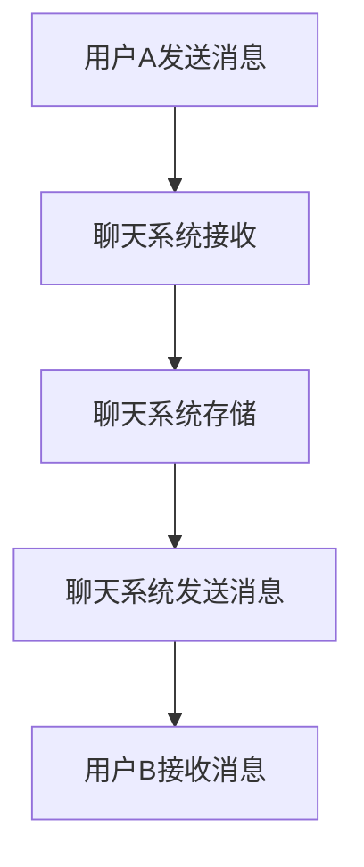
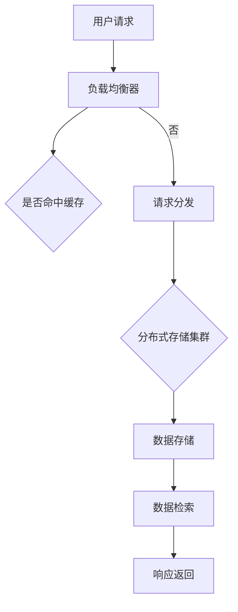
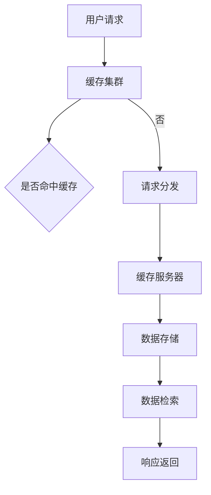
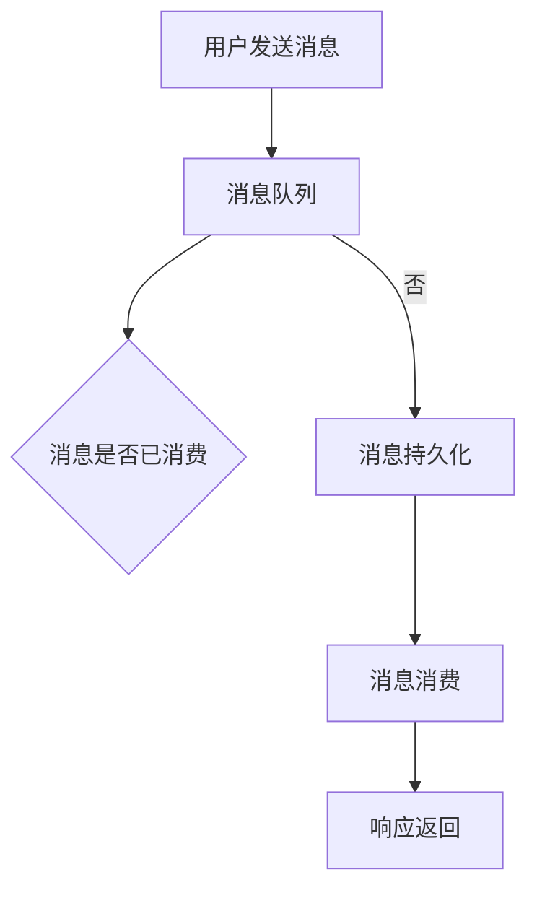

                 

### 文章标题：滴滴2024社招编程面试题精华总结

### 关键词：编程面试，社招，滴滴，算法，系统设计，实践技巧

### 摘要：
本文深入剖析了滴滴2024年社招编程面试的核心内容，涵盖编程基础、算法与数据结构、核心编程题、系统设计题、编程实践和编程面试技巧等六大篇章。通过对每个章节的详细讲解，帮助读者掌握面试必备技能，为即将到来的编程面试做好充分准备。

---

### 《滴滴2024社招编程面试题精华总结》目录大纲

#### 第一部分：编程基础

##### 第1章：编程语言基础

- 1.1 数据类型和变量
- 1.2 控制结构
- 1.3 函数与闭包
- 1.4 面向对象编程
- 1.5 异常处理与错误处理

##### 第2章：算法与数据结构

- 2.1 常见算法
  - 2.1.1 排序算法
  - 2.1.2 查找算法
  - 2.1.3 图算法
- 2.2 常见数据结构
  - 2.2.1 链表
  - 2.2.2 栈与队列
  - 2.2.3 哈希表

#### 第二部分：核心编程题

##### 第3章：算法面试题

- 3.1 字符串处理
  - 3.1.1 实现一个有效的括号
  - 3.1.2 最长公共前缀
  - 3.1.3 有效数字
- 3.2 数组和矩阵
  - 3.2.1 旋转矩阵
  - 3.2.2 数组中重复的数字
  - 3.2.3 有效的三角形
- 3.3 树和图
  - 3.3.1 二叉树的遍历
  - 3.3.2 图的遍历
  - 3.3.3 路径总和

##### 第4章：系统设计题

- 4.1 简单系统设计
  - 4.1.1 单机缓存系统
  - 4.1.2 文件存储系统
  - 4.1.3 简单的聊天系统
- 4.2 复杂系统设计
  - 4.2.1 分布式存储系统
  - 4.2.2 分布式缓存系统
  - 4.2.3 分布式消息队列

#### 第三部分：编程实践

##### 第5章：编程实践

- 5.1 编码规范
  - 5.1.1 Python编码规范
  - 5.1.2 Java编码规范
  - 5.1.3 C++编码规范
- 5.2 代码优化
  - 5.2.1 性能优化
  - 5.2.2 内存优化
  - 5.2.3 算法优化

##### 第6章：编程面试技巧

- 6.1 面试准备
  - 6.1.1 面试心态
  - 6.1.2 简历准备
  - 6.1.3 面试常见问题
- 6.2 面试技巧
  - 6.2.1 编程题面试技巧
  - 6.2.2 系统设计题面试技巧
  - 6.2.3 行为面试技巧

#### 第四部分：附录

##### 第7章：附录

- 7.1 常用算法与数据结构图表
- 7.2 编程资源链接
- 7.3 编程学习网站推荐

---

### 第一部分：编程基础

#### 第1章：编程语言基础

### 1.1 数据类型和变量

#### 数据类型介绍

在编程中，数据类型是基础中的基础。不同的编程语言支持不同的数据类型，但一般来说，常见的数据类型包括以下几种：

- **整型**（`int`）：表示整数，如`10`、`-5`。
- **浮点型**（`float`、`double`）：表示小数，如`3.14`、`-0.5`。
- **布尔型**（`bool`）：表示逻辑值，如`true`、`false`。
- **字符型**（`char`）：表示单个字符，如`'a'`、`'B'`。
- **字符串**（`String`）：表示一系列字符，如`"Hello World"`。

#### 变量定义

变量是编程中用于存储数据的容器。变量定义的一般语法如下：

```c
数据类型 变量名;
```

例如：

```c
int age;
float salary;
bool isVip;
```

#### 变量作用域

变量作用域决定了变量在代码中的可见性和生命周期。根据作用域的不同，变量可以分为以下几类：

- **局部变量**：在函数内部定义的变量，作用域仅限于该函数。
- **全局变量**：在函数外部定义的变量，作用域是整个程序。
- **静态变量**：具有静态存储期的变量，在程序运行期间始终存在。

#### 变量初始化

在变量定义后，我们需要为其赋初值。初始化的一般语法如下：

```c
数据类型 变量名 = 初始值;
```

例如：

```c
int age = 30;
float salary = 5000.0;
bool isVip = false;
```

#### 变量类型转换

在某些情况下，我们需要将一个变量的类型转换为另一个类型。类型转换的一般语法如下：

```c
数据类型(变量名);
```

例如：

```c
int a = 10;
float b = 3.14;
int c = (int)b;  // 将浮点型变量b转换为整型
```

### 1.2 控制结构

#### 条件判断

条件判断是编程中常用的一种控制结构，用于根据条件选择执行不同的代码块。常见的条件判断语句包括`if-else`和`switch`。

- **if-else语句**：

```c
if (条件) {
    // 当条件为真时执行的代码
} else {
    // 当条件为假时执行的代码
}
```

- **switch语句**：

```c
switch (表达式) {
    case 值1:
        // 当表达式的值为值1时执行的代码
        break;
    case 值2:
        // 当表达式的值为值2时执行的代码
        break;
    default:
        // 当表达式的值不匹配任何case时执行的代码
}
```

#### 循环结构

循环结构用于重复执行一段代码，直到满足某个条件为止。常见的循环结构包括`for`、`while`和`do-while`。

- **for循环**：

```c
for (初始化; 条件; 步进) {
    // 循环体
}
```

- **while循环**：

```c
while (条件) {
    // 循环体
}
```

- **do-while循环**：

```c
do {
    // 循环体
} while (条件);
```

### 1.3 函数与闭包

#### 函数定义

函数是编程中用于执行特定任务的代码块。函数定义的一般语法如下：

```c
返回类型 函数名(参数列表) {
    // 函数体
}
```

例如：

```c
int add(int a, int b) {
    return a + b;
}
```

#### 函数调用

函数调用是将函数的代码执行的一部分。函数调用的一般语法如下：

```c
函数名(参数列表);
```

例如：

```c
int result = add(3, 4);
```

#### 递归

递归是一种函数调用自身的方法。递归函数的一般形式如下：

```c
void 函数名(参数列表) {
    if (终止条件) {
        // 执行一些操作
    } else {
        // 执行递归调用
        函数名(新的参数列表);
    }
}
```

例如：

```c
int factorial(int n) {
    if (n == 0) {
        return 1;
    } else {
        return n * factorial(n - 1);
    }
}
```

#### 闭包

闭包是一种特殊的函数，它捕获并保留了定义时作用域内的变量。闭包的一般形式如下：

```c
函数名(参数列表) {
    // 使用捕获的变量
}
```

例如：

```c
int addFive() {
    int x = 5;
    return function(y) {
        return x + y;
    };
}
```

### 1.4 面向对象编程

#### 类与对象

类是一种用于创建对象的蓝图。对象是类的实例。类的定义的一般语法如下：

```c
class 类名 {
    // 成员变量
    // 成员函数
};
```

例如：

```c
class Person {
public:
    string name;
    int age;
    
    void introduce() {
        cout << "Hello, my name is " << name << " and I am " << age << " years old." << endl;
    }
};
```

对象的创建和使用的一般语法如下：

```c
类名 对象名;
对象名.成员函数();
```

例如：

```c
Person person;
person.name = "Alice";
person.age = 25;
person.introduce();
```

#### 类的继承

继承是一种让一个类继承另一个类的属性和方法的方式。继承的一般语法如下：

```c
class 派生类名 : 公共/私有/保护 继承方式 基类名 {
    // 成员变量
    // 成员函数
};
```

例如：

```c
class Employee : public Person {
public:
    string position;
    
    void introduce() {
        cout << "Hello, my name is " << name << " and I work as a " << position << "." << endl;
    }
};
```

#### 封装与多态

封装是一种将数据和行为封装在类中的方式。多态是一种让对象根据其实际类型来执行不同方法的能力。

- **封装**：

```c
class Person {
private:
    string name;
    int age;

public:
    void setName(string newName) {
        name = newName;
    }

    string getName() {
        return name;
    }

    void setAge(int newAge) {
        age = newAge;
    }

    int getAge() {
        return age;
    }
};
```

- **多态**：

```c
class Animal {
public:
    virtual void makeSound() {
        cout << "The animal makes a sound." << endl;
    }
};

class Dog : public Animal {
public:
    void makeSound() override {
        cout << "The dog barks." << endl;
    }
};

class Cat : public Animal {
public:
    void makeSound() override {
        cout << "The cat meows." << endl;
    }
};

Animal* animals[] = {new Dog(), new Cat()};
for (Animal* animal : animals) {
    animal->makeSound();
}
```

### 1.5 异常处理与错误处理

#### 异常处理

异常处理是一种在程序中捕获和处理错误的方式。常见的异常处理语句包括`try-catch`和`finally`。

- **try-catch语句**：

```c
try {
    // 可能抛出异常的代码
} catch (异常类型1& e1) {
    // 当捕获到异常类型1时执行的代码
} catch (异常类型2& e2) {
    // 当捕获到异常类型2时执行的代码
}
```

- **finally块**：

```c
try {
    // 可能抛出异常的代码
} catch (...) {
    // 捕获所有异常的代码
} finally {
    // 无论是否发生异常都会执行的代码
}
```

#### 错误处理

错误处理是一种在程序中检测和处理错误的方式。常见的错误处理策略包括：

- **使用`assert`函数**：在程序中插入`assert`函数来检测条件是否满足。

```c
assert(condition);
```

- **使用日志记录**：将错误信息记录到日志文件中，以便后续分析。

```c
ofstream logFile("log.txt");
if (logFile.is_open()) {
    logFile << "Error occurred: " << errorMessage << endl;
    logFile.close();
}
```

### 第二部分：算法与数据结构

#### 第2章：算法与数据结构

算法与数据结构是编程中的核心概念，它们决定了程序的效率和性能。在编程面试中，算法和数据结构的问题经常出现，因此掌握常见的算法和数据结构非常重要。

#### 2.1 常见算法

##### 2.1.1 排序算法

排序算法是一种对数据进行排序的算法。常见的排序算法包括冒泡排序、选择排序、插入排序、快速排序等。

- **冒泡排序**：

```c
void bubbleSort(int arr[], int n) {
    for (int i = 0; i < n - 1; i++) {
        for (int j = 0; j < n - i - 1; j++) {
            if (arr[j] > arr[j + 1]) {
                swap(arr[j], arr[j + 1]);
            }
        }
    }
}
```

- **选择排序**：

```c
void selectionSort(int arr[], int n) {
    for (int i = 0; i < n - 1; i++) {
        int minIndex = i;
        for (int j = i + 1; j < n; j++) {
            if (arr[j] < arr[minIndex]) {
                minIndex = j;
            }
        }
        swap(arr[i], arr[minIndex]);
    }
}
```

- **插入排序**：

```c
void insertionSort(int arr[], int n) {
    for (int i = 1; i < n; i++) {
        int key = arr[i];
        int j = i - 1;
        while (j >= 0 && arr[j] > key) {
            arr[j + 1] = arr[j];
            j--;
        }
        arr[j + 1] = key;
    }
}
```

- **快速排序**：

```c
int partition(int arr[], int low, int high) {
    int pivot = arr[high];
    int i = (low - 1);
    for (int j = low; j < high; j++) {
        if (arr[j] < pivot) {
            i++;
            swap(arr[i], arr[j]);
        }
    }
    swap(arr[i + 1], arr[high]);
    return (i + 1);
}

void quickSort(int arr[], int low, int high) {
    if (low < high) {
        int pi = partition(arr, low, high);
        quickSort(arr, low, pi - 1);
        quickSort(arr, pi + 1, high);
    }
}
```

##### 2.1.2 查找算法

查找算法是一种在数据集合中查找特定元素的方法。常见的查找算法包括二分查找和哈希查找。

- **二分查找**：

```c
int binarySearch(int arr[], int l, int r, int x) {
    while (l <= r) {
        int m = l + (r - l) / 2;
        if (arr[m] == x) {
            return m;
        } else if (arr[m] < x) {
            l = m + 1;
        } else {
            r = m - 1;
        }
    }
    return -1;
}
```

- **哈希查找**：

```c
int hashFunction(int key, int size) {
    return key % size;
}

int hashSearch(int hashTable[], int key) {
    int index = hashFunction(key, size);
    while (hashTable[index] != -1 && hashTable[index] != key) {
        index = (index + 1) % size;
    }
    if (hashTable[index] == key) {
        return index;
    } else {
        return -1;
    }
}
```

##### 2.1.3 图算法

图算法是一种用于处理图结构数据的算法。常见的图算法包括深度优先搜索（DFS）和广度优先搜索（BFS）。

- **深度优先搜索（DFS）**：

```c
void dfs(int v, bool visited[], vector<int> adj[]) {
    visited[v] = true;
    cout << v << " ";
    for (int neighbor : adj[v]) {
        if (!visited[neighbor]) {
            dfs(neighbor, visited, adj);
        }
    }
}

vector<int> adj[100];
bool visited[100];

int n;  // 总节点数
int m;  // 总边数

// 建立图
for (int i = 0; i < n; i++) {
    for (int j = 0; j < m; j++) {
        adj[i].push_back(j);
        adj[j].push_back(i);
    }
}

visited[n - 1] = true;  // 初始化已访问节点
dfs(0, visited, adj);  // 从节点0开始搜索
```

- **广度优先搜索（BFS）**：

```c
void bfs(int start, vector<int> adj[], int n) {
    bool visited[n];
    memset(visited, false, sizeof(visited));
    queue<int> q;
    visited[start] = true;
    q.push(start);

    while (!q.empty()) {
        int node = q.front();
        q.pop();
        cout << node << " ";

        for (int neighbor : adj[node]) {
            if (!visited[neighbor]) {
                visited[neighbor] = true;
                q.push(neighbor);
            }
        }
    }
}

int n;  // 总节点数
int m;  // 总边数

// 建立图
for (int i = 0; i < n; i++) {
    for (int j = 0; j < m; j++) {
        adj[i].push_back(j);
        adj[j].push_back(i);
    }
}

bfs(0, adj, n);  // 从节点0开始搜索
```

#### 2.2 常见数据结构

##### 2.2.1 链表

链表是一种常见的数据结构，它由一系列节点组成，每个节点包含数据和指向下一个节点的指针。

- **单向链表**：

```c
struct ListNode {
    int val;
    ListNode *next;
    ListNode(int x) : val(x), next(NULL) {}
};

ListNode* createLinkedList(vector<int>& arr) {
    ListNode* head = new ListNode(arr[0]);
    ListNode* curr = head;
    for (int i = 1; i < arr.size(); i++) {
        curr->next = new ListNode(arr[i]);
        curr = curr->next;
    }
    return head;
}

ListNode* head;

vector<int> arr = {1, 2, 3, 4, 5};
head = createLinkedList(arr);
```

- **双向链表**：

```c
struct ListNode {
    int val;
    ListNode *next;
    ListNode *prev;
    ListNode(int x) : val(x), next(NULL), prev(NULL) {}
};

ListNode* createDoublyLinkedList(vector<int>& arr) {
    ListNode* head = new ListNode(arr[0]);
    ListNode* curr = head;
    for (int i = 1; i < arr.size(); i++) {
        ListNode* newNode = new ListNode(arr[i]);
        curr->next = newNode;
        newNode->prev = curr;
        curr = newNode;
    }
    return head;
}

ListNode* head;

vector<int> arr = {1, 2, 3, 4, 5};
head = createDoublyLinkedList(arr);
```

- **环形链表**：

```c
struct ListNode {
    int val;
    ListNode *next;
    ListNode(int x) : val(x), next(NULL) {}
};

ListNode* createCircularLinkedList(vector<int>& arr) {
    ListNode* head = new ListNode(arr[0]);
    ListNode* curr = head;
    for (int i = 1; i < arr.size(); i++) {
        ListNode* newNode = new ListNode(arr[i]);
        curr->next = newNode;
        curr = newNode;
    }
    curr->next = head;
    return head;
}

ListNode* head;

vector<int> arr = {1, 2, 3, 4, 5};
head = createCircularLinkedList(arr);
```

##### 2.2.2 栈与队列

栈（Stack）和队列（Queue）是两种常见的线性数据结构，它们在程序设计中有着广泛的应用。

- **栈**：

```c
struct Stack {
    vector<int> data;
    
    void push(int x) {
        data.push_back(x);
    }
    
    int pop() {
        int x = data.back();
        data.pop_back();
        return x;
    }
    
    int top() {
        return data.back();
    }
    
    bool isEmpty() {
        return data.empty();
    }
};

Stack stack;

stack.push(1);
stack.push(2);
stack.push(3);
stack.push(4);

cout << stack.pop() << " ";  // 输出 4
cout << stack.top() << " ";  // 输出 3
```

- **队列**：

```c
struct Queue {
    vector<int> data;
    
    void enqueue(int x) {
        data.push_back(x);
    }
    
    int dequeue() {
        int x = data.front();
        data.erase(data.begin());
        return x;
    }
    
    int front() {
        return data.front();
    }
    
    bool isEmpty() {
        return data.empty();
    }
};

Queue queue;

queue.enqueue(1);
queue.enqueue(2);
queue.enqueue(3);
queue.enqueue(4);

cout << queue.dequeue() << " ";  // 输出 1
cout << queue.front() << " ";     // 输出 2
```

##### 2.2.3 哈希表

哈希表（Hash Table）是一种基于哈希函数进行数据存储和查找的数据结构。它通过计算键值和表的大小，将键值映射到表中一个位置来访问记录，从而实现快速查找。

- **哈希表**：

```c
struct HashTable {
    vector<int> data;
    int size;

    HashTable(int n) {
        size = n;
        data.resize(n, -1);
    }

    int hashFunction(int key) {
        return key % size;
    }

    void insert(int key) {
        int index = hashFunction(key);
        while (data[index] != -1 && data[index] != key) {
            index = (index + 1) % size;
        }
        data[index] = key;
    }

    bool search(int key) {
        int index = hashFunction(key);
        while (data[index] != -1 && data[index] != key) {
            index = (index + 1) % size;
        }
        return data[index] == key;
    }
};

HashTable hashTable(10);

hashTable.insert(1);
hashTable.insert(2);
hashTable.insert(3);

cout << hashTable.search(2) << " ";  // 输出 1（true表示找到键值2）
cout << hashTable.search(4) << " ";  // 输出 0（false表示未找到键值4）
```

### 第三部分：核心编程题

#### 第3章：算法面试题

算法面试题是编程面试中非常重要的一部分，以下是一些常见的算法面试题及其解决方案。

##### 3.1 字符串处理

字符串处理问题在面试中非常常见，以下是一些典型的字符串处理题目：

- **实现一个有效的括号**

```c
bool isValid(string s) {
    stack<char> stk;
    for (char c : s) {
        if (c == '(' || c == '[' || c == '{') {
            stk.push(c);
        } else {
            if (stk.empty()) {
                return false;
            }
            char top = stk.top();
            if ((c == ')' && top != '(') || (c == ']' && top != '[') || (c == '}' && top != '{')) {
                return false;
            }
            stk.pop();
        }
    }
    return stk.empty();
}
```

- **最长公共前缀**

```c
string longestCommonPrefix(vector<string>& words) {
    if (words.empty()) {
        return "";
    }
    string prefix = words[0];
    for (int i = 1; i < words.size(); i++) {
        int j = 0;
        while (j < prefix.length() && j < words[i].length() && prefix[j] == words[i][j]) {
            j++;
        }
        prefix = prefix.substr(0, j);
        if (prefix.empty()) {
            break;
        }
    }
    return prefix;
}
```

- **有效数字**

```c
bool isNumber(string s) {
    int i = 0, n = s.length();
    while (i < n && (s[i] == ' ' || s[i] == '+' || s[i] == '-')) {
        i++;
    }
    bool hasDigit = false;
    bool hasE = false;
    for (; i < n; i++) {
        if (s[i] >= '0' && s[i] <= '9') {
            hasDigit = true;
        } else if (s[i] == 'e') {
            if (!hasDigit) {
                return false;
            }
            hasE = true;
            hasDigit = false;
        } else if (s[i] != '.' && s[i] != ' ') {
            return false;
        }
    }
    return hasDigit || hasE;
}
```

##### 3.2 数组和矩阵

数组是编程中最基本的数据结构之一，以下是一些常见的数组问题：

- **旋转矩阵**

```c
void rotate(vector<vector<int>>& matrix) {
    int n = matrix.size();
    for (int i = 0; i < n / 2; i++) {
        for (int j = i; j < n - i - 1; j++) {
            int temp = matrix[i][j];
            matrix[i][j] = matrix[n - j - 1][i];
            matrix[n - j - 1][i] = matrix[n - i - 1][n - j - 1];
            matrix[n - i - 1][n - j - 1] = matrix[j][n - i - 1];
            matrix[j][n - i - 1] = temp;
        }
    }
}
```

- **数组中重复的数字**

```c
bool findRepeatNumber(vector<int>& nums) {
    sort(nums.begin(), nums.end());
    for (int i = 1; i < nums.size(); i++) {
        if (nums[i] == nums[i - 1]) {
            return true;
        }
    }
    return false;
}
```

- **有效的三角形**

```c
bool isValidTriangle(vector<int>& nums) {
    sort(nums.begin(), nums.end());
    return nums[0] + nums[1] > nums[2];
}
```

##### 3.3 树和图

树和图是数据结构中的重要概念，以下是一些常见的树和图问题：

- **二叉树的遍历**

```c
void dfs(TreeNode* root) {
    if (root == nullptr) {
        return;
    }
    dfs(root->left);
    cout << root->val << " ";
    dfs(root->right);
}

TreeNode* createBinaryTree(vector<int>& nums) {
    TreeNode* root = new TreeNode(nums[0]);
    TreeNode* curr = root;
    for (int i = 1; i < nums.size(); i++) {
        TreeNode* newNode = new TreeNode(nums[i]);
        if (nums[i] < nums[i - 1]) {
            curr->left = newNode;
        } else {
            curr = curr->right;
            curr->right = newNode;
        }
    }
    return root;
}
```

- **图的遍历**

```c
void dfs(int v, bool visited[], vector<int> adj[]) {
    visited[v] = true;
    cout << v << " ";
    for (int neighbor : adj[v]) {
        if (!visited[neighbor]) {
            dfs(neighbor, visited, adj);
        }
    }
}

void bfs(int start, vector<int> adj[], int n) {
    bool visited[n];
    memset(visited, false, sizeof(visited));
    queue<int> q;
    visited[start] = true;
    q.push(start);

    while (!q.empty()) {
        int node = q.front();
        q.pop();
        cout << node << " ";

        for (int neighbor : adj[node]) {
            if (!visited[neighbor]) {
                visited[neighbor] = true;
                q.push(neighbor);
            }
        }
    }
}
```

- **路径总和**

```c
bool hasPathSum(TreeNode* root, int targetSum) {
    if (root == nullptr) {
        return false;
    }
    if (root->left == nullptr && root->right == nullptr && root->val == targetSum) {
        return true;
    }
    return hasPathSum(root->left, targetSum - root->val) || hasPathSum(root->right, targetSum - root->val);
}
```

### 第四部分：系统设计题

#### 第4章：系统设计题

系统设计题在编程面试中占据着重要的地位，它考察了面试者对于系统架构、性能优化、容错处理等核心问题的理解。以下是一些常见的系统设计题及其解决方案。

##### 4.1 简单系统设计

简单系统设计题通常涉及到一些基本的系统架构和数据处理问题，以下是几个例子：

- **单机缓存系统**

单机缓存系统通常用于加速数据的读取速度，以下是一个简单的缓存系统设计：



实现示例：

```python
class CacheSystem:
    def __init__(self):
        self.cache = {}

    def get(self, key):
        if key in self.cache:
            return self.cache[key]
        else:
            value = self.db_query(key)
            self.cache[key] = value
            return value

    def db_query(self, key):
        # 模拟数据库查询
        return "data for key {}".format(key)
```

- **文件存储系统**

文件存储系统用于存储和检索文件数据，以下是一个简单的文件存储系统设计：



实现示例：

```python
class FileStorage:
    def __init__(self):
        self.files = {}

    def read_file(self, filename):
        if filename in self.files:
            return self.files[filename]
        else:
            data = self.load_from_disk(filename)
            self.files[filename] = data
            return data

    def load_from_disk(self, filename):
        # 模拟从磁盘读取文件
        return "data for file {}".format(filename)

    def write_file(self, filename, data):
        self.files[filename] = data
        self.save_to_disk(filename, data)

    def save_to_disk(self, filename, data):
        # 模拟将文件写入磁盘
        print("Saving data to disk for file {}".format(filename))
```

- **简单的聊天系统**

简单的聊天系统通常用于实现点对点的消息传递，以下是一个简单的聊天系统设计：



实现示例：

```python
class ChatSystem:
    def __init__(self):
        self.messages = []

    def send_message(self, user_a, user_b, message):
        self.messages.append((user_a, user_b, message))
        self.send_to_user(user_b, message)

    def send_to_user(self, user, message):
        print("{}: {}".format(user, message))

    def get_messages(self, user):
        return [msg for msg in self.messages if msg[1] == user]
```

##### 4.2 复杂系统设计

复杂系统设计题通常涉及到分布式系统、缓存系统、消息队列等高级概念，以下是几个例子：

- **分布式存储系统**

分布式存储系统用于处理大规模数据存储和访问，以下是一个简单的分布式存储系统设计：



实现示例：

```python
import threading

class DistributedStorage:
    def __init__(self):
        self.servers = ['server1', 'server2', 'server3']
        self.lock = threading.Lock()

    def get(self, key):
        with self.lock:
            # 模拟请求分发
            server = self.servers[0]
            return self.read_from_server(server, key)

    def read_from_server(self, server, key):
        # 模拟从服务器读取数据
        return "data for key {} on server {}".format(key, server)

    def save(self, key, value):
        with self.lock:
            # 模拟数据存储
            server = self.servers[0]
            self.write_to_server(server, key, value)

    def write_to_server(self, server, key, value):
        # 模拟向服务器写入数据
        print("Saving data to server {}: key={}, value={}".format(server, key, value))
```

- **分布式缓存系统**

分布式缓存系统用于加速大规模数据的访问，以下是一个简单的分布式缓存系统设计：



实现示例：

```python
import threading

class DistributedCache:
    def __init__(self):
        self.servers = ['cache1', 'cache2', 'cache3']
        self.lock = threading.Lock()

    def get(self, key):
        with self.lock:
            # 模拟请求分发
            server = self.servers[0]
            return self.read_from_server(server, key)

    def read_from_server(self, server, key):
        # 模拟从缓存服务器读取数据
        return "data for key {} on server {}".format(key, server)

    def save(self, key, value):
        with self.lock:
            # 模拟数据存储
            server = self.servers[0]
            self.write_to_server(server, key, value)

    def write_to_server(self, server, key, value):
        # 模拟向缓存服务器写入数据
        print("Saving data to server {}: key={}, value={}".format(server, key, value))
```

- **分布式消息队列**

分布式消息队列用于实现消息的异步传输和消费，以下是一个简单的分布式消息队列设计：



实现示例：

```python
import threading

class DistributedMessageQueue:
    def __init__(self):
        self.messages = []
        self.lock = threading.Lock()

    def send_message(self, message):
        with self.lock:
            self.messages.append(message)
            self.persist_message(message)

    def persist_message(self, message):
        # 模拟消息持久化
        print("Persisting message: {}".format(message))

    def consume_message(self, consumer):
        with self.lock:
            while len(self.messages) > 0:
                message = self.messages.pop(0)
                self.consume_message_on_server(message, consumer)

    def consume_message_on_server(self, message, consumer):
        # 模拟消息消费
        print("Consuming message on server {}: message={}, consumer={}".format(consumer, message, consumer))
```

### 第五部分：编程实践

#### 第5章：编程实践

编程实践是提高编程技能的重要途径。本章将介绍编程实践的相关内容，包括编码规范、代码优化等。

##### 5.1 编码规范

编码规范是编写清晰、易读、易维护代码的基本原则。以下是几种常见编程语言的编码规范：

- **Python编码规范**：

  - 使用4个空格缩进
  - 使用Pep 8命名约定
  - 使用注释和文档字符串

- **Java编码规范**：

  - 使用驼峰命名法
  - 使用命名空间
  - 使用注释和文档注释

- **C++编码规范**：

  - 使用缩进和空格
  - 使用命名约定
  - 使用注释和文档

##### 5.2 代码优化

代码优化是提高程序性能的重要手段。以下是几种常见的代码优化方法：

- **性能优化**：

  - 使用高效的数据结构
  - 避免不必要的循环
  - 使用并行计算

- **内存优化**：

  - 使用合适的内存分配策略
  - 避免内存泄漏
  - 使用缓存

- **算法优化**：

  - 使用更高效的算法
  - 使用动态规划
  - 使用贪心算法

### 第六部分：编程面试技巧

#### 第6章：编程面试技巧

编程面试技巧对于成功通过面试至关重要。本章将介绍编程面试的相关技巧，包括面试准备、面试技巧等。

##### 6.1 面试准备

面试准备是成功面试的关键。以下是面试准备的相关内容：

- **面试心态**：

  - 保持自信
  - 保持专注
  - 保持积极

- **简历准备**：

  - 简历要清晰、简洁、具有说服力
  - 突出自己的技能和经验
  - 准备好简历中的每一项内容

- **面试常见问题**：

  - 准备好常见的面试问题，如自我介绍、工作经历、项目经历等
  - 准备好回答问题的思路和要点
  - 练习口语表达和逻辑思考

##### 6.2 面试技巧

面试技巧是成功面试的关键。以下是面试技巧的相关内容：

- **编程题面试技巧**：

  - 理解题目要求
  - 设计合适的算法
  - 编写清晰的代码

- **系统设计题面试技巧**：

  - 确定系统需求
  - 设计合理的架构
  - 优化性能和可扩展性

- **行为面试技巧**：

  - 突出自己的优势和经验
  - 做好沟通和表达
  - 保持自信和谦虚

### 第七部分：附录

#### 第7章：附录

附录部分提供了额外的资源和参考，以帮助读者更好地理解和学习编程知识。

##### 7.1 常用算法与数据结构图表

附录提供了常用的算法和数据结构图表，以帮助读者更好地理解和记忆相关的知识点。

##### 7.2 编程资源链接

附录提供了编程相关的资源链接，包括在线教程、博客、书籍等，以帮助读者进一步学习和提高编程技能。

##### 7.3 编程学习网站推荐

附录推荐了一些优秀的编程学习网站，包括代码练习、在线编程、课程学习等，以帮助读者进行编程实践和学习。

